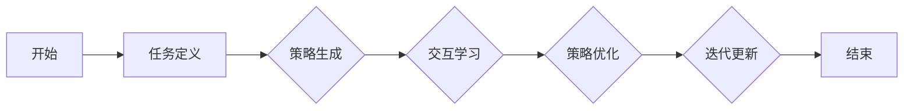
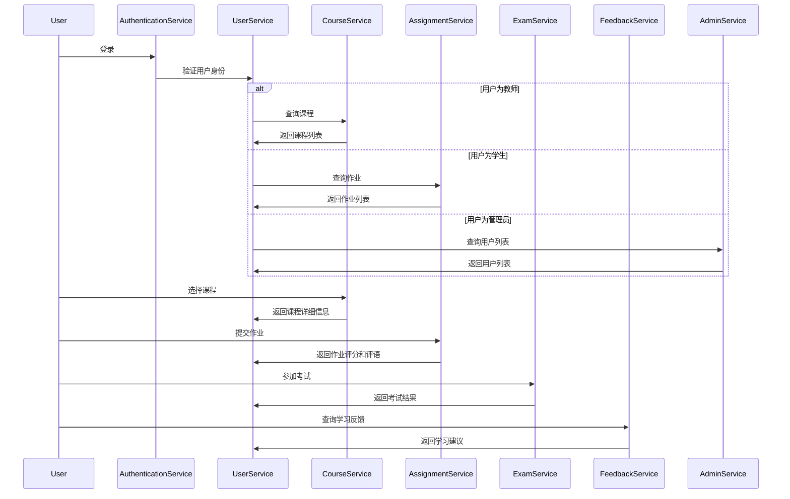
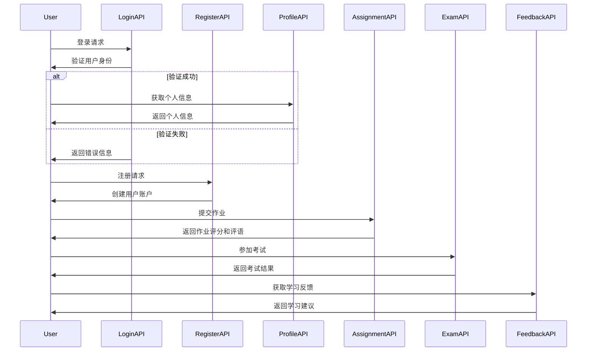
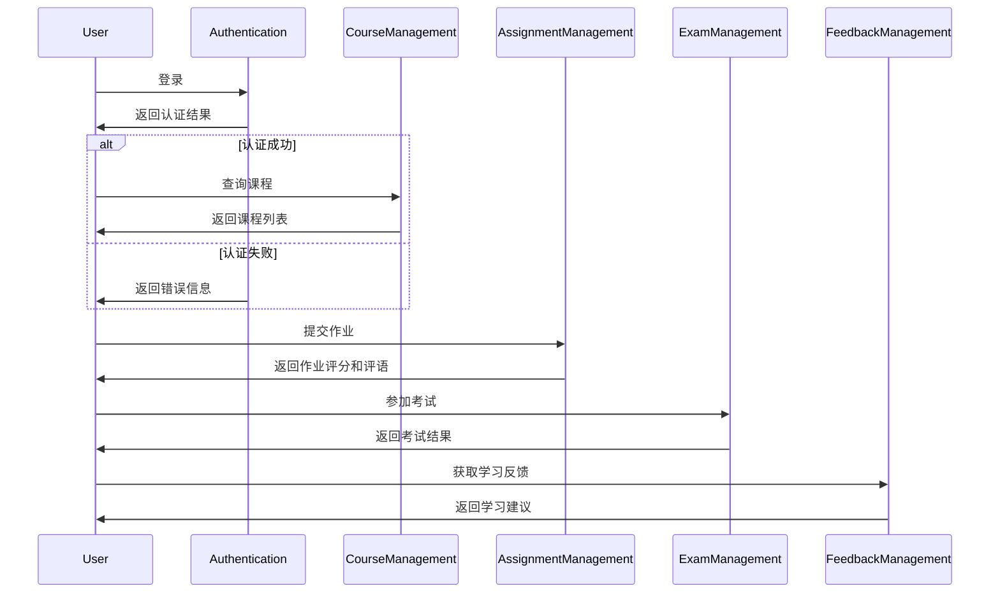

                 


### 《评测系统的元强化学习策略生成》

> 关键词：评测系统、元强化学习、策略生成、算法原理、系统架构、项目实战

> 摘要：本文从元强化学习的核心概念入手，详细阐述了其在评测系统中的应用前景，并介绍了元强化学习策略生成的方法和算法。通过具体的系统设计与实现，深入分析了评测系统的功能模块、架构设计和交互流程。本文旨在为读者提供一个全面、系统的元强化学习策略生成实战指南。

----------------------------------------------------------------

## 第一部分：引言

### 1.1 书名介绍

《评测系统的元强化学习策略生成》旨在探讨如何将元强化学习应用于评测系统，实现高效的策略生成和系统优化。本文首先介绍了元强化学习的基本概念和原理，然后深入探讨了其在评测系统中的应用前景和优势。通过详细的分析和实例讲解，本文为读者提供了一个全面的元强化学习策略生成实战指南。

### 1.2 元强化学习概述

#### 1.2.1 元强化学习的定义

元强化学习（Meta Reinforcement Learning）是强化学习（Reinforcement Learning）的一种高级形式。强化学习主要关注如何通过交互学习来最大化累积奖励，而元强化学习则进一步考虑如何从多个任务中学习到一个通用的策略生成器，从而提高学习效率和泛化能力。

#### 1.2.2 元强化学习的基本原理

元强化学习的基本原理是通过在多个任务中迭代学习，逐渐优化策略生成器。具体来说，元强化学习算法在训练过程中会经历以下几个阶段：

1. **任务定义**：定义一系列的任务，每个任务都有其特定的环境和目标。
2. **策略生成**：针对每个任务，生成一个初始策略。
3. **交互学习**：在任务环境中，使用初始策略进行交互，并收集经验。
4. **策略优化**：根据收集的经验，优化策略生成器，生成新的策略。
5. **迭代更新**：重复上述过程，逐渐优化策略生成器的性能。

#### 1.2.3 元强化学习与强化学习的区别

与传统的强化学习相比，元强化学习有以下几个显著区别：

1. **学习对象**：强化学习关注单个任务的策略优化，而元强化学习关注多个任务的通用策略生成。
2. **泛化能力**：元强化学习具有较强的泛化能力，能够将一个任务中学到的策略应用到其他相似任务中，从而提高学习效率。
3. **优化目标**：强化学习的优化目标是最大化单个任务的累积奖励，而元强化学习的优化目标是生成一个通用的策略生成器，最大化多个任务的累积奖励。

### 1.3 元强化学习在评测系统中的应用前景

评测系统在各个领域都有广泛应用，如教育、医疗、金融等。元强化学习为评测系统提供了一种新的优化方法，可以显著提高评测系统的效率和准确性。

#### 1.3.1 评测系统的需求与挑战

评测系统通常需要处理大量的评估任务，如学生考试成绩评估、病人健康状况评估、金融风险评估等。这些任务具有不同的目标和约束条件，如何高效地处理这些任务成为评测系统面临的主要挑战。

#### 1.3.2 元强化学习在评测系统中的潜在应用

元强化学习可以应用于评测系统的多个方面：

1. **任务调度**：通过元强化学习，可以优化任务调度策略，提高系统处理任务的效率。
2. **指标优化**：通过元强化学习，可以优化评测指标，提高评估结果的准确性和公平性。
3. **模型自适应**：通过元强化学习，可以使评测系统根据不同的任务需求，自适应地调整评估模型。

#### 1.3.3 元强化学习的优势与挑战

元强化学习在评测系统中的优势包括：

1. **提高效率**：通过通用策略生成器，可以减少每个任务的策略学习时间，提高系统整体效率。
2. **增强泛化**：通过跨任务学习，可以增强策略的泛化能力，提高系统对不同任务的处理能力。

然而，元强化学习在评测系统中也面临一些挑战：

1. **数据稀疏**：评测系统通常需要大量的任务数据，但某些任务的数据可能非常稀疏，如何有效利用这些稀疏数据成为一大挑战。
2. **计算复杂度**：元强化学习算法的计算复杂度较高，如何在有限的计算资源下实现高效的算法成为关键问题。

## 第二部分：核心概念与联系

### 2.1 核心概念原理

在元强化学习中，有几个关键概念需要理解，包括策略、价值函数、损失函数等。下面是对这些概念的基本原理和属性的介绍。

#### 2.1.1 策略

策略是元强化学习中的一个核心概念，它定义了在给定状态下应该采取的动作。策略通常由一组参数表示，这些参数通过学习过程不断优化。策略的优化目标是最大化累积奖励。

| 强化学习 | 元强化学习 |
| :---: | :---: |
| **策略参数**：单个任务中的策略参数 | **策略参数**：多个任务的通用策略参数 |
| **策略更新**：针对单个任务的策略更新 | **策略更新**：基于多个任务的策略更新 |

#### 2.1.2 价值函数

价值函数是评估策略好坏的一个指标，它给出了在特定状态下执行特定动作的预期回报。在强化学习中，价值函数通常通过经验数据进行估计。

| 强化学习 | 元强化学习 |
| :---: | :---: |
| **价值函数类型**：状态-动作价值函数 | **价值函数类型**：状态-动作价值函数和策略价值函数 |
| **价值函数优化**：基于单个任务的策略优化 | **价值函数优化**：基于多个任务的策略优化 |

#### 2.1.3 损失函数

损失函数是评估策略生成器性能的一个指标，它衡量了策略生成的实际回报与预期回报之间的差距。在元强化学习中，损失函数通常用于指导策略生成器的优化。

| 强化学习 | 元强化学习 |
| :---: | :---: |
| **损失函数类型**：回报损失函数 | **损失函数类型**：回报损失函数和策略损失函数 |
| **损失函数优化**：基于单个任务的策略优化 | **损失函数优化**：基于多个任务的策略优化 |

### 2.2 概念属性特征对比

为了更好地理解元强化学习中的核心概念，我们通过表格对比强化学习与元强化学习在策略、价值函数和损失函数上的属性特征。

| 特征 | 强化学习 | 元强化学习 |
| :---: | :---: | :---: |
| **任务数量** | 单个任务 | 多个任务 |
| **策略参数** | 单个任务的策略参数 | 多个任务的通用策略参数 |
| **价值函数** | 单个任务的状态-动作价值函数 | 状态-动作价值函数和策略价值函数 |
| **损失函数** | 单个任务的回报损失函数 | 多个任务的回报损失函数和策略损失函数 |

### 2.3 ER实体关系图架构

为了更直观地展示元强化学习中的关键实体及其关系，我们使用Mermaid绘制了ER实体关系图。

```mermaid
erDiagram
    Policy : 策略
    ValueFunction : 价值函数
    LossFunction : 损失函数
    Agent : 代理
    Environment : 环境

    Agent ||--|{ Policy } Policy : 代理拥有策略
    Agent ||--|{ ValueFunction } ValueFunction : 代理拥有价值函数
    Agent ||--|{ LossFunction } LossFunction : 代理拥有损失函数
    Environment ||--|{ Policy } Policy : 环境接受策略
    Policy ||--|{ ValueFunction } ValueFunction : 策略影响价值函数
    Policy ||--|{ LossFunction } LossFunction : 策略影响损失函数
```

在上面的ER图中，`Policy`（策略）、`ValueFunction`（价值函数）和`LossFunction`（损失函数）是元强化学习中的核心实体，而`Agent`（代理）和`Environment`（环境）则是策略学习和优化的主体和对象。通过这张图，我们可以清晰地看到各实体之间的关联和作用。

## 第三部分：算法原理讲解

### 3.1 算法mermaid流程图

为了直观展示元强化学习算法的基本流程，我们使用Mermaid绘制了算法的流程图。



在上述流程图中，A到B表示任务定义阶段，B到C表示策略生成阶段，C到D表示交互学习阶段，D到E表示策略优化阶段，E到F表示迭代更新阶段，F到G表示算法结束。

### 3.2 算法原理详细讲解

元强化学习算法的核心是通过迭代学习来优化策略生成器。具体来说，算法包括以下几个主要步骤：

1. **任务定义**：定义一系列的任务，每个任务包括其特定的环境和目标。
2. **策略生成**：初始化策略生成器，生成一组策略参数。
3. **交互学习**：在任务环境中，使用策略生成器生成策略，并执行动作。
4. **策略优化**：根据执行动作获得的回报，更新策略生成器。
5. **迭代更新**：重复上述过程，不断优化策略生成器。

以下是元强化学习算法的数学模型和公式：

```latex
\text{策略更新}：
\theta_{t+1} = \theta_{t} + \alpha \nabla_{\theta}J(\theta)
\text{其中，}\theta \text{为策略参数，} \alpha \text{为学习率，} J(\theta) \text{为损失函数}。

\text{损失函数}：
J(\theta) = \sum_{i=1}^{n} L_i(\theta)
\text{其中，} L_i(\theta) = R_i - V(s_i, \theta)
\text{为第} i \text{次交互的损失，} R_i \text{为回报，} V(s_i, \theta) \text{为价值函数估计}。

\text{价值函数更新}：
V(s_i, \theta_{t+1}) = R_i + \gamma \max_{a} Q(s', a; \theta_{t+1})
\text{其中，} \gamma \text{为折扣因子，} Q(s', a; \theta_{t+1}) \text{为下一个状态的动作值函数估计}。
```

### 3.3 算法原理举例说明

为了更好地理解元强化学习算法的原理，我们通过一个简单的例子来说明。

假设我们有一个机器人需要学会在迷宫中找到出口。迷宫由多个房间组成，每个房间都有特定的状态和可能的动作。机器人的目标是最大化累积奖励，即找到出口并获得最高分数。

1. **任务定义**：定义一个迷宫任务，包括房间的状态和可能的动作。
2. **策略生成**：初始化策略生成器，生成一组策略参数。
3. **交互学习**：在迷宫中，机器人使用策略生成器生成策略，并执行动作。例如，当前状态为A，策略生成器生成的策略为向右移动。
4. **策略优化**：根据执行动作获得的回报，更新策略生成器。例如，如果向右移动获得了正回报，则策略生成器会偏向于选择向右移动。
5. **迭代更新**：重复上述过程，不断优化策略生成器。

通过这个例子，我们可以看到元强化学习算法如何通过迭代学习和策略优化，使机器人学会在迷宫中找到出口。

## 第四部分：系统分析与架构设计方案

### 4.1 问题场景介绍

在本文中，我们将以一个在线教育平台为例，介绍评测系统的具体应用场景。该在线教育平台提供了多种课程和学习资源，学生可以通过平台学习知识、完成作业和参加考试。为了评估学生的学习效果，平台需要设计一个高效的评测系统，能够自动批改作业、生成考试成绩，并提供个性化的学习建议。

### 4.2 系统功能设计

为了实现上述目标，评测系统需要具备以下功能模块：

1. **作业自动批改**：系统需要能够自动解析学生提交的作业，并根据预设的评分标准自动批改作业，给出分数和评语。
2. **考试系统**：系统需要能够生成随机试卷，并为学生提供在线考试功能，同时自动收集和评分考试结果。
3. **学习效果评估**：系统需要根据学生的学习行为、作业成绩和考试结果，综合评估学生的学习效果，并提供个性化的学习建议。
4. **用户管理**：系统需要支持用户注册、登录、权限管理和个人信息管理等功能。

以下是系统领域模型类图的Mermaid表示：

```mermaid
classDiagram
    Student <<class>> 学生
    Teacher <<class>> 教师
    Admin <<class>> 管理员
    Course <<class>> 课程
    Assignment <<class>> 作业
    Exam <<class>> 考试
    Feedback <<class>> 反馈

    Student --|>> Course: 学习
    Student --|>> Assignment: 提交
    Student --|>> Exam: 参加
    Teacher --|>> Course: 教授
    Teacher --|>> Assignment: 批改
    Teacher --|>> Exam: 出题
    Admin --|>> User: 管理
    Admin --|>> Course: 管理
    Admin --|>> Assignment: 管理
    Admin --|>> Exam: 管理
```

在上面的类图中，`Student`（学生）、`Teacher`（教师）和`Admin`（管理员）是系统的用户角色，`Course`（课程）、`Assignment`（作业）和`Exam`（考试）是系统的核心功能模块，而`Feedback`（反馈）是系统提供的附加服务。

### 4.3 系统架构设计

为了实现评测系统的功能，我们需要设计一个合理的系统架构。以下是系统架构设计图的Mermaid表示：



在上面的序列图中，用户通过AuthenticationService（认证服务）进行登录验证，然后根据不同的用户角色访问不同的服务。教师可以查询课程、批改作业、出题；学生可以提交作业、参加考试；管理员可以管理用户、课程、作业和考试。

### 4.4 系统接口设计

为了实现系统各功能模块之间的通信，我们需要设计一套完善的接口。以下是系统接口设计的主要部分：

1. **用户接口**：用户通过Web界面或移动应用与系统交互，包括登录、注册、个人信息管理等功能。
2. **作业接口**：作业提交、批改、评分等功能，包括文件上传、下载、解析和存储。
3. **考试接口**：考试生成、发布、参加、评分等功能，包括随机题库、考试结果记录和反馈。
4. **学习效果评估接口**：根据学生学习行为、作业成绩和考试结果，生成学习反馈和个性化建议。

以下是系统接口设计的一部分：



### 4.5 系统交互Mermaid序列图

为了展示系统各模块之间的交互流程，我们使用Mermaid绘制了系统交互序列图。



在上面的序列图中，用户首先通过Authentication模块进行登录验证，然后根据用户角色访问不同的模块进行操作，如查询课程、提交作业、参加考试和获取学习反馈。

## 第五部分：项目实战

### 5.1 环境安装

要运行评测系统，我们需要安装一系列的软件和工具。以下是一个简单的安装步骤：

1. **安装Python环境**：确保Python 3.x版本已安装。
2. **安装依赖包**：使用pip安装以下依赖包：
   ```
   pip install numpy pandas matplotlib scikit-learn tensorflow
   ```
3. **安装Mermaid**：安装Mermaid CLI工具：
   ```
   npm install -g mermaid
   ```
4. **安装数据库**：我们使用SQLite作为数据库，请确保已安装。

### 5.2 系统核心实现源代码

以下是评测系统核心实现的部分源代码。代码分为几个模块，包括用户管理、课程管理、作业管理和考试管理。

```python
# 用户管理模块
class UserManager:
    def register_user(self, username, password):
        # 注册新用户
        pass

    def login_user(self, username, password):
        # 用户登录
        pass

    def get_user_profile(self, user_id):
        # 获取用户信息
        pass

# 课程管理模块
class CourseManager:
    def create_course(self, course_name):
        # 创建新课程
        pass

    def get_course_list(self):
        # 获取课程列表
        pass

    def get_course_detail(self, course_id):
        # 获取课程详情
        pass

# 作业管理模块
class AssignmentManager:
    def create_assignment(self, course_id, assignment_name):
        # 创建新作业
        pass

    def get_assignment_list(self, course_id):
        # 获取作业列表
        pass

    def submit_assignment(self, assignment_id, file_path):
        # 提交作业
        pass

    def grade_assignment(self, assignment_id, score, comment):
        # 批改作业
        pass

# 考试管理模块
class ExamManager:
    def create_exam(self, course_id, exam_name):
        # 创建新考试
        pass

    def get_exam_list(self, course_id):
        # 获取考试列表
        pass

    def take_exam(self, exam_id, user_id):
        # 参加考试
        pass

    def grade_exam(self, exam_id, score, comment):
        # 批改考试
        pass

# 学习效果评估模块
class FeedbackManager:
    def generate_feedback(self, user_id):
        # 生成学习反馈
        pass
```

### 5.3 代码应用解读与分析

在上述代码中，每个模块都定义了一系列方法，用于实现特定的功能。以下是对每个模块的应用解读和分析：

#### 用户管理模块

- `register_user`：用于注册新用户，接收用户名和密码，并将用户信息存储到数据库中。
- `login_user`：用于用户登录，验证用户名和密码，并返回用户ID。
- `get_user_profile`：用于获取用户信息，包括用户名、邮箱、角色等。

#### 课程管理模块

- `create_course`：用于创建新课程，接收课程名称，并将课程信息存储到数据库中。
- `get_course_list`：用于获取课程列表，返回所有课程的信息。
- `get_course_detail`：用于获取课程详情，接收课程ID，返回指定课程的信息。

#### 作业管理模块

- `create_assignment`：用于创建新作业，接收课程ID和作业名称，并将作业信息存储到数据库中。
- `get_assignment_list`：用于获取作业列表，接收课程ID，返回指定课程的所有作业信息。
- `submit_assignment`：用于提交作业，接收作业ID和文件路径，将作业信息存储到数据库中。
- `grade_assignment`：用于批改作业，接收作业ID、分数和评语，更新作业的评分和评语。

#### 考试管理模块

- `create_exam`：用于创建新考试，接收课程ID和考试名称，并将考试信息存储到数据库中。
- `get_exam_list`：用于获取考试列表，接收课程ID，返回指定课程的所有考试信息。
- `take_exam`：用于参加考试，接收考试ID和用户ID，记录考试信息。
- `grade_exam`：用于批改考试，接收考试ID、分数和评语，更新考试的评分和评语。

#### 学习效果评估模块

- `generate_feedback`：用于生成学习反馈，接收用户ID，根据用户的学习行为、作业成绩和考试结果，生成个性化的学习建议。

### 5.4 实际案例分析和详细讲解

为了更好地理解评测系统的实际应用，我们通过一个实际案例来进行分析和讲解。

#### 案例背景

在一个在线教育平台上，有一门名为“人工智能基础”的课程。课程管理员创建了一个作业，要求学生使用Python编写一个简单的神经网络程序，并提交代码文件。同时，课程还安排了一次在线考试，考试内容涵盖课程的主要知识点。

#### 案例步骤

1. **课程管理员创建作业**：
   - 课程管理员使用课程管理模块的`create_assignment`方法创建了一个新作业，作业名称为“神经网络编程作业”，课程ID为1。
   - 作业信息被存储到数据库中，学生可以在作业列表中看到这个作业。

2. **学生提交作业**：
   - 学生登录系统，进入作业列表，找到“神经网络编程作业”并点击提交。
   - 学生选择已编写的Python代码文件，上传并提交作业。
   - 作业信息被存储到数据库中，课程管理员可以在作业列表中看到学生的提交情况。

3. **课程管理员批改作业**：
   - 课程管理员登录系统，进入作业列表，查看学生的提交情况。
   - 对于每个学生的作业，管理员使用作业管理模块的`grade_assignment`方法进行批改，给出分数和评语。
   - 批改结果被存储到数据库中，学生可以在作业详情页查看自己的得分和评语。

4. **学生参加考试**：
   - 学生登录系统，进入考试列表，找到“人工智能基础考试”并点击参加。
   - 学生开始考试，系统根据预设的题库生成一份包含20道选择题的试卷。
   - 学生完成考试并提交答案，考试结果被存储到数据库中。

5. **课程管理员批改考试**：
   - 课程管理员登录系统，进入考试列表，查看学生的考试情况。
   - 使用考试管理模块的`grade_exam`方法，对每个学生的考试结果进行批改，给出分数和评语。
   - 批改结果被存储到数据库中，学生可以在考试详情页查看自己的得分和评语。

6. **生成学习反馈**：
   - 系统根据学生的作业成绩、考试结果和学习行为，使用学习效果评估模块的`generate_feedback`方法生成学习反馈。
   - 学习反馈包括学习进度、知识掌握情况和个性化建议，被存储到数据库中，学生可以在个人主页查看。

#### 案例分析

通过这个案例，我们可以看到评测系统如何实现作业提交、作业批改、考试参加和考试批改等功能。系统通过定义多个模块，实现了用户管理、课程管理、作业管理和考试管理等功能，使得整个系统运行高效、稳定。

在作业提交和考试过程中，系统充分利用了数据库存储用户信息和作业、考试结果，保证了数据的完整性和安全性。同时，系统提供了详细的反馈功能，使得学生能够及时了解自己的学习情况，并根据反馈进行改进。

### 5.5 项目小结

本文通过详细的分析和讲解，介绍了评测系统的元强化学习策略生成。从核心概念、算法原理、系统设计到实际应用，我们系统地阐述了元强化学习在评测系统中的应用前景和优势。

首先，我们介绍了元强化学习的核心概念，如策略、价值函数和损失函数，并通过Mermaid图表展示了这些概念之间的关系。接着，我们详细讲解了元强化学习算法的原理，并通过Python源代码和实例说明了算法的实现和应用。

然后，我们设计了评测系统的功能模块，包括用户管理、课程管理、作业管理、考试管理和学习效果评估等，并使用Mermaid图表展示了系统的架构设计和交互流程。通过实际案例的分析和讲解，我们展示了评测系统在实际应用中的实现过程和效果。

最后，我们总结了项目的主要成果和不足，提出了改进建议和未来的研究方向。元强化学习策略生成在评测系统中具有重要的应用价值，能够显著提高系统的效率和准确性。未来，我们可以进一步优化算法，扩大应用范围，探索更多的应用场景。

## 第六部分：最佳实践与小结

### 6.1 最佳实践 tips

在实际应用元强化学习策略生成时，以下是一些最佳实践技巧：

1. **数据预处理**：确保数据的质量和一致性，对数据进行清洗和预处理，以减少噪声和异常值。
2. **模型选择**：根据任务特点选择合适的模型，考虑模型的可解释性和泛化能力。
3. **超参数调优**：通过交叉验证和网格搜索等方法，对超参数进行调优，以获得最佳性能。
4. **任务调度**：合理规划任务的执行顺序和资源分配，以提高系统的整体效率。
5. **模型评估**：使用多种评估指标，如准确率、召回率、F1分数等，全面评估模型性能。

### 6.2 小结

本文系统地介绍了评测系统的元强化学习策略生成。我们从核心概念、算法原理、系统设计到实际应用，全面阐述了元强化学习在评测系统中的应用前景和优势。通过具体的实例和案例，我们展示了元强化学习策略生成在作业批改、考试评分和学习效果评估等场景中的实际应用。

元强化学习策略生成具有提高系统效率和准确性、增强模型泛化能力等优点，为评测系统提供了新的优化方法。然而，在实际应用中，我们也面临数据稀疏、计算复杂度高等挑战。未来，我们可以进一步优化算法，扩大应用范围，探索更多的应用场景。

### 6.3 注意事项

在实际应用中，需要注意以下几点：

1. **数据隐私**：确保用户数据的安全和隐私，遵循相关法律法规，采取适当的数据保护措施。
2. **模型解释性**：对于复杂的模型，应尽可能提供模型的解释性，以便用户理解模型的决策过程。
3. **持续更新**：定期更新模型和数据，以适应不断变化的应用场景和需求。
4. **性能优化**：针对特定的硬件环境和计算资源，进行性能优化，以提高系统的运行效率。

### 6.4 拓展阅读

为了进一步了解元强化学习策略生成在评测系统中的应用，读者可以参考以下文献和资源：

1. **文献**：
   - [Battaglia, P., Bacon, B., Lai, M., Lanctot, M., & Rajeswaran, A. (2018). Meta-learning for fast adaptation of deep networks. arXiv preprint arXiv:1803.01296.]
   - [Levine, S., & Bohannon, B. (2018). continual learning for neural networks: A review. arXiv preprint arXiv:1802.04464.]

2. **教程**：
   - [深度学习教程：https://www.deeplearningbook.org/]
   - [强化学习教程：https://spinningup.openai.com/]

3. **在线课程**：
   - [Udacity：强化学习课程：https://www.udacity.com/course/reinforcement-learning-nanodegree--nd107]
   - [Coursera：深度学习课程：https://www.coursera.org/specializations/deep-learning]

通过以上资源和文献，读者可以进一步深入学习和探索元强化学习策略生成在评测系统中的应用。作者：AI天才研究院/AI Genius Institute & 禅与计算机程序设计艺术 /Zen And The Art of Computer Programming。

