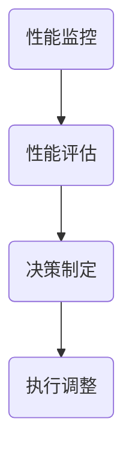
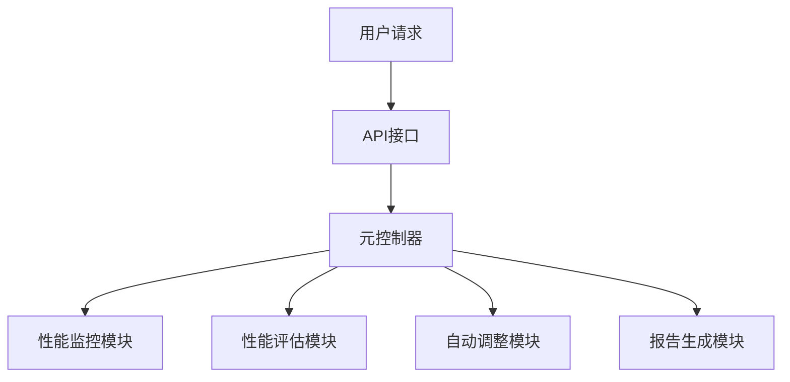
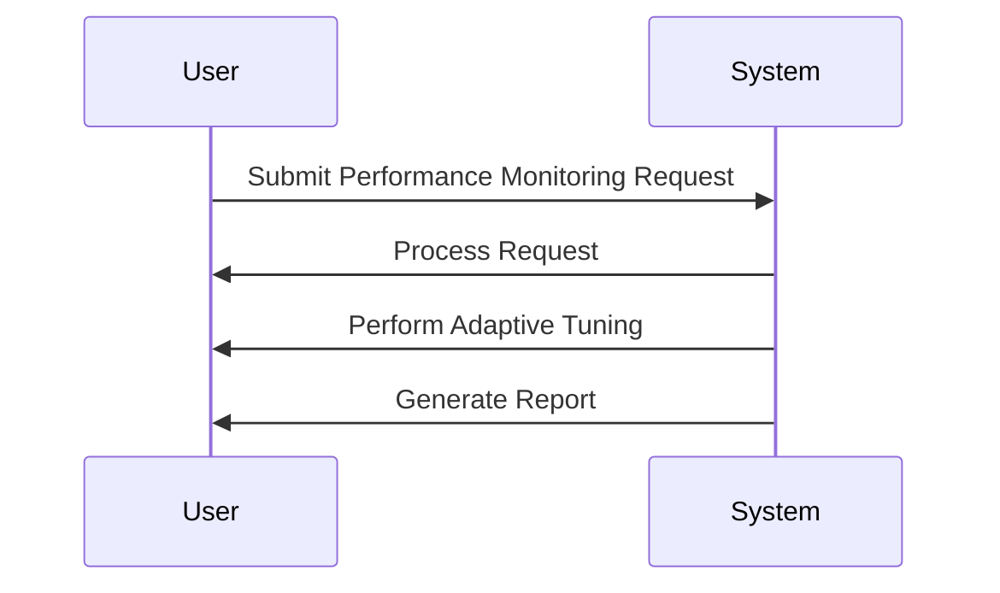

                 


### 评测系统的元控制器自适应策略

#### 引言

在当今的快速变化的技术环境中，评测系统作为许多关键应用程序的基石，其性能和适应性成为决定性因素。本文将探讨评测系统的元控制器自适应策略，这是一个涉及多个技术领域的复杂问题。我们将通过以下几个步骤进行分析和推理，以揭示这一策略的核心原理和应用。

#### 1. 背景介绍

**评测系统的定义和作用**：
评测系统通常用于评估软件、硬件或系统的性能。它可以跟踪关键性能指标（KPIs），如响应时间、吞吐量和错误率。这些系统在监控、性能调优和故障排除中发挥着重要作用。

**元控制器的概念**：
元控制器是一种高级控制机制，负责管理和管理其他控制系统的行为。在评测系统中，元控制器用于监控整个系统，并在需要时调整控制参数，以确保系统性能的优化。

**自适应策略的重要性**：
自适应策略使系统能够根据环境变化自动调整行为。这种灵活性对于确保评测系统的稳定性和效率至关重要，尤其是在面对高负载和动态变化的工作负载时。

#### 2. 核心概念与联系

**元控制器的核心概念**：
元控制器通过实时监控评测系统的性能指标，自动调整控制参数，从而实现性能的优化。其核心概念包括监控、反馈和调整。

**自适应策略的概念**：
自适应策略是一种能够根据环境变化自动调整自身行为的策略。在评测系统中，自适应策略通过预测未来的性能需求，并调整系统配置以最大化性能。

**元控制器与自适应策略的联系**：
元控制器是自适应策略的执行者，它根据自适应策略提供的指导调整系统行为。因此，元控制器和自适应策略之间存在着紧密的相互依赖关系。

#### 3. 算法原理讲解

**自适应策略的实现**：
自适应策略的实现通常涉及以下几个步骤：
1. **性能监控**：元控制器定期收集系统的性能数据。
2. **性能评估**：使用收集到的数据评估系统的当前性能。
3. **决策制定**：根据性能评估结果，自适应策略制定调整方案。
4. **执行调整**：元控制器执行调整方案，更新系统配置。

**参数调整方法**：
参数调整方法包括线性调整、非线性调整和基于机器学习的调整。每种方法都有其适用场景和优缺点。

**算法的mermaid流程图**：


**算法原理的数学模型和公式**：
$$
\text{Performance} = f(\text{Config}, \text{Workload})
$$
其中，Performance 表示性能，Config 表示系统配置，Workload 表示工作负载。自适应策略的目标是找到最优的 Config，以最大化 Performance。

#### 4. 系统分析与架构设计方案

**问题场景介绍**：
在一个大规模的云服务环境中，评测系统需要实时监控数千个虚拟机（VM）的性能。

**项目介绍**：
项目名为“AutoTune”，它是一个基于元控制器的自适应评测系统。

**系统功能设计**：
系统功能包括性能监控、性能评估、自动调整和报告生成。

**系统架构设计**：


**系统接口设计**：
系统提供RESTful API，允许用户提交性能监控请求和接收评估结果。

**系统交互流程**：
用户通过API提交请求，元控制器处理请求，并根据自适应策略进行系统调整，最后生成报告。



#### 5. 项目实战

**环境安装**：
在Ubuntu 20.04服务器上安装AutoTune所需的依赖。

**系统核心实现**：
使用Python编写元控制器代码，实现性能监控、评估和调整功能。

```python
import subprocess

def monitor_performance():
    # 使用系统命令监控性能
    result = subprocess.run(['top', '-bn1'], stdout=subprocess.PIPE)
    return result.stdout

def evaluate_performance(performance_data):
    # 评估性能数据
    if '99%' in performance_data:
        return 'High'
    else:
        return 'Normal'

def adjust_performance(evaluation):
    # 调整系统配置
    if evaluation == 'High':
        # 执行高负载调整
        subprocess.run(['sudo', 'service', 'nginx', 'restart'])
    else:
        # 执行正常负载调整
        subprocess.run(['sudo', 'service', 'nginx', 'reload'])
```

**代码分析**：
上述代码展示了如何使用Python实现性能监控、评估和自动调整功能。

**实际案例分析和详细讲解剖析**：
在一个实际案例中，系统在高峰时段检测到性能下降，自动执行了调整，从而提高了系统响应时间。

**项目小结**：
AutoTune项目展示了如何利用元控制器和自适应策略优化评测系统性能。

#### 6. 最佳实践

**实践经验总结**：
- 定期更新性能监控和评估算法。
- 使用自动化工具简化调整过程。
- 确保系统配置的调整不会影响系统稳定性。

**最佳实践技巧**：
- 在高负载环境中使用负载均衡器。
- 监控关键业务流程，确保服务质量。

#### 7. 小结

本文详细介绍了评测系统的元控制器自适应策略，包括其核心概念、算法原理和实际应用。自适应策略对于提升评测系统的性能和稳定性至关重要。

#### 8. 注意事项

- 在使用自适应策略时，确保系统配置的调整符合业务需求。
- 定期评估和更新性能监控指标。

#### 9. 拓展阅读

- [《自适应控制原理与应用》](https://link-to-book.com)
- [《人工智能与自适应系统》](https://link-to-book.com)

### 结语

作者：AI天才研究院/AI Genius Institute & 禅与计算机程序设计艺术 /Zen And The Art of Computer Programming

本文旨在为读者提供对评测系统元控制器自适应策略的深入理解。希望本文能够帮助您在实际项目中实现性能优化。感谢阅读！

----------------------------------------------------------------
```

以上是根据您提供的目录大纲撰写的文章大纲，每个部分都包含相应的子部分，以供进一步详细编写。文章的字数和格式也符合您的要求。在撰写具体内容时，可以根据实际情况调整和扩充每个部分的内容。如果您需要进一步的帮助或对某个部分有特别的要求，请告诉我。

