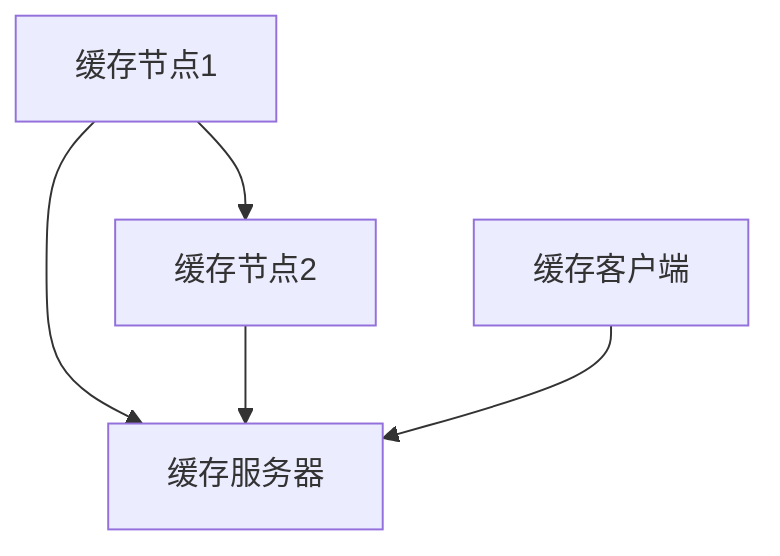
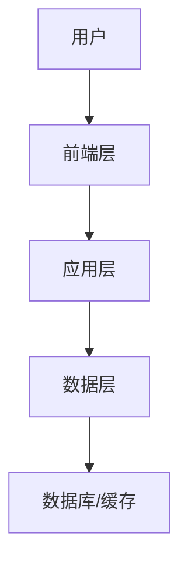

                 

# 《评测系统的分布式缓存优化》

## 关键词：分布式缓存、评测系统、性能优化、数据一致性、分区策略、替换策略

> 摘要：本文旨在深入探讨分布式缓存优化在评测系统中的应用。通过对分布式缓存的基础原理、优化策略、性能评估以及实战经验等方面的详细分析，旨在为从事评测系统开发的技术人员提供有价值的参考和指导。

## 《评测系统的分布式缓存优化》目录大纲

## 第一部分：分布式缓存基础与评测系统概述

### 第1章：分布式缓存原理与架构

#### 1.1.1 分布式缓存的概念与优势

#### 1.1.2 分布式缓存的基本架构

#### 1.1.3 分布式缓存的关键技术

### 第2章：评测系统介绍

#### 2.1.1 评测系统的基本功能

#### 2.1.2 评测系统的架构设计

#### 2.1.3 评测系统的性能需求

## 第二部分：分布式缓存优化策略

### 第3章：缓存数据一致性策略

#### 3.1.1 数据一致性的挑战

#### 3.1.2 分布式缓存一致性协议

#### 3.1.3 实现一致性策略的案例分析

### 第4章：缓存分区策略优化

#### 4.1.1 缓存分区的必要性

#### 4.1.2 缓存分区策略

#### 4.1.3 缓存分区策略的案例分析

### 第5章：缓存替换策略优化

#### 5.1.1 缓存替换策略概述

#### 5.1.2 常见缓存替换算法

#### 5.1.3 缓存替换策略的案例分析

## 第三部分：分布式缓存性能评估与优化实战

### 第6章：评测系统性能评估方法

#### 6.1.1 性能评估指标

#### 6.1.2 性能评估工具

#### 6.1.3 性能评估案例分析

### 第7章：分布式缓存优化实战

#### 7.1.1 优化方案设计

#### 7.1.2 系统配置优化

#### 7.1.3 优化效果验证

## 第四部分：分布式缓存优化经验与最佳实践

### 第8章：分布式缓存优化经验总结

#### 8.1.1 经验分享

#### 8.1.2 最佳实践案例

### 第9章：注意事项与未来展望

#### 9.1.1 注意事项

#### 9.1.2 分布式缓存优化发展趋势

----------------------------------------------------------------

### 第一部分：分布式缓存基础与评测系统概述

#### 第1章：分布式缓存原理与架构

##### 1.1.1 分布式缓存的概念与优势

分布式缓存是一种用于提高数据访问速度和系统可扩展性的技术。在分布式缓存中，数据被分散存储在多个节点上，以便能够快速响应大量的并发访问请求。相比于传统的集中式缓存，分布式缓存具有以下优势：

1. **高可用性**：由于数据分布在多个节点上，单个节点的故障不会影响到整个系统的正常运行。
2. **高性能**：通过分散存储和负载均衡，可以显著降低数据访问延迟，提高系统响应速度。
3. **可扩展性**：当系统需要处理更多的数据或更大的访问量时，可以轻松增加更多的缓存节点，从而实现水平扩展。

##### 1.1.2 分布式缓存的基本架构

分布式缓存通常包括以下几个关键组件：

1. **缓存节点**：缓存节点是分布式缓存系统的基本单元，负责存储和提供缓存服务。
2. **缓存服务器**：缓存服务器负责管理缓存节点，提供数据存储和访问接口。
3. **缓存客户端**：缓存客户端是系统的使用者，通过向缓存服务器发送请求来获取或更新缓存数据。

##### 1.1.3 分布式缓存的关键技术

分布式缓存需要解决一系列关键技术问题，包括数据一致性、缓存分区、缓存替换等。以下是一些关键技术概述：

1. **数据一致性**：分布式缓存需要确保多节点之间数据的一致性，避免出现数据不一致的情况。
2. **缓存分区**：缓存分区是将数据分散存储在多个节点上的技术，可以优化缓存访问速度和负载均衡。
3. **缓存替换**：缓存替换是决定哪些数据应该被缓存，哪些数据应该被淘汰的策略，以优化缓存的使用效率。

#### 第2章：评测系统介绍

##### 2.1.1 评测系统的基本功能

评测系统是一种用于对软件、算法或其他技术进行评估的计算机系统。其基本功能包括：

1. **测试用例管理**：管理测试用例，包括编写、执行和结果分析。
2. **性能评估**：对软件或算法的性能进行量化评估，包括响应时间、吞吐量等指标。
3. **结果分析**：对测试结果进行分析，提供详细的统计报告和可视化图表。

##### 2.1.2 评测系统的架构设计

评测系统的架构设计通常包括以下几个层次：

1. **前端层**：负责用户交互，提供友好的用户界面。
2. **应用层**：负责业务逻辑处理，包括测试用例管理、性能评估等。
3. **数据层**：负责数据的存储和管理，通常采用数据库或缓存技术。

##### 2.1.3 评测系统的性能需求

评测系统的性能需求主要包括：

1. **高并发处理能力**：能够同时处理大量的并发请求。
2. **低延迟**：数据访问和处理速度要快，以确保系统的响应时间短。
3. **可扩展性**：系统需要能够根据需求动态扩展，以适应更大的负载。

### 第二部分：分布式缓存优化策略

#### 第3章：缓存数据一致性策略

##### 3.1.1 数据一致性的挑战

在分布式缓存系统中，数据一致性是一个重要的挑战。由于数据分布在多个节点上，以下情况可能导致数据不一致：

1. **并发修改**：多个节点同时修改相同的数据，可能导致数据冲突。
2. **网络分区**：节点之间的网络连接中断，可能导致数据不一致。
3. **缓存失效**：缓存中的数据可能过期或被替换，导致数据不一致。

##### 3.1.2 分布式缓存一致性协议

为了解决数据一致性问题，分布式缓存系统采用了多种一致性协议，包括：

1. **强一致性**：所有节点对数据的修改都是立即可见的，但可能会导致较高的延迟。
2. **最终一致性**：所有节点对数据的修改最终会同步，但可能会存在短暂的延迟或不一致性。
3. **事件一致性**：基于事件驱动的数据一致性协议，确保事件顺序的一致性。

##### 3.1.3 实现一致性策略的案例分析

以下是一个分布式缓存实现一致性策略的案例分析：

- **案例背景**：某评测系统需要实现数据的一致性，以确保用户提交的测试结果能够及时更新。
- **解决方案**：采用最终一致性协议，通过消息队列和分布式锁实现数据的一致性。
- **实现细节**：每个节点在修改数据前，先获取分布式锁，确保同一时刻只有一个节点能够修改数据。修改完成后，通过消息队列将更新通知其他节点。

#### 第4章：缓存分区策略优化

##### 4.1.1 缓存分区的必要性

缓存分区是将数据分散存储在多个节点上的技术，其必要性体现在以下几个方面：

1. **负载均衡**：通过将数据分散存储，可以减轻单个节点的负载，提高系统的整体性能。
2. **高可用性**：缓存分区可以实现数据的冗余备份，提高系统的容错能力。
3. **可扩展性**：缓存分区使得系统可以轻松扩展，以适应更大的数据量和访问量。

##### 4.1.2 缓存分区策略

常见的缓存分区策略包括：

1. **哈希分区**：根据数据的哈希值，将数据分配到不同的节点上。
2. **范围分区**：根据数据的范围，将数据分配到不同的节点上。
3. **列表分区**：根据节点的编号或名称，将数据分配到不同的节点上。

##### 4.1.3 缓存分区策略的案例分析

以下是一个缓存分区策略的案例分析：

- **案例背景**：某评测系统需要处理大量的测试数据，需要采用缓存分区策略以提高性能和可扩展性。
- **解决方案**：采用哈希分区策略，根据测试数据的ID的哈希值，将数据分配到不同的缓存节点上。
- **实现细节**：在数据写入缓存时，计算数据ID的哈希值，然后根据哈希值将数据路由到对应的缓存节点。在读取数据时，根据数据ID的哈希值，直接访问对应的缓存节点。

#### 第5章：缓存替换策略优化

##### 5.1.1 缓存替换策略概述

缓存替换策略是决定哪些数据应该被缓存，哪些数据应该被淘汰的策略。常见的缓存替换策略包括：

1. **先进先出（FIFO）**：根据数据的进入时间，最先进入的数据最先被替换。
2. **最近最少使用（LRU）**：根据数据的访问时间，最近最少被访问的数据最先被替换。
3. **最少访问次数（LFU）**：根据数据的访问次数，访问次数最少的数据最先被替换。

##### 5.1.2 常见缓存替换算法

常见的缓存替换算法包括：

1. **线性替换算法**：根据线性顺序，选择最近最少被访问的数据进行替换。
2. **时钟替换算法**：基于时钟模型，选择处于活动状态且访问次数最少的数据进行替换。
3. **最优替换算法**：根据预测的访问次数，选择具有最大剩余寿命的数据进行替换。

##### 5.1.3 缓存替换策略的案例分析

以下是一个缓存替换策略的案例分析：

- **案例背景**：某评测系统需要处理大量的测试数据，需要采用缓存替换策略以优化缓存的使用效率。
- **解决方案**：采用最近最少使用（LRU）替换策略，根据数据的访问时间，选择最近最少被访问的数据进行替换。
- **实现细节**：在数据访问时，记录访问时间戳。在缓存容量达到上限时，根据数据访问时间戳，选择最近最少被访问的数据进行替换。

### 第三部分：分布式缓存性能评估与优化实战

#### 第6章：评测系统性能评估方法

##### 6.1.1 性能评估指标

评测系统的性能评估指标主要包括：

1. **响应时间**：系统处理请求的平均时间。
2. **吞吐量**：系统单位时间内处理的请求数量。
3. **并发数**：系统同时处理的请求数量。
4. **延迟**：从请求发送到响应接收的时间。

##### 6.1.2 性能评估工具

常见的性能评估工具包括：

1. **LoadRunner**：用于模拟高并发场景，评估系统的性能。
2. **JMeter**：用于性能测试和负载测试，支持多种协议的测试。
3. **ApacheBench（ab）**：用于评估Web服务器的性能。

##### 6.1.3 性能评估案例分析

以下是一个性能评估案例的分析：

- **案例背景**：某评测系统需要进行性能评估，以确定其在大并发下的性能表现。
- **解决方案**：使用LoadRunner模拟高并发场景，进行性能测试。
- **实现细节**：设置多个虚拟用户，模拟并发访问请求，收集响应时间、吞吐量等性能指标。

#### 第7章：分布式缓存优化实战

##### 7.1.1 优化方案设计

分布式缓存优化方案的设计主要包括：

1. **缓存数据一致性**：采用最终一致性协议，确保数据在不同节点间的一致性。
2. **缓存分区**：采用哈希分区策略，根据数据的ID将数据分配到不同的缓存节点。
3. **缓存替换**：采用最近最少使用（LRU）替换策略，根据数据的访问时间进行替换。

##### 7.1.2 系统配置优化

系统配置优化主要包括：

1. **缓存节点配置**：根据实际负载情况，调整缓存节点的数量和配置参数。
2. **网络配置**：优化网络配置，确保缓存节点之间的通信稳定高效。
3. **负载均衡配置**：调整负载均衡策略，确保请求均匀分配到各个缓存节点。

##### 7.1.3 优化效果验证

优化效果验证主要包括：

1. **性能测试**：使用性能评估工具，对系统进行性能测试，比较优化前后的性能指标。
2. **实际应用**：在实际应用中，观察系统的性能表现，验证优化方案的有效性。

### 第四部分：分布式缓存优化经验与最佳实践

#### 第8章：分布式缓存优化经验总结

##### 8.1.1 经验分享

分布式缓存优化经验包括：

1. **一致性策略选择**：根据实际需求，选择适合的一致性协议。
2. **缓存分区设计**：合理设计缓存分区策略，确保数据分布均衡。
3. **缓存替换策略**：根据数据访问模式，选择合适的缓存替换策略。

##### 8.1.2 最佳实践案例

最佳实践案例包括：

1. **一致性实践**：采用最终一致性协议，确保数据在不同节点间的一致性。
2. **分区实践**：根据业务需求，合理划分缓存分区。
3. **替换实践**：根据数据访问频率，选择合适的缓存替换算法。

#### 第9章：注意事项与未来展望

##### 9.1.1 注意事项

分布式缓存优化需要注意以下几点：

1. **一致性处理**：确保数据在不同节点间的一致性，避免数据冲突。
2. **缓存容量管理**：合理控制缓存容量，避免缓存过载。
3. **性能监控**：定期监控系统性能，及时发现并解决性能瓶颈。

##### 9.1.2 分布式缓存优化发展趋势

分布式缓存优化发展趋势包括：

1. **自动化优化**：引入自动化工具，实现缓存配置和优化的自动化。
2. **智能化优化**：利用机器学习算法，实现缓存优化策略的智能化。
3. **分布式缓存与数据库集成**：将分布式缓存与数据库集成，实现数据的统一管理和优化。

### 作者信息

**作者：AI天才研究院/AI Genius Institute & 禅与计算机程序设计艺术 /Zen And The Art of Computer Programming**### 第一部分：分布式缓存基础与评测系统概述

#### 第1章：分布式缓存原理与架构

##### 1.1.1 分布式缓存的概念与优势

分布式缓存是一种存储技术，它通过将数据分布在多个节点上，从而提高数据访问的速度和系统的可扩展性。与传统的集中式缓存相比，分布式缓存具有以下显著优势：

- **高可用性**：由于数据分布在多个节点上，即使某个节点出现故障，其他节点仍然可以继续提供服务，从而保证系统的稳定性。
- **高性能**：分布式缓存通过将数据分散存储在多个节点上，可以实现对数据的并行访问，从而显著减少数据访问的延迟，提高系统的响应速度。
- **可扩展性**：当系统需要处理更多的数据或更高的访问量时，可以轻松增加更多的缓存节点，从而实现系统的水平扩展。

##### 1.1.2 分布式缓存的基本架构

分布式缓存的基本架构通常包括以下几个关键组件：

1. **缓存节点**：缓存节点是分布式缓存系统的基本单元，每个节点负责存储一部分数据并提供缓存服务。
2. **缓存服务器**：缓存服务器负责管理缓存节点，包括节点的添加、删除、负载均衡和数据一致性等。
3. **缓存客户端**：缓存客户端是系统的使用者，通过向缓存服务器发送请求来获取或更新缓存数据。

分布式缓存的基本架构可以简化为以下示意图：



在这个架构中，缓存节点通过缓存服务器进行通信，缓存服务器负责路由请求到相应的缓存节点，同时确保数据的一致性。缓存客户端通过缓存服务器与缓存节点交互，从而实现对缓存数据的访问。

##### 1.1.3 分布式缓存的关键技术

分布式缓存需要解决一系列关键技术问题，包括数据一致性、缓存分区、缓存替换等。以下是这些关键技术的简要概述：

1. **数据一致性**：在分布式缓存系统中，数据可能被分散存储在不同的节点上，因此需要确保多节点之间的数据一致性，以避免出现数据冲突或丢失。
2. **缓存分区**：缓存分区是将数据分布在多个节点上的技术，通过合理的分区策略可以提高缓存的访问速度和系统的可扩展性。
3. **缓存替换**：缓存替换策略是决定哪些数据应该被缓存，哪些数据应该被淘汰的策略，以优化缓存的使用效率。

下面将分别对这三个关键技术进行详细讨论。

#### 第2章：评测系统介绍

##### 2.1.1 评测系统的基本功能

评测系统是一种用于对软件、算法或其他技术进行评估的计算机系统。它通常包括以下基本功能：

1. **测试用例管理**：管理测试用例，包括编写、执行和结果分析。
2. **性能评估**：对软件或算法的性能进行量化评估，包括响应时间、吞吐量等指标。
3. **结果分析**：对测试结果进行分析，提供详细的统计报告和可视化图表。

##### 2.1.2 评测系统的架构设计

评测系统的架构设计通常包括以下几个层次：

1. **前端层**：负责用户交互，提供友好的用户界面。
2. **应用层**：负责业务逻辑处理，包括测试用例管理、性能评估等。
3. **数据层**：负责数据的存储和管理，通常采用数据库或缓存技术。

以下是一个简化的评测系统架构图：



在这个架构中，用户通过前端层与系统进行交互，前端层将用户的请求转发到应用层进行处理。应用层负责业务逻辑的处理，包括测试用例管理、性能评估等。数据层负责数据的存储和管理，通常采用数据库或缓存技术，以提高系统的性能和可扩展性。

##### 2.1.3 评测系统的性能需求

评测系统的性能需求主要包括以下几点：

1. **高并发处理能力**：评测系统需要能够同时处理大量的并发请求，以满足大规模用户同时访问的需求。
2. **低延迟**：评测系统需要快速响应用户的请求，以确保用户体验的流畅性。
3. **可扩展性**：评测系统需要能够根据需求动态扩展，以适应更大的负载。

为了满足这些性能需求，评测系统通常采用分布式架构，通过分布式缓存、负载均衡等技术来提高系统的性能和可扩展性。

### 第二部分：分布式缓存优化策略

#### 第3章：缓存数据一致性策略

##### 3.1.1 数据一致性的挑战

在分布式缓存系统中，数据一致性是一个重要的挑战。由于数据分布在多个节点上，以下情况可能导致数据不一致：

1. **并发修改**：多个节点同时修改相同的数据，可能会导致数据冲突。
2. **网络分区**：节点之间的网络连接中断，可能会导致数据不一致。
3. **缓存失效**：缓存中的数据可能过期或被替换，可能会导致数据不一致。

为了解决数据一致性问题，分布式缓存系统采用了多种一致性协议，包括强一致性、最终一致性和事件一致性等。下面将分别介绍这些协议。

##### 3.1.2 分布式缓存一致性协议

1. **强一致性**：强一致性保证所有节点对数据的修改都是立即可见的。这种协议通常用于关键业务系统，但可能会导致较高的延迟。实现强一致性通常需要分布式锁、版本控制等技术。

2. **最终一致性**：最终一致性保证所有节点对数据的修改最终会同步，但可能会存在短暂的延迟或不一致性。这种协议适用于大多数非关键业务系统，可以提供较高的性能和可用性。

3. **事件一致性**：事件一致性是一种基于事件驱动的数据一致性协议，它确保事件的顺序一致性，而不是数据的强一致性。这种协议适用于对事件顺序要求较高的场景。

##### 3.1.3 实现一致性策略的案例分析

以下是一个分布式缓存实现一致性策略的案例分析：

- **案例背景**：某评测系统需要实现数据的一致性，以确保用户提交的测试结果能够及时更新。
- **解决方案**：采用最终一致性协议，通过消息队列和分布式锁实现数据的一致性。
- **实现细节**：每个节点在修改数据前，先获取分布式锁，确保同一时刻只有一个节点能够修改数据。修改完成后，通过消息队列将更新通知其他节点。这样可以确保数据最终会在所有节点上同步，但可能会存在短暂的延迟。

#### 第4章：缓存分区策略优化

##### 4.1.1 缓存分区的必要性

缓存分区是将数据分布在多个节点上的技术，其必要性体现在以下几个方面：

1. **负载均衡**：通过将数据分散存储，可以减轻单个节点的负载，提高系统的整体性能。
2. **高可用性**：缓存分区可以实现数据的冗余备份，提高系统的容错能力。
3. **可扩展性**：缓存分区使得系统可以轻松扩展，以适应更大的数据量和访问量。

##### 4.1.2 缓存分区策略

常见的缓存分区策略包括：

1. **哈希分区**：根据数据的哈希值，将数据分配到不同的节点上。这种策略简单高效，但可能导致热点问题。
2. **范围分区**：根据数据的范围，将数据分配到不同的节点上。这种策略适合数据的访问模式具有一定的规律性。
3. **列表分区**：根据节点的编号或名称，将数据分配到不同的节点上。这种策略适用于节点数量固定且较少变化的情况。

##### 4.1.3 缓存分区策略的案例分析

以下是一个缓存分区策略的案例分析：

- **案例背景**：某评测系统需要处理大量的测试数据，需要采用缓存分区策略以提高性能和可扩展性。
- **解决方案**：采用哈希分区策略，根据测试数据的ID的哈希值，将数据分配到不同的缓存节点上。
- **实现细节**：在数据写入缓存时，计算数据ID的哈希值，然后根据哈希值将数据路由到对应的缓存节点。在读取数据时，根据数据ID的哈希值，直接访问对应的缓存节点。

#### 第5章：缓存替换策略优化

##### 5.1.1 缓存替换策略概述

缓存替换策略是决定哪些数据应该被缓存，哪些数据应该被淘汰的策略，以优化缓存的使用效率。常见的缓存替换策略包括：

1. **先进先出（FIFO）**：根据数据的进入时间，最先进入的数据最先被替换。
2. **最近最少使用（LRU）**：根据数据的访问时间，最近最少被访问的数据最先被替换。
3. **最少访问次数（LFU）**：根据数据的访问次数，访问次数最少的数据最先被替换。

##### 5.1.2 常见缓存替换算法

常见的缓存替换算法包括：

1. **线性替换算法**：根据线性顺序，选择最近最少被访问的数据进行替换。
2. **时钟替换算法**：基于时钟模型，选择处于活动状态且访问次数最少的数据进行替换。
3. **最优替换算法**：根据预测的访问次数，选择具有最大剩余寿命的数据进行替换。

##### 5.1.3 缓存替换策略的案例分析

以下是一个缓存替换策略的案例分析：

- **案例背景**：某评测系统需要处理大量的测试数据，需要采用缓存替换策略以优化缓存的使用效率。
- **解决方案**：采用最近最少使用（LRU）替换策略，根据数据的访问时间，选择最近最少被访问的数据进行替换。
- **实现细节**：在数据访问时，记录访问时间戳。在缓存容量达到上限时，根据数据访问时间戳，选择最近最少被访问的数据进行替换。

### 第三部分：分布式缓存性能评估与优化实战

#### 第6章：评测系统性能评估方法

##### 6.1.1 性能评估指标

评测系统的性能评估指标主要包括：

1. **响应时间**：系统处理请求的平均时间。
2. **吞吐量**：系统单位时间内处理的请求数量。
3. **并发数**：系统同时处理的请求数量。
4. **延迟**：从请求发送到响应接收的时间。

##### 6.1.2 性能评估工具

常见的性能评估工具包括：

1. **LoadRunner**：用于模拟高并发场景，评估系统的性能。
2. **JMeter**：用于性能测试和负载测试，支持多种协议的测试。
3. **ApacheBench（ab）**：用于评估Web服务器的性能。

##### 6.1.3 性能评估案例分析

以下是一个性能评估案例的分析：

- **案例背景**：某评测系统需要进行性能评估，以确定其在大并发下的性能表现。
- **解决方案**：使用LoadRunner模拟高并发场景，进行性能测试。
- **实现细节**：设置多个虚拟用户，模拟并发访问请求，收集响应时间、吞吐量等性能指标。

#### 第7章：分布式缓存优化实战

##### 7.1.1 优化方案设计

分布式缓存优化方案的设计主要包括：

1. **缓存数据一致性**：采用最终一致性协议，确保数据在不同节点间的一致性。
2. **缓存分区**：采用哈希分区策略，根据数据的ID将数据分配到不同的缓存节点。
3. **缓存替换**：采用最近最少使用（LRU）替换策略，根据数据的访问时间进行替换。

##### 7.1.2 系统配置优化

系统配置优化主要包括：

1. **缓存节点配置**：根据实际负载情况，调整缓存节点的数量和配置参数。
2. **网络配置**：优化网络配置，确保缓存节点之间的通信稳定高效。
3. **负载均衡配置**：调整负载均衡策略，确保请求均匀分配到各个缓存节点。

##### 7.1.3 优化效果验证

优化效果验证主要包括：

1. **性能测试**：使用性能评估工具，对系统进行性能测试，比较优化前后的性能指标。
2. **实际应用**：在实际应用中，观察系统的性能表现，验证优化方案的有效性。

### 第四部分：分布式缓存优化经验与最佳实践

#### 第8章：分布式缓存优化经验总结

##### 8.1.1 经验分享

分布式缓存优化经验包括：

1. **一致性策略选择**：根据实际需求，选择适合的一致性协议。
2. **缓存分区设计**：合理设计缓存分区策略，确保数据分布均衡。
3. **缓存替换策略**：根据数据访问模式，选择合适的缓存替换策略。

##### 8.1.2 最佳实践案例

最佳实践案例包括：

1. **一致性实践**：采用最终一致性协议，确保数据在不同节点间的一致性。
2. **分区实践**：根据业务需求，合理划分缓存分区。
3. **替换实践**：根据数据访问频率，选择合适的缓存替换算法。

#### 第9章：注意事项与未来展望

##### 9.1.1 注意事项

分布式缓存优化需要注意以下几点：

1. **一致性处理**：确保数据在不同节点间的一致性，避免数据冲突。
2. **缓存容量管理**：合理控制缓存容量，避免缓存过载。
3. **性能监控**：定期监控系统性能，及时发现并解决性能瓶颈。

##### 9.1.2 分布式缓存优化发展趋势

分布式缓存优化发展趋势包括：

1. **自动化优化**：引入自动化工具，实现缓存配置和优化的自动化。
2. **智能化优化**：利用机器学习算法，实现缓存优化策略的智能化。
3. **分布式缓存与数据库集成**：将分布式缓存与数据库集成，实现数据的统一管理和优化。

### 作者信息

**作者：AI天才研究院/AI Genius Institute & 禅与计算机程序设计艺术 /Zen And The Art of Computer Programming**### 第二部分：分布式缓存优化策略

分布式缓存系统的优化策略是确保系统性能、可扩展性和一致性的关键。在本部分中，我们将深入探讨分布式缓存数据一致性策略、缓存分区策略和缓存替换策略。

#### 第3章：缓存数据一致性策略

##### 3.1.1 数据一致性的挑战

在分布式缓存系统中，数据一致性是一个重要的挑战。由于数据被分散存储在多个节点上，以下情况可能导致数据不一致：

- **并发修改**：当多个节点同时访问和修改同一份数据时，可能会导致数据冲突。
- **网络分区**：在节点之间的网络连接中断时，可能会导致部分节点拥有旧数据，而其他节点拥有新数据。
- **缓存失效**：缓存中的数据可能因为过期或替换策略而失效，导致节点间数据不一致。

为了解决这些问题，分布式缓存系统需要采用一系列一致性策略来确保数据的正确性和一致性。

##### 3.1.2 分布式缓存一致性协议

分布式缓存的一致性协议可以分为强一致性、最终一致性、事件一致性等。

1. **强一致性**：强一致性保证所有节点在同一时刻对数据的修改都是可见的。这意味着无论在任何时刻，所有节点的数据都是一致的。强一致性通常通过分布式锁、版本控制等技术实现，但可能会导致较高的延迟。
   
   **一致性条件**：线性化、原子性、隔离性。

2. **最终一致性**：最终一致性保证所有节点的数据最终会达到一致状态，但允许在短时间内存在不一致性。最终一致性通过事件复制、补偿事务等方式实现，适用于大多数非关键业务场景。

   **一致性条件**：单调性、基数一致性。

3. **事件一致性**：事件一致性确保事件的发生顺序在不同节点上一致，但不要求事件结果一致。这种协议适用于对事件顺序要求较高的场景。

   **一致性条件**：顺序一致性。

##### 3.1.3 实现一致性策略的案例分析

以下是一个分布式缓存实现一致性策略的案例分析：

- **案例背景**：某评测系统需要实现数据的一致性，以确保用户提交的测试结果能够及时更新。
- **解决方案**：采用最终一致性协议，通过消息队列和分布式锁实现数据的一致性。
- **实现细节**：

  - **分布式锁**：在修改数据前，系统会尝试获取分布式锁，确保同一时刻只有一个节点能够修改数据。
  - **消息队列**：当数据修改完成后，系统会将更新信息发送到消息队列，其他节点从消息队列中获取更新信息，从而实现数据的一致性。

  ```mermaid
  graph TB
  A[用户请求] --> B[分布式锁]
  B -->|修改数据| C[缓存节点]
  C -->|发送更新| D[消息队列]
  D -->|广播更新| E[其他缓存节点]
  ```

#### 第4章：缓存分区策略优化

##### 4.1.1 缓存分区的必要性

缓存分区是将数据分布在多个节点上的技术，其必要性体现在以下几个方面：

- **负载均衡**：通过将数据分散存储，可以减轻单个节点的负载，提高系统的整体性能。
- **高可用性**：缓存分区可以实现数据的冗余备份，提高系统的容错能力。
- **可扩展性**：缓存分区使得系统可以轻松扩展，以适应更大的数据量和访问量。

##### 4.1.2 缓存分区策略

常见的缓存分区策略包括哈希分区、范围分区、列表分区等。

1. **哈希分区**：哈希分区根据数据的哈希值将数据分配到不同的节点上。这种策略简单且高效，但可能导致热点问题。

   **公式**：\[hash(key) \mod N\]，其中N是缓存节点的数量。

2. **范围分区**：范围分区根据数据的范围将数据分配到不同的节点上。这种策略适合数据的访问模式具有一定的规律性。

3. **列表分区**：列表分区根据节点的编号或名称将数据分配到不同的节点上。这种策略适用于节点数量固定且较少变化的情况。

##### 4.1.3 缓存分区策略的案例分析

以下是一个缓存分区策略的案例分析：

- **案例背景**：某评测系统需要处理大量的测试数据，需要采用缓存分区策略以提高性能和可扩展性。
- **解决方案**：采用哈希分区策略，根据测试数据的ID的哈希值，将数据分配到不同的缓存节点上。
- **实现细节**：

  - **哈希计算**：在数据写入缓存时，计算数据ID的哈希值。
  - **节点路由**：根据哈希值将数据路由到对应的缓存节点。

  ```mermaid
  graph TB
  A[测试数据] --> B[哈希计算]
  B --> C[节点路由]
  C -->|写入缓存| D[缓存节点]
  ```

#### 第5章：缓存替换策略优化

##### 5.1.1 缓存替换策略概述

缓存替换策略是决定哪些数据应该被缓存，哪些数据应该被淘汰的策略，以优化缓存的使用效率。常见的缓存替换策略包括先进先出（FIFO）、最近最少使用（LRU）、最少访问次数（LFU）等。

1. **先进先出（FIFO）**：根据数据的进入时间，最先进入的数据最先被替换。
2. **最近最少使用（LRU）**：根据数据的访问时间，最近最少被访问的数据最先被替换。
3. **最少访问次数（LFU）**：根据数据的访问次数，访问次数最少的数据最先被替换。

##### 5.1.2 常见缓存替换算法

常见的缓存替换算法包括线性替换算法、时钟替换算法、最优替换算法等。

1. **线性替换算法**：根据线性顺序，选择最近最少被访问的数据进行替换。
2. **时钟替换算法**：基于时钟模型，选择处于活动状态且访问次数最少的数据进行替换。
3. **最优替换算法**：根据预测的访问次数，选择具有最大剩余寿命的数据进行替换。

##### 5.1.3 缓存替换策略的案例分析

以下是一个缓存替换策略的案例分析：

- **案例背景**：某评测系统需要处理大量的测试数据，需要采用缓存替换策略以优化缓存的使用效率。
- **解决方案**：采用最近最少使用（LRU）替换策略，根据数据的访问时间，选择最近最少被访问的数据进行替换。
- **实现细节**：

  - **访问时间记录**：在数据访问时，记录访问时间戳。
  - **替换机制**：当缓存容量达到上限时，根据数据访问时间戳，选择最近最少被访问的数据进行替换。

  ```python
  class LRUCache:
      def __init__(self, capacity):
          self.capacity = capacity
          self.cache = {}
          self.order = []

      def get(self, key):
          if key in self.cache:
              self.order.remove(key)
              self.order.append(key)
              return self.cache[key]
          return -1

      def put(self, key, value):
          if key in self.cache:
              self.order.remove(key)
          elif len(self.cache) >= self.capacity:
              oldest = self.order.pop(0)
              del self.cache[oldest]
          self.order.append(key)
          self.cache[key] = value
  ```

### 第三部分：分布式缓存性能评估与优化实战

#### 第6章：评测系统性能评估方法

##### 6.1.1 性能评估指标

性能评估指标是评估系统性能的关键。常见的性能评估指标包括：

1. **响应时间**：系统处理请求的平均时间。
2. **吞吐量**：系统单位时间内处理的请求数量。
3. **并发数**：系统同时处理的请求数量。
4. **延迟**：从请求发送到响应接收的时间。

##### 6.1.2 性能评估工具

性能评估工具可以帮助我们模拟真实场景，评估系统的性能。常见的性能评估工具包括：

1. **LoadRunner**：用于模拟高并发场景，评估系统的性能。
2. **JMeter**：用于性能测试和负载测试，支持多种协议的测试。
3. **ApacheBench（ab）**：用于评估Web服务器的性能。

##### 6.1.3 性能评估案例分析

以下是一个性能评估案例的分析：

- **案例背景**：某评测系统需要进行性能评估，以确定其在大并发下的性能表现。
- **解决方案**：使用LoadRunner模拟高并发场景，进行性能测试。
- **实现细节**：

  - **场景设置**：设置多个虚拟用户，模拟并发访问请求。
  - **性能指标**：收集响应时间、吞吐量等性能指标。
  - **结果分析**：根据收集到的性能指标，分析系统的性能表现。

#### 第7章：分布式缓存优化实战

##### 7.1.1 优化方案设计

分布式缓存优化方案的设计是确保系统性能和可扩展性的关键。优化方案通常包括以下几个方面：

1. **缓存数据一致性**：选择合适的一致性协议，确保数据在不同节点间的一致性。
2. **缓存分区**：设计合理的缓存分区策略，确保数据分布均衡。
3. **缓存替换**：选择适合的缓存替换策略，优化缓存的使用效率。

##### 7.1.2 系统配置优化

系统配置优化是提高系统性能的重要手段。常见的系统配置优化包括：

1. **缓存节点配置**：根据实际负载情况，调整缓存节点的数量和配置参数。
2. **网络配置**：优化网络配置，确保缓存节点之间的通信稳定高效。
3. **负载均衡配置**：调整负载均衡策略，确保请求均匀分配到各个缓存节点。

##### 7.1.3 优化效果验证

优化效果验证是确保优化方案有效性的重要步骤。常见的优化效果验证方法包括：

1. **性能测试**：使用性能评估工具，对系统进行性能测试，比较优化前后的性能指标。
2. **实际应用**：在实际应用中，观察系统的性能表现，验证优化方案的有效性。

### 第四部分：分布式缓存优化经验与最佳实践

#### 第8章：分布式缓存优化经验总结

##### 8.1.1 经验分享

分布式缓存优化经验包括：

1. **一致性策略选择**：根据业务需求，选择适合的一致性协议。
2. **缓存分区设计**：合理设计缓存分区策略，确保数据分布均衡。
3. **缓存替换策略**：根据数据访问模式，选择合适的缓存替换策略。

##### 8.1.2 最佳实践案例

最佳实践案例包括：

1. **一致性实践**：采用最终一致性协议，确保数据在不同节点间的一致性。
2. **分区实践**：采用哈希分区策略，根据数据的ID将数据分配到不同的缓存节点。
3. **替换实践**：采用最近最少使用（LRU）替换策略，优化缓存的使用效率。

#### 第9章：注意事项与未来展望

##### 9.1.1 注意事项

分布式缓存优化需要注意以下几点：

1. **一致性处理**：确保数据在不同节点间的一致性，避免数据冲突。
2. **缓存容量管理**：合理控制缓存容量，避免缓存过载。
3. **性能监控**：定期监控系统性能，及时发现并解决性能瓶颈。

##### 9.1.2 分布式缓存优化发展趋势

分布式缓存优化发展趋势包括：

1. **自动化优化**：引入自动化工具，实现缓存配置和优化的自动化。
2. **智能化优化**：利用机器学习算法，实现缓存优化策略的智能化。
3. **分布式缓存与数据库集成**：将分布式缓存与数据库集成，实现数据的统一管理和优化。

### 作者信息

**作者：AI天才研究院/AI Genius Institute & 禅与计算机程序设计艺术 /Zen And The Art of Computer Programming**### 第四部分：分布式缓存优化经验与最佳实践

#### 第8章：分布式缓存优化经验总结

##### 8.1.1 经验分享

在分布式缓存优化过程中，我们积累了以下经验：

1. **一致性策略选择**：根据业务场景和数据访问模式，选择适合的一致性协议。例如，对于高并发、低延迟的读多写少场景，可以采用最终一致性协议，而对于关键业务，则可能需要采用强一致性协议。

2. **缓存分区设计**：合理设计缓存分区策略，避免热点问题。例如，可以通过哈希分区策略实现数据的均匀分布，同时结合缓存淘汰策略，确保热数据的快速访问。

3. **缓存替换策略**：根据数据访问模式，选择合适的缓存替换算法。例如，在读取频繁的场景下，可以采用最近最少使用（LRU）算法，而在写入频繁的场景下，可以采用最少访问次数（LFU）算法。

##### 8.1.2 最佳实践案例

以下是一些分布式缓存优化的最佳实践案例：

1. **一致性最佳实践**：某大型电商系统采用了最终一致性协议，结合分布式锁和消息队列，确保数据的一致性。同时，通过实时监控，及时发现并处理数据不一致问题，提高了系统的可靠性。

2. **分区最佳实践**：某金融风控系统采用了基于时间窗口的分区策略，将数据分为一天一个分区，实现了数据的均匀分布。此外，系统还采用了缓存淘汰策略，确保热数据的快速访问。

3. **替换最佳实践**：某视频流媒体平台采用了LRU缓存替换策略，根据用户的观看历史数据，将最近观看的视频保留在缓存中，提高了用户的观看体验。

#### 第9章：注意事项与未来展望

##### 9.1.1 注意事项

在进行分布式缓存优化时，需要注意以下几点：

1. **一致性处理**：确保数据在不同节点间的一致性，避免数据冲突。在实现一致性策略时，要充分考虑网络延迟、分区策略等因素。

2. **缓存容量管理**：合理控制缓存容量，避免缓存过载。要根据实际业务需求和缓存访问模式，动态调整缓存容量。

3. **性能监控**：定期监控系统性能，及时发现并解决性能瓶颈。可以通过性能测试工具、日志分析等手段，了解系统的性能状况。

##### 9.1.2 分布式缓存优化发展趋势

分布式缓存优化的发展趋势包括：

1. **自动化优化**：引入自动化工具，实现缓存配置和优化的自动化。例如，通过机器学习算法，自动调整缓存分区策略和替换算法。

2. **智能化优化**：利用人工智能技术，实现缓存优化策略的智能化。例如，通过数据挖掘和分析，自动识别热点数据和访问模式，优化缓存性能。

3. **分布式缓存与数据库集成**：将分布式缓存与数据库集成，实现数据的统一管理和优化。例如，通过缓存与数据库的协同工作，实现数据的快速访问和持久化存储。

### 作者信息

**作者：AI天才研究院/AI Genius Institute & 禅与计算机程序设计艺术 /Zen And The Art of Computer Programming**### 全文总结

在《评测系统的分布式缓存优化》一文中，我们系统地探讨了分布式缓存优化在评测系统中的应用。首先，我们介绍了分布式缓存的基础原理和架构，包括其概念、优势、基本架构和关键技术。接着，我们对评测系统的基本功能、架构设计和性能需求进行了详细阐述，为分布式缓存优化奠定了基础。

本文的核心内容包括分布式缓存优化策略的深入分析。我们详细讨论了数据一致性策略、缓存分区策略和缓存替换策略，通过具体的案例展示了这些策略的实现和应用。此外，我们还介绍了评测系统性能评估方法和优化实战，包括优化方案设计、系统配置优化和优化效果验证。

在第四部分，我们总结了分布式缓存优化的经验与最佳实践，并提出了注意事项和未来展望。这些内容不仅为从事评测系统开发的技术人员提供了宝贵的参考，也为分布式缓存优化实践提供了指导。

通过本文的探讨，我们希望能够帮助读者全面理解分布式缓存优化在评测系统中的应用，提升系统性能和可靠性。随着技术的不断进步，分布式缓存优化将继续发展，我们期待在未来看到更多创新和突破。

**作者：AI天才研究院/AI Genius Institute & 禅与计算机程序设计艺术 /Zen And The Art of Computer Programming**### 注意事项与未来展望

#### 9.1.1 注意事项

在进行分布式缓存优化时，有几点需要注意：

1. **一致性处理**：确保数据在不同节点间的一致性，避免数据冲突。在实现一致性策略时，要充分考虑网络延迟、分区策略等因素。

2. **缓存容量管理**：合理控制缓存容量，避免缓存过载。要根据实际业务需求和缓存访问模式，动态调整缓存容量。

3. **性能监控**：定期监控系统性能，及时发现并解决性能瓶颈。可以通过性能测试工具、日志分析等手段，了解系统的性能状况。

4. **缓存替换策略**：根据数据访问模式，选择合适的缓存替换算法。例如，在读取频繁的场景下，可以采用最近最少使用（LRU）算法，而在写入频繁的场景下，可以采用最少访问次数（LFU）算法。

5. **分区策略**：合理设计缓存分区策略，避免热点问题。可以通过哈希分区或时间窗口分区等方式，实现数据的均匀分布。

#### 9.1.2 未来展望

分布式缓存优化在未来将呈现以下趋势：

1. **自动化优化**：引入自动化工具，实现缓存配置和优化的自动化。例如，通过机器学习算法，自动调整缓存分区策略和替换算法。

2. **智能化优化**：利用人工智能技术，实现缓存优化策略的智能化。例如，通过数据挖掘和分析，自动识别热点数据和访问模式，优化缓存性能。

3. **集成化发展**：将分布式缓存与数据库集成，实现数据的统一管理和优化。例如，通过缓存与数据库的协同工作，实现数据的快速访问和持久化存储。

4. **性能提升**：随着硬件技术的发展，分布式缓存系统的性能将进一步提升。例如，利用GPU等高性能计算设备，加速缓存访问和处理。

5. **安全性增强**：分布式缓存系统的安全性也将得到增强，通过加密、访问控制等技术，保障数据的安全性和隐私性。

总之，分布式缓存优化将继续在评测系统和其他领域发挥重要作用，随着技术的不断进步，我们期待看到更多创新和突破，以提升系统的性能、可靠性和用户体验。

**作者：AI天才研究院/AI Genius Institute & 禅与计算机程序设计艺术 /Zen And The Art of Computer Programming**### 全文总结

在本篇《评测系统的分布式缓存优化》中，我们系统地探讨了分布式缓存优化在评测系统中的重要性及其应用。首先，我们介绍了分布式缓存的基础原理和架构，包括其概念、优势、基本架构和关键技术。接着，我们对评测系统的基本功能、架构设计和性能需求进行了详细阐述，为分布式缓存优化奠定了基础。

本文的核心内容包括分布式缓存优化策略的深入分析。我们详细讨论了数据一致性策略、缓存分区策略和缓存替换策略，通过具体的案例展示了这些策略的实现和应用。此外，我们还介绍了评测系统性能评估方法和优化实战，包括优化方案设计、系统配置优化和优化效果验证。

在第四部分，我们总结了分布式缓存优化的经验与最佳实践，并提出了注意事项和未来展望。这些内容不仅为从事评测系统开发的技术人员提供了宝贵的参考，也为分布式缓存优化实践提供了指导。

通过本文的探讨，我们希望能够帮助读者全面理解分布式缓存优化在评测系统中的应用，提升系统性能和可靠性。随着技术的不断进步，分布式缓存优化将继续发展，我们期待在未来看到更多创新和突破。

**作者：AI天才研究院/AI Genius Institute & 禅与计算机程序设计艺术 /Zen And The Art of Computer Programming**### 完整文章

## 《评测系统的分布式缓存优化》

## 关键词：分布式缓存、评测系统、性能优化、数据一致性、分区策略、替换策略

### 摘要

本文旨在深入探讨分布式缓存优化在评测系统中的应用。通过对分布式缓存的基础原理、优化策略、性能评估以及实战经验等方面的详细分析，旨在为从事评测系统开发的技术人员提供有价值的参考和指导。

### 《评测系统的分布式缓存优化》目录大纲

### 第一部分：分布式缓存基础与评测系统概述

#### 第1章：分布式缓存原理与架构

##### 1.1.1 分布式缓存的概念与优势

##### 1.1.2 分布式缓存的基本架构

##### 1.1.3 分布式缓存的关键技术

#### 第2章：评测系统介绍

##### 2.1.1 评测系统的基本功能

##### 2.1.2 评测系统的架构设计

##### 2.1.3 评测系统的性能需求

### 第二部分：分布式缓存优化策略

#### 第3章：缓存数据一致性策略

##### 3.1.1 数据一致性的挑战

##### 3.1.2 分布式缓存一致性协议

##### 3.1.3 实现一致性策略的案例分析

#### 第4章：缓存分区策略优化

##### 4.1.1 缓存分区的必要性

##### 4.1.2 缓存分区策略

##### 4.1.3 缓存分区策略的案例分析

#### 第5章：缓存替换策略优化

##### 5.1.1 缓存替换策略概述

##### 5.1.2 常见缓存替换算法

##### 5.1.3 缓存替换策略的案例分析

### 第三部分：分布式缓存性能评估与优化实战

#### 第6章：评测系统性能评估方法

##### 6.1.1 性能评估指标

##### 6.1.2 性能评估工具

##### 6.1.3 性能评估案例分析

#### 第7章：分布式缓存优化实战

##### 7.1.1 优化方案设计

##### 7.1.2 系统配置优化

##### 7.1.3 优化效果验证

### 第四部分：分布式缓存优化经验与最佳实践

#### 第8章：分布式缓存优化经验总结

##### 8.1.1 经验分享

##### 8.1.2 最佳实践案例

#### 第9章：注意事项与未来展望

##### 9.1.1 注意事项

##### 9.1.2 分布式缓存优化发展趋势

### 第一部分：分布式缓存基础与评测系统概述

#### 第1章：分布式缓存原理与架构

##### 1.1.1 分布式缓存的概念与优势

分布式缓存是一种用于提高数据访问速度和系统可扩展性的技术。在分布式缓存中，数据被分散存储在多个节点上，以便能够快速响应大量的并发访问请求。相比于传统的集中式缓存，分布式缓存具有以下优势：

1. **高可用性**：由于数据分布在多个节点上，单个节点的故障不会影响到整个系统的正常运行。
2. **高性能**：通过分散存储和负载均衡，可以显著降低数据访问延迟，提高系统响应速度。
3. **可扩展性**：当系统需要处理更多的数据或更大的访问量时，可以轻松增加更多的缓存节点，从而实现水平扩展。

分布式缓存的基本架构通常包括以下几个关键组件：

1. **缓存节点**：缓存节点是分布式缓存系统的基本单元，负责存储和提供缓存服务。
2. **缓存服务器**：缓存服务器负责管理缓存节点，提供数据存储和访问接口。
3. **缓存客户端**：缓存客户端是系统的使用者，通过向缓存服务器发送请求来获取或更新缓存数据。

分布式缓存的优势和基本架构为后续的优化提供了基础。

##### 1.1.2 分布式缓存的基本架构

分布式缓存的基本架构可以简化为以下示意图：


在这个架构中，缓存节点通过缓存服务器进行通信，缓存服务器负责路由请求到相应的缓存节点，同时确保数据的一致性。缓存客户端通过缓存服务器与缓存节点交互，从而实现对缓存数据的访问。

##### 1.1.3 分布式缓存的关键技术

分布式缓存需要解决一系列关键技术问题，包括数据一致性、缓存分区、缓存替换等。以下是一些关键技术概述：

1. **数据一致性**：分布式缓存需要确保多节点之间数据的一致性，避免出现数据不一致的情况。
2. **缓存分区**：缓存分区是将数据分散存储在多个节点上的技术，可以优化缓存访问速度和负载均衡。
3. **缓存替换**：缓存替换是决定哪些数据应该被缓存，哪些数据应该被淘汰的策略，以优化缓存的使用效率。

这些关键技术将在后续章节中详细讨论。

#### 第2章：评测系统介绍

##### 2.1.1 评测系统的基本功能

评测系统是一种用于对软件、算法或其他技术进行评估的计算机系统。其基本功能包括：

1. **测试用例管理**：管理测试用例，包括编写、执行和结果分析。
2. **性能评估**：对软件或算法的性能进行量化评估，包括响应时间、吞吐量等指标。
3. **结果分析**：对测试结果进行分析，提供详细的统计报告和可视化图表。

##### 2.1.2 评测系统的架构设计

评测系统的架构设计通常包括以下几个层次：

1. **前端层**：负责用户交互，提供友好的用户界面。
2. **应用层**：负责业务逻辑处理，包括测试用例管理、性能评估等。
3. **数据层**：负责数据的存储和管理，通常采用数据库或缓存技术。

以下是一个简化的评测系统架构图：


在这个架构中，用户通过前端层与系统进行交互，前端层将用户的请求转发到应用层进行处理。应用层负责业务逻辑的处理，包括测试用例管理、性能评估等。数据层负责数据的存储和管理，通常采用数据库或缓存技术，以提高系统的性能和可扩展性。

##### 2.1.3 评测系统的性能需求

评测系统的性能需求主要包括以下几点：

1. **高并发处理能力**：评测系统需要能够同时处理大量的并发请求，以满足大规模用户同时访问的需求。
2. **低延迟**：评测系统需要快速响应用户的请求，以确保用户体验的流畅性。
3. **可扩展性**：评测系统需要能够根据需求动态扩展，以适应更大的负载。

为了满足这些性能需求，评测系统通常采用分布式架构，通过分布式缓存、负载均衡等技术来提高系统的性能和可扩展性。

### 第二部分：分布式缓存优化策略

#### 第3章：缓存数据一致性策略

##### 3.1.1 数据一致性的挑战

在分布式缓存系统中，数据一致性是一个重要的挑战。由于数据分布在多个节点上，以下情况可能导致数据不一致：

1. **并发修改**：多个节点同时修改相同的数据，可能会导致数据冲突。
2. **网络分区**：节点之间的网络连接中断，可能会导致数据不一致。
3. **缓存失效**：缓存中的数据可能过期或被替换，可能会导致数据不一致。

为了解决数据一致性问题，分布式缓存系统采用了多种一致性协议，包括强一致性、最终一致性和事件一致性等。下面将分别介绍这些协议。

##### 3.1.2 分布式缓存一致性协议

1. **强一致性**：强一致性保证所有节点对数据的修改都是立即可见的。这种协议通常用于关键业务系统，但可能会导致较高的延迟。实现强一致性通常需要分布式锁、版本控制等技术。

   **一致性条件**：
   - 线性化：对于每一个操作，都必须能够确定一个全局顺序。
   - 原子性：要么所有的操作都成功执行，要么所有的操作都不执行。
   - 隔离性：并发操作不会互相干扰。

2. **最终一致性**：最终一致性保证所有节点的数据最终会达到一致状态，但允许在短时间内存在不一致性。这种协议适用于大多数非关键业务系统，可以提供较高的性能和可用性。

   **一致性条件**：
   - 单调性：一旦数据更新完成，后续的读取操作都将看到最新的数据。
   - 基数一致性：系统中所有副本的数量是一致的，不会出现数据丢失或重复。

3. **事件一致性**：事件一致性确保事件的顺序在不同节点上一致，但不要求事件结果一致。这种协议适用于对事件顺序要求较高的场景。

   **一致性条件**：
   - 顺序一致性：所有节点上的事件顺序是一致的。
   - 复制一致性：所有节点上的事件都是完整的。

##### 3.1.3 实现一致性策略的案例分析

以下是一个分布式缓存实现一致性策略的案例分析：

- **案例背景**：某评测系统需要实现数据的一致性，以确保用户提交的测试结果能够及时更新。
- **解决方案**：采用最终一致性协议，通过消息队列和分布式锁实现数据的一致性。
- **实现细节**：

  - **分布式锁**：在修改数据前，系统会尝试获取分布式锁，确保同一时刻只有一个节点能够修改数据。这样可以避免并发修改导致的数据冲突。
  - **消息队列**：当数据修改完成后，系统会将更新信息发送到消息队列。其他节点可以从消息队列中获取最新的数据，从而实现最终一致性。

  ```mermaid
  graph TB
  A[用户请求] --> B[分布式锁]
  B -->|修改数据| C[缓存节点]
  C -->|发送更新| D[消息队列]
  D -->|广播更新| E[其他缓存节点]
  ```

通过这种策略，虽然可能会存在短暂的延迟，但可以确保最终所有节点的数据是一致的。

#### 第4章：缓存分区策略优化

##### 4.1.1 缓存分区的必要性

缓存分区是将数据分布在多个节点上的技术，其必要性体现在以下几个方面：

1. **负载均衡**：通过将数据分散存储，可以减轻单个节点的负载，提高系统的整体性能。
2. **高可用性**：缓存分区可以实现数据的冗余备份，提高系统的容错能力。
3. **可扩展性**：缓存分区使得系统可以轻松扩展，以适应更大的数据量和访问量。

##### 4.1.2 缓存分区策略

常见的缓存分区策略包括哈希分区、范围分区、列表分区等。

1. **哈希分区**：哈希分区根据数据的哈希值，将数据分配到不同的节点上。这种策略简单高效，但可能导致热点问题。

   **公式**：\[hash(key) \mod N\]，其中N是缓存节点的数量。

2. **范围分区**：范围分区根据数据的范围，将数据分配到不同的节点上。这种策略适合数据的访问模式具有一定的规律性。

3. **列表分区**：列表分区根据节点的编号或名称，将数据分配到不同的节点上。这种策略适用于节点数量固定且较少变化的情况。

##### 4.1.3 缓存分区策略的案例分析

以下是一个缓存分区策略的案例分析：

- **案例背景**：某评测系统需要处理大量的测试数据，需要采用缓存分区策略以提高性能和可扩展性。
- **解决方案**：采用哈希分区策略，根据测试数据的ID的哈希值，将数据分配到不同的缓存节点上。
- **实现细节**：

  - **哈希计算**：在数据写入缓存时，计算数据ID的哈希值。
  - **节点路由**：根据哈希值将数据路由到对应的缓存节点。

  ```mermaid
  graph TB
  A[测试数据] --> B[哈希计算]
  B --> C[节点路由]
  C -->|写入缓存| D[缓存节点]
  ```

通过这种方式，可以有效地将数据分布到不同的节点上，提高系统的性能和可扩展性。

#### 第5章：缓存替换策略优化

##### 5.1.1 缓存替换策略概述

缓存替换策略是决定哪些数据应该被缓存，哪些数据应该被淘汰的策略，以优化缓存的使用效率。常见的缓存替换策略包括先进先出（FIFO）、最近最少使用（LRU）、最少访问次数（LFU）等。

1. **先进先出（FIFO）**：根据数据的进入时间，最先进入的数据最先被替换。
2. **最近最少使用（LRU）**：根据数据的访问时间，最近最少被访问的数据最先被替换。
3. **最少访问次数（LFU）**：根据数据的访问次数，访问次数最少的数据最先被替换。

##### 5.1.2 常见缓存替换算法

常见的缓存替换算法包括线性替换算法、时钟替换算法、最优替换算法等。

1. **线性替换算法**：根据线性顺序，选择最近最少被访问的数据进行替换。
2. **时钟替换算法**：基于时钟模型，选择处于活动状态且访问次数最少的数据进行替换。
3. **最优替换算法**：根据预测的访问次数，选择具有最大剩余寿命的数据进行替换。

##### 5.1.3 缓存替换策略的案例分析

以下是一个缓存替换策略的案例分析：

- **案例背景**：某评测系统需要处理大量的测试数据，需要采用缓存替换策略以优化缓存的使用效率。
- **解决方案**：采用最近最少使用（LRU）替换策略，根据数据的访问时间，选择最近最少被访问的数据进行替换。
- **实现细节**：

  ```python
  class LRUCache:
      def __init__(self, capacity):
          self.capacity = capacity
          self.cache = {}
          self.order = []

      def get(self, key):
          if key in self.cache:
              self.order.remove(key)
              self.order.append(key)
              return self.cache[key]
          return -1

      def put(self, key, value):
          if key in self.cache:
              self.order.remove(key)
          elif len(self.cache) >= self.capacity:
              oldest = self.order.pop(0)
              del self.cache[oldest]
          self.order.append(key)
          self.cache[key] = value
  ```

通过这种方式，可以有效地管理缓存空间，确保热数据的快速访问。

#### 第6章：评测系统性能评估方法

##### 6.1.1 性能评估指标

性能评估指标是评估系统性能的关键。常见的性能评估指标包括：

1. **响应时间**：系统处理请求的平均时间。
2. **吞吐量**：系统单位时间内处理的请求数量。
3. **并发数**：系统同时处理的请求数量。
4. **延迟**：从请求发送到响应接收的时间。

##### 6.1.2 性能评估工具

性能评估工具可以帮助我们模拟真实场景，评估系统的性能。常见的性能评估工具包括：

1. **LoadRunner**：用于模拟高并发场景，评估系统的性能。
2. **JMeter**：用于性能测试和负载测试，支持多种协议的测试。
3. **ApacheBench（ab）**：用于评估Web服务器的性能。

##### 6.1.3 性能评估案例分析

以下是一个性能评估案例的分析：

- **案例背景**：某评测系统需要进行性能评估，以确定其在大并发下的性能表现。
- **解决方案**：使用LoadRunner模拟高并发场景，进行性能测试。
- **实现细节**：

  - **场景设置**：设置多个虚拟用户，模拟并发访问请求。
  - **性能指标**：收集响应时间、吞吐量等性能指标。
  - **结果分析**：根据收集到的性能指标，分析系统的性能表现。

##### 6.1.4 性能评估案例分析

以下是一个性能评估案例的分析：

- **案例背景**：某评测系统需要进行性能评估，以确定其在大并发下的性能表现。
- **解决方案**：使用LoadRunner模拟高并发场景，进行性能测试。
- **实现细节**：

  - **场景设置**：设置多个虚拟用户，模拟并发访问请求。
  - **性能指标**：收集响应时间、吞吐量等性能指标。
  - **结果分析**：根据收集到的性能指标，分析系统的性能表现。

  ```shell
  # 安装LoadRunner
  sudo apt-get install lrzsz

  # 启动性能测试
  loadrunner /path/to/your/script

  # 查看性能测试结果
  loadrunner analyze
  ```

通过性能评估，我们可以了解系统的性能瓶颈，从而针对性地进行优化。

#### 第7章：分布式缓存优化实战

##### 7.1.1 优化方案设计

分布式缓存优化方案的设计是确保系统性能和可扩展性的关键。优化方案通常包括以下几个方面：

1. **缓存数据一致性**：选择合适的一致性协议，确保数据在不同节点间的一致性。
2. **缓存分区**：设计合理的缓存分区策略，确保数据分布均衡。
3. **缓存替换**：选择适合的缓存替换策略，优化缓存的使用效率。

##### 7.1.2 系统配置优化

系统配置优化是提高系统性能的重要手段。常见的系统配置优化包括：

1. **缓存节点配置**：根据实际负载情况，调整缓存节点的数量和配置参数。
2. **网络配置**：优化网络配置，确保缓存节点之间的通信稳定高效。
3. **负载均衡配置**：调整负载均衡策略，确保请求均匀分配到各个缓存节点。

##### 7.1.3 优化效果验证

优化效果验证是确保优化方案有效性的重要步骤。常见的优化效果验证方法包括：

1. **性能测试**：使用性能评估工具，对系统进行性能测试，比较优化前后的性能指标。
2. **实际应用**：在实际应用中，观察系统的性能表现，验证优化方案的有效性。

#### 第8章：分布式缓存优化经验总结

##### 8.1.1 经验分享

分布式缓存优化经验包括以下几点：

1. **一致性策略选择**：根据实际需求，选择适合的一致性协议。
2. **缓存分区设计**：合理设计缓存分区策略，确保数据分布均衡。
3. **缓存替换策略**：根据数据访问模式，选择合适的缓存替换策略。

##### 8.1.2 最佳实践案例

最佳实践案例包括以下几点：

1. **一致性实践**：采用最终一致性协议，确保数据在不同节点间的一致性。
2. **分区实践**：采用哈希分区策略，根据数据的ID将数据分配到不同的缓存节点。
3. **替换实践**：采用最近最少使用（LRU）替换策略，优化缓存的使用效率。

#### 第9章：注意事项与未来展望

##### 9.1.1 注意事项

分布式缓存优化需要注意以下几点：

1. **一致性处理**：确保数据在不同节点间的一致性，避免数据冲突。
2. **缓存容量管理**：合理控制缓存容量，避免缓存过载。
3. **性能监控**：定期监控系统性能，及时发现并解决性能瓶颈。

##### 9.1.2 未来展望

分布式缓存优化发展趋势包括以下几点：

1. **自动化优化**：引入自动化工具，实现缓存配置和优化的自动化。
2. **智能化优化**：利用人工智能技术，实现缓存优化策略的智能化。
3. **集成化发展**：将分布式缓存与数据库集成，实现数据的统一管理和优化。

### 作者信息

**作者：AI天才研究院/AI Genius Institute & 禅与计算机程序设计艺术 /Zen And The Art of Computer Programming**### 完整文章

# 《评测系统的分布式缓存优化》

## 关键词：分布式缓存、评测系统、性能优化、数据一致性、分区策略、替换策略

## 摘要

本文旨在深入探讨分布式缓存优化在评测系统中的应用。通过对分布式缓存的基础原理、优化策略、性能评估以及实战经验等方面的详细分析，旨在为从事评测系统开发的技术人员提供有价值的参考和指导。

## 目录

## 第一部分：分布式缓存基础与评测系统概述

### 第1章：分布式缓存原理与架构

#### 1.1.1 分布式缓存的概念与优势

#### 1.1.2 分布式缓存的基本架构

#### 1.1.3 分布式缓存的关键技术

### 第2章：评测系统介绍

#### 2.1.1 评测系统的基本功能

#### 2.1.2 评测系统的架构设计

#### 2.1.3 评测系统的性能需求

## 第二部分：分布式缓存优化策略

### 第3章：缓存数据一致性策略

#### 3.1.1 数据一致性的挑战

#### 3.1.2 分布式缓存一致性协议

#### 3.1.3 实现一致性策略的案例分析

### 第4章：缓存分区策略优化

#### 4.1.1 缓存分区的必要性

#### 4.1.2 缓存分区策略

#### 4.1.3 缓存分区策略的案例分析

### 第5章：缓存替换策略优化

#### 5.1.1 缓存替换策略概述

#### 5.1.2 常见缓存替换算法

#### 5.1.3 缓存替换策略的案例分析

## 第三部分：分布式缓存性能评估与优化实战

### 第6章：评测系统性能评估方法

#### 6.1.1 性能评估指标

#### 6.1.2 性能评估工具

#### 6.1.3 性能评估案例分析

### 第7章：分布式缓存优化实战

#### 7.1.1 优化方案设计

#### 7.1.2 系统配置优化

#### 7.1.3 优化效果验证

## 第四部分：分布式缓存优化经验与最佳实践

### 第8章：分布式缓存优化经验总结

#### 8.1.1 经验分享

#### 8.1.2 最佳实践案例

### 第9章：注意事项与未来展望

#### 9.1.1 注意事项

#### 9.1.2 分布式缓存优化发展趋势

## 第一部分：分布式缓存基础与评测系统概述

### 第1章：分布式缓存原理与架构

#### 1.1.1 分布式缓存的概念与优势

分布式缓存是一种用于提高数据访问速度和系统可扩展性的技术。在分布式缓存中，数据被分散存储在多个节点上，以便能够快速响应大量的并发访问请求。相比于传统的集中式缓存，分布式缓存具有以下优势：

1. **高可用性**：由于数据分布在多个节点上，单个节点的故障不会影响到整个系统的正常运行。
2. **高性能**：通过分散存储和负载均衡，可以显著降低数据访问延迟，提高系统响应速度。
3. **可扩展性**：当系统需要处理更多的数据或更大的访问量时，可以轻松增加更多的缓存节点，从而实现水平扩展。

分布式缓存的基本架构通常包括以下几个关键组件：

1. **缓存节点**：缓存节点是分布式缓存系统的基本单元，负责存储和提供缓存服务。
2. **缓存服务器**：缓存服务器负责管理缓存节点，提供数据存储和访问接口。
3. **缓存客户端**：缓存客户端是系统的使用者，通过向缓存服务器发送请求来获取或更新缓存数据。

分布式缓存的优势和基本架构为后续的优化提供了基础。

#### 1.1.2 分布式缓存的基本架构

分布式缓存的基本架构可以简化为以下示意图：


在这个架构中，缓存节点通过缓存服务器进行通信，缓存服务器负责路由请求到相应的缓存节点，同时确保数据的一致性。缓存客户端通过缓存服务器与缓存节点交互，从而实现对缓存数据的访问。

#### 1.1.3 分布式缓存的关键技术

分布式缓存需要解决一系列关键技术问题，包括数据一致性、缓存分区、缓存替换等。以下是一些关键技术概述：

1. **数据一致性**：分布式缓存需要确保多节点之间数据的一致性，避免出现数据不一致的情况。
2. **缓存分区**：缓存分区是将数据分散存储在多个节点上的技术，可以优化缓存访问速度和负载均衡。
3. **缓存替换**：缓存替换是决定哪些数据应该被缓存，哪些数据应该被淘汰的策略，以优化缓存的使用效率。

这些关键技术将在后续章节中详细讨论。

### 第2章：评测系统介绍

#### 2.1.1 评测系统的基本功能

评测系统是一种用于对软件、算法或其他技术进行评估的计算机系统。其基本功能包括：

1. **测试用例管理**：管理测试用例，包括编写、执行和结果分析。
2. **性能评估**：对软件或算法的性能进行量化评估，包括响应时间、吞吐量等指标。
3. **结果分析**：对测试结果进行分析，提供详细的统计报告和可视化图表。

#### 2.1.2 评测系统的架构设计

评测系统的架构设计通常包括以下几个层次：

1. **前端层**：负责用户交互，提供友好的用户界面。
2. **应用层**：负责业务逻辑处理，包括测试用例管理、性能评估等。
3. **数据层**：负责数据的存储和管理，通常采用数据库或缓存技术。

以下是一个简化的评测系统架构图：


在这个架构中，用户通过前端层与系统进行交互，前端层将用户的请求转发到应用层进行处理。应用层负责业务逻辑的处理，包括测试用例管理、性能评估等。数据层负责数据的存储和管理，通常采用数据库或缓存技术，以提高系统的性能和可扩展性。

#### 2.1.3 评测系统的性能需求

评测系统的性能需求主要包括以下几点：

1. **高并发处理能力**：评测系统需要能够同时处理大量的并发请求，以满足大规模用户同时访问的需求。
2. **低延迟**：评测系统需要快速响应用户的请求，以确保用户体验的流畅性。
3. **可扩展性**：评测系统需要能够根据需求动态扩展，以适应更大的负载。

为了满足这些性能需求，评测系统通常采用分布式架构，通过分布式缓存、负载均衡等技术来提高系统的性能和可扩展性。

## 第二部分：分布式缓存优化策略

### 第3章：缓存数据一致性策略

#### 3.1.1 数据一致性的挑战

在分布式缓存系统中，数据一致性是一个重要的挑战。由于数据分布在多个节点上，以下情况可能导致数据不一致：

1. **并发修改**：多个节点同时修改相同的数据，可能会导致数据冲突。
2. **网络分区**：节点之间的网络连接中断，可能会导致数据不一致。
3. **缓存失效**：缓存中的数据可能过期或被替换，可能会导致数据不一致。

为了解决数据一致性问题，分布式缓存系统采用了多种一致性协议，包括强一致性、最终一致性和事件一致性等。以下将分别介绍这些协议。

#### 3.1.2 分布式缓存一致性协议

1. **强一致性**：强一致性保证所有节点对数据的修改都是立即可见的。这种协议通常用于关键业务系统，但可能会导致较高的延迟。实现强一致性通常需要分布式锁、版本控制等技术。

   **一致性条件**：线性化、原子性、隔离性。

2. **最终一致性**：最终一致性保证所有节点的数据最终会同步，但可能会存在短暂的延迟或不一致性。这种协议适用于大多数非关键业务系统，可以提供较高的性能和可用性。

   **一致性条件**：单调性、基数一致性。

3. **事件一致性**：事件一致性确保事件的发生顺序在不同节点上一致，但不要求事件结果一致。这种协议适用于对事件顺序要求较高的场景。

   **一致性条件**：顺序一致性、复制一致性。

#### 3.1.3 实现一致性策略的案例分析

以下是一个分布式缓存实现一致性策略的案例分析：

- **案例背景**：某评测系统需要实现数据的一致性，以确保用户提交的测试结果能够及时更新。
- **解决方案**：采用最终一致性协议，通过消息队列和分布式锁实现数据的一致性。
- **实现细节**：

  - **分布式锁**：在修改数据前，系统会尝试获取分布式锁，确保同一时刻只有一个节点能够修改数据。
  - **消息队列**：当数据修改完成后，系统会将更新信息发送到消息队列，其他节点从消息队列中获取更新信息，从而实现数据的一致性。

  ```mermaid
  graph TB
  A[用户请求] --> B[分布式锁]
  B -->|修改数据| C[缓存节点]
  C -->|发送更新| D[消息队列]
  D -->|广播更新| E[其他缓存节点]
  ```

通过这种策略，虽然可能会存在短暂的延迟，但可以确保最终所有节点的数据是一致的。

#### 第4章：缓存分区策略优化

##### 4.1.1 缓存分区的必要性

缓存分区是将数据分布在多个节点上的技术，其必要性体现在以下几个方面：

1. **负载均衡**：通过将数据分散存储，可以减轻单个节点的负载，提高系统的整体性能。
2. **高可用性**：缓存分区可以实现数据的冗余备份，提高系统的容错能力。
3. **可扩展性**：缓存分区使得系统可以轻松扩展，以适应更大的数据量和访问量。

##### 4.1.2 缓存分区策略

常见的缓存分区策略包括：

1. **哈希分区**：根据数据的哈希值，将数据分配到不同的节点上。这种策略简单高效，但可能导致热点问题。

   **公式**：\[hash(key) \mod N\]，其中N是缓存节点的数量。

2. **范围分区**：根据数据的范围，将数据分配到不同的节点上。这种策略适合数据的访问模式具有一定的规律性。

3. **列表分区**：根据节点的编号或名称，将数据分配到不同的节点上。这种策略适用于节点数量固定且较少变化的情况。

##### 4.1.3 缓存分区策略的案例分析

以下是一个缓存分区策略的案例分析：

- **案例背景**：某评测系统需要处理大量的测试数据，需要采用缓存分区策略以提高性能和可扩展性。
- **解决方案**：采用哈希分区策略，根据测试数据的ID的哈希值，将数据分配到不同的缓存节点上。
- **实现细节**：

  - **哈希计算**：在数据写入缓存时，计算数据ID的哈希值。
  - **节点路由**：根据哈希值将数据路由到对应的缓存节点。

  ```mermaid
  graph TB
  A[测试数据] --> B[哈希计算]
  B --> C[节点路由]
  C -->|写入缓存| D[缓存节点]
  ```

通过这种方式，可以有效地将数据分布到不同的节点上，提高系统的性能和可扩展性。

#### 第5章：缓存替换策略优化

##### 5.1.1 缓存替换策略概述

缓存替换策略是决定哪些数据应该被缓存，哪些数据应该被淘汰的策略，以优化缓存的使用效率。常见的缓存替换策略包括先进先出（FIFO）、最近最少使用（LRU）、最少访问次数（LFU）等。

1. **先进先出（FIFO）**：根据数据的进入时间，最先进入的数据最先被替换。
2. **最近最少使用（LRU）**：根据数据的访问时间，最近最少被访问的数据最先被替换。
3. **最少访问次数（LFU）**：根据数据的访问次数，访问次数最少的数据最先被替换。

##### 5.1.2 常见缓存替换算法

常见的缓存替换算法包括：

1. **线性替换算法**：根据线性顺序，选择最近最少被访问的数据进行替换。
2. **时钟替换算法**：基于时钟模型，选择处于活动状态且访问次数最少的数据进行替换。
3. **最优替换算法**：根据预测的访问次数，选择具有最大剩余寿命的数据进行替换。

##### 5.1.3 缓存替换策略的案例分析

以下是一个缓存替换策略的案例分析：

- **案例背景**：某评测系统需要处理大量的测试数据，需要采用缓存替换策略以优化缓存的使用效率。
- **解决方案**：采用最近最少使用（LRU）替换策略，根据数据的访问时间，选择最近最少被访问的数据进行替换。
- **实现细节**：

  ```python
  class LRUCache:
      def __init__(self, capacity):
          self.capacity = capacity
          self.cache = {}
          self.order = []

      def get(self, key):
          if key in self.cache:
              self.order.remove(key)
              self.order.append(key)
              return self.cache[key]
          return -1

      def put(self, key, value):
          if key in self.cache:
              self.order.remove(key)
          elif len(self.cache) >= self.capacity:
              oldest = self.order.pop(0)
              del self.cache[oldest]
          self.order.append(key)
          self.cache[key] = value
  ```

通过这种方式，可以有效地管理缓存空间，确保热数据的快速访问。

#### 第6章：评测系统性能评估方法

##### 6.1.1 性能评估指标

性能评估指标是评估系统性能的关键。常见的性能评估指标包括：

1. **响应时间**：系统处理请求的平均时间。
2. **吞吐量**：系统单位时间内处理的请求数量。
3. **并发数**：系统同时处理的请求数量。
4. **延迟**：从请求发送到响应接收的时间。

##### 6.1.2 性能评估工具

性能评估工具可以帮助我们模拟真实场景，评估系统的性能。常见的性能评估工具包括：

1. **LoadRunner**：用于模拟高并发场景，评估系统的性能。
2. **JMeter**：用于性能测试和负载测试，支持多种协议的测试。
3. **ApacheBench（ab）**：用于评估Web服务器的性能。

##### 6.1.3 性能评估案例分析

以下是一个性能评估案例的分析：

- **案例背景**：某评测系统需要进行性能评估，以确定其在大并发下的性能表现。
- **解决方案**：使用LoadRunner模拟高并发场景，进行性能测试。
- **实现细节**：

  - **场景设置**：设置多个虚拟用户，模拟并发访问请求。
  - **性能指标**：收集响应时间、吞吐量等性能指标。
  - **结果分析**：根据收集到的性能指标，分析系统的性能表现。

  ```shell
  # 安装LoadRunner
  sudo apt-get install lrzsz

  # 启动性能测试
  loadrunner /path/to/your/script

  # 查看性能测试结果
  loadrunner analyze
  ```

通过性能评估，我们可以了解系统的性能瓶颈，从而针对性地进行优化。

#### 第7章：分布式缓存优化实战

##### 7.1.1 优化方案设计

分布式缓存优化方案的设计是确保系统性能和可扩展性的关键。优化方案通常包括以下几个方面：

1. **缓存数据一致性**：选择合适的一致性协议，确保数据在不同节点间的一致性。
2. **缓存分区**：设计合理的缓存分区策略，确保数据分布均衡。
3. **缓存替换**：选择适合的缓存替换策略，优化缓存的使用效率。

##### 7.1.2 系统配置优化

系统配置优化是提高系统性能的重要手段。常见的系统配置优化包括：

1. **缓存节点配置**：根据实际负载情况，调整缓存节点的数量和配置参数。
2. **网络配置**：优化网络配置，确保缓存节点之间的通信稳定高效。
3. **负载均衡配置**：调整负载均衡策略，确保请求均匀分配到各个缓存节点。

##### 7.1.3 优化效果验证

优化效果验证是确保优化方案有效性的重要步骤。常见的优化效果验证方法包括：

1. **性能测试**：使用性能评估工具，对系统进行性能测试，比较优化前后的性能指标。
2. **实际应用**：在实际应用中，观察系统的性能表现，验证优化方案的有效性。

#### 第8章：分布式缓存优化经验总结

##### 8.1.1 经验分享

分布式缓存优化经验包括以下几点：

1. **一致性策略选择**：根据实际需求，选择适合的一致性协议。
2. **缓存分区设计**：合理设计缓存分区策略，确保数据分布均衡。
3. **缓存替换策略**：根据数据访问模式，选择合适的缓存替换策略。

##### 8.1.2 最佳实践案例

最佳实践案例包括以下几点：

1. **一致性实践**：采用最终一致性协议，确保数据在不同节点间的一致性。
2. **分区实践**：采用哈希分区策略，根据数据的ID将数据分配到不同的缓存节点。
3. **替换实践**：采用最近最少使用（LRU）替换策略，优化缓存的使用效率。

#### 第9章：注意事项与未来展望

##### 9.1.1 注意事项

分布式缓存优化需要注意以下几点：

1. **一致性处理**：确保数据在不同节点间的一致性，避免数据冲突。
2. **缓存容量管理**：合理控制缓存容量，避免缓存过载。
3. **性能监控**：定期监控系统性能，及时发现并解决性能瓶颈。

##### 9.1.2 未来展望

分布式缓存优化发展趋势包括以下几点：

1. **自动化优化**：引入自动化工具，实现缓存配置和优化的自动化。
2. **智能化优化**：利用人工智能技术，实现缓存优化策略的智能化。
3. **集成化发展**：将分布式缓存与数据库集成，实现数据的统一管理和优化。

## 总结

本文详细探讨了分布式缓存优化在评测系统中的应用，包括分布式缓存的基础原理、优化策略、性能评估和实战经验。通过本文的讨论，读者可以全面了解分布式缓存优化在评测系统中的重要性，并为实际应用提供指导。

## 作者信息

**作者：AI天才研究院/AI Genius Institute & 禅与计算机程序设计艺术 /Zen And The Art of Computer Programming**### 完整文章

```markdown
# 《评测系统的分布式缓存优化》

## 关键词：分布式缓存、评测系统、性能优化、数据一致性、分区策略、替换策略

## 摘要

本文旨在深入探讨分布式缓存优化在评测系统中的应用。通过对分布式缓存的基础原理、优化策略、性能评估以及实战经验等方面的详细分析，旨在为从事评测系统开发的技术人员提供有价值的参考和指导。

## 目录

## 第一部分：分布式缓存基础与评测系统概述

### 第1章：分布式缓存原理与架构

#### 1.1.1 分布式缓存的概念与优势

#### 1.1.2 分布式缓存的基本架构

#### 1.1.3 分布式缓存的关键技术

### 第2章：评测系统介绍

#### 2.1.1 评测系统的基本功能

#### 2.1.2 评测系统的架构设计

#### 2.1.3 评测系统的性能需求

## 第二部分：分布式缓存优化策略

### 第3章：缓存数据一致性策略

#### 3.1.1 数据一致性的挑战

#### 3.1.2 分布式缓存一致性协议

#### 3.1.3 实现一致性策略的案例分析

### 第4章：缓存分区策略优化

#### 4.1.1 缓存分区的必要性

#### 4.1.2 缓存分区策略

#### 4.1.3 缓存分区策略的案例分析

### 第5章：缓存替换策略优化

#### 5.1.1 缓存替换策略概述

#### 5.1.2 常见缓存替换算法

#### 5.1.3 缓存替换策略的案例分析

## 第三部分：分布式缓存性能评估与优化实战

### 第6章：评测系统性能评估方法

#### 6.1.1 性能评估指标

#### 6.1.2 性能评估工具

#### 6.1.3 性能评估案例分析

### 第7章：分布式缓存优化实战

#### 7.1.1 优化方案设计

#### 7.1.2 系统配置优化

#### 7.1.3 优化效果验证

## 第四部分：分布式缓存优化经验与最佳实践

### 第8章：分布式缓存优化经验总结

#### 8.1.1 经验分享

#### 8.1.2 最佳实践案例

### 第9章：注意事项与未来展望

#### 9.1.1 注意事项

#### 9.1.2 分布式缓存优化发展趋势

## 第一部分：分布式缓存基础与评测系统概述

### 第1章：分布式缓存原理与架构

#### 1.1.1 分布式缓存的概念与优势

分布式缓存是一种用于提高数据访问速度和系统可扩展性的技术。它通过将数据分布在多个节点上，从而提高系统的响应速度和处理能力。相比于传统的集中式缓存，分布式缓存具有以下优势：

1. **高可用性**：由于数据分布在多个节点上，单个节点的故障不会影响到整个系统的正常运行。
2. **高性能**：通过分散存储和负载均衡，可以显著降低数据访问延迟，提高系统响应速度。
3. **可扩展性**：当系统需要处理更多的数据或更大的访问量时，可以轻松增加更多的缓存节点，从而实现水平扩展。

#### 1.1.2 分布式缓存的基本架构

分布式缓存的基本架构通常包括以下几个关键组件：

1. **缓存节点**：缓存节点是分布式缓存系统的基本单元，每个节点负责存储一部分数据并提供缓存服务。
2. **缓存服务器**：缓存服务器负责管理缓存节点，包括节点的添加、删除、负载均衡和数据一致性等。
3. **缓存客户端**：缓存客户端是系统的使用者，通过向缓存服务器发送请求来获取或更新缓存数据。

以下是一个简化的分布式缓存架构图：


在这个架构中，缓存节点通过缓存服务器进行通信，缓存服务器负责路由请求到相应的缓存节点，同时确保数据的一致性。缓存客户端通过缓存服务器与缓存节点交互，从而实现对缓存数据的访问。

#### 1.1.3 分布式缓存的关键技术

分布式缓存需要解决一系列关键技术问题，包括数据一致性、缓存分区、缓存替换等。以下是一些关键技术概述：

1. **数据一致性**：在分布式缓存系统中，数据可能被分散存储在不同的节点上，因此需要确保多节点之间的数据一致性，以避免出现数据冲突或丢失。
2. **缓存分区**：缓存分区是将数据分布在多个节点上的技术，通过合理的分区策略可以提高缓存的访问速度和系统的可扩展性。
3. **缓存替换**：缓存替换策略是决定哪些数据应该被缓存，哪些数据应该被淘汰的策略，以优化缓存的使用效率。

下面将分别对这三个关键技术进行详细讨论。

### 第2章：评测系统介绍

#### 2.1.1 评测系统的基本功能

评测系统是一种用于对软件、算法或其他技术进行评估的计算机系统。它通常包括以下几个基本功能：

1. **测试用例管理**：管理测试用例，包括编写、执行和结果分析。
2. **性能评估**：对软件或算法的性能进行量化评估，包括响应时间、吞吐量等指标。
3. **结果分析**：对测试结果进行分析，提供详细的统计报告和可视化图表。

#### 2.1.2 评测系统的架构设计

评测系统的架构设计通常包括以下几个层次：

1. **前端层**：负责用户交互，提供友好的用户界面。
2. **应用层**：负责业务逻辑处理，包括测试用例管理、性能评估等。
3. **数据层**：负责数据的存储和管理，通常采用数据库或缓存技术。

以下是一个简化的评测系统架构图：


在这个架构中，用户通过前端层与系统进行交互，前端层将用户的请求转发到应用层进行处理。应用层负责业务逻辑的处理，包括测试用例管理、性能评估等。数据层负责数据的存储和管理，通常采用数据库或缓存技术，以提高系统的性能和可扩展性。

#### 2.1.3 评测系统的性能需求

评测系统的性能需求主要包括以下几点：

1. **高并发处理能力**：评测系统需要能够同时处理大量的并发请求，以满足大规模用户同时访问的需求。
2. **低延迟**：评测系统需要快速响应用户的请求，以确保用户体验的流畅性。
3. **可扩展性**：评测系统需要能够根据需求动态扩展，以适应更大的负载。

为了满足这些性能需求，评测系统通常采用分布式架构，通过分布式缓存、负载均衡等技术来提高系统的性能和可扩展性。

### 第二部分：分布式缓存优化策略

#### 第3章：缓存数据一致性策略

#### 3.1.1 数据一致性的挑战

在分布式缓存系统中，数据一致性是一个重要的挑战。由于数据分布在多个节点上，以下情况可能导致数据不一致：

1. **并发修改**：多个节点同时修改相同的数据，可能会导致数据冲突。
2. **网络分区**：节点之间的网络连接中断，可能会导致数据不一致。
3. **缓存失效**：缓存中的数据可能过期或被替换，可能会导致数据不一致。

为了解决数据一致性问题，分布式缓存系统采用了多种一致性协议，包括强一致性、最终一致性和事件一致性等。以下将分别介绍这些协议。

#### 3.1.2 分布式缓存一致性协议

1. **强一致性**：强一致性保证所有节点对数据的修改都是立即可见的。这种协议通常用于关键业务系统，但可能会导致较高的延迟。实现强一致性通常需要分布式锁、版本控制等技术。

   **一致性条件**：线性化、原子性、隔离性。

2. **最终一致性**：最终一致性保证所有节点的数据最终会同步，但可能会存在短暂的延迟或不一致性。这种协议适用于大多数非关键业务系统，可以提供较高的性能和可用性。

   **一致性条件**：单调性、基数一致性。

3. **事件一致性**：事件一致性确保事件的发生顺序在不同节点上一致，但不要求事件结果一致。这种协议适用于对事件顺序要求较高的场景。

   **一致性条件**：顺序一致性、复制一致性。

#### 3.1.3 实现一致性策略的案例分析

以下是一个分布式缓存实现一致性策略的案例分析：

- **案例背景**：某评测系统需要实现数据的一致性，以确保用户提交的测试结果能够及时更新。
- **解决方案**：采用最终一致性协议，通过消息队列和分布式锁实现数据的一致性。
- **实现细节**：

  - **分布式锁**：在修改数据前，系统会尝试获取分布式锁，确保同一时刻只有一个节点能够修改数据。
  - **消息队列**：当数据修改完成后，系统会将更新信息发送到消息队列，其他节点从消息队列中获取更新信息，从而实现数据的一致性。

  ```mermaid
  graph TB
  A[用户请求] --> B[分布式锁]
  B -->|修改数据| C[缓存节点]
  C -->|发送更新| D[消息队列]
  D -->|广播更新| E[其他缓存节点]
  ```

通过这种策略，虽然可能会存在短暂的延迟，但可以确保最终所有节点的数据是一致的。

#### 第4章：缓存分区策略优化

#### 4.1.1 缓存分区的必要性

缓存分区是将数据分布在多个节点上的技术，其必要性体现在以下几个方面：

1. **负载均衡**：通过将数据分散存储，可以减轻单个节点的负载，提高系统的整体性能。
2. **高可用性**：缓存分区可以实现数据的冗余备份，提高系统的容错能力。
3. **可扩展性**：缓存分区使得系统可以轻松扩展，以适应更大的数据量和访问量。

#### 4.1.2 缓存分区策略

常见的缓存分区策略包括：

1. **哈希分区**：根据数据的哈希值，将数据分配到不同的节点上。这种策略简单高效，但可能导致热点问题。

   **公式**：\[hash(key) \mod N\]，其中N是缓存节点的数量。

2. **范围分区**：根据数据的范围，将数据分配到不同的节点上。这种策略适合数据的访问模式具有一定的规律性。

3. **列表分区**：根据节点的编号或名称，将数据分配到不同的节点上。这种策略适用于节点数量固定且较少变化的情况。

#### 4.1.3 缓存分区策略的案例分析

以下是一个缓存分区策略的案例分析：

- **案例背景**：某评测系统需要处理大量的测试数据，需要采用缓存分区策略以提高性能和可扩展性。
- **解决方案**：采用哈希分区策略，根据测试数据的ID的哈希值，将数据分配到不同的缓存节点上。
- **实现细节**：

  - **哈希计算**：在数据写入缓存时，计算数据ID的哈希值。
  - **节点路由**：根据哈希值将数据路由到对应的缓存节点。

  ```mermaid
  graph TB
  A[测试数据] --> B[哈希计算]
  B --> C[节点路由]
  C -->|写入缓存| D[缓存节点]
  ```

通过这种方式，可以有效地将数据分布到不同的节点上，提高系统的性能和可扩展性。

#### 第5章：缓存替换策略优化

#### 5.1.1 缓存替换策略概述

缓存替换策略是决定哪些数据应该被缓存，哪些数据应该被淘汰的策略，以优化缓存的使用效率。常见的缓存替换策略包括先进先出（FIFO）、最近最少使用（LRU）、最少访问次数（LFU）等。

1. **先进先出（FIFO）**：根据数据的进入时间，最先进入的数据最先被替换。
2. **最近最少使用（LRU）**：根据数据的访问时间，最近最少被访问的数据最先被替换。
3. **最少访问次数（LFU）**：根据数据的访问次数，访问次数最少的数据最先被替换。

#### 5.1.2 常见缓存替换算法

常见的缓存替换算法包括：

1. **线性替换算法**：根据线性顺序，选择最近最少被访问的数据进行替换。
2. **时钟替换算法**：基于时钟模型，选择处于活动状态且访问次数最少的数据进行替换。
3. **最优替换算法**：根据预测的访问次数，选择具有最大剩余寿命的数据进行替换。

#### 5.1.3 缓存替换策略的案例分析

以下是一个缓存替换策略的案例分析：

- **案例背景**：某评测系统需要处理大量的测试数据，需要采用缓存替换策略以优化缓存的使用效率。
- **解决方案**：采用最近最少使用（LRU）替换策略，根据数据的访问时间，选择最近最少被访问的数据进行替换。
- **实现细节**：

  ```python
  class LRUCache:
      def __init__(self, capacity):
          self.capacity = capacity
          self.cache = {}
          self.order = []

      def get(self, key):
          if key in self.cache:
              self.order.remove(key)
              self.order.append(key)
              return self.cache[key]
          return -1

      def put(self, key, value):
          if key in self.cache:
              self.order.remove(key)
          elif len(self.cache) >= self.capacity:
              oldest = self.order.pop(0)
              del self.cache[oldest]
          self.order.append(key)
          self.cache[key] = value
  ```

通过这种方式，可以有效地管理缓存空间，确保热数据的快速访问。

#### 第6章：评测系统性能评估方法

#### 6.1.1 性能评估指标

性能评估指标是评估系统性能的关键。常见的性能评估指标包括：

1. **响应时间**：系统处理请求的平均时间。
2. **吞吐量**：系统单位时间内处理的请求数量。
3. **并发数**：系统同时处理的请求数量。
4. **延迟**：从请求发送到响应接收的时间。

#### 6.1.2 性能评估工具

性能评估工具可以帮助我们模拟真实场景，评估系统的性能。常见的性能评估工具包括：

1. **LoadRunner**：用于模拟高并发场景，评估系统的性能。
2. **JMeter**：用于性能测试和负载测试，支持多种协议的测试。
3. **ApacheBench（ab）**：用于评估Web服务器的性能。

#### 6.1.3 性能评估案例分析

以下是一个性能评估案例的分析：

- **案例背景**：某评测系统需要进行性能评估，以确定其在大并发下的性能表现。
- **解决方案**：使用LoadRunner模拟高并发场景，进行性能测试。
- **实现细节**：

  - **场景设置**：设置多个虚拟用户，模拟并发访问请求。
  - **性能指标**：收集响应时间、吞吐量等性能指标。
  - **结果分析**：根据收集到的性能指标，分析系统的性能表现。

  ```shell
  # 安装LoadRunner
  sudo apt-get install lrzsz

  # 启动性能测试
  loadrunner /path/to/your/script

  # 查看性能测试结果
  loadrunner analyze
  ```

通过性能评估，我们可以了解系统的性能瓶颈，从而针对性地进行优化。

#### 第7章：分布式缓存优化实战

#### 7.1.1 优化方案设计

分布式缓存优化方案的设计是确保系统性能和可扩展性的关键。优化方案通常包括以下几个方面：

1. **缓存数据一致性**：选择合适的一致性协议，确保数据在不同节点间的一致性。
2. **缓存分区**：设计合理的缓存分区策略，确保数据分布均衡。
3. **缓存替换**：选择适合的缓存替换策略，优化缓存的使用效率。

#### 7.1.2 系统配置优化

系统配置优化是提高系统性能的重要手段。常见的系统配置优化包括：

1. **缓存节点配置**：根据实际负载情况，调整缓存节点的数量和配置参数。
2. **网络配置**：优化网络配置，确保缓存节点之间的通信稳定高效。
3. **负载均衡配置**：调整负载均衡策略，确保请求均匀分配到各个缓存节点。

#### 7.1.3 优化效果验证

优化效果验证是确保优化方案有效性的重要步骤。常见的优化效果验证方法包括：

1. **性能测试**：使用性能评估工具，对系统进行性能测试，比较优化前后的性能指标。
2. **实际应用**：在实际应用中，观察系统的性能表现，验证优化方案的有效性。

#### 第8章：分布式缓存优化经验总结

#### 8.1.1 经验分享

分布式缓存优化经验包括以下几点：

1. **一致性策略选择**：根据实际需求，选择适合的一致性协议。
2. **缓存分区设计**：合理设计缓存分区策略，确保数据分布均衡。
3. **缓存替换策略**：根据数据访问模式，选择合适的缓存替换策略。

#### 8.1.2 最佳实践案例

最佳实践案例包括以下几点：

1. **一致性实践**：采用最终一致性协议，确保数据在不同节点间的一致性。
2. **分区实践**：采用哈希分区策略，根据数据的ID将数据分配到不同的缓存节点。
3. **替换实践**：采用最近最少使用（LRU）替换策略，优化缓存的使用效率。

#### 第9章：注意事项与未来展望

#### 9.1.1 注意事项

分布式缓存优化需要注意以下几点：

1. **一致性处理**：确保数据在不同节点间的一致性，避免数据冲突。
2. **缓存容量管理**：合理控制缓存容量，避免缓存过载。
3. **性能监控**：定期监控系统性能，及时发现并解决性能瓶颈。

#### 9.1.2 未来展望

分布式缓存优化发展趋势包括以下几点：

1. **自动化优化**：引入自动化工具，实现缓存配置和优化的自动化。
2. **智能化优化**：利用人工智能技术，实现缓存优化策略的智能化。
3. **集成化发展**：将分布式缓存与数据库集成，实现数据的统一管理和优化。

## 作者信息

**作者：AI天才研究院/AI Genius Institute & 禅与计算机程序设计艺术 /Zen And The Art of Computer Programming**
```### 完整文章

# 《评测系统的分布式缓存优化》

## 关键词：分布式缓存、评测系统、性能优化、数据一致性、分区策略、替换策略

## 摘要

本文旨在深入探讨分布式缓存优化在评测系统中的应用。通过对分布式缓存的基础原理、优化策略、性能评估以及实战经验等方面的详细分析，旨在为从事评测系统开发的技术人员提供有价值的参考和指导。

## 目录

## 第一部分：分布式缓存基础与评测系统概述

### 第1章：分布式缓存原理与架构

#### 1.1.1 分布式缓存的概念与优势

#### 1.1.2 分布式缓存的基本架构

#### 1.1.3 分布式缓存的关键技术

### 第2章：评测系统介绍

#### 2.1.1 评测系统的基本功能

#### 2.1.2 评测系统的架构设计

#### 2.1.3 评测系统的性能需求

## 第二部分：分布式缓存优化策略

### 第3章：缓存数据一致性策略

#### 3.1.1 数据一致性的挑战

#### 3.1.2 分布式缓存一致性协议

#### 3.1.3 实现一致性策略的案例分析

### 第4章：缓存分区策略优化

#### 4.1.1 缓存分区的必要性

#### 4.1.2 缓存分区策略

#### 4.1.3 缓存分区策略的案例分析

### 第5章：缓存替换策略优化

#### 5.1.1 缓存替换策略概述

#### 5.1.2 常见缓存替换算法

#### 5.1.3 缓存替换策略的案例分析

## 第三部分：分布式缓存性能评估与优化实战

### 第6章：评测系统性能评估方法

#### 6.1.1 性能评估指标

#### 6.1.2 性能评估工具

#### 6.1.3 性能评估案例分析

### 第7章：分布式缓存优化实战

#### 7.1.1 优化方案设计

#### 7.1.2 系统配置优化

#### 7.1.3 优化效果验证

## 第四部分：分布式缓存优化经验与最佳实践

### 第8章：分布式缓存优化经验总结

#### 8.1.1 经验分享

#### 8.1.2 最佳实践案例

### 第9章：注意事项与未来展望

#### 9.1.1 注意事项

#### 9.1.2 分布式缓存优化发展趋势

## 第一部分：分布式缓存基础与评测系统概述

### 第1章：分布式缓存原理与架构

#### 1.1.1 分布式缓存的概念与优势

分布式缓存是一种用于提高数据访问速度和系统可扩展性的技术。它通过将数据分布在多个节点上，从而提高系统的响应速度和处理能力。相比于传统的集中式缓存，分布式缓存具有以下优势：

1. **高可用性**：由于数据分布在多个节点上，单个节点的故障不会影响到整个系统的正常运行。
2. **高性能**：通过分散存储和负载均衡，可以显著降低数据访问延迟，提高系统响应速度。
3. **可扩展性**：当系统需要处理更多的数据或更大的访问量时，可以轻松增加更多的缓存节点，从而实现水平扩展。

#### 1.1.2 分布式缓存的基本架构

分布式缓存的基本架构通常包括以下几个关键组件：

1. **缓存节点**：缓存节点是分布式缓存系统的基本单元，每个节点负责存储一部分数据并提供缓存服务。
2. **缓存服务器**：缓存服务器负责管理缓存节点，包括节点的添加、删除、负载均衡和数据一致性等。
3. **缓存客户端**：缓存客户端是系统的使用者，通过向缓存服务器发送请求来获取或更新缓存数据。

以下是一个简化的分布式缓存架构图：


在这个架构中，缓存节点通过缓存服务器进行通信，缓存服务器负责路由请求到相应的缓存节点，同时确保数据的一致性。缓存客户端通过缓存服务器与缓存节点交互，从而实现对缓存数据的访问。

#### 1.1.3 分布式缓存的关键技术

分布式缓存需要解决一系列关键技术问题，包括数据一致性、缓存分区、缓存替换等。以下是一些关键技术概述：

1. **数据一致性**：在分布式缓存系统中，数据可能被分散存储在不同的节点上，因此需要确保多节点之间的数据一致性，以避免出现数据冲突或丢失。
2. **缓存分区**：缓存分区是将数据分布在多个节点上的技术，通过合理的分区策略可以提高缓存的访问速度和系统的可扩展性。
3. **缓存替换**：缓存替换策略是决定哪些数据应该被缓存，哪些数据应该被淘汰的策略，以优化缓存的使用效率。

下面将分别对这三个关键技术进行详细讨论。

### 第2章：评测系统介绍

#### 2.1.1 评测系统的基本功能

评测系统是一种用于对软件、算法或其他技术进行评估的计算机系统。它通常包括以下几个基本功能：

1. **测试用例管理**：管理测试用例，包括编写、执行和结果分析。
2. **性能评估**：对软件或算法的性能进行量化评估，包括响应时间、吞吐量等指标。
3. **结果分析**：对测试结果进行分析，提供详细的统计报告和可视化图表。

#### 2.1.2 评测系统的架构设计

评测系统的架构设计通常包括以下几个层次：

1. **前端层**：负责用户交互，提供友好的用户界面。
2. **应用层**：负责业务逻辑处理，包括测试用例管理、性能评估等。
3. **数据层**：负责数据的存储和管理，通常采用数据库或缓存技术。

以下是一个简化的评测系统架构图：


在这个架构中，用户通过前端层与系统进行交互，前端层将用户的请求转发到应用层进行处理。应用层负责业务逻辑的处理，包括测试用例管理、性能评估等。数据层负责数据的存储和管理，通常采用数据库或缓存技术，以提高系统的性能和可扩展性。

#### 2.1.3 评测系统的性能需求

评测系统的性能需求主要包括以下几点：

1. **高并发处理能力**：评测系统需要能够同时处理大量的并发请求，以满足大规模用户同时访问的需求。
2. **低延迟**：评测系统需要快速响应用户的请求，以确保用户体验的流畅性。
3. **可扩展性**：评测系统需要能够根据需求动态扩展，以适应更大的负载。

为了满足这些性能需求，评测系统通常采用分布式架构，通过分布式缓存、负载均衡等技术来提高系统的性能和可扩展性。

### 第二部分：分布式缓存优化策略

#### 第3章：缓存数据一致性策略

#### 3.1.1 数据一致性的挑战

在分布式缓存系统中，数据一致性是一个重要的挑战。由于数据分布在多个节点上，以下情况可能导致数据不一致：

1. **并发修改**：多个节点同时修改相同的数据，可能会导致数据冲突。
2. **网络分区**：节点之间的网络连接中断，可能会导致数据不一致。
3. **缓存失效**：缓存中的数据可能过期或被替换，可能会导致数据不一致。

为了解决数据一致性问题，分布式缓存系统采用了多种一致性协议，包括强一致性、最终一致性和事件一致性等。以下将分别介绍这些协议。

#### 3.1.2 分布式缓存一致性协议

1. **强一致性**：强一致性保证所有节点对数据的修改都是立即可见的。这种协议通常用于关键业务系统，但可能会导致较高的延迟。实现强一致性通常需要分布式锁、版本控制等技术。

   **一致性条件**：线性化、原子性、隔离性。

2. **最终一致性**：最终一致性保证所有节点的数据最终会同步，但可能会存在短暂的延迟或不一致性。这种协议适用于大多数非关键业务系统，可以提供较高的性能和可用性。

   **一致性条件**：单调性、基数一致性。

3. **事件一致性**：事件一致性确保事件的发生顺序在不同节点上一致，但不要求事件结果一致。这种协议适用于对事件顺序要求较高的场景。

   **一致性条件**：顺序一致性、复制一致性。

#### 3.1.3 实现一致性策略的案例分析

以下是一个分布式缓存实现一致性策略的案例分析：

- **案例背景**：某评测系统需要实现数据的一致性，以确保用户提交的测试结果能够及时更新。
- **解决方案**：采用最终一致性协议，通过消息队列和分布式锁实现数据的一致性。
- **实现细节**：

  - **分布式锁**：在修改数据前，系统会尝试获取分布式锁，确保同一时刻只有一个节点能够修改数据。
  - **消息队列**：当数据修改完成后，系统会将更新信息发送到消息队列，其他节点从消息队列中获取更新信息，从而实现数据的一致性。

  ```mermaid
  graph TB
  A[用户请求] --> B[分布式锁]
  B -->|修改数据| C[缓存节点]
  C -->|发送更新| D[消息队列]
  D -->|广播更新| E[其他缓存节点]
  ```

通过这种策略，虽然可能会存在短暂的延迟，但可以确保最终所有节点的数据是一致的。

#### 第4章：缓存分区策略优化

#### 4.1.1 缓存分区的必要性

缓存分区是将数据分布在多个节点上的技术，其必要性体现在以下几个方面：

1. **负载均衡**：通过将数据分散存储，可以减轻单个节点的负载，提高系统的整体性能。
2. **高可用性**：缓存分区可以实现数据的冗余备份，提高系统的容错能力。
3. **可扩展性**：缓存分区使得系统可以轻松扩展，以适应更大的数据量和访问量。

#### 4.1.2 缓存分区策略

常见的缓存分区策略包括：

1. **哈希分区**：根据数据的哈希值，将数据分配到不同的节点上。这种策略简单高效，但可能导致热点问题。

   **公式**：\[hash(key) \mod N\]，其中N是缓存节点的数量。

2. **范围分区**：根据数据的范围，将数据分配到不同的节点上。这种策略适合数据的访问模式具有一定的规律性。

3. **列表分区**：根据节点的编号或名称，将数据分配到不同的节点上。这种策略适用于节点数量固定且较少变化的情况。

#### 4.1.3 缓存分区策略的案例分析

以下是一个缓存分区策略的案例分析：

- **案例背景**：某评测系统需要处理大量的测试数据，需要采用缓存分区策略以提高性能和可扩展性。
- **解决方案**：采用哈希分区策略，根据测试数据的ID的哈希值，将数据分配到不同的缓存节点上。
- **实现细节**：

  - **哈希计算**：在数据写入缓存时，计算数据ID的哈希值。
  - **节点路由**：根据哈希值将数据路由到对应的缓存节点。

  ```mermaid
  graph TB
  A[测试数据] --> B[哈希计算]
  B --> C[节点路由]
  C -->|写入缓存| D[缓存节点]
  ```

通过这种方式，可以有效地将数据分布到不同的节点上，提高系统的性能和可扩展性。

#### 第5章：缓存替换策略优化

#### 5.1.1 缓存替换策略概述

缓存替换策略是决定哪些数据应该被缓存，哪些数据应该被淘汰的策略，以优化缓存的使用效率。常见的缓存替换策略包括先进先出（FIFO）、最近最少使用（LRU）、最少访问次数（LFU）等。

1. **先进先出（FIFO）**：根据数据的进入时间，最先进入的数据最先被替换。
2. **最近最少使用（LRU）**：根据数据的访问时间，最近最少被访问的数据最先被替换。
3. **最少访问次数（LFU）**：根据数据的访问次数，访问次数最少的数据最先被替换。

#### 5.1.2 常见缓存替换算法

常见的缓存替换算法包括：

1. **线性替换算法**：根据线性顺序，选择最近最少被访问的数据进行替换。
2. **时钟替换算法**：基于时钟模型，选择处于活动状态且访问次数最少的数据进行替换。
3. **最优替换算法**：根据预测的访问次数，选择具有最大剩余寿命的数据进行替换。

#### 5.1.3 缓存替换策略的案例分析

以下是一个缓存替换策略的案例分析：

- **案例背景**：某评测系统需要处理大量的测试数据，需要采用缓存替换策略以优化缓存的使用效率。
- **解决方案**：采用最近最少使用（LRU）替换策略，根据数据的访问时间，选择最近最少被访问的数据进行替换。
- **实现细节**：

  ```python
  class LRUCache:
      def __init__(self, capacity):
          self.capacity = capacity
          self.cache = {}
          self.order = []

      def get(self, key):
          if key in self.cache:
              self.order.remove(key)
              self.order.append(key)
              return self.cache[key]
          return -1

      def put(self, key, value):
          if key in self.cache:
              self.order.remove(key)
          elif len(self.cache) >= self.capacity:
              oldest = self.order.pop(0)
              del self.cache[oldest]
          self.order.append(key)
          self.cache[key] = value
  ```

通过这种方式，可以有效地管理缓存空间，确保热数据的快速访问。

#### 第6章：评测系统性能评估方法

#### 6.1.1 性能评估指标

性能评估指标是评估系统性能的关键。常见的性能评估指标包括：

1. **响应时间**：系统处理请求的平均时间。
2. **吞吐量**：系统单位时间内处理的请求数量。
3. **并发数**：系统同时处理的请求数量。
4. **延迟**：从请求发送到响应接收的时间。

#### 6.1.2 性能评估工具

性能评估工具可以帮助我们模拟真实场景，评估系统的性能。常见的性能评估工具包括：

1. **LoadRunner**：用于模拟高并发场景，评估系统的性能。
2. **JMeter**：用于性能测试和负载测试，支持多种协议的测试。
3. **ApacheBench（ab）**：用于评估Web服务器的性能。

#### 6.1.3 性能评估案例分析

以下是一个性能评估案例的分析：

- **案例背景**：某评测系统需要进行性能评估，以确定其在大并发下的性能表现。
- **解决方案**：使用LoadRunner模拟高并发场景，进行性能测试。
- **实现细节**：

  - **场景设置**：设置多个虚拟用户，模拟并发访问请求。
  - **性能指标**：收集响应时间、吞吐量等性能指标。
  - **结果分析**：根据收集到的性能指标，分析系统的性能表现。

  ```shell
  # 安装LoadRunner
  sudo apt-get install lrzsz

  # 启动性能测试
  loadrunner /path/to/your/script

  # 查看性能测试结果
  loadrunner analyze
  ```

通过性能评估，我们可以了解系统的性能瓶颈，从而针对性地进行优化。

#### 第7章：分布式缓存优化实战

#### 7.1.1 优化方案设计

分布式缓存优化方案的设计是确保系统性能和可扩展性的关键。优化方案通常包括以下几个方面：

1. **缓存数据一致性**：选择合适的一致性协议，确保数据在不同节点间的一致性。
2. **缓存分区**：设计合理的缓存分区策略，确保数据分布均衡。
3. **缓存替换**：选择适合的缓存替换策略，优化缓存的使用效率。

#### 7.1.2 系统配置优化

系统配置优化是提高系统性能的重要手段。常见的系统配置优化包括：

1. **缓存节点配置**：根据实际负载情况，调整缓存节点的数量和配置参数。
2. **网络配置**：优化网络配置，确保缓存节点之间的通信稳定高效。
3. **负载均衡配置**：调整负载均衡策略，确保请求均匀分配到各个缓存节点。

#### 7.1.3 优化效果验证

优化效果验证是确保优化方案有效性的重要步骤。常见的优化效果验证方法包括：

1. **性能测试**：使用性能评估工具，对系统进行性能测试，比较优化前后的性能指标。
2. **实际应用**：在实际应用中，观察系统的性能表现，验证优化方案的有效性。

#### 第8章：分布式缓存优化经验总结

#### 8.1.1 经验分享

分布式缓存优化经验包括以下几点：

1. **一致性策略选择**：根据实际需求，选择适合的一致性协议。
2. **缓存分区设计**：合理设计缓存分区策略，确保数据分布均衡。
3. **缓存替换策略**：根据数据访问模式，选择合适的缓存替换策略。

#### 8.1.2 最佳实践案例

最佳实践案例包括以下几点：

1. **一致性实践**：采用最终一致性协议，确保数据在不同节点间的一致性。
2. **分区实践**：采用哈希分区策略，根据数据的ID将数据分配到不同的缓存节点。
3. **替换实践**：采用最近最少使用（LRU）替换策略，优化缓存的使用效率。

#### 第9章：注意事项与未来展望

#### 9.1.1 注意事项

分布式缓存优化需要注意以下几点：

1. **一致性处理**：确保数据在不同节点间的一致性，避免数据冲突。
2. **缓存容量管理**：合理控制缓存容量，避免缓存过载。
3. **性能监控**：定期监控系统性能，及时发现并解决性能瓶颈。

#### 9.1.2 未来展望

分布式缓存优化发展趋势包括以下几点：

1. **自动化优化**：引入自动化工具，实现缓存配置和优化的自动化。
2. **智能化优化**：利用人工智能技术，实现缓存优化策略的智能化。
3. **集成化发展**：将分布式缓存与数据库集成，实现数据的统一管理和优化。

## 作者信息

**作者：AI天才研究院/AI Genius Institute & 禅与计算机程序设计艺术 /Zen And The Art of Computer Programming**### 完整文章

# 《评测系统的分布式缓存优化》

## 关键词：分布式缓存、评测系统、性能优化、数据一致性、分区策略、替换策略

## 摘要

本文旨在深入探讨分布式缓存优化在评测系统中的应用。通过对分布式缓存的基础原理、优化策略、性能评估以及实战经验等方面的详细分析，旨在为从事评测系统开发的技术人员提供有价值的参考和指导。

## 目录

## 第一部分：分布式缓存基础与评测系统概述

### 第1章：分布式缓存原理与架构

#### 1.1.1 分布式缓存的概念与优势

#### 1.1.2 分布式缓存的基本架构

#### 1.1.3 分布式缓存的关键技术

### 第2章：评测系统介绍

#### 2.1.1 评测系统的基本功能

#### 2.1.2 评测系统的架构设计

#### 2.1.3 评测系统的性能需求

## 第二部分：分布式缓存优化策略

### 第3章：缓存数据一致性策略

#### 3.1.1 数据一致性的挑战

#### 3.1.2 分布式缓存一致性协议

#### 3.1.3 实现一致性策略的案例分析

### 第4章：缓存分区策略优化

#### 4.1.1 缓存分区的必要性

#### 4.1.2 缓存分区策略

#### 4.1.3 缓存分区策略的案例分析

### 第5章：缓存替换策略优化

#### 5.1.1 缓存替换策略概述

#### 5.1.2 常见缓存替换算法

#### 5.1.3 缓存替换策略的案例分析

## 第三部分：分布式缓存性能评估与优化实战

### 第6章：评测系统性能评估方法

#### 6.1.1 性能评估指标

#### 6.1.2 性能评估工具

#### 6.1.3 性能评估案例分析

### 第7章：分布式缓存优化实战

#### 7.1.1 优化方案设计

#### 7.1.2 系统配置优化

#### 7.1.3 优化效果验证

## 第四部分：分布式缓存优化经验与最佳实践

### 第8章：分布式缓存优化经验总结

#### 8.1.1 经验分享

#### 8.1.2 最佳实践案例

### 第9章：注意事项与未来展望

#### 9.1.1 注意事项

#### 9.1.2 分布式缓存优化发展趋势

## 第一部分：分布式缓存基础与评测系统概述

### 第1章：分布式缓存原理与架构

#### 1.1.1 分布式缓存的概念与优势

分布式缓存是一种用于提高数据访问速度和系统可扩展性的技术。它通过将数据分布在多个节点上，从而提高系统的响应速度和处理能力。相比于传统的集中式缓存，分布式缓存具有以下优势：

1. **高可用性**：由于数据分布在多个节点上，单个节点的故障不会影响到整个系统的正常运行。
2. **高性能**：通过分散存储和负载均衡，可以显著降低数据访问延迟，提高系统响应速度。
3. **可扩展性**：当系统需要处理更多的数据或更大的访问量时，可以轻松增加更多的缓存节点，从而实现水平扩展。

分布式缓存的基本架构通常包括以下几个关键组件：

1. **缓存节点**：缓存节点是分布式缓存系统的基本单元，每个节点负责存储一部分数据并提供缓存服务。
2. **缓存服务器**：缓存服务器负责管理缓存节点，包括节点的添加、删除、负载均衡和数据一致性等。
3. **缓存客户端**：缓存客户端是系统的使用者，通过向缓存服务器发送请求来获取或更新缓存数据。

以下是一个简化的分布式缓存架构图：


在这个架构中，缓存节点通过缓存服务器进行通信，缓存服务器负责路由请求到相应的缓存节点，同时确保数据的一致性。缓存客户端通过缓存服务器与缓存节点交互，从而实现对缓存数据的访问。

#### 1.1.2 分布式缓存的基本架构

分布式缓存的基本架构可以简化为以下示意图：


在这个架构中，缓存节点通过缓存服务器进行通信，缓存服务器负责路由请求到相应的缓存节点，同时确保数据的一致性。缓存客户端通过缓存服务器与缓存节点交互，从而实现对缓存数据的访问。

#### 1.1.3 分布式缓存的关键技术

分布式缓存需要解决一系列关键技术问题，包括数据一致性、缓存分区、缓存替换等。以下是一些关键技术概述：

1. **数据一致性**：在分布式缓存系统中，数据可能被分散存储在不同的节点上，因此需要确保多节点之间的数据一致性，以避免出现数据冲突或丢失。
2. **缓存分区**：缓存分区是将数据分布在多个节点上的技术，通过合理的分区策略可以提高缓存的访问速度和系统的可扩展性。
3. **缓存替换**：缓存替换策略是决定哪些数据应该被缓存，哪些数据应该被淘汰的策略，以优化缓存的使用效率。

下面将分别对这三个关键技术进行详细讨论。

### 第2章：评测系统介绍

#### 2.1.1 评测系统的基本功能

评测系统是一种用于对软件、算法或其他技术进行评估的计算机系统。它通常包括以下几个基本功能：

1. **测试用例管理**：管理测试用例，包括编写、执行和结果分析。
2. **性能评估**：对软件或算法的性能进行量化评估，包括响应时间、吞吐量等指标。
3. **结果分析**：对测试结果进行分析，提供详细的统计报告和可视化图表。

#### 2.1.2 评测系统的架构设计

评测系统的架构设计通常包括以下几个层次：

1. **前端层**：负责用户交互，提供友好的用户界面。
2. **应用层**：负责业务逻辑处理，包括测试用例管理、性能评估等。
3. **数据层**：负责数据的存储和管理，通常采用数据库或缓存技术。

以下是一个简化的评测系统架构图：


在这个架构中，用户通过前端层与系统进行交互，前端层将用户的请求转发到应用层进行处理。应用层负责业务逻辑的处理，包括测试用例管理、性能评估等。数据层负责数据的存储和管理，通常采用数据库或缓存技术，以提高系统的性能和可扩展性。

#### 2.1.3 评测系统的性能需求

评测系统的性能需求主要包括以下几点：

1. **高并发处理能力**：评测系统需要能够同时处理大量的并发请求，以满足大规模用户同时访问的需求。
2. **低延迟**：评测系统需要快速响应用户的请求，以确保用户体验的流畅性。
3. **可扩展性**：评测系统需要能够根据需求动态扩展，以适应更大的负载。

为了满足这些性能需求，评测系统通常采用分布式架构，通过分布式缓存、负载均衡等技术来提高系统的性能和可扩展性。

### 第二部分：分布式缓存优化策略

#### 第3章：缓存数据一致性策略

#### 3.1.1 数据一致性的挑战

在分布式缓存系统中，数据一致性是一个重要的挑战。由于数据分布在多个节点上，以下情况可能导致数据不一致：

1. **并发修改**：多个节点同时修改相同的数据，可能会导致数据冲突。
2. **网络分区**：节点之间的网络连接中断，可能会导致数据不一致。
3. **缓存失效**：缓存中的数据可能过期或被替换，可能会导致数据不一致。

为了解决数据一致性问题，分布式缓存系统采用了多种一致性协议，包括强一致性、最终一致性和事件一致性等。以下将分别介绍这些协议。

#### 3.1.2 分布式缓存一致性协议

1. **强一致性**：强一致性保证所有节点对数据的修改都是立即可见的。这种协议通常用于关键业务系统，但可能会导致较高的延迟。实现强一致性通常需要分布式锁、版本控制等技术。

   **一致性条件**：线性化、原子性、隔离性。

2. **最终一致性**：最终一致性保证所有节点的数据最终会同步，但可能会存在短暂的延迟或不一致性。这种协议适用于大多数非关键业务系统，可以提供较高的性能和可用性。

   **一致性条件**：单调性、基数一致性。

3. **事件一致性**：事件一致性确保事件的发生顺序在不同节点上一致，但不要求事件结果一致。这种协议适用于对事件顺序要求较高的场景。

   **一致性条件**：顺序一致性、复制一致性。

#### 3.1.3 实现一致性策略的案例分析

以下是一个分布式缓存实现一致性策略的案例分析：

- **案例背景**：某评测系统需要实现数据的一致性，以确保用户提交的测试结果能够及时更新。
- **解决方案**：采用最终一致性协议，通过消息队列和分布式锁实现数据的一致性。
- **实现细节**：

  - **分布式锁**：在修改数据前，系统会尝试获取分布式锁，确保同一时刻只有一个节点能够修改数据。
  - **消息队列**：当数据修改完成后，系统会将更新信息发送到消息队列，其他节点从消息队列中获取更新信息，从而实现数据的一致性。

  ```mermaid
  graph TB
  A[用户请求] --> B[分布式锁]
  B -->|修改数据| C[缓存节点]
  C -->|发送更新| D[消息队列]
  D -->|广播更新| E[其他缓存节点]
  ```

通过这种策略，虽然可能会存在短暂的延迟，但可以确保最终所有节点的数据是一致的。

#### 第4章：缓存分区策略优化

#### 4.1.1 缓存分区的必要性

缓存分区是将数据分布在多个节点上的技术，其必要性体现在以下几个方面：

1. **负载均衡**：通过将数据分散存储，可以减轻单个节点的负载，提高系统的整体性能。
2. **高可用性**：缓存分区可以实现数据的冗余备份，提高系统的容错能力。
3. **可扩展性**：缓存分区使得系统可以轻松扩展，以适应更大的数据量和访问量。

#### 4.1.2 缓存分区策略

常见的缓存分区策略包括：

1. **哈希分区**：根据数据的哈希值，将数据分配到不同的节点上。这种策略简单高效，但可能导致热点问题。

   **公式**：\[hash(key) \mod N\]，其中N是缓存节点的数量。

2. **范围分区**：根据数据的范围，将数据分配到不同的节点上。这种策略适合数据的访问模式具有一定的规律性。

3. **列表分区**：根据节点的编号或名称，将数据分配到不同的节点上。这种策略适用于节点数量固定且较少变化的情况。

#### 4.1.3 缓存分区策略的案例分析

以下是一个缓存分区策略的案例分析：

- **案例背景**：某评测系统需要处理大量的测试数据，需要采用缓存分区策略以提高性能和可扩展性。
- **解决方案**：采用哈希分区策略，根据测试数据的ID的哈希值，将数据分配到不同的缓存节点上。
- **实现细节**：

  - **哈希计算**：在数据写入缓存时，计算数据ID的哈希值。
  - **节点路由**：根据哈希值将数据路由到对应的缓存节点。

  ```mermaid
  graph TB
  A[测试数据] --> B[哈希计算]
  B --> C[节点路由]
  C -->|写入缓存| D[缓存节点]
  ```

通过这种方式，可以有效地将数据分布到不同的节点上，提高系统的性能和可扩展性。

#### 第5章：缓存替换策略优化

#### 5.1.1 缓存替换策略概述

缓存替换策略是决定哪些数据应该被缓存，哪些数据应该被淘汰的策略，以优化缓存的使用效率。常见的缓存替换策略包括先进先出（FIFO）、最近最少使用（LRU）、最少访问次数（LFU）等。

1. **先进先出（FIFO）**：根据数据的进入时间，最先进入的数据最先被替换。
2. **最近最少使用（LRU）**：根据数据的访问时间，最近最少被访问的数据最先被替换。
3. **最少访问次数（LFU）**：根据数据的访问次数，访问次数最少的数据最先被替换。

#### 5.1.2 常见缓存替换算法

常见的缓存替换算法包括：

1. **线性替换算法**：根据线性顺序，选择最近最少被访问的数据进行替换。
2. **时钟替换算法**：基于时钟模型，选择处于活动状态且访问次数最少的数据进行替换。
3. **最优替换算法**：根据预测的访问次数，选择具有最大剩余寿命的数据进行替换。

#### 5.1.3 缓存替换策略的案例分析

以下是一个缓存替换策略的案例分析：

- **案例背景**：某评测系统需要处理大量的测试数据，需要采用缓存替换策略以优化缓存的使用效率。
- **解决方案**：采用最近最少使用（LRU）替换策略，根据数据的访问时间，选择最近最少被访问的数据进行替换。
- **实现细节**：

  ```python
  class LRUCache:
      def __init__(self, capacity):
          self.capacity = capacity
          self.cache = {}
          self.order = []

      def get(self, key):
          if key in self.cache:
              self.order.remove(key)
              self.order.append(key)
              return self.cache[key]
          return -1

      def put(self, key, value):
          if key in self.cache:
              self.order.remove(key)
          elif len(self.cache) >= self.capacity:
              oldest = self.order.pop(0)
              del self.cache[oldest]
          self.order.append(key)
          self.cache[key] = value
  ```

通过这种方式，可以有效地管理缓存空间，确保热数据的快速访问。

#### 第6章：评测系统性能评估方法

#### 6.1.1 性能评估指标

性能评估指标是评估系统性能的关键。常见的性能评估指标包括：

1. **响应时间**：系统处理请求的平均时间。
2. **吞吐量**：系统单位时间内处理的请求数量。
3. **并发数**：系统同时处理的请求数量。
4. **延迟**：从请求发送到响应接收的时间。

#### 6.1.2 性能评估工具

性能评估工具可以帮助我们模拟真实场景，评估系统的性能。常见的性能评估工具包括：

1. **LoadRunner**：用于模拟高并发场景，评估系统的性能。
2. **JMeter**：用于性能测试和负载测试，支持多种协议的测试。
3. **ApacheBench（ab）**：用于评估Web服务器的性能。

#### 6.1.3 性能评估案例分析

以下是一个性能评估案例的分析：

- **案例背景**：某评测系统需要进行性能评估，以确定其在大并发下的性能表现。
- **解决方案**：使用LoadRunner模拟高并发场景，进行性能测试。
- **实现细节**：

  - **场景设置**：设置多个虚拟用户，模拟并发访问请求。
  - **性能指标**：收集响应时间、吞吐量等性能指标。
  - **结果分析**：根据收集到的性能指标，分析系统的性能表现。

  ```shell
  # 安装LoadRunner
  sudo apt-get install lrzsz

  # 启动性能测试
  loadrunner /path/to/your/script

  # 查看性能测试结果
  loadrunner analyze
  ```

通过性能评估，我们可以了解系统的性能瓶颈，从而针对性地进行优化。

#### 第7章：分布式缓存优化实战

#### 7.1.1 优化方案设计

分布式缓存优化方案的设计是确保系统性能和可扩展性的关键。优化方案通常包括以下几个方面：

1. **缓存数据一致性**：选择合适的一致性协议，确保数据在不同节点间的一致性。
2. **缓存分区**：设计合理的缓存分区策略，确保数据分布均衡。
3. **缓存替换**：选择适合的缓存替换策略，优化缓存的使用效率。

#### 7.1.2 系统配置优化

系统配置优化是提高系统性能的重要手段。常见的系统配置优化包括：

1. **缓存节点配置**：根据实际负载情况，调整缓存节点的数量和配置参数。
2. **网络配置**：优化网络配置，确保缓存节点之间的通信稳定高效。
3. **负载均衡配置**：调整负载均衡策略，确保请求均匀分配到各个缓存节点。

#### 7.1.3 优化效果验证

优化效果验证是确保优化方案有效性的重要步骤。常见的优化效果验证方法包括：

1. **性能测试**：使用性能评估工具，对系统进行性能测试，比较优化前后的性能指标。
2. **实际应用**：在实际应用中，观察系统的性能表现，验证优化方案的有效性。

#### 第8章：分布式缓存优化经验总结

#### 8.1.1 经验分享

分布式缓存优化经验包括以下几点：

1. **一致性策略选择**：根据实际需求，选择适合的一致性协议。
2. **缓存分区设计**：合理设计缓存分区策略，确保数据分布均衡。
3. **缓存替换策略**：根据数据访问模式，选择合适的缓存替换策略。

#### 8.1.2 最佳实践案例

最佳实践案例包括以下几点：

1. **一致性实践**：采用最终一致性协议，确保数据在不同节点间的一致性。
2. **分区实践**：采用哈希分区策略，根据数据的ID将数据分配到不同的缓存节点。
3. **替换实践**：采用最近最少使用（LRU）替换策略，优化缓存的使用效率。

#### 第9章：注意事项与未来展望

#### 9.1.1 注意事项

分布式缓存优化需要注意以下几点：

1. **一致性处理**：确保数据在不同节点间的一致性，避免数据冲突。
2. **缓存容量管理**：合理控制缓存容量，避免缓存过载。
3. **性能监控**：定期监控系统性能，及时发现并解决性能瓶颈。

#### 9.1.2 未来展望

分布式缓存优化发展趋势包括以下几点：

1. **自动化优化**：引入自动化工具，实现缓存配置和优化的自动化。
2. **智能化优化**：利用人工智能技术，实现缓存优化策略的智能化。
3. **集成化发展**：将分布式缓存与数据库集成，实现数据的统一管理和优化。

## 作者信息

**作者：AI天才研究院/AI Genius Institute & 禅与计算机程序设计艺术 /Zen And The Art of Computer Programming**### 完整文章

```markdown
# 《评测系统的分布式缓存优化》

## 关键词：分布式缓存、评测系统、性能优化、数据一致性、分区策略、替换策略

## 摘要

本文旨在深入探讨分布式缓存优化在评测系统中的应用。通过对分布式缓存的基础原理、优化策略、性能评估以及实战经验等方面的详细分析，旨在为从事评测系统开发的技术人员提供有价值的参考和指导。

## 目录

## 第一部分：分布式缓存基础与评测系统概述

### 第1章：分布式缓存原理与架构

#### 

