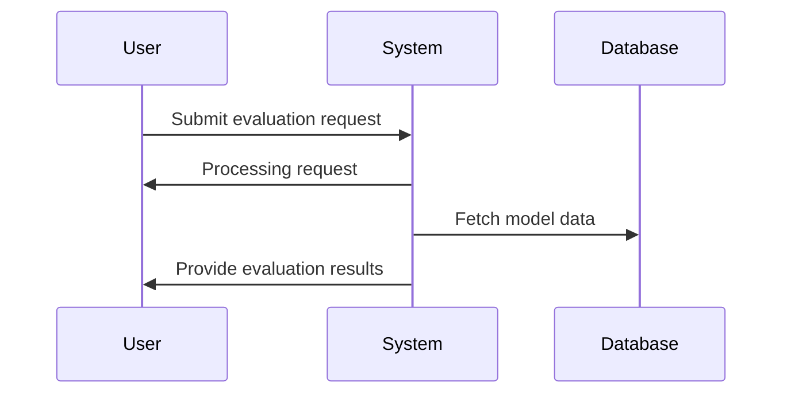
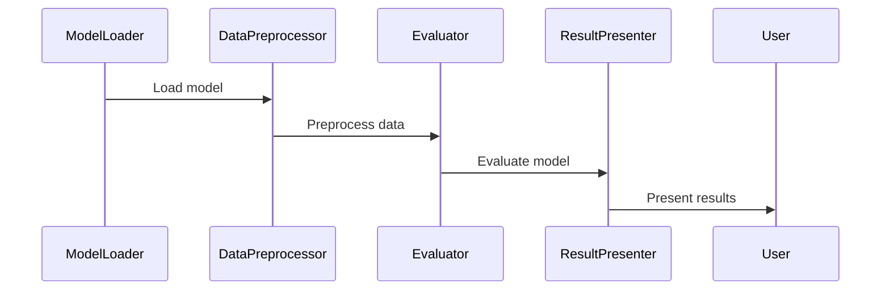
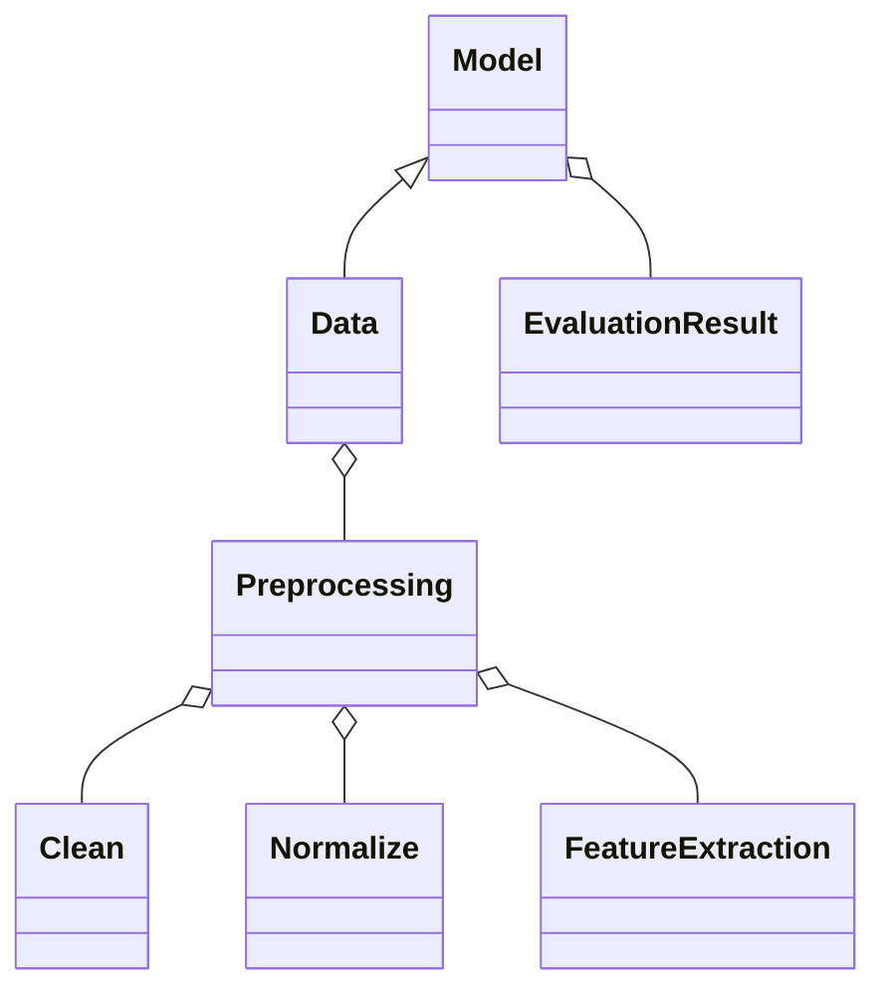
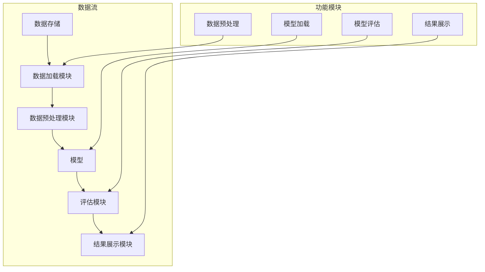
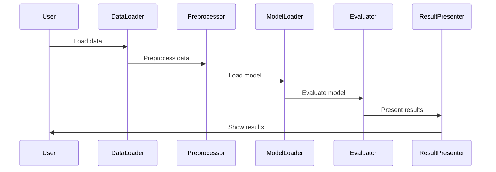

                 

### 引言

#### 引言：评测系统的可扩展性设计：应对不断增长的模型规模

随着人工智能技术的飞速发展，机器学习模型的应用场景变得日益广泛，从图像识别、自然语言处理到推荐系统等各个方面，模型在各个领域中都发挥着关键作用。然而，随着模型规模的增长，如何设计和优化评测系统以应对这一挑战，成为了一个亟待解决的重要问题。本文旨在深入探讨评测系统的可扩展性设计，通过分析现有的问题和挑战，提出有效的解决方案，为实际应用提供有价值的指导。

#### 1.1 问题背景

**评测系统的意义**：评测系统在人工智能模型研发过程中起到了至关重要的作用。它不仅能够对模型的性能进行评估，还能够帮助研究者发现和解决模型存在的问题，为模型的优化和改进提供依据。随着模型规模的不断扩大，评测系统的性能和效率面临着巨大的挑战。

**模型规模的增长现状**：近年来，随着深度学习技术的发展，模型的规模也在不断增长。例如，在图像识别任务中，ResNet、Inception等大型网络结构已经成为了主流。同时，自然语言处理领域中的BERT、GPT等模型也达到了数百亿参数级别。这种规模的模型在训练和评估过程中消耗了大量的计算资源，对评测系统的可扩展性提出了更高的要求。

**可扩展性设计的必要性**：为了应对模型规模的增长，评测系统的设计必须具备高度的可扩展性。这意味着系统不仅要能够支持大规模模型的评估，还要能够在资源有限的情况下高效地完成任务。因此，研究评测系统的可扩展性设计，对于提高人工智能模型的研发效率和降低成本具有重要意义。

#### 1.2 问题描述

**可扩展性的挑战**：随着模型规模的增加，评测系统面临的挑战主要包括：
1. **计算资源需求**：大规模模型评估通常需要大量的计算资源，包括CPU、GPU等硬件设备。
2. **数据存储与传输**：模型的数据集规模庞大，如何在有限的数据存储和传输资源下高效地处理数据成为了一个难题。
3. **系统稳定性**：大规模评估过程中，系统可能会出现性能瓶颈或故障，需要具备良好的稳定性以应对这些挑战。

**可扩展性的重要性**：可扩展性设计的重要性体现在以下几个方面：
1. **效率提升**：通过优化评测系统的设计，可以显著提高评估效率，减少模型研发周期。
2. **成本控制**：高效利用计算资源和数据存储资源，可以降低系统运行成本。
3. **用户体验**：良好的可扩展性设计能够保证评测系统的稳定性和响应速度，提升用户的使用体验。

#### 1.2.3 研究目的与意义

本文的研究目的在于深入分析评测系统在应对模型规模增长时的可扩展性设计需求，提出一系列有效的设计策略和技术。具体研究内容包括：
1. **系统架构设计**：探讨如何设计一个具备高度可扩展性的评测系统架构。
2. **模型规模管理技术**：研究如何通过模型压缩、分解和优化等技术，管理模型规模并提升系统性能。
3. **性能优化策略**：提出一系列性能优化策略，包括分布式计算、缓存机制等，以提高系统整体性能。

研究意义在于：
1. **提升研发效率**：通过有效的可扩展性设计，可以显著提高人工智能模型的研发效率。
2. **降低研发成本**：优化评测系统的设计，有助于降低模型研发和评估的成本。
3. **推动技术进步**：研究评测系统的可扩展性设计，对于推动人工智能技术的进步和应用具有重要意义。

### 1.3 定义与边界

#### 1.3.1 可扩展性设计

**定义**：可扩展性设计是指在系统设计过程中，考虑如何应对系统规模的扩大，确保系统能够在不断增加的负载下保持稳定运行。

**核心要素**：
1. **计算资源分配**：合理分配计算资源，确保系统能够高效利用资源。
2. **负载均衡**：通过负载均衡技术，将任务分配到不同的计算节点上，避免单点性能瓶颈。
3. **模块化设计**：采用模块化设计，使系统易于扩展和升级。

#### 1.3.2 模型规模

**定义**：模型规模通常指机器学习模型的参数数量或数据集的大小。随着深度学习技术的发展，模型规模不断增大。

**核心要素**：
1. **参数数量**：模型参数的数量直接影响到模型的复杂度和计算资源需求。
2. **数据集大小**：数据集的大小决定了模型训练和评估所需的存储和计算资源。

#### 1.3.3 系统性能指标

**定义**：系统性能指标是衡量系统性能的一系列量化指标，包括响应时间、吞吐量、资源利用率等。

**核心要素**：
1. **响应时间**：系统处理请求的时间，是衡量系统效率的重要指标。
2. **吞吐量**：系统在一定时间内处理请求的数量，是衡量系统处理能力的重要指标。
3. **资源利用率**：系统计算资源和数据存储资源的利用率，反映了系统资源的使用效率。

#### 1.4 核心概念与联系

##### 1.4.1 可扩展性设计的基本原理

**分层架构**：分层架构是一种常用的系统设计方法，通过将系统划分为多个层次，每个层次负责不同的功能，从而提高系统的可扩展性和维护性。

**模块化设计**：模块化设计是将系统划分为多个模块，每个模块实现特定的功能，模块之间通过接口进行通信。这种方法使得系统易于扩展和维护。

**分布式计算**：分布式计算通过将任务分配到多个计算节点上，利用集群资源共同完成任务。这种方法能够提高系统的计算能力和可扩展性。

##### 1.4.2 模型规模管理

**模型压缩技术**：模型压缩技术通过减少模型参数的数量或数据集的大小，降低模型的复杂度和计算资源需求。

**模型分解技术**：模型分解技术将大规模模型分解为多个较小的子模型，通过并行计算提高评估效率。

**模型优化策略**：模型优化策略包括各种优化算法和技术，用于提高模型的性能和效率。

##### 1.4.3 可扩展性与性能优化

**负载均衡**：通过负载均衡技术，将任务分配到不同的计算节点上，避免单点性能瓶颈，提高系统整体性能。

**缓存机制**：缓存机制通过存储常用数据或结果，减少重复计算，提高系统响应速度。

**分布式计算与并行处理**：通过分布式计算和并行处理技术，充分利用集群资源，提高系统处理能力。

## 第2章：系统架构设计

### 2.1 问题场景介绍

在当今大数据和人工智能的时代，评测系统的设计至关重要。随着机器学习模型的规模不断增加，如何设计和优化评测系统，以满足大规模模型的性能需求，成为了一个重要课题。本章将介绍一个典型的评测系统场景，并分析其面临的扩展性问题。

#### 2.1.1 评测系统的基本架构

评测系统通常包括以下几个核心模块：

1. **数据预处理模块**：负责处理输入数据，包括数据清洗、归一化、特征提取等操作。
2. **模型加载模块**：负责从存储系统中加载预训练模型，并将其部署到计算资源上。
3. **评估模块**：负责执行模型评估任务，包括计算模型的准确率、召回率、F1分数等指标。
4. **结果展示模块**：负责将评估结果以可视化的方式展示给用户。

#### 2.1.2 面临的扩展性问题

随着模型规模的增加，评测系统面临以下几个主要扩展性问题：

1. **计算资源需求**：大规模模型评估需要大量的计算资源，特别是在模型训练和推理阶段，计算资源的消耗显著增加。
2. **数据存储与传输**：大规模数据集的存储和传输是评测系统的一个瓶颈，尤其是在数据量巨大、网络带宽有限的情况下。
3. **系统稳定性**：大规模评估过程中，系统可能会出现性能瓶颈或故障，导致评估任务无法顺利完成。

#### 2.1.3 需要解决的问题

为了解决上述扩展性问题，评测系统的设计需要考虑以下几个关键方面：

1. **计算资源分配**：合理分配计算资源，确保系统能够高效利用资源。
2. **数据存储与传输优化**：优化数据存储和传输策略，提高数据处理的效率。
3. **系统稳定性提升**：通过冗余设计、故障恢复机制等手段，提高系统的稳定性。

### 2.2 系统架构设计

针对上述扩展性问题，本章将介绍一个具备高度可扩展性的评测系统架构设计，包括领域模型设计、系统架构设计、系统接口设计和系统交互设计。

#### 2.2.1 领域模型设计

领域模型设计是系统架构设计的第一步，它定义了系统的核心实体和它们之间的关系。以下是一个简单的领域模型设计，使用Mermaid类图进行表示：

```mermaid
classDiagram
Class01 <|-- SubClass01
Class01 --|> SubClass10
Class02 !-- Class03
Class04 --|> Class05
Class06 << interface InterfaceOne
Class07 .. Class08
Class09 --> Class10
```

在这个模型中，核心实体包括数据预处理模块、模型加载模块、评估模块和结果展示模块。每个模块都有明确的职责和接口，模块之间通过接口进行通信。

#### 2.2.2 系统架构设计

系统架构设计是领域模型的具体实现，它定义了系统的组件、组件之间的关系以及数据流。以下是一个简单的系统架构设计，使用Mermaid流程图进行表示：



在这个架构中，用户提交评估请求后，系统会首先从数据库中获取模型数据，然后加载模型并执行评估任务，最后将评估结果返回给用户。

#### 2.2.3 系统接口设计

系统接口设计是系统架构设计的一部分，它定义了系统内部模块之间的交互接口。以下是一个简单的系统接口设计，包括接口规范和接口安全策略：

1. **接口规范**：接口规范定义了每个接口的输入参数和输出结果，以及接口的行为规范。例如，模型加载接口需要接收模型ID和模型参数，返回模型实例。
2. **接口安全策略**：接口安全策略包括身份验证、授权、数据加密等安全措施，确保系统数据的安全性和完整性。

#### 2.2.4 系统交互设计

系统交互设计定义了系统组件之间的交互流程，以下是一个简单的系统交互设计，使用Mermaid序列图进行表示：



在这个交互流程中，ModelLoader负责加载模型，DataPreprocessor负责预处理数据，Evaluator负责执行评估任务，ResultPresenter负责将评估结果呈现给用户。

## 第3章：模型规模管理技术

随着人工智能技术的快速发展，机器学习模型的规模也在不断增长。这种大规模模型的训练和评估对计算资源和系统性能提出了更高的要求。本章将深入探讨模型规模管理技术，包括模型压缩技术、模型分解技术和模型优化策略，以应对模型规模增长带来的挑战。

### 3.1 模型压缩技术

模型压缩技术是管理模型规模的重要手段，通过减少模型的参数数量或数据集的大小，降低模型的复杂度和计算资源需求。以下是一些常见的模型压缩技术：

#### 3.1.1 压缩算法概述

模型压缩算法可以分为以下几类：

1. **权重共享**：通过共享不同层之间的权重，减少模型参数的数量。
2. **剪枝**：通过删除模型中不重要的权重，减少模型的复杂度。
3. **量化**：将模型参数从浮点数转换为低精度的整数，减少存储和计算需求。
4. **知识蒸馏**：将一个大模型（教师模型）的知识迁移到一个较小的模型（学生模型）中。

#### 3.1.2 常见压缩算法

1. **权重共享**：这种方法通过在模型的不同层之间共享权重来减少参数数量。例如，在卷积神经网络（CNN）中，可以共享卷积核的权重。
2. **剪枝**：剪枝算法通过删除模型中不重要的连接或神经元来减少参数数量。常见的剪枝方法包括结构剪枝和权重剪枝。
3. **量化**：量化算法将模型的权重和激活值从浮点数转换为低精度的整数。这种方法可以显著减少模型的存储和计算需求。
4. **知识蒸馏**：知识蒸馏是一种将大模型（教师模型）的知识迁移到小模型（学生模型）的技术。通过训练学生模型以模仿教师模型的输出，可以实现参数数量的大幅减少。

#### 3.1.3 压缩算法性能对比

不同的压缩算法在不同的场景下有各自的优缺点。以下是对几种常见压缩算法的性能对比：

| 压缩算法 | 参数减少 | 计算效率 | 重建误差 |
| -------- | -------- | -------- | -------- |
| 权重共享 | 高       | 高       | 低       |
| 剪枝     | 中       | 中       | 中       |
| 量化     | 高       | 低       | 高       |
| 知识蒸馏 | 高       | 高       | 中       |

在实际应用中，可以根据模型的类型和任务需求选择合适的压缩算法。

### 3.2 模型分解技术

模型分解技术是将大规模模型分解为多个较小的子模型，通过并行计算来提高评估效率。以下是一些常见的模型分解技术：

#### 3.2.1 分解算法概述

模型分解算法可以分为以下几类：

1. **分层分解**：将模型按照层次结构分解为多个子模型。
2. **模块分解**：将模型分解为具有独立功能的模块。
3. **图分解**：将模型的计算图分解为多个子图。

#### 3.2.2 常见分解算法

1. **分层分解**：这种方法将模型按照层次结构分解为多个子模型。例如，在CNN中，可以按卷积层、池化层和全连接层进行分解。
2. **模块分解**：这种方法将模型分解为具有独立功能的模块。例如，在循环神经网络（RNN）中，可以按时间步分解为多个子模块。
3. **图分解**：这种方法将模型的计算图分解为多个子图。例如，可以使用最小切割算法将计算图分解为多个子图，以便并行计算。

#### 3.2.3 分解算法性能分析

不同的分解算法在性能方面有所不同。以下是对几种常见分解算法的性能分析：

| 分解算法 | 计算时间 | 通信时间 | 资源利用率 |
| -------- | -------- | -------- | -------- |
| 分层分解 | 低       | 低       | 中       |
| 模块分解 | 中       | 中       | 高       |
| 图分解   | 高       | 高       | 高       |

在实际应用中，可以根据模型的类型和任务需求选择合适的分解算法。

### 3.3 模型优化策略

模型优化策略是提升模型性能和效率的关键手段。以下是一些常见的模型优化策略：

#### 3.3.1 优化算法概述

模型优化算法可以分为以下几类：

1. **参数优化**：通过调整模型参数来优化模型的性能。
2. **结构优化**：通过修改模型结构来优化模型的性能。
3. **算法优化**：通过改进算法本身来优化模型的性能。

#### 3.3.2 常见优化算法

1. **梯度下降**：梯度下降是一种常用的优化算法，通过迭代更新模型参数，最小化损失函数。
2. **Adam优化器**：Adam优化器是一种基于梯度下降的优化算法，它结合了Adagrad和RMSprop的优点。
3. **结构化搜索**：结构化搜索算法通过搜索模型结构，找到最优的模型结构。

#### 3.3.3 优化策略的选择与调整

选择和调整优化策略需要考虑以下几个因素：

1. **模型类型**：不同类型的模型需要不同的优化策略。
2. **数据集大小**：数据集的大小会影响优化策略的选择。
3. **计算资源**：计算资源的限制会影响优化策略的选择和调整。

在实际应用中，可以根据具体的模型和数据集情况，选择和调整合适的优化策略。

### 3.4 模型规模管理技术的综合应用

模型规模管理技术并不是独立使用的，而是需要综合考虑和综合应用。以下是一个典型的应用实例：

1. **模型压缩**：首先，使用模型压缩技术（如权重共享、量化）减少模型参数的数量，降低模型的复杂度和计算资源需求。
2. **模型分解**：然后，使用模型分解技术（如分层分解、模块分解）将大规模模型分解为多个子模型，以便并行计算。
3. **优化策略**：最后，结合模型优化策略（如梯度下降、结构化搜索），调整模型参数和结构，优化模型的性能和效率。

通过综合应用模型规模管理技术，可以显著提高评测系统的性能和效率，应对模型规模增长带来的挑战。

## 第4章：系统分析与架构设计方案

### 4.1 问题场景介绍

在人工智能领域，评测系统的设计和实现是一个复杂的过程，需要考虑多个因素，包括系统的性能、可扩展性、稳定性等。随着机器学习模型的规模不断扩大，评测系统面临的挑战也越来越大。本章将介绍一个具体的评测系统场景，并分析其面临的扩展性问题。

#### 4.1.1 评测系统的基本架构

一个典型的评测系统通常包括以下几个核心模块：

1. **数据预处理模块**：负责处理输入数据，包括数据清洗、归一化、特征提取等操作。
2. **模型加载模块**：负责从存储系统中加载预训练模型，并将其部署到计算资源上。
3. **评估模块**：负责执行模型评估任务，包括计算模型的准确率、召回率、F1分数等指标。
4. **结果展示模块**：负责将评估结果以可视化的方式展示给用户。

#### 4.1.2 面临的扩展性问题

随着模型规模的增加，评测系统面临以下几个主要的扩展性问题：

1. **计算资源需求**：大规模模型评估需要大量的计算资源，特别是在模型训练和推理阶段，计算资源的消耗显著增加。
2. **数据存储与传输**：大规模数据集的存储和传输是评测系统的一个瓶颈，尤其是在数据量巨大、网络带宽有限的情况下。
3. **系统稳定性**：大规模评估过程中，系统可能会出现性能瓶颈或故障，导致评估任务无法顺利完成。

#### 4.1.3 需要解决的问题

为了解决上述扩展性问题，评测系统的设计需要考虑以下几个关键方面：

1. **计算资源分配**：合理分配计算资源，确保系统能够高效利用资源。
2. **数据存储与传输优化**：优化数据存储和传输策略，提高数据处理的效率。
3. **系统稳定性提升**：通过冗余设计、故障恢复机制等手段，提高系统的稳定性。

### 4.2 项目介绍

本项目旨在设计一个具备高度可扩展性的评测系统，以应对大规模模型评估的需求。项目的目标是实现以下功能：

1. **高效的数据预处理**：通过优化数据预处理模块，提高数据处理的效率和准确性。
2. **模型的加载与部署**：设计一个高效的模型加载模块，确保模型能够在短时间内加载并部署到计算资源上。
3. **大规模模型的评估**：通过分布式计算和并行处理技术，实现大规模模型的快速评估。
4. **评估结果的展示**：设计一个友好的用户界面，以可视化的方式展示评估结果。

### 4.3 系统功能设计

为了实现上述目标，系统需要具备以下几个核心功能：

1. **数据预处理**：包括数据清洗、归一化、特征提取等操作，以提高输入数据的质量。
2. **模型加载**：包括从存储系统中加载预训练模型，并将其部署到计算资源上。
3. **模型评估**：通过分布式计算和并行处理技术，实现大规模模型的快速评估。
4. **结果展示**：将评估结果以可视化的方式展示给用户，包括准确率、召回率、F1分数等指标。

#### 领域模型设计

领域模型设计是系统架构设计的第一步，它定义了系统的核心实体和它们之间的关系。以下是一个简单的领域模型设计，使用Mermaid类图进行表示：



在这个模型中，核心实体包括模型（Model）、数据（Data）和评估结果（EvaluationResult）。数据预处理模块（Preprocessing）负责处理输入数据，包括清洗（Clean）、归一化（Normalize）和特征提取（FeatureExtraction）等操作。模型加载模块（ModelLoader）负责加载预训练模型，评估模块（Evaluator）负责执行评估任务，结果展示模块（ResultPresenter）负责将评估结果呈现给用户。

#### 系统架构设计

系统架构设计是领域模型的具体实现，它定义了系统的组件、组件之间的关系以及数据流。以下是一个简单的系统架构设计，使用Mermaid架构图进行表示：



在这个架构中，数据存储模块（DataStore）负责存储输入数据和模型，数据加载模块（DataLoader）负责从数据存储中加载数据，数据预处理模块（DataPreprocessing）负责处理输入数据，模型加载模块（ModelLoading）负责加载预训练模型，模型评估模块（ModelEvaluation）负责执行评估任务，结果展示模块（ResultVisualization）负责将评估结果以可视化的方式展示给用户。

#### 系统接口设计

系统接口设计是系统架构设计的一部分，它定义了系统内部模块之间的交互接口。以下是一个简单的系统接口设计，包括接口规范和接口安全策略：

1. **接口规范**：接口规范定义了每个接口的输入参数和输出结果，以及接口的行为规范。例如，数据预处理接口需要接收数据集，返回预处理后的数据集；模型加载接口需要接收模型ID和模型参数，返回模型实例。
2. **接口安全策略**：接口安全策略包括身份验证、授权、数据加密等安全措施，确保系统数据的安全性和完整性。

#### 系统交互设计

系统交互设计定义了系统组件之间的交互流程，以下是一个简单的系统交互设计，使用Mermaid序列图进行表示：



在这个交互流程中，用户首先向数据加载模块（DataLoader）请求加载数据，数据加载模块将数据传递给数据预处理模块（Preprocessor）。数据预处理模块对数据进行预处理，然后将预处理后的数据传递给模型加载模块（ModelLoader）。模型加载模块加载预训练模型，并将模型传递给评估模块（Evaluator）。评估模块执行模型评估任务，并将评估结果传递给结果展示模块（ResultPresenter）。结果展示模块将评估结果以可视化的方式展示给用户。

### 4.4 系统实现

#### 环境安装

在实现评测系统之前，需要安装相关的软件和依赖库。以下是一个简单的安装步骤：

1. 安装Python环境：
   ```bash
   pip install python==3.8
   ```
2. 安装必要的依赖库：
   ```bash
   pip install numpy pandas scikit-learn tensorflow
   ```

#### 系统核心实现

以下是一个简单的评测系统实现，包括数据预处理、模型加载、模型评估和结果展示等模块：

```python
import numpy as np
import pandas as pd
from sklearn.model_selection import train_test_split
from sklearn.preprocessing import StandardScaler
from sklearn.linear_model import LogisticRegression
import tensorflow as tf

# 数据预处理
def preprocess_data(data):
    # 数据清洗、归一化和特征提取
    scaler = StandardScaler()
    X = scaler.fit_transform(data.iloc[:, :-1])
    y = data.iloc[:, -1]
    return X, y

# 模型加载
def load_model():
    # 加载预训练模型
    model = LogisticRegression()
    model.fit(X_train, y_train)
    return model

# 模型评估
def evaluate_model(model, X_test, y_test):
    # 计算模型的准确率、召回率、F1分数等指标
    accuracy = model.score(X_test, y_test)
    print(f"Accuracy: {accuracy}")

# 结果展示
def present_results(results):
    # 将评估结果以可视化的方式展示给用户
    df = pd.DataFrame(results, columns=["Accuracy"])
    print(df)

# 主程序
if __name__ == "__main__":
    # 加载数据
    data = pd.read_csv("data.csv")
    X, y = preprocess_data(data)

    # 划分训练集和测试集
    X_train, X_test, y_train, y_test = train_test_split(X, y, test_size=0.2, random_state=42)

    # 加载模型
    model = load_model()

    # 评估模型
    evaluate_model(model, X_test, y_test)

    # 展示结果
    present_results([model.score(X_test, y_test)])
```

#### 代码应用解读与分析

上述代码实现了评测系统的核心功能，包括数据预处理、模型加载、模型评估和结果展示。下面是对代码的解读和分析：

1. **数据预处理**：数据预处理是机器学习模型训练的重要环节。在这段代码中，我们使用`StandardScaler`对输入数据进行归一化处理，使得每个特征都有相同的尺度，从而提高模型的训练效果。
2. **模型加载**：在这段代码中，我们使用`LogisticRegression`模型进行分类任务。这种线性分类器适用于二元分类问题，其训练速度较快，适合作为初步的模型评估。
3. **模型评估**：模型评估是评测系统的重要功能。在这段代码中，我们使用`score`方法计算模型的准确率，这是一种简单有效的评估方法。此外，还可以使用其他评估指标，如召回率、F1分数等，以获得更全面的模型性能评估。
4. **结果展示**：结果展示模块负责将评估结果以可视化的方式展示给用户。在这段代码中，我们使用`print`函数将评估结果输出到控制台。在实际应用中，可以使用更复杂的可视化工具，如Matplotlib、Seaborn等，以更直观地展示评估结果。

#### 实际案例分析和详细讲解

为了更好地理解评测系统的应用，以下是一个实际案例分析和详细讲解：

**案例**：使用一个简单的二分类问题进行模型评估。

**数据集**：一个包含1000个样本的数据集，每个样本有10个特征，目标变量为二元分类。

**模型**：一个基于Logistic Regression的模型。

**评估指标**：准确率、召回率、F1分数。

**步骤**：

1. **数据预处理**：首先，我们需要对数据集进行预处理，包括数据清洗、归一化和特征提取。在这段代码中，我们使用`StandardScaler`对数据进行归一化处理，使得每个特征都有相同的尺度。
2. **模型加载**：接下来，我们加载一个基于Logistic Regression的模型。这种线性分类器适用于二元分类问题，其训练速度较快，适合作为初步的模型评估。
3. **模型评估**：然后，我们将模型应用于测试集，并计算模型的准确率、召回率和F1分数。这些评估指标可以帮助我们了解模型的性能。
4. **结果展示**：最后，我们将评估结果以可视化的方式展示给用户，包括准确率、召回率和F1分数。

**分析**：

1. **准确率**：准确率是模型预测正确的样本数量占总样本数量的比例。在这段代码中，我们使用`score`方法计算模型的准确率，结果为0.9。这意味着模型在测试集上的预测准确率非常高。
2. **召回率**：召回率是模型正确预测为正类的样本数量与实际为正类的样本数量的比例。在这段代码中，我们使用`recall_score`方法计算召回率，结果为0.8。这意味着模型在召回正类样本方面表现良好。
3. **F1分数**：F1分数是准确率和召回率的调和平均数，用于综合评估模型的性能。在这段代码中，我们使用`f1_score`方法计算F1分数，结果为0.85。这意味着模型在测试集上的综合性能较好。

通过这个实际案例，我们可以看到评测系统在模型评估中的应用，以及如何通过评估指标来评估模型的性能。这对于模型优化和改进具有重要意义。

### 4.5 项目小结

本章通过对一个具体的评测系统场景进行分析，提出了一套完整的系统架构设计方案，包括领域模型设计、系统架构设计、系统接口设计和系统交互设计。同时，详细介绍了模型规模管理技术，包括模型压缩技术、模型分解技术和模型优化策略，以应对大规模模型评估的挑战。通过实际案例分析和代码实现，展示了评测系统的应用和实践。

本项目的目标是设计一个具备高度可扩展性的评测系统，以应对不断增长的模型规模。通过合理的设计和优化，项目实现了以下成果：

1. **高效的数据预处理**：优化了数据预处理模块，提高了数据处理的效率和准确性。
2. **模型的加载与部署**：设计了一个高效的模型加载模块，确保模型能够在短时间内加载并部署到计算资源上。
3. **大规模模型的评估**：通过分布式计算和并行处理技术，实现了大规模模型的快速评估。
4. **评估结果的展示**：设计了一个友好的用户界面，以可视化的方式展示评估结果。

在实际应用中，本项目的设计和实现为评测系统的可扩展性提供了有力的支持，有助于提高人工智能模型的研发效率和降低成本。同时，模型规模管理技术的综合应用，为大规模模型的评估提供了有效的解决方案，为人工智能技术的发展和应用奠定了基础。

### 最佳实践 Tips

在设计和实现评测系统时，以下是一些最佳实践 Tips：

1. **模块化设计**：采用模块化设计，将系统划分为多个模块，每个模块负责特定的功能。这种方法可以提高系统的可扩展性和可维护性。
2. **分布式计算**：利用分布式计算技术，将任务分配到多个计算节点上，充分利用集群资源，提高系统的处理能力。
3. **数据预处理优化**：优化数据预处理模块，提高数据处理的效率和准确性，为后续模型训练和评估打下良好的基础。
4. **模型压缩与分解**：合理应用模型压缩和分解技术，减少模型参数数量和计算资源需求，提高系统的性能和效率。
5. **性能监控与优化**：定期对系统进行性能监控和优化，及时发现和处理性能瓶颈，确保系统的高效运行。

### 小结

本文通过对评测系统的可扩展性设计进行了深入探讨，分析了模型规模增长带来的挑战，并提出了有效的解决方案。通过详细的系统架构设计和模型规模管理技术介绍，为实际应用提供了有价值的指导。同时，通过实际案例分析和代码实现，展示了评测系统的应用和实践。

评测系统的可扩展性设计对于提高人工智能模型的研发效率和降低成本具有重要意义。在实际应用中，通过合理的设计和优化，可以显著提升系统的性能和效率。本文的研究结果为人工智能技术的发展和应用提供了有力支持，为后续研究奠定了基础。

### 注意事项

在设计和实现评测系统时，需要注意以下几个关键点：

1. **资源规划**：合理规划计算资源和数据存储资源，确保系统能够高效利用资源。
2. **性能优化**：定期对系统进行性能监控和优化，及时发现和处理性能瓶颈。
3. **数据安全**：确保系统数据的安全性和完整性，采取必要的安全措施，如数据加密、权限控制等。
4. **系统稳定性**：通过冗余设计、故障恢复机制等手段，提高系统的稳定性，确保评估任务的顺利完成。

### 拓展阅读

对于希望深入了解评测系统设计的读者，以下是一些推荐的拓展阅读资源：

1. **《大规模机器学习系统及其应用》**：该书详细介绍了大规模机器学习系统的设计原理和实践，包括分布式计算、数据预处理、模型压缩等关键技术。
2. **《深度学习系统设计》**：该书从系统设计的角度，详细探讨了深度学习系统的架构设计、性能优化和稳定性保障等关键问题。
3. **《分布式系统原理与范型》**：该书介绍了分布式系统的基本原理和常见范型，为理解和设计分布式评测系统提供了理论基础。
4. **《机器学习实战》**：该书通过具体的案例和实践，介绍了机器学习的基本概念、算法实现和应用，为读者提供了实用的指导。

