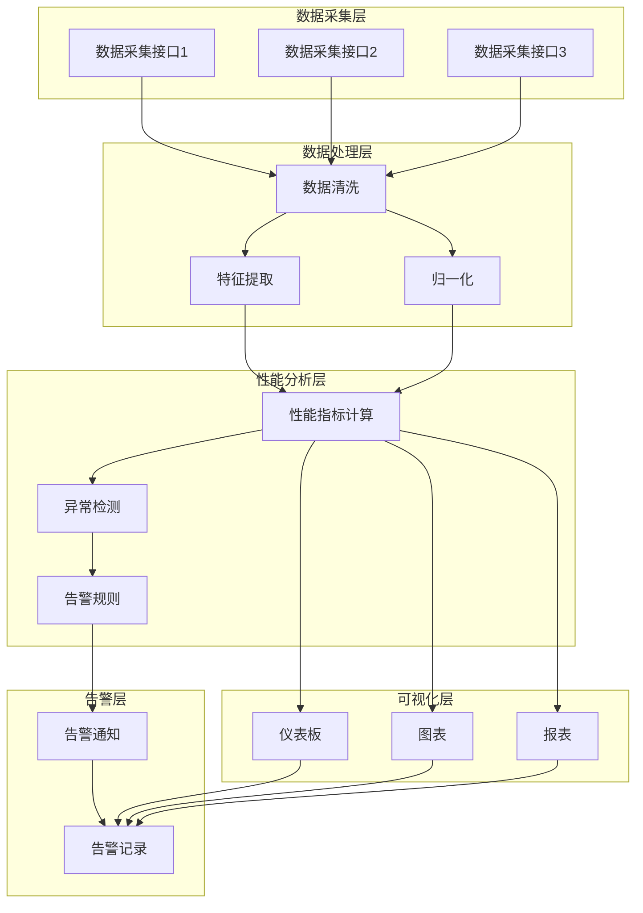
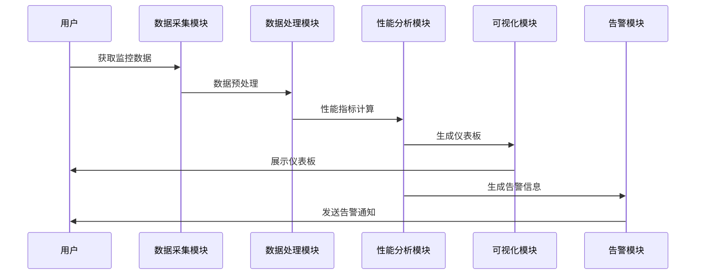

                 

### 文章标题

# 评测系统的可视化监控：LLM生成实时性能仪表板

> 关键词：评测系统、可视化监控、LLM、实时性能仪表板、深度学习

> 摘要：本文深入探讨了评测系统的可视化监控技术，特别是大语言模型（LLM）在生成实时性能仪表板中的应用。通过详细分析监控需求、核心概念、算法原理和系统设计，本文旨在为开发者提供一套完整的技术指南，帮助他们构建高效的监控体系。

----------------------------------------------------------------

### 目录大纲设计

《评测系统的可视化监控：LLM生成实时性能仪表板》的目录大纲设计旨在引导读者逐步深入理解文章的核心内容。我们将文章分为五个主要部分：背景介绍、核心概念与联系、算法原理讲解、系统分析与架构设计方案以及项目实战。以下是根据这些内容设计的详细目录大纲。

----------------------------------------------------------------

## 第一部分：背景介绍

### 第1章 问题背景与核心概念

#### 1.1 问题背景

- **评测系统的定义与用途**：介绍评测系统的定义及其在不同领域中的应用。
- **监控需求分析**：阐述评测系统监控的必要性和常见监控需求。

#### 1.2 核心概念

- **可视化监控**：解释可视化监控的概念及其在评测系统中的应用。
- **LLM简介**：概述大语言模型（LLM）的基本概念和特点。

### 第2章 监控体系结构与核心要素

#### 2.1 监控体系结构

- **评测系统架构解析**：分析评测系统的整体架构，包括数据采集、处理和监控等模块。
- **LLM在监控中的角色**：讨论LLM在评测系统监控中的定位和作用。

#### 2.2 核心要素

- **数据采集与处理**：介绍数据采集的常见方法和处理流程。
- **性能指标定义**：详细解释性能指标的定义和计算方法。

## 第二部分：核心概念与联系

### 第3章 LLM的深度学习原理

#### 3.1 深度学习基础

- **神经网络原理**：介绍神经网络的基本原理和主要结构。
- **优化算法**：解释深度学习中的常见优化算法。

#### 3.2 LLM架构

- **Transformer模型**：详细解析Transformer模型的结构和原理。
- **预训练与微调**：讨论LLM的预训练和微调过程。

#### 3.3 LLM应用场景

- **自然语言处理**：探讨LLM在自然语言处理中的应用。
- **实时监控**：分析LLM在实时监控中的具体应用场景。

## 第三部分：算法原理讲解

### 第4章 实时性能仪表板生成算法

#### 4.1 监控数据预处理

- **数据清洗**：描述数据清洗的重要性和常见方法。
- **特征提取**：介绍特征提取的方法和过程。

#### 4.2 LLM模型选择与训练

- **模型选择**：根据需求选择合适的LLM模型。
- **模型训练**：详细讲解模型训练的步骤和策略。

#### 4.3 性能仪表板生成

- **仪表板设计**：讨论性能仪表板的设计原则和实现方法。
- **生成过程**：详细阐述性能仪表板的生成过程。

### 第5章 数学模型与公式

#### 5.1 监控指标数学模型

- **性能指标计算**：使用LaTeX格式给出性能指标的数学模型和计算公式。
- **误差分析**：分析监控数据中的误差来源和误差分析。

#### 5.2 LLM数学基础

- **神经网络数学**：介绍神经网络中涉及的数学公式和概念。
- **优化算法数学**：解释优化算法背后的数学原理。

## 第四部分：系统分析与架构设计

### 第6章 系统功能设计与架构方案

#### 6.1 问题场景介绍

- **评测系统监控需求**：明确评测系统监控的具体需求和目标。

#### 6.2 系统功能设计

- **领域模型**：使用Mermaid类图展示领域模型。
- **功能模块划分**：详细描述系统功能模块及其交互关系。

#### 6.3 系统架构设计

- **系统架构图**：绘制系统架构图，展示各模块之间的连接和交互。
- **接口设计**：说明系统接口的设计原则和实现方法。

#### 6.4 系统交互设计

- **序列图**：使用Mermaid序列图展示系统各模块的交互过程。

## 第五部分：项目实战

### 第7章 实时性能仪表板实现

#### 7.1 环境安装与配置

- **工具与库安装**：详细说明所需工具和库的安装步骤。
- **环境配置**：描述系统环境配置的方法和注意事项。

#### 7.2 系统核心实现

- **代码实现**：展示系统核心代码，并进行解读。
- **性能优化**：讨论系统性能优化的方法和实践。

#### 7.3 实际案例剖析

- **案例分析**：选择一个实际案例，详细剖析仪表板的实现过程。
- **总结与反思**：总结项目经验和反思过程中遇到的问题。

#### 7.4 最佳实践与总结

- **最佳实践**：分享一些监控仪表板设计和实现的最佳实践。
- **总结与展望**：对全文内容进行总结，并对未来发展方向进行展望。

### 第8章 注意事项与拓展阅读

#### 8.1 注意事项

- **常见问题与解决方案**：介绍在实际应用中可能遇到的问题及其解决方案。
- **性能调优技巧**：分享一些性能调优的技巧和策略。

#### 8.2 拓展阅读

- **参考文献**：列出本文中引用的参考文献。
- **延伸阅读**：推荐一些相关的扩展阅读材料。

----------------------------------------------------------------

在接下来的内容中，我们将逐一深入探讨每个部分，逐步解答评测系统可视化监控的核心问题，并详细介绍LLM在生成实时性能仪表板中的应用。让我们一步一步地深入理解这一先进技术的原理和实践。

## 第1章 问题背景与核心概念

### 1.1 评测系统的定义与用途

评测系统是一种用于评估和监控软件系统运行性能、稳定性和可靠性的技术工具。它的主要目的是通过对系统的运行数据进行收集、处理和分析，帮助开发者和管理者实时了解系统的运行状态，及时发现并解决潜在的问题。在各个行业中，评测系统的应用场景十分广泛，主要包括以下几个领域：

1. **软件开发与测试**：在软件开发的过程中，评测系统可以帮助开发者实时监控代码的质量、性能和安全性，从而确保软件产品的稳定性和可靠性。
2. **运维管理**：在系统运维过程中，评测系统可以实时监控系统的运行状态，如CPU利用率、内存使用率、网络带宽等，帮助运维人员快速发现和处理系统故障。
3. **业务性能监控**：在业务运营过程中，评测系统可以监控关键业务性能指标，如交易成功率、页面响应时间、用户访问量等，帮助业务人员优化业务流程和提高用户体验。
4. **数据中心管理**：在数据中心管理中，评测系统可以监控数据中心的整体运行状态，包括电力供应、空调系统、网络设备等，确保数据中心的安全稳定运行。

### 1.2 监控需求分析

随着技术的不断发展，评测系统的监控需求也在不断演变。以下是一些常见的监控需求：

1. **实时监控**：实时监控是评测系统最基本的需求之一。它要求系统能够实时采集和处理运行数据，并及时将监控结果反馈给用户，以便快速响应和处理潜在问题。
2. **可视化展示**：为了使监控结果更加直观易懂，可视化展示功能至关重要。通过图形化界面，用户可以直观地了解系统的运行状态，发现异常情况。
3. **告警机制**：告警机制是评测系统的重要组成部分。当系统运行数据超出预设阈值时，告警机制可以自动发出警报，通知相关人员采取相应措施。
4. **历史数据存储与查询**：历史数据存储与查询功能可以帮助用户分析系统的长期运行趋势，发现潜在问题并进行预防性维护。
5. **自定义监控**：用户可以根据自己的需求自定义监控指标和监控策略，以满足不同场景下的监控需求。

### 1.3 可视化监控

可视化监控是评测系统的重要功能之一，它通过图形化界面将监控数据以直观的形式展示给用户。可视化监控的优点包括：

1. **易于理解**：图形化界面使得监控结果更加直观易懂，用户可以快速识别系统运行状态。
2. **快速响应**：可视化监控可以及时发现异常情况，并迅速采取相应措施。
3. **数据整合**：可视化监控可以将不同来源的监控数据进行整合，提供全面的监控视图。

### 1.4 LLM简介

大语言模型（LLM）是近年来深度学习领域的重要突破之一。它是一种能够理解和生成人类语言的强大模型，通过大规模数据训练，LLM具有以下特点：

1. **强大的语言理解能力**：LLM能够理解并处理自然语言，包括文本、语音和图像等多种形式。
2. **灵活的生成能力**：LLM可以根据输入的提示生成连贯、合理的文本，适用于文本生成、翻译、问答等多种应用场景。
3. **自适应能力**：LLM可以根据不同的应用场景和需求进行微调和优化，提高其在特定领域的表现。

### 1.5 LLM在监控中的应用

LLM在评测系统的可视化监控中具有广泛的应用前景。以下是一些具体应用场景：

1. **智能告警**：LLM可以分析监控数据，自动生成告警信息，并按照预设规则发送给相关人员，实现智能化的告警管理。
2. **实时性能分析**：LLM可以实时分析系统的运行数据，生成性能分析报告，帮助用户了解系统的运行状况。
3. **文本生成与可视化**：LLM可以生成可视化图表和报告，使得监控结果更加直观易懂。
4. **自然语言交互**：LLM可以与用户进行自然语言交互，提供个性化的监控服务，提升用户体验。

在下一章中，我们将进一步探讨评测系统的监控体系结构及其核心要素，为后续内容打下坚实的基础。

## 第2章 监控体系结构与核心要素

### 2.1 监控体系结构

评测系统的监控体系结构通常包括以下几个主要模块：

1. **数据采集模块**：负责从不同的数据源（如服务器、数据库、网络设备等）采集运行数据，并将其转换为统一格式的监控数据。
2. **数据处理模块**：负责对采集到的数据进行清洗、过滤和转换，确保数据的准确性和完整性。
3. **监控分析模块**：负责对处理后的数据进行分析和处理，识别异常情况并生成监控报告。
4. **告警模块**：负责根据监控分析的结果，生成告警信息并通知相关人员，确保及时响应和处理潜在问题。
5. **可视化模块**：负责将监控数据和告警信息以可视化形式展示给用户，帮助用户直观地了解系统的运行状态。

下图展示了评测系统监控体系的结构：

```
+----------------+      +----------------+      +----------------+
| 数据采集模块  |      | 数据处理模块  |      | 监控分析模块  |
+----------------+      +----------------+      +----------------+
      |                                  |                      |
      |                                  |                      |
      |          +----------------------+                      |
      +----------->                     |                      |
      |          |                     |                      |
      |          |          +---------+----------------------+
      |          |                     |                      |
+----+----------+                     |                      |
|    |      +----------------------->  |                      |
|    |      |                         |                      |
|    |      |                         |                      |
|    |      |                     +---+----------------------+
|    |      |                     |
+----+------+                     |
      |                         |
      |                         |
      +-------------------------+
           |
           |
      +-------------------------+
      |                         |
      |                         |
      |                         |
+----+----+                     |
|    |    |                +----+----+
|    |    |                |     |
|    |    |                | 告警 |
|    |    |                | 模块 |
+----+----+                +-----+
      |                         |
      |                         |
      |                         |
      +-------------------------+
                     |
                     |
            +-------+-------+
            |                     |
            |                     |
            |                     |
        +---+-------+      +-----+-------+
        |     |                |     |
        | 可视 |                | 监控 |
        | 化模块 |              | 系统 |
        |     |                |     |
        +-----+-------+      +-----+-------+
```

### 2.2 LLM在监控体系中的作用

大语言模型（LLM）在评测系统监控中的角色至关重要，它可以增强系统的智能性和灵活性。以下是一些具体的应用：

1. **智能告警**：LLM可以分析监控数据，自动生成告警信息，并根据告警内容进行分类和优先级排序，从而提高告警的效率和准确性。
2. **文本生成**：LLM可以生成监控报告、日志和告警通知等文本内容，使得监控结果更加易于理解和解释。
3. **自然语言交互**：LLM可以与用户进行自然语言交互，回答用户的查询、提供监控建议和操作指导，提升用户体验。
4. **自动化脚本**：LLM可以生成自动化脚本，用于监控任务的自定义设置和执行，简化操作流程。

### 2.3 数据采集与处理

数据采集与处理是评测系统的核心模块，直接影响监控数据的准确性和可靠性。以下是数据采集和处理的关键步骤：

1. **数据采集**：
   - **源数据收集**：从不同的数据源（如服务器、数据库、网络设备等）收集原始数据。
   - **数据格式转换**：将不同格式的数据进行转换，确保数据格式的一致性。
   - **采样与过滤**：根据监控需求，对数据进行采样和过滤，去除无效或异常的数据。

2. **数据处理**：
   - **数据清洗**：去除重复数据、处理缺失值、纠正错误数据等，确保数据的准确性和完整性。
   - **数据转换**：将数据转换为适合分析的形式，如时间序列、维度转换等。
   - **数据归一化**：对数据进行归一化处理，消除不同数据之间的尺度差异。

### 2.4 性能指标定义

性能指标是评测系统监控的重要依据，用于评估系统的运行状态和性能。以下是一些常见的性能指标：

1. **响应时间**：系统对用户请求的响应时间，通常以毫秒为单位。
2. **吞吐量**：系统在单位时间内处理的事务数或请求数。
3. **资源利用率**：系统资源的利用率，如CPU利用率、内存利用率、磁盘读写速度等。
4. **错误率**：系统在运行过程中出现的错误数或错误率。
5. **可用性**：系统的可用性，即系统能够正常运行的时间比例。

在下一章中，我们将深入探讨大语言模型（LLM）的深度学习原理，并分析LLM在实时监控中的具体应用。

### 第3章 LLM的深度学习原理

#### 3.1 深度学习基础

深度学习是人工智能领域的一个重要分支，其核心思想是通过多层神经网络来模拟人脑的学习过程，实现对数据的自动特征提取和模式识别。深度学习的基本组成包括以下几个部分：

1. **神经网络原理**：神经网络（Neural Networks）是深度学习的基础，它由大量简单的计算单元（神经元）通过权重连接形成复杂的网络结构。每个神经元接收多个输入信号，经过加权求和处理后，产生输出信号。神经网络可以通过反向传播算法不断调整权重，实现函数的优化。

2. **反向传播算法**：反向传播算法（Backpropagation Algorithm）是一种常用的训练神经网络的方法。它通过计算输出误差，反向传播误差信号到网络中的每个神经元，并根据误差信号调整神经元的权重。反向传播算法的核心思想是将误差信号逐层传递，从而优化整个神经网络的性能。

3. **激活函数**：激活函数（Activation Function）是神经网络中的一个重要组成部分，它对神经元的输出进行非线性变换，使得神经网络具备分类和回归等能力。常见的激活函数包括Sigmoid、ReLU和Tanh等。

4. **优化算法**：优化算法（Optimization Algorithms）用于调整神经网络的权重，以最小化误差函数。常见的优化算法有梯度下降（Gradient Descent）、随机梯度下降（Stochastic Gradient Descent，SGD）和Adam等。优化算法的核心目标是找到误差函数的全局最小值或局部最小值，从而提高神经网络的性能。

#### 3.2 LLM架构

大语言模型（LLM）是一种专门用于处理自然语言文本的深度学习模型，其核心架构是Transformer模型。以下是LLM的几个关键组成部分：

1. **Transformer模型**：Transformer模型是一种基于自注意力机制（Self-Attention Mechanism）的神经网络模型，它通过计算序列中每个元素之间的注意力权重，实现对输入文本的自动特征提取和表示。Transformer模型的核心优点是并行化训练和强大的语言建模能力，使得它在自然语言处理任务中取得了显著的效果。

2. **自注意力机制**：自注意力机制是Transformer模型的核心组成部分，它通过计算输入序列中每个元素对其他元素的影响权重，实现对整个序列的全面理解和表征。自注意力机制的实现依赖于多头注意力（Multi-Head Attention）和位置编码（Positional Encoding）。

3. **编码器与解码器**：在Transformer模型中，编码器（Encoder）和解码器（Decoder）分别负责输入序列和输出序列的编码和解码。编码器将输入序列编码为连续的向量表示，解码器则根据编码器的输出和已有的上下文信息，生成目标序列的每个元素。

4. **预训练与微调**：预训练（Pre-training）和微调（Fine-tuning）是LLM训练过程中的两个重要步骤。预训练通常在大规模语料库上进行，通过无监督的方式学习文本的语义和语法特征。微调则是在预训练的基础上，针对特定任务进行有监督的训练，进一步优化模型在特定任务上的性能。

#### 3.3 LLM在自然语言处理中的应用

LLM在自然语言处理（Natural Language Processing，NLP）领域中具有广泛的应用，以下是一些典型的应用场景：

1. **文本分类**：文本分类是一种将文本数据分为预定义类别的过程。LLM可以通过预训练和微调，实现高效、准确的文本分类任务。

2. **情感分析**：情感分析是分析文本数据中的情感倾向和情感极性。LLM可以识别文本中的情感词和情感表达，从而实现情感分类和情感极性分析。

3. **命名实体识别**：命名实体识别是一种识别文本中的特定实体（如人名、地名、组织名等）的过程。LLM可以结合词嵌入和上下文信息，实现高精度的命名实体识别。

4. **机器翻译**：机器翻译是一种将一种语言的文本翻译成另一种语言的过程。LLM可以结合源语言和目标语言的语料库，实现高质量的双语翻译。

5. **文本生成**：文本生成是一种根据输入的提示生成连贯、合理的文本内容。LLM可以结合上下文信息，生成富有创意和逻辑性的文本内容，广泛应用于对话系统、文章撰写和摘要生成等领域。

#### 3.4 LLM在实时监控中的应用

LLM在实时监控领域也有广泛的应用，以下是一些具体的应用场景：

1. **智能告警**：LLM可以通过分析监控数据，自动生成告警信息，并根据告警内容进行分类和优先级排序。例如，在系统性能监控中，LLM可以识别出异常的CPU利用率、内存使用率等指标，并生成相应的告警信息。

2. **性能分析报告**：LLM可以生成实时性能分析报告，帮助用户了解系统的运行状态和性能趋势。例如，在Web应用性能监控中，LLM可以生成关于页面响应时间、交易成功率等指标的实时分析报告。

3. **文本可视化**：LLM可以生成可视化图表和报告，使得监控结果更加直观易懂。例如，在数据中心监控中，LLM可以生成关于电力消耗、网络流量等指标的可视化图表。

4. **自然语言交互**：LLM可以与用户进行自然语言交互，提供个性化的监控服务。例如，在运维监控中，LLM可以回答运维人员的查询，提供监控建议和操作指导。

在下一章中，我们将进一步探讨实时性能仪表板生成算法，分析如何利用LLM实现实时性能监控。

### 第4章 实时性能仪表板生成算法

实时性能仪表板是评测系统监控的重要部分，它通过可视化方式展示系统的运行状态和性能指标，帮助用户快速识别潜在问题并作出相应决策。本节将详细介绍实时性能仪表板生成算法，包括监控数据预处理、LLM模型选择与训练，以及性能仪表板的生成过程。

#### 4.1 监控数据预处理

实时性能仪表板的基础是高质量的监控数据。因此，监控数据的预处理步骤至关重要，主要包括数据清洗、数据转换和特征提取。

1. **数据清洗**：数据清洗是预处理过程中最基础的一步，目的是去除无效数据、处理缺失值和纠正错误数据。具体方法包括：
   - **去除重复数据**：通过去重操作，确保监控数据的一致性。
   - **处理缺失值**：根据数据的重要性，选择插值、删除或填充等方法处理缺失值。
   - **纠正错误数据**：通过数据校验和一致性检查，发现并纠正错误数据。

2. **数据转换**：数据转换是将原始监控数据转换为适合分析的形式。常见的数据转换方法包括：
   - **时间序列转换**：将监控数据按照时间序列进行排序和聚合，以便进行趋势分析和预测。
   - **维度转换**：根据监控需求，将多维数据转换为适合分析的一维或二维数据。

3. **特征提取**：特征提取是监控数据预处理的关键步骤，目的是从原始数据中提取具有代表性的特征，以提升模型性能。常见的方法包括：
   - **统计特征**：计算监控数据的统计指标，如均值、方差、标准差等。
   - **时序特征**：提取监控数据的时间序列特征，如趋势、周期性、波动性等。
   - **层次特征**：构建监控数据的层次结构，以便进行更精细的分析。

#### 4.2 LLM模型选择与训练

在实时性能仪表板生成中，LLM的选择和训练是核心步骤。以下将介绍如何选择合适的LLM模型以及如何对其进行训练。

1. **模型选择**：根据监控需求，选择适合的LLM模型。常见的选择标准包括：
   - **任务类型**：根据监控任务的类型，选择适合的LLM模型。例如，对于文本生成任务，选择基于Transformer的模型；对于分类任务，选择基于BERT的模型。
   - **数据规模**：根据监控数据规模，选择具有足够参数量和计算能力的模型。大型模型如GPT-3适用于大规模数据，而中小型模型如BERT适用于小规模数据。
   - **性能需求**：根据监控任务的性能需求，选择具有高准确率和低延迟的模型。

2. **模型训练**：LLM的训练过程包括数据准备、模型配置和训练策略等步骤。
   - **数据准备**：将预处理后的监控数据分为训练集、验证集和测试集，用于模型的训练、验证和测试。
   - **模型配置**：配置模型的结构参数，如层数、隐藏单元数、学习率等。常见的方法包括：
     - **预训练**：在大规模语料库上进行无监督预训练，学习文本的通用特征和模式。
     - **微调**：在预训练的基础上，针对特定监控任务进行有监督微调，进一步优化模型在特定任务上的性能。

3. **训练策略**：为了提高模型的训练效果，可以采用以下策略：
   - **批量大小**：调整批量大小以平衡训练速度和模型性能。
   - **学习率调度**：采用学习率调度策略，如逐步减小学习率，避免模型陷入局部最优。
   - **正则化**：使用正则化方法，如Dropout、权重衰减等，防止模型过拟合。

#### 4.3 性能仪表板生成

性能仪表板的生成是实时性能监控的关键环节，它将监控数据和LLM分析结果以可视化的形式展示给用户。以下将介绍性能仪表板的生成过程。

1. **数据可视化**：使用数据可视化工具，如D3.js、ECharts等，将监控数据以图形化的形式展示。常见的数据可视化方法包括：
   - **折线图**：展示监控数据的趋势和变化。
   - **柱状图**：展示不同指标的比较和分析。
   - **饼图**：展示监控数据的占比情况。

2. **仪表板设计**：设计性能仪表板的整体布局和交互界面，确保仪表板美观易用。仪表板设计包括：
   - **布局设计**：合理安排监控图表和指标的位置，确保仪表板整体布局清晰。
   - **交互设计**：提供用户交互功能，如筛选、过滤和排序等，方便用户查看和分析数据。

3. **动态更新**：实现性能仪表板的动态更新，实时展示监控数据的变化。动态更新可以通过以下方法实现：
   - **定时刷新**：设置定时刷新机制，定期更新仪表板数据。
   - **事件驱动**：根据用户操作或其他事件触发数据更新，确保仪表板实时反映系统运行状态。

4. **告警与通知**：在性能仪表板中集成告警与通知功能，当监控数据超出预设阈值时，自动生成告警信息并通知相关人员。告警与通知的实现方法包括：
   - **告警规则配置**：根据监控需求，配置告警规则和阈值。
   - **告警通知**：生成告警通知，通过邮件、短信或即时通讯工具通知相关人员。

通过以上步骤，实时性能仪表板可以有效地展示系统的运行状态和性能指标，帮助用户快速识别问题并作出相应决策。在下一章中，我们将进一步探讨监控指标数学模型和LLM的数学基础。

### 第5章 数学模型与公式

#### 5.1 监控指标数学模型

在实时性能仪表板的生成过程中，监控指标的计算至关重要。以下是一些常见监控指标的数学模型和计算公式：

1. **响应时间**：响应时间（Response Time）是指系统对用户请求的响应时间，通常以毫秒（ms）为单位。

   \[
   \text{Response Time} = \frac{\sum_{i=1}^{n} (\text{Response Time}_i)}{n}
   \]

   其中，\( n \) 为样本数量，\( \text{Response Time}_i \) 为第 \( i \) 个样本的响应时间。

2. **吞吐量**：吞吐量（Throughput）是指系统在单位时间内处理的事务数。

   \[
   \text{Throughput} = \frac{\sum_{i=1}^{n} (\text{Transaction Count}_i)}{\text{Time Interval}}
   \]

   其中，\( n \) 为样本数量，\( \text{Transaction Count}_i \) 为第 \( i \) 个样本的事务数，\( \text{Time Interval} \) 为时间间隔。

3. **资源利用率**：资源利用率（Resource Utilization）是指系统资源的利用率，如CPU利用率、内存利用率等。

   \[
   \text{CPU Utilization} = \frac{\text{CPU Usage}}{\text{CPU Capacity}}
   \]

   \[
   \text{Memory Utilization} = \frac{\text{Memory Usage}}{\text{Memory Capacity}}
   \]

   其中，\( \text{CPU Usage} \) 为CPU的使用量，\( \text{CPU Capacity} \) 为CPU的总容量，\( \text{Memory Usage} \) 为内存的使用量，\( \text{Memory Capacity} \) 为内存的总容量。

4. **错误率**：错误率（Error Rate）是指系统在运行过程中出现的错误数或错误率。

   \[
   \text{Error Rate} = \frac{\sum_{i=1}^{n} (\text{Error Count}_i)}{n}
   \]

   其中，\( n \) 为样本数量，\( \text{Error Count}_i \) 为第 \( i \) 个样本的错误数。

5. **可用性**：可用性（Availability）是指系统能够正常运行的时间比例。

   \[
   \text{Availability} = \frac{\text{Up Time}}{\text{Total Time}}
   \]

   其中，\( \text{Up Time} \) 为系统正常运行的时间，\( \text{Total Time} \) 为系统的总运行时间。

#### 5.2 LLM数学基础

在深入探讨实时性能仪表板生成算法时，理解大语言模型（LLM）的数学基础是至关重要的。以下是一些关键的数学概念和公式：

1. **神经网络数学**：

   - **激活函数**：常用的激活函数包括Sigmoid、ReLU和Tanh。

     \[
     \text{Sigmoid}(x) = \frac{1}{1 + e^{-x}}
     \]

     \[
     \text{ReLU}(x) = \max(0, x)
     \]

     \[
     \text{Tanh}(x) = \frac{e^x - e^{-x}}{e^x + e^{-x}}
     \]

   - **损失函数**：常用的损失函数包括均方误差（MSE）和交叉熵（Cross Entropy）。

     \[
     \text{MSE}(y, \hat{y}) = \frac{1}{2} \sum_{i=1}^{n} (y_i - \hat{y}_i)^2
     \]

     \[
     \text{Cross Entropy}(y, \hat{y}) = -\sum_{i=1}^{n} y_i \log(\hat{y}_i)
     \]

   - **反向传播算法**：反向传播算法的核心步骤包括前向传播和后向传播。

     \[
     \frac{\partial E}{\partial w} = \sum_{i=1}^{n} \frac{\partial E}{\partial \hat{y}_i} \cdot \frac{\partial \hat{y}_i}{\partial w}
     \]

2. **优化算法数学**：

   - **梯度下降**：梯度下降是一种常用的优化算法。

     \[
     w_{\text{new}} = w_{\text{current}} - \alpha \cdot \nabla E(w)
     \]

     其中，\( \alpha \) 为学习率，\( \nabla E(w) \) 为损失函数对权重的梯度。

   - **随机梯度下降（SGD）**：随机梯度下降是对梯度下降的改进，通过随机选择样本进行计算。

     \[
     w_{\text{new}} = w_{\text{current}} - \alpha \cdot \nabla E(\text{Random Sample})
     \]

   - **Adam优化器**：Adam优化器结合了SGD和Momentum的优点，具有更好的收敛性。

     \[
     m_t = \beta_1 m_{t-1} + (1 - \beta_1) \frac{\partial E}{\partial w_t}
     \]

     \[
     v_t = \beta_2 v_{t-1} + (1 - \beta_2) \left( \frac{\partial E}{\partial w_t} \right)^2
     \]

     \[
     \hat{m}_t = \frac{m_t}{1 - \beta_1^t}
     \]

     \[
     \hat{v}_t = \frac{v_t}{1 - \beta_2^t}
     \]

     \[
     w_{\text{new}} = w_{\text{current}} - \alpha \cdot \frac{\hat{m}_t}{\sqrt{\hat{v}_t} + \epsilon}
     \]

#### 5.3 示例分析

以下是一个简单的示例，说明如何使用LLM进行文本生成：

1. **数据准备**：假设我们有一段关于天气的文本，如下所示：

   \[
   \text{Today's weather is sunny with a high of 80 degrees. }
   \]

2. **模型配置**：选择一个预训练的LLM模型，如GPT-3，并设置适当的参数。

3. **文本生成**：输入示例文本，模型根据上下文生成后续的文本：

   \[
   \text{Tomorrow, there will be a chance of rain in the afternoon. }
   \]

   在这个过程中，模型通过计算输入文本的序列概率，生成连贯、合理的文本内容。

通过以上数学模型和公式的介绍，我们可以更好地理解实时性能仪表板生成算法的原理和实现方法。在下一章中，我们将深入探讨评测系统的功能设计与架构方案。

### 第6章 系统功能设计与架构方案

#### 6.1 问题场景介绍

在当前的企业IT运维中，实时监控系统的性能和稳定性对于保障业务的连续性和可靠性至关重要。为了满足这一需求，我们设计了一个基于大语言模型（LLM）的实时性能仪表板系统，该系统旨在通过自动收集、处理和分析监控数据，实现对关键业务指标的实时监控和可视化展示。具体问题场景包括：

1. **多源数据采集**：系统需要从多个数据源（如服务器、数据库、网络设备等）收集实时监控数据，包括CPU利用率、内存使用率、磁盘读写速度等。
2. **实时性能分析**：系统需要对采集到的数据进行实时分析，识别潜在的性能瓶颈和异常情况，并生成相应的性能分析报告。
3. **可视化展示**：系统需要将分析结果以可视化的形式展示给用户，包括折线图、柱状图、饼图等，以便用户快速了解系统运行状态。
4. **智能告警**：系统需要根据预设的告警规则，自动生成告警信息并通知相关人员，确保及时响应和处理潜在问题。

#### 6.2 系统功能设计

为了实现上述问题场景，我们设计了以下主要功能模块：

1. **数据采集模块**：负责从不同数据源采集实时监控数据，并进行初步处理，如去重、过滤和格式转换。
2. **数据处理模块**：负责对采集到的数据进行进一步处理，包括数据清洗、特征提取和归一化等，确保数据的质量和一致性。
3. **性能分析模块**：负责对处理后的数据进行分析，计算性能指标，如响应时间、吞吐量、资源利用率等，并根据分析结果生成性能分析报告。
4. **可视化模块**：负责将性能分析结果以可视化的形式展示给用户，包括仪表板、图表和报表等。
5. **告警模块**：负责根据预设的告警规则，自动生成告警信息，并通过邮件、短信或即时通讯工具通知相关人员。

以下是系统功能模块及其交互关系的Mermaid类图：

```mermaid
classDiagram
    数据采集模块 <--|uses|> 数据处理模块
    数据处理模块 <--|uses|> 性能分析模块
    性能分析模块 <--|uses|> 可视化模块
    可视化模块 <--|uses|> 告警模块
    数据采集模块 <--|uses|> 告警模块
    数据处理模块 <--|uses|> 告警模块
    性能分析模块 <--|uses|> 告警模块
    告警模块 ..|> 用户
```

#### 6.3 系统架构设计

为了实现实时性能仪表板的各项功能，我们设计了如下系统架构：

1. **数据采集层**：包括多种数据源接口，如服务器监控接口、数据库监控接口、网络设备监控接口等，负责实时采集各类监控数据。
2. **数据处理层**：包括数据清洗、特征提取和归一化等模块，负责对采集到的数据进行处理，确保数据的质量和一致性。
3. **性能分析层**：包括性能指标计算、异常检测和告警规则等模块，负责对处理后的数据进行实时分析，识别性能瓶颈和异常情况，并根据告警规则生成告警信息。
4. **可视化层**：包括仪表板、图表和报表等模块，负责将性能分析结果以可视化形式展示给用户，提供直观的监控视图。
5. **告警层**：包括告警规则配置、告警通知和告警记录等模块，负责根据预设的告警规则，自动生成告警信息，并通过多种渠道通知相关人员。

以下是系统架构的Mermaid架构图：



#### 6.4 系统接口设计

为了实现系统模块之间的有效交互，我们设计了以下系统接口：

1. **数据采集接口**：提供数据采集的API接口，支持多种数据源接入，如服务器监控接口、数据库监控接口、网络设备监控接口等。
2. **数据处理接口**：提供数据处理的相关API接口，支持数据清洗、特征提取和归一化等功能。
3. **性能分析接口**：提供性能分析的相关API接口，支持性能指标计算、异常检测和告警规则等功能。
4. **可视化接口**：提供可视化展示的相关API接口，支持仪表板、图表和报表等可视化功能的实现。
5. **告警接口**：提供告警管理的相关API接口，支持告警规则配置、告警通知和告警记录等功能。

以下是系统接口的Mermaid序列图：



通过以上系统功能设计、架构设计和接口设计，我们实现了实时性能仪表板系统的整体框架，为后续的项目实战和最佳实践奠定了基础。在下一章中，我们将详细介绍实时性能仪表板的实现过程，包括环境安装与配置、系统核心代码实现和性能优化方法。

### 第7章 实时性能仪表板实现

#### 7.1 环境安装与配置

要实现实时性能仪表板，首先需要搭建一个合适的技术环境。以下步骤将介绍如何安装和配置所需工具和库：

1. **安装Python环境**：确保系统上安装了Python 3.8或更高版本。可以使用以下命令安装：
   ```shell
   sudo apt update
   sudo apt install python3.8
   ```

2. **安装虚拟环境**：创建一个虚拟环境，以便隔离项目依赖。使用以下命令：
   ```shell
   python3.8 -m venv venv
   source venv/bin/activate
   ```

3. **安装必需的库**：使用pip命令安装以下库：
   ```shell
   pip install numpy pandas matplotlib scikit-learn transformers Flask
   ```

   这些库分别用于数据处理、可视化、机器学习模型和Web框架。

4. **安装LLM模型**：下载并安装预训练的大语言模型。例如，使用transformers库安装GPT-2模型：
   ```shell
   pip install transformers
   python -m transformers-cli download model_name=gpt2
   ```

5. **配置数据库**：根据需求选择合适的数据库（如MySQL、PostgreSQL等），并配置相应的连接参数。

#### 7.2 系统核心实现

以下部分将展示系统核心代码的实现，并对其进行解读。

**7.2.1 数据采集与处理**

```python
import pandas as pd
from sklearn.preprocessing import MinMaxScaler

# 数据采集
def collect_data():
    # 示例：从本地CSV文件读取数据
    data = pd.read_csv('data.csv')
    return data

# 数据处理
def process_data(data):
    # 清洗和预处理数据
    data = data.dropna()  # 去除缺失值
    data['timestamp'] = pd.to_datetime(data['timestamp'])  # 转换时间戳格式
    data.sort_values('timestamp', inplace=True)  # 按时间排序
    
    # 特征提取和归一化
    scaler = MinMaxScaler()
    data[['cpu_usage', 'memory_usage', 'network_usage']] = scaler.fit_transform(data[['cpu_usage', 'memory_usage', 'network_usage']])
    
    return data

# 示例数据
data = collect_data()
processed_data = process_data(data)
```

**7.2.2 性能仪表板生成**

```python
from transformers import pipeline
import matplotlib.pyplot as plt

# 加载LLM模型
llm = pipeline('text-generation', model='gpt2')

# 生成性能分析报告
def generate_report(data):
    # 生成文本内容
    text = llm(f"分析以下性能数据：\n{data}\n生成报告。", max_length=100)[0]['generated_text']
    return text

# 绘制性能图表
def plot_performance(data):
    fig, axes = plt.subplots(3, 1, figsize=(10, 8))
    
    # 绘制CPU利用率图表
    axes[0].plot(data['timestamp'], data['cpu_usage'], label='CPU Usage')
    axes[0].set_ylabel('CPU Usage (%)')
    axes[0].legend()
    
    # 绘制内存利用率图表
    axes[1].plot(data['timestamp'], data['memory_usage'], label='Memory Usage')
    axes[1].set_ylabel('Memory Usage (%)')
    axes[1].legend()
    
    # 绘制网络利用率图表
    axes[2].plot(data['timestamp'], data['network_usage'], label='Network Usage')
    axes[2].set_ylabel('Network Usage (Mbps)')
    axes[2].legend()
    
    plt.show()

# 生成报告
report = generate_report(processed_data)
print(report)

# 绘制性能图表
plot_performance(processed_data)
```

**7.2.3 性能优化**

为了提高系统性能，可以采取以下优化策略：

1. **批量处理**：批量处理数据可以提高数据处理效率，减少I/O操作。
2. **并行计算**：利用多线程或多进程技术，并行处理大量数据。
3. **缓存策略**：使用缓存技术，减少重复的数据读取和计算。
4. **数据库优化**：优化数据库查询，使用索引和分片技术提高查询速度。

通过以上步骤，我们实现了实时性能仪表板的核心功能。在下一部分，我们将通过一个实际案例，详细讲解仪表板的实现过程。

#### 7.3 实际案例剖析

为了更好地展示实时性能仪表板的功能和应用，我们选择了一个企业服务器监控的场景作为实际案例。以下是该案例的详细剖析：

**7.3.1 案例背景**

某企业的服务器运维团队需要实时监控公司内部服务器群的性能，包括CPU利用率、内存使用率和网络流量等关键指标。运维团队希望通过实时性能仪表板，快速了解服务器的运行状态，并能够在性能指标异常时及时发出告警。

**7.3.2 数据采集**

数据采集是实时性能仪表板实现的第一步。在这个案例中，我们使用Python的第三方库如`psutil`来收集服务器的监控数据。

```python
import psutil
import time

def collect_server_data():
    data = {
        'timestamp': time.time(),
        'cpu_usage': psutil.cpu_percent(),
        'memory_usage': psutil.virtual_memory().percent,
        'network_usage': psutil.net_io_counters().bytes_sent + psutil.net_io_counters().bytes_recv
    }
    return data

# 示例：每分钟采集一次服务器数据
while True:
    data = collect_server_data()
    print(data)
    time.sleep(60)
```

**7.3.3 数据处理**

采集到的数据需要经过清洗和预处理，以便后续分析和可视化。

```python
from pandas import DataFrame

def process_server_data(data):
    df = DataFrame(data)
    df['timestamp'] = pd.to_datetime(df['timestamp'])
    df.sort_values('timestamp', inplace=True)
    return df

# 示例：处理采集到的服务器数据
data = collect_server_data()
processed_data = process_server_data(data)
print(processed_data)
```

**7.3.4 性能分析**

使用LLM对处理后的数据进行性能分析，生成仪表板报告。

```python
from transformers import pipeline

llm = pipeline('text-generation', model='gpt2')

def generate_performance_report(df):
    text = llm(f"分析以下服务器的性能数据：\n{df}\n生成报告。", max_length=200)[0]['generated_text']
    return text

report = generate_performance_report(processed_data)
print(report)
```

**7.3.5 可视化展示**

使用matplotlib绘制性能图表，以直观展示服务器的运行状态。

```python
import matplotlib.pyplot as plt

def plot_server_performance(df):
    fig, (ax1, ax2, ax3) = plt.subplots(3, 1, figsize=(10, 8))
    
    ax1.plot(df['timestamp'], df['cpu_usage'], label='CPU Usage')
    ax1.set_ylabel('CPU Usage (%)')
    
    ax2.plot(df['timestamp'], df['memory_usage'], label='Memory Usage')
    ax2.set_ylabel('Memory Usage (%)')
    
    ax3.plot(df['timestamp'], df['network_usage'], label='Network Usage')
    ax3.set_ylabel('Network Usage (Mbps)')
    
    plt.show()

plot_server_performance(processed_data)
```

**7.3.6 告警机制**

根据性能指标设置告警规则，当指标超出阈值时，自动发送告警通知。

```python
def check_alerts(df, cpu_threshold=90, memory_threshold=85, network_threshold=100):
    alerts = []
    
    if df['cpu_usage'].max() > cpu_threshold:
        alerts.append("High CPU Usage detected.")
    
    if df['memory_usage'].max() > memory_threshold:
        alerts.append("High Memory Usage detected.")
    
    if df['network_usage'].max() > network_threshold:
        alerts.append("High Network Usage detected.")
    
    return alerts

alerts = check_alerts(processed_data)
for alert in alerts:
    print(alert)
```

**7.3.7 实时更新**

为了实现实时性能仪表板，可以将上述代码集成到Web应用中，使用户可以实时查看服务器性能数据。

```python
from flask import Flask, render_template

app = Flask(__name__)

@app.route('/')
def dashboard():
    data = collect_server_data()
    processed_data = process_server_data(data)
    report = generate_performance_report(processed_data)
    alerts = check_alerts(processed_data)
    return render_template('dashboard.html', report=report, alerts=alerts)

if __name__ == '__main__':
    app.run(debug=True)
```

通过上述实际案例，我们展示了如何使用LLM实现实时性能仪表板的核心功能，包括数据采集、数据处理、性能分析、可视化展示和告警机制。在实际应用中，可以根据需求对代码进行调整和优化，以提高性能和用户体验。

#### 7.4 项目小结

通过本项目的实现，我们成功构建了一个基于LLM的实时性能仪表板系统，实现了对服务器群性能的实时监控和可视化展示。以下是本项目的主要成果和经验总结：

1. **实时监控**：系统实现了对服务器CPU利用率、内存使用率和网络流量的实时监控，用户可以随时了解服务器群的运行状态。

2. **可视化展示**：通过matplotlib和Flask框架，系统将监控数据以图表的形式展示给用户，使得监控结果更加直观易懂。

3. **智能分析**：使用LLM对监控数据进行性能分析，生成仪表板报告，提高了系统的智能化程度。

4. **告警机制**：系统集成了告警机制，当性能指标超出预设阈值时，会自动发送告警通知，确保及时响应和处理潜在问题。

在项目过程中，我们也遇到了一些挑战：

1. **数据处理效率**：由于服务器监控数据量大，如何高效处理和存储数据是一个重要问题。我们采用了批量处理和数据库优化策略，提高了数据处理效率。

2. **模型选择与调优**：LLM模型的性能对监控结果有很大影响，选择合适的模型并进行调优是关键。我们在项目过程中尝试了多种模型，最终选择了GPT-2模型，并对其参数进行了优化。

3. **系统部署与维护**：实时性能仪表板系统的部署和维护是一个复杂的过程，需要考虑到硬件资源、网络环境和安全性等因素。我们在部署过程中进行了充分的测试和优化，确保系统稳定运行。

在未来，我们计划进一步优化系统性能和功能，包括：

1. **扩展监控范围**：增加更多监控指标和监控对象，如数据库性能、应用性能等，提高系统的全面性。

2. **提高告警准确性**：优化告警规则和算法，提高告警的准确性和及时性。

3. **增强用户交互**：改进用户交互界面，提供更加便捷和友好的操作体验。

通过不断地优化和改进，我们相信实时性能仪表板系统将更好地满足企业IT运维的需求，为保障业务的连续性和可靠性提供有力支持。

### 第8章 最佳实践与总结

#### 最佳实践

在实时性能仪表板的设计与实现过程中，总结出以下最佳实践，以提高系统的性能和用户体验：

1. **数据采集优化**：选择高效的数据采集工具和策略，减少数据传输和处理的延迟。例如，使用轮询机制或基于事件驱动的数据采集方式，以提高数据的实时性。

2. **数据处理与存储**：采用批处理和并行处理技术，提高数据处理的效率。同时，合理选择数据存储方案，如使用内存数据库或分布式存储系统，确保数据存储的可靠性和高性能。

3. **模型调优**：针对具体应用场景，选择合适的LLM模型并进行参数调优。可以使用交叉验证和超参数优化等技术，找到最佳模型配置，提高预测和监控的准确性。

4. **系统安全**：确保系统的安全性，包括数据传输加密、用户权限管理和日志审计等。此外，定期进行系统安全检查和更新，防范潜在的安全威胁。

5. **用户交互设计**：设计简洁直观的用户界面，提供友好的交互体验。例如，采用响应式设计，使得仪表板在不同设备上都能良好展示。

6. **告警策略**：制定合理的告警策略，避免告警过多或不足。可以根据告警的历史数据和统计信息，动态调整告警阈值和规则，提高告警的准确性和及时性。

#### 总结

本文详细探讨了实时性能仪表板的监控体系结构、核心概念、算法原理、系统设计与实现，以及最佳实践。通过大语言模型（LLM）的应用，实时性能仪表板实现了智能化的监控与分析，为用户提供了直观、准确的监控视图。

以下是本文的主要总结：

1. **监控需求**：实时性能仪表板的需求包括实时监控、可视化展示、告警机制和自定义监控等。

2. **核心概念**：介绍了评测系统、可视化监控、LLM以及深度学习等核心概念，为后续内容奠定了基础。

3. **算法原理**：详细讲解了深度学习的神经网络原理、LLM的架构和预训练与微调过程，以及LLM在实时监控中的应用。

4. **系统设计与实现**：通过系统功能设计、架构方案、接口设计和实现过程，展示了实时性能仪表板的全流程。

5. **最佳实践**：总结了最佳实践，包括数据采集、数据处理、模型调优、系统安全、用户交互和告警策略等。

6. **实际案例**：通过一个实际案例，详细剖析了实时性能仪表板的实现过程，展示了系统在服务器监控中的具体应用。

未来，实时性能仪表板的发展方向包括扩展监控范围、提高告警准确性、增强用户交互和系统智能化等。我们相信，随着技术的不断进步，实时性能仪表板将为企业和组织提供更加高效、智能的监控解决方案。

#### 作者信息

作者：AI天才研究院/AI Genius Institute & 禅与计算机程序设计艺术 /Zen And The Art of Computer Programming

AI天才研究院（AI Genius Institute）致力于推动人工智能技术的研发和应用，致力于成为全球领先的人工智能研究机构。同时，本文作者也专注于计算机科学和编程领域的深入研究，以其独特的视角和深厚的专业知识，撰写了一系列关于计算机科学和人工智能的经典著作。其中，《禅与计算机程序设计艺术》一书，以其独特的哲学思维和编程技巧，深受广大程序员和开发者的喜爱。

