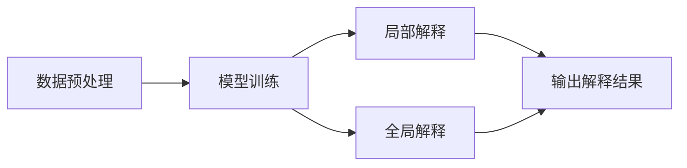

                 

### 文章标题：评测系统的可解释性：理解LLM决策背后的原因

> 关键词：评测系统、可解释性、LLM、决策原因、技术博客

> 摘要：本文深入探讨了评测系统的可解释性问题，特别是在理解大型语言模型（LLM）决策背后的原因。文章从背景介绍、核心概念、决策过程解析、算法原理讲解、实践应用与案例分析，到最佳实践与总结展望，逐步阐述了评测系统可解释性的重要性以及如何通过技术手段提升这一能力。

### 引言与背景

#### 第1章：问题背景

**1.1 评测系统的重要性**

在信息化时代，评测系统无处不在，从教育考试、质量检测到商业决策，它们都在为人类提供可靠的评估结果。然而，随着人工智能技术的发展，特别是大型语言模型（LLM）的广泛应用，评测系统的透明度和可解释性变得愈发重要。传统的评测系统往往依赖于复杂的算法和模型，而这些系统在决策时却缺乏透明度，难以解释其背后的原因。

**1.2 可解释性的需求**

可解释性是指系统能够解释其决策过程的能力。在人工智能领域，可解释性是一个核心问题。LLM作为人工智能的代表，其强大而复杂的决策过程让用户难以理解。因此，提高评测系统的可解释性，使其决策过程更加透明，对于提升用户信任度、改进算法设计和优化用户体验至关重要。

**1.3 LLM概述**

LLM（如GPT、BERT等）是近年来人工智能领域的重大突破。这些模型通过训练大规模的文本数据，能够生成高质量的自然语言文本，并在各种任务中表现出色。然而，LLM的决策过程高度复杂，缺乏透明性，这使得理解其决策背后的原因成为一个挑战。

**1.4 可解释性研究的现状与挑战**

当前，可解释性研究已经在人工智能领域取得了显著进展。研究者们提出了多种方法来解释LLM的决策过程，如局部解释方法、全局解释方法等。然而，这些方法在解释的准确性、模型的可解释性和计算效率等方面仍面临挑战。

### 核心概念

#### 第2章：核心概念

**2.1 LLM工作原理**

LLM的工作原理主要基于深度学习和自然语言处理技术。这些模型通常由多层神经网络构成，能够通过训练大量文本数据学习语言的模式和结构。

**2.2 决策可解释性的定义**

决策可解释性是指系统能够解释其决策过程的能力。在LLM的背景下，可解释性意味着用户可以理解模型为何做出特定决策的原因。

**2.3 可解释性的重要性**

可解释性对于提升用户体验、增强模型的可信度、改进算法设计和优化模型性能至关重要。特别是在涉及到重要决策的场景，如医疗诊断、金融风险评估等，可解释性更是不可或缺。

### LLM决策过程解析

#### 第3章：LLM结构解析

**3.1 语言模型的组成**

LLM通常由输入层、隐藏层和输出层组成。输入层接收文本数据，隐藏层通过神经网络进行处理，输出层生成预测结果。

**3.2 训练与优化的过程**

LLM的训练过程涉及大量文本数据的学习和优化。通过反向传播算法和优化器，模型不断调整参数以最小化损失函数，从而提高预测准确性。

**3.3 Mermaid流程图：LLM决策流程**

使用Mermaid流程图，我们可以清晰地展示LLM的决策流程，包括数据输入、模型处理、预测输出等步骤。


### 可解释性技术

#### 第4章：可解释性技术

**4.1 局部解释方法**

局部解释方法关注于解释模型在特定输入下的决策过程。常见的方法包括梯度解释、SHAP值解释等。

**4.2 全球解释方法**

全球解释方法旨在解释模型的整体行为。这类方法通常通过可视化模型对数据的权重分配来展示模型的决策模式。

**4.3 可解释性的评估指标**

评估可解释性的指标包括解释的准确性、模型的可解释性和用户的理解度等。通过这些指标，我们可以衡量不同解释方法的性能。

### 算法原理与数学模型

#### 第5章：算法原理与数学模型

**5.1 算法原理讲解**

在本章节中，我们将详细讲解局部解释方法和全局解释方法的算法原理，并使用Python源代码进行实际演示。

**5.2 数学模型与公式**

为了更好地理解算法原理，我们将使用LaTeX格式展示相关的数学模型和公式。

$$
\text{损失函数} = \frac{1}{n}\sum_{i=1}^{n} (\text{预测值} - \text{真实值})^2
$$

**5.3 Python源代码示例**

我们将提供Python源代码示例，演示如何实现局部解释方法和全局解释方法。

```python
import tensorflow as tf

# 模型定义
model = ...

# 局部解释
explanation = ...

# 全局解释
explanation_global = ...

# 输出解释结果
print(explanation)
print(explanation_global)
```

**5.4 Mermaid流程图：算法实现**

使用Mermaid流程图，我们可以展示算法的实现流程，包括数据预处理、模型训练、解释方法应用等步骤。



### 实践应用与案例分析

#### 第6章：评测系统可解释性实践

**6.1 实践环境搭建**

在本章节中，我们将介绍如何搭建评测系统的实践环境，包括所需软件和硬件的安装与配置。

**6.2 系统核心实现**

我们将详细介绍评测系统的核心实现，包括数据输入、模型处理、预测输出等步骤。

**6.3 代码应用解读**

通过代码示例，我们将解读评测系统的实现细节，并解释关键代码的功能。

**6.4 案例分析**

我们将通过实际案例，展示评测系统在具体场景中的应用，并剖析其决策过程。

**6.5 详细讲解与剖析**

在本章节的最后，我们将对评测系统的可解释性进行详细讲解和剖析，帮助读者深入理解其工作原理。

### 最佳实践与注意事项

#### 第7章：最佳实践与注意事项

**7.1 最佳实践建议**

在本章节中，我们将总结最佳实践，提供一些建议，帮助读者在实际应用中提升评测系统的可解释性。

**7.2 注意事项**

我们将列出一些注意事项，提醒读者在实现评测系统时可能遇到的问题和挑战。

**7.3 拓展阅读**

最后，我们将推荐一些拓展阅读材料，帮助读者深入了解评测系统的可解释性技术。

### 总结与展望

#### 第8章：总结与展望

**8.1 总结回顾**

在本章节中，我们将回顾文章的主要内容和核心观点，总结评测系统可解释性的重要性和应用前景。

**8.2 研究展望**

我们将对评测系统的可解释性研究进行展望，探讨未来的研究方向和挑战。

### 作者信息

- 作者：AI天才研究院/AI Genius Institute & 禅与计算机程序设计艺术 /Zen And The Art of Computer Programming

在接下来的内容中，我们将逐步深入探讨评测系统的可解释性问题，帮助读者理解LLM决策背后的原因。希望通过这篇文章，读者能够对评测系统的可解释性有更深入的认识，并在实际应用中取得更好的成果。让我们开始吧！

