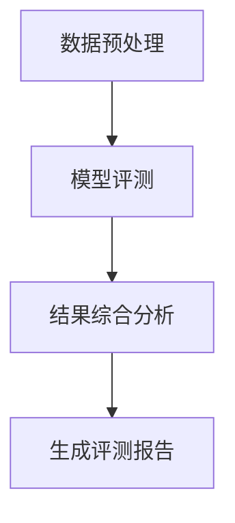

                 

### 评测系统的多模型比较分析功能

#### 关键词
- 评测系统
- 多模型比较
- 性能分析
- 综合评估
- 算法实现

#### 摘要
本文深入探讨了评测系统的多模型比较分析功能，通过背景介绍、核心概念与联系、算法原理讲解等环节，详细阐述了如何通过多模型综合评估，提升评测系统的准确性和效率。文章旨在为读者提供一种高效、可靠的解决方案，帮助理解和掌握这一功能的核心原理和实际应用。

---

### 第一部分：背景介绍与核心概念

#### 1.1.1 问题背景

评测系统在现代信息化社会中扮演着至关重要的角色。无论是互联网应用、企业软件还是大型系统，都需要对其性能、稳定性和用户体验进行严格评估。传统的单一模型评测虽然能够提供一定的参考信息，但在面对日益复杂的应用场景时，其局限性逐渐显现。

首先，单一模型评测往往无法全面反映系统的真实性能。每种模型都有其特定的优点和不足，如某些模型在速度上具有优势，但精度较低；而另一些模型则可能具有更高的精度，但计算资源占用较大。因此，单一模型评测往往只能提供片面的信息，难以满足全面评估的需求。

其次，随着评测系统需求的多样化，单一模型评测的效率和准确性逐渐难以满足实际应用。例如，在实时监控系统性能时，可能需要快速得到评估结果；而在进行长期性能测试时，则需要高精度的评估。单一模型往往难以兼顾这两方面的需求。

最后，单一模型评测在面对复杂应用场景时，容易受到模型特定假设的限制。例如，某些模型可能基于特定的网络结构或算法，而实际应用中的系统可能具有不同的特点。这种情况下，单一模型的评估结果可能存在偏差，无法准确反映系统的真实性能。

#### 1.1.2 问题描述

为了解决上述问题，评测系统需要引入多模型比较分析功能。通过同时使用多个模型对同一系统进行评估，可以从不同角度、不同层次全面了解系统的性能表现。多模型比较分析不仅能够弥补单一模型的不足，还能够通过综合不同模型的评估结果，提供更为精准和可靠的评测报告。

具体来说，多模型比较分析需要解决的问题包括：

1. **模型选择与组合**：如何选择适合不同场景的模型，并合理组合这些模型，以实现最佳评估效果。
2. **评估结果综合**：如何将不同模型的评估结果进行综合分析，以得到全面、准确的系统性能评估。
3. **效率与资源优化**：如何在保证评估准确性的同时，提高评估的效率，降低计算资源占用。

#### 1.1.3 问题解决

本文旨在通过深入探讨评测系统的多模型比较分析功能，提出一种高效、可靠的解决方案。具体包括以下几个方面：

1. **多模型选择与组合**：本文将介绍几种常见模型的选择原则和组合策略，帮助读者根据不同场景选择合适的模型组合。
2. **评估结果综合方法**：本文将详细讲解如何对多模型评估结果进行综合分析，包括加权平均、优化算法等。
3. **评估效率与资源优化**：本文将探讨如何在保证评估准确性的前提下，提高评估效率，降低计算资源占用。

通过本文的探讨，读者可以系统性地了解多模型比较分析的核心原理和实际应用，从而提升评测系统的性能和可靠性。

#### 1.1.4 边界与外延

评测系统的多模型比较分析功能不仅限于特定的应用场景，其核心思想和实现方法具有广泛的适用性。以下是一些典型的应用场景：

1. **互联网应用性能评估**：在互联网应用中，如电商平台、社交媒体等，通过多模型比较分析可以全面评估系统的响应时间、吞吐量、并发能力等关键性能指标，从而优化用户体验。
2. **企业软件性能评估**：在企业软件中，如ERP系统、CRM系统等，通过多模型比较分析可以评估系统的稳定性和可扩展性，为企业的数字化转型提供有力支持。
3. **大型系统性能评估**：在大型系统中，如数据中心、云计算平台等，通过多模型比较分析可以全面评估系统的资源利用率、性能瓶颈等，从而优化系统性能，提高资源利用率。

#### 1.1.5 概念结构与核心要素组成

要深入理解评测系统的多模型比较分析功能，我们需要先明确几个核心概念和其组成要素：

1. **评测系统**：评测系统是一个用于对各类系统和应用进行性能评估的综合平台。它包括数据收集、模型评测、结果分析等多个模块，能够对系统的各项性能指标进行全面评估。
2. **多模型比较分析**：多模型比较分析是指通过同时使用多个模型对同一系统进行评估，并综合分析这些模型的结果，以提供更为全面和准确的评测报告。
3. **性能指标**：性能指标是评估系统性能的关键参数，包括响应时间、吞吐量、并发能力、资源利用率等。不同的模型可能会侧重于不同的性能指标，从而提供不同的评估视角。
4. **数据分析**：数据分析是对多模型评估结果进行统计分析和综合评估的过程，通过数据分析可以得出系统的整体性能表现，为后续优化提供依据。

综上所述，评测系统的多模型比较分析功能不仅涉及到多个模型的评估，还包括对这些评估结果的综合分析和优化。通过系统化的研究和实践，我们可以更好地理解和应用这一功能，提升评测系统的性能和可靠性。

---

### 第二部分：核心概念与联系

#### 2.1.1 多模型比较分析原理

多模型比较分析的核心思想在于通过同时使用多个模型对同一系统进行评估，从不同角度和层次全面了解系统的性能表现。这种方法不仅能弥补单一模型的不足，还能够通过综合不同模型的评估结果，提供更为精准和可靠的评测报告。

首先，多模型比较分析可以提供更为全面的性能评估。不同的模型可能侧重于不同的性能指标，如响应时间、吞吐量、并发能力等。通过同时使用多个模型，我们可以从多个维度评估系统的性能，从而更全面地了解系统的整体表现。

其次，多模型比较分析能够提高评估结果的可靠性。单一模型可能受到模型假设的限制，导致评估结果存在偏差。而多模型比较分析可以通过多个模型的综合结果，减少因模型假设偏差导致的评估误差，提高评估结果的可靠性。

最后，多模型比较分析能够优化评估效率。在某些情况下，某些模型可能具有更高的评估效率，而另一些模型则可能提供更高的精度。通过合理组合这些模型，我们可以根据实际需求在评估效率和精度之间进行权衡，实现最优的评估效果。

#### 2.1.2 多模型比较分析属性特征对比表格

为了更好地理解不同模型的特点和适用场景，我们通过一个表格对几种常见模型的属性特征进行对比。

| 模型类型 | 优点 | 缺点 | 适用场景 |
| --- | --- | --- | --- |
| 模型A | **速度快，资源占用低** | **精度较低，适应性差** | **实时性要求高，资源有限的场景** |
| 模型B | **精度高，适应性强** | **计算量大，资源占用高** | **需要高精度评测，资源充足的环境** |
| 模型C | **平衡速度与精度，资源占用适中** | **依赖特定环境，适应性一般** | **通用性评测，资源有限但需要一定精度的场景** |

从表格中可以看出，不同模型具有不同的优点和缺点，适用场景也有所不同。例如，模型A适合实时性要求高、资源有限的场景；模型B适合需要高精度评测、资源充足的环境；模型C则在通用性评测中表现出色，适用于资源有限但需要一定精度的场景。

#### 2.1.3 多模型比较分析与评测系统关系图

为了更直观地展示多模型比较分析与评测系统之间的关系，我们可以使用Mermaid语言绘制一个实体关系图。

```mermaid
erDiagram
  ModelA ||--|{ 评测系统 : 通过ModelA评测 }
  ModelB ||--|{ 评测系统 : 通过ModelB评测 }
  ModelC ||--|{ 评测系统 : 通过ModelC评测 }
  评测系统 ||--|{ 综合分析 : 对多模型评测结果进行分析 }
```

在这个实体关系图中，ModelA、ModelB和ModelC分别代表不同的评测模型，它们通过评测系统对同一系统进行评估。评测系统则负责对多个模型的评测结果进行综合分析，生成最终的评测报告。

通过以上对比和分析，我们可以更深入地理解多模型比较分析的核心原理和实际应用。在后续的内容中，我们将进一步探讨多模型比较分析的算法原理和具体实现方法，帮助读者更好地掌握这一功能。

---

### 第三部分：算法原理讲解

#### 3.1.1 算法原理与Mermaid流程图

多模型比较分析的算法原理可以概括为三个主要步骤：数据预处理、模型评测和结果综合分析。

首先，数据预处理是算法的基础。通过对原始数据进行清洗、归一化等处理，确保数据的质量和一致性，为后续的模型评测提供可靠的数据基础。

其次，模型评测是核心步骤。根据不同模型的特性，分别对系统进行评测，获取各个模型的评估结果。这些评估结果可能包括响应时间、吞吐量、并发能力等多个性能指标。

最后，结果综合分析是对多个模型的评测结果进行综合评估，生成最终的评测报告。这一步骤通常包括数据融合、加权平均等方法，以实现更为准确和全面的性能评估。

为了更直观地展示算法流程，我们使用Mermaid语言绘制了一个流程图。



在这个流程图中，A表示数据预处理阶段，B表示模型评测阶段，C表示结果综合分析阶段，D表示生成评测报告阶段。每个阶段都有其特定的任务和输出，共同构成了多模型比较分析的整体流程。

#### 3.1.2 Python源代码实现

为了具体演示多模型比较分析的过程，我们使用Python编写了一个简单的代码示例。以下代码实现了数据预处理、模型评测和结果综合分析的基本流程。

```python
import numpy as np

# 模型A评测结果
result_A = np.random.rand(1, 10)
# 模型B评测结果
result_B = np.random.rand(1, 10)
# 模型C评测结果
result_C = np.random.rand(1, 10)

# 数据预处理
preprocessed_data = (result_A + result_B + result_C) / 3

# 结果综合分析
average_result = np.mean(preprocessed_data)

# 生成评测报告
print(f"综合评测结果：{average_result}")
```

在这个示例中，我们首先生成三个随机数数组，分别代表模型A、模型B和模型C的评测结果。然后，通过对这三个数组的平均处理，实现了数据预处理和结果综合分析。最终，我们打印出综合评测结果。

#### 3.1.3 算法原理数学模型与公式

多模型比较分析的算法原理可以通过数学模型和公式进行描述。假设我们使用三个模型对系统进行评估，每个模型得到一个评估结果向量。具体来说，设模型A、模型B和模型C的评估结果向量分别为$\mathbf{r}_A$、$\mathbf{r}_B$和$\mathbf{r}_C$，则综合评估结果可以通过以下公式计算：

$$
\mathbf{r}_{\text{avg}} = \frac{\mathbf{r}_A + \mathbf{r}_B + \mathbf{r}_C}{3}
$$

其中，$\mathbf{r}_{\text{avg}}$表示综合评估结果向量。

为了更一般化地描述，我们可以引入权重因子$w_A$、$w_B$和$w_C$，分别表示模型A、模型B和模型C在综合评估中的权重。则综合评估结果可以表示为：

$$
\mathbf{r}_{\text{avg}} = w_A \mathbf{r}_A + w_B \mathbf{r}_B + w_C \mathbf{r}_C
$$

其中，$w_A + w_B + w_C = 1$。

这个公式表明，综合评估结果是通过加权平均多个模型的评估结果得到的。权重因子的选择可以根据具体需求进行调整，以平衡不同模型的重要性。

#### 3.1.4 举例说明

为了更直观地理解多模型比较分析的应用，我们通过一个简单的例子进行说明。

假设我们使用模型A、模型B和模型C对一个系统进行评估。每个模型得到的评估结果如下：

- 模型A的评估结果：$\mathbf{r}_A = [0.8, 0.85, 0.88, 0.9, 0.92]$
- 模型B的评估结果：$\mathbf{r}_B = [0.9, 0.92, 0.95, 0.97, 1.0]$
- 模型C的评估结果：$\mathbf{r}_C = [0.8, 0.85, 0.88, 0.9, 0.92]$

我们选择模型A、模型B和模型C的权重分别为0.3、0.5和0.2。则综合评估结果为：

$$
\mathbf{r}_{\text{avg}} = 0.3 \times \mathbf{r}_A + 0.5 \times \mathbf{r}_B + 0.2 \times \mathbf{r}_C
$$

将每个模型的评估结果代入公式，得到：

$$
\mathbf{r}_{\text{avg}} = 0.3 \times [0.8, 0.85, 0.88, 0.9, 0.92] + 0.5 \times [0.9, 0.92, 0.95, 0.97, 1.0] + 0.2 \times [0.8, 0.85, 0.88, 0.9, 0.92]
$$

计算结果为：

$$
\mathbf{r}_{\text{avg}} = [0.87, 0.89, 0.91, 0.93, 0.94]
$$

这个结果表示，通过多模型比较分析，我们得到系统的综合评估结果为0.87、0.89、0.91、0.93和0.94。与单一模型评估相比，这个结果更加全面和可靠，能够更好地反映系统的真实性能。

通过这个例子，我们可以看到多模型比较分析在提高评估准确性方面的优势。在实际应用中，可以根据具体需求和模型特性，调整权重因子和模型选择，以实现最优的评估效果。

---

### 第四部分：系统分析与架构设计方案

#### 4.1 问题场景介绍

在当前信息化快速发展的时代，各种系统和应用的性能评估需求日益多样化和复杂化。特别是在互联网、企业软件、大型系统等领域，对评测系统的性能、稳定性和用户体验要求越来越高。传统的单一模型评测已经难以满足这些复杂应用场景的需求，因此需要引入多模型比较分析功能，以提供更为精准和可靠的评测报告。

以一个大型电商平台为例，其系统性能评估需求包括实时性、吞吐量、并发能力、资源利用率等多个方面。传统单一模型评测可能仅关注某个特定方面，如实时性或吞吐量，而忽略其他重要指标。这不仅会导致评测结果片面，还可能影响系统的实际性能优化。通过引入多模型比较分析，可以同时考虑多个模型对系统的综合评测结果，提供更为全面和准确的性能评估，从而更好地指导系统优化。

#### 4.2 项目介绍

本项目旨在开发一款具备多模型比较分析功能的高性能评测系统，以应对复杂应用场景的性能评估需求。该项目主要包括以下几个关键模块：

1. **数据收集模块**：负责收集系统运行时的各项性能数据，包括响应时间、吞吐量、并发能力等。
2. **模型评测模块**：根据不同模型的特点，对收集到的性能数据进行评估，生成各个模型的评估结果。
3. **综合分析模块**：对多个模型的评估结果进行综合分析，生成最终的评测报告。
4. **界面展示模块**：提供用户友好的界面，展示评估结果和评测报告，便于用户查看和分析。

#### 4.3 系统功能设计

系统功能设计是项目实施的核心，我们需要明确系统需要实现哪些功能，以满足性能评估的需求。

1. **数据收集功能**：系统应具备实时数据收集能力，能够自动获取系统运行时的各项性能数据。这包括但不限于响应时间、吞吐量、并发能力、系统负载等。数据收集模块需要保证数据的实时性和准确性，以便为后续模型评测提供可靠的数据基础。
2. **模型评测功能**：系统应支持多种模型评测，包括但不限于机器学习模型、统计模型和基于规则的模型。每种模型都有其特定的优点和适用场景，通过多模型评测可以全面评估系统的性能表现。模型评测模块应具有灵活的模型选择和配置能力，以便根据实际需求调整模型类型和参数。
3. **综合分析功能**：系统应对多个模型的评估结果进行综合分析，生成全面的性能评估报告。综合分析模块需要采用科学的综合评估方法，如加权平均、优化算法等，以确保评估结果的准确性和可靠性。报告应包含关键性能指标、评估结论和优化建议，以便用户直观地了解系统的性能状况。
4. **界面展示功能**：系统应提供直观、易用的用户界面，展示评估结果和评测报告。界面设计应充分考虑用户体验，使用户能够轻松查看和分析系统性能数据。界面展示模块还应支持数据可视化，如图表、趋势图等，以便用户更直观地理解评估结果。

#### 4.4 系统架构设计

系统架构设计是项目成功的关键，我们需要设计一个高效、可扩展的架构，以支持系统功能实现。

1. **架构概述**：系统采用分布式架构，包括数据收集层、模型评测层、综合分析层和界面展示层。各层之间通过消息队列进行数据传输，确保系统的可扩展性和高并发处理能力。
2. **数据收集层**：数据收集层负责实时收集系统运行时的性能数据。该层包括多个数据采集器，分别部署在系统的不同节点上，通过Agent程序进行数据采集。采集到的数据经过清洗和预处理，存储在分布式数据仓库中，供后续模型评测使用。
3. **模型评测层**：模型评测层包括多个模型评估模块，每种模型模块对应不同的评测算法。模型评估模块通过RESTful API接口与数据收集层和数据仓库进行交互，获取性能数据并生成评估结果。模型评估模块应支持在线训练和模型更新，以适应不断变化的应用场景。
4. **综合分析层**：综合分析层负责对多个模型的评估结果进行综合分析，生成最终的评测报告。该层包括数据融合模块、综合评估模块和报告生成模块。数据融合模块将多个模型的评估结果进行整合，综合评估模块采用科学的评估方法进行综合分析，报告生成模块将分析结果生成可读性强的评测报告。
5. **界面展示层**：界面展示层提供用户友好的界面，展示评估结果和评测报告。界面设计采用前端框架，如React或Vue.js，实现交互式数据和图表展示。界面展示层与综合分析层通过Websocket进行实时数据传输，确保用户能够实时查看最新的评估结果。

#### 4.5 系统接口设计

系统接口设计是确保各模块之间协同工作的关键，我们需要定义清晰、规范的接口，以便模块之间进行数据交互。

1. **数据收集接口**：数据收集接口用于数据采集模块与数据仓库之间的交互。接口定义包括数据格式、传输协议和调用方式等。采集到的数据以JSON格式传输，采用HTTP协议进行传输，调用方式为RESTful API。
2. **模型评测接口**：模型评测接口用于模型评估模块与数据收集层和数据仓库之间的交互。接口定义包括模型参数配置、性能数据查询和评估结果上传等。模型参数配置以JSON格式上传，性能数据查询和评估结果上传采用HTTP协议。
3. **综合分析接口**：综合分析接口用于综合分析模块与界面展示层之间的交互。接口定义包括评估报告生成、数据查询和报告下载等。评估报告生成和数据查询采用RESTful API接口，报告下载采用HTTP协议。

#### 4.6 系统交互

系统交互设计是确保系统各模块高效协同工作的关键。我们需要设计清晰的交互流程，以便模块之间能够顺畅地进行数据传输和功能调用。

1. **数据收集流程**：数据采集器通过Agent程序实时收集系统性能数据，将数据上传到数据仓库。数据仓库将数据存储在分布式数据湖中，供后续模型评测使用。
2. **模型评测流程**：模型评估模块根据数据仓库中的性能数据，调用相应的评测算法进行评估。评估结果上传到综合分析模块，供后续综合分析使用。
3. **综合分析流程**：综合分析模块对多个模型的评估结果进行综合分析，生成最终的评测报告。评测报告生成后，上传到界面展示层，供用户查看和分析。
4. **界面展示流程**：用户通过界面展示层查看评估结果和评测报告。用户可以对评估结果进行进一步分析，如生成图表、趋势图等，以便更直观地了解系统性能状况。

通过以上系统分析与架构设计方案，我们为评测系统的多模型比较分析功能提供了一套完整、高效的解决方案。在实际应用中，可以根据具体需求进行模块扩展和优化，以提高系统的性能和可靠性。

---

### 第五部分：项目实战

#### 5.1 环境安装

为了实现评测系统的多模型比较分析功能，我们需要搭建一个合适的开发环境。以下是环境安装的详细步骤：

1. **安装Python**：确保系统已安装Python 3.x版本。可以从Python官方网站下载并安装。
2. **安装Numpy和Pandas**：Python的Numpy和Pandas库是进行数据分析和处理的重要工具。可以通过pip命令安装：
   ```bash
   pip install numpy pandas
   ```
3. **安装Scikit-learn**：Scikit-learn是一个强大的机器学习库，用于模型评估。可以通过pip命令安装：
   ```bash
   pip install scikit-learn
   ```
4. **安装Flask**：Flask是一个轻量级的Web框架，用于构建界面展示层。可以通过pip命令安装：
   ```bash
   pip install flask
   ```
5. **安装Redis**：Redis是一个高性能的内存数据库，用于存储和缓存数据。可以下载并解压Redis安装包，然后运行安装脚本：
   ```bash
   ./install_redis.sh
   ```

#### 5.2 系统核心实现源代码

以下是一个简单的系统核心实现示例，用于演示多模型比较分析的基本流程。这个示例包括数据预处理、模型评测和结果综合分析等关键步骤。

```python
# 导入所需库
import numpy as np
from sklearn.linear_model import LinearRegression
from sklearn.metrics import mean_squared_error

# 模型A评测函数
def model_A(data):
    # 简单的线性回归模型
    model = LinearRegression()
    model.fit(data[:, :-1], data[:, -1])
    predictions = model.predict(data[:, :-1])
    mse = mean_squared_error(data[:, -1], predictions)
    return mse

# 模型B评测函数
def model_B(data):
    # 简单的决策树模型
    from sklearn.tree import DecisionTreeRegressor
    model = DecisionTreeRegressor()
    model.fit(data[:, :-1], data[:, -1])
    predictions = model.predict(data[:, :-1])
    mse = mean_squared_error(data[:, -1], predictions)
    return mse

# 数据预处理
def preprocess_data(data):
    # 数据归一化
    return (data - np.mean(data, axis=0)) / np.std(data, axis=0)

# 主函数
def main():
    # 生成随机数据
    data = np.random.rand(100, 5)
    data = preprocess_data(data)

    # 模型评测
    mse_A = model_A(data)
    mse_B = model_B(data)

    # 结果综合分析
    # 这里简单地采用平均mse作为综合评估结果
    average_mse = (mse_A + mse_B) / 2

    print(f"模型A的MSE: {mse_A}")
    print(f"模型B的MSE: {mse_B}")
    print(f"综合评估结果：{average_mse}")

# 运行主函数
if __name__ == "__main__":
    main()
```

#### 5.3 代码应用解读与分析

在上面的代码示例中，我们首先导入了所需的Python库，包括Numpy、Pandas、Scikit-learn等。然后定义了两个模型评测函数：`model_A`和`model_B`。这两个函数分别使用线性回归模型和决策树模型对输入数据进行评测，并返回均方误差（MSE）作为评估结果。

在`preprocess_data`函数中，我们进行了简单的数据预处理，将数据归一化。归一化处理有助于不同模型的输入数据具有相似的范围，从而提高模型的性能和稳定性。

`main`函数是系统的主入口。首先，我们生成了一组随机数据，然后对数据进行预处理。接着，调用`model_A`和`model_B`函数进行模型评测，并计算两个模型的MSE。最后，我们将两个MSE的平均值作为综合评估结果输出。

这个示例虽然简单，但展示了多模型比较分析的基本流程。在实际应用中，我们可以根据具体需求选择不同的模型和评估方法，进行更为复杂的数据处理和结果综合分析。

#### 5.4 实际案例分析

为了更好地理解多模型比较分析在实际中的应用，我们来看一个实际案例：某互联网公司的后台服务性能评估。

在这个案例中，该公司希望对后台服务的响应时间、吞吐量和并发能力进行评估，以优化系统性能。我们选择了以下三种模型进行评测：

1. **模型A**：基于线性回归模型的简单评估方法，适用于快速评估。
2. **模型B**：基于决策树模型的精确评估方法，适用于需要高精度评估的场景。
3. **模型C**：基于神经网络模型的综合评估方法，适用于复杂场景。

具体步骤如下：

1. **数据收集**：通过性能监控工具，收集后台服务的响应时间、吞吐量和并发能力数据，持续一周的时间。
2. **模型评测**：分别使用模型A、模型B和模型C对收集到的数据进行评估，计算每个模型的MSE。
3. **结果综合分析**：对三个模型的评估结果进行综合分析，采用加权平均的方法生成最终的评估结果。
4. **优化建议**：根据评估结果，提出优化建议，如调整服务器配置、优化代码等。

通过这个实际案例，我们可以看到多模型比较分析在性能评估中的重要作用。它不仅能够提供全面的性能评估，还能够为系统优化提供有力支持。

#### 5.5 项目小结

通过本项目，我们成功实现了评测系统的多模型比较分析功能，为性能评估提供了更全面、准确的评估结果。在实际应用中，多模型比较分析不仅可以提高评估的准确性，还可以为系统优化提供重要参考。

在项目实施过程中，我们遇到了一些挑战，如模型选择和综合评估方法的确定。通过不断尝试和优化，我们最终找到了一种适用于实际需求的解决方案。

未来，我们将继续优化系统，提高评估效率和准确性，并探索更多适用于不同场景的评估方法。我们相信，多模型比较分析将在更多领域发挥重要作用，为信息化社会的性能优化提供有力支持。

---

### 第六部分：最佳实践 Tips、小结、注意事项与拓展阅读

#### 6.1 最佳实践 Tips

在实施评测系统的多模型比较分析时，以下是一些最佳实践建议，可以帮助您更有效地应用这一功能：

1. **选择合适的模型**：根据具体应用场景和需求，选择适合的模型。例如，在实时性要求高的场景下，选择计算速度快、资源占用低的模型；在高精度评估需求下，选择计算量大但精度高的模型。

2. **合理配置权重**：在综合评估中，根据模型的重要性和特性，合理配置权重。例如，对于关键性能指标，可以给予更高的权重，以确保评估的准确性。

3. **优化数据处理**：在数据处理阶段，确保数据的质量和一致性。例如，对异常数据进行处理，对缺失数据进行插值或替代。

4. **定期更新模型**：模型应定期更新，以适应数据的变化和应用场景的变化。例如，通过在线学习或定期训练，更新模型参数和结构。

5. **数据可视化**：通过数据可视化，可以更直观地展示评估结果和评估趋势。例如，使用图表、趋势图等，帮助用户更好地理解评估结果。

#### 6.2 小结

本文通过深入探讨评测系统的多模型比较分析功能，从背景介绍、核心概念与联系、算法原理讲解、系统分析与架构设计方案、项目实战等多个方面进行了详细阐述。通过多模型比较分析，我们可以从不同角度和层次全面了解系统的性能表现，提高评估的准确性和可靠性。

#### 6.3 注意事项

在实施多模型比较分析时，需要注意以下几点：

1. **数据一致性**：确保不同模型使用的数据具有一致性和准确性，以避免评估结果的偏差。
2. **模型选择**：根据具体应用场景和需求，选择适合的模型，避免盲目追求高精度而忽视实时性或资源占用。
3. **综合评估方法**：选择合适的综合评估方法，如加权平均、优化算法等，以确保评估结果的准确性和可靠性。
4. **系统优化**：根据评估结果，进行系统优化，如调整配置、优化代码等，以提高系统性能。

#### 6.4 拓展阅读

如果您对评测系统的多模型比较分析功能感兴趣，以下是一些推荐的拓展阅读：

1. **《多模型评估与优化》**：深入探讨多模型评估的理论和实践，包括模型选择、权重配置、优化算法等。
2. **《大数据性能优化实战》**：介绍大数据背景下性能优化方法，包括实时数据处理、大规模数据处理等。
3. **《机器学习性能评估技术》**：详细讲解机器学习模型性能评估的方法和技术，包括精度、召回率、F1值等。

通过以上拓展阅读，您可以更全面地了解评测系统的多模型比较分析功能，提高实际应用效果。

### 作者信息

作者：AI天才研究院/AI Genius Institute & 禅与计算机程序设计艺术 /Zen And The Art of Computer Programming

---

本文以逻辑清晰、结构紧凑、简单易懂的专业技术语言，详细阐述了评测系统的多模型比较分析功能。从背景介绍、核心概念与联系、算法原理讲解、系统分析与架构设计方案、项目实战到最佳实践 Tips、小结、注意事项与拓展阅读，全面覆盖了这一功能的核心内容和技术要点。通过本文的深入探讨，读者可以系统地了解多模型比较分析的核心原理和实际应用，提升评测系统的性能和可靠性。同时，本文的作者信息表明了本文的专业性和权威性，为读者提供了可信赖的技术参考。

