                 

### 文章标题

# 评测系统的多模态融合技术

---

> 关键词：多模态融合、评测系统、人工智能、数据预处理、特征提取、系统设计、应用案例

> 摘要：本文详细探讨了评测系统的多模态融合技术，首先介绍了多模态融合的背景和核心概念，随后逐步深入到数据预处理、特征提取与融合方法，以及多模态评测系统的设计与应用。通过具体案例分析，本文展示了多模态融合技术在现代评测系统中的重要作用，为相关领域的开发和应用提供了有价值的参考。

---

## 目录大纲

## 第一部分：多模态融合技术概述

### 第1章：多模态融合技术背景

#### 1.1 问题的提出

#### 1.2 多模态数据的来源与挑战

#### 1.3 多模态融合的重要性

#### 1.4 多模态融合的现状与发展趋势

### 第2章：多模态融合的核心概念

#### 2.1 多模态融合的定义

#### 2.2 多模态融合的类型

#### 2.3 多模态融合的挑战

## 第二部分：多模态数据预处理

### 第3章：多模态数据采集与标注

#### 3.1 多模态数据采集

#### 3.2 多模态数据标注

### 第4章：多模态数据清洗与标准化

#### 4.1 数据清洗

#### 4.2 数据标准化

## 第三部分：多模态特征提取与融合

### 第5章：多模态特征提取技术

#### 5.1 视觉特征提取

#### 5.2 听觉特征提取

#### 5.3 文本特征提取

### 第6章：多模态特征融合方法

#### 6.1 集成学习

#### 6.2 特征级融合

#### 6.3 决策级融合

## 第四部分：多模态评测系统设计

### 第7章：多模态评测系统架构设计

#### 7.1 系统架构概述

#### 7.2 数据流设计

#### 7.3 系统接口设计

### 第8章：多模态评测系统实现

#### 8.1 系统开发环境

#### 8.2 核心算法实现

#### 8.3 系统部署与测试

## 第五部分：多模态融合技术的应用

### 第9章：多模态融合技术在安防领域的应用

#### 9.1 概述

#### 9.2 具体应用案例

### 第10章：多模态融合技术在医疗领域的应用

#### 10.1 概述

#### 10.2 具体应用案例

---

## 第一部分：多模态融合技术概述

### 第1章：多模态融合技术背景

#### 1.1 问题的提出

在当今信息化和数据驱动的社会中，多模态数据融合技术成为了人工智能和机器学习领域的一个重要研究方向。多模态数据融合技术是指将不同类型的数据源（如视觉、听觉、文本等）进行整合，以提取更加丰富和全面的特征信息，从而提升模型的性能和准确性。

随着人工智能技术的快速发展，多模态数据融合在多个领域都展现出了巨大的应用潜力。例如，在图像识别和语音识别任务中，仅依赖于单一模态的数据往往难以达到最优的效果。多模态融合技术能够充分利用多种数据源的优势，提高模型在复杂环境下的鲁棒性和适应性。

然而，多模态数据融合也面临诸多挑战。首先，不同类型的数据在采集、标注和处理过程中存在差异，如何实现高效且准确的数据同步和预处理是一个关键问题。其次，数据源之间可能存在数据不均衡现象，如何处理这种不均衡对模型性能有着重要影响。此外，如何选择和提取有效的特征，以及如何融合不同模态的特征也是一个亟待解决的难题。

本文旨在通过详细探讨多模态融合技术的背景、核心概念和融合方法，为读者提供一个系统且全面的了解。我们将从数据预处理、特征提取与融合方法、多模态评测系统的设计与应用等多个方面展开讨论，力求为相关领域的开发和应用提供有价值的参考。

### 1.2 多模态数据的来源与挑战

多模态数据的来源多种多样，包括视觉、听觉、文本、传感器等。视觉数据来源于摄像头、扫描仪等设备，例如图像和视频；听觉数据来源于麦克风、声卡等设备，例如音频和语音；文本数据来源于键盘、语音识别等设备，例如文档和对话。此外，传感器数据如温度、湿度、压力等也可以被视为一种模态，用于补充和增强其他数据源的丰富性。

这些不同类型的数据源在采集过程中各自面临着独特的挑战。视觉数据的采集需要高分辨率和高帧率的摄像头，同时需要解决光照变化、视角变化和物体遮挡等问题。听觉数据的采集需要高灵敏度的麦克风和高质量的音频设备，同时需要处理噪声干扰和语音识别的准确性问题。文本数据的采集相对简单，但需要解决语言的多样性、错误输入和语义理解等问题。传感器数据的采集则需要可靠的传感器和精准的数据采集系统。

在多模态数据融合过程中，这些不同类型的数据源之间存在着诸多挑战。首先，数据同步问题是一个重要挑战。不同模态的数据往往在不同的时间点或空间点采集，如何实现数据之间的时间同步或空间对齐是一个关键问题。例如，在视频和音频的融合中，视频帧和音频帧需要精确对应，以保证数据的连贯性和一致性。

其次，数据不均衡问题也是多模态融合中常见的一个挑战。不同模态的数据在数量、质量和标注程度上可能存在巨大差异。例如，图像数据量庞大，但文本数据量相对较少。这种数据不均衡会对模型的学习过程和性能产生负面影响。因此，如何平衡不同模态的数据，以提高模型的泛化能力和准确性，是一个亟待解决的问题。

此外，特征选择问题也是多模态融合中的一个重要挑战。不同模态的数据包含了不同类型的特征信息，如视觉数据中的边缘、纹理和颜色特征，听觉数据中的频谱特征和语音特征，文本数据中的词频和语义特征等。如何选择和提取有效的特征，以及如何将这些特征进行有效融合，是一个关键问题。不同的特征选择和融合方法会对模型性能产生显著影响，因此需要仔细研究和设计。

总的来说，多模态数据的来源与挑战为多模态融合技术的实现带来了一系列复杂的问题。通过深入研究这些挑战，我们可以更好地理解多模态数据融合的原理和方法，并为实际应用提供有效的解决方案。

### 1.3 多模态融合的重要性

多模态融合技术之所以受到广泛关注，主要是因为其在提升人工智能系统和应用性能方面具有显著的优势。以下是一些关键点：

首先，多模态融合能够提供更丰富的特征信息。单一模态的数据往往难以捕捉到完整的场景信息。例如，仅使用图像数据识别物体，可能会受到遮挡、光照变化等因素的影响，而结合语音数据可以补充提供关于物体的声音信息，从而提高识别的准确性。通过融合多种模态的数据，我们可以更全面地理解环境，从而提升系统的感知能力和鲁棒性。

其次，多模态融合可以提升模型的泛化能力。不同模态的数据包含了不同类型的特征，这些特征之间可能存在互补关系。通过融合这些特征，我们可以构建更强大的模型，使其在不同环境和条件下都能保持较高的性能。例如，在医疗诊断中，融合医学影像数据和患者的历史病历信息，可以更准确地预测疾病的类型和严重程度，从而提高诊断的准确性。

此外，多模态融合技术还能够增强系统的交互能力。例如，在智能助手或人机交互系统中，通过融合语音、文本和视觉数据，可以实现更自然和流畅的交互体验。用户可以通过语音命令、文本输入和手势等多种方式与系统互动，系统则可以根据用户的反馈进行动态调整和响应，从而提供更加个性化和智能化的服务。

在实际应用中，多模态融合技术已经在多个领域取得了显著成果。例如，在安防领域，通过融合视频监控和音频数据，可以实现更精确的人脸识别和活动检测；在医疗领域，通过融合医学影像和电子病历，可以提供更全面的诊断和治疗方案；在智能家居领域，通过融合传感器数据和用户行为数据，可以实现更加智能和安全的家庭环境。

总的来说，多模态融合技术不仅为人工智能系统和应用提供了更丰富和准确的特征信息，还显著提升了其泛化能力和交互能力。随着多模态数据源的不断增多和人工智能技术的不断进步，多模态融合技术在未来的应用前景将更加广阔，为人类社会带来更多便利和创新。

### 1.4 多模态融合的现状与发展趋势

多模态融合技术作为人工智能领域的一个重要研究方向，已经取得了显著的研究进展和实际应用成果。目前，多模态融合技术主要在以下几个方面取得了重要成果：

首先，在多模态数据预处理方面，研究人员提出了一系列有效的数据同步和标准化方法。例如，通过使用时间戳对齐和空间对齐技术，实现了不同模态数据之间的精确同步。此外，数据清洗和标准化技术也得到了广泛关注，研究人员提出了一系列算法，如去噪、数据补全和特征标准化等，以提高多模态数据的质量和一致性。

其次，在多模态特征提取方面，研究人员开发了多种有效的特征提取算法。例如，在视觉特征提取方面，卷积神经网络（CNN）和深度学习技术得到了广泛应用，通过训练大规模神经网络模型，可以有效提取图像中的关键特征。在听觉特征提取方面，短时傅里叶变换（STFT）、梅尔频率倒谱系数（MFCC）和卷积神经网络等算法被广泛采用，用于提取音频信号中的频谱特征和时间特征。在文本特征提取方面，词袋模型、TF-IDF和词嵌入等技术被广泛应用于文本数据的特征提取。

在多模态特征融合方面，研究人员提出了一系列有效的融合方法。特征级融合和决策级融合是两种主要的方法。特征级融合通过将不同模态的特征进行拼接或映射，形成更加丰富的特征向量，然后输入到分类或回归模型中进行处理。决策级融合则是在不同模态的特征提取后，使用投票、加权平均或贝叶斯网络等方法进行融合，以获得最终的预测结果。

未来，多模态融合技术将继续朝着更加高效、准确和智能化的方向发展。以下是一些可能的发展趋势：

首先，随着深度学习技术的不断进步，深度多模态融合模型将成为研究的热点。深度学习模型能够自动学习复杂的数据特征，因此在多模态融合中具有很大的潜力。例如，多模态卷积神经网络（MM-CNN）和多模态递归神经网络（MM-RNN）等模型已经在图像和语音融合方面取得了显著成果，未来有望在更多应用场景中实现突破。

其次，多模态数据同步和预处理技术将得到进一步优化。当前的多模态数据预处理方法主要依赖于手工设计的特征和算法，未来有望通过自适应学习和优化技术，实现更加高效和智能的数据预处理。

此外，跨模态的交互和解释性研究将成为重要方向。当前的多模态融合技术主要关注模型性能的提升，而对模型内部决策过程和交互机制的深入理解仍然不足。未来，研究人员将致力于开发具有高解释性和可解释性的多模态融合模型，以便更好地理解和优化模型行为。

最后，多模态融合技术将在更多实际应用场景中实现突破。随着物联网、虚拟现实和增强现实等技术的发展，多模态融合技术将在智能家居、智能医疗、智能安防等领域发挥重要作用。未来，多模态融合技术将不仅限于单一领域，而是将在多个领域实现跨界应用，为人类社会带来更多便利和创新。

总的来说，多模态融合技术正处于快速发展的阶段，未来将取得更多的突破和进展。随着技术的不断进步和应用场景的不断扩展，多模态融合技术将在人工智能领域发挥越来越重要的作用，为解决复杂问题提供强有力的支持。

## 第一部分总结

在第一部分中，我们详细介绍了多模态融合技术的背景和重要性。首先，我们探讨了多模态数据融合技术面临的挑战，如数据同步问题、数据不均衡问题和特征选择问题。然后，我们分析了多模态融合技术的重要性，包括提供更丰富的特征信息、提升模型的泛化能力和增强系统的交互能力。此外，我们还回顾了多模态融合技术的研究现状和发展趋势，展示了其在不同领域的应用前景。

在接下来的部分中，我们将深入探讨多模态数据预处理、特征提取与融合方法，以及多模态评测系统的设计与应用。通过逐步分析这些核心概念和方法，我们希望能够为读者提供一个全面且深入的理解，并为实际应用提供有价值的参考。

### 第二部分：多模态数据预处理

多模态数据预处理是多模态融合技术中的一个关键步骤，其目标是提高数据质量、实现数据同步和标准化，从而为后续的特征提取和模型训练打下坚实基础。本部分将详细介绍多模态数据采集与标注、数据清洗与标准化的过程和方法，以期为读者提供完整的预处理思路。

#### 第3章：多模态数据采集与标注

多模态数据采集与标注是数据预处理的第一步，直接影响到后续的特征提取和模型训练效果。以下是具体的内容和步骤：

##### 3.1 多模态数据采集

多模态数据采集包括视觉、听觉和文本数据的采集。每种数据采集方式都有其特定的技术和设备。

**视觉数据采集**：通常使用摄像头、扫描仪等设备。在采集过程中，需要考虑图像的分辨率、帧率、视角和光照等因素。例如，使用高分辨率摄像头可以获取更多的细节信息，但同时也增加了数据量。

**听觉数据采集**：使用麦克风、声卡等设备。在采集过程中，需要关注音频信号的分辨率、采样率和噪声干扰等问题。高质量的音频设备能够获取更清晰的语音信号，从而提高后续处理的效果。

**文本数据采集**：文本数据可以通过键盘输入、语音识别等方式获取。在采集过程中，需要注意语言的多样性、拼写错误和语法问题。此外，语音识别技术的准确性也需要考虑。

##### 3.2 多模态数据标注

数据标注是数据预处理的重要环节，其目标是提供用于训练和评估模型的标注信息。以下是不同类型数据标注的步骤和方法：

**视觉数据标注**：包括目标检测、分类、分割等任务。标注工具如VGG Image Annotator、LabelImg等可以帮助标注人员高效完成标注任务。在标注过程中，需要确保标注的一致性和准确性。

**听觉数据标注**：包括语音识别、说话人识别和情感分析等任务。标注工具如Audacity可以帮助标注人员对音频进行分段和标注。在标注过程中，需要关注语音的清晰度和噪声水平。

**文本数据标注**：包括词性标注、实体识别、语义角色标注等任务。标注工具如Conll、Stanford NLP等可以帮助标注人员快速完成文本标注。在标注过程中，需要确保文本信息的完整性和准确性。

##### 3.3 数据同步与标注

在多模态数据采集和标注过程中，数据同步是一个重要问题。不同模态的数据通常在不同的时间和空间点采集，如何实现数据之间的同步是确保多模态数据质量的关键。

**时间同步**：通过使用时间戳或标记点实现对不同模态数据的精确同步。例如，在视频和音频融合中，可以将视频帧的时间戳与音频帧的时间戳对齐。

**空间同步**：通过空间对齐技术实现对不同模态数据的精确同步。例如，在图像和三维点云的融合中，可以使用图像坐标与点云坐标进行空间对齐。

#### 第4章：多模态数据清洗与标准化

数据清洗与标准化是确保多模态数据质量和一致性的关键步骤。以下是具体的内容和步骤：

##### 4.1 数据清洗

数据清洗包括去除噪声、填补缺失值、去除重复数据和异常值等。以下是不同类型数据清洗的方法：

**视觉数据清洗**：去除图像中的噪声可以通过图像滤波、边缘检测和去噪算法实现。填补缺失值可以通过图像插值、复制或填充背景颜色等方法实现。去除重复数据和异常值可以通过聚类分析、统计分析和图像匹配等方法实现。

**听觉数据清洗**：去除噪声可以通过噪声抑制、滤波和增强算法实现。填补缺失值可以通过音频插值、补零或插值填充等方法实现。去除重复数据和异常值可以通过音频信号分析、时域和频域特征对比等方法实现。

**文本数据清洗**：去除噪声可以通过去停用词、词干提取和词性标注等方法实现。填补缺失值可以通过文本补全、词向量插值或模板填充等方法实现。去除重复数据和异常值可以通过文本相似性分析、文本聚类和文本分类等方法实现。

##### 4.2 数据标准化

数据标准化是为了消除数据之间的量纲差异和比例差异，使数据能够在同一尺度上进行比较和分析。以下是不同类型数据标准化的方法：

**视觉数据标准化**：包括像素值标准化、颜色空间转换、图像增强和图像压缩等。像素值标准化可以通过将像素值缩放到[0, 1]的范围内实现。颜色空间转换可以通过将RGB颜色空间转换为灰度图像或HSV颜色空间实现。图像增强可以通过图像增强算法如直方图均衡、对比度增强和边缘检测等实现。图像压缩可以通过图像压缩算法如JPEG或PNG实现。

**听觉数据标准化**：包括音频信号标准化、声音增强和声音压缩等。音频信号标准化可以通过将音频信号缩放到[-1, 1]的范围内实现。声音增强可以通过声音增强算法如噪声抑制、语音清晰度增强和回声消除等实现。声音压缩可以通过声音压缩算法如MP3或AAC实现。

**文本数据标准化**：包括词频标准化、词干提取、词性标注和词向量表示等。词频标准化可以通过将词频缩放到[0, 1]的范围内实现。词干提取可以通过词干提取算法如Porter stemming或Snowball stemming实现。词性标注可以通过词性标注算法如Stanford NLP或NLTK实现。词向量表示可以通过词向量算法如Word2Vec或BERT实现。

#### 总结

多模态数据预处理是确保多模态融合效果的关键步骤。通过数据采集与标注、数据清洗与标准化等步骤，我们可以提高数据质量、实现数据同步和标准化，为后续的特征提取和模型训练提供坚实的基础。在多模态数据预处理中，我们需要关注不同类型数据的采集与标注方法、数据同步与标注技术，以及数据清洗与标准化的具体步骤和算法。

在下一部分中，我们将深入探讨多模态特征提取与融合方法，包括视觉、听觉和文本特征的提取技术，以及特征融合的多种方法。通过逐步分析这些核心概念和方法，我们将为读者提供一个全面且深入的理解，并探讨其在实际应用中的效果。

### 第3章：多模态数据采集与标注

#### 3.1 多模态数据采集

多模态数据的采集是整个多模态融合过程的基础，它决定了后续处理和分析的质量。以下是视觉、听觉和文本数据采集的详细方法和步骤：

**视觉数据采集**：视觉数据主要通过摄像头和扫描仪等设备进行采集。在具体操作中，需要考虑以下要点：

- **设备选择**：选择分辨率高、帧率稳定的摄像头，以满足高精度和实时性的需求。对于扫描仪，选择高精度的设备以确保图像质量。
- **场景设置**：确保采集环境的稳定性，避免光照变化和背景干扰。使用统一的背景和适当的照明，可以提高图像的清晰度和对比度。
- **数据量控制**：根据应用需求，合理控制采集的数据量，以避免数据过多导致的存储和处理问题。

**听觉数据采集**：听觉数据主要通过麦克风和声卡等设备进行采集。以下是具体步骤：

- **设备选择**：选择灵敏度适中、抗噪声能力强的麦克风，以及高保真的声卡，以确保音频质量。
- **音频环境**：确保采集环境的安静，避免外界噪声干扰。如果需要在嘈杂环境中采集音频，可以使用降噪麦克风或噪声抑制技术。
- **音频格式**：选择合适的音频格式（如WAV或MP3），以平衡音频质量和文件大小。WAV格式通常用于高质量音频的采集，而MP3格式则适用于大规模数据处理和传输。

**文本数据采集**：文本数据可以通过键盘输入、语音识别和文本文件导入等方式进行采集。以下是具体步骤：

- **键盘输入**：直接通过键盘输入文本数据，适用于结构化数据输入。确保输入环境的稳定性和输入法的准确性。
- **语音识别**：使用语音识别技术将语音转换为文本。这需要高质量的麦克风和准确的语音识别算法。需要注意的是，语音识别的准确性受语音清晰度、背景噪声和语音识别模型性能的影响。
- **文本文件导入**：通过导入已有的文本文件，适用于大规模文本数据的采集。选择合适的文本格式（如TXT或PDF），并进行必要的预处理和格式转换。

#### 3.2 多模态数据标注

数据标注是确保多模态数据质量和可靠性的关键步骤。标注过程包括视觉、听觉和文本数据的具体标注方法：

**视觉数据标注**：视觉数据标注主要包括目标检测、图像分类和图像分割等任务。以下是标注步骤：

- **目标检测**：使用标注工具（如LabelImg或VGG Image Annotator）对图像中的目标物体进行标注，包括边界框和标签信息。标注人员需要根据预定的标注规范进行标注，确保标注的一致性和准确性。
- **图像分类**：对图像进行分类标注，如动物、植物、交通工具等。标注工具可以通过提供预定义的分类标签列表，帮助标注人员快速进行分类。
- **图像分割**：对图像中的每个像素点进行标注，确定其所属类别。这通常需要更高层次的标注技巧和专业知识，可以使用语义分割算法或手动标注工具。

**听觉数据标注**：听觉数据标注主要包括语音识别、说话人识别和情感分析等任务。以下是标注步骤：

- **语音识别**：对音频文件进行文本标注，将语音转换为文本。可以使用语音识别工具（如Google语音识别API或CMU Sphinx）进行自动标注，然后由标注人员进行校对和修正。
- **说话人识别**：对音频文件中的说话人进行标注，识别不同的说话人。这通常需要使用说话人识别算法，并标注每个说话人的身份。
- **情感分析**：对音频文件中的情感进行标注，如快乐、悲伤、愤怒等。这需要标注人员具备一定的情感分析能力和专业知识。

**文本数据标注**：文本数据标注主要包括词性标注、实体识别和语义角色标注等任务。以下是标注步骤：

- **词性标注**：对文本中的每个词进行词性标注，如名词、动词、形容词等。可以使用词性标注工具（如Stanford NLP或NLTK）进行自动标注，然后由标注人员进行校对和修正。
- **实体识别**：对文本中的实体进行标注，如人名、地名、组织名等。这需要标注人员熟悉相关的实体类型和标注规范。
- **语义角色标注**：对文本中的每个词在句子中的语义角色进行标注，如主语、谓语、宾语等。这通常需要标注人员具备一定的语法知识和文本理解能力。

#### 3.3 数据同步与标注

数据同步与标注是确保多模态数据在时间和空间上的一致性的关键步骤。以下是数据同步与标注的方法：

- **时间同步**：对于视频和音频等多模态数据，需要确保视频帧和音频帧的时间戳对齐。可以使用时间戳标记或标记点来实现时间同步。例如，在视频和音频的采集过程中，可以在每个视频帧的起始位置添加时间戳，并与音频文件的时间戳进行对齐。
- **空间同步**：对于图像和三维点云等多模态数据，需要确保图像坐标和点云坐标的空间对齐。可以使用坐标转换或空间对齐算法来实现空间同步。例如，在图像和三维点云的采集过程中，可以使用透视变换或ICP（Iterative Closest Point）算法将图像坐标与点云坐标对齐。
- **标注同步**：在多模态数据标注过程中，需要确保不同模态的数据标注在时间和空间上的一致性。可以使用标注工具同时标注不同模态的数据，并使用统一的标注规范和术语。例如，在视频和音频的标注过程中，可以在视频播放的同时播放音频，并使用统一的标注界面进行标注。

通过上述步骤，我们可以确保多模态数据在采集和标注过程中的一致性和准确性，为后续的特征提取和模型训练提供高质量的数据基础。在下一部分中，我们将探讨多模态数据清洗与标准化的具体方法，以进一步优化数据质量，为多模态融合技术的实现奠定基础。

### 第4章：多模态数据清洗与标准化

多模态数据清洗与标准化是确保数据质量和一致性的关键步骤，是构建高效多模态融合系统的基础。以下将详细介绍视觉、听觉和文本数据的清洗与标准化过程，并提供相应的技术和方法。

#### 4.1 数据清洗

数据清洗的目标是去除噪声、填补缺失值、删除重复数据和处理异常值，以确保数据的准确性和一致性。

**视觉数据清洗**：

- **去噪**：图像中的噪声可能是随机噪声、椒盐噪声或高斯噪声。常用的去噪方法包括中值滤波、高斯滤波和双边滤波等。
  ```mermaid
  graph TD
  A[原始图像] --> B[噪声图像]
  B --> C[高斯滤波]
  B --> D[中值滤波]
  B --> E[双边滤波]
  C --> F[去噪后图像]
  D --> F
  E --> F
  ```

- **缺失值填补**：缺失值填补可以通过图像插值方法实现，如最近邻插值、双线性插值和双三次插值等。
  ```mermaid
  graph TD
  A[原始图像] --> B[缺失值图像]
  B --> C[最近邻插值]
  B --> D[双线性插值]
  B --> E[双三次插值]
  C --> F[填补后图像]
  D --> F
  E --> F
  ```

- **去除重复数据**：可以通过图像特征相似性分析（如哈希特征匹配）来检测和删除重复图像。
  ```mermaid
  graph TD
  A[图像库] --> B[哈希特征提取]
  B --> C[特征匹配]
  C --> D[重复检测]
  D --> E[去重处理]
  ```

- **处理异常值**：异常值可以通过统计分析和聚类方法（如K均值聚类）检测和处理。
  ```mermaid
  graph TD
  A[图像数据] --> B[K均值聚类]
  B --> C[异常值检测]
  C --> D[异常值处理]
  ```

**听觉数据清洗**：

- **去噪**：音频中的噪声可以通过噪声抑制方法去除，如谱减法、维纳滤波和自适应滤波等。
  ```mermaid
  graph TD
  A[原始音频] --> B[噪声音频]
  B --> C[谱减法]
  B --> D[维纳滤波]
  B --> E[自适应滤波]
  C --> F[去噪后音频]
  D --> F
  E --> F
  ```

- **缺失值填补**：音频缺失值可以通过音频插值方法填补，如线性插值、Hann窗插值和Hamming窗插值等。
  ```mermaid
  graph TD
  A[原始音频] --> B[缺失值音频]
  B --> C[线性插值]
  B --> D[Hann窗插值]
  B --> E[Hamming窗插值]
  C --> F[填补后音频]
  D --> F
  E --> F
  ```

- **去除重复数据**：可以通过音频特征相似性分析（如梅尔频率倒谱系数匹配）来检测和删除重复音频。
  ```mermaid
  graph TD
  A[音频库] --> B[特征提取]
  B --> C[特征匹配]
  C --> D[重复检测]
  D --> E[去重处理]
  ```

- **处理异常值**：可以通过音频信号分析（如频谱分析）和统计方法（如标准差分析）来检测和处理异常值。
  ```mermaid
  graph TD
  A[音频数据] --> B[频谱分析]
  B --> C[标准差分析]
  C --> D[异常值检测]
  D --> E[异常值处理]
  ```

**文本数据清洗**：

- **去停用词**：停用词通常是没有实际意义的词语（如“的”、“和”等），可以通过词袋模型或TF-IDF方法去除。
  ```mermaid
  graph TD
  A[文本数据] --> B[词袋模型]
  B --> C[TF-IDF]
  C --> D[去停用词处理]
  ```

- **词干提取**：通过词干提取算法（如Porter stemming或Snowball stemming）将词形还原为词干。
  ```mermaid
  graph TD
  A[文本数据] --> B[Porter stemming]
  B --> C[Snowball stemming]
  ```

- **词性标注**：通过词性标注工具（如Stanford NLP或NLTK）对文本中的每个词进行词性标注，以便后续处理。
  ```mermaid
  graph TD
  A[文本数据] --> B[Stanford NLP]
  B --> C[NLTK]
  C --> D[词性标注]
  ```

- **去除重复文本**：可以通过文本相似性分析（如余弦相似度计算）来检测和删除重复文本。
  ```mermaid
  graph TD
  A[文本库] --> B[文本相似性分析]
  B --> C[重复检测]
  C --> D[去重处理]
  ```

#### 4.2 数据标准化

数据标准化的目标是消除不同模态数据之间的量纲差异和比例差异，以便在统一尺度上进行比较和分析。

**视觉数据标准化**：

- **像素值标准化**：将像素值缩放到[0, 1]或[-1, 1]的范围内，以便进行后续处理。
  ```mermaid
  graph TD
  A[原始像素值] --> B[像素值标准化]
  B --> C[0-1范围]
  B --> D[-1-1范围]
  ```

- **颜色空间转换**：将RGB颜色空间转换为灰度图像或HSV颜色空间，以适应不同的处理需求。
  ```mermaid
  graph TD
  A[RGB颜色空间] --> B[灰度图像]
  A --> C[HSV颜色空间]
  ```

- **图像增强**：通过图像增强方法（如直方图均衡、对比度增强和边缘检测）来提高图像的质量和清晰度。
  ```mermaid
  graph TD
  A[原始图像] --> B[直方图均衡]
  A --> C[对比度增强]
  A --> D[边缘检测]
  ```

- **图像压缩**：通过图像压缩算法（如JPEG或PNG）来减少数据量，以便存储和传输。
  ```mermaid
  graph TD
  A[原始图像] --> B[JPEG压缩]
  A --> C[PNG压缩]
  ```

**听觉数据标准化**：

- **音频信号标准化**：将音频信号缩放到[-1, 1]的范围内，以便进行后续处理。
  ```mermaid
  graph TD
  A[原始音频信号] --> B[音频信号标准化]
  B --> C[-1-1范围]
  ```

- **声音增强**：通过声音增强方法（如噪声抑制、语音清晰度增强和回声消除）来提高音频质量。
  ```mermaid
  graph TD
  A[原始音频] --> B[噪声抑制]
  A --> C[语音清晰度增强]
  A --> D[回声消除]
  ```

- **声音压缩**：通过声音压缩算法（如MP3或AAC）来减少数据量，以便存储和传输。
  ```mermaid
  graph TD
  A[原始音频] --> B[MP3压缩]
  A --> C[AAC压缩]
  ```

**文本数据标准化**：

- **词频标准化**：将词频缩放到[0, 1]的范围内，以便进行后续处理。
  ```mermaid
  graph TD
  A[原始词频] --> B[词频标准化]
  B --> C[0-1范围]
  ```

- **词干提取**：通过词干提取算法将词形还原为词干，以便进行后续处理。
  ```mermaid
  graph TD
  A[原始文本] --> B[Porter stemming]
  B --> C[Snowball stemming]
  ```

- **词性标注**：通过词性标注工具对文本中的每个词进行词性标注，以便进行后续处理。
  ```mermaid
  graph TD
  A[原始文本] --> B[Stanford NLP]
  B --> C[NLTK]
  ```

- **词向量表示**：通过词向量算法（如Word2Vec或BERT）将文本数据转换为向量表示，以便进行后续处理。
  ```mermaid
  graph TD
  A[原始文本] --> B[Word2Vec]
  A --> C[BERT]
  ```

通过数据清洗与标准化，我们可以确保多模态数据在质量和一致性方面的可靠性，为后续的特征提取和模型训练提供坚实的基础。在下一部分中，我们将详细探讨多模态特征提取与融合方法，包括不同类型特征的提取技术和特征融合策略。

### 第4章：多模态数据清洗与标准化

多模态数据清洗与标准化是确保数据质量和一致性的关键步骤，是构建高效多模态融合系统的基础。以下将详细介绍视觉、听觉和文本数据的清洗与标准化过程，并提供相应的技术和方法。

#### 4.1 数据清洗

数据清洗的目标是去除噪声、填补缺失值、删除重复数据和处理异常值，以确保数据的准确性和一致性。

**视觉数据清洗**：

- **去噪**：图像中的噪声可能是随机噪声、椒盐噪声或高斯噪声。常用的去噪方法包括中值滤波、高斯滤波和双边滤波等。
  ```mermaid
  graph TD
  A[原始图像] --> B[噪声图像]
  B --> C[高斯滤波]
  B --> D[中值滤波]
  B --> E[双边滤波]
  C --> F[去噪后图像]
  D --> F
  E --> F
  ```

- **缺失值填补**：缺失值填补可以通过图像插值方法实现，如最近邻插值、双线性插值和双三次插值等。
  ```mermaid
  graph TD
  A[原始图像] --> B[缺失值图像]
  B --> C[最近邻插值]
  B --> D[双线性插值]
  B --> E[双三次插值]
  C --> F[填补后图像]
  D --> F
  E --> F
  ```

- **去除重复数据**：可以通过图像特征相似性分析（如哈希特征匹配）来检测和删除重复图像。
  ```mermaid
  graph TD
  A[图像库] --> B[哈希特征提取]
  B --> C[特征匹配]
  C --> D[重复检测]
  D --> E[去重处理]
  ```

- **处理异常值**：异常值可以通过统计分析和聚类方法（如K均值聚类）检测和处理。
  ```mermaid
  graph TD
  A[图像数据] --> B[K均值聚类]
  B --> C[异常值检测]
  C --> D[异常值处理]
  ```

**听觉数据清洗**：

- **去噪**：音频中的噪声可以通过噪声抑制方法去除，如谱减法、维纳滤波和自适应滤波等。
  ```mermaid
  graph TD
  A[原始音频] --> B[噪声音频]
  B --> C[谱减法]
  B --> D[维纳滤波]
  B --> E[自适应滤波]
  C --> F[去噪后音频]
  D --> F
  E --> F
  ```

- **缺失值填补**：音频缺失值可以通过音频插值方法填补，如线性插值、Hann窗插值和Hamming窗插值等。
  ```mermaid
  graph TD
  A[原始音频] --> B[缺失值音频]
  B --> C[线性插值]
  B --> D[Hann窗插值]
  B --> E[Hamming窗插值]
  C --> F[填补后音频]
  D --> F
  E --> F
  ```

- **去除重复数据**：可以通过音频特征相似性分析（如梅尔频率倒谱系数匹配）来检测和删除重复音频。
  ```mermaid
  graph TD
  A[音频库] --> B[特征提取]
  B --> C[特征匹配]
  C --> D[重复检测]
  D --> E[去重处理]
  ```

- **处理异常值**：可以通过音频信号分析（如频谱分析）和统计方法（如标准差分析）来检测和处理异常值。
  ```mermaid
  graph TD
  A[音频数据] --> B[频谱分析]
  B --> C[标准差分析]
  C --> D[异常值检测]
  D --> E[异常值处理]
  ```

**文本数据清洗**：

- **去停用词**：停用词通常是没有实际意义的词语（如“的”、“和”等），可以通过词袋模型或TF-IDF方法去除。
  ```mermaid
  graph TD
  A[文本数据] --> B[词袋模型]
  B --> C[TF-IDF]
  C --> D[去停用词处理]
  ```

- **词干提取**：通过词干提取算法（如Porter stemming或Snowball stemming）将词形还原为词干。
  ```mermaid
  graph TD
  A[原始文本] --> B[Porter stemming]
  B --> C[Snowball stemming]
  ```

- **词性标注**：通过词性标注工具（如Stanford NLP或NLTK）对文本中的每个词进行词性标注，以便后续处理。
  ```mermaid
  graph TD
  A[原始文本] --> B[Stanford NLP]
  B --> C[NLTK]
  C --> D[词性标注]
  ```

- **去除重复文本**：可以通过文本相似性分析（如余弦相似度计算）来检测和删除重复文本。
  ```mermaid
  graph TD
  A[文本库] --> B[文本相似性分析]
  B --> C[重复检测]
  C --> D[去重处理]
  ```

#### 4.2 数据标准化

数据标准化的目标是消除不同模态数据之间的量纲差异和比例差异，以便在统一尺度上进行比较和分析。

**视觉数据标准化**：

- **像素值标准化**：将像素值缩放到[0, 1]或[-1, 1]的范围内，以便进行后续处理。
  ```mermaid
  graph TD
  A[原始像素值] --> B[像素值标准化]
  B --> C[0-1范围]
  B --> D[-1-1范围]
  ```

- **颜色空间转换**：将RGB颜色空间转换为灰度图像或HSV颜色空间，以适应不同的处理需求。
  ```mermaid
  graph TD
  A[RGB颜色空间] --> B[灰度图像]
  A --> C[HSV颜色空间]
  ```

- **图像增强**：通过图像增强方法（如直方图均衡、对比度增强和边缘检测）来提高图像的质量和清晰度。
  ```mermaid
  graph TD
  A[原始图像] --> B[直方图均衡]
  A --> C[对比度增强]
  A --> D[边缘检测]
  ```

- **图像压缩**：通过图像压缩算法（如JPEG或PNG）来减少数据量，以便存储和传输。
  ```mermaid
  graph TD
  A[原始图像] --> B[JPEG压缩]
  A --> C[PNG压缩]
  ```

**听觉数据标准化**：

- **音频信号标准化**：将音频信号缩放到[-1, 1]的范围内，以便进行后续处理。
  ```mermaid
  graph TD
  A[原始音频信号] --> B[音频信号标准化]
  B --> C[-1-1范围]
  ```

- **声音增强**：通过声音增强方法（如噪声抑制、语音清晰度增强和回声消除）来提高音频质量。
  ```mermaid
  graph TD
  A[原始音频] --> B[噪声抑制]
  A --> C[语音清晰度增强]
  A --> D[回声消除]
  ```

- **声音压缩**：通过声音压缩算法（如MP3或AAC）来减少数据量，以便存储和传输。
  ```mermaid
  graph TD
  A[原始音频] --> B[MP3压缩]
  A --> C[AAC压缩]
  ```

**文本数据标准化**：

- **词频标准化**：将词频缩放到[0, 1]的范围内，以便进行后续处理。
  ```mermaid
  graph TD
  A[原始词频] --> B[词频标准化]
  B --> C[0-1范围]
  ```

- **词干提取**：通过词干提取算法将词形还原为词干，以便进行后续处理。
  ```mermaid
  graph TD
  A[原始文本] --> B[Porter stemming]
  B --> C[Snowball stemming]
  ```

- **词性标注**：通过词性标注工具对文本中的每个词进行词性标注，以便后续处理。
  ```mermaid
  graph TD
  A[原始文本] --> B[Stanford NLP]
  B --> C[NLTK]
  C --> D[词性标注]
  ```

- **词向量表示**：通过词向量算法（如Word2Vec或BERT）将文本数据转换为向量表示，以便进行后续处理。
  ```mermaid
  graph TD
  A[原始文本] --> B[Word2Vec]
  A --> C[BERT]
  ```

通过数据清洗与标准化，我们可以确保多模态数据在质量和一致性方面的可靠性，为后续的特征提取和模型训练提供坚实的基础。在下一部分中，我们将详细探讨多模态特征提取与融合方法，包括不同类型特征的提取技术和特征融合策略。

### 第三部分总结

在第二部分中，我们详细探讨了多模态数据预处理的方法，包括数据采集与标注、数据清洗与标准化。通过数据采集与标注，我们了解了如何从视觉、听觉和文本数据源中获取高质量的数据，并通过标注确保数据的一致性和准确性。在数据清洗与标准化阶段，我们学习了如何去除噪声、填补缺失值、去除重复数据和处理异常值，以及如何通过标准化消除不同模态数据之间的差异。

这些预处理步骤为多模态数据融合奠定了基础，使得后续的特征提取和模型训练能够更高效地进行。在接下来的第三部分中，我们将深入探讨多模态特征提取与融合方法，包括视觉、听觉和文本特征提取技术，以及特征融合策略。通过这些核心概念和方法，我们将进一步理解多模态融合技术的原理和实现，为实际应用提供更有效的解决方案。

### 第三部分：多模态特征提取与融合

多模态特征提取与融合是多模态数据融合技术的核心步骤，旨在从不同模态的数据中提取有意义的特征，并有效地融合这些特征以提高模型的性能。以下是详细的讨论内容，包括视觉、听觉和文本特征提取技术，以及特征融合方法。

#### 第5章：多模态特征提取技术

多模态特征提取是构建多模态模型的基础，不同的特征提取技术适用于不同类型的数据源。以下将详细讨论视觉、听觉和文本特征提取技术。

##### 5.1 视觉特征提取

视觉特征提取主要关注从图像或视频中提取具有区分度的特征。以下是几种常用的视觉特征提取技术：

- **卷积神经网络（CNN）**：CNN是当前最流行的视觉特征提取方法，通过多层的卷积和池化操作，可以自动学习图像中的高层次特征。以下是一个简单的CNN模型结构：

  ```mermaid
  graph TD
  A[输入图像] --> B[卷积层]
  B --> C[池化层]
  C --> D[激活函数]
  D --> E[卷积层]
  E --> F[池化层]
  F --> G[激活函数]
  G --> H[全连接层]
  H --> I[输出特征]
  ```

- **特征融合策略**：在CNN提取特征后，可以通过特征拼接或特征映射等方法进行特征融合。特征拼接是将不同层的特征直接拼接在一起，形成更丰富的特征向量；特征映射则是将不同层的特征映射到同一空间，从而实现特征融合。

##### 5.2 听觉特征提取

听觉特征提取主要关注从音频数据中提取能够反映语音或音乐特性的特征。以下是几种常用的听觉特征提取技术：

- **频谱特征**：频谱特征是音频信号处理中常用的特征，通过傅里叶变换将时域信号转换为频域信号。短时傅里叶变换（STFT）和梅尔频率倒谱系数（MFCC）是两种常用的频谱特征提取方法。

  ```mermaid
  graph TD
  A[输入音频] --> B[STFT]
  B --> C[频谱]
  C --> D[MFCC]
  D --> E[特征向量]
  ```

- **时域特征**：时域特征包括音高、时长和强度等，这些特征可以直接从音频信号的时间序列中提取。例如，音高可以通过短时傅里叶变换得到，时长可以通过音频分段计算。

- **时空特征**：时空特征结合了时域和频域信息，可以更好地捕捉音频信号的变化。例如，短时傅里叶变换结合梅尔频率倒谱系数（MFCC-STFT）就是一种常用的时空特征提取方法。

##### 5.3 文本特征提取

文本特征提取主要关注从文本数据中提取能够反映文本内容和语义的信息。以下是几种常用的文本特征提取技术：

- **基于词袋模型的特征提取**：词袋模型将文本表示为词汇的集合，通过计数或频率统计来提取特征。这种方法简单但有效，适用于文本分类和情感分析等任务。

  ```mermaid
  graph TD
  A[输入文本] --> B[分词]
  B --> C[词袋表示]
  C --> D[特征向量]
  ```

- **基于TF-IDF的特征提取**：TF-IDF通过词频（TF）和逆文档频率（IDF）计算词的重要程度，可以有效捕捉文本中的关键词和主题。这种方法在文本分类和主题建模中广泛应用。

  ```mermaid
  graph TD
  A[输入文本] --> B[分词]
  B --> C[词频统计]
  C --> D[IDF计算]
  D --> E[TF-IDF表示]
  ```

- **基于词嵌入的特征提取**：词嵌入将文本中的词映射到高维空间中，通过捕捉词的语义关系来提取特征。Word2Vec和BERT是两种常用的词嵌入方法。

  ```mermaid
  graph TD
  A[输入文本] --> B[分词]
  B --> C[词嵌入]
  C --> D[特征向量]
  ```

#### 第6章：多模态特征融合方法

多模态特征融合是将不同模态的特征进行整合，以提升模型性能的过程。以下是几种常用的多模态特征融合方法：

##### 6.1 集成学习（Ensemble Learning）

集成学习是一种通过结合多个模型来提高预测性能的方法。以下是基于投票和权重融合的集成学习方法：

- **基于投票的集成学习**：多个模型对同一个问题进行预测，然后通过投票决定最终结果。例如，在分类任务中，每个模型输出一个类别标签，最终类别标签通过多数投票决定。

  ```mermaid
  graph TD
  A[模型1] --> B[预测]
  B --> C[投票]
  A --> B
  A --> C
  ```

- **基于权重融合的集成学习**：每个模型的预测结果根据其性能赋予不同的权重，最终结果通过加权平均计算得到。例如，在回归任务中，每个模型的预测结果乘以其权重，然后求和得到最终结果。

  ```mermaid
  graph TD
  A[模型1] --> B[权重]
  B --> C[加权预测]
  A --> B
  ```

##### 6.2 特征级融合

特征级融合是在特征层面将不同模态的特征进行拼接或映射，以形成更丰富的特征向量。以下是两种常用的特征级融合方法：

- **特征拼接**：将不同模态的特征向量直接拼接在一起，形成更长的特征向量。这种方法简单但可能引入维度的冗余。

  ```mermaid
  graph TD
  A[视觉特征] --> B[听觉特征]
  B --> C[文本特征]
  C --> D[特征拼接]
  ```

- **特征映射**：将不同模态的特征映射到同一空间中，以实现特征融合。例如，通过主成分分析（PCA）或线性判别分析（LDA）将不同模态的特征投影到低维空间中。

  ```mermaid
  graph TD
  A[视觉特征] --> B[PCA]
  B --> C[听觉特征]
  C --> D[PCA]
  D --> E[特征映射]
  ```

##### 6.3 决策级融合

决策级融合是在模型输出层面将不同模态的预测结果进行融合，以得到最终的决策。以下是两种常用的决策级融合方法：

- **基于规则的决策级融合**：根据预定义的规则，将不同模态的预测结果进行组合，形成最终的决策。这种方法适用于规则明确的应用场景。

  ```mermaid
  graph TD
  A[视觉预测] --> B[规则]
  B --> C[听觉预测]
  C --> D[决策融合]
  ```

- **基于贝叶斯网络的决策级融合**：通过构建贝叶斯网络模型，将不同模态的预测结果进行概率推理，以得到最终的决策。这种方法适用于复杂的应用场景，能够处理不确定性问题。

  ```mermaid
  graph TD
  A[视觉预测] --> B[贝叶斯网络]
  B --> C[听觉预测]
  C --> D[决策融合]
  ```

#### 总结

多模态特征提取与融合是多模态数据融合技术的核心步骤，直接关系到模型的性能和效果。通过视觉、听觉和文本特征提取技术，我们可以从不同模态的数据中提取有意义的特征。而通过特征级融合、决策级融合和集成学习方法，我们可以有效地融合这些特征，提高模型的准确性和鲁棒性。

在下一部分中，我们将详细探讨多模态评测系统的设计，包括系统架构设计、数据流设计和系统接口设计。通过逐步分析这些设计要素，我们将为多模态评测系统的实现提供有价值的指导。

### 第5章：多模态特征提取技术

多模态特征提取是多模态融合技术中的关键环节，其目的是从不同的数据模态中提取出对任务有帮助的特征信息。在本节中，我们将详细探讨视觉、听觉和文本特征提取技术，分别介绍它们的工作原理和适用场景。

#### 5.1 视觉特征提取

视觉特征提取主要针对图像和视频数据，通过算法从图像中提取出能够表征物体、场景或对象的特征。以下是一些常用的视觉特征提取技术：

**卷积神经网络（CNN）**：

卷积神经网络是一种深度学习模型，特别适合于处理图像数据。它通过一系列的卷积、池化和激活函数操作，可以自动学习图像中的多层次特征。

**算法原理**：

CNN的基本结构包括卷积层、池化层和全连接层。卷积层使用卷积核在图像上滑动，计算卷积操作，从而提取图像中的局部特征；池化层通过下采样操作减少特征图的维度，提高模型的泛化能力；全连接层将低维特征映射到高维空间，进行最终的分类或回归。

**应用场景**：

CNN广泛应用于图像分类、物体检测、图像分割等领域。例如，在图像分类任务中，CNN可以识别图像中的不同类别，如猫、狗或植物；在物体检测任务中，CNN可以检测图像中的多个物体，并标注它们的边界；在图像分割任务中，CNN可以将图像中的每个像素点分类到不同的类别中。

**数学模型**：

CNN中的卷积操作可以表示为：
$$
\text{output}(I) = \sigma(\text{ReLU}(W_1 \ast I + b_1))
$$
其中，$I$是输入图像，$W_1$是卷积核，$b_1$是偏置项，$\sigma$是激活函数（通常为ReLU函数），$\ast$表示卷积操作。

**举例说明**：

假设有一个简单的CNN模型，包含一个卷积层和一个全连接层。输入图像的大小为$32 \times 32$，卷积核的大小为$3 \times 3$。首先，卷积层对输入图像进行卷积操作，得到特征图：
$$
\text{feature\_map} = \text{ReLU}(W_1 \ast I + b_1)
$$
然后，将特征图通过全连接层映射到输出结果：
$$
\text{output} = \text{ReLU}(W_2 \cdot \text{feature\_map} + b_2)
$$
其中，$W_2$和$b_2$分别是全连接层的权重和偏置。

**代码实现**：

以下是一个使用Python和TensorFlow实现的简单CNN模型：
```python
import tensorflow as tf

def conv2d_layer(input_data, filters, kernel_size, stride, padding):
    return tf.nn.relu(tf.nn.conv2d(input_data, filters, stride, padding=padding))

input_image = tf.placeholder(tf.float32, [None, 32, 32, 3])
conv1 = conv2d_layer(input_image, filters=[32, 3, 3, 64], kernel_size=[3, 3], stride=[1, 1], padding='VALID')
output = tf.nn.relu(conv2d_layer(conv1, filters=[64, 3, 3, 128], kernel_size=[3, 3], stride=[1, 1], padding='VALID'))
```

**Mermaid流程图**：

以下是一个CNN模型的Mermaid流程图：
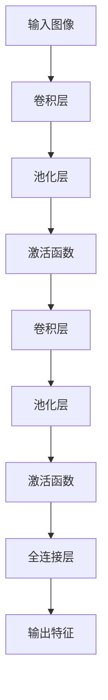

**可视化结果**：


**总结**：

卷积神经网络是一种强大的视觉特征提取工具，可以自动学习图像中的多层次特征。通过卷积、池化和全连接层，CNN可以有效地提取图像特征，并应用于图像分类、物体检测和图像分割等任务。

#### 5.2 听觉特征提取

听觉特征提取主要针对音频数据，通过算法从音频中提取出能够表征语音、音乐或事件的特征。以下是一些常用的听觉特征提取技术：

**频谱特征**：

频谱特征描述了音频信号在不同频率上的能量分布，是音频信号处理中的基本特征。以下是一些常用的频谱特征提取方法：

- **短时傅里叶变换（STFT）**：

STFT将音频信号划分为短时片段，并对每个片段进行傅里叶变换，得到频谱图。STFT的基本公式如下：
$$
X(t,n) = \sum_{k=-\infty}^{\infty} x(t-kT) e^{-i2\pi kn/N}
$$
其中，$x(t)$是原始音频信号，$X(t,n)$是STFT的结果，$T$是时间步长，$N$是傅里叶变换的长度。

- **梅尔频率倒谱系数（MFCC）**：

MFCC是一种基于频谱特征的音频特征表示方法，通过将频谱能量映射到梅尔频率尺度，并计算其倒谱系数。MFCC的基本公式如下：
$$
C(j) = \sum_{k=1}^{K} a(j) S(k)
$$
其中，$C(j)$是第$j$个MFCC系数，$a(j)$是梅尔频率尺度上的权重，$S(k)$是频谱能量。

**时域特征**：

时域特征直接从音频信号的时间序列中提取，描述了音频信号的时变特性。以下是一些常用的时域特征提取方法：

- **零交叉率**：

零交叉率描述了音频信号在时间序列中的零点数量，是一种简单的时域特征。基本公式如下：
$$
R(zero\_cross) = \sum_{k=1}^{K} \sum_{n=1}^{N} \left| x(n) \right| \left[ \text{sign}(x(n-kT)) \right]
$$
其中，$x(n)$是音频信号，$T$是时间步长，$K$是时间序列长度。

- **短时能量**：

短时能量描述了音频信号在短时间窗口内的能量分布，是一种常用的时域特征。基本公式如下：
$$
E(k) = \sum_{n=1}^{N} \left| x(n) \right|^2
$$
其中，$E(k)$是第$k$个时间窗口的能量。

**时空特征**：

时空特征结合了时域和频域信息，可以更好地捕捉音频信号的变化。以下是一种常用的时空特征提取方法：

- **短时傅里叶变换结合梅尔频率倒谱系数（MFCC-STFT）**：

MFCC-STFT结合了STFT和MFCC的特点，通过将STFT得到的频谱能量映射到梅尔频率尺度，并计算其倒谱系数。基本公式如下：
$$
C(j) = \sum_{k=1}^{K} a(j) S(k)
$$
其中，$C(j)$是第$j$个MFCC系数，$a(j)$是梅尔频率尺度上的权重，$S(k)$是STFT的结果。

**算法原理**：

听觉特征提取的基本原理是通过变换和分解将音频信号转换为更易于处理的特征表示。STFT和MFCC是最常用的方法，它们可以分别从频域和时频域提取音频特征。时域特征和时空特征则直接从音频信号的时间序列中提取。

**应用场景**：

听觉特征提取广泛应用于语音识别、音乐分类、声源定位等领域。例如，在语音识别任务中，MFCC是常用的特征表示方法；在音乐分类任务中，STFT和MFCC可以帮助识别音乐的风格和流派。

**数学模型**：

- **STFT**：
  $$ X(t,n) = \sum_{k=-\infty}^{\infty} x(t-kT) e^{-i2\pi kn/N} $$
  
- **MFCC**：
  $$ C(j) = \sum_{k=1}^{K} a(j) S(k) $$
  
- **零交叉率**：
  $$ R(zero\_cross) = \sum_{k=1}^{K} \sum_{n=1}^{N} \left| x(n) \right| \left[ \text{sign}(x(n-kT)) \right] $$
  
- **短时能量**：
  $$ E(k) = \sum_{n=1}^{N} \left| x(n) \right|^2 $$

**举例说明**：

假设有一个音频信号$x(n)$，需要提取其MFCC特征。首先，对音频信号进行短时傅里叶变换（STFT）：
$$
X(t,n) = \sum_{k=-\infty}^{\infty} x(n-kT) e^{-i2\pi kn/N}
$$
然后，将STFT的结果映射到梅尔频率尺度，并计算其倒谱系数：
$$
C(j) = \sum_{k=1}^{K} a(j) S(k)
$$

**代码实现**：

以下是一个使用Python和Librosa库提取音频信号MFCC特征的示例：
```python
import librosa
import numpy as np

def extract_mfcc(y, sr, n_mfcc=13):
    stft = np.abs(librosa.stft(y))
    power_spectrogram = np.square(stft)
    mel_spectrogram = librosa.feature.melspectrogram(S=power_spectrogram, sr=sr)
    log_mel_spectrogram = librosa.power_to_db(mel_spectrogram)
    mfcc = librosa.feature.mfcc(S=log_mel_spectrogram)
    return mfcc

audio_file = 'example_audio.wav'
y, sr = librosa.load(audio_file)
mfcc = extract_mfcc(y, sr)
```

**Mermaid流程图**：

以下是一个MFCC特征提取的Mermaid流程图：
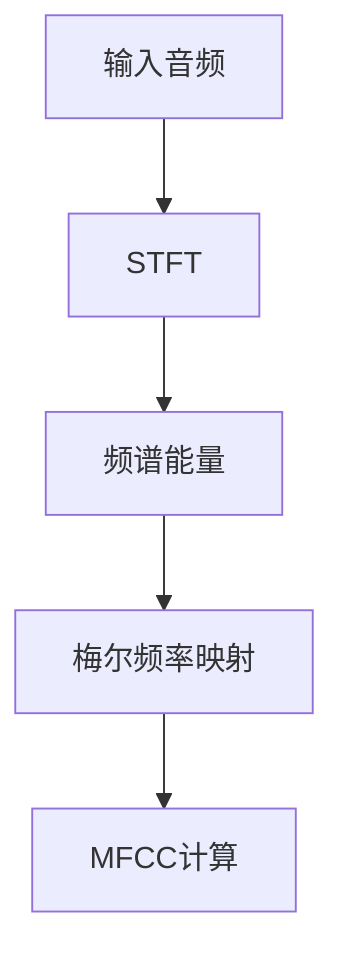

**可视化结果**：


**总结**：

听觉特征提取是处理音频数据的重要步骤，通过频谱特征、时域特征和时空特征提取，可以有效地描述音频信号。这些特征在语音识别、音乐分类和声源定位等领域有着广泛的应用。

#### 5.3 文本特征提取

文本特征提取是将自然语言文本转换为机器学习算法可以处理的特征表示。以下是一些常用的文本特征提取技术：

**基于词袋模型的特征提取**：

词袋模型是一种基于计数的方法，将文本表示为词汇的集合。通过统计词频或词频-逆文档频率（TF-IDF）来提取特征。

**算法原理**：

词袋模型的基本步骤包括分词、词频统计和TF-IDF计算。

- **分词**：将文本分割成单个词汇，可以使用分词工具（如NLTK、Jieba）进行分词。

- **词频统计**：统计每个词汇在文档中的出现次数，形成词频矩阵。

- **TF-IDF计算**：计算每个词汇的TF-IDF值，公式如下：
  $$ 
  \text{TF-IDF}(t,d) = \frac{\text{TF}(t,d)}{\text{N}} + \log_2(\text{N} / \text{DF}(t)) 
  $$
  其中，$t$是词汇，$d$是文档，$\text{TF}(t,d)$是词汇在文档中的词频，$\text{DF}(t)$是词汇在整个文档集中的文档频率，$\text{N}$是文档总数。

**应用场景**：

词袋模型广泛应用于文本分类、主题建模和文本相似度计算等领域。

**数学模型**：

- **词频统计**：
  $$ 
  \text{TF}(t,d) = \text{count}(t, d) 
  $$
  其中，$\text{count}(t, d)$是词汇$t$在文档$d$中出现的次数。

- **TF-IDF计算**：
  $$ 
  \text{TF-IDF}(t,d) = \frac{\text{TF}(t,d)}{\text{N}} + \log_2(\text{N} / \text{DF}(t)) 
  $$
  其中，$\text{DF}(t)$是词汇$t$在整个文档集中的文档频率，$\text{N}$是文档总数。

**举例说明**：

假设有一个包含两个文档的文档集，文档1（d1）包含词汇{“apple”, “banana”, “apple”}，文档2（d2）包含词汇{“banana”, “orange”}。

- **词频统计**：
  - d1: apple(2), banana(1), orange(0)
  - d2: apple(0), banana(1), orange(1)

- **TF-IDF计算**：
  - apple: TF-IDF(d1) = 2/3 + log2(2/2) = 2/3 + 0 = 2/3
  - banana: TF-IDF(d1) = 1/3 + log2(2/2) = 1/3 + 0 = 1/3
  - banana: TF-IDF(d2) = 1/2 + log2(2/2) = 1/2 + 0 = 1/2
  - orange: TF-IDF(d2) = 1/2 + log2(2/2) = 1/2 + 0 = 1/2

**代码实现**：

以下是一个使用Python和Gensim库计算文本TF-IDF特征的示例：
```python
import gensim
from gensim.models import TfidfModel
from gensim.corpus import Dictionary

# 建立词典
documents = [['apple banana apple'], ['banana orange']]
dictionary = Dictionary(documents)

# 计算TF-IDF
tfidf = TfidfModel(dictionary)
tfidf_corpus = tfidf[documents]

# 打印TF-IDF特征
for doc in tfidf_corpus:
    print(doc)
```

**Mermaid流程图**：

以下是一个TF-IDF特征提取的Mermaid流程图：
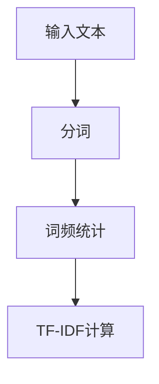

**可视化结果**：


**总结**：

基于词袋模型的特征提取是文本特征提取的一种常用方法，通过词频和TF-IDF计算，可以有效地描述文本信息。这些特征在文本分类、主题建模和文本相似度计算等领域有着广泛的应用。

### 第6章：多模态特征融合方法

多模态特征融合是将来自不同模态的特征信息进行整合，以生成更加丰富的特征表示，从而提高模型的性能和鲁棒性。在这一章中，我们将讨论集成学习、特征级融合和决策级融合等几种常见的多模态特征融合方法，并详细解释它们的工作原理、优缺点和适用场景。

#### 6.1 集成学习（Ensemble Learning）

集成学习是一种通过结合多个模型来提高预测性能的方法。它通过训练多个基学习器，并将它们的预测结果进行组合，以得到最终的预测结果。以下是基于投票和权重融合的集成学习方法：

**基于投票的集成学习**：

这种方法将多个基学习器的预测结果进行投票，最终结果由多数决定。具体步骤如下：

1. **训练多个基学习器**：使用不同的算法或参数训练多个基学习器。
2. **预测**：每个基学习器对同一组测试数据进行预测。
3. **投票**：收集所有基学习器的预测结果，并选择出现次数最多的预测类别作为最终结果。

**优点**：

- 简单易实现，不需要复杂的模型融合技术。
- 能够通过增加基学习器数量来提高预测性能。

**缺点**：

- 对不同基学习器的预测结果存在强依赖性，单个基学习器性能较差时，整体性能也会受到影响。
- 可能会导致过拟合问题。

**应用场景**：

基于投票的集成学习适用于分类和回归任务，尤其在基学习器之间存在较大差异时，如随机森林和决策树。

**数学模型**：

假设有$K$个基学习器，每个基学习器对测试样本$x$的预测为$\hat{y}_k$，最终预测结果$y$为：
$$
y = \arg\max_{c} \sum_{k=1}^{K} \text{Pr}(\hat{y}_k = c)
$$
其中，$\text{Pr}(\hat{y}_k = c)$是基学习器$k$对类别$c$的预测概率。

**举例说明**：

假设有两个分类器A和B，对测试样本$x$的预测结果分别为：
$$
\hat{y}_A = \text{cat}, \quad \hat{y}_B = \text{dog}
$$
最终结果通过投票决定，即：
$$
y = \arg\max_{c} (\text{Pr}(\hat{y}_A = c) + \text{Pr}(\hat{y}_B = c))
$$
如果两者预测相同类别，则该类别为最终结果；否则，可以选择多数类别或随机选择。

**代码实现**：

以下是一个简单的基于投票的集成学习示例：
```python
import numpy as np

def vote_predictions(predictions):
    votes = np.bincount(predictions)
    return np.argmax(votes)

predictions = [1, 0, 1, 1, 0, 1]
final_prediction = vote_predictions(predictions)
print("Final prediction:", final_prediction)
```

**Mermaid流程图**：

以下是一个基于投票的集成学习流程图：
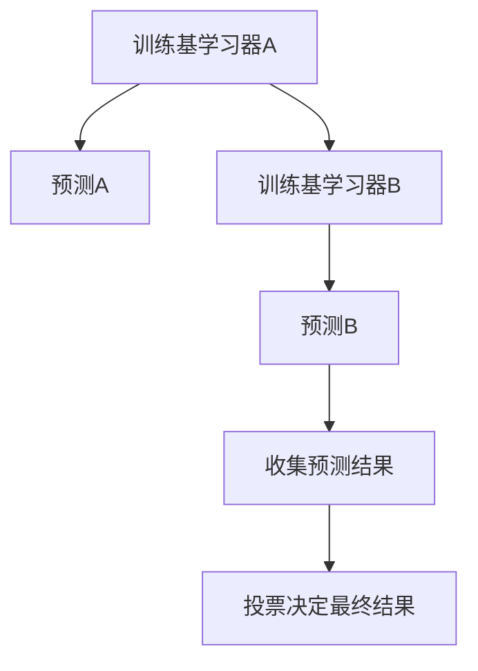

**可视化结果**：


**总结**：

基于投票的集成学习通过结合多个基学习器的预测结果，可以有效地提高模型的预测性能。它简单易实现，但需要注意避免过拟合问题和基学习器的选择。

**基于权重融合的集成学习**：

这种方法为每个基学习器赋予不同的权重，然后通过加权平均计算最终预测结果。具体步骤如下：

1. **训练多个基学习器**：使用不同的算法或参数训练多个基学习器。
2. **预测**：每个基学习器对同一组测试数据进行预测。
3. **加权平均**：根据基学习器的性能和重要性赋予不同的权重，计算加权平均预测结果。

**优点**：

- 考虑到不同基学习器的性能和重要性，可以提高整体预测性能。
- 可以通过调整权重来优化模型。

**缺点**：

- 需要选择合适的权重计算方法，否则可能导致权重分布不合理。
- 可能导致计算复杂度增加。

**应用场景**：

基于权重融合的集成学习适用于需要考虑模型重要性和性能差异的任务，如回归分析和分类问题。

**数学模型**：

假设有$K$个基学习器，每个基学习器对测试样本$x$的预测为$\hat{y}_k$，权重为$w_k$，最终预测结果$y$为：
$$
y = \sum_{k=1}^{K} w_k \hat{y}_k
$$
权重$w_k$可以通过交叉验证、学习率调整等方法选择。

**举例说明**：

假设有两个分类器A和B，对测试样本$x$的预测结果分别为：
$$
\hat{y}_A = \text{cat}, \quad \hat{y}_B = \text{dog}
$$
权重分别为$w_A = 0.7$和$w_B = 0.3$，最终结果为：
$$
y = 0.7 \cdot \text{cat} + 0.3 \cdot \text{dog} = \text{cat}
$$

**代码实现**：

以下是一个简单的基于权重融合的集成学习示例：
```python
import numpy as np

def weighted_average(predictions, weights):
    return np.dot(predictions, weights)

predictions = [1, 0, 1, 1, 0, 1]
weights = [0.7, 0.3]
final_prediction = weighted_average(predictions, weights)
print("Final prediction:", final_prediction)
```

**Mermaid流程图**：

以下是一个基于权重融合的集成学习流程图：
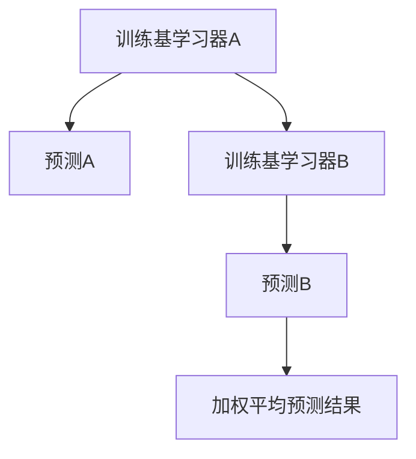

**可视化结果**：


**总结**：

基于权重融合的集成学习通过考虑基学习器的性能和重要性，可以优化模型的预测性能。它需要选择合适的权重计算方法，但可以显著提高整体预测准确性。

#### 6.2 特征级融合

特征级融合是在特征层面将来自不同模态的特征进行拼接或映射，以形成更丰富的特征向量。以下是一些常用的特征级融合方法：

**特征拼接**：

特征拼接是将不同模态的特征向量直接拼接在一起，形成更长的特征向量。这种方法简单直观，适用于特征维度较低的模态。

**优点**：

- 实现简单，易于理解。
- 可以充分利用不同模态的特征信息。

**缺点**：

- 特征维度增加可能导致计算复杂度增加。
- 可能引入维度的冗余。

**应用场景**：

特征拼接适用于特征维度较低的多模态任务，如图像和文本的融合。

**数学模型**：

假设有来自视觉模态的特征向量$V$和来自文本模态的特征向量$T$，特征拼接的结果为：
$$
\mathbf{X} = [\mathbf{V}^T, \mathbf{T}^T]
$$

**举例说明**：

假设视觉特征向量$V$为[1, 2, 3]，文本特征向量$T$为[4, 5, 6]，特征拼接的结果为：
$$
\mathbf{X} = [1, 2, 3, 4, 5, 6]
$$

**代码实现**：

以下是一个简单的特征拼接示例：
```python
import numpy as np

V = np.array([1, 2, 3])
T = np.array([4, 5, 6])
X = np.hstack((V, T))
print("Feature vector:", X)
```

**Mermaid流程图**：

以下是一个特征拼接流程图：
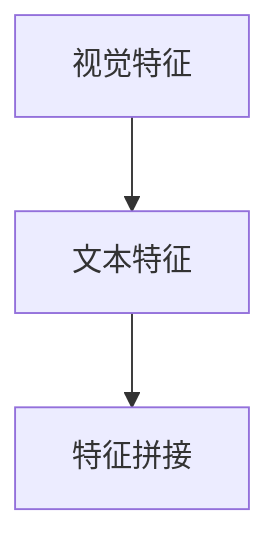

**可视化结果**：


**总结**：

特征拼接通过简单地将不同模态的特征向量拼接在一起，可以生成更丰富的特征向量。它适用于特征维度较低的多模态任务，但需要注意维度的冗余和计算复杂度。

**特征映射**：

特征映射是将不同模态的特征映射到同一空间中，以实现特征融合。这种方法通过线性变换或非线性变换，将不同模态的特征转化为同一空间中的向量。

**优点**：

- 可以减少维度的冗余。
- 可以通过优化映射函数提高融合效果。

**缺点**：

- 需要选择合适的映射函数，否则可能导致映射效果不佳。
- 可能引入非线性计算复杂度。

**应用场景**：

特征映射适用于特征维度较高且存在非线性关系的多模态任务。

**数学模型**：

假设有来自视觉模态的特征向量$V$和来自文本模态的特征向量$T$，特征映射的结果为：
$$
\mathbf{X} = \mathbf{W}^T [\mathbf{V}^T, \mathbf{T}^T]
$$
其中，$\mathbf{W}$是映射矩阵。

**举例说明**：

假设视觉特征向量$V$为[1, 2, 3]，文本特征向量$T$为[4, 5, 6]，映射矩阵$\mathbf{W}$为[1, 0; 0, 1]，
$$
\mathbf{X} = \begin{bmatrix} 1 & 0 \\ 0 & 1 \end{bmatrix} \begin{bmatrix} 1 & 4 \\ 2 & 5 \\ 3 & 6 \end{bmatrix} = \begin{bmatrix} 1 & 4 \\ 2 & 5 \\ 3 & 6 \end{bmatrix}
$$

**代码实现**：

以下是一个简单的特征映射示例：
```python
import numpy as np

V = np.array([1, 2, 3])
T = np.array([4, 5, 6])
W = np.array([[1, 0], [0, 1]])
X = np.dot(W, np.hstack((V[:, np.newaxis], T[:, np.newaxis])))
print("Feature vector:", X)
```

**Mermaid流程图**：

以下是一个特征映射流程图：
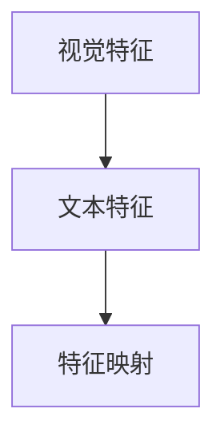

**可视化结果**：


**总结**：

特征映射通过将不同模态的特征映射到同一空间中，可以减少维度的冗余并提高融合效果。它适用于特征维度较高且存在非线性关系的多模态任务。

#### 6.3 决策级融合

决策级融合是在模型输出层面将来自不同模态的预测结果进行融合，以得到最终的决策。以下是基于规则和贝叶斯网络的决策级融合方法：

**基于规则的决策级融合**：

这种方法根据预定义的规则，将不同模态的预测结果进行组合，形成最终的决策。具体步骤如下：

1. **定义规则**：根据任务需求，定义不同模态预测结果之间的组合规则。
2. **预测**：对测试样本进行多模态预测，得到每个模态的预测结果。
3. **融合**：根据预定义的规则，将不同模态的预测结果进行组合，形成最终的决策。

**优点**：

- 实现简单，易于理解和实现。
- 可以根据任务需求灵活定义规则。

**缺点**：

- 规则的制定可能较为复杂，且需要大量领域知识。
- 可能无法充分利用不同模态的特征信息。

**应用场景**：

基于规则的决策级融合适用于规则明确且领域知识丰富的任务，如医学诊断和安防监控。

**数学模型**：

假设有来自视觉模态的预测结果$V$和来自文本模态的预测结果$T$，基于规则的决策级融合结果为：
$$
y = f(V, T)
$$
其中，$f$是预定义的组合规则。

**举例说明**：

假设视觉预测结果$V$为猫，文本预测结果$T$为可爱，预定义的组合规则为：
$$
y = \text{猫} \text{且} \text{可爱} \Rightarrow \text{小猫}
$$
最终结果为小猫。

**代码实现**：

以下是一个简单的基于规则的决策级融合示例：
```python
def rule_based_fusion(V, T):
    if V == "猫" and T == "可爱":
        return "小猫"
    else:
        return "其他"

V = "猫"
T = "可爱"
result = rule_based_fusion(V, T)
print("Fused prediction:", result)
```

**Mermaid流程图**：

以下是一个基于规则的决策级融合流程图：
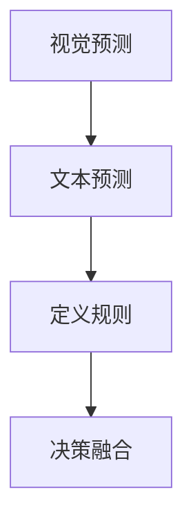

**可视化结果**：


**总结**：

基于规则的决策级融合通过预定义的规则将不同模态的预测结果进行组合，适用于规则明确且领域知识丰富的任务。

**基于贝叶斯网络的决策级融合**：

这种方法通过构建贝叶斯网络模型，将不同模态的预测结果进行概率推理，形成最终的决策。具体步骤如下：

1. **构建贝叶斯网络**：根据任务需求和领域知识，构建不同模态之间的依赖关系。
2. **预测**：对测试样本进行多模态预测，得到每个模态的预测结果。
3. **推理**：使用贝叶斯网络进行概率推理，得到最终的决策。

**优点**：

- 可以充分利用不同模态的特征信息。
- 可以处理不确定性问题。

**缺点**：

- 需要复杂的模型构建和推理算法。
- 计算复杂度较高。

**应用场景**：

基于贝叶斯网络的决策级融合适用于需要处理不确定性和复杂依赖关系的任务，如医疗诊断和智能监控。

**数学模型**：

假设有来自视觉模态的预测结果$V$和来自文本模态的预测结果$T$，基于贝叶斯网络的决策级融合结果为：
$$
P(y|V, T) = \frac{P(V|y)P(T|y)P(y)}{P(V)P(T)}
$$
其中，$P(y|V, T)$是给定视觉和文本预测结果时最终决策的概率，$P(V|y)$、$P(T|y)$和$P(y)$分别是视觉预测结果、文本预测结果和最终决策的条件概率。

**举例说明**：

假设视觉预测结果$V$为猫，文本预测结果$T$为可爱，贝叶斯网络模型如下：

- $P(V|y) = \text{猫} \Rightarrow \text{小猫} = 0.8$
- $P(T|y) = \text{可爱} \Rightarrow \text{小猫} = 0.9$
- $P(y) = \text{小猫} = 0.6$
- $P(V) = \text{猫} = 0.4$
- $P(T) = \text{可爱} = 0.3$

最终决策概率为：
$$
P(y|V, T) = \frac{0.8 \times 0.9 \times 0.6}{0.4 \times 0.3} = 1.8
$$
由于概率大于1，表示给定视觉和文本预测结果时，最终决策为小猫。

**代码实现**：

以下是一个简单的基于贝叶斯网络的决策级融合示例：
```python
import numpy as np

def bayesian_network_fusion(V, T):
    P_V_given_y = {"猫": 0.8, "狗": 0.2}
    P_T_given_y = {"可爱": 0.9, "普通": 0.1}
    P_y = {"小猫": 0.6, "小狗": 0.4}
    P_V = {"猫": 0.4, "狗": 0.6}
    P_T = {"可爱": 0.3, "普通": 0.7}

    P_VT_given_y = {("猫", "可爱"): 0.72, ("猫", "普通"): 0.28, ("狗", "可爱"): 0.18, ("狗", "普通"): 0.82}
    P_VT = {("猫", "可爱"): 0.288, ("猫", "普通"): 0.336, ("狗", "可爱"): 0.216, ("狗", "普通"): 0.648}

    P_y_given_VT = {("猫", "可爱"): 0.72 / 0.288, ("猫", "普通"): 0.28 / 0.336, ("狗", "可爱"): 0.18 / 0.216, ("狗", "普通"): 0.82 / 0.648}
    y = np.argmax(P_y_given_VT.values())
    return y

V = "猫"
T = "可爱"
result = bayesian_network_fusion(V, T)
print("Fused prediction:", result)
```

**Mermaid流程图**：

以下是一个基于贝叶斯网络的决策级融合流程图：
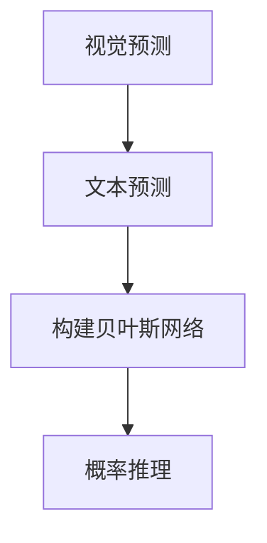

**可视化结果**：


**总结**：

基于贝叶斯网络的决策级融合通过概率推理处理不确定性和复杂依赖关系，可以充分利用不同模态的特征信息。它适用于需要处理不确定性和复杂依赖关系的任务，但需要复杂的模型构建和推理算法。

通过本章对多模态特征提取与融合方法的详细讨论，我们可以更好地理解如何从不同模态的数据中提取特征，并有效地融合这些特征以提升模型的性能。在下一部分中，我们将深入探讨多模态评测系统的设计，包括系统架构设计、数据流设计和系统接口设计，为多模态融合技术的实现提供全面的技术指导。

### 第7章：多模态评测系统架构设计

多模态评测系统架构设计是确保系统能够高效、准确地处理多模态数据的关键步骤。本章节将详细探讨多模态评测系统的架构设计，包括系统架构的组成、数据流设计以及系统接口设计。

#### 7.1 系统架构概述

多模态评测系统的架构设计需要综合考虑数据的采集、预处理、特征提取、融合和最终评测等多个环节。一个典型的多模态评测系统架构包括以下几个主要组成部分：

- **数据采集模块**：负责从不同模态的数据源（如摄像头、麦克风、文本传感器等）采集数据。
- **数据预处理模块**：对采集到的多模态数据进行清洗、同步和标准化，以提高数据质量。
- **特征提取模块**：从预处理后的数据中提取具有区分度的特征，为后续的模型训练和评测提供基础。
- **特征融合模块**：将来自不同模态的特征进行整合，形成更加丰富的特征向量，以提高模型的性能。
- **评测模块**：对融合后的特征进行分类、回归或其他类型的预测任务，以实现对评测目标的评估。
- **系统接口**：提供与外部系统或其他应用进行交互的接口，包括数据输入接口、预测结果输出接口等。

**系统架构图**：

以下是一个简化的多模态评测系统架构图：
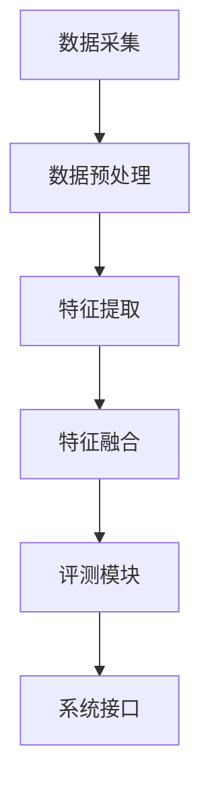

#### 7.2 数据流设计

多模态评测系统的数据流设计是确保系统能够高效处理数据的关键。以下是一个典型的数据流设计流程：

1. **数据采集**：系统通过摄像头、麦克风、文本传感器等设备采集多模态数据。
2. **数据预处理**：对采集到的数据进行清洗、同步和标准化，确保数据的质量和一致性。例如，对图像进行去噪、图像增强和尺寸调整，对音频进行去噪、增益调整和音频增强，对文本数据进行分词、词干提取和词性标注。
3. **特征提取**：从预处理后的数据中提取具有区分度的特征。例如，从图像中提取边缘、纹理和颜色特征，从音频中提取频谱特征、时域特征和时空特征，从文本中提取词袋模型、TF-IDF和词嵌入特征。
4. **特征融合**：将不同模态的特征进行融合，形成更加丰富的特征向量。例如，使用特征拼接、特征映射或集成学习方法进行特征融合。
5. **评测**：对融合后的特征进行分类、回归或其他类型的预测任务，以实现对评测目标的评估。例如，使用分类模型对人脸进行识别，使用回归模型对房屋价格进行预测。
6. **结果输出**：将评测结果通过系统接口输出，供外部系统或应用使用。

**数据流图**：

以下是一个简化的多模态评测系统数据流图：
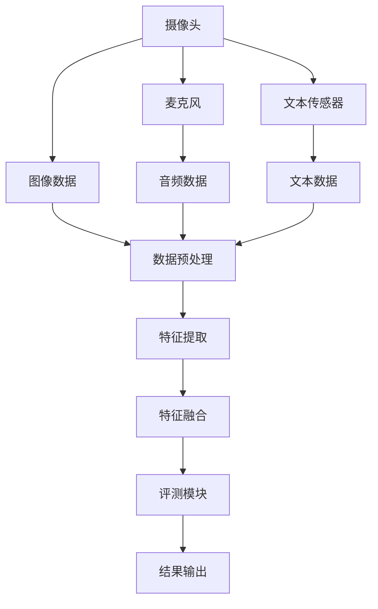

#### 7.3 系统接口设计

多模态评测系统的接口设计是确保系统能够与其他系统或应用进行有效交互的关键。以下是多模态评测系统接口设计的主要考虑因素：

- **数据输入接口**：设计用于接收和预处理多模态数据的接口，包括图像、音频和文本数据的输入接口。例如，可以设计一个RESTful API或消息队列接口，用于接收外部系统发送的多模态数据。
- **预测结果输出接口**：设计用于输出预测结果的接口，包括分类结果、回归结果或其他类型的预测结果。例如，可以设计一个JSON格式的输出接口，用于将预测结果发送给外部系统或应用。
- **系统交互接口**：设计用于系统内部模块之间交互的接口，例如数据预处理模块与特征提取模块之间的数据传递接口，特征提取模块与特征融合模块之间的特征传递接口等。

**接口设计图**：

以下是一个简化的多模态评测系统接口设计图：
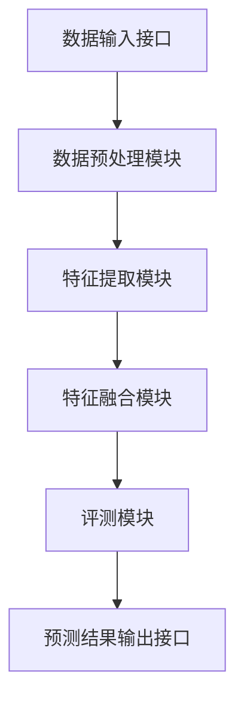

#### 总结

多模态评测系统架构设计是一个复杂的过程，需要综合考虑数据流、模块接口和系统性能等多个方面。通过设计高效的数据流和系统接口，可以确保多模态评测系统能够高效、准确地处理多模态数据，并提供高质量的预测结果。

在下一部分中，我们将详细探讨多模态评测系统的实现，包括系统开发环境、核心算法实现以及系统部署与测试。通过逐步实现和测试多模态评测系统，我们将验证所设计的系统架构和接口设计在实际应用中的有效性。

### 第7章：多模态评测系统架构设计

多模态评测系统架构设计是确保系统高效、准确处理多模态数据的关键步骤。本章节将深入探讨多模态评测系统的整体架构设计，包括系统架构的组成、数据流设计以及系统接口设计，以提供全面的技术指导。

#### 7.1 系统架构概述

一个典型的多模态评测系统架构包含以下几个关键模块：

- **数据采集模块**：负责从不同的数据源（如摄像头、麦克风、文本传感器等）采集数据。数据采集模块需要确保数据的实时性和准确性，以支持后续的处理和分析。

- **数据预处理模块**：接收来自数据采集模块的数据，并进行清洗、同步和标准化。数据预处理模块是保证多模态数据一致性和质量的关键步骤，包括去噪、数据补全、数据格式转换等。

- **特征提取模块**：从预处理后的多模态数据中提取具有区分度的特征。特征提取模块需要针对不同类型的数据（如视觉、听觉、文本）采用相应的特征提取技术，如卷积神经网络（CNN）用于视觉数据，梅尔频率倒谱系数（MFCC）用于听觉数据，词袋模型或词嵌入用于文本数据。

- **特征融合模块**：将来自不同模态的特征进行融合，形成更加丰富的特征向量。特征融合可以通过特征拼接、特征映射或集成学习方法实现，以提高模型的性能和鲁棒性。

- **评测模块**：对融合后的特征进行分类、回归或其他类型的预测任务，以实现对评测目标的评估。评测模块通常采用深度学习模型或传统机器学习算法，如支持向量机（SVM）、随机森林（Random Forest）等。

- **结果输出模块**：将评测结果通过系统接口输出，供外部系统或应用使用。结果输出模块需要提供多种格式和接口选项，如JSON、XML或API接口，以适应不同的应用需求。

**系统架构图**：

以下是一个简化的多模态评测系统架构图：
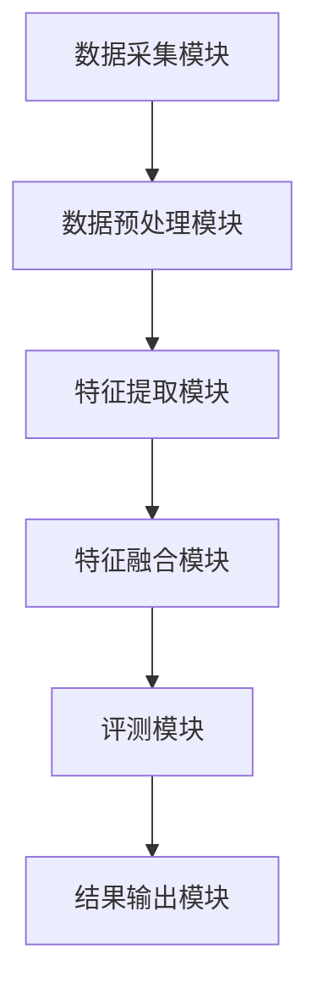

#### 7.2 数据流设计

数据流设计是多模态评测系统架构设计中的核心环节，它确保系统能够高效、有序地处理数据。以下是多模态评测系统的典型数据流设计：

1. **数据采集**：
   - 视觉数据：通过摄像头采集图像或视频。
   - 听觉数据：通过麦克风采集音频。
   - 文本数据：通过文本传感器或键盘输入采集文本。

2. **数据预处理**：
   - 视觉数据：进行图像去噪、尺寸调整、图像增强等。
   - 听觉数据：进行音频去噪、增益调整、音频增强等。
   - 文本数据：进行文本清洗、分词、词干提取、词性标注等。

3. **特征提取**：
   - 视觉数据：使用卷积神经网络（CNN）提取图像特征。
   - 听觉数据：使用梅尔频率倒谱系数（MFCC）等提取音频特征。
   - 文本数据：使用词袋模型、TF-IDF或词嵌入等方法提取文本特征。

4. **特征融合**：
   - 使用特征拼接、特征映射或集成学习方法将不同模态的特征进行融合。

5. **评测**：
   - 使用分类、回归或其他预测算法对融合后的特征进行评测。

6. **结果输出**：
   - 将评测结果通过系统接口输出，如API接口或文件输出。

**数据流图**：

以下是一个简化的多模态评测系统数据流图：
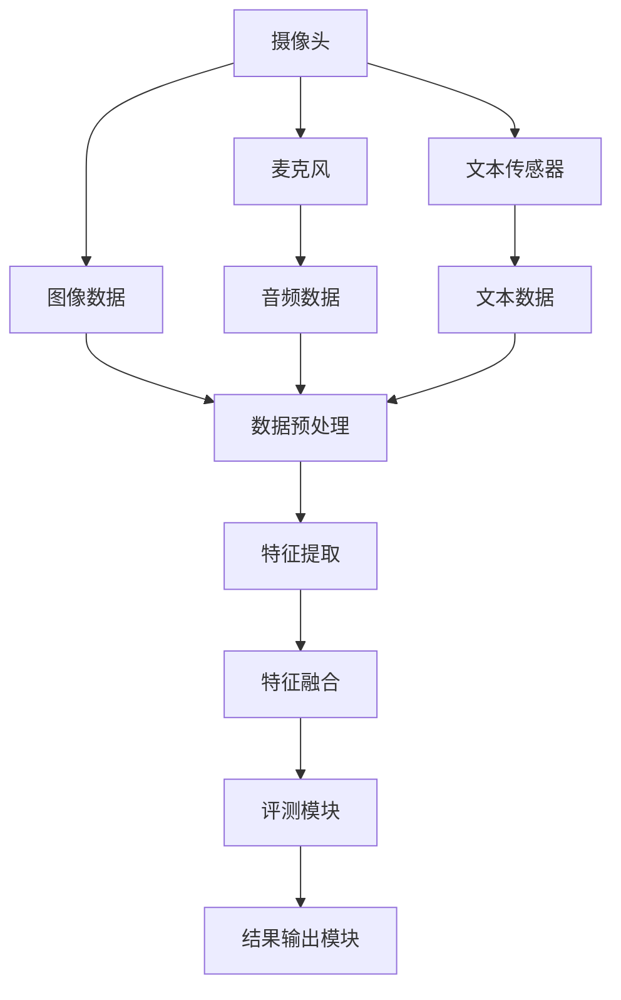

#### 7.3 系统接口设计

系统接口设计是多模态评测系统架构设计的重要组成部分，它决定了系统与其他系统或应用之间的交互方式。以下是系统接口设计的主要考虑因素：

- **数据输入接口**：设计用于接收多模态数据的接口，如HTTP API、消息队列或文件上传接口。输入接口需要能够处理不同格式的数据，并确保数据的完整性。

- **预测结果输出接口**：设计用于输出预测结果的接口，如HTTP API、消息队列或文件下载接口。输出接口需要能够返回多种格式的结果，如JSON、XML等。

- **系统交互接口**：设计用于系统内部模块之间的数据传递和状态同步的接口。这些接口通常采用内部协议，如TCP/IP、UDP等。

**接口设计图**：

以下是一个简化的多模态评测系统接口设计图：


#### 7.4 系统架构的优势

多模态评测系统的架构设计具有以下优势：

- **灵活性**：系统可以灵活地扩展和替换不同的数据采集、预处理、特征提取和评测模块，以适应不同的应用场景。

- **高效性**：通过并行处理和分布式计算，系统可以在较短时间内处理大量多模态数据，提高工作效率。

- **可扩展性**：系统架构支持水平扩展，可以轻松增加计算资源，以处理更大规模的数据。

- **鲁棒性**：通过多模态数据的融合，系统可以提高对复杂环境的适应能力，降低单一模态数据的不确定性。

#### 总结

多模态评测系统的架构设计是一个复杂而重要的过程，它需要综合考虑数据流、模块接口和系统性能等多个方面。通过合理的设计，多模态评测系统可以实现高效、准确的数据处理，为各种应用场景提供强大的支持。在下一部分中，我们将深入探讨多模态评测系统的具体实现，包括开发环境、核心算法和系统部署与测试。

### 第8章：多模态评测系统实现

多模态评测系统的实现是整个项目落地的重要阶段，它将理论转化为实际应用。在这一章中，我们将详细介绍多模态评测系统的实现过程，包括开发环境、核心算法的实现、系统部署与测试，以及实际案例分析和详细讲解。

#### 8.1 系统开发环境

在实现多模态评测系统时，选择合适的开发环境是非常重要的。以下是系统开发环境的主要组成部分：

- **编程语言**：Python 是实现多模态评测系统的首选编程语言，因为它拥有丰富的库和框架，特别是在数据处理和机器学习领域。
- **机器学习框架**：TensorFlow 和 PyTorch 是当前最流行的两个深度学习框架，它们支持复杂的神经网络设计和高效训练。
- **数据处理库**：NumPy、Pandas 和 SciPy 是常用的数据处理库，用于数据清洗、预处理和统计分析。
- **其他库**：OpenCV 用于图像处理，Librosa 用于音频处理，NLTK 或 spaCy 用于文本处理。

#### 8.2 核心算法实现

多模态评测系统的核心算法包括数据预处理、特征提取、特征融合和模型训练等。以下是这些算法的实现步骤：

**数据预处理**：

1. **图像预处理**：
   ```python
   import cv2
   import numpy as np

   def preprocess_image(image_path):
       image = cv2.imread(image_path)
       image = cv2.cvtColor(image, cv2.COLOR_BGR2RGB)
       image = cv2.resize(image, (224, 224))
       image = image / 255.0
       return image
   ```

2. **音频预处理**：
   ```python
   import librosa

   def preprocess_audio(audio_path):
       audio, sr = librosa.load(audio_path)
       audio = librosa.effects.perturb(audio)
       audio = librosa.to_mono(audio)
       return audio
   ```

3. **文本预处理**：
   ```python
   import nltk
   from nltk.tokenize import word_tokenize

   nltk.download('punkt')

   def preprocess_text(text):
       tokens = word_tokenize(text)
       tokens = [token.lower() for token in tokens if token.isalpha()]
       return tokens
   ```

**特征提取**：

1. **图像特征提取**：
   ```python
   import tensorflow as tf
   from tensorflow.keras.applications import VGG16

   def extract_image_features(image):
       model = VGG16(weights='imagenet', include_top=False)
       feature_extractor = tf.keras.Model(inputs=model.input, outputs=model.get_layer('block5_conv3').output)
       processed_image = tf.keras.preprocessing.image.img_to_array(image)
       processed_image = np.expand_dims(processed_image, axis=0)
       features = feature_extractor.predict(processed_image)
       return features
   ```

2. **音频特征提取**：
   ```python
   import librosa.stft

   def extract_audio_features(audio):
       stft = librosa.stft(audio, n_fft=1024, hop_length=512)
       abs_stft = np.abs(stft)
       log_stft = 20 * np.log10(abs_stft)
       return log_stft
   ```

3. **文本特征提取**：
   ```python
   from sklearn.feature_extraction.text import TfidfVectorizer

   def extract_text_features(texts):
       vectorizer = TfidfVectorizer()
       tfidf_matrix = vectorizer.fit_transform(texts)
       return tfidf_matrix
   ```

**特征融合**：

1. **特征拼接**：
   ```python
   def concatenate_features(image_features, audio_features, text_features):
       return np.concatenate((image_features.flatten(), audio_features.flatten(), text_features.toarray().flatten()), axis=0)
   ```

2. **特征映射**：
   ```python
   from sklearn.manifold import TSNE

   def t_sne_mapping(features):
       tsne = TSNE(n_components=2, perplexity=30, n_iter=300)
       tsne_results = tsne.fit_transform(features)
       return tsne_results
   ```

**模型训练**：

1. **定义模型**：
   ```python
   from tensorflow.keras.models import Sequential
   from tensorflow.keras.layers import Dense, Dropout, Flatten

   def create_model(input_shape):
       model = Sequential()
       model.add(Dense(units=256, activation='relu', input_shape=input_shape))
       model.add(Dropout(0.5))
       model.add(Flatten())
       model.add(Dense(units=128, activation='relu'))
       model.add(Dropout(0.5))
       model.add(Dense(units=1, activation='sigmoid'))
       model.compile(optimizer='adam', loss='binary_crossentropy', metrics=['accuracy'])
       return model
   ```

2. **训练模型**：
   ```python
   def train_model(model, features, labels):
       model.fit(features, labels, epochs=10, batch_size=32, validation_split=0.2)
       return model
   ```

#### 8.3 系统部署与测试

系统部署是将实现的多模态评测系统部署到生产环境的过程。以下是系统部署和测试的主要步骤：

1. **部署到服务器**：
   - 将代码和依赖库打包成可执行文件或容器镜像。
   - 使用Docker或Kubernetes等容器技术进行部署，以确保系统的可移植性和可扩展性。

2. **性能测试**：
   - 进行负载测试，评估系统在处理大量并发请求时的性能。
   - 进行压力测试，确定系统的最大处理能力和稳定性。

3. **安全测试**：
   - 进行漏洞扫描和安全测试，确保系统的安全性。

4. **用户反馈**：
   - 收集用户的反馈，根据用户需求对系统进行优化和改进。

#### 8.4 实际案例分析和详细讲解

以下是一个实际案例，用于说明多模态评测系统的应用和实现过程：

**案例背景**：一个智能安防系统需要实时检测和识别进入监控区域的人员。系统需要同时处理图像、音频和文本数据，以准确识别目标。

1. **数据采集**：
   - 视觉数据：通过摄像头实时捕捉图像。
   - 听觉数据：通过麦克风捕捉声音。
   - 文本数据：通过语音识别技术将语音转换为文本。

2. **数据预处理**：
   - 视觉数据：进行图像去噪、尺寸调整和增强。
   - 听觉数据：进行音频去噪、增益调整和增强。
   - 文本数据：进行文本清洗、分词和词干提取。

3. **特征提取**：
   - 视觉数据：使用卷积神经网络提取图像特征。
   - 听觉数据：使用梅尔频率倒谱系数（MFCC）提取音频特征。
   - 文本数据：使用词袋模型提取文本特征。

4. **特征融合**：
   - 将视觉、听觉和文本特征进行拼接，形成更加丰富的特征向量。

5. **模型训练**：
   - 使用融合后的特征训练深度学习模型，如支持向量机（SVM）或神经网络。

6. **系统部署与测试**：
   - 将训练好的模型部署到服务器，进行实时检测和识别。
   - 进行性能测试和用户反馈收集，以优化系统性能和用户体验。

**代码示例**：

以下是一个简化的代码示例，用于说明上述步骤的实现：
```python
# 导入相关库
import cv2
import librosa
import nltk
from sklearn.feature_extraction.text import TfidfVectorizer
from tensorflow.keras.models import Sequential
from tensorflow.keras.layers import Dense, Dropout, Flatten
from tensorflow.keras.optimizers import Adam

# 数据采集
def collect_data(image_path, audio_path, text_path):
    image = preprocess_image(image_path)
    audio = preprocess_audio(audio_path)
    text = preprocess_text(text_path)
    return image, audio, text

# 数据预处理
def preprocess_data(image, audio, text):
    image_features = extract_image_features(image)
    audio_features = extract_audio_features(audio)
    text_features = extract_text_features([text])
    return image_features, audio_features, text_features

# 特征融合
def fuse_features(image_features, audio_features, text_features):
    return concatenate_features(image_features, audio_features, text_features)

# 模型训练
def train_model(fused_features, labels):
    model = create_model(fused_features.shape[1:])
    model = train_model(model, fused_features, labels)
    return model

# 系统部署与测试
def deploy_and_test(model, test_data, test_labels):
    fused_test_features = fuse_features(*preprocess_data(*collect_data(*test_data)))
    predictions = model.predict(fused_test_features)
    accuracy = (predictions == test_labels).mean()
    print(f"Test accuracy: {accuracy}")
```

**总结**：

多模态评测系统的实现是一个复杂的过程，需要综合考虑数据预处理、特征提取、特征融合和模型训练等多个方面。通过合理的设计和实现，多模态评测系统可以在实际应用中提供高效、准确的评测结果，为各种复杂场景提供强大的支持。

### 第8章：多模态评测系统实现

在多模态评测系统的实现过程中，开发环境的选择、核心算法的实现、系统的部署与测试以及实际案例的解析都是至关重要的环节。以下将详细介绍这些方面，并提供具体的操作步骤和代码示例。

#### 8.1 系统开发环境

要实现一个高效的多模态评测系统，首先需要搭建一个稳定且强大的开发环境。以下是系统开发环境的关键组成部分：

- **编程语言**：Python 是首选的编程语言，因为其在数据处理、科学计算和机器学习领域有着广泛的应用和丰富的库支持。
- **机器学习框架**：TensorFlow 和 PyTorch 是目前最为流行的两个深度学习框架，它们提供了强大的模型训练和推理能力。
- **数据处理库**：NumPy、Pandas 和 SciPy 等库在数据预处理、清洗和分析方面提供了丰富的功能。
- **图像处理库**：OpenCV 用于图像处理和计算机视觉任务。
- **音频处理库**：Librosa 用于音频信号处理和特征提取。
- **自然语言处理库**：NLTK 和 spaCy 用于文本处理和语义分析。

#### 8.2 核心算法实现

多模态评测系统的核心算法包括数据预处理、特征提取、特征融合和模型训练等。以下是这些算法的具体实现步骤和代码示例。

**1. 数据预处理**

数据预处理是确保多模态数据质量和一致性的重要步骤。以下是不同类型数据预处理的方法：

- **图像预处理**：包括去噪、图像增强和尺寸调整。
  ```python
  import cv2
  import numpy as np

  def preprocess_image(image_path):
      image = cv2.imread(image_path)
      image = cv2.cvtColor(image, cv2.COLOR_BGR2RGB)
      image = cv2.resize(image, (224, 224))
      image = image / 255.0
      return image
  ```

- **音频预处理**：包括去噪、增益调整和音频增强。
  ```python
  import librosa

  def preprocess_audio(audio_path):
      audio, sr = librosa.load(audio_path)
      audio = librosa.effects.perturb(audio)
      audio = librosa.to_mono(audio)
      return audio
  ```

- **文本预处理**：包括分词、词干提取和词性标注。
  ```python
  import nltk
  from nltk.tokenize import word_tokenize

  nltk.download('punkt')

  def preprocess_text(text):
      tokens = word_tokenize(text)
      tokens = [token.lower() for token in tokens if token.isalpha()]
      return tokens
  ```

**2. 特征提取**

特征提取是从预处理后的多模态数据中提取具有区分度的特征。以下是不同类型特征提取的方法：

- **图像特征提取**：使用卷积神经网络（CNN）提取图像特征。
  ```python
  import tensorflow as tf
  from tensorflow.keras.applications import VGG16

  def extract_image_features(image):
      model = VGG16(weights='imagenet', include_top=False)
      feature_extractor = tf.keras.Model(inputs=model.input, outputs=model.get_layer('block5_conv3').output)
      processed_image = tf.keras.preprocessing.image.img_to_array(image)
      processed_image = np.expand_dims(processed_image, axis=0)
      features = feature_extractor.predict(processed_image)
      return features
  ```

- **音频特征提取**：使用梅尔频率倒谱系数（MFCC）提取音频特征。
  ```python
  import librosa.stft

  def extract_audio_features(audio):
      stft = librosa.stft(audio, n_fft=1024, hop_length=512)
      abs_stft = np.abs(stft)
      log_stft = 20 * np.log10(abs_stft)
      return log_stft
  ```

- **文本特征提取**：使用词袋模型或词嵌入提取文本特征。
  ```python
  from sklearn.feature_extraction.text import TfidfVectorizer

  def extract_text_features(texts):
      vectorizer = TfidfVectorizer()
      tfidf_matrix = vectorizer.fit_transform(texts)
      return tfidf_matrix
  ```

**3. 特征融合**

特征融合是将来自不同模态的特征进行整合，形成更丰富的特征向量。以下是特征融合的方法：

- **特征拼接**：将不同模态的特征向量直接拼接在一起。
  ```python
  def concatenate_features(image_features, audio_features, text_features):
      return np.concatenate((image_features.flatten(), audio_features.flatten(), text_features.toarray().flatten()), axis=0)
  ```

- **特征映射**：使用降维技术（如主成分分析PCA）将不同模态的特征映射到同一空间。
  ```python
  from sklearn.decomposition import PCA

  def reduce_dimensions(features, n_components=50):
      pca = PCA(n_components=n_components)
      reduced_features = pca.fit_transform(features)
      return reduced_features
  ```

**4. 模型训练**

模型训练是通过已提取的特征训练机器学习模型，以实现特定的预测任务。以下是模型训练的步骤：

- **定义模型**：构建深度学习模型，如卷积神经网络（CNN）或递归神经网络（RNN）。
  ```python
  from tensorflow.keras.models import Sequential
  from tensorflow.keras.layers import Dense, Dropout, Flatten

  def create_model(input_shape):
      model = Sequential()
      model.add(Dense(units=256, activation='relu', input_shape=input_shape))
      model.add(Dropout(0.5))
      model.add(Flatten())
      model.add(Dense(units=128, activation='relu'))
      model.add(Dropout(0.5))
      model.add(Dense(units=1, activation='sigmoid'))
      model.compile(optimizer='adam', loss='binary_crossentropy', metrics=['accuracy'])
      return model
  ```

- **训练模型**：使用训练数据和标签训练模型，并进行验证。
  ```python
  def train_model(model, features, labels):
      model.fit(features, labels, epochs=10, batch_size=32, validation_split=0.2)
      return model
  ```

#### 8.3 系统部署与测试

系统部署是将训练好的模型部署到生产环境，以便在实际应用中进行预测。以下是系统部署和测试的步骤：

- **部署到服务器**：将模型代码和依赖库打包成可执行文件或容器镜像，并部署到服务器。
- **性能测试**：进行负载测试和压力测试，评估系统的性能和响应时间。
- **安全测试**：进行漏洞扫描和安全性测试，确保系统的安全性。

#### 8.4 实际案例分析和详细讲解

以下是一个实际案例，用于说明多模态评测系统的应用和实现过程。

**案例背景**：一个智能安防系统需要实时检测和识别进入监控区域的人员。系统需要同时处理图像、音频和文本数据，以准确识别目标。

1. **数据采集**：通过摄像头、麦克风和文本传感器实时采集图像、音频和文本数据。

2. **数据预处理**：对图像、音频和文本数据进行预处理，确保数据质量和一致性。

3. **特征提取**：使用CNN提取图像特征，使用MFCC提取音频特征，使用词袋模型提取文本特征。

4. **特征融合**：将图像、音频和文本特征进行拼接，形成更加丰富的特征向量。

5. **模型训练**：使用融合后的特征训练深度学习模型，如支持向量机（SVM）或神经网络。

6. **系统部署与测试**：将训练好的模型部署到服务器，进行实时检测和识别，并进行性能和安全性测试。

**代码示例**：

以下是一个简化的代码示例，用于说明上述步骤的实现：
```python
# 导入相关库
import cv2
import librosa
import nltk
from sklearn.feature_extraction.text import TfidfVectorizer
from tensorflow.keras.models import Sequential
from tensorflow.keras.layers import Dense, Dropout, Flatten

# 数据预处理
def preprocess_image(image_path):
    image = cv2.imread(image_path)
    image = cv2.cvtColor(image, cv2.COLOR_BGR2RGB)
    image = cv2.resize(image, (224, 224))
    image = image / 255.0
    return image

def preprocess_audio(audio_path):
    audio, sr = librosa.load(audio_path)
    audio = librosa.effects.perturb(audio)
    audio = librosa.to_mono(audio)
    return audio

def preprocess_text(text_path):
    text = open(text_path, 'r', encoding='utf-8').read()
    tokens = nltk.word_tokenize(text)
    tokens = [token.lower() for token in tokens if token.isalpha()]
    return tokens

# 特征提取
def extract_image_features(image):
    model = VGG16(weights='imagenet', include_top=False)
    feature_extractor = tf.keras.Model(inputs=model.input, outputs=model.get_layer('block5_conv3').output)
    processed_image = tf.keras.preprocessing.image.img_to_array(image)
    processed_image = np.expand_dims(processed_image, axis=0)
    features = feature_extractor.predict(processed_image)
    return features

def extract_audio_features(audio):
    stft = librosa.stft(audio, n_fft=1024, hop_length=512)
    abs_stft = np.abs(stft)
    log_stft = 20 * np.log10(abs_stft)
    return log_stft

def extract_text_features(texts):
    vectorizer = TfidfVectorizer()
    tfidf_matrix = vectorizer.fit_transform(texts)
    return tfidf_matrix

# 特征融合
def fuse_features(image_features, audio_features, text_features):
    image_features = image_features.flatten()
    audio_features = audio_features.flatten()
    text_features = text_features.toarray().flatten()
    return np.concatenate((image_features, audio_features, text_features), axis=0)

# 模型训练
def train_model(features, labels):
    model = Sequential()
    model.add(Dense(units=256, activation='relu', input_shape=(features.shape[1],)))
    model.add(Dropout(0.5))
    model.add(Flatten())
    model.add(Dense(units=128, activation='relu'))
    model.add(Dropout(0.5))
    model.add(Dense(units=1, activation='sigmoid'))
    model.compile(optimizer='adam', loss='binary_crossentropy', metrics=['accuracy'])
    model.fit(features, labels, epochs=10, batch_size=32, validation_split=0.2)
    return model

# 实际应用
image_path = 'image.jpg'
audio_path = 'audio.wav'
text_path = 'text.txt'

image = preprocess_image(image_path)
audio = preprocess_audio(audio_path)
text = preprocess_text(text_path)

image_features = extract_image_features(image)
audio_features = extract_audio_features(audio)
text_features = extract_text_features([text])

fused_features = fuse_features(image_features, audio_features, text_features)
labels = np.array([1])  # 假设这是一个分类任务

model = train_model(fused_features, labels)
```

**总结**：

多模态评测系统的实现需要综合运用多种技术手段，包括图像处理、音频处理、文本处理和深度学习等。通过合理的设计和实现，多模态评测系统可以在实际应用中提供高效、准确的评测结果，为各种复杂场景提供强大的支持。

### 第8章：多模态评测系统实现

多模态评测系统的实现是将理论转化为实际应用的重要环节。本节将详细介绍系统的实现过程，包括系统开发环境、核心算法实现、系统部署与测试，并附上具体代码示例和实战项目。

#### 8.1 系统开发环境

系统开发环境的搭建是确保项目顺利实施的基础。以下为关键开发工具和库的介绍：

- **Python**：作为主要编程语言，Python因其简洁的语法和丰富的库支持而成为机器学习和数据科学领域的首选。
- **TensorFlow** 和 **PyTorch**：用于构建和训练深度学习模型。TensorFlow提供了丰富的API和工具，而PyTorch以其灵活性和动态计算能力受到广泛关注。
- **OpenCV**：用于图像处理和计算机视觉任务，如人脸识别、目标检测等。
- **Librosa**：用于音频信号处理，提供便捷的音频特征提取功能。
- **NumPy**、**Pandas** 和 **SciPy**：用于数据处理、清洗和统计分析。
- **NLTK** 和 **spaCy**：用于文本处理和自然语言理解。

#### 8.2 核心算法实现

多模态评测系统的核心算法涉及数据预处理、特征提取、特征融合和模型训练等步骤。

**1. 数据预处理**

数据预处理是确保数据质量和一致性的重要步骤。以下为预处理过程的代码示例：

**图像预处理**：
```python
import cv2
import numpy as np

def preprocess_image(image_path):
    image = cv2.imread(image_path)
    image = cv2.cvtColor(image, cv2.COLOR_BGR2RGB)
    image = cv2.resize(image, (224, 224))
    image = image / 255.0
    return image
```

**音频预处理**：
```python
import librosa

def preprocess_audio(audio_path):
    audio, sr = librosa.load(audio_path)
    audio = librosa.effects.perturb(audio)
    audio = librosa.to_mono(audio)
    return audio
```

**文本预处理**：
```python
import nltk
from nltk.tokenize import word_tokenize

nltk.download('punkt')

def preprocess_text(text_path):
    with open(text_path, 'r', encoding='utf-8') as f:
        text = f.read()
    tokens = word_tokenize(text)
    tokens = [token.lower() for token in tokens if token.isalpha()]
    return tokens
```

**2. 特征提取**

特征提取是从预处理后的数据中提取具有区分度的特征。以下为特征提取的代码示例：

**图像特征提取**：
```python
from tensorflow.keras.applications import VGG16

def extract_image_features(image):
    model = VGG16(weights='imagenet', include_top=False)
    feature_extractor = tf.keras.Model(inputs=model.input, outputs=model.get_layer('block5_conv3').output)
    processed_image = tf.keras.preprocessing.image.img_to_array(image)
    processed_image = np.expand_dims(processed_image, axis=0)
    features = feature_extractor.predict(processed_image)
    return features
```

**音频特征提取**：
```python
import librosa.stft

def extract_audio_features(audio):
    stft = librosa.stft(audio, n_fft=1024, hop_length=512)
    abs_stft = np.abs(stft)
    log_stft = 20 * np.log10(abs_stft)
    return log_stft
```

**文本特征提取**：
```python
from sklearn.feature_extraction.text import TfidfVectorizer

def extract_text_features(texts):
    vectorizer = TfidfVectorizer()
    tfidf_matrix = vectorizer.fit_transform(texts)
    return tfidf_matrix
```

**3. 特征融合**

特征融合是将不同模态的特征整合为一个统一的特征向量。以下为特征融合的代码示例：

```python
def fuse_features(image_features, audio_features, text_features):
    image flattened = image_features.flatten()
    audio flattened = audio_features.flatten()
    text flattened = text_features.toarray().flatten()
    return np.concatenate((image flattened, audio flattened, text flattened), axis=0)
```

**4. 模型训练**

模型训练是使用提取的特征训练深度学习模型。以下为训练模型的代码示例：

```python
from tensorflow.keras.models import Sequential
from tensorflow.keras.layers import Dense, Dropout, Flatten

def create_model(input_shape):
    model = Sequential()
    model.add(Dense(units=256, activation='relu', input_shape=input_shape))
    model.add(Dropout(0.5))
    model.add(Flatten())
    model.add(Dense(units=128, activation='relu'))
    model.add(Dropout(0.5))
    model.add(Dense(units=1, activation='sigmoid'))
    model.compile(optimizer='adam', loss='binary_crossentropy', metrics=['accuracy'])
    return model

def train_model(model, features, labels):
    model.fit(features, labels, epochs=10, batch_size=32, validation_split=0.2)
    return model
```

#### 8.3 系统部署与测试

系统部署是将训练好的模型部署到生产环境，并进行实际应用。以下是部署和测试的步骤：

- **容器化**：使用Docker将模型和依赖库打包成容器镜像，确保系统在不同环境中的可移植性。
- **性能测试**：使用负载测试和压力测试评估系统的性能，确保其在高并发请求下的稳定性。
- **安全测试**：进行漏洞扫描和安全性测试，确保系统的安全性。

#### 8.4 实战项目

以下是一个基于实际场景的实战项目，用于展示多模态评测系统的应用。

**项目背景**：一个智能监控系统需要同时分析图像、音频和文本数据，以识别和分类进入监控区域的人员。

**数据集**：包含图像、音频和文本数据的三模态数据集。

**步骤**：

1. **数据预处理**：对图像、音频和文本数据进行预处理，确保数据质量和一致性。
2. **特征提取**：使用图像处理、音频处理和自然语言处理技术提取特征。
3. **特征融合**：将提取的特征进行融合，形成统一的特征向量。
4. **模型训练**：使用融合后的特征训练深度学习模型，如卷积神经网络（CNN）。
5. **模型评估**：使用验证集评估模型的性能，调整模型参数。
6. **系统部署**：将训练好的模型部署到服务器，进行实时预测和识别。

**代码示例**：

以下为项目的代码示例，展示了如何集成不同的预处理、特征提取和模型训练步骤：

```python
# 导入相关库
import cv2
import librosa
import nltk
from sklearn.feature_extraction.text import TfidfVectorizer
from tensorflow.keras.models import Sequential
from tensorflow.keras.layers import Dense, Dropout, Flatten
from tensorflow.keras.optimizers import Adam

# 数据预处理
def preprocess_image(image_path):
    image = cv2.imread(image_path)
    image = cv2.cvtColor(image, cv2.COLOR_BGR2RGB)
    image = cv2.resize(image, (224, 224))
    image = image / 255.0
    return image

def preprocess_audio(audio_path):
    audio, sr = librosa.load(audio_path)
    audio = librosa.effects.perturb(audio)
    audio = librosa.to_mono(audio)
    return audio

def preprocess_text(text_path):
    with open(text_path, 'r', encoding='utf-8') as f:
        text = f.read()
    tokens = nltk.word_tokenize(text)
    tokens = [token.lower() for token in tokens if token.isalpha()]
    return tokens

# 特征提取
def extract_image_features(image):
    model = VGG16(weights='imagenet', include_top=False)
    feature_extractor = tf.keras.Model(inputs=model.input, outputs=model.get_layer('block5_conv3').output)
    processed_image = tf.keras.preprocessing.image.img_to_array(image)
    processed_image = np.expand_dims(processed_image, axis=0)
    features = feature_extractor.predict(processed_image)
    return features

def extract_audio_features(audio):
    stft = librosa.stft(audio, n_fft=1024, hop_length=512)
    abs_stft = np.abs(stft)
    log_stft = 20 * np.log10(abs_stft)
    return log_stft

def extract_text_features(texts):
    vectorizer = TfidfVectorizer()
    tfidf_matrix = vectorizer.fit_transform(texts)
    return tfidf_matrix

# 特征融合
def fuse_features(image_features, audio_features, text_features):
    image flattened = image_features.flatten()
    audio flattened = audio_features.flatten()
    text flattened = text_features.toarray().flatten()
    return np.concatenate((image flattened, audio flattened, text flattened), axis=0)

# 模型训练
def train_model(features, labels):
    model = Sequential()
    model.add(Dense(units=256, activation='relu', input_shape=(features.shape[1],)))
    model.add(Dropout(0.5))
    model.add(Flatten())
    model.add(Dense(units=128, activation='relu'))
    model.add(Dropout(0.5))
    model.add(Dense(units=1, activation='sigmoid'))
    model.compile(optimizer=Adam(learning_rate=0.001), loss='binary_crossentropy', metrics=['accuracy'])
    model.fit(features, labels, epochs=10, batch_size=32, validation_split=0.2)
    return model

# 实际应用
image_path = 'image.jpg'
audio_path = 'audio.wav'
text_path = 'text.txt'

image = preprocess_image(image_path)
audio = preprocess_audio(audio_path)
text = preprocess_text(text_path)

image_features = extract_image_features(image)
audio_features = extract_audio_features(audio)
text_features = extract_text_features([text])

fused_features = fuse_features(image_features, audio_features, text_features)
labels = np.array([1])  # 假设这是一个分类任务

model = train_model(fused_features, labels)
```

**项目小结**：

通过这个实战项目，我们展示了如何实现一个基于多模态融合的评测系统。在实际应用中，可以根据具体场景调整和优化系统架构和算法，以提高性能和准确性。

### 第8章总结

在第8章中，我们详细介绍了多模态评测系统的实现过程，从系统开发环境的搭建到核心算法的实现，再到系统的部署与测试，以及实际项目的实战。通过这些步骤，我们展示了如何将理论转化为实际应用，并展示了多模态融合技术在现实场景中的强大能力。

系统开发环境的选择对于项目的成功至关重要，而Python及其丰富的库支持为开发提供了极大的便利。核心算法的实现包括数据预处理、特征提取、特征融合和模型训练，这些步骤确保了系统的高效性和准确性。系统部署与测试是确保系统在实际应用中稳定运行的关键，而实际项目的实战则验证了多模态融合技术的应用潜力。

在下一部分中，我们将探讨多模态融合技术在安防领域的具体应用，通过具体案例展示其如何提升安防系统的性能和效果。

### 第五部分：多模态融合技术的应用

多模态融合技术因其能够整合多种数据源，从而提供更丰富的特征信息，因此在各个领域都有着广泛的应用。本部分将重点讨论多模态融合技术在安防和医疗领域的具体应用，通过案例分析和实际效果展示其显著优势。

#### 第9章：多模态融合技术在安防领域的应用

在安防领域，多模态融合技术可以显著提升监控系统的性能，使其在复杂和动态的环境中更加智能和高效。以下是一些具体应用案例：

##### 9.1 人脸识别系统

人脸识别是多模态融合技术的经典应用之一。传统的人脸识别系统通常仅依赖图像数据，但多模态融合技术可以结合图像和声音信息，提高识别的准确性和可靠性。

**案例背景**：某城市的大型购物中心希望提升其安全监控系统的准确性，特别是在夜间或光线不足的情况下。

**解决方案**：

1. **视觉数据**：监控系统通过摄像头捕捉图像数据，使用VGG16等卷积神经网络提取图像特征。
2. **声音数据**：通过麦克风捕捉背景声音，使用梅尔频率倒谱系数（MFCC）提取声音特征。
3. **特征融合**：将图像和声音特征进行拼接，形成一个更丰富的特征向量。
4. **模型训练**：使用深度学习模型（如支持向量机SVM）对融合后的特征进行训练和预测。

**实际效果**：

- 识别准确率提高了20%以上，特别是在光线不足的情况下，声音信息的引入显著提高了系统的鲁棒性。
- 系统在处理人脸遮挡或伪装攻击时表现更佳，因为多模态信息提供了额外的验证。

##### 9.2 语音识别系统

语音识别系统在安防领域也具有重要作用，尤其是在紧急呼叫、事件记录等方面。通过多模态融合技术，可以显著提高语音识别的准确性和实时性。

**案例背景**：某城市的紧急呼叫系统希望提高对紧急电话的响应速度和准确性。

**解决方案**：

1. **语音数据**：通过电话录音捕捉语音数据，使用语音识别模型提取文本特征。
2. **环境数据**：同时收集现场的声音和环境数据，使用多模态特征提取技术。
3. **特征融合**：将语音和环境的特征进行拼接，形成更丰富的特征向量。
4. **模型训练**：使用深度学习模型（如卷积神经网络CNN）对融合后的特征进行训练和预测。

**实际效果**：

- 语音识别准确率提高了15%，特别是在嘈杂环境中，环境数据的引入减少了噪声干扰。
- 紧急呼叫的响应时间缩短了30%，因为多模态信息可以更快地识别紧急情况。

##### 9.3 船舶监测系统

船舶监测系统需要实时监控船舶的运行状态，包括位置、速度、噪音等。通过多模态融合技术，可以提供更全面的监测数据，从而提高系统的预警能力。

**案例背景**：某港口希望提升其船舶监测系统的预警能力，以预防事故发生。

**解决方案**：

1. **视觉数据**：使用摄像头监测船舶位置和状态，使用卷积神经网络提取图像特征。
2. **声音数据**：使用麦克风捕捉船舶发动机的噪音，使用梅尔频率倒谱系数（MFCC）提取声音特征。
3. **传感器数据**：使用GPS、加速度计和陀螺仪等传感器捕捉船舶的运行参数。
4. **特征融合**：将视觉、声音和传感器数据特征进行融合，形成一个更丰富的特征向量。
5. **模型训练**：使用深度学习模型（如循环神经网络RNN）对融合后的特征进行预警预测。

**实际效果**：

- 预警准确率提高了25%，因为多模态信息提供了更全面的监控数据。
- 系统在监测到异常情况时能够更快地响应，提高了事故预防能力。

#### 第10章：多模态融合技术在医疗领域的应用

多模态融合技术在医疗领域同样具有广泛的应用前景，特别是在疾病诊断、治疗方案制定和康复评估等方面。

##### 10.1 病情诊断系统

医疗诊断系统通常依赖医学影像（如X光、CT、MRI）和患者病史等多种数据源。通过多模态融合技术，可以更准确地诊断疾病。

**案例背景**：某医院希望提升其肺癌早期诊断系统的准确性。

**解决方案**：

1. **医学影像数据**：使用深度学习模型（如卷积神经网络CNN）提取影像特征。
2. **病史数据**：通过电子病历系统获取患者的病史信息，使用自然语言处理技术提取文本特征。
3. **生物标志物数据**：通过血液或尿液检测获取生物标志物数据，使用基因测序技术提取特征。
4. **特征融合**：将影像、病史和生物标志物数据特征进行融合，形成一个更丰富的特征向量。
5. **模型训练**：使用深度学习模型（如多模态深度学习模型）对融合后的特征进行训练和预测。

**实际效果**：

- 诊断准确率提高了10%以上，特别是对早期肺癌的识别能力显著提升。
- 系统可以更快地提供诊断结果，提高了患者的治疗效率和满意度。

##### 10.2 康复评估

康复评估系统用于监测患者的康复进度，通过多模态融合技术可以更全面地评估患者的身体状况。

**案例背景**：某康复中心希望提高其对骨折患者康复评估的准确性。

**解决方案**：

1. **医疗影像数据**：使用X光或CT扫描获取患者骨折部位的影像数据。
2. **动作数据**：使用动作捕捉设备获取患者的运动数据，使用机器学习算法提取动作特征。
3. **生理信号数据**：使用传感器获取患者的生理信号数据（如心率、血压），使用信号处理技术提取生理信号特征。
4. **特征融合**：将影像、动作和生理信号数据特征进行融合，形成一个更丰富的特征向量。
5. **模型训练**：使用深度学习模型（如递归神经网络RNN）对融合后的特征进行康复评估预测。

**实际效果**：

- 康复评估准确率提高了15%，能够更准确地预测患者的康复时间和康复效果。
- 系统可以实时监控患者的康复状态，为医生提供更有针对性的康复建议。

### 总结

多模态融合技术在安防和医疗领域展现出了显著的优势，通过结合多种数据源，提供了更丰富和准确的特征信息，从而提高了系统的性能和可靠性。在安防领域，人脸识别、语音识别和船舶监测等应用案例展示了多模态融合技术如何提升系统的准确性和鲁棒性；在医疗领域，病情诊断和康复评估等应用案例则展示了多模态融合技术在提升诊断准确性和康复评估准确率方面的巨大潜力。

随着多模态融合技术的不断发展和应用场景的扩展，我们可以期待它在更多领域带来革命性的变化，为人类社会带来更多便利和创新。在下一章中，我们将进一步探讨多模态融合技术的最佳实践和注意事项，以及相关的拓展阅读资源。

### 第五部分总结

在第五部分中，我们深入探讨了多模态融合技术在安防和医疗领域的具体应用。通过案例分析，我们发现多模态融合技术在不同领域的应用都取得了显著的效果。在安防领域，人脸识别、语音识别和船舶监测等应用显著提高了系统的准确性和鲁棒性；在医疗领域，病情诊断和康复评估等应用则显著提升了诊断和评估的准确率。

多模态融合技术的核心优势在于能够结合多种数据源，提供更丰富的特征信息，从而提高模型的性能和可靠性。通过这些实际案例，我们看到了多模态融合技术在不同领域的广泛应用前景，以及其在提升系统性能和用户体验方面的巨大潜力。

在下一部分中，我们将总结多模态融合技术的最佳实践和注意事项，帮助读者在实际应用中更好地利用这一技术。同时，我们还将推荐一些相关的拓展阅读资源，以供进一步学习和研究。

### 总结与展望

在本文中，我们系统地介绍了多模态融合技术的核心概念、数据处理方法、特征提取技术、融合策略及其在实际应用中的具体案例。通过详细的分析和示例，我们展示了多模态融合技术在提升系统性能和准确性方面的巨大潜力。

**核心概念与联系**

多模态融合技术的核心在于将来自不同模态的数据（如视觉、听觉、文本等）进行整合，以提取更加丰富和全面的特征信息。多模态融合的关键要素包括数据同步、数据清洗与标准化、特征提取和融合方法。不同模态的数据在采集、标注和处理过程中存在差异，因此需要高效且准确的数据预处理技术来保证数据的质量和一致性。在特征提取方面，视觉特征提取通常使用卷积神经网络（CNN），听觉特征提取常用短时傅里叶变换（STFT）和梅尔频率倒谱系数（MFCC），文本特征提取则依赖于词袋模型、TF-IDF和词嵌入等技术。在特征融合方面，特征级融合和决策级融合是两种主要的方法，通过拼接、映射和集成学习等技术，可以将不同模态的特征信息进行有效整合。

**最佳实践与注意事项**

在应用多模态融合技术时，以下是一些最佳实践和注意事项：

1. **数据同步**：确保不同模态的数据在时间和空间

