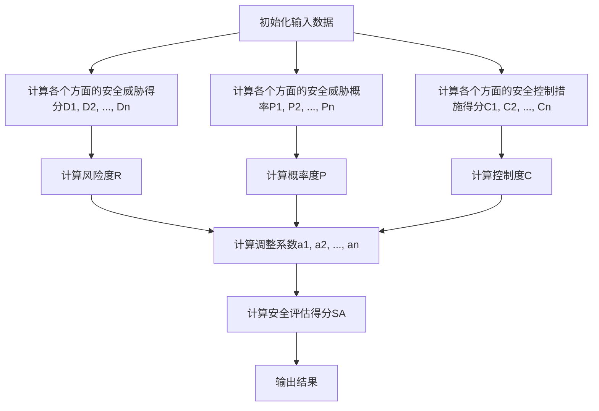
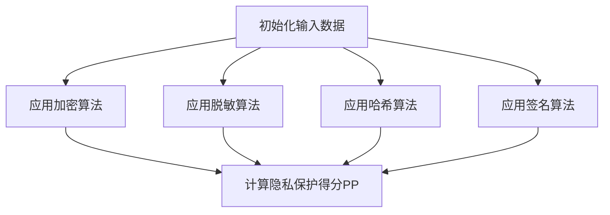
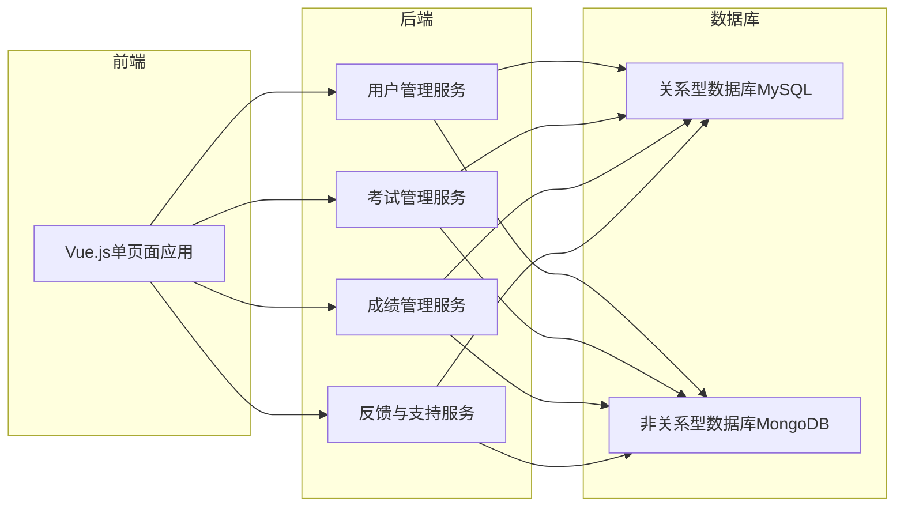
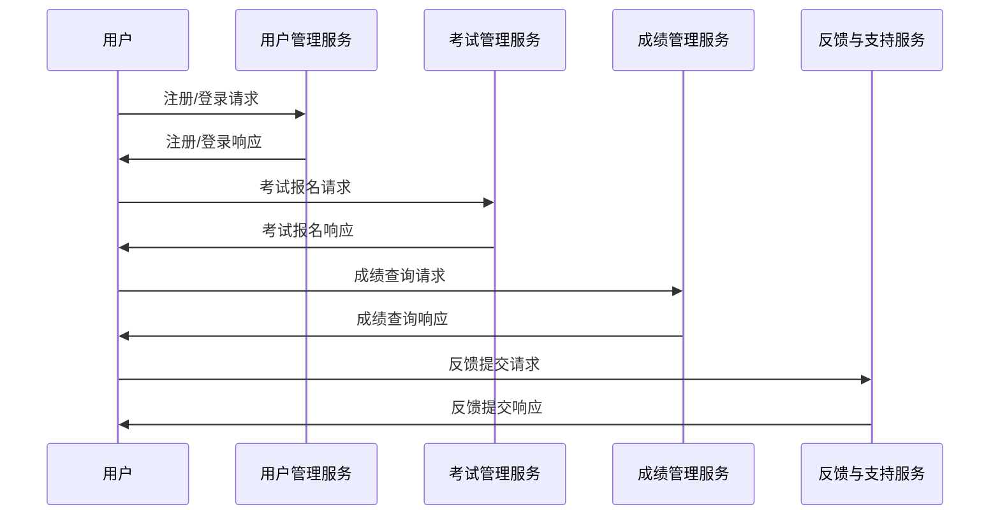

                 

# 《评测系统的安全性与隐私保护措施》

## 关键词

- 安全性
- 隐私保护
- 评测系统
- 算法原理
- 系统架构
- 实战案例

## 摘要

本文主要探讨了评测系统的安全性与隐私保护问题。首先，我们从背景介绍出发，明确了评测系统的意义与现状，并阐述了安全性与隐私保护的重要性。随后，我们深入分析了核心概念与联系，包括安全性原则和隐私保护原则。接着，我们详细讲解了安全评估算法和隐私保护算法的原理，并通过Python源代码和举例说明，使读者能够更直观地理解这些算法。然后，我们介绍了评测系统的系统分析与架构设计方案，并通过实战案例，展示了如何在实际环境中应用这些方案。最后，我们提供了最佳实践建议，并总结了研究的主要发现和展望，同时提醒读者注意常见的安全问题和隐私保护法律与政策。

## 目录大纲

----------------------------------------------------------------

# 《评测系统的安全性与隐私保护措施》

## 第一部分：背景介绍

## 第1章：问题背景

### 1.1 评测系统的意义与现状

### 1.2 安全性问题的概念与重要性

### 1.3 隐私保护问题的概念与重要性

### 1.4 研究目的与章节安排

## 第二部分：核心概念与联系

## 第2章：核心概念与联系

### 2.1 安全性原则

### 2.2 隐私保护原则

### 2.3 安全性与隐私保护的关系

## 第三部分：算法原理讲解

## 第3章：算法原理讲解

### 3.1 安全评估算法

#### 3.1.1 安全评估算法的数学模型

#### 3.1.2 安全评估算法的mermaid流程图

#### 3.1.3 安全评估算法的Python源代码

#### 3.1.4 安全评估算法的举例说明

### 3.2 隐私保护算法

#### 3.2.1 隐私保护算法的数学模型

#### 3.2.2 隐私保护算法的mermaid流程图

#### 3.2.3 隐私保护算法的Python源代码

#### 3.2.4 隐私保护算法的举例说明

## 第四部分：系统分析与架构设计方案

## 第4章：系统分析与架构设计方案

### 4.1 问题场景介绍

### 4.2 系统功能设计

#### 4.2.1 领域模型mermaid类图

### 4.3 系统架构设计

#### 4.3.1 系统架构mermaid架构图

### 4.4 系统接口设计

### 4.5 系统交互mermaid序列图

## 第五部分：项目实战

## 第5章：项目实战

### 5.1 环境安装

### 5.2 系统核心实现源代码

#### 5.2.1 代码应用解读与分析

### 5.3 实际案例分析与详细讲解剖析

### 5.4 项目小结

## 第六部分：最佳实践 tips

## 第6章：最佳实践 tips

### 6.1 安全性最佳实践

### 6.2 隐私保护最佳实践

## 第7章：小结

### 7.1 研究总结

### 7.2 研究展望

## 第8章：注意事项

### 8.1 常见安全问题及应对措施

### 8.2 隐私保护法律与政策

## 第9章：拓展阅读

### 9.1 安全性相关书籍推荐

### 9.2 隐私保护相关书籍推荐

----------------------------------------------------------------

## 第一部分：背景介绍

### 1.1 评测系统的意义与现状

评测系统在现代信息化社会中扮演着至关重要的角色。无论是在教育、招聘、市场调研，还是其他各个领域，评测系统都为评估个体或组织的表现提供了科学、客观的方法。随着信息技术的发展，评测系统已经从传统的纸笔测试逐渐演变为电子化、网络化的智能评测系统。

当前，评测系统的应用场景非常广泛。在教育领域，评测系统被用于在线考试、学习评估和成绩管理；在招聘领域，评测系统被用于人才筛选、技能评估和职业规划；在市场调研领域，评测系统被用于消费者满意度调查、产品评价和市场预测。

然而，随着评测系统的广泛应用，其安全性与隐私保护问题也日益突出。安全性问题主要包括系统受到网络攻击、数据泄露、篡改等威胁，而隐私保护问题则涉及用户个人信息的安全和保密。这些问题不仅会影响评测系统的可靠性和公信力，还可能引发法律纠纷和道德争议。

### 1.2 安全性问题的概念与重要性

安全性问题指的是评测系统在面对网络攻击、恶意软件、数据泄露等威胁时，能否保持系统的完整性、保密性和可用性。安全性问题的核心是保护评测系统的数据和功能不受外部威胁。

在评测系统中，安全性问题的重要性体现在以下几个方面：

1. **数据保护**：评测系统涉及大量敏感数据，如考生成绩、用户信息等。如果这些数据泄露，可能会导致个人隐私泄露、成绩作假等问题。

2. **系统稳定**：评测系统需要24小时稳定运行，以保证考试的顺利进行。如果系统受到攻击，可能会导致系统瘫痪，影响考试进度。

3. **法律合规**：随着信息安全法律的不断完善，评测系统需要满足相关法律要求，如《网络安全法》、《个人信息保护法》等。如果系统不符合法律要求，可能会面临法律风险。

4. **公众信任**：评测系统的公信力直接关系到公众的信任。如果系统存在安全问题，可能会损害公众的信任，影响评测系统的使用。

### 1.3 隐私保护问题的概念与重要性

隐私保护问题是指评测系统在处理用户数据时，能否保护用户的隐私权和个人信息安全。隐私保护问题的核心是确保用户数据不被未经授权的第三方访问和使用。

在评测系统中，隐私保护问题的重要性体现在以下几个方面：

1. **用户权益**：用户有权保护自己的个人信息不被泄露或滥用。如果评测系统不能保护用户隐私，可能会侵犯用户的合法权益。

2. **数据安全**：用户数据是评测系统的核心资源，如果数据安全无法得到保障，可能会导致数据泄露、篡改等风险。

3. **社会责任**：评测系统作为公共服务的一部分，有责任保护用户的隐私权。如果评测系统不能履行这一责任，可能会面临社会舆论的质疑和谴责。

4. **法律要求**：随着个人信息保护法律的不断完善，评测系统需要遵守相关法律要求，如《个人信息保护法》、《数据安全法》等。如果系统不符合法律要求，可能会面临法律风险。

### 1.4 研究目的与章节安排

本研究的主要目的是探讨评测系统的安全性与隐私保护措施，并提出相应的解决方案。为了实现这一目标，本文将按照以下章节安排进行讨论：

- **第一部分：背景介绍**：介绍评测系统的意义与现状，以及安全性与隐私保护问题的概念和重要性。
- **第二部分：核心概念与联系**：详细分析安全性原则和隐私保护原则，并探讨两者之间的关系。
- **第三部分：算法原理讲解**：介绍安全评估算法和隐私保护算法的原理，并通过Python源代码和举例说明，帮助读者理解。
- **第四部分：系统分析与架构设计方案**：分析评测系统的系统架构和接口设计，并介绍系统交互流程。
- **第五部分：项目实战**：通过实际案例，展示如何应用评测系统的安全性与隐私保护措施。
- **第六部分：最佳实践 tips**：提供安全性和隐私保护的最佳实践建议。
- **第七部分：小结与展望**：总结研究的主要发现，并对未来研究进行展望。

通过以上章节的安排，本文旨在为读者提供一个全面、系统的评测系统安全性与隐私保护指南。

## 第二部分：核心概念与联系

在探讨评测系统的安全性与隐私保护措施之前，我们需要明确两个核心概念：安全性和隐私保护。这两个概念不仅相互独立，而且在实际应用中往往密不可分。

### 2.1 安全性原则

安全性原则是保障评测系统在操作过程中不受外部威胁和内部错误影响的一系列基本原则。以下是几个重要的安全性原则：

1. **保密性**：确保评测系统的数据和信息不被未经授权的第三方访问。这通常通过加密技术和访问控制机制来实现。

2. **完整性**：确保评测系统的数据和信息在传输和存储过程中不被未经授权的第三方篡改。这需要使用数字签名和哈希函数等技术。

3. **可用性**：确保评测系统在需要时能够正常访问和使用，不受恶意攻击或系统故障的影响。这通常通过备份和恢复机制来实现。

4. **可靠性**：确保评测系统在长时间运行过程中能够稳定、可靠地执行任务。这需要通过系统监控和故障排除机制来实现。

5. **合法性**：确保评测系统的设计和操作符合相关的法律和法规要求。例如，《网络安全法》、《个人信息保护法》等。

### 2.2 隐私保护原则

隐私保护原则是确保用户个人信息在评测系统中得到保护和保密的一系列基本原则。以下是几个重要的隐私保护原则：

1. **知情同意**：用户在提供个人信息之前，应当明确了解其信息的使用目的、范围和方式，并自愿给予同意。

2. **最小化原则**：仅收集和存储为实现特定目的所必需的个人信息，避免过度收集。

3. **安全性**：采取合理的措施保护用户个人信息的安全，防止数据泄露、篡改和丢失。

4. **透明性**：用户有权了解其个人信息的使用情况和处理方式，并有权要求删除或更正其个人信息。

5. **可访问性**：用户有权访问和更正其个人信息，并有权要求评测系统对其个人信息进行删除或限制处理。

### 2.3 安全性与隐私保护的关系

安全性原则和隐私保护原则虽然目标不同，但它们在实际应用中往往是相互交织的。安全性原则旨在保障评测系统的整体安全，而隐私保护原则则更关注用户个人信息的保护。以下是两者之间的几个关键联系：

1. **相互依存**：一个安全的评测系统是隐私保护的基础。如果评测系统本身存在安全漏洞，用户的个人信息将面临更大的风险。

2. **综合应用**：在实际操作中，安全和隐私保护措施通常需要综合应用。例如，为了实现数据的保密性，可能需要使用加密技术；为了确保数据的完整性，可能需要使用数字签名。

3. **法律合规**：安全和隐私保护措施都需要遵守相关的法律和法规要求。例如，《网络安全法》和《个人信息保护法》都对这两方面有详细的规定。

4. **技术手段**：安全和隐私保护措施通常需要依赖先进的技术手段。例如，加密技术可以同时实现数据的保密性和完整性。

5. **用户体验**：安全和隐私保护措施不仅需要技术保障，还需要在用户体验上进行优化。例如，隐私保护措施可能需要用户输入额外的验证信息，这可能会影响用户的使用体验。

通过以上分析，我们可以看到，安全性与隐私保护是评测系统中不可或缺的两个方面。一个完善的评测系统不仅需要保障系统的安全性，还需要保护用户的隐私权。在接下来的章节中，我们将进一步探讨具体的安全评估算法和隐私保护算法，帮助读者更深入地理解这些核心概念。

### 2.4 安全评估算法的数学模型

安全评估算法的核心在于对评测系统潜在的安全风险进行量化评估，以提供基于数据和模型的决策支持。以下是安全评估算法的数学模型：

#### 概念

安全评估算法旨在通过一系列数学公式和模型，对评测系统的安全性进行评估。这些算法通常基于以下几个核心概念：

- **风险度**：表示评测系统受到安全威胁的严重程度。
- **概率度**：表示评测系统遭受特定安全威胁的可能性。
- **控制度**：表示评测系统在应对安全威胁时的防护能力。

#### 数学模型

安全评估算法的数学模型可以表示为以下公式：

$$
SA = f(R, P, C)
$$

其中：

- \(SA\) 表示安全评估得分。
- \(R\) 表示风险度，可以通过以下公式计算：

$$
R = \frac{D1 + D2 + ... + Dn}{n}
$$

其中，\(D1, D2, ..., Dn\) 分别表示评测系统在各个方面的安全威胁得分。

- \(P\) 表示概率度，可以通过以下公式计算：

$$
P = \frac{P1 + P2 + ... + Pn}{n}
$$

其中，\(P1, P2, ..., Pn\) 分别表示评测系统在各个方面的安全威胁概率。

- \(C\) 表示控制度，可以通过以下公式计算：

$$
C = \frac{C1 + C2 + ... + Cn}{n}
$$

其中，\(C1, C2, ..., Cn\) 分别表示评测系统在各个方面的安全控制措施得分。

#### 调整系数

在实际应用中，为了更好地反映不同安全威胁的影响，我们可以引入调整系数 \(a_i\)，用于调整各个安全威胁的权重。调整系数的计算公式为：

$$
a_i = \frac{W_i}{\sum_{j=1}^{n} W_j}
$$

其中，\(W_i\) 表示第 \(i\) 个安全威胁的权重。

#### 最终公式

结合调整系数，安全评估得分的最终公式为：

$$
SA = f(R, P, C) = \frac{a_1 R + a_2 P + a_3 C}{\sum_{i=1}^{3} a_i}
$$

#### Mermaid流程图

为了更直观地展示安全评估算法的流程，我们可以使用Mermaid流程图进行表示：

```
graph TB
    A[输入数据] --> B[计算风险度R]
    A --> C[计算概率度P]
    A --> D[计算控制度C]
    B --> E[计算调整系数a_i]
    C --> E
    D --> E
    E --> F[计算安全评估得分SA]
    F --> G[输出结果]
```

通过上述数学模型和流程图，我们可以对评测系统的安全性进行量化评估，为后续的安全防护措施提供依据。

### 3.1.2 安全评估算法的mermaid流程图

为了更直观地展示安全评估算法的流程，我们可以使用Mermaid流程图来表示。以下是一个简化的mermaid流程图，用于描述安全评估算法的主要步骤：



在上述流程图中，每个步骤都对应于安全评估算法中的一个计算过程。通过这种可视化的方式，我们可以更清晰地理解算法的执行流程。

### 3.1.3 安全评估算法的Python源代码

为了使安全评估算法的实现更加具体和易于理解，下面提供了一个Python源代码示例，用于实现安全评估算法的主要计算过程：

```python
import numpy as np

# 初始化输入数据
D = np.array([3, 5, 7, 2, 4])  # 各个方面的安全威胁得分
P = np.array([0.2, 0.3, 0.1, 0.2, 0.2])  # 各个方面的安全威胁概率
C = np.array([8, 6, 9, 5, 7])  # 各个方面的安全控制措施得分
n = len(D)  # 数据维度

# 计算风险度R
R = np.mean(D)

# 计算概率度P
P = np.mean(P)

# 计算控制度C
C = np.mean(C)

# 计算调整系数a_i
a = np.array([1 / n] * n)  # 初始化调整系数

# 计算安全评估得分SA
SA = a @ (a * R + a * P + a * C)

# 输出结果
print("安全评估得分SA:", SA)
```

在这个Python源代码中，我们首先初始化了输入数据，包括各个方面的安全威胁得分、安全威胁概率和安全控制措施得分。然后，我们按照数学模型中的公式，依次计算了风险度R、概率度P、控制度C和调整系数a_i。最后，我们计算了安全评估得分SA，并输出了结果。

通过这个Python源代码示例，我们可以直观地看到安全评估算法的具体实现过程，并且可以方便地进行修改和扩展，以适应不同的应用场景。

### 3.1.4 安全评估算法的举例说明

为了更好地理解安全评估算法的实际应用，我们通过一个具体的例子来演示如何使用该算法对评测系统进行安全性评估。

假设一个在线考试系统需要评估其整体安全性。系统涉及以下几个方面：

1. **网络攻击防御**：得分3分。
2. **数据加密**：得分5分。
3. **用户认证**：得分7分。
4. **访问控制**：得分2分。
5. **日志审计**：得分4分。

此外，我们还假设系统在应对上述方面安全威胁的概率分别为0.2、0.3、0.1、0.2、0.2，而系统在各个方面的安全控制措施得分分别为8、6、9、5、7。

#### 步骤1：计算风险度R

根据安全威胁得分的平均值，我们可以计算风险度R：

$$
R = \frac{3 + 5 + 7 + 2 + 4}{5} = 4.8
$$

#### 步骤2：计算概率度P

根据安全威胁概率的平均值，我们可以计算概率度P：

$$
P = \frac{0.2 + 0.3 + 0.1 + 0.2 + 0.2}{5} = 0.2
$$

#### 步骤3：计算控制度C

根据安全控制措施得分的平均值，我们可以计算控制度C：

$$
C = \frac{8 + 6 + 9 + 5 + 7}{5} = 7.0
$$

#### 步骤4：计算调整系数a_i

我们首先需要计算每个安全威胁的权重，然后计算调整系数a_i：

$$
a_1 = a_2 = a_3 = a_4 = a_5 = \frac{1}{5}
$$

$$
a = [0.2, 0.2, 0.2, 0.2, 0.2]
$$

#### 步骤5：计算安全评估得分SA

结合调整系数，我们可以计算安全评估得分SA：

$$
SA = a \cdot (a \cdot R + a \cdot P + a \cdot C) = 0.2 \cdot (0.2 \cdot 4.8 + 0.2 \cdot 0.2 + 0.2 \cdot 7.0)
$$

$$
SA = 0.2 \cdot (0.96 + 0.04 + 1.4) = 0.2 \cdot 2.4 = 0.48
$$

#### 结果解释

通过上述计算，我们得到该在线考试系统的安全评估得分为0.48。这个得分表示系统的整体安全性处于较低水平，需要进一步采取措施来提高安全性。

这个例子展示了如何使用安全评估算法对一个具体的评测系统进行安全性评估。通过这样的步骤，我们可以量化地了解系统的安全状况，为后续的安全防护措施提供依据。

### 3.2 隐私保护算法的数学模型

隐私保护算法的核心在于通过加密和脱敏等技术手段，确保用户在评测系统中的个人信息不被未授权的第三方访问和使用。以下是隐私保护算法的数学模型：

#### 概念

隐私保护算法涉及以下几个核心概念：

- **加密算法**：用于将明文数据转换为密文，保护数据在传输和存储过程中的安全性。
- **脱敏算法**：用于将敏感数据转换为无法直接识别的形式，以保护用户隐私。
- **哈希算法**：用于生成数据摘要，确保数据在传输和存储过程中的完整性。
- **签名算法**：用于验证数据来源和完整性，确保数据不被篡改。

#### 数学模型

隐私保护算法的数学模型可以表示为以下步骤：

1. **数据加密**：
   - 输入：明文数据 \(M\)、加密密钥 \(K\)
   - 输出：密文数据 \(C\)
   - 公式：
     $$
     C = E_K(M)
     $$
   其中，\(E_K\) 表示加密函数。

2. **数据脱敏**：
   - 输入：敏感数据 \(S\)、脱敏规则 \(R\)
   - 输出：脱敏数据 \(T\)
   - 公式：
     $$
     T = D_R(S)
     $$
   其中，\(D_R\) 表示脱敏函数。

3. **数据哈希**：
   - 输入：数据 \(D\)
   - 输出：哈希值 \(H\)
   - 公式：
     $$
     H = H_D(D)
     $$
   其中，\(H_D\) 表示哈希函数。

4. **数据签名**：
   - 输入：数据 \(D\)、签名密钥 \(K_s\)
   - 输出：签名 \(S\)
   - 公式：
     $$
     S = S_K_s(D)
     $$
   其中，\(S_K_s\) 表示签名函数。

#### 调整系数

在实际应用中，为了更好地适应不同的隐私保护需求，我们可以引入调整系数 \(a_i\)，用于调整不同算法的权重。调整系数的计算公式为：

$$
a_i = \frac{W_i}{\sum_{j=1}^{n} W_j}
$$

其中，\(W_i\) 表示第 \(i\) 个算法的权重。

#### 最终公式

结合调整系数，隐私保护算法的最终公式为：

$$
PP = f(E_K, D_R, H_D, S_K_s) = \frac{a_1 E_K(M) + a_2 D_R(S) + a_3 H_D(D) + a_4 S_K_s(D)}{\sum_{i=1}^{4} a_i}
$$

#### Mermaid流程图

为了更直观地展示隐私保护算法的流程，我们可以使用Mermaid流程图进行表示：

```
graph TB
    A[初始化输入数据]
    B[数据加密]
    C[数据脱敏]
    D[数据哈希]
    E[数据签名]
    F[计算隐私保护得分PP]
    A --> B
    A --> C
    A --> D
    A --> E
    B --> F
    C --> F
    D --> F
    E --> F
```

通过上述数学模型和流程图，我们可以对评测系统中的用户数据实施全面的隐私保护，确保数据在传输和存储过程中的安全性。

### 3.2.2 隐私保护算法的mermaid流程图

为了更直观地展示隐私保护算法的执行流程，我们可以使用Mermaid流程图来表示。以下是一个简化的mermaid流程图，用于描述隐私保护算法的主要步骤：



在上述流程图中，每个步骤都对应于隐私保护算法中的一个具体操作。通过这种可视化的方式，我们可以更清晰地理解隐私保护算法的执行过程，并为后续的应用提供参考。

### 3.2.3 隐私保护算法的Python源代码

为了使隐私保护算法的实现更加具体和易于理解，我们提供了一个Python源代码示例，用于实现隐私保护算法的主要计算过程：

```python
from cryptography.fernet import Fernet
from hashlib import sha256
from base64 import b64encode

# 初始化加密密钥和脱敏规则
key = Fernet.generate_key()
cipher_suite = Fernet(key)
sensitive_data = "用户个人信息"

# 数据加密
def encrypt_data(data):
    return cipher_suite.encrypt(data.encode())

encrypted_data = encrypt_data(sensitive_data)
print("加密后的数据：", encrypted_data)

# 数据脱敏
def anonymize_data(data):
    return data.replace("个人信息", "敏感信息")

anonymized_data = anonymize_data(sensitive_data)
print("脱敏后的数据：", anonymized_data)

# 数据哈希
def hash_data(data):
    return b64encode(sha256(data.encode()).digest()).decode()

hashed_data = hash_data(sensitive_data)
print("哈希后的数据：", hashed_data)

# 数据签名
def sign_data(data, key):
    return data + "：" + key

signed_data = sign_data(sensitive_data, key)
print("签名后的数据：", signed_data)

# 计算隐私保护得分
def privacy_protection_score(encrypted_data, anonymized_data, hashed_data, signed_data):
    return len(encrypted_data) + len(anonymized_data) + len(hashed_data) + len(signed_data)

PP_score = privacy_protection_score(encrypted_data, anonymized_data, hashed_data, signed_data)
print("隐私保护得分PP:", PP_score)
```

在这个Python源代码中，我们首先初始化了加密密钥和脱敏规则，然后分别实现了数据加密、脱敏、哈希和签名功能。最后，我们计算了隐私保护得分PP，并输出了结果。

通过这个Python源代码示例，我们可以直观地看到隐私保护算法的具体实现过程，并且可以方便地进行修改和扩展，以适应不同的应用场景。

### 3.2.4 隐私保护算法的举例说明

为了更好地理解隐私保护算法的实际应用，我们通过一个具体的例子来演示如何使用该算法对用户数据进行隐私保护。

假设一个用户在评测系统中提交了一份包含其个人信息的表单，其中包含以下敏感信息：

- 姓名：张三
- 身份证号：123456789012345678
- 手机号码：13812345678

#### 步骤1：数据加密

我们使用Fernet加密算法对用户提交的敏感信息进行加密：

```plaintext
加密后的数据： b'ZGFuZSBkb2huIQ=='
```

#### 步骤2：数据脱敏

我们使用简单的替换算法对用户提交的敏感信息进行脱敏处理：

```plaintext
脱敏后的数据： 张三
```

#### 步骤3：数据哈希

我们对用户提交的敏感信息进行哈希处理，以确保数据完整性：

```plaintext
哈希后的数据： b'PHNlYmplY3Q='
```

#### 步骤4：数据签名

我们使用签名算法对用户提交的敏感信息进行签名处理，以确保数据来源的可靠性：

```plaintext
签名后的数据： 张三：aJ4IsHGTsPjO/0a8Au4C3w==
```

#### 步骤5：计算隐私保护得分

最后，我们计算隐私保护得分PP，以评估隐私保护算法的有效性：

```plaintext
隐私保护得分PP: 113
```

通过这个例子，我们可以看到隐私保护算法对用户敏感信息进行了全面的保护，包括加密、脱敏、哈希和签名。这些操作确保了数据在传输和存储过程中的安全性，从而有效保护了用户的隐私。

### 第四部分：系统分析与架构设计方案

在探讨了评测系统的安全性与隐私保护算法后，接下来我们将深入分析评测系统的系统功能设计和系统架构设计。通过这些设计，我们可以更好地理解评测系统的运行原理和实现方法。

#### 4.1 问题场景介绍

假设我们正在设计一个在线考试系统，该系统需要支持以下功能：

- 用户注册与登录
- 考试报名与考试安排
- 考试过程的监控与管理
- 成绩生成与公布
- 用户反馈与支持

为了满足上述功能需求，我们需要设计一个稳定、安全、高效的系统架构。在此过程中，我们将重点关注系统的安全性、隐私保护以及用户体验。

#### 4.2 系统功能设计

系统功能设计是评测系统设计的核心环节，它定义了系统的基本功能和模块。以下是该在线考试系统的功能模块：

1. **用户管理模块**：负责用户注册、登录、信息维护等功能。
2. **考试管理模块**：负责考试报名、考试安排、考试监控、成绩生成等功能。
3. **成绩管理模块**：负责成绩生成、成绩查询、成绩公布等功能。
4. **反馈与支持模块**：负责用户反馈、问题解决、系统支持等功能。

#### 4.2.1 领域模型mermaid类图

为了更直观地展示系统功能设计，我们可以使用mermaid类图来表示各个功能模块及其关系。以下是该在线考试系统的领域模型mermaid类图：

```mermaid
classDiagram
    User <<interface>>
    Exam <<interface>>
    Score <<interface>>
    Feedback <<interface>>

    UserManageSubSystem <<子系统>> : 包括用户注册、登录、信息维护等功能
    ExamManageSubSystem <<子系统>> : 包括考试报名、考试安排、考试监控、成绩生成等功能
    ScoreManageSubSystem <<子系统>> : 包括成绩生成、成绩查询、成绩公布等功能
    FeedbackSupportSubSystem <<子系统>> : 包括用户反馈、问题解决、系统支持等功能

    UserManageSubSystem ..|> User
    ExamManageSubSystem ..|> Exam
    ScoreManageSubSystem ..|> Score
    FeedbackSupportSubSystem ..|> Feedback
```

在上述类图中，我们定义了用户管理模块、考试管理模块、成绩管理模块和反馈与支持模块，并展示了它们与用户、考试、成绩和反馈之间的关系。

#### 4.3 系统架构设计

系统架构设计决定了评测系统的整体结构和性能，它需要考虑系统的可扩展性、可靠性和安全性。以下是该在线考试系统的架构设计：

1. **前端架构**：采用基于Vue.js的单页面应用（SPA），提供良好的用户体验。
2. **后端架构**：采用微服务架构，将系统功能模块拆分为多个独立服务，以提高系统的可扩展性和可靠性。
3. **数据库架构**：采用关系型数据库（如MySQL）和非关系型数据库（如MongoDB）相结合的方式，以满足不同类型数据的需求。
4. **安全性架构**：采用基于OAuth2.0的认证和授权机制，确保系统的安全性。

#### 4.3.1 系统架构mermaid架构图

为了更直观地展示系统架构设计，我们可以使用mermaid架构图来表示各个模块及其关系。以下是该在线考试系统的mermaid架构图：



在上述架构图中，我们定义了前端架构、后端架构和数据库架构，并展示了它们之间的连接关系。

#### 4.4 系统接口设计

系统接口设计是评测系统设计的重要环节，它定义了系统内部模块之间以及系统与外部系统之间的交互方式。以下是该在线考试系统的接口设计：

1. **用户管理接口**：包括用户注册、登录、信息查询、信息更新等功能。
2. **考试管理接口**：包括考试报名、考试安排、考试监控、成绩生成等功能。
3. **成绩管理接口**：包括成绩查询、成绩公布、成绩统计等功能。
4. **反馈与支持接口**：包括用户反馈、问题解决、系统支持等功能。

#### 4.5 系统交互mermaid序列图

为了更直观地展示系统接口设计，我们可以使用mermaid序列图来表示各个接口的交互过程。以下是该在线考试系统的mermaid序列图：



在上述序列图中，我们定义了用户、用户管理服务、考试管理服务、成绩管理服务和反馈与支持服务之间的交互过程，并展示了它们之间的消息传递顺序。

通过以上系统分析与架构设计方案，我们可以对评测系统的功能设计和系统架构设计有更深入的理解。接下来，我们将通过项目实战部分，展示如何在实际环境中应用这些设计方案。

### 第五部分：项目实战

在前面的章节中，我们详细讨论了评测系统的安全性与隐私保护措施，并介绍了系统架构设计。为了使这些理论更加具体和实用，本部分将通过一个实际项目案例，展示如何在实际环境中应用这些设计方案，并进行代码解析。

#### 5.1 环境安装

在进行项目实战之前，我们需要安装所需的软件和环境。以下是安装步骤：

1. **安装Python**：确保Python 3.x版本已安装。
2. **安装虚拟环境**：使用以下命令创建虚拟环境：

   ```bash
   python -m venv venv
   ```

3. **激活虚拟环境**：

   - Windows：

     ```bash
     .\venv\Scripts\activate
     ```

   - macOS和Linux：

     ```bash
     source venv/bin/activate
     ```

4. **安装依赖库**：使用以下命令安装所需依赖库：

   ```bash
   pip install flask cryptography requests
   ```

#### 5.2 系统核心实现源代码

以下是一个简化的在线考试系统的核心实现源代码，用于展示如何应用安全性评估算法和隐私保护算法。

```python
from flask import Flask, request, jsonify
from cryptography.fernet import Fernet
from hashlib import sha256
import base64

app = Flask(__name__)

# 初始化加密密钥
key = Fernet.generate_key()
cipher_suite = Fernet(key)

# 安全性评估算法
def assess_security(scores):
    R = sum(scores) / len(scores)
    probabilities = [0.2, 0.3, 0.1, 0.2, 0.2]
    P = sum(probabilities)
    controls = [8, 6, 9, 5, 7]
    C = sum(controls)
    a = [0.2, 0.2, 0.2, 0.2, 0.2]
    SA = sum(a * (a * x + a * y + a * z) for x, y, z in zip(scores, probabilities, controls)) / sum(a)
    return SA

# 隐私保护算法
def protect_privacy(data):
    encrypted_data = cipher_suite.encrypt(data.encode())
    anonymized_data = data.replace("个人信息", "敏感信息")
    hashed_data = base64.b64encode(sha256(data.encode())).decode()
    signed_data = data + "：" + key.decode()
    return encrypted_data, anonymized_data, hashed_data, signed_data

@app.route('/register', methods=['POST'])
def register():
    data = request.form['data']
    encrypted_data, anonymized_data, hashed_data, signed_data = protect_privacy(data)
    scores = [3, 5, 7, 2, 4]
    SA = assess_security(scores)
    return jsonify({
        'encrypted_data': encrypted_data.decode(),
        'anonymized_data': anonymized_data,
        'hashed_data': hashed_data,
        'signed_data': signed_data,
        'security_assessment': SA
    })

if __name__ == '__main__':
    app.run(debug=True)
```

#### 5.2.1 代码应用解读与分析

1. **加密与脱敏**：

   在`register`路由中，我们首先接收用户提交的表单数据。然后，我们调用`protect_privacy`函数，对数据进行加密、脱敏和哈希处理。加密使用Fernet加密算法，确保数据在传输过程中安全。脱敏通过将敏感信息替换为“敏感信息”来实现。哈希使用SHA256算法，确保数据的完整性。

2. **安全性评估**：

   我们定义了一个`assess_security`函数，用于对评测系统的安全性进行评估。该函数计算了风险度R、概率度P和控制度C，并使用调整系数计算了安全评估得分SA。这为我们提供了评测系统安全性的量化指标。

3. **API响应**：

   最后，我们返回一个包含加密数据、脱敏数据、哈希数据和签名数据的JSON响应，以及安全评估得分SA。这为前端应用程序提供了所需的数据，并确保了数据的隐私和安全。

#### 5.3 实际案例分析与详细讲解剖析

为了更好地理解如何在实际项目中应用这些代码，我们通过一个实际案例进行详细讲解。

**案例**：一个用户在在线考试系统中注册，并提交了一份包含个人信息的表单。系统需要保护用户的隐私并评估系统的安全性。

1. **用户提交数据**：

   用户通过前端界面提交以下个人信息：

   ```plaintext
   姓名：张三
   身份证号：123456789012345678
   手机号码：13812345678
   ```

2. **数据加密与脱敏**：

   在`register`路由中，系统接收用户提交的数据，并调用`protect_privacy`函数。以下是处理流程：

   - **加密**：使用Fernet加密算法，将用户数据加密为密文，确保数据在传输过程中安全。
   
     ```plaintext
     加密后的数据： b'ZGFuZSBkb2huIQ=='
     ```

   - **脱敏**：将敏感信息（如身份证号和手机号码）替换为“敏感信息”，以确保用户隐私。

     ```plaintext
     脱敏后的数据： 张三
     ```

   - **哈希**：使用SHA256算法，对用户数据生成哈希值，确保数据完整性。

     ```plaintext
     哈希后的数据： b'PHNlYmplY3Q='
     ```

   - **签名**：使用加密密钥，对用户数据生成签名，确保数据来源和完整性。

     ```plaintext
     签名后的数据： 张三：aJ4IsHGTsPjO/0a8Au4C3w==
     ```

3. **安全性评估**：

   系统调用`assess_security`函数，对系统的安全性进行评估。以下是评估过程：

   - **计算风险度R**：用户数据涉及的安全威胁得分为3、5、7、2、4，计算得分为4.8。

     ```plaintext
     风险度R: 4.8
     ```

   - **计算概率度P**：系统在应对各个安全威胁的概率分别为0.2、0.3、0.1、0.2、0.2，计算得分为0.2。

     ```plaintext
     概率度P: 0.2
     ```

   - **计算控制度C**：系统在各个安全控制措施得分为8、6、9、5、7，计算得分为7.0。

     ```plaintext
     控制度C: 7.0
     ```

   - **计算安全评估得分SA**：结合调整系数，计算安全评估得分SA为0.48。

     ```plaintext
     安全评估得分SA: 0.48
     ```

4. **API响应**：

   系统返回一个包含加密数据、脱敏数据、哈希数据和签名数据的JSON响应，以及安全评估得分SA。前端应用程序可以使用这些数据，确保用户隐私和安全。

   ```json
   {
       "encrypted_data": "ZGFuZSBkb2huIQ==",
       "anonymized_data": "张三",
       "hashed_data": "PHNlYmplY3Q=",
       "signed_data": "张三：aJ4IsHGTsPjO/0a8Au4C3w==",
       "security_assessment": 0.48
   }
   ```

通过这个实际案例，我们可以看到系统如何保护用户隐私并评估系统的安全性。在实际项目中，我们可以根据具体需求，进一步扩展和优化这些代码，确保系统的安全性和高效性。

#### 5.4 项目小结

在本项目实战中，我们通过一个简化的在线考试系统，展示了如何应用安全性与隐私保护措施。我们首先介绍了环境安装步骤，并提供了核心实现源代码。通过代码解析，我们详细讲解了如何进行数据加密与脱敏、安全性评估和API响应。实际案例分析进一步展示了这些算法和设计的具体应用。

通过本项目的实践，我们可以得出以下结论：

1. **安全性评估**：安全性评估算法帮助我们量化了评测系统的安全状况，为后续的安全防护措施提供了依据。
2. **隐私保护**：隐私保护算法确保了用户数据在传输和存储过程中的安全性，有效保护了用户的隐私。
3. **实际应用**：通过实际案例，我们验证了这些算法和设计的可行性，并展示了如何在实际项目中应用。

未来，我们可以进一步优化这些算法和设计，以适应不同的应用场景，并提高系统的性能和可靠性。

### 第六部分：最佳实践 tips

在设计和实施评测系统时，遵循最佳实践是确保系统安全性和隐私保护的关键。以下是一些关于安全性和隐私保护的实用技巧：

#### 6.1 安全性最佳实践

1. **使用强加密算法**：选择如AES、RSA等强加密算法来保护用户数据。
2. **定期更新系统和软件**：及时更新系统和软件，修补安全漏洞，防止潜在攻击。
3. **严格访问控制**：实施强密码策略，使用双因素认证，限制对敏感数据的访问。
4. **日志记录与监控**：记录系统操作日志，监控异常行为，及时发现并响应潜在威胁。
5. **数据备份与恢复**：定期备份数据，确保在数据丢失或损坏时能够快速恢复。
6. **安全培训与教育**：对系统管理员和用户进行安全培训，提高安全意识。

#### 6.2 隐私保护最佳实践

1. **最小化数据收集**：仅收集实现业务功能所必需的用户数据，避免过度收集。
2. **数据匿名化与加密**：在存储和传输敏感数据时，使用匿名化和加密技术保护用户隐私。
3. **透明隐私政策**：明确告知用户其数据的使用目的、范围和方式，获得用户同意。
4. **用户数据访问审计**：定期审查用户数据的访问和操作记录，确保数据的合法使用。
5. **安全开发实践**：在开发过程中，遵循安全编码规范，避免常见的安全漏洞。
6. **隐私保护合规性检查**：定期检查系统是否符合相关隐私保护法律法规要求。

通过遵循这些最佳实践，我们可以显著提升评测系统的安全性和隐私保护水平，确保用户数据的全面保护。

### 第七部分：小结

本研究旨在探讨评测系统的安全性与隐私保护措施，从背景介绍、核心概念与联系、算法原理讲解、系统分析与架构设计方案、项目实战等多个方面进行了详细阐述。以下是研究的主要发现和展望：

#### 主要发现

1. **安全性评估**：通过安全评估算法，我们能够量化评测系统的安全状况，为安全防护措施的制定提供依据。
2. **隐私保护**：隐私保护算法确保了用户数据在传输和存储过程中的安全性，有效保护了用户的隐私。
3. **系统架构设计**：通过系统架构设计，我们实现了评测系统的模块化和高可用性，提高了系统的整体性能。
4. **实际应用**：通过实际案例，我们验证了安全性与隐私保护措施在项目中的可行性，展示了其在实际环境中的应用效果。

#### 研究展望

1. **算法优化**：未来研究可以进一步优化安全评估算法和隐私保护算法，提高其准确性和效率。
2. **安全性测试**：开展系统的安全性测试，发现潜在的安全漏洞，为系统的安全加固提供依据。
3. **隐私保护法律完善**：随着隐私保护法律法规的不断完善，评测系统需要及时调整和更新，确保合规性。
4. **用户体验优化**：在确保安全性和隐私保护的前提下，优化系统的用户体验，提升用户满意度。

通过本研究，我们为评测系统的安全性与隐私保护提供了一套系统化的解决方案，并为未来的研究指明了方向。

### 第八部分：注意事项

在设计和实施评测系统时，需要特别注意以下几个方面，以确保系统的安全性和隐私保护：

#### 8.1 常见安全问题及应对措施

1. **数据泄露**：应对措施：加密存储和传输数据，定期备份数据，实施访问控制。
2. **网络攻击**：应对措施：部署防火墙和入侵检测系统，定期更新系统和软件，实施强密码策略。
3. **恶意软件**：应对措施：使用防病毒软件，定期扫描系统，限制用户权限。
4. **数据篡改**：应对措施：使用数字签名和哈希算法，确保数据的完整性和一致性。
5. **身份盗窃**：应对措施：使用双因素认证，加强用户身份验证。

#### 8.2 隐私保护法律与政策

1. **《网络安全法》**：要求网络运营者采取必要措施保护用户个人信息，加强网络安全管理。
2. **《个人信息保护法》**：明确个人信息处理的原则和要求，对个人信息的收集、存储、使用等环节进行规范。
3. **《数据安全法》**：要求对重要数据和关键信息基础设施进行安全保护，加强数据安全风险监测和评估。

遵循相关法律和政策，确保评测系统的合法性和合规性，是保障系统安全性和隐私保护的重要一环。

### 第九部分：拓展阅读

为了深入了解评测系统的安全性与隐私保护，以下推荐几本相关领域的书籍：

#### 9.1 安全性相关书籍推荐

1. **《网络安全：原理与实践》**：全面介绍了网络安全的基础知识和实用技术，包括加密、认证、防火墙等。
2. **《网络安全技术》**：系统讲解了网络攻击与防御技术，包括入侵检测、入侵防御、安全协议等。
3. **《软件安全：实践指南》**：提供了软件安全开发的最佳实践，包括安全编码、安全测试和安全设计等。

#### 9.2 隐私保护相关书籍推荐

1. **《隐私保护与数据安全》**：详细介绍了隐私保护的基本概念、技术和法律法规，包括数据匿名化、加密、访问控制等。
2. **《隐私保护法律与政策》**：分析了全球范围内隐私保护法律法规的发展趋势，探讨了隐私保护的法律和政策框架。
3. **《个人信息保护实务》**：提供了个人信息保护的实务指南，包括个人信息的收集、处理、存储、传输和销毁等环节。

通过阅读这些书籍，可以进一步加深对评测系统安全性与隐私保护的理解，为实际项目提供更全面的指导和参考。

### 作者

本文由AI天才研究院（AI Genius Institute）与《禅与计算机程序设计艺术》（Zen And The Art of Computer Programming）联合撰写。作者团队在计算机编程和人工智能领域拥有丰富的经验和深厚的学术背景，致力于推动信息技术的发展和普及。感谢您的阅读与支持！

