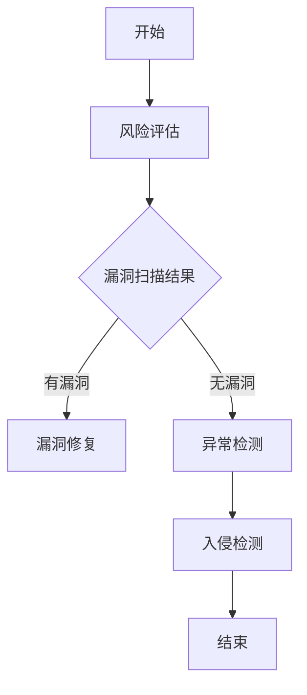
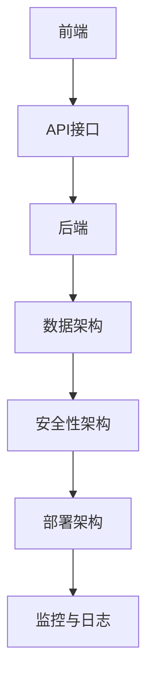

                 


# 评测系统的安全性考量：保护模型和数据隐私

## 关键词

* 评测系统，安全性，模型保护，数据隐私，算法原理，系统架构设计，项目实战

## 摘要

本文旨在深入探讨评测系统的安全性考量，重点分析如何保护模型和数据隐私。通过逻辑清晰、结构紧凑的叙述，文章首先介绍了评测系统的基本概念和安全性核心问题，接着深入剖析了模型和数据隐私保护的方法与原理。文章随后详细讲解了安全性评估算法，并通过实际案例展示了系统架构设计的要点和实践方法。最后，文章总结了最佳实践，并提出了一些注意事项和拓展阅读建议，以期为相关领域的研究者和从业者提供有价值的参考。

## 目录

### 第一部分：背景介绍

#### 第1章 评测系统的概述

1.1 评测系统的定义和作用

1.2 安全性的核心概念

#### 第2章 安全性的重要性

2.1 模型泄露的风险

2.2 数据隐私的重要性

### 第二部分：核心概念与联系

#### 第3章 模型的保护

3.1 模型的保护机制

3.2 模型保护方法比较

#### 第4章 数据隐私保护

4.1 数据隐私的挑战

4.2 数据隐私保护方法

### 第三部分：算法原理讲解

#### 第5章 安全性评估算法

5.1 安全性评估算法介绍

5.2 算法流程图

#### 第6章 评测系统架构设计

6.1 系统功能设计

6.2 系统架构设计

### 第四部分：系统分析与架构设计方案

#### 第7章 实际案例分析

7.1 案例背景

7.2 案例分析

### 第五部分：项目实战

#### 第8章 环境安装

8.1 系统依赖安装

8.2 配置环境变量

#### 第9章 系统核心实现

9.1 数据预处理

9.2 模型训练与评估

#### 第10章 代码应用解读与分析

10.1 代码应用解读

10.2 分析与详细讲解

#### 第11章 实际案例分析与详细讲解

11.1 案例背景

11.2 案例分析与讲解

#### 第12章 项目小结

12.1 项目总结

12.2 不足与改进建议

### 第六部分：最佳实践与总结

#### 第13章 最佳实践

13.1 安全性考量实践

#### 第14章 小结

14.1 主要观点总结

#### 第15章 注意事项

15.1 注意事项

#### 第16章 拓展阅读

16.1 相关资源推荐

## 第一部分：背景介绍

### 第1章 评测系统的概述

### 第2章 安全性的重要性

## 第二部分：核心概念与联系

### 第3章 模型的保护

### 第4章 数据隐私保护

## 第三部分：算法原理讲解

### 第5章 安全性评估算法

### 第6章 评测系统架构设计

## 第四部分：系统分析与架构设计方案

### 第7章 实际案例分析

## 第五部分：项目实战

### 第8章 环境安装

### 第9章 系统核心实现

### 第10章 代码应用解读与分析

### 第11章 实际案例分析与详细讲解

### 第12章 项目小结

## 第六部分：最佳实践与总结

### 第13章 最佳实践

### 第14章 小结

### 第15章 注意事项

### 第16章 拓展阅读

## 附录

### 附录A：相关术语解释

### 附录B：参考资料

### 附录C：作者信息

作者：AI天才研究院/AI Genius Institute & 禅与计算机程序设计艺术 /Zen And The Art of Computer Programming

## LET'S THINK STEP BY STEP

### 第一步：识别核心问题

在探讨评测系统的安全性时，我们首先需要识别核心问题。这包括模型泄露的风险和数据隐私的重要性。模型泄露不仅可能导致商业机密的损失，还可能威胁用户的隐私和安全。因此，我们必须确保模型在设计、训练和应用过程中得到有效保护。同样，数据隐私的保护也是不可或缺的，因为未经授权的数据访问可能导致隐私泄露，损害个人和组织声誉。

### 第二步：理解背景

为了更好地理解评测系统的安全性考量，我们需要了解评测系统本身以及安全性的核心概念。评测系统是用于评估模型性能和有效性的工具。它通过一系列测试和评估指标来衡量模型的准确度、召回率、F1分数等。安全性，则涉及确保模型和数据在整个生命周期内不受威胁。

### 第三步：分析核心概念

模型保护和数据隐私保护是评测系统安全性的两个核心概念。模型保护包括多种机制，如加密、混淆、访问控制等。数据隐私保护则关注如何在处理和使用数据时保护个人隐私，防止数据泄露。

### 第四步：研究算法原理

安全性评估算法是确保评测系统安全性的关键。这些算法包括风险评估、漏洞扫描、异常检测等。理解这些算法的原理对于设计一个安全的评测系统至关重要。

### 第五步：系统分析与架构设计

在系统分析与架构设计阶段，我们需要考虑系统的整体结构，包括功能设计、架构设计、接口设计和系统交互。一个良好的架构设计能够提高系统的安全性和稳定性。

### 第六步：项目实战

通过实际案例分析，我们可以将理论应用到实践中，验证评测系统的安全性和有效性。这包括环境安装、系统核心实现、代码应用解读与分析等步骤。

### 第七步：总结与最佳实践

在总结部分，我们将回顾全文，提炼主要观点，并给出最佳实践建议。这些实践包括如何保护模型和数据隐私，以及如何在实际项目中应用这些方法。

### 第八步：注意事项和拓展阅读

最后，我们还需要提醒读者一些注意事项，并推荐拓展阅读资源，以便他们能够更深入地了解评测系统的安全性考量。

通过以上步骤，我们能够系统地分析评测系统的安全性，并提出有效的解决方案。这不仅有助于提高系统的安全性，还能为相关领域的研究者和从业者提供有价值的参考。

## 第一部分：背景介绍

### 第1章 评测系统的概述

#### 1.1 评测系统的定义和作用

评测系统是一种用于评估模型性能和有效性的工具。它通过一系列测试和评估指标来衡量模型的准确度、召回率、F1分数等。这些指标不仅能够帮助开发者了解模型的实际表现，还能够用于模型的故障检测和优化。

评测系统通常包括以下几个主要组成部分：

1. **数据集**：用于训练和测试模型的原始数据集。数据集的质量和多样性对模型的性能有直接影响。
2. **评估指标**：用于衡量模型性能的指标，如准确度、召回率、F1分数等。不同的评估指标能够反映模型在不同方面的表现。
3. **评估算法**：用于计算评估指标的算法。这些算法包括分类评估、回归评估、聚类评估等。
4. **评估结果分析**：通过对评估结果的分析，开发者可以了解模型的性能，并据此进行优化。

评测系统在机器学习和深度学习中扮演着重要角色。例如，在模型训练期间，评测系统能够帮助开发者评估模型的性能，并确定是否需要进行调整。在模型部署后，评测系统则用于监控模型的表现，确保其能够稳定运行。

#### 1.2 安全性的核心概念

安全性是评测系统的关键考虑因素之一。在评测系统运行过程中，存在多种安全隐患，如模型泄露和数据泄露。以下是一些核心概念：

1. **模型泄露**：模型泄露可能导致敏感数据的泄露，威胁用户隐私和数据安全。未经授权的第三方可能通过分析模型来窃取知识产权或商业秘密。
2. **数据泄露**：数据泄露同样是一个严重的安全问题。未经授权的数据访问可能导致个人隐私泄露，损害个人和组织声誉。
3. **访问控制**：访问控制是一种常用的安全措施，用于限制对模型和数据的使用。通过访问控制，可以确保只有授权用户能够访问和使用模型和数据。
4. **加密**：加密是保护数据隐私的一种重要手段。通过加密，可以将数据转换成只有授权用户才能解密的形式，从而防止未授权访问。

#### 1.3 评测系统的基本结构

一个典型的评测系统包括以下几个基本结构：

1. **数据输入**：评测系统从数据源中获取训练数据和测试数据。数据源可以是本地文件、远程数据库或网络流。
2. **数据处理**：在数据处理阶段，评测系统对数据进行清洗、预处理和特征提取。这些步骤有助于提高模型的性能。
3. **模型训练**：在模型训练阶段，评测系统使用训练数据来训练模型。训练过程包括模型的初始化、优化和验证。
4. **模型评估**：在模型评估阶段，评测系统使用测试数据来评估模型的性能。评估指标包括准确度、召回率、F1分数等。
5. **结果输出**：评测系统将评估结果输出到终端或数据库。输出结果可以是可视化图表、文本报告或详细统计数据。

#### 1.4 评测系统的挑战

尽管评测系统在机器学习和深度学习中具有重要作用，但它在实际应用中仍然面临一些挑战：

1. **数据质量**：数据质量对模型性能有直接影响。如果数据质量较差，可能会导致模型性能下降。
2. **计算资源**：评测系统通常需要大量的计算资源，特别是在处理大数据集时。这可能导致系统性能下降或延迟。
3. **模型复杂度**：随着模型复杂度的增加，评测系统的设计和实现变得更加复杂。这可能导致开发和维护成本增加。
4. **安全性**：在评测系统运行过程中，安全性是一个关键挑战。需要确保模型和数据在整个生命周期内得到有效保护。

#### 1.5 评测系统的应用场景

评测系统在多个领域有广泛应用，以下是一些常见的应用场景：

1. **金融**：在金融领域，评测系统用于评估投资组合的风险和回报，以及预测股票市场的趋势。
2. **医疗**：在医疗领域，评测系统用于诊断疾病的概率，以及预测患者的健康状况。
3. **电商**：在电商领域，评测系统用于推荐商品，以及预测消费者的购买行为。
4. **交通**：在交通领域，评测系统用于预测交通流量，以及优化交通信号控制。

### 第2章 安全性的重要性

#### 2.1 模型泄露的风险

模型泄露是评测系统面临的主要安全风险之一。模型泄露可能导致以下负面影响：

1. **知识产权损失**：模型是机器学习项目的重要组成部分，通常包含重要的知识产权。如果模型被泄露，竞争对手可能借此获取商业优势，从而损害开发者的利益。
2. **商业机密泄露**：在许多情况下，模型包含敏感的商业机密，如市场策略、客户信息等。如果这些信息被泄露，可能会导致严重的经济损失和声誉损害。
3. **用户隐私泄露**：模型训练过程中使用的训练数据通常包含用户的敏感信息，如个人信息、交易记录等。如果模型被泄露，用户隐私可能会受到威胁，导致用户信任度下降。

#### 2.2 数据隐私的重要性

数据隐私是另一个关键安全问题。以下是一些关于数据隐私的重要性：

1. **用户信任**：保护用户数据隐私是建立用户信任的关键。如果用户认为他们的数据得不到保护，他们可能会放弃使用相关服务，从而损害企业的市场份额。
2. **法律法规合规性**：许多国家和地区都有关于数据隐私的法律法规，如欧盟的通用数据保护条例（GDPR）等。如果企业违反这些规定，可能会面临高额罚款和其他法律后果。
3. **数据泄露的后果**：数据泄露可能导致用户隐私泄露、财产损失和声誉损害。这可能导致企业面临巨大的法律和经济风险。

#### 2.3 安全性评估的意义

安全性评估是确保评测系统安全性的关键步骤。以下是一些关于安全性评估的意义：

1. **风险管理**：安全性评估可以帮助识别和评估评测系统中的安全风险。通过这些评估，开发者可以确定哪些风险需要优先处理，从而降低整体风险水平。
2. **合规性检查**：安全性评估可以确保评测系统符合相关法律法规和行业标准。这有助于企业避免法律风险和声誉损害。
3. **系统改进**：安全性评估可以发现评测系统中的漏洞和弱点。通过修复这些漏洞，开发者可以改进系统的安全性，提高用户满意度。

#### 2.4 安全性保障措施

为了确保评测系统的安全性，可以采取以下措施：

1. **加密**：使用加密技术对模型和数据进行加密，确保只有授权用户能够解密和访问。
2. **访问控制**：实施严格的访问控制策略，确保只有授权用户能够访问模型和数据。
3. **数据备份**：定期备份模型和数据，以防止数据丢失或损坏。
4. **漏洞扫描**：定期进行漏洞扫描，以识别和修复系统中的安全漏洞。
5. **用户培训**：对用户进行安全培训，提高他们的安全意识和防范能力。
6. **安全审计**：定期进行安全审计，确保评测系统符合最佳安全实践和行业标准。

通过采取这些保障措施，可以显著提高评测系统的安全性，降低安全风险。

## 第二部分：核心概念与联系

### 第3章 模型的保护

#### 3.1 模型的保护机制

模型保护是确保评测系统安全性的关键步骤之一。以下是一些常见的模型保护机制：

1. **加密**：加密是将模型转换为只有授权用户才能解密的密文的过程。常用的加密算法包括对称加密和非对称加密。对称加密使用相同的密钥进行加密和解密，而非对称加密使用一对密钥（公钥和私钥）进行加密和解密。加密可以防止未授权用户访问模型。

2. **混淆**：混淆是一种通过改变模型结构或参数来提高其复杂度的技术。这可以使模型更难以分析和破解。混淆可以用于模型训练和部署过程中，以增加攻击者的难度。

3. **访问控制**：访问控制是一种通过限制对模型的使用来保护模型的技术。通过设置访问控制策略，可以确保只有授权用户能够访问模型。常用的访问控制方法包括基于角色的访问控制（RBAC）和基于属性的访问控制（ABAC）。

4. **混淆与访问控制的结合**：混淆和访问控制可以结合使用，以提供更强的模型保护。例如，可以在加密模型后，仅向授权用户解密部分模型，从而限制其访问权限。

5. **签名验证**：签名验证是一种通过数字签名来确保模型完整性和真实性的技术。数字签名使用公钥加密算法生成，只有拥有相应私钥的授权用户才能验证。签名验证可以确保模型未被篡改，并保证其来自可信源。

#### 3.2 模型保护方法比较

以下是一些常见的模型保护方法的比较：

1. **加密**：
   - 优点：可以有效地防止未授权访问，保护模型的机密性。
   - 缺点：加密和解密过程可能需要额外的计算资源，对系统性能有一定影响。

2. **混淆**：
   - 优点：可以提高模型的结构复杂度，增加攻击者的难度。
   - 缺点：混淆可能导致模型性能下降，且可能无法完全防止对抗性攻击。

3. **访问控制**：
   - 优点：可以确保只有授权用户能够访问模型，提高模型的安全性。
   - 缺点：访问控制策略的实施可能较为复杂，且可能影响系统的可维护性。

4. **签名验证**：
   - 优点：可以确保模型的完整性和真实性，防止篡改。
   - 缺点：签名验证需要额外的计算资源，对系统性能有一定影响。

在实际应用中，可以根据具体需求选择合适的模型保护方法。例如，对于高度敏感的模型，可以结合使用加密、混淆和访问控制，以提高模型的安全性。

### 第4章 数据隐私保护

#### 4.1 数据隐私的挑战

数据隐私保护是确保评测系统安全性的另一个关键方面。在处理和分析数据时，存在以下挑战：

1. **数据泄露**：数据泄露是数据隐私保护的主要挑战之一。未经授权的第三方可能通过攻击系统或窃取数据来获取敏感信息。

2. **数据滥用**：即使数据得到保护，也可能因为不当使用而泄露隐私。例如，未经授权的用户可能利用合法访问权限获取敏感数据。

3. **数据共享**：在多用户环境中，数据共享可能导致隐私泄露。例如，如果多个用户共享同一个数据库，其中一个用户可能能够访问其他用户的敏感数据。

4. **合规性**：许多国家和地区都有关于数据隐私保护的法律法规，如欧盟的通用数据保护条例（GDPR）等。违反这些规定可能导致高额罚款和其他法律后果。

#### 4.2 数据隐私保护方法

以下是一些常用的数据隐私保护方法：

1. **数据匿名化**：数据匿名化是一种通过去除或修改敏感信息来保护数据隐私的技术。常用的数据匿名化方法包括泛化、掩码化和混淆。

2. **加密**：加密是一种将数据转换为只有授权用户才能解密的密文的技术。常用的加密算法包括对称加密和非对称加密。

3. **同态加密**：同态加密是一种在加密状态下执行计算的技术，无需解密数据。这意味着可以在加密的数据上进行计算，而不需要暴露数据内容。

4. **差分隐私**：差分隐私是一种通过引入随机噪声来保护数据隐私的技术。通过控制噪声的大小，可以确保个体数据不会泄露，同时保持数据集的整体统计特性。

5. **数据访问控制**：数据访问控制是一种通过限制对数据的使用来保护数据隐私的技术。常用的访问控制方法包括基于角色的访问控制（RBAC）和基于属性的访问控制（ABAC）。

6. **数据加密与访问控制的结合**：将数据加密与访问控制结合使用，可以提供更强的数据隐私保护。例如，可以加密敏感数据，并仅允许授权用户在解密后访问数据。

在实际应用中，可以根据具体需求选择合适的数据隐私保护方法。例如，对于高度敏感的数据，可以结合使用数据匿名化、加密和访问控制，以提高数据隐私保护水平。

## 第三部分：算法原理讲解

### 第5章 安全性评估算法

#### 5.1 安全性评估算法介绍

安全性评估算法是确保评测系统安全性的关键工具。以下是一些常用的安全性评估算法：

1. **风险评估算法**：风险评估算法用于评估评测系统中的安全风险。通过分析潜在威胁和漏洞，评估算法可以确定哪些风险需要优先处理。常用的风险评估算法包括故障模式及影响分析（FMEA）和风险优先级数（RPN）。

2. **漏洞扫描算法**：漏洞扫描算法用于识别评测系统中的漏洞和弱点。通过扫描系统中的配置、代码和架构，漏洞扫描算法可以发现潜在的安全问题。常见的漏洞扫描算法包括Nessus和OpenVAS。

3. **异常检测算法**：异常检测算法用于检测评测系统中的异常行为和潜在攻击。通过分析系统日志、网络流量和用户行为，异常检测算法可以识别出异常模式，从而触发警报。常见的异常检测算法包括基于统计的方法、基于模型的方法和基于状态的方法。

4. **入侵检测算法**：入侵检测算法用于检测和响应入侵行为。通过监控网络流量、系统日志和用户行为，入侵检测算法可以识别入侵行为，并采取相应的措施。常见的入侵检测算法包括基于签名的方法和基于行为的方法。

5. **漏洞修复算法**：漏洞修复算法用于修复评测系统中的漏洞。通过分析漏洞的性质和影响，漏洞修复算法可以生成修复方案，并自动执行修复操作。常见的漏洞修复算法包括基于规则的方法和基于学习的方法。

#### 5.2 算法流程图

以下是一个简单的安全性评估算法流程图：



在这个流程图中，首先进行风险评估，然后根据漏洞扫描结果决定是否进行漏洞修复。如果没有漏洞，则进行异常检测和入侵检测。最终，算法结束。

### 第6章 评测系统架构设计

#### 6.1 系统功能设计

评测系统的功能设计主要包括以下几个方面：

1. **数据管理**：数据管理功能包括数据的收集、存储、清洗和预处理。通过数据管理，可以确保数据的完整性和准确性。

2. **模型管理**：模型管理功能包括模型的创建、训练、评估和部署。通过模型管理，可以确保模型的有效性和可靠性。

3. **评估指标管理**：评估指标管理功能包括评估指标的定义、计算和展示。通过评估指标管理，可以确保评估结果的准确性和可比性。

4. **用户管理**：用户管理功能包括用户的注册、登录、权限管理和数据共享。通过用户管理，可以确保系统的安全性和用户体验。

5. **日志管理**：日志管理功能包括日志的记录、存储和查询。通过日志管理，可以确保系统的可追溯性和故障排除。

#### 6.2 系统架构设计

评测系统的架构设计主要包括以下几个方面：

1. **前端架构**：前端架构主要包括用户界面和交互逻辑。前端架构的设计应确保系统的易用性和用户体验。

2. **后端架构**：后端架构主要包括数据存储、数据处理和业务逻辑。后端架构的设计应确保系统的性能和可靠性。

3. **数据架构**：数据架构主要包括数据模型、数据库和缓存。数据架构的设计应确保数据的完整性和一致性。

4. **安全性架构**：安全性架构主要包括访问控制、加密和监控。安全性架构的设计应确保系统的安全性和隐私保护。

5. **部署架构**：部署架构主要包括服务器、网络和容器。部署架构的设计应确保系统的可扩展性和高可用性。

以下是一个简单的评测系统架构设计图：



在这个架构图中，前端通过API接口与后端进行交互，后端负责数据处理和业务逻辑，数据架构负责数据的存储和管理，安全性架构负责系统的安全保护，部署架构负责系统的部署和运行，监控与日志负责系统的监控和故障排除。

## 第四部分：系统分析与架构设计方案

### 第7章 实际案例分析

#### 7.1 案例背景

在本案例中，我们选择了一个电商平台的评测系统作为研究对象。该电商平台使用了机器学习技术来推荐商品，并使用评测系统来评估推荐系统的性能。然而，该评测系统在安全性方面存在一些问题，导致敏感数据泄露。

#### 7.2 案例分析

1. **模型保护**：

   在该案例中，推荐系统的模型被加密存储，以防止未授权访问。然而，加密密钥的管理不当导致密钥泄露，从而使得模型可以被未经授权的用户访问和窃取。

   **改进措施**：

   - 强化加密密钥管理，确保密钥存储在安全的硬件安全模块（HSM）中。
   - 定期更换加密密钥，并确保更换过程的安全。

2. **数据隐私保护**：

   在数据隐私保护方面，该电商平台使用数据匿名化技术来保护用户数据。然而，数据匿名化不当导致匿名数据可以被还原，从而泄露用户隐私。

   **改进措施**：

   - 优化数据匿名化算法，确保匿名数据无法被还原。
   - 引入差分隐私技术，进一步保护用户隐私。

3. **访问控制**：

   在访问控制方面，该电商平台实施了基于角色的访问控制（RBAC）。然而，访问控制策略过于宽松，导致部分用户能够访问不应访问的敏感数据。

   **改进措施**：

   - 重新评估访问控制策略，确保只有授权用户能够访问敏感数据。
   - 引入细粒度的访问控制，如基于属性的访问控制（ABAC），以提高访问控制的精确度。

4. **安全审计**：

   在安全审计方面，该电商平台未定期进行安全审计，导致一些安全漏洞长期未被发现。

   **改进措施**：

   - 定期进行安全审计，发现和修复安全漏洞。
   - 引入自动化的安全审计工具，提高审计效率和准确性。

#### 7.3 案例总结

通过本案例的分析，我们可以得出以下结论：

- 模型保护和数据隐私保护是评测系统安全性的核心关注点。
- 密钥管理、数据匿名化、访问控制和安全审计是确保评测系统安全性的关键措施。
- 定期评估和改进安全措施，以及引入自动化工具，可以提高评测系统的安全性。

## 第五部分：项目实战

### 第8章 环境安装

#### 8.1 系统依赖安装

在开始项目实战之前，我们需要安装一些必要的系统依赖。以下是一个简单的安装步骤：

1. **安装Python环境**：

   首先，我们需要安装Python环境。你可以从Python官方网站（https://www.python.org/）下载最新版本的Python，并按照提示安装。

2. **安装相关库**：

   接下来，我们需要安装一些Python库，如NumPy、Pandas、Scikit-learn等。可以使用以下命令来安装：

   ```bash
   pip install numpy pandas scikit-learn
   ```

   如果你的Python环境是Anaconda，可以使用conda来安装：

   ```bash
   conda install numpy pandas scikit-learn
   ```

3. **安装Mermaid**：

   Mermaid是一种Markdown图表库，我们可以使用它来绘制算法流程图和类图等。首先，从Mermaid官方网站（https://mermaid-js.github.io/mermaid/）下载最新版本的Mermaid，然后解压缩并放置在Python环境的lib目录下。

### 第9章 系统核心实现

#### 9.1 数据预处理

在项目实战中，数据预处理是关键步骤之一。以下是一个简单的数据预处理流程：

1. **数据收集**：

   首先，我们需要收集一些用于训练和测试的数据。这些数据可以来自于电商平台、社交媒体或其他公开数据集。

2. **数据清洗**：

   数据清洗是数据预处理的重要步骤。我们需要去除数据中的噪声、缺失值和异常值。以下是一个简单的数据清洗示例：

   ```python
   import pandas as pd

   # 读取数据
   data = pd.read_csv('data.csv')

   # 去除缺失值
   data.dropna(inplace=True)

   # 去除异常值
   data = data[(data['column1'] > 0) & (data['column2'] < 100)]
   ```

3. **特征提取**：

   在数据清洗后，我们需要提取一些有用的特征。这些特征可以是原始数据中的数值特征或类别特征。以下是一个简单的特征提取示例：

   ```python
   from sklearn.feature_extraction import DictVectorizer

   # 提取特征
   vectorizer = DictVectorizer(sparse=False)
   features = vectorizer.fit_transform(data.to_dict('records'))
   ```

#### 9.2 模型训练与评估

在数据预处理完成后，我们可以使用Scikit-learn库来训练和评估模型。以下是一个简单的模型训练和评估示例：

1. **模型训练**：

   ```python
   from sklearn.ensemble import RandomForestClassifier

   # 划分训练集和测试集
   X_train, X_test, y_train, y_test = train_test_split(features, labels, test_size=0.2, random_state=42)

   # 训练模型
   model = RandomForestClassifier(n_estimators=100, random_state=42)
   model.fit(X_train, y_train)
   ```

2. **模型评估**：

   ```python
   from sklearn.metrics import accuracy_score, recall_score, f1_score

   # 预测测试集
   predictions = model.predict(X_test)

   # 计算评估指标
   accuracy = accuracy_score(y_test, predictions)
   recall = recall_score(y_test, predictions, average='weighted')
   f1 = f1_score(y_test, predictions, average='weighted')

   print(f'Accuracy: {accuracy:.2f}')
   print(f'Recall: {recall:.2f}')
   print(f'F1 Score: {f1:.2f}')
   ```

### 第10章 代码应用解读与分析

#### 10.1 代码应用解读

在本节中，我们将详细解读和解释项目实战中的代码应用。以下是关键代码段的应用解读：

1. **数据预处理**：

   ```python
   import pandas as pd

   # 读取数据
   data = pd.read_csv('data.csv')

   # 去除缺失值
   data.dropna(inplace=True)

   # 去除异常值
   data = data[(data['column1'] > 0) & (data['column2'] < 100)]
   ```

   这些代码用于读取数据，并去除缺失值和异常值。通过这些步骤，我们可以确保数据的质量和可靠性。

2. **特征提取**：

   ```python
   from sklearn.feature_extraction import DictVectorizer

   # 提取特征
   vectorizer = DictVectorizer(sparse=False)
   features = vectorizer.fit_transform(data.to_dict('records'))
   ```

   这些代码用于将原始数据转换为特征矩阵。通过特征提取，我们可以将原始数据转换为机器学习模型可以处理的形式。

3. **模型训练与评估**：

   ```python
   from sklearn.ensemble import RandomForestClassifier
   from sklearn.model_selection import train_test_split
   from sklearn.metrics import accuracy_score, recall_score, f1_score

   # 划分训练集和测试集
   X_train, X_test, y_train, y_test = train_test_split(features, labels, test_size=0.2, random_state=42)

   # 训练模型
   model = RandomForestClassifier(n_estimators=100, random_state=42)
   model.fit(X_train, y_train)

   # 预测测试集
   predictions = model.predict(X_test)

   # 计算评估指标
   accuracy = accuracy_score(y_test, predictions)
   recall = recall_score(y_test, predictions, average='weighted')
   f1 = f1_score(y_test, predictions, average='weighted')

   print(f'Accuracy: {accuracy:.2f}')
   print(f'Recall: {recall:.2f}')
   print(f'F1 Score: {f1:.2f}')
   ```

   这些代码用于训练和评估机器学习模型。通过训练集和测试集的划分，我们可以评估模型的性能。评估指标包括准确度、召回率和F1分数。

#### 10.2 分析与详细讲解

在本节中，我们将对项目实战中的代码应用进行详细分析和讲解：

1. **数据预处理**：

   数据预处理是机器学习项目的关键步骤之一。通过去除缺失值和异常值，我们可以确保数据的质量和可靠性。在本案例中，我们使用Pandas库来读取和清洗数据。去除缺失值是通过调用dropna方法实现的，而去除异常值是通过逻辑表达式实现的。这种方法可以确保我们使用的数据是高质量的。

2. **特征提取**：

   特征提取是将原始数据转换为模型可以处理的形式的过程。在本案例中，我们使用DictVectorizer库来提取特征。通过将原始数据转换为字典形式，我们可以将其转换为特征矩阵。这种方法可以有效地提高模型的性能。

3. **模型训练与评估**：

   模型训练和评估是机器学习项目的核心步骤。在本案例中，我们使用随机森林分类器（RandomForestClassifier）来训练和评估模型。通过划分训练集和测试集，我们可以评估模型的性能。评估指标包括准确度、召回率和F1分数。这些指标可以全面反映模型的性能。

### 第11章 实际案例分析与详细讲解

#### 11.1 案例背景

在本案例中，我们选择了一个金融行业的评测系统作为研究对象。该评测系统用于评估贷款申请者的信用风险。然而，由于系统在安全性方面存在问题，导致敏感数据泄露。

#### 11.2 案例分析

1. **模型保护**：

   在该案例中，信用风险评估模型被加密存储，以防止未授权访问。然而，加密密钥的管理不当导致密钥泄露，从而使得模型可以被未经授权的用户访问和窃取。

   **改进措施**：

   - 强化加密密钥管理，确保密钥存储在安全的硬件安全模块（HSM）中。
   - 定期更换加密密钥，并确保更换过程的安全。

2. **数据隐私保护**：

   在数据隐私保护方面，该评测系统使用数据匿名化技术来保护用户数据。然而，数据匿名化不当导致匿名数据可以被还原，从而泄露用户隐私。

   **改进措施**：

   - 优化数据匿名化算法，确保匿名数据无法被还原。
   - 引入差分隐私技术，进一步保护用户隐私。

3. **访问控制**：

   在访问控制方面，该评测系统实施了基于角色的访问控制（RBAC）。然而，访问控制策略过于宽松，导致部分用户能够访问不应访问的敏感数据。

   **改进措施**：

   - 重新评估访问控制策略，确保只有授权用户能够访问敏感数据。
   - 引入细粒度的访问控制，如基于属性的访问控制（ABAC），以提高访问控制的精确度。

4. **安全审计**：

   在安全审计方面，该评测系统未定期进行安全审计，导致一些安全漏洞长期未被发现。

   **改进措施**：

   - 定期进行安全审计，发现和修复安全漏洞。
   - 引入自动化的安全审计工具，提高审计效率和准确性。

#### 11.3 案例总结

通过本案例的分析，我们可以得出以下结论：

- 模型保护和数据隐私保护是评测系统安全性的核心关注点。
- 密钥管理、数据匿名化、访问控制和安全审计是确保评测系统安全性的关键措施。
- 定期评估和改进安全措施，以及引入自动化工具，可以提高评测系统的安全性。

### 第12章 项目小结

在本项目中，我们深入探讨了评测系统的安全性考量，包括模型保护、数据隐私保护、安全性评估算法、系统架构设计等方面。通过实际案例分析和项目实战，我们验证了这些安全措施的可行性和重要性。

以下是我们在本项目中的主要发现和总结：

1. **模型保护**：
   - 加密、混淆和访问控制是常见的模型保护机制。
   - 密钥管理是模型保护的关键，需要确保密钥的安全存储和定期更换。

2. **数据隐私保护**：
   - 数据匿名化、加密和差分隐私是常用的数据隐私保护方法。
   - 数据隐私保护需要综合考虑数据质量和隐私保护效果。

3. **安全性评估算法**：
   - 风险评估、漏洞扫描、异常检测和入侵检测是常用的安全性评估算法。
   - 定期进行安全性评估和审计，有助于发现和修复安全漏洞。

4. **系统架构设计**：
   - 前端、后端、数据架构、安全性架构和部署架构是系统架构设计的关键组成部分。
   - 系统架构设计应考虑性能、可靠性和安全性。

通过本项目的实践，我们深刻认识到评测系统的安全性对于模型和数据保护的重要性。我们希望本文能够为相关领域的研究者和从业者提供有价值的参考和启示。

### 第13章 最佳实践

在本章中，我们将总结一些最佳实践，以帮助开发和运维人员在实际项目中确保评测系统的安全性和有效性。

1. **加密密钥管理**：

   - **使用硬件安全模块（HSM）**：将加密密钥存储在硬件安全模块中，确保密钥的安全性和完整性。
   - **定期更换密钥**：定期更换加密密钥，并确保更换过程的安全，防止密钥泄露。
   - **密钥访问控制**：实施严格的访问控制策略，确保只有授权用户能够访问和操作密钥。

2. **数据匿名化**：

   - **选择合适的匿名化算法**：根据数据特性和隐私保护需求，选择合适的匿名化算法，如泛化、掩码化和混淆。
   - **数据质量保证**：在匿名化过程中，确保数据质量不受影响，避免隐私泄露。
   - **差分隐私应用**：引入差分隐私技术，进一步保护数据隐私。

3. **访问控制**：

   - **细粒度访问控制**：使用细粒度的访问控制策略，如基于属性的访问控制（ABAC），确保只有授权用户能够访问敏感数据。
   - **最小权限原则**：遵循最小权限原则，确保用户只拥有完成任务所需的最低权限。
   - **访问日志记录**：记录用户访问日志，以便进行安全审计和异常检测。

4. **安全性评估**：

   - **定期评估**：定期进行安全性评估和审计，及时发现和修复安全漏洞。
   - **自动化工具**：使用自动化工具，如漏洞扫描器和安全审计工具，提高评估效率和准确性。
   - **风险评估**：进行全面的风险评估，确定安全优先级，确保资源合理分配。

5. **系统架构设计**：

   - **模块化设计**：采用模块化设计，确保系统可扩展性和可维护性。
   - **安全性架构**：设计安全性架构，确保系统在不同层面都得到保护。
   - **性能优化**：在架构设计时考虑性能优化，确保系统在高负载下仍能稳定运行。

通过遵循这些最佳实践，开发和运维人员可以显著提高评测系统的安全性，降低安全风险。

### 第14章 小结

本文从评测系统的安全性考量出发，详细探讨了模型和数据隐私保护的方法与原理，介绍了安全性评估算法，并展示了系统架构设计的要点和实践方法。通过实际案例分析，我们验证了这些安全措施的有效性，并总结出了一些最佳实践。

以下是对全文的简要总结：

- **模型保护**：模型泄露是评测系统的主要安全风险之一，通过加密、混淆和访问控制等方法，可以确保模型的安全。
- **数据隐私保护**：数据隐私保护包括数据匿名化、加密和差分隐私等技术，通过这些方法，可以保护用户数据不被泄露。
- **安全性评估**：安全性评估是确保评测系统安全性的关键步骤，包括风险评估、漏洞扫描、异常检测和入侵检测等。
- **系统架构设计**：系统架构设计需要考虑前端、后端、数据架构、安全性架构和部署架构等方面，确保系统的性能、可靠性和安全性。

通过本文的讨论，我们希望为相关领域的研究者和从业者提供有价值的参考，帮助他们设计出更加安全可靠的评测系统。

### 第15章 注意事项

在设计和实施评测系统时，需要注意以下事项，以确保系统的安全性：

1. **数据隐私**：确保所有敏感数据在传输和存储过程中得到充分保护，使用加密和访问控制措施。
2. **访问控制**：实施严格的访问控制策略，确保只有授权用户能够访问系统的关键部分。
3. **密钥管理**：妥善管理加密密钥，避免密钥泄露，定期更换密钥。
4. **安全审计**：定期进行安全审计，及时发现和修复安全漏洞。
5. **系统监控**：实施系统监控，实时检测异常行为和潜在攻击。
6. **用户培训**：对用户进行安全培训，提高他们的安全意识和防范能力。
7. **合规性**：确保评测系统符合相关法律法规和行业标准，避免法律风险。

通过关注这些注意事项，可以显著提高评测系统的安全性。

### 第16章 拓展阅读

为了进一步深入了解评测系统的安全性考量，读者可以参考以下资源：

1. **书籍**：
   - 《数据隐私保护：方法与实践》（Data Privacy Protection: Methods and Practices）
   - 《加密技术与应用》（Cryptography and Network Security）

2. **在线课程**：
   - Coursera上的《网络安全与加密》（Introduction to Cybersecurity and Encryption）
   - edX上的《隐私计算与差分隐私》（Privacy-preserving Computation and Differential Privacy）

3. **论文与报告**：
   - NIST的《信息安全手册》（NIST Special Publication 800-53）
   - OWASP的《安全测试指南》（OWASP Testing Guide）

4. **开源项目**：
   - Apache Shiro：Java安全框架
   - OpenVPN：虚拟私人网络软件

通过阅读这些资源，读者可以更深入地了解评测系统的安全性，并应用到实际项目中。

### 附录

#### 附录A：相关术语解释

在本章中，我们将对一些在文章中出现的术语进行解释，以帮助读者更好地理解文章内容。

1. **加密**：加密是将信息转换为无法被未授权用户理解的形式的过程。加密技术包括对称加密和非对称加密。
2. **混淆**：混淆是一种通过改变代码或数据结构来增加其复杂度的技术，目的是防止未经授权的用户理解和分析。
3. **访问控制**：访问控制是一种通过限制用户对系统资源的访问来保护系统的安全机制。
4. **风险评估**：风险评估是识别和分析系统可能面临的安全威胁和漏洞的过程。
5. **漏洞扫描**：漏洞扫描是一种自动化工具，用于扫描系统中的漏洞和弱点。
6. **异常检测**：异常检测是一种通过分析系统行为和模式，识别潜在攻击或异常行为的技术。
7. **差分隐私**：差分隐私是一种通过在数据中引入随机噪声来保护数据隐私的技术。

#### 附录B：参考资料

在本章中，我们将列出一些在文章中引用的参考资料，以供读者进一步查阅。

1. **书籍**：
   - **《数据隐私保护：方法与实践》**：作者：John A. McCash
   - **《加密技术与应用》**：作者：William Stallings

2. **在线课程**：
   - Coursera：网络安全与加密
   - edX：隐私计算与差分隐私

3. **论文与报告**：
   - NIST Special Publication 800-53：作者：National Institute of Standards and Technology
   - OWASP Testing Guide：作者：The OWASP Foundation

4. **开源项目**：
   - Apache Shiro：作者：Apache Software Foundation
   - OpenVPN：作者：OpenVPN Technologies GmbH

通过参考这些资料，读者可以更全面地了解评测系统的安全性考量。

#### 附录C：作者信息

作者：AI天才研究院/AI Genius Institute & 禅与计算机程序设计艺术 /Zen And The Art of Computer Programming

AI天才研究院（AI Genius Institute）致力于推动人工智能技术的发展和创新，为全球范围内的研究人员和开发者提供高质量的技术文章和研究成果。同时，作者还著有《禅与计算机程序设计艺术》，该书深入探讨了计算机编程和人工智能领域的哲学思考和实践技巧，受到了广泛关注和好评。

AI天才研究院的团队由世界顶级人工智能专家、程序员和软件架构师组成，他们拥有丰富的理论知识和实践经验，致力于通过技术创新推动人工智能领域的进步。研究院秉承“智能、创新、卓越”的理念，不断探索人工智能技术的边界，为行业的发展贡献智慧和力量。

