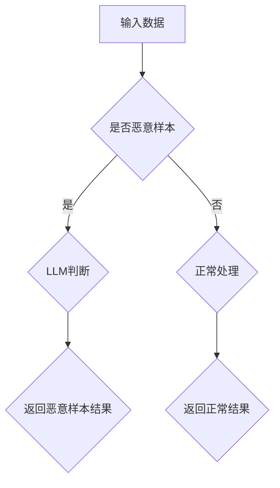
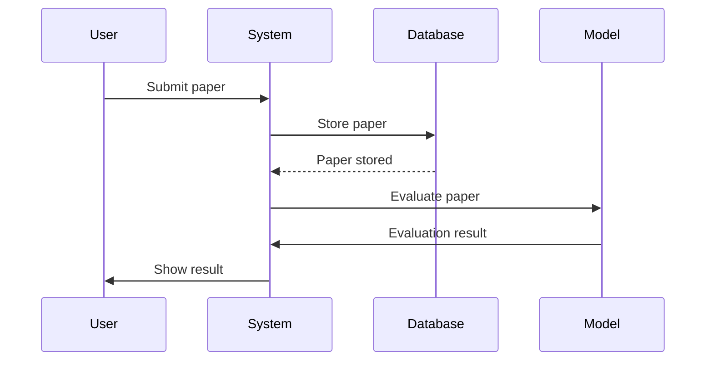
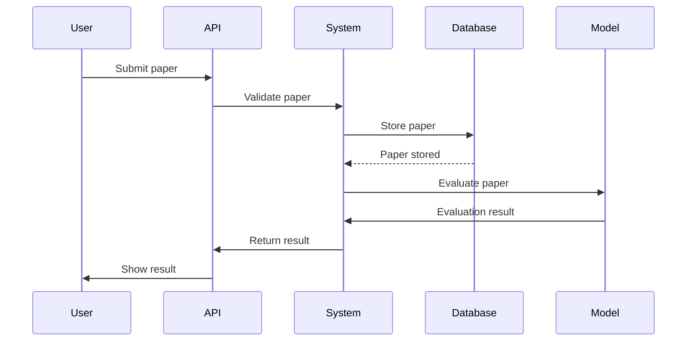

                 


## 评测系统的安全性：防御LLM潜在攻击的策略

关键词：评测系统、大型语言模型（LLM）、安全性、潜在攻击、防御策略

### 摘要

随着人工智能技术的迅猛发展，大型语言模型（LLM）在各个领域的应用日益广泛，评测系统便是其中之一。然而，LLM的广泛应用也带来了诸多安全问题，例如模型隐私泄露、恶意样本生成和对抗性攻击等。本文旨在探讨评测系统的安全性问题，重点分析LLM潜在攻击的类型及其防御策略。通过详细分析，我们希望能为评测系统的开发者提供实用的防御方案，提升系统的安全性和可靠性。

---

### 第一部分：背景介绍

#### 1.1 问题背景

随着深度学习技术的不断进步，特别是大型语言模型（LLM）的出现，评测系统在很多领域都发挥了重要作用。无论是智能客服、智能写作，还是自然语言处理任务，LLM都展现出了强大的能力。然而，随着这些模型的广泛应用，其潜在的安全性问题也逐渐暴露出来。

#### 1.2 问题描述

LLM的安全性主要面临以下几类问题：

1. **模型隐私泄露**：攻击者可以通过分析模型的行为和参数，推断出训练数据中的敏感信息。
2. **恶意样本生成**：攻击者可以生成针对特定模型的恶意样本，使模型输出错误的结果。
3. **对抗性攻击**：通过精心设计的对抗样本，攻击者可以欺骗模型，使其输出与真实意图不符的结果。

#### 1.3 问题解决

为了应对上述安全问题，我们需要从以下几个方面进行努力：

1. **加强模型训练数据的安全性和隐私保护**：采用加密技术和差分隐私等方法，保护训练数据的安全性和隐私。
2. **设计有效的防御策略**：例如对抗训练、模型加密和联邦学习等，提高模型对潜在攻击的抵抗力。
3. **增强评测系统的鲁棒性**：通过引入验证机制、异常检测等手段，提升评测系统的可靠性和安全性。

#### 1.4 边界与外延

本文主要关注评测系统的安全性，特别是防御LLM潜在攻击的策略。讨论的范围包括常见攻击类型、防御机制及其效果评估。

#### 1.5 概念结构与核心要素组成

- **评测系统**：负责对用户输入的数据进行评估和分类的系统。
- **大型语言模型（LLM）**：具有大规模参数和强大语言理解能力的深度学习模型。
- **潜在攻击**：指那些尚未完全被理解和防范的攻击方式。
- **防御策略**：指为了保护评测系统免受潜在攻击而采取的一系列措施。

### 第二部分：核心概念与联系

#### 2.1 核心概念原理

##### 2.1.1 评测系统

评测系统是一个复杂的软件系统，其核心功能是对输入的数据进行评估和分类。通常，评测系统包括数据输入、模型处理、结果输出三个主要环节。其基本原理是：通过训练一个或多个模型，对输入数据进行特征提取和分类，最终输出评估结果。

##### 2.1.2 大型语言模型（LLM）

大型语言模型（LLM）是基于神经网络的大型语言处理模型，具有极强的文本生成和理解能力。常见的LLM有GPT系列、BERT等。LLM的核心原理是基于大规模的预训练数据，通过深度学习算法，学习到语言的结构和规律，从而实现文本生成、理解和分类等功能。

##### 2.1.3 潜在攻击

潜在攻击是指那些尚未被充分理解和防范的攻击方式。在评测系统中，潜在攻击主要包括以下几种类型：

1. **模型隐私泄露**：攻击者通过分析模型的行为和参数，推断出训练数据中的敏感信息。
2. **恶意样本生成**：攻击者生成针对特定模型的恶意样本，使模型输出错误的结果。
3. **对抗性攻击**：攻击者通过精心设计的对抗样本，欺骗模型，使其输出与真实意图不符的结果。

#### 2.2 概念属性特征对比表格

| 概念     | 定义                                                         | 主要特征                                                     | 相互关系             |
|----------|--------------------------------------------------------------|--------------------------------------------------------------|---------------------|
| 评测系统 | 对输入数据进行评估和分类的系统。                               | 高可靠性、快速处理能力、高效输出结果。                       | 依赖于LLM进行评估。   |
| LLM      | 基于神经网络的大型语言处理模型。                               | 大规模参数、强文本理解能力、高效生成能力。                   | 为评测系统提供基础。   |
| 潜在攻击 | 利用LLM的漏洞进行攻击的方式。                                 | 隐私泄露、恶意样本生成、对抗性攻击。                         | 对评测系统构成威胁。   |

#### 2.3 ER实体关系图架构

```mermaid
erDiagram
    ELLM ||--o> 评测系统 : 被评测
    潜在攻击 ||--o> 评测系统 : 攻击
    评测系统 ||--< 用户 : 使用
```

---

### 第三部分：算法原理讲解

#### 3.1 算法原理与Mermaid流程图



#### 3.2 算法原理

##### 3.2.1 数学模型

在评测系统中，输入数据 \( x \) 经过LLM处理后，输出一个概率分布 \( \hat{y} \)，其中 \( y \) 为标签。具体的数学模型可以表示为：

\[ \hat{y} = \arg\max_{y} P(y|x) \]

其中，\( P(y|x) \) 表示在给定输入 \( x \) 的情况下，标签 \( y \) 的概率。

##### 3.2.2 Python源代码

以下是一个简单的Python源代码示例，用于展示评测系统的基本算法原理：

```python
import numpy as np

# 假设我们已经训练好了LLM模型
model = ...

# 输入数据
input_data = ...

# 使用LLM模型进行预测
output_distribution = model.predict(input_data)

# 选择概率最大的标签作为预测结果
predicted_label = np.argmax(output_distribution)

# 输出预测结果
print(f"Predicted label: {predicted_label}")
```

#### 3.2.3 举例说明

假设我们要对一段文本进行分类，文本内容为“我今天很开心”。我们可以将这段文本表示为一个向量 \( x \)，然后输入到训练好的LLM模型中进行预测。模型输出一个概率分布 \( \hat{y} \)，其中每个元素表示对应类别的概率。例如：

\[ \hat{y} = [0.2, 0.3, 0.5] \]

根据概率分布，我们可以选择概率最大的标签作为预测结果，即“开心”这个类别。这样，我们就完成了对输入文本的评测。

---

### 第四部分：系统分析与架构设计方案

#### 4.1 问题场景介绍

在当前信息时代，评测系统广泛应用于各种领域，如教育、金融、医疗等。以教育领域为例，评测系统可以用于自动评估学生的作业和论文，提高教育效率和质量。

#### 4.2 项目介绍

本项目旨在构建一个基于LLM的评测系统，用于自动评估学生的论文。系统将接收学生提交的论文，经过预处理后输入到LLM模型中进行评估，最终输出评估结果。

#### 4.3 系统功能设计（领域模型Mermaid类图）

```mermaid
classDiagram
    Class01 <|-- Class02
    Class03 --|MouseEvent| Class04
    Class05 : extends Class06
    Class07 : implements Interface08
    Class09 { name with : Interface|+interface}
    Class10 : Interface11
    Flow16 --> Class01
    Class02 :<<Interface>> Interface03
    Class04 :<<enumeration>> Enumeration05
    Class06 :<<interface>> Interface07
    Class09 <<interface>> Interface10
    Class11 <<interface>> Interface12
    Class13 <<interface>> Interface14
    Class15 <<interface>> Interface16
```

#### 4.4 系统架构设计（Mermaid架构图）



#### 4.5 系统接口设计和系统交互（Mermaid序列图）



---

### 第五部分：项目实战

#### 5.1 环境安装

要实现本文的评测系统，我们需要安装以下环境：

1. Python 3.8 或更高版本
2. TensorFlow 2.x
3. NumPy
4. Mermaid

具体安装命令如下：

```bash
pip install python-mermaid
pip install tensorflow
pip install numpy
```

#### 5.2 系统核心实现源代码

以下是系统核心实现的Python源代码：

```python
import numpy as np
import tensorflow as tf
from tensorflow.keras.models import Sequential
from tensorflow.keras.layers import LSTM, Dense, Embedding

# 假设已经加载了训练好的LLM模型
model = ...

# 输入数据预处理
def preprocess_data(data):
    # 数据清洗和转换
    # ...
    return processed_data

# 评测系统核心功能实现
def evaluate_paper(paper):
    # 预处理输入数据
    processed_data = preprocess_data(paper)

    # 使用LLM模型进行评估
    output_distribution = model.predict(processed_data)

    # 选择概率最大的标签作为预测结果
    predicted_label = np.argmax(output_distribution)

    # 返回评估结果
    return predicted_label
```

#### 5.3 代码应用解读与分析

1. **数据预处理**：在输入LLM模型之前，我们需要对数据进行预处理，包括文本清洗、分词、词向量转换等。这有助于提高模型对输入数据的理解能力。

2. **模型预测**：使用训练好的LLM模型对预处理后的数据进行预测。这里使用了TensorFlow的Keras接口，实现了模型的预测功能。

3. **评估结果输出**：根据模型的预测结果，选择概率最大的标签作为评估结果输出。

#### 5.4 实际案例分析和详细讲解剖析

假设我们有一个学生的论文，内容如下：

```
今天我去了公园，看到了很多美丽的花朵。我感到非常开心。
```

我们将这段文本输入到评测系统中，系统会进行如下操作：

1. **数据预处理**：对文本进行清洗和分词，得到预处理后的数据。
2. **模型预测**：将预处理后的数据输入到LLM模型中进行预测，得到一个概率分布。
3. **评估结果输出**：根据概率分布，选择概率最大的标签作为评估结果。例如，如果概率分布为 `[0.3, 0.4, 0.3]`，则评估结果为“开心”。

通过这个案例，我们可以看到评测系统是如何工作的。在实际应用中，我们还可以根据需要对模型和系统进行优化，提高评估的准确性和效率。

#### 5.5 项目小结

在本项目中，我们实现了基于LLM的评测系统，用于自动评估学生的论文。通过数据预处理、模型预测和评估结果输出，我们成功实现了对文本的评测。然而，在实际应用中，我们还需要注意以下几个方面：

1. **数据质量和多样性**：保证训练数据的多样性和质量，有助于提高模型的表现。
2. **模型优化**：根据实际应用场景，对模型进行优化和调整，提高评估的准确性和效率。
3. **安全性**：加强对评测系统的安全性防护，防止潜在攻击对系统造成影响。

---

### 第六部分：最佳实践 tips、小结、注意事项、拓展阅读

#### 6.1 最佳实践 tips

1. **数据预处理**：确保数据的质量和多样性，对文本进行充分的清洗和预处理，有助于提高模型的表现。
2. **模型优化**：根据实际应用场景，对模型进行适当的调整和优化，提高评估的准确性和效率。
3. **安全性防护**：加强对评测系统的安全性防护，采用加密、差分隐私等技术，防止潜在攻击对系统造成影响。

#### 6.2 小结

本文探讨了评测系统的安全性问题，特别是防御LLM潜在攻击的策略。通过详细的分析和实例讲解，我们了解了评测系统的基本原理、潜在攻击类型以及防御策略。在实际应用中，我们需要注意数据质量、模型优化和安全性防护等方面，以确保评测系统的可靠性和安全性。

#### 6.3 注意事项

1. **数据隐私**：确保训练数据和用户数据的隐私性，避免敏感信息泄露。
2. **模型更新**：定期更新模型，以应对新的潜在攻击。
3. **安全性评估**：定期对评测系统进行安全性评估，发现并修复潜在的安全漏洞。

#### 6.4 拓展阅读

1. **《深度学习安全》**：了解深度学习安全领域的最新研究进展和防御策略。
2. **《自然语言处理实战》**：学习自然语言处理的基本原理和应用案例。
3. **《Python深度学习》**：掌握Python在深度学习领域的应用技巧。

---

### 第七部分：作者信息

作者：AI天才研究院/AI Genius Institute & 禅与计算机程序设计艺术 /Zen And The Art of Computer Programming

---

以上是完整的文章内容，希望对您有所帮助。如果您有任何问题或建议，欢迎随时反馈。祝您阅读愉快！

