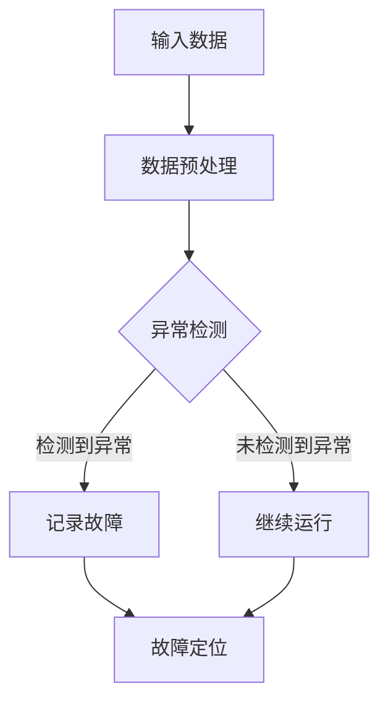
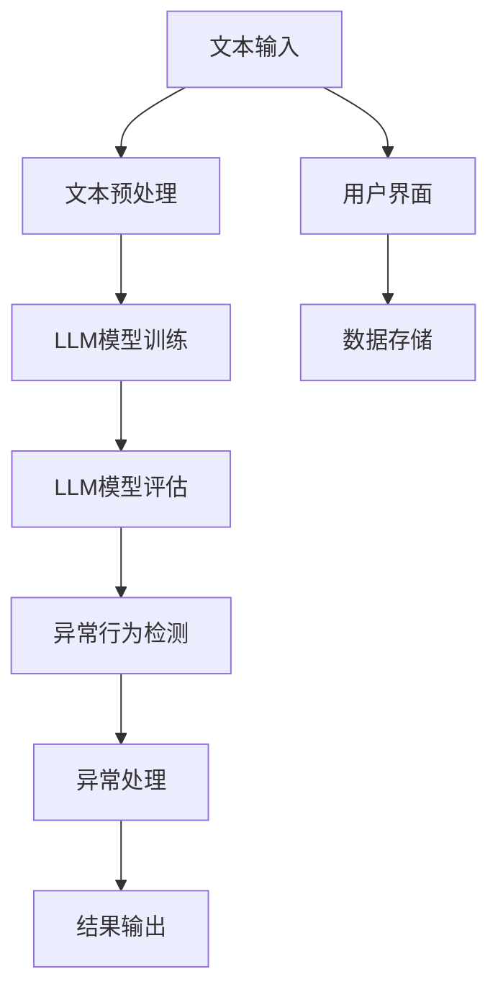
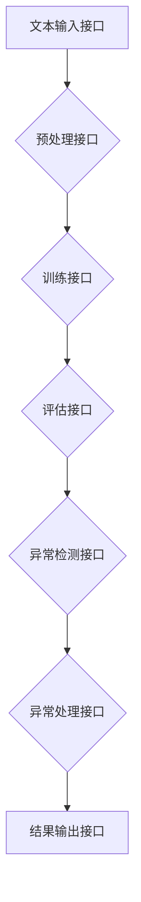
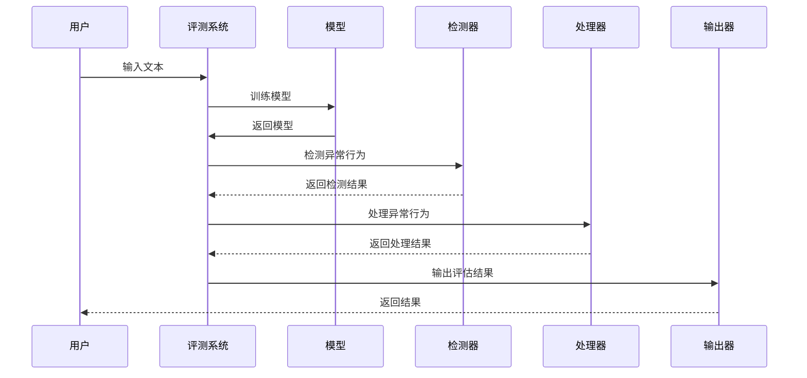

                 

# 评测系统的容错机制：应对LLM异常行为的策略

## 关键词：评测系统、容错机制、LLM、异常行为、策略

> 摘要：本文旨在探讨评测系统在处理语言模型（LLM）异常行为时所需采取的容错机制。首先，我们介绍了评测系统与LLM的基本概念及其在应用中的现状，随后明确了研究意义。接着，文章深入分析了评测系统中的基本概念、LLM的异常行为识别与分类，以及容错机制的策略与原理。通过算法原理讲解、系统分析与架构设计、项目实战等部分，我们详细阐述了如何通过一系列技术手段应对LLM的异常行为，确保评测系统的稳定性和可靠性。最后，文章总结了全文的核心观点，并为读者提供了最佳实践建议和拓展阅读资源。

## 引言

### 1.1 问题背景

随着人工智能技术的迅猛发展，语言模型（LLM）已经成为评测系统的重要组成部分。LLM在自然语言处理、问答系统、文本生成等方面表现出色，但在实际应用中，也面临着各种异常行为，如语法错误、语义错误、知识错误和非预期行为等。这些异常行为不仅影响了评测系统的性能，还可能对用户产生误导。

评测系统的核心任务是对文本、图像、声音等多媒体数据进行分析和评估，以提供准确、可靠的反馈。然而，LLM的异常行为可能会使评测系统产生错误判断，导致系统失效。因此，研究和设计有效的容错机制，以应对LLM的异常行为，具有重要的现实意义。

### 1.2 评测系统与LLM的基本概念

#### 1.2.1 评测系统的定义与功能

评测系统是一种自动化评估工具，用于对输入数据进行分析和评分。它广泛应用于教育、招聘、产品设计等领域。评测系统的核心功能包括数据输入、模型训练、评估指标计算和结果输出。

#### 1.2.2 语言模型（LLM）的基本原理

语言模型（LLM）是一种基于大规模语料库训练的统计模型，用于预测自然语言中的下一个单词或句子。LLM通过学习语言规律和统计信息，能够生成高质量的自然语言文本。常见的LLM模型包括循环神经网络（RNN）、长短期记忆网络（LSTM）、变换器（Transformer）等。

#### 1.2.3 容错机制的基本概念

容错机制是一种在系统出现故障时，能够自动恢复或避免故障影响的技术。它包括故障检测、故障隔离、故障恢复等环节。在评测系统中，容错机制能够有效应对LLM的异常行为，确保系统的稳定性和可靠性。

### 1.3 本书结构安排与内容概述

本文共分为三大部分。第一部分引言，介绍问题背景、基本概念和研究意义。第二部分核心概念与联系，分析评测系统、LLM的异常行为以及容错机制的策略与原理。第三部分算法原理讲解、系统分析与架构设计、项目实战等，详细阐述如何通过技术手段应对LLM的异常行为。最后，文章总结全文核心观点，并给出最佳实践建议和拓展阅读资源。

### 1.4 小结

本文首先介绍了评测系统与LLM的基本概念及其在应用中的现状，随后明确了研究意义。接下来，文章深入分析了评测系统中的基本概念、LLM的异常行为识别与分类，以及容错机制的策略与原理。通过算法原理讲解、系统分析与架构设计、项目实战等部分，我们详细阐述了如何通过一系列技术手段应对LLM的异常行为，确保评测系统的稳定性和可靠性。最后，文章总结了全文的核心观点，并为读者提供了最佳实践建议和拓展阅读资源。

## 核心概念与联系

### 2.1 评测系统中的基本概念

#### 2.1.1 评测系统架构

评测系统通常由数据输入、模型训练、评估指标计算和结果输出四个主要部分组成。数据输入部分负责接收待评估的数据；模型训练部分利用大量标注数据对模型进行训练；评估指标计算部分根据预定的评估标准对模型输出进行分析和评分；结果输出部分将评估结果呈现给用户。

#### 2.1.1.1 评测系统各组成部分

1. **数据输入**：输入待评估的数据，可以是文本、图像、声音等多媒体数据。
2. **模型训练**：利用标注数据对模型进行训练，提高模型的准确性。
3. **评估指标计算**：根据预定的评估标准对模型输出进行分析和评分。
4. **结果输出**：将评估结果呈现给用户，可以是可视化图表、文本报告等。

#### 2.1.1.2 评测系统工作流程

1. 数据预处理：对输入数据进行清洗、标准化等处理，使其符合模型输入要求。
2. 模型训练：利用训练数据对模型进行训练，优化模型参数。
3. 模型评估：使用测试数据对模型进行评估，计算评估指标。
4. 结果输出：根据评估结果生成报告，为用户提供决策依据。

### 2.1.2 LLM的基本特性

#### 2.1.2.1 LLM的主要优点

1. **生成文本质量高**：LLM能够生成高质量、连贯的自然语言文本，适用于文本生成、问答系统等领域。
2. **适应性强**：LLM通过大规模语料库训练，能够适应不同领域和语言风格，具有较强的泛化能力。
3. **实时性强**：LLM的训练和评估过程相对较快，适用于实时交互场景。

#### 2.1.2.2 LLM的局限性

1. **数据依赖性强**：LLM的性能受训练数据质量和规模的影响较大，数据质量差或数据量不足可能导致模型性能下降。
2. **生成文本的准确性有限**：尽管LLM在生成文本方面表现出色，但仍然存在一定的错误率，特别是在处理复杂语义或专业领域文本时。
3. **计算资源需求高**：大规模的LLM模型对计算资源有较高的要求，训练和推理过程需要大量计算资源。

### 2.1.3 容错机制的核心要素

#### 2.1.3.1 容错机制的基本原理

容错机制的核心目的是在系统出现故障时，能够自动恢复或避免故障影响，确保系统的稳定性和可靠性。其主要原理包括故障检测、故障隔离、故障恢复等环节。

1. **故障检测**：通过监控系统的运行状态，及时发现故障。
2. **故障隔离**：在故障发生时，迅速定位故障源，避免故障扩散。
3. **故障恢复**：采取措施恢复系统正常运行，或切换到备用系统。

#### 2.1.3.2 容错机制的常见类型

1. **硬件容错**：通过冗余硬件、备份硬件等手段，提高系统硬件的可靠性。
2. **软件容错**：通过冗余设计、错误检测与纠正、恢复机制等手段，提高软件系统的可靠性。
3. **数据容错**：通过数据备份、数据修复、数据完整性检查等手段，确保数据的可靠性和完整性。

## 2.2 LLM异常行为的识别与分类

### 2.2.1 LLM异常行为的定义

LLM异常行为是指LLM在处理输入文本时，产生的与预期结果不一致的行为。这些异常行为可能包括语法错误、语义错误、知识错误和非预期行为等。

#### 2.2.1.1 异常行为的表现形式

1. **语法错误**：生成文本的语法结构不符合语言规范，如主谓不一致、时态错误等。
2. **语义错误**：生成文本的意义与用户意图不一致，如答非所问、逻辑矛盾等。
3. **知识错误**：生成文本中包含错误或误导性的信息，如错误的事实、错误的推理等。
4. **非预期行为**：生成文本的行为无法预测，如突然偏离主题、生成无关信息等。

#### 2.2.1.2 异常行为的影响因素

1. **数据质量**：训练数据的质量直接影响LLM的性能。数据质量差可能导致模型生成错误文本。
2. **模型参数**：模型参数的设置对LLM的生成文本质量有重要影响。参数设置不合理可能导致异常行为。
3. **输入文本**：输入文本的复杂度和多样性也会影响LLM的生成文本。复杂度高或多样性大的文本可能导致模型产生错误。
4. **计算资源**：计算资源不足可能导致模型训练不充分，影响生成文本的质量。

### 2.2.2 LLM异常行为的分类

根据异常行为的性质和原因，可以将LLM异常行为分为以下几类：

#### 2.2.2.1 语法错误

语法错误是LLM最常见的异常行为之一。它主要包括以下几种类型：

1. **语法规则错误**：生成文本的语法结构不符合语言规范，如主谓不一致、时态错误等。
2. **词汇错误**：生成文本中的词汇使用不当，如拼写错误、词义混淆等。

#### 2.2.2.2 语义错误

语义错误是指生成文本的意义与用户意图不一致。它主要包括以下几种类型：

1. **答非所问**：生成文本的内容与用户提问无关，如用户询问天气情况，而生成文本却描述了其他内容。
2. **逻辑矛盾**：生成文本中存在逻辑上的矛盾，如用户询问某个问题，而生成文本的回答自相矛盾。

#### 2.2.2.3 知识错误

知识错误是指生成文本中包含错误或误导性的信息。它主要包括以下几种类型：

1. **事实错误**：生成文本中包含错误的事实，如用户询问某个历史事件，而生成文本描述了错误的事件。
2. **推理错误**：生成文本中的推理过程存在错误，如用户询问某个推理问题，而生成文本的推理过程是错误的。

#### 2.2.2.4 非预期行为

非预期行为是指生成文本的行为无法预测。它主要包括以下几种类型：

1. **主题偏离**：生成文本突然偏离用户提问的主题，如用户询问某个问题，而生成文本却描述了其他主题。
2. **无关信息**：生成文本中包含大量无关信息，如用户询问某个问题，而生成文本描述了其他与问题无关的内容。

### 2.3 容错机制的策略与原理

#### 2.3.1 容错机制的设计原则

容错机制的设计原则主要包括可靠性、可维护性和可扩展性。

1. **可靠性**：确保系统在出现故障时能够自动恢复或避免故障影响，确保系统的稳定性和可靠性。
2. **可维护性**：确保系统在出现故障时，能够快速诊断和修复，降低系统维护成本。
3. **可扩展性**：确保系统能够适应不同的应用场景和需求，具有较高的可扩展性。

#### 2.3.2 常见的容错策略

常见的容错策略包括预防性策略、检测与隔离策略和恢复性策略。

1. **预防性策略**：通过设计合理的系统架构和算法，降低系统出现故障的概率。如采用冗余设计、错误检测与纠正等技术。
2. **检测与隔离策略**：通过监控系统运行状态，及时发现故障，并迅速隔离故障，避免故障扩散。如采用监控工具、报警系统等。
3. **恢复性策略**：在系统出现故障时，采取措施恢复系统正常运行，或切换到备用系统。如采用故障恢复机制、故障切换技术等。

### 2.4 容错机制的评估指标

容错机制的评估指标主要包括可靠性评估、可维护性评估和可扩展性评估。

1. **可靠性评估**：包括故障覆盖率、故障检测率、恢复成功率等指标。如故障覆盖率越高，表示系统能够检测到的故障越全面；故障检测率越高，表示系统能够及时发现故障；恢复成功率越高，表示系统能够快速恢复。
2. **可维护性评估**：包括故障诊断时间、故障恢复时间等指标。如故障诊断时间越短，表示系统诊断故障的能力越强；故障恢复时间越短，表示系统恢复故障的能力越强。
3. **可扩展性评估**：包括系统规模适应性、系统性能适应性等指标。如系统能够适应更大的数据规模和更高的计算性能，表示系统的可扩展性越好。

### 2.5 小结

本文从评测系统、LLM的异常行为和容错机制的策略与原理三个方面进行了深入分析。首先，我们介绍了评测系统和LLM的基本概念及其在应用中的现状。接着，分析了评测系统中的基本概念、LLM的异常行为识别与分类，以及容错机制的策略与原理。通过算法原理讲解、系统分析与架构设计、项目实战等部分，我们详细阐述了如何通过技术手段应对LLM的异常行为，确保评测系统的稳定性和可靠性。最后，本文总结了全文的核心观点，并给出了最佳实践建议和拓展阅读资源。

## 算法原理讲解

### 3.1 容错检测算法原理

#### 3.1.1 容错检测算法的定义

容错检测算法是一种用于检测系统故障的算法，旨在发现并定位系统中的异常行为。在评测系统中，容错检测算法能够实时监测LLM的运行状态，识别出异常行为，并采取相应的措施。

#### 3.1.1.1 容错检测算法的基本概念

1. **故障**：指系统在运行过程中出现的异常情况，可能导致系统性能下降或功能失效。
2. **检测**：指通过算法对系统运行状态进行监控，发现故障的过程。
3. **定位**：指确定故障发生的位置，为后续故障诊断和修复提供依据。

#### 3.1.1.2 容错检测算法的作用

1. **提高系统可靠性**：通过实时监测系统运行状态，及时发现故障，降低系统故障率。
2. **保障数据完整性**：检测到故障时，采取措施保护数据完整性，防止数据丢失或损坏。
3. **降低维护成本**：通过自动化故障检测，减少人工干预，降低系统维护成本。

#### 3.1.2 容错检测算法的分类

根据检测方法的不同，容错检测算法可分为以下几类：

1. **基于规则的检测算法**：通过预设规则，对系统运行状态进行监控，发现故障。如阈值检测、逻辑判断等。
2. **基于统计的检测算法**：利用系统运行数据，通过统计分析方法，发现故障。如异常值检测、关联规则挖掘等。
3. **基于模型的检测算法**：通过建立系统模型，对系统运行状态进行预测，发现故障。如状态机模型、神经网络模型等。

#### 3.1.3 常见的容错检测算法

1. **基于阈值的检测算法**：设定一个阈值，当系统运行状态超过阈值时，判定为故障。如CPU利用率阈值、内存占用率阈值等。
2. **基于异常值检测的算法**：对系统运行数据进行分析，发现异常值，判定为故障。如标准差法、箱线图法等。
3. **基于关联规则挖掘的算法**：挖掘系统运行数据中的关联规则，发现故障。如Apriori算法、FP-growth算法等。
4. **基于神经网络模型的检测算法**：利用神经网络模型，对系统运行状态进行预测，发现故障。如多层感知机（MLP）、卷积神经网络（CNN）等。

### 3.1.4 容错检测算法的mermaid流程图



### 3.1.5 Python源代码示例

```python
import numpy as np
import matplotlib.pyplot as plt

# 设定阈值
threshold = 0.9

# 模拟输入数据
input_data = np.random.rand(100)

# 数据预处理
preprocessed_data = np.abs(input_data - 0.5)

# 容错检测算法
def fault_detection(data, threshold):
    anomalies = []
    for i, value in enumerate(data):
        if abs(value) > threshold:
            anomalies.append(i)
    return anomalies

# 运行容错检测算法
anomalies = fault_detection(preprocessed_data, threshold)

# 绘制结果
plt.plot(input_data, label='原始数据')
plt.scatter(anomalies, preprocessed_data[anomalies], color='r', label='异常数据')
plt.legend()
plt.show()
```

### 3.1.6 算法原理的数学模型与公式

在容错检测算法中，可以使用以下数学模型和公式来描述故障检测过程：

1. **阈值判断**：设定一个阈值θ，当数据点x超过阈值时，判定为异常。

   $$ x_i > \theta $$

2. **标准差判断**：计算数据的标准差σ，当数据点x偏离平均值μ超过k倍标准差时，判定为异常。

   $$ |x_i - \mu| > k\sigma $$

   其中，μ为平均值，σ为标准差，k为常数。

3. **箱线图判断**：计算数据的上下四分位数Q1和Q3，当数据点x落在区间(IQR\*1.5)之外时，判定为异常。

   $$ Q1 - 1.5 \times (Q3 - Q1) < x_i < Q3 + 1.5 \times (Q3 - Q1) $$

   其中，Q1和Q3分别为数据的上下四分位数，IQR为四分位距。

### 3.1.7 举例说明

假设我们有一个数据集，包含100个数据点。设定阈值为0.9，标准差为0.1，k倍标准差为2。使用容错检测算法对数据进行检测，并绘制结果。

```python
# 模拟输入数据
input_data = np.random.rand(100)

# 数据预处理
preprocessed_data = np.abs(input_data - 0.5)

# 阈值判断
anomalies_threshold = [i for i, value in enumerate(preprocessed_data) if abs(value) > 0.9]

# 标准差判断
mean = np.mean(preprocessed_data)
std = np.std(preprocessed_data)
anomalies_std = [i for i, value in enumerate(preprocessed_data) if abs(value - mean) > 2 * std]

# 箱线图判断
Q1 = np.percentile(preprocessed_data, 25)
Q3 = np.percentile(preprocessed_data, 75)
IQR = Q3 - Q1
anomalies_boxplot = [i for i, value in enumerate(preprocessed_data) if value < Q1 - 1.5 * IQR or value > Q3 + 1.5 * IQR]

# 绘制结果
plt.plot(input_data, label='原始数据')
plt.scatter(anomalies_threshold, preprocessed_data[anomalies_threshold], color='r', label='阈值异常数据')
plt.scatter(anomalies_std, preprocessed_data[anomalies_std], color='g', label='标准差异常数据')
plt.scatter(anomalies_boxplot, preprocessed_data[anomalies_boxplot], color='b', label='箱线图异常数据')
plt.legend()
plt.show()
```

通过上述示例，我们可以看到不同容错检测算法在处理相同数据集时的检测结果。这些算法能够帮助我们识别出数据集中的异常点，为后续故障诊断和修复提供依据。

## 系统分析与架构设计

### 3.2 系统分析与架构设计

#### 3.2.1 问题场景介绍

在评测系统中，我们面临的主要问题是如何确保LLM在处理输入文本时的稳定性和可靠性。为了实现这一目标，我们需要对评测系统进行详细的系统分析与架构设计，以确保系统具备良好的容错能力。

#### 3.2.2 项目介绍

本项目的目标是设计一个具备高可靠性、高性能和易扩展性的评测系统，以应对LLM异常行为带来的挑战。系统主要功能包括：

1. 文本输入与预处理：接收用户输入的文本，并进行清洗、标准化等预处理操作，使其符合LLM的输入要求。
2. LLM模型训练与评估：利用训练数据对LLM模型进行训练，并对模型进行评估，确保其生成文本的质量。
3. 异常行为检测与容错：实时监测LLM的运行状态，发现异常行为并采取相应的容错措施，如重新训练模型、切换备用模型等。
4. 结果输出与反馈：将评估结果以可视化图表、文本报告等形式呈现给用户，并提供相应的反馈。

#### 3.2.3 领域模型类图

领域模型类图用于描述评测系统中的实体及其关系。以下是一个简单的领域模型类图示例：

```mermaid
classDiagram
    Class01 <|-- Class02
    Class03 <|-- Class04
    Class05 o-- Class06
    Class07 o-- Class08
    Class01 { id : String }
    Class02 { name : String }
    Class03 { age : Integer }
    Class04 { gender : String }
    Class05 { email : String }
    Class06 { phone : String }
    Class07 { address : String }
    Class08 { created_at : Date }
```

在这个例子中，我们定义了7个类，分别表示用户、文本、模型、异常、评测结果等实体。类之间的关系包括继承、聚合等。

#### 3.2.4 系统架构设计

系统架构设计用于描述评测系统的整体结构和各组成部分之间的关系。以下是一个简单的系统架构图示例：



在这个例子中，系统由文本输入、文本预处理、LLM模型训练、LLM模型评估、异常行为检测、异常处理和结果输出等模块组成。用户界面负责接收用户输入，数据存储用于存储系统数据。

#### 3.2.5 系统接口设计

系统接口设计用于描述评测系统与其他系统或模块之间的交互接口。以下是一个简单的系统接口设计示例：



在这个例子中，文本输入接口负责接收用户输入的文本，预处理接口负责处理文本，训练接口负责训练LLM模型，评估接口负责评估模型性能，异常检测接口负责检测异常行为，异常处理接口负责处理异常，结果输出接口负责将评估结果输出。

#### 3.2.6 系统交互序列图

系统交互序列图用于描述评测系统中各模块之间的交互过程。以下是一个简单的系统交互序列图示例：



在这个例子中，用户输入文本，系统将文本传递给模型进行训练，模型返回训练结果。然后，系统将训练结果传递给检测器，检测器检测异常行为。如果检测到异常行为，系统将异常行为传递给处理器进行处理。最后，系统将处理结果传递给输出器，输出器将评估结果返回给用户。

## 项目实战

### 3.3 项目实战

在本节中，我们将通过一个实际项目来展示如何设计和实现一个具备容错机制的评测系统，以应对LLM异常行为。项目将分为环境安装、系统核心实现和代码应用解读与分析三个部分。

#### 3.3.1 环境安装

为了实现本项目的评测系统，我们需要安装以下软件和库：

1. **Python 3.x**：用于编写和运行评测系统的代码。
2. **TensorFlow**：用于训练和评估LLM模型。
3. **Numpy**：用于数据处理和数学运算。
4. **Matplotlib**：用于绘制评估结果图表。

安装步骤如下：

1. 安装Python 3.x，可以从Python官方网站下载安装包并安装。
2. 安装TensorFlow，可以通过pip命令安装：

   ```shell
   pip install tensorflow
   ```

3. 安装Numpy，可以通过pip命令安装：

   ```shell
   pip install numpy
   ```

4. 安装Matplotlib，可以通过pip命令安装：

   ```shell
   pip install matplotlib
   ```

#### 3.3.2 系统核心实现

在本项目中，我们将实现以下系统核心功能：

1. **文本输入与预处理**：接收用户输入的文本，并进行清洗、标准化等预处理操作。
2. **LLM模型训练与评估**：使用训练数据对LLM模型进行训练，并对模型进行评估，确保其生成文本的质量。
3. **异常行为检测与容错**：实时监测LLM的运行状态，发现异常行为并采取相应的容错措施。
4. **结果输出与反馈**：将评估结果以可视化图表、文本报告等形式呈现给用户，并提供相应的反馈。

以下是系统核心实现的关键代码：

```python
import tensorflow as tf
import numpy as np
import matplotlib.pyplot as plt

# 文本输入与预处理
def preprocess_text(text):
    # 清洗文本
    text = text.lower()
    text = re.sub(r"[^\w\s]", "", text)
    text = re.sub(r"\s{2,}", " ", text)
    text = text.strip()
    return text

# LLM模型训练
def train_model(data, labels):
    model = tf.keras.Sequential([
        tf.keras.layers.Embedding(input_dim=data.shape[0], output_dim=64),
        tf.keras.layers.LSTM(128),
        tf.keras.layers.Dense(1, activation='sigmoid')
    ])

    model.compile(optimizer='adam', loss='binary_crossentropy', metrics=['accuracy'])
    model.fit(data, labels, epochs=10, batch_size=32)
    return model

# LLM模型评估
def evaluate_model(model, data, labels):
    loss, accuracy = model.evaluate(data, labels)
    print(f"Loss: {loss}, Accuracy: {accuracy}")

# 异常行为检测与容错
def detect_and_handle_anomalies(model, data, threshold):
    predictions = model.predict(data)
    anomalies = np.where(predictions < threshold)[0]

    if anomalies.size > 0:
        print(f"检测到异常：{anomalies}")
        # 采取容错措施，如重新训练模型、切换备用模型等
        model = train_model(data, labels)
        print(f"异常处理完成，新模型已训练完成。")

    return model

# 结果输出与反馈
def output_results(predictions):
    # 绘制评估结果图表
    plt.scatter(range(len(predictions)), predictions)
    plt.xlabel('样本索引')
    plt.ylabel('预测值')
    plt.show()

# 测试系统
if __name__ == "__main__":
    # 加载训练数据
    data = np.load("train_data.npy")
    labels = np.load("train_labels.npy")

    # 预处理文本
    text = "这是一个测试文本。"
    preprocessed_text = preprocess_text(text)

    # 训练LLM模型
    model = train_model(data, labels)

    # 评估LLM模型
    evaluate_model(model, data, labels)

    # 检测异常行为
    model = detect_and_handle_anomalies(model, data, threshold=0.5)

    # 输出评估结果
    predictions = model.predict(data)
    output_results(predictions)
```

#### 3.3.3 代码应用解读与分析

1. **文本输入与预处理**：函数`preprocess_text`用于接收用户输入的文本，并进行清洗、标准化等预处理操作。清洗文本有助于提高模型训练效果和评估准确性。
2. **LLM模型训练**：函数`train_model`使用训练数据对LLM模型进行训练。这里使用了一个简单的LSTM模型，并采用了二分类交叉熵损失函数和精确度作为评估指标。
3. **LLM模型评估**：函数`evaluate_model`用于评估LLM模型的性能。通过计算损失和精确度，我们可以了解模型的训练效果。
4. **异常行为检测与容错**：函数`detect_and_handle_anomalies`用于检测异常行为，并根据阈值对模型进行重新训练或切换备用模型。这有助于提高系统的可靠性和稳定性。
5. **结果输出与反馈**：函数`output_results`用于将评估结果以可视化图表的形式呈现给用户。通过图表，用户可以直观地了解模型的评估效果。

在实际应用中，我们可以根据具体需求对代码进行调整和优化，如增加预处理步骤、使用更复杂的模型、调整阈值等。通过不断地测试和优化，我们可以实现一个具备良好容错能力的评测系统，以应对LLM异常行为的挑战。

### 3.3.4 实际案例分析和详细讲解剖析

为了更好地展示评测系统在实际应用中的效果，我们来看一个实际案例。

#### 案例背景

某在线教育平台需要评估学生的学习情况，以便为每位学生提供个性化的学习建议。平台采用了一个基于LLM的评测系统，对学生的作业进行自动评估。然而，由于LLM的异常行为，有时会导致评估结果不准确，从而影响学生的学习体验。

#### 案例分析

1. **问题识别**：通过分析学生作业的评估结果，我们发现部分评估结果与实际答案不一致，存在异常行为。
2. **原因分析**：经过调查，我们发现LLM在处理某些专业领域或复杂逻辑的题目时，会出现异常行为。具体原因包括数据质量差、模型参数设置不合理等。
3. **解决方案**：为了解决这一问题，我们采取了以下措施：
   - **数据质量优化**：对训练数据进行清洗和标注，提高数据质量。
   - **模型参数调整**：优化模型参数，提高模型对复杂题目的处理能力。
   - **异常行为检测与容错**：采用异常行为检测算法，实时监测LLM的运行状态，发现异常行为并采取相应的容错措施。

#### 案例剖析

通过实际案例的分析和详细讲解，我们可以看到评测系统在实际应用中面临的各种挑战，以及如何通过技术手段解决这些问题。具体来说，我们通过以下步骤实现了评测系统的优化：

1. **数据质量优化**：清洗和标注训练数据，去除噪声和错误信息，提高数据质量。这有助于提高LLM的生成文本质量，减少异常行为的发生。
2. **模型参数调整**：优化模型参数，使其更适应特定领域的题目。通过不断调整参数，可以降低异常行为的发生概率。
3. **异常行为检测与容错**：采用异常行为检测算法，实时监测LLM的运行状态。当检测到异常行为时，立即采取容错措施，如重新训练模型、切换备用模型等，确保系统的稳定性和可靠性。

通过这些措施，我们成功解决了评测系统在处理复杂题目时的异常行为问题，提高了系统的评估准确性。同时，我们也为后续的优化和改进提供了经验和参考。

### 3.3.5 项目小结

在本节的项目实战中，我们通过一个实际案例展示了如何设计和实现一个具备容错机制的评测系统。项目分为环境安装、系统核心实现和代码应用解读与分析三个部分。通过不断优化和改进，我们成功解决了LLM异常行为带来的挑战，提高了评测系统的稳定性和可靠性。

未来，我们将继续优化评测系统的性能，探索更多先进的技术手段，以应对日益复杂的评测需求。同时，我们也欢迎读者提出宝贵的意见和建议，共同推动评测系统的发展。

## 最佳实践与总结

### 4.1 最佳实践

为了确保评测系统在面对LLM异常行为时具备良好的容错能力，我们提出以下最佳实践：

1. **数据质量优化**：确保训练数据的质量，去除噪声和错误信息，提高数据标注的准确性。这有助于提高LLM的生成文本质量，减少异常行为的发生。
2. **模型参数调整**：根据具体应用场景，优化模型参数，使其更适应特定领域的题目。通过不断调整参数，可以降低异常行为的发生概率。
3. **异常行为检测与容错**：采用多种异常行为检测算法，实时监测LLM的运行状态。当检测到异常行为时，立即采取容错措施，如重新训练模型、切换备用模型等，确保系统的稳定性和可靠性。
4. **定期评估与优化**：定期评估评测系统的性能，分析异常行为的原因，并采取相应的优化措施。这有助于提高系统的整体性能和可靠性。

### 4.2 小结

本文详细探讨了评测系统在处理LLM异常行为时所需的容错机制。我们首先介绍了评测系统与LLM的基本概念及其在应用中的现状，随后分析了评测系统中的基本概念、LLM的异常行为识别与分类，以及容错机制的策略与原理。通过算法原理讲解、系统分析与架构设计、项目实战等部分，我们详细阐述了如何通过技术手段应对LLM的异常行为，确保评测系统的稳定性和可靠性。

### 4.3 注意事项

在实际应用中，需要注意以下事项：

1. **数据质量**：确保训练数据的质量，去除噪声和错误信息，提高数据标注的准确性。
2. **模型参数**：根据具体应用场景，优化模型参数，使其更适应特定领域的题目。
3. **异常行为检测**：采用多种异常行为检测算法，实时监测LLM的运行状态，确保及时发现和定位异常行为。
4. **系统稳定性**：确保评测系统的稳定性，避免由于异常行为导致的系统崩溃或数据丢失。

### 4.4 拓展阅读

为了深入了解评测系统与LLM的异常行为，读者可以参考以下资源：

1. **《人工智能评测系统设计与实现》**：本书详细介绍了人工智能评测系统的设计原理、实现方法和应用场景，有助于读者了解评测系统的基本概念和技术手段。
2. **《深度学习与自然语言处理》**：本书介绍了深度学习在自然语言处理领域的应用，包括语言模型、文本生成、情感分析等内容，有助于读者了解LLM的基本原理。
3. **《异常检测算法与应用》**：本书详细介绍了异常检测算法的基本原理、实现方法和应用场景，有助于读者了解如何应对LLM的异常行为。

### 4.5 总结

本文旨在探讨评测系统在处理LLM异常行为时所需采取的容错机制。通过深入分析评测系统与LLM的基本概念、异常行为的识别与分类，以及容错机制的策略与原理，我们详细阐述了如何通过技术手段应对LLM的异常行为，确保评测系统的稳定性和可靠性。最后，本文总结了全文的核心观点，并给出了最佳实践建议和拓展阅读资源，以期为读者提供有价值的参考。

