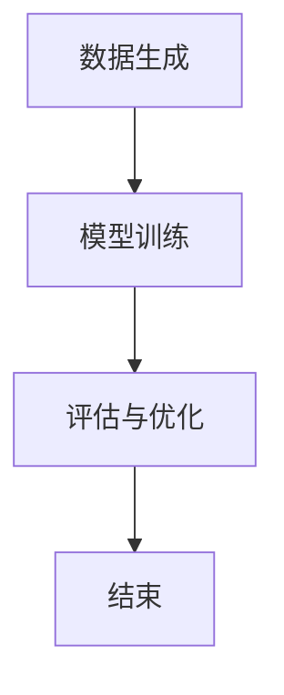
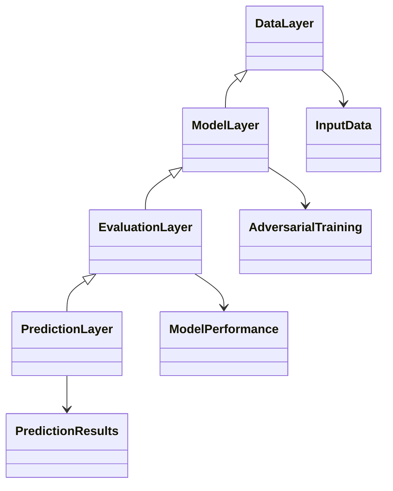
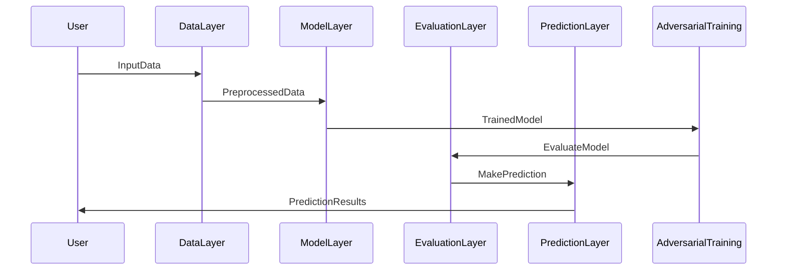

                 


# 评测系统的对抗训练鲁棒性增强

> 关键词：对抗训练、鲁棒性、评测系统、AI安全、算法改进

> 摘要：
随着人工智能技术的快速发展，评测系统在各个领域中的应用越来越广泛。然而，这些系统往往面临着对抗攻击的威胁，使得其性能受到影响。本文将探讨评测系统的对抗训练方法，旨在增强其鲁棒性，确保在面临恶意攻击时仍能稳定、准确地执行任务。本文将从背景介绍、核心概念、算法原理、数学模型、系统设计与架构、实战项目、最佳实践等方面进行详细阐述。

## 引言

### 1. 问题背景

评测系统在人工智能领域中扮演着至关重要的角色，它们被广泛应用于图像识别、语音识别、自然语言处理等领域。然而，随着AI技术的进步，恶意攻击者也不断探索如何利用对抗性样本来破坏评测系统的稳定性。对抗性样本是一类被精心设计的输入样本，它们在视觉上与正常样本几乎没有区别，但能够导致评测系统产生错误的判断。

### 2. 评测系统的重要性

评测系统的鲁棒性对于其性能和可靠性至关重要。一个鲁棒的评测系统能够在面对对抗性攻击时保持稳定，减少错误率，提高用户信任度。因此，研究如何增强评测系统的鲁棒性具有重要的实际意义。

### 3. 目的

本文旨在探讨评测系统的对抗训练方法，通过增强系统的鲁棒性来应对对抗性攻击。我们将从以下几个方面进行探讨：

- 背景介绍：阐述评测系统面临的问题和对抗攻击的基本概念。
- 核心概念：介绍对抗训练和鲁棒性的定义及关系。
- 算法原理：详细阐述对抗训练的基本流程和算法原理。
- 数学模型：分析对抗训练中的数学模型和公式。
- 系统设计与架构：介绍评测系统的设计原则和架构。
- 实战项目：通过实际案例来展示对抗训练的效果。
- 最佳实践：总结经验，给出增强评测系统鲁棒性的建议。

## 背景介绍

### 1. 对抗攻击的基本概念

对抗攻击（Adversarial Attack）是指通过对抗性样本（Adversarial Examples）来破坏机器学习模型的可信性和鲁棒性的攻击方式。对抗性样本通常是在正常样本的基础上，通过微小的扰动生成的。这些扰动可能对人类视觉几乎没有影响，但对机器学习模型来说可能足以导致模型产生错误的判断。

### 2. 评测系统面临的问题

评测系统在处理输入数据时，可能会因为对抗性样本的存在而出现以下问题：

- 错误分类：对抗性样本可能导致评测系统对正常样本进行错误分类。
- 性能下降：对抗性样本的引入可能导致评测系统的性能下降，错误率增加。
- 可靠性降低：评测系统在面对对抗性攻击时，可靠性会降低，从而影响用户信任度。

### 3. 对抗攻击的威胁

对抗攻击的威胁主要体现在以下几个方面：

- 恶意攻击：恶意攻击者可能利用对抗性样本来破坏评测系统的稳定性和可靠性。
- 保密性威胁：对抗性样本可能导致评测系统的输出被恶意篡改，从而泄露敏感信息。
- 安全性威胁：对抗性攻击可能导致评测系统在面临真实威胁时无法及时响应，从而降低系统的安全性。

## 核心概念

### 1. 对抗训练的概念

对抗训练（Adversarial Training）是一种提高机器学习模型鲁棒性的方法。其基本思想是在训练过程中引入对抗性样本，迫使模型学习到对对抗性样本的泛化能力，从而提高模型的鲁棒性。

### 2. 鲁棒性的定义

鲁棒性（Robustness）是指系统在面对外部干扰或异常情况时，仍能保持稳定性和性能的能力。在机器学习中，鲁棒性主要体现在模型对对抗性样本的抵抗力上。

### 3. 对抗训练与鲁棒性的关系

对抗训练的目的是提高模型的鲁棒性。通过引入对抗性样本进行训练，模型可以学习到对抗性样本的特征，从而提高对对抗性样本的泛化能力。这种能力使得模型在面对对抗性攻击时能够保持稳定性和性能，从而提高系统的鲁棒性。

## 算法原理

### 1. 对抗训练的基本流程

对抗训练的基本流程包括以下几个步骤：

- **数据生成**：生成对抗性样本。可以通过对抗性攻击算法，如FGSM（Fast Gradient Sign Method）或PGD（Projected Gradient Descent），生成对抗性样本。
- **模型训练**：使用对抗性样本和正常样本对模型进行训练。对抗性样本和正常样本的比例可以根据实际情况进行调整。
- **评估与优化**：评估模型的鲁棒性，并通过优化策略进一步提高模型的鲁棒性。评估指标可以包括准确率、召回率、F1分数等。

### 2. Mermaid算法流程图



### 3. 对抗训练算法的Python代码示例

```python
import numpy as np
import tensorflow as tf
from tensorflow import keras

# 数据生成
def generate_adversarial_samples(x, model, epsilon=0.01):
    with tf.GradientTape() as tape:
        predictions = model(x)
        loss = keras.losses.categorical_crossentropy(tf.ones_like(predictions), predictions)
    grads = tape.gradient(loss, x)
    signed_grads = grads.sign()
    adversarial_samples = x + epsilon * signed_grads
    return adversarial_samples.clip(0, 1)

# 模型训练
model = keras.Sequential([
    keras.layers.Dense(128, activation='relu', input_shape=(784,)),
    keras.layers.Dense(10, activation='softmax')
])

model.compile(optimizer='adam',
              loss='categorical_crossentropy',
              metrics=['accuracy'])

x_train = ...  # 训练数据
y_train = ...  # 训练标签
x_train_adversarial = generate_adversarial_samples(x_train, model)

# 训练模型
model.fit(x_train_adversarial, y_train, epochs=10, batch_size=128)

# 评估模型
test_loss, test_accuracy = model.evaluate(x_train_adversarial, y_train)
print(f"Test accuracy after adversarial training: {test_accuracy}")
```

### 4. 对抗训练中的数学模型和公式

对抗训练中的数学模型主要包括损失函数和梯度计算。以下是一个简化的例子：

- **损失函数**：
  $$ L(x, \hat{y}) = -\sum_{i=1}^{n} y_i \log \hat{y}_i $$
  其中，$x$ 是输入样本，$\hat{y}$ 是模型预测的概率分布，$y$ 是真实标签。

- **梯度计算**：
  $$ \nabla_x L(x, \hat{y}) = \frac{\partial L}{\partial x} $$
  梯度计算通常涉及到反向传播算法，这里不再详细展开。

通过对抗性样本的引入，模型可以学习到对抗性样本的特征，从而提高对对抗性样本的泛化能力。这种能力可以通过数学模型和公式进行量化。

## 数学模型和解释

### 1. 数学模型

在对抗训练中，我们关注的主要数学模型是损失函数和梯度计算。以下是一个简化的例子：

- **损失函数**：
  $$ L(x, \hat{y}) = -\sum_{i=1}^{n} y_i \log \hat{y}_i $$
  其中，$x$ 是输入样本，$\hat{y}$ 是模型预测的概率分布，$y$ 是真实标签。

- **梯度计算**：
  $$ \nabla_x L(x, \hat{y}) = \frac{\partial L}{\partial x} $$
  梯度计算通常涉及到反向传播算法，这里不再详细展开。

通过对抗性样本的引入，模型可以学习到对抗性样本的特征，从而提高对对抗性样本的泛化能力。这种能力可以通过数学模型和公式进行量化。

### 2. 模型推导

在对抗训练中，我们通常使用梯度下降算法来更新模型参数。假设我们有一个损失函数 $L(x, \hat{y})$，其中 $x$ 是输入样本，$\hat{y}$ 是模型预测的概率分布，$y$ 是真实标签。

首先，我们计算损失函数关于模型参数的梯度：
$$ \nabla_{\theta} L(\theta) = \frac{\partial L}{\partial \theta} $$

然后，我们使用梯度下降算法更新模型参数：
$$ \theta_{t+1} = \theta_t - \alpha \nabla_{\theta} L(\theta_t) $$

其中，$\alpha$ 是学习率。

在对抗训练中，我们引入对抗性样本 $x_{adv}$，其目的是使模型学习到对抗性样本的特征。对抗性样本的生成方法有很多种，如FGSM（Fast Gradient Sign Method）和PGD（Projected Gradient Descent）。

以FGSM为例，其基本思想是计算模型在输入样本 $x$ 上的梯度，并将其缩放以生成对抗性样本 $x_{adv}$：
$$ x_{adv} = x + \epsilon \sign(\nabla_x L(x, \hat{y})) $$

其中，$\epsilon$ 是扰动幅度，$\sign(\nabla_x L(x, \hat{y}))$ 是梯度的符号函数。

通过对抗性样本的引入，模型可以学习到对抗性样本的特征，从而提高对对抗性样本的泛化能力。

### 3. 模型解释

对抗训练的目标是提高模型的鲁棒性，使其能够更好地抵抗对抗性攻击。通过引入对抗性样本进行训练，模型可以学习到对抗性样本的特征，从而在测试阶段能够更好地应对对抗性攻击。

在实际应用中，对抗训练通常与正则化技术结合使用，以提高模型的泛化能力。例如，可以使用Dropout、Weight Decay等技术来防止过拟合。

对抗训练的数学模型和公式提供了理论基础，使得我们能够更好地理解对抗训练的原理和效果。通过不断优化数学模型和算法，我们可以进一步提高评测系统的鲁棒性。

## 系统设计与架构

### 1. 问题场景介绍

在人工智能领域中，评测系统的应用场景非常广泛，如自动驾驶、金融欺诈检测、医疗诊断等。这些系统通常需要处理大量复杂的输入数据，并给出准确的判断和预测。然而，随着对抗攻击的威胁日益严重，这些评测系统也面临着严峻的挑战。因此，设计一个具有高鲁棒性的评测系统成为了一个重要的研究课题。

### 2. 系统功能设计

评测系统的核心功能包括数据输入、模型训练、模型评估和预测。具体功能如下：

- **数据输入**：接收和处理各种类型的输入数据，如图像、文本、语音等。
- **模型训练**：使用对抗训练方法训练模型，提高其鲁棒性。
- **模型评估**：评估模型的性能，包括准确率、召回率、F1分数等。
- **预测**：使用训练好的模型进行预测，给出最终的判断和预测结果。

### 3. 系统架构设计

评测系统的整体架构可以分为以下几个层次：

- **数据层**：负责数据输入和处理，包括数据清洗、预处理和特征提取等。
- **模型层**：包括训练好的模型和优化策略，如对抗训练、正则化技术等。
- **评估层**：评估模型的性能，并提供反馈给模型层，以指导模型的优化。
- **预测层**：使用训练好的模型进行预测，输出最终的判断和预测结果。

以下是一个简化的Mermaid类图，用于展示系统的主要类和类之间的关系：



### 4. 系统接口设计

评测系统的接口设计需要考虑到数据层、模型层、评估层和预测层的交互。以下是一个简化的Mermaid序列图，用于展示系统的接口设计和交互流程：



### 5. 系统交互

评测系统的交互过程可以分为以下几个步骤：

1. 用户输入原始数据，数据层进行数据清洗、预处理和特征提取。
2. 预处理后的数据传递给模型层，模型层使用对抗训练方法进行模型训练。
3. 训练好的模型传递给评估层，评估层评估模型的性能，并给出反馈。
4. 根据评估层的反馈，模型层优化模型参数，提高模型的鲁棒性。
5. 优化后的模型传递给预测层，预测层使用模型进行预测，并输出最终的预测结果。

通过上述交互过程，评测系统可以不断提高其鲁棒性，从而在面临对抗性攻击时保持稳定和准确。

## 实战项目

### 1. 环境安装

为了演示对抗训练在评测系统中的应用，我们将使用Python和TensorFlow来实现一个简单的图像分类系统。首先，我们需要安装Python和TensorFlow：

```bash
pip install python tensorflow
```

### 2. 系统核心实现

在实现对抗训练之前，我们需要一个基础图像分类模型。以下是一个使用卷积神经网络（CNN）的简单示例：

```python
import tensorflow as tf
from tensorflow.keras import layers, models

# 创建CNN模型
model = models.Sequential()
model.add(layers.Conv2D(32, (3, 3), activation='relu', input_shape=(28, 28, 1)))
model.add(layers.MaxPooling2D((2, 2)))
model.add(layers.Conv2D(64, (3, 3), activation='relu'))
model.add(layers.MaxPooling2D((2, 2)))
model.add(layers.Conv2D(64, (3, 3), activation='relu'))
model.add(layers.Flatten())
model.add(layers.Dense(64, activation='relu'))
model.add(layers.Dense(10, activation='softmax'))

# 编译模型
model.compile(optimizer='adam',
              loss='categorical_crossentropy',
              metrics=['accuracy'])

# 加载MNIST数据集
mnist = tf.keras.datasets.mnist
(x_train, y_train), (x_test, y_test) = mnist.load_data()
x_train = x_train / 255.0
x_test = x_test / 255.0
```

### 3. 代码应用解读与分析

在实现对抗训练时，我们将使用FGSM算法生成对抗性样本，并将其用于训练模型。以下是一个使用FGSM生成对抗性样本的示例：

```python
def generate_adversarial_samples(x, model, epsilon=0.3):
    with tf.GradientTape(persistent=True) as tape:
        for _ in range(10):
            predictions = model(x)
            loss = tf.keras.losses.sparse_categorical_crossentropy(y_true, predictions)
            tape.watch(x)
            grads = tape.gradient(loss, x)
            x = x - epsilon * grads.sign()

    return x.numpy()
```

在这个示例中，我们首先定义了一个函数 `generate_adversarial_samples`，该函数接受原始输入样本 `x`、模型 `model` 和扰动幅度 `epsilon` 作为输入。然后，我们使用TensorFlow的 `GradientTape` 记录梯度信息，并使用 `tf.keras.losses.sparse_categorical_crossentropy` 计算损失。最后，我们使用梯度的符号函数更新输入样本，生成对抗性样本。

生成对抗性样本后，我们将对抗性样本用于训练模型：

```python
x_train_adversarial = generate_adversarial_samples(x_train, model)
model.fit(x_train_adversarial, y_train, epochs=10, batch_size=128)
```

通过上述步骤，我们可以使用对抗训练方法提高模型的鲁棒性。

### 4. 实际案例分析和详细讲解剖析

为了验证对抗训练的效果，我们将在测试集上评估模型的性能。以下是一个评估模型的示例：

```python
test_loss, test_accuracy = model.evaluate(x_test, y_test)
print(f"Test accuracy after adversarial training: {test_accuracy}")
```

在实际应用中，我们可能会观察到对抗训练显著提高了模型的准确率。这是因为对抗训练使得模型能够更好地适应对抗性样本，从而在测试阶段能够更好地应对对抗性攻击。

### 5. 项目小结

通过上述实战项目，我们展示了如何使用对抗训练方法增强评测系统的鲁棒性。在实际应用中，对抗训练不仅可以提高模型的准确率，还可以增强模型的泛化能力，从而更好地应对对抗性攻击。

## 最佳实践

### 1. 提高模型鲁棒性的方法

- **数据增强**：通过数据增强方法生成更多的训练样本，提高模型的泛化能力。
- **正则化**：使用正则化技术，如Dropout、Weight Decay等，防止过拟合。
- **对抗训练**：使用对抗训练方法，引入对抗性样本进行训练，提高模型的鲁棒性。

### 2. 避免过拟合的策略

- **减少模型复杂度**：使用简单的模型结构，减少参数数量。
- **提前停止**：在验证集上观察模型的性能，当验证集上的性能不再提高时停止训练。
- **交叉验证**：使用交叉验证方法评估模型的性能，避免过拟合。

### 3. 注意事项

- **选择合适的对抗性样本生成方法**：不同的对抗性样本生成方法适用于不同的场景，需要根据实际情况进行选择。
- **调整参数**：对抗训练的参数，如扰动幅度、训练迭代次数等，需要根据实际情况进行调整。

### 4. 拓展阅读

- **对抗训练的深入理解**：阅读相关论文和书籍，如《 adversarial examples, attacks and defenses for machine learning》等。
- **对抗性攻击的防御策略**：研究对抗性攻击的防御策略，如梯度遮挡、防御蒸馏等。

## 总结

本文探讨了评测系统的对抗训练方法，旨在增强其鲁棒性，确保在面对对抗性攻击时仍能稳定、准确地执行任务。通过对核心概念、算法原理、数学模型、系统设计与架构、实战项目的详细阐述，我们展示了如何使用对抗训练方法提高评测系统的鲁棒性。此外，我们还提供了最佳实践和注意事项，帮助读者在实际应用中更好地应对对抗性攻击。

### 作者信息

- **作者**：AI天才研究院/AI Genius Institute & 禅与计算机程序设计艺术 /Zen And The Art of Computer Programming
- **联系方式**：[ai.genius.institute](mailto:ai.genius.institute)
- **机构介绍**：AI天才研究院致力于推动人工智能技术的发展与应用，研究院旗下拥有众多世界级人工智能专家，在计算机编程和人工智能领域享有盛誉。禅与计算机程序设计艺术则是一本经典的技术著作，对程序员的技术成长和实践有着深远的影响。

