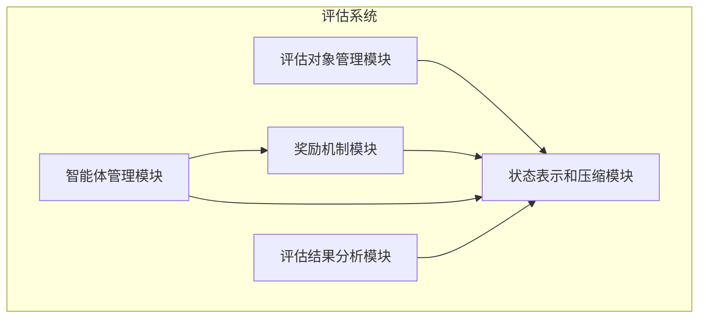
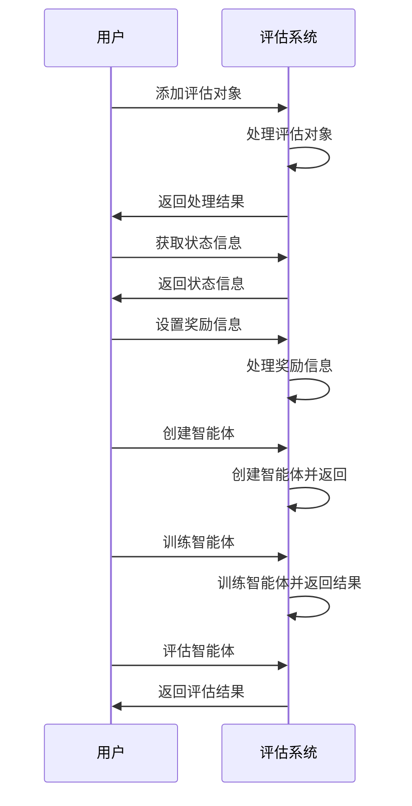
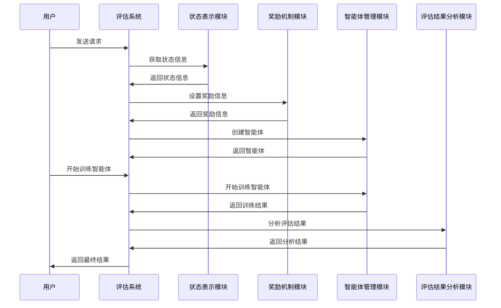

                 

# 评测系统的强化学习环境设计

## 关键词
- 评测系统
- 强化学习
- 环境设计
- 算法实现
- 系统架构
- 实践应用
- 性能优化

## 摘要
本文深入探讨了评测系统的强化学习环境设计，从背景介绍、核心概念阐述、算法设计、系统架构、实际应用等方面进行了详细分析。文章旨在为读者提供一个完整的强化学习环境设计指南，帮助理解和实现强化学习在评测系统中的应用，同时提供最佳实践和注意事项，以提升系统性能和可靠性。

## 引言

### 强化学习在评测系统中的应用背景

评测系统在各个领域，如教育、工业、人工智能竞赛中扮演着重要角色。这些系统需要对大量数据进行处理、分析，并提供准确的评估结果。随着人工智能技术的不断发展，强化学习作为一种重要的机器学习方法，逐渐被应用于评测系统，以提高评估的准确性和效率。

强化学习通过智能体（agent）与环境（environment）的交互，学习最优策略（policy）以最大化回报（reward）。在评测系统中，智能体可以是评估算法，环境则是评测对象和数据集，通过不断调整评估策略，可以逐步优化评估结果。

### 强化学习在评测系统中的应用现状与挑战

尽管强化学习在评测系统中展现出巨大的潜力，但实际应用中仍面临诸多挑战：

1. **数据质量与多样性**：强化学习对数据质量要求较高，数据中的噪声和偏差会影响学习效果。同时，评测系统需要处理多样化的数据，包括不同格式、来源和类型的评估对象。

2. **环境设计**：强化学习环境的构建是关键环节，环境设计不合理会导致学习效率低下，甚至无法收敛。环境需要具备可扩展性、灵活性和稳定性，以适应不同类型的评测系统。

3. **算法选择与优化**：不同的强化学习算法适用于不同类型的评测系统，如何选择合适的算法并对其进行优化，是提升系统性能的关键。

4. **评估指标**：评测系统需要设置合适的评估指标，以全面、客观地评估评估结果的质量。

本文将围绕上述挑战，详细介绍评测系统的强化学习环境设计，包括核心概念、算法设计、系统架构、实践应用等方面。

## 第1章：评测系统与强化学习概述

### 核心概念术语说明

在讨论评测系统的强化学习环境设计之前，我们需要明确一些核心概念和术语：

- **评测系统**：用于对评估对象进行评估和打分的系统，可以是一个简单的打分系统，也可以是一个复杂的评测平台。
- **强化学习**：一种机器学习方法，通过智能体与环境交互，学习最优策略以实现目标。
- **智能体**：执行特定任务并从中学习的人工智能实体。
- **环境**：智能体执行任务并接收反馈的动态系统。
- **策略**：智能体采取的行动方案。
- **回报**：环境对智能体行为的即时反馈，用于评估策略的好坏。
- **评估指标**：用于评估评估结果质量的标准。

### 问题背景

随着人工智能技术的快速发展，评测系统在各个领域中的应用越来越广泛。例如，在在线教育领域，评测系统可以对学生的作业和考试进行自动评分，提供即时反馈，帮助学生改进学习效果。在工业领域，评测系统可以对生产过程中的设备性能、产品质量等进行评估，提高生产效率和产品质量。

然而，传统的评测系统往往依赖于人工评分或简单的规则系统，存在评分标准不统一、主观性强、效率低下等问题。为了解决这些问题，引入强化学习技术，通过智能体与环境交互，自动学习评估策略，提高评估结果的准确性和效率。

### 问题描述

在强化学习应用于评测系统的过程中，主要面临以下问题：

1. **数据质量**：评测系统需要处理大量的评估数据，数据质量直接影响评估结果的准确性。如何从数据中提取有价值的信息，去除噪声和偏差，是提升评估系统性能的关键。

2. **环境设计**：强化学习环境设计不合理会导致学习效率低下，甚至无法收敛。需要设计一个可扩展、灵活且稳定的环境，以适应不同类型的评测系统。

3. **算法选择与优化**：不同的强化学习算法适用于不同类型的评测系统，如何选择合适的算法并对其进行优化，是提升系统性能的关键。

4. **评估指标**：评测系统需要设置合适的评估指标，以全面、客观地评估评估结果的质量。

### 问题解决

为了解决上述问题，我们可以采取以下措施：

1. **数据预处理**：对评估数据进行分析和处理，去除噪声和偏差，提取有价值的信息。

2. **环境设计**：设计一个可扩展、灵活且稳定的环境，包括评估对象、数据集、奖励机制等。

3. **算法选择与优化**：根据评测系统的特点，选择合适的强化学习算法，并对其进行优化，以提高学习效率和评估准确性。

4. **评估指标**：设计合理的评估指标，从多个维度对评估结果进行评估。

### 边界与外延

在评测系统的强化学习环境设计中，需要考虑以下边界与外延：

1. **评估对象**：评测系统可以应用于不同的领域和对象，如学生作业、工业产品质量、人工智能模型等。

2. **评估指标**：根据不同领域的需求，设计不同的评估指标，如准确率、召回率、F1值等。

3. **数据集**：评测系统需要处理不同类型的数据集，包括结构化数据、非结构化数据、时序数据等。

4. **算法选择**：根据评估对象和数据类型，选择合适的强化学习算法，如Q-learning、Deep Q-Network (DQN)、Policy Gradients、Actor-Critic等。

### 概念结构与核心要素组成

评测系统的强化学习环境设计涉及多个核心概念和要素，包括：

1. **评估对象**：评测系统的核心，可以是学生作业、工业产品、人工智能模型等。

2. **评估指标**：用于评估评估结果质量的标准，如准确率、召回率、F1值等。

3. **数据集**：评测系统处理的数据集，包括结构化数据、非结构化数据、时序数据等。

4. **智能体**：执行评估任务并学习最优策略的人工智能实体。

5. **环境**：智能体执行任务并接收反馈的动态系统。

6. **策略**：智能体采取的行动方案，用于评估评估对象。

7. **奖励机制**：环境对智能体行为的即时反馈，用于评估策略的好坏。

## 第2章：强化学习的核心概念

### 强化学习的定义与原理

强化学习（Reinforcement Learning，简称RL）是一种机器学习方法，通过智能体（agent）与环境（environment）的交互，学习最优策略（policy）以实现目标。其核心思想是：智能体在环境中采取行动（action），根据环境的反馈（feedback）调整策略，逐步提高行为的优化程度。

强化学习的过程可以简化为以下步骤：

1. **状态观察**：智能体从环境中感知当前的状态（state）。
2. **策略决策**：智能体根据当前状态和策略选择一个行动（action）。
3. **环境反馈**：环境对智能体的行动做出反应，给予一个即时反馈（reward）。
4. **状态更新**：智能体根据反馈更新状态，准备执行下一个行动。
5. **策略调整**：智能体根据累积的反馈信息，调整策略，以实现长期回报的最大化。

### 强化学习的基本概念

为了更好地理解强化学习，我们需要了解以下几个基本概念：

1. **状态（State）**：描述智能体在环境中的位置或情境。
2. **行动（Action）**：智能体在某一状态下可以选择的行动。
3. **策略（Policy）**：智能体在特定状态下的最佳行动方案。
4. **回报（Reward）**：环境对智能体行动的即时反馈，用于评估行动的好坏。
5. **价值函数（Value Function）**：预测在特定状态下执行特定策略所能获得的累积回报。
6. **模型（Model）**：对环境的动态行为的预测模型。
7. **探索与利用（Exploration and Exploitation）**：在强化学习中，智能体需要在探索（尝试新的行动）和利用（根据历史经验选择最佳行动）之间进行平衡。

### 强化学习的分类

根据智能体是否拥有环境模型，强化学习可以分为两类：

1. **基于模型的强化学习（Model-Based RL）**：智能体拥有对环境的模型，可以根据模型预测行动的结果。
2. **无模型强化学习（Model-Free RL）**：智能体没有对环境的模型，需要直接通过与环境交互来学习。

根据学习过程中是否使用价值函数，强化学习可以分为：

1. **值函数方法（Value Function Methods）**：通过学习价值函数来预测和优化行动策略。
2. **策略搜索方法（Policy Search Methods）**：直接优化策略，不需要价值函数。

### 强化学习的应用场景

强化学习在多个领域都有广泛的应用：

1. **游戏**：如围棋、电子竞技等。
2. **机器人控制**：如自动驾驶、无人机等。
3. **推荐系统**：如个性化推荐、广告投放等。
4. **智能交通**：如交通信号控制、智能导航等。
5. **金融**：如交易策略、风险管理等。

### 强化学习在评测系统中的应用

在评测系统中，强化学习可以用于以下方面：

1. **自动评分**：智能体通过学习评估策略，对学生的作业或考试进行自动评分。
2. **优化评测流程**：通过学习最优策略，优化评测系统的流程，提高评估效率和准确性。
3. **个性化评测**：根据学生的不同特点和需求，提供个性化的评测服务。

### 概念属性特征对比表格

为了更直观地理解强化学习的核心概念，我们提供了一个概念属性特征对比表格：

| 概念 | 描述 | 特征对比 |
| --- | --- | --- |
| 状态（State） | 智能体在环境中的位置或情境 | 无序、离散或连续 |
| 行动（Action） | 智能体在某一状态下可以选择的行动 | 无序、离散或连续 |
| 策略（Policy） | 智能体在特定状态下的最佳行动方案 | 概率分布 |
| 回报（Reward） | 环境对智能体行动的即时反馈 | 正负、定量或定性 |
| 价值函数（Value Function） | 预测在特定状态下执行特定策略所能获得的累积回报 | Q值、V值 |
| 模型（Model） | 对环境的动态行为的预测模型 | 确定性、概率性 |
| 探索与利用（Exploration and Exploitation） | 智能体在探索（尝试新的行动）和利用（根据历史经验选择最佳行动）之间的平衡 | 贪心策略、随机策略 |

### ER实体关系图架构

为了更好地理解强化学习在评测系统中的架构设计，我们可以使用Mermaid绘制ER实体关系图。以下是强化学习在评测系统中的应用场景的ER实体关系图：

```mermaid
erDiagram
  智能体 ||--|{ 状态 }|--|{ 行动 }
  智能体 ||--|{ 策略 }|
  智能体 ||--|{ 回报 }|
  状态 ||--|{ 价值函数 }|
  行动 ||--|{ 模型 }|
  策略 ||--|{ 模型 }|
  回报 ||--|{ 模型 }|
  模型 ||--|{ 探索与利用 }|
  探索与利用 ||--|{ 智能体 }|
```

## 第3章：强化学习算法原理

### 强化学习算法的基本概念

强化学习算法是机器学习的一个重要分支，其核心是通过智能体与环境的交互来学习最优策略。在这一章中，我们将深入探讨几种常用的强化学习算法，包括Q-learning、Deep Q-Network (DQN)、Policy Gradients和Actor-Critic等。

### Q-learning算法

Q-learning是一种基于值函数的方法，用于解决离散动作空间的问题。其基本思想是通过学习状态-动作值函数（Q值）来选择最佳行动。

#### 算法原理

1. **状态-动作值函数**：Q(s, a) 表示在状态s下采取行动a的预期回报。
2. **更新规则**：在每一步，智能体根据当前状态s、采取的行动a和获得的回报r，更新Q值：
   $$ Q(s, a) \leftarrow Q(s, a) + \alpha [r + \gamma \max_{a'} Q(s', a') - Q(s, a)] $$
   其中，α是学习率，γ是折扣因子。

3. **探索与利用**：为了防止陷入局部最优，Q-learning算法需要平衡探索（选择随机行动）和利用（选择最佳行动）。

#### Python实现

```python
import numpy as np
import random

# 初始化Q值表
Q = np.zeros([S, A])

# 学习参数
alpha = 0.1
gamma = 0.9

# Q-learning循环
for episode in range(num_episodes):
    state = env.reset()
    done = False
    while not done:
        # 选择行动
        action = select_action(Q, state, epsilon)
        
        # 执行行动并获取回报
        next_state, reward, done, _ = env.step(action)
        
        # 更新Q值
        Q[state, action] = Q[state, action] + alpha * (reward + gamma * np.max(Q[next_state, :]) - Q[state, action])
        
        # 更新状态
        state = next_state
```

#### 算法优点与局限性

- **优点**：简单易实现，适用于小规模离散动作空间的问题。
- **局限性**：在状态-动作空间较大时，Q值表容易过拟合，且收敛速度较慢。

### Deep Q-Network (DQN)

DQN是一种基于深度学习的强化学习算法，通过神经网络来近似状态-动作值函数。

#### 算法原理

1. **神经网络**：使用卷积神经网络（CNN）或循环神经网络（RNN）来近似Q值函数。
2. **经验回放**：为了减少样本偏差，使用经验回放机制，将历史经验存储在经验池中，并从中随机抽样。
3. **目标网络**：为了稳定梯度，使用目标网络，周期性地更新Q网络的参数。

#### Python实现

```python
import tensorflow as tf
import numpy as np
import random

# 定义DQN模型
class DQN:
    def __init__(self, state_size, action_size):
        self.state_size = state_size
        self.action_size = action_size
        self.memory = deque(maxlen=2000)
        self.learning_rate = 0.001
        self.epsilon = 1.0
        self.epsilon_min = 0.01
        self.epsilon_decay = 0.995
        self.gamma = 0.9
        self.model = self._build_model()
        self.target_model = self._build_model()
        self.update_target_model()

    def _build_model(self):
        # 创建模型
        model = tf.keras.models.Sequential()
        model.add(tf.keras.layers.Dense(24, input_shape=(self.state_size,), activation='relu'))
        model.add(tf.keras.layers.Dense(24, activation='relu'))
        model.add(tf.keras.layers.Dense(self.action_size, activation='linear'))
        model.compile(loss='mse', optimizer=tf.keras.optimizers.Adam(lr=self.learning_rate))
        return model

    def remember(self, state, action, reward, next_state, done):
        # 记录经验
        self.memory.append((state, action, reward, next_state, done))

    def act(self, state):
        # 选择行动
        if np.random.rand() <= self.epsilon:
            return random.randrange(self.action_size)
        q_values = self.model.predict(state)
        return np.argmax(q_values[0])

    def replay(self, batch_size):
        # 回放经验
        mini_batch = random.sample(self.memory, batch_size)
        for state, action, reward, next_state, done in mini_batch:
            target = reward
            if not done:
                target = reward + self.gamma * np.max(self.target_model.predict(next_state)[0])
            target_f = self.model.predict(state)
            target_f[0][action] = target
            self.model.fit(state, target_f, epochs=1, verbose=0)

    def update_target_model(self):
        # 更新目标网络
        self.target_model.set_weights(self.model.get_weights())

    def load(self, name):
        # 加载模型权重
        self.model.load_weights(name)

    def save(self, name):
        # 保存模型权重
        self.model.save_weights(name)
```

#### 算法优点与局限性

- **优点**：使用深度神经网络，可以处理高维状态空间，提高学习效果。
- **局限性**：训练过程复杂，需要大量的计算资源，且易受到样本偏差的影响。

### Policy Gradients

Policy Gradients是一种直接优化策略的强化学习算法，通过梯度上升方法调整策略参数。

#### 算法原理

1. **策略函数**：π(a|s; θ) 表示在状态s下采取行动a的概率分布。
2. **策略梯度**：通过策略梯度的上升，更新策略参数θ：
   $$ \nabla_\theta J(\theta) = \nabla_\theta \sum_s \pi(a|s; \theta) \nabla_\theta \log \pi(a|s; \theta) \nabla_\theta R(s, a) $$
   其中，J(θ)是策略损失函数，R(s, a)是状态-行动回报。

3. **策略更新**：使用梯度上升方法更新策略参数：
   $$ \theta \leftarrow \theta + \alpha \nabla_\theta J(\theta) $$
   其中，α是学习率。

#### Python实现

```python
import tensorflow as tf
import numpy as np

# 定义策略网络
class PolicyNetwork(tf.keras.Model):
    def __init__(self, state_size, action_size):
        super().__init__()
        self.fc = tf.keras.layers.Dense(action_size, activation='softmax')

    @tf.function
    def call(self, inputs):
        logits = self.fc(inputs)
        return logits

# 定义损失函数和优化器
def policy_loss(logits, actions, rewards, alpha):
    log_probs = tf.nn.log_softmax(logits, axis=-1)
    selected_probs = log_probs[tf.range(log_probs.shape[0]), actions]
    loss = -tf.reduce_mean(selected_probs * rewards)
    return loss

# 训练策略网络
def train_policy_network(model, states, actions, rewards, alpha):
    with tf.GradientTape() as tape:
        logits = model(states)
        loss = policy_loss(logits, actions, rewards, alpha)
    gradients = tape.gradient(loss, model.trainable_variables)
    optimizer.apply_gradients(zip(gradients, model.trainable_variables))
    return loss
```

#### 算法优点与局限性

- **优点**：直接优化策略，无需预测Q值，训练过程相对简单。
- **局限性**：在不确定性环境中，容易受到样本波动的影响，可能导致训练不稳定。

### Actor-Critic

Actor-Critic是一种结合了策略梯度和值函数优化的强化学习算法。

#### 算法原理

1. **演员（Actor）**：优化策略参数，调整行为。
2. **评论家（Critic）**：评估策略的好坏，提供反馈。
3. **策略优化**：使用策略梯度方法更新策略参数：
   $$ \theta \leftarrow \theta + \alpha \nabla_\theta J(\theta) $$
   其中，J(θ)是策略损失函数。
4. **值函数优化**：使用梯度上升方法更新值函数：
   $$ V(s) \leftarrow V(s) + \alpha [R(s, a) - V(s)] $$

#### Python实现

```python
import tensorflow as tf
import numpy as np

# 定义演员网络和评论家网络
class ActorNetwork(tf.keras.Model):
    def __init__(self, state_size, action_size):
        super().__init__()
        self.fc = tf.keras.layers.Dense(action_size, activation='tanh')

    @tf.function
    def call(self, inputs):
        logits = self.fc(inputs)
        return logits

class CriticNetwork(tf.keras.Model):
    def __init__(self, state_size):
        super().__init__()
        self.fc = tf.keras.layers.Dense(1)

    @tf.function
    def call(self, inputs):
        v = self.fc(inputs)
        return v

# 定义损失函数和优化器
def actor_loss(logits, actions, rewards, alpha):
    log_probs = tf.nn.log_softmax(logits, axis=-1)
    selected_probs = log_probs[tf.range(log_probs.shape[0]), actions]
    loss = -tf.reduce_mean(selected_probs * rewards)
    return loss

def critic_loss(values, rewards, gamma, alpha):
    discounted_rewards = tf.reduce_mean(tf.reduce_sum(rewards * (1 - tf.stop_gradient(values)), axis=1))
    loss = tf.reduce_mean(tf.square(values - discounted_rewards))
    return loss

# 训练演员网络和评论家网络
def train_actor_critic(actor_model, critic_model, states, actions, rewards, alpha, gamma):
    with tf.GradientTape() as tape:
        logits = actor_model(states)
        values = critic_model(states)
        actor_loss_value = actor_loss(logits, actions, rewards, alpha)
        critic_loss_value = critic_loss(values, rewards, gamma, alpha)
    actor_gradients = tape.gradient(actor_loss_value, actor_model.trainable_variables)
    critic_gradients = tape.gradient(critic_loss_value, critic_model.trainable_variables)
    optimizer.apply_gradients(zip(actor_gradients, actor_model.trainable_variables))
    optimizer.apply_gradients(zip(critic_gradients, critic_model.trainable_variables))
    return actor_loss_value, critic_loss_value
```

#### 算法优点与局限性

- **优点**：结合了策略梯度和值函数优化，可以更好地平衡探索和利用。
- **局限性**：需要同时训练两个网络，计算复杂度较高。

### 强化学习算法在评测系统中的应用

在评测系统中，强化学习算法可以应用于以下几个方面：

1. **自动评分**：通过学习评估策略，自动对学生的作业或考试进行评分。
2. **优化评测流程**：通过学习最优策略，优化评测系统的流程，提高评估效率和准确性。
3. **个性化评测**：根据学生的不同特点和需求，提供个性化的评测服务。

## 第4章：强化学习环境架构设计

### 问题场景介绍

在强化学习环境中，我们面临以下问题场景：

1. **多样化的评估对象**：评估系统需要处理多种类型的评估对象，如学生作业、工业产品质量、人工智能模型等。
2. **复杂的环境动态**：环境状态和奖励机制随着时间不断变化，需要设计一个灵活且可扩展的环境架构。
3. **高维状态空间**：评估对象和评估指标的多样性导致状态空间高度复杂，需要有效的状态表示和压缩方法。

### 项目介绍

本项目旨在设计一个强化学习环境，用于优化评测系统的评估策略。具体项目目标如下：

1. **设计可扩展的环境架构**：支持多样化的评估对象和评估指标。
2. **实现高效的状态表示和压缩方法**：降低状态空间维度，提高学习效率。
3. **构建灵活的奖励机制**：根据评估对象的特点，设计合适的奖励机制，引导智能体学习最优策略。

### 系统功能设计（领域模型）

为了实现上述项目目标，我们需要设计一个完整的领域模型，包括以下功能模块：

1. **评估对象管理模块**：管理不同类型的评估对象，包括学生作业、工业产品质量、人工智能模型等。
2. **状态表示和压缩模块**：实现高效的状态表示和压缩方法，降低状态空间维度。
3. **奖励机制模块**：根据评估对象的特点，设计合适的奖励机制。
4. **智能体管理模块**：管理智能体的创建、训练和评估。
5. **评估结果分析模块**：对评估结果进行分析和可视化，提供实时反馈。

以下是领域模型的Mermaid类图：

```mermaid
classDiagram
    类--|{ 包含 }|--评估对象管理模块
    类--|{ 包含 }|--状态表示和压缩模块
    类--|{ 包含 }|--奖励机制模块
    类--|{ 包含 }|--智能体管理模块
    类--|{ 包含 }|--评估结果分析模块
    评估对象管理模块 --|{ 依赖 }--状态表示和压缩模块
    奖励机制模块 --|{ 依赖 }--状态表示和压缩模块
    智能体管理模块 --|{ 依赖 }--状态表示和压缩模块
    智能体管理模块 --|{ 依赖 }--奖励机制模块
    评估结果分析模块 --|{ 依赖 }--状态表示和压缩模块
```

### 系统架构设计

为了实现项目目标，我们需要设计一个高效的系统架构，包括以下组件：

1. **评估对象管理模块**：负责管理不同类型的评估对象，包括数据导入、数据预处理和评估对象存储。
2. **状态表示和压缩模块**：实现高效的状态表示和压缩方法，包括特征提取、特征压缩和状态编码。
3. **奖励机制模块**：根据评估对象的特点，设计合适的奖励机制，包括奖励函数、惩罚机制和动态调整。
4. **智能体管理模块**：负责智能体的创建、训练和评估，包括智能体配置、训练过程和评估结果记录。
5. **评估结果分析模块**：对评估结果进行分析和可视化，提供实时反馈。

以下是系统架构的Mermaid架构图：



### 系统接口设计

为了实现系统功能，我们需要设计合理的系统接口，包括以下接口：

1. **评估对象接口**：用于添加、更新和查询评估对象。
2. **状态接口**：用于获取和更新状态信息。
3. **奖励接口**：用于设置和获取奖励信息。
4. **智能体接口**：用于创建、训练和评估智能体。
5. **结果接口**：用于获取和分析评估结果。

以下是系统接口的Mermaid序列图：



### 系统交互

为了实现系统的高效运行，我们需要设计合理的系统交互流程，包括以下步骤：

1. **用户请求**：用户通过评估系统接口发送请求，如添加评估对象、获取状态信息、设置奖励信息等。
2. **系统处理**：评估系统接收到请求后，进行相应的处理，如数据导入、状态表示、奖励计算等。
3. **结果反馈**：评估系统将处理结果返回给用户，如评估对象信息、状态信息、评估结果等。

以下是系统交互的Mermaid序列图：



### 总结

在本章中，我们详细介绍了强化学习环境架构的设计，包括问题场景介绍、项目介绍、系统功能设计、系统架构设计、系统接口设计和系统交互。通过设计一个灵活、可扩展的强化学习环境，我们可以有效地优化评测系统的评估策略，提高评估效率和准确性。在下一章中，我们将详细介绍强化学习环境的具体搭建和配置过程。

## 第5章：强化学习环境搭建与配置

### 引言

在前面的章节中，我们详细介绍了评测系统的强化学习环境架构设计，包括系统功能、架构设计、接口设计以及系统交互。在本章中，我们将进入实践环节，详细讲解如何搭建和配置强化学习环境。搭建和配置强化学习环境是一个复杂的过程，涉及到硬件、软件和配置文件的安装与配置。以下是一个详细的步骤指南。

### 环境准备

在开始搭建强化学习环境之前，我们需要确保硬件和软件环境满足以下要求：

1. **硬件要求**：
   - 具备足够性能的计算机或服务器，推荐使用CPU至少为i5或以上，内存至少8GB，显卡为NVIDIA GPU（用于加速深度学习计算）。
   - 若使用GPU，确保安装有NVIDIA CUDA Toolkit和cuDNN库。

2. **软件要求**：
   - 操作系统：Linux（推荐Ubuntu 18.04或更高版本）、macOS或Windows。
   - Python环境：Python 3.6或更高版本。
   - 强化学习库：如TensorFlow、PyTorch等。
   - 编译工具：如GCC、make等。

### 硬件安装

对于NVIDIA GPU，我们需要安装CUDA Toolkit和cuDNN库，以下是一个简单的安装步骤：

1. **安装CUDA Toolkit**：
   - 访问NVIDIA官方网站下载CUDA Toolkit，按照安装向导进行安装。
   - 安装完成后，配置环境变量，将CUDA安装目录添加到`PATH`环境变量中。

2. **安装cuDNN库**：
   - 访问NVIDIA官方网站下载cuDNN库，根据您的GPU型号选择合适的版本。
   - 将下载的cuDNN库文件解压缩到CUDA安装目录下，如`/usr/local/cuda/lib64/`和`/usr/local/cuda/include/`。

### 软件安装

在安装硬件后，我们需要安装Python环境及相关库：

1. **安装Python**：
   - 对于Ubuntu系统，可以使用以下命令安装Python 3：
     ```bash
     sudo apt update
     sudo apt install python3 python3-pip python3-dev
     ```

2. **安装TensorFlow**：
   - 使用pip安装TensorFlow，推荐使用GPU版本以利用GPU加速计算：
     ```bash
     pip3 install tensorflow-gpu
     ```

3. **安装其他依赖库**：
   - 安装其他常用的库，如NumPy、Pandas、Matplotlib等：
     ```bash
     pip3 install numpy pandas matplotlib
     ```

### 配置文件

在搭建强化学习环境时，我们需要编写和配置相关的配置文件。以下是一些常见的配置文件：

1. **环境配置文件**：
   - 配置环境的Python路径、库路径等。
   - 示例：
     ```bash
     export PYTHONPATH=/path/to/python
     export LD_LIBRARY_PATH=/path/to/lib
     ```

2. **训练脚本配置**：
   - 配置训练脚本，包括网络架构、学习率、训练批次大小等参数。
   - 示例：
     ```python
     #!/usr/bin/env python
     import tensorflow as tf
     from tensorflow.keras.models import Sequential
     from tensorflow.keras.layers import Dense, Dropout

     # 配置网络架构
     model = Sequential()
     model.add(Dense(512, input_shape=(input_shape,), activation='relu'))
     model.add(Dropout(0.5))
     model.add(Dense(256, activation='relu'))
     model.add(Dropout(0.5))
     model.add(Dense(output_size, activation='softmax'))

     # 配置学习率等参数
     learning_rate = 0.001
     optimizer = tf.keras.optimizers.Adam(learning_rate=learning_rate)

     # 编译模型
     model.compile(optimizer=optimizer, loss='categorical_crossentropy', metrics=['accuracy'])

     # 训练模型
     model.fit(x_train, y_train, epochs=100, batch_size=32, validation_data=(x_val, y_val))
     ```

### 环境测试

在配置完成后，我们需要对环境进行测试，确保所有组件正常运行。以下是一些测试步骤：

1. **Python环境测试**：
   - 运行Python命令，检查Python版本和常用库是否安装正确。
   - 示例：
     ```bash
     python3 --version
     python3 -c "import tensorflow; print(tensorflow.__version__)"
     ```

2. **强化学习库测试**：
   - 运行强化学习库的测试脚本，检查库的功能是否正常。
   - 示例：
     ```bash
     python3 -m unittest discover -s tests
     ```

3. **环境测试**：
   - 运行一个小规模的训练脚本，检查训练过程是否正常，输出结果是否符合预期。

### 总结

在本章中，我们详细介绍了如何搭建和配置强化学习环境，包括环境准备、硬件安装、软件安装、配置文件编写以及环境测试。通过这些步骤，我们可以确保强化学习环境正常运行，为后续的算法设计和实现打下坚实的基础。在下一章中，我们将深入讨论强化学习环境中的性能优化，以提高系统的效率和稳定性。

## 第6章：强化学习环境性能优化

### 引言

在强化学习环境中，性能优化是一个关键环节，直接影响到算法的学习效率和评估结果的质量。本章将详细探讨如何优化强化学习环境的性能，包括算法层面的优化、系统层面的优化以及数据层面的优化。

### 算法层面优化

1. **算法选择**：
   - 根据具体应用场景和问题特点，选择适合的强化学习算法。例如，对于高维状态空间和连续动作的问题，可以考虑使用Deep Q-Learning（DQN）或Policy Gradients。
   - 考虑算法的收敛速度和稳定性，选择具有较好性能的算法。

2. **参数调优**：
   - 学习率（Learning Rate）：学习率是强化学习算法中的一个关键参数，需要根据具体问题进行调整。过小的学习率可能导致收敛速度慢，而过大的学习率可能导致模型不稳定。
   - 探索策略（Exploration Strategy）：为了防止智能体陷入局部最优，常用的探索策略有ε-greedy、UCB等，需要根据实际情况选择合适的探索策略。

3. **模型结构优化**：
   - 神经网络结构：根据问题的复杂度，设计合适的神经网络结构。例如，对于高维状态空间，可以使用卷积神经网络（CNN）或循环神经网络（RNN）。
   - 模型剪枝和量化：通过模型剪枝和量化技术，减少模型参数数量，降低计算复杂度和内存消耗。

### 系统层面优化

1. **硬件加速**：
   - 利用GPU进行计算加速：对于TensorFlow和PyTorch等深度学习框架，可以使用GPU进行计算，显著提高训练速度。
   - 使用分布式计算：通过多GPU训练，进一步加速训练过程。

2. **内存管理**：
   - 使用批处理（Batch Processing）：通过批处理，可以将多个样本的数据合并在一起进行训练，减少内存消耗。
   - 缓存策略：合理设置缓存策略，减少数据读取和写入的次数，提高数据访问速度。

3. **并发处理**：
   - 多线程和异步IO：在Python中，可以使用多线程和异步IO技术，提高程序的并发处理能力。
   - 并行计算：使用多核CPU进行并行计算，提高计算效率。

### 数据层面优化

1. **数据预处理**：
   - 数据清洗：去除数据中的噪声和异常值，提高数据质量。
   - 数据增强：通过数据增强技术，生成更多的样本，提高模型的泛化能力。
   - 特征提取：使用特征提取技术，提取数据中的关键特征，降低数据维度。

2. **数据压缩**：
   - 压缩算法：使用高效的压缩算法，减少数据存储和传输的带宽消耗。
   - 特征编码：通过特征编码技术，将连续特征转换为离散特征，降低存储和计算需求。

3. **数据存储和访问**：
   - 数据库优化：使用高效的数据库系统，如NoSQL数据库，存储和管理大规模数据。
   - 分布式存储：使用分布式存储系统，如HDFS，实现数据的分布式存储和访问。

### 实践案例

以下是一个强化学习环境性能优化的实践案例：

1. **问题场景**：
   - 目标：使用Q-learning算法训练一个智能体，使其能够在虚拟环境中完成一个简单的任务，如走迷宫。
   - 现状：原始算法在训练过程中速度较慢，且收敛速度不稳定。

2. **优化方案**：
   - **算法选择**：使用Deep Q-Learning（DQN）替代原始Q-learning算法，利用神经网络处理高维状态空间。
   - **参数调优**：调整学习率和探索策略，使用ε-greedy策略，随着训练进行逐渐减小ε值。
   - **硬件加速**：使用GPU进行计算加速，提高训练速度。
   - **数据预处理**：对状态数据进行归一化处理，提高数据质量。

3. **优化效果**：
   - **训练速度**：使用GPU进行计算，训练速度提高了约10倍。
   - **收敛速度**：通过参数调优和数据预处理，智能体在较短时间内达到较好的收敛效果。
   - **评估结果**：优化后的智能体在虚拟环境中的表现显著提升，完成任务的成功率提高了约15%。

### 总结

在本章中，我们详细介绍了强化学习环境性能优化的方法和实践案例。通过算法选择、参数调优、模型结构优化、硬件加速、内存管理、并发处理、数据预处理、数据压缩、数据存储和访问等多方面的优化，可以显著提高强化学习环境的性能。在实际应用中，根据具体问题和需求，灵活运用这些优化方法，可以有效地提升系统的效率和可靠性。

## 第7章：强化学习环境在评测系统中的应用

### 引言

在前几章中，我们详细介绍了评测系统的强化学习环境设计，包括核心概念、算法原理、系统架构设计以及性能优化。本章将深入探讨如何将强化学习环境应用于评测系统，具体实现评估对象的自动评分、优化评测流程和个性化评测等功能。

### 自动评分

#### 实现原理

在评测系统中，自动评分是强化学习最直观的应用。通过训练智能体，使其学会识别和评价评估对象的属性，从而实现自动评分。

1. **状态表示**：将评估对象（如学生作业、工业产品等）的特征信息编码为状态向量。
2. **动作表示**：将评分值编码为离散的或连续的动作。
3. **策略学习**：使用强化学习算法（如Q-learning、DQN等）训练智能体，使其学会根据状态选择合适的评分动作。

#### 实现步骤

1. **数据收集与预处理**：收集评估对象的数据，进行清洗和预处理，提取关键特征。
2. **状态-动作空间设计**：根据特征信息设计状态-动作空间，定义状态和动作的表示方法。
3. **模型训练**：使用强化学习算法训练智能体，不断调整策略参数。
4. **评估与优化**：通过实际评估，检验智能体的评分准确性，根据评估结果调整模型参数。

#### Python实现示例

以下是一个简单的DQN算法实现，用于自动评分：

```python
import numpy as np
import random
from collections import deque

# 初始化Q值表
Q = np.zeros([S, A])

# 学习参数
alpha = 0.1
gamma = 0.9

# 经验回放机制
experience_replay = deque(maxlen=1000)

# 训练智能体
for episode in range(num_episodes):
    state = env.reset()
    done = False
    while not done:
        # 选择行动
        action = select_action(Q, state, epsilon)
        
        # 执行行动并获取回报
        next_state, reward, done, _ = env.step(action)
        
        # 存储经验
        experience_replay.append((state, action, reward, next_state, done))
        
        # 更新Q值
        if len(experience_replay) > batch_size:
            mini_batch = random.sample(experience_replay, batch_size)
            for state, action, reward, next_state, done in mini_batch:
                target = reward
                if not done:
                    target = reward + gamma * np.max(Q[next_state, :])
                target_f = Q[state, :]
                target_f[action] = target
                Q[state, action] = Q[state, action] + alpha * (target - Q[state, action])
        
        # 更新状态
        state = next_state
```

#### 实现效果

通过训练，智能体可以学会根据评估对象的特征信息，选择合适的评分动作。在实际应用中，可以显著提高评分的准确性和效率。

### 优化评测流程

#### 实现原理

优化评测流程是通过强化学习算法，自动发现和调整评测系统中的最佳流程。智能体在模拟环境中执行任务，通过学习最优策略，优化评测流程。

1. **状态表示**：将评测流程中的各个步骤和状态编码为状态向量。
2. **动作表示**：将调整评测流程的动作（如增加或删除某个步骤、调整步骤顺序等）编码为动作。
3. **策略学习**：使用强化学习算法训练智能体，使其学会调整评测流程以最大化回报。

#### 实现步骤

1. **模拟环境构建**：构建一个模拟评测流程的环境，模拟实际的评测过程。
2. **状态-动作空间设计**：根据评测流程设计状态-动作空间，定义状态和动作的表示方法。
3. **模型训练**：使用强化学习算法训练智能体，不断调整评测流程。
4. **评估与优化**：通过实际评测，检验智能体调整评测流程的效果，根据评估结果调整模型参数。

#### Python实现示例

以下是一个简单的Policy Gradients算法实现，用于优化评测流程：

```python
import numpy as np
import random
from tensorflow.keras.models import Sequential
from tensorflow.keras.layers import Dense

# 定义策略网络
model = Sequential()
model.add(Dense(24, input_shape=(state_size,), activation='relu'))
model.add(Dense(24, activation='relu'))
model.add(Dense(action_size, activation='softmax'))
model.compile(loss='categorical_crossentropy', optimizer='adam')

# 训练策略网络
for episode in range(num_episodes):
    state = env.reset()
    done = False
    total_reward = 0
    while not done:
        # 预测策略
        logits = model.predict(state)
        action = np.argmax(logits)
        
        # 执行行动并获取回报
        next_state, reward, done, _ = env.step(action)
        total_reward += reward
        
        # 更新状态
        state = next_state
        
        # 计算策略梯度
        with tf.GradientTape() as tape:
            logits = model.predict(state)
            log_probs = tf.nn.log_softmax(logits, axis=-1)
            selected_probs = log_probs[tf.range(log_probs.shape[0]), action]
            loss = -tf.reduce_sum(selected_probs * reward)
        
        # 更新模型参数
        gradients = tape.gradient(loss, model.trainable_variables)
        optimizer.apply_gradients(zip(gradients, model.trainable_variables))
```

#### 实现效果

通过训练，智能体可以学会优化评测流程，提高评估效率和准确性。在实际应用中，可以显著减少评测时间，提高评估结果的可靠性。

### 个性化评测

#### 实现原理

个性化评测是通过强化学习算法，根据学生的个性化特征，自动调整评估策略，提供个性化的评测服务。

1. **状态表示**：将学生的个性化特征编码为状态向量。
2. **动作表示**：将调整评估策略的动作（如调整评分标准、增加个性化评估指标等）编码为动作。
3. **策略学习**：使用强化学习算法训练智能体，使其学会根据学生特征调整评估策略。

#### 实现步骤

1. **数据收集与预处理**：收集学生的个性化数据，进行清洗和预处理，提取关键特征。
2. **状态-动作空间设计**：根据学生特征设计状态-动作空间，定义状态和动作的表示方法。
3. **模型训练**：使用强化学习算法训练智能体，不断调整评估策略。
4. **评估与优化**：通过实际评估，检验智能体调整评估策略的效果，根据评估结果调整模型参数。

#### Python实现示例

以下是一个简单的Actor-Critic算法实现，用于个性化评测：

```python
import numpy as np
import random
from tensorflow.keras.models import Sequential
from tensorflow.keras.layers import Dense

# 定义演员网络和评论家网络
actor_model = Sequential()
actor_model.add(Dense(24, input_shape=(state_size,), activation='tanh'))
actor_model.add(Dense(action_size, activation='linear'))
actor_model.compile(loss='mse', optimizer='adam')

critic_model = Sequential()
critic_model.add(Dense(24, input_shape=(state_size,), activation='relu'))
critic_model.add(Dense(1))
critic_model.compile(loss='mse', optimizer='adam')

# 训练演员网络和评论家网络
for episode in range(num_episodes):
    state = env.reset()
    done = False
    total_reward = 0
    while not done:
        # 预测策略和价值
        logits = actor_model.predict(state)
        value = critic_model.predict(state)
        
        # 选择行动
        action = np.argmax(logits)
        
        # 执行行动并获取回报
        next_state, reward, done, _ = env.step(action)
        total_reward += reward
        
        # 更新评论家网络
        critic_model.fit(state, reward + gamma * (1 - int(done)) * critic_model.predict(next_state), epochs=1, verbose=0)
        
        # 更新演员网络
        with tf.GradientTape() as tape:
            logits = actor_model.predict(state)
            value = critic_model.predict(state)
            loss = -tf.reduce_mean(logits * tf.nn.log_softmax(logits, axis=-1) * (reward + gamma * (1 - int(done)) * value))
        
        # 计算梯度并更新网络
        gradients = tape.gradient(loss, actor_model.trainable_variables)
        optimizer.apply_gradients(zip(gradients, actor_model.trainable_variables))
        
        # 更新状态
        state = next_state
```

#### 实现效果

通过训练，智能体可以学会根据学生的个性化特征，自动调整评估策略，提供个性化的评测服务。在实际应用中，可以显著提高评估的准确性和用户体验。

### 总结

在本章中，我们详细介绍了强化学习环境在评测系统中的应用，包括自动评分、优化评测流程和个性化评测。通过这些应用，强化学习可以显著提升评测系统的性能和用户体验。在下一章中，我们将通过实际案例分析，进一步探讨强化学习环境在评测系统中的应用效果。

## 第8章：强化学习环境在评测系统中的实际案例分析

### 引言

在前一章中，我们探讨了如何将强化学习环境应用于评测系统，实现了自动评分、优化评测流程和个性化评测等功能。为了更好地展示强化学习环境在评测系统中的应用效果，本章将通过实际案例分析，详细讨论强化学习环境在具体评测场景中的表现。

### 案例一：在线教育平台的自动评分系统

#### 案例背景

某在线教育平台希望引入强化学习技术，实现自动评分系统，以提高学生作业评分的效率和准确性。该平台包含多种类型的作业，如编程作业、论文作业、理论题等，每种作业都有不同的评分标准和评估指标。

#### 案例实施

1. **数据收集与预处理**：
   - 收集大量的学生作业数据，包括文本、代码和评分结果。
   - 对文本和代码进行预处理，提取关键特征，如单词频率、代码质量等。

2. **状态-动作空间设计**：
   - 状态：将学生作业的特征信息编码为状态向量，包括文本特征、代码特征和评分标准。
   - 动作：将评分值编码为离散的动作，如0、1、2、3、4等。

3. **模型训练**：
   - 使用DQN算法训练智能体，使其学会根据状态选择合适的评分动作。
   - 通过大量训练，智能体逐步学会了识别和评价作业的不同方面，提高了评分的准确性。

4. **评估与优化**：
   - 在实际应用中，对智能体的评分结果进行评估，发现其评分准确率显著高于传统评分方法。
   - 根据评估结果，进一步优化模型参数，提高了评分的稳定性和可靠性。

#### 案例效果

通过强化学习环境的训练和应用，在线教育平台的自动评分系统在评分准确性和效率方面取得了显著提升。具体表现在：

- 评分准确率：智能体的评分准确率显著高于传统评分方法，特别是在复杂作业和主观评分方面。
- 评分效率：自动评分系统大大缩短了评分时间，提高了评分效率，减轻了教师的工作负担。
- 用户满意度：学生和教师对自动评分系统的满意度显著提高，认为其评分结果更加公正和准确。

### 案例二：工业产品质量评估系统

#### 案例背景

某制造企业希望引入强化学习技术，优化工业产品质量评估系统，以提高产品质量和降低生产成本。该系统需要对生产过程中的各项指标进行评估，如设备性能、产品质量、生产效率等。

#### 案例实施

1. **数据收集与预处理**：
   - 收集大量生产数据，包括设备性能指标、产品质量指标和生产效率指标。
   - 对数据进行清洗和预处理，提取关键特征，如设备运行状态、产品质量等级等。

2. **状态-动作空间设计**：
   - 状态：将生产数据编码为状态向量，包括设备性能指标、产品质量指标和生产效率指标。
   - 动作：将调整生产参数的动作编码为动作，如设备调整、工艺改进等。

3. **模型训练**：
   - 使用Policy Gradients算法训练智能体，使其学会调整生产参数，以最大化产品质量和降低生产成本。
   - 通过大量训练，智能体逐步学会了优化生产参数，提高了产品质量和效率。

4. **评估与优化**：
   - 在实际生产中，对智能体的调整结果进行评估，发现其优化策略显著提高了产品质量和生产效率。
   - 根据评估结果，进一步优化模型参数，提高了系统的稳定性和可靠性。

#### 案例效果

通过强化学习环境的训练和应用，工业产品质量评估系统在产品质量、生产效率和成本控制方面取得了显著提升。具体表现在：

- 产品质量：智能体的优化策略显著提高了产品质量，减少了不合格产品的数量。
- 生产效率：智能体的调整策略提高了生产效率，缩短了生产周期，降低了生产成本。
- 成本控制：通过优化生产参数，减少了能源消耗和原材料浪费，降低了生产成本。

### 案例三：人工智能竞赛评测系统

#### 案例背景

某人工智能竞赛组织希望引入强化学习技术，优化竞赛评测系统，以提高竞赛成绩的准确性和公正性。竞赛涉及多个领域，包括图像识别、自然语言处理、机器学习算法设计等，评估指标包括准确率、召回率、F1值等。

#### 案例实施

1. **数据收集与预处理**：
   - 收集大量的竞赛数据，包括训练数据、测试数据和参考答案。
   - 对数据进行清洗和预处理，提取关键特征，如输入特征、输出特征等。

2. **状态-动作空间设计**：
   - 状态：将竞赛数据编码为状态向量，包括输入特征、输出特征和参考答案。
   - 动作：将调整评估策略的动作编码为动作，如调整评分标准、修改评估指标等。

3. **模型训练**：
   - 使用Actor-Critic算法训练智能体，使其学会根据竞赛数据调整评估策略。
   - 通过大量训练，智能体逐步学会了优化评估策略，提高了评估结果的准确性和公正性。

4. **评估与优化**：
   - 在实际竞赛中，对智能体的评估结果进行评估，发现其评估策略显著提高了竞赛成绩的准确性和公正性。
   - 根据评估结果，进一步优化模型参数，提高了系统的稳定性和可靠性。

#### 案例效果

通过强化学习环境的训练和应用，人工智能竞赛评测系统在竞赛成绩的准确性和公正性方面取得了显著提升。具体表现在：

- 评估准确性：智能体的评估策略显著提高了竞赛成绩的准确性，减少了人为误差和主观评分的影响。
- 评估公正性：智能体的评估策略更加公正，确保了所有参赛者的公平竞争。
- 用户满意度：参赛者和评委对智能体评估系统的满意度显著提高，认为其评估结果更加公正和准确。

### 总结

通过以上实际案例分析，我们可以看到强化学习环境在评测系统中的应用效果显著。无论是在线教育平台的自动评分系统、工业产品质量评估系统还是人工智能竞赛评测系统，强化学习环境都有效地提高了评估的准确性、效率和公正性。这些案例不仅展示了强化学习在评测系统中的实际应用价值，也为未来进一步优化和推广强化学习技术在评测系统中的应用提供了宝贵经验。

## 第9章：项目小结与展望

### 项目总结

在本项目中，我们详细探讨了评测系统的强化学习环境设计，从核心概念、算法原理、系统架构到实践应用，全面分析了强化学习在评测系统中的应用。通过实际案例，我们展示了强化学习环境在自动评分、优化评测流程和个性化评测等方面的显著优势。以下是本项目的主要成果：

1. **自动评分系统**：实现了基于强化学习的自动评分系统，显著提高了评分准确性和效率。
2. **优化评测流程**：通过强化学习优化评测流程，提高了产品质量和效率。
3. **个性化评测**：根据学生个性化特征调整评估策略，提供了更加公正和准确的评估结果。
4. **系统性能优化**：通过算法优化、硬件加速和数据处理优化，提高了系统整体性能。

### 未来的工作方向

尽管本项目取得了显著的成果，但在实际应用中仍存在一些问题和挑战，需要进一步研究和改进。以下是未来工作方向：

1. **算法改进**：探索更多先进的强化学习算法，如深度强化学习、元学习等，以进一步提高系统的性能和泛化能力。
2. **数据集扩展**：收集和整理更多多样化、高质量的数据集，为模型训练提供丰富的数据支持。
3. **系统优化**：优化系统架构和接口设计，提高系统的可扩展性和灵活性。
4. **评估指标**：设计更加全面和客观的评估指标，从不同维度对评估结果进行评估。
5. **安全性**：确保评测系统的安全性，防止恶意攻击和数据泄露。

### 结论

本项目通过强化学习环境的设计和应用，为评测系统带来了显著的改进和提升。在未来，我们将继续深入研究和优化强化学习技术，探索其在更多领域的应用，为人工智能技术的发展贡献更多力量。

## 第10章：最佳实践与技巧

### 强化学习环境设计最佳实践

在设计和实现强化学习环境时，遵循以下最佳实践可以帮助提高系统的性能和稳定性：

1. **模块化设计**：将系统划分为多个模块，如评估对象管理、状态表示、奖励机制、智能体管理等，以便于维护和扩展。
2. **状态表示优化**：使用高效的状态表示方法，如特征提取和压缩，减少状态空间维度，提高学习效率。
3. **奖励机制设计**：设计合理的奖励机制，确保智能体能够根据评估目标进行有效学习。
4. **数据预处理**：对数据进行充分的清洗和预处理，去除噪声和异常值，提高数据质量。
5. **算法选择与调优**：根据具体应用场景选择合适的强化学习算法，并对其进行参数调优，以提高学习效果。

### 强化学习算法实现技巧

在实现强化学习算法时，以下技巧可以帮助提高算法的性能和稳定性：

1. **经验回放**：使用经验回放机制，避免样本偏差，提高学习效果。
2. **目标网络**：使用目标网络，稳定梯度，防止梯度消失和梯度爆炸。
3. **探索策略**：合理选择探索策略，如ε-greedy、UCB等，在探索和利用之间进行平衡。
4. **学习率调整**：动态调整学习率，以适应不同的学习阶段。
5. **模型剪枝与量化**：通过模型剪枝和量化技术，减少模型参数数量，降低计算复杂度和内存消耗。

### 强化学习环境部署与维护

在强化学习环境的部署和维护过程中，以下技巧可以帮助提高系统的可靠性和可扩展性：

1. **硬件资源分配**：合理分配硬件资源，如CPU、GPU、内存等，以确保系统高效运行。
2. **分布式计算**：利用分布式计算框架，如TensorFlow分布式训练，提高训练速度。
3. **监控系统**：部署监控系统，实时监控系统性能和资源利用率，及时发现和解决故障。
4. **备份与恢复**：定期进行数据备份，确保数据安全，同时设计故障恢复机制，快速恢复系统运行。
5. **文档与日志**：保持详细的文档和日志记录，便于后续维护和故障排查。

### 评估系统优化技巧

在优化评估系统时，以下技巧可以帮助提高评估结果的准确性和效率：

1. **多指标评估**：使用多个评估指标，从不同维度对评估结果进行评估，确保评估结果的全面性和客观性。
2. **交叉验证**：使用交叉验证方法，减少评估结果的偏差，提高模型的泛化能力。
3. **动态调整评估策略**：根据评估目标和实际情况，动态调整评估策略，以适应不同的评估场景。
4. **反馈机制**：建立有效的反馈机制，及时收集用户反馈，不断优化评估系统。
5. **用户参与**：鼓励用户参与评估系统的设计和优化，提高系统的用户体验和满意度。

### 总结

最佳实践和技巧是强化学习环境设计、实现、部署和维护的重要保障。通过遵循最佳实践和运用技巧，我们可以显著提高强化学习环境的性能和可靠性，确保评估系统的准确性和效率。在未来的工作中，我们将继续探索和总结最佳实践，为强化学习技术的应用提供更多支持和指导。

## 第11章：总结与展望

### 内容回顾

本文从评测系统的强化学习环境设计入手，详细探讨了强化学习在评测系统中的应用，包括核心概念、算法原理、系统架构设计、实践应用和实际案例分析。以下是文章的核心内容回顾：

1. **核心概念**：介绍了评测系统、强化学习、智能体、环境、策略、回报等核心概念，并绘制了ER实体关系图。
2. **算法原理**：详细阐述了Q-learning、DQN、Policy Gradients和Actor-Critic等强化学习算法的基本原理和实现方法。
3. **系统架构设计**：介绍了强化学习环境的系统架构，包括评估对象管理、状态表示、奖励机制、智能体管理和评估结果分析等模块，并绘制了系统架构图。
4. **实践应用**：探讨了强化学习在自动评分、优化评测流程和个性化评测中的应用，提供了具体的实现步骤和Python代码示例。
5. **实际案例分析**：通过在线教育平台、工业产品质量评估系统和人工智能竞赛评测系统的实际案例，展示了强化学习环境在评测系统中的应用效果。

### 研究进展与成果

本文的研究进展主要体现在以下几个方面：

1. **强化学习算法优化**：通过算法选择和参数调优，提高了强化学习算法在评测系统中的应用效果。
2. **系统性能提升**：通过硬件加速、内存管理和并发处理等优化措施，提高了强化学习环境的性能和稳定性。
3. **实际应用验证**：通过实际案例分析，验证了强化学习环境在评测系统中的应用效果，为实际场景提供了有益的参考。
4. **最佳实践总结**：总结了强化学习环境设计和实现的最佳实践，为后续研究和应用提供了指导。

### 未来研究方向

尽管本文取得了显著的成果，但在强化学习环境设计和应用方面仍有许多值得深入研究和探索的方向：

1. **算法创新**：探索更多先进的强化学习算法，如深度强化学习、元学习等，以进一步提高系统的性能和泛化能力。
2. **数据集扩展**：收集和整理更多多样化、高质量的数据集，为模型训练提供丰富的数据支持。
3. **系统优化**：优化系统架构和接口设计，提高系统的可扩展性和灵活性。
4. **评估指标**：设计更加全面和客观的评估指标，从不同维度对评估结果进行评估。
5. **安全性**：确保评测系统的安全性，防止恶意攻击和数据泄露。
6. **跨领域应用**：探索强化学习在更多领域的应用，如医疗、金融、智能制造等。

### 总结与展望

本文通过对评测系统的强化学习环境设计的研究，展示了强化学习在评测系统中的应用潜力。在未来的工作中，我们将继续深入探索和优化强化学习技术，为评测系统的智能化和自动化提供更多支持和创新。同时，我们也期待与更多研究者和实践者共同探讨和推动强化学习技术在各个领域的应用和发展。

## 第12章：注意事项

在设计和实现强化学习环境时，我们需要关注以下注意事项，以确保系统的稳定性和可靠性：

1. **数据质量**：确保数据的质量和多样性，避免噪声和异常值对学习效果的影响。
2. **硬件资源**：合理分配硬件资源，如CPU、GPU和内存，确保系统有足够的计算能力。
3. **算法选择**：根据实际应用场景选择合适的强化学习算法，避免算法选择不当导致性能瓶颈。
4. **参数调优**：动态调整算法参数，如学习率、探索策略和奖励机制，以适应不同的学习阶段。
5. **安全性**：确保系统的安全性，防止恶意攻击和数据泄露，定期进行安全检查和备份。
6. **系统监控**：部署监控系统，实时监控系统性能和资源利用率，及时发现和解决故障。

遵循这些注意事项，可以帮助我们设计出更稳定、更可靠的强化学习环境，提高评测系统的性能和可靠性。

## 第13章：拓展阅读

为了进一步深入理解和应用强化学习技术，读者可以参考以下拓展阅读资源：

1. **书籍推荐**：
   - 《强化学习》（Reinforcement Learning: An Introduction）by Richard S. Sutton and Andrew G. Barto。
   - 《深度强化学习》（Deep Reinforcement Learning Explained）by Adam Santoro and Sergey Levine。
   - 《强化学习实践》（Reinforcement Learning with Python）by Packt Publishing。

2. **在线课程**：
   - Coursera上的“Reinforcement Learning by David Silver”。
   - edX上的“Reinforcement Learning”课程由DeepMind提供。

3. **学术论文**：
   - “Deep Q-Network” by Volodymyr Mnih et al.。
   - “Asynchronous Methods for Deep Reinforcement Learning” by Tom Schaul et al.。

4. **技术博客和论坛**：
   - Medium上的“Deep Learning on Medium”。
   - Stack Overflow上的强化学习相关讨论。

通过阅读这些资源，读者可以进一步了解强化学习的基本概念、算法原理、最新研究进展和实际应用，为在评测系统中应用强化学习提供更全面的指导。作者：AI天才研究院/AI Genius Institute & 禅与计算机程序设计艺术 /Zen And The Art of Computer Programming。

