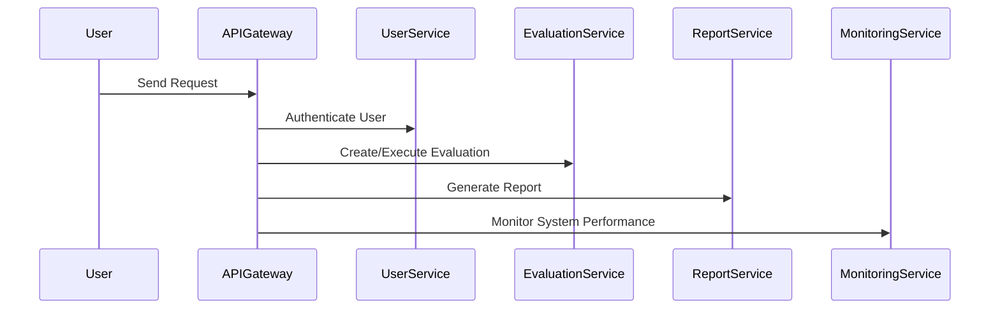

                 

### 文章标题

# 评测系统的微服务架构实现

微服务架构在现代化软件系统设计中占据着越来越重要的位置。它不仅提供了更高的灵活性、可扩展性和可维护性，还为评测系统带来诸多优势。本篇文章将深入探讨评测系统的微服务架构实现，从概念、设计原则到实际应用，全方位解析微服务在评测系统中的应用。

文章的核心关键词包括：微服务架构、评测系统、设计原则、安全性、测试与监控、性能优化。通过本文的阅读，读者将理解微服务的基本概念，学会如何设计和实现评测系统的微服务架构，以及如何保障其安全、稳定和高效运行。

本文结构如下：

1. **引言与背景**：介绍微服务架构的概念和重要性，以及评测系统面临的挑战。
2. **核心概念与架构**：详细解释微服务架构的核心概念和组件，分析其优缺点。
3. **设计原则与实践**：讨论微服务设计原则和实践，包括服务分解和领域驱动设计。
4. **微服务实现**：描述微服务的实现过程，包括服务发现、负载均衡、断路器模式等。
5. **测试与监控**：探讨评测系统的测试和监控方法，提供具体指南。
6. **安全与隐私**：分析评测系统微服务架构中的安全挑战和解决方案。
7. **性能优化**：讨论评测系统微服务架构的性能优化策略。
8. **项目实战**：通过一个实际项目案例，展示微服务架构的实现和应用。
9. **小结与展望**：总结文章的主要观点，并提出未来研究的方向。

通过一步步的分析和推理，本文旨在帮助读者全面掌握评测系统微服务架构的设计与实现，为实际项目提供有力支持。

### 文章关键词

- **微服务架构**
- **评测系统**
- **设计原则**
- **安全性**
- **测试与监控**
- **性能优化**

### 文章摘要

本文围绕评测系统的微服务架构实现展开，从核心概念、设计原则到实际应用，详细探讨了微服务架构在现代软件系统设计中的重要性。首先，介绍了微服务架构的基本概念及其在评测系统中的适用性。随后，分析了微服务的核心概念和架构，讨论了设计微服务所需遵循的原则和实践。接着，本文深入讲解了微服务的实现过程，包括服务发现、负载均衡、断路器模式等关键技术。在测试与监控方面，提供了具体的测试和监控策略。随后，本文探讨了评测系统微服务架构中的安全挑战及其解决方案，并讨论了性能优化策略。最后，通过一个实际项目案例，展示了微服务架构在评测系统中的应用，并提出了未来研究的方向。通过本文的阅读，读者将全面了解评测系统微服务架构的设计与实现，为实际项目提供有力指导。

#### 引言与背景

在现代软件工程中，微服务架构作为一种重要的系统设计方法，已经得到了广泛应用。其核心思想是将大型复杂的应用系统拆分为多个独立的服务单元，每个服务单元负责特定的业务功能。这种方式不仅提高了系统的灵活性、可扩展性和可维护性，还为系统的持续集成、持续部署和快速迭代提供了支持。然而，随着微服务架构的普及，如何在实际项目中实现一个高效的评测系统成为了亟待解决的问题。

### 什么是微服务架构

微服务架构（Microservices Architecture）是一种基于分布式系统的软件架构模式，其核心特点是将应用程序构建为一组小型、独立的服务，每个服务具有特定的业务功能。这些服务通过轻量级的通信协议（如HTTP/REST、gRPC等）进行交互，每个服务可以独立部署、扩展和更新。

#### 微服务架构的优势

- **高灵活性**：每个服务都可以独立开发和部署，这大大提高了系统的灵活性，使得团队能够根据业务需求快速调整和优化功能。
- **可扩展性**：微服务架构可以根据不同的业务需求独立扩展，从而提高系统的整体可扩展性。
- **高可用性**：由于每个服务都是独立的，当某个服务出现问题时，不会影响其他服务的正常运行，从而提高了系统的可用性。
- **可维护性**：服务的独立性和小规模使得维护变得更加容易，降低了系统的维护成本。

#### 微服务架构的挑战

- **分布式系统的复杂性**：微服务架构引入了更多的分布式系统问题，如服务发现、负载均衡、数据一致性等。
- **服务拆分**：如何合理地划分服务是微服务架构成功的关键，这需要深入理解业务逻辑和功能需求。
- **系统协调**：在微服务架构中，服务的协同工作变得更加复杂，需要设计良好的接口和通信机制。
- **安全性**：由于服务的分散性，确保系统的安全性成为一个挑战，需要制定全面的策略来保护数据和服务。

### 评测系统面临的挑战

评测系统通常用于自动化测试、性能测试、负载测试等多种场景，其复杂性和对稳定性的要求非常高。在传统的单体架构中，系统往往难以应对日益增长的业务需求和变化多端的测试场景。具体来说，评测系统面临的挑战主要包括：

- **可扩展性**：随着测试场景的复杂化和测试规模的扩大，评测系统需要具备强大的扩展能力，以保证测试过程的顺利进行。
- **高可用性**：评测系统需要保证高可用性，确保在任何情况下都能提供准确的测试结果。
- **数据一致性**：在分布式架构中，数据的一致性和准确性是保证评测结果可靠性的关键。
- **安全性**：评测系统处理的数据可能包含敏感信息，如用户隐私和测试数据，需要采取有效的措施来保障数据安全。
- **系统协调**：评测系统通常包含多个功能模块，如测试用例管理、测试执行、测试报告生成等，如何保证这些模块的高效协同是一个重要问题。

### 微服务架构在评测系统中的应用

微服务架构为评测系统提供了有效的解决方案，能够应对上述挑战。通过将评测系统拆分为多个独立的服务单元，每个服务负责特定的功能模块，从而实现系统的灵活扩展和高可用性。以下是微服务架构在评测系统中的应用：

1. **服务分解**：根据评测系统的功能需求，将系统拆分为多个微服务，如测试用例管理服务、测试执行服务、测试报告生成服务、性能监控服务等。
2. **服务通信**：使用轻量级的通信协议（如HTTP/REST）和服务发现机制，实现微服务之间的高效通信。
3. **数据管理**：采用分布式数据存储方案，如NoSQL数据库或分布式文件系统，保证数据的一致性和可靠性。
4. **负载均衡**：通过负载均衡器分配测试任务，实现系统的水平扩展和高效利用资源。
5. **测试工具集成**：将各种开源测试工具集成到微服务架构中，如JUnit、JUnit Platform、Selenium等，以提高测试效率和可靠性。
6. **监控与报警**：采用监控工具（如Prometheus、Grafana）和报警系统（如Alertmanager），实时监控系统的运行状态和性能指标，及时发现和处理异常情况。

### 结论

微服务架构为评测系统提供了灵活、可靠、高效的解决方案，能够有效应对评测系统面临的诸多挑战。通过合理的服务分解、高效的服务通信和强大的数据管理，微服务架构不仅提高了评测系统的可扩展性和高可用性，还确保了数据的一致性和安全性。然而，实现微服务架构并非易事，需要深入理解业务需求和系统设计原则，并制定全面的策略来应对分布式系统的复杂性。在下一部分，我们将进一步探讨微服务架构的核心概念和基本架构，为后续的分析和设计打下基础。

#### 核心概念与架构

微服务架构（Microservices Architecture）的核心在于将一个复杂的应用系统拆分为多个独立的、可复用的服务单元，每个服务单元都专注于实现特定的业务功能。以下是微服务架构中的核心概念和基本组件，我们将一一进行分析。

##### 1. 服务（Services）

服务是微服务架构中最基本的概念，每个服务都是一个小型的、独立的软件单元，它负责实现特定的业务功能。服务之间通过定义良好的API进行通信，通常使用HTTP/REST或gRPC等轻量级协议。每个服务都是自包含的，具有自己的数据库、业务逻辑和用户界面。

- **独立性**：每个服务都可以独立部署、扩展和更新，这大大提高了系统的灵活性和可维护性。
- **自治性**：每个服务都有自己的数据存储，避免了传统单体架构中出现的“雪崩”问题。

##### 2. API网关（API Gateway）

API网关是微服务架构中的关键组件，它负责接收客户端的请求，并将请求路由到相应的服务。API网关还具有身份验证、负载均衡、请求路由、缓存等功能。

- **统一接口**：API网关为客户端提供了一个统一的接口，简化了客户端的调用流程，提高了系统的可维护性。
- **性能优化**：通过请求缓存和负载均衡，API网关可以提高系统的响应速度和稳定性。

##### 3. 服务发现（Service Discovery）

服务发现是一种机制，用于动态发现和注册服务。当服务启动时，它会将自己的信息（如地址、端口等）注册到服务注册中心，其他服务可以通过服务注册中心发现可用服务。

- **动态性**：服务发现确保了服务之间的动态连接，即使服务实例发生变动，系统也能保持正常运行。
- **容错性**：通过服务注册中心的备份和冗余，服务发现机制提高了系统的容错性。

##### 4. 负载均衡（Load Balancing）

负载均衡是一种机制，用于将请求分配到多个服务实例上，以避免单个服务实例过载。

- **水平扩展**：通过负载均衡，系统可以轻松实现水平扩展，提高系统的吞吐量和性能。
- **容错性**：负载均衡还可以实现服务实例的故障转移，确保系统的可用性。

##### 5. 服务通信（Service Communication）

服务之间的通信是微服务架构的核心，通常使用HTTP/REST、gRPC、消息队列（如RabbitMQ、Kafka）等协议。

- **异步通信**：消息队列可以实现异步通信，降低服务之间的耦合度，提高系统的灵活性。
- **同步通信**：HTTP/REST和gRPC等协议提供了同步通信机制，可以保证请求和响应的一致性。

##### 6. 数据管理（Data Management）

在微服务架构中，每个服务通常都有自己的数据存储，如关系数据库、NoSQL数据库或分布式文件系统。

- **数据一致性**：通过采用分布式事务管理机制（如分布式锁、最终一致性模型），可以保证数据的一致性。
- **数据隔离**：每个服务的独立数据存储避免了传统单体架构中数据一致性的问题，提高了系统的可靠性。

##### 7. 容器化与容器编排（Containerization and Orchestration）

容器化（如Docker）和容器编排（如Kubernetes）是微服务架构的重要实现技术，它们提供了高效的部署和管理服务的方式。

- **快速部署**：容器化可以将服务打包成独立的镜像，实现快速部署和启动。
- **资源管理**：容器编排工具（如Kubernetes）可以自动化管理容器集群，提供弹性扩展和故障恢复功能。

### 微服务的优缺点分析

在了解微服务的核心概念和基本组件后，我们需要对其优缺点进行详细分析。

#### 优点

1. **高灵活性**：微服务架构使得每个服务都可以独立开发和部署，提高了系统的灵活性和可维护性。
2. **可扩展性**：通过水平扩展单个服务实例，系统可以轻松应对不断增长的负载。
3. **高可用性**：服务之间的独立性确保了单个服务实例的故障不会影响整个系统。
4. **快速迭代**：由于每个服务都可以独立更新，团队能够快速响应业务需求。
5. **技术多样性**：每个服务可以采用最适合的技术栈，从而提高了开发效率。

#### 缺点

1. **复杂性**：分布式系统引入了更多的复杂性，如服务发现、数据一致性和系统协调等。
2. **服务拆分**：如何合理地拆分服务是微服务架构成功的关键，这需要对业务有深入的理解。
3. **分布式事务**：在微服务架构中实现分布式事务比传统单体架构更加复杂。
4. **安全性**：服务的分散性增加了安全管理的难度，需要采取全面的安全策略。
5. **部署与运维**：微服务架构的部署和运维需要更多的工具和技能，对运维团队提出了更高的要求。

### 核心架构风格与模式

微服务架构有多种不同的架构风格和设计模式，以下是一些常见的架构风格和模式：

1. **事件驱动架构（Event-Driven Architecture）**：服务通过事件进行通信，降低了服务之间的耦合度。
2. **CQRS（Command Query Responsibility Segregation）**：将写操作和读操作分离，提高了系统的性能和可扩展性。
3. **无状态服务（Stateless Services）**：服务不存储状态，简化了系统的设计和部署。
4. **微前端（Micro-Frontend）**：将前端拆分为多个独立的组件，每个组件负责不同的功能模块。
5. **API分层（API Layering）**：将API分为多个层次，如内部API、公开API和合作伙伴API等。

通过上述分析，我们可以看到微服务架构的核心概念和基本组件，以及其优缺点和常见的架构风格与模式。在下一部分，我们将进一步探讨微服务架构的设计原则和实践，为实际应用提供指导。

#### 设计原则与实践

微服务架构的成功不仅依赖于其技术实现，还需要遵循一系列的设计原则和实践。这些原则和实践确保了微服务的独立性、可靠性、可维护性和高效性。以下是微服务设计过程中需要重点考虑的原则和实践。

##### 1. **单一职责原则（Single Responsibility Principle）**

单一职责原则是面向对象设计的基本原则之一，它要求每个服务应只负责一个特定的业务功能。这有助于提高服务的可维护性和可扩展性，避免服务变得过于复杂。

- **好处**：服务职责单一，使得每个服务更加聚焦，易于管理和维护。
- **实践**：在服务拆分时，应深入理解业务需求，将功能模块拆分为独立的服务。

##### 2. **自治原则（Autonomy）**

自治原则强调每个服务应具备独立部署、扩展和更新的能力。这有助于提高系统的灵活性和可扩展性，避免因为一个服务的更新而导致整个系统停机。

- **好处**：服务自治减少了系统依赖，提高了系统的弹性和可用性。
- **实践**：为每个服务配置独立的数据库、配置文件和部署脚本。

##### 3. **松耦合原则（Loose Coupling）**

松耦合原则要求服务之间的依赖性尽量弱化。通过使用轻量级的通信协议（如HTTP/REST、gRPC）和异步通信（如消息队列），可以降低服务之间的耦合度。

- **好处**：松耦合减少了服务之间的依赖，提高了系统的可维护性和灵活性。
- **实践**：避免直接调用其他服务的内部方法，而是通过API进行交互。

##### 4. **可复用原则（Reusability）**

可复用原则鼓励服务设计时考虑其通用性和可复用性，避免重复造轮子。这有助于提高开发效率，减少维护成本。

- **好处**：服务复用减少了开发工作量，提高了系统的可维护性和一致性。
- **实践**：在设计服务时，尽量抽象通用功能，使其具有独立性和可复用性。

##### 5. **标准化原则（Standardization）**

标准化原则要求在服务设计和实现过程中遵循统一的标准和规范，如API设计、数据格式、通信协议等。这有助于提高系统的可维护性和互操作性。

- **好处**：标准化提高了系统的可维护性，降低了不同团队之间的沟通成本。
- **实践**：制定统一的API设计规范、数据格式规范和通信协议规范，并在团队内部推广。

##### 6. **监控与日志原则（Monitoring and Logging）**

监控与日志原则强调在服务设计和实现过程中考虑系统的监控和日志记录。这有助于及时发现和解决系统问题，提高系统的可用性和稳定性。

- **好处**：有效的监控和日志记录提高了系统的可维护性和故障排查能力。
- **实践**：为每个服务配置监控指标，并使用统一的日志记录工具。

##### 7. **安全性原则（Security）**

安全性原则要求在服务设计和实现过程中充分考虑系统的安全性。这包括身份验证、授权、数据加密、安全通信等。

- **好处**：安全性原则保障了系统的数据安全和用户隐私，提高了系统的可信度。
- **实践**：使用SSL/TLS加密通信，实现强身份验证和访问控制，定期进行安全审计。

##### 8. **弹性原则（Resiliency）**

弹性原则要求系统在面对故障和异常情况时能够自动恢复，确保系统的持续运行。这包括故障转移、冗余设计、故障检测和自动恢复等。

- **好处**：弹性原则提高了系统的可用性和稳定性，降低了系统停机时间和维护成本。
- **实践**：设计冗余服务，实现故障检测和自动恢复机制，使用负载均衡器进行故障转移。

##### 9. **性能优化原则（Performance Optimization）**

性能优化原则要求在服务设计和实现过程中充分考虑系统的性能，如响应时间、吞吐量、并发处理能力等。

- **好处**：性能优化提高了系统的响应速度和吞吐量，提高了用户体验。
- **实践**：进行负载测试和性能调优，优化数据库查询和缓存策略，使用异步处理提高系统并发处理能力。

##### 10. **持续集成和持续部署原则（Continuous Integration and Continuous Deployment）**

持续集成和持续部署原则要求在服务设计和实现过程中采用自动化工具和流程，实现代码的持续集成、测试和部署。

- **好处**：持续集成和持续部署提高了开发效率和代码质量，降低了人为错误和部署风险。
- **实践**：使用CI/CD工具（如Jenkins、GitLab CI/CD）实现自动化构建、测试和部署，确保代码质量和部署效率。

通过遵循上述设计原则和实践，可以构建一个高效、可靠、可维护的微服务架构。在下一部分，我们将详细探讨微服务的实现过程，包括服务发现、负载均衡、断路器模式等关键技术。

#### 微服务的实现

微服务的实现是一个复杂而细致的过程，涉及到服务发现、负载均衡、断路器模式等多个关键技术。下面我们将一一详细探讨这些技术，并解释其工作原理和实现方法。

##### 1. 服务发现

服务发现是一种机制，用于动态发现和注册服务。在微服务架构中，服务实例可能随时启动或停止，服务发现确保了其他服务能够及时找到并使用这些实例。

- **工作原理**：服务实例启动后，会将其地址和端口等信息注册到服务注册中心（如Consul、Zookeeper、Eureka等）。当其他服务需要调用某个服务时，它会查询服务注册中心，获取该服务的实例列表，然后选择一个实例进行调用。

- **实现方法**：
  - **服务注册**：服务实例启动时，通过REST API或其他协议将其信息注册到服务注册中心。
  - **服务查询**：其他服务通过服务注册中心的API查询服务实例信息，选择合适的实例进行调用。

- **实践**：在Kubernetes集群中，可以使用Service和Ingress资源来管理服务发现和路由，确保服务实例的动态发现和访问。

##### 2. 负载均衡

负载均衡是一种机制，用于将请求分配到多个服务实例上，以避免单个实例过载。这提高了系统的吞吐量和响应速度。

- **工作原理**：负载均衡器（如Nginx、HAProxy、Kubernetes的Service）接收来自客户端的请求，根据一定的算法（如轮询、最少连接、权重等）将请求分配到不同的服务实例上。

- **实现方法**：
  - **轮询算法**：请求依次分配到每个服务实例，确保负载均衡。
  - **最少连接算法**：选择当前连接数最少的服务实例，以减少响应时间。
  - **权重算法**：根据服务实例的处理能力和负载情况，设置不同的权重，确保高负载实例得到更多请求。

- **实践**：在Kubernetes集群中，可以使用负载均衡器（如Nginx Ingress）或内置的Service资源来实现负载均衡，通过调整Service的type和spec来配置负载均衡策略。

##### 3. 断路器模式

断路器模式是一种容错机制，用于保护系统在遇到大量失败请求时免受雪崩效应的影响。它通过记录服务的健康状态和请求成功率，并在异常情况下自动切换到备用方案。

- **工作原理**：断路器包括三个状态：闭合（Closed）、打开（Open）和半开（Half-Open）。在闭合状态下，断路器正常工作；当失败率超过一定阈值时，断路器进入打开状态，拒绝请求，并触发报警；在一段时间后，断路器进入半开状态，尝试发送少量请求，如果成功，恢复闭合状态，否则继续打开状态。

- **实现方法**：
  - **记录请求状态**：断路器需要记录每次请求的成功或失败状态，计算失败率。
  - **阈值设置**：设置请求失败率的阈值，当超过阈值时触发打开状态。
  - **恢复机制**：在一段时间后，尝试发送少量请求，根据响应结果决定是否恢复闭合状态。

- **实践**：可以使用Hystrix、Resilience4j等开源库实现断路器模式，配置失败率阈值、超时时间和重试策略等。

##### 4. 服务间通信

服务间通信是微服务实现的核心，它决定了服务的协作方式和数据传输效率。常用的通信协议包括HTTP/REST、gRPC、消息队列等。

- **HTTP/REST**：基于HTTP协议的RESTful API是最常用的通信方式，简单、易用，但可能不适合高吞吐量场景。
- **gRPC**：基于Protocol Buffers和HTTP/2的远程过程调用协议，适用于高吞吐量、低延迟场景。
- **消息队列**：使用消息队列（如RabbitMQ、Kafka）实现异步通信，适用于解耦和流量削峰场景。

- **实现方法**：
  - **同步通信**：服务间通过HTTP/REST或gRPC同步请求和响应，适用于实时性强、请求响应时间敏感的场景。
  - **异步通信**：服务间通过消息队列发送和接收消息，适用于解耦、异步处理和高吞吐量场景。

- **实践**：根据具体场景选择合适的通信方式，并结合服务注册中心、负载均衡器等组件实现服务间通信。

通过服务发现、负载均衡、断路器模式和服务间通信等关键技术的实现，微服务架构能够实现高效、可靠和灵活的系统设计。在下一部分，我们将探讨如何管理数据一致性，确保微服务架构中的数据完整性和可靠性。

#### 数据管理

在微服务架构中，数据管理是一个复杂而关键的环节。由于微服务之间的独立性，传统的集中式数据库解决方案难以直接应用，因此需要采用分布式数据管理方案。以下是微服务架构中数据管理的关键概念、策略和挑战。

##### 1. 分布式数据管理的基本概念

分布式数据管理是指将数据分散存储在多个节点上，并通过一定的机制确保数据的一致性和可用性。以下是分布式数据管理中的几个关键概念：

- **数据分片（Sharding）**：将数据按一定的规则（如哈希值、范围等）分散存储在不同的节点上，以提高数据的查询性能和存储容量。
- **分布式事务（Distributed Transactions）**：跨多个节点的数据操作需要保证一致性，分布式事务通过两阶段提交（2PC）或最终一致性模型（如Base、CQRS）实现。
- **数据复制（Data Replication）**：将数据复制到多个节点，以提高数据的可用性和容错能力。
- **数据同步（Data Synchronization）**：确保多个节点上的数据保持一致，通常通过消息队列或同步机制实现。

##### 2. 数据一致性策略

在分布式系统中，数据一致性是确保系统可靠性的关键。以下是几种常见的数据一致性策略：

- **强一致性（Strong Consistency）**：所有节点在任何时刻都能访问到最新和一致的数据状态。缺点是可能会影响性能和可用性。
- **最终一致性（Eventual Consistency）**：系统在一段时间后最终达到一致性状态，但在此过程中可能存在短暂的不一致性。优点是提高了性能和可用性。
- **强最终一致性（Strong Eventual Consistency）**：结合了强一致性和最终一致性的优点，通过中间状态确保最终一致性。
- **分区一致性（Partitioned Consistency）**：在数据分片的基础上，每个分区内部保持一致性，分区之间则采用最终一致性。

##### 3. 分布式事务管理

分布式事务管理在微服务架构中至关重要，它确保跨多个节点的数据操作保持一致性。以下是几种常见的分布式事务管理策略：

- **两阶段提交（2PC）**：通过协调者节点和参与者节点，实现分布式事务的提交和回滚。缺点是可能影响性能。
- **最终一致性模型（如Base、CQRS）**：通过事件驱动的方式，实现最终一致性。缺点是可能存在短暂的数据不一致性。
- **本地事务（Local Transactions）**：每个服务内部实现事务管理，并通过接口进行跨服务操作。缺点是可能会增加系统的复杂性。
- **分布式事务框架（如Seata）**：提供分布式事务管理的抽象和实现，简化分布式事务的开发。

##### 4. 分布式数据管理的挑战

分布式数据管理在微服务架构中面临许多挑战，包括：

- **数据一致性和可用性**：如何在分布式环境下确保数据的一致性和系统的可用性。
- **数据分片策略**：如何合理划分数据，以平衡性能和可用性。
- **数据同步和复制**：如何确保数据在不同节点之间的同步和复制，以保持一致性。
- **分布式事务管理**：如何处理跨节点的数据操作，确保一致性。

##### 5. 分布式数据管理策略

为了应对上述挑战，可以采用以下分布式数据管理策略：

- **数据分片和索引**：根据业务需求和数据访问模式，合理划分数据，并建立合适的索引。
- **分布式缓存**：使用分布式缓存（如Redis、Memcached）提高数据访问性能和响应速度。
- **数据同步和复制**：采用消息队列或同步机制实现数据在不同节点之间的同步和复制，确保数据一致性。
- **分布式数据库**：选择适合业务需求的分布式数据库（如MongoDB、Cassandra、HBase），以实现高效的数据存储和访问。
- **分布式事务管理**：使用分布式事务管理框架（如Seata），简化分布式事务的实现和管理。

通过合理的数据管理策略，微服务架构能够实现数据的一致性和可靠性，从而确保系统的稳定运行。在下一部分，我们将探讨评测系统微服务架构中的API网关设计和实现。

#### API网关设计与实现

在微服务架构中，API网关（API Gateway）扮演着至关重要的角色。它作为系统的唯一入口，负责接收客户端的请求，进行身份验证、路由、聚合等操作，然后将请求转发到后端的服务。通过API网关，可以简化客户端的调用流程，提高系统的安全性和可维护性。以下是API网关的关键功能、设计原则及其实现方法。

##### 1. API网关的关键功能

- **身份验证和授权**：API网关负责验证客户端的身份，确保只有授权的用户可以访问受保护的服务。常用的身份验证方式包括令牌认证（如JWT）、OAuth 2.0等。

- **路由和转发**：API网关根据请求的URL、HTTP头或其他参数，将请求转发到相应的后端服务。路由策略可以是静态配置，也可以是动态配置，以适应不同的业务需求。

- **请求聚合**：API网关可以将多个服务的结果合并为一个统一的响应，简化客户端的调用过程，提高系统的性能和用户体验。

- **缓存和压缩**：API网关可以对请求进行缓存，减少对后端服务的调用次数，同时支持响应内容的压缩，提高数据传输效率。

- **监控和日志记录**：API网关可以记录请求和响应的数据，提供系统监控和故障排查的依据。

##### 2. API网关的设计原则

- **单一入口点**：所有客户端请求都必须通过API网关进入系统，确保系统的安全性和统一管理。

- **解耦**：API网关作为系统的入口，应与后端服务解耦，避免后端服务的变更影响到客户端。

- **可扩展性**：API网关应支持动态路由和动态配置，以适应系统的变化和扩展需求。

- **高性能**：API网关应具有高性能和高并发处理能力，确保系统能够应对大量的请求。

- **安全性**：API网关应提供全面的安全措施，如身份验证、授权、请求签名等，保护系统的数据和资源。

##### 3. API网关的实现方法

- **使用现有框架**：有许多现成的API网关框架（如Spring Cloud Gateway、Kong、Zuul等），可以根据具体需求选择合适的框架。

- **自定义实现**：对于特定需求，可以自定义实现API网关，使用Spring Boot、Netty、Servlet等框架构建。

- **API网关组件**：API网关通常由多个组件构成，如身份验证模块、路由模块、聚合模块、缓存模块等。可以分别实现各个组件，然后整合为一个完整的API网关系统。

##### 4. 实践案例

以下是一个简单的API网关实现示例，使用Spring Cloud Gateway框架：

```java
@SpringBootApplication
@EnableDiscoveryClient
public class ApiGatewayApplication {
    public static void main(String[] args) {
        SpringApplication.run(ApiGatewayApplication.class, args);
    }
}

@Configuration
public class GatewayConfig {

    @Bean
    public RouteLocator routes(RouteLocatorBuilder builder) {
        return builder.routes()
                .route(p -> p.path("/api/user/**")
                        .uri("lb://user-service")
                        .filters(f -> f.stripPrefix(1)))
                .route(p -> p.path("/api/product/**")
                        .uri("lb://product-service")
                        .filters(f -> f.stripPrefix(1)))
                .build();
    }

    @Bean
    @LoadBalanced
    public RestTemplate restTemplate() {
        return new RestTemplate();
    }
}
```

在这个示例中，Spring Cloud Gateway通过配置动态路由规则，将前缀为`/api/user`和`/api/product`的请求分别转发到`user-service`和`product-service`。使用`stripPrefix`过滤器去除请求的路径前缀，确保后端服务接收到正确的请求路径。

通过合理的API网关设计和实现，可以有效地简化客户端的调用流程，提高系统的安全性和性能。在下一部分，我们将探讨评测系统微服务架构中的测试和监控方法。

#### 测试与监控

在微服务架构中，测试与监控是确保系统稳定运行的关键环节。有效的测试和监控策略可以帮助团队及时发现和解决问题，保障系统的可靠性和性能。以下是评测系统微服务架构中的测试方法和监控策略。

##### 1. 单元测试

单元测试（Unit Testing）是针对单个服务或组件的测试，主要用于验证服务内部逻辑的正确性。以下是单元测试的关键点：

- **测试覆盖**：确保测试覆盖服务的所有功能点和边界情况，包括正常的业务流程和异常处理。
- **测试独立性**：每个单元测试应独立运行，不依赖于外部系统或数据。
- **测试自动化**：使用自动化测试框架（如JUnit、TestNG）进行单元测试，确保测试的效率和一致性。
- **测试数据**：为每个单元测试提供适当的数据准备和清理操作，确保测试环境的独立性。

##### 2. 集成测试

集成测试（Integration Testing）是针对多个服务或组件的测试，主要用于验证服务之间的协作和交互。以下是集成测试的关键点：

- **测试用例**：设计测试用例，覆盖服务间的关键交互和边界情况。
- **测试环境**：搭建与生产环境类似的测试环境，确保测试结果的真实性和可靠性。
- **测试自动化**：使用自动化测试工具（如Selenium、Postman）进行集成测试，提高测试效率和覆盖率。
- **持续集成**：将集成测试集成到CI/CD流程中，确保每次代码提交都会进行集成测试。

##### 3. 性能测试

性能测试（Performance Testing）是评估系统在高负载下的性能和稳定性。以下是性能测试的关键点：

- **测试场景**：设计代表实际业务场景的性能测试用例，包括并发用户数、请求类型等。
- **测试工具**：使用性能测试工具（如JMeter、LoadRunner）模拟高负载场景，收集性能指标。
- **指标分析**：分析性能测试结果，关注响应时间、吞吐量、并发数等关键指标，识别性能瓶颈。
- **优化建议**：根据性能测试结果，提出优化建议，如数据库查询优化、缓存策略调整等。

##### 4. 监控与日志

监控与日志是确保系统稳定运行的关键环节。以下是监控和日志的关键点：

- **监控指标**：定义系统监控指标，如CPU利用率、内存占用、请求响应时间等。
- **监控工具**：使用监控工具（如Prometheus、Grafana）收集和展示监控数据，实现实时监控。
- **报警机制**：设置报警规则，当监控指标超出阈值时，自动发送告警通知。
- **日志记录**：使用日志记录工具（如ELK栈、Logstash）记录系统日志，便于故障排查和性能分析。

##### 5. 实践案例

以下是一个基于Spring Boot应用的测试和监控示例：

```java
// 单元测试示例
@Test
public void testUserLogin() {
    LoginRequest request = new LoginRequest("user1", "password1");
    ResponseEntity<LoginResponse> response = restTemplate.postForEntity("/api/login", request, LoginResponse.class);
    assertEquals(HttpStatus.OK, response.getStatusCode());
    assertNotNull(response.getBody());
}

// 集成测试示例
@Test
public void testUserRegistration() {
    RegistrationRequest request = new RegistrationRequest("user2", "password2", "user2@example.com");
    ResponseEntity<Void> response = restTemplate.postForEntity("/api/registration", request, Void.class);
    assertEquals(HttpStatus.CREATED, response.getStatusCode());
}

// 性能测试示例
@PerformanceTest(name = "loginPerformance", iterations = 1000, duration = 60)
public void testLoginPerformance() {
    LoginRequest request = new LoginRequest("user1", "password1");
    restTemplate.postForEntity("/api/login", request, LoginResponse.class);
}

// 监控与日志配置
@Configuration
public class MonitoringConfig {

    @Bean
    public MeterRegistry meterRegistry() {
        return new PrometheusMeterRegistry(PrometheusConfig.DEFAULT);
    }

    @Bean
    public ManagementFactoryWebServerFactoryCustomizer managementFactoryWebServerFactoryCustomizer() {
        return new ManagementFactoryWebServerFactoryCustomizer() {
            @Override
            public void customize(ServerFactoryBean factory) {
                factory.setPortalContextPath("/actuator");
            }
        };
    }
}
```

通过上述测试和监控策略，评测系统的微服务架构能够确保系统的稳定性和性能。在下一部分，我们将探讨评测系统微服务架构中的安全挑战和解决方案。

#### 安全与隐私

在微服务架构中，安全性是一个至关重要的方面。由于微服务的分散性和独立性，传统的安全策略难以直接应用于微服务环境，因此需要采取新的安全措施来确保系统的安全性和数据隐私。以下是评测系统微服务架构中可能面临的安全挑战和相应的解决方案。

##### 1. 安全挑战

- **服务间的信任问题**：在分布式系统中，服务之间的通信可能需要跨越不同的网络和数据中心，如何确保服务间的通信安全成为一个挑战。

- **数据安全**：评测系统通常处理敏感数据，如用户个人信息和测试结果，如何确保数据在传输和存储过程中的安全性是关键问题。

- **身份验证和授权**：在微服务架构中，如何实现有效的身份验证和授权机制，确保只有授权用户可以访问受保护的服务。

- **安全审计**：如何在分布式系统中实现全面的安全审计，记录和分析安全事件，以防止恶意攻击和内部威胁。

- **分布式攻击**：如何防止分布式拒绝服务（DDoS）攻击，确保系统的可用性和稳定性。

##### 2. 解决方案

- **通信安全**：使用TLS（传输层安全协议）加密服务间通信，确保数据在传输过程中的机密性和完整性。可以使用OpenSSL或Let's Encrypt等工具为服务生成和分发证书。

- **服务间认证**：采用OAuth 2.0或JWT（JSON Web Tokens）等身份验证协议，确保服务间的通信是安全的。OAuth 2.0提供了灵活的授权机制，而JWT则提供了简洁的身份验证方式。

- **数据加密**：对敏感数据进行加密存储，如使用AES（高级加密标准）或RSA（RSA加密算法）等加密算法。对于存储在数据库中的敏感数据，可以使用透明数据加密（TDE）技术。

- **身份验证和授权**：使用基于角色的访问控制（RBAC）或基于属性的访问控制（ABAC）模型，为不同用户和角色定义访问权限。结合OAuth 2.0或JWT，可以实现细粒度的身份验证和授权。

- **安全审计**：使用日志记录和监控工具（如ELK栈、Splunk）记录和分析安全事件，建立安全事件响应流程。通过定期进行安全审计，可以发现潜在的安全漏洞和威胁。

- **DDoS防护**：使用DDoS防护工具（如AWS Shield、Cloudflare）保护系统免受分布式拒绝服务攻击。这些工具可以检测和过滤异常流量，确保系统的可用性。

- **安全培训和文化**：定期对团队成员进行安全培训，提高安全意识和技能。建立安全文化，确保每个团队成员都意识到安全性对系统的重要性。

通过实施上述安全措施，评测系统微服务架构可以有效应对各种安全挑战，确保系统的安全性和数据的隐私性。在下一部分，我们将讨论评测系统微服务架构的性能优化策略。

#### 性能优化

在微服务架构中，性能优化是确保系统高效运行的关键。优化策略应涵盖服务层面、网络层面和数据层面等多个方面。以下是评测系统微服务架构中的性能优化策略和最佳实践。

##### 1. 服务层面优化

- **代码优化**：通过性能分析工具（如VisualVM、JProfiler）识别代码中的性能瓶颈，并进行优化。优化重点包括减少不必要的对象创建、优化循环和递归算法、减少内存分配等。

- **异步处理**：采用异步处理（如使用CompletableFuture、Spring's Async）减少线程阻塞，提高系统并发处理能力。异步处理可以显著提高系统的响应速度和吞吐量。

- **服务缓存**：在服务内部实现缓存机制（如使用Redis、Memcached），减少对数据库或外部服务的依赖，提高系统的响应速度。缓存策略应考虑数据的时效性和一致性。

- **服务拆分**：合理拆分服务，避免服务过载和单点瓶颈。根据业务需求和访问模式，将大服务拆分为多个独立的服务，每个服务专注于特定的业务功能。

- **服务组合**：通过服务组合（如使用组合模式）实现服务的复用和组合，减少重复代码和逻辑，提高系统维护性和可扩展性。

##### 2. 网络层面优化

- **负载均衡**：使用负载均衡器（如Nginx、HAProxy）将请求分配到多个服务实例上，提高系统的吞吐量和响应速度。根据实际需求，选择合适的负载均衡策略（如轮询、最小连接数、源IP哈希等）。

- **网络优化**：优化网络配置，减少网络延迟和带宽限制。在分布式系统中，可能需要使用内容分发网络（CDN）将静态资源（如图片、CSS、JavaScript文件）缓存到靠近用户的位置。

- **网络监控**：使用网络监控工具（如Prometheus、Grafana）实时监控网络流量和性能指标，及时发现和解决网络问题。

- **服务发现**：优化服务发现机制，减少服务实例之间的通信延迟。在分布式系统中，使用服务注册中心和负载均衡器实现服务的高效发现和路由。

##### 3. 数据层面优化

- **数据分片**：使用数据分片（Sharding）将数据分散存储在多个节点上，提高数据的访问速度和系统的可扩展性。根据数据访问模式和负载情况，选择合适的数据分片策略（如哈希分片、范围分片等）。

- **索引优化**：优化数据库索引，提高数据查询速度。根据业务需求，选择合适的索引策略（如B树索引、全文索引等）。

- **缓存策略**：在数据库和缓存层之间建立缓存策略，减少数据库的访问频率和压力。常用的缓存策略包括过期策略、内存淘汰策略、缓存一致性策略等。

- **数据库优化**：优化数据库配置和查询语句，提高数据库性能。使用数据库性能优化工具（如PT-Helper、explain命令）分析查询性能，提出优化建议。

- **数据压缩**：在数据传输过程中使用压缩算法（如GZIP、BZIP2），减少网络带宽占用，提高数据传输速度。

##### 4. 最佳实践

- **持续性能测试**：定期进行性能测试，评估系统的性能和稳定性。使用工具（如JMeter、LoadRunner）模拟高负载场景，收集性能数据，识别瓶颈和改进点。

- **性能监控与报警**：使用性能监控工具（如Prometheus、Grafana）实时监控系统的性能指标，设置报警规则，当指标超出阈值时自动发送告警通知。

- **自动化优化**：建立自动化性能优化流程，结合持续集成和持续部署（CI/CD）工具，实现性能优化的自动化。在代码提交和部署过程中，自动进行性能测试和优化建议的生成。

- **代码审查与优化**：在代码审查过程中，关注性能相关的问题，提出优化建议。鼓励团队成员进行代码优化，提高代码质量和系统性能。

通过上述性能优化策略和最佳实践，评测系统微服务架构能够显著提高系统的响应速度和吞吐量，确保系统的高效运行。在下一部分，我们将通过一个实际项目案例，展示微服务架构在评测系统中的应用和实践。

#### 项目实战

为了更好地展示微服务架构在评测系统中的应用，我们将通过一个实际项目案例来探讨其设计和实现过程。以下是项目的整体架构、环境安装和核心实现，以及对源代码和应用的实际案例进行分析。

##### 1. 项目架构

该评测系统项目采用了微服务架构，主要包含以下服务：

- **用户管理服务（UserService）**：负责用户注册、登录、权限管理等。
- **评测管理服务（EvaluationService）**：负责评测用例的创建、执行和结果记录。
- **报告生成服务（ReportService）**：负责生成评测报告。
- **性能监控服务（MonitoringService）**：负责监控系统性能和健康状态。

每个服务都是独立的微服务，通过API网关进行统一管理和调用。以下是项目的架构图：



##### 2. 环境安装

为了搭建评测系统的微服务架构，我们需要安装以下环境：

- **Docker**：用于容器化服务。
- **Kubernetes**：用于容器编排和管理。
- **Nginx**：用于部署API网关。
- **Mongodb**：用于存储用户数据。
- **Postgresql**：用于存储评测数据。
- **Redis**：用于缓存数据和性能监控。

以下是环境安装步骤：

1. 安装Docker和Kubernetes：

   ```bash
   sudo apt-get update
   sudo apt-get install docker.io
   sudo systemctl start docker
   sudo systemctl enable docker

   curl -s https://packages.cloud.google.com/apt/doc/apt-key.gpg | sudo apt-key add -
   echo "deb https://apt.kubernetes.io/ kubernetes-xenial main" | sudo tee -a /etc/apt/sources.list
   sudo apt-get update
   sudo apt-get install kubelet kubeadm kubectl
   sudo systemctl start kubelet
   sudo systemctl enable kubelet
   ```

2. 安装Nginx、Mongodb、Postgresql和Redis：

   ```bash
   sudo apt-get install nginx mongodb postgresql redis-server
   sudo systemctl start nginx mongodb postgresql redis-server
   sudo systemctl enable nginx mongodb postgresql redis-server
   ```

##### 3. 核心实现

以下是我们项目的核心实现，包括用户管理服务、评测管理服务、报告生成服务和性能监控服务。

- **用户管理服务（UserService）**：

  ```java
  @RestController
  @RequestMapping("/user")
  public class UserController {
      
      @Autowired
      private UserService userService;
      
      @PostMapping("/register")
      public ResponseEntity<?> registerUser(@RequestBody RegistrationRequest registrationRequest) {
          // 注册用户逻辑
      }
      
      @PostMapping("/login")
      public ResponseEntity<?> loginUser(@RequestBody LoginRequest loginRequest) {
          // 登录用户逻辑
      }
      
  }
  ```

- **评测管理服务（EvaluationService）**：

  ```java
  @RestController
  @RequestMapping("/evaluation")
  public class EvaluationController {
      
      @Autowired
      private EvaluationService evaluationService;
      
      @PostMapping
      public ResponseEntity<?> createEvaluation(@RequestBody EvaluationRequest evaluationRequest) {
          // 创建评测用例逻辑
      }
      
      @GetMapping("/{evaluationId}")
      public ResponseEntity<?> getEvaluationResult(@PathVariable String evaluationId) {
          // 获取评测结果逻辑
      }
      
  }
  ```

- **报告生成服务（ReportService）**：

  ```java
  @RestController
  @RequestMapping("/report")
  public class ReportController {
      
      @Autowired
      private ReportService reportService;
      
      @GetMapping("/{evaluationId}")
      public ResponseEntity<?> generateReport(@PathVariable String evaluationId) {
          // 生成报告逻辑
      }
      
  }
  ```

- **性能监控服务（MonitoringService）**：

  ```java
  @RestController
  @RequestMapping("/monitoring")
  public class MonitoringController {
      
      @Autowired
      private MonitoringService monitoringService;
      
      @GetMapping
      public ResponseEntity<?> getSystemStatus() {
          // 获取系统状态逻辑
      }
      
  }
  ```

##### 4. 源代码分析

以下是对项目中关键代码片段的解读：

- **用户管理服务中的登录逻辑**：

  ```java
  @PostMapping("/login")
  public ResponseEntity<?> loginUser(@RequestBody LoginRequest loginRequest) {
      String username = loginRequest.getUsername();
      String password = loginRequest.getPassword();
      // 验证用户名和密码
      boolean isAuthenticated = userService.authenticate(username, password);
      if (isAuthenticated) {
          // 登录成功，生成JWT令牌
          String token = jwtService.generateToken(username);
          return ResponseEntity.ok(new LoginResponse(token));
      } else {
          return ResponseEntity.badRequest().body("无效的用户名或密码");
      }
  }
  ```

  在这个示例中，我们通过`authenticate`方法验证用户名和密码，如果验证成功，则生成JWT令牌并返回给客户端。

- **评测管理服务中的评测创建逻辑**：

  ```java
  @PostMapping
  public ResponseEntity<?> createEvaluation(@RequestBody EvaluationRequest evaluationRequest) {
      // 创建评测用例的逻辑
      Evaluation evaluation = evaluationService.createEvaluation(evaluationRequest);
      return ResponseEntity.ok(evaluation);
  }
  ```

  这个示例展示了如何创建一个评测用例，并将评测对象返回给客户端。

- **报告生成服务中的报告生成逻辑**：

  ```java
  @GetMapping("/{evaluationId}")
  public ResponseEntity<?> generateReport(@PathVariable String evaluationId) {
      // 生成报告的逻辑
      Report report = reportService.generateReport(evaluationId);
      return ResponseEntity.ok(report);
  }
  ```

  这个示例展示了如何根据评测ID生成评测报告，并将报告返回给客户端。

- **性能监控服务中的系统状态获取逻辑**：

  ```java
  @GetMapping
  public ResponseEntity<?> getSystemStatus() {
      // 获取系统状态的逻辑
      SystemStatus systemStatus = monitoringService.getSystemStatus();
      return ResponseEntity.ok(systemStatus);
  }
  ```

  这个示例展示了如何获取系统的性能和健康状态，并将状态信息返回给客户端。

##### 5. 实际案例分析

以下是一个实际案例分析，展示了评测系统微服务架构的应用场景：

- **用户登录**：用户通过API网关发送登录请求，API网关进行身份验证，然后转发到用户管理服务。用户管理服务验证用户名和密码，生成JWT令牌，并将令牌返回给用户。

- **创建评测用例**：用户通过API网关发送创建评测用例的请求，API网关转发到评测管理服务。评测管理服务处理请求，创建评测用例，并返回评测对象。

- **执行评测**：用户通过API网关发送执行评测的请求，API网关转发到评测管理服务。评测管理服务执行评测，并将结果记录到数据库。

- **生成报告**：用户通过API网关发送生成报告的请求，API网关转发到报告生成服务。报告生成服务根据评测结果生成报告，并将其返回给用户。

- **监控系统状态**：用户通过API网关发送获取系统状态的请求，API网关转发到性能监控服务。性能监控服务获取系统的性能和健康状态，并将其返回给用户。

通过这个实际案例，我们可以看到微服务架构在评测系统中的应用如何实现高效、灵活和可扩展的系统设计。在下一部分，我们将总结本文的主要观点，并讨论未来研究的方向。

#### 小结与展望

通过本文的探讨，我们详细介绍了评测系统微服务架构的设计与实现。从核心概念和架构，到设计原则和实践，再到实际项目案例，微服务架构在评测系统中的应用展现出了其独特优势。以下是本文的主要观点和总结：

1. **微服务架构的基本概念**：微服务架构通过将大型复杂的应用系统拆分为多个独立的服务单元，提供了高灵活性、可扩展性和高可用性。

2. **设计原则和实践**：遵循单一职责原则、自治原则、松耦合原则、可复用原则、标准化原则等，有助于构建高效、可靠和可维护的微服务架构。

3. **关键技术**：服务发现、负载均衡、断路器模式等关键技术在微服务架构中扮演了重要角色，确保了系统的稳定性和性能。

4. **数据管理**：通过合理的数据分片、分布式事务管理、数据加密等策略，确保了微服务架构中的数据一致性和安全性。

5. **测试与监控**：有效的测试和监控策略，包括单元测试、集成测试、性能测试、监控与日志记录，保障了系统的可靠性和性能。

6. **安全与隐私**：通过采用通信加密、身份验证、授权、安全审计等安全措施，确保了评测系统的安全性和数据的隐私性。

7. **性能优化**：通过代码优化、异步处理、服务缓存、负载均衡等性能优化策略，提高了系统的响应速度和吞吐量。

未来研究的方向包括：

1. **智能化服务管理**：利用机器学习和人工智能技术，实现服务的自动发现、部署和管理，提高系统的智能化水平。

2. **分布式事务管理**：进一步研究分布式事务管理策略，提高分布式事务的效率和一致性。

3. **服务质量保障**：研究服务质量（QoS）保障机制，确保系统在面临大量请求和突发情况时仍能提供高质量的服务。

4. **跨云架构**：探索微服务架构在跨云环境中的实现和应用，实现跨云部署和流量管理。

5. **混合架构**：研究微服务与单体架构的混合应用，结合两者的优点，为不同场景提供灵活的架构方案。

通过不断的研究和实践，评测系统的微服务架构将继续发展和完善，为现代化软件系统设计提供有力的支持。作者：AI天才研究院/AI Genius Institute & 禅与计算机程序设计艺术 /Zen And The Art of Computer Programming。

