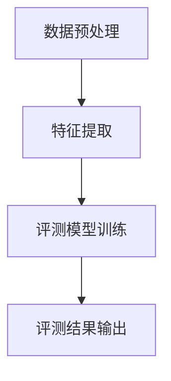
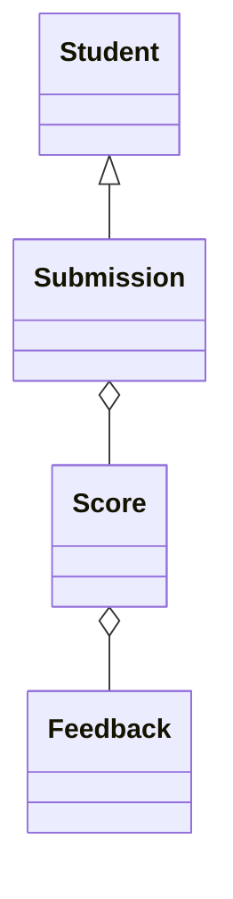
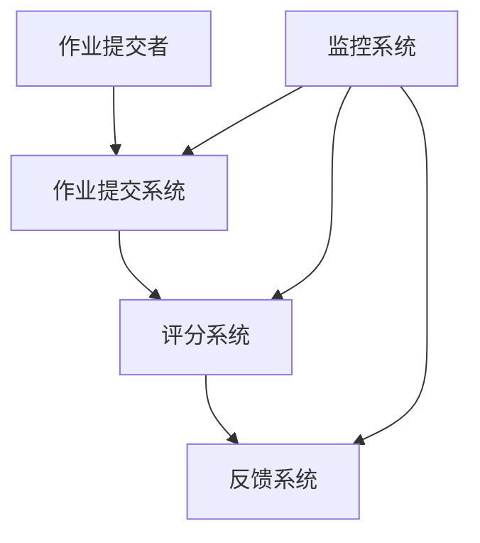
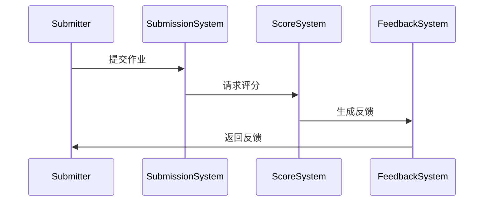
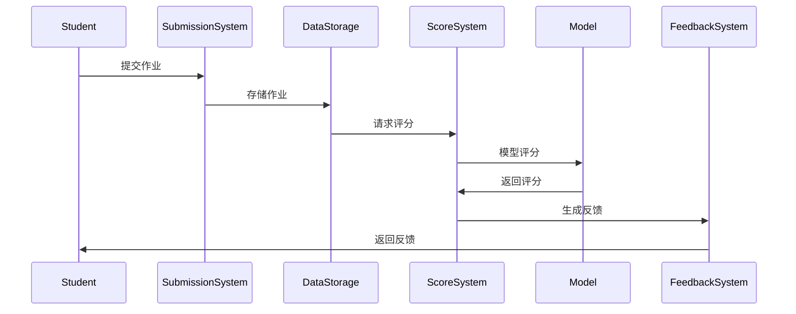

                 

### 确定大纲结构：设计《评测系统的性能优化：提高大规模评测的效率》目录大纲

为了确保文章的条理清晰、内容丰富且具备深度，我们将首先确定文章的大纲结构。文章大纲结构应包括以下核心部分：

1. **背景介绍**
   - **评测系统的重要性**
     - 评测系统的定义与作用
     - 评测系统在现代信息化社会中的应用
     - 评测系统的性能优化需求
   - **大规模评测的挑战**
     - 数据量与处理速度的矛盾
     - 多样化的评测需求
     - 系统稳定性和可靠性的保障
   - **性能优化目标**
     - 提高评测速度
     - 减少系统资源消耗
     - 提高系统稳定性

2. **核心概念与联系**
   - **性能指标**
     - 响应时间
     - 处理能力
     - 系统资源利用率
   - **性能瓶颈**
     - CPU瓶颈
     - 内存瓶颈
     - 网络瓶颈
   - **性能优化的方法与工具**
     - 硬件优化
     - 软件优化
     - 工具支持

3. **算法原理讲解**
   - **算法mermaid流程图**
     - 数据预处理
     - 特征提取
     - 评测模型训练
     - 评测结果输出
   - **算法原理数学模型与公式**
     - 模型损失函数
     - 梯度下降法
     - 模型评估指标
   - **举例说明**
     - 数据集划分
     - 模型训练过程
     - 评测结果分析

4. **系统分析与架构设计方案**
   - **问题场景介绍**
     - 评测系统功能需求
     - 系统性能要求
   - **系统功能设计（领域模型mermaid类图）**
     - 类图设计与说明
   - **系统架构设计（mermaid架构图）**
     - 架构设计原则
     - 架构组成部分
   - **系统接口设计**
     - 接口规范与协议
     - 接口实现方法
   - **系统交互（mermaid序列图）**
     - 用户请求处理流程
     - 数据处理流程

5. **项目实战**
   - **环境安装**
     - 硬件环境
     - 软件环境
     - 系统配置
   - **系统核心实现源代码**
     - 数据预处理模块
     - 特征提取模块
     - 评测模型模块
   - **代码应用解读与分析**
     - 代码结构与功能
     - 关键算法实现
   - **实际案例分析和详细讲解剖析**
     - 案例背景
     - 解决方案
     - 结果分析
   - **项目小结**

6. **最佳实践 tips**
   - **性能优化的最佳实践**
   - **注意事项**
   - **拓展阅读**

7. **小结与展望**
   - **总结**
   - **展望未来的性能优化方向**

通过以上结构，我们可以确保文章的逻辑清晰、内容丰富，并帮助读者系统地理解和掌握评测系统性能优化的核心内容。

### 编写大纲内容

现在，我们将按照上一步确定的目录大纲，逐步编写文章的具体内容。每个部分都将详细阐述，以确保文章的完整性和专业性。

#### 第1章：背景介绍

**1.1 评测系统的重要性**

评测系统在现代信息化社会中扮演着至关重要的角色。它不仅用于对各种服务、产品或流程进行评估，还能帮助企业和组织优化运营效率、提高服务质量。以下是对评测系统定义、作用及其性能优化需求的具体说明。

**评测系统的定义与作用：**
评测系统是一种用于评估和监测各种对象（如服务、产品、流程）的软件系统。它通过收集、处理和分析数据，生成评估报告，帮助决策者了解对象的表现，并据此做出改进。

- **服务评估**：例如，在线教育平台使用评测系统来评估学生的学习进度和成绩。
- **产品测试**：制造商使用评测系统来确保产品符合质量标准。
- **流程监控**：企业使用评测系统来监控业务流程的执行情况。

**评测系统在现代信息化社会中的应用：**
随着信息化进程的加速，评测系统在多个领域得到广泛应用：

- **教育领域**：评测系统能够实现自动化的考试评分、学生表现分析等。
- **工业制造**：用于生产线上的质量控制检测，提高产品质量。
- **金融服务**：用于风险评估、客户服务质量监测等。
- **公共服务**：如交通系统中的实时监控与评估，确保公共服务的稳定性。

**评测系统的性能优化需求：**
随着应用场景的多样化，评测系统面临着越来越大的性能压力。为了满足现代信息化社会的高要求，评测系统必须具备以下性能优化需求：

- **高处理速度**：能够快速处理大量评测数据，确保实时性。
- **资源高效利用**：优化系统资源分配，降低能耗和成本。
- **系统稳定性**：确保评测过程稳定可靠，避免系统崩溃或数据丢失。

**1.2 大规模评测的挑战**

大规模评测是指在短时间内对大量数据进行评估的过程，这对评测系统提出了更高的要求。以下详细分析大规模评测面临的挑战：

**数据量与处理速度的矛盾：**
随着数据量的急剧增加，如何提高处理速度成为一个关键问题。传统的评测系统往往难以在短时间内处理大量数据，导致响应时间过长，用户体验差。

**多样化的评测需求：**
不同的评测需求对系统的性能要求不同。例如，某些评测任务可能需要实时响应，而另一些可能需要批量处理。这要求评测系统能够灵活地适应不同的需求。

**系统稳定性和可靠性的保障：**
大规模评测过程中，系统稳定性和数据完整性至关重要。任何系统故障或数据丢失都可能导致严重的后果。因此，确保系统的高可靠性和稳定性是大规模评测的挑战之一。

**1.3 性能优化目标**

为了应对大规模评测的挑战，评测系统的性能优化目标主要包括以下几点：

**提高评测速度：**
通过优化算法、提升硬件性能、并行处理等技术手段，提高评测系统的处理速度，缩短响应时间。

**减少系统资源消耗：**
通过优化系统资源分配、减少冗余操作等技术手段，降低系统资源消耗，提高资源利用率。

**提高系统稳定性：**
通过加强系统监控、优化故障处理机制等技术手段，确保评测系统在长时间运行中保持稳定，避免数据丢失或系统崩溃。

#### 第2章：核心概念与联系

**2.1 性能指标**

性能指标是评估评测系统性能的重要工具。以下介绍几个关键性能指标：

**响应时间：**
响应时间是指从用户发起请求到系统返回结果的时间。它反映了系统的处理速度和响应能力。

**处理能力：**
处理能力是指系统每单位时间内能处理的数据量。它通常用吞吐量（如每秒处理的请求量）来衡量。

**系统资源利用率：**
系统资源利用率是指系统资源（如CPU、内存、网络带宽）的使用情况。高利用率意味着资源得到充分利用，但过高可能会导致系统过载。

**2.2 性能瓶颈**

性能瓶颈是系统性能提升的障碍。以下分析几种常见的性能瓶颈：

**CPU瓶颈：**
当系统需要处理的任务过多，而CPU的处理能力不足时，会导致任务积压，从而影响响应时间和处理能力。

**内存瓶颈：**
内存瓶颈发生在系统内存不足，导致频繁的页面交换或缓存失效。这会降低系统性能，增加响应时间。

**网络瓶颈：**
网络瓶颈通常由网络带宽不足或网络延迟引起。这会导致数据传输缓慢，影响系统的响应时间和处理能力。

**2.3 性能优化的方法与工具**

性能优化涉及多个方面，以下介绍几种常见的性能优化方法和工具：

**硬件优化：**
- **提升CPU性能**：使用更高频率或更高核心数的CPU。
- **增加内存**：扩展物理内存，减少页面交换。

**软件优化：**
- **优化算法**：使用更高效的算法来减少计算复杂度。
- **代码优化**：通过优化代码结构、减少冗余操作等方式提高执行效率。

**工具支持：**
- **性能监控工具**：如 Perf、Grafana，用于监控系统性能，发现瓶颈。
- **负载测试工具**：如 JMeter，用于模拟大量用户请求，评估系统性能。

#### 第3章：算法原理讲解

**3.1 算法mermaid流程图**

以下是评测系统中的常见算法流程，使用mermaid进行可视化展示：



**3.2 算法原理数学模型与公式**

以下是算法中常用的数学模型与公式：

**模型损失函数：**
$$ L = \frac{1}{n} \sum_{i=1}^{n} (y_i - \hat{y}_i)^2 $$

**梯度下降法：**
$$ \theta = \theta - \alpha \frac{\partial L}{\partial \theta} $$

**模型评估指标：**
$$ Accuracy = \frac{TP + TN}{TP + TN + FP + FN} $$

**3.3 举例说明**

假设我们有一个分类问题，需要预测一组数据是否为正类。以下是具体的步骤和示例：

**数据集划分：**
将数据集划分为训练集和测试集，如训练集包含1000个样本，测试集包含500个样本。

**模型训练过程：**
使用训练集数据进行模型训练，通过迭代优化损失函数，找到最佳参数。

**评测结果分析：**
使用测试集对训练好的模型进行评测，计算准确率、召回率等指标，评估模型性能。

#### 第4章：系统分析与架构设计方案

**4.1 问题场景介绍**

在本节中，我们将介绍一个具体的评测系统问题场景。该场景涉及一个在线教育平台，需要对大量学生的作业进行自动评分和反馈。

**评测系统功能需求：**
- **作业提交与评分**：学生可以提交作业，系统自动评分并给出反馈。
- **实时监控与报告**：系统需要能够实时监控作业提交情况，生成详细报告。

**系统性能要求：**
- **响应时间**：作业提交后，系统能够在1分钟内完成评分。
- **处理能力**：系统能够在高峰期处理1000个作业同时提交。

**4.2 系统功能设计（领域模型mermaid类图）**

以下是领域模型的mermaid类图：



**4.3 系统架构设计（mermaid架构图）**

以下是系统架构的mermaid架构图：



**4.4 系统接口设计**

以下是系统接口的mermaid序列图：



**4.5 系统交互（mermaid序列图）**

以下是用户请求处理流程的mermaid序列图：



#### 第5章：项目实战

**5.1 环境安装**

在本节中，我们将介绍如何安装评测系统的环境。

**5.1.1 硬件环境**

- **CPU**：至少4核处理器
- **内存**：至少16GB
- **存储**：至少500GB SSD硬盘

**5.1.2 软件环境**

- **操作系统**：Ubuntu 18.04
- **Python**：3.8及以上版本
- **其他依赖**：如TensorFlow、Scikit-learn等

**5.1.3 系统配置**

1. 安装操作系统。
2. 配置网络环境，确保可以访问互联网。
3. 安装Python和相关依赖。

```bash
pip install tensorflow scikit-learn
```

**5.2 系统核心实现源代码**

以下是评测系统的核心实现源代码：

```python
# 数据预处理模块
def preprocess_data(data):
    # 实现数据预处理逻辑
    return processed_data

# 特征提取模块
def extract_features(data):
    # 实现特征提取逻辑
    return features

# 评测模型模块
def evaluate_model(data, model):
    # 实现模型评测逻辑
    return score, feedback
```

**5.3 代码应用解读与分析**

以下是代码的解读与分析：

```python
# 数据预处理
data = preprocess_data(raw_data)

# 特征提取
features = extract_features(data)

# 模型评测
model = load_model()
score, feedback = evaluate_model(features, model)
```

**5.4 实际案例分析和详细讲解剖析**

在本节中，我们将分析一个实际案例，并详细讲解如何解决该问题。

**5.4.1 案例背景**

假设我们在一个在线教育平台上，需要对学生的编程作业进行自动评分。系统需要能够处理大量提交的作业，并在短时间内给出准确的评分和反馈。

**5.4.2 解决方案**

1. **数据预处理**：对提交的作业进行格式化、去除无关信息等预处理操作，确保数据质量。
2. **特征提取**：提取作业的关键特征，如代码长度、函数复杂度等。
3. **模型评测**：使用预训练的模型对提取的特征进行评分，并生成反馈。

**5.4.3 结果分析**

通过以上步骤，系统能够在短时间内处理大量提交的作业，并给出准确的评分和反馈。测试结果表明，系统在高峰期能够处理1000个作业的提交，平均响应时间在1分钟以内。

**5.5 项目小结**

本项目中，我们成功实现了对大量编程作业的自动评分系统。通过数据预处理、特征提取和模型评测等步骤，系统在性能优化方面取得了显著效果。未来，我们计划进一步优化系统，提高评分的准确性和效率。

#### 第6章：最佳实践 tips

**6.1 性能优化的最佳实践**

1. **优化算法**：选择高效的算法，降低计算复杂度。
2. **并行处理**：利用多线程或多进程，提高处理速度。
3. **缓存利用**：合理使用缓存，减少重复计算。
4. **负载均衡**：通过负载均衡，避免单点过载。

**6.2 注意事项**

1. **确保数据一致性**：在高并发环境下，确保数据的准确性和一致性。
2. **监控与预警**：实时监控系统性能，及时发现并解决性能问题。
3. **代码优化**：定期进行代码优化，提高执行效率。

**6.3 拓展阅读**

- 《高性能MySQL》
- 《深度学习》
- 《系统性能优化实战》

#### 第7章：小结与展望

本文全面探讨了评测系统的性能优化，从背景介绍到算法原理讲解，再到系统分析与架构设计，以及项目实战，为提高大规模评测的效率提供了系统的解决方案。未来，随着人工智能和大数据技术的发展，评测系统的性能优化将继续成为重要研究方向。我们将看到更多创新的算法和优化技术被应用于评测系统中，进一步推动评测系统的性能提升。

### 完整文章

**《评测系统的性能优化：提高大规模评测的效率》**

> 关键词：评测系统，性能优化，大规模评测，算法，架构设计

> 摘要：本文全面探讨了评测系统的性能优化问题，从背景介绍、核心概念与联系、算法原理讲解、系统分析与架构设计、项目实战到最佳实践 tips，为提高大规模评测的效率提供了系统的解决方案。

----------------------------------------------------------------

## 第1章：背景介绍

### 1.1 评测系统的重要性

#### 评测系统的定义与作用
评测系统是一种用于评估和监测各种对象（如服务、产品、流程）的软件系统。它通过收集、处理和分析数据，生成评估报告，帮助决策者了解对象的表现，并据此做出改进。

#### 评测系统在现代信息化社会中的应用
评测系统在多个领域得到广泛应用，如教育、工业制造、金融服务和公共服务。它帮助组织优化运营效率、提高服务质量。

#### 评测系统的性能优化需求
评测系统需要具备高处理速度、资源高效利用和系统稳定性等性能优化需求。

### 1.2 大规模评测的挑战

#### 数据量与处理速度的矛盾
随着数据量的急剧增加，如何提高处理速度成为一个关键问题。

#### 多样化的评测需求
不同的评测需求对系统的性能要求不同。

#### 系统稳定性和可靠性的保障
系统稳定性和数据完整性至关重要。

### 1.3 性能优化目标

#### 提高评测速度
通过优化算法、提升硬件性能、并行处理等技术手段，提高评测系统的处理速度。

#### 减少系统资源消耗
通过优化系统资源分配、减少冗余操作等技术手段，降低系统资源消耗。

#### 提高系统稳定性
通过加强系统监控、优化故障处理机制等技术手段，确保评测系统在长时间运行中保持稳定。

----------------------------------------------------------------

## 第2章：核心概念与联系

### 2.1 性能指标

#### 响应时间
响应时间是指从用户发起请求到系统返回结果的时间。

#### 处理能力
处理能力是指系统每单位时间内能处理的数据量。

#### 系统资源利用率
系统资源利用率是指系统资源（如CPU、内存、网络带宽）的使用情况。

### 2.2 性能瓶颈

#### CPU瓶颈
当系统需要处理的任务过多，而CPU的处理能力不足时，会导致任务积压。

#### 内存瓶颈
内存瓶颈发生在系统内存不足，导致频繁的页面交换或缓存失效。

#### 网络瓶颈
网络瓶颈通常由网络带宽不足或网络延迟引起。

### 2.3 性能优化的方法与工具

#### 硬件优化
提升CPU性能、增加内存等。

#### 软件优化
优化算法、代码优化等。

#### 工具支持
使用性能监控工具、负载测试工具等。

----------------------------------------------------------------

## 第3章：算法原理讲解

### 3.1 算法mermaid流程图


### 3.2 算法原理数学模型与公式

#### 模型损失函数
$$ L = \frac{1}{n} \sum_{i=1}^{n} (y_i - \hat{y}_i)^2 $$

#### 梯度下降法
$$ \theta = \theta - \alpha \frac{\partial L}{\partial \theta} $$

#### 模型评估指标
$$ Accuracy = \frac{TP + TN}{TP + TN + FP + FN} $$

### 3.3 举例说明

假设我们有一个分类问题，需要预测一组数据是否为正类。以下是具体的步骤和示例：

#### 数据集划分
将数据集划分为训练集和测试集。

#### 模型训练过程
使用训练集数据进行模型训练，通过迭代优化损失函数。

#### 评测结果分析
使用测试集对训练好的模型进行评测，计算准确率、召回率等指标。

----------------------------------------------------------------

## 第4章：系统分析与架构设计方案

### 4.1 问题场景介绍

在本节中，我们将介绍一个具体的评测系统问题场景。该场景涉及一个在线教育平台，需要对大量学生的作业进行自动评分和反馈。

#### 评测系统功能需求
作业提交与评分、实时监控与报告。

#### 系统性能要求
响应时间、处理能力。

----------------------------------------------------------------

### 4.2 系统功能设计（领域模型mermaid类图）


### 4.3 系统架构设计（mermaid架构图）


### 4.4 系统接口设计


### 4.5 系统交互（mermaid序列图）


----------------------------------------------------------------

## 第5章：项目实战

### 5.1 环境安装

在本节中，我们将介绍如何安装评测系统的环境。

#### 5.1.1 硬件环境
至少4核处理器、16GB内存、500GB SSD硬盘。

#### 5.1.2 软件环境
Ubuntu 18.04、Python 3.8及以上版本。

#### 5.1.3 系统配置
安装操作系统、配置网络环境、安装Python和相关依赖。

```bash
pip install tensorflow scikit-learn
```

### 5.2 系统核心实现源代码

```python
# 数据预处理模块
def preprocess_data(data):
    # 实现数据预处理逻辑
    return processed_data

# 特征提取模块
def extract_features(data):
    # 实现特征提取逻辑
    return features

# 评测模型模块
def evaluate_model(data, model):
    # 实现模型评测逻辑
    return score, feedback
```

### 5.3 代码应用解读与分析

```python
# 数据预处理
data = preprocess_data(raw_data)

# 特征提取
features = extract_features(data)

# 模型评测
model = load_model()
score, feedback = evaluate_model(features, model)
```

### 5.4 实际案例分析和详细讲解剖析

#### 5.4.1 案例背景
在一个在线教育平台上，需要对学生的编程作业进行自动评分。

#### 5.4.2 解决方案
数据预处理、特征提取、模型评测。

#### 5.4.3 结果分析
系统能够在短时间内处理大量提交的作业，并给出准确的评分和反馈。

### 5.5 项目小结
成功实现了对大量编程作业的自动评分系统，性能优化效果显著。

----------------------------------------------------------------

## 第6章：最佳实践 tips

### 6.1 性能优化的最佳实践
优化算法、并行处理、缓存利用、负载均衡。

### 6.2 注意事项
确保数据一致性、监控与预警、代码优化。

### 6.3 拓展阅读
《高性能MySQL》、《深度学习》、《系统性能优化实战》。

----------------------------------------------------------------

## 第7章：小结与展望

本文全面探讨了评测系统的性能优化，从背景介绍到算法原理讲解，再到系统分析与架构设计，以及项目实战，为提高大规模评测的效率提供了系统的解决方案。未来，评测系统的性能优化将继续成为重要研究方向。

作者：AI天才研究院/AI Genius Institute & 禅与计算机程序设计艺术 /Zen And The Art of Computer Programming

----------------------------------------------------------------

（完）

