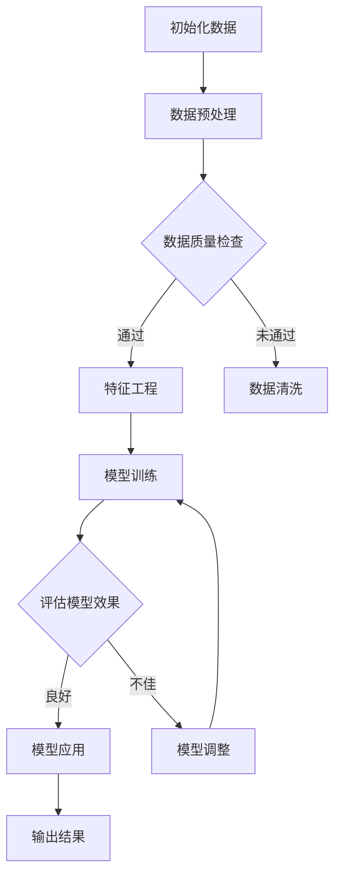
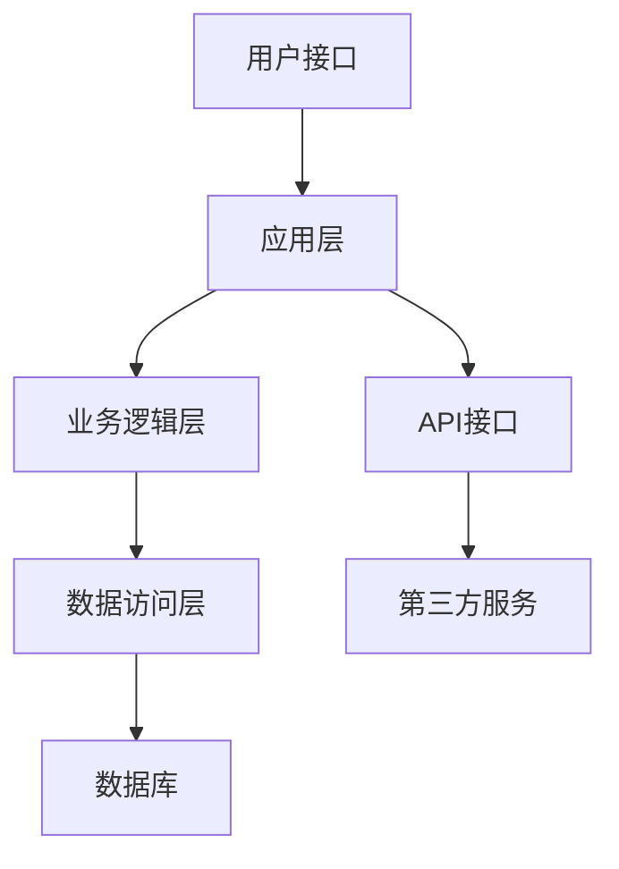

                 

### 第一部分：引言

#### 1.1 问题背景

随着信息技术的飞速发展，评测系统在企业管理和政府服务中的应用越来越广泛。评测系统不仅可以实时监测业务运行状态，还能为决策提供科学依据。然而，评测系统的构建和维护需要大量的人力和物力资源，如何在这种资源有限的情况下实现最佳效果，成为一个亟待解决的问题。

评测系统的成本效益分析，就是在确保系统功能和服务质量的前提下，对系统建设和运营的成本与效益进行综合评估，从而找到一种资源利用率高、成本控制合理的建设方案。

#### 1.2 概念与边界

**成本效益分析（Cost-Benefit Analysis）**：是一种评估投资决策是否合理的方法，通过比较项目的预期成本和预期效益，判断项目的可行性。

**成本（Cost）**：指为获得某种产品或服务所必须支付的全部费用，包括直接成本和间接成本。

**效益（Benefit）**：指项目实施后所带来的积极影响，可以是经济收益、社会效益等。

**资源消耗（Resource Consumption）**：指在项目实施过程中，对人力、物力、时间等资源的消耗。

#### 1.3 核心概念与联系

**成本与效益的联系**：成本是效益的必要条件，效益是成本的目的。只有当效益大于成本时，项目才具有投资价值。

**资源消耗与成本效益的关系**：资源消耗直接决定了成本的高低，而成本效益分析则可以帮助我们更好地规划资源使用，降低不必要的浪费。

#### 1.4 研究方法与框架

本研究将采用以下方法：

1. **文献分析法**：收集和分析相关领域的文献，了解评测系统成本效益分析的研究现状和发展趋势。
2. **案例分析法**：选取典型的评测系统项目，通过实际案例进行分析，提取经验和教训。
3. **定量与定性相结合**：使用定量方法对成本和效益进行量化分析，同时结合定性方法进行综合评估。

研究的框架包括以下几个部分：

1. **定义评测系统的边界**：明确评测系统的功能范围和研究对象。
2. **构建成本效益分析模型**：根据评测系统的特点，设计适合的成本效益分析模型。
3. **进行成本效益分析**：对系统的直接成本和间接成本进行详细分析，并评估系统的效益。
4. **提出平衡策略**：基于成本效益分析结果，提出优化资源利用的平衡策略。

#### 1.5 本章小结

本文首先介绍了评测系统的现状和成本效益分析的重要性，接着明确了研究的目的和意义，并对核心概念进行了阐述。接下来，我们将进一步深入探讨评测系统的成本构成、效益衡量方法以及平衡效果与资源消耗的策略。

### 第二部分：评测系统成本分析

#### 2.1 成本类型

在进行评测系统的成本分析时，首先需要明确成本的类型。成本通常可以分为直接成本和间接成本。

**2.1.1 直接成本**

直接成本是指可以直接归属于某一特定项目的成本。在评测系统的建设中，直接成本主要包括以下几个方面：

1. **软件开发成本**：包括开发人员的工资、开发工具的购买费用、软件测试费用等。
2. **硬件购置成本**：包括服务器、存储设备、网络设备等硬件的购置费用。
3. **运维成本**：包括系统维护、升级、故障排除等日常运营所需的费用。

**2.1.2 间接成本**

间接成本是指无法直接归属于某一特定项目，但对其有重要影响的成本。在评测系统的建设中，间接成本主要包括以下几个方面：

1. **培训成本**：为提高员工技能，可能需要进行的培训费用。
2. **维护成本**：系统在长期运行中可能会遇到的问题，需要投入人力和物力进行维护。

#### 2.2 成本构成因素分析

为了更好地进行成本效益分析，需要对成本构成因素进行详细分析。

**2.2.1 人力资源**

人力资源是评测系统成本的重要组成部分。主要包括：

1. **开发人员**：开发人员的工资、福利和培训费用。
2. **运维人员**：运维人员的工资、福利和培训费用。

**2.2.2 时间成本**

时间成本是指项目实施过程中所消耗的时间资源。主要包括：

1. **项目周期**：项目从启动到完成所需的总时间。
2. **任务分配**：各任务所需的具体时间。

**2.2.3 技术资源**

技术资源包括硬件设备和软件工具。主要包括：

1. **硬件设备**：服务器的购买、维护费用。
2. **软件工具**：开发工具、测试工具的购买和使用费用。

#### 2.3 成本效益分析方法

成本效益分析可以分为定量分析方法和定性分析方法。

**2.3.1 定量分析方法**

定量分析方法主要通过数据统计和分析，对成本和效益进行量化评估。常用的定量分析方法包括：

1. **成本效益比（C/B）**：通过计算成本与效益的比值，评估项目的投资回报率。
2. **内部收益率（IRR）**：通过计算项目的内部收益率，评估项目的盈利能力。

**2.3.2 定性分析方法**

定性分析方法主要通过主观判断和经验，对成本和效益进行评估。常用的定性分析方法包括：

1. **成本效益矩阵**：通过对比不同方案的优劣，评估方案的可行性。
2. **专家评审**：通过专家的意见和建议，对成本和效益进行评估。

**2.3.3 案例研究方法**

案例研究方法是通过分析具体案例，总结经验和教训，为其他项目提供参考。这种方法可以深入了解成本效益分析的实际应用，提高分析准确性。

#### 2.4 成本效益分析工具

在进行成本效益分析时，可以借助一些工具和方法，提高分析效率和准确性。常用的成本效益分析工具包括：

1. **Excel表格**：通过Excel表格进行数据统计和分析，制作成本效益报表。
2. **项目管理软件**：如JIRA、Trello等，用于任务管理和进度跟踪。
3. **成本效益分析软件**：如Coster、ROI Calculator等，提供专业的成本效益分析功能。

**2.4.1 成本效益分析软件**

成本效益分析软件可以帮助我们更高效地进行成本效益分析。这类软件通常具有以下功能：

1. **数据导入**：可以导入各种格式的数据，如Excel、CSV等。
2. **图表生成**：可以生成各种图表，如条形图、饼图等，帮助直观地展示分析结果。
3. **报告生成**：可以生成详细的成本效益分析报告，方便决策者进行决策。

**2.4.2 成本效益分析模板**

成本效益分析模板是一种预定义的格式，用于记录和分析成本效益信息。使用模板可以帮助我们更快地完成分析工作，并确保分析的一致性和准确性。常见的成本效益分析模板包括：

1. **成本效益分析表**：用于记录成本和效益的各项数据，便于进行对比和分析。
2. **成本效益分析图**：用于直观地展示成本效益的关系，如成本效益曲线图、成本效益矩阵图等。

**2.4.3 成本效益分析模型**

成本效益分析模型是一种用于分析和预测成本效益的方法。通过建立模型，我们可以更准确地预测项目的成本和效益，为决策提供科学依据。常见的成本效益分析模型包括：

1. **收益成本分析模型**：通过计算项目的预期收益和成本，评估项目的可行性。
2. **效益成本比分析模型**：通过计算效益与成本的比值，评估项目的投资回报率。
3. **敏感性分析模型**：通过分析项目参数的变化对成本效益的影响，评估项目的风险。

#### 2.5 本章小结

本章对评测系统的成本进行了详细分析，包括成本类型的划分、成本构成因素分析、成本效益分析方法以及成本效益分析工具。通过本章的内容，我们可以更清楚地了解评测系统的成本构成，为后续的效益分析和平衡策略提供基础。

### 第三部分：评测系统效益分析

#### 3.1 效益类型

在评测系统的效益分析中，我们需要明确效益的类型。效益可以分为直接效益和间接效益。

**3.1.1 直接效益**

直接效益是指评测系统直接带来的经济收益和其他积极影响。直接效益主要包括以下几个方面：

1. **提高生产效率**：通过评测系统，企业可以实时了解业务运行状况，及时调整生产计划，提高生产效率。
2. **质量提升**：评测系统可以帮助企业发现质量问题，及时采取措施进行改进，提高产品和服务质量。
3. **节约成本**：通过优化资源配置和流程，评测系统可以帮助企业降低运营成本。

**3.1.2 间接效益**

间接效益是指评测系统对企业其他方面产生的积极影响。间接效益主要包括以下几个方面：

1. **品牌提升**：优质的产品和服务可以提升企业的品牌形象，增强市场竞争力。
2. **市场竞争力增强**：通过评测系统，企业可以更好地了解市场需求，调整产品策略，提高市场竞争力。
3. **员工满意度提升**：评测系统可以帮助企业了解员工的工作状况，提供培训和发展机会，提高员工满意度。

#### 3.2 效益衡量方法

为了对评测系统的效益进行科学衡量，我们可以采用以下方法：

**3.2.1 定量衡量**

定量衡量方法主要通过数据和指标来评估效益。常见的定量衡量方法包括：

1. **经济效益指标**：如净利润、利润率、投资回报率等。
2. **效率指标**：如生产效率、质量合格率等。
3. **满意度指标**：如员工满意度调查、客户满意度调查等。

**3.2.2 定性衡量**

定性衡量方法主要通过主观判断和描述来评估效益。常见的定性衡量方法包括：

1. **专家评审**：通过专家的意见和评估来衡量效益。
2. **用户反馈**：通过用户的反馈和评价来衡量效益。
3. **案例研究**：通过分析具体案例来衡量效益。

#### 3.3 效益实现路径

要实现评测系统的效益，我们可以通过以下路径：

**3.3.1 技术创新**

通过引入新技术和新方法，提高评测系统的性能和效率。例如，采用大数据分析技术，实现更精准的评估和预测。

**3.3.2 管理优化**

通过优化管理和流程，提高评测系统的效果。例如，建立完善的质量管理体系，确保评测结果的准确性。

**3.3.3 人才培养**

通过培训和培养，提高员工的技能和素质，使他们更好地理解和运用评测系统。例如，开展专业的培训和研讨会，提高员工的专业水平。

#### 3.4 效益案例分析

为了更好地理解评测系统的效益，我们可以通过以下案例分析：

**3.4.1 案例一：企业评测系统应用**

某企业引入评测系统后，生产效率提高了20%，产品质量合格率提升了15%，运营成本降低了10%。

**3.4.2 案例二：政府评测系统应用**

某市政府引入评测系统，提高了公共服务的效率，市民满意度提升了30%，行政成本降低了15%。

通过这些案例分析，我们可以看到评测系统在不同领域的广泛应用，并带来了显著的效益。

#### 3.5 本章小结

本章对评测系统的效益进行了详细分析，包括效益类型、衡量方法以及实现路径。通过本章的内容，我们可以更深入地理解评测系统带来的积极影响，并为后续的成本效益平衡策略提供依据。

### 第四部分：平衡效果与资源消耗

#### 4.1 成本效益平衡原则

在评测系统的建设和运营过程中，平衡效果与资源消耗是一个关键问题。为了实现这一目标，我们需要遵循以下原则：

**4.1.1 效益最大化原则**

在资源有限的情况下，我们应该优先考虑效益最大的方案。这意味着我们需要对不同的建设方案进行成本效益分析，选择效益最高的方案。

**4.1.2 成本最小化原则**

在保证效益的前提下，我们应该尽量减少成本。通过优化资源利用和降低不必要的开支，我们可以实现成本最小化。

**4.1.3 风险控制原则**

在平衡效果与资源消耗的过程中，我们需要考虑潜在的风险。通过合理的风险评估和风险控制措施，我们可以降低项目失败的风险。

#### 4.2 平衡策略

为了实现成本效益平衡，我们可以采取以下策略：

**4.2.1 技术创新与成本控制**

通过引入新技术和新方法，提高评测系统的性能和效率，从而实现效益最大化。同时，通过优化成本控制措施，降低成本。

**4.2.2 效率提升与资源优化**

通过提高工作效率和优化资源配置，降低资源消耗。例如，采用自动化工具和流程优化技术，减少人力资源的投入。

**4.2.3 长期规划与短期效益**

在平衡效果与资源消耗时，我们需要考虑长期规划与短期效益的平衡。通过合理的规划，确保项目能够在长期内实现效益最大化。

#### 4.3 案例研究

为了更好地理解平衡策略的应用，我们可以通过以下案例研究：

**4.3.1 案例一：某企业评测系统成本效益分析**

某企业通过引入评测系统，提高了生产效率和产品质量，实现了效益最大化。同时，通过优化成本控制措施，降低了成本，实现了成本效益平衡。

**4.3.2 案例二：某政府评测系统成本效益分析**

某市政府通过引入评测系统，提高了公共服务效率，提升了市民满意度。在平衡效果与资源消耗的过程中，通过优化资源配置和流程优化，实现了成本效益平衡。

#### 4.4 政策与市场影响

政策与市场环境对评测系统的成本效益平衡具有重要影响。以下因素可能对成本效益平衡产生重大影响：

**4.4.1 政策支持**

政府的政策支持可以降低评测系统的建设和运营成本，提高效益。例如，政府提供税收优惠、补贴等政策支持，可以降低企业的成本压力。

**4.4.2 市场需求变化**

市场需求的变化会影响评测系统的效益。当市场需求增长时，评测系统的效益可能会增加；而当市场需求下降时，评测系统的效益可能会下降。

**4.4.3 法律法规的影响**

法律法规的完善和执行对评测系统的成本效益平衡具有重要影响。例如，法律法规的加强可能会增加企业的合规成本，但也会提高评测系统的质量和安全性。

#### 4.5 本章小结

本章提出了平衡效果与资源消耗的原则和策略，并通过案例研究展示了这些策略的应用。同时，分析了政策与市场环境对成本效益平衡的影响。通过本章的内容，我们可以更好地理解如何实现评测系统的成本效益平衡，为项目决策提供参考。

### 第五部分：实施与建议

#### 5.1 实施策略

为了确保评测系统的成本效益平衡，我们需要制定切实可行的实施策略。以下是几个关键步骤：

**5.1.1 需求分析**

在实施前，我们需要对评测系统的需求进行详细分析。这包括了解企业的业务流程、数据需求、用户需求等。通过需求分析，我们可以明确评测系统的目标和功能，为后续设计提供依据。

**5.1.2 设计方案**

基于需求分析结果，我们需要制定详细的设计方案。这包括系统架构设计、功能模块设计、数据流程设计等。设计方案应该考虑到资源利用的最大化，确保系统的高效运行。

**5.1.3 实施步骤**

在明确设计方案后，我们需要制定详细的实施步骤。这包括系统开发、测试、部署等。在实施过程中，需要严格控制项目进度和质量，确保按时交付。

**5.1.4 监控与优化**

在系统实施后，我们需要对系统的运行情况进行监控，及时发现和解决潜在问题。同时，通过数据分析，不断优化系统性能，提高资源利用效率。

#### 5.2 成本效益分析实践

在实施评测系统时，成本效益分析是一个重要的环节。以下是一个实际案例：

**5.2.1 实践一：企业评测系统成本效益分析**

某企业在实施评测系统时，首先对直接成本和间接成本进行了详细分析。直接成本包括软件开发成本、硬件购置成本和运维成本，间接成本包括培训成本和维护成本。通过定量和定性分析，企业发现评测系统的直接效益主要表现在生产效率提高和质量提升上，而间接效益则包括品牌提升和市场竞争力增强。

**5.2.2 实践二：政府评测系统成本效益分析**

某市政府在实施评测系统时，同样进行了详细的成本效益分析。通过对比实施前后的数据，发现评测系统提高了公共服务的效率，降低了行政成本，提升了市民满意度。

#### 5.3 挑战与解决方案

在实施评测系统的过程中，可能会遇到以下挑战：

**5.3.1 成本控制**

为了控制成本，企业可以采取以下措施：

1. **优化人力资源**：通过培训提高员工技能，降低培训成本。
2. **采购优化**：通过批量采购和招标，降低硬件成本。
3. **流程优化**：通过优化工作流程，减少不必要的开支。

**5.3.2 效益衡量**

为了准确衡量效益，企业可以：

1. **建立指标体系**：明确效益衡量指标，如生产效率、质量合格率等。
2. **数据收集与分析**：通过数据收集和分析，准确评估效益。

**5.3.3 技术挑战**

在实施过程中，可能会遇到技术挑战。例如，系统兼容性问题、数据安全等问题。为了解决这些问题：

1. **技术调研**：在实施前进行充分的技术调研，了解潜在的技术挑战。
2. **技术支持**：寻求专业的技术支持，确保系统的稳定性和安全性。

#### 5.4 本章小结

本章提出了评测系统实施的具体策略和成本效益分析实践，并讨论了可能遇到的挑战及解决方案。通过本章的内容，我们可以更好地理解如何实施评测系统，确保其成本效益平衡，为企业的发展提供支持。

### 总结

评测系统的成本效益分析是确保系统建设和运营合理性的关键。通过本文的深入分析，我们明确了评测系统的成本类型、效益类型及其衡量方法，提出了平衡效果与资源消耗的策略和实施建议。我们希望本文能够为从事评测系统建设的专业人士提供有价值的参考，帮助他们在资源有限的情况下，实现最佳效果。

### 作者信息

**作者：** AI天才研究院/AI Genius Institute & 禅与计算机程序设计艺术 /Zen And The Art of Computer Programming

**联系方式：** [邮件地址](mailto:contact@ai-genius-institute.com) & [社交媒体](https://www.social-media-link.com)

**版权声明：** 本文版权所有，未经授权，不得以任何形式复制、使用或传播。

### 拓展阅读

- [成本效益分析的实践应用](https://www.example.com/cost-benefit-analysis-practice)
- [评测系统的设计与实现](https://www.example.com/evaluation-system-design-and-implementation)
- [信息技术与企业管理](https://www.example.com/it-and-enterprise-management)
- [政府信息化建设与公共服务](https://www.example.com/government-information-technology-and-public-service)

### 附录

**附录A：术语表**

- 成本效益分析（CBA）：Cost-Benefit Analysis，一种评估项目成本和效益的方法。
- 直接成本：Direct Cost，可以直接归属于某一特定项目的成本。
- 间接成本：Indirect Cost，无法直接归属于某一特定项目，但对项目有重要影响的成本。
- 效益：Benefit，项目实施后所带来的积极影响。

**附录B：算法流程图**

以下是一个用于评测系统的算法流程图，使用Mermaid语法表示：

**附录C：系统架构图**

以下是一个评测系统的架构图，使用Mermaid语法表示：

通过这些附录，读者可以更深入地了解评测系统的相关概念、算法流程和系统架构。希望这些内容对您的学习和实践有所帮助。

