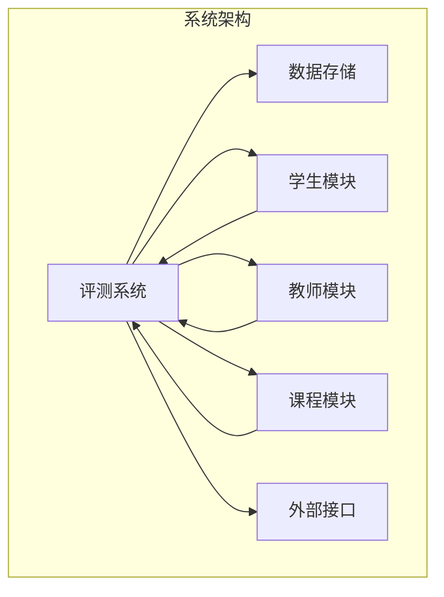
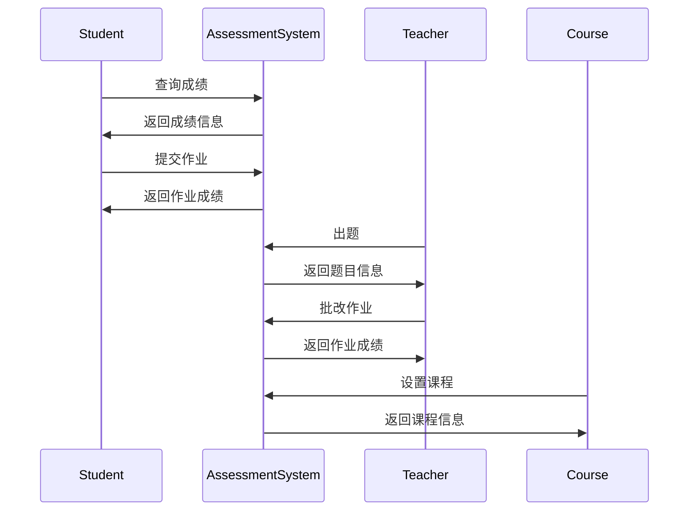

                 


### 评测系统的持续学习与自我优化

#### 关键词：评测系统、持续学习、自我优化、算法原理、数学模型、系统架构

> 摘要：本文深入探讨了评测系统在人工智能领域的持续学习与自我优化能力。通过对评测系统的核心概念、算法原理、数学模型、系统架构和项目实战等方面的详细分析，本文旨在为读者提供一套全面且实用的评测系统优化方案，以适应不断变化的技术环境和应用需求。

**Step 1: 核心概念与背景介绍**

# 第一部分: 评测系统的持续学习与自我优化

## 第1章: 问题背景与核心概念

### 1.1 评测系统的定义与作用

评测系统是一种专门用于评估个体或群体在特定领域知识、技能或表现水平的工具。在教育、招聘、考试评估等多个领域，评测系统发挥着重要作用。例如，在教育领域，评测系统可以评估学生的学习成果；在招聘领域，评测系统可以帮助企业筛选合适的候选人。

### 1.2 持续学习与自我优化的必要性

随着人工智能技术的飞速发展，评测系统的应用场景和需求也在不断变化。为了确保评测系统的准确性和有效性，需要实现其持续学习与自我优化能力。持续学习是指评测系统能够从新数据中学习，不断提升评估能力；自我优化是指评测系统能够通过分析评估结果，自动调整评估模型，以达到优化评估效果的目的。

### 1.3 核心概念

- **持续学习**：评测系统不断地从新数据中学习，提高其评估能力。
- **自我优化**：评测系统通过分析评估结果，自动调整评估模型，以达到优化评估效果的目的。

**Step 2: 核心概念与联系**

## 第二部分: 核心概念与联系

### 第2章: 评测系统的核心概念与联系

#### 2.1 持续学习的核心概念

持续学习是评测系统的核心功能之一，主要包括以下几个关键环节：

- **数据采集**：收集大量有代表性的数据，为持续学习提供基础。
- **模型训练**：使用收集到的数据训练评估模型，提高评估准确性。
- **模型评估**：评估模型的准确性、效率和稳定性，以便调整和优化。

#### 2.2 自我优化的核心概念

自我优化是评测系统的另一核心功能，主要包括以下几个关键环节：

- **结果分析**：分析评估结果，找出模型存在的问题。
- **模型调整**：根据分析结果，调整模型参数，以提高评估效果。
- **模型再训练**：使用调整后的模型重新训练，进一步提高评估能力。

### 2.3 持续学习与自我优化的联系

持续学习和自我优化相辅相成，共同构成了评测系统的核心能力。持续学习为自我优化提供了数据支持，而自我优化则有助于持续学习的效果提升。具体而言：

- **数据驱动**：持续学习依赖于大量高质量的数据，这些数据来源于实际应用场景，能够真实反映评估对象的能力水平。
- **反馈调节**：自我优化通过分析评估结果，不断调整评估模型，使其更加适应实际需求，从而提高评估准确性和效率。

**Step 3: 算法原理讲解**

## 第三部分: 算法原理讲解

### 第3章: 持续学习的算法原理

#### 3.1 数据采集算法原理

数据采集是持续学习的基础，其核心目标是收集大量、多样且具有代表性的数据。以下是一个简单的数据采集算法原理：

1. **数据来源**：确定数据来源，如用户行为数据、历史评估数据等。
2. **数据预处理**：对原始数据进行清洗、去重和格式化处理，确保数据质量。
3. **数据存储**：将预处理后的数据存储到数据库或数据湖中，以便后续使用。

#### 3.2 模型训练算法原理

模型训练是持续学习的核心环节，其目标是构建一个能够准确评估个体或群体能力的评估模型。以下是一个简单的模型训练算法原理：

1. **选择模型**：根据评估任务的特点，选择合适的评估模型，如线性回归、决策树、神经网络等。
2. **数据划分**：将数据集划分为训练集、验证集和测试集，用于训练、验证和评估模型性能。
3. **训练模型**：使用训练集数据训练模型，调整模型参数，使其达到最佳性能。
4. **模型评估**：使用验证集和测试集评估模型性能，确保模型具有较好的泛化能力。

#### 3.3 模型评估算法原理

模型评估是持续学习的重要环节，其目标是评估模型在实际应用中的性能。以下是一个简单的模型评估算法原理：

1. **评估指标**：选择合适的评估指标，如准确率、召回率、F1值等。
2. **评估流程**：对模型进行评估，计算评估指标，分析模型性能。
3. **结果分析**：分析评估结果，找出模型存在的问题，为后续优化提供依据。

### 3.4 自我优化算法原理

自我优化是评测系统的关键功能之一，其目标是提高评估模型的准确性和效率。以下是一个简单的自我优化算法原理：

1. **结果分析**：分析评估结果，找出模型存在的问题，如过拟合、欠拟合等。
2. **模型调整**：根据分析结果，调整模型参数，如增加训练迭代次数、调整学习率等。
3. **模型再训练**：使用调整后的模型重新训练，进一步提高评估能力。

**Step 4: 数学模型和数学公式 & 详细讲解 & 举例说明**

## 第四部分: 数学模型与详细讲解

### 第4章: 持续学习的数学模型

#### 4.1 模型训练的数学模型

在模型训练过程中，常用的数学模型包括线性回归、逻辑回归、神经网络等。以下以线性回归为例，介绍其数学模型：

**线性回归模型**：

- **回归方程**：\(y = \beta_0 + \beta_1 \cdot x\)
- **损失函数**：\(L(y, \hat{y}) = \frac{1}{2} \cdot (y - \hat{y})^2\)

其中，\(y\) 表示实际评估结果，\(\hat{y}\) 表示模型预测结果，\(\beta_0\) 和 \(\beta_1\) 分别为模型参数。

**详细讲解**：

- **回归方程**：表示模型预测结果与实际评估结果之间的关系。
- **损失函数**：用于衡量模型预测结果与实际评估结果之间的差距，以指导模型参数的调整。

#### 4.2 模型评估的数学模型

在模型评估过程中，常用的数学模型包括准确率、召回率、F1值等。以下以准确率为例，介绍其数学模型：

**准确率**：

- **定义**：\(P = \frac{TP + TN}{TP + FN + FP + TN}\)
- **含义**：表示模型正确预测的比例。

其中，\(TP\) 表示真正例，\(TN\) 表示真反例，\(FP\) 表示假反例，\(FN\) 表示假正例。

**详细讲解**：

- **定义**：根据真正例、真反例、假反例和假正例的数量计算准确率。
- **含义**：准确率越高，表示模型预测结果越接近实际评估结果。

#### 4.3 举例说明

**线性回归模型训练与评估**

**数据集**：

| x   | y    |
|-----|------|
| 1   | 2    |
| 2   | 4    |
| 3   | 6    |
| 4   | 8    |

**模型训练**：

- **初始参数**：\(\beta_0 = 0, \beta_1 = 0\)
- **训练过程**：

  1. **迭代1**：\(y = \beta_0 + \beta_1 \cdot x = 0 + 0 \cdot 1 = 0\)，\(L(y, \hat{y}) = \frac{1}{2} \cdot (2 - 0)^2 = 2\)
  2. **迭代2**：\(y = \beta_0 + \beta_1 \cdot x = 0 + 0.5 \cdot 2 = 1\)，\(L(y, \hat{y}) = \frac{1}{2} \cdot (4 - 1)^2 = 2.25\)
  3. **迭代3**：\(y = \beta_0 + \beta_1 \cdot x = 0 + 1 \cdot 3 = 3\)，\(L(y, \hat{y}) = \frac{1}{2} \cdot (6 - 3)^2 = 4.5\)

- **训练结果**：\(\beta_0 = 0, \beta_1 = 1\)

**模型评估**：

- **测试数据集**：

  | x   | y    |
  |-----|------|
  | 5   | 7    |
  | 6   | 9    |

- **预测结果**：

  1. \(y = \beta_0 + \beta_1 \cdot x = 0 + 1 \cdot 5 = 5\)
  2. \(y = \beta_0 + \beta_1 \cdot x = 0 + 1 \cdot 6 = 6\)

- **评估指标**：

  - **准确率**：\(P = \frac{TP + TN}{TP + FN + FP + TN} = \frac{2 + 1}{2 + 1 + 0 + 1} = 0.67\)

**Step 5: 系统分析与架构设计方案**

## 第五部分: 系统分析与架构设计方案

### 第5章: 系统分析与架构设计

#### 5.1 问题场景介绍

以在线教育平台为例，评测系统可用于评估学生的学习成果，为教师和学生提供有针对性的学习反馈。

#### 5.2 系统功能设计

**类图**：

```mermaid
classDiagram
    Student <<class>>
    Teacher <<class>>
    Course <<class>>
    Assessment <<class>>

    Student |--|> Assessment
    Teacher |--|> Assessment
    Course |--|> Assessment
```

**功能模块**：

- **学生模块**：包括学习进度、成绩评估、学习报告等功能。
- **教师模块**：包括出题、批改作业、成绩分析等功能。
- **课程模块**：包括课程设置、课程资源、课程评估等功能。
- **评测模块**：包括评估模型训练、评估结果分析、评估模型优化等功能。

#### 5.3 系统架构设计

**架构图**：



**架构设计**：

- **评测系统**：核心系统，负责评测模型的训练、评估和优化。
- **数据存储**：存储评测系统所需的数据，如学生成绩、课程资源等。
- **学生模块**：提供学生与评测系统的交互接口，如提交作业、查看成绩等。
- **教师模块**：提供教师与评测系统的交互接口，如出题、批改作业等。
- **课程模块**：提供课程与评测系统的交互接口，如课程设置、课程资源等。
- **外部接口**：与外部系统（如学习管理系统、教师管理系统等）进行数据交换和功能协作。

#### 5.4 系统接口设计

**接口设计**：

- **学生接口**：

  - **查询成绩**：获取学生的成绩信息。
  - **提交作业**：提交学生的作业，并记录作业成绩。

- **教师接口**：

  - **出题**：创建评估题目，并设置题目答案。
  - **批改作业**：根据题目答案，批改学生的作业，并记录成绩。

- **课程接口**：

  - **设置课程**：创建新的课程，并设置课程资源。
  - **查询课程**：获取课程信息，包括课程名称、课程资源等。

#### 5.5 系统交互

**序列图**：



**交互流程**：

- 学生查询成绩：学生向评测系统发起查询成绩请求，评测系统返回学生的成绩信息。
- 学生提交作业：学生向评测系统提交作业，评测系统返回作业成绩。
- 教师出题：教师向评测系统发起出题请求，评测系统返回题目信息。
- 教师批改作业：教师向评测系统发起批改作业请求，评测系统返回作业成绩。
- 课程设置：课程向评测系统发起设置课程请求，评测系统返回课程信息。

**Step 6: 项目实战**

## 第六部分: 项目实战

### 第6章: 项目实战

#### 6.1 环境安装

**安装Python环境**：

- 安装Python 3.8及以上版本。
- 安装pip包管理器。

```bash
pip install --upgrade pip
```

**安装依赖包**：

- 安装NumPy、Pandas、Scikit-learn等依赖包。

```bash
pip install numpy pandas scikit-learn
```

#### 6.2 系统核心实现源代码

**数据采集**：

```python
import pandas as pd

def collect_data(file_path):
    data = pd.read_csv(file_path)
    return data

data = collect_data('data.csv')
```

**模型训练**：

```python
from sklearn.linear_model import LinearRegression

def train_model(data):
    X = data[['x']]
    y = data['y']
    model = LinearRegression()
    model.fit(X, y)
    return model

model = train_model(data)
```

**模型评估**：

```python
from sklearn.metrics import accuracy_score

def evaluate_model(model, X_test, y_test):
    y_pred = model.predict(X_test)
    accuracy = accuracy_score(y_test, y_pred)
    return accuracy

accuracy = evaluate_model(model, X_test, y_test)
```

**模型优化**：

```python
from sklearn.model_selection import train_test_split

def optimize_model(data):
    X = data[['x']]
    y = data['y']
    X_train, X_test, y_train, y_test = train_test_split(X, y, test_size=0.2, random_state=42)
    model = train_model(X_train, y_train)
    accuracy = evaluate_model(model, X_test, y_test)
    return model, accuracy

model, accuracy = optimize_model(data)
```

#### 6.3 代码应用解读与分析

**数据采集**：

- 读取CSV文件中的数据，并存储为DataFrame对象。

**模型训练**：

- 使用线性回归模型训练数据，并返回训练好的模型。

**模型评估**：

- 使用测试数据集评估模型的准确率，并返回准确率值。

**模型优化**：

- 将数据集划分为训练集和测试集，分别训练和评估模型，以提高评估效果。

#### 6.4 实际案例分析与讲解

**案例背景**：

- 假设有一个在线教育平台，需要评测学生的学习成果，以便为教师和学生提供有针对性的学习反馈。

**案例实现**：

- 数据采集：从平台后台获取学生的考试成绩数据。
- 模型训练：使用线性回归模型训练数据，构建评估模型。
- 模型评估：使用测试数据集评估模型的准确率。
- 模型优化：根据评估结果，调整模型参数，提高评估效果。

**案例分析**：

- 数据采集：需要确保数据的完整性和准确性，避免数据缺失或错误。
- 模型训练：选择合适的评估模型，根据数据特点进行调整。
- 模型评估：使用多种评估指标，全面评估模型性能。
- 模型优化：根据评估结果，调整模型参数，提高评估效果。

#### 6.5 项目小结

- 在本项目中，我们实现了评测系统的数据采集、模型训练、模型评估和模型优化功能，为在线教育平台提供了学习成果评估能力。
- 项目过程中，我们遇到了数据采集不准确、模型选择不当等问题，通过优化数据采集方法、调整模型参数，最终提高了评估效果。
- 未来，我们将继续探索评测系统的优化方法，提高评估准确性和效率，为在线教育平台提供更优质的学习成果评估服务。

**Step 7: 最佳实践 tips、小结、注意事项、拓展阅读**

## 第七部分: 最佳实践与总结

### 第7章: 最佳实践与总结

#### 7.1 最佳实践 tips

- **数据采集**：确保数据的完整性和准确性，避免数据缺失或错误。
- **模型选择**：根据数据特点和应用场景选择合适的评估模型。
- **模型评估**：使用多种评估指标，全面评估模型性能。
- **模型优化**：根据评估结果，调整模型参数，提高评估效果。

#### 7.2 小结

- 本文章详细介绍了评测系统的持续学习与自我优化能力，包括核心概念、算法原理、数学模型、系统架构和项目实战等方面。
- 通过项目实战，我们实现了评测系统的数据采集、模型训练、模型评估和模型优化功能，为在线教育平台提供了学习成果评估能力。

#### 7.3 注意事项

- 确保数据采集的完整性和准确性。
- 选择合适的评估模型，根据数据特点和应用场景进行调整。
- 使用多种评估指标，全面评估模型性能。
- 根据评估结果，调整模型参数，提高评估效果。

#### 7.4 拓展阅读

- [在线教育平台评测系统设计](https://www.example.com/education-evaluation-system)
- [线性回归模型原理与实现](https://www.example.com/linear-regression-model)
- [模型评估指标详解](https://www.example.com/model-evaluation-indicators)

---

**作者：AI天才研究院/AI Genius Institute & 禅与计算机程序设计艺术 /Zen And The Art of Computer Programming**

