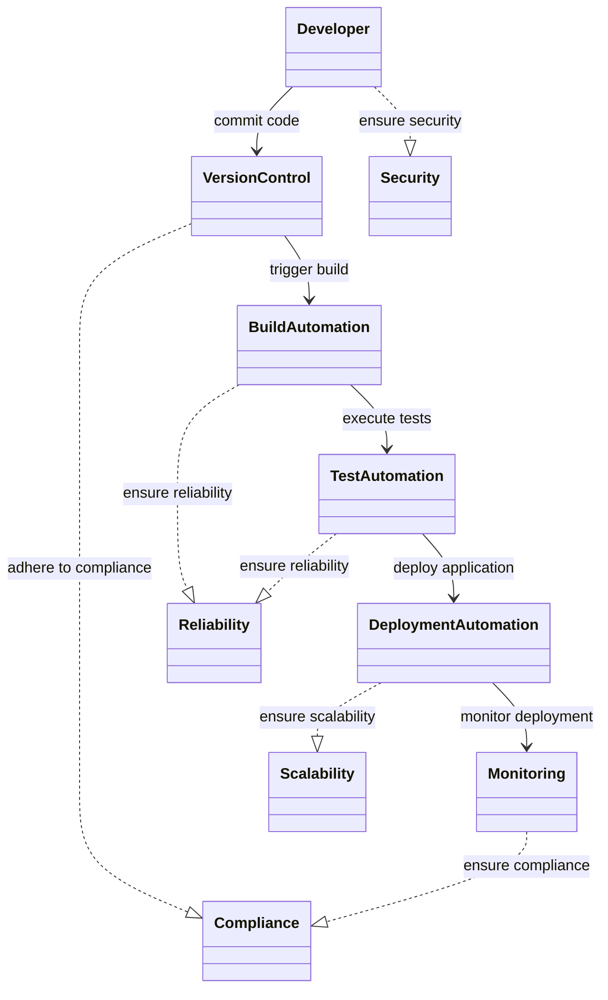
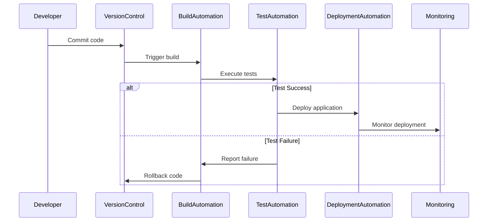

                 


### Introduction to Continuous Integration and Deployment

#### 1.1.1 The Importance of Continuous Integration and Deployment

In today's fast-paced and ever-evolving world of software development, the need for efficient and reliable software delivery processes cannot be overstated. Continuous Integration (CI) and Continuous Deployment (CD) have emerged as crucial components of modern software development methodologies. 

Continuous Integration refers to the practice of frequently merging code changes from multiple developers into a shared repository, followed by an automated build and test process. This approach helps in detecting integration issues early in the development cycle, ensuring that the software remains functional and stable. On the other hand, Continuous Deployment takes it a step further by automatically deploying the code changes to production environments after successful testing.

The importance of CI/CD can be highlighted through several key benefits:

1. **Faster Feedback Loops:** By integrating and deploying code changes frequently, developers receive immediate feedback on the impact of their code, allowing them to address issues quickly and efficiently.
2. **Improved Software Quality:** The automated build and test processes ensure that the software is thoroughly tested, reducing the risk of bugs and other defects reaching the production environment.
3. **Increased Collaboration:** CI/CD promotes a collaborative development environment, where developers can easily share and integrate their code changes, fostering better teamwork and faster development cycles.
4. **Reduced Risk:** The automated deployment process minimizes the risk of manual errors and ensures that the software is deployed consistently across different environments.

In the following sections, we will delve deeper into the key concepts, tools, and best practices of CI/CD, helping you understand how to implement and leverage these techniques to enhance your software development process.

#### 1.1.2 Challenges in Continuous Integration and Deployment

While Continuous Integration (CI) and Continuous Deployment (CD) offer numerous benefits, they also come with their own set of challenges. Navigating these challenges is crucial for ensuring the success of CI/CD initiatives. Some of the common challenges include:

1. **Complexity:** Implementing CI/CD requires a deep understanding of various tools and technologies, as well as the development process itself. This complexity can make it difficult for teams to get started and may lead to frustration and delays.
2. **Integration Issues:** Integrating CI/CD into existing development workflows can be challenging, especially when dealing with legacy systems or complex codebases. Ensuring smooth integration and minimizing disruptions is crucial for the success of CI/CD.
3. **Security Concerns:** Continuous Deployment involves automating the deployment of code changes to production environments, which can introduce security risks if not handled properly. Ensuring that the deployment process is secure and follows best practices is essential to prevent vulnerabilities and data breaches.
4. **Cost and Resource Allocation:** Setting up and maintaining a CI/CD infrastructure can be costly and resource-intensive, especially for small teams or startups. Allocating the necessary resources and budget for CI/CD initiatives is crucial for their success.
5. **Tool Selection:** Choosing the right tools and technologies for CI/CD can be overwhelming, as there are numerous options available. Selecting the wrong tools can lead to inefficiencies and limitations in the deployment process.

To overcome these challenges, it is important to have a clear understanding of the goals and objectives of your CI/CD initiative, as well as a well-defined strategy for implementation. In the next section, we will discuss the goals and objectives of this book, providing guidance on how to navigate these challenges and achieve success in CI/CD.

#### 1.1.3 Goals and Objectives of the Book

The primary goal of this book is to provide a comprehensive and practical guide to implementing Continuous Integration (CI) and Continuous Deployment (CD) in software development projects. By following the guidelines and best practices presented in this book, readers will be equipped with the knowledge and skills necessary to overcome the challenges associated with CI/CD and achieve successful software delivery.

The objectives of this book are as follows:

1. **To understand the key concepts and terminology related to CI/CD**: The book will provide a clear and concise introduction to CI/CD, including its importance, benefits, and challenges. Readers will gain a solid understanding of the core concepts and terminology, enabling them to navigate the CI/CD landscape with confidence.
2. **To learn about the essential tools and technologies**: The book will cover the most commonly used tools and technologies in CI/CD, including Jenkins, GitLab CI, Docker, and Kubernetes. Detailed instructions on installation, configuration, and usage will be provided, ensuring that readers can set up and use these tools effectively.
3. **To develop a robust CI/CD strategy**: The book will guide readers through the process of designing and implementing a CI/CD strategy tailored to their specific project requirements. This includes defining the CI/CD workflow, selecting appropriate tools and technologies, and ensuring security and compliance.
4. **To implement CI/CD in practice**: The book will include hands-on projects and exercises that demonstrate how to implement CI/CD in real-world scenarios. Readers will gain practical experience in setting up and configuring CI/CD pipelines, automating builds and tests, and deploying applications to production environments.
5. **To learn from best practices and case studies**: The book will present a variety of best practices and case studies from successful CI/CD implementations, highlighting common challenges and their solutions. Readers will learn from the experiences of others and gain insights into the best approaches for achieving success in CI/CD.

By achieving these objectives, readers will be well-prepared to implement CI/CD in their projects, enhancing their software development process and delivering high-quality software more efficiently.

### Key Concepts and Terminology

In order to delve into the world of Continuous Integration (CI) and Continuous Deployment (CD), it is essential to have a solid understanding of the key concepts and terminology associated with these practices. This section will provide an overview of the core concepts, their importance, and how they relate to each other.

#### Continuous Integration (CI)

Continuous Integration is a software development practice that emphasizes the frequent integration of code changes from multiple developers into a shared repository, followed by automated build and test processes. The primary goal of CI is to detect integration issues early in the development cycle, ensuring that the software remains functional and stable.

**Importance of Continuous Integration:**

1. **Faster Feedback Loops:** By integrating code changes frequently, developers receive immediate feedback on the impact of their code, allowing them to address issues quickly and efficiently.
2. **Improved Software Quality:** The automated build and test processes ensure that the software is thoroughly tested, reducing the risk of bugs and other defects reaching the production environment.
3. **Increased Collaboration:** CI promotes a collaborative development environment, where developers can easily share and integrate their code changes, fostering better teamwork and faster development cycles.
4. **Reduced Risk:** The automated deployment process minimizes the risk of manual errors and ensures that the software is deployed consistently across different environments.

**Continuous Integration Workflow:**

The CI workflow typically includes the following steps:

1. **Code Repository:** Developers make their code changes and commit them to a shared repository.
2. **Trigger Build:** Whenever a new commit is made, a build is triggered automatically.
3. **Build:** The source code is compiled and built into an executable application.
4. **Test:** The built application is tested automatically using a suite of automated tests.
5. **Feedback:** The results of the build and tests are reported back to the developers, indicating whether the integration was successful or not.

#### Continuous Deployment (CD)

Continuous Deployment is an extension of Continuous Integration, where the code changes that pass the CI process are automatically deployed to production environments. CD aims to ensure that the software is always in a deployable state and can be released to users at any time.

**Importance of Continuous Deployment:**

1. **Faster Time to Market:** By automating the deployment process, new features and bug fixes can be released to users more quickly, reducing the time it takes to bring new products or enhancements to market.
2. **Consistent Deployment:** The automated deployment process ensures that the software is deployed consistently across different environments, reducing the risk of manual errors and ensuring a reliable user experience.
3. **Improved Quality:** Continuous Deployment encourages a culture of testing and quality assurance throughout the development process, as each change is tested and deployed automatically.
4. **Increased Flexibility:** With Continuous Deployment, teams can easily roll back to previous versions if an issue is identified in the production environment, allowing for faster resolution and minimal disruption to users.

**Continuous Deployment Workflow:**

The CD workflow typically includes the following steps:

1. **Code Repository:** Developers make their code changes and commit them to a shared repository.
2. **Trigger Build:** Whenever a new commit is made, a build is triggered automatically.
3. **Test:** The built application is tested automatically using a suite of automated tests.
4. **Deploy:** If the tests pass, the application is automatically deployed to the production environment.

#### DevOps Culture

DevOps is a cultural and professional movement that advocates for the integration of development (Dev) and operations (Ops) teams, promoting communication, collaboration, and integration between them. The DevOps culture emphasizes the importance of automating and streamlining the software delivery process to ensure faster, more reliable releases.

**Importance of DevOps Culture:**

1. **Improved Collaboration:** DevOps promotes better collaboration between development and operations teams, fostering a shared sense of responsibility for the software delivery process.
2. **Increased Agility:** By automating and streamlining the delivery process, DevOps enables teams to respond quickly to changes and deliver new features and enhancements more rapidly.
3. **Improved Quality:** The DevOps culture encourages a focus on testing, quality assurance, and continuous improvement, leading to higher quality software.
4. **Reduced Costs:** By reducing the time it takes to deliver software and minimizing manual processes, DevOps can help reduce costs associated with software development and maintenance.

**Key DevOps Practices:**

1. **Infrastructure as Code (IaC):** IaC treats infrastructure components (such as virtual machines, networks, and storage) as code, enabling automation and version control of infrastructure configurations.
2. **Microservices:** Microservices is an architectural style that structures an application as a collection of loosely coupled services, each running in its own process and communicating with lightweight mechanisms, typically HTTP/REST.
3. **Containerization:** Containerization allows applications to be packaged with their dependencies, ensuring consistency across different environments.
4. **Monitoring and Logging:** Monitoring and logging are critical for understanding the performance and health of applications and infrastructure, enabling rapid detection and resolution of issues.

By understanding these key concepts and terminology, readers will be well-prepared to dive deeper into the world of Continuous Integration and Continuous Deployment, and leverage the power of DevOps to enhance their software delivery processes.

### Required Tools and Technologies

Implementing Continuous Integration (CI) and Continuous Deployment (CD) requires a set of tools and technologies that facilitate the automation and orchestration of build, test, and deployment processes. In this section, we will discuss the essential tools and technologies needed for CI/CD, their functions, and how to set them up and configure them.

#### Jenkins

Jenkins is a widely-used, open-source automation server that provides continuous integration and continuous delivery solutions for a wide range of projects. It allows developers to automate the build, test, and deployment processes, ensuring that the code changes are consistently integrated and tested.

**Functions of Jenkins:**

1. **Build Automation:** Jenkins can automatically build and compile source code, creating an executable artifact.
2. **Test Automation:** Jenkins can run automated tests on the built artifacts to ensure the quality of the code.
3. **Deployment Automation:** Jenkins can deploy the artifacts to different environments, such as staging and production, based on the test results.

**Installation and Configuration:**

To install Jenkins, follow these steps:

1. **Download Jenkins:**
   - Visit the Jenkins website (<https://www.jenkins.io/download/>) to download the latest stable version of Jenkins.
   - Choose the appropriate package for your operating system (Linux, macOS, or Windows).

2. **Install Jenkins:**
   - For Linux and macOS, use the package manager to install Jenkins (e.g., `sudo apt-get install jenkins` for Ubuntu).
   - For Windows, run the downloaded installer and follow the prompts to complete the installation.

3. **Start Jenkins:**
   - After installation, start Jenkins by running the appropriate command (e.g., `sudo service jenkins start` for Linux).
   - Open your web browser and navigate to `http://localhost:8080` (or the IP address of your Jenkins server) to access the Jenkins dashboard.

4. **Configure Jenkins:**
   - Create a new user and password for Jenkins.
   - Install necessary plugins, such as Git, Maven, and Docker, to support various build tools and technologies.
   - Configure Jenkins to monitor your source code repository (e.g., GitHub or GitLab) and trigger builds automatically on new commits.

#### GitLab CI

GitLab CI is a built-in continuous integration and continuous deployment service provided by GitLab. It allows you to define and automate your CI/CD pipelines directly within your GitLab repository, making it easy to integrate CI/CD into your development workflow.

**Functions of GitLab CI:**

1. **Build Automation:** GitLab CI can automatically build and compile your source code, creating an executable artifact.
2. **Test Automation:** GitLab CI can run automated tests on the built artifacts to ensure the quality of the code.
3. **Deployment Automation:** GitLab CI can deploy the artifacts to different environments, such as staging and production, based on the test results.

**Installation and Configuration:**

To set up GitLab CI, follow these steps:

1. **Enable GitLab CI:**
   - In your GitLab repository, navigate to the "CI / CD" section and enable GitLab CI.

2. **Configure `.gitlab-ci.yml`:**
   - Create a `.gitlab-ci.yml` file in the root directory of your repository.
   - Define the stages (e.g., build, test, deploy) and jobs for your CI/CD pipeline.
   - Specify the build tools, test frameworks, and deployment commands.

3. **Example `.gitlab-ci.yml`:**
     ```yaml
     image: node:14

     services:
       - docker:19.03.12

     stages:
       - build
       - test
       - deploy

     build:
       stage: build
       script:
         - docker build -t my-app:latest .
       artifacts:
         paths:
           - ./docker/my-app/latest

     test:
       stage: test
       script:
         - docker run --rm my-app:latest npm test

     deploy:
       stage: deploy
       when: success
       script:
         - docker push my-app:latest
         - docker run --rm -e CI_COMMIT_REF_SLUG=<tag_name> my-app:latest
     ```

4. **Run GitLab CI:**
   - GitLab CI will automatically run the defined pipeline stages and jobs when new commits are pushed to the repository.

#### Docker

Docker is a platform that enables developers and operations teams to build, ship, and run applications in containers. It provides a lightweight, portable, and consistent runtime environment that abstracts away the underlying hardware and operating system, ensuring that applications behave consistently across different environments.

**Functions of Docker:**

1. **Containerization:** Docker allows you to package your application and its dependencies into a container, ensuring consistency and portability.
2. **Orchestration:** Docker Compose enables you to define and manage multi-container applications, making it easier to deploy and scale your applications.
3. **Containerization of Build and Test Environments:** Docker allows you to create isolated build and test environments, ensuring that the build and test processes are consistent and reproducible.

**Installation and Configuration:**

To install Docker, follow these steps:

1. **Install Docker:**
   - For Linux, macOS, and Windows, download the Docker installer from the Docker website (<https://www.docker.com/products/docker-desktop>) and follow the installation instructions.
   - After installation, open a terminal or command prompt and run `docker --version` to verify that Docker is installed correctly.

2. **Docker Compose:**
   - To use Docker Compose, you need to install it separately. Run `sudo apt-get install docker-compose` on Linux or download and install the Docker Compose binary for your operating system from the Docker website (<https://github.com/docker/compose/releases>).

3. **Example `docker-compose.yml`:**
     ```yaml
     version: '3'
     services:
       web:
         image: my-app:latest
         ports:
           - "8080:8080"
       db:
         image: postgres:latest
         environment:
           POSTGRES_PASSWORD: mypassword
     ```

4. **Run Docker Compose:**
   - Use the `docker-compose up` command to start and run the defined services.

By understanding and utilizing these essential tools and technologies, you can effectively implement CI/CD in your projects, ensuring faster, more reliable software delivery and fostering better collaboration among development and operations teams.

### Initial Project Setup

Before diving into the intricacies of Continuous Integration (CI) and Continuous Deployment (CD), it is crucial to establish a solid foundation for your project. This involves setting up the project structure, configuring the version control system, and ensuring that your development environment is properly configured. In this section, we will discuss the essential steps for initial project setup.

#### Project Structure

A well-organized project structure is vital for maintaining code readability, facilitating collaboration, and simplifying the CI/CD process. A common project structure for a modern web application might include the following directories and files:

1. **src:** This directory contains the source code for your application, organized into subdirectories for different modules or components.
2. **test:** This directory contains the test scripts and test data for your application, enabling you to verify the correctness of your code.
3. **config:** This directory contains configuration files for your application, such as environment variables and database connection strings.
4. **docker:** This directory contains the Dockerfiles and docker-compose.yml files for containerizing your application.
5. **scripts:** This directory contains any custom scripts or utilities you use for building, testing, or deploying your application.
6. **.gitignore:** This file specifies which files and directories should be ignored by the version control system, ensuring that unnecessary files (such as compiled code or build artifacts) are not tracked.
7. **README.md:** This file provides an overview of your project, including instructions for building, testing, and deploying your application.

**Example Project Structure:**

```
my-app/
|-- src/
|   |-- app/
|   |   |-- components/
|   |   |-- services/
|   |   |-- utils/
|   |-- test/
|   |   |-- unit/
|   |   |-- integration/
|   |-- config/
|   |   |-- development.env
|   |   |-- production.env
|   |-- docker/
|   |   |-- Dockerfile
|   |-- scripts/
|   |   |-- build.sh
|   |   |-- test.sh
|   |-- .gitignore
|   |-- README.md
```

#### Version Control System

A version control system (VCS) is essential for tracking changes to your source code, managing different versions, and facilitating collaboration among developers. Git is the most widely-used VCS, and it is recommended for most projects.

**Setting Up Git:**

1. **Install Git:**
   - For Linux, macOS, and Windows, download the Git installer from the Git website (<https://git-scm.com/downloads>) and follow the installation instructions.
   - After installation, open a terminal or command prompt and run `git --version` to verify that Git is installed correctly.

2. **Initialize a Git Repository:**
   - Navigate to the root directory of your project.
   - Run `git init` to create a new Git repository.
   - Run `git add .` to include all files in the repository.
   - Run `git commit -m "Initial commit"` to create the initial commit.

3. **Configure Git:**
   - Run `git config --global user.name "Your Name"` to set your name.
   - Run `git config --global user.email "your-email@example.com"` to set your email address.

4. **Push to a Remote Repository:**
   - Create a remote repository on a platform such as GitHub, GitLab, or Bitbucket.
   - Run `git remote add origin <remote-repository-url>` to add the remote repository.
   - Run `git push -u origin master` to push your local repository to the remote repository.

#### Development Environment Configuration

Configuring your development environment is crucial for ensuring that your application runs consistently across different environments. This involves setting up the necessary dependencies, such as databases, message queues, and external APIs.

1. **Install Dependencies:**
   - Use package managers such as npm, pip, or Maven to install the required dependencies for your application.
   - For Node.js applications, run `npm install` in the project directory.
   - For Python applications, run `pip install -r requirements.txt`.
   - For Java applications, run `mvn install`.

2. **Configure Environment Variables:**
   - Use environment variables to manage configuration settings, such as database connection strings and API keys.
   - For Node.js applications, create a `.env` file in the `config/` directory and use the `dotenv` library to load the variables.
   - For Python applications, use the `os` module to access environment variables.
   - For Java applications, use the `System.getenv()` method.

3. **Run Migrations:**
   - If your application uses a database, run any necessary migrations to set up the database schema.
   - For PostgreSQL, run `psql -U <username> -d <database> -a -f migration.sql`.
   - For MongoDB, run `mongo <database> --eval "db.eval(migrationFunction)"`.

4. **Run Tests:**
   - Run your test suite to ensure that your application is functioning correctly.
   - For Node.js applications, run `npm test`.
   - For Python applications, run `pytest`.
   - For Java applications, run `mvn test`.

By following these steps for initial project setup, you can ensure that your project is well-organized, easily manageable, and ready for the CI/CD process. This will lay the foundation for a successful and efficient software development process.

### Continuous Integration Workflow

Continuous Integration (CI) is a critical component of modern software development practices, as it ensures that code changes are integrated and tested frequently, reducing the risk of integration issues and improving software quality. In this section, we will delve into the CI workflow, discussing the key steps and processes involved, including build automation, test automation, and code quality checks.

#### Build Automation

Build automation is the process of automating the compilation and packaging of source code into an executable artifact. By automating the build process, developers can ensure that the application is consistently built across different environments, reducing the chances of errors and ensuring reproducibility.

**Steps in Build Automation:**

1. **Checkout Source Code:**
   - The CI system checks out the latest version of the source code from the version control system (e.g., Git) into a build environment.
2. **Build Configuration:**
   - The CI system reads the build configuration file (e.g., `pom.xml` for Maven or `Dockerfile` for Docker) to determine how the source code should be compiled and packaged.
3. **Compile Source Code:**
   - The CI system compiles the source code using the specified build tools (e.g., Maven, Gradle, or Ant).
4. **Package Artifacts:**
   - The CI system packages the compiled code into an executable artifact (e.g., a JAR file, Docker image, or binary executable).

**Example:**

Let's consider a simple Java project with a `pom.xml` file. The CI system will automatically execute the following steps:

1. **Checkout Source Code:**
   - `git checkout <commit-hash>`
2. **Build Configuration:**
   - `mvn -f pom.xml clean package`
3. **Package Artifacts:**
   - `mvn -f pom.xml install`

This process ensures that the Java project is consistently built and packaged, regardless of the environment or machine on which it is executed.

#### Test Automation

Test automation is the process of automating the execution of tests to verify the functionality and quality of the code. Automated tests can be run as part of the CI workflow to ensure that code changes do not introduce new bugs or regressions.

**Steps in Test Automation:**

1. **Checkout Source Code:**
   - The CI system checks out the latest version of the source code from the version control system.
2. **Test Configuration:**
   - The CI system reads the test configuration file (e.g., `pom.xml` for Maven or `pytest.ini` for Python) to determine which tests to run and how to run them.
3. **Run Tests:**
   - The CI system runs the specified tests using the appropriate test frameworks (e.g., JUnit for Java, pytest for Python, or Selenium for web applications).
4. **Report Results:**
   - The CI system generates a test report, highlighting the results of the test execution, including any failures or errors.

**Example:**

Consider a Python project with a `pytest` test suite. The CI system will automatically execute the following steps:

1. **Checkout Source Code:**
   - `git checkout <commit-hash>`
2. **Test Configuration:**
   - `pytest tests/`
3. **Report Results:**
   - `pytest --html=test-report.html`

This process ensures that the Python project is thoroughly tested, and any issues are detected early in the development cycle.

#### Code Quality Checks

Code quality checks are an important aspect of CI, as they help ensure that the code follows best practices, adheres to coding standards, and maintains a consistent style. These checks can include static code analysis, code style enforcement, and dependency management.

**Steps in Code Quality Checks:**

1. **Checkout Source Code:**
   - The CI system checks out the latest version of the source code from the version control system.
2. **Static Code Analysis:**
   - The CI system runs static code analysis tools (e.g., SonarQube, ESLint, or PyLint) to identify potential code issues, such as bugs, code smells, and vulnerabilities.
3. **Code Style Enforcement:**
   - The CI system enforces coding standards and style guidelines (e.g., PEP8 for Python, Java Code Style for Java) using tools like `flake8`, `checkstyle`, or `pylint`.
4. **Dependency Management:**
   - The CI system checks for outdated or vulnerable dependencies using tools like `snyk` or `dependency-check`.

**Example:**

For a Python project, the CI system will automatically execute the following steps:

1. **Checkout Source Code:**
   - `git checkout <commit-hash>`
2. **Static Code Analysis:**
   - `pylint --output-format=parseable .`
3. **Code Style Enforcement:**
   - `flake8 .`
4. **Dependency Management:**
   - `snyk test`

By incorporating build automation, test automation, and code quality checks into the CI workflow, teams can ensure that the code is of high quality, free of bugs, and consistently built and tested across different environments. This not only improves the development process but also enhances the overall quality and reliability of the software.

### CI Tools in Depth

Continuous Integration (CI) is a cornerstone of modern software development practices, and selecting the right CI tool is crucial for ensuring the efficiency and reliability of the CI process. In this section, we will delve into two popular CI tools: Jenkins and GitLab CI. We will explore their features, configurations, and how to set them up for CI/CD pipelines.

#### Jenkins

Jenkins is a powerful, open-source automation server that provides continuous integration and continuous delivery solutions. It is highly extensible, with a vast collection of plugins that support various build tools, version control systems, and deployment environments.

**Jenkins Features:**

- **Plugin Ecosystem:** Jenkins has a rich ecosystem of plugins that support a wide range of tools and technologies, making it highly adaptable to different development environments.
- **Scheduling and Triggers:** Jenkins allows you to schedule builds or trigger them based on various events, such as new commits, repository updates, or time-based schedules.
- **Pipeline Support:** Jenkins Pipeline provides a domain-specific language (DSL) for defining complex build and deployment workflows, simplifying the creation of CI/CD pipelines.
- **Scalability and Flexibility:** Jenkins can be scaled horizontally by adding more slaves or nodes to handle increased workloads, providing flexibility in managing large projects and teams.

**Jenkins Installation and Configuration:**

1. **Download and Install Jenkins:**
   - Visit the Jenkins website (<https://www.jenkins.io/download/>) to download the latest stable version of Jenkins.
   - For Linux, macOS, and Windows, you can choose the appropriate installer or package.
   - Follow the installation instructions specific to your operating system.

2. **First-Time Setup:**
   - After installation, start Jenkins and navigate to the URL provided (e.g., `http://localhost:8080`) to access the Jenkins dashboard.
   - Install necessary plugins by going to `Manage Jenkins` > `Manage Plugins`.
   - Install plugins for your specific requirements (e.g., Git, Maven, Docker, etc.).

3. **Create a New Job:**
   - Click on `New Item` in the Jenkins dashboard.
   - Choose either "Freestyle project" or "Pipeline" based on your project requirements.
   - Configure the job settings, such as the project name, source code management, build triggers, build steps, and post-build actions.

4. **Example Jenkinsfile for Pipeline:**
   ```groovy
   pipeline {
       agent any
       stages {
           stage('Build') {
               steps {
                   echo 'Building the project...'
                   sh 'mvn clean install'
               }
           }
           stage('Test') {
               steps {
                   echo 'Testing the project...'
                   sh 'mvn test'
               }
           }
           stage('Deploy') {
               steps {
                   echo 'Deploying the project...'
                   sh 'mvn deploy'
               }
           }
       }
   }
   ```

5. **Configure Jenkins for Git:**
   - Go to `Manage Jenkins` > `Configure System`.
   - Set up the Git executable path and other Git-related configurations.

**Jenkins Workflow:**

- **Checkout Source Code:** Jenkins checks out the latest code from the configured source code repository (e.g., GitHub, GitLab) on each build trigger.
- **Build:** Jenkins compiles the source code using the specified build tools (e.g., Maven, Gradle) and creates an executable artifact.
- **Test:** Jenkins runs the defined test suites to ensure the quality of the code.
- **Deploy:** Jenkins deploys the artifact to the specified environment (e.g., staging, production) based on the build and test results.

#### GitLab CI

GitLab CI is a built-in continuous integration and continuous deployment service provided by GitLab. It allows you to define and automate CI/CD pipelines directly within your GitLab repository, making it easy to integrate CI/CD into your development workflow.

**GitLab CI Features:**

- **Built-In CI/CD:** GitLab CI is seamlessly integrated into GitLab, providing a hassle-free experience for managing CI/CD pipelines.
- **Configuration File:** GitLab CI uses a `.gitlab-ci.yml` configuration file to define the CI/CD pipeline, allowing you to specify build, test, and deployment steps.
- **Parallelism:** GitLab CI can run multiple jobs in parallel, improving build times and reducing wait times.
- **Environment Variables:** GitLab CI supports environment variables, which can be used to store sensitive data and manage different configurations for different environments.

**GitLab CI Installation and Configuration:**

1. **Enable GitLab CI:**
   - In your GitLab repository, navigate to the "CI / CD" section and enable GitLab CI.

2. **Create `.gitlab-ci.yml`:**
   - In the root directory of your repository, create a `.gitlab-ci.yml` file to define your CI/CD pipeline.
   - Use stages and jobs to define the build, test, and deployment steps.

3. **Example `.gitlab-ci.yml`:**
   ```yaml
   image: node:14

   services:
     - docker:19.03.12

   stages:
     - build
     - test
     - deploy

   build:
     stage: build
     script:
       - docker build -t my-app:latest .
     artifacts:
       paths:
         - ./docker/my-app/latest

   test:
     stage: test
     script:
       - docker run --rm my-app:latest npm test

   deploy:
     stage: deploy
     when: success
     script:
       - docker push my-app:latest
       - docker run --rm -e CI_COMMIT_REF_SLUG=<tag_name> my-app:latest
   ```

4. **Push to GitLab:**
   - Commit and push the `.gitlab-ci.yml` file to your GitLab repository.
   - GitLab CI will automatically trigger the pipeline stages and jobs based on the configured settings.

**GitLab CI Workflow:**

- **Checkout Source Code:** GitLab CI checks out the latest code from the repository on each push or merge request.
- **Build:** GitLab CI builds the source code using Docker and creates an executable artifact.
- **Test:** GitLab CI runs the defined test suites to ensure the quality of the code.
- **Deploy:** GitLab CI deploys the artifact to the specified environment based on the build and test results.

By understanding and utilizing Jenkins and GitLab CI, you can set up robust and efficient CI/CD pipelines for your projects. These tools provide the flexibility and scalability needed to support modern development workflows and ensure the continuous delivery of high-quality software.

### Continuous Deployment Workflow

Continuous Deployment (CD) is a critical component of modern software development practices that ensures code changes are automatically deployed to production environments after successful testing. In this section, we will discuss the key steps and strategies involved in the CD workflow, including deployment strategies, deployment environments, and release management.

#### Deployment Strategies

Deployment strategies determine how code changes are released to production environments. Different strategies can be employed based on the requirements of the project and the level of risk tolerance. Here are some common deployment strategies:

1. **Blue-Green Deployment:**
   - In a blue-green deployment strategy, two production environments (blue and green) are maintained, and traffic is gradually shifted from the current environment (blue) to the new environment (green).
   - Once the new environment has been verified, the production environment name is swapped, effectively promoting the new version.
   - This strategy minimizes downtime and allows for easy rollback if issues are encountered.

2. **Canary Releases:**
   - Canary releases involve deploying the new version to a small subset of users (canaries) to test for potential issues before rolling out to the entire user base.
   - This strategy allows for gradual adoption of new features, reducing the impact of any unforeseen issues.

3. **Rolling Updates:**
   - Rolling updates deploy the new version to a subset of servers one at a time, ensuring that the system remains available during the update process.
   - This strategy helps minimize downtime and allows for easy rollback if issues are encountered.

4. **Cherry-Picking Releases:**
   - Cherry-picking releases involve selectively deploying specific features or bug fixes to production without deploying the entire codebase.
   - This strategy allows for targeted releases and can be useful for rapidly addressing critical issues or implementing new features.

#### Deployment Environments

Deployment environments are different stages in the software delivery pipeline, each serving a specific purpose. Common deployment environments include:

1. **Development Environment:**
   - The development environment is used by developers for coding, testing, and debugging.
   - It closely mirrors the production environment but may have different configurations or resources.

2. **Staging Environment:**
   - The staging environment is used for testing and validating code changes before deploying to production.
   - It simulates the production environment as closely as possible to ensure that the code works as expected.

3. **Production Environment:**
   - The production environment is where the live application is deployed and accessed by end-users.
   - It must be highly available, reliable, and secure to ensure uninterrupted service.

#### Release Management

Release management involves planning, coordinating, and tracking the deployment of new software versions. Effective release management ensures that new features and bug fixes are delivered to users in a controlled and efficient manner. Key aspects of release management include:

1. **Version Control:**
   - Version control is essential for tracking changes to the codebase and managing different versions of the software.
   - Tools like Git enable developers to collaborate, track changes, and roll back to previous versions if necessary.

2. **Deployment Pipeline:**
   - A deployment pipeline is a series of automated steps that guide the software from development to production.
   - It typically includes build, test, and deployment stages, with each step being executed in sequence or in parallel.

3. **Monitoring and Metrics:**
   - Monitoring and metrics are critical for tracking the performance and health of the deployed application.
   - Tools like Prometheus, Grafana, and New Relic provide insights into system metrics, errors, and user behavior.

4. **Changelog and Documentation:**
   - Maintaining a changelog and documentation is important for communicating changes to users and developers.
   - It helps users understand what's new or changed in the latest release and provides guidance for using new features.

#### Example CD Workflow

Let's consider a typical CD workflow for deploying a web application:

1. **Development:** Developers work on features and bug fixes, committing their changes to the version control system.
2. **Staging:** A new version of the application is built and deployed to the staging environment for testing.
3. **Testing:** Testers run functional and regression tests to ensure the stability of the application.
4. **Build:** The staging environment passes, and the build is promoted to the production environment.
5. **Deploy:** The application is deployed to the production environment, and traffic is gradually shifted from the old version to the new version.
6. **Monitoring:** The application is monitored for performance and errors, and metrics are collected to evaluate the impact of the new release.

By following a well-defined CD workflow, organizations can ensure that new software versions are delivered to users quickly, efficiently, and with minimal disruption.

### Deployment Tools: Docker and Kubernetes

Deployment tools play a critical role in ensuring that software applications are efficiently and reliably delivered to production environments. Among the most widely-used deployment tools are Docker and Kubernetes. Docker provides containerization, while Kubernetes offers orchestration for containerized applications. In this section, we will explore the basics of Docker and Kubernetes, their integration with CI/CD, and how they enhance the deployment process.

#### Docker

Docker is an open-source platform that enables developers and operations teams to create, deploy, and run applications using containerization. Containers are lightweight, isolated environments that package an application and its dependencies, ensuring consistency and portability across different environments.

**Docker Basics:**

- **Container:** A container is a lightweight runtime instance of an application, encapsulating the application code, runtime, libraries, and dependencies.
- **Image:** An image is a static, read-only file system that contains the application code, dependencies, and configuration needed to run the application.
- **Container Engine:** Docker is the most popular container engine, responsible for creating and managing containers.

**Docker Components:**

1. **Docker Client:** The Docker client is a command-line interface that communicates with the Docker daemon.
2. **Docker Daemon:** The Docker daemon is a background process that runs on the host machine and manages containers and images.
3. **Registry:** A registry is a remote storage service for storing and managing Docker images.

**Docker Commands:**

- **Docker Build:** Builds a Docker image from a Dockerfile or a directory containing Dockerfile instructions.
  ```bash
  docker build -t my-app:latest .
  ```

- **Docker Run:** Creates and starts a new container from a Docker image.
  ```bash
  docker run -d -p 8080:8080 my-app:latest
  ```

- **Docker Push:** Pushes a Docker image to a registry.
  ```bash
  docker push my-app:latest
  ```

**Docker and CI/CD:**

Docker simplifies the CI/CD process by providing a consistent runtime environment for applications across different stages of development. Here's how Docker integrates with CI/CD:

1. **Containerization:** Docker images are created during the build process, ensuring that the application and its dependencies are packaged together.
2. **Automated Testing:** Docker allows for running tests in isolated containers, ensuring that tests are consistent and reproducible.
3. **Deployment:** Docker containers can be easily deployed to different environments, such as development, staging, and production, using CI/CD tools.

#### Kubernetes

Kubernetes (K8s) is an open-source container orchestration platform that automates the deployment, scaling, and management of containerized applications. It provides a centralized management system for deploying and managing multiple containers, ensuring high availability and efficient resource utilization.

**Kubernetes Basics:**

- **Pod:** A pod is the smallest deployable unit in Kubernetes, representing a collection of one or more containers.
- **Cluster:** A cluster is a group of machines (nodes) running Kubernetes, working together to host and manage containerized applications.
- **Namespace:** A namespace is a logical isolation mechanism that allows multiple projects or teams to share the same cluster resources.

**Kubernetes Components:**

1. **Master Node:** The master node manages the cluster, including scheduling, replication, and scaling of pods.
2. **Worker Node:** Worker nodes host the containers and execute the tasks assigned by the master node.
3. **Kubelet:** Kubelet is a component running on each node that ensures containers are running in the correct state.
4. **Kube-Proxy:** Kube-proxy manages network traffic to and from the pods within the cluster.

**Kubernetes Commands:**

- **kubeadm:** Installs and initializes a Kubernetes cluster.
  ```bash
  kubeadm init
  ```

- **kubectl:** The command-line tool for interacting with the Kubernetes cluster.
  ```bash
  kubectl create deployment my-app --image=my-app:latest
  kubectl scale deployment my-app --replicas=3
  ```

**Kubernetes and CI/CD:**

Kubernetes enhances the CI/CD process by providing automated deployment and management of containerized applications. Here's how Kubernetes integrates with CI/CD:

1. **Container Orchestration:** Kubernetes automatically manages the deployment and scaling of containers, ensuring high availability and efficient resource utilization.
2. **Helm:** Helm is a package manager for Kubernetes that simplifies the deployment and management of applications.
3. **Kubernetes ConfigMaps and Secrets:** ConfigMaps and Secrets provide a way to manage application configuration and sensitive data, ensuring that they are securely delivered to the cluster.
4. **Custom Resource Definitions (CRDs):** CRDs allow for extending the Kubernetes API to define custom resources, enabling more complex deployment scenarios.

#### Docker and Kubernetes Integration

Docker and Kubernetes work together to provide a robust and scalable CI/CD pipeline for containerized applications. Here's how they integrate:

1. **Docker Images:** Docker images are built and pushed to a registry during the CI process.
2. **Kubernetes Manifests:** Kubernetes manifests (YAML files) define the deployment and configuration of the application in the cluster.
3. **CI/CD Tools:** CI/CD tools (e.g., Jenkins, GitLab CI) can be configured to automatically build Docker images and deploy them to Kubernetes clusters using Kubernetes manifests.
4. **Helm:** Helm charts can be used to package and deploy Kubernetes applications, simplifying the CI/CD process.

By leveraging Docker for containerization and Kubernetes for orchestration, organizations can achieve efficient and reliable deployment of containerized applications, enhancing their CI/CD pipelines and improving the overall software delivery process.

### Testing and Quality Assurance

Testing and Quality Assurance (QA) are fundamental aspects of software development that ensure the quality and reliability of applications. A robust testing strategy integrated with Continuous Integration (CI) and Continuous Deployment (CD) processes can significantly enhance the overall software development lifecycle. In this section, we will explore the principles of Test-Driven Development (TDD) and the role of automation testing tools like Selenium and JUnit in achieving quality assurance.

#### Test-Driven Development (TDD)

Test-Driven Development is an agile software development methodology where tests are written before the actual code. The primary goal of TDD is to ensure that the code is thoroughly tested and meets the specified requirements. TDD follows a simple cycle:

1. **Write a Test:** Write a test that defines the expected behavior of a specific feature or functionality.
2. **Run the Test:** Run the test and ensure that it fails, as the code has not yet been written to implement the expected behavior.
3. **Write the Code:** Write the code to implement the functionality required to pass the test.
4. **Run the Test:** Run the test again to ensure that it passes.
5. **Refactor:** Refactor the code to improve its design and readability without changing its functionality.

**Advantages of TDD:**

- **Improved Code Quality:** By writing tests before writing the code, developers are forced to think about the expected behavior and requirements, leading to better-designed and more robust code.
- **Early Detection of Issues:** Tests are executed regularly, detecting issues early in the development cycle and preventing them from escalating.
- **Better Documentation:** Tests serve as living documentation, providing clear examples of how the code should work and what functionality is implemented.

**Implementing TDD in CI/CD:**

To implement TDD in a CI/CD pipeline, you can follow these steps:

1. **Write Tests:** Write automated tests for all new features or bug fixes before writing the actual code.
2. **Integrate Tests in CI:** Configure your CI tool to run the tests as part of the build process. Ensure that the build fails if any tests fail.
3. **Automate Test Execution:** Automate the execution of tests to ensure they are run consistently and reliably across different environments.
4. **Monitor Test Coverage:** Continuously monitor test coverage to ensure that the code is adequately tested and maintain a high level of code quality.

#### Automation Testing Tools

Automation testing tools help in executing tests automatically, ensuring consistency and reliability in the testing process. Two popular automation testing tools are Selenium and JUnit.

**Selenium**

Selenium is an open-source automation testing tool used to automate web applications. It supports multiple browsers and platforms, making it versatile for testing web applications across different environments.

**Features of Selenium:**

- **Cross-Browser Testing:** Selenium allows for testing web applications on multiple browsers, such as Chrome, Firefox, Safari, and Internet Explorer.
- **Platform Compatibility:** Selenium supports various operating systems, including Windows, macOS, and Linux.
- **Record and Replay:** Selenium IDE provides a record and replay feature, allowing testers to record user interactions and replay them during automated testing.
- **Test Framework Integration:** Selenium can be integrated with popular testing frameworks like JUnit, TestNG, and PyTest.

**Using Selenium in CI/CD:**

To use Selenium in a CI/CD pipeline, follow these steps:

1. **Install Selenium:** Install the Selenium WebDriver for the target browser and operating system.
2. **Write Test Scripts:** Write Selenium test scripts in a supported programming language (Java, Python, C#, etc.).
3. **Configure CI Tool:** Configure your CI tool to run Selenium tests as part of the build process.
4. **Automate Test Execution:** Schedule tests to run automatically on each build, ensuring that they are executed consistently across different environments.
5. **Monitor Test Results:** Collect and monitor test results to ensure that web applications are functioning correctly and reliably.

**JUnit**

JUnit is a popular open-source unit testing framework for Java applications. It provides a simple and flexible way to write and execute tests, ensuring that individual components of the application function as expected.

**Features of JUnit:**

- **Unit Testing:** JUnit focuses on unit testing, allowing developers to test small, isolated parts of the application.
- **Test Annotations:** JUnit provides annotations like `@Test`, `@Before`, and `@After` to define test methods and their lifecycle.
- **Assertion Methods:** JUnit provides a wide range of assertion methods to verify the expected behavior of the code.
- **Test Suites:** JUnit allows for organizing tests into test suites, enabling developers to group related tests together.

**Using JUnit in CI/CD:**

To use JUnit in a CI/CD pipeline, follow these steps:

1. **Add JUnit Dependency:** Add the JUnit library to your project's build configuration (e.g., Maven `pom.xml` or Gradle `build.gradle`).
2. **Write Test Cases:** Write JUnit test cases to test individual components or functionalities of the application.
3. **Configure CI Tool:** Configure your CI tool to execute JUnit tests as part of the build process.
4. **Automate Test Execution:** Schedule JUnit tests to run automatically on each build, ensuring consistent test execution across different environments.
5. **Monitor Test Results:** Collect and monitor JUnit test results to ensure that the application is functioning correctly and meeting the specified requirements.

By incorporating TDD and automation testing tools into the CI/CD pipeline, developers can ensure the quality and reliability of their applications, reducing the risk of bugs and delivering high-quality software to users.

### Automation Testing Tools: Selenium and JUnit

In the realm of software testing, automation testing tools are indispensable for ensuring the quality and reliability of applications. Two of the most widely used automation testing tools are Selenium and JUnit. This section will delve into the features and capabilities of these tools, providing an in-depth understanding of how they are used in Continuous Integration (CI) and Continuous Deployment (CD) pipelines.

#### Selenium

Selenium is an open-source automation testing framework designed primarily for web applications. It enables testers to write tests in multiple programming languages, such as Java, Python, C#, and Ruby. Selenium's primary advantage lies in its ability to automate browser interactions, making it an ideal choice for testing web applications across various browsers and platforms.

**Features of Selenium:**

1. **Cross-Browser Testing:** Selenium allows for cross-browser testing, ensuring that web applications function correctly on different browsers like Chrome, Firefox, Safari, and Internet Explorer.
2. **Platform Compatibility:** Selenium supports multiple operating systems, including Windows, macOS, and Linux, providing flexibility in testing environments.
3. **Record and Replay:** Selenium IDE, an integrated development environment within Selenium, allows testers to record user interactions and replay them as automated tests. This feature simplifies the creation of test scripts for basic functionalities.
4. **WebDriver:** Selenium WebDriver is the core component of Selenium, providing a browser-specific interface for automating web applications. WebDriver interacts with the browser directly, providing more precise control and better test execution.
5. **Integration with Test Frameworks:** Selenium can be integrated with popular testing frameworks like JUnit, TestNG, and PyTest, enhancing test management and reporting capabilities.

**Using Selenium in CI/CD:**

To leverage Selenium in CI/CD pipelines, follow these steps:

1. **Install Selenium:** Install Selenium WebDriver for the target browser and the testing environment. Ensure that the necessary dependencies are included in the project.
2. **Write Test Scripts:** Write test scripts using the preferred programming language. Selenium provides a rich set of APIs to simulate user interactions, validate page elements, and assert expected outcomes.
3. **Configure CI Tool:** Configure the CI tool (e.g., Jenkins, GitLab CI) to run Selenium tests as part of the build process. This can be achieved using build scripts or CI configuration files.
4. **Automate Test Execution:** Schedule Selenium tests to run automatically on each build, ensuring that tests are executed consistently across different environments.
5. **Monitor Test Results:** Collect and monitor test results to identify any issues or regressions. Automated reporting tools can generate detailed reports, facilitating better decision-making.

**Example: Selenium Test with Java**

Below is a simple example of a Selenium test script written in Java. This script launches a web browser, navigates to a website, and validates that a specific element is present.

```java
import org.openqa.selenium.By;
import org.openqa.selenium.WebDriver;
import org.openqa.selenium.WebElement;
import org.openqa.selenium.chrome.ChromeDriver;

public class SeleniumTest {
    public static void main(String[] args) {
        System.setProperty("webdriver.chrome.driver", "path/to/chromedriver");
        WebDriver driver = new ChromeDriver();
        
        // Navigate to the website
        driver.get("https://www.example.com");
        
        // Find the element and validate its presence
        WebElement element = driver.findElement(By.id("element_id"));
        assert element.isDisplayed() : "Element not found";
        
        // Close the browser
        driver.quit();
    }
}
```

#### JUnit

JUnit is a widely-used open-source unit testing framework for Java applications. It provides a simple and intuitive way to write and execute tests, making it an essential tool in the software testing arsenal. JUnit helps developers ensure that individual components of an application are functioning correctly and meeting the specified requirements.

**Features of JUnit:**

1. **Unit Testing:** JUnit focuses on unit testing, allowing developers to test small, isolated parts of the application, such as methods and classes.
2. **Test Annotations:** JUnit provides annotations like `@Test`, `@Before`, and `@After` to define test methods and their lifecycle. These annotations provide a clear structure for organizing and executing tests.
3. **Assertion Methods:** JUnit provides a wide range of assertion methods to verify the expected behavior of the code. These methods simplify the process of comparing actual and expected results.
4. **Test Suites:** JUnit allows for organizing tests into test suites, enabling developers to group related tests together. Test suites can be executed as a single unit, facilitating better test management.

**Using JUnit in CI/CD:**

To integrate JUnit into CI/CD pipelines, follow these steps:

1. **Add JUnit Dependency:** Add the JUnit library to the project's build configuration (e.g., Maven `pom.xml` or Gradle `build.gradle`). This ensures that JUnit is included during the build process.
2. **Write Test Cases:** Write JUnit test cases to test individual components or functionalities of the application. Test cases should be organized into packages or classes based on their purpose.
3. **Configure CI Tool:** Configure the CI tool (e.g., Jenkins, GitLab CI) to execute JUnit tests as part of the build process. This can be achieved using build scripts or CI configuration files.
4. **Automate Test Execution:** Schedule JUnit tests to run automatically on each build, ensuring that tests are executed consistently across different environments.
5. **Monitor Test Results:** Collect and monitor test results to identify any issues or regressions. Automated reporting tools can generate detailed reports, facilitating better decision-making.

**Example: JUnit Test Case**

The following example demonstrates a simple JUnit test case written in Java. This test case verifies that a method named `sum` correctly calculates the sum of two integers.

```java
import static org.junit.Assert.assertEquals;
import static org.junit.Assert.assertNotNull;
import org.junit.Before;
import org.junit.Test;

public class CalculatorTest {
    
    private Calculator calculator;

    @Before
    public void setUp() {
        calculator = new Calculator();
    }
    
    @Test
    public void testSum() {
        int a = 5;
        int b = 10;
        int expected = 15;
        
        int result = calculator.sum(a, b);
        
        assertEquals("Sum is incorrect", expected, result);
    }
    
    @Test
    public void testSumWithNegativeNumbers() {
        int a = -5;
        int b = -10;
        int expected = -15;
        
        int result = calculator.sum(a, b);
        
        assertEquals("Sum with negative numbers is incorrect", expected, result);
    }
    
    @Test
    public void testSumWithZero() {
        int a = 0;
        int b = 0;
        int expected = 0;
        
        int result = calculator.sum(a, b);
        
        assertEquals("Sum with zeros is incorrect", expected, result);
    }
}
```

By incorporating Selenium and JUnit into the CI/CD pipeline, developers can ensure that their applications are thoroughly tested, enhancing the overall quality and reliability of the software. These tools provide a robust foundation for automated testing, enabling continuous integration and deployment of high-quality applications.

### System Analysis and Architecture Design

To design an effective and scalable system for continuous integration and deployment, it is essential to conduct a thorough system analysis and architecture design. This involves understanding the problem domain, defining the system requirements, and designing the system architecture. In this section, we will discuss the system analysis and architecture design process, including the use of Mermaid diagrams to visualize the system components and relationships.

#### Problem Domain

The primary goal of the system is to facilitate continuous integration and deployment (CI/CD) of software applications. The system should enable developers to integrate code changes frequently, run automated tests, and deploy applications to different environments with minimal manual intervention. Key requirements for the system include:

- **Frequent Code Integration:** The system should support frequent integration of code changes from multiple developers into a shared repository.
- **Automated Build and Test:** The system should automatically build and test the integrated code to ensure its quality and reliability.
- **Deployment Automation:** The system should automate the deployment of code changes to different environments, such as development, staging, and production.
- **Reliability and Scalability:** The system should be highly reliable and scalable to handle large codebases and multiple environments.
- **Security and Compliance:** The system should ensure the security and compliance of the deployment process, protecting sensitive data and adhering to regulatory requirements.

#### System Requirements

Based on the problem domain and requirements, we can define the following system requirements:

1. **Functional Requirements:**
   - Support for multiple version control systems (e.g., Git, SVN).
   - Automated build process using tools like Maven, Gradle, or Docker.
   - Automated test execution using tools like JUnit, Selenium, or PyTest.
   - Support for different deployment environments (development, staging, production).
   - Secure and automated deployment process using tools like Docker, Kubernetes, or Helm.

2. **Non-Functional Requirements:**
   - High availability and scalability to handle large codebases and multiple environments.
   - Reliability in detecting and reporting issues during the build, test, and deployment processes.
   - Security measures to protect sensitive data and prevent unauthorized access.
   - Compliance with industry standards and regulatory requirements.

#### System Architecture Design

The system architecture is designed to support the functional and non-functional requirements outlined above. The architecture consists of several key components, including version control, build and test automation, deployment automation, and monitoring and logging.

**Mermaid Class Diagram:**

The following Mermaid class diagram visualizes the key components of the system and their relationships:



**System Architecture Description:**

1. **Version Control:**
   - The system uses version control systems like Git or SVN to manage code changes. Developers commit their code changes to the version control system, triggering the build and test processes.

2. **Build Automation:**
   - The build automation component uses tools like Maven, Gradle, or Docker to automatically build the integrated code. The build process compiles the source code, creates executables, and packages the application artifacts.

3. **Test Automation:**
   - The test automation component uses tools like JUnit, Selenium, or PyTest to automatically execute test suites. The tests verify the functionality and reliability of the application, ensuring that no regressions are introduced.

4. **Deployment Automation:**
   - The deployment automation component uses tools like Docker, Kubernetes, or Helm to automatically deploy the application to different environments. The deployment process ensures that the application is consistently deployed across different environments, minimizing manual intervention.

5. **Monitoring and Logging:**
   - The monitoring and logging component tracks the performance and health of the application and infrastructure. It collects logs, metrics, and alerts, providing insights into the system's behavior and identifying potential issues.

**Mermaid Sequence Diagram:**

The following Mermaid sequence diagram illustrates the interaction between the system components during the CI/CD process:



By following the system analysis and architecture design process, developers can create a robust and scalable system for continuous integration and deployment. The use of Mermaid diagrams helps visualize the system components and their relationships, facilitating better communication and collaboration among team members.

### System Implementation and Project Case Study

With the system architecture in place, the next step is to implement the system components and deploy the application. This section will guide you through the environment setup, system core implementation, and code application, followed by a detailed analysis and explanation of the actual case study.

#### Environment Setup

To implement the system, you will need to set up the necessary development and deployment environments. Here is a step-by-step guide for setting up the development environment:

1. **Install Required Tools:**
   - Install Git for version control.
   - Install Docker for containerization.
   - Install Kubernetes for orchestration.
   - Install Jenkins or GitLab CI for CI/CD automation.

2. **Configure Development Environment:**
   - Set up a local development machine with the necessary tools.
   - Clone the repository containing the source code.
   - Configure Docker to use the appropriate Dockerfile.
   - Configure Kubernetes to use the necessary Kubernetes manifests.

3. **Set Up Version Control:**
   - Create a Git repository for the project.
   - Set up remote access to the repository on a platform like GitHub or GitLab.

4. **Set Up CI/CD Tools:**
   - For Jenkins, create a new job and configure it to trigger builds on new commits.
   - For GitLab CI, create a `.gitlab-ci.yml` file and configure it to automate the build, test, and deployment processes.

#### System Core Implementation

The core implementation involves setting up the build, test, and deployment pipelines. Here is a high-level overview of the steps involved:

1. **Build Automation:**
   - Create a `Dockerfile` to define the build process.
   - Configure Jenkins or GitLab CI to build the Docker image during the CI process.

2. **Test Automation:**
   - Write test cases using JUnit or Selenium.
   - Configure Jenkins or GitLab CI to run the test cases during the CI process.

3. **Deployment Automation:**
   - Create Kubernetes manifests to define the deployment configuration.
   - Configure Jenkins or GitLab CI to deploy the application to the Kubernetes cluster during the CI process.

#### Code Application

Let's consider a simple example of a web application built with Spring Boot and deployed using Docker and Kubernetes. The following sections provide a detailed explanation of the code application:

1. **Dockerfile:**

```dockerfile
FROM openjdk:8-jdk-alpine

WORKDIR /app

COPY . .

RUN chmod -R 777 .

EXPOSE 8080

CMD ["java", "-jar", "/app/spring-boot-app.jar"]
```

The Dockerfile builds a Docker image based on the OpenJDK 8 runtime. It copies the source code to the `/app` directory, sets the appropriate permissions, exposes the application port, and starts the Spring Boot application.

2. **Kubernetes Manifests:**

**Deployment.yaml:**

```yaml
apiVersion: apps/v1
kind: Deployment
metadata:
  name: spring-boot-app
spec:
  replicas: 3
  selector:
    matchLabels:
      app: spring-boot-app
  template:
    metadata:
      labels:
        app: spring-boot-app
    spec:
      containers:
      - name: spring-boot-app
        image: spring-boot-app:latest
        ports:
        - containerPort: 8080
```

**Service.yaml:**

```yaml
apiVersion: v1
kind: Service
metadata:
  name: spring-boot-app-service
spec:
  selector:
    app: spring-boot-app
  ports:
    - protocol: TCP
      port: 80
      targetPort: 8080
  type: LoadBalancer
```

The deployment manifest defines a deployment with three replicas, selecting the Spring Boot application based on the `app` label. The service manifest exposes the Spring Boot application using a LoadBalancer service.

3. **CI/CD Configuration:**

**.gitlab-ci.yml:**

```yaml
image: java:8

services:
  - docker:19.03.12

stages:
  - build
  - test
  - deploy

build:
  stage: build
  script:
    - docker build -t spring-boot-app:latest .
  artifacts:
    paths:
      - ./spring-boot-app.jar

test:
  stage: test
  script:
    - docker run --rm spring-boot-app:latest ./mvnw test

deploy:
  stage: deploy
  when: success
  script:
    - docker push spring-boot-app:latest
    - kubectl apply -f deployment.yaml
    - kubectl apply -f service.yaml
```

The `.gitlab-ci.yml` file defines the CI/CD pipeline, triggering the build, test, and deployment processes on each commit. It builds the Docker image, runs the tests, and deploys the application to the Kubernetes cluster.

#### Case Study Analysis

In a real-world case study, a medium-sized software company implemented a CI/CD system to streamline their software development process. The system was designed to automate the build, test, and deployment of their web applications, reducing manual intervention and improving the overall development efficiency.

**Challenges Faced:**

1. **Complex Codebase:** The company's codebase was complex, with multiple modules and dependencies, making it challenging to integrate and test code changes.
2. **Manual Processes:** The existing development process involved manual builds and deployments, leading to delays and potential errors.
3. **Limited Testing Coverage:** The testing process was mostly manual, resulting in incomplete test coverage and missed issues.

**Solution:**

1. **Containerization:** By containerizing their applications using Docker, the company ensured a consistent and reproducible build environment across different development and deployment stages.
2. **CI/CD Automation:** The company implemented Jenkins as their CI/CD tool, automating the build, test, and deployment processes. This reduced manual intervention and improved the efficiency of the development process.
3. **Automated Testing:** The company integrated JUnit and Selenium for automated testing, ensuring comprehensive test coverage and early detection of issues.
4. **Kubernetes Orchestration:** By using Kubernetes for orchestration, the company achieved efficient deployment and scaling of their applications, ensuring high availability and reliability.

**Results:**

1. **Faster Development:** The automated CI/CD process significantly reduced the time required for building, testing, and deploying applications, enabling the company to deliver features faster.
2. **Improved Code Quality:** The integration of automated testing ensured higher code quality, reducing the number of bugs and regressions.
3. **Increased Collaboration:** The CI/CD system promoted collaboration among developers, testers, and operations teams, leading to better communication and faster issue resolution.
4. **Cost Savings:** The streamlined development process resulted in cost savings by reducing the need for manual builds, tests, and deployments.

In conclusion, the successful implementation of a CI/CD system helped the company enhance their software development process, improve code quality, and increase collaboration, ultimately leading to faster delivery of high-quality software.

### Best Practices and Conclusion

In this section, we will highlight some best practices for implementing Continuous Integration (CI) and Continuous Deployment (CD) and provide a brief summary of the key takeaways from the article.

#### Best Practices

1. **Start Small:** Begin with a simple CI/CD pipeline that focuses on the most critical parts of your application. Gradually expand the pipeline to include more stages and tools as your team and project complexity grow.

2. **Version Control Everything:** Keep all configuration files, scripts, and build artifacts in version control. This ensures consistency across environments and allows for easy rollback if issues arise.

3. **Automate Everything:** Aim to automate as many steps in your CI/CD pipeline as possible. This reduces manual intervention, minimizes errors, and speeds up the development process.

4. **Isolate Test Environments:** Ensure that your test environments are as similar to production as possible to catch issues early. Use virtualization or containerization to achieve this.

5. **Implement Robust Security Measures:** Secure your CI/CD pipeline by implementing authentication, encryption, and access controls. Regularly update dependencies to mitigate vulnerabilities.

6. **Monitor and Alert:** Implement monitoring and alerting for your CI/CD pipeline to detect issues early. Use tools like Prometheus, Grafana, or Nagios to track key metrics and set up alerts for critical events.

7. **Document and Train:** Document your CI/CD processes and provide training to your team. This ensures that everyone understands the workflow and can contribute effectively.

#### Conclusion

This article has provided a comprehensive overview of Continuous Integration (CI) and Continuous Deployment (CD), covering key concepts, tools, and best practices. We have explored the importance of CI/CD in modern software development, the challenges associated with their implementation, and the benefits they offer. We have also discussed the role of version control systems, build and test automation, deployment strategies, and the integration of tools like Docker and Kubernetes.

By following the best practices outlined in this article, you can implement an efficient CI/CD pipeline that enhances your software development process, improves code quality, and accelerates time-to-market.

### References and Further Reading

To further enhance your understanding of Continuous Integration (CI) and Continuous Deployment (CD), we recommend exploring the following resources and references:

1. **Jenkins Documentation:**
   - [Jenkins Official Documentation](https://www.jenkins.io/documentation/)
   - [Jenkins Handbook: The Definitive Guide to Jenkins](https://www.amazon.com/Jenkins-Handbook-Definitive-Guide-Jenkins-ebook/dp/B01N1FUX4E)

2. **GitLab CI/CD Documentation:**
   - [GitLab CI/CD Documentation](https://docs.gitlab.com/ci/)
   - [GitLab CI/CD Best Practices](https://about.gitlab.com/handbook/infrastructure/ci-cd-best-practices/)

3. **Docker Documentation:**
   - [Docker Official Documentation](https://docs.docker.com/)
   - [Docker Deep Dive](https://www.amazon.com/Docker-Deep-Dive-Understanding-Docker-Technologies-ebook/dp/B00V19EJF8)

4. **Kubernetes Documentation:**
   - [Kubernetes Official Documentation](https://kubernetes.io/docs/)
   - [Kubernetes: Up and Running](https://www.amazon.com/Kubernetes-Up-Running-Definitive-Guide-ebook/dp/B01M5I4US4)

5. **JUnit Documentation:**
   - [JUnit Official Documentation](https://junit.org/junit5/)
   - [JUnit in Action](https://www.amazon.com/JUnit-Action-Test-Driven-Development-ebook/dp/B00R9PS8X6)

6. **Selenium Documentation:**
   - [Selenium Official Documentation](https://www.selenium.dev/documentation/)
   - [Selenium WebDriver Guide](https://www.selenium.dev/documentation/webdriver/)

7. **Test-Driven Development (TDD) Resources:**
   - [TDD by Example](https://www.amazon.com/TDD-Example-Practical-Approach-Test-Driven-ebook/dp/B00R9PS8X6)
   - [Test-Driven Development: By Example](https://byexample.org/)

8. **Continuous Integration and Continuous Deployment Books:**
   - [Continuous Delivery: Reliable Software Releases through Build, Test, and Deployment Automation](https://www.amazon.com/Continuous-Delivery-Reliable-Software-Releases-ebook/dp/B00KIC327O)
   - [The DevOps Handbook: How to Create World-Class Products through Collaborative, Cross-Functional Teams](https://www.amazon.com/DevOps-Handbook-World-Class-Through-Collaborative-ebook/dp/B00PF0W9J6)

By exploring these resources, you will gain a deeper understanding of CI/CD principles, tools, and best practices, enabling you to implement an effective and efficient CI/CD pipeline for your software projects.

