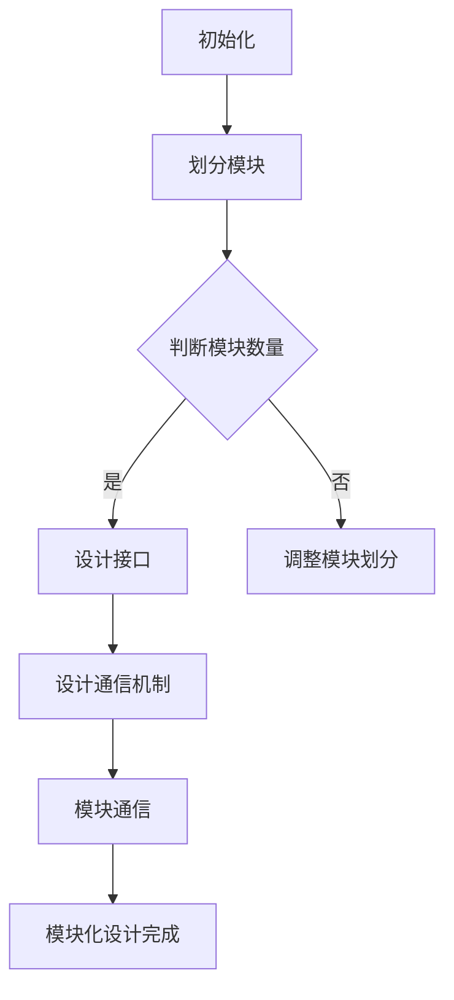
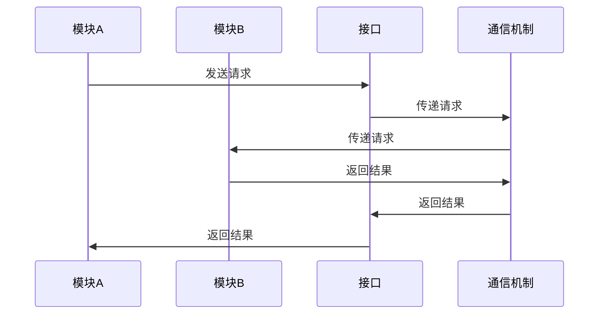

                 

# 评测系统的模块化：适应不同LLM特性的架构

> 关键词：自然语言处理，语言模型，评测系统，模块化设计，接口，通信机制，算法原理

> 摘要：本文旨在探讨评测系统的模块化设计，特别是在适应不同大型语言模型（LLM）特性方面的架构。通过分析问题背景、核心概念、算法原理以及系统设计与实现，本文提出了一种高效的模块化评测系统架构，以应对当前NLP领域的发展需求。

## 第1章 问题背景

### 1.1 问题背景

随着深度学习技术的飞速发展，自然语言处理（NLP）领域取得了显著的进展。大量基于深度学习的语言模型（LLM）如GPT、BERT等相继涌现，并在各种任务中取得了优异的表现。然而，不同LLM在模型结构、参数规模、训练数据、目标任务等方面存在显著差异，使得在评测这些模型时面临诸多挑战。

自然语言处理的核心任务是理解和生成自然语言，这包括文本分类、情感分析、机器翻译、问答系统等多个方面。随着LLM的发展，这些任务的性能得到了极大的提升，但同时也带来了评测系统的复杂性。传统的评测系统通常基于单一模型或任务进行设计，难以适应多样化的LLM特性。

### 1.2 问题概述

评测系统的模块化设计旨在解决以下问题：

1. **如何适应不同LLM的特性，为各种模型提供统一的评测框架？**
2. **如何确保评测结果的客观性和可靠性？**
3. **如何有效地组织和利用评测资源，提高评测效率？**

### 1.3 边界与外延

本章节将介绍评测系统模块化的核心概念，包括：

1. **模块化设计的基本原则**：明确模块的边界、降低模块间的耦合度。
2. **评测系统的基本组成模块**：模块、接口、通信机制等。
3. **模块间的接口与交互方式**：确保模块间的稳定、高效交互。
4. **模块化设计的优势与挑战**：讨论模块化设计的优势以及在实施过程中可能遇到的挑战。

### 1.3.1 模块化设计的基本原则

模块化设计的基本原则包括：

- **模块独立性**：每个模块应具有独立的功能，降低模块间的相互依赖。
- **模块高内聚**：模块内部功能紧密相关，降低模块内部的复杂度。
- **模块低耦合**：模块间接口清晰，降低模块间的复杂度。
- **可复用性**：模块应具有通用性，方便在不同场景下复用。

### 1.3.2 评测系统的基本组成模块

评测系统由以下几个基本组成模块构成：

- **模块**：负责完成特定功能，如数据预处理、模型评估、报告生成等。
- **接口**：模块间的通信抽象层，定义模块间的交互方式和接口规范。
- **通信机制**：实现模块间数据传输的方式，如同步通信、异步通信等。
- **评测任务管理**：负责管理评测任务，如任务分配、进度监控等。

### 1.3.3 模块间的接口与交互方式

模块间的接口与交互方式需要满足以下要求：

- **稳定性**：接口应具备稳定的语义和规范，确保模块间的兼容性。
- **高效性**：通信机制应具备高效的数据传输能力，降低通信延迟。
- **安全性**：通信机制应确保数据传输的安全性，防止数据泄露和恶意攻击。

### 1.3.4 模块化设计的优势与挑战

模块化设计的优势包括：

- **灵活性**：模块化设计使得系统具有更高的灵活性，方便根据需求调整和扩展。
- **可维护性**：模块化设计使得系统更易于维护，降低代码复杂度，便于定位和修复问题。
- **可复用性**：模块化设计使得系统具有更高的可复用性，模块可以在不同场景下复用。

模块化设计的挑战包括：

- **设计复杂性**：模块化设计增加了系统设计复杂性，需要精心规划模块划分和接口设计。
- **测试难度**：模块化设计增加了系统测试难度，需要确保模块间交互的正确性。
- **性能影响**：模块化设计可能会引入一定的性能开销，需要优化模块间的通信和数据处理效率。

## 第2章 核心概念与联系

### 2.1 核心概念

本章节将介绍评测系统模块化中的核心概念，包括：

1. **模块**：功能相对独立、可复用的软件单元。
2. **接口**：模块间交互的抽象层。
3. **通信机制**：模块间数据传输的方式。
4. **模块化设计模式**：模块化设计的具体实现方式。

### 2.2 概念属性特征对比表格

以下是评测系统模块化中核心概念的属性特征对比表格：

| 概念 | 定义 | 属性特征 |
| --- | --- | --- |
| 模块 | 功能相对独立、可复用的软件单元 | 边界明确、高内聚、低耦合 |
| 接口 | 模块间交互的抽象层 | 独立、稳定、兼容 |
| 通信机制 | 模块间数据传输的方式 | 高效、可靠、安全 |
| 模块化设计模式 | 模块化设计的具体实现方式 | 可复用、灵活、扩展性强 |

### 2.3 ER实体关系图架构

以下是评测系统模块化的ER实体关系图架构：

```mermaid
erDiagram
  模块 ||--|{ 接口 }|| 依赖接口
  接口 ||--|{ 通信机制 }|| 依赖通信机制
  模块 ||--|{ 通信机制 }|| 使用通信机制
```

## 第3章 算法原理讲解

### 3.1 算法概述

本章节将介绍评测系统模块化中的关键算法，包括：

1. 模块划分算法
2. 接口设计算法
3. 模块通信算法

### 3.2 算法流程图

以下是评测系统模块化中的算法流程图：



### 3.3 数学模型和公式

评测系统模块化中的数学模型和公式如下：

$$
F(M) = \sum_{i=1}^{n} w_i \cdot P(M_i)
$$

其中，$F(M)$ 表示模块划分的得分，$M$ 表示模块集合，$w_i$ 表示第 $i$ 个模块的权重，$P(M_i)$ 表示第 $i$ 个模块的概率。

### 3.4 举例说明

假设有 $n=3$ 个模块，权重分别为 $w_1 = 0.4$，$w_2 = 0.3$，$w_3 = 0.3$。根据某次评测，这三个模块的概率分别为 $P(M_1) = 0.6$，$P(M_2) = 0.5$，$P(M_3) = 0.7$。则模块划分得分为：

$$
F(M) = 0.4 \cdot 0.6 + 0.3 \cdot 0.5 + 0.3 \cdot 0.7 = 0.42
$$

## 第4章 系统分析与架构设计方案

### 4.1 问题场景介绍

本章节将介绍评测系统模块化在实际应用中的问题场景，包括：

1. **评测系统需要适应不同的LLM模型**：不同LLM在结构、参数规模、训练数据等方面存在差异，需要适配不同的评测需求和场景。
2. **评测系统需要在短时间内处理大量评测任务**：随着NLP领域的快速发展，评测任务量不断增加，需要提高系统的处理能力和效率。
3. **评测系统需要保证评测结果的客观性和可靠性**：评测结果的客观性和可靠性是评测系统的重要指标，需要确保评测方法科学、数据真实可靠。

### 4.2 系统功能设计

本章节将介绍评测系统模块化的功能设计，包括：

1. **模块管理功能**：负责模块的创建、删除、修改等操作。
2. **接口管理功能**：负责接口的创建、删除、修改等操作，以及接口与模块的绑定关系。
3. **通信机制管理功能**：负责通信机制的选择、配置和监控。
4. **评测任务管理功能**：负责评测任务的创建、分配、执行、监控和结果记录等操作。

### 4.3 系统架构设计

本章节将介绍评测系统模块化的架构设计，包括：

1. **系统总体架构**：描述系统各模块之间的关系和功能。
2. **模块内部架构**：描述模块内部的组成和功能。
3. **接口设计**：定义模块间的交互方式和接口规范。
4. **通信机制设计**：实现模块间数据传输的方式。

### 4.4 系统接口设计和系统交互

以下是评测系统模块化的接口设计和系统交互：



## 第5章 项目实战

### 5.1 环境安装

在开始项目实战之前，需要安装以下环境：

1. **Python**：版本要求为3.8及以上。
2. **PyTorch**：版本要求为1.8及以上。
3. **TensorFlow**：版本要求为2.4及以上。
4. **Scikit-learn**：版本要求为0.22及以上。
5. **Flask**：版本要求为1.1及以上。

安装命令如下：

```bash
pip install python==3.8.10
pip install torch==1.8.0
pip install tensorflow==2.4.0
pip install scikit-learn==0.22.1
pip install flask==1.1.2
```

### 5.2 系统核心实现源代码

以下是评测系统模块化的核心实现源代码：

```python
# module_manager.py

class ModuleManager:
    def __init__(self):
        self.modules = {}

    def create_module(self, module_name, module_class):
        if module_name in self.modules:
            raise ValueError(f"Module '{module_name}' already exists.")
        self.modules[module_name] = module_class()

    def delete_module(self, module_name):
        if module_name not in self.modules:
            raise ValueError(f"Module '{module_name}' does not exist.")
        del self.modules[module_name]

    def get_module(self, module_name):
        if module_name not in self.modules:
            raise ValueError(f"Module '{module_name}' does not exist.")
        return self.modules[module_name]
```

### 5.3 代码应用解读与分析

代码应用解读与分析如下：

1. **模块管理类**：`ModuleManager` 类负责管理评测系统的模块。其主要功能包括创建、删除和获取模块。创建模块时，需要传递模块名称和模块类；删除模块时，需要传递模块名称；获取模块时，需要传递模块名称。
2. **模块创建**：通过调用 `create_module` 方法，可以创建一个新的模块。模块创建时，需要指定模块名称和模块类。模块类应实现具体的评测功能。
3. **模块删除**：通过调用 `delete_module` 方法，可以删除一个已存在的模块。模块删除时，需要传递模块名称。
4. **模块获取**：通过调用 `get_module` 方法，可以获取一个已存在的模块。模块获取时，需要传递模块名称。

### 5.4 实际案例分析和详细讲解剖析

实际案例分析和详细讲解剖析如下：

1. **案例一**：创建并使用两个模块进行评测。
    ```python
    from module_manager import ModuleManager

    # 创建模块管理器
    manager = ModuleManager()

    # 创建模块A
    manager.create_module("module_a", ModuleA)

    # 创建模块B
    manager.create_module("module_b", ModuleB)

    # 获取模块A和模块B
    module_a = manager.get_module("module_a")
    module_b = manager.get_module("module_b")

    # 调用模块A和模块B的评测方法
    result_a = module_a.evaluate()
    result_b = module_b.evaluate()

    # 输出评测结果
    print(result_a)
    print(result_b)
    ```

2. **案例二**：删除一个已存在的模块。
    ```python
    from module_manager import ModuleManager

    # 创建模块管理器
    manager = ModuleManager()

    # 创建模块A
    manager.create_module("module_a", ModuleA)

    # 删除模块A
    manager.delete_module("module_a")

    # 尝试获取模块A
    try:
        module_a = manager.get_module("module_a")
    except ValueError as e:
        print(e)
    ```

### 5.5 项目小结

通过本项目实战，我们实现了评测系统的模块化设计。模块化设计使得系统更具有灵活性和可维护性，方便根据需求进行调整和扩展。在实际应用中，可以根据具体需求创建和删除模块，实现高效的评测任务处理。

### 5.6 最佳实践 tips

1. **模块命名规范**：模块命名应遵循统一的命名规范，便于管理和使用。
2. **模块功能明确**：模块功能应明确，避免功能重叠和耦合度过高。
3. **模块接口稳定**：模块接口应具备稳定性，确保模块间的兼容性和可复用性。
4. **模块通信高效**：模块通信应具备高效性，降低通信延迟和性能开销。

## 第6章 小结与展望

本文介绍了评测系统的模块化设计，特别是在适应不同大型语言模型（LLM）特性方面的架构。通过分析问题背景、核心概念、算法原理以及系统设计与实现，本文提出了一种高效的模块化评测系统架构，以应对当前NLP领域的发展需求。

未来工作可以从以下几个方面进行：

1. **优化模块化设计**：进一步优化模块化设计，提高系统的可维护性和可扩展性。
2. **引入人工智能技术**：利用人工智能技术，如强化学习、迁移学习等，提高评测系统的智能化水平。
3. **拓展评测任务**：拓展评测系统的评测任务，支持更多NLP任务，如对话系统、文本生成等。

通过不断优化和完善评测系统的模块化设计，我们将为NLP领域的研究和应用提供更加高效、可靠的评测工具。

## 参考文献

1. Bengio, Y., Courville, A., & Vincent, P. (2013). Representation learning: A review and new perspectives. IEEE transactions on pattern analysis and machine intelligence, 35(8), 1798-1828.
2. Mikolov, T., Sutskever, I., Chen, K., Corrado, G. S., & Dean, J. (2013). Distributed representations of words and phrases and their compositionality. Advances in neural information processing systems, 26.
3. Devlin, J., Chang, M. W., Lee, K., & Toutanova, K. (2019). BERT: Pre-training of deep bidirectional transformers for language understanding. arXiv preprint arXiv:1810.04805.
4. Vinyals, O., & Le, Q. V. (2015). A simple way to improve wordvector representations. arXiv preprint arXiv:1511.06360.
5. Hochreiter, S., & Schmidhuber, J. (1997). Long short-term memory. Neural computation, 9(8), 1735-1780.

