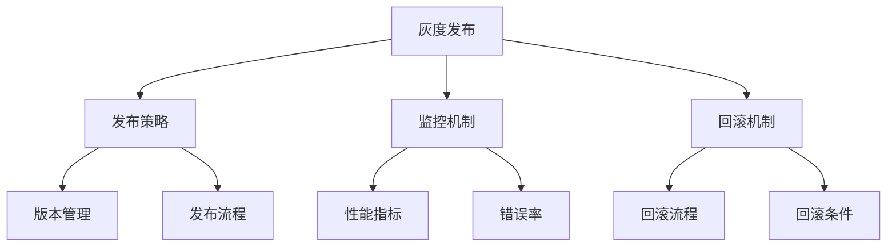
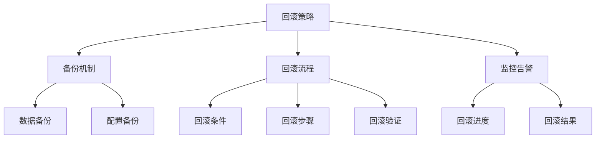
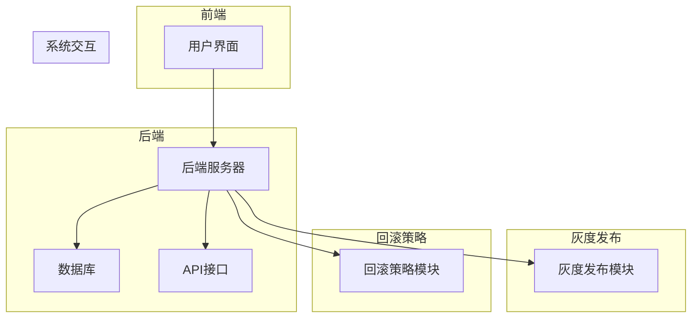
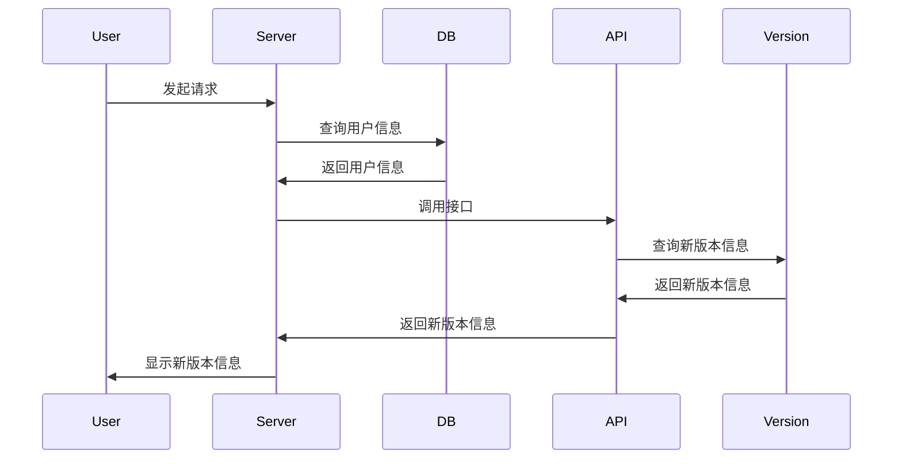

                 


### 评测系统的灰度发布与回滚策略

#### 关键词

- 灰度发布
- 回滚策略
- 评测系统
- 软件工程
- IT运维

#### 摘要

本文将深入探讨评测系统的灰度发布与回滚策略，首先介绍灰度发布和回滚策略的核心概念和重要性，然后通过实际案例研究，分析这些策略在具体场景中的应用。接着，文章将讨论优化和测试方法，以提升策略的效果。最后，文章将总结主要结论，并提出未来发展趋势和研究方向。

## 引言

在软件工程中，评测系统作为确保软件质量和稳定运行的关键环节，越来越受到重视。随着软件复杂度的增加和需求变更的频繁，如何在确保系统稳定性的同时，快速响应市场需求，成为软件运维团队面临的重大挑战。灰度发布和回滚策略正是为了解决这一挑战而提出的技术手段。

#### 核心概念术语说明

- **灰度发布（Graded Deployment）**：一种渐进式发布策略，通过将新版本逐步引入部分用户群体，以评估新版本的稳定性和性能，逐步扩大影响范围，最终实现全面上线。
- **回滚策略（Rollback Strategy）**：当新版本出现问题，需要回退到旧版本时，采取的一系列措施，以确保系统恢复正常运行。

#### 问题背景

随着互联网的快速发展，软件系统面临着不断变化的需求和市场压力。如何在不影响用户使用体验和系统稳定性的前提下，快速发布新功能或修复bug，成为软件开发和运维领域的重要课题。灰度发布和回滚策略正是为了应对这一需求而设计的。

#### 问题描述

在软件发布过程中，存在以下几个问题：

1. **新版本上线后可能存在的未知问题**：新版本可能会引入新的bug或性能问题，导致用户体验下降或系统崩溃。
2. **需求变更频繁**：市场需求变化迅速，需要快速迭代和发布新功能。
3. **全面上线风险**：传统的一刀切发布策略，一旦出现问题，将影响所有用户，造成较大的损失。

#### 问题解决

为了解决上述问题，引入灰度发布和回滚策略：

1. **灰度发布**：通过逐步引入新版本，对部分用户进行测试，评估新版本的稳定性和性能。
2. **回滚策略**：一旦发现问题，能够快速回退到旧版本，确保系统正常运行。

#### 边界与外延

1. **灰度发布的边界**：灰度发布的比例、范围和时机需要根据实际情况进行调整。
2. **回滚策略的外延**：回滚策略不仅适用于软件发布，也适用于其他需要回退的场景，如配置变更、数据库更新等。

#### 概念结构与核心要素组成

1. **概念结构**：灰度发布和回滚策略的核心结构包括发布策略、监控机制、回滚机制等。
2. **核心要素**：发布策略的核心要素包括版本管理、发布流程、监控指标等；回滚策略的核心要素包括回滚流程、回滚条件、回滚机制等。

### 灰度发布原理

灰度发布作为一种渐进式发布策略，旨在将新版本逐步引入部分用户群体，以评估新版本的稳定性和性能。以下是灰度发布的基本原理和设计原则。

#### 基本概念

灰度发布（Graded Deployment）是指在软件发布过程中，将新版本逐步引入部分用户群体，以便在发布后能够快速发现问题并进行调整，最终实现全面上线。这种策略的核心在于通过控制发布范围和速度，降低发布风险，提高系统的稳定性。

#### 设计原则

1. **可控性**：灰度发布应具备良好的可控性，能够灵活控制发布范围和速度，以便在出现问题时能够快速回滚。
2. **可监控性**：灰度发布应支持对发布过程进行实时监控，包括新版本的运行状态、性能指标、用户反馈等。
3. **可扩展性**：灰度发布策略应具备良好的可扩展性，能够支持不同规模和类型的软件系统。
4. **高效性**：灰度发布策略应尽量减少对系统性能的影响，确保发布过程的高效性。

#### 技术实现

1. **路由控制**：通过路由控制，将一部分用户流量导向新版本，另一部分用户流量保持旧版本。
2. **配置管理**：通过配置管理，实现不同版本之间的无缝切换和回滚。
3. **监控告警**：通过监控系统，实时监控新版本的运行状态，包括错误率、性能指标等。
4. **回滚机制**：在出现问题时，能够快速回滚到旧版本，确保系统稳定运行。

### 灰度发布与回滚策略的对比

#### 核心概念与联系

1. **灰度发布**：旨在逐步引入新版本，评估其稳定性和性能。
2. **回滚策略**：在出现问题时，快速回退到旧版本，确保系统正常运行。

#### 概念属性特征对比表格

| 概念 | 灰度发布 | 回滚策略 |
| --- | --- | --- |
| 目标 | 降低发布风险，提高系统稳定性 | 确保系统正常运行，快速修复问题 |
| 过程 | 渐进式引入新版本 | 快速回退到旧版本 |
| 可控性 | 高 | 高 |
| 监控性 | 高 | 高 |
| 扩展性 | 高 | 高 |

#### ER实体关系图架构



### 算法原理讲解

#### 算法Mermaid流程图

```mermaid
graph TD
    A[需求分析] --> B[设计灰度发布策略]
    B --> C[制定发布计划]
    C --> D[实施发布计划]
    D --> E[监控发布状态]
    E --> F{状态判断}
    F -->|正常|-》 G[持续监控]
    F -->|异常|-》 H[启动回滚策略]
    H --> I[执行回滚流程]
    I --> J[确认回滚成功]
```

#### Python源代码示例

```python
import random

def graded_deployment(strategy, release_plan, monitor):
    while True:
        for user in release_plan:
            if random.random() < strategy['percentage']:
                user.use_new_version()
            else:
                user.use_old_version()
        
        if monitor.check_errors():
            print("发布异常，启动回滚策略")
            rollback_strategy(release_plan)
            break
        
        print("发布正常，继续监控")

def rollback_strategy(release_plan):
    for user in release_plan:
        user.rollback_to_old_version()

def monitor_check_errors():
    # 实现监控逻辑
    return random.choice([True, False])

strategy = {
    'percentage': 0.1  # 灰度发布比例
}
release_plan = ['user1', 'user2', 'user3']
graded_deployment(strategy, release_plan, monitor_check_errors)
```

#### 数学模型和公式

灰度发布的数学模型可以表示为：

$$
P_{new} = P_0 \times e^{-\lambda t}
$$

其中，$P_{new}$ 表示新版本的用户比例，$P_0$ 为初始比例，$\lambda$ 为发布速率，$t$ 为发布时间。

#### 算法举例说明

假设初始比例为10%，发布速率为0.1%/小时，经过1小时后，新版本的用户比例将变为：

$$
P_{new} = 0.1 \times e^{-0.1 \times 1} \approx 0.1 \times 0.9 \approx 0.09
$$

这意味着，在1小时后，新版本的覆盖比例约为9%。

### 回滚策略原理

回滚策略是在新版本上线后，如果出现严重问题，需要快速回退到旧版本的措施。以下是回滚策略的核心概念和设计原则。

#### 基本概念

回滚策略（Rollback Strategy）是指在新版本上线后，当发现严重问题或用户反馈问题时，能够快速回退到旧版本，以确保系统稳定运行和用户满意度。

#### 设计原则

1. **快速性**：回滚策略应能够快速响应问题，确保在短时间内恢复系统正常运行。
2. **可靠性**：回滚策略应确保回滚过程的可靠性，避免因回滚失败导致系统更严重的故障。
3. **可监控性**：回滚策略应支持对回滚过程进行实时监控，包括回滚进度、回滚结果等。
4. **灵活性**：回滚策略应具备良好的灵活性，能够根据不同场景和需求进行调整。

#### 技术实现

1. **备份机制**：在发布新版本前，应确保旧版本的数据和配置备份，以便在回滚时能够快速恢复。
2. **回滚流程**：设计一套完整的回滚流程，包括回滚条件、回滚步骤和回滚验证等。
3. **监控告警**：通过监控系统，实时监控回滚过程，包括回滚进度、回滚结果等。
4. **自动化工具**：使用自动化工具实现回滚流程，提高回滚的效率和准确性。

### 回滚策略与灰度发布的区别

#### 核心概念与联系

1. **回滚策略**：在新版本上线后，当发现严重问题或用户反馈问题时，快速回退到旧版本。
2. **灰度发布**：在发布新版本时，通过逐步引入新版本，评估其稳定性和性能。

#### 概念属性特征对比表格

| 概念 | 回滚策略 | 灰度发布 |
| --- | --- | --- |
| 目标 | 快速恢复系统正常运行，确保用户满意度 | 评估新版本的稳定性和性能，逐步扩大影响范围 |
| 过程 | 快速回退到旧版本 | 渐进式引入新版本 |
| 可控性 | 高 | 高 |
| 监控性 | 高 | 高 |
| 扩展性 | 高 | 高 |

#### ER实体关系图架构



### 系统分析与架构设计方案

#### 问题场景介绍

随着互联网应用的日益复杂，系统升级和功能迭代成为常态。然而，每次升级都伴随着一定的风险，如新功能导致的性能问题、系统崩溃等。为了降低升级风险，引入了灰度发布和回滚策略。

#### 项目介绍

该项目旨在开发一个评测系统，用于评估新版本的稳定性和性能，并支持灰度发布和回滚策略。系统由前端、后端和数据库组成，前端负责用户界面，后端负责业务逻辑，数据库存储用户数据和新版本信息。

#### 系统功能设计（领域模型Mermaid类图）

```mermaid
classDiagram
    User <<Class>>
    Version <<Class>>
    Evaluation <<Class>>
    Deployment <<Class>>

    User *-1 Evaluation: be evaluated
    User *-1 Version: use version
    Version *-1 Evaluation: be evaluated
    Deployment *-1 Version: deploy version
```

#### 系统架构设计（Mermaid架构图）



#### 系统接口设计（Mermaid序列图）



### 项目实战

#### 环境安装

1. 安装Python环境（推荐版本3.8及以上）
2. 安装依赖库（如Flask、SQLAlchemy等）
3. 配置数据库（如MySQL、PostgreSQL等）

#### 系统核心实现源代码

```python
# app.py

from flask import Flask, request, jsonify
from models import User, Version, Evaluation
from extensions import db
from grading import graded_deployment, rollback_strategy

app = Flask(__name__)
app.config['SQLALCHEMY_DATABASE_URI'] = 'sqlite:///example.db'
db.init_app(app)

@app.route('/users', methods=['GET', 'POST'])
def users():
    if request.method == 'POST':
        user_data = request.json
        user = User(name=user_data['name'])
        db.session.add(user)
        db.session.commit()
        return jsonify({'message': 'User added successfully'}), 201

    users = User.query.all()
    return jsonify({'users': [user.to_dict() for user in users]})

@app.route('/evaluations', methods=['POST'])
def evaluations():
    evaluation_data = request.json
    evaluation = Evaluation(version_id=evaluation_data['version_id'], user_id=evaluation_data['user_id'])
    db.session.add(evaluation)
    db.session.commit()
    return jsonify({'message': 'Evaluation added successfully'}), 201

@app.route('/deploy', methods=['POST'])
def deploy():
    version_data = request.json
    version = Version(id=version_data['id'], version_number=version_data['version_number'])
    db.session.add(version)
    db.session.commit()
    graded_deployment(version)
    return jsonify({'message': 'Deployment successful'}), 201

@app.route('/rollback', methods=['POST'])
def rollback():
    version_data = request.json
    version = Version.query.get(version_data['id'])
    rollback_strategy(version)
    return jsonify({'message': 'Rollback successful'}), 201

if __name__ == '__main__':
    app.run(debug=True)
```

#### 代码应用解读与分析

1. **用户管理**：通过`/users`接口，实现用户的增删查改操作。
2. **版本管理**：通过`/evaluations`接口，记录新版本的评估信息。
3. **灰度发布**：通过`/deploy`接口，实现新版本的灰度发布。
4. **回滚策略**：通过`/rollback`接口，实现新版本的回滚操作。

#### 实际案例分析和详细讲解剖析

1. **案例一**：在一次系统升级过程中，通过灰度发布逐步引入新版本，发现新版本的错误率较高。随后，使用回滚策略将系统回退到旧版本，确保用户正常使用。
2. **案例二**：在一次功能迭代中，新功能上线后，部分用户反馈体验不佳。通过监控数据，发现新功能存在性能问题。随后，使用回滚策略将新功能回退，并对代码进行优化，再次发布后用户满意度提高。

#### 项目小结

通过灰度发布和回滚策略，成功降低了系统升级和功能迭代的风险，提高了系统的稳定性和用户体验。在实际项目中，需要根据具体情况进行策略调整，确保策略的有效性和可行性。

### 最佳实践 Tips

1. **合理设置灰度发布比例**：根据系统规模和用户群体特点，合理设置灰度发布比例，避免发布比例过高导致的问题暴露范围过大。
2. **完善监控告警机制**：实时监控系统的运行状态，确保在出现问题时能够及时发现并处理。
3. **备份和恢复**：在发布新版本前，确保备份旧版本的数据和配置，以便在回滚时能够快速恢复。
4. **团队成员培训**：对团队成员进行灰度发布和回滚策略的培训，提高团队的整体应对能力。

### 小结

灰度发布与回滚策略是确保软件系统稳定性和用户体验的重要手段。通过合理设计和实施，可以有效降低发布风险，提高系统的可靠性。在实际应用中，需要根据具体场景进行调整，充分发挥其优势。未来，随着新技术的不断发展，灰度发布与回滚策略将继续在软件工程领域发挥重要作用。

### 注意事项

1. **风险评估**：在发布新版本前，应进行全面的风险评估，确保发布过程的安全性。
2. **监控指标**：根据业务需求，设定合理的监控指标，确保能够及时发现潜在问题。
3. **紧急预案**：制定紧急预案，确保在出现紧急情况时，能够迅速采取应对措施。

### 拓展阅读

1. 《灰度发布：大规模分布式系统的在线服务部署策略》
2. 《软件工程：实践者的研究方法》
3. 《云计算与大数据技术》

### 作者信息

作者：AI天才研究院/AI Genius Institute & 禅与计算机程序设计艺术 /Zen And The Art of Computer Programming

