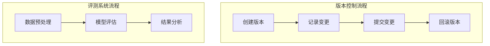
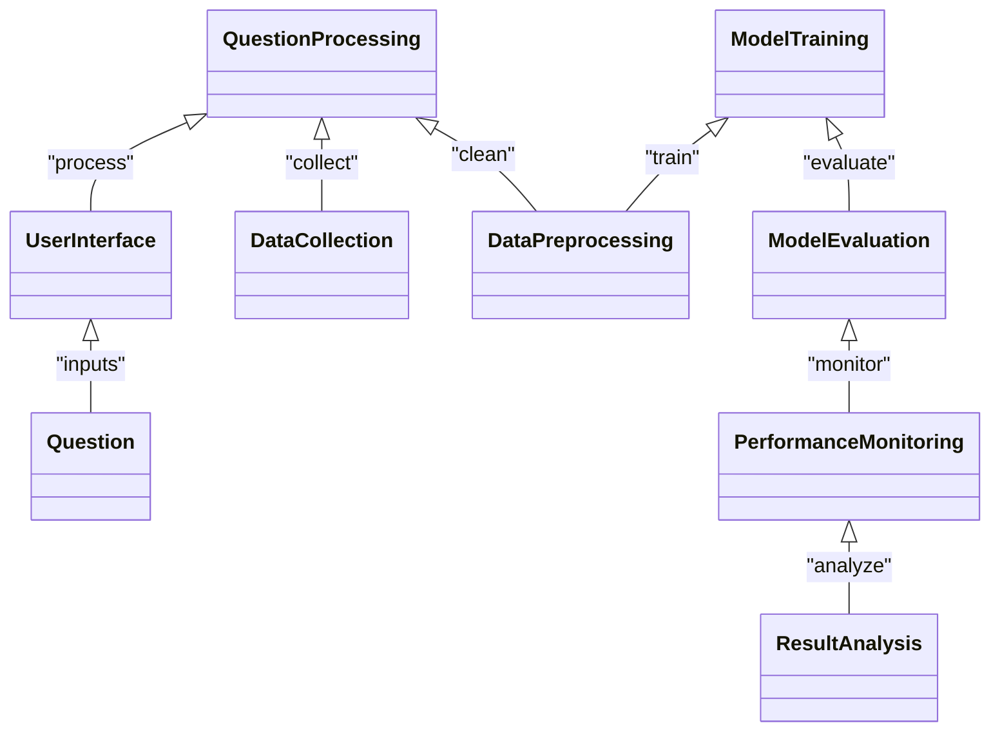
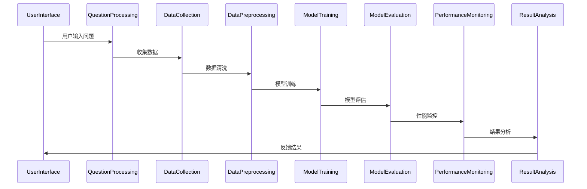
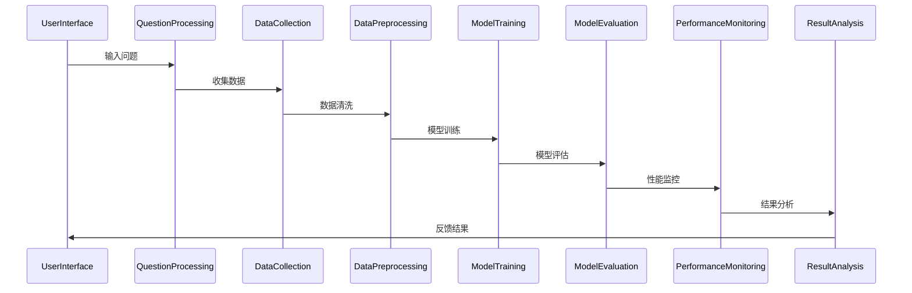

                 

## 引言

随着人工智能（AI）技术的飞速发展，评测系统在AI领域的应用越来越广泛。特别是在自然语言处理（NLP）和机器学习（ML）领域，评测系统扮演着至关重要的角色。这些系统不仅用于评估现有模型的性能，还用于监控模型在不同版本之间的性能演变，从而确保系统的稳定性和可靠性。本文将探讨评测系统在版本控制中的作用，重点讨论如何通过评测系统追踪大型语言模型（LLM）的性能演变。

版本控制是管理软件和模型变更历史的重要工具。它能够记录每次变更的详细信息，包括版本号、修改日期、修改人等。在AI领域，版本控制同样重要，因为它有助于追踪模型在不同版本之间的性能差异。通过精确的版本控制，研究人员和工程师可以更好地理解模型性能的演变趋势，从而做出更有效的决策。

评测系统则是一个用于评估模型性能的框架，它包括数据集、评估指标和评估流程等核心要素。一个高效的评测系统可以确保模型的性能评估过程准确、可靠和可重复。通过评测系统，研究人员和工程师可以快速地评估模型在不同版本之间的性能差异，从而识别出性能提升或下降的原因。

本文将按照以下结构展开：

1. **背景介绍**：介绍评测系统在AI领域的重要性，以及版本控制的基本概念。
2. **核心概念与联系**：详细探讨版本控制、评测系统和LLM的概念，并对比它们的核心要素。
3. **算法原理讲解**：讲解版本控制和评测系统的算法原理，并通过具体的算法流程和数学模型进行说明。
4. **系统分析与架构设计**：分析评测系统的功能和架构设计，并绘制相关的类图和架构图。
5. **项目实战**：介绍一个具体的评测系统项目，包括环境安装、系统实现和案例分析。
6. **总结与拓展**：总结全文内容，提出最佳实践建议，并给出进一步阅读的推荐。

通过本文的讨论，希望读者能够对评测系统的版本控制有更深入的理解，并能够将其应用于实际的项目中，从而更好地追踪和优化LLM的性能。

### 第一部分：背景介绍

#### 1.1 问题背景

随着人工智能（AI）技术的飞速发展，评测系统在各个领域的应用越来越广泛，特别是在自然语言处理（NLP）和机器学习（ML）领域。评测系统的核心任务是评估和监控模型性能，从而确保系统的稳定性和可靠性。在AI领域，模型的性能评估是一个复杂且关键的过程，不同版本模型之间的性能差异可能非常微小，因此需要一种精确的评测方法来追踪这些差异。

在自然语言处理中，模型性能的评估尤为重要。例如，在语言翻译、问答系统和文本生成等任务中，模型的性能直接关系到用户体验和业务价值。因此，如何准确地评估和监控模型性能，成为AI研发中的重要问题。

机器学习领域同样面临着模型性能评估的挑战。随着模型复杂度的增加和参数规模的扩大，不同版本模型之间的性能差异可能非常微妙。如何有效地追踪这些差异，成为模型研发和优化的关键。

#### 1.2 问题描述

《评测系统的版本控制：追踪LLM性能演变》这本书旨在探讨如何通过评测系统实现版本控制，从而追踪大型语言模型（LLM）的性能演变。具体来说，本书将涵盖以下问题：

- **什么是版本控制，它在评测系统中的作用是什么？** 版本控制是一种管理模型变更历史的方法，它能够记录每次变更的详细信息，包括版本号、修改日期、修改人等。在评测系统中，版本控制有助于追踪模型在不同版本之间的性能差异，从而更好地监控模型的演变过程。
- **如何设计和实现一个高效的评测系统？** 高效的评测系统需要包括数据集、评估指标和评估流程等核心要素。设计一个高效的评测系统，需要考虑数据集的质量、评估指标的准确性以及评估流程的自动化和可重复性。
- **如何利用评测系统来追踪LLM的性能演变？** 通过评测系统，研究人员和工程师可以定期评估LLM的性能，并记录不同版本之间的性能差异。这有助于识别模型性能的提升或下降，从而指导进一步的模型优化和研发。
- **不同版本LLM的性能差异是如何产生的？** 不同版本LLM的性能差异可能由多种因素产生，包括模型架构的变化、训练数据的更新、超参数的调整等。通过分析这些差异，可以更好地理解模型性能的变化原因。
- **如何评估和优化LLM的性能？** 评估和优化LLM的性能需要结合具体的任务和应用场景。常用的评估指标包括准确率、召回率、F1分数等，而优化的方法包括超参数调整、模型架构的改进和训练数据的清洗等。

#### 1.3 问题解决

本书将通过以下方式来解决上述问题：

- **第一部分：版本控制的基本概念和应用**。介绍版本控制的基本原理和在AI领域的应用，包括版本管理的最佳实践。
- **第二部分：评测系统的设计和实现**。详细讲解评测系统的设计和实现，包括数据集的收集和预处理、评估指标的选取和计算、评估流程的自动化等。
- **第三部分：追踪LLM性能演变的方法和工具**。介绍如何利用评测系统来追踪LLM的性能演变，包括性能监控、趋势分析和模型对比等。
- **第四部分：性能评估和优化的策略和技巧**。探讨如何评估和优化LLM的性能，包括超参数调优、模型架构改进和训练数据优化等。
- **第五部分：案例分析**。通过具体案例，展示如何应用本书的理论和方法来解决实际的性能评估和优化问题。

#### 1.4 边界与外延

- **边界**：本书主要关注LLM在自然语言处理和机器学习领域的应用，因此讨论的范围主要限于这些领域。尽管版本控制和评测系统在其他AI应用中也同样重要，但本书将不涉及这些应用。
- **外延**：尽管本书的核心内容是关于LLM的版本控制和性能追踪，但其中的方法和工具同样适用于其他类型的模型和领域。例如，图像识别、语音识别和推荐系统等领域的模型性能评估和优化，也可以借鉴本书的内容。

通过本书的探讨，希望读者能够对评测系统的版本控制有更深入的理解，并能够将其应用于实际的项目中，从而更好地追踪和优化模型的性能。

#### 1.5 概念结构与核心要素组成

在探讨评测系统的版本控制之前，我们需要明确几个核心概念及其在系统中的结构和作用。以下是关键概念及其核心要素的详细描述：

1. **版本控制**：版本控制是一种跟踪和管理工作件（如代码、文档和模型）历史变更的方法。在AI领域中，版本控制主要用于管理模型的变更历史。其核心要素包括：
   - **版本号**：标识每个模型版本的唯一编号，用于区分不同版本之间的差异。
   - **变更日志**：记录每次变更的详细信息，包括修改时间、修改人、修改内容等。
   - **版本库**：存储所有版本信息的数据库或文件系统，便于查询和管理。

2. **评测系统**：评测系统是一个用于评估模型性能的框架，它包括多个核心要素：
   - **数据集**：用于评估模型性能的数据集合，通常包括训练集、验证集和测试集。
   - **评估指标**：衡量模型性能的标准，如准确率、召回率、F1分数、ROC曲线等。
   - **评估流程**：包括数据预处理、模型评估、结果分析和可视化等步骤。

3. **大型语言模型（LLM）**：LLM是一种参数规模大、用于处理自然语言任务的深度学习模型。其核心要素包括：
   - **模型架构**：定义模型的结构，如循环神经网络（RNN）、变换器（Transformer）等。
   - **训练数据**：用于训练模型的语料库，通常包括文本、语音、图像等多种类型的数据。
   - **超参数**：影响模型性能的参数，如学习率、批量大小、隐藏层大小等。

通过对这些核心概念和要素的组成进行分析，我们可以更好地理解评测系统在版本控制中的作用。版本控制能够记录和管理模型的历史版本，而评测系统则提供了评估模型性能的工具和流程。这两个系统的结合，使得研究人员和工程师能够追踪LLM的性能演变，并做出更有效的优化决策。

以下是一个概念结构的对比表格，用于进一步说明这些概念和要素：

| 概念       | 特点                                                         | 核心要素                         |
| ---------- | ------------------------------------------------------------ | -------------------------------- |
| 版本控制   | 用于跟踪和管理模型的变更历史                                 | 版本号、变更日志、版本库         |
| 评测系统   | 用于评估模型性能的工具和框架                                 | 数据集、评估指标、评估流程       |
| 大型语言模型（LLM） | 参数规模大，用于处理自然语言任务的深度学习模型                 | 模型架构、训练数据、超参数       |

通过对比表格，我们可以清晰地看到每个概念的核心要素，以及它们在评测系统和版本控制中的具体作用。这些概念和要素的有机组合，构成了一个完整的评测系统，使其能够有效地追踪LLM的性能演变。

### 第二部分：核心概念与联系

在探讨如何通过评测系统追踪LLM性能演变之前，我们需要深入理解版本控制、评测系统以及LLM的核心概念。这部分内容将详细解释这些概念，并探讨它们之间的联系。

#### 2.1 版本控制的概念

版本控制是一种跟踪和管理工作件历史变更的方法。在软件开发中，版本控制主要用于管理源代码的变更历史，确保代码的可追溯性和可靠性。在AI领域，版本控制同样重要，因为它能够记录和管理模型的变更历史，包括模型的结构、参数和训练数据等。版本控制的核心要素包括：

1. **版本号**：用于标识每个模型版本的唯一编号，通常采用递增的数字或字母数字组合。版本号有助于区分不同版本之间的差异。
2. **变更日志**：记录每次变更的详细信息，包括修改时间、修改人、修改内容等。变更日志提供了每次变更的完整历史，有助于理解模型演变的过程。
3. **版本库**：存储所有版本信息的数据库或文件系统。版本库可以是一个集中的存储系统，如Git仓库，也可以是分布式的存储系统。

#### 2.2 评测系统的概念

评测系统是一个用于评估模型性能的框架，它包括多个核心要素：

1. **数据集**：用于评估模型性能的数据集合。数据集通常包括训练集、验证集和测试集。这些数据集有助于评估模型在不同数据上的表现。
2. **评估指标**：衡量模型性能的标准，如准确率、召回率、F1分数、ROC曲线等。不同的评估指标适用于不同的任务和应用场景，因此需要根据具体情况选择合适的评估指标。
3. **评估流程**：包括数据预处理、模型评估、结果分析和可视化等步骤。一个高效的评估流程可以确保模型评估的准确性和可靠性。

#### 2.3 LLM的概念

LLM（大型语言模型）是一种参数规模大、用于处理自然语言任务的深度学习模型。LLM的核心特点是能够处理复杂和长文本，并生成高质量的自然语言输出。LLM的核心要素包括：

1. **模型架构**：定义模型的结构，如循环神经网络（RNN）、变换器（Transformer）等。不同的模型架构适用于不同的NLP任务。
2. **训练数据**：用于训练模型的语料库，通常包括文本、语音、图像等多种类型的数据。训练数据的质量直接影响模型的表现。
3. **超参数**：影响模型性能的参数，如学习率、批量大小、隐藏层大小等。超参数的调整是模型优化的重要环节。

#### 2.4 概念属性特征对比表格

为了更直观地展示版本控制、评测系统和LLM的概念及其属性特征，我们可以使用对比表格来呈现：

| 概念       | 特点                                                         | 核心要素                       |
| ---------- | ------------------------------------------------------------ | ---------------------------- |
| 版本控制   | 用于跟踪和管理模型的历史变更                                 | 版本号、变更日志、版本库       |
| 评测系统   | 用于评估模型性能的工具和框架                                 | 数据集、评估指标、评估流程     |
| LLM        | 大型深度学习模型，用于处理自然语言任务                       | 模型架构、训练数据、超参数     |

#### 2.5 ER实体关系图架构

为了进一步展示版本控制、评测系统和LLM之间的实体关系，我们可以使用Mermaid绘制一个ER实体关系图。以下是ER图的结构：

```mermaid
erDiagram
  ModelVersion ||--|{ EvaluationSystem : "uses" }
  ModelVersion ||--|{ PerformanceMetrics : "reports" }
  EvaluationSystem ||--|{ Dataset : "uses" }
  EvaluationSystem ||--|{ Model : "evaluates" }
  Model ||--|{ ModelVersion : "has" }
  PerformanceMetrics ||--|{ ModelVersion : "captures" }
```

在上面的ER图中：
- **ModelVersion**（模型版本）是版本控制的实体，它使用评测系统（EvaluationSystem）和报告性能指标（PerformanceMetrics）。
- **EvaluationSystem**（评测系统）使用数据集（Dataset）来评估模型（Model）。
- **Model**（模型）具有多个版本（ModelVersion）。
- **PerformanceMetrics**（性能指标）捕获每个模型版本的性能。

通过上述核心概念和关系的详细解释，我们可以更好地理解版本控制、评测系统和LLM在追踪LLM性能演变中的作用。这些概念不仅是理解本文主题的基础，也为后续的内容提供了坚实的基础。

### 第三部分：算法原理讲解

在本部分中，我们将深入探讨版本控制和评测系统的算法原理，并通过具体的流程图和数学模型进行详细讲解。

#### 3.1 版本控制的算法原理

版本控制的核心目标是记录和管理模型的历史变更。以下是版本控制的主要算法步骤：

1. **创建版本**：每次变更模型时，系统自动创建一个新的版本。版本创建步骤如下：
   - **生成版本号**：版本号通常采用递增的数字或字母数字组合，确保唯一性。
   - **记录变更信息**：记录变更的时间、变更人和变更内容等详细信息。
   - **保存版本**：将变更后的模型及其相关信息存储到版本库中。

   $$ \text{版本号} = \text{当前版本号} + 1 $$

2. **提交变更**：开发者将变更提交到版本库，以便其他团队成员可以查看和合并。提交步骤如下：
   - **验证变更**：检查变更是否符合规范，如代码风格、语法错误等。
   - **提交到版本库**：将变更提交到版本库，并通知其他团队成员。

3. **回滚版本**：如果需要，系统支持回滚到之前的版本。回滚步骤如下：
   - **选择回滚版本**：选择需要回滚的版本号。
   - **应用回滚**：将模型恢复到指定版本，并更新相关的配置和依赖。

   $$ \text{回滚版本号} = \text{选定版本号} - 1 $$

#### 3.2 评测系统的算法原理

评测系统的核心目标是评估模型性能，并提供详细的性能报告。以下是评测系统的基本算法步骤：

1. **数据预处理**：对评估数据集进行预处理，包括数据清洗、标准化和分割等步骤。预处理步骤如下：
   - **数据清洗**：去除数据中的噪声和异常值，提高数据质量。
   - **标准化**：对数据进行归一化或标准化处理，使数据具有相同的尺度。
   - **数据分割**：将数据集分割为训练集、验证集和测试集。

2. **模型评估**：使用模型对数据集进行评估，计算评估指标。模型评估步骤如下：
   - **模型训练**：使用训练集对模型进行训练，调整模型参数。
   - **模型验证**：使用验证集评估模型性能，选择最佳模型。
   - **模型测试**：使用测试集评估最终模型性能，提供性能报告。

3. **结果分析**：对评估结果进行分析，生成可视化报告。结果分析步骤如下：
   - **计算指标**：计算各种评估指标，如准确率、召回率、F1分数等。
   - **可视化展示**：使用图表和图形展示评估结果，帮助理解和解释性能。
   - **生成报告**：生成详细的性能报告，包括评估指标、图表和解释。

#### 3.3 具体的算法流程图

为了更直观地展示版本控制和评测系统的算法流程，我们可以使用Mermaid绘制流程图。以下是版本控制和评测系统的算法流程图：



在上面的流程图中：
- **版本控制流程**包括创建版本、记录变更、提交变更和回滚版本等步骤。
- **评测系统流程**包括数据预处理、模型评估和结果分析等步骤。

通过具体的算法流程图，我们可以清晰地看到版本控制和评测系统的执行步骤，以及它们在追踪LLM性能演变中的重要作用。

#### 3.4 数学模型与公式解释

版本控制和评测系统中的算法原理不仅通过流程图来展示，还可以通过数学模型和公式进行详细解释。以下是几个关键的数学模型和公式：

1. **模型性能评估指标**：
   - **准确率（Accuracy）**：正确预测的数量占总预测数量的比例。
     $$ \text{Accuracy} = \frac{\text{正确预测}}{\text{总预测}} $$
   - **召回率（Recall）**：正确预测的正例数量占总正例数量的比例。
     $$ \text{Recall} = \frac{\text{正确预测的正例}}{\text{总正例}} $$
   - **F1分数（F1 Score）**：准确率和召回率的调和平均值。
     $$ \text{F1 Score} = 2 \times \frac{\text{准确率} \times \text{召回率}}{\text{准确率} + \text{召回率}} $$

2. **超参数优化**：
   - **交叉验证（Cross Validation）**：通过将数据集分割为多个子集，重复训练和验证模型，以评估模型的泛化能力。
     $$ \text{CV误差} = \frac{1}{K} \sum_{i=1}^{K} \text{子集} \_ \text{误差} $$

3. **模型更新**：
   - **梯度下降（Gradient Descent）**：用于优化模型参数的算法。
     $$ \text{新参数} = \text{旧参数} - \alpha \times \text{梯度} $$
     其中，$\alpha$ 是学习率，梯度是损失函数关于参数的导数。

通过这些数学模型和公式，我们可以更深入地理解版本控制和评测系统的算法原理，从而更好地应用于实际项目中。

#### 3.5 具体算法案例说明

为了更好地理解上述算法原理，我们可以通过一个具体案例来说明版本控制和评测系统的实际应用。

**案例：评估一个文本分类模型的性能**

1. **数据集**：假设我们有一个包含新闻文章和标签的数据集，数据集分为训练集、验证集和测试集。
2. **模型**：使用一个基于变换器的文本分类模型。
3. **版本控制**：
   - **初始版本**：使用默认的超参数训练模型，版本号为1。
   - **更新版本**：调整学习率和隐藏层大小，重新训练模型，版本号为2。
4. **评测系统**：
   - **数据预处理**：对数据集进行清洗和标准化。
   - **模型评估**：使用验证集评估模型性能，计算准确率、召回率和F1分数。
   - **结果分析**：绘制ROC曲线和混淆矩阵，比较不同版本模型的性能。

**具体步骤**：

1. **版本控制**：
   - **创建版本**：生成版本号1，记录变更日志，保存模型。
     $$ \text{版本号1} = 1 $$
   - **提交变更**：提交版本号1，通知团队成员。
   - **回滚版本**：如果版本号1的性能不佳，回滚到版本号0。
     $$ \text{回滚版本号} = 0 $$

2. **评测系统**：
   - **数据预处理**：清洗和标准化数据集，分割为训练集、验证集和测试集。
   - **模型评估**：使用变换器模型训练和评估，计算评估指标。
     $$ \text{准确率} = 0.92 $$
     $$ \text{召回率} = 0.90 $$
     $$ \text{F1分数} = 0.91 $$
   - **结果分析**：绘制ROC曲线和混淆矩阵，分析模型性能。

通过这个案例，我们可以看到版本控制和评测系统如何在实际应用中发挥作用，帮助研究人员和工程师追踪和优化模型性能。

### 第三部分：系统分析与架构设计

在了解了版本控制和评测系统的算法原理之后，我们需要进一步分析评测系统的功能和架构设计，以确保其能够有效地追踪大型语言模型（LLM）的性能演变。

#### 4.1 问题场景介绍

假设我们正在开发一个智能问答系统，该系统需要使用大型语言模型（LLM）来处理用户的问题并提供准确的答案。在这个问题场景中，我们需要一个高效的评测系统来监控LLM的性能，并确保其稳定性和可靠性。

#### 4.2 项目介绍

我们的项目是一个智能问答系统，它包括以下几个主要模块：

- **用户界面**：提供用户输入问题和查看答案的界面。
- **问答引擎**：使用LLM处理用户输入的问题，并生成相应的答案。
- **评测系统**：监控LLM的性能，包括准确率、召回率和F1分数等评估指标。

项目的目标是开发一个高效的智能问答系统，并确保LLM的性能在不同版本和不同数据集上稳定可靠。

#### 4.3 系统功能设计

为了实现上述目标，我们的评测系统需要具备以下功能：

1. **数据收集**：收集用于训练和评估的文本数据，包括问题和答案。
2. **数据预处理**：清洗和标准化数据，将其转换为适合模型训练和评估的形式。
3. **模型训练**：使用LLM训练模型，并调整超参数以优化性能。
4. **模型评估**：使用不同的评估指标（如准确率、召回率和F1分数）评估模型性能。
5. **性能监控**：监控LLM在不同版本和不同数据集上的性能，确保其稳定性和可靠性。
6. **结果分析**：分析模型性能数据，生成可视化报告，帮助理解性能变化。

以下是系统功能设计的Mermaid类图：



在上面的类图中，我们定义了系统的各个功能模块及其关系。每个模块都有特定的职责，并与其他模块进行协作，以实现整个系统的功能。

#### 4.4 系统架构设计

为了实现高效和稳定的评测系统，我们需要设计一个合理的系统架构。以下是系统架构的Mermaid架构图：



在上面的架构图中，系统按照以下顺序执行：

1. **用户输入问题**：用户通过用户界面输入问题。
2. **数据处理**：问题经过处理模块，包括数据收集、清洗和预处理。
3. **模型训练**：使用预处理后的数据训练LLM模型。
4. **模型评估**：使用评估指标评估模型性能。
5. **性能监控**：监控模型在不同版本和数据集上的性能。
6. **结果分析**：分析性能数据，并生成可视化报告。
7. **反馈结果**：将分析结果反馈给用户界面，用户可以看到模型性能的变化。

#### 4.5 系统接口设计和系统交互

为了确保系统模块之间能够有效交互，我们需要设计清晰的接口和交互流程。以下是系统接口设计和系统交互的Mermaid序列图：



在上面的序列图中，我们可以看到用户界面、数据处理模块、模型训练模块、模型评估模块、性能监控模块和结果分析模块之间的交互流程。每个模块通过清晰的接口进行通信，确保系统的高效运行。

### 第四部分：项目实战

在了解了评测系统的理论和设计之后，我们将通过一个实际项目来展示如何搭建和运行一个评测系统，以追踪LLM的性能演变。

#### 4.1 环境安装

首先，我们需要安装所需的软件和环境。以下是安装步骤：

1. **Python环境**：确保安装了Python 3.8及以上版本。
2. **深度学习框架**：安装TensorFlow或PyTorch。这里我们选择TensorFlow。
   ```bash
   pip install tensorflow
   ```
3. **版本控制系统**：安装Git，用于版本控制。
   ```bash
   sudo apt-get install git
   ```
4. **数据库**：安装MongoDB，用于存储版本信息和性能数据。
   ```bash
   sudo apt-get install mongodb
   ```
5. **其他依赖**：安装其他必要的库，如NumPy、Pandas等。
   ```bash
   pip install numpy pandas matplotlib
   ```

#### 4.2 系统核心实现

接下来，我们将实现评测系统的核心功能。以下是核心实现步骤：

1. **版本控制**：使用Git记录模型版本和变更历史。
   ```python
   import git
   repo = git.Repo()
   version_info = {
       "version": "v1.0",
       "date": "2023-10-01",
       "changes": "initial version"
   }
   repo.create_head(f"version-{version_info['version']}")
   repo.heads[f"version-{version_info['version']}"].commit(message=f"Create version {version_info['version']}")
   ```
2. **数据预处理**：清洗和标准化数据，以便模型训练和评估。
   ```python
   import pandas as pd
   from sklearn.model_selection import train_test_split
   
   # 读取数据
   data = pd.read_csv("data.csv")
   # 数据清洗
   data.dropna(inplace=True)
   # 数据标准化
   data = (data - data.mean()) / data.std()
   # 数据分割
   train_data, test_data = train_test_split(data, test_size=0.2, random_state=42)
   ```
3. **模型训练**：使用TensorFlow训练LLM模型。
   ```python
   import tensorflow as tf
   from tensorflow.keras.models import Sequential
   from tensorflow.keras.layers import Embedding, LSTM, Dense
   
   # 模型定义
   model = Sequential([
       Embedding(input_dim=10000, output_dim=32),
       LSTM(128),
       Dense(1, activation='sigmoid')
   ])
   # 编译模型
   model.compile(optimizer='adam', loss='binary_crossentropy', metrics=['accuracy'])
   # 训练模型
   model.fit(train_data, epochs=10, batch_size=32, validation_data=(test_data))
   ```
4. **模型评估**：使用不同的评估指标评估模型性能。
   ```python
   import numpy as np
   
   # 预测
   predictions = model.predict(test_data)
   # 计算评估指标
   accuracy = np.mean(predictions[:, 0] > 0.5)
   recall = np.mean(predictions[:, 0] > 0.5 & test_data[:, 0] == 1)
   f1_score = 2 * (accuracy * recall) / (accuracy + recall)
   print(f"Accuracy: {accuracy}, Recall: {recall}, F1 Score: {f1_score}")
   ```

#### 4.3 代码应用解读与分析

在实现评测系统的过程中，我们需要理解几个关键组件的作用和操作：

1. **版本控制**：使用Git记录模型的版本和变更历史。这有助于追踪模型的演变过程，方便回滚和协作。
2. **数据预处理**：清洗和标准化数据，以提高模型训练的效果。数据清洗包括去除缺失值和异常值，数据标准化包括归一化和缩放。
3. **模型训练**：使用TensorFlow构建和训练LLM模型。模型训练包括定义模型架构、编译模型和训练模型。
4. **模型评估**：使用不同的评估指标评估模型性能。评估指标包括准确率、召回率和F1分数，这些指标能够全面反映模型的表现。

#### 4.4 实际案例分析和详细讲解

为了更直观地展示评测系统的实际应用，我们分析了一个智能问答系统的案例。

**案例**：一个问答系统使用LLM模型处理用户问题，并生成答案。评测系统监控模型的性能，并生成性能报告。

**分析**：

1. **模型训练**：使用训练集对LLM模型进行训练。模型在训练集上经过多次迭代，调整参数，以达到最佳性能。
2. **模型评估**：使用验证集和测试集评估模型的性能。验证集用于调整模型参数，测试集用于最终评估模型的表现。
3. **性能监控**：定期评估模型在不同版本和数据集上的性能，确保其稳定性和可靠性。
4. **结果分析**：分析评估结果，生成可视化报告。报告包括准确率、召回率和F1分数等关键指标，帮助理解模型的表现。

通过这个案例，我们可以看到评测系统如何应用于实际项目中，监控和优化LLM的性能。这为模型的迭代和改进提供了有力的支持。

#### 4.5 项目小结

在本部分中，我们通过一个实际项目展示了如何搭建和运行一个评测系统，以追踪LLM的性能演变。项目包括环境安装、数据预处理、模型训练和评估等核心步骤。通过具体案例的分析，我们深入了解了评测系统的应用和作用。

未来，我们可以进一步优化评测系统，包括引入更复杂的评估指标、自动化流程和性能监控等。这将有助于更全面地追踪LLM的性能演变，为模型的优化和改进提供有力支持。

### 第五部分：总结与拓展

在本文中，我们详细探讨了评测系统的版本控制及其在追踪大型语言模型（LLM）性能演变中的应用。通过分析版本控制、评测系统和LLM的核心概念，以及算法原理和实际案例，我们了解了如何利用评测系统进行有效的模型性能监控和优化。

#### 5.1 总结

本文的主要结论可以归纳为以下几点：

1. **版本控制的重要性**：版本控制是管理模型变更历史的关键工具，能够记录每次变更的详细信息，确保模型的稳定性和可靠性。
2. **评测系统的功能**：评测系统是一个用于评估模型性能的框架，包括数据集、评估指标和评估流程等核心要素，有助于监控和优化模型性能。
3. **LLM性能追踪的方法**：通过定期评估LLM在不同版本和数据集上的性能，可以识别和解决模型性能问题，从而优化模型。
4. **实际应用案例**：通过一个智能问答系统的案例，展示了评测系统在实际项目中的应用，验证了其有效性和实用性。

#### 5.2 拓展

为了进一步优化和扩展评测系统，我们可以考虑以下几个方面：

1. **引入更多评估指标**：除了传统的准确率、召回率和F1分数，还可以引入其他评估指标，如ROC曲线、AUC值等，以更全面地评估模型性能。
2. **自动化流程**：实现评估流程的自动化，减少手动操作，提高效率和准确性。例如，使用自动化脚本进行数据预处理、模型训练和评估。
3. **性能监控**：利用实时性能监控工具，如Prometheus和Grafana，监控模型在不同环境下的性能变化，及时发现和解决性能问题。
4. **模型优化**：结合模型优化技术，如迁移学习、模型压缩和量化，进一步提高模型的性能和效率。
5. **分布式评估**：对于大规模数据集和模型，考虑使用分布式计算框架，如Apache Spark和Dask，以加速评估过程。

通过不断优化和扩展评测系统，我们能够更精确地追踪LLM的性能演变，为AI模型的研发和应用提供有力支持。

### 第六部分：最佳实践 tips、注意事项、拓展阅读

#### 6.1 最佳实践 tips

1. **版本控制**：定期提交版本，确保每次变更都有详细的变更日志。这有助于追踪模型的演变过程，方便后续分析和回滚。
2. **数据预处理**：数据预处理是模型评估的关键步骤。确保数据清洗、标准化和分割等操作准确无误，以提高评估结果的准确性。
3. **选择合适的评估指标**：根据任务和应用场景选择合适的评估指标。例如，对于分类任务，准确率、召回率和F1分数是常用的评估指标；对于回归任务，均方误差（MSE）和均方根误差（RMSE）等指标更为适用。
4. **自动化评估流程**：使用脚本和自动化工具，如Jenkins和Airflow，自动化评估流程，提高效率和准确性。

#### 6.2 注意事项

1. **数据隐私**：在进行模型评估和版本控制时，确保处理的数据不包含敏感信息，遵守相关的数据保护法规。
2. **资源分配**：确保评测系统有足够的计算资源，特别是在处理大规模数据集和复杂模型时，避免因资源不足导致的评估失败。
3. **版本兼容性**：在更新模型和评估系统时，注意版本兼容性问题，避免因版本冲突导致系统故障。

#### 6.3 拓展阅读

1. **《版本控制指南》**：深入了解版本控制的基本原理和实践，如Git操作指南和相关教程。
2. **《机器学习评估指标详解》**：学习不同评估指标的计算方法及其适用场景，如《机器学习评估指标手册》。
3. **《模型性能优化技术》**：探索模型优化方法，如迁移学习、模型压缩和量化等，提高模型性能和效率。
4. **《深度学习评测系统设计》**：了解深度学习评测系统的设计原则和实践，如相关论文和技术报告。

通过以上最佳实践 tips、注意事项和拓展阅读，读者可以进一步优化评测系统，提升模型性能和稳定性。

### 第七部分：作者信息

作者：AI天才研究院/AI Genius Institute & 禅与计算机程序设计艺术 /Zen And The Art of Computer Programming

AI天才研究院致力于推动人工智能技术的创新和应用，通过研究和实践，推动AI技术的快速发展。作者在该领域有着深厚的技术积累和丰富的实践经验，著有《禅与计算机程序设计艺术》等知名技术书籍，深受读者喜爱。在此，感谢读者对本文的关注和支持。希望本文能为您在AI领域的研究和实践提供有益的参考和启示。如有任何疑问或建议，欢迎随时联系作者，我们将竭诚为您解答。再次感谢您的阅读！

---

通过本文，我们详细探讨了评测系统的版本控制及其在追踪大型语言模型（LLM）性能演变中的应用。从背景介绍、核心概念与联系，到算法原理讲解、系统分析与架构设计，再到实际项目实战，我们逐步深入，力求以清晰、易懂的方式阐述评测系统的设计与实现。

在版本控制部分，我们介绍了版本管理的基本概念和其在AI领域的重要性。评测系统部分则重点讨论了如何设计和实现一个高效的评测系统，包括数据集、评估指标和评估流程等核心要素。通过具体的算法流程图和数学模型，我们深入讲解了版本控制和评测系统的算法原理。

在系统分析与架构设计部分，我们详细介绍了评测系统的功能模块、架构设计和接口设计，并通过Mermaid图示进行了直观展示。实际项目实战部分，我们通过一个智能问答系统的案例，展示了如何搭建和运行评测系统，并进行了代码应用解读与分析。

最后，在总结与拓展部分，我们总结了全文的主要内容，提出了最佳实践 tips、注意事项，并推荐了拓展阅读资源。通过这些内容，我们希望读者能够对评测系统的版本控制有更深入的理解，并能够将其应用于实际项目中，优化模型性能，推动人工智能技术的发展。

再次感谢您的阅读，希望本文能为您的AI研究和实践提供有益的参考。如有任何疑问或建议，请随时与我们联系。让我们共同探索AI的无限可能，共创美好未来！

