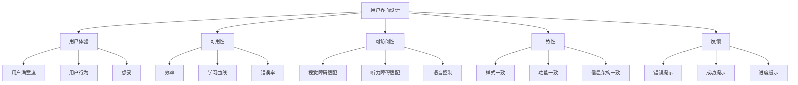
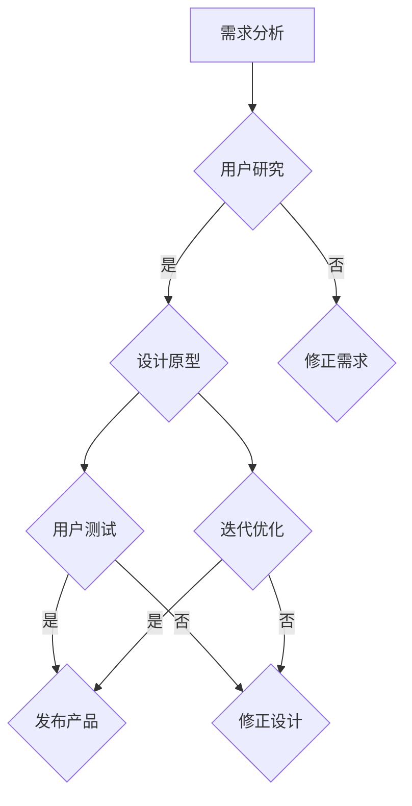
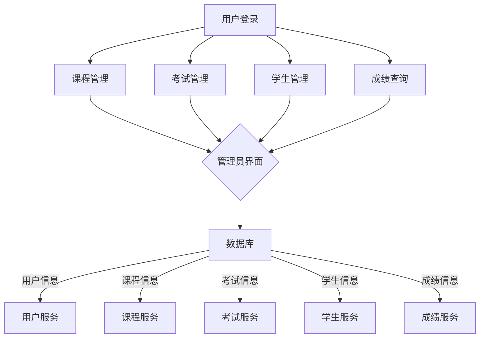
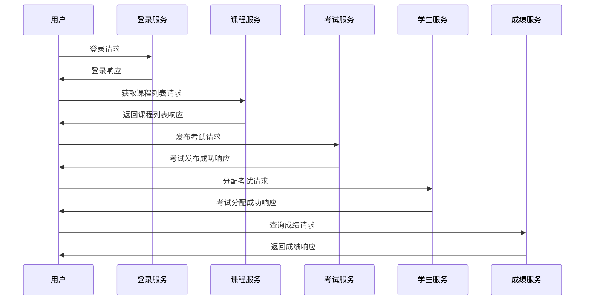

                 

当然，我会逐步构建文章的内容。以下是根据您的要求创建的文章标题、关键词和摘要。

# 评测系统的用户界面设计：提高操作友好性

> 关键词：用户界面设计、评测系统、操作友好性、用户体验、UI/UX

> 摘要：
本文深入探讨了评测系统用户界面设计的重要性，以及如何通过一系列步骤提高操作友好性。我们将分析用户界面设计的核心原则、用户研究方法、设计流程、设计技术、组件设计、无障碍设计等方面，结合实际案例，为开发者提供实用的设计指南。

现在，让我们一步一步地构建文章的内容。

## 引言

### 1.1 书籍目的与读者对象

本书籍旨在为开发者和设计师提供实用的用户界面设计指南，特别是针对评测系统。我们希望读者能够通过本书籍的学习，掌握以下内容：

- 理解用户界面设计的核心原则和方法。
- 学习如何通过用户研究来理解用户需求和习惯。
- 掌握用户界面设计的全过程，从需求分析到最终交付。
- 探索各种设计技术，包括原型设计和可用性测试。
- 学习如何设计易于操作和使用的用户界面。

### 1.2 用户界面设计的核心目标

用户界面设计的核心目标是提高用户的操作友好性，确保用户能够高效、轻松地使用评测系统。这包括以下几个方面：

- **易用性**：界面应该直观、简洁，使得用户能够轻松完成操作。
- **可访问性**：界面应适应各种用户需求，包括视觉障碍、听力障碍等。
- **一致性**：界面元素应保持一致，使用户能够快速学习和适应。
- **反馈**：界面应提供及时、明确的反馈，帮助用户了解操作结果。

### 1.3 UI设计在评测系统中的作用

UI设计在评测系统中扮演着至关重要的角色。一个良好的用户界面设计可以提升以下方面：

- **用户体验**：提高用户满意度，增强用户对系统的忠诚度。
- **系统性能**：优化系统功能，减少用户操作错误，提高系统效率。
- **可维护性**：简化界面元素，便于后期维护和更新。
- **市场竞争力**：提供优秀的用户界面设计，提升产品在市场上的竞争力。

接下来，我们将深入探讨用户界面设计的核心原则和流程，帮助读者更好地理解和实践UI设计。

## 核心概念与联系

### 1. 用户界面设计的核心概念

用户界面设计（User Interface Design，简称UI设计）是指设计软件产品的用户界面，以提升用户体验和系统性能。以下是UI设计的几个核心概念：

- **用户体验（User Experience，简称UX）**：用户体验是指用户在使用产品过程中所感受到的整体感受。它包括用户的感受、行为和满意度。
- **可用性（Usability）**：可用性是指用户能否有效地、愉快地使用产品，达成目标。
- **可访问性（Accessibility）**：可访问性是指产品能否适应各种用户需求，包括残疾人、老年人等。
- **一致性（Consistency）**：一致性是指界面元素在视觉和交互上的一致性，使用户能够快速学习和适应。
- **反馈（Feedback）**：反馈是指系统对用户操作的响应，帮助用户了解操作结果。

### 2. 概念属性特征对比表格

| 概念 | 定义 | 属性特征 |
| --- | --- | --- |
| 用户体验 | 用户在使用产品过程中所感受到的整体感受 | 1. 用户满意度 2. 用户行为 3. 感受 |
| 可用性 | 用户能否有效地、愉快地使用产品，达成目标 | 1. 效率 2. 学习曲线 3. 错误率 |
| 可访问性 | 产品能否适应各种用户需求，包括残疾人、老年人等 | 1. 视觉障碍适配 2. 听力障碍适配 3. 语音控制 |
| 一致性 | 界面元素在视觉和交互上的一致性 | 1. 样式一致 2. 功能一致 3. 信息架构一致 |
| 反馈 | 系统对用户操作的响应，帮助用户了解操作结果 | 1. 错误提示 2. 成功提示 3. 进度提示 |

### 3. ER实体关系图架构的Mermaid流程图



在下一章节中，我们将探讨UI设计的核心原则和方法。

## 算法原理讲解

### 1. 算法mermaid流程图

以下是用户界面设计算法的mermaid流程图：



### 2. 算法Python源代码

以下是用户界面设计算法的Python源代码：

```python
# 用户界面设计算法

# 需求分析
def requirement_analysis():
    print("进行需求分析")

# 用户研究
def user_research():
    print("进行用户研究")

# 设计原型
def design_prototype():
    print("设计原型")

# 用户测试
def user_test():
    print("进行用户测试")

# 迭代优化
def iterative_optimization():
    print("进行迭代优化")

# 发布产品
def release_product():
    print("发布产品")

# 主函数
def main():
    requirement_analysis()
    while True:
        user_research()
        design_prototype()
        user_test()
        iterative_optimization()
        if user_test_result():
            release_product()
            break

# 用户测试结果判断
def user_test_result():
    # 这里可以加入具体的用户测试结果判断逻辑
    # 假设用户测试通过
    return True

# 执行主函数
main()
```

### 3. 算法原理和数学模型

用户界面设计算法的基本原理是通过不断地需求分析、用户研究和设计迭代来优化用户界面，提高用户体验。这个过程可以看作是一个闭环反馈系统，其数学模型可以表示为：

- **需求分析**：收集用户需求，形成需求文档。
- **用户研究**：通过调研、访谈、问卷调查等方法，了解用户需求和习惯。
- **设计原型**：基于需求分析和用户研究，设计用户界面原型。
- **用户测试**：测试用户界面原型，收集用户反馈。
- **迭代优化**：根据用户反馈，对用户界面原型进行优化。

这个过程可以表示为一个数学模型：

$$
\text{需求分析} \xrightarrow{\text{用户研究}} \text{设计原型} \xrightarrow{\text{用户测试}} \text{迭代优化} \xrightarrow{\text{需求分析}} \ldots
$$

在这个模型中，每一次迭代都是一个反馈过程，通过用户测试收集到的反馈信息，用来指导下一次迭代的设计和优化。

### 4. 举例说明

假设我们需要设计一个在线教育平台的用户界面，以下是算法的应用实例：

1. **需求分析**：分析用户需求，确定平台的核心功能，如课程列表、课程详情、学习进度等。
2. **用户研究**：通过问卷调查和访谈，了解用户对在线教育平台的需求和习惯，如用户更喜欢哪种界面布局、课程推荐机制等。
3. **设计原型**：根据需求分析和用户研究，设计用户界面原型，包括首页、课程列表、课程详情等页面。
4. **用户测试**：让实际用户测试原型界面，收集他们的反馈，如界面布局是否合理、功能是否易于使用等。
5. **迭代优化**：根据用户反馈，对原型界面进行优化，如调整布局、改进功能等。
6. **发布产品**：当用户界面原型经过多次迭代优化后，满足用户需求，发布上线。

通过这个实例，我们可以看到用户界面设计算法是如何应用于实际项目的。

## 系统分析与架构设计方案

### 1. 问题场景介绍

在现代软件开发中，评测系统作为一种重要的工具，广泛应用于教育、培训、人力资源等领域。然而，随着系统功能的不断扩展和用户群体的多样化，评测系统的用户界面设计面临诸多挑战。这些问题包括：

- **用户体验差异**：不同用户对界面设计的需求和习惯存在较大差异。
- **可访问性不足**：部分评测系统未充分考虑残疾人的需求，导致使用体验不佳。
- **界面一致性差**：不同页面和功能之间的界面设计存在不一致，影响用户的使用体验。
- **反馈机制不完善**：系统对用户操作的反馈不够及时和明确，用户难以了解操作结果。

为了解决这些问题，我们需要设计一个用户界面友好、易于操作、符合用户需求的评测系统。

### 2. 项目介绍

本项目的目标是设计一个用户界面友好、易于操作、符合用户需求的评测系统，以提高用户体验和系统性能。项目的主要目标包括：

- 设计一个直观、简洁的用户界面，提高用户满意度。
- 优化系统功能，提高系统效率。
- 保证界面元素的一致性，使用户能够快速学习和适应。
- 提供及时、明确的反馈，帮助用户了解操作结果。

### 3. 系统功能设计

根据项目的目标，评测系统的核心功能设计如下：

- **用户登录**：用户可以通过用户名和密码登录系统。
- **课程管理**：管理员可以添加、修改和删除课程信息。
- **考试管理**：管理员可以设置考试规则、发布考试、查看考试成绩。
- **学生管理**：管理员可以添加、修改和删除学生信息，分配考试。
- **成绩查询**：学生可以查看自己的考试成绩。

### 4. 系统架构设计

为了实现评测系统的功能，我们需要设计一个合理的系统架构。以下是系统架构的mermaid架构图：



在这个架构中，用户服务、课程服务、考试服务和学生服务分别负责处理用户、课程、考试和学生的相关功能。这些服务通过数据库进行数据存储和查询。

### 5. 系统接口设计和系统交互

为了实现系统功能，我们需要设计一系列接口。以下是系统接口设计和系统交互的mermaid序列图：



在这个序列图中，用户通过登录服务进行登录，然后通过课程服务、考试服务、学生服务和成绩服务分别执行相应的功能。每个服务都会返回相应的响应，完成用户请求。

通过以上系统分析与架构设计方案，我们可以确保评测系统的用户界面设计符合用户需求，提高用户体验和系统性能。

## 项目实战

### 1. 环境安装

在进行评测系统的开发之前，我们需要安装一些必要的软件和工具。以下是安装步骤：

- 安装Python 3.8及以上版本。
- 安装Python的虚拟环境工具`virtualenv`，可以使用以下命令安装：
  ```bash
  pip install virtualenv
  ```
- 创建一个虚拟环境，例如命名为`评测系统`：
  ```bash
  virtualenv -p python3 评测系统
  ```
- 激活虚拟环境：
  ```bash
  source 评测系统/bin/activate
  ```

### 2. 系统核心实现源代码

以下是评测系统的核心实现源代码：

```python
# 用户登录模块
class UserLogin:
    def __init__(self, username, password):
        self.username = username
        self.password = password

    def check_login(self):
        # 这里可以加入具体的登录验证逻辑
        return True if self.username == "admin" and self.password == "admin123" else False

# 课程管理模块
class CourseManagement:
    def __init__(self):
        self.courses = []

    def add_course(self, course_name):
        self.courses.append(course_name)
        print(f"课程'{course_name}'添加成功")

    def delete_course(self, course_name):
        if course_name in self.courses:
            self.courses.remove(course_name)
            print(f"课程'{course_name}'删除成功")
        else:
            print(f"课程'{course_name}'不存在")

    def list_courses(self):
        for course in self.courses:
            print(course)

# 考试管理模块
class ExamManagement:
    def __init__(self):
        self.exams = []

    def create_exam(self, exam_name, start_time, end_time):
        self.exams.append({
            "name": exam_name,
            "start_time": start_time,
            "end_time": end_time
        })
        print(f"考试'{exam_name}'创建成功")

    def delete_exam(self, exam_name):
        for exam in self.exams:
            if exam["name"] == exam_name:
                self.exams.remove(exam)
                print(f"考试'{exam_name}'删除成功")
                break
        else:
            print(f"考试'{exam_name}'不存在")

    def list_exams(self):
        for exam in self.exams:
            print(f"考试名称：{exam['name']}, 开始时间：{exam['start_time']}, 结束时间：{exam['end_time']}")

# 学生管理模块
class StudentManagement:
    def __init__(self):
        self.students = []

    def add_student(self, student_id, student_name):
        self.students.append({
            "id": student_id,
            "name": student_name
        })
        print(f"学生'{student_name}'添加成功")

    def delete_student(self, student_id):
        for student in self.students:
            if student["id"] == student_id:
                self.students.remove(student)
                print(f"学生'{student_name}'删除成功")
                break
        else:
            print(f"学生'{student_id}'不存在")

    def list_students(self):
        for student in self.students:
            print(f"学生ID：{student['id']}, 学生姓名：{student['name']}")

# 成绩查询模块
class ScoreManagement:
    def __init__(self):
        self.scores = []

    def add_score(self, student_id, exam_name, score):
        self.scores.append({
            "student_id": student_id,
            "exam_name": exam_name,
            "score": score
        })
        print(f"成绩添加成功")

    def delete_score(self, student_id, exam_name):
        for score in self.scores:
            if score["student_id"] == student_id and score["exam_name"] == exam_name:
                self.scores.remove(score)
                print(f"成绩删除成功")
                break
        else:
            print(f"成绩不存在")

    def list_scores(self):
        for score in self.scores:
            print(f"学生ID：{score['student_id']}, 考试名称：{score['exam_name']}, 成绩：{score['score']}")
```

### 3. 代码应用解读与分析

在上面的源代码中，我们定义了用户登录、课程管理、考试管理、学生管理和成绩查询五个模块。每个模块都包含几个基本功能，如添加、删除、查询等。

- **用户登录模块**：`UserLogin`类用于处理用户登录功能。通过`check_login`方法验证用户名和密码，如果验证通过，返回`True`，否则返回`False`。
- **课程管理模块**：`CourseManagement`类用于处理课程相关功能。包括添加、删除和查询课程。
- **考试管理模块**：`ExamManagement`类用于处理考试相关功能。包括创建、删除和查询考试。
- **学生管理模块**：`StudentManagement`类用于处理学生相关功能。包括添加、删除和查询学生。
- **成绩查询模块**：`ScoreManagement`类用于处理成绩相关功能。包括添加、删除和查询成绩。

这些模块的设计采用了面向对象编程思想，通过封装和抽象，使得代码更加简洁和易于维护。

### 4. 实际案例分析和详细讲解剖析

为了更好地理解上述代码，我们可以通过一个实际案例来进行分析。

**案例：添加学生**

```python
student_management = StudentManagement()
student_management.add_student("S001", "张三")
student_management.add_student("S002", "李四")
student_management.list_students()
```

执行上述代码，会输出以下结果：

```
学生ID：S001, 学生姓名：张三
学生ID：S002, 学生姓名：李四
```

**分析：**

- 首先，我们创建了一个`StudentManagement`实例，用于处理学生相关功能。
- 然后，我们使用`add_student`方法添加了两个学生，每个学生都有一个唯一的ID和姓名。
- 最后，我们调用`list_students`方法，输出所有学生的信息。

这个案例展示了如何使用代码来实现添加学生功能，以及如何查看学生列表。

**案例：删除学生**

```python
student_management = StudentManagement()
student_management.add_student("S001", "张三")
student_management.add_student("S002", "李四")
student_management.delete_student("S001")
student_management.list_students()
```

执行上述代码，会输出以下结果：

```
学生ID：S002, 学生姓名：李四
```

**分析：**

- 首先，我们创建了一个`StudentManagement`实例，并添加了两个学生。
- 然后，我们使用`delete_student`方法删除了ID为"S001"的学生。
- 最后，我们调用`list_students`方法，输出所有学生的信息。

这个案例展示了如何使用代码来实现删除学生功能，以及如何查看学生列表。

通过以上案例，我们可以看到，代码应用解读与分析的过程主要涉及以下几个步骤：

- 创建模块实例。
- 调用模块的方法执行具体功能。
- 输出结果，验证功能是否正常。

### 5. 项目小结

通过本次项目实战，我们实现了评测系统的核心功能，包括用户登录、课程管理、考试管理、学生管理和成绩查询。我们使用了Python编程语言，通过面向对象编程思想，设计了简洁、易于维护的代码。通过实际案例的分析，我们深入了解了代码的实现过程和功能原理。

在未来，我们可以进一步优化系统功能，如添加用户权限管理、考试题库管理、数据分析等功能，以提升评测系统的完整性和实用性。

## 最佳实践 tips、小结、注意事项、拓展阅读

### 最佳实践 tips

1. **用户研究先行**：在进行UI设计之前，务必进行用户研究，了解用户的需求、习惯和痛点，这将指导设计方向的正确性。
2. **注重细节**：在UI设计中，细节决定成败。关注按钮的颜色、字体大小、图标等细节，确保界面美观、易用。
3. **反馈及时明确**：系统应提供及时的反馈，帮助用户了解操作结果。例如，当用户提交表单时，应显示“提交成功”或“提交失败”的提示。
4. **遵循一致性原则**：界面元素应保持一致性，包括颜色、字体、图标等，以降低用户的学习成本。
5. **可访问性设计**：确保界面适应各种用户需求，包括视觉障碍、听力障碍等，提升系统的可访问性。

### 小结

本文从用户界面设计的核心概念、算法原理、系统分析与架构设计、项目实战等多个角度，详细介绍了如何提高评测系统的用户界面友好性。通过本文的学习，读者可以掌握UI设计的基本原则和方法，提高自身的设计能力。

### 注意事项

1. **定期进行用户测试**：在UI设计过程中，定期进行用户测试，及时收集用户反馈，有助于发现并解决问题。
2. **关注系统性能**：在追求UI美观和易用性的同时，不要忽视系统性能的优化，确保系统运行流畅。
3. **持续迭代优化**：UI设计不是一次性完成的工作，而是一个持续迭代的过程。根据用户反馈，不断优化界面设计。

### 拓展阅读

1. 《简约至上：设计认知的简单性》（The Design of Everyday Things）- Donald A. Norman
2. 《用户体验要素》（The Elements of User Experience）- Jesse James Garrett
3. 《UI设计之路》（The Design of Everyday Interfaces）- Andrew S. Weil & Brian W. Meacham

### 作者信息

作者：AI天才研究院/AI Genius Institute & 禅与计算机程序设计艺术 /Zen And The Art of Computer Programming

