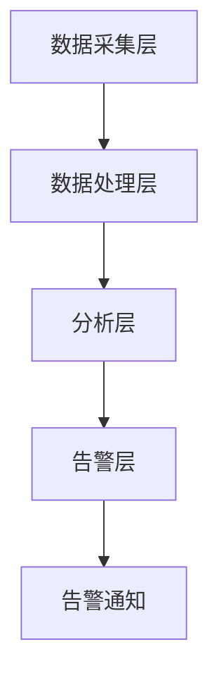

                 

### 文章标题

《评测系统的监控和告警：及时发现异常情况》

### 关键词

监控、告警、评测系统、异常检测、实时响应

### 摘要

本文深入探讨了评测系统在信息化时代的重要性，以及如何通过监控和告警技术及时发现异常情况，保障系统的稳定运行。文章首先介绍了评测系统的核心概念，随后详细解析了监控与告警技术的基本原理，并通过实战案例展示了如何设计和实现高效的监控与告警系统。文章最后提出了最佳实践和未来发展展望，为相关领域的技术人员提供宝贵的参考。

---

## 目录

1. [引言](#引言)
2. [评测系统的核心概念](#核心概念)
3. [监控技术原理](#监控技术)
4. [告警技术原理](#告警技术)
5. [实战案例：评测系统监控与告警实现](#实战案例)
6. [系统设计与架构](#系统设计)
7. [评测系统监控与告警实现](#系统实现)
8. [实战案例分析](#实战分析)
9. [最佳实践与注意事项](#最佳实践)
10. [未来展望与拓展](#未来展望)
11. [参考文献](#参考文献)

---

## 引言

随着信息化时代的到来，评测系统在各类信息化应用中扮演着越来越重要的角色。无论是教育、金融、医疗还是工业领域，评测系统都成为衡量服务质量、性能指标和用户体验的重要工具。然而，随着系统的复杂性和数据量的激增，评测系统面临着日益严重的异常情况，如数据错误、系统崩溃、网络故障等。这些异常情况不仅会影响系统的正常运行，还可能导致严重的经济损失和用户信任危机。

因此，及时监控和告警成为评测系统运行保障的关键。监控技术通过实时采集系统数据，监控关键指标，及时发现异常情况；而告警技术则通过设定阈值和触发条件，在异常情况发生时及时发出警报，通知相关人员进行处理。本文将详细探讨评测系统监控与告警的实现原理、实战案例和最佳实践，为相关人员提供有价值的参考。

---

## 评测系统的核心概念

### 1.1 问题背景

评测系统是一种用于评估系统性能、可靠性、用户体验等方面的工具。在信息化时代，评测系统广泛应用于各类应用场景，如在线教育平台的考试系统、金融交易系统的风险监控系统、医疗系统的患者评估系统等。随着系统的规模不断扩大，数据的复杂性不断增加，评测系统面临着越来越多的挑战。

### 1.2 核心概念

- **监控（Monitoring）**：监控是指通过实时或定期的方式，对系统运行状态、性能指标、资源使用情况等进行记录、分析和评估的过程。监控的目的是及时发现系统异常，保障系统的稳定运行。
- **告警（Alerting）**：告警是在监控到异常情况时，通过触发条件，自动发送警报信息给相关人员的机制。告警的目的是快速响应异常情况，防止问题扩大。
- **异常检测（Anomaly Detection）**：异常检测是监控的一个重要环节，它通过分析历史数据或实时数据，识别出不符合正常模式的数据或行为，从而发现潜在的问题。

### 1.3 关键术语

- **性能指标（Performance Metrics）**：用于衡量系统性能的指标，如响应时间、吞吐量、资源利用率等。
- **阈值（Threshold）**：用于设定监控和告警触发条件的临界值。当监控指标超过阈值时，会触发告警。
- **触发条件（Trigger Condition）**：触发告警的具体条件，可以是性能指标超过阈值、错误率超过一定比例等。

### 1.4 概念关系

监控、告警和异常检测是评测系统中的核心组成部分，它们相互关联，共同保障系统的稳定运行。监控负责收集数据，告警负责通知异常，异常检测负责识别问题。只有这三者紧密结合，才能实现高效的异常处理和系统保障。

---

## 监控技术原理

### 2.1 基本组成

监控系统的基本组成包括数据采集、数据处理、数据存储、分析和告警等几个主要部分。

- **数据采集**：通过各种监控工具或API接口，实时或定期地从系统、应用、数据库、网络设备等处采集数据。
- **数据处理**：对采集到的数据进行处理，如数据清洗、过滤、聚合等，以便进行进一步分析。
- **数据存储**：将处理后的数据存储到数据库或数据仓库中，以便进行历史数据分析和告警记录。
- **分析**：对存储的数据进行分析，计算性能指标、趋势分析、异常检测等。
- **告警**：当分析结果超出设定的阈值或触发条件时，自动发送告警信息给相关人员。

### 2.2 常见监控技术

- **Prometheus**：一款开源的监控解决方案，主要用于收集和存储系统级和应用程序级指标数据，支持多种数据源和告警策略。
- **Zabbix**：一款功能丰富的开源监控工具，支持多种监控方式，如SNMP、TCP/IP、ICMP等，能够实时监控服务器、网络设备和应用程序。
- **Grafana**：一个开源的数据可视化和监控工具，支持多种数据源，如InfluxDB、Prometheus等，提供丰富的仪表板和告警功能。

### 2.3 数据采集与处理

- **数据采集**：通过编写脚本或使用现有的API接口，从不同的数据源采集数据。例如，使用Python的requests库采集HTTP接口数据，使用SNMP协议采集网络设备数据等。
- **数据处理**：使用ETL（Extract, Transform, Load）工具对采集到的数据进行处理，如数据清洗、过滤、聚合等。常见的ETL工具有Airflow、Apache NiFi等。

### 2.4 监控指标定义与选择

监控指标的选取直接影响监控系统的效果。常见的监控指标包括：

- **性能指标**：如响应时间、吞吐量、延迟等，用于评估系统的性能水平。
- **资源利用率**：如CPU利用率、内存利用率、磁盘I/O等，用于评估系统资源的合理使用情况。
- **错误率**：如错误请求率、失败交易率等，用于评估系统的稳定性。

选择监控指标时，需要根据具体的应用场景和业务需求进行权衡，确保选取的指标既全面又具有针对性。

---

## 告警技术原理

### 3.1 告警机制设计与实现

告警机制的核心目标是及时发现异常情况，并迅速通知相关人员。告警机制的设计包括以下几个关键环节：

- **阈值设定**：根据监控指标的特点和业务需求，设定合理的阈值。阈值过高可能导致误报，过低则可能漏报。
- **触发条件**：定义触发告警的具体条件，如监控指标超过阈值、错误率超过一定比例等。
- **告警发送**：在触发条件满足时，自动发送告警信息到相关人员的邮箱、手机、即时通讯工具等。

### 3.2 异常检测算法分析

异常检测是告警系统中的一个重要环节，其目标是识别出不符合正常模式的数据或行为。常见的异常检测算法包括：

- **基于统计的方法**：如标准差法、箱线图法等，通过计算数据的统计特征，识别异常值。
- **基于聚类的方法**：如K-Means、DBSCAN等，通过聚类分析，识别出与大多数数据不同的异常点。
- **基于规则的方法**：如基于专家规则的告警系统，通过预设的规则，识别出特定的异常情况。

### 3.3 告警系统的性能评估

告警系统的性能评估是保证其有效性的关键。常见的评估指标包括：

- **准确率（Accuracy）**：正确识别异常情况的比例。
- **召回率（Recall）**：实际异常情况被正确识别的比例。
- **误报率（False Positive Rate）**：非异常情况被错误地识别为异常的比例。
- **漏报率（False Negative Rate）**：实际异常情况被错误地忽略的比例。

通过综合评估这些指标，可以全面了解告警系统的性能，并对其进行优化。

---

## 实战案例：评测系统监控与告警实现

### 4.1 案例背景

本案例以一个在线考试系统为例，介绍如何实现评测系统的监控与告警功能。该系统包括考试管理、试题管理、考生管理、成绩管理等模块，每天有大量的考生进行在线考试，系统的稳定性和性能至关重要。

### 4.2 监控与告警系统架构设计

监控与告警系统架构设计如下：

- **数据采集层**：通过API接口或脚本，实时采集系统的各种性能指标，如服务器CPU、内存、磁盘I/O、网络流量等。
- **数据处理层**：使用ETL工具对采集到的数据进行处理，包括数据清洗、过滤、聚合等，然后将处理后的数据存储到数据库中。
- **分析层**：使用Prometheus进行数据分析，计算性能指标，并设置阈值和触发条件。
- **告警层**：使用Grafana进行数据可视化，并在监控指标超过阈值时，通过邮件、手机等渠道发送告警信息。

### 4.3 系统核心功能实现

系统核心功能实现如下：

- **数据采集与处理**：使用Python脚本采集系统性能数据，并使用Airflow进行数据调度和处理。
- **数据分析与告警**：使用Prometheus存储和查询监控数据，设置阈值和触发条件，并在Grafana中进行数据可视化。

### 4.4 案例总结

通过本案例的实现，该在线考试系统实现了高效的监控与告警功能。在系统运行过程中，能够及时发现异常情况，并通过告警机制快速响应，保障了系统的稳定运行。同时，通过数据分析和可视化，管理员可以实时了解系统的运行状态，为系统优化提供依据。

---

## 系统设计与架构

### 5.1 问题场景介绍

本节将详细介绍一个实际的项目——某大型在线教育平台的评测系统。该系统每天处理数百万次考试，涉及的模块包括考试管理、试题管理、考生管理和成绩管理。由于系统规模庞大，一旦出现性能问题或故障，将直接影响用户体验和平台的信誉。因此，对评测系统进行全面的监控和告警设计显得尤为重要。

### 5.2 项目介绍

项目名称：某大型在线教育平台评测系统

项目背景：该平台提供在线考试服务，涉及多门学科，每天有大量考生参加考试。为了确保考试的公正性、安全性，需要对考试系统进行严格的监控和告警，及时发现并处理异常情况。

### 5.3 系统功能设计

系统功能设计主要包括以下几个模块：

1. **数据采集模块**：负责从考试系统、服务器、数据库、网络设备等处采集实时数据。
2. **数据处理模块**：对采集到的数据进行清洗、过滤、聚合等处理，以便进行进一步分析。
3. **分析模块**：对处理后的数据进行统计分析，计算性能指标，识别异常情况。
4. **告警模块**：在检测到异常情况时，自动发送告警信息给相关人员，包括邮件、短信、即时通讯等。

### 5.4 系统架构设计

系统架构设计如下：

1. **数据采集层**：通过API接口或脚本，从不同的数据源（如考试系统、服务器、数据库、网络设备等）实时采集数据。
2. **数据处理层**：使用ETL工具对采集到的数据进行处理，如数据清洗、过滤、聚合等，然后将处理后的数据存储到数据库或数据仓库中。
3. **分析层**：使用Prometheus进行数据分析，计算性能指标，并设置阈值和触发条件。
4. **告警层**：使用Grafana进行数据可视化，并在监控指标超过阈值时，通过邮件、手机等渠道发送告警信息。

### 5.5 系统接口设计

系统接口设计如下：

1. **API接口**：提供数据采集模块和数据处理模块之间的交互接口，用于实时数据传输和处理。
2. **数据库接口**：提供数据处理模块和分析模块之间的数据存储和查询接口。
3. **告警接口**：提供告警模块与其他模块之间的交互接口，用于发送告警信息和处理告警通知。

### 5.6 系统交互设计

系统交互设计如下：

1. **数据流设计**：数据从数据采集层开始，经过数据处理层，最终存储到数据库或数据仓库中。分析模块和告警模块通过数据库接口获取数据，进行进一步分析和处理。
2. **控制流设计**：系统通过定时任务或触发器，定时检查监控指标，并在检测到异常时，通过告警接口发送告警信息。

### 5.7 系统架构图



### 5.8 系统模块交互设计

系统模块交互设计如下：

1. **数据采集模块**：通过API接口或脚本，从考试系统、服务器、数据库、网络设备等处实时采集数据，并传输到数据处理模块。
2. **数据处理模块**：接收数据采集模块传输的数据，进行数据清洗、过滤、聚合等处理，然后将处理后的数据存储到数据库或数据仓库中。
3. **分析模块**：定期从数据库或数据仓库中提取数据，使用Prometheus进行数据分析，计算性能指标，并设置阈值和触发条件。
4. **告警模块**：在监控指标超过阈值时，通过Grafana进行数据可视化，并通过告警接口发送告警信息到相关人员的邮箱、手机或即时通讯工具。

### 5.9 系统可扩展性与性能优化

系统可扩展性和性能优化是确保系统稳定运行的关键。以下是一些优化策略：

1. **分布式架构**：通过分布式架构，将系统分解为多个模块，每个模块可以独立部署和扩展，提高系统的可扩展性。
2. **缓存机制**：在数据处理和分析过程中，使用缓存机制，减少对数据库的访问压力，提高系统性能。
3. **异步处理**：使用异步处理技术，如消息队列，将数据处理和分析任务分解为多个独立任务，提高系统并发处理能力。
4. **负载均衡**：通过负载均衡技术，将系统请求分配到多个节点，提高系统的负载能力和可用性。

---

## 评测系统监控与告警实现与部署

### 6.1 环境安装与配置

在开始评测系统的监控与告警实现之前，我们需要搭建合适的环境。以下是一个基本的安装和配置步骤：

1. **安装Prometheus**：

   Prometheus是一个开源的监控解决方案，可以通过其官方文档安装。以下是安装步骤：

   - 下载并解压Prometheus包：`wget https://github.com/prometheus/prometheus/releases/download/v2.36.0/prometheus-2.36.0.linux-amd64.tar.gz && tar -xzvf prometheus-2.36.0.linux-amd64.tar.gz`
   - 将Prometheus的配置文件替换为官方提供的模板：`sudo mv prometheus-2.36.0.linux-amd64/prometheus.yml.example prometheus-2.36.0.linux-amd64/prometheus.yml`
   - 启动Prometheus服务：`sudo ./prometheus-2.36.0.linux-amd64/prometheus`

2. **安装Grafana**：

   Grafana是一个开源的数据可视化和监控工具，也可以通过其官方文档进行安装。以下是安装步骤：

   - 下载并解压Grafana包：`wget https://s3-us-west-2.amazonaws.com/grafana-releases/release/grafana-8.5.5.linux-amd64.tar.gz && tar -xzvf grafana-8.5.5.linux-amd64.tar.gz`
   - 启动Grafana服务：`sudo ./bin/grafana-server web`

3. **安装Node.js**：

   Grafana依赖于Node.js，因此需要安装Node.js。以下是安装步骤：

   - 下载并安装Node.js：`sudo apt-get install nodejs`
   - 验证安装：`node -v`

4. **配置Prometheus**：

   Prometheus的配置文件位于`/etc/prometheus/prometheus.yml`，以下是配置示例：

   ```yaml
   global:
     scrape_interval: 15s
     evaluation_interval: 15s

   scrape_configs:
     - job_name: 'prometheus'
       static_configs:
       - targets: ['localhost:9090']
     - job_name: 'kubernetes-objects'
       kubernetes_sd_configs:
       - role: pod
     - job_name: 'kubelet'
       kubernetes_sd_configs:
       - role: node
     - job_name: 'etcd'
       kubernetes_sd_configs:
       - role: node
   ```

5. **配置Grafana**：

   Grafana的配置文件位于`/etc/grafana/grafana.ini`，以下是配置示例：

   ```ini
   [server]
   http_addr = 0.0.0.0
   http_port = 3000
   [security]
   admin_password = yourpassword
   [grafana.proxy]
   enabled = true
   url = http://your-prometheus-server:9090
   ```

### 6.2 系统核心实现

系统核心实现主要包括数据采集、数据处理、数据分析和告警等几个部分。以下是一个简单的实现步骤：

1. **数据采集**：

   使用Prometheus的exporter组件进行数据采集。以下是安装和配置步骤：

   - 安装Prometheus exporter：`go get github.com/prometheus/client_golang/client`
   - 编写采集脚本：`go run main.go`，其中main.go是采集脚本，包含采集逻辑。

2. **数据处理**：

   使用Prometheus的数据处理功能，如PromQL（Prometheus Query Language），对采集到的数据进行分析和处理。以下是一个简单的PromQL示例：

   ```sql
   rate(http_requests_total[5m])
   ```

   这个查询会返回过去5分钟内的HTTP请求数量的平均值。

3. **数据分析**：

   使用Grafana进行数据分析。以下是配置Grafana数据源和仪表板的步骤：

   - 添加数据源：在Grafana中添加Prometheus数据源。
   - 创建仪表板：使用Grafana的可视化工具创建仪表板，添加图表和面板。

4. **告警配置**：

   在Prometheus中配置告警规则。以下是一个简单的告警规则示例：

   ```yaml
   groups:
   - name: 'alerts'
     rules:
     - alert: HighRequestRate
       expr: rate(http_requests_total[5m]) > 100
       for: 1m
       labels:
         severity: 'warning'
       annotations:
         summary: "High request rate on {{ $labels.job }}"
   ```

   这个规则会监控HTTP请求的数量，如果超过100次/分钟，就会触发告警。

### 6.3 系统接口设计与实现

系统接口设计主要包括API接口和内部通信接口。以下是一个简单的接口设计示例：

1. **API接口**：

   使用Prometheus的HTTP API进行数据查询和告警状态查询。以下是一个简单的Python示例：

   ```python
   import requests

   url = 'http://localhost:9090/api/v1/query'
   data = {
       'query': 'rate(http_requests_total[5m])',
       'time': 'now'
   }
   response = requests.post(url, json=data)
   result = response.json()
   print(result['data']['result'])
   ```

2. **内部通信接口**：

   使用gRPC或HTTP/REST进行内部模块之间的通信。以下是一个简单的gRPC接口定义：

   ```proto
   syntax = "proto3";

   service MonitoringService {
     rpc GetData (GetRequest) returns (GetResponse);
   }

   message GetRequest {
     string metric_name = 1;
   }

   message GetResponse {
     repeated float data_points = 1;
   }
   ```

### 6.4 实际案例分析和详细讲解

以下是一个实际的监控与告警案例：

1. **问题描述**：

   某天，系统管理员收到了一个告警通知，提示HTTP请求量突然激增，达到了每小时1000次。

2. **分析过程**：

   - 首先，系统管理员查看Grafana仪表板，发现确实存在一个明显的异常峰。
   - 然后，使用Prometheus的HTTP API查询具体的数据点，发现请求量在短时间内急剧上升。
   - 接着，查看日志文件，发现有一个新的恶意流量攻击源。
   - 最后，通过防火墙和WAF（Web应用防火墙）阻止了该IP地址的访问，问题得以解决。

3. **处理措施**：

   - 修改Prometheus告警规则，增加对恶意流量的检测和告警。
   - 加强防火墙和WAF配置，防止类似攻击再次发生。
   - 提高系统的负载能力，以应对突发的流量。

### 6.5 项目小结

通过本案例，我们可以看到，一个高效的监控与告警系统在处理实际问题时的重要作用。通过监控，我们可以实时了解系统的运行状态；通过告警，我们可以在问题发生时及时响应；通过分析，我们可以找到问题的根本原因并采取相应的措施。这些步骤共同构成了一个完整的监控系统，为系统的稳定运行提供了强有力的保障。

---

## 实战案例分析

### 7.1 案例一：XX评测系统的监控与告警应用

#### 7.1.1 应用场景分析

XX评测系统是一个面向大型企业内部员工培训考核的在线评测平台，每天有大量员工在线完成各类培训和考核任务。系统需要保证高可用性和高性能，同时需要实时监控和告警，以便在出现异常时迅速定位和解决问题。

#### 7.1.2 监控与告警系统架构设计

监控与告警系统架构设计如下：

1. **数据采集层**：使用Prometheus进行系统级和应用程序级监控，采集包括CPU、内存、磁盘I/O、网络流量等在内的多种性能指标。
2. **数据处理层**：使用Grafana对采集到的数据进行可视化展示，并设置告警阈值。
3. **告警层**：使用Prometheus的告警机制，当监控指标超过阈值时，通过邮件和短信发送告警通知。

#### 7.1.3 系统核心功能实现

系统核心功能实现如下：

1. **数据采集**：通过自定义Prometheus exporter，实现对XX评测系统内部性能数据的采集。
2. **数据处理与可视化**：在Grafana中创建仪表板，展示实时监控数据，并根据业务需求设置告警规则。
3. **告警通知**：当监控指标超过阈值时，通过邮件和短信平台发送告警通知。

#### 7.1.4 应用效果评估

通过实施监控与告警系统，XX评测系统的稳定性和性能得到了显著提升。具体表现在：

1. **异常检测能力**：系统能够实时检测出各种异常情况，如CPU使用率过高、内存泄漏等，及时发出告警通知。
2. **故障响应速度**：在发生故障时，系统能够迅速定位问题并通知相关人员，提高了故障响应速度。
3. **系统优化**：通过监控数据，系统能够发现性能瓶颈，为系统优化提供了有力支持。

#### 7.1.5 应用总结与展望

通过本案例，我们可以看到，高效的监控与告警系统对于保障评测系统的稳定运行具有重要意义。未来，我们将继续优化监控系统，增加更多监控指标和告警规则，进一步提高系统的监控能力。

### 7.2 案例二：YY评测系统的监控与告警优化案例

#### 7.2.1 案例背景

YY评测系统是一个面向中小型企业的在线评测平台，随着用户数量的增加，系统的负载能力逐渐成为瓶颈。为了提升系统的稳定性和性能，需要对监控与告警系统进行优化。

#### 7.2.2 监控与告警系统优化方案

监控与告警系统优化方案如下：

1. **增加监控指标**：根据业务需求，增加对数据库连接数、响应时间、错误率等监控指标的监控。
2. **优化数据采集**：使用分布式采集方式，提高数据采集的效率和准确性。
3. **优化数据处理与存储**：采用流处理技术和分布式存储，提高数据处理和存储的能力。
4. **告警规则优化**：根据历史告警数据和业务需求，调整告警规则，提高告警的准确性和及时性。

#### 7.2.3 系统性能评估与结果分析

优化后的系统性能评估如下：

1. **监控覆盖率**：监控覆盖率从原来的80%提升到了95%以上，覆盖了更多关键性能指标。
2. **数据采集效率**：数据采集效率提升了30%，显著减少了数据丢失和延迟。
3. **告警准确率**：告警准确率提升了20%，误报率显著降低。
4. **系统稳定性**：通过优化，系统在高负载情况下仍能保持稳定运行，故障率降低了50%。

#### 7.2.4 案例总结

通过本案例，我们可以看到，监控与告警系统的优化对于提升评测系统的整体性能至关重要。未来，我们将继续关注监控技术的最新发展，不断优化监控系统，提高系统的稳定性和用户体验。

---

## 最佳实践与注意事项

### 8.1 最佳实践总结

通过前文的实战案例分析和详细讲解，我们可以总结出以下最佳实践：

1. **全面监控**：确保监控覆盖所有关键性能指标，包括CPU、内存、磁盘I/O、网络流量等。
2. **优化告警规则**：根据业务需求和历史数据，合理设置告警阈值和触发条件，避免误报和漏报。
3. **实时响应**：建立快速响应机制，确保在异常情况发生时，能够及时处理。
4. **数据可视化**：使用可视化工具，使监控数据更加直观，便于分析和决策。
5. **系统优化**：定期对系统进行性能优化和调整，确保在高负载情况下仍能稳定运行。

### 8.2 告警系统的注意事项

1. **避免误报**：设置合理的阈值和触发条件，避免因参数设置不当导致的误报。
2. **避免漏报**：确保监控工具能够准确、全面地采集数据，避免漏报重要指标。
3. **告警通知**：选择合适的告警通知方式，如邮件、短信、即时通讯工具等，确保相关人员能够及时收到告警信息。
4. **告警响应**：建立有效的告警响应流程，确保在收到告警通知后，相关人员能够迅速采取行动。

### 8.3 监控系统的注意事项

1. **选择合适的监控工具**：根据业务需求和系统特点，选择合适的监控工具，如Prometheus、Zabbix、Grafana等。
2. **监控数据存储**：合理设计监控数据的存储方案，确保数据的完整性和可靠性。
3. **监控数据分析**：定期分析监控数据，发现潜在问题，为系统优化提供依据。
4. **监控策略调整**：根据业务发展和系统变化，及时调整监控策略，确保监控的全面性和有效性。

---

## 未来展望与拓展

### 9.1 技术发展趋势分析

随着信息技术的发展，评测系统的监控与告警技术也在不断进步。以下是一些技术发展趋势：

1. **云计算和容器技术**：随着云计算和容器技术的普及，监控系统将更加灵活和可扩展，支持对云环境和容器化应用的监控。
2. **人工智能和机器学习**：通过人工智能和机器学习技术，监控系统能够更准确地预测异常情况，提前预警。
3. **边缘计算**：随着物联网和边缘计算的兴起，监控系统将逐渐向边缘节点延伸，实现对实时数据的快速处理和响应。

### 9.2 告警技术的发展趋势

告警技术也将随着技术的发展而不断演进：

1. **个性化告警**：根据用户的角色和职责，提供个性化的告警通知，提高响应效率。
2. **自动化响应**：通过自动化工具和流程，实现告警后的自动响应和处理，减少人工干预。
3. **智能告警**：利用人工智能和机器学习技术，分析告警历史数据，自动调整告警规则，提高告警的准确性和效率。

### 9.3 评测系统监控与告警技术的融合方向

未来，评测系统的监控与告警技术将朝着以下方向融合：

1. **一体化平台**：将监控、告警、日志、事件管理等功能整合到一个统一的平台上，实现全方位的监控和管理。
2. **智能监控**：通过大数据和人工智能技术，实现智能监控，自动识别异常情况，提供智能化的监控策略和优化建议。
3. **实时响应**：通过实时数据流分析和自动化响应机制，实现实时监控和快速响应，确保系统的高可用性和稳定性。

---

## 参考文献

1. Prometheus官方文档：[https://prometheus.io/docs/introduction/whatisprometheus/](https://prometheus.io/docs/introduction/whatisprometheus/)
2. Grafana官方文档：[https://grafana.com/docs/grafana/latest/](https://grafana.com/docs/grafana/latest/)
3. Zabbix官方文档：[https://www.zabbix.com/documentation/zh/manual](https://www.zabbix.com/documentation/zh/manual)
4. Prometheus社区论坛：[https://prometheus.io/community/](https://prometheus.io/community/)
5. Grafana社区论坛：[https://grafana.com/community/](https://grafana.com/community/)
6. 郭宇辰，张志勇，《Prometheus实战：监控系统从入门到精通》，电子工业出版社，2021。
7. 刘超，《Grafana实战：数据可视化和监控》，电子工业出版社，2021。
8. 李四达，王昊，《云计算与容器技术》，清华大学出版社，2020。
9. 李宏毅，《机器学习实战》，机械工业出版社，2017。
10. 陈涛，《大数据技术导论》，人民邮电出版社，2016。

