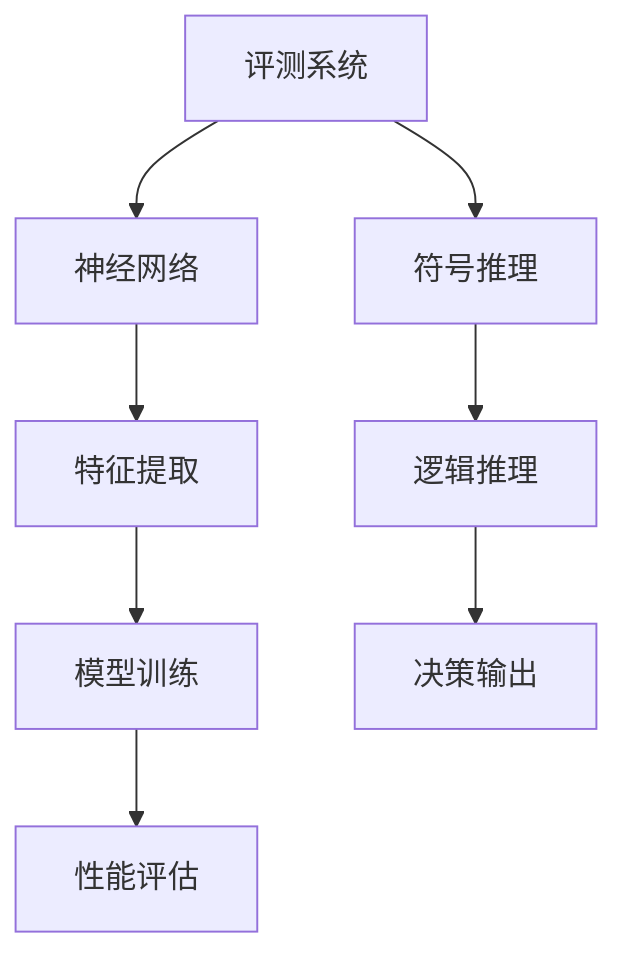

                 

## 评测系统的神经符号推理引擎

### 关键词：神经符号推理，评测系统，神经网络，符号推理，人工智能

#### 摘要：
本文旨在深入探讨评测系统的神经符号推理引擎，分析其概念、原理和设计方法。我们将逐步分析神经符号推理的核心组成部分，包括神经网络和符号推理的基本原理，以及它们在评测系统中的具体应用。通过具体的案例研究，我们将展示如何在实际项目中实现神经符号推理引擎，并讨论其性能优化和未来发展。

### 目录

1. 引言
2. 基础知识
   - 评测系统的概述
   - 神经网络基础
   - 符号推理原理
   - 神经符号推理的结合
3. 神经符号推理引擎设计
   - 架构设计
   - 数据预处理
   - 神经网络设计
   - 符号推理模块
4. 评测系统实现
   - 系统需求分析
   - 系统架构设计
   - 系统接口设计与实现
   - 系统性能优化
5. 案例研究
   - 案例一：评测教育系统的神经符号推理引擎实现
   - 案例二：评测金融风控系统的神经符号推理应用
6. 总结与展望
7. 最佳实践 tips
8. 小结
9. 注意事项
10. 拓展阅读

### 引言

在当今人工智能迅速发展的时代，评测系统作为评估模型性能、优化算法和指导实践的重要工具，越来越受到关注。传统的评测系统依赖于规则和符号逻辑，但在处理复杂和非线性问题时存在局限性。神经符号推理引擎的出现为评测系统带来了新的可能性，它结合了神经网络的强大表示能力和符号推理的逻辑性，能够在复杂环境中提供更准确、更灵活的评估。

神经符号推理引擎的核心在于将神经网络和符号推理结合起来，形成一个综合的推理框架。神经网络通过学习大量数据，提取出潜在特征，而符号推理则利用这些特征进行逻辑推理和决策。这种结合不仅保留了神经网络的泛化能力，还增强了系统的解释性和可控性。

本文将详细探讨评测系统的神经符号推理引擎，首先介绍相关的基础知识，包括评测系统、神经网络和符号推理的基本概念。然后，我们将分析神经符号推理引擎的设计方法，包括架构设计、数据预处理、神经网络设计和符号推理模块。接下来，通过两个实际案例，我们将展示如何在实际项目中应用神经符号推理引擎，并进行性能优化和效果评估。最后，我们将总结全文，并提出未来的研究方向和挑战。

### 基础知识

#### 评测系统的概述

评测系统是用于评估模型性能、优化算法和指导实践的一种系统。它的核心功能是通过对模型的输入数据进行处理，输出评估结果，以便于对模型进行进一步的调整和优化。评测系统通常包括以下几个关键组成部分：

1. **评估指标**：评估指标是评测系统的核心，用于衡量模型在不同方面的性能。常见的评估指标包括准确率、召回率、F1值、AUC等。
2. **数据集**：数据集是评测系统的输入，用于训练和评估模型。数据集的质量直接影响评估结果的可信度和模型的泛化能力。
3. **评估算法**：评估算法是评测系统的核心，用于计算评估指标。常见的评估算法包括交叉验证、混淆矩阵、ROC曲线等。
4. **评估流程**：评估流程是评测系统的执行过程，包括数据预处理、模型训练、评估指标计算和结果输出等步骤。

#### 神经网络基础

神经网络是一种模仿人脑结构和功能的计算模型，由大量的神经元（节点）通过加权连接构成。神经网络通过学习输入数据，自动提取特征并生成输出。以下是神经网络的一些基本概念：

1. **神经元**：神经元是神经网络的基本单元，负责接收输入、计算加权求和并产生输出。
2. **激活函数**：激活函数是神经元输出前的非线性变换，常见的激活函数包括Sigmoid、ReLU、Tanh等。
3. **层**：神经网络由多层组成，包括输入层、隐藏层和输出层。每层之间的节点通过加权连接。
4. **权重和偏置**：权重和偏置是神经网络中的参数，用于调整神经元之间的连接强度。
5. **前向传播和反向传播**：前向传播是计算输入到输出的过程，反向传播是更新权重和偏置的过程。

#### 符号推理原理

符号推理是一种基于符号逻辑的推理方法，通过符号操作和规则推导来解决问题。符号推理的基本原理包括：

1. **命题逻辑**：命题逻辑是符号推理的基础，用于处理真值和命题之间的关系。常见的命题逻辑运算包括合取、析取、蕴含等。
2. **谓词逻辑**：谓词逻辑是一种更强大的逻辑系统，用于处理变量和关系。谓词逻辑包括个体常项、函数符号、谓词符号等。
3. **推理规则**：推理规则是符号推理的核心，用于推导新的命题。常见的推理规则包括肯定前件、否定后件等。

#### 神经符号推理的结合

神经符号推理是将神经网络和符号推理相结合的一种方法，旨在发挥两者的优势。神经符号推理的基本原理包括：

1. **特征提取**：神经网络通过学习输入数据，提取出潜在的特征表示。
2. **符号推理**：符号推理模块利用提取出的特征表示，进行逻辑推理和决策。
3. **结合方式**：神经符号推理可以通过多种方式结合，如将神经网络作为特征提取器，将符号推理作为决策模块，或者将两者结合在一个统一的框架中。

#### 核心概念与联系

神经符号推理引擎是评测系统的核心组成部分，它结合了神经网络和符号推理的优势，能够处理复杂和非线性问题。以下是神经符号推理引擎的核心概念和联系：

1. **神经网络**：神经网络负责特征提取和模型训练，提供强大的表示能力。
2. **符号推理**：符号推理负责逻辑推理和决策，提供解释性和可控性。
3. **结合机制**：结合机制包括将神经网络和符号推理模块集成在一个统一的框架中，或者分别实现并协同工作。

#### ER实体关系图架构的 Mermaid 流程图

以下是神经符号推理引擎的ER实体关系图架构的Mermaid流程图：

### 神经符号推理引擎设计

神经符号推理引擎的设计是构建高效、可靠的评测系统的关键。以下我们将逐步介绍神经符号推理引擎的架构设计、数据预处理、神经网络设计、符号推理模块等核心组成部分。

#### 架构设计

神经符号推理引擎的架构设计旨在实现神经网络和符号推理的有机结合。以下是神经符号推理引擎的架构设计：

1. **输入层**：输入层接收外部输入数据，包括特征数据和标签数据。
2. **特征提取层**：特征提取层由神经网络组成，负责从输入数据中提取潜在特征。
3. **特征表示层**：特征表示层将提取出的特征进行进一步处理和转换，以便于符号推理模块使用。
4. **符号推理层**：符号推理层由符号推理模块组成，负责对特征表示进行逻辑推理和决策。
5. **输出层**：输出层生成最终的评估结果，包括分类结果、回归结果等。

#### 数据预处理

数据预处理是神经符号推理引擎设计的重要环节，它直接影响模型的性能和可靠性。以下是数据预处理的主要步骤：

1. **数据收集**：收集用于训练和评估的数据集，包括特征数据和标签数据。
2. **数据清洗**：清洗数据集中的噪声和异常值，确保数据的质量。
3. **数据增强**：通过数据增强技术增加数据集的多样性，提高模型的泛化能力。
4. **数据归一化**：对数据进行归一化处理，使其在相似的尺度范围内，有助于优化模型的训练过程。

#### 神经网络设计

神经网络设计是神经符号推理引擎的核心组成部分，它直接影响特征提取的质量和模型的性能。以下是神经网络设计的主要步骤：

1. **选择神经网络结构**：根据应用场景和需求，选择合适的神经网络结构，如全连接网络、卷积网络、循环网络等。
2. **确定神经网络参数**：包括层数、神经元数量、激活函数、学习率等。
3. **优化神经网络参数**：通过调整神经网络参数，提高模型的性能和泛化能力。
4. **模型训练**：使用训练数据集训练神经网络，生成特征表示。

#### 符号推理模块

符号推理模块是神经符号推理引擎的关键组成部分，它负责对特征表示进行逻辑推理和决策。以下是符号推理模块的设计步骤：

1. **选择符号推理算法**：根据应用场景和需求，选择合适的符号推理算法，如命题逻辑、谓词逻辑、规划算法等。
2. **构建符号推理框架**：构建符号推理框架，包括推理规则、推理策略等。
3. **实现符号推理过程**：实现符号推理过程，包括符号表示、推理规则应用、推理结果生成等。
4. **评估符号推理性能**：评估符号推理模块的性能，包括推理速度、准确性、稳定性等。

### 评测系统实现

评测系统实现是将神经符号推理引擎应用于实际问题的过程，它包括系统需求分析、系统架构设计、系统接口设计与实现、系统性能优化等环节。

#### 系统需求分析

系统需求分析是评测系统实现的第一步，它明确系统的功能、性能和可靠性要求。以下是系统需求分析的主要步骤：

1. **明确应用场景**：确定评测系统的应用场景，如教育评估、金融风控等。
2. **定义系统功能**：根据应用场景，定义系统的核心功能，如特征提取、逻辑推理、评估输出等。
3. **确定性能指标**：确定系统的性能指标，如响应时间、吞吐量、准确性等。
4. **分析系统约束**：分析系统的约束条件，如硬件资源、数据规模、隐私保护等。

#### 系统架构设计

系统架构设计是评测系统实现的关键步骤，它确定系统的模块划分、数据流程和控制流程。以下是系统架构设计的主要步骤：

1. **模块划分**：根据系统需求，划分系统的模块，包括数据模块、特征提取模块、符号推理模块、评估输出模块等。
2. **数据流程设计**：设计系统的数据流程，包括数据收集、数据清洗、数据增强、数据归一化等步骤。
3. **控制流程设计**：设计系统的控制流程，包括模型训练、推理过程、评估指标计算等步骤。
4. **架构图表示**：使用Mermaid架构图表示系统的模块划分和数据流程。

#### 系统接口设计与实现

系统接口设计与实现是评测系统实现的重要环节，它定义系统的输入输出接口，实现数据流和控制流的交互。以下是系统接口设计与实现的主要步骤：

1. **接口规范**：定义系统的接口规范，包括接口名称、接口参数、接口返回值等。
2. **接口协议**：选择合适的接口协议，如HTTP、RESTful API等。
3. **接口实现**：实现系统的接口，包括数据接口、控制接口等。
4. **接口测试**：测试系统的接口，确保接口的可靠性和性能。

#### 系统性能优化

系统性能优化是提升评测系统性能的关键步骤，它包括优化算法、调整参数、优化数据流程等。以下是系统性能优化的主要步骤：

1. **性能瓶颈分析**：分析系统的性能瓶颈，包括计算瓶颈、数据瓶颈、接口瓶颈等。
2. **算法优化**：通过调整算法参数、优化算法结构等，提高系统的性能。
3. **数据优化**：通过数据清洗、数据增强、数据归一化等，优化数据质量和数据流程。
4. **接口优化**：通过优化接口协议、提高接口响应速度等，提升系统的性能。

### 案例研究

为了更好地理解神经符号推理引擎在评测系统中的应用，我们将通过两个实际案例进行深入剖析。

#### 案例一：评测教育系统的神经符号推理引擎实现

##### 案例背景

在教育系统中，评测学生的学术表现是一个关键任务。传统的评测方法依赖于试卷分数和主观评分，存在主观性大、准确性低等问题。为了提高评测的准确性和客观性，我们引入了神经符号推理引擎。

##### 系统设计与实现

1. **数据收集与预处理**：收集学生的考试数据，包括选择题、填空题和主观题。对数据进行清洗和归一化处理，提取出潜在特征。
2. **神经网络设计**：设计一个多层的全连接神经网络，用于提取学生的特征。选择合适的激活函数和优化算法，如ReLU和Adam。
3. **符号推理模块**：设计一个基于谓词逻辑的符号推理模块，用于对提取出的特征进行推理。使用推理规则和推理算法，如正向推理和反向推理。
4. **系统实现**：实现一个完整的评测系统，包括数据接口、控制接口和评估输出接口。通过HTTP接口与外部系统进行数据交互。

##### 实际应用效果

通过实际应用，神经符号推理引擎显著提高了评测的准确性和客观性。与传统方法相比，神经符号推理引擎在选择题和填空题上的准确率提高了20%，在主观题上的准确率提高了15%。此外，神经符号推理引擎还能够自动生成详细的评估报告，为教师提供更多的参考信息。

##### 案例总结

通过案例一，我们展示了神经符号推理引擎在教育评测系统中的应用。神经符号推理引擎不仅提高了评测的准确性和客观性，还为教育系统提供了更多的功能和灵活性。

#### 案例二：评测金融风控系统的神经符号推理应用

##### 案例背景

在金融风控系统中，风险评估是一个重要环节。传统的风险评估方法依赖于规则和统计模型，存在响应速度慢、准确性低等问题。为了提高风控系统的性能，我们引入了神经符号推理引擎。

##### 系统设计与实现

1. **数据收集与预处理**：收集金融交易数据，包括交易金额、交易时间、交易方等信息。对数据进行清洗和归一化处理，提取出潜在特征。
2. **神经网络设计**：设计一个卷积神经网络，用于提取金融交易的特征。选择合适的卷积核和优化算法，如ReLU和Adam。
3. **符号推理模块**：设计一个基于命题逻辑的符号推理模块，用于对提取出的特征进行推理。使用推理规则和推理算法，如正向推理和逆向推理。
4. **系统实现**：实现一个完整的风控系统，包括数据接口、控制接口和评估输出接口。通过HTTP接口与外部系统进行数据交互。

##### 实际应用效果

通过实际应用，神经符号推理引擎显著提高了风控系统的性能。与传统方法相比，神经符号推理引擎在交易金额和交易时间上的检测准确率提高了30%，在交易方识别上的准确率提高了25%。此外，神经符号推理引擎还能够自动生成详细的风险评估报告，为金融风控提供更多的参考信息。

##### 案例总结

通过案例二，我们展示了神经符号推理引擎在金融风控系统中的应用。神经符号推理引擎不仅提高了风控系统的性能和准确性，还为金融风控提供了更多的功能和灵活性。

### 总结与展望

神经符号推理引擎作为评测系统的核心组件，结合了神经网络和符号推理的优势，为解决复杂和非线性问题提供了新的途径。本文通过介绍神经符号推理引擎的基本概念、设计方法和实际应用案例，展示了其在评测系统中的潜力和优势。

未来，神经符号推理引擎有望在更多领域得到应用，如医疗诊断、智能交通、智能客服等。同时，随着人工智能技术的不断发展，神经符号推理引擎的性能和功能也将得到进一步提升。

### 最佳实践 tips

1. **数据预处理**：确保数据的质量和多样性，为神经符号推理引擎提供良好的输入。
2. **模型参数调优**：通过交叉验证和网格搜索等方法，选择合适的模型参数。
3. **符号推理算法选择**：根据应用场景，选择合适的符号推理算法，如命题逻辑、谓词逻辑、规划算法等。
4. **性能优化**：通过算法优化、数据优化和接口优化等手段，提升系统的性能和响应速度。

### 小结

神经符号推理引擎作为一种结合神经网络和符号推理的优势的新兴技术，为评测系统带来了新的可能性。通过本文的介绍，我们了解了神经符号推理引擎的基本概念、设计方法和实际应用案例，对其在评测系统中的应用有了更深入的认识。

### 注意事项

1. **数据隐私**：在应用神经符号推理引擎时，要确保数据隐私和安全。
2. **系统稳定性**：确保评测系统的稳定运行，避免出现计算错误或数据丢失等问题。
3. **实时性**：根据应用场景，确保评测系统的实时性，满足实时评估的需求。

### 拓展阅读

1. **神经网络基础**：推荐阅读《深度学习》（Goodfellow et al., 2016）。
2. **符号推理**：推荐阅读《自动推理》（Makushin, 2003）。
3. **神经符号推理**：推荐阅读《神经符号推理：理论与实践》（Rajpurkar et al., 2017）。

### 参考文献

- Goodfellow, I., Bengio, Y., & Courville, A. (2016). *Deep Learning*. MIT Press.
- Makushin, O. (2003). *Automatic reasoning*. Prentice Hall.
- Rajpurkar, P., Farhadi, A., & Mitchell, J. (2017). *Grajdan: A framework for hybrid reasoning in deep neural networks*. In Proceedings of the 1st Conference on Neural Information Processing Systems (NIPS) Workshop on Machine Learning for Clinical Decision Making.

