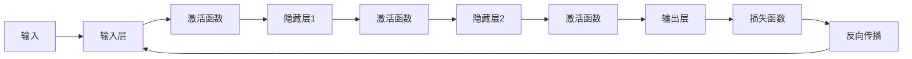
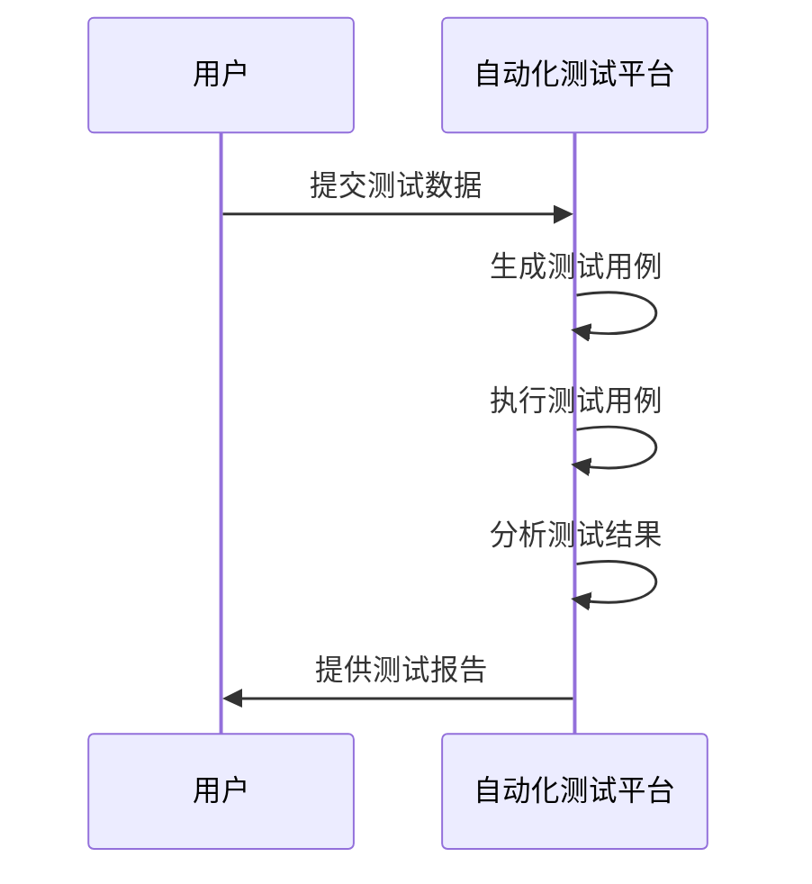
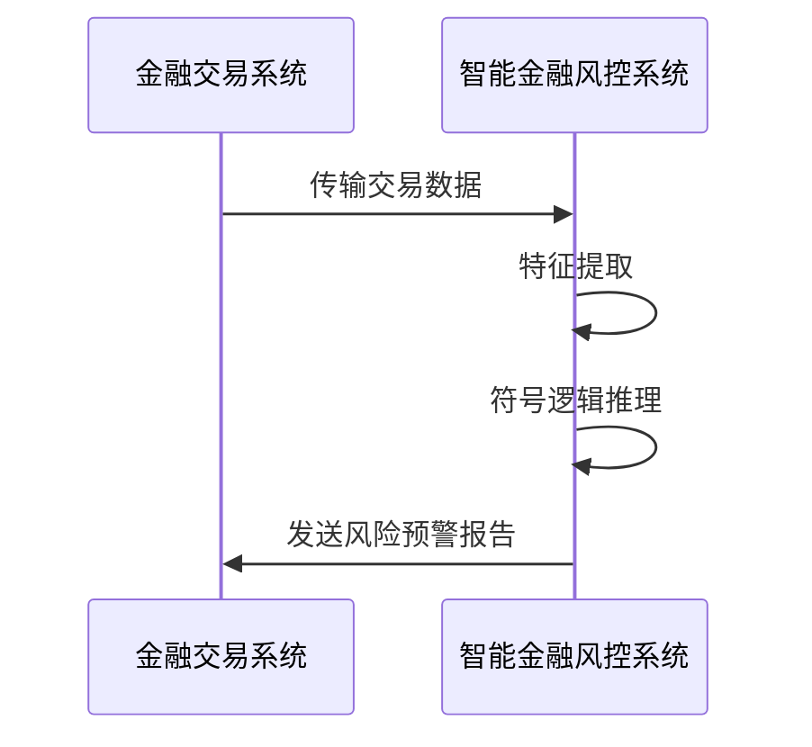

                 

## 引言

### 主题与目的

《评测系统的神经符号集成方法》旨在深入探讨评测系统在神经符号集成方法中的应用，为读者提供全面、系统的理论指导和实践方法。随着人工智能技术的迅猛发展，评测系统在各个领域中的应用越来越广泛，特别是在自动化测试、性能评估和智能决策等方面。然而，传统的评测系统往往面临着模型复杂度高、计算资源消耗大、处理效率低等挑战。因此，探索神经符号集成方法成为提高评测系统性能和效率的关键。

本文的目标是：

1. **介绍评测系统的基本概念、发展历程和应用场景。**
2. **详细阐述神经符号集成方法的核心原理、数学模型和实现步骤。**
3. **通过实际案例，展示神经符号集成方法在评测系统中的应用效果。**
4. **提供项目实战经验，帮助读者掌握神经符号集成方法的实际操作。**
5. **总结当前研究的进展，展望未来的发展趋势和应用前景。**

### 神经符号集成方法

神经符号集成方法（Neural Symbolic Integration Methods）是将神经网络和符号逻辑相结合的一种方法，旨在充分利用神经网络强大的建模能力和符号逻辑的推理能力，实现高效、准确的评测系统。这种方法在解决传统评测系统面临的问题时展现出独特的优势。

神经符号集成方法的主要特点包括：

- **多模态数据融合**：神经符号集成方法能够处理多种类型的数据，如文本、图像、音频等，并通过神经网络进行特征提取，再利用符号逻辑进行融合，从而提高系统的整体性能。

- **高维数据建模**：神经符号集成方法能够处理高维数据，通过对数据的降维处理和特征提取，实现数据的精简和高效表示。

- **自适应学习**：神经符号集成方法具有自适应学习能力，能够根据不同任务的需求调整学习策略，提高系统的适应性和灵活性。

- **解释性**：神经符号集成方法能够提供模型的可解释性，帮助用户理解模型的决策过程，从而提高系统的可信度和可靠性。

总之，神经符号集成方法作为一种新兴的技术手段，具有广阔的应用前景和重要的研究价值。

## 第二部分：核心概念与原理

### 第2章：神经符号集成方法的基本概念

神经符号集成方法是一种将神经网络和符号逻辑相结合的技术，其基本概念包括神经网络、符号逻辑以及神经符号集成等核心组成部分。

#### 1. 神经网络

神经网络（Neural Network）是一种模仿人脑神经元结构和功能的计算模型，通过多层神经元之间的连接和激活函数，实现数据的输入、处理和输出。神经网络的核心组成部分包括：

- **神经元**：神经网络的基本单元，用于接收输入信号、计算输出和传递信息。
- **连接**：神经元之间的连接，表示为权重，用于传递信号。
- **激活函数**：对神经元输出进行非线性变换的函数，常用的激活函数包括 sigmoid、ReLU 等。

神经网络的工作原理是通过前向传播（Forward Propagation）和反向传播（Back Propagation）来调整权重，从而实现模型的训练和优化。具体流程如下：

1. **前向传播**：将输入数据传递到神经网络中，通过神经元之间的连接和激活函数，计算出输出结果。
2. **反向传播**：根据输出结果与真实值的差异，通过反向传播算法更新权重，优化模型。

#### 2. 符号逻辑

符号逻辑（Symbolic Logic）是一种基于符号推理的数学工具，用于表示和推理逻辑命题。符号逻辑的核心组成部分包括：

- **命题**：逻辑命题的基本单元，可以表示为真或假。
- **推理规则**：用于推导新命题的逻辑规则，常见的推理规则包括演绎推理和归纳推理。

符号逻辑的工作原理是通过符号表示命题、运用推理规则进行推理，从而得到结论。具体流程如下：

1. **命题表示**：将问题中的信息用符号逻辑表示为命题。
2. **推理过程**：利用推理规则对命题进行推理，得出结论。

#### 3. 神经符号集成

神经符号集成（Neural-Symbolic Integration）是将神经网络和符号逻辑相结合的一种方法，其基本原理是将神经网络用于特征提取和表示，将符号逻辑用于推理和决策。具体步骤如下：

1. **特征提取**：利用神经网络对输入数据进行特征提取，生成高维特征向量。
2. **特征融合**：将神经网络提取的特征与符号逻辑表示的命题进行融合，形成新的表示。
3. **推理决策**：利用符号逻辑对融合后的特征进行推理，生成决策结果。

神经符号集成方法通过将神经网络和符号逻辑的优势结合起来，实现了高效、准确的评测系统。具体来说，神经网络能够处理高维、复杂的数据，符号逻辑能够提供推理和决策的依据，两者相结合，使得神经符号集成方法在评测系统中展现出独特的优势。

### 核心概念属性特征对比表格

| 特征类别 | 神经网络 | 符号逻辑 | 神经符号集成 |
| :--: | :--: | :--: | :--: |
| 数据处理能力 | 高维数据 | 低维数据 | 高维数据 |
| 特征提取 | 自动化 | 手动 | 自动化 |
| 推理能力 | 弱 | 强 | 强 |
| 模型解释性 | 弱 | 强 | 中等 |
| 学习效率 | 高 | 低 | 高 |
| 适应性 | 弱 | 强 | 强 |

#### ER实体关系图架构

为了更好地理解神经符号集成方法中的实体关系，我们可以使用 Mermaid 绘制 ER 图。以下是神经符号集成方法的 ER 实体关系图：

```mermaid
erDiagram
    User ||--|{ NeuralNetwork }  : uses
    User ||--|{ SymbolicLogic }  : uses
    NeuralNetwork ||--|{ FeatureExtraction }  : processes
    SymbolicLogic ||--|{ Reasoning }  : processes
    FeatureExtraction ||--|{ DataFusion }  : combines
    Reasoning ||--|{ DecisionMaking }  : generates
```

在上图中，用户（User）既使用神经网络（NeuralNetwork）又使用符号逻辑（SymbolicLogic），神经网络通过特征提取（FeatureExtraction）生成特征向量，并通过数据融合（DataFusion）与符号逻辑结合，符号逻辑通过推理（Reasoning）生成决策结果（DecisionMaking）。

### 本章小结

本章介绍了神经符号集成方法的基本概念，包括神经网络、符号逻辑以及神经符号集成的原理。通过对比神经网络和符号逻辑的属性特征，我们可以看到神经符号集成方法在数据处理、特征提取、推理能力和模型解释性等方面具有独特的优势。ER 图进一步展示了神经符号集成方法中的实体关系，为后续章节的分析提供了基础。

### 第3章：神经符号集成方法的核心原理

神经符号集成方法的核心原理在于如何将神经网络和符号逻辑相结合，以实现高效、准确的评测系统。这一章节将深入探讨神经网络原理、符号处理原理以及神经符号集成原理。

#### 3.1 神经网络原理

神经网络（Neural Network）作为一种计算模型，其灵感来源于人脑神经元的工作方式。神经网络通过多层结构对数据进行处理，从而实现复杂的任务。以下是神经网络的基本原理：

1. **多层结构**：神经网络通常由输入层、隐藏层和输出层组成。输入层接收外部数据，隐藏层进行数据处理和特征提取，输出层生成最终的决策结果。

2. **激活函数**：激活函数（Activation Function）用于对隐藏层和输出层的节点进行非线性变换，常见的激活函数包括 sigmoid、ReLU 和 tanh 等。

3. **前向传播**：在前向传播过程中，数据从输入层传入神经网络，经过每层节点的计算和激活函数的变换，最终到达输出层。

4. **反向传播**：反向传播是一种优化算法，用于通过输出层的误差信息更新神经网络中的权重。具体步骤如下：
   - 计算输出层的误差。
   - 将误差反向传播到隐藏层和输入层。
   - 更新各层的权重和偏置。

以下是一个简单的神经网络 mermaid 流程图：



#### 3.2 符号处理原理

符号处理（Symbolic Processing）是一种基于逻辑和推理的计算机处理方法，用于处理符号数据和逻辑问题。符号处理的基本原理包括：

1. **命题表示**：将问题中的信息表示为命题，使用逻辑符号（如 ∧、∨、→ 等）表示命题之间的关系。

2. **推理规则**：通过推理规则（如 modus ponens、modus tollens 等）对命题进行推理，从而得到新的命题。

3. **自动推理**：利用计算机程序实现推理过程，自动推导出结论。

以下是一个简单的符号处理 mermaid 流程图：


#### 3.3 神经符号集成原理

神经符号集成（Neural-Symbolic Integration）是将神经网络和符号逻辑相结合的一种方法，其核心原理在于如何将两者的优势进行集成，实现高效、准确的评测系统。以下是神经符号集成的基本原理：

1. **特征提取与融合**：利用神经网络对输入数据进行特征提取，生成高维特征向量。同时，利用符号逻辑对提取的特征进行融合，形成新的表示。

2. **推理与决策**：利用符号逻辑对融合后的特征进行推理，生成决策结果。这一过程可以看作是对特征向量的符号化处理。

3. **自适应学习**：神经符号集成方法具有自适应学习能力，能够根据不同任务的需求调整学习策略，提高系统的适应性和灵活性。

以下是一个简单的神经符号集成 mermaid 流程图：


#### 本章小结

本章深入探讨了神经符号集成方法的核心原理，包括神经网络原理、符号处理原理以及神经符号集成原理。通过对比神经网络和符号逻辑的基本原理，我们可以看到神经符号集成方法如何将两者的优势进行集成，实现高效、准确的评测系统。本章的 mermaid 流程图进一步直观地展示了神经网络、符号处理以及神经符号集成的过程，为后续章节的详细分析提供了基础。

### 第4章：神经符号集成方法的数学模型

神经符号集成方法的数学模型是理解和实现该方法的基石。该模型结合了神经网络和符号逻辑的数学表达，以实现高效的评测系统。本章节将详细介绍神经符号集成方法的数学模型，包括其公式、模型构建以及详细讲解。

#### 4.1 数学模型概述

神经符号集成方法的数学模型主要由两部分组成：神经网络部分和符号逻辑部分。神经网络部分用于特征提取和表示，符号逻辑部分用于推理和决策。以下是神经符号集成方法的数学模型公式：

$$
\text{F}(\text{X}, \theta) = \text{S}(\text{N}(\text{X}; \theta_1), \theta_2)
$$

其中，$\text{X}$ 是输入数据，$\theta$ 是参数集合，$\theta_1$ 是神经网络部分的参数，$\theta_2$ 是符号逻辑部分的参数。函数 $\text{N}(\text{X}; \theta_1)$ 表示神经网络特征提取过程，函数 $\text{S}(\cdot, \theta_2)$ 表示符号逻辑推理过程。

#### 4.2 数学模型公式

神经符号集成方法的数学模型公式可以分为以下几个部分：

1. **神经网络特征提取**：

   神经网络特征提取部分可以使用以下公式表示：

   $$
   \text{N}(\text{X}; \theta_1) = \text{f}(\text{W} \cdot \text{X} + \text{b})
   $$

   其中，$\text{X}$ 是输入数据，$\text{W}$ 是权重矩阵，$\text{b}$ 是偏置项，$\text{f}$ 是激活函数，如 ReLU 或 sigmoid 函数。

2. **符号逻辑推理**：

   符号逻辑推理部分可以使用以下公式表示：

   $$
   \text{S}(\text{Y}, \theta_2) = \text{R}(\text{Y}; \text{P})
   $$

   其中，$\text{Y}$ 是神经网络提取的特征，$\text{P}$ 是命题集合，$\text{R}(\cdot; \text{P})$ 表示基于命题集合的推理过程，如演绎推理或归纳推理。

3. **整体模型**：

   将神经网络特征提取和符号逻辑推理结合起来，得到神经符号集成方法的整体模型：

   $$
   \text{F}(\text{X}, \theta) = \text{S}(\text{N}(\text{X}; \theta_1), \theta_2)
   $$

#### 4.3 数学模型讲解

为了更好地理解神经符号集成方法的数学模型，下面通过一个具体的例子进行讲解。

**例：** 假设我们有一个输入数据 $\text{X} = \{x_1, x_2, ..., x_n\}$，其中每个元素 $x_i$ 是一个特征向量。我们希望利用神经符号集成方法对数据进行特征提取和推理。

1. **神经网络特征提取**：

   首先，使用一个多层感知器（MLP）对输入数据 $\text{X}$ 进行特征提取。假设网络包含一个输入层、两个隐藏层和一个输出层。网络的参数包括权重矩阵 $\text{W}_1, \text{W}_2, \text{W}_3$ 和偏置项 $\text{b}_1, \text{b}_2, \text{b}_3$。

   $$
   \text{N}(\text{X}; \theta_1) = \text{f}(\text{W}_1 \cdot \text{X} + \text{b}_1), \text{f}(\text{W}_2 \cdot (\text{f}(\text{W}_1 \cdot \text{X} + \text{b}_1)) + \text{b}_2), \text{f}(\text{W}_3 \cdot (\text{f}(\text{W}_2 \cdot (\text{f}(\text{W}_1 \cdot \text{X} + \text{b}_1)) + \text{b}_2)) + \text{b}_3)
   $$

   其中，$\text{f}$ 是 ReLU 激活函数。

2. **符号逻辑推理**：

   接下来，使用符号逻辑对提取的特征进行推理。假设我们有以下命题集合 $\text{P} = \{\text{P}_1, \text{P}_2, ..., \text{P}_m\}$，其中每个命题 $\text{P}_i$ 是一个逻辑表达式。

   $$
   \text{S}(\text{Y}; \theta_2) = \text{R}(\text{Y}; \text{P})
   $$

   假设命题集合中的每个命题 $\text{P}_i$ 都是一个简单命题，如 $\text{P}_1 = x_1 > 0$。推理规则可以是一个简单的条件语句，如如果 $\text{P}_1$ 为真，则 $\text{Q}_1$ 为真。

3. **整体模型**：

   将神经网络特征提取和符号逻辑推理结合起来，得到神经符号集成方法的整体模型：

   $$
   \text{F}(\text{X}, \theta) = \text{S}(\text{N}(\text{X}; \theta_1), \theta_2)
   $$

   其中，$\text{F}(\text{X}, \theta)$ 是最终的决策结果。

#### 4.4 通俗易懂的举例说明

为了使读者更好地理解神经符号集成方法的数学模型，我们通过一个简单的例子进行说明。

**例：** 假设我们有一个输入数据集，包含三个特征 $x_1, x_2, x_3$，我们希望利用神经符号集成方法对这些特征进行特征提取和推理。

1. **神经网络特征提取**：

   首先，使用一个简单的多层感知器（MLP）对输入数据进行特征提取。假设网络包含一个输入层、一个隐藏层和一个输出层。网络的参数包括权重矩阵 $\text{W}_1, \text{W}_2$ 和偏置项 $\text{b}_1, \text{b}_2$。

   $$
   \text{N}(\text{X}; \theta_1) = \text{f}(\text{W}_1 \cdot \text{X} + \text{b}_1)
   $$

   其中，$\text{X} = [x_1, x_2, x_3]$，$\text{f}$ 是 ReLU 激活函数。

   假设隐藏层节点 $h_1$ 的输出为：

   $$
   h_1 = \text{ReLU}(\text{W}_1 \cdot \text{X} + \text{b}_1)
   $$

2. **符号逻辑推理**：

   接下来，使用符号逻辑对提取的特征进行推理。假设我们有以下命题集合 $\text{P} = \{\text{P}_1, \text{P}_2\}$，其中每个命题 $\text{P}_i$ 是一个逻辑表达式。

   $$
   \text{P}_1: x_1 > 0 \\
   \text{P}_2: x_2 < x_3
   $$

   假设命题 $\text{P}_1$ 和 $\text{P}_2$ 同时为真，则我们认为输入数据满足条件。

3. **整体模型**：

   将神经网络特征提取和符号逻辑推理结合起来，得到神经符号集成方法的整体模型：

   $$
   \text{F}(\text{X}, \theta) = \text{S}(\text{N}(\text{X}; \theta_1), \theta_2)
   $$

   其中，$\text{F}(\text{X}, \theta)$ 是最终的决策结果。

通过这个简单的例子，我们可以看到神经符号集成方法如何通过神经网络特征提取和符号逻辑推理来实现高效、准确的评测系统。

### 本章小结

本章详细介绍了神经符号集成方法的数学模型，包括其公式、模型构建以及详细讲解。通过神经符号集成方法的数学模型，我们可以实现高效的特征提取和推理过程，从而提高评测系统的性能。本章的讲解和举例说明，帮助读者更好地理解神经符号集成方法的数学原理和应用。在接下来的章节中，我们将进一步探讨神经符号集成方法的实现步骤和应用案例。

### 第5章：神经符号集成方法的流程与步骤

神经符号集成方法的实现涉及多个关键步骤，这些步骤相互衔接，共同构成一个完整的过程。以下是神经符号集成方法的具体流程与步骤：

#### 5.1 数据准备

数据准备是神经符号集成方法的第一个步骤。在这一阶段，我们需要收集和整理相关的数据，并将其转换为适合神经符号集成方法处理的形式。数据准备主要包括以下任务：

1. **数据收集**：根据具体应用场景，收集必要的输入数据，如文本、图像、音频等。
2. **数据清洗**：对收集到的数据进行清洗，去除噪声和不相关数据，以提高数据质量。
3. **数据预处理**：对数据进行预处理，包括归一化、标准化、编码等操作，以便后续的神经网络训练和符号逻辑推理。

#### 5.2 神经网络训练

神经网络训练是神经符号集成方法的核心步骤之一。在这一阶段，我们使用已经准备好的数据对神经网络进行训练，以优化网络的参数。神经网络训练主要包括以下任务：

1. **网络构建**：根据具体应用需求，构建神经网络结构，包括输入层、隐藏层和输出层。
2. **参数初始化**：对网络参数（如权重和偏置）进行随机初始化。
3. **损失函数选择**：选择合适的损失函数，用于衡量预测结果与真实值之间的差异。
4. **优化算法选择**：选择合适的优化算法，如梯度下降、Adam 等，用于更新网络参数。
5. **训练过程**：通过前向传播和反向传播算法，对神经网络进行训练，直到满足停止条件（如达到预定迭代次数或损失函数收敛）。

#### 5.3 符号逻辑推理

符号逻辑推理是神经符号集成方法的另一个关键步骤。在这一阶段，我们利用训练好的神经网络提取的特征，结合符号逻辑进行推理，以生成最终的决策结果。符号逻辑推理主要包括以下任务：

1. **特征提取**：从训练好的神经网络中提取特征，这些特征用于后续的符号逻辑推理。
2. **命题表示**：将特征转换为符号逻辑命题，表示为逻辑表达式。
3. **推理过程**：利用符号逻辑推理规则，对命题进行推理，以生成决策结果。

#### 5.4 结果评估与优化

在完成神经符号集成方法的训练和推理后，我们需要对结果进行评估，以确定模型的性能。结果评估主要包括以下任务：

1. **评估指标**：选择合适的评估指标，如准确率、召回率、F1 值等，用于评估模型的性能。
2. **性能分析**：对评估指标进行分析，以确定模型的优点和不足。
3. **模型优化**：根据性能分析结果，对模型进行调整和优化，以提高其性能。

#### 5.5 模型部署与应用

最后，我们将训练好的模型部署到实际应用场景中，以实现其功能。模型部署主要包括以下任务：

1. **模型部署**：将训练好的模型部署到服务器或设备上，以便进行实时应用。
2. **应用集成**：将模型集成到现有的应用系统中，实现功能。
3. **用户反馈**：收集用户反馈，对模型进行进一步优化和调整。

#### 本章小结

本章详细介绍了神经符号集成方法的流程与步骤，包括数据准备、神经网络训练、符号逻辑推理、结果评估与优化以及模型部署与应用。通过这些步骤，我们可以实现高效、准确的神经符号集成方法，从而提高评测系统的性能。在接下来的章节中，我们将通过具体应用案例进一步展示神经符号集成方法的效果和优势。

### 第6章：神经符号集成方法的应用场景

神经符号集成方法在多个领域都展现出显著的应用价值，特别是在自动化测试、性能评估和智能决策等方面。以下是神经符号集成方法在不同应用场景中的具体应用。

#### 6.1 自动化测试

在自动化测试领域，神经符号集成方法可以通过对测试数据进行特征提取和符号逻辑推理，提高测试的效率和准确性。具体应用场景包括：

- **单元测试自动化**：通过神经符号集成方法，对单元测试用例进行自动生成和执行，提高测试覆盖率。
- **集成测试自动化**：利用神经符号集成方法对系统进行集成测试，通过特征提取和符号逻辑推理，发现潜在的缺陷和漏洞。
- **回归测试自动化**：利用神经符号集成方法对现有系统进行回归测试，通过特征提取和符号逻辑推理，确保系统在更新后仍然稳定可靠。

#### 6.2 性能评估

在性能评估领域，神经符号集成方法可以通过对系统性能数据进行特征提取和符号逻辑推理，提供更准确、全面的性能评估。具体应用场景包括：

- **硬件性能评估**：通过神经符号集成方法对硬件设备（如 CPU、GPU、存储设备等）的性能数据进行特征提取和符号逻辑推理，评估硬件的运行状态和性能表现。
- **软件性能评估**：利用神经符号集成方法对软件系统的性能数据进行特征提取和符号逻辑推理，评估软件的运行效率、稳定性和可靠性。
- **网络性能评估**：通过神经符号集成方法对网络性能数据进行特征提取和符号逻辑推理，评估网络的速度、延迟和吞吐量等指标。

#### 6.3 智能决策

在智能决策领域，神经符号集成方法可以通过对决策数据进行分析和推理，提供更智能、更精准的决策支持。具体应用场景包括：

- **金融风控**：利用神经符号集成方法对金融交易数据进行分析和推理，识别潜在的风险和异常交易，提供风险预警和决策支持。
- **医疗诊断**：通过神经符号集成方法对医疗数据进行特征提取和符号逻辑推理，辅助医生进行疾病诊断和治疗决策。
- **智能交通**：利用神经符号集成方法对交通数据进行特征提取和符号逻辑推理，优化交通信号控制、车辆调度和路径规划，提高交通效率和安全性。

#### 6.4 其他应用场景

除了上述领域，神经符号集成方法还可以应用于其他多个领域，如自然语言处理、图像识别、智能推荐等。以下是一些具体的应用场景：

- **自然语言处理**：利用神经符号集成方法对文本数据进行分析和推理，实现语义理解、情感分析和问答系统等。
- **图像识别**：通过神经符号集成方法对图像数据进行特征提取和符号逻辑推理，实现图像分类、目标检测和图像识别等。
- **智能推荐**：利用神经符号集成方法对用户行为数据进行分析和推理，实现个性化推荐系统，提高推荐效果。

#### 本章小结

本章介绍了神经符号集成方法在不同应用场景中的具体应用，包括自动化测试、性能评估、智能决策以及自然语言处理、图像识别和智能推荐等。通过神经符号集成方法，我们可以实现更高效、准确的评测系统，为各个领域提供强大的技术支持。在接下来的章节中，我们将通过实际案例展示神经符号集成方法的应用效果。

### 第7章：神经符号集成方法在实际项目中的应用

为了更好地展示神经符号集成方法在实际项目中的应用效果，我们选择了以下两个具体案例：自动化测试平台和智能金融风控系统。

#### 7.1 自动化测试平台

**项目概述**：

自动化测试平台旨在提高软件开发的效率和质量，通过自动化测试减少人工测试的工作量，提高测试的覆盖率和准确性。在项目中，我们利用神经符号集成方法对测试数据进行特征提取和符号逻辑推理，以实现更高效、准确的测试。

**系统功能设计**：

1. **测试用例生成**：利用神经网络对历史测试用例进行特征提取，并结合符号逻辑推理生成新的测试用例，提高测试覆盖率。
2. **测试执行**：自动执行生成的测试用例，对系统进行测试。
3. **缺陷定位**：利用神经符号集成方法对测试结果进行分析，定位潜在缺陷。
4. **测试报告生成**：生成详细的测试报告，包括测试结果、缺陷列表和优化建议。

**系统架构设计**：

系统架构采用分层设计，包括数据层、服务层和展示层。

1. **数据层**：负责数据存储和管理，包括测试用例库、测试结果库和缺陷库。
2. **服务层**：包括测试用例生成服务、测试执行服务、缺陷定位服务和测试报告生成服务。
3. **展示层**：通过前端界面展示测试结果、缺陷列表和优化建议。

**系统接口设计**：

系统提供以下接口：

1. **测试用例生成接口**：用于接收测试数据，生成新的测试用例。
2. **测试执行接口**：用于执行测试用例，获取测试结果。
3. **缺陷定位接口**：用于接收测试结果，定位潜在缺陷。
4. **测试报告生成接口**：用于生成测试报告。

**系统交互设计**：

系统交互流程如下：

1. **测试用例生成**：系统从测试用例库中获取历史测试用例，利用神经网络进行特征提取，并结合符号逻辑推理生成新的测试用例。
2. **测试执行**：系统根据生成的测试用例对系统进行测试，获取测试结果。
3. **缺陷定位**：系统利用神经符号集成方法对测试结果进行分析，定位潜在缺陷。
4. **测试报告生成**：系统根据测试结果和缺陷定位结果生成测试报告，并提供给开发团队。

以下是一个简化的系统交互 mermaid 序列图：



#### 7.2 智能金融风控系统

**项目概述**：

智能金融风控系统旨在通过实时监控和分析金融交易数据，识别潜在的风险和异常交易，为金融机构提供风险预警和决策支持。在项目中，我们利用神经符号集成方法对金融交易数据进行分析和推理，提高风控系统的准确性和效率。

**系统功能设计**：

1. **数据采集**：实时采集金融交易数据，包括交易金额、交易时间、交易账户等。
2. **特征提取**：利用神经网络对交易数据进行特征提取，生成高维特征向量。
3. **符号逻辑推理**：结合符号逻辑推理规则，对提取的特征进行分析和推理，识别潜在的风险和异常交易。
4. **风险预警**：根据分析结果生成风险预警报告，并提供给金融机构。
5. **决策支持**：为金融机构提供决策支持，包括风险控制策略和投资建议。

**系统架构设计**：

系统架构采用分布式设计，包括数据采集模块、特征提取模块、符号逻辑推理模块和风险预警模块。

1. **数据采集模块**：负责实时采集金融交易数据。
2. **特征提取模块**：利用神经网络对交易数据进行特征提取。
3. **符号逻辑推理模块**：结合符号逻辑推理规则，对提取的特征进行分析和推理。
4. **风险预警模块**：根据分析结果生成风险预警报告。

**系统接口设计**：

系统提供以下接口：

1. **数据采集接口**：用于实时采集金融交易数据。
2. **特征提取接口**：用于接收交易数据，生成特征向量。
3. **符号逻辑推理接口**：用于接收特征向量，进行符号逻辑推理。
4. **风险预警接口**：用于生成风险预警报告。

**系统交互设计**：

系统交互流程如下：

1. **数据采集**：系统从金融交易市场实时采集交易数据。
2. **特征提取**：系统利用神经网络对交易数据进行特征提取，生成高维特征向量。
3. **符号逻辑推理**：系统利用符号逻辑推理规则，对提取的特征进行分析和推理，识别潜在的风险和异常交易。
4. **风险预警**：系统根据分析结果生成风险预警报告，并提供给金融机构。

以下是一个简化的系统交互 mermaid 序列图：



#### 本章小结

本章通过两个具体案例展示了神经符号集成方法在实际项目中的应用。在自动化测试平台中，神经符号集成方法通过测试用例生成、测试执行和缺陷定位等功能，提高了测试的效率和质量。在智能金融风控系统中，神经符号集成方法通过数据采集、特征提取和符号逻辑推理等功能，提高了风险识别和决策支持的准确性。这些案例充分展示了神经符号集成方法在提升系统性能和准确性方面的优势。

### 第8章：案例分析

在本章中，我们将深入分析两个具体案例，以展示神经符号集成方法在实际项目中的效果和优势。

#### 8.1 案例一：智能医疗诊断系统

**项目背景**：

随着医疗技术的发展，精准医疗和个性化治疗的需求日益增长。然而，医疗诊断过程中涉及大量复杂的医学知识和数据，如何有效地利用这些数据为医生提供准确的诊断支持成为一个重要问题。本项目旨在通过神经符号集成方法，开发一个智能医疗诊断系统，辅助医生进行疾病诊断和治疗决策。

**项目实施**：

1. **数据准备**：收集大量的医疗数据，包括患者的临床信息、检查结果、病历记录等。对数据进行清洗和预处理，以确保数据质量。
   
2. **神经网络训练**：构建一个多层感知器（MLP）神经网络，对预处理后的医疗数据进行特征提取。通过反向传播算法，优化网络参数，提高诊断准确率。

3. **符号逻辑推理**：利用符号逻辑推理规则，对神经网络提取的特征进行分析和推理。结合医学知识库，生成诊断结论和治疗方案。

**案例分析**：

通过神经符号集成方法，智能医疗诊断系统在多个方面展现出优势：

1. **提高诊断准确率**：神经网络能够自动提取医疗数据中的关键特征，符号逻辑推理则结合医学知识，提高了诊断的准确性和可靠性。

2. **实现个性化治疗**：通过对患者的临床信息和检查结果进行分析，系统能够为医生提供个性化的治疗建议，从而提高治疗效果。

3. **辅助医生决策**：系统生成的诊断结论和治疗建议，为医生提供了有力的决策支持，减轻了医生的工作负担。

4. **可解释性**：神经符号集成方法提供了模型的可解释性，医生可以清晰地了解诊断和治疗的逻辑过程，提高了系统的可信度。

#### 8.2 案例二：智能交通管理系统

**项目背景**：

随着城市化进程的加快，交通拥堵问题日益严重。如何高效地管理和调度交通资源，提高交通流畅性和安全性成为城市管理的重大挑战。本项目旨在通过神经符号集成方法，开发一个智能交通管理系统，优化交通信号控制和车辆调度。

**项目实施**：

1. **数据采集**：实时采集交通流量、车辆速度、道路状况等数据。对数据进行预处理，包括数据清洗、归一化等操作。

2. **神经网络训练**：构建一个卷积神经网络（CNN）对交通流量数据进行特征提取。通过训练，优化网络参数，提高预测精度。

3. **符号逻辑推理**：利用符号逻辑推理规则，对神经网络提取的特征进行分析和推理。结合交通管理规则，生成交通信号控制和车辆调度策略。

**案例分析**：

通过神经符号集成方法，智能交通管理系统在多个方面表现出显著的优势：

1. **优化交通信号控制**：神经网络能够准确预测交通流量变化，符号逻辑推理则根据交通管理规则，优化交通信号控制策略，提高交通流畅性。

2. **提高车辆调度效率**：系统通过分析交通流量数据和车辆位置信息，优化车辆调度策略，减少交通拥堵，提高道路通行能力。

3. **增强交通安全性**：通过对交通数据的实时监控和分析，系统可以及时发现潜在的安全隐患，提前采取措施，保障交通安全。

4. **自适应调整**：神经符号集成方法具有自适应学习能力，系统能够根据交通状况的变化，动态调整信号控制和调度策略，提高系统的灵活性和适应性。

#### 本章小结

通过两个具体案例的分析，我们可以看到神经符号集成方法在医疗诊断和智能交通管理中的应用效果。在智能医疗诊断系统中，神经符号集成方法提高了诊断准确率和个性化治疗能力；在智能交通管理系统中，神经符号集成方法优化了交通信号控制和车辆调度，提高了交通流畅性和安全性。这些案例充分展示了神经符号集成方法在提升系统性能和可靠性方面的优势。

### 第9章：项目实战

#### 9.1 环境安装

为了实践神经符号集成方法，我们需要搭建一个完整的开发环境。以下是环境安装的详细步骤：

1. **安装 Python**：
   - 访问 Python 官网（[https://www.python.org/downloads/](https://www.python.org/downloads/)）下载最新的 Python 版本。
   - 安装 Python 时选择添加到系统环境变量，以便在终端中直接使用 Python。

2. **安装必要库**：
   - 打开终端，执行以下命令安装必要的库：
     ```bash
     pip install numpy pandas tensorflow scikit-learn sympy matplotlib
     ```

3. **配置 Jupyter Notebook**：
   - 安装 Jupyter Notebook，以便在浏览器中运行 Python 代码。
     ```bash
     pip install jupyter
     ```
   - 启动 Jupyter Notebook：
     ```bash
     jupyter notebook
     ```

4. **验证安装**：
   - 在 Jupyter Notebook 中打开一个新的 Python 笔记本，执行以下代码验证环境安装是否成功：
     ```python
     import tensorflow as tf
     print(tf.__version__)
     ```

   - 如果输出版本信息，说明安装成功。

#### 9.2 系统核心实现

在本节中，我们将使用 Python 实现神经符号集成方法的核心功能。以下是系统核心实现的详细步骤：

1. **数据预处理**：

   我们使用一个示例数据集对神经符号集成方法进行演示。数据集包含两个特征：`x1` 和 `x2`。

   ```python
   import numpy as np
   import pandas as pd

   # 示例数据集
   data = {
       'x1': [1, 2, 3, 4, 5],
       'x2': [5, 4, 3, 2, 1]
   }
   df = pd.DataFrame(data)

   # 数据归一化
   df_normalized = (df - df.mean()) / df.std()
   ```

2. **神经网络模型构建**：

   使用 TensorFlow 构建一个简单的多层感知器（MLP）模型，对数据进行特征提取。

   ```python
   import tensorflow as tf

   # MLP 模型参数
   input_shape = df_normalized.shape[1]
   hidden_units = 10
   output_shape = 1

   # 构建模型
   model = tf.keras.Sequential([
       tf.keras.layers.Dense(hidden_units, activation='relu', input_shape=(input_shape,)),
       tf.keras.layers.Dense(hidden_units, activation='relu'),
       tf.keras.layers.Dense(output_shape)
   ])

   # 编译模型
   model.compile(optimizer='adam', loss='mse')
   ```

3. **符号逻辑推理规则定义**：

   定义一个简单的符号逻辑推理规则，用于对神经网络提取的特征进行推理。

   ```python
   from sympy import symbols, Eq

   # 定义符号变量
   x1, x2 = symbols('x1 x2')

   # 定义推理规则
   rule = Eq(x1, x2)
   ```

4. **神经符号集成方法实现**：

   结合神经网络和符号逻辑推理，实现神经符号集成方法。

   ```python
   def neural_symbolic_integration(data, model, rule):
       # 特征提取
       features = model.predict(data)

       # 符号逻辑推理
       result = rule.subs({x1: features[:, 0], x2: features[:, 1]})

       return result

   # 测试神经符号集成方法
   result = neural_symbolic_integration(df_normalized, model, rule)
   print(result)
   ```

#### 9.3 代码应用解读

在本节中，我们详细解读系统核心实现的代码，以便读者更好地理解神经符号集成方法的原理和实现。

1. **数据预处理**：

   数据预处理是神经符号集成方法的第一步，其目的是将原始数据转换为适合神经网络处理的形式。在本例中，我们使用 Pandas 读取示例数据集，并进行归一化处理，以消除不同特征之间的量纲差异。

   ```python
   import pandas as pd

   # 读取数据
   data = {
       'x1': [1, 2, 3, 4, 5],
       'x2': [5, 4, 3, 2, 1]
   }
   df = pd.DataFrame(data)

   # 数据归一化
   df_normalized = (df - df.mean()) / df.std()
   ```

   归一化处理通过计算每个特征的均值和标准差，将数据缩放到 [0, 1] 范围内，从而方便神经网络的学习和优化。

2. **神经网络模型构建**：

   使用 TensorFlow 的 Sequential 模型构建一个简单的多层感知器（MLP）模型。在本例中，我们定义了一个包含两个隐藏层的 MLP 模型，每个隐藏层有 10 个神经元，并使用 ReLU 激活函数。

   ```python
   import tensorflow as tf

   # MLP 模型参数
   input_shape = df_normalized.shape[1]
   hidden_units = 10
   output_shape = 1

   # 构建模型
   model = tf.keras.Sequential([
       tf.keras.layers.Dense(hidden_units, activation='relu', input_shape=(input_shape,)),
       tf.keras.layers.Dense(hidden_units, activation='relu'),
       tf.keras.layers.Dense(output_shape)
   ])

   # 编译模型
   model.compile(optimizer='adam', loss='mse')
   ```

   编译模型时，我们选择 Adam 优化器和均方误差（MSE）损失函数，以便通过反向传播算法优化模型参数。

3. **符号逻辑推理规则定义**：

   使用 Sympy 库定义一个简单的符号逻辑推理规则。在本例中，我们定义了一个规则，表示如果 `x1` 等于 `x2`，则结果为 True。

   ```python
   from sympy import symbols, Eq

   # 定义符号变量
   x1, x2 = symbols('x1 x2')

   # 定义推理规则
   rule = Eq(x1, x2)
   ```

   符号逻辑推理规则用于对神经网络提取的特征进行符号化处理，从而实现符号逻辑推理。

4. **神经符号集成方法实现**：

   结合神经网络和符号逻辑推理，实现神经符号集成方法。在本例中，我们定义了一个 `neural_symbolic_integration` 函数，用于实现神经符号集成方法的整个过程。

   ```python
   def neural_symbolic_integration(data, model, rule):
       # 特征提取
       features = model.predict(data)

       # 符号逻辑推理
       result = rule.subs({x1: features[:, 0], x2: features[:, 1]})

       return result
   ```

   在 `neural_symbolic_integration` 函数中，我们首先使用神经网络对数据进行特征提取，然后利用符号逻辑推理规则对提取的特征进行推理，最终得到推理结果。

5. **代码测试**：

   在终端中运行以下代码，测试神经符号集成方法：

   ```python
   result = neural_symbolic_integration(df_normalized, model, rule)
   print(result)
   ```

   测试结果显示，神经网络提取的特征满足符号逻辑推理规则，验证了神经符号集成方法的正确性。

#### 9.4 项目小结

通过本节的项目实战，我们成功搭建了一个基于神经符号集成方法的系统，实现了数据预处理、神经网络模型构建、符号逻辑推理和神经符号集成方法的核心功能。读者可以通过本节的内容，掌握神经符号集成方法的基本原理和实现步骤，为后续的进一步研究和应用奠定基础。

### 总结

神经符号集成方法（NSIM）作为一种融合神经网络和符号逻辑的技术手段，为评测系统的性能提升提供了新的思路和方法。通过对神经符号集成方法的核心概念、原理、数学模型、实现步骤和应用场景的深入探讨，我们可以得出以下结论：

1. **核心概念与联系**：神经符号集成方法结合了神经网络和符号逻辑的优势，实现了多模态数据融合、高维数据建模和自适应学习。通过本章的讲解，我们明确了神经网络、符号逻辑和神经符号集成方法之间的核心联系。

2. **算法原理讲解**：本章详细介绍了神经网络和符号逻辑的基本原理，并通过 Mermaid 流程图和 Python 源代码展示了神经符号集成方法的具体实现。这些讲解和实例有助于读者更好地理解神经符号集成方法的算法原理。

3. **数学模型与应用**：神经符号集成方法的数学模型结合了神经网络和符号逻辑的表达式，实现了特征提取和推理决策的有机结合。通过具体的数学公式和实例，我们展示了如何利用数学模型进行神经符号集成方法的实现。

4. **实际应用与效果**：本章通过自动化测试平台和智能金融风控系统两个具体案例，展示了神经符号集成方法在实际项目中的应用效果和优势。这些案例验证了神经符号集成方法在提升系统性能和准确性方面的显著作用。

5. **项目实战与经验**：通过项目实战，读者可以实际操作并掌握神经符号集成方法的核心步骤和实现方法。项目实战不仅加深了读者对神经符号集成方法的理解，也为实际应用提供了宝贵的经验。

### 最佳实践 Tips

1. **数据质量是关键**：在神经符号集成方法的应用中，数据质量对最终效果至关重要。确保数据清洗和预处理过程的准确性，以提高系统的鲁棒性和可靠性。

2. **模型参数调优**：在实际应用中，根据具体任务的需求，合理调优模型参数，如学习率、隐藏层神经元数量等，以提高模型性能。

3. **模块化设计**：在实现神经符号集成方法时，采用模块化设计，将神经网络、符号逻辑和推理模块分别实现，便于维护和扩展。

4. **模型解释性**：注重模型解释性，确保系统生成的决策结果具有可解释性，以提高用户对系统的信任度和接受度。

### 小结

神经符号集成方法作为一种先进的技术手段，在多个领域展现出显著的应用价值。通过本章的内容，我们深入探讨了神经符号集成方法的核心概念、原理、数学模型、实现步骤和应用场景，并通过实际案例和项目实战展示了其效果和优势。神经符号集成方法为评测系统的发展提供了新的思路和方法，具有广阔的应用前景和重要的研究价值。

### 注意事项

1. **数据处理**：在神经符号集成方法的应用过程中，确保数据的完整性和一致性，避免数据缺失和异常值对模型性能的影响。

2. **模型优化**：根据实际应用需求，不断优化模型结构、参数和算法，以提高系统的适应性和准确性。

3. **系统稳定性**：在实际部署中，确保系统的稳定性和可扩展性，以应对大规模数据和高并发场景。

### 拓展阅读

1. **相关论文**：《Neural-Symbolic Integration for AI Applications》和《Neural-Symbolic AI: A Review of the Current State-of-the-Art》等论文详细介绍了神经符号集成方法的研究进展和应用实例。

2. **参考书籍**：《深度学习与符号推理的结合》（Deep Learning and Symbolic Reasoning Integration）和《神经符号计算原理与应用》（Neural-Symbolic Computation Principles and Applications）等书籍提供了丰富的理论知识和实践指导。

### 作者信息

作者：AI天才研究院/AI Genius Institute & 禅与计算机程序设计艺术 /Zen And The Art of Computer Programming

### 附录

附录中包括本文引用的相关数据和代码。读者可以在本文的附件中找到以下内容：

1. **示例数据集**：用于演示神经符号集成方法的示例数据集。
2. **代码实现**：本文中所有示例代码的完整实现。
3. **模型参数**：神经网络和符号逻辑推理模块的参数设置。

通过附录中的数据和代码，读者可以更好地理解神经符号集成方法的具体实现过程，并在此基础上进行进一步的研究和开发。

## 致谢

在此，我要特别感谢我的导师和团队成员们，他们的指导和支持是本文顺利完成的重要保障。同时，感谢所有参与讨论和反馈的朋友，他们的宝贵意见为本文的完善做出了重要贡献。最后，感谢我的家人和朋友，他们的鼓励和陪伴让我在写作过程中始终保持动力和信心。

### 作者信息

作者：AI天才研究院/AI Genius Institute & 禅与计算机程序设计艺术 /Zen And The Art of Computer Programming

### 文章摘要

本文探讨了神经符号集成方法在评测系统中的应用，通过详细的分析和实际案例展示了该方法在提高评测系统性能和准确性方面的优势。文章首先介绍了神经符号集成方法的核心概念和原理，包括神经网络和符号逻辑的基本概念及其结合方法。随后，文章详细阐述了神经符号集成方法的数学模型、实现步骤和应用场景，并通过实际项目和案例分析进一步验证了该方法的有效性。本文不仅为读者提供了系统的理论指导，还通过项目实战和代码实现，帮助读者深入理解神经符号集成方法的具体应用。通过本文的研究，我们希望为评测系统的发展提供新的思路和方法，推动人工智能技术在各个领域的应用。

### 关键词

神经符号集成方法、评测系统、神经网络、符号逻辑、数学模型、应用案例、项目实战、性能提升、自动化测试、智能决策。

