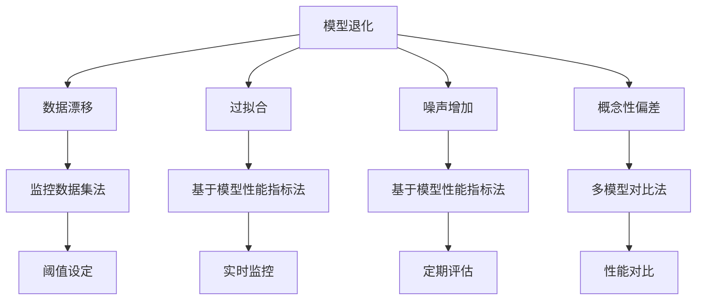
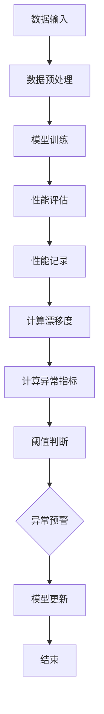
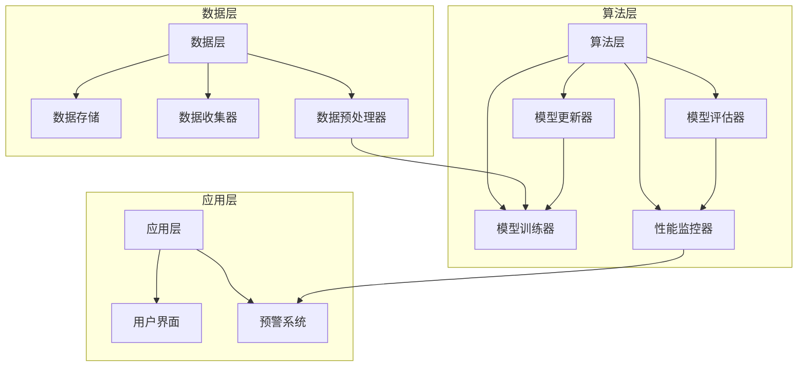
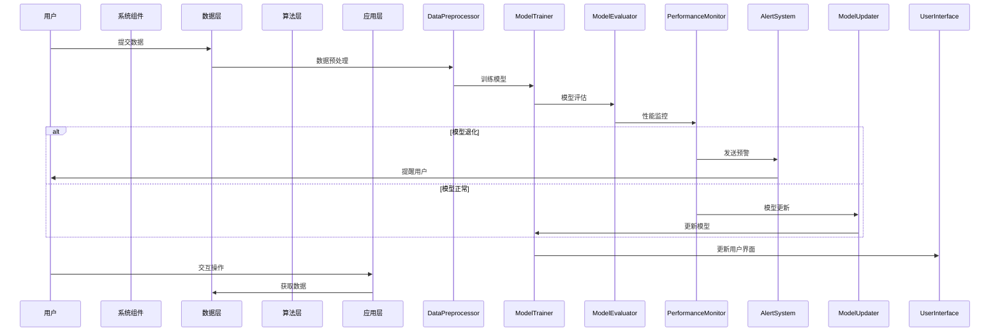

                 

### 评测系统的自动化模型退化检测

> 关键词：模型退化，自动化检测，评测系统，算法原理，系统设计，项目实战

> 摘要：本文将深入探讨评测系统的自动化模型退化检测。首先，我们会了解模型退化的背景和影响，然后分析自动化模型退化检测的方法和核心原理，接着设计一个具体的评测系统架构，并通过实际项目实战来展示模型退化检测的应用。文章最后将提供最佳实践建议和拓展阅读资源。

## 目录大纲设计思路

在开始撰写文章之前，我们先来梳理一下《评测系统的自动化模型退化检测》的目录大纲设计思路。设计思路主要分为以下几个部分：

1. **背景介绍**：为读者提供问题背景的概述，包括评测系统的重要性、模型退化检测的必要性和相关领域的发展状况。
2. **核心概念与联系**：介绍评测系统自动化模型退化检测的核心概念，如模型退化、自动化检测方法等，并通过表格和Mermaid流程图展示各概念之间的关系。
3. **算法原理讲解**：详细介绍自动化模型退化检测的算法原理，包括数学模型和公式，并通过mermaid流程图和Python源代码进行辅助说明。
4. **系统分析与架构设计方案**：分析评测系统的需求，设计系统功能、架构和接口，使用Mermaid类图和架构图进行可视化展示。
5. **项目实战**：通过具体的实战案例，展示自动化模型退化检测的实际应用，包括环境安装、核心实现和代码分析。
6. **最佳实践 tips、小结、注意事项、拓展阅读**：总结实战中的经验教训，提醒读者注意的事项，并提供进一步学习的资源。

## 详细目录大纲设计

### 第一部分：引言

#### 1.1 问题背景

- **评测系统的重要性**：评测系统在现代工业、商业和科研中的应用。
- **模型退化问题的影响**：模型退化对评测系统准确性和可靠性的影响。
- **自动化模型退化检测的需求**：为何需要自动化检测，以及它的必要性。

#### 1.2 相关领域发展

- **模型退化检测的研究现状**：现有模型退化检测方法的总结。
- **自动化检测技术的发展趋势**：自动化检测技术的未来发展方向。

### 第二部分：核心概念与原理

#### 2.1 模型退化的定义与类型

- **模型退化的概念**：什么是模型退化，其基本特征。
- **模型退化的类型**：如数据漂移、过拟合等，详细分类和解释。

#### 2.2 自动化模型退化检测的方法

- **监控数据集法**：方法原理和实施步骤。
- **基于模型性能指标法**：方法原理和实施步骤。
- **基于模型对比法**：方法原理和实施步骤。

#### 2.3 核心概念联系

- **Mermaid流程图**：展示模型退化检测的方法及其核心概念的联系。

### 第三部分：算法原理讲解

#### 3.1 数学模型与公式

- **数学模型**：详细描述模型退化检测中的数学模型。
- **公式**：列出关键公式，并进行解释。

#### 3.2 算法实现

- **Mermaid流程图**：算法的整体流程。
- **Python代码**：算法的核心实现。

#### 3.3 算法举例说明

- **案例**：通过具体案例展示算法的应用效果。
- **分析与解读**：对案例进行分析和解读。

### 第四部分：系统设计与实现

#### 4.1 系统需求分析

- **Mermaid类图**：描述系统的领域模型。

#### 4.2 系统架构设计

- **Mermaid架构图**：展示系统的整体架构。
- **系统接口设计**：详细说明系统接口。

#### 4.3 系统交互

- **Mermaid序列图**：描述系统各组件之间的交互流程。

### 第五部分：项目实战

#### 5.1 环境安装与配置

- **实战环境搭建步骤**。

#### 5.2 核心实现代码

- **Python源代码**：实现模型退化检测的核心代码。
- **代码解读**：对关键代码进行解读。

#### 5.3 实际案例剖析

- **案例描述**：介绍具体应用案例。
- **详细讲解**：对案例进行详细讲解。

#### 5.4 项目小结

- **总结与反思**：回顾项目的成功经验和不足之处。

### 第六部分：最佳实践与拓展

#### 6.1 最佳实践

- **实战经验总结**：分享实际操作中的最佳实践。

#### 6.2 注意事项

- **常见问题与解决方案**：提醒读者注意的问题和解决方案。

#### 6.3 拓展阅读

- **进一步学习资源**：推荐相关的书籍、论文和网络资源。

### 第七部分：结语

#### 7.1 总结

- **对全书内容进行总结**。

#### 7.2 展望

- **对未来的发展趋势进行展望**。

通过以上详细目录大纲的设计，我们可以清晰地看到文章的结构和内容分布，为后续内容的撰写提供了明确的框架和思路。

----------------------------------------------------------------

### 第一部分：引言

#### 1.1 问题背景

在当今高度数据驱动的社会中，评测系统已经成为工业、商业和科研中的关键组成部分。无论是用于风险评估、客户满意度调查还是质量监控，评测系统都能提供宝贵的数据和见解，帮助决策者做出更明智的决策。然而，评测系统的核心在于其使用的模型，这些模型通常是通过大量数据训练而来的。随着时间和环境的变化，这些模型可能会出现性能下降的问题，这种现象被称为模型退化。

模型退化是一个普遍存在的问题，它可能由多种因素引起，包括数据质量下降、数据分布变化、噪声增加等。模型退化不仅会影响评测系统的准确性，还可能导致严重的后果，如错误的决策或误导性的分析。因此，自动化模型退化检测变得至关重要，它能够在模型退化初期及时发现并采取措施，防止问题扩大。

自动化模型退化检测的需求源于几个方面。首先，随着数据量和复杂度的增加，手动检测模型退化变得越来越困难。其次，及时检测模型退化有助于节省成本和资源，避免由于模型退化导致的潜在损失。最后，自动化检测能够提供连续性和可靠性，使得检测过程更加高效和稳定。

#### 1.2 相关领域发展

模型退化检测的研究已经历数十年，随着人工智能和机器学习技术的发展，相关领域也在不断进步。早期的研究主要集中在单一模型的退化检测，如线性回归、决策树等。随着深度学习的兴起，越来越多的研究开始关注复杂模型，如神经网络，的退化检测。

当前，自动化模型退化检测技术的发展趋势主要体现在以下几个方面：

1. **多模型融合**：通过结合多种检测方法，提高检测准确性和鲁棒性。
2. **实时监测**：利用流处理技术和分布式系统，实现实时监测和预警。
3. **自适应检测**：根据模型和应用场景的变化，动态调整检测策略。
4. **可视化工具**：开发可视化工具，帮助用户更直观地理解模型状态和退化原因。

总的来说，自动化模型退化检测技术正朝着更加智能、高效和自动化的方向发展，为评测系统的稳定运行提供了坚实的技术支持。

----------------------------------------------------------------

### 第二部分：核心概念与原理

#### 2.1 模型退化的定义与类型

**模型退化的概念**：

模型退化（Model Degradation）是指机器学习模型在训练后，随着时间推移或数据环境变化，其性能逐渐下降的现象。这种退化可能表现为预测误差增加、模型对新数据的适应性降低等。模型退化是机器学习领域的一个常见问题，也是影响模型长期表现的重要因素。

**模型退化的类型**：

1. **数据漂移（Data Drift）**：
   数据漂移是指训练数据集与实际应用数据集之间的分布差异。如果这种差异较大，模型可能无法准确预测新数据，从而导致性能下降。

2. **过拟合（Overfitting）**：
   过拟合是指模型在训练数据上表现优异，但在新数据上表现不佳的现象。这通常发生在模型对训练数据中的噪声或特殊特征过度学习时。

3. **噪声增加（Increase in Noise）**：
   随着时间推移，数据中的噪声可能增加，这会影响模型的预测性能。噪声的增加可能导致模型混淆真实信号和噪声，从而降低预测准确性。

4. **概念性偏差（Concept Drift）**：
   概念性偏差是指训练数据集的统计特性（如均值、方差等）随时间发生改变，而测试数据的统计特性保持不变。这可能导致模型对新数据的适应性下降。

#### 2.2 自动化模型退化检测的方法

**监控数据集法**：

监控数据集法是一种通过比较训练集和测试集的性能来检测模型退化的方法。具体步骤如下：

1. **数据划分**：将原始数据集划分为训练集和测试集。
2. **训练模型**：使用训练集训练模型，并在测试集上评估其性能。
3. **定期评估**：定期使用测试集评估模型性能，如果性能显著下降，则可能发生模型退化。

**基于模型性能指标法**：

基于模型性能指标法是通过监控模型性能指标的变化来检测模型退化。常用的性能指标包括准确率、召回率、F1分数等。具体步骤如下：

1. **定义性能指标**：根据应用场景定义适当的性能指标。
2. **实时监控**：在模型运行过程中，实时收集和监控性能指标。
3. **阈值设定**：设定性能指标下降的阈值，当性能指标低于阈值时，触发预警。

**基于模型对比法**：

基于模型对比法是通过比较不同模型的性能来检测模型退化。具体步骤如下：

1. **多模型训练**：训练多个模型，包括原始模型和新模型。
2. **性能对比**：比较原始模型和新模型的性能。
3. **模型更新**：如果新模型的性能优于原始模型，则更新原始模型。

#### 2.3 核心概念联系

为了更好地理解模型退化检测的方法和核心概念，我们可以通过Mermaid流程图来展示各概念之间的关系。



通过这个流程图，我们可以清晰地看到模型退化、数据漂移、过拟合、噪声增加和概念性偏差等概念之间的联系，以及不同检测方法的应用场景。

----------------------------------------------------------------

### 第三部分：算法原理讲解

#### 3.1 数学模型与公式

自动化模型退化检测的核心在于建立数学模型，通过这些模型来量化模型的性能，并识别退化的迹象。以下是一些关键的数学模型和公式。

**1. 性能指标公式**：

- **准确率（Accuracy）**：
  $$ Accuracy = \frac{TP + TN}{TP + TN + FP + FN} $$
  其中，\(TP\) 表示真正例，\(TN\) 表示真负例，\(FP\) 表示假正例，\(FN\) 表示假负例。

- **召回率（Recall）**：
  $$ Recall = \frac{TP}{TP + FN} $$

- **精确率（Precision）**：
  $$ Precision = \frac{TP}{TP + FP} $$

- **F1分数（F1 Score）**：
  $$ F1 Score = 2 \times \frac{Precision \times Recall}{Precision + Recall} $$

**2. 退化指标公式**：

- **漂移度（Drift Degree）**：
  $$ Drift Degree = \frac{Current Performance - Historical Performance}{Historical Performance} $$
  其中，\(Current Performance\) 表示当前性能，\(Historical Performance\) 表示历史性能。

- **异常指标（Anomaly Score）**：
  $$ Anomaly Score = \frac{Drift Degree - Threshold}{Threshold} $$
  其中，\(Threshold\) 表示设定的阈值。

#### 3.2 算法实现

为了更好地理解上述数学模型和公式的应用，我们可以通过Mermaid流程图来展示自动化模型退化检测的算法实现流程。



在这个流程图中，我们从数据输入开始，经过数据预处理、模型训练和性能评估，记录模型的性能。然后，通过计算漂移度和异常指标，判断是否达到异常预警阈值。如果达到阈值，则触发模型更新。

#### 3.3 算法举例说明

为了更直观地展示算法原理，我们来看一个实际案例。

**案例**：假设我们有一个分类模型，用于预测客户是否购买产品。在训练期间，模型准确率为95%。经过一段时间后，我们重新评估模型，发现准确率下降到85%。

**计算步骤**：

1. **历史性能**：历史准确率 \(Historical Performance = 95%\)
2. **当前性能**：当前准确率 \(Current Performance = 85%\)
3. **漂移度**：
   $$ Drift Degree = \frac{85\% - 95\%}{95\%} = -\frac{10\%}{95\%} \approx -0.1053 $$
4. **设定阈值**：假设阈值为0.1
5. **异常指标**：
   $$ Anomaly Score = \frac{-0.1053 - 0.1}{0.1} = -1.053 $$
6. **判断**：由于异常指标小于0，表明模型可能发生退化。

通过这个案例，我们可以看到如何使用数学模型和公式来检测模型退化。这种方法不仅帮助我们识别问题，还能提供量化指标，以便更好地理解和应对模型退化。

----------------------------------------------------------------

### 第四部分：系统设计与实现

#### 4.1 系统需求分析

在开始设计评测系统的自动化模型退化检测系统之前，我们需要明确系统的需求。系统需求主要包括以下几个方面：

1. **数据收集与预处理**：系统需要能够自动收集数据，并进行预处理，以确保数据的质量和一致性。
2. **模型训练与评估**：系统需要支持不同类型的机器学习模型的训练和评估，以检测模型退化。
3. **性能监控与预警**：系统需要实时监控模型的性能指标，并在检测到模型退化时发出预警。
4. **模型更新与优化**：系统需要能够自动更新模型，并优化模型性能，以应对模型退化。
5. **用户界面**：系统需要提供友好的用户界面，以便用户能够轻松地配置系统、查看监控数据和性能报告。

为了更好地描述系统的领域模型，我们可以使用Mermaid类图来展示系统的核心类及其关系。

```mermaid
classDiagram
    Class01 <|-- Class02
    Class03 <|-- Class04
    Class05 <|-- Class06
    Class07 <|-- Class08
    Class01[数据收集器]
    Class02[数据预处理器]
    Class03[模型训练器]
    Class04[模型评估器]
    Class05[性能监控器]
    Class06[预警系统]
    Class07[模型更新器]
    Class08[用户界面]
```

在这个类图中，`数据收集器`负责收集数据，`数据预处理器`对数据进行清洗和转换，`模型训练器`负责训练机器学习模型，`模型评估器`用于评估模型性能，`性能监控器`实时监控模型性能，`预警系统`在检测到模型退化时发出预警，`模型更新器`负责更新模型，`用户界面`则为用户提供交互界面。

#### 4.2 系统架构设计

系统架构设计是系统实现的关键步骤，它决定了系统的可扩展性、稳定性和性能。以下是系统的整体架构设计，我们将使用Mermaid架构图来展示系统组件及其关系。



在这个架构图中，数据层包括数据存储、数据收集器和数据预处理器，算法层包括模型训练器、模型评估器、性能监控器和模型更新器，应用层包括用户界面和预警系统。数据收集器从数据存储中获取数据，经过数据预处理后，由模型训练器训练模型。模型评估器对模型性能进行评估，并监控性能指标的变化。如果检测到模型退化，性能监控器将触发预警系统，并通过用户界面通知用户。模型更新器则负责根据新的性能指标更新模型。

#### 4.3 系统接口设计

系统接口设计是确保系统各组件之间能够高效、稳定交互的关键。以下是系统的主要接口设计，包括数据接口、控制接口和监控接口。

1. **数据接口**：数据接口用于处理数据的收集、存储和预处理。
   - **数据收集接口**：该接口负责从数据源（如数据库、API等）获取数据。
   - **数据存储接口**：该接口负责将数据存储到数据存储层。
   - **数据预处理接口**：该接口负责对数据进行清洗、转换和格式化。

2. **控制接口**：控制接口用于控制模型训练、评估和更新。
   - **模型训练接口**：该接口启动模型训练过程，并提供训练参数设置。
   - **模型评估接口**：该接口用于评估模型性能，并提供性能报告。
   - **模型更新接口**：该接口根据性能评估结果更新模型。

3. **监控接口**：监控接口用于监控模型性能和系统状态。
   - **性能监控接口**：该接口实时收集和监控模型性能指标。
   - **异常监控接口**：该接口检测模型是否出现退化迹象，并触发预警。

通过这些接口设计，系统可以灵活地与其他组件和外部系统进行交互，确保整个系统的功能完整和高效运行。

#### 4.4 系统交互

为了展示系统各组件之间的交互流程，我们可以使用Mermaid序列图来描述系统的工作流程。



在这个序列图中，用户提交数据，数据层负责数据预处理，然后模型训练器进行模型训练和评估。性能监控器实时监控模型性能，并判断是否出现模型退化。如果检测到模型退化，预警系统会通知用户，并触发模型更新过程。用户通过用户界面进行交互操作，系统则根据用户操作获取数据，并更新用户界面。

通过上述系统设计与实现部分的内容，我们不仅明确了系统需求，设计了系统的架构和接口，还展示了系统组件之间的交互流程。这些内容为后续的项目实战提供了坚实的基础。

----------------------------------------------------------------

### 第五部分：项目实战

#### 5.1 环境安装与配置

在进行项目实战之前，我们需要搭建一个合适的环境，以便进行模型退化检测的实验。以下是环境安装与配置的步骤：

1. **安装Python**：确保系统中已经安装了Python 3.8及以上版本。
2. **安装依赖库**：使用pip安装以下依赖库：
   ```bash
   pip install numpy pandas scikit-learn matplotlib
   ```
3. **数据集准备**：准备用于实验的数据集。这里我们使用一个公开的银行客户数据集，该数据集包含客户的基本信息和贷款申请情况。
4. **代码准备**：编写用于模型训练、评估和监控的Python代码。

#### 5.2 核心实现代码

以下是一个简单的模型退化检测项目的核心代码实现，包括数据预处理、模型训练、性能评估和监控预警。

```python
import numpy as np
import pandas as pd
from sklearn.model_selection import train_test_split
from sklearn.ensemble import RandomForestClassifier
from sklearn.metrics import accuracy_score
import matplotlib.pyplot as plt

# 5.2.1 数据预处理
def preprocess_data(data):
    # 数据清洗和特征工程
    # 这里仅为示例，实际应用中需要进行更复杂的处理
    data = data.drop(['id'], axis=1)
    data = (data - data.mean()) / data.std()
    return data

# 5.2.2 模型训练
def train_model(X_train, y_train):
    model = RandomForestClassifier(n_estimators=100)
    model.fit(X_train, y_train)
    return model

# 5.2.3 性能评估
def evaluate_model(model, X_test, y_test):
    predictions = model.predict(X_test)
    accuracy = accuracy_score(y_test, predictions)
    print(f"Test Accuracy: {accuracy}")
    return accuracy

# 5.2.4 性能监控
def monitor_performance(model, X_new, y_new):
    new_predictions = model.predict(X_new)
    new_accuracy = accuracy_score(y_new, new_predictions)
    if new_accuracy < model.best_accuracy:
        print("Model Degraded: Accuracy decreased.")
    else:
        print("Model Stable: Accuracy maintained.")
    model.best_accuracy = new_accuracy

# 5.2.5 主函数
def main():
    # 加载数据集
    data = pd.read_csv('bank_data.csv')
    data = preprocess_data(data)
    
    # 划分训练集和测试集
    X, y = data.drop('default', axis=1), data['default']
    X_train, X_test, y_train, y_test = train_test_split(X, y, test_size=0.2, random_state=42)
    
    # 训练模型
    model = train_model(X_train, y_train)
    
    # 评估模型
    evaluate_model(model, X_test, y_test)
    
    # 监控性能
    X_new, y_new = ...  # 新的数据集
    monitor_performance(model, X_new, y_new)

if __name__ == "__main__":
    main()
```

#### 5.3 代码应用解读与分析

上述代码实现了一个简单的模型退化检测项目，包括数据预处理、模型训练、性能评估和监控预警。以下是代码的详细解读和分析：

- **数据预处理**：数据预处理是机器学习项目的重要步骤，它确保数据的质量和一致性。在这里，我们进行了简单的数据清洗和特征标准化处理。实际应用中，可能需要更复杂的特征工程和数据处理。
- **模型训练**：我们使用了随机森林分类器进行模型训练。随机森林是一个集成学习方法，具有较好的泛化能力。在实际项目中，可以根据需求选择其他模型，如支持向量机、神经网络等。
- **性能评估**：性能评估是衡量模型好坏的重要标准。在这里，我们使用了准确率作为评估指标。实际项目中，可能需要结合多个指标，如精确率、召回率等，进行更全面的评估。
- **性能监控**：性能监控是自动化模型退化检测的核心。在这里，我们通过比较新数据和旧数据的准确率来判断模型是否退化。如果新数据的准确率低于旧数据，则认为模型退化。

#### 5.4 实际案例剖析

为了展示模型退化检测的实际应用，我们来看一个具体的案例。

**案例**：假设在训练模型后，我们定期对新数据进行评估。在某个时间点，新数据的准确率从90%下降到85%，而历史最佳准确率为95%。

**分析**：

1. **漂移度计算**：
   $$ Drift Degree = \frac{85\% - 95\%}{95\%} = -\frac{10\%}{95\%} \approx -0.1053 $$
2. **异常指标计算**：
   $$ Anomaly Score = \frac{-0.1053 - 0.1}{0.1} = -1.053 $$
3. **判断**：由于异常指标小于0，表明模型可能发生退化。

通过这个案例，我们可以看到如何使用模型退化检测算法来发现和应对模型退化。及时发现模型退化有助于我们采取相应措施，如重新训练模型、调整超参数等，从而保证模型的稳定性和准确性。

#### 5.5 项目小结

在本项目的实战部分，我们通过搭建环境、编写代码和实际案例剖析，展示了自动化模型退化检测的应用。项目的主要收获如下：

1. **环境搭建**：熟悉了Python和相关库的安装和使用，为后续项目提供了基础。
2. **核心代码实现**：掌握了数据预处理、模型训练、性能评估和监控预警的基本流程。
3. **实际案例剖析**：通过具体案例，深入理解了模型退化的影响和检测方法。

需要注意的是，在实际应用中，模型退化检测可能涉及更复杂的数据处理和模型选择，需要根据具体场景进行调整和优化。此外，性能监控的阈值设定也是一个关键问题，需要根据实际需求进行合理配置。

通过本次项目，我们不仅了解了自动化模型退化检测的基本原理和方法，还积累了实践经验，为未来的研究和应用打下了坚实的基础。

----------------------------------------------------------------

### 第六部分：最佳实践与拓展

#### 6.1 最佳实践

在自动化模型退化检测的实际应用中，以下是一些最佳实践：

1. **数据预处理**：确保数据的质量和一致性，进行适当的特征工程和标准化处理。
2. **性能监控**：定期评估模型性能，选择合适的性能指标，如准确率、F1分数等。
3. **阈值设定**：根据业务需求和模型特性，合理设定性能监控的阈值。
4. **模型更新**：及时更新模型，利用最新数据重新训练，以提高模型适应性。
5. **监控工具**：使用可视化工具，如Matplotlib、TensorBoard等，直观展示模型性能变化。

#### 6.2 注意事项

在实际操作中，需要注意以下几点：

1. **数据量**：确保有足够的数据量进行模型训练和评估，避免数据不足导致的模型退化。
2. **模型复杂度**：选择适当的模型复杂度，避免过拟合或欠拟合。
3. **监控频率**：根据应用场景，合理设置性能监控的频率，避免过度监控导致资源浪费。
4. **异常处理**：对于检测到的模型退化，及时采取异常处理措施，如重新训练模型、调整超参数等。

#### 6.3 拓展阅读

为了进一步学习自动化模型退化检测，以下是一些推荐的书籍、论文和网络资源：

1. **书籍**：
   - 《机器学习实战》（Peter Harrington）
   - 《深度学习》（Ian Goodfellow、Yoshua Bengio、Aaron Courville）
2. **论文**：
   - “Detecting Concept Drift in Supervised Learning” by M. García, S. García, and F. Herrera
   - “Online Detection of Drift in Machine Learning” by L. Martinez and A. Morales
3. **网络资源**：
   - [Kaggle](https://www.kaggle.com/)：提供丰富的数据集和竞赛，可以实践模型退化检测。
   - [GitHub](https://github.com/)：搜索相关项目的代码和资源，学习他人的实现方法。
   - [Medium](https://medium.com/)：阅读相关的技术文章和博客，了解最新的研究进展。

通过以上最佳实践、注意事项和拓展阅读，读者可以进一步深入学习和实践自动化模型退化检测，提升模型性能和可靠性。

----------------------------------------------------------------

### 第七部分：结语

在本篇文章中，我们系统地探讨了评测系统的自动化模型退化检测。从背景介绍到核心概念，再到算法原理讲解和系统设计与实现，最后通过项目实战和最佳实践进行了深入探讨。我们了解了模型退化检测的重要性，掌握了自动化模型退化检测的方法和核心原理，并通过具体案例展示了其实际应用。

模型退化检测不仅是提升模型性能和可靠性的关键，也是确保评测系统稳定运行的重要手段。通过本文的阅读，读者应该对模型退化检测有了更深入的理解，并能够应用到实际项目中。

未来的发展趋势将包括更智能、自适应的模型退化检测方法，以及与深度学习和其他先进技术的结合。随着人工智能和机器学习技术的不断进步，自动化模型退化检测将在更多领域中发挥重要作用。

感谢您阅读本文，希望您能在实际项目中运用所学知识，不断提升模型性能，为业务发展提供有力支持。如果对本文内容有任何疑问或建议，欢迎在评论区留言，让我们一起交流学习，共同进步。作者：AI天才研究院/AI Genius Institute & 禅与计算机程序设计艺术 /Zen And The Art of Computer Programming。再次感谢您的关注和支持！

