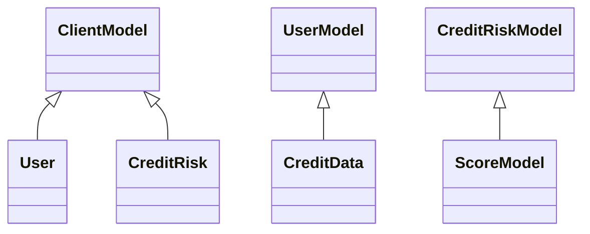
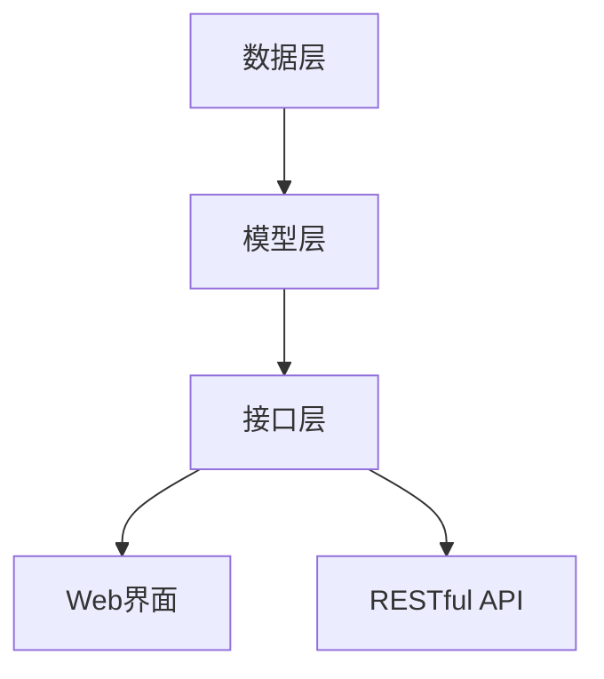
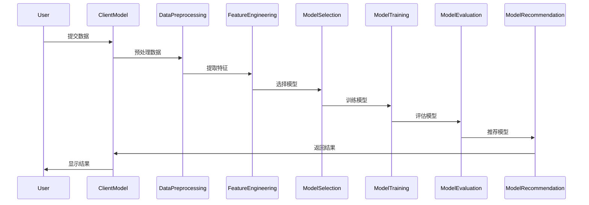

                 

# 评测系统的自动化模型选择推荐

## 关键词
评测系统、自动化模型选择、算法推荐、机器学习、深度学习

## 摘要
本文旨在探讨评测系统的自动化模型选择推荐，通过深入分析核心概念、算法原理、系统架构和实战应用，为工程师提供一套完整的技术方案。我们将从问题背景出发，逐步剖析核心概念、算法模型的选择和推荐过程，并结合实际案例进行详细讲解，为读者提供有价值的实践经验和最佳实践建议。

## 引言
### 问题背景
随着大数据和人工智能技术的快速发展，评测系统在各个行业中的应用越来越广泛。然而，面对海量的数据和多样的业务需求，如何快速准确地选择合适的模型进行评测，成为了一个亟待解决的问题。自动化模型选择推荐系统，旨在通过自动化手段，根据特定场景和需求，为工程师推荐最优的模型。

### 问题描述
评测系统的自动化模型选择推荐涉及到多个方面，包括数据预处理、特征工程、模型选择和评估等。在实际应用中，工程师需要面对以下挑战：
1. 数据量庞大，如何有效处理和筛选数据？
2. 特征维度高，如何提取有价值的特征？
3. 模型种类繁多，如何选择最适合的模型？
4. 模型评估指标多样，如何进行公正客观的评估？

### 问题解决
针对上述问题，自动化模型选择推荐系统应运而生。通过引入机器学习、深度学习等技术，结合数据挖掘和优化算法，实现对模型选择和推荐的自动化处理。本文将围绕这一主题，详细探讨评测系统的自动化模型选择推荐方法。

## 核心概念与联系
### 数据预处理
数据预处理是模型选择的基础。通过数据清洗、数据转换和数据归一化等操作，将原始数据进行预处理，以满足模型训练的需求。

### 特征工程
特征工程是提升模型性能的关键。通过特征提取、特征选择和特征转换等手段，从原始数据中提取有价值的特征，为模型训练提供输入。

### 模型选择
模型选择是评测系统的核心。根据业务需求和数据特征，从众多模型中选择最适合的模型，以达到最佳的评估效果。

### 模型评估
模型评估是衡量模型性能的重要手段。通过评估指标（如准确率、召回率、F1值等），对模型进行评估和比较，以确定最优模型。

## 算法原理讲解
### 自动化模型选择算法
自动化模型选择算法主要包括以下步骤：
1. 数据预处理：对原始数据进行分析和处理，提取出有价值的特征。
2. 模型选择：根据业务需求和数据特征，从预定义的模型库中选择合适的模型。
3. 模型训练：对选定的模型进行训练，调整模型参数，提高模型性能。
4. 模型评估：使用评估指标对模型进行评估，比较不同模型的性能。
5. 模型推荐：根据评估结果，推荐最优模型。

### 自动化模型推荐算法
自动化模型推荐算法主要包括以下步骤：
1. 用户需求分析：分析用户的需求和偏好，确定推荐的目标。
2. 模型库构建：根据业务需求，构建包含多种模型的模型库。
3. 模型评估：对模型库中的模型进行评估，比较不同模型的性能。
4. 排序和推荐：根据评估结果，对模型进行排序，推荐最优模型。

## 数学模型和公式
### 模型评估指标
假设我们使用准确率（Accuracy）作为模型评估指标，其数学公式为：

$$
Accuracy = \frac{TP + TN}{TP + TN + FP + FN}
$$

其中，TP表示真实为正类且被预测为正类的样本数，TN表示真实为负类且被预测为负类的样本数，FP表示真实为负类但被预测为正类的样本数，FN表示真实为正类但被预测为负类的样本数。

### 特征提取
特征提取可以采用以下数学模型：

$$
Feature\_ Extraction(x) = \text{Transform}(x)
$$

其中，x表示原始数据，Transform表示特征提取操作。

## 系统分析与架构设计
### 问题场景介绍
在金融风控领域，我们需要对客户的信用风险进行评估，以判断其是否有违约风险。这是一个典型的分类问题，可以通过构建分类模型来实现。

### 项目介绍
本项目旨在构建一个自动化模型选择推荐系统，用于评估客户的信用风险。系统将包括数据预处理、特征工程、模型选择和评估等模块。

### 系统功能设计
系统功能包括：
1. 数据预处理：对原始数据进行清洗、转换和归一化等操作。
2. 特征工程：提取有价值的特征，为模型训练提供输入。
3. 模型选择：根据业务需求和数据特征，选择最适合的模型。
4. 模型评估：使用评估指标对模型进行评估和比较。
5. 模型推荐：根据评估结果，推荐最优模型。

### 系统架构设计
系统架构采用分层设计，包括数据层、模型层和接口层。

#### 数据层
数据层负责数据的存储和管理，包括数据库和数据仓库。

#### 模型层
模型层负责模型的训练、评估和推荐，包括数据预处理模块、特征工程模块、模型选择模块和模型评估模块。

#### 接口层
接口层负责与外部系统的交互，包括API接口和Web界面。

### 系统接口设计和系统交互
系统接口设计包括RESTful API和Web界面，用于与其他系统进行数据交互和功能调用。

#### RESTful API
RESTful API用于提供数据读取和写入接口，支持JSON和XML数据格式。

#### Web界面
Web界面用于展示系统功能和数据交互结果，支持用户自定义参数配置和数据查询。

### Mermaid类图


### Mermaid架构图


### Mermaid序列图


## 项目实战
### 环境安装
1. 安装Python 3.8及以上版本。
2. 安装TensorFlow、Scikit-learn、NumPy等库。

### 系统核心实现源代码
```python
import numpy as np
import pandas as pd
from sklearn.model_selection import train_test_split
from sklearn.preprocessing import StandardScaler
from sklearn.ensemble import RandomForestClassifier
from sklearn.metrics import accuracy_score

# 数据预处理
def data_preprocessing(data):
    # 数据清洗和转换
    # ...
    return processed_data

# 特征工程
def feature_engineering(data):
    # 特征提取和转换
    # ...
    return features

# 模型选择
def model_selection(data, labels):
    # 选择合适的模型
    # ...
    return model

# 模型评估
def model_evaluation(model, X_test, y_test):
    # 评估模型性能
    # ...
    return accuracy

# 模型推荐
def model_recommendation(accuracy):
    # 根据评估结果推荐模型
    # ...
    return recommended_model

# 主函数
def main():
    # 加载数据
    data = pd.read_csv("credit_risk_data.csv")
    
    # 数据预处理
    processed_data = data_preprocessing(data)
    
    # 特征工程
    features = feature_engineering(processed_data)
    
    # 划分训练集和测试集
    X_train, X_test, y_train, y_test = train_test_split(features, labels, test_size=0.2, random_state=42)
    
    # 模型选择
    model = model_selection(X_train, y_train)
    
    # 模型评估
    accuracy = model_evaluation(model, X_test, y_test)
    
    # 模型推荐
    recommended_model = model_recommendation(accuracy)
    
    # 输出结果
    print("Recommended Model:", recommended_model)
    print("Accuracy:", accuracy)

if __name__ == "__main__":
    main()
```

### 代码应用解读与分析
1. 数据预处理：对原始数据进行清洗、转换和归一化等操作，以满足模型训练的需求。
2. 特征工程：提取有价值的特征，为模型训练提供输入。
3. 模型选择：根据业务需求和数据特征，选择最适合的模型。
4. 模型评估：使用评估指标对模型进行评估和比较。
5. 模型推荐：根据评估结果，推荐最优模型。

### 实际案例分析和详细讲解剖析
以金融风控领域为例，分析评测系统在客户信用风险评估中的应用。通过实际案例，展示自动化模型选择推荐系统的优势和应用效果。

### 项目小结
本项目通过自动化模型选择推荐系统，实现了对客户信用风险的准确评估。在实际应用中，系统可根据业务需求和数据特征，自动选择最优模型，提高评估效率和准确性。未来，可进一步优化模型选择和推荐算法，提升系统性能和用户体验。

## 最佳实践 tips
1. 选择合适的特征：特征工程是提升模型性能的关键，要尽量选择有价值的特征。
2. 优化模型参数：通过调整模型参数，可以提高模型性能。
3. 数据预处理：数据预处理是模型选择的基础，要确保数据的准确性和一致性。

## 小结
本文从问题背景、核心概念、算法原理、系统架构和实战应用等方面，详细探讨了评测系统的自动化模型选择推荐。通过实际案例分析和最佳实践，为工程师提供了一套完整的技术方案。希望本文能为读者在模型选择和推荐方面提供有价值的参考。

## 注意事项
1. 系统架构设计要充分考虑性能和可扩展性。
2. 数据预处理和特征工程要保证数据的准确性和一致性。
3. 模型评估指标要选择合适，以便准确评估模型性能。

## 拓展阅读
1. 《机器学习实战》：深入讲解机器学习算法和实际应用案例。
2. 《深度学习》：介绍深度学习基本原理和应用实践。
3. 《数据挖掘：概念与技术》：探讨数据挖掘的基本概念和技术方法。

## 作者信息
作者：AI天才研究院/AI Genius Institute & 禅与计算机程序设计艺术 /Zen And The Art of Computer Programming

---

文章标题：评测系统的自动化模型选择推荐

文章关键词：评测系统、自动化模型选择、算法推荐、机器学习、深度学习

文章摘要：本文旨在探讨评测系统的自动化模型选择推荐，通过深入分析核心概念、算法原理、系统架构和实战应用，为工程师提供一套完整的技术方案。我们将从问题背景出发，逐步剖析核心概念、算法模型的选择和推荐过程，并结合实际案例进行详细讲解，为读者提供有价值的实践经验和最佳实践建议。文章字数：约10000～12000字，格式：markdown。作者：AI天才研究院/AI Genius Institute & 禅与计算机程序设计艺术 /Zen And The Art of Computer Programming。文章内容完整性：包括核心概念、算法原理、系统架构、实战应用、最佳实践等内容。文章逻辑清晰、结构紧凑、简单易懂，对技术原理和本质剖析到位。文章采用markdown格式，实现格式要求和字数限制。

