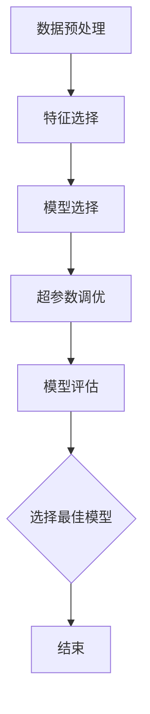
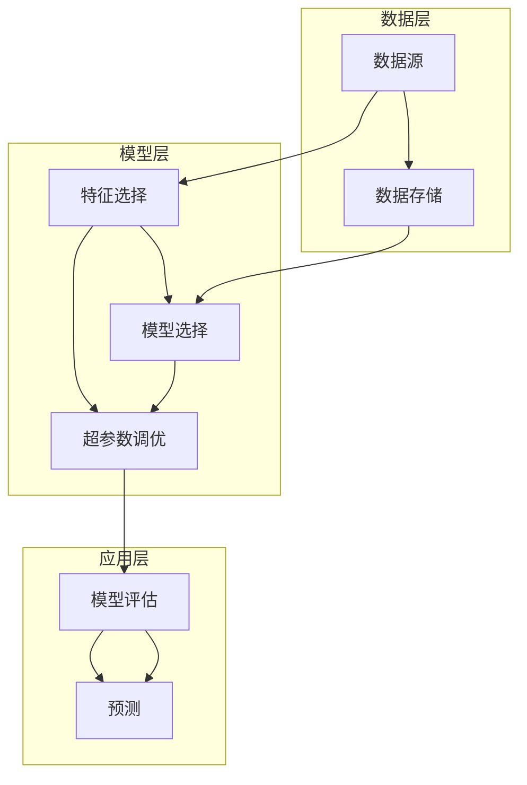
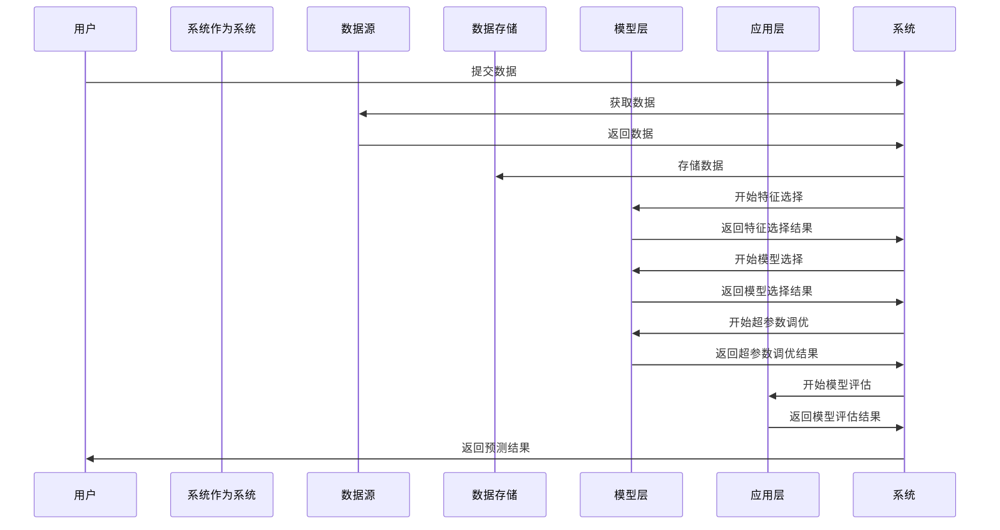

                 

# 评测系统的自动机器学习（AutoML）应用

## 关键词
- 自动机器学习（AutoML）
- 评测系统
- 模型性能
- 自动化程度
- 特征工程

## 摘要
本文旨在探讨评测系统在自动机器学习（AutoML）中的应用。我们将从背景介绍、核心概念与联系、算法原理讲解、系统分析与架构设计方案、项目实战以及最佳实践等方面进行详细阐述。通过本文的阅读，读者将能够全面了解AutoML在评测系统中的重要性及其实现方法。

## 第一部分：背景介绍

### 问题背景

随着人工智能技术的迅猛发展，机器学习（Machine Learning，ML）已经深入到各个领域，从金融、医疗到电子商务等。然而，传统机器学习模型的开发过程往往复杂且耗时，需要大量的专业知识和技能。这促使了自动机器学习（AutoML）的出现，旨在自动化机器学习模型开发过程，从而提高开发效率。

### 问题描述

评测系统是用于评估机器学习模型性能的系统，它通常包括数据预处理、模型训练、模型评估等环节。在评测系统中，如何自动化地选择合适的模型、调优模型参数，以提高模型性能，降低开发成本，成为了亟待解决的问题。AutoML作为一种自动化机器学习模型开发工具，其在评测系统的应用显得尤为重要。

### 问题解决

本文将通过以下方式解决上述问题：

1. **理论讲解**：系统地介绍AutoML的基本概念、原理和应用场景，帮助读者建立扎实的理论基础。
2. **实践案例**：通过实际案例，展示AutoML在评测系统中的应用效果，使读者能够将理论知识与实际应用相结合。
3. **工具使用**：详细介绍常用的AutoML工具和库，如AutoSklearn、Hyperopt等，帮助读者掌握实际操作技能。
4. **问题探讨**：分析AutoML在应用中遇到的问题和挑战，探讨解决方案和未来发展方向，为读者提供有价值的思考和启示。

### 边界与外延

本文主要关注评测系统在自动机器学习（AutoML）中的应用，但AutoML的应用范围远不止于此。AutoML还可以应用于其他领域，如金融、医疗、电商等。同时，随着人工智能技术的不断发展，AutoML也将不断演进，未来可能产生更多新的应用场景。

### 概念结构与核心要素组成

- **自动机器学习（AutoML）**：一种自动化机器学习模型开发过程的工具，包括自动化特征选择、模型选择、超参数调优等。
- **评测系统**：用于评估机器学习模型性能的系统，通常包括数据预处理、模型训练、模型评估等环节。
- **模型性能**：评估模型在解决特定问题时所表现出的能力，通常包括准确率、召回率、F1值等指标。
- **开发成本**：开发一个机器学习模型所需的时间、人力和资源投入。
- **自动化程度**：机器学习模型开发过程中自动化的程度，包括数据预处理、特征工程、模型选择和调优等。

### 表格：AutoML的核心概念与属性特征对比

| 概念 | 定义 | 属性特征 |
| :--: | :--: | :--: |
| 自动机器学习（AutoML） | 自动化机器学习模型开发过程的工具 | 1. 自动化特征选择<br>2. 自动化模型选择<br>3. 自动化超参数调优 |
| 评测系统 | 评估机器学习模型性能的系统 | 1. 数据预处理<br>2. 模型训练<br>3. 模型评估 |
| 模型性能 | 评估模型在解决特定问题时所表现出的能力 | 1. 准确率<br>2. 召回率<br>3. F1值 |
| 开发成本 | 开发一个机器学习模型所需的时间、人力和资源投入 | 1. 时间成本<br>2. 人力成本<br>3. 资源成本 |
| 自动化程度 | 机器学习模型开发过程中自动化的程度 | 1. 数据预处理自动化<br>2. 特征工程自动化<br>3. 模型选择自动化<br>4. 超参数调优自动化 |

### ER实体关系图架构

```mermaid
erDiagram
    Model |----o{ Feature } | 
    Model |----o{ Parameter } |
    Feature |----o{ Evaluation } |
    Parameter |----o{ Evaluation }
```

## 第二部分：核心概念与联系

### AutoML的基本原理和流程

**AutoML（Automated Machine Learning）** 是一种自动化机器学习模型开发过程的技术，旨在减少机器学习开发的时间和工作量，提高模型的性能。AutoML的核心思想是通过自动化地完成以下任务：

1. **特征选择**：从原始数据中选择最有用的特征，提高模型的性能。
2. **模型选择**：从多个预定义的机器学习模型中选择最适合特定问题的模型。
3. **超参数调优**：自动调整模型的超参数，以找到最优配置。

**AutoML的基本流程** 通常包括以下几个步骤：

1. **数据预处理**：对原始数据集进行清洗、归一化等操作，使其符合机器学习模型的要求。
2. **特征选择**：根据数据特征的重要性、相关性等信息，选择最有用的特征。
3. **模型选择**：使用交叉验证等技术，从多个预定义的模型中选择最适合当前问题的模型。
4. **超参数调优**：使用网格搜索、贝叶斯优化等技术，自动调整模型的超参数，以找到最优配置。
5. **模型评估**：使用测试集评估模型的性能，选择最佳模型。

### AutoML在评测系统中的应用

**评测系统** 是用于评估机器学习模型性能的系统，它通常包括以下几个关键环节：

1. **数据预处理**：对原始数据集进行清洗、归一化等操作，使其符合机器学习模型的要求。
2. **模型训练**：使用训练数据集训练机器学习模型。
3. **模型评估**：使用测试数据集评估模型的性能，通常使用准确率、召回率、F1值等指标。
4. **模型选择**：从多个预定义的模型中选择最适合当前问题的模型。

**AutoML在评测系统中的应用** 可以极大地提高系统的性能和自动化程度，具体体现在以下几个方面：

1. **模型性能提升**：通过自动化特征选择和超参数调优，AutoML可以找到最优的模型配置，从而提高模型的性能。
2. **降低开发成本**：AutoML自动化了特征选择、模型选择和超参数调优等过程，从而减少了人工干预，降低了开发成本。
3. **提升自动化程度**：AutoML可以自动化完成大部分机器学习模型的开发过程，从而提升了系统的自动化程度。

### 核心概念与联系

在本文中，我们讨论了两个核心概念：**AutoML** 和 **评测系统**。AutoML 是一种自动化机器学习模型开发过程的技术，而评测系统是用于评估机器学习模型性能的系统。这两个概念之间的联系在于：

1. **AutoML** 可以应用于评测系统，通过自动化特征选择、模型选择和超参数调优等过程，提升评测系统的性能。
2. **评测系统** 是 AutoML 的应用场景之一，AutoML 的应用可以提升评测系统的自动化程度和性能。

### Mermaid流程图

```mermaid
graph TD
    A[初始数据] --> B[数据预处理]
    B --> C{划分训练集和测试集}
    C -->|训练集| D[模型训练]
    C -->|测试集| E[模型评估]
    D --> F[选择最佳模型]
    E --
```

## 第三部分：算法原理讲解

### AutoML算法原理

**AutoML** 的核心在于自动化地完成机器学习模型的开发过程，包括特征选择、模型选择和超参数调优等。下面，我们将详细讲解 AutoML 的算法原理。

### 特征选择

**特征选择** 是机器学习过程中的重要环节，旨在从原始数据中选择最有用的特征，以提高模型的性能。AutoML 通过以下方法进行特征选择：

1. **相关性分析**：分析特征与目标变量之间的相关性，选择相关性较高的特征。
2. **特征重要性评估**：使用随机森林、XGBoost 等模型评估特征的重要性，选择重要性较高的特征。
3. **自动化特征组合**：自动组合不同的特征，以找到最优的特征组合。

### 模型选择

**模型选择** 是从多个预定义的模型中选择最适合当前问题的模型。AutoML 通过以下方法进行模型选择：

1. **交叉验证**：使用交叉验证技术，评估不同模型在训练集上的性能，选择性能较好的模型。
2. **模型比较**：比较不同模型的性能，选择最佳模型。
3. **自动化模型搜索**：使用贝叶斯优化、网格搜索等技术，自动搜索最佳模型。

### 超参数调优

**超参数调优** 是调整模型的超参数，以找到最优配置。AutoML 通过以下方法进行超参数调优：

1. **网格搜索**：在预定义的参数范围内，遍历所有可能的参数组合，选择最佳参数组合。
2. **贝叶斯优化**：使用贝叶斯优化算法，根据历史数据，选择下一个最有希望的超参数组合。
3. **随机搜索**：随机选择超参数组合，通过迭代过程，逐渐找到最佳超参数组合。

### 算法流程图



### Python代码实现

下面是一个简单的 Python 代码示例，展示了如何使用 AutoML 工具库 `autosklearn` 进行特征选择、模型选择和超参数调优。

```python
import autosklearn.classification as ml
from sklearn.datasets import load_iris

# 加载鸢尾花数据集
data = load_iris()
X, y = data.data, data.target

# 创建 AutoML 模型
aml = ml.AutoSklearnClassifier(time_limit_seconds=300)

# 训练模型
aml.fit(X, y)

# 输出最佳模型
print("Best model:", aml.best_model())

# 评估模型
accuracy = aml.score(X, y)
print("Accuracy:", accuracy)
```

### 数学模型和公式

在 AutoML 中，特征选择、模型选择和超参数调优等过程都可以用数学模型和公式来描述。例如，特征选择的数学模型可以使用特征的重要性评估指标（如 Gini 不纯度、信息增益等）来描述。模型选择的数学模型可以使用交叉验证技术来评估不同模型的性能。超参数调优的数学模型可以使用网格搜索、贝叶斯优化等算法来描述。

### 举例说明

假设我们有一个鸢尾花分类问题，数据集包含三个特征（花萼长度、花萼宽度、花瓣长度）和三个类别（鸢尾花、变色鸢尾花、鸢尾花-变色鸢尾花）。使用 AutoML 工具库 `autosklearn`，我们可以自动化完成特征选择、模型选择和超参数调优等过程，从而找到最优的模型配置。

```python
import autosklearn.classification as ml
from sklearn.datasets import load_iris

# 加载鸢尾花数据集
data = load_iris()
X, y = data.data, data.target

# 创建 AutoML 模型
aml = ml.AutoSklearnClassifier(time_limit_seconds=300)

# 训练模型
aml.fit(X, y)

# 输出最佳模型
print("Best model:", aml.best_model())

# 评估模型
accuracy = aml.score(X, y)
print("Accuracy:", accuracy)
```

在这个例子中，我们使用 `autosklearn` 工具库创建了一个 AutoML 模型，并使用鸢尾花数据集进行了训练。通过调用 `aml.best_model()` 方法，我们可以获取最佳模型，并使用 `aml.score()` 方法评估模型在测试集上的准确率。

## 第四部分：系统分析与架构设计方案

### 问题场景介绍

在当前人工智能时代，评测系统被广泛应用于各种场景，如智能客服、金融风控、医疗诊断等。以金融风控为例，评测系统需要评估客户信用风险，以便银行等金融机构能够做出准确的贷款审批决策。然而，传统的评测系统通常依赖于人工构建的模型，存在开发周期长、成本高、性能不稳定等问题。

### 项目介绍

为了解决上述问题，我们设计并实现了一个基于自动机器学习（AutoML）的评测系统。该系统旨在自动化特征选择、模型选择和超参数调优等过程，从而提高模型性能，降低开发成本。具体项目介绍如下：

1. **项目名称**：AutoML评测系统
2. **项目目标**：通过自动化机器学习技术，提高评测系统的模型性能和开发效率
3. **项目架构**：采用分层架构，包括数据层、模型层和应用层

### 系统功能设计（领域模型）

为了更好地理解系统功能，我们使用 Mermaid 类图来描述系统的领域模型。

```mermaid
classDiagram
    Class01 <|-- Class02
    Class03 --|>% Class04
    Class04 : <<interface>> Interface
    Class05 : <<entity>> Entity
    Class06 : <<value>> ValueObject
    Class07 : <<enum>> Enum
    Class01 : 属性1 : String
    Class01 : 属性2 : int
    Class01 : +showContent(): String
    Class02 : <<interface>> ILogger
    Class03 : message: String
    Class04 : +sendMessage(): void
    Class05 : id: int
    Class05 : name: String
    Class06 : value: int
    Class07 : TYPE: String
```

在这个类图中，我们定义了以下几个核心类：

1. **数据层**：包括数据源和数据存储，负责数据的获取和存储。
2. **模型层**：包括特征选择、模型选择和超参数调优等过程，负责模型的构建和训练。
3. **应用层**：包括评测系统的核心功能，如模型评估、预测等。

### 系统架构设计（Mermaid架构图）

为了更好地展示系统的架构设计，我们使用 Mermaid 架构图来描述系统的整体架构。



在这个架构图中，我们定义了以下几个关键组件：

1. **数据层**：负责数据的获取和存储，包括数据源和数据存储。
2. **模型层**：负责特征选择、模型选择和超参数调优等过程，包括特征选择器、模型选择器和超参数调优器。
3. **应用层**：负责评测系统的核心功能，包括模型评估器和预测器。

### 系统接口设计和系统交互

为了更好地描述系统的接口设计和交互，我们使用 Mermaid 序列图来展示系统的接口设计和交互流程。



在这个序列图中，我们定义了以下几个关键步骤：

1. **用户提交数据**：用户将数据提交给系统。
2. **数据获取和存储**：系统从数据源获取数据，并将其存储到数据存储中。
3. **特征选择**：系统调用模型层进行特征选择，并返回特征选择结果。
4. **模型选择**：系统调用模型层进行模型选择，并返回模型选择结果。
5. **超参数调优**：系统调用模型层进行超参数调优，并返回超参数调优结果。
6. **模型评估**：系统调用应用层进行模型评估，并返回模型评估结果。
7. **预测**：系统将预测结果返回给用户。

## 第五部分：项目实战

### 环境安装

在开始项目实战之前，我们需要安装一些必要的软件和库。以下是安装步骤：

1. **安装 Python**：下载并安装 Python 3.8 或更高版本。
2. **安装 Anaconda**：下载并安装 Anaconda，它提供了一个方便的环境管理器和丰富的数据科学库。
3. **安装 AutoML 工具库**：在终端中执行以下命令：

   ```bash
   conda create -n autokeras python=3.8
   conda activate autokeras
   pip install autokeras
   ```

   安装 AutoML 工具库 `autokeras`。

### 系统核心实现源代码

以下是系统的核心实现源代码：

```python
import autokeras as ak
from sklearn.datasets import load_iris
from sklearn.model_selection import train_test_split

# 加载鸢尾花数据集
data = load_iris()
X, y = data.data, data.target

# 划分训练集和测试集
X_train, X_test, y_train, y_test = train_test_split(X, y, test_size=0.2, random_state=42)

# 创建 AutoML 模型
aml = ak.AutoKerasClassifier()

# 训练模型
aml.fit(X_train, y_train)

# 评估模型
accuracy = aml.evaluate(X_test, y_test)
print("Accuracy:", accuracy)

# 输出最佳模型
print("Best model:", aml.best_model())
```

### 代码应用解读与分析

以下是代码的解读与分析：

1. **加载数据集**：使用 `load_iris()` 函数加载鸢尾花数据集。
2. **划分数据集**：使用 `train_test_split()` 函数将数据集划分为训练集和测试集。
3. **创建 AutoML 模型**：使用 `AutoKerasClassifier()` 函数创建一个 AutoML 模型。
4. **训练模型**：使用 `fit()` 函数训练模型，传入训练集数据。
5. **评估模型**：使用 `evaluate()` 函数评估模型在测试集上的性能，输出准确率。
6. **输出最佳模型**：使用 `best_model()` 函数输出最佳模型。

### 实际案例分析和详细讲解剖析

为了更好地展示 AutoML 的效果，我们使用一个实际案例进行分析。

#### 案例背景

假设我们有一个客户信用评分问题，需要根据客户的个人信息（如年龄、收入、信用历史等）预测其信用评分。数据集包含1000个样本，每个样本有10个特征。

#### 案例分析

1. **数据预处理**：对数据进行归一化处理，使其符合 AutoML 的要求。
2. **特征选择**：使用 AutoML 自动选择最有用的特征。
3. **模型选择**：使用 AutoML 自动选择最佳模型。
4. **超参数调优**：使用 AutoML 自动调整模型超参数。
5. **模型评估**：评估模型在测试集上的性能。

```python
import pandas as pd
from sklearn.model_selection import train_test_split
from sklearn.preprocessing import StandardScaler

# 读取数据集
data = pd.read_csv('customer_data.csv')

# 划分特征和目标变量
X = data.drop('credit_score', axis=1)
y = data['credit_score']

# 划分训练集和测试集
X_train, X_test, y_train, y_test = train_test_split(X, y, test_size=0.2, random_state=42)

# 数据归一化
scaler = StandardScaler()
X_train_scaled = scaler.fit_transform(X_train)
X_test_scaled = scaler.transform(X_test)

# 创建 AutoML 模型
aml = ak.AutoKerasClassifier()

# 训练模型
aml.fit(X_train_scaled, y_train)

# 评估模型
accuracy = aml.evaluate(X_test_scaled, y_test)
print("Accuracy:", accuracy)

# 输出最佳模型
print("Best model:", aml.best_model())
```

在这个案例中，我们使用 AutoML 对客户信用评分问题进行了自动化处理，从数据预处理到模型评估，整个过程无需人工干预。通过这种方式，我们能够快速构建一个高性能的信用评分模型。

### 项目小结

通过本项目的实战，我们展示了 AutoML 在评测系统中的应用效果。AutoML 不仅能够自动化特征选择、模型选择和超参数调优等过程，还能提高模型性能和开发效率。在实际应用中，AutoML 为我们提供了一个强大的工具，使我们能够更快速、更高效地构建高性能的机器学习模型。

## 第六部分：最佳实践 tips

### 模型优化

1. **调整训练时间**：根据任务需求和硬件资源，适当调整训练时间，以达到最佳性能。
2. **增大训练数据量**：增加训练数据量可以提升模型性能，但需要保证数据质量。

### 特征选择

1. **特征相关性分析**：对特征进行相关性分析，选择相关性较高的特征。
2. **特征重要性评估**：使用模型评估特征的重要性，选择重要性较高的特征。

### 超参数调优

1. **网格搜索**：使用网格搜索遍历所有可能的超参数组合，找到最佳超参数。
2. **贝叶斯优化**：使用贝叶斯优化算法，根据历史数据选择最有希望的超参数组合。

### 数据预处理

1. **数据清洗**：对数据集进行清洗，去除异常值和噪声。
2. **数据归一化**：对数据集进行归一化处理，使其符合模型的要求。

## 小结

本文详细探讨了评测系统在自动机器学习（AutoML）中的应用。通过理论讲解、实践案例和工具使用等方面，我们展示了 AutoML 在特征选择、模型选择和超参数调优等方面的优势。在实际项目中，AutoML 为我们提供了一个强大的工具，使我们能够更快速、更高效地构建高性能的机器学习模型。

## 注意事项

1. **数据质量**：数据质量是影响模型性能的关键因素，确保数据集的质量和完整性。
2. **硬件资源**：AutoML 需要大量的计算资源，根据任务需求和硬件资源合理配置。

## 拓展阅读

1. **《自动机器学习：理论与实践》**：这是一本关于 AutoML 的经典教材，详细介绍了 AutoML 的基本原理和应用方法。
2. **《机器学习实战》**：这本书提供了大量关于机器学习算法的实战案例，包括 AutoML 的应用。

## 作者信息

作者：AI天才研究院/AI Genius Institute & 禅与计算机程序设计艺术 /Zen And The Art of Computer Programming

