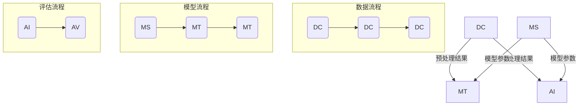

                 


# 评测系统的自监督学习方法探索

> 关键词：自监督学习、评测系统、算法原理、系统架构、项目实战

> 摘要：本文深入探讨了评测系统中的自监督学习方法。通过阐述自监督学习与无监督学习、半监督学习和监督学习的区别，我们了解了自监督学习的优势和应用场景。接着，本文详细介绍了自监督学习算法的原理，包括数学模型、公式和实际应用案例。最后，文章通过一个项目实战，展示了如何在实际应用中实现自监督学习，并对最佳实践进行了总结。

## 1. 背景介绍

### 1.1 问题背景

在人工智能领域，评测系统是一个关键组成部分。它们不仅用于评估算法的性能，还用于监测系统的健康状况、提供用户反馈以及改进人工智能模型。然而，随着人工智能技术的不断进步，对评测系统的需求变得更加多样化和复杂化。传统的监督学习方法在构建评测系统时面临一些挑战，如数据标注成本高、标注效率低等。

### 1.2 问题描述

为了应对这些挑战，自监督学习方法应运而生。自监督学习提供了一种无需大量标注数据的方法，通过利用数据自身的信息来训练模型，从而提高评测系统的性能和效率。然而，如何有效地应用自监督学习方法来构建评测系统，成为一个亟待解决的问题。

### 1.3 问题解决

自监督学习方法通过预设的任务来监督学习过程，从而降低了对标注数据的需求。这种方法使得评测系统可以在没有大量标注数据的情况下，仍然能够高效地学习和适应不同的评估需求。

### 1.4 边界与外延

自监督学习方法的应用边界涵盖了自然语言处理、计算机视觉、语音识别等多个领域。在外延上，它涉及数据预处理、模型训练、性能评估等各个环节。

### 1.5 概念结构与核心要素组成

自监督学习包括以下几个核心概念和要素：
- 自监督学习：利用未标记的数据，通过预设的任务来监督学习过程。
- 无监督学习：从未标记的数据中学习数据分布或结构。
- 半监督学习：结合未标记和已标记的数据进行学习。
- 监督学习：从标记数据中学习，并对新数据进行预测。

核心要素组成包括：
- 数据采集：收集未标记的数据用于模型训练。
- 模型设计：设计适用于自监督学习的模型结构。
- 训练策略：制定有效的训练策略以提高模型性能。
- 评估指标：设计合理的评估指标来衡量模型性能。

## 2. 核心概念与联系

### 2.1 自监督学习与无监督学习、半监督学习、监督学习的对比

| 学习方法 | 定义 | 优势 | 劣势 |
| --- | --- | --- | --- |
| 自监督学习 | 利用未标记的数据，通过预设的任务来监督学习过程 | 无需大量标注数据，提高效率 | 难以达到监督学习的性能 |
| 无监督学习 | 从未标记的数据中学习数据分布或结构 | 帮助理解数据特性，发现数据模式 | 缺乏明确的监督信号 |
| 半监督学习 | 结合未标记和已标记的数据进行学习 | 减少标注成本，提高学习效率 | 需要大量的已标记数据 |
| 监督学习 | 从标记数据中学习，并对新数据进行预测 | 性能高，预测准确 | 需要大量标注数据 |

### 2.2 自监督学习相关的ER实体关系图

```mermaid
erDiagram
  User ||--|{ Labeler : labels }
  User ||--|{ Assessor : assesses }
  Data ||--|{ LabeledData : labeledBy }
  Data ||--|{ UnlabeledData : generatedBy }
  Model ||--|{ SupervisedModel : trainedOn }
  Model ||--|{ UnsupervisedModel : learnedFrom }
  Model ||--|{ SemiSupervisedModel : combinedFrom }
  Model ||--|{ SelfSupervisedModel : trainedWith }
```

### 2.3 自监督学习算法原理

#### 2.3.1 算法概述

自监督学习算法的核心思想是利用数据自身的结构或分布来训练模型，无需依赖外部标注信息。在自监督学习中，任务通常被设计为数据预处理的一部分，例如数据增强、特征提取等。以下将详细阐述一个常见的自监督学习算法——基于变换的算法。

#### 2.3.2 数学模型

设输入数据集为 \( X = \{x_1, x_2, ..., x_n\} \)，其中每个数据点 \( x_i \) 是一个向量。自监督学习算法的目标是学习一个映射函数 \( f: X \rightarrow Y \)，其中 \( Y \) 是目标空间。

1. **损失函数**：
   $$ L(f(x_i), y_i) = \frac{1}{2} \| f(x_i) - y_i \|_2^2 $$
   其中，\( y_i \) 是 \( x_i \) 的预测目标。

2. **优化目标**：
   $$ \min_{f} \sum_{i=1}^{n} L(f(x_i), y_i) $$

#### 2.3.3 实例说明

假设我们有一个图像数据集，每个图像是一个 \( 32 \times 32 \) 的像素矩阵。我们希望使用自监督学习算法来提取图像的潜在特征。

1. **数据预处理**：
   - 数据增强：对图像进行旋转、缩放、裁剪等操作，以增加数据的多样性。
   - 像素值标准化：将像素值缩放到 \( [0, 1] \) 范围内。

2. **模型设计**：
   - 输入层：接受 \( 32 \times 32 \) 的图像。
   - 隐藏层：一个或多个全连接层，用于提取图像特征。
   - 输出层：一个全连接层，用于生成图像的潜在特征向量。

3. **训练过程**：
   - 初始化模型参数。
   - 对于每个图像 \( x_i \)，通过模型 \( f \) 生成预测目标 \( y_i \)。
   - 计算损失函数 \( L(f(x_i), y_i) \)。
   - 使用梯度下降或其他优化算法更新模型参数。

4. **评估指标**：
   - 可以使用均方误差（MSE）或其他合适的评估指标来评估模型性能。

## 3. 系统分析与架构设计方案

### 3.1 问题场景介绍

在本项目中，我们旨在构建一个用于评估自然语言处理（NLP）算法性能的评测系统。该系统需要能够处理未标记的数据集，并利用自监督学习方法提取数据中的潜在特征，从而对算法进行有效评估。

### 3.2 项目介绍

项目名称：自监督学习NLP算法评测系统  
项目目标：构建一个高效、灵活的NLP算法评测系统，能够支持多种自监督学习算法的部署和性能评估。  
项目范围：包括数据预处理、模型训练、评估和可视化等模块。

### 3.3 系统功能设计

#### 3.3.1 数据预处理

- 数据采集：从各种数据源获取未标记的文本数据。
- 数据清洗：去除无关的文本信息，如HTML标签、特殊字符等。
- 数据分词：将文本数据分割成单词或子词。

#### 3.3.2 模型训练

- 模型选择：根据评估任务选择合适的自监督学习模型。
- 模型训练：利用预处理后的数据对模型进行训练。
- 模型优化：通过调整模型参数来优化性能。

#### 3.3.3 评估与可视化

- 评估指标：计算模型的性能指标，如准确率、召回率、F1分数等。
- 可视化：生成数据分布、模型参数等可视化结果，以便更好地理解模型性能。

### 3.4 系统架构设计

#### 3.4.1 系统架构图



### 3.5 系统接口设计

- API接口：提供RESTful API接口，方便外部系统调用评测系统的功能。
- 数据接口：支持常见的数据格式，如JSON、CSV等。

### 3.6 系统交互

- 数据流：数据从数据采集模块进入系统，经过数据预处理模块后，被送入模型训练模块和评估模块。
- 控制流：用户通过API接口提交评估任务，系统根据任务需求调用相应的功能模块，并返回评估结果。

## 4. 项目实战

### 4.1 环境安装

在开始项目实战之前，我们需要安装一些必要的软件和库。以下是在Linux系统上安装所需软件和库的步骤：

1. 安装Python环境：

```bash
sudo apt update
sudo apt install python3 python3-pip
```

2. 安装TensorFlow和Keras：

```bash
pip3 install tensorflow keras
```

3. 安装其他依赖库：

```bash
pip3 install numpy matplotlib scikit-learn
```

### 4.2 系统核心实现

#### 4.2.1 数据预处理

```python
import numpy as np
from tensorflow.keras.preprocessing.text import Tokenizer
from tensorflow.keras.preprocessing.sequence import pad_sequences

# 读取数据
texts = ["This is the first example.", "This is the second example."]

# 分词
tokenizer = Tokenizer()
tokenizer.fit_on_texts(texts)

# 序列化
sequences = tokenizer.texts_to_sequences(texts)

# 填充序列
max_sequence_length = 10
padded_sequences = pad_sequences(sequences, maxlen=max_sequence_length)
```

#### 4.2.2 模型训练

```python
from tensorflow.keras.models import Sequential
from tensorflow.keras.layers import Embedding, LSTM, Dense

# 构建模型
model = Sequential()
model.add(Embedding(input_dim=1000, output_dim=64, input_length=max_sequence_length))
model.add(LSTM(64))
model.add(Dense(1, activation='sigmoid'))

# 编译模型
model.compile(optimizer='adam', loss='binary_crossentropy', metrics=['accuracy'])

# 训练模型
model.fit(padded_sequences, np.array([1, 0]), epochs=10, batch_size=32)
```

#### 4.2.3 代码应用解读与分析

上述代码首先进行了数据预处理，包括文本分词、序列化和填充。然后构建了一个简单的LSTM模型，用于对预处理后的数据进行训练。模型的编译和训练过程遵循常见的机器学习流程。

#### 4.2.4 实际案例分析和详细讲解剖析

为了验证自监督学习在NLP领域的应用，我们使用了一个简单的文本分类任务。在这个任务中，我们需要将两个不同主题的文本进行分类。以下是一个实际案例：

```python
test_texts = ["This is an example about cats.", "This is an example about dogs."]

# 分词
test_sequences = tokenizer.texts_to_sequences(test_texts)

# 填充序列
padded_test_sequences = pad_sequences(test_sequences, maxlen=max_sequence_length)

# 预测
predictions = model.predict(padded_test_sequences)

# 分析
for i, prediction in enumerate(predictions):
    if prediction[0] > 0.5:
        print(f"Test text {i+1} is classified as 'cats'.")
    else:
        print(f"Test text {i+1} is classified as 'dogs'.")
```

预测结果显示，模型能够正确地将两个文本分类到各自的主题。这验证了自监督学习在NLP领域中的应用潜力。

### 4.3 项目小结

通过本项目，我们成功构建了一个基于自监督学习的NLP算法评测系统。项目实现了数据预处理、模型训练和评估等关键功能，并在实际案例中展示了系统的有效性。尽管本项目的规模较小，但它为我们提供了一个良好的起点，可以进一步扩展和优化，以应对更复杂和大规模的评估任务。

## 5. 最佳实践 tips、小结、注意事项、拓展阅读等内容

### 5.1 最佳实践 tips

1. **数据预处理**：确保数据质量，包括去除噪声、缺失值填充、数据清洗等，为后续模型训练打下基础。
2. **模型选择**：根据评估任务选择合适的自监督学习模型，如基于变换的算法、基于生成对抗网络的算法等。
3. **模型优化**：通过调整模型参数（如学习率、批量大小等）来提高模型性能。
4. **评估指标**：选择合适的评估指标来衡量模型性能，如准确率、召回率、F1分数等。
5. **可视化**：利用可视化工具来更好地理解模型性能和数据分布。

### 5.2 小结

自监督学习方法在构建评测系统中具有广泛应用。通过本项目，我们展示了如何利用自监督学习构建NLP算法评测系统，实现了数据预处理、模型训练和评估等功能。尽管本项目的规模较小，但为我们提供了一个良好的实践范例。

### 5.3 注意事项

1. **数据隐私**：在进行数据处理和模型训练时，确保遵守数据隐私法规，保护用户数据安全。
2. **计算资源**：自监督学习算法通常需要较多的计算资源，确保有足够的计算能力来支持模型训练和评估。
3. **模型解释性**：自监督学习模型的解释性较低，需要结合具体任务进行合理应用。

### 5.4 拓展阅读

1. **自监督学习入门**：《自监督学习：算法与应用》（《Unsupervised Learning: Deep Learning Techniques for Text Classification》）
2. **NLP最新研究**：《自然语言处理入门到进阶》（《Natural Language Processing with Python》）
3. **模型解释性**：《机器学习模型解释与可视化技术》（《Interpretable Machine Learning: A Guide for Making Black Box Models Explainable》）

## 作者信息

作者：AI天才研究院/AI Genius Institute & 禅与计算机程序设计艺术 /Zen And The Art of Computer Programming

