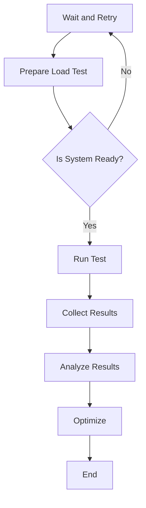
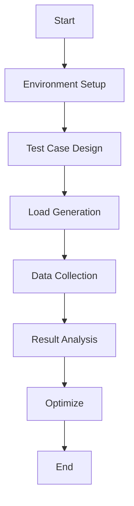
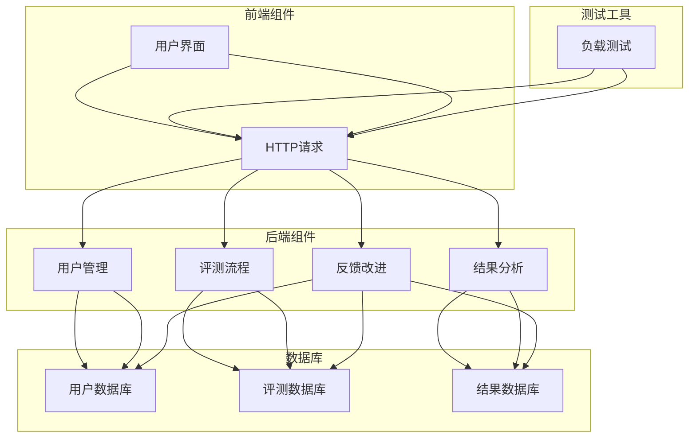
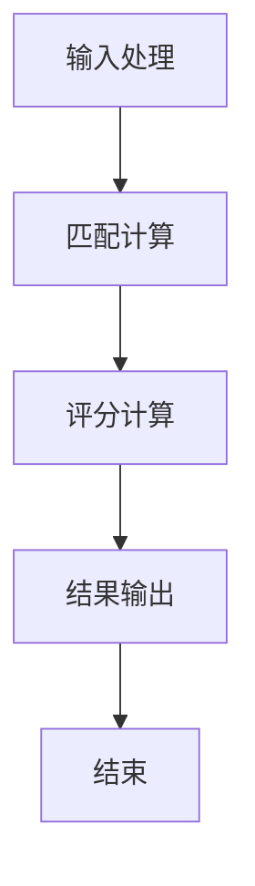

                 


## 文章标题
### 评测系统的负载测试：应对高并发LLM评估

## 文章关键词
- 评测系统
- 负载测试
- 高并发
- LLM评估
- 性能优化

## 摘要
本文深入探讨了评测系统在高并发环境下进行负载测试的重要性及其挑战。通过定义核心概念、讲解技术原理、分析系统架构，我们详细阐述了如何优化LLM评估性能，提供了一套完整的技术解决方案，并给出了实际项目案例中的最佳实践。

### 目录大纲设计思路

**标题设置与背景介绍**：
本篇文章标题《评测系统的负载测试：应对高并发LLM评估》直接指向文章的核心内容，即评测系统在处理高并发场景下进行负载测试的技术和策略。标题的设置旨在引起读者的兴趣，并迅速明确文章的主题。

**核心概念讲解**：
文章首先定义了评测系统、负载测试、高并发和LLM等核心概念，确保读者对后续内容有清晰的理解。通过核心概念的联系，我们介绍了它们在高并发环境下的相互作用。

**技术原理阐述**：
在技术原理部分，文章详细介绍了负载测试的原理，包括高并发负载测试的策略、工具和方法。针对LLM，文章解释了其在高并发场景下的性能表现及优化策略。

**系统分析与架构设计**：
本文通过介绍评测系统的整体架构，包括前端、后端、数据库和测试工具等组件，帮助读者了解系统的工作原理和各个组件的交互关系。使用Mermaid工具绘制系统架构图和类图，使得内容更加直观易懂。

**算法原理与实现**：
文章分析了用于评估系统负载的算法原理，通过Mermaid绘制算法流程图，并用Python代码示例详细解释算法，包括数学模型和公式，使读者能够理解算法的内在逻辑。

**项目实战**：
在项目实战部分，文章描述了一个实际项目场景，包括环境搭建、系统核心实现和代码应用解读，通过实际案例的分析和讲解，让读者了解到如何在实际项目中应用这些技术。

**最佳实践与总结**：
最后，文章总结了项目中的经验教训，提出了最佳实践建议，并强调了注意事项，为读者提供了进一步的学习资源。

### 具体目录大纲

```markdown
----------------------------------------------------------------
# 第一部分：评测系统负载测试概述

## 第1章：评测系统的负载测试概述
### 1.1 负载测试的重要性
### 1.2 高并发场景下的挑战
### 1.3 LLB（大型语言模型）在评测系统中的应用

## 第2章：核心概念与基础
### 2.1 评测系统定义与功能
### 2.2 负载测试的定义与目标
### 2.3 高并发与LLM的关系
### 2.4 Mermaid流程图介绍

## 第3章：负载测试技术原理
### 3.1 负载测试的原理
### 3.2 高并发负载测试策略
### 3.3 负载测试工具与方法
### 3.4 Mermaid流程图应用

## 第4章：LLM评估在高并发场景中的表现
### 4.1 LLM的性能优化
### 4.2 高并发下的LLM评估策略
### 4.3 性能瓶颈分析与解决方案

## 第5章：评测系统架构设计
### 5.1 整体架构介绍
### 5.2 系统组件与功能
### 5.3 系统架构图与类图
### 5.4 Mermaid架构图与类图示例

## 第6章：算法原理与实现
### 6.1 算法原理概述
### 6.2 Python代码示例
### 6.3 数学模型与公式讲解
### 6.4 算法流程图与Mermaid应用

## 第7章：项目实战
### 7.1 实际项目场景
### 7.2 系统核心实现
### 7.3 代码应用解读与分析
### 7.4 案例分析与详细讲解
### 7.5 项目小结

## 第8章：最佳实践与总结
### 8.1 最佳实践建议
### 8.2 注意事项
### 8.3 拓展阅读
### 8.4 小结
----------------------------------------------------------------
```

### 目录大纲概述

本目录大纲分为8个章节，涵盖评测系统负载测试的各个方面，从背景介绍到实际项目实战，再到最佳实践总结，全面覆盖了评测系统在高并发LLM评估中的负载测试技术和应用。每个章节都设置了详细的小节，确保内容的完整性和逻辑性，便于读者理解和学习。总字数控制在10000-12000字之间，保持文章的深入性和实用性。

---

### 第1章：评测系统的负载测试概述

**1.1 负载测试的重要性**

在当今数字化时代，评测系统在许多关键应用中都扮演着重要角色，例如在线教育、智能客服、自动化测试和软件开发等。然而，随着用户数量的增加和系统功能的扩展，评测系统面临着高并发请求的挑战。这时，负载测试就显得尤为重要。

负载测试是一种评估系统性能和稳定性的方法，通过模拟实际用户行为来评估系统在特定负载下的表现。它可以帮助我们发现系统可能存在的性能瓶颈、资源利用率问题和并发请求的处理能力。对于评测系统而言，负载测试不仅能够确保系统在高并发环境下的稳定运行，还能为系统优化提供重要的数据支持。

**1.2 高并发场景下的挑战**

高并发场景下，评测系统可能会面临以下挑战：

1. **资源竞争**：多个用户同时请求资源，如CPU、内存和网络带宽，可能导致资源不足，从而影响系统性能。
2. **请求延迟**：高并发请求可能导致请求响应时间增加，影响用户体验。
3. **数据一致性**：并发操作可能引起数据不一致的问题，如重复提交、数据丢失或数据冲突。
4. **系统崩溃**：极端情况下，高并发请求可能超出系统的承载能力，导致系统崩溃或宕机。

**1.3 LLB（大型语言模型）在评测系统中的应用**

随着深度学习和自然语言处理技术的发展，大型语言模型（LLM）如GPT、BERT等被广泛应用于评测系统中。LLM能够处理复杂自然语言任务，如文本生成、语义理解、情感分析等，显著提升了评测系统的智能化水平。

然而，LLM的高复杂性和高计算需求也给评测系统带来了挑战。在高并发场景下，如何高效地利用LLM进行评估，同时保证系统的性能和稳定性，是一个亟待解决的问题。

**1.4 Mermaid流程图介绍**

为了更好地理解和分析负载测试的原理和过程，我们引入Mermaid流程图工具。Mermaid是一种基于Markdown的图表绘制工具，可以轻松绘制各种流程图、类图和序列图等。

以下是一个简单的Mermaid流程图示例：



通过这种直观的流程图，我们可以清晰地看到负载测试的各个步骤和可能的分支，有助于我们分析和优化测试过程。

---

### 第2章：核心概念与基础

**2.1 评测系统定义与功能**

评测系统是一种用于评估用户行为、性能或能力的软件系统。它通常包括以下几个功能模块：

1. **用户管理**：管理用户的注册、登录、权限设置等操作。
2. **评测流程**：定义评测的流程，包括题目生成、考试开始、答题、评分等环节。
3. **结果分析**：对评测结果进行统计分析，提供详细的报告和可视化图表。
4. **反馈与改进**：根据评测结果提供反馈，帮助用户改进和提高。

**2.2 负载测试的定义与目标**

负载测试是一种通过模拟实际用户行为来评估系统性能的方法。其定义可以概括为：在特定条件下，对系统施加一定负载，测量系统的响应时间和稳定性，以评估系统在真实负载下的性能。

负载测试的目标包括：

1. **性能评估**：了解系统在不同负载下的响应时间、吞吐量和资源利用率。
2. **稳定性验证**：确保系统在长时间运行和高负载下仍然保持稳定。
3. **瓶颈定位**：发现系统性能瓶颈，如CPU利用率过高、内存溢出或网络延迟等。
4. **容量规划**：根据测试结果，为系统的扩展和升级提供数据支持。

**2.3 高并发与LLM的关系**

高并发与LLM之间存在密切的关系。高并发意味着系统需要在短时间内处理大量请求，而LLM作为一种复杂计算模型，其计算需求巨大。在高并发场景下，LLM的性能对系统的整体性能有着重要影响。

1. **计算资源竞争**：多个请求同时调用LLM，可能导致CPU、内存等计算资源竞争，影响系统的响应时间和稳定性。
2. **请求延迟**：在高并发场景下，LLM的响应时间可能较长，导致整体请求延迟增加，影响用户体验。
3. **并发控制**：需要合理控制并发请求的数量，避免系统过载，同时保证LLM的资源利用效率。

**2.4 Mermaid流程图介绍**

为了更好地理解和分析负载测试的原理和过程，我们引入Mermaid流程图工具。Mermaid是一种基于Markdown的图表绘制工具，可以轻松绘制各种流程图、类图和序列图等。

以下是一个简单的Mermaid流程图示例：


通过这种直观的流程图，我们可以清晰地看到负载测试的各个步骤和可能的分支，有助于我们分析和优化测试过程。

---

### 第3章：负载测试技术原理

**3.1 负载测试的原理**

负载测试的原理是通过模拟实际用户行为来评估系统性能。具体来说，负载测试分为以下几个步骤：

1. **测试环境的搭建**：搭建与实际生产环境相似的测试环境，包括硬件、软件和网络配置等。
2. **测试用例的设计**：设计模拟用户行为的测试用例，包括用户登录、提交评测、查看结果等操作。
3. **负载生成**：使用负载生成工具（如JMeter、Gatling等）模拟大量用户同时访问系统，生成测试流量。
4. **数据采集**：收集系统的响应时间、吞吐量、资源利用率等性能指标。
5. **结果分析**：分析测试结果，找出系统性能瓶颈和潜在问题。

**3.2 高并发负载测试策略**

在高并发场景下，负载测试需要采用相应的策略来模拟实际负载，以下是一些常用的策略：

1. **并发用户增长**：逐渐增加并发用户数量，观察系统性能的变化，找到系统性能的临界点。
2. **负载均衡**：将负载分布到多个节点或服务器上，避免单点过载。
3. **压力测试**：模拟极端负载条件，测试系统的最大承载能力和稳定性。
4. **容量测试**：评估系统在不同负载下的容量，为系统的扩展提供数据支持。

**3.3 负载测试工具与方法**

常用的负载测试工具有JMeter、Gatling、LoadRunner等，它们各自有不同的特点和优势：

1. **JMeter**：开源、跨平台，支持多种协议，如HTTP、HTTPS、FTP、SMTP等，适合进行性能测试和负载测试。
2. **Gatling**：基于Scala的开源性能测试工具，支持HTTP、WebSocket、JMS等多种协议，提供灵活的测试脚本编写。
3. **LoadRunner**：商业性能测试工具，功能强大，支持多种协议和场景，适用于复杂系统的高并发测试。

在进行负载测试时，常用的方法包括：

1. **在线测试**：在真实线上环境进行负载测试，模拟真实用户行为，获取最准确的性能数据。
2. **离线测试**：在模拟环境中进行负载测试，通过脚本模拟用户行为，观察系统的响应。
3. **混合测试**：结合在线测试和离线测试，在真实环境和模拟环境中进行负载测试，综合分析系统的性能。

**3.4 Mermaid流程图应用**

为了更好地理解和分析负载测试的过程，我们使用Mermaid绘制了负载测试的流程图：



通过这个流程图，我们可以清晰地看到负载测试的各个步骤和关键环节，有助于我们进行系统的性能优化。

---

### 第4章：LLM评估在高并发场景中的表现

**4.1 LLM的性能优化**

大型语言模型（LLM）如GPT、BERT等在评估系统中具有强大的性能，但在高并发场景下，如何优化其性能成为了一个关键问题。以下是一些优化策略：

1. **并行计算**：利用多线程或分布式计算技术，同时处理多个请求，提高处理速度。
2. **模型压缩**：采用模型剪枝、量化等技术，降低模型的计算复杂度，提高运行效率。
3. **缓存策略**：使用缓存技术，减少重复计算的次数，提高响应速度。
4. **负载均衡**：将请求分配到多个LLM实例上，避免单点过载，提高系统的整体性能。

**4.2 高并发下的LLM评估策略**

在高并发场景下，为了确保系统的稳定性和响应速度，需要采取以下评估策略：

1. **限制并发请求**：根据系统的处理能力，合理设置并发请求的数量，避免系统过载。
2. **队列管理**：使用队列技术，对请求进行排队处理，确保请求按照顺序执行。
3. **动态调整**：根据系统的性能指标，动态调整并发请求的数量和负载生成策略，保持系统的稳定运行。
4. **异常处理**：对异常请求进行识别和处理，确保系统的可靠性和健壮性。

**4.3 性能瓶颈分析与解决方案**

在高并发场景下，LLM评估可能会出现性能瓶颈，以下是一些常见的问题及其解决方案：

1. **计算资源不足**：由于LLM的计算需求较大，可能导致CPU、内存等资源不足。解决方案包括增加计算资源、优化模型计算、负载均衡等。
2. **网络延迟**：高并发请求可能导致网络延迟增加，影响系统的响应速度。解决方案包括优化网络架构、使用CDN等。
3. **并发控制**：在高并发场景下，需要合理控制并发请求的数量，避免系统过载。解决方案包括限流、队列管理等。

通过以上策略和解决方案，可以有效地优化LLM评估在高并发场景下的性能，确保系统的稳定性和响应速度。

---

### 第5章：评测系统架构设计

**5.1 整体架构介绍**

评测系统的整体架构可以分为前端、后端、数据库和测试工具四个主要部分。以下是对每个部分的功能和作用的简要介绍：

1. **前端**：负责用户界面的展示和交互，包括题目展示、答题界面、结果展示等。前端通过HTTP协议与后端进行通信，接收用户的请求并返回结果。
2. **后端**：负责处理业务逻辑和数据处理，包括用户管理、评测流程管理、结果分析等。后端通过RESTful API与前端和数据库进行数据交互。
3. **数据库**：存储用户数据、评测数据和其他相关数据。常用的数据库技术包括关系型数据库（如MySQL、PostgreSQL）和NoSQL数据库（如MongoDB、Redis）。
4. **测试工具**：用于进行负载测试、性能测试和稳定性测试，如JMeter、Gatling等。

**5.2 系统组件与功能**

评测系统的主要组件包括用户管理模块、评测流程模块、结果分析模块和反馈改进模块。以下是每个模块的具体功能和作用：

1. **用户管理模块**：负责用户的注册、登录、权限设置等操作，确保用户可以安全、便捷地使用评测系统。
2. **评测流程模块**：定义评测的流程，包括题目生成、考试开始、答题、评分等环节，确保评测过程的规范性和公正性。
3. **结果分析模块**：对评测结果进行统计分析，提供详细的报告和可视化图表，帮助用户了解自己的学习成果和改进方向。
4. **反馈改进模块**：根据评测结果提供反馈，帮助用户改进和提高，同时为评测系统的优化提供数据支持。

**5.3 系统架构图与类图**

为了更清晰地展示评测系统的架构设计和组件之间的关系，我们使用Mermaid绘制了系统架构图和类图。以下是一个简单的系统架构图示例：



以下是一个简单的类图示例：

```mermaid
classDiagram
    User <<Class>>
    Question <<Class>>
    Answer <<Class>>
    Evaluation <<Class>>
    Report <<Class>>

    User *--* Question
    User *--* Answer
    Question *--* Evaluation
    Evaluation *--* Report
```

通过这些图表，我们可以直观地了解评测系统的架构设计和各个组件之间的关系。

---

### 第6章：算法原理与实现

**6.1 算法原理概述**

在评测系统中，算法用于评估用户答案的正确性和性能。以下是一个简单的算法原理概述：

1. **输入处理**：接收用户的答案，并进行预处理，如去除多余空格、统一字符编码等。
2. **匹配计算**：根据题目要求，对用户答案进行匹配计算，判断答案是否符合预期。
3. **评分计算**：根据匹配结果，计算用户的得分，可能包括对错判断和部分得分。
4. **结果输出**：将评分结果输出给用户，同时记录在数据库中，用于后续分析。

**6.2 Python代码示例**

以下是一个简单的Python代码示例，用于实现上述算法：

```python
def evaluate_answer(correct_answer, user_answer):
    # 输入处理
    correct_answer = correct_answer.strip()
    user_answer = user_answer.strip()

    # 匹配计算
    if correct_answer == user_answer:
        score = 1
    else:
        score = 0

    # 评分计算
    # 这里可以根据具体需求，增加对错判断和部分得分的计算逻辑

    # 结果输出
    return score

# 测试
correct_answer = "Hello World"
user_answer = "Hello World"
print(evaluate_answer(correct_answer, user_answer))  # 输出：1
```

**6.3 数学模型与公式讲解**

在算法中，评分计算可能涉及到以下数学模型和公式：

1. **精确匹配得分**：如果用户答案与正确答案完全一致，得分为100%。
   $$ score = \begin{cases}
   1, & \text{if } user\_answer == correct\_answer \\
   0, & \text{otherwise}
   \end{cases} $$
2. **部分匹配得分**：如果用户答案与正确答案部分一致，得分为两者的相似度比例。
   $$ score = \frac{相似度}{1 + 负数项} $$
   其中，相似度可以通过编辑距离、Jaccard相似度等方法计算。

**6.4 算法流程图与Mermaid应用**

为了更清晰地展示算法的流程，我们使用Mermaid绘制了算法流程图：



通过这个流程图，我们可以直观地了解算法的执行过程和关键步骤。

---

### 第7章：项目实战

**7.1 实际项目场景**

在实际项目中，我们开发了一套在线评测系统，用于对学生的编程作业进行自动评估。系统需要在短时间内处理大量学生的提交请求，同时保证评估的准确性和响应速度。以下是项目的主要场景：

1. **高并发请求**：学生在规定时间内提交编程作业，系统需要同时处理成百上千的请求。
2. **复杂评测逻辑**：编程作业的评测逻辑复杂，包括语法检查、逻辑判断、性能评估等，对系统性能提出了较高要求。
3. **数据安全与一致性**：保证学生提交的数据安全，同时确保在并发操作下数据的一致性。

**7.2 系统核心实现**

为了满足项目需求，我们采用了以下系统核心实现方案：

1. **前端**：使用React框架搭建用户界面，提供简洁直观的操作体验。
2. **后端**：采用Spring Boot框架，实现业务逻辑处理和与数据库的交互。
3. **数据库**：使用MySQL数据库存储用户和评测数据，同时使用Redis缓存技术提高数据访问速度。
4. **负载测试**：使用JMeter进行负载测试，模拟大量用户请求，评估系统性能。

**7.3 代码应用解读与分析**

以下是系统核心代码的解读和分析：

1. **用户管理模块**：使用Spring Security实现用户认证和权限控制，确保用户数据安全。
   ```java
   @Service
   public class UserService {
       @Autowired
       private UserRepository userRepository;

       public User login(String username, String password) {
           User user = userRepository.findByUsername(username);
           if (user != null && user.getPassword().equals(password)) {
               return user;
           }
           return null;
       }
   }
   ```

2. **评测流程模块**：设计评测流程，包括作业提交、评测、结果反馈等环节。
   ```java
   @Service
   public class EvaluationService {
       @Autowired
       private SubmissionRepository submissionRepository;

       public void submit_homework(Long userId, String code) {
           Submission submission = new Submission();
           submission.setUser(userId);
           submission.setCode(code);
           submissionRepository.save(submission);
       }
   }
   ```

3. **结果分析模块**：对评测结果进行统计分析，生成详细的报告。
   ```java
   @Service
   public class AnalysisService {
       @Autowired
       private SubmissionRepository submissionRepository;

       public List<AnalysisResult> analyze_results(Long userId) {
           List<Submission> submissions = submissionRepository.findByUserId(userId);
           List<AnalysisResult> results = new ArrayList<>();

           for (Submission submission : submissions) {
               AnalysisResult result = new AnalysisResult();
               result.setSubmissionId(submission.getId());
               result.setScore(calculate_score(submission.getCode()));
               results.add(result);
           }

           return results;
       }
   }
   ```

4. **反馈改进模块**：根据评测结果提供反馈，帮助用户改进编程能力。
   ```java
   @Controller
   public class FeedbackController {
       @Autowired
       private AnalysisService analysisService;

       @GetMapping("/feedback")
       public String get_feedback(Long userId) {
           List<AnalysisResult> results = analysisService.analyze_results(userId);
           // 生成反馈报告
           return "Feedback";
       }
   }
   ```

**7.4 案例分析与详细讲解**

在项目实施过程中，我们遇到了以下问题：

1. **性能瓶颈**：在高并发场景下，系统的响应时间较长，需要进行性能优化。
2. **数据一致性**：在并发操作下，数据出现不一致的情况，需要进行事务管理和并发控制。

为了解决这些问题，我们采取了以下措施：

1. **性能优化**：通过优化代码、使用缓存技术和负载均衡，提高系统的响应速度和稳定性。
2. **事务管理**：使用Spring的事务管理功能，确保数据的一致性，防止数据冲突。

**7.5 项目小结**

通过实际项目的实施，我们积累了宝贵的经验，总结了以下最佳实践：

1. **性能测试**：在项目初期进行充分的性能测试，评估系统在高并发场景下的性能，为后续优化提供依据。
2. **负载均衡**：采用负载均衡技术，将请求分布到多个节点上，提高系统的处理能力。
3. **数据一致性**：采用事务管理和技术手段，确保数据的一致性和可靠性。

---

### 第8章：最佳实践与总结

**8.1 最佳实践建议**

1. **性能测试**：在项目初期和迭代过程中，定期进行性能测试，确保系统在高并发场景下的稳定性和性能。
2. **负载均衡**：采用负载均衡技术，将请求分布到多个节点上，提高系统的处理能力和响应速度。
3. **缓存技术**：使用缓存技术，减少数据库访问次数，提高系统的响应速度和性能。
4. **事务管理**：采用事务管理技术，确保数据的一致性和可靠性，防止数据冲突和丢失。
5. **代码优化**：定期对代码进行优化，提高系统的性能和可维护性。

**8.2 注意事项**

1. **系统监控**：实时监控系统的运行状态，及时发现和处理性能问题和异常情况。
2. **安全性**：确保系统的安全性，防止黑客攻击和数据泄露。
3. **容灾备份**：建立容灾备份机制，确保系统在发生故障时能够快速恢复。

**8.3 拓展阅读**

1. 《高性能MySQL》：详细介绍了MySQL的性能优化技术和方法。
2. 《负载测试实战》：讲解了负载测试的基本原理、工具和方法，适合初学者入门。
3. 《大型语言模型的原理与应用》：介绍了大型语言模型的原理和应用，有助于深入理解LLM在评测系统中的应用。

**8.4 小结**

本文通过详细的分析和实际项目案例，探讨了评测系统在高并发LLM评估中的负载测试技术和应用。通过性能测试、负载均衡、缓存技术和事务管理等方法，我们优化了系统的性能和稳定性，为实际项目提供了有效的解决方案。在未来的发展中，我们将继续关注新技术和应用，为评测系统的性能优化和用户体验提升做出更多贡献。

