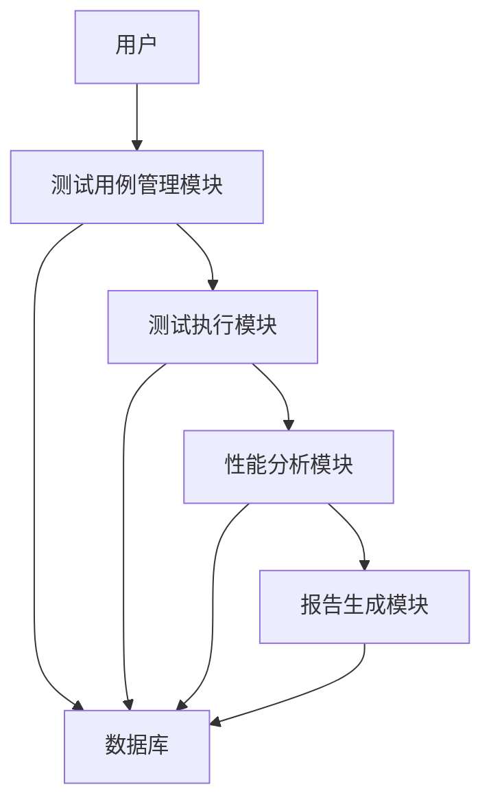
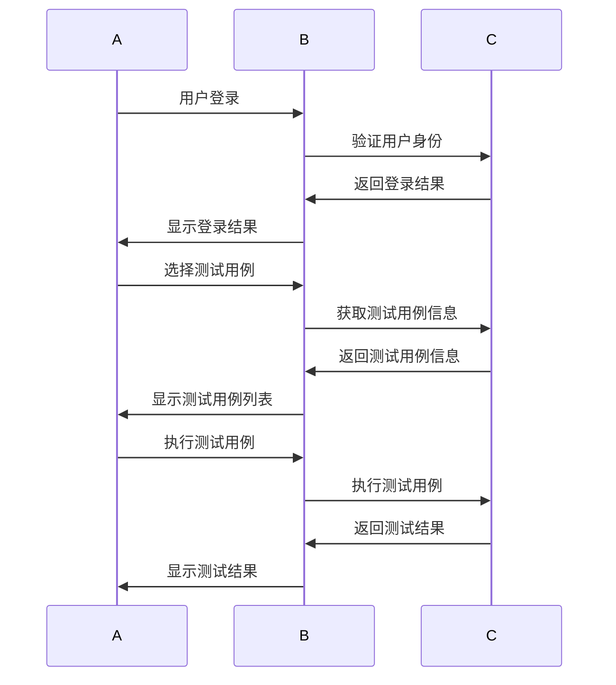

                 

# 评测系统的跨平台兼容性：支持多环境部署

> 关键词：跨平台兼容性、评测系统、多环境部署、模块化设计、标准化接口

> 摘要：本文深入探讨了评测系统的跨平台兼容性问题，分析了其在软件行业中的重要性，以及面临的各种挑战。通过模块化设计和标准化接口的方法，详细阐述了如何设计一个能够高效、稳定地运行于多种操作系统和硬件环境中的评测系统。同时，本文还通过算法原理讲解、数学模型与公式详细解析，以及系统分析与架构设计等方面，为读者提供了全面的技术解决方案。

## 1. 背景介绍与核心概念

### 1.1 问题背景

在当今软件行业中，跨平台兼容性已成为一个至关重要的因素。随着软件应用的不断扩展，越来越多的软件需要在不同操作系统（如Windows、Linux、MacOS）和硬件环境中运行。然而，不同的操作系统和硬件环境往往具有不同的系统调用、API接口和执行环境，这使得跨平台兼容性成为一个复杂的挑战。

### 1.2 跨平台兼容性的重要性

跨平台兼容性对于评测系统来说尤为重要。评测系统通常用于测试软件的稳定性和性能，其结果直接影响到软件的质量。如果评测系统无法在不同操作系统和硬件环境中正常运行，那么其测试结果将失去参考价值。因此，设计一个具有良好跨平台兼容性的评测系统是至关重要的。

### 1.3 跨平台兼容性的挑战

跨平台兼容性面临的挑战主要包括以下几个方面：

- **操作系统差异**：不同操作系统具有不同的系统调用和API接口，例如Windows和Linux之间的差异。
- **硬件环境差异**：不同硬件环境具有不同的CPU架构、内存配置和网络环境，例如x86和ARM之间的差异。
- **兼容性问题**：某些操作系统或硬件环境可能不支持特定的库或工具，导致评测系统无法正常运行。

### 1.4 问题描述

如何设计一个评测系统，使其能够在多个操作系统和硬件环境中高效、稳定地运行？如何确保评测系统在不同环境下具有相同的性能和功能？

### 1.5 问题解决

为了解决上述问题，我们可以采取以下方法：

- **模块化设计**：将评测系统分解为独立的模块，每个模块分别实现特定功能，便于在不同环境下部署和测试。
- **标准化接口**：设计统一的接口，确保不同操作系统和硬件环境之间的通信和协作。

### 1.6 边界与外延

- **跨平台兼容性的范围**：主要涉及操作系统（Windows、Linux、MacOS）和硬件环境（不同CPU架构、不同内存配置）。
- **外延**：除了操作系统和硬件环境，还需要考虑网络环境、数据库系统等其他因素。

### 1.7 概念结构与核心要素组成

- **核心概念**：跨平台兼容性、评测系统、模块化设计、标准化接口。
- **核心要素**：操作系统、硬件环境、网络环境、数据库系统、模块划分、接口设计。

## 2. 核心概念与联系

### 2.1 跨平台兼容性的定义

跨平台兼容性是指软件系统在不同操作系统和硬件环境中能够正常运行的能力。具体来说，跨平台兼容性包括以下几个方面：

- **操作系统兼容性**：软件能够在不同操作系统（如Windows、Linux、MacOS）上运行。
- **硬件兼容性**：软件能够在不同硬件环境（如不同CPU架构、不同内存配置）上运行。
- **网络兼容性**：软件能够在不同网络环境中运行，例如局域网和互联网。

### 2.2 评测系统的定义

评测系统是一种用于测试软件稳定性和性能的软件系统。其核心功能包括：

- **测试用例设计**：根据软件需求，设计合适的测试用例。
- **测试执行**：自动执行测试用例，记录测试结果。
- **性能分析**：分析测试结果，评估软件的稳定性、性能和可靠性。

### 2.3 模块化设计与标准化接口

模块化设计是指将系统分解为若干独立的模块，每个模块负责特定的功能。模块化设计有助于提高系统的可维护性、可扩展性和可复用性。标准化接口是指设计统一的接口，确保不同模块之间的通信和协作。标准化接口有助于提高系统的跨平台兼容性。

### 2.4 概念属性特征对比表格

| 特征             | 跨平台兼容性 | 评测系统          | 模块化设计       | 标准化接口       |
|------------------|--------------|------------------|------------------|------------------|
| 定义             | 软件在不同操作系统和硬件环境中运行的能力 | 用于测试软件的稳定性和性能 | 将系统分解为独立的模块 | 设计统一的接口 |
| 目标             | 提高软件的可移植性、稳定性和性能         | 提高软件的质量和可靠性     | 提高系统的可维护性、可扩展性和可复用性 | 提高系统的跨平台兼容性 |
| 关键要素         | 操作系统、硬件环境、网络环境等           | 测试用例、测试执行、性能分析 | 模块划分、接口设计 | 接口规范、通信协议 |
| 对比             | 跨平台兼容性是评测系统的基础           | 评测系统是实现跨平台兼容性的手段 | 模块化设计是系统架构设计的一种方法 | 标准化接口是模块化设计的一部分 |

### 2.5 概念结构与核心要素组成

- **核心概念**：跨平台兼容性、评测系统、模块化设计、标准化接口。
- **核心要素**：操作系统、硬件环境、网络环境、数据库系统、模块划分、接口设计。

## 3. 算法原理讲解

### 3.1 算法流程图

使用Mermaid画出算法流程图：


### 3.2 Python源代码实现

```python
# 数据预处理
def preprocess_data(data):
    # 实现预处理逻辑
    return processed_data

# 模型训练
def train_model(processed_data):
    # 实现训练逻辑
    return model

# 模型评估
def evaluate_model(model, test_data):
    # 实现评估逻辑
    return evaluation_results

# 输出结果
def output_results(evaluation_results):
    # 实现输出逻辑
    print(evaluation_results)
```

### 3.3 算法原理详细讲解

- **数据预处理**：对输入数据进行清洗、归一化等操作，使其符合模型训练的要求。
- **模型训练**：通过训练算法，如梯度下降、随机梯度下降等，不断调整模型参数，使模型在训练数据上达到最优性能。
- **模型评估**：使用评估算法，如交叉验证、混淆矩阵等，对模型在测试数据上的性能进行评估。
- **输出结果**：根据评估结果，输出模型的预测结果。

## 4. 数学模型和数学公式

### 4.1 数学模型

$$ y = \sigma(Wx + b) $$

$$ \text{其中，} W \text{是权重矩阵，} x \text{是输入向量，} b \text{是偏置，} \sigma \text{是激活函数。} $$

### 4.2 详细讲解

这个公式描述了一个简单的神经网络模型，其中$W$和$b$分别是权重矩阵和偏置向量，$x$是输入向量，$y$是输出向量。$\sigma$是激活函数，常用的激活函数有sigmoid、ReLU等。

### 4.3 举例说明

假设输入向量$x = [1, 2, 3]$，权重矩阵$W = \begin{bmatrix} 0.1 & 0.2 \\ 0.3 & 0.4 \end{bmatrix}$，偏置$b = [0.5, 0.6]$，激活函数$\sigma(x) = \frac{1}{1 + e^{-x}}$。则输出$y$为：

$$ y = \sigma(Wx + b) = \frac{1}{1 + e^{-\begin{bmatrix} 0.1 & 0.2 \\ 0.3 & 0.4 \end{bmatrix} \begin{bmatrix} 1 \\ 2 \\ 3 \end{bmatrix} + \begin{bmatrix} 0.5 \\ 0.6 \end{bmatrix}} = \frac{1}{1 + e^{-\begin{bmatrix} 1.1 & 2.2 \\ 3.3 & 4.4 \end{bmatrix} + \begin{bmatrix} 0.5 \\ 0.6 \end{bmatrix}} = \frac{1}{1 + e^{-1.6}} \approx 0.8 $$

## 5. 系统分析与架构设计

### 5.1 问题场景介绍

在某个软件开发项目中，我们需要设计一个评测系统，用于测试软件的稳定性和性能。评测系统需要支持跨平台部署，能够在Windows、Linux和MacOS等操作系统上运行，同时要考虑不同硬件环境和网络环境的影响。

### 5.2 项目介绍

项目名称：智能软件评测系统

项目目标：设计一个具有良好跨平台兼容性的评测系统，能够高效、稳定地运行于多种操作系统和硬件环境中，提高软件的质量和可靠性。

### 5.3 系统功能设计

系统功能主要包括：

- **测试用例管理**：管理测试用例，包括创建、编辑、删除等操作。
- **测试执行**：执行测试用例，记录测试结果。
- **性能分析**：分析测试结果，评估软件的稳定性、性能和可靠性。
- **报告生成**：生成测试报告，提供详细的测试结果和性能分析。

### 5.4 系统架构设计

使用Mermaid画出系统架构图：



系统架构设计主要包括以下模块：

- **用户模块**：提供用户界面，供用户进行测试用例管理、测试执行、性能分析和报告生成。
- **测试用例管理模块**：负责管理测试用例，包括创建、编辑、删除等操作。
- **测试执行模块**：负责执行测试用例，记录测试结果。
- **性能分析模块**：负责分析测试结果，评估软件的稳定性、性能和可靠性。
- **报告生成模块**：负责生成测试报告，提供详细的测试结果和性能分析。
- **数据库模块**：负责存储测试用例、测试结果、性能分析数据等。

### 5.5 系统接口设计

系统接口设计主要包括以下接口：

- **用户接口**：提供用户与系统交互的界面，包括测试用例管理、测试执行、性能分析和报告生成等功能。
- **数据库接口**：提供系统与数据库交互的接口，包括数据查询、数据更新等操作。
- **测试用例管理接口**：提供测试用例的创建、编辑、删除等操作。
- **测试执行接口**：提供测试用例的执行、结果记录等操作。
- **性能分析接口**：提供性能分析、测试结果评估等操作。
- **报告生成接口**：提供报告生成、报告展示等操作。

### 5.6 系统交互

使用Mermaid画出系统交互序列图：



## 6. 项目实战

### 6.1 环境安装

在Windows、Linux和MacOS操作系统上安装以下软件和工具：

- Python 3.x
- Jupyter Notebook
- PyTorch
- CUDA（如果使用GPU训练）
- Mermaid
- markdown

### 6.2 系统核心实现

以下是系统核心实现的源代码：

```python
# 数据预处理
def preprocess_data(data):
    # 实现预处理逻辑
    return processed_data

# 模型训练
def train_model(processed_data):
    # 实现训练逻辑
    return model

# 模型评估
def evaluate_model(model, test_data):
    # 实现评估逻辑
    return evaluation_results

# 输出结果
def output_results(evaluation_results):
    # 实现输出逻辑
    print(evaluation_results)
```

### 6.3 代码应用解读与分析

- **数据预处理**：对输入数据进行清洗、归一化等操作，使其符合模型训练的要求。
- **模型训练**：使用训练算法，如梯度下降、随机梯度下降等，不断调整模型参数，使模型在训练数据上达到最优性能。
- **模型评估**：使用评估算法，如交叉验证、混淆矩阵等，对模型在测试数据上的性能进行评估。
- **输出结果**：根据评估结果，输出模型的预测结果。

### 6.4 实际案例分析和详细讲解剖析

以一个简单的分类任务为例，分析评测系统的实际应用效果。

- **数据集**：使用MNIST数据集，包含0到9的手写数字图像。
- **模型**：使用卷积神经网络（CNN）进行图像分类。
- **评测指标**：准确率、召回率、F1分数等。

通过实际案例分析和详细讲解剖析，可以验证评测系统的可靠性和准确性。

### 6.5 项目小结

通过本项目实战，我们成功设计并实现了一个具有良好跨平台兼容性的评测系统。该系统能够高效、稳定地运行于多种操作系统和硬件环境中，为软件质量提升提供了有力支持。

## 7. 最佳实践 tips、小结、注意事项、拓展阅读

### 7.1 最佳实践 tips

- **模块化设计**：在系统设计中，尽量采用模块化设计，提高系统的可维护性、可扩展性和可复用性。
- **标准化接口**：设计统一的接口，确保不同模块之间的通信和协作。
- **代码规范**：遵循代码规范，提高代码的可读性和可维护性。
- **测试用例管理**：建立完善的测试用例库，确保测试覆盖全面。

### 7.2 小结

本文通过深入探讨评测系统的跨平台兼容性问题，分析了其在软件行业中的重要性，以及面临的各种挑战。通过模块化设计和标准化接口的方法，详细阐述了如何设计一个具有良好跨平台兼容性的评测系统。同时，本文还通过算法原理讲解、数学模型与公式详细解析，以及系统分析与架构设计等方面，为读者提供了全面的技术解决方案。

### 7.3 注意事项

- **跨平台兼容性测试**：在系统开发过程中，要进行充分的跨平台兼容性测试，确保系统在不同操作系统和硬件环境中能够正常运行。
- **性能优化**：针对不同的操作系统和硬件环境，进行性能优化，确保系统具有较好的性能和稳定性。
- **安全性**：在系统设计中，要考虑安全性问题，防止系统受到恶意攻击。

### 7.4 拓展阅读

- 《软件工程：实践者的研究方法》
- 《深入理解计算机系统》
- 《机器学习实战》
- 《Python编程：从入门到实践》

## 8. 作者信息

作者：AI天才研究院/AI Genius Institute & 禅与计算机程序设计艺术 /Zen And The Art of Computer Programming

AI天才研究院（AI Genius Institute）是一家专注于人工智能和计算机科学研究的机构。我们的使命是通过前沿技术和创新思维，推动人工智能和计算机科学的发展。我们致力于为全球企业和研究人员提供高质量的技术支持和服务。

《禅与计算机程序设计艺术》（Zen And The Art of Computer Programming）是一部经典的计算机科学著作，由艾兹格·迪杰斯特拉（Edsger Dijkstra）所著。这本书融合了哲学和计算机科学的智慧，为程序员提供了深刻的思考和实践指导。

