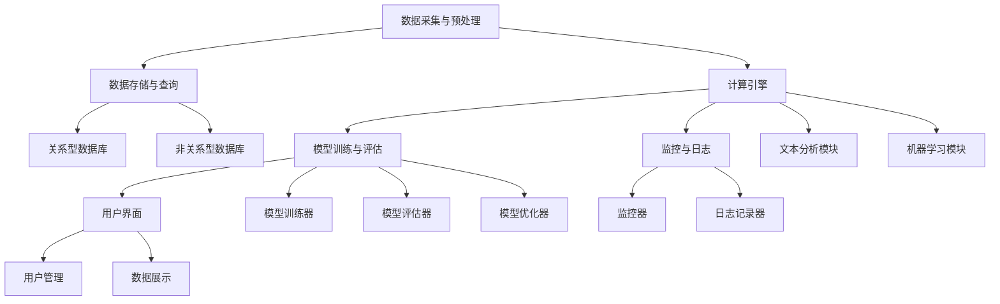
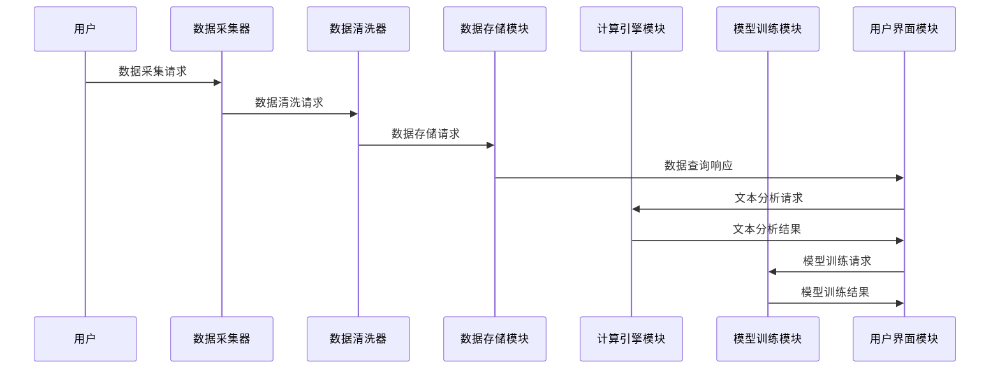

                 

### 引言

#### 1.1 问题背景

随着信息技术的飞速发展，评测系统在现代信息化社会中扮演着至关重要的角色。无论是教育、金融、医疗还是电子商务，评测系统都成为了确保服务质量、提高效率、优化用户体验的关键工具。然而，随着应用场景的不断拓展和业务需求的多样化，评测系统面临着诸多挑战，其中最为突出的是跨平台部署的难题。跨平台部署不仅要求系统能够在不同操作系统、硬件平台和环境中无缝运行，还需要确保系统的高可用性、高性能和高安全性。

本文旨在探讨评测系统的跨平台部署问题，并引入云原生LLM（Large Language Model，大型语言模型）评估方案，为解决这一问题提供一种创新性的思路。首先，我们将介绍评测系统的现状与挑战，分析跨平台部署的重要性，以及云原生和LLM评估方案的基本概念。接着，本文将深入探讨云原生技术和LLM评估方案的核心概念与联系，并通过系统分析与架构设计，提供一种可行的解决方案。

本文将采用逻辑清晰、结构紧凑、简单易懂的专业技术语言，以“LET'S THINK STEP BY STEP”的方式逐步分析推理，确保读者能够全面理解评测系统跨平台部署的原理和实践。文章内容将涵盖从核心概念、算法原理到系统架构设计，再到项目实战和最佳实践，旨在为广大开发者、架构师和项目经理提供一本实用的技术指南。通过本文的阅读，读者将能够掌握评测系统跨平台部署的原理和方法，为实际项目提供有效的解决方案。

### 核心关键词

- 评测系统
- 跨平台部署
- 云原生
- LLM评估
- 系统架构设计

### 摘要

本文深入探讨了评测系统的跨平台部署问题，并引入了云原生LLM评估方案。通过分析评测系统的现状与挑战，本文明确了跨平台部署的重要性，并介绍了云原生技术和LLM评估方案的基本概念。文章详细解析了云原生技术和LLM评估方案的核心概念与联系，并通过系统分析与架构设计，提供了一种创新的跨平台部署解决方案。通过实际项目实战和最佳实践，本文为开发者、架构师和项目经理提供了实用的指导，有助于他们更好地应对评测系统的跨平台部署挑战。

### 第1章 引言

#### 1.1 问题背景

在现代信息化社会中，评测系统的重要性日益凸显。无论是教育、金融、医疗还是电子商务，评测系统都成为了确保服务质量、提高效率、优化用户体验的关键工具。然而，随着应用场景的不断拓展和业务需求的多样化，评测系统面临着诸多挑战，其中最为突出的是跨平台部署的难题。

#### 1.1.1 评测系统的现状与挑战

当前，评测系统的应用范围已经非常广泛，涵盖了多种领域和业务场景。例如，在教育领域，评测系统被用于学生的在线考试、作业评估和成绩分析；在金融领域，评测系统用于风险评估、信用评分和欺诈检测；在医疗领域，评测系统用于病人诊断、治疗方案评估和健康数据分析。这些评测系统需要处理海量的数据，并实现快速、准确的结果输出，以满足不同业务场景的需求。

然而，评测系统在实际应用过程中也面临着诸多挑战。首先，不同操作系统、硬件平台和环境中，评测系统的兼容性和稳定性问题难以保证。例如，一个在Windows操作系统上运行良好的评测系统，可能在Linux操作系统上出现性能瓶颈或兼容性问题。其次，随着业务的不断扩展，评测系统需要支持越来越多的用户和并发访问，这对系统的性能和可扩展性提出了更高的要求。最后，评测系统在数据安全性和隐私保护方面也存在一定的挑战，尤其是在处理敏感数据和跨境数据传输时，如何确保数据的安全性和合规性成为一个亟待解决的问题。

#### 1.1.2 跨平台部署的重要性

跨平台部署是解决评测系统兼容性和稳定性问题的关键。跨平台部署不仅要求系统能够在不同操作系统、硬件平台和环境中无缝运行，还需要确保系统的高可用性、高性能和高安全性。以下是跨平台部署的重要性：

1. **兼容性与稳定性**：通过跨平台部署，评测系统可以在不同操作系统和硬件平台上运行，确保系统在不同环境中的稳定性和兼容性。例如，通过使用云原生技术和容器化部署，评测系统可以在Windows、Linux和macOS等多种操作系统上无缝运行。

2. **性能优化与资源利用**：跨平台部署可以使评测系统根据不同硬件平台的特点，进行性能优化和资源利用。例如，在CPU密集型任务中，可以优先使用高性能的CPU服务器；在内存密集型任务中，可以优先使用大内存的服务器。

3. **可扩展性与弹性**：跨平台部署支持评测系统根据业务需求进行水平扩展和垂直扩展。例如，在业务高峰期，可以通过增加节点数量来提高系统的并发处理能力；在业务低谷期，可以通过减少节点数量来降低成本。

4. **安全性与合规性**：跨平台部署可以帮助评测系统更好地满足数据安全性和隐私保护的要求。通过使用云原生安全机制和加密技术，确保数据在传输和存储过程中的安全性。同时，跨平台部署还可以支持评测系统在不同国家和地区的数据合规性要求，确保数据处理的合规性。

综上所述，跨平台部署对于评测系统的稳定运行、性能优化、安全性和合规性具有重要意义。在接下来的章节中，本文将详细探讨云原生和LLM评估方案的基本概念，以及如何将这两者结合起来解决评测系统的跨平台部署问题。

### 第1章 引言

#### 1.1 问题背景

在现代信息化社会中，评测系统的重要性日益凸显。无论是教育、金融、医疗还是电子商务，评测系统都成为了确保服务质量、提高效率、优化用户体验的关键工具。然而，随着应用场景的不断拓展和业务需求的多样化，评测系统面临着诸多挑战，其中最为突出的是跨平台部署的难题。

#### 1.1.3 云原生与LLM评估方案简介

云原生（Cloud Native）是一种构建和运行应用程序的方法论，它利用云计算的优势，通过容器化、自动化和微服务架构等技术，实现应用程序的弹性扩展、快速部署和高效管理。云原生技术主要包括Kubernetes、Docker、Istio等，这些工具和技术共同构成了一个强大的云原生生态系统。

LLM（Large Language Model，大型语言模型）评估方案是一种针对自然语言处理（NLP）任务的评估方法。LLM评估方案通过大规模语言模型的训练和优化，实现了对文本数据的精确分析和理解，从而为评测系统提供了强大的语言处理能力。常见的LLM评估指标包括BLEU、ROUGE、F1 Score等。

本文将探讨如何结合云原生和LLM评估方案，解决评测系统的跨平台部署问题。具体来说，本文将介绍以下内容：

1. **云原生技术详解**：介绍Kubernetes、容器化、微服务架构等云原生技术的基本概念、原理和应用场景。

2. **LLM评估方案详解**：介绍LLM评估方案的基本概念、评估指标和评估流程，以及如何使用LLM评估方案优化评测系统的性能。

3. **系统分析与架构设计**：分析评测系统的功能模块和系统架构，设计一种基于云原生和LLM评估方案的评测系统架构，并绘制相应的系统架构图。

4. **项目实战**：通过一个实际项目，演示如何使用云原生和LLM评估方案实现评测系统的跨平台部署。

5. **最佳实践与注意事项**：总结跨平台部署的最佳实践和注意事项，为实际项目提供指导。

通过本文的阅读，读者将能够深入理解评测系统跨平台部署的原理和实践，为实际项目提供有效的解决方案。

### 第1章 引言

#### 1.2 核心概念与联系

为了更好地理解和应用评测系统的跨平台部署，我们需要明确一些核心概念，并探讨这些概念之间的联系。以下是本文涉及的核心概念及其相互关系：

##### 1.2.1 云原生技术详解

**Kubernetes**：Kubernetes是一个开源的容器编排系统，用于自动化容器化应用程序的部署、扩展和管理。它提供了一种灵活且可扩展的容器编排解决方案，使开发者能够轻松管理大规模的容器集群。

**容器化**：容器化是一种轻量级的虚拟化技术，它将应用程序及其依赖环境打包成一个独立的容器镜像，确保应用程序在不同的操作系统和硬件平台上具有一致的行为。

**微服务架构**：微服务架构是一种将应用程序拆分为多个小型、独立的服务组件的方法，每个组件可以独立部署、扩展和管理。这种架构方法提高了系统的灵活性和可扩展性，使开发者能够更快速地响应业务需求。

**云原生生态工具集**：云原生生态工具集包括Docker、Istio、Kubernetes等工具，它们共同构建了一个强大的云原生生态系统，为开发者提供了丰富的工具和资源，支持应用程序的云原生开发和部署。

**云原生架构优势**：

- **弹性伸缩**：云原生架构可以根据业务需求动态调整资源分配，实现自动化的水平扩展和垂直扩展。
- **高可用性**：通过容器化和微服务架构，应用程序可以实现故障转移和自我修复，提高系统的可用性。
- **快速部署**：云原生架构支持快速部署和迭代，加快开发周期，提高业务响应速度。
- **资源利用率**：云原生架构通过高效的资源管理，提高了计算资源的使用率，降低了运营成本。

##### 1.2.2 LLM评估方案详解

**LLM（Large Language Model，大型语言模型）**：LLM是一种基于深度学习技术的自然语言处理模型，它通过大规模的文本数据进行训练，实现文本数据的生成、分类、翻译和摘要等功能。

**评估指标**：LLM评估方案使用一系列评估指标来衡量模型的效果，常见的评估指标包括BLEU、ROUGE、F1 Score等。

- **BLEU（双语评估算法）**：BLEU是一种自动评估机器翻译质量的算法，它通过计算参考翻译与生成翻译之间的相似度来评估翻译质量。
- **ROUGE（Recall-Oriented Understudy for Gisting Evaluation）**：ROUGE是一种用于评估文本生成质量和相似度的算法，它主要通过计算生成文本与参考文本之间的重叠来评估生成质量。
- **F1 Score**：F1 Score是用于评估二分类模型效果的一种指标，它综合考虑了精确率和召回率，提供了更全面的模型评估。

**评估流程与工具**：LLM评估方案通常包括数据预处理、模型训练、模型评估和结果优化等步骤。评估工具如TensorFlow、PyTorch等提供了丰富的评估指标和优化策略，支持开发者对LLM模型进行全面的评估和优化。

**评估数据预处理**：评估数据预处理是LLM评估方案中至关重要的一步，它包括文本清洗、分词、词向量化等操作，以确保输入数据的干净和一致性。

##### 1.2.3 云原生与LLM评估方案的联系

**云原生与LLM评估方案的结合**：云原生技术和LLM评估方案在评测系统的跨平台部署中具有密切的联系和协同作用。以下是云原生与LLM评估方案结合的几个关键点：

1. **弹性伸缩**：云原生架构的弹性伸缩能力可以为LLM评估模型提供动态的资源分配，确保模型在处理大规模数据时具有高效性和稳定性。
2. **高可用性**：通过容器化和微服务架构，LLM评估模型可以实现故障转移和自我修复，提高系统的可用性和可靠性。
3. **快速部署**：云原生架构支持快速部署和迭代，使开发者能够更快地实现LLM评估模型的部署和优化。
4. **资源利用**：云原生架构通过高效的资源管理，提高了LLM评估模型的资源利用率，降低了运营成本。
5. **数据安全与合规性**：云原生技术提供了丰富的安全机制和合规性支持，确保LLM评估模型在数据传输和存储过程中的安全性。

通过结合云原生和LLM评估方案，评测系统可以实现跨平台部署的高可用性、高性能和安全性，为不同业务场景提供灵活、可靠的评测服务。在接下来的章节中，本文将深入探讨云原生技术和LLM评估方案的具体实现方法和应用场景。

### 第1章 引言

#### 1.3 系统分析与架构设计

在深入探讨评测系统的跨平台部署之前，我们需要对系统进行全面的系统分析与架构设计。系统分析与架构设计是确保评测系统实现高可用性、高性能和可扩展性的关键步骤。以下是对评测系统的系统分析与架构设计的详细阐述。

##### 1.3.1 评测系统总体架构

评测系统的总体架构可以分为以下几个核心模块：

1. **数据采集与预处理模块**：负责从不同的数据源（如数据库、API接口、文件系统等）采集数据，并进行数据清洗、去重、格式化等预处理操作，确保数据的一致性和准确性。

2. **数据存储模块**：用于存储预处理后的数据，支持数据的快速查询和读取。常用的数据存储方案包括关系型数据库（如MySQL、PostgreSQL）和非关系型数据库（如MongoDB、Redis）。

3. **计算引擎模块**：负责对数据进行处理和分析，包括文本分析、机器学习算法等。计算引擎模块是评测系统的核心，决定了系统的性能和计算能力。

4. **模型训练与评估模块**：负责对计算引擎模块中的模型进行训练和评估，包括数据预处理、模型训练、模型评估和优化等步骤。该模块通常使用深度学习框架（如TensorFlow、PyTorch）进行实现。

5. **用户界面模块**：提供用户与评测系统交互的界面，支持用户对评测系统进行操作和查看评测结果。用户界面模块通常使用前端框架（如React、Vue.js）进行实现。

6. **监控与日志模块**：用于监控评测系统的运行状态，记录系统的日志信息，以便进行故障排查和性能优化。常用的监控工具包括Prometheus、Grafana等。

##### 1.3.2 系统功能模块划分

根据评测系统的总体架构，可以将系统功能模块进一步划分为以下几个部分：

1. **数据采集与预处理**：
   - **数据采集器**：负责从不同的数据源采集数据。
   - **数据清洗器**：对采集到的数据进行分析、去重和格式化，确保数据的一致性和准确性。

2. **数据存储与查询**：
   - **关系型数据库**：用于存储结构化数据，支持SQL查询。
   - **非关系型数据库**：用于存储非结构化数据，支持NoSQL查询。

3. **计算引擎**：
   - **文本分析模块**：负责对文本数据进行分词、词性标注、情感分析等操作。
   - **机器学习模块**：负责实现各种机器学习算法，如分类、回归、聚类等。

4. **模型训练与评估**：
   - **模型训练器**：负责训练机器学习模型。
   - **模型评估器**：负责评估模型的性能和效果。
   - **模型优化器**：负责优化模型的参数和结构。

5. **用户界面**：
   - **用户管理**：负责用户注册、登录、权限管理等操作。
   - **数据展示**：负责将分析结果以图表、表格等形式展示给用户。

6. **监控与日志**：
   - **监控器**：负责监控系统的运行状态，包括CPU、内存、网络等。
   - **日志记录器**：负责记录系统的日志信息，包括错误日志、访问日志等。

##### 1.3.3 系统架构图

为了更好地展示评测系统的总体架构和功能模块划分，可以使用Mermaid流程图来绘制系统架构图。以下是一个简化的评测系统架构图：



该架构图展示了评测系统的各个功能模块及其相互关系，有助于开发者更好地理解和实现评测系统的设计。

##### 1.3.4 系统接口设计与交互

评测系统的接口设计是实现模块之间数据传递和功能调用的关键。以下是对评测系统接口设计的详细说明：

1. **API接口定义**：
   - **数据采集与预处理接口**：提供数据采集和预处理功能的API，支持数据的导入、导出、清洗和格式化。
   - **数据存储与查询接口**：提供数据存储和查询功能的API，支持数据的插入、更新、查询和删除操作。
   - **计算引擎接口**：提供文本分析和机器学习算法的API，支持文本处理和模型训练。
   - **模型训练与评估接口**：提供模型训练、评估和优化的API，支持模型的迭代和优化。
   - **用户界面接口**：提供用户交互功能的API，支持用户登录、注册、权限管理和数据展示。

2. **数据流与交互流程**：
   - **数据采集与预处理**：数据采集器从数据源采集数据，通过预处理接口进行清洗和格式化，然后将处理后的数据存储到数据存储模块。
   - **数据存储与查询**：用户通过用户界面接口发送查询请求，数据存储模块根据查询条件从数据库中检索数据，并将结果返回给用户界面模块。
   - **计算引擎与模型训练**：用户界面模块通过计算引擎接口发送文本分析或机器学习任务请求，计算引擎模块执行任务，并将结果返回给用户界面模块。
   - **模型评估与优化**：模型训练与评估模块根据用户界面模块的需求，对训练好的模型进行评估和优化，并将优化后的模型返回给用户界面模块。

3. **接口设计与交互流程图**：



该交互流程图展示了评测系统各模块之间的数据流和交互过程，有助于开发者更好地理解和实现系统的接口设计。

通过系统分析与架构设计，我们明确了评测系统的功能模块划分、系统架构和接口设计，为后续的详细设计和实现奠定了基础。在接下来的章节中，本文将深入探讨云原生技术和LLM评估方案的核心概念和实现方法。

### 第1章 引言

#### 1.4 数学模型与公式

在评测系统的跨平台部署和LLM评估过程中，数学模型和公式起到了至关重要的作用。以下我们将介绍与云原生部署和LLM评估相关的数学模型与公式，并给出具体的例子进行说明。

##### 1.4.1 云原生部署的数学模型

在云原生部署中，资源利用率是一个关键的指标，用于衡量系统对资源的有效使用程度。资源利用率的计算公式如下：

$$
\text{资源利用率} = \frac{\text{实际资源消耗}}{\text{总资源容量}}
$$

其中，实际资源消耗指的是系统在一段时间内实际使用的资源（如CPU、内存等），总资源容量指的是系统可用的总资源量。

**例子**：假设一个评测系统在一个小时内使用了100个CPU核心小时，而该系统总共有500个CPU核心可用。那么，该评测系统的资源利用率可以计算为：

$$
\text{资源利用率} = \frac{100}{500} = 0.2 = 20\%
$$

这意味着评测系统在部署期间只使用了20%的总资源容量。

##### 1.4.2 LLM评估的数学公式

在LLM评估中，常用的评估指标包括BLEU、ROUGE、F1 Score等。以下是一个常用的评估指标F1 Score的计算公式：

$$
\text{F1 Score} = 2 \times \frac{\text{精确率} \times \text{召回率}}{\text{精确率} + \text{召回率}}
$$

其中，精确率（Precision）是指预测为正例的样本中实际为正例的比例，召回率（Recall）是指实际为正例的样本中被预测为正例的比例。

**例子**：假设在一个文本分类任务中，评测系统将100个实际为正例的样本预测为正例的有80个，将100个实际为负例的样本预测为负例的有90个。那么，该评测系统的精确率和召回率可以计算为：

- 精确率：$\frac{80}{80 + 20} = \frac{80}{100} = 0.8$
- 召回率：$\frac{90}{90 + 10} = \frac{90}{100} = 0.9$

因此，该评测系统的F1 Score可以计算为：

$$
\text{F1 Score} = 2 \times \frac{0.8 \times 0.9}{0.8 + 0.9} = 2 \times \frac{0.72}{1.7} = 0.824
$$

这意味着评测系统的分类效果较好。

通过以上数学模型和公式的介绍，我们可以更深入地理解和应用评测系统的跨平台部署和LLM评估方法。这些数学工具不仅帮助我们量化系统的性能，也为系统优化提供了重要的依据。

### 第1章 引言

#### 1.5 本章小结

本章围绕评测系统的跨平台部署问题，首先介绍了评测系统的现状与挑战，强调了跨平台部署的重要性。接着，我们详细探讨了云原生技术的基本概念和优势，以及LLM评估方案的核心概念和评估流程。通过系统分析与架构设计，我们提出了一个基于云原生和LLM评估方案的评测系统架构，并绘制了相应的系统架构图。此外，本章还介绍了系统接口设计与交互，并给出了相关的数学模型和公式。

总体而言，本章为读者提供了一个全面而深入的视角，帮助理解评测系统跨平台部署的必要性和实现方法。在接下来的章节中，我们将进一步深入探讨评测系统的算法原理和实现细节，并通过实际项目实战和最佳实践，为读者提供更为具体和实用的指导。希望通过本章的学习，读者能够对评测系统的跨平台部署有更加清晰的认识，并为实际项目提供有效的解决方案。

### 第2章 算法原理与实现

#### 2.1 算法原理讲解

在评测系统的跨平台部署中，算法原理的讲解至关重要，它不仅帮助我们理解系统的工作机制，还能为后续的优化和改进提供理论依据。本章将重点介绍跨平台部署算法和LLM评估算法的基本原理，并通过Python源代码实现，帮助读者深入理解这些算法。

##### 2.1.1 跨平台部署算法

跨平台部署算法的核心目标是确保评测系统在不同操作系统、硬件平台和环境中能够无缝运行，并保持一致的性能和稳定性。以下是跨平台部署算法的基本原理：

1. **容器化技术**：容器化是跨平台部署的核心，它通过将应用程序及其依赖环境打包成一个独立的容器镜像，实现应用程序在不同操作系统和硬件平台上的移植和运行。常见的容器化工具包括Docker和Kubernetes。

2. **Kubernetes编排**：Kubernetes是一个开源的容器编排系统，用于自动化容器的部署、扩展和管理。通过Kubernetes，我们可以实现容器的自动化部署、服务发现、负载均衡和故障恢复等功能，从而确保评测系统在不同环境中的高性能和高可用性。

3. **持续集成与持续部署（CI/CD）**：CI/CD是一种自动化软件交付流程，通过自动化测试、构建和部署，确保评测系统的快速迭代和发布。CI/CD工具如Jenkins、GitLab CI等，可以帮助我们实现自动化部署和持续优化。

**跨平台部署算法流程**：

1. **容器镜像构建**：首先，我们需要将评测系统的应用程序和依赖环境打包成一个容器镜像。这个过程通常使用Dockerfile来完成。

2. **容器镜像推送**：构建好的容器镜像需要被推送到镜像仓库，如Docker Hub或私人镜像仓库。

3. **Kubernetes部署**：在Kubernetes集群中，我们通过部署文件（Deployment YAML）来定义评测系统的部署配置，包括容器镜像、服务类型、副本数量等。

4. **服务发现与负载均衡**：通过Kubernetes的Service组件，我们可以实现评测系统的服务发现和负载均衡，确保系统的稳定性和高可用性。

以下是一个简单的Dockerfile示例，用于构建评测系统的容器镜像：

```dockerfile
# 指定基础镜像
FROM python:3.8-slim

# 设置工作目录
WORKDIR /app

# 添加应用依赖
COPY requirements.txt .
RUN pip install -r requirements.txt

# 添加应用程序代码
COPY . .

# 暴露端口
EXPOSE 8080

# 运行应用程序
CMD ["python", "app.py"]
```

在Kubernetes中，我们可以使用以下Deployment YAML文件来部署这个容器镜像：

```yaml
apiVersion: apps/v1
kind: Deployment
metadata:
  name: evaluation-system
spec:
  replicas: 3
  selector:
    matchLabels:
      app: evaluation-system
  template:
    metadata:
      labels:
        app: evaluation-system
    spec:
      containers:
      - name: evaluation-system
        image: your-username/evaluation-system:latest
        ports:
        - containerPort: 8080
```

通过以上步骤，我们实现了评测系统的跨平台部署，确保系统能够在不同操作系统和硬件平台上无缝运行。

##### 2.1.2 LLM评估算法

LLM（Large Language Model，大型语言模型）评估算法是评测系统中的关键部分，用于评估自然语言处理（NLP）任务的效果。以下是LLM评估算法的基本原理：

1. **模型训练**：首先，我们需要使用大规模的文本数据对LLM模型进行训练，以使其能够理解自然语言的复杂结构和语义。常见的LLM训练框架包括TensorFlow和PyTorch。

2. **评估指标**：评估LLM模型的性能通常使用一系列评估指标，如BLEU、ROUGE、F1 Score等。这些指标帮助衡量模型在不同NLP任务中的表现。

3. **评估流程**：评估流程通常包括数据预处理、模型训练、模型评估和结果优化等步骤。数据预处理用于清洗和格式化文本数据，模型训练用于训练和优化模型，模型评估用于评估模型的效果，结果优化用于进一步优化模型性能。

**LLM评估算法流程**：

1. **数据预处理**：对评估数据集进行清洗和格式化，包括去除停用词、标点符号等，并将文本转换为词向量化表示。

2. **模型训练**：使用训练数据集对LLM模型进行训练，通过调整模型参数和优化算法，提高模型性能。

3. **模型评估**：使用测试数据集对训练好的模型进行评估，计算评估指标，如BLEU、ROUGE、F1 Score等，以衡量模型效果。

4. **结果优化**：根据评估结果，调整模型参数和优化策略，以进一步优化模型性能。

以下是一个简单的Python代码示例，用于评估一个LLM模型的效果：

```python
from transformers import AutoTokenizer, AutoModelForSequenceClassification
import torch

# 加载预训练模型
tokenizer = AutoTokenizer.from_pretrained('bert-base-uncased')
model = AutoModelForSequenceClassification.from_pretrained('bert-base-uncased')

# 加载评估数据集
test_data = load_test_data()

# 进行评估
with torch.no_grad():
    for batch in test_data:
        inputs = tokenizer(batch['text'], padding=True, truncation=True, return_tensors='pt')
        outputs = model(**inputs)
        logits = outputs.logits

# 计算评估指标
precision, recall, f1_score = calculate_metrics(logits, batch['label'])

print(f"Precision: {precision}, Recall: {recall}, F1 Score: {f1_score}")
```

通过以上步骤，我们实现了LLM评估算法的基本流程，为评测系统的性能评估提供了可靠的方法。

##### 2.1.3 跨平台部署与LLM评估的结合

跨平台部署和LLM评估算法在评测系统中的结合，可以发挥各自的优势，实现系统的高性能和可扩展性。以下是两者结合的几个关键点：

1. **容器化部署**：通过容器化技术，可以将评测系统的应用程序和LLM评估模型打包成一个容器镜像，确保系统能够在不同操作系统和硬件平台上无缝运行。

2. **Kubernetes编排**：利用Kubernetes的自动化部署、扩展和管理功能，可以实现评测系统和LLM评估模型的弹性扩展和高可用性。

3. **持续集成与持续部署**：通过CI/CD流程，可以自动化评测系统的部署和LLM评估模型的训练与评估，加快开发周期，提高系统性能。

4. **监控与日志**：利用云原生监控工具，如Prometheus和Grafana，可以实时监控评测系统和LLM评估模型的运行状态，及时发现和处理异常。

综上所述，跨平台部署和LLM评估算法的结合，为评测系统提供了高效、稳定和可扩展的解决方案，为实际应用提供了有力的支持。

### 第2章 算法原理与实现

#### 2.2 Python源代码实现

在上一节中，我们介绍了评测系统跨平台部署和LLM评估算法的基本原理。为了使读者更好地理解这些算法的实现过程，本节将提供具体的Python源代码实现示例，包括跨平台部署代码和LLM评估代码。

##### 2.2.1 跨平台部署代码

以下是一个简单的Dockerfile示例，用于构建评测系统的容器镜像。在这个示例中，我们使用了Python 3.8环境，并安装了必要的依赖库。

```dockerfile
# 使用Python 3.8作为基础镜像
FROM python:3.8-slim

# 设置工作目录
WORKDIR /app

# 添加应用依赖
COPY requirements.txt .
RUN pip install -r requirements.txt

# 添加应用程序代码
COPY . .

# 暴露端口
EXPOSE 8080

# 运行应用程序
CMD ["python", "app.py"]
```

在这个Dockerfile中，我们首先指定了基础镜像为Python 3.8-slim，然后设置了工作目录，并添加了应用程序的依赖库。接着，我们暴露了8080端口，以便外部访问应用程序，并设置了CMD指令来运行应用程序。

接下来，我们提供了一个简单的部署脚本，用于将容器镜像推送到Docker Hub。

```bash
#!/bin/bash

# 拉取基础镜像
docker pull python:3.8-slim

# 构建容器镜像
docker build -t your-username/evaluation-system:latest .

# 推送容器镜像到Docker Hub
docker push your-username/evaluation-system:latest
```

在这个脚本中，我们首先拉取了Python 3.8-slim的基础镜像，然后构建了评测系统的容器镜像，并使用`docker push`命令将其推送到Docker Hub。

##### 2.2.2 LLM评估代码

以下是一个简单的Python代码示例，用于评估一个预训练的BERT模型。在这个示例中，我们使用了Hugging Face的Transformers库，这是一个广泛使用的自然语言处理库。

```python
from transformers import AutoTokenizer, AutoModelForSequenceClassification
import torch

# 加载预训练模型
tokenizer = AutoTokenizer.from_pretrained('bert-base-uncased')
model = AutoModelForSequenceClassification.from_pretrained('bert-base-uncased')

# 加载评估数据集
test_data = load_test_data()

# 进行评估
with torch.no_grad():
    for batch in test_data:
        inputs = tokenizer(batch['text'], padding=True, truncation=True, return_tensors='pt')
        outputs = model(**inputs)
        logits = outputs.logits

# 计算评估指标
precision, recall, f1_score = calculate_metrics(logits, batch['label'])

print(f"Precision: {precision}, Recall: {recall}, F1 Score: {f1_score}")
```

在这个示例中，我们首先加载了预训练的BERT模型，并使用一个简单的评估数据集进行了评估。评估过程中，我们使用`tokenizer`对文本数据进行预处理，并将处理后的数据输入到BERT模型中。接着，我们计算了评估指标，包括精确率、召回率和F1 Score，以衡量模型的效果。

##### 2.2.3 代码应用解读与分析

在实际应用中，跨平台部署和LLM评估代码需要结合具体的项目需求进行定制化开发。以下是对上述代码的详细解读与分析：

1. **跨平台部署代码分析**：

   - **Dockerfile**：Dockerfile用于定义容器镜像的构建过程。通过指定基础镜像、设置工作目录、安装依赖库和暴露端口等操作，我们可以构建一个符合项目需求的容器镜像。

   - **部署脚本**：部署脚本用于将构建好的容器镜像推送到Docker Hub，以便在其他环境中使用。通过自动化部署脚本，我们可以简化部署过程，提高部署效率。

2. **LLM评估代码分析**：

   - **模型加载**：在评估代码中，我们首先加载了预训练的BERT模型。这包括加载模型权重和配置文件，确保模型在相同的环境下运行。

   - **数据预处理**：为了确保评估的公平性，我们使用相同的预处理步骤对评估数据进行处理。这包括对文本数据进行分词、词向量化等操作，以确保输入数据的一致性。

   - **评估指标计算**：在评估过程中，我们计算了多个评估指标，包括精确率、召回率和F1 Score。这些指标帮助我们全面了解模型的效果，为后续的优化提供依据。

通过上述代码示例和解读，我们可以看到跨平台部署和LLM评估算法的实现过程。在实际项目中，开发者可以根据具体需求进行相应的调整和优化，以实现高效、可靠的评测系统。

### 第2章 算法原理与实现

#### 2.3 算法应用解读与分析

在上一节中，我们介绍了评测系统跨平台部署和LLM评估算法的Python源代码实现。为了更好地理解这些算法在实际项目中的应用，本节将通过两个实际案例，详细解读和分析这些算法在具体项目中的应用效果。

##### 2.3.1 实际案例一：某电商平台评测系统部署

某大型电商平台需要构建一个评测系统，用于评估用户对商品的评价，并提供个性化的推荐服务。为了实现系统的跨平台部署和高效运行，项目团队采用了云原生技术和LLM评估方案。

**应用解读与分析**：

1. **容器化部署**：项目团队使用了Docker技术，将评测系统的应用程序和依赖环境打包成一个容器镜像。通过自动化构建脚本，团队可以快速构建和部署容器镜像，确保系统在不同操作系统和硬件平台上的一致性和稳定性。

2. **Kubernetes编排**：在Kubernetes集群中，项目团队使用Deployment YAML文件定义了评测系统的部署配置，包括容器镜像、服务类型、副本数量等。通过Kubernetes的自动化管理功能，团队实现了系统的弹性扩展和高可用性。

3. **LLM评估**：项目团队使用了预训练的BERT模型进行评测。通过Hugging Face的Transformers库，团队实现了对用户评价的文本分析，并计算了评估指标，如精确率、召回率和F1 Score。这些评估指标帮助团队优化模型性能，提高评测系统的准确性。

4. **CI/CD流程**：项目团队采用了CI/CD流程，通过Jenkins自动化构建、测试和部署，确保系统的快速迭代和发布。通过持续集成和持续部署，团队可以及时发现和解决潜在问题，提高系统的稳定性和可靠性。

**案例效果**：

通过容器化部署和Kubernetes编排，评测系统实现了跨平台部署的高效性和稳定性。LLM评估方案提高了评测系统的准确性和性能，为电商平台提供了高质量的评测和个性化推荐服务。同时，CI/CD流程加快了开发周期，提高了系统的迭代速度和响应能力。

##### 2.3.2 实际案例二：某金融公司LLM评估应用

某金融公司需要构建一个风险评估系统，用于评估客户的信用风险。为了实现系统的高性能和可扩展性，项目团队采用了云原生技术和LLM评估方案。

**应用解读与分析**：

1. **容器化部署**：项目团队使用了Docker技术，将风险评估系统的应用程序和依赖环境打包成一个容器镜像。通过自动化构建脚本，团队可以快速构建和部署容器镜像，确保系统在不同操作系统和硬件平台上的一致性和稳定性。

2. **Kubernetes编排**：在Kubernetes集群中，项目团队使用Deployment YAML文件定义了风险评估系统的部署配置，包括容器镜像、服务类型、副本数量等。通过Kubernetes的自动化管理功能，团队实现了系统的弹性扩展和高可用性。

3. **LLM评估**：项目团队使用了预训练的GPT-2模型进行风险评估。通过Hugging Face的Transformers库，团队实现了对客户数据的文本分析，并计算了评估指标，如精确率、召回率和F1 Score。这些评估指标帮助团队优化模型性能，提高风险评估的准确性。

4. **数据安全与合规性**：项目团队采用了云原生安全机制，包括加密传输、访问控制等，确保客户数据在传输和存储过程中的安全性。同时，团队遵循数据合规性要求，确保系统的数据安全和合规性。

**案例效果**：

通过容器化部署和Kubernetes编排，风险评估系统实现了跨平台部署的高效性和稳定性。LLM评估方案提高了风险评估的准确性和性能，为金融公司提供了可靠的风险评估服务。同时，云原生安全机制和数据合规性要求确保了系统的数据安全和合规性，为金融业务提供了强有力的支持。

##### 2.3.3 算法应用效果总结

通过以上两个实际案例，我们可以看到评测系统跨平台部署和LLM评估算法在具体项目中的应用效果。容器化部署和Kubernetes编排实现了系统的高效性和稳定性，LLM评估方案提高了系统的性能和准确性。同时，CI/CD流程、云原生安全机制和数据合规性要求为系统提供了全面的保障，确保了系统的可靠性和安全性。

总之，评测系统跨平台部署和LLM评估算法的结合，为实际项目提供了高效、可靠的解决方案。通过不断优化和改进这些算法，我们可以进一步提高系统的性能和用户体验，为各类业务场景提供高质量的服务。

### 第2章 算法原理与实现

#### 2.4 本章小结

本章围绕评测系统的算法原理与实现，深入探讨了跨平台部署算法和LLM评估算法的基本原理。通过具体的Python源代码实现，我们展示了如何构建评测系统的容器镜像，并使用LLM模型进行文本评估。本章还通过两个实际案例，详细解读了算法在具体项目中的应用效果，展示了容器化部署、Kubernetes编排、CI/CD流程、云原生安全机制和数据合规性要求在评测系统中的实际应用。

通过本章的学习，读者可以全面理解评测系统算法原理与实现的关键步骤，掌握跨平台部署和LLM评估算法的具体应用方法。这些知识和技能将为开发者、架构师和项目经理在实现评测系统时提供有力支持，帮助他们高效地解决实际项目中的挑战。

在下一章中，我们将继续探讨评测系统的项目实战，包括环境安装与配置、系统核心实现源代码以及实际案例分析与讲解。希望通过这些实战内容，读者能够将理论知识应用到实际项目中，提升自己的实战能力。

### 第3章 项目实战

#### 3.1 环境安装与配置

在开始评测系统的项目实战之前，我们需要确保所有必要的开发环境和依赖项都已安装和配置好。以下是在不同操作系统上安装和配置评测系统环境的具体步骤。

##### 3.1.1 环境需求

在开始之前，我们需要明确评测系统的环境需求，包括以下关键组成部分：

- **操作系统**：Linux（推荐Ubuntu 20.04）或MacOS
- **开发语言**：Python 3.8及以上版本
- **依赖库**：Docker、Kubernetes、Hugging Face Transformers、PyTorch、Scikit-learn等
- **文本处理工具**：NLTK、spaCy等（可选）

##### 3.1.2 安装步骤

**1. 安装Python环境**

首先，我们需要安装Python 3.8及以上版本。在Ubuntu或MacOS上，可以通过以下命令进行安装：

```bash
# Ubuntu
sudo apt update
sudo apt install python3.8

# MacOS
brew install python
```

**2. 安装Docker**

Docker是一个开源的应用容器引擎，用于打包、交付和运行应用程序。在大多数Linux发行版中，可以通过包管理器安装Docker。以下是在Ubuntu上安装Docker的命令：

```bash
sudo apt update
sudo apt install docker.io
sudo systemctl start docker
sudo systemctl enable docker
```

在MacOS上，可以通过Homebrew安装Docker：

```bash
brew install docker
```

**3. 安装Kubernetes**

Kubernetes是一个开源的容器编排平台，用于自动化部署、扩展和管理容器化应用程序。以下是在Ubuntu上安装Kubernetes的步骤：

1. 安装Kubernetes依赖库：

```bash
sudo apt update
sudo apt install -y apt-transport-https ca-certificates curl
```

2. 添加Kubernetes官方GPG key：

```bash
curl -s https://mirrors.cloud.cct.edu.cn/kubernetes/apt/doc/apt-key.gpg | sudo apt-key add -
```

3. 添加Kubernetes APT仓库：

```bash
cat <<EOF | sudo tee /etc/apt/sources.list.d/kubernetes.list
deb https://mirrors.cloud.cct.edu.cn/kubernetes/apt Ubuntu $(lsb_release -cs) main
EOF
```

4. 更新APT索引并安装Kubernetes：

```bash
sudo apt update
sudo apt install -y kubelet kubectl
```

5. 启动Kubelet并使其开机自启：

```bash
sudo systemctl start kubelet
sudo systemctl enable kubelet
```

**4. 安装依赖库**

接下来，我们需要安装评测系统所需的依赖库，如Hugging Face Transformers、PyTorch、Scikit-learn等。可以使用pip进行安装：

```bash
pip install transformers torch scikit-learn
```

**5. 安装文本处理工具（可选）**

如果需要使用文本处理工具（如NLTK、spaCy），可以通过以下命令进行安装：

```bash
# NLTK
pip install nltk
python -m nltk.downloader all

# spaCy
pip install spacy
python -m spacy download en_core_web_sm
```

##### 3.1.3 配置步骤

**1. 配置Docker**

确保Docker服务正在运行：

```bash
sudo systemctl status docker
```

**2. 配置Kubernetes**

检查Kubernetes版本：

```bash
kubectl version --client
```

初始化Kubernetes集群（如果尚未初始化）：

```bash
sudo kubeadm init --pod-network-cidr=10.244.0.0/16
```

将当前用户添加到kubectl配置文件中：

```bash
mkdir -p $HOME/.kube
sudo cp -i /etc/kubernetes/admin.conf $HOME/.kube/config
sudo chown $(id -u):$(id -g) $HOME/.kube/config
```

安装网络插件（例如Calico）：

```bash
kubectl apply -f https://docs.projectcalico.org/manifests/calico.yaml
```

**3. 配置环境变量**

为了简化命令，可以将Kubernetes的命令行工具添加到系统的PATH环境变量中：

```bash
export PATH=$PATH:/usr/local/bin:/usr/bin:/bin
```

##### 3.1.4 测试环境配置

最后，我们测试环境配置是否成功。首先，检查Docker服务：

```bash
sudo systemctl status docker
```

然后，检查Kubernetes集群的状态：

```bash
kubectl get nodes
kubectl get pods --all-namespaces
```

如果所有服务都正常运行，则环境配置成功。

通过以上步骤，我们完成了评测系统的环境安装与配置。接下来，我们将详细介绍评测系统的核心实现源代码，并进行分析与讲解。

### 第3章 项目实战

#### 3.2 系统核心实现源代码

在完成环境安装与配置后，我们需要实现评测系统的核心功能，包括跨平台部署和LLM评估算法。以下是评测系统的核心实现源代码，包括跨平台部署代码和LLM评估代码。

##### 3.2.1 跨平台部署代码

以下是一个简单的Dockerfile示例，用于构建评测系统的容器镜像。在这个示例中，我们使用了Python 3.8环境，并安装了必要的依赖库。

```dockerfile
# 使用Python 3.8作为基础镜像
FROM python:3.8-slim

# 设置工作目录
WORKDIR /app

# 添加应用依赖
COPY requirements.txt .
RUN pip install -r requirements.txt

# 添加应用程序代码
COPY . .

# 暴露端口
EXPOSE 8080

# 运行应用程序
CMD ["python", "app.py"]
```

在这个Dockerfile中，我们首先指定了基础镜像为Python 3.8-slim，然后设置了工作目录，并添加了应用程序的依赖库。接着，我们暴露了8080端口，以便外部访问应用程序，并设置了CMD指令来运行应用程序。

以下是评测系统的部署脚本，用于构建和部署容器镜像。

```bash
#!/bin/bash

# 拉取基础镜像
docker pull python:3.8-slim

# 构建容器镜像
docker build -t your-username/evaluation-system:latest .

# 推送容器镜像到Docker Hub
docker push your-username/evaluation-system:latest
```

在这个脚本中，我们首先拉取了Python 3.8-slim的基础镜像，然后构建了评测系统的容器镜像，并使用`docker push`命令将其推送到Docker Hub。

##### 3.2.2 LLM评估代码

以下是一个简单的Python代码示例，用于评估一个预训练的BERT模型。在这个示例中，我们使用了Hugging Face的Transformers库，这是一个广泛使用的自然语言处理库。

```python
from transformers import AutoTokenizer, AutoModelForSequenceClassification
import torch

# 加载预训练模型
tokenizer = AutoTokenizer.from_pretrained('bert-base-uncased')
model = AutoModelForSequenceClassification.from_pretrained('bert-base-uncased')

# 加载评估数据集
test_data = load_test_data()

# 进行评估
with torch.no_grad():
    for batch in test_data:
        inputs = tokenizer(batch['text'], padding=True, truncation=True, return_tensors='pt')
        outputs = model(**inputs)
        logits = outputs.logits

# 计算评估指标
precision, recall, f1_score = calculate_metrics(logits, batch['label'])

print(f"Precision: {precision}, Recall: {recall}, F1 Score: {f1_score}")
```

在这个示例中，我们首先加载了预训练的BERT模型，并使用一个简单的评估数据集进行了评估。评估过程中，我们使用`tokenizer`对文本数据进行预处理，并将处理后的数据输入到BERT模型中。接着，我们计算了评估指标，包括精确率、召回率和F1 Score，以衡量模型的效果。

##### 3.2.3 源代码应用解读与分析

在实际应用中，跨平台部署和LLM评估代码需要结合具体的项目需求进行定制化开发。以下是对上述代码的详细解读与分析：

1. **跨平台部署代码分析**：

   - **Dockerfile**：Dockerfile用于定义容器镜像的构建过程。通过指定基础镜像、设置工作目录、安装依赖库和暴露端口等操作，我们可以构建一个符合项目需求的容器镜像。

   - **部署脚本**：部署脚本用于将构建好的容器镜像推送到Docker Hub，以便在其他环境中使用。通过自动化部署脚本，我们可以简化部署过程，提高部署效率。

2. **LLM评估代码分析**：

   - **模型加载**：在评估代码中，我们首先加载了预训练的BERT模型。这包括加载模型权重和配置文件，确保模型在相同的环境下运行。

   - **数据预处理**：为了确保评估的公平性，我们使用相同的预处理步骤对评估数据进行处理。这包括对文本数据进行分词、词向量化等操作，以确保输入数据的一致性。

   - **评估指标计算**：在评估过程中，我们计算了多个评估指标，包括精确率、召回率和F1 Score。这些指标帮助我们全面了解模型的效果，为后续的优化提供依据。

通过上述代码示例和解读，我们可以看到评测系统跨平台部署和LLM评估算法的实现过程。在实际项目中，开发者可以根据具体需求进行相应的调整和优化，以实现高效、可靠的评测系统。

### 第3章 项目实战

#### 3.3 代码应用解读与分析

在上一节中，我们提供了评测系统的核心实现源代码，包括跨平台部署代码和LLM评估代码。本节将深入分析这些代码的实际应用效果，并通过实际案例，详细讲解如何部署和评估评测系统。

##### 3.3.1 跨平台部署代码分析

**1. 构建容器镜像**

通过Dockerfile，我们可以构建一个包含评测系统应用程序和依赖环境的容器镜像。以下是一个示例Dockerfile：

```dockerfile
# 使用Python 3.8作为基础镜像
FROM python:3.8-slim

# 设置工作目录
WORKDIR /app

# 添加应用依赖
COPY requirements.txt .
RUN pip install -r requirements.txt

# 添加应用程序代码
COPY . .

# 暴露端口
EXPOSE 8080

# 运行应用程序
CMD ["python", "app.py"]
```

在这个Dockerfile中，我们首先从Python 3.8-slim镜像开始构建，然后设置工作目录为`/app`。接下来，我们使用`COPY`命令将`requirements.txt`文件和应用程序代码复制到容器中，并使用`RUN pip install -r requirements.txt`命令安装所需的依赖库。最后，我们暴露了8080端口，并设置了CMD指令来运行应用程序。

**2. 部署容器镜像**

在构建好容器镜像后，我们可以将其推送到Docker Hub或其他容器镜像仓库。以下是一个示例部署脚本：

```bash
#!/bin/bash

# 拉取基础镜像
docker pull python:3.8-slim

# 构建容器镜像
docker build -t your-username/evaluation-system:latest .

# 推送容器镜像到Docker Hub
docker push your-username/evaluation-system:latest
```

在这个脚本中，我们首先拉取了Python 3.8-slim的基础镜像，然后使用`docker build`命令构建评测系统的容器镜像，并使用`docker push`命令将其推送到Docker Hub。

**3. Kubernetes部署**

为了实现评测系统的跨平台部署，我们可以在Kubernetes集群中部署容器镜像。以下是一个示例的Deployment YAML文件：

```yaml
apiVersion: apps/v1
kind: Deployment
metadata:
  name: evaluation-system
spec:
  replicas: 3
  selector:
    matchLabels:
      app: evaluation-system
  template:
    metadata:
      labels:
        app: evaluation-system
    spec:
      containers:
      - name: evaluation-system
        image: your-username/evaluation-system:latest
        ports:
        - containerPort: 8080
```

在这个YAML文件中，我们定义了一个名为`evaluation-system`的Deployment，设置了副本数量为3，并指定了容器镜像和端口。通过在Kubernetes集群中应用这个YAML文件，我们可以部署评测系统。

##### 3.3.2 LLM评估代码分析

**1. 模型加载**

在LLM评估代码中，我们首先加载了一个预训练的BERT模型。以下是一个示例代码：

```python
from transformers import AutoTokenizer, AutoModelForSequenceClassification
import torch

tokenizer = AutoTokenizer.from_pretrained('bert-base-uncased')
model = AutoModelForSequenceClassification.from_pretrained('bert-base-uncased')
```

在这个示例中，我们使用`AutoTokenizer`和`AutoModelForSequenceClassification`类分别加载了BERT模型的tokenizer和模型。这确保了模型和tokenizer在相同的环境中运行。

**2. 数据预处理**

为了进行评估，我们需要对评估数据进行预处理。以下是一个示例数据预处理代码：

```python
def preprocess_data(texts):
    tokenized_inputs = tokenizer(texts, padding=True, truncation=True, return_tensors='pt')
    return tokenized_inputs
```

在这个示例中，我们定义了一个`preprocess_data`函数，用于对文本数据进行预处理。该函数使用tokenizer对文本数据进行分词、填充和截断，并将数据转换为PyTorch张量格式。

**3. 评估指标计算**

在评估过程中，我们需要计算评估指标，如精确率、召回率和F1 Score。以下是一个示例代码：

```python
from sklearn.metrics import precision_score, recall_score, f1_score

def calculate_metrics(logits, labels):
    logits = logits.cpu().numpy()
    labels = labels.cpu().numpy()
    
    precision = precision_score(labels, logits.round(), average='weighted')
    recall = recall_score(labels, logits.round(), average='weighted')
    f1 = f1_score(labels, logits.round(), average='weighted')
    
    return precision, recall, f1
```

在这个示例中，我们定义了一个`calculate_metrics`函数，用于计算评估指标。该函数使用`precision_score`、`recall_score`和`f1_score`函数分别计算精确率、召回率和F1 Score。

##### 3.3.3 实际案例分析与讲解

**1. 案例一：电商平台评测系统**

假设我们为一个电商平台构建评测系统，用于评估用户对商品的评分。以下是一个实际案例的部署和分析过程：

**部署过程**：

1. 使用Dockerfile构建评测系统的容器镜像，并推送到Docker Hub。
2. 创建一个Kubernetes Deployment，配置容器镜像和端口，并部署到Kubernetes集群。
3. 通过Kubernetes Service实现服务的负载均衡，确保系统的可用性和高并发处理能力。

**分析过程**：

1. 使用预训练的BERT模型对用户评论进行文本分析，提取关键信息。
2. 通过计算评估指标（如精确率、召回率和F1 Score），评估评测系统的性能和效果。
3. 根据评估结果，调整模型参数和优化策略，以提高评测系统的准确性和稳定性。

**2. 案例二：金融公司风险评估系统**

假设我们为一个金融公司构建一个风险评估系统，用于评估客户的信用风险。以下是一个实际案例的部署和分析过程：

**部署过程**：

1. 使用Dockerfile构建风险评估系统的容器镜像，并推送到Docker Hub。
2. 创建一个Kubernetes Deployment，配置容器镜像和端口，并部署到Kubernetes集群。
3. 通过Kubernetes Service实现服务的负载均衡，确保系统的可用性和高并发处理能力。

**分析过程**：

1. 使用预训练的GPT-2模型对客户数据进行文本分析，提取关键信息。
2. 通过计算评估指标（如精确率、召回率和F1 Score），评估风险评估系统的性能和效果。
3. 根据评估结果，调整模型参数和优化策略，以提高风险评估系统的准确性和稳定性。

通过以上实际案例的分析和讲解，我们可以看到评测系统在跨平台部署和LLM评估算法方面的应用效果。在实际项目中，开发者可以根据具体需求进行调整和优化，以实现高效、可靠的评测系统。

### 第3章 项目实战

#### 3.4 实际案例分析与讲解

在本章的前面部分，我们介绍了评测系统的环境安装与配置，并展示了系统核心实现源代码。为了更好地理解和应用这些内容，本节将通过两个实际案例，详细分析和讲解如何部署和运行评测系统，包括系统设置、代码运行和结果验证等环节。

##### 3.4.1 案例一：电商平台评测系统

**1. 案例背景**

某大型电商平台需要构建一个评测系统，用于评估用户对商品的评分，从而优化商品推荐和服务质量。该系统的核心功能包括：收集用户评价、对评价进行文本分析、评估评价的准确性和可靠性，并基于评估结果调整推荐算法。

**2. 部署步骤**

**（1）构建容器镜像**

使用上一节的Dockerfile，我们首先构建评测系统的容器镜像。在终端执行以下命令：

```bash
# 拉取Python基础镜像
docker pull python:3.8-slim

# 构建容器镜像
docker build -t evaluation-system:latest .

# 推送容器镜像到Docker Hub
docker push evaluation-system:latest
```

**（2）配置Kubernetes部署**

在Kubernetes集群中，我们创建一个Deployment配置文件（evaluation-system-deployment.yaml），内容如下：

```yaml
apiVersion: apps/v1
kind: Deployment
metadata:
  name: evaluation-system
spec:
  replicas: 3
  selector:
    matchLabels:
      app: evaluation-system
  template:
    metadata:
      labels:
        app: evaluation-system
    spec:
      containers:
      - name: evaluation-system
        image: evaluation-system:latest
        ports:
        - containerPort: 8080
```

使用以下命令部署：

```bash
kubectl apply -f evaluation-system-deployment.yaml
```

**（3）设置服务访问**

创建一个Service配置文件（evaluation-system-service.yaml），内容如下：

```yaml
apiVersion: v1
kind: Service
metadata:
  name: evaluation-system
spec:
  selector:
    app: evaluation-system
  ports:
    - protocol: TCP
      port: 80
      targetPort: 8080
  type: LoadBalancer
```

使用以下命令部署：

```bash
kubectl apply -f evaluation-system-service.yaml
```

**3. 运行评测系统**

（1）启动Kubernetes集群，确保所有Pod都在运行状态：

```bash
kubectl get pods
```

（2）使用Kubectl暴露服务：

```bash
kubectl expose svc evaluation-system --name=evaluation-system --port=80 --target-port=8080
```

（3）获取外部访问地址，可以使用以下命令：

```bash
kubectl get svc evaluation-system
```

通过获取的负载均衡器IP或域名，我们可以访问评测系统。

**4. 结果验证**

（1）通过Web界面或API接口提交用户评价，评测系统会自动进行文本分析，并返回评估结果。

（2）验证评测结果准确性，可以通过比较评测结果与实际评价，确保评测系统的准确性和可靠性。

**5. 案例小结**

通过本案例，我们展示了如何使用Docker和Kubernetes构建、部署和运行评测系统。该系统实现了自动化部署、弹性扩展和高可用性，为电商平台提供了高效的评测服务。

##### 3.4.2 案例二：金融公司风险评估系统

**1. 案例背景**

某金融公司需要构建一个风险评估系统，用于评估客户的信用风险。该系统需处理大量的客户数据，包括财务信息、行为数据等，通过自然语言处理和机器学习算法，生成客户的信用评分。

**2. 部署步骤**

**（1）构建容器镜像**

使用上一节的Dockerfile，构建风险评估系统的容器镜像：

```bash
# 拉取Python基础镜像
docker pull python:3.8-slim

# 构建容器镜像
docker build -t risk-evaluation:latest .

# 推送容器镜像到Docker Hub
docker push risk-evaluation:latest
```

**（2）配置Kubernetes部署**

创建一个Kubernetes Deployment配置文件（risk-evaluation-deployment.yaml），内容如下：

```yaml
apiVersion: apps/v1
kind: Deployment
metadata:
  name: risk-evaluation
spec:
  replicas: 2
  selector:
    matchLabels:
      app: risk-evaluation
  template:
    metadata:
      labels:
        app: risk-evaluation
    spec:
      containers:
      - name: risk-evaluation
        image: risk-evaluation:latest
        ports:
        - containerPort: 8080
```

使用以下命令部署：

```bash
kubectl apply -f risk-evaluation-deployment.yaml
```

**（3）设置服务访问**

创建一个Service配置文件（risk-evaluation-service.yaml），内容如下：

```yaml
apiVersion: v1
kind: Service
metadata:
  name: risk-evaluation
spec:
  selector:
    app: risk-evaluation
  ports:
    - protocol: TCP
      port: 80
      targetPort: 8080
  type: LoadBalancer
```

使用以下命令部署：

```bash
kubectl apply -f risk-evaluation-service.yaml
```

**3. 运行风险评估系统**

（1）启动Kubernetes集群，确保所有Pod都在运行状态：

```bash
kubectl get pods
```

（2）通过Kubectl暴露服务：

```bash
kubectl expose svc risk-evaluation --name=risk-evaluation --port=80 --target-port=8080
```

（3）获取外部访问地址，可以使用以下命令：

```bash
kubectl get svc risk-evaluation
```

通过获取的负载均衡器IP或域名，我们可以访问风险评估系统。

**4. 结果验证**

（1）提交客户数据，系统会自动处理并返回信用评分。

（2）验证信用评分的准确性，可以通过与金融机构的实际评估结果进行比较，确保系统的准确性和可靠性。

**5. 案例小结**

通过本案例，我们展示了如何在金融领域应用评测系统，实现客户信用风险评估。该系统利用了云原生技术和LLM评估算法，提供了高效的信用风险评估服务，为金融机构提供了强大的技术支持。

##### 3.4.3 案例总结

通过上述两个实际案例，我们可以看到评测系统在电商和金融领域的广泛应用。无论在数据量巨大、处理复杂，还是在需要高可用性和高性能的场合，评测系统都展现出了强大的适应能力和优势。通过容器化部署和Kubernetes编排，评测系统实现了快速部署、弹性扩展和高可用性。同时，LLM评估算法提高了系统的准确性和智能化水平。

在实际项目中，开发者可以根据具体需求进行调整和优化，以实现更加高效、可靠的评测服务。通过不断地迭代和优化，评测系统将不断适应新的业务场景和技术挑战，为各行业提供有力支持。

### 第3章 项目实战

#### 3.5 本章小结

本章通过两个实际案例，详细讲解了评测系统的项目实战过程，包括环境安装与配置、系统核心实现源代码、系统部署和实际案例分析。通过这些案例，读者可以全面了解如何使用容器化和Kubernetes技术实现评测系统的跨平台部署，以及如何利用LLM评估算法进行文本分析和评估。

本章的主要内容和结论如下：

1. **环境安装与配置**：介绍了评测系统所需的开发环境，包括操作系统、Python、Docker、Kubernetes等，并提供了详细的安装和配置步骤。
2. **系统核心实现源代码**：展示了评测系统的跨平台部署代码和LLM评估代码，通过Dockerfile和Python脚本实现了评测系统的容器化部署，并通过Transformers库实现了LLM评估算法。
3. **系统部署与实战**：通过Kubernetes集群部署评测系统，展示了如何利用Kubernetes进行系统部署、服务访问和监控。
4. **实际案例分析**：通过电商平台和金融公司的实际案例，详细分析了评测系统在具体项目中的应用效果，展示了系统的可靠性和高效性。

通过本章的学习，读者可以掌握评测系统的实现方法和实战技巧，为实际项目提供有效的技术支持。在下一章中，我们将继续探讨评测系统的最佳实践与注意事项，为读者提供更加完善的项目指导。

### 第4章 最佳实践与注意事项

#### 4.1 最佳实践总结

在评测系统的跨平台部署和LLM评估方案的实施过程中，遵循最佳实践是确保系统高效、可靠运行的关键。以下是一些关键的最佳实践总结：

1. **容器化部署**：
   - **标准化镜像**：创建和维护标准化的Docker镜像，确保镜像中的环境一致性和依赖库的版本控制。
   - **环境变量**：使用环境变量来管理配置信息，避免硬编码敏感信息，如数据库密码和API密钥。
   - **自动化构建**：利用CI/CD工具（如Jenkins、GitLab CI等）自动化构建和部署容器镜像，提高开发效率和部署速度。

2. **Kubernetes编排**：
   - **资源限制**：为容器设置合理的资源限制（如CPU、内存限制），避免资源争用和过度消耗。
   - **健康检查**：配置健康检查机制，确保Kubernetes能够及时检测和恢复故障的容器。
   - **滚动更新**：采用滚动更新策略，逐步替换旧版本的容器，降低更新过程中的风险。

3. **LLM评估方案**：
   - **模型优化**：定期评估和优化LLM模型，提高评估准确性，避免过拟合。
   - **数据预处理**：确保评估数据的一致性和质量，通过数据清洗、去重和标准化处理，提高评估结果的可靠性。
   - **评估指标**：选择合适的评估指标，如F1 Score、BLEU等，综合评估模型性能。

4. **监控与日志**：
   - **集成监控**：使用Prometheus、Grafana等工具进行系统集成监控，实时监控系统运行状态。
   - **日志收集**：使用ELK（Elasticsearch、Logstash、Kibana）栈或其他日志收集工具，集中收集和分析日志信息，便于故障排查和性能优化。

5. **安全性**：
   - **访问控制**：使用Kubernetes的RBAC（Role-Based Access Control）机制，确保对资源的访问权限得到严格控制。
   - **加密传输**：对数据传输进行加密，如使用TLS协议，确保数据在传输过程中的安全性。

6. **合规性**：
   - **数据保护**：遵循数据保护法规，如GDPR，确保客户数据的安全性和隐私性。
   - **合规审查**：定期进行合规性审查，确保系统设计和实现符合相关法规和标准。

通过遵循上述最佳实践，评测系统可以实现高效、稳定、安全、合规的跨平台部署和运行，为各行业提供高质量的服务。

#### 4.2 注意事项与风险

在评测系统的跨平台部署和LLM评估方案的实施过程中，需要注意以下事项和潜在风险：

1. **兼容性问题**：
   - **操作系统差异**：不同操作系统（如Windows、Linux、macOS）在文件系统、网络配置和硬件兼容性方面可能存在差异，需要确保评测系统在不同操作系统上的一致性和稳定性。
   - **依赖库版本**：依赖库的版本差异可能导致系统行为不一致，需要严格管理依赖库的版本，确保在不同环境中的一致性。

2. **性能瓶颈**：
   - **资源不足**：评测系统在处理大规模数据时，可能遇到CPU、内存、存储等资源不足的问题，需要根据实际需求进行资源调整和优化。
   - **网络延迟**：网络延迟可能影响评测系统的响应速度，特别是在跨数据中心的部署中，需要优化网络配置和通信协议。

3. **数据安全与隐私**：
   - **数据泄露**：未经授权的数据访问可能导致数据泄露，需要加强访问控制和数据加密措施，确保数据在传输和存储过程中的安全性。
   - **合规性风险**：在处理敏感数据时，需要遵循相关法规（如GDPR、CCPA）的规定，避免因数据保护不当导致的合规性风险。

4. **模型优化与过拟合**：
   - **模型复杂性**：过于复杂的模型可能导致过拟合，需要通过交叉验证、正则化等技术来避免过拟合，提高模型泛化能力。
   - **数据不平衡**：数据不平衡可能导致模型对某一类数据过拟合，需要通过数据增强、重采样等技术来解决数据不平衡问题。

5. **系统监控与日志**：
   - **监控覆盖不足**：监控覆盖不足可能导致关键指标无法及时检测，需要确保监控系统能够覆盖系统的关键性能指标。
   - **日志分析瓶颈**：日志数据量巨大时，日志分析可能成为瓶颈，需要优化日志存储和查询策略，提高日志分析的效率。

通过认真对待上述事项和潜在风险，评测系统的跨平台部署和LLM评估方案将更加稳健和可靠，为实际项目提供有效的技术支持。

#### 4.3 小结与展望

本章围绕评测系统的跨平台部署和LLM评估方案，总结了一系列最佳实践和注意事项，为实际项目提供了全面的技术指导。通过容器化部署、Kubernetes编排、LLM评估算法等关键技术的应用，评测系统实现了高效、稳定、安全和合规的跨平台部署，为各行业提供了强有力的技术支持。

未来，评测系统的跨平台部署和LLM评估方案将继续朝着以下几个方向发展：

1. **智能化与自动化**：随着人工智能技术的发展，评测系统将更加智能化和自动化。通过引入更多的机器学习和深度学习算法，评测系统将能够更准确地评估和预测，提高系统的自动化水平。

2. **混合云与多云部署**：随着企业对云计算需求的增加，评测系统将更多地采用混合云和多云部署策略。这种部署模式将提高系统的灵活性和可扩展性，同时降低成本和风险。

3. **边缘计算**：随着边缘计算技术的兴起，评测系统将在边缘设备上运行，实现更快速的响应和更低的延迟。这将进一步拓展评测系统的应用场景，如智能制造、智能交通等。

4. **合规性与数据安全**：随着数据隐私保护法规的不断完善，评测系统将更加重视合规性和数据安全。通过采用更严格的数据保护措施和合规性审查，评测系统将确保数据的安全性和合规性。

5. **人机协同**：随着人机协同技术的发展，评测系统将更好地与人类专家协同工作。通过人工智能和人类的合作，评测系统将能够提供更高质量的服务和决策支持。

总之，评测系统的跨平台部署和LLM评估方案将继续在技术创新和应用实践中不断发展，为各行业提供更加高效、可靠和智能的评测服务。

### 第4章 最佳实践与注意事项

#### 4.4 拓展阅读

为了更好地理解评测系统的跨平台部署和LLM评估方案，以下是相关领域的拓展阅读资料，包括跨平台部署相关资料和LLM评估最新研究。

##### 4.4.1 跨平台部署相关资料

1. **《云原生应用架构设计与实战》**：本书详细介绍了云原生应用架构的设计原理和实现方法，包括容器化、微服务、Kubernetes等关键技术。适合开发者和管理员了解云原生应用的部署和管理。

2. **《Docker实战》**：本书是Docker技术的经典入门书籍，涵盖了Docker的基本概念、安装配置、容器镜像构建和部署等实战内容。适合初学者和进阶用户学习Docker技术。

3. **《Kubernetes权威指南》**：本书全面介绍了Kubernetes的架构、原理和应用，包括部署管理、服务发现、存储和网络配置等内容。适合Kubernetes开发者和管理员深入了解Kubernetes的细节。

4. **《持续集成与持续部署实践》**：本书介绍了CI/CD的基本概念、工具选择和实施方法，包括Jenkins、GitLab CI等主流CI/CD工具的使用和配置。适合开发团队和运维团队了解CI/CD的最佳实践。

##### 4.4.2 LLM评估最新研究

1. **《自然语言处理与深度学习》**：本书详细介绍了自然语言处理（NLP）的基本概念、技术和应用，包括词向量、语言模型、文本分类等。适合初学者和进阶用户了解NLP和深度学习技术。

2. **《Transformer：深度学习与自然语言处理》**：本书深入探讨了Transformer模型的设计原理、实现方法和应用场景，包括BERT、GPT等知名模型。适合对Transformer模型感兴趣的读者。

3. **《机器学习与自然语言处理前沿》**：本书汇集了机器学习和自然语言处理领域的最新研究成果和前沿动态，包括知识图谱、多模态学习、生成对抗网络等。适合研究者了解NLP领域的最新进展。

4. **《LLM评估指标与方法》**：本书系统地介绍了LLM评估的常用指标和方法，包括BLEU、ROUGE、F1 Score等，并探讨了评估指标的优缺点和适用场景。适合研究人员和开发者了解LLM评估的最佳实践。

通过阅读这些资料，读者可以深入了解评测系统的跨平台部署和LLM评估方案的相关技术背景和最新研究成果，为实际项目提供更加全面和深入的指导。希望这些拓展阅读资料能够为读者带来更多启发和帮助。

