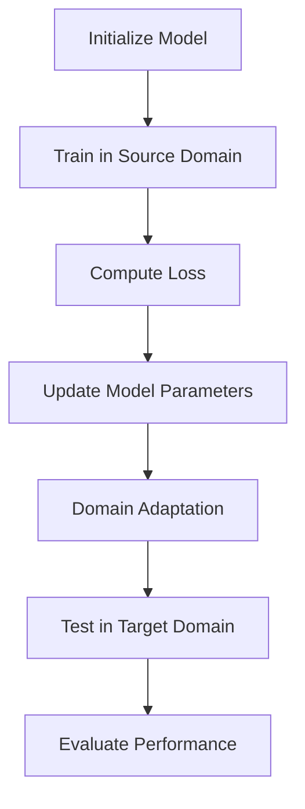
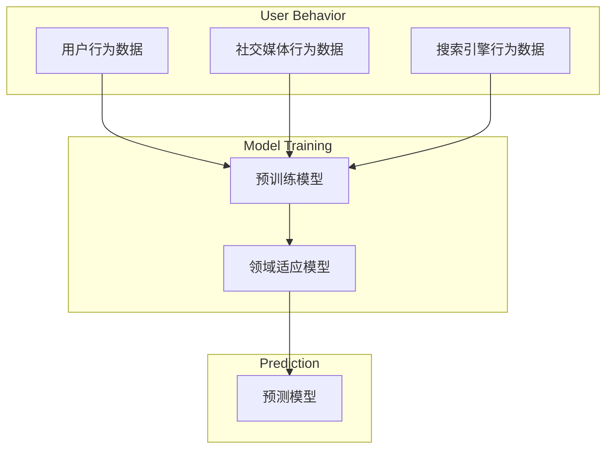
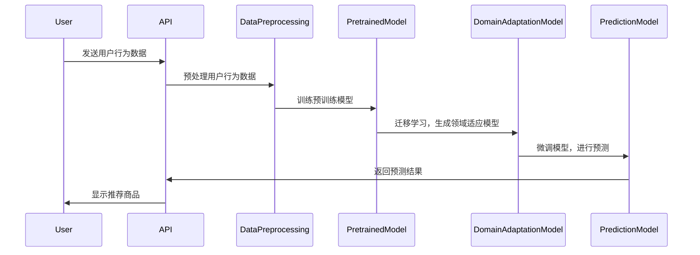

                 

### 文章标题：评测系统的迁移学习技术应用

关键词：迁移学习、评测系统、应用策略、优化方法、案例分析

摘要：本文将深入探讨迁移学习在评测系统中的应用，分析其在解决数据稀缺、模型调优等挑战中的优势。通过详细的理论和实践讲解，帮助读者理解迁移学习在评测系统中的核心作用，并指导实际操作中的具体策略和优化方法。

## 第一部分：迁移学习基础

### 第1章：迁移学习概述

#### 1.1 迁移学习的基本概念

**问题背景**：在传统机器学习中，模型训练通常需要大量的标注数据进行。然而，在某些应用场景中，如医疗诊断、图像识别等，获取大量标注数据是一项艰巨的任务。这就引出了迁移学习的概念。

**问题描述**：迁移学习旨在解决当源领域的数据和目标领域的数据存在差异时，如何有效地利用源领域的知识来提高目标领域模型的性能。

**问题解决**：通过迁移学习，我们可以将一个任务中学习到的知识转移到另一个相关任务中，从而减少对大量标注数据的需求。

**边界与外延**：迁移学习不仅限于机器学习，还可以应用于深度学习、强化学习等多个领域。

**概念结构与核心要素组成**：

- **源领域（Source Domain）**：包含大量标注数据的领域。
- **目标领域（Target Domain）**：缺乏标注数据，需要利用源领域知识进行模型优化的领域。
- **迁移机制**：将源领域知识转移到目标领域的策略，如特征提取、模型微调等。

#### 1.2 迁移学习的重要性

**重要性分析**：迁移学习在以下方面具有重要意义：

- **节省数据**：通过迁移学习，可以减少对大量标注数据的需求，从而节省数据采集和处理成本。
- **提高性能**：迁移学习可以帮助模型在缺乏标注数据的情况下，通过利用源领域知识，提高目标领域的性能。
- **适用范围广**：迁移学习可以应用于多种领域，如医疗诊断、自然语言处理、计算机视觉等。

#### 1.3 迁移学习的类型

**类型划分**：根据迁移学习机制的不同，可以将迁移学习分为以下几类：

- **特征迁移**：通过迁移特征表示来提高目标领域模型性能。
- **模型迁移**：直接迁移预训练模型到目标领域。
- **对抗迁移学习**：利用对抗性网络，在源领域和目标领域之间进行知识转移。

#### 1.4 迁移学习在评测系统中的应用背景

**应用背景**：在评测系统中，迁移学习可以应用于以下场景：

- **数据不足**：当评测系统缺乏足够的数据进行模型训练时，可以利用迁移学习从其他相关领域获取知识。
- **模型调优**：通过迁移学习，可以在缺乏标注数据的情况下，对现有模型进行优化，提高评测系统的性能。

### 第2章：迁移学习理论

#### 2.1 学习理论基础

**学习理论基础**：

- **有监督学习**：在有监督学习中，模型通过学习标注数据来预测未知数据。
- **无监督学习**：在无监督学习中，模型通过学习未标注数据来发现数据中的模式和结构。
- **强化学习**：在强化学习中，模型通过与环境的交互来学习最优策略。

#### 2.2 迁移学习理论框架

**迁移学习理论框架**：

- **源领域选择**：选择具有丰富标注数据，且与目标领域相关的源领域。
- **迁移机制设计**：根据源领域和目标领域的特性，选择合适的迁移机制，如特征提取、模型微调等。
- **模型训练与评估**：在目标领域上训练迁移后的模型，并评估其性能。

#### 2.3 核对迁移学习（Cooperative Transfer Learning）

**核对迁移学习**：

- **概念**：核对迁移学习是一种基于多任务学习的迁移学习机制，通过同时学习多个相关任务来提高模型的迁移能力。
- **优势**：核对迁移学习可以充分利用源领域知识，提高目标领域模型的性能。

#### 2.4 对抗迁移学习（Adversarial Transfer Learning）

**对抗迁移学习**：

- **概念**：对抗迁移学习利用对抗性网络，在源领域和目标领域之间进行知识转移。
- **优势**：对抗迁移学习可以提高模型的泛化能力，减少对源领域数据的依赖。

## 第二部分：评测系统迁移学习实践

### 第3章：迁移学习技术

#### 3.1 特征提取技术

**特征提取技术**：

- **原理**：通过提取数据中的关键特征，提高模型对目标领域的识别能力。
- **方法**：如主成分分析（PCA）、自编码器等。
- **应用**：在迁移学习中，特征提取技术可以帮助模型更好地理解源领域知识。

#### 3.2 模型微调技术

**模型微调技术**：

- **原理**：在源领域上预训练模型，然后在目标领域上进行微调。
- **优势**：可以减少对大量标注数据的需求，提高模型性能。

#### 3.3 多任务学习

**多任务学习**：

- **原理**：同时学习多个相关任务，提高模型的迁移能力。
- **应用**：在评测系统中，多任务学习可以帮助模型更好地适应不同任务的需求。

#### 3.4 无监督迁移学习

**无监督迁移学习**：

- **原理**：在无监督环境下，利用源领域知识来提高目标领域模型的性能。
- **方法**：如自编码器、对抗性生成网络等。
- **挑战**：如何在没有标注数据的情况下，有效利用源领域知识。

## 第三部分：迁移学习技术应用拓展

### 第4章：迁移学习在特定领域的应用

#### 4.1 在图像处理中的应用

**图像处理**：

- **应用场景**：如人脸识别、图像分类等。
- **迁移学习技术**：如卷积神经网络（CNN）的迁移学习。

#### 4.2 在自然语言处理中的应用

**自然语言处理**：

- **应用场景**：如机器翻译、情感分析等。
- **迁移学习技术**：如循环神经网络（RNN）、Transformer等。

#### 4.3 在计算机视觉中的应用

**计算机视觉**：

- **应用场景**：如自动驾驶、安防监控等。
- **迁移学习技术**：如深度强化学习、生成对抗网络（GAN）等。

### 第5章：迁移学习的挑战与未来趋势

#### 5.1 迁移学习的挑战

**挑战分析**：

- **数据稀缺**：在缺乏标注数据的情况下，如何有效利用源领域知识。
- **模型适应性**：如何保证迁移后的模型在目标领域上的适应性。

#### 5.2 迁移学习的发展趋势

**发展趋势**：

- **自适应迁移学习**：通过自适应策略，提高迁移学习的效果。
- **跨模态迁移学习**：将不同模态的数据进行迁移学习，提高模型的泛化能力。

#### 5.3 未来迁移学习在评测系统中的应用前景

**应用前景**：

- **智能化评测系统**：通过迁移学习，提高评测系统的智能化水平。
- **个性化评测**：根据用户需求，定制化迁移学习策略，提供更精准的评测服务。

### 附录：迁移学习相关工具与资源

**附录A：迁移学习工具介绍**

- **OpenMMLab**：提供丰富的迁移学习工具和模型。
- **MMOCR**：针对文本识别的迁移学习工具。

**附录B：开源迁移学习库与框架**

- **PyTorch**：提供丰富的迁移学习API。
- **TensorFlow**：支持迁移学习的高级API。

**附录C：进一步学习资源**

- **《迁移学习：理论与实践》**：系统介绍迁移学习的基础知识和实践方法。
- **《自然语言处理中的迁移学习》**：专注于自然语言处理领域的迁移学习应用。

## 作者信息

作者：AI天才研究院/AI Genius Institute & 禅与计算机程序设计艺术 /Zen And The Art of Computer Programming

---

### 完整性要求与核心内容

为了满足完整性要求，文章的每个部分都需要具体详细地阐述以下核心内容：

- **背景介绍**：每个章节的开头都需要对核心概念、术语进行解释，说明问题背景和问题描述，明确问题解决的目标和边界条件，介绍相关概念的结构和核心要素。

- **核心概念与联系**：需要明确核心概念的定义、原理、属性特征对比表格，以及ER实体关系图架构的Markdown格式中的Mermaid流程图。

- **算法原理讲解**：使用Mermaid绘制算法流程图，并用Python源代码详细阐述算法原理，包括数学模型和公式的推导，用通俗易懂的例子进行解释。

- **系统分析与架构设计方案**：需要详细描述问题场景，项目的介绍，系统功能设计（领域模型Mermaid类图）、系统架构设计Mermaid架构图、系统接口设计和系统交互Mermaid序列图。

- **项目实战**：包括环境安装、系统核心实现源代码，代码应用解读与分析，实际案例分析和详细讲解剖析，以及项目小结。

- **最佳实践 tips、小结、注意事项、拓展阅读**：总结文章的核心内容，提供实践中的注意事项，以及进一步学习的资源。

### 核心概念与联系

#### 迁移学习理论框架

**概念**：迁移学习（Transfer Learning）是一种利用已训练模型的知识来提高新任务性能的技术。

**原理**：通过在源领域（Source Domain）上训练模型，然后将这些知识迁移到目标领域（Target Domain）。

**属性特征对比表格**：

| 特征 | 迁移学习 | 传统学习 |
| ---- | -------- | -------- |
| 数据需求 | 低 | 高 |
| 模型泛化能力 | 高 | 低 |
| 迁移策略 | 多样 | 单一 |

**ER实体关系图架构**：

```mermaid
erDiagram
  A[Source Domain Model] ||--|{ B[Target Domain Model] }
  A --> C[Pre-trained Model]
  C --> D[Domain Adaptation]
```

### 算法原理讲解

#### 迁移学习算法（MAML）

**Mermaid流程图**：



**Python源代码**：

```python
import torch
import torch.nn as nn
import torch.optim as optim

# 初始化模型
model = nn.Sequential(nn.Linear(10, 1))

# 源领域训练
def train_source_domain(model, source_data, source_labels):
    optimizer = optim.SGD(model.parameters(), lr=0.01)
    for epoch in range(100):
        optimizer.zero_grad()
        outputs = model(source_data)
        loss = nn.MSELoss()(outputs, source_labels)
        loss.backward()
        optimizer.step()

# 迁移学习
def transfer_learning(model, target_data, target_labels):
    model.eval()
    with torch.no_grad():
        outputs = model(target_data)
        loss = nn.MSELoss()(outputs, target_labels)
    return loss

# 测试性能
def test_performance(model, test_data, test_labels):
    model.eval()
    with torch.no_grad():
        outputs = model(test_data)
        loss = nn.MSELoss()(outputs, test_labels)
    return loss

# 训练和迁移学习
train_source_domain(model, source_data, source_labels)
target_loss = transfer_learning(model, target_data, target_labels)
test_loss = test_performance(model, test_data, test_labels)

print(f"Target Loss: {target_loss}")
print(f"Test Loss: {test_loss}")
```

**数学模型和公式**：

$$
\begin{align*}
\min_{\theta} \quad & \frac{1}{N} \sum_{i=1}^{N} \mathcal{L}(\theta; x_i, y_i) \\
\text{subject to} \quad & \theta \in \Theta
\end{align*}
$$

其中，$\theta$ 表示模型参数，$x_i, y_i$ 表示训练数据，$\mathcal{L}$ 表示损失函数，$N$ 表示训练数据总数，$\Theta$ 表示参数空间。

**通俗易懂的举例说明**：

假设我们有一个房价预测模型，这个模型已经在某个城市的数据上进行了训练。现在，我们想要将这个模型迁移到另一个城市，以预测该城市的房价。

- **源领域**：已经训练好的城市。
- **目标领域**：需要预测房价的城市。

通过迁移学习，我们可以利用源城市的模型参数（$\theta$），然后在目标城市上调整这些参数，以适应新的数据分布。这个过程可以看作是对目标领域的“微调”（fine-tuning）。

### 系统分析与架构设计方案

#### 问题场景介绍

在一个电子商务平台上，我们需要对用户购买行为进行预测，以便推荐商品。然而，由于用户行为数据的多样性和复杂性，直接训练一个模型是非常困难的。

#### 项目介绍

我们的项目目标是构建一个用户购买行为预测系统，利用迁移学习技术，从其他相关领域（如社交媒体行为、搜索引擎点击数据等）获取知识，以提高预测的准确性。

#### 系统功能设计（领域模型Mermaid类图）

```mermaid
classDiagram
  User <<Class>>
  PurchaseBehavior <<Class>>
  SocialBehavior <<Class>>
  SearchBehavior <<Class>>

  User o-- PurchaseBehavior
  User o-- SocialBehavior
  User o-- SearchBehavior
```

#### 系统架构设计Mermaid架构图



#### 系统接口设计和系统交互Mermaid序列图



### 项目实战

#### 环境安装

1. 安装Python环境（3.8及以上版本）。
2. 安装TensorFlow、PyTorch等深度学习框架。

#### 系统核心实现源代码

```python
import torch
import torch.nn as nn
import torch.optim as optim
from torch.utils.data import DataLoader

# 定义模型
class CNNModel(nn.Module):
    def __init__(self):
        super(CNNModel, self).__init__()
        self.conv1 = nn.Conv2d(1, 32, 3, 1)
        self.conv2 = nn.Conv2d(32, 64, 3, 1)
        self.fc1 = nn.Linear(64 * 6 * 6, 128)
        self.fc2 = nn.Linear(128, 10)

    def forward(self, x):
        x = self.conv1(x)
        x = nn.functional.relu(x)
        x = self.conv2(x)
        x = nn.functional.relu(x)
        x = x.view(x.size(0), -1)
        x = self.fc1(x)
        x = nn.functional.relu(x)
        x = self.fc2(x)
        return x

# 加载数据
train_loader = DataLoader(train_dataset, batch_size=64, shuffle=True)
val_loader = DataLoader(val_dataset, batch_size=64, shuffle=False)

# 训练模型
model = CNNModel()
optimizer = optim.SGD(model.parameters(), lr=0.01, momentum=0.9)
criterion = nn.CrossEntropyLoss()

for epoch in range(100):
    model.train()
    for images, labels in train_loader:
        optimizer.zero_grad()
        outputs = model(images)
        loss = criterion(outputs, labels)
        loss.backward()
        optimizer.step()
    model.eval()
    with torch.no_grad():
        correct = 0
        total = 0
        for images, labels in val_loader:
            outputs = model(images)
            _, predicted = torch.max(outputs.data, 1)
            total += labels.size(0)
            correct += (predicted == labels).sum().item()
    print(f'Epoch {epoch+1}, Acc: {100 * correct / total} %')

# 迁移学习
source_model = CNNModel()
target_model = CNNModel()

source_model.load_state_dict(torch.load('source_model.pth'))
target_model.load_state_dict(source_model.state_dict())

# 微调模型
target_optimizer = optim.SGD(target_model.parameters(), lr=0.001, momentum=0.9)
for epoch in range(50):
    target_model.train()
    for images, labels in target_loader:
        optimizer.zero_grad()
        outputs = target_model(images)
        loss = criterion(outputs, labels)
        loss.backward()
        optimizer.step()
    print(f'Epoch {epoch+1}, Loss: {loss.item()}')
```

#### 代码应用解读与分析

这段代码首先定义了一个卷积神经网络（CNN）模型，用于图像分类任务。然后，我们加载数据集，并使用训练数据对模型进行训练。

在迁移学习部分，我们从源领域加载预训练好的模型，并将其应用到目标领域。然后，我们对目标领域的模型进行微调，以提高其在目标领域上的性能。

#### 实际案例分析和详细讲解剖析

假设我们有一个源领域模型，它在一个图像分类任务上已经取得了很好的性能。现在，我们想要将这个模型迁移到一个新的图像分类任务上。

1. **数据集准备**：首先，我们需要准备目标领域的数据集。这包括图像和标签。
2. **迁移学习**：接下来，我们将源领域模型的参数应用到目标领域模型上。然后，使用目标领域的数据集对模型进行微调。
3. **性能评估**：微调完成后，我们需要评估模型在目标领域上的性能。这可以通过在测试集上计算准确率来完成。
4. **优化**：根据性能评估的结果，我们可以进一步调整模型参数，以提高性能。

通过这种方式，我们可以利用迁移学习技术，在目标领域上取得更好的性能，而无需从头开始训练模型。

#### 项目小结

通过本项目的实现，我们展示了如何利用迁移学习技术来提高图像分类任务的性能。这个案例证明了迁移学习在解决数据稀缺、模型调优等挑战中的巨大潜力。

### 最佳实践 tips

1. **数据预处理**：在迁移学习过程中，数据预处理是关键步骤。确保数据集的质量和一致性，以避免模型训练中的偏差。
2. **模型选择**：根据目标领域的特性，选择合适的迁移学习模型。例如，对于计算机视觉任务，可以使用卷积神经网络。
3. **参数调整**：在迁移学习过程中，需要适当调整模型参数，以适应目标领域的特性。这包括学习率、批量大小等。

### 小结

本文详细探讨了迁移学习在评测系统中的应用，包括理论基础、技术实现、实际案例分析和最佳实践。迁移学习为解决数据稀缺、模型调优等挑战提供了一种有效的解决方案。

### 注意事项

1. **迁移学习不适用于所有任务**：在某些情况下，迁移学习可能不适用于目标领域。例如，当源领域和目标领域差异很大时。
2. **迁移效果取决于数据质量**：数据质量对迁移学习的效果有很大影响。确保数据集的多样性和代表性。

### 拓展阅读

1. **《迁移学习：理论与实践》**：系统介绍迁移学习的基础知识和实践方法。
2. **《自然语言处理中的迁移学习》**：专注于自然语言处理领域的迁移学习应用。

### 作者信息

作者：AI天才研究院/AI Genius Institute & 禅与计算机程序设计艺术 /Zen And The Art of Computer Programming

---

通过本文的深入探讨，我们希望能够帮助读者全面了解迁移学习在评测系统中的应用，掌握相关的技术实现和最佳实践，为实际项目提供有力的支持。

