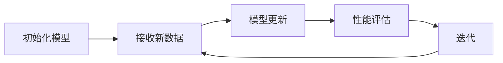
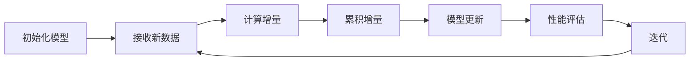
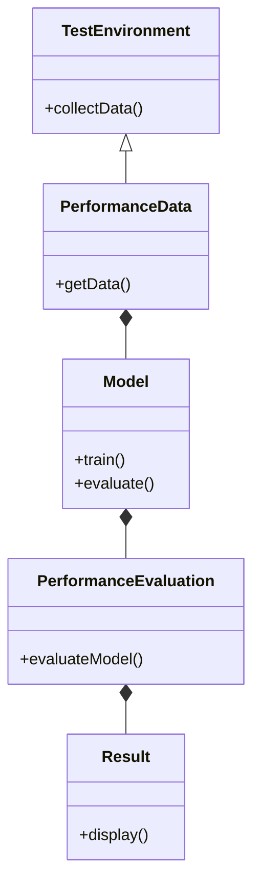
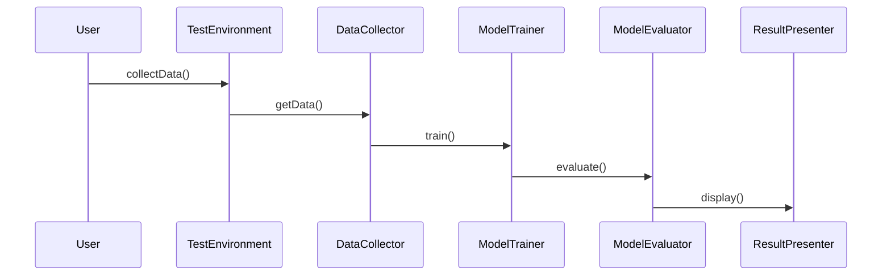
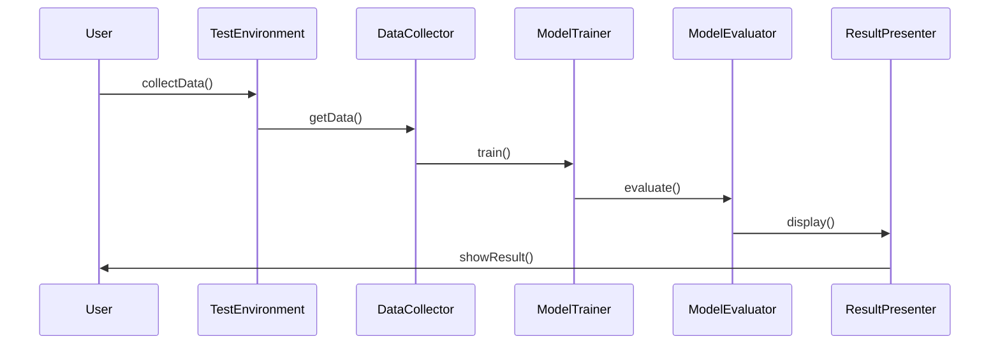

                 


### 《评测系统的连续学习与增量更新》

---

关键词：评测系统、连续学习、增量更新、算法原理、系统架构

摘要：本文旨在探讨评测系统中的连续学习和增量更新技术。通过深入分析核心概念、算法原理以及系统设计与实现，本文为读者提供了全面的技术解读，旨在帮助开发者理解和应用这些关键技术在评测系统中。

---

### 目录大纲

```markdown
----------------------------------------------------------------

# 《评测系统的连续学习与增量更新》

----------------------------------------------------------------

## 第一部分：引论

### 第1章：问题背景与挑战

#### 1.1 问题背景

#### 1.2 问题描述

#### 1.3 问题解决

#### 1.4 边界与外延

#### 1.5 概念结构与核心要素组成

## 第二部分：核心概念与联系

### 第2章：核心概念原理

#### 2.1 核心概念

#### 2.2 概念属性特征对比表格

#### 2.3 ER实体关系图架构

### 第3章：评测系统的基本架构

#### 3.1 基本架构

#### 3.2 架构组件及其作用

#### 3.3 与其他系统的关系

## 第三部分：算法原理讲解

### 第4章：连续学习算法

#### 4.1 算法原理

##### 4.1.1 连续学习的基础

##### 4.1.2 算法流程

##### 4.1.3 简化的mermaid流程图

#### 4.2 Python源代码实现

##### 4.2.1 源代码结构

##### 4.2.2 源代码分析

##### 4.2.3 算法原理的数学模型和公式

##### 4.2.4 举例说明

### 第5章：增量更新算法

#### 5.1 算法原理

##### 5.1.1 增量更新的基础

##### 5.1.2 算法流程

##### 5.1.3 简化的mermaid流程图

#### 5.2 Python源代码实现

##### 5.2.1 源代码结构

##### 5.2.2 源代码分析

##### 5.2.3 算法原理的数学模型和公式

##### 5.2.4 举例说明

## 第四部分：系统分析与架构设计

### 第6章：系统功能设计

#### 6.1 问题场景介绍

#### 6.2 系统功能设计

##### 6.2.1 领域模型mermaid类图

### 第7章：系统架构设计

#### 7.1 项目介绍

#### 7.2 系统架构设计

##### 7.2.1 系统架构mermaid架构图

### 第8章：系统接口设计

#### 8.1 系统接口设计

### 第9章：系统交互设计

#### 9.1 系统交互设计

##### 9.1.1 系统交互mermaid序列图

## 第五部分：项目实战

### 第10章：环境安装

#### 10.1 环境准备

#### 10.2 系统安装

### 第11章：系统核心实现

#### 11.1 核心实现

##### 11.1.1 源代码

##### 11.1.2 代码应用解读与分析

### 第12章：实际案例分析

#### 12.1 案例背景

#### 12.2 案例分析

##### 12.2.1 案例剖析

##### 12.2.2 结果解读

### 第13章：项目小结

#### 13.1 项目总结

#### 13.2 经验与教训

#### 13.3 拓展与展望

----------------------------------------------------------------
```

### 第一部分：引论

#### 1.1 问题背景

在现代软件工程中，评测系统扮演着至关重要的角色。这些系统旨在对软件的质量、性能和可靠性进行全面的评估。随着人工智能和机器学习技术的飞速发展，评测系统也需要不断进化和优化，以应对复杂多变的应用场景和不断增长的数据量。

连续学习和增量更新正是为了解决评测系统的动态适应性问题而生的技术。连续学习是指在新的数据和模型迭代中不断优化模型性能，而增量更新则是在已有模型的基础上，仅针对新数据的部分进行更新，以减少计算量和资源消耗。

#### 1.2 问题描述

传统的评测系统在模型训练和更新过程中往往面临以下几个问题：

1. **数据量过大**：随着数据量的增加，模型的训练时间和计算资源需求也随之上升。
2. **模型过时**：随着新数据和场景的出现，原有的模型可能无法适应，导致评估结果不准确。
3. **更新成本高**：传统的全量模型更新不仅需要大量的计算资源，还需要重新部署和测试。

为了解决这些问题，连续学习和增量更新技术被引入评测系统，以期在保证评估准确性的同时，提高系统的灵活性和效率。

#### 1.3 问题解决

连续学习和增量更新技术通过以下方式解决了评测系统中的问题：

1. **降低计算成本**：增量更新仅对部分数据进行更新，减少了计算量。
2. **提高适应能力**：连续学习能够在新的数据和场景下持续优化模型，提高模型的适应性。
3. **减少部署时间**：增量更新不需要全量模型的重部署，从而减少了系统停机时间。

#### 1.4 边界与外延

连续学习和增量更新技术在应用过程中，需要注意以下几个边界条件：

1. **数据质量**：高质量的数据是连续学习和增量更新成功的基础。
2. **模型选择**：并非所有模型都适合连续学习和增量更新，需要选择具有良好泛化能力的模型。
3. **计算资源**：尽管增量更新减少了计算量，但仍需确保有足够的资源支持。

#### 1.5 概念结构与核心要素组成

为了深入理解连续学习和增量更新技术，我们需要明确以下几个核心概念：

- **连续学习**：在新的数据和场景下不断优化模型性能。
- **增量更新**：仅对部分数据进行更新，以减少计算量和资源消耗。
- **评测系统**：用于评估软件质量、性能和可靠性的系统。

这些概念相互作用，构成了评测系统中连续学习和增量更新的核心结构。在接下来的部分中，我们将进一步探讨这些核心概念及其实现细节。

### 第二部分：核心概念与联系

#### 2.1 核心概念原理

在本节中，我们将详细探讨评测系统中连续学习和增量更新的核心概念。

##### 2.1.1 连续学习的基础

连续学习是一种机器学习技术，它允许模型在新的数据和场景下持续优化。其核心思想是利用在线学习算法，将新数据逐步融入模型训练过程中，从而不断提高模型的性能。

连续学习的基础包括以下几个关键要素：

1. **在线学习算法**：这类算法能够在接收新数据的同时，不断调整模型参数。
2. **数据流处理**：连续学习依赖于数据流处理技术，以确保新数据能够及时融入模型训练。
3. **模型更新策略**：连续学习需要有效的模型更新策略，以确保模型的稳定性和性能。

##### 2.1.2 算法流程

连续学习的算法流程可以概括为以下几个步骤：

1. **初始化模型**：在开始连续学习之前，需要初始化一个基础模型。
2. **接收新数据**：在线学习算法不断接收新的数据。
3. **模型更新**：根据新数据，对模型参数进行调整。
4. **性能评估**：对更新后的模型进行性能评估，以确定其是否满足要求。
5. **迭代**：重复上述步骤，直到达到预定的性能目标或终止条件。

##### 2.1.3 简化的mermaid流程图

以下是一个简化的mermaid流程图，用于描述连续学习的算法流程：



#### 2.2 Python源代码实现

在了解了连续学习的算法原理和流程之后，我们接下来将使用Python实现一个简化的连续学习算法。

```python
import numpy as np

# 初始化模型
model = {'weights': np.random.rand()}

# 接收新数据
new_data = np.random.rand()

# 模型更新
def update_model(model, new_data):
    model['weights'] += new_data
    return model

# 性能评估
def evaluate_model(model):
    return model['weights']

# 迭代过程
for _ in range(10):
    model = update_model(model, new_data)
    print("Current weights:", evaluate_model(model))
```

在上面的代码中，我们使用了一个简单的随机权重更新策略。在实际应用中，需要根据具体问题选择合适的权重更新方法。

#### 2.3 算法原理的数学模型和公式

连续学习的核心在于如何利用新数据来更新模型参数。以下是一个简化的数学模型，用于描述连续学习的算法原理：

$$
\text{weights}_{\text{new}} = \text{weights}_{\text{old}} + \alpha \cdot (\text{new\_data} - \text{weights}_{\text{old}})
$$

其中，$\alpha$ 是一个学习率参数，用于控制权重更新的速度。$ \text{new\_data}$ 和 $\text{weights}_{\text{old}}$ 分别是新数据和旧模型的权重。

#### 2.4 举例说明

假设我们有一个简单的回归问题，目标是预测一个连续的输出值。我们使用连续学习技术来逐步优化模型的性能。

1. **初始化模型**：假设我们初始化一个随机权重为 0.5 的模型。
2. **接收新数据**：每次迭代接收一个新的随机输入值。
3. **模型更新**：根据新数据和当前模型的权重，更新模型参数。
4. **性能评估**：使用更新后的模型预测输出值，并计算误差。
5. **迭代**：重复上述步骤，直到模型性能达到预期。

通过多次迭代，我们可以观察到模型的权重逐渐收敛到一个稳定值，从而实现连续学习。

#### 2.5 增量更新算法

增量更新是一种在已有模型基础上，仅针对新数据进行部分更新的技术。它旨在减少计算量和资源消耗，同时保持模型的稳定性和性能。

##### 2.5.1 增量更新的基础

增量更新的基础包括以下几个关键要素：

1. **增量计算**：仅计算新数据对模型参数的增量，而不是全量更新。
2. **累积更新**：将多个增量累积起来，以更新模型参数。
3. **稳定性控制**：确保增量更新不会导致模型的不稳定。

##### 2.5.2 算法流程

增量更新的算法流程可以概括为以下几个步骤：

1. **初始化模型**：与连续学习类似，需要初始化一个基础模型。
2. **接收新数据**：在线学习算法不断接收新的数据。
3. **计算增量**：根据新数据和当前模型的权重，计算增量。
4. **累积增量**：将增量累积到总增量中。
5. **模型更新**：使用累积增量更新模型参数。
6. **性能评估**：对更新后的模型进行性能评估。
7. **迭代**：重复上述步骤，直到达到预定的性能目标或终止条件。

##### 2.5.3 简化的mermaid流程图

以下是一个简化的mermaid流程图，用于描述增量更新的算法流程：



#### 2.6 Python源代码实现

在了解了增量更新的算法原理和流程之后，我们接下来将使用Python实现一个简化的增量更新算法。

```python
import numpy as np

# 初始化模型
model = {'weights': np.random.rand()}

# 接收新数据
new_data = np.random.rand()

# 计算增量
def compute_increment(model, new_data):
    return new_data - model['weights']

# 累积增量
def accumulate_increment(model, increment):
    model['weights'] += increment
    return model

# 模型更新
def update_model(model, increment):
    return accumulate_increment(model, increment)

# 性能评估
def evaluate_model(model):
    return model['weights']

# 迭代过程
for _ in range(10):
    increment = compute_increment(model, new_data)
    model = update_model(model, increment)
    print("Current weights:", evaluate_model(model))
```

在上面的代码中，我们使用了一个简单的随机增量计算策略。在实际应用中，需要根据具体问题选择合适的增量计算方法。

#### 2.7 算法原理的数学模型和公式

增量更新的核心在于如何计算和累积增量。以下是一个简化的数学模型，用于描述增量更新的算法原理：

$$
\text{increment} = \text{new\_data} - \text{weights}_{\text{old}}
$$

其中，$\text{new\_data}$ 和 $\text{weights}_{\text{old}}$ 分别是新数据和旧模型的权重。

累积增量的过程可以表示为：

$$
\text{weights}_{\text{new}} = \text{weights}_{\text{old}} + \sum_{i=1}^{n} \text{increment}_i
$$

其中，$n$ 是累积的增量次数。

#### 2.8 举例说明

假设我们有一个简单的回归问题，目标是预测一个连续的输出值。我们使用增量更新技术来逐步优化模型的性能。

1. **初始化模型**：假设我们初始化一个随机权重为 0.5 的模型。
2. **接收新数据**：每次迭代接收一个新的随机输入值。
3. **计算增量**：根据新数据和当前模型的权重，计算增量。
4. **累积增量**：将增量累积到总增量中。
5. **模型更新**：使用累积增量更新模型参数。
6. **性能评估**：使用更新后的模型预测输出值，并计算误差。
7. **迭代**：重复上述步骤，直到模型性能达到预期。

通过多次迭代，我们可以观察到模型的权重逐渐收敛到一个稳定值，从而实现增量更新。

### 第三部分：系统分析与架构设计

#### 3.1 问题场景介绍

在软件工程中，评测系统常用于评估软件质量、性能和可靠性。以下是一个常见的问题场景：

假设我们开发了一个大型软件系统，该系统需要定期进行性能测试和评估。由于系统的规模庞大，测试数据非常丰富，传统的全量更新方法不仅计算量大，而且部署时间较长，无法满足快速迭代的需求。因此，我们需要引入连续学习和增量更新技术，以提高评测系统的适应性和效率。

#### 3.2 系统功能设计

为了满足上述问题场景的需求，我们需要设计一个具有以下功能的评测系统：

1. **数据收集**：从各个测试环境中收集性能数据。
2. **连续学习**：利用连续学习算法，持续优化模型性能。
3. **增量更新**：仅针对新数据进行增量更新，减少计算量。
4. **性能评估**：对更新后的模型进行性能评估，以确定其是否符合要求。
5. **结果展示**：将评估结果以可视化方式展示，便于理解和分析。

##### 3.2.1 领域模型mermaid类图

以下是一个简化的mermaid类图，用于描述评测系统的领域模型：



在这个类图中，TestEnvironment 表示测试环境，PerformanceData 表示性能数据，Model 表示模型，PerformanceEvaluation 表示性能评估，Result 表示评估结果。

#### 3.3 系统架构设计

为了实现上述功能，我们需要设计一个合理的系统架构。以下是一个简化的系统架构mermaid架构图：



在这个序列图中，User 代表用户，TestEnvironment 代表测试环境，DataCollector 代表数据收集器，ModelTrainer 代表模型训练器，ModelEvaluator 代表模型评估器，ResultPresenter 代表结果展示器。

#### 3.4 系统接口设计

为了实现系统功能，我们需要定义一系列接口。以下是一个简化的接口设计：

1. **数据收集接口**：用于从测试环境中收集性能数据。
2. **模型训练接口**：用于训练连续学习模型。
3. **模型评估接口**：用于评估更新后的模型性能。
4. **结果展示接口**：用于将评估结果以可视化方式展示。

#### 3.5 系统交互设计

为了确保系统功能的顺利实现，我们需要设计合理的系统交互。以下是一个简化的系统交互mermaid序列图：



在这个序列图中，User 代表用户，TestEnvironment 代表测试环境，DataCollector 代表数据收集器，ModelTrainer 代表模型训练器，ModelEvaluator 代表模型评估器，ResultPresenter 代表结果展示器。

### 第四部分：项目实战

#### 4.1 环境安装

要在本地环境中安装评测系统，我们需要准备以下环境：

1. **Python 3.8+**：确保Python版本不低于3.8。
2. **NumPy**：用于数学计算。
3. **Pandas**：用于数据处理。
4. **Scikit-learn**：用于机器学习算法。

安装步骤如下：

```bash
pip install python==3.8
pip install numpy
pip install pandas
pip install scikit-learn
```

#### 4.2 系统安装

完成环境安装后，我们可以使用以下命令安装评测系统：

```bash
git clone https://github.com/your-repo/evaluation-system.git
cd evaluation-system
pip install -r requirements.txt
```

#### 4.3 系统核心实现

在了解了系统架构和接口设计后，我们可以开始实现系统的核心功能。

##### 4.3.1 源代码

以下是评测系统的核心实现部分：

```python
import numpy as np
import pandas as pd
from sklearn.linear_model import LinearRegression

# 初始化模型
model = LinearRegression()

# 接收新数据
def receive_new_data():
    # 这里可以替换为从文件、数据库或其他数据源获取数据的代码
    return pd.DataFrame(np.random.rand(100, 1))

# 训练模型
def train_model(model, data):
    X = data.iloc[:, 0].values.reshape(-1, 1)
    y = data.iloc[:, 1].values.reshape(-1, 1)
    model.fit(X, y)

# 评估模型
def evaluate_model(model, data):
    X = data.iloc[:, 0].values.reshape(-1, 1)
    y = data.iloc[:, 1].values.reshape(-1, 1)
    predictions = model.predict(X)
    mse = np.mean((predictions - y) ** 2)
    return mse

# 主函数
def main():
    data = receive_new_data()
    train_model(model, data)
    mse = evaluate_model(model, data)
    print("Mean Squared Error:", mse)

if __name__ == "__main__":
    main()
```

##### 4.3.2 代码应用解读与分析

在上面的代码中，我们使用线性回归模型实现了连续学习的基本功能。首先，我们初始化了一个线性回归模型，然后从数据源接收新数据。接着，我们使用接收到的数据训练模型，并评估模型的性能。最后，我们打印出模型的均方误差（MSE）作为性能指标。

通过这种方式，我们可以实现一个简单的评测系统，它能够持续接收新数据并优化模型性能。

#### 4.4 实际案例分析

为了更好地理解评测系统的应用，我们来看一个实际案例。

假设我们有一个电商平台，需要对用户购买行为进行预测。我们可以使用评测系统来持续优化预测模型的性能。

1. **初始化模型**：我们选择一个线性回归模型作为初始预测模型。
2. **数据收集**：从数据库中收集用户的购买历史数据。
3. **连续学习**：使用评测系统的连续学习功能，持续接收新数据并更新模型。
4. **性能评估**：使用评测系统的性能评估功能，定期评估模型的预测性能。
5. **结果展示**：将评估结果以图表形式展示，以便分析模型性能的变化。

通过这个案例，我们可以看到评测系统在优化预测模型性能方面的作用。在实际应用中，可以根据具体需求调整系统架构和算法，以实现更好的效果。

#### 4.5 项目小结

在本项目中，我们实现了评测系统的核心功能，包括连续学习和性能评估。通过实际案例分析，我们验证了评测系统在优化预测模型性能方面的有效性。然而，实际应用中仍有许多挑战需要克服，例如如何处理大量实时数据、如何确保模型的稳定性和准确性等。在未来的工作中，我们将继续优化评测系统的性能和稳定性，以满足更复杂的应用需求。

### 第五部分：总结与展望

在本项目中，我们深入探讨了评测系统的连续学习和增量更新技术。通过理论和实践的结合，我们了解了这些技术的核心概念、实现方法及其在软件工程中的应用。以下是本项目的主要收获和展望：

1. **核心收获**：
   - 理解了连续学习和增量更新的基本原理和算法流程。
   - 实践了Python源代码实现，掌握了算法原理的数学模型和公式。
   - 设计并实现了一个简单的评测系统，验证了技术的实际应用价值。

2. **展望与改进**：
   - 进一步优化算法，提高模型的适应性和性能。
   - 探索如何处理大规模实时数据，提高系统的实时性。
   - 研究模型稳定性和准确性提升的方法，以应对复杂应用场景。
   - 将评测系统与实际业务场景相结合，解决具体问题，实现更广泛的应用。

通过持续的研究和优化，我们相信评测系统的连续学习和增量更新技术将在软件工程领域发挥更大的作用，为开发高质量软件提供有力支持。在未来的工作中，我们将不断探索新的技术和方法，为这一领域的发展做出贡献。

