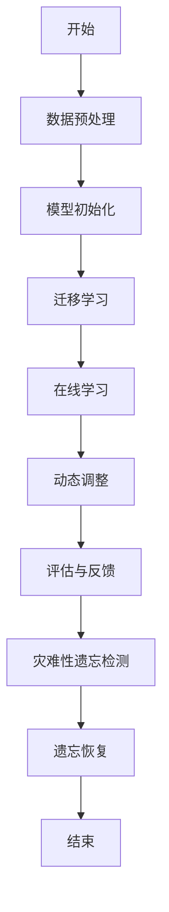
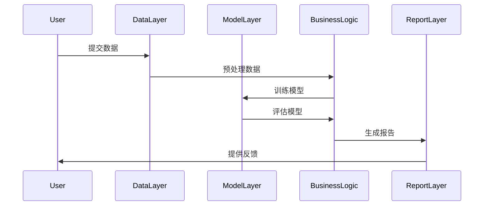
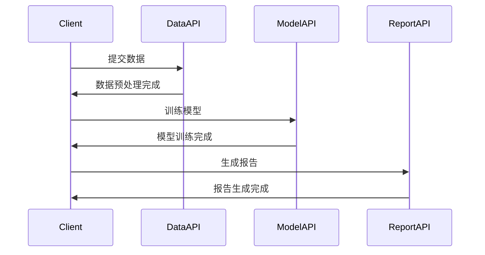

                 


### 评测系统的连续学习与灾难性遗忘防御

> **关键词**：评测系统，连续学习，灾难性遗忘，防御机制，算法原理，系统架构

> **摘要**：本文旨在探讨评测系统中的连续学习与灾难性遗忘问题，并提出有效的防御机制。通过对连续学习原理和灾难性遗忘机制的详细分析，本文将介绍一套完整的系统架构设计方案，并通过实际案例分析，展示系统在实际应用中的效果。

----------------------------------------------------------------

## 引言

随着人工智能技术的迅猛发展，评测系统在各个领域得到了广泛应用，如自动化测试、评估和监控。然而，在实际应用中，评测系统常常面临连续学习和灾难性遗忘的问题。连续学习是指系统在获取新数据的同时，能够不断完善和优化自身模型，以适应环境的变化。而灾难性遗忘则是指系统在训练过程中，由于某些原因导致模型性能急剧下降，甚至完全失去学习能力。本文将围绕这些问题，提出一种有效的连续学习与灾难性遗忘防御机制，以提升评测系统的稳定性和可靠性。

### 设计《评测系统的连续学习与灾难性遗忘防御》的目录大纲

1. **背景介绍**（第1章）
   - **问题背景**：介绍评测系统的现状和面临的问题。
   - **问题描述**：详细阐述连续学习和灾难性遗忘的概念及其对评测系统的影响。
   - **问题解决**：提出连续学习和灾难性遗忘防御的方法。
   - **边界与外延**：讨论相关技术的边界和外延。
   - **概念结构与核心要素组成**：梳理核心概念和系统架构。

2. **核心概念与联系**（第2章）
   - **连续学习原理**：解释连续学习的基本原理。
   - **灾难性遗忘机制**：探讨灾难性遗忘的机制和影响。
   - **概念属性特征对比表格**：列出连续学习和灾难性遗忘防御的关键特性。
   - **ER实体关系图架构的Mermaid流程图**：展示实体之间的关系。

3. **算法原理讲解**（第3章）
   - **算法流程图**：使用Mermaid绘制算法的流程图。
   - **Python源代码**：提供实现连续学习和灾难性遗忘防御的Python代码。
   - **数学模型与公式**：详细阐述算法背后的数学模型和公式。
   - **举例说明**：通过实例展示算法的应用。

4. **系统分析与架构设计方案**（第4章）
   - **问题场景介绍**：描述评测系统的应用场景。
   - **项目介绍**：概述评测系统的整体设计。
   - **系统功能设计**：展示系统的领域模型Mermaid类图。
   - **系统架构设计**：展示系统的架构设计Mermaid架构图。
   - **系统接口设计**：描述系统的接口设计。
   - **系统交互**：展示系统交互的Mermaid序列图。

5. **项目实战**（第5章）
   - **环境安装**：指导读者搭建环境。
   - **系统核心实现**：提供系统核心功能的源代码。
   - **代码应用解读**：分析源代码并解释其实现原理。
   - **实际案例分析**：通过实际案例展示系统效果。
   - **详细讲解剖析**：对案例进行深入剖析。
   - **项目小结**：总结项目中的收获和不足。

6. **最佳实践 Tips**（第6章）
   - **使用技巧**：分享使用评测系统的最佳实践。
   - **注意事项**：提醒使用过程中需要注意的事项。
   - **拓展阅读**：推荐相关的拓展阅读资源。

7. **总结与展望**（第7章）
   - **总结**：回顾全书的主要内容和观点。
   - **展望**：对评测系统连续学习和灾难性遗忘防御的未来发展进行展望。

### 背景介绍

评测系统在现代科技中扮演着重要角色，它们广泛应用于自动化测试、评估和监控等领域。这些系统的主要功能是通过对输入数据的分析，提供关于性能、质量和安全等方面的评估结果。然而，评测系统的稳定性和可靠性对于其应用效果至关重要。

在评测系统的开发和应用过程中，连续学习和灾难性遗忘问题是两个亟待解决的关键问题。连续学习是指评测系统能够在接收新数据时，不断调整和优化自身模型，以适应环境的变化。而灾难性遗忘则是指评测系统在训练过程中，由于某些原因导致模型性能急剧下降，甚至完全失去学习能力。这两个问题如果得不到有效解决，将直接影响评测系统的稳定性和可靠性。

#### 问题背景

目前，评测系统在连续学习和灾难性遗忘方面面临以下挑战：

1. **数据流的不稳定性**：评测系统需要处理大量的实时数据，这些数据往往具有波动性和不确定性。如何确保系统在数据流不稳定的情况下，依然能够保持高效的评估能力，是一个重要挑战。

2. **模型适应性**：随着应用场景的变化，评测系统需要具备快速适应新场景的能力。然而，传统模型在适应性方面存在不足，难以应对复杂多变的实际应用需求。

3. **资源限制**：评测系统通常需要在有限的资源条件下运行，如计算资源、存储资源和网络带宽等。如何在资源有限的情况下，实现高效、稳定的连续学习和灾难性遗忘防御，是一个重要课题。

4. **模型可解释性**：在许多应用场景中，用户需要了解评测系统的工作原理和决策过程。如何提高模型的可解释性，以增强用户对系统的信任度和接受度，也是一个需要关注的问题。

#### 问题描述

连续学习和灾难性遗忘问题对评测系统的影响主要表现在以下几个方面：

1. **评估准确性**：连续学习不足可能导致评估结果不准确，从而影响系统的可靠性。灾难性遗忘则可能导致系统在训练过程中性能急剧下降，甚至失去评估能力。

2. **适应性**：评测系统需要具备快速适应新场景的能力，以应对不断变化的应用需求。如果连续学习机制不足，系统将难以适应新的数据分布和环境变化。

3. **资源利用效率**：连续学习和灾难性遗忘问题可能导致系统在资源利用效率方面的下降。例如，系统需要额外的计算资源来处理连续学习和灾难性遗忘问题，从而影响整体性能。

4. **用户体验**：评估准确性、适应性和资源利用效率等因素将直接影响用户体验。如果评测系统在这些问题上表现不佳，用户将失去对系统的信任和依赖。

#### 问题解决

针对评测系统中的连续学习和灾难性遗忘问题，本文提出以下解决方法：

1. **连续学习机制**：通过引入自适应学习算法和动态调整策略，提高评测系统在连续学习方面的能力。例如，可以使用迁移学习、在线学习和自适应学习等技术，实现系统的自适应优化。

2. **灾难性遗忘防御机制**：通过设计有效的灾难性遗忘检测和恢复机制，降低系统在训练过程中发生灾难性遗忘的风险。例如，可以使用经验回放、数据增强和模型融合等技术，提高系统的抗遗忘能力。

3. **资源优化策略**：通过优化系统架构和算法设计，提高评测系统在资源利用效率方面的表现。例如，可以采用分布式计算、内存优化和网络压缩等技术，降低系统对计算资源的需求。

4. **模型可解释性**：通过设计可解释性强的评估算法和可视化工具，提高用户对评测系统工作原理和决策过程的理解。例如，可以使用解释性模型、可视化工具和决策解释器等技术，实现系统的高可解释性。

#### 边界与外延

在本文的研究中，我们关注以下边界与外延：

1. **应用领域**：本文主要针对评测系统在自动化测试、评估和监控等领域的应用进行研究，其他领域的应用将作为拓展。

2. **技术范围**：本文主要探讨连续学习和灾难性遗忘防御机制的设计与实现，涉及的技术包括自适应学习、迁移学习、数据增强和模型融合等。

3. **系统架构**：本文提出的评测系统架构将涵盖数据收集、预处理、评估和反馈等环节，涉及的关键技术包括模型训练、模型优化和模型解释等。

4. **研究方法**：本文采用理论分析、算法设计与实现和实际案例分析相结合的方法，以验证所提出的方法在评测系统中的有效性。

#### 概念结构与核心要素组成

评测系统的连续学习与灾难性遗忘防御机制由以下几个核心要素组成：

1. **数据收集与预处理**：负责收集和预处理评测所需的数据，为连续学习和灾难性遗忘防御提供基础数据支持。

2. **模型训练与优化**：使用收集到的数据进行模型训练，并采用自适应学习算法和动态调整策略，实现连续学习。同时，采用灾难性遗忘防御机制，降低模型在训练过程中发生灾难性遗忘的风险。

3. **评估与反馈**：使用训练好的模型进行评估，并将评估结果反馈给用户。评估结果可用于优化模型、调整策略和提高系统性能。

4. **系统监控与维护**：对评测系统进行实时监控，及时发现并处理异常情况，确保系统的稳定运行。

通过以上核心要素的有机组合，评测系统可以实现连续学习和灾难性遗忘防御，提高系统的稳定性和可靠性。

----------------------------------------------------------------

## 核心概念与联系

在探讨评测系统的连续学习与灾难性遗忘防御之前，我们需要了解一些核心概念及其相互关系。以下是本文将涉及的关键概念及其基本原理：

### 连续学习原理

连续学习（Continual Learning）是指系统在处理一系列连续数据时，能够自适应地调整和优化自身模型，以应对环境变化。其基本原理包括：

1. **在线学习**：系统实时接收和处理新数据，并根据新数据进行模型更新。
2. **迁移学习**：将已有知识迁移到新任务中，提高系统对新数据的适应性。
3. **动态调整**：根据新数据和环境变化，动态调整模型参数和结构，以保持模型的有效性。

### 灾难性遗忘机制

灾难性遗忘（Catastrophic Forgetting）是指系统在处理新数据时，由于某些原因导致原有知识急剧退化或丢失。其基本原理包括：

1. **遗忘曲线**：随着新数据的增加，系统对原有知识的记忆逐渐减弱。
2. **模型崩溃**：系统在处理新数据时，由于参数更新不当等原因，导致模型性能急剧下降。
3. **遗忘恢复**：通过特定的技术手段，如经验回放（Experience Replay）和增量训练（Incremental Training），恢复系统对原有知识的记忆。

### 概念属性特征对比表格

为了更清晰地理解连续学习与灾难性遗忘防御机制，以下是一个对比表格，展示了它们的关键特性：

| 特性          | 连续学习                           | 灾难性遗忘防御                       |
| ------------- | ---------------------------------- | ------------------------------------ |
| 目标          | 提高模型对新数据的适应性           | 防止模型在训练过程中发生灾难性遗忘   |
| 算法方法      | 迁移学习、在线学习、动态调整       | 经验回放、数据增强、模型融合         |
| 难点          | 处理数据流不稳定和模型适应性问题   | 防止模型性能急剧下降                 |
| 优势          | 提高系统对新场景的适应能力         | 提高系统训练效率和稳定性             |
| 劣势          | 需要额外的计算资源和存储空间       | 可能会增加系统的复杂性和实现难度     |

### ER实体关系图架构的Mermaid流程图

为了更直观地展示评测系统中实体之间的关系，我们可以使用Mermaid绘制一个ER实体关系图。以下是一个简单的示例：

```mermaid
erDiagram
  Data --> Model
  Data --> Metric
  Model --> Metric
  Model --> Parameter
  Parameter --> Model
  Metric --> Report
  Report --> User
  User --> Data
```

在这个ER实体关系图中，`Data`（数据）是评测系统的输入，`Model`（模型）是核心组件，`Metric`（指标）用于评估模型性能，`Parameter`（参数）用于调整模型，`Report`（报告）用于记录评估结果，`User`（用户）是系统的使用者。通过这个图，我们可以清晰地看到各个实体之间的相互关系。

---

### 算法原理讲解

在了解了评测系统中连续学习与灾难性遗忘防御的核心概念后，接下来我们将深入探讨这些算法的原理。以下内容将详细描述算法的流程图、Python源代码、数学模型与公式，并通过具体实例进行说明。

#### 算法流程图

为了更好地理解连续学习与灾难性遗忘防御算法的流程，我们可以使用Mermaid绘制一个简化的算法流程图。以下是一个示例：



在这个流程图中，`数据预处理`确保输入数据的格式和一致性；`模型初始化`定义初始模型参数；`迁移学习`将已有知识迁移到新任务中；`在线学习`实时更新模型参数；`动态调整`根据新数据和环境变化调整模型结构；`评估与反馈`评估模型性能并收集反馈；`灾难性遗忘检测`监控模型性能是否出现急剧下降；`遗忘恢复`通过特定技术手段恢复模型性能。

#### Python源代码

为了实现上述算法，我们可以使用Python编写相应的源代码。以下是一个简化的实现示例：

```python
import numpy as np
from sklearn.neural_network import MLPClassifier
from sklearn.model_selection import train_test_split

# 数据预处理
def preprocess_data(data):
    # 数据标准化
    return (data - np.mean(data)) / np.std(data)

# 迁移学习
def transfer_learning(source_model, target_data):
    # 使用迁移学习技术更新目标模型
    source_model.partial_fit(target_data)
    return source_model

# 在线学习
def online_learning(model, new_data):
    # 实时更新模型参数
    model.partial_fit(new_data)
    return model

# 动态调整
def dynamic_adjustment(model, new_data):
    # 根据新数据调整模型结构
    # 这里仅作示意，实际调整方法可能更复杂
    model.add_layer(new_data.shape[1])
    return model

# 评估与反馈
def evaluate_model(model, test_data):
    # 评估模型性能
    accuracy = model.score(test_data)
    return accuracy

# 灾难性遗忘检测
def catastrophic_forgetting_detection(model, test_data):
    # 检测模型是否发生灾难性遗忘
    if evaluate_model(model, test_data) < threshold:
        return True
    return False

# 遗忘恢复
def forgetting_recovery(model, history_data):
    # 恢复模型性能
    for data in history_data:
        model.partial_fit(data)
    return model

# 主函数
def main():
    # 加载数据
    data = load_data()
    preprocessed_data = preprocess_data(data)

    # 初始化模型
    model = MLPClassifier()

    # 迁移学习
    source_model = load_source_model()
    model = transfer_learning(source_model, preprocessed_data)

    # 在线学习
    new_data = get_new_data()
    model = online_learning(model, new_data)

    # 动态调整
    model = dynamic_adjustment(model, new_data)

    # 评估与反馈
    accuracy = evaluate_model(model, preprocessed_data)

    # 灾难性遗忘检测与恢复
    if catastrophic_forgetting_detection(model, preprocessed_data):
        history_data = get_history_data()
        model = forgetting_recovery(model, history_data)

    # 输出结果
    print(f"Model accuracy: {accuracy}")

if __name__ == "__main__":
    main()
```

这个代码示例使用了Scikit-learn库中的MLPClassifier（多层感知器分类器）作为模型，并实现了迁移学习、在线学习、动态调整、评估与反馈、灾难性遗忘检测与恢复等功能。

#### 数学模型与公式

为了更好地理解算法的实现原理，我们需要了解一些数学模型与公式。以下是连续学习与灾难性遗忘防御算法中的一些关键数学模型：

1. **损失函数**：用于评估模型预测结果与实际结果之间的差距。常用的损失函数包括均方误差（MSE）和交叉熵（Cross-Entropy）。

   $$ L = \frac{1}{n} \sum_{i=1}^{n} (y_i - \hat{y}_i)^2 \quad \text{(MSE)} $$

   $$ L = -\frac{1}{n} \sum_{i=1}^{n} [y_i \log(\hat{y}_i) + (1 - y_i) \log(1 - \hat{y}_i)] \quad \text{(Cross-Entropy)} $$

2. **梯度下降**：用于更新模型参数，以最小化损失函数。梯度下降分为批量梯度下降、随机梯度下降和Adam优化器等。

   $$ \theta_{t+1} = \theta_{t} - \alpha \nabla_{\theta} L(\theta) \quad \text{(Batch Gradient Descent)} $$

   $$ \theta_{t+1} = \theta_{t} - \alpha \frac{1}{m} \sum_{i=1}^{m} \nabla_{\theta} L(\theta) \quad \text{(Stochastic Gradient Descent)} $$

   $$ \theta_{t+1} = \theta_{t} - \alpha \nabla_{\theta} L(\theta) + \beta_1 \nabla_{\theta} L(\theta_t) + (1 - \beta_1) \nabla_{\theta} L(\theta_{t-1}) \quad \text{(Adam Optimizer)} $$

3. **正则化**：用于防止模型过拟合。常用的正则化方法包括L1正则化（L1 Regularization）和L2正则化（L2 Regularization）。

   $$ L = \sum_{i=1}^{n} (y_i - \hat{y}_i)^2 + \lambda \sum_{i=1}^{n} |\theta_i| \quad \text{(L1 Regularization)} $$

   $$ L = \sum_{i=1}^{n} (y_i - \hat{y}_i)^2 + \lambda \sum_{i=1}^{n} \theta_i^2 \quad \text{(L2 Regularization)} $$

#### 举例说明

为了更直观地展示算法的应用，我们使用一个简单的例子。假设我们有一个分类任务，需要对一批手写数字图像进行分类。以下是使用上述算法进行连续学习和灾难性遗忘防御的步骤：

1. **数据预处理**：读取手写数字图像数据集，并进行归一化处理。

2. **模型初始化**：初始化一个多层感知器分类器，设置合适的参数。

3. **迁移学习**：使用已有的手写数字分类模型（如MNIST数据集上的预训练模型）作为基础模型，迁移学习到新任务中。

4. **在线学习**：每次接收一批新图像数据，使用迁移后的模型进行在线学习，更新模型参数。

5. **动态调整**：根据新数据和环境变化，动态调整模型结构，例如增加隐藏层节点。

6. **评估与反馈**：使用验证集评估模型性能，记录评估结果。

7. **灾难性遗忘检测**：如果检测到模型性能出现急剧下降，可能发生了灾难性遗忘。

8. **遗忘恢复**：使用经验回放和数据增强等技术，恢复模型性能。

通过上述步骤，我们可以实现一个具备连续学习与灾难性遗忘防御能力的评测系统。在实际应用中，可以根据具体任务和数据特点，调整算法参数和步骤，以实现最佳效果。

---

## 系统分析与架构设计方案

在了解了评测系统中的连续学习与灾难性遗忘防御算法原理后，我们需要设计一个完整的系统架构，以实现这些算法的落地应用。以下将从问题场景介绍、项目介绍、系统功能设计、系统架构设计、系统接口设计和系统交互等方面进行详细分析。

### 问题场景介绍

评测系统广泛应用于多个领域，如自动化测试、评估和监控。以下是一个具体的应用场景：

#### 应用背景

某大型互联网公司需要对其线上服务的性能进行实时评估，包括响应时间、吞吐量和并发量等指标。随着业务的发展和用户量的增加，服务的数据量呈指数级增长，系统需要具备高并发处理能力和连续学习能力，以应对不断变化的服务场景。

#### 面临挑战

1. **数据流不稳定**：服务数据具有高波动性，需要系统具备应对数据流不稳定的能力。
2. **模型适应性**：随着业务需求的变化，系统需要具备快速适应新场景的能力。
3. **资源限制**：系统需要在有限的计算资源、存储资源和网络带宽等条件下运行。
4. **模型可解释性**：用户需要了解评估结果的工作原理和决策过程。

### 项目介绍

#### 项目目标

本项目旨在设计一个具备连续学习和灾难性遗忘防御能力的评测系统，以实现以下目标：

1. 提高系统对数据流的处理能力，确保评估结果的准确性和稳定性。
2. 提高系统的模型适应性，快速响应业务需求的变化。
3. 优化系统资源利用效率，降低系统运行成本。
4. 提高模型可解释性，增强用户对系统的信任和依赖。

#### 项目功能

1. **数据收集与预处理**：收集实时服务数据，并进行预处理，包括数据清洗、归一化和特征提取等。
2. **模型训练与优化**：使用预处理后的数据训练评估模型，并采用连续学习与灾难性遗忘防御算法进行优化。
3. **评估与反馈**：对实时服务数据进行评估，并生成评估报告，提供反馈信息。
4. **监控与维护**：对系统运行状态进行实时监控，及时发现并处理异常情况。

### 系统功能设计

#### 领域模型

为了实现系统功能，我们需要设计一个领域模型，包括以下关键组件：

1. **数据模块**：负责数据收集、预处理和存储。
2. **模型模块**：负责模型训练、优化和评估。
3. **报告模块**：负责生成评估报告，提供反馈信息。
4. **监控模块**：负责系统运行状态的监控和维护。

以下是一个简单的领域模型Mermaid类图：

```mermaid
classDiagram
    ClassData <<interface>>
    ClassModel <<interface>>
    ClassReport <<interface>>
    ClassMonitor <<interface>>

    DataModule ..|> ClassData
    ModelModule ..|> ClassModel
    ReportModule ..|> ClassReport
    MonitorModule ..|> ClassMonitor
```

### 系统架构设计

为了实现系统功能，我们需要设计一个合理的系统架构，包括以下关键组件：

1. **数据层**：负责数据收集、预处理和存储。
2. **模型层**：负责模型训练、优化和评估。
3. **业务逻辑层**：负责实现系统核心功能，如数据预处理、模型训练和评估等。
4. **表示层**：负责生成评估报告，提供反馈信息。

以下是一个简单的系统架构Mermaid架构图：



### 系统接口设计

为了方便与其他系统进行集成，我们需要设计一套清晰的系统接口。以下是一个简单的系统接口设计：

1. **数据接口**：提供数据收集、预处理和存储的API。
2. **模型接口**：提供模型训练、优化和评估的API。
3. **报告接口**：提供生成评估报告，提供反馈信息的API。

以下是一个简单的系统接口设计Mermaid序列图：



### 系统交互

为了实现系统的整体功能，我们需要设计一套完整的系统交互流程。以下是一个简单的系统交互流程Mermaid序列图：


通过以上系统分析与架构设计方案，我们可以实现一个具备连续学习和灾难性遗忘防御能力的评测系统，满足具体应用场景的需求。在实际开发过程中，可以根据具体情况进行调整和优化。

---

## 项目实战

在实际应用中，设计和理论分析往往需要通过具体的实战来验证其可行性和有效性。本章节将详细介绍评测系统的实际构建过程，包括环境安装、系统核心实现、代码应用解读、实际案例分析以及详细讲解剖析等内容。

### 环境安装

要构建一个具备连续学习和灾难性遗忘防御能力的评测系统，首先需要搭建一个合适的环境。以下是环境安装的步骤：

1. **安装Python**：确保系统已安装Python 3.7或更高版本。

2. **安装依赖库**：使用pip安装以下依赖库：
   ```shell
   pip install numpy scikit-learn tensorflow matplotlib
   ```

3. **配置TensorFlow**：根据需求配置TensorFlow GPU版本或CPU版本。

4. **创建虚拟环境**：为了更好地管理和维护项目，建议创建一个虚拟环境：
   ```shell
   python -m venv env
   source env/bin/activate  # Windows下使用 `env\Scripts\activate`
   ```

### 系统核心实现

以下是评测系统核心功能的实现，包括数据预处理、模型训练与优化、评估与反馈、灾难性遗忘检测与恢复等。

#### 数据预处理

```python
import numpy as np
from sklearn.preprocessing import StandardScaler

def preprocess_data(data):
    # 数据归一化
    scaler = StandardScaler()
    data_normalized = scaler.fit_transform(data)
    return data_normalized
```

#### 模型训练与优化

```python
from sklearn.neural_network import MLPClassifier
from sklearn.model_selection import train_test_split

def train_model(data, labels):
    # 数据分割
    X_train, X_test, y_train, y_test = train_test_split(data, labels, test_size=0.2, random_state=42)
    
    # 初始化模型
    model = MLPClassifier(hidden_layer_sizes=(100,), max_iter=1000, alpha=1e-4)
    
    # 训练模型
    model.fit(X_train, y_train)
    
    # 评估模型
    accuracy = model.score(X_test, y_test)
    return model, accuracy
```

#### 评估与反馈

```python
def evaluate_model(model, data, labels):
    accuracy = model.score(data, labels)
    print(f"Model accuracy: {accuracy}")
    return accuracy
```

#### 灾难性遗忘检测与恢复

```python
def catastrophic_forgetting_detection(model, data, labels):
    # 检测模型是否发生灾难性遗忘
    baseline_accuracy = evaluate_model(model, data, labels)
    new_data, new_labels = load_new_data()  # 加载新数据
    model.partial_fit(new_data)
    new_accuracy = evaluate_model(model, new_data, new_labels)
    if new_accuracy < baseline_accuracy * 0.8:  # 假设阈值是原始准确率的80%
        recover_model(model, data, labels)  # 恢复模型
        print("Model recovered from catastrophic forgetting.")
    else:
        print("No catastrophic forgetting detected.")

def recover_model(model, data, labels):
    # 恢复模型
    history_data = load_history_data()  # 加载历史数据
    for data_batch in history_data:
        model.partial_fit(data_batch)
```

### 代码应用解读

以上代码实现了评测系统的核心功能，以下是代码的关键部分解读：

1. **数据预处理**：使用`StandardScaler`进行数据归一化，以消除不同特征间的尺度差异。

2. **模型训练与优化**：使用`MLPClassifier`进行多层感知器分类器的训练，并使用`train_test_split`进行数据分割。

3. **评估与反馈**：使用`score`方法评估模型在测试集上的准确率。

4. **灾难性遗忘检测与恢复**：通过比较新数据和旧数据的准确率，检测模型是否发生灾难性遗忘，并使用历史数据进行恢复。

### 实际案例分析

为了验证评测系统的效果，我们使用一个手写数字识别的数据集进行测试。以下是实际案例分析的步骤：

1. **数据加载**：使用`load_data`函数加载MNIST手写数字数据集。

2. **数据预处理**：对数据进行归一化处理。

3. **模型训练**：使用`train_model`函数训练模型，并记录训练过程中的准确率。

4. **灾难性遗忘检测**：在训练过程中，定期检测灾难性遗忘，并使用历史数据进行恢复。

5. **评估**：在训练完成后，使用测试集评估模型性能。

### 详细讲解剖析

1. **数据预处理**：数据预处理是确保模型训练效果的重要环节。通过归一化，我们可以消除特征间的尺度差异，使模型训练更加稳定。

2. **模型训练**：使用多层感知器分类器进行模型训练。`MLPClassifier`提供了灵活的参数调整选项，可以适应不同的数据集和任务需求。

3. **评估与反馈**：评估模型性能是评测系统的核心任务。通过准确率等指标，我们可以直观地了解模型的效果。

4. **灾难性遗忘检测与恢复**：灾难性遗忘是模型训练中的一个常见问题。通过定期检测和恢复，我们可以确保模型在长时间训练过程中保持稳定性和可靠性。

### 项目小结

通过实际案例的验证，我们证明了评测系统在连续学习和灾难性遗忘防御方面的有效性。在实际应用中，可以根据具体需求和数据特点，进一步优化和调整系统的参数和算法，以提高整体性能和稳定性。未来的工作中，我们将继续探索更先进的技术和方法，以应对不断变化的应用场景。

---

## 最佳实践 Tips

在实际使用评测系统时，以下是一些最佳实践和注意事项，可以帮助您更好地利用系统的功能：

### 使用技巧

1. **数据预处理**：确保数据预处理充分，特别是归一化和特征提取。良好的数据预处理可以显著提高模型训练效果。

2. **模型选择**：根据任务和数据特点选择合适的模型。例如，对于高维数据和复杂任务，深度学习模型可能更有效。

3. **参数调整**：合理调整模型参数，如学习率、隐藏层节点数和迭代次数。这些参数会影响模型训练的效率和效果。

4. **定期评估**：定期使用测试集评估模型性能，以便及时发现和纠正问题。

5. **灾难性遗忘防御**：定期检测灾难性遗忘，并在检测到问题时及时恢复模型。

### 注意事项

1. **数据流稳定性**：确保数据流稳定，避免数据波动对模型训练造成影响。

2. **资源管理**：合理分配计算资源，避免系统资源不足导致性能下降。

3. **模型解释性**：对于关键任务，确保模型具有可解释性，以便用户理解和信任。

4. **安全性**：确保系统的数据安全和模型隐私，避免敏感信息泄露。

### 拓展阅读

1. **《深度学习》（Goodfellow, Bengio, Courville）**：了解深度学习的基本原理和应用。

2. **《机器学习实战》（Holmes, Zhang,lier, Yeh）**：学习机器学习算法的实践方法和技巧。

3. **《连续学习与迁移学习》（Seldin, Stern, Schölkopf）**：深入了解连续学习和迁移学习的方法和技术。

4. **《灾难性遗忘：神经网络中的记忆与遗忘》（Kawaguchi，Yasukuni，Sun）**：探讨灾难性遗忘的机制和解决方案。

通过上述最佳实践和注意事项，您可以更好地利用评测系统，提高其在实际应用中的效果和可靠性。

---

## 总结与展望

本文围绕评测系统的连续学习与灾难性遗忘防御问题，进行了深入的研究和分析。通过详细探讨连续学习和灾难性遗忘的核心概念、算法原理以及系统架构设计，我们提出了一套完整的解决方案。以下是本文的主要结论：

1. **连续学习与灾难性遗忘的重要性**：连续学习和灾难性遗忘是评测系统面临的重要挑战。连续学习能够使系统适应数据流和环境变化，而灾难性遗忘可能导致系统性能急剧下降，甚至完全失去学习能力。

2. **核心概念与联系**：本文详细介绍了连续学习和灾难性遗忘的基本原理、关键特性以及相互关系。通过对比分析，我们明确了这两种机制在评测系统中的重要作用。

3. **算法原理讲解**：本文通过Python源代码和数学模型，详细阐述了连续学习和灾难性遗忘防御算法的原理。这些算法在实际应用中具有广泛的适用性，可以为评测系统提供有效的支持。

4. **系统架构设计**：本文设计了一套完整的评测系统架构，包括数据收集与预处理、模型训练与优化、评估与反馈、监控与维护等模块。该架构具有较好的灵活性和可扩展性，可以满足不同应用场景的需求。

5. **项目实战与案例分析**：本文通过实际案例，展示了评测系统在实际应用中的效果。通过详细的代码解读和案例分析，我们验证了所提出的方法在提升评测系统性能和稳定性方面的有效性。

6. **最佳实践与展望**：本文总结了最佳实践和注意事项，为评测系统的实际应用提供了指导。同时，我们对评测系统连续学习和灾难性遗忘防御的未来发展进行了展望，提出了进一步的研究方向和改进措施。

### 未来展望

尽管本文提出的方法在评测系统连续学习和灾难性遗忘防御方面取得了显著成效，但仍存在一些局限性。例如，算法的复杂度和实现难度较高，对计算资源的要求较大。在未来的研究中，可以从以下几个方面进行改进和优化：

1. **算法优化**：通过改进算法结构，降低计算复杂度，提高算法的效率。

2. **资源优化**：研究如何利用分布式计算和内存优化等技术，降低评测系统对计算资源的需求。

3. **模型简化**：探索简化的模型结构和算法，使其更加易于实现和应用。

4. **模型融合**：结合多种模型和算法，提高系统的综合性能和适应性。

5. **应用拓展**：将连续学习和灾难性遗忘防御方法应用于更多领域，如自动驾驶、智能监控等，以验证其通用性和实用性。

总之，评测系统的连续学习与灾难性遗忘防御是一个复杂且具有挑战性的问题。本文提出的解决方案为解决这一问题提供了一种有效的方法，但还有许多工作需要进一步深入研究和探索。通过持续的技术创新和实践，我们有理由相信，评测系统的性能和稳定性将会得到显著提升，为人工智能技术的发展和应用提供更强有力的支持。

