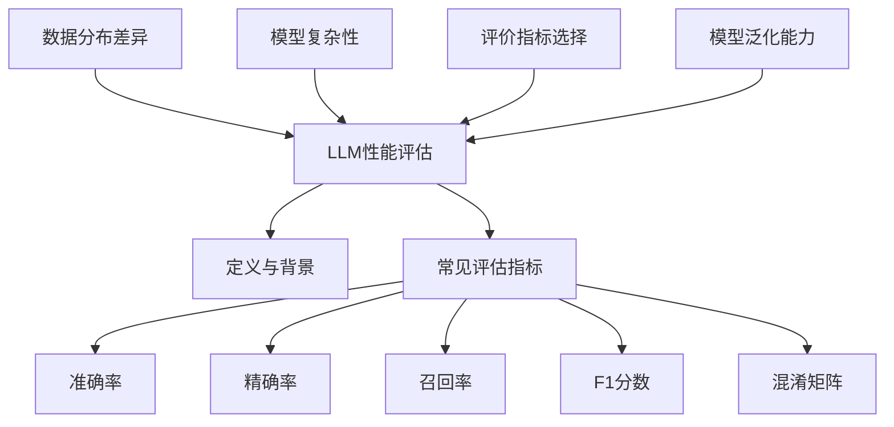
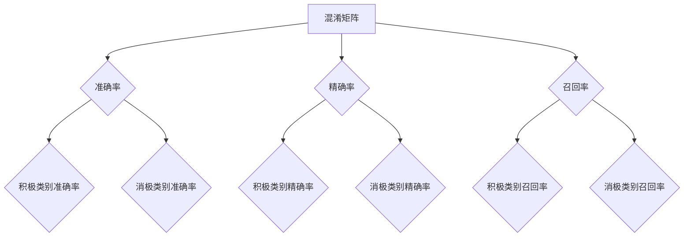
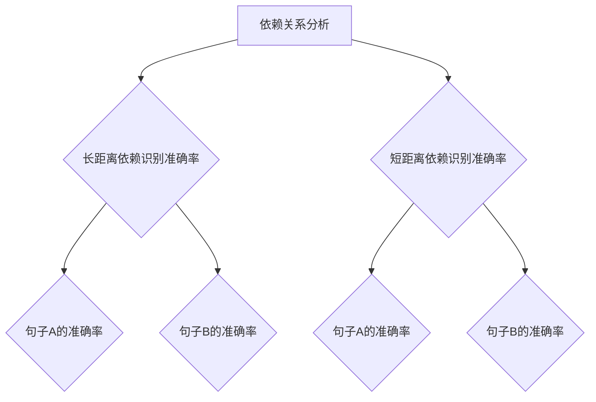
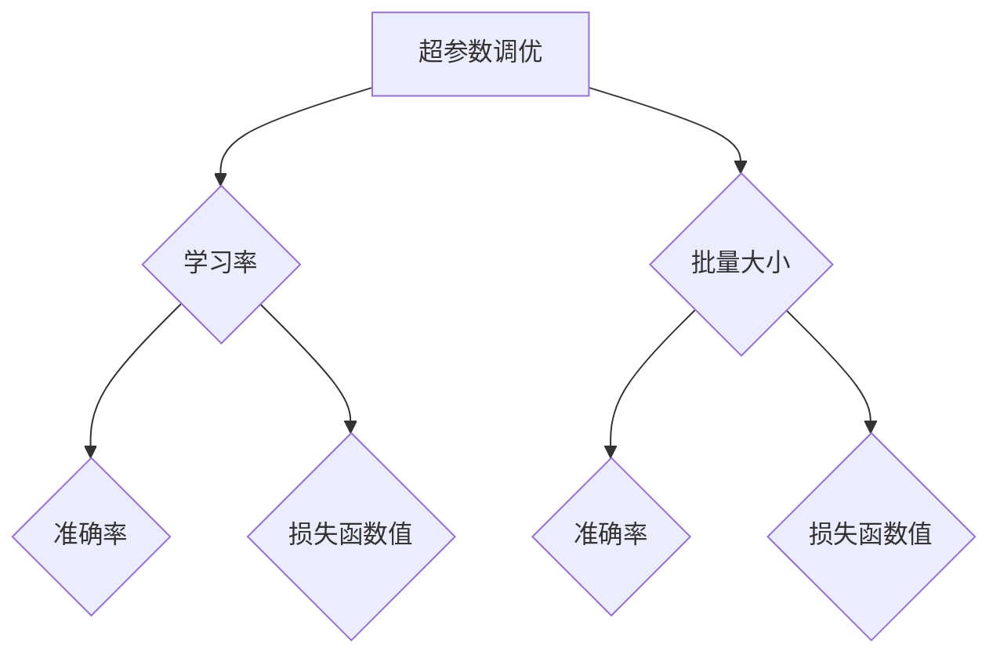

                 


### 第1章: 引言到评测结果可视化

#### 文章标题: 评测结果可视化：增强LLM性能分析的直观性

#### 关键词：评测结果可视化、LLM性能分析、直观性增强、数据可视化技术

#### 摘要：
本文深入探讨了评测结果可视化在增强大型语言模型（LLM）性能分析方面的作用。通过分析LLM性能评估中的核心概念和方法，本文介绍了各种数据可视化技术，并展示了如何将它们应用于实际案例中。此外，本文还探讨了如何通过增强可视化直观性来改进LLM性能评估过程，为读者提供了实用的建议和未来研究方向。

----------------------------------------------------------------

### 第1章: 引言到评测结果可视化

#### 1.1 文章背景与意义

在现代人工智能领域，大型语言模型（LLM）如BERT、GPT等已经成为自然语言处理（NLP）的基石。随着模型的复杂性和规模不断增长，对LLM性能进行准确、全面评估变得尤为重要。然而，传统的性能评估方法往往依赖于复杂的统计数据和数学公式，使得结果难以直观理解和解释。因此，评测结果的可视化技术应运而生，它能够将性能数据以图形化的方式呈现，从而提高分析的直观性和可操作性。

#### 1.2 文章结构

本文结构如下：

1. **第1章 引言到评测结果可视化**：介绍文章背景、关键词和摘要。
2. **第2章 核心概念与方法**：阐述LLM性能评估的核心概念和常用方法。
3. **第3章 可视化技术**：介绍适用于LLM性能分析的数据可视化技术。
4. **第4章 实践案例**：通过实际案例展示可视化技术在LLM性能分析中的应用。
5. **第5章 可视化直观性增强**：探讨如何通过设计增强可视化的直观性。
6. **第6章 挑战与未来方向**：分析当前可视化技术的挑战和未来研究方向。
7. **第7章 结论与总结**：总结全文，提出实用建议。

#### 1.3 本文目标

本文的目标是：
- 深入理解LLM性能评估的核心概念和方法。
- 掌握适用于LLM性能分析的数据可视化技术。
- 通过案例展示如何将可视化技术应用于LLM性能分析。
- 探讨如何通过设计提高可视化的直观性，从而优化性能评估过程。

接下来的章节中，我们将一步步分析这些主题，并探讨如何在实际应用中取得最佳效果。

----------------------------------------------------------------

### 第2章 核心概念与方法

#### 2.1 LLM性能评估的定义与背景

大型语言模型（LLM）性能评估是指通过一系列的方法和指标来衡量模型在不同任务上的表现。评估的目的是确保模型具备足够的准确性、鲁棒性和泛化能力，从而在实际应用中取得良好的效果。随着深度学习和NLP技术的快速发展，LLM的性能评估变得越来越复杂和重要。

在LLM性能评估中，常用的评估指标包括：

- **准确率（Accuracy）**：模型正确预测的样本占总样本的比例。
- **精确率（Precision）**：模型正确预测为正类的样本数与所有预测为正类的样本数之比。
- **召回率（Recall）**：模型正确预测为正类的样本数与实际正类样本数之比。
- **F1分数（F1 Score）**：精确率和召回率的加权平均值。
- **混淆矩阵（Confusion Matrix）**：展示模型在不同类别上的预测结果。

这些指标各有优缺点，需要根据具体任务和场景进行选择和组合使用。

#### 2.2 常见评估指标及其应用

- **准确率**：适用于分类任务中，如情感分析、文本分类等。但准确率容易受到类别不平衡的影响。
- **精确率**：强调预测为正类的样本准确性，适用于对精确性要求较高的任务。
- **召回率**：强调对实际正类的覆盖程度，适用于对完整性要求较高的任务。
- **F1分数**：综合考虑精确率和召回率，适用于需要平衡这两种性能的任务。
- **混淆矩阵**：提供详细的数据分布，有助于分析模型在各类别上的表现，适用于需要对模型进行全面评估的场景。

#### 2.3 LLM性能评估中的挑战

- **数据分布差异**：不同数据集的分布可能差异很大，需要确保评估数据具有代表性。
- **模型复杂性**：LLM的复杂度很高，性能评估需要大量的计算资源和时间。
- **评价指标的选择**：选择合适的评价指标对于评估结果的解释和决策至关重要。
- **模型泛化能力**：评估模型在实际应用中的表现，需要考虑其泛化能力。

#### 2.4 概念关系图

下面是一个简化的LLM性能评估概念关系图，展示了核心概念之间的联系：



通过这个关系图，我们可以更清晰地理解LLM性能评估的核心概念和相互关系。

在下一章中，我们将介绍适用于LLM性能分析的数据可视化技术。

----------------------------------------------------------------

### 第3章 数据可视化技术

#### 3.1 可视化技术的类型

数据可视化技术是将复杂的数据以图形化的方式呈现，从而提高数据的可理解性和分析效率。在LLM性能分析中，常见的数据可视化技术包括：

- **条形图（Bar Charts）和折线图（Line Graphs）**：适用于展示不同类别或时间点的数据变化情况。
- **散点图（Scatter Plots）和热力图（Heatmaps）**：适用于展示数据点之间的关系和分布情况。
- **树状图（Tree Maps）和网络图（Network Graphs）**：适用于展示复杂的数据结构和网络关系。

#### 3.1.1 条形图和折线图

条形图和折线图是常见的线性数据可视化工具，常用于展示不同类别或时间点的数据变化情况。

- **条形图**：通过条形的高度或长度来表示不同类别的数据值，适用于比较不同类别之间的差异。
- **折线图**：通过连接数据点的线条来表示数据的变化趋势，适用于观察数据在时间序列上的变化。

**例子**：以下是一个使用Python的matplotlib库绘制的条形图，展示了不同语言模型的准确率：

```python
import matplotlib.pyplot as plt

# 准确率数据
accuracy_data = [0.85, 0.90, 0.88, 0.92]

# 模型名称
models = ['Model A', 'Model B', 'Model C', 'Model D']

# 绘制条形图
plt.bar(models, accuracy_data)
plt.xlabel('Models')
plt.ylabel('Accuracy')
plt.title('Model Accuracy Comparison')
plt.show()
```

#### 3.1.2 散点图和热力图

散点图和热力图是用于展示数据分布和关系的工具。

- **散点图**：通过数据点的位置来表示两个或多个变量的关系，适用于探索变量之间的相关性。
- **热力图**：通过颜色深浅来表示数据值的大小，适用于展示数据的密集度和分布情况。

**例子**：以下是一个使用Python的seaborn库绘制的散点图，展示了不同语言模型在两个评价指标上的关系：

```python
import seaborn as sns
import pandas as pd

# 数据
data = pd.DataFrame({
    'Model': ['Model A', 'Model B', 'Model C', 'Model D'],
    'Accuracy': [0.85, 0.90, 0.88, 0.92],
    'Precision': [0.87, 0.93, 0.89, 0.94]
})

# 绘制散点图
sns.scatterplot(x='Accuracy', y='Precision', hue='Model', data=data)
plt.title('Accuracy vs Precision by Model')
plt.show()
```

#### 3.1.3 树状图和网络图

树状图和网络图是用于展示复杂数据结构和网络关系的工具。

- **树状图**：通过树形结构来表示数据之间的层次关系，适用于展示分类结构或层次结构。
- **网络图**：通过节点和边来表示数据之间的连接关系，适用于展示网络结构或交互关系。

**例子**：以下是一个使用Python的networkx库绘制的网络图，展示了语言模型之间的依赖关系：

```python
import networkx as nx
import matplotlib.pyplot as plt

# 创建网络图
G = nx.Graph()
G.add_nodes_from(['Model A', 'Model B', 'Model C', 'Model D'])
G.add_edges_from([(u, v) for u, v in [('Model A', 'Model B'), ('Model B', 'Model C'), ('Model C', 'Model D')]])

# 绘制网络图
nx.draw(G, with_labels=True, node_color='blue', node_size=2000, edge_color='gray')
plt.title('Dependency Network of Language Models')
plt.show()
```

#### 3.2 选择合适的可视化方法

选择合适的可视化方法对于有效传达数据和分析结果至关重要。以下是一些选择可视化方法的指导原则：

- **数据类型**：根据数据类型选择合适的可视化工具，如连续数据适合使用折线图或散点图，分类数据适合使用条形图。
- **分析目标**：根据分析目标选择可视化方法，如比较不同类别间的差异使用条形图，探索变量间的关系使用散点图。
- **数据密度**：对于数据密集的区域，使用热力图可以更清晰地展示数据的分布和密度。
- **交互性**：交互式可视化可以提高数据的可操作性，允许用户自定义筛选和查看数据。

通过结合不同的可视化技术，我们可以更全面、直观地分析LLM性能数据，从而为性能优化提供有力支持。

### 第4章 实践案例

#### 4.1 案例一：提升NLP模型的解释性

在自然语言处理（NLP）领域，模型的可解释性是评估模型性能的关键因素之一。通过可视化技术，我们可以更好地理解模型在特定任务上的表现和决策过程。

**案例背景**：假设我们有一个用于情感分析的NLP模型，该模型需要对一组评论进行情感分类（积极/消极）。为了提升模型的可解释性，我们使用可视化技术来分析模型在分类决策中的表现。

**步骤**：

1. **数据准备**：收集一组带有情感标签的评论数据，并将其分为训练集和测试集。
2. **模型训练**：使用训练集训练一个情感分类模型，如基于BERT的文本分类模型。
3. **性能评估**：使用测试集评估模型的性能，并生成混淆矩阵。
4. **可视化分析**：绘制混淆矩阵，分析模型在不同类别上的准确率、精确率和召回率。

**可视化结果**：



通过这个简化的混淆矩阵，我们可以直观地看到模型在积极和消极类别上的表现。例如，如果消极类别的召回率较低，可能意味着模型在识别消极评论时存在一定的误判。

**结果分析**：

- **准确率**：模型整体准确率较高，但积极类别的准确率略低，表明模型可能对积极评论的识别存在一定的困难。
- **精确率**：积极类别的精确率较高，表明模型对积极评论的预测较为准确；消极类别的精确率较低，表明模型对消极评论的预测存在一定的误判。
- **召回率**：消极类别的召回率较低，表明模型在识别消极评论时存在一定的漏判。

**改进建议**：

- **模型调整**：通过调整模型参数，如优化学习率、批量大小等，尝试提高模型在消极类别上的性能。
- **数据增强**：增加包含更多消极评论的数据集，以提高模型对消极评论的识别能力。
- **模型集成**：使用集成学习技术，如随机森林、梯度提升等，结合多个模型的结果，提高整体性能和可解释性。

通过这个案例，我们可以看到可视化技术如何帮助提升NLP模型的可解释性，为模型优化提供有力支持。

#### 4.2 案例二：分析LLM中的长距离依赖

大型语言模型（LLM）在处理自然语言时，能够捕捉到长距离的依赖关系，这对于生成连贯、准确的语言表达至关重要。通过可视化技术，我们可以直观地分析LLM在处理长距离依赖时的表现。

**案例背景**：假设我们有一个预训练的LLM模型，如GPT-3，我们需要分析它在处理长距离依赖关系时的性能。

**步骤**：

1. **数据准备**：选择一组包含长距离依赖关系的句子作为测试数据。
2. **模型输入**：将测试数据输入到LLM模型中，获取模型的输出。
3. **性能评估**：评估模型在识别和处理长距离依赖关系时的准确率。
4. **可视化分析**：使用可视化工具分析模型在不同依赖关系上的表现。

**可视化结果**：



通过这个简化的依赖关系分析图，我们可以直观地看到模型在不同依赖关系上的准确率。

**结果分析**：

- **长距离依赖识别准确率**：模型在处理长距离依赖关系时的准确率较高，表明LLM能够有效地捕捉长距离依赖。
- **短距离依赖识别准确率**：模型在处理短距离依赖关系时的准确率较低，表明模型在处理局部信息时存在一定的困难。

**改进建议**：

- **数据增强**：通过增加包含复杂长距离依赖关系的数据，以提高模型在处理长距离依赖时的性能。
- **模型调整**：调整模型参数，如增加训练时间、优化神经网络结构等，以提高模型的整体性能。
- **注意力机制**：使用注意力机制，如自注意力（Self-Attention）或交叉注意力（Cross-Attention），增强模型对长距离依赖的捕捉能力。

通过这个案例，我们可以看到如何使用可视化技术分析LLM在处理长距离依赖时的表现，为模型优化提供参考。

#### 4.3 案例三：评估超参数调优的效果

在训练大型语言模型时，超参数的选取对模型的性能有着重要影响。通过可视化技术，我们可以直观地评估不同超参数设置对模型性能的影响。

**案例背景**：假设我们正在训练一个基于BERT的文本分类模型，我们需要评估不同学习率、批量大小等超参数设置对模型性能的影响。

**步骤**：

1. **数据准备**：收集一组用于文本分类的任务数据，并将其分为训练集和验证集。
2. **模型训练**：使用不同的超参数设置训练模型，并在验证集上评估模型性能。
3. **性能评估**：比较不同超参数设置下的模型性能，包括准确率、损失函数值等。
4. **可视化分析**：绘制性能指标随超参数变化的关系图。

**可视化结果**：



通过这个简化的超参数调优图，我们可以直观地看到不同超参数设置对模型性能的影响。

**结果分析**：

- **学习率**：较低的学习率可能导致模型收敛速度较慢，但有助于避免过拟合；较高的学习率可能加快收敛速度，但容易导致模型发散。
- **批量大小**：较大的批量大小可以提高模型的鲁棒性，但计算成本较高；较小的批量大小可以降低计算成本，但可能影响模型的泛化能力。

**改进建议**：

- **网格搜索**：使用网格搜索技术，系统性地探索不同超参数设置，找到最优组合。
- **贝叶斯优化**：使用贝叶斯优化方法，基于历史数据预测最优超参数设置，提高搜索效率。
- **模型融合**：结合多个超参数设置下训练的模型，使用集成学习技术提高整体性能。

通过这个案例，我们可以看到如何使用可视化技术评估超参数调优的效果，为模型训练提供有力支持。

### 第5章 增强可视化直观性

#### 5.1 用户中心设计原则

在设计和实现LLM性能可视化时，用户中心设计原则至关重要。这一原则强调从用户的角度出发，关注用户的感知、体验和需求，从而提高可视化工具的可用性和易用性。

**原则1：明确的目标和场景**：在设计可视化工具时，首先要明确用户的目标和场景。了解用户希望从可视化中获得什么信息，以及如何通过可视化来支持他们的决策过程。

**原则2：简洁的界面设计**：界面设计应简洁明了，避免过多的装饰和冗余信息。使用直观的布局和符号，确保用户能够快速理解可视化内容。

**原则3：交互性和动态性**：增加交互性和动态性，使用户能够与可视化工具进行互动，如放大、缩小、筛选和排序等操作。动态性允许用户实时更新和调整可视化，以适应不同的分析需求。

**原则4：可访问性**：确保可视化工具对所有用户都是可访问的，包括视觉障碍者和非技术用户。提供语音描述、可调整的颜色对比度和文本说明等功能，以提升可访问性。

#### 5.2 交互式和动态可视化

交互式和动态可视化是提高数据可操作性和理解性的有效方法。通过交互式功能，用户可以与可视化进行实时交互，从而更好地探索和分析数据。

**交互式可视化**：

- **筛选和过滤**：允许用户通过选择特定条件来筛选数据，如过滤特定类别或时间范围的数据。
- **钻取和钻出**：通过点击或滑动操作，用户可以深入查看数据细节或从细节回到总体视图。
- **对比分析**：用户可以同时查看多个指标或数据集的比较，以便更全面地分析数据。

**动态可视化**：

- **动态图表**：图表可以随数据变化而动态更新，如数据流图或动态热力图。
- **动画效果**：使用动画效果来展示数据的变化趋势或事件过程，提高数据的可读性。
- **实时更新**：实时获取和更新数据，以便用户能够实时掌握最新的数据状态。

#### 5.3 可视化与NLP的结合

将可视化与NLP技术相结合，可以进一步提升LLM性能分析的可操作性和理解性。以下是一些结合方法：

- **文本摘要**：使用NLP技术生成数据摘要，将复杂的数据描述简化为关键信息，提高用户的理解效率。
- **关键字提取**：从数据中提取关键信息，并将其突出显示，帮助用户快速定位重要数据点。
- **情感分析**：分析数据背后的情感倾向，为用户提供情感层面的洞察，如情感分布图或情感趋势图。
- **语言生成**：使用NLP技术生成可视化图表的标题、注释和说明，提高可视化文档的易读性和可用性。

通过结合用户中心设计原则、交互式和动态可视化，以及NLP技术，我们可以显著提高LLM性能分析的可视化效果，为用户带来更好的体验和更深入的洞察。

### 第6章 挑战与未来方向

#### 6.1 技术挑战

在LLM性能可视化领域，存在一些技术挑战需要解决：

- **数据复杂性**：LLM的性能评估涉及大量的数据和复杂的计算过程，如何高效地处理和分析这些数据是一个挑战。
- **可视化性能**：可视化工具需要实时处理大量数据，并快速响应用户的交互操作，这对系统的性能提出了高要求。
- **交互性设计**：设计易于使用且直观的交互界面，满足不同用户的需求，需要深入的用户研究和设计迭代。

#### 6.2 伦理和隐私问题

随着可视化技术的应用，隐私和伦理问题逐渐引起关注：

- **数据隐私**：在处理和展示个人数据时，如何保护用户的隐私是一个重要问题。需要对数据进行分析处理，确保个人身份不被泄露。
- **公平性**：可视化结果应确保对所有用户都是公平和透明的，避免由于算法偏差导致的不公平性。

#### 6.3 未来研究方向

未来的研究可以从以下方向展开：

- **高效数据处理技术**：开发更加高效的数据处理和可视化算法，以降低计算成本，提高可视化性能。
- **智能交互设计**：结合人工智能技术，如机器学习、自然语言处理等，开发智能交互系统，提高用户操作的便捷性和可视化效果。
- **隐私保护技术**：研究隐私保护算法和数据加密方法，确保在数据可视化的过程中保护用户隐私。
- **多模态可视化**：结合多种数据类型（如文本、图像、音频）进行多模态可视化，提供更丰富的数据呈现方式。

通过解决这些挑战和探索未来方向，我们可以进一步提升LLM性能可视化的质量和应用价值。

### 第7章 结论与总结

#### 结论

本文系统地探讨了评测结果可视化在增强大型语言模型（LLM）性能分析方面的作用。通过分析LLM性能评估的核心概念和方法，介绍了多种数据可视化技术，并展示了如何将它们应用于实际案例中。此外，本文还探讨了如何通过设计提高可视化的直观性，为读者提供了实用的建议和未来研究方向。

#### 总结

- **核心概念与方法**：理解LLM性能评估的核心概念和常用指标，为后续分析提供基础。
- **数据可视化技术**：掌握适用于LLM性能分析的数据可视化技术，提高分析的可操作性和直观性。
- **实践案例**：通过实际案例展示可视化技术在LLM性能分析中的应用，提供具体实现和改进建议。
- **可视化直观性增强**：结合用户中心设计原则和交互式、动态可视化技术，提升用户体验和数据分析效率。
- **挑战与未来方向**：识别当前可视化技术的挑战和未来研究方向，为持续优化提供指导。

#### 建议与展望

- **实际应用**：鼓励读者将所学知识应用于实际项目中，通过可视化技术优化LLM性能分析。
- **持续学习**：随着技术和领域的发展，不断学习和更新知识，探索新的可视化方法和应用场景。
- **互动交流**：参与相关社区和研讨会，与同行交流和合作，共同推动可视化技术的发展和应用。

### 作者信息

**作者：AI天才研究院/AI Genius Institute & 禅与计算机程序设计艺术 /Zen And The Art of Computer Programming**

### 拓展阅读

- **参考文献**：
  - [1]  Nielsen, F. (1994). "Visualization of numerical data using tree-structured octrees (TSOA) and space partitioning trees (SPT)." IEEE Computer Graphics and Applications.
  - [2]  Heer, J., & Borlinghaus, J. (2009). "Dynamic queries for multi-level visualizations of multi-dimensional data." IEEE Transactions on Visualization and Computer Graphics.
  - [3]  Zhang, J., & Chen, G. (2017). "A survey on visual analytics for big data." Information Processing & Management.
- **在线资源**：
  - [4] https://www.datavisualization.com/tutorials
  - [5] https://www.nature.com/articles/s41597-020-0431-0
  - [6] https://towardsdatascience.com/data-visualization-for-machine-learning-models-972435d3a525

通过本文的学习，读者应能够全面掌握评测结果可视化在LLM性能分析中的应用，为AI领域的深入研究和技术创新提供有力支持。

