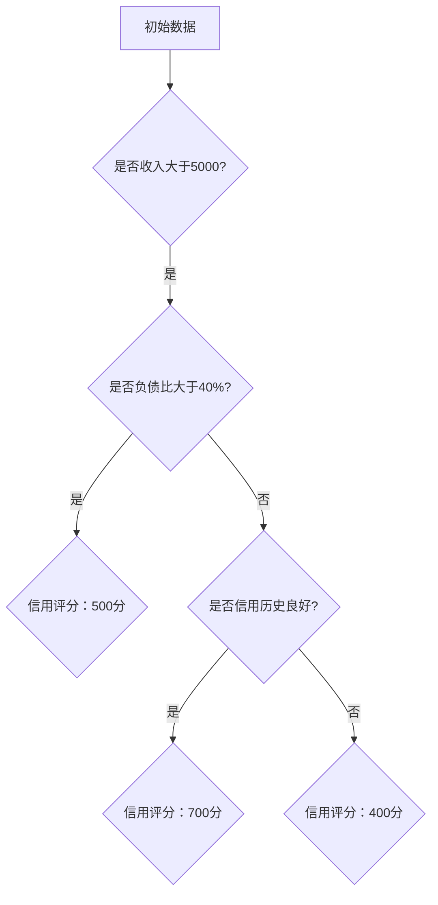
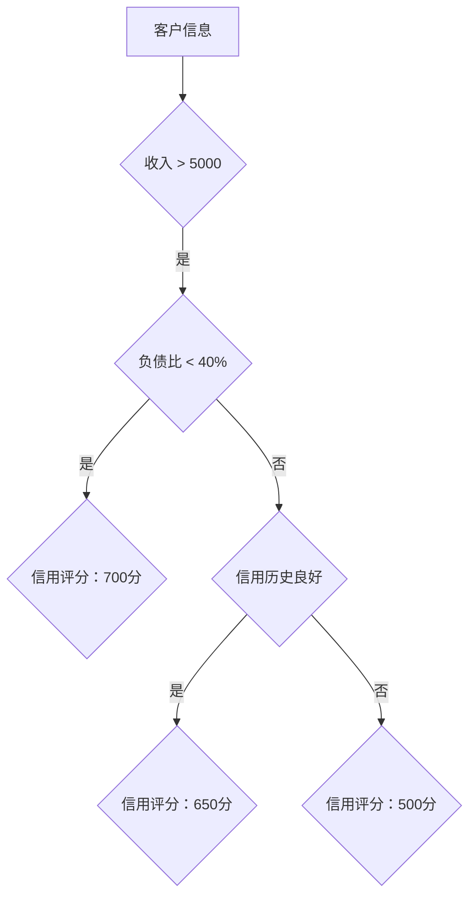
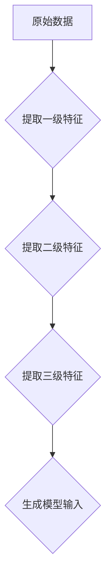
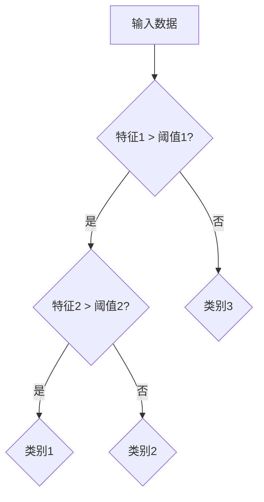
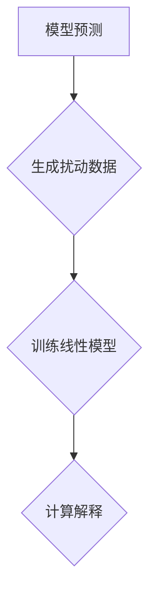
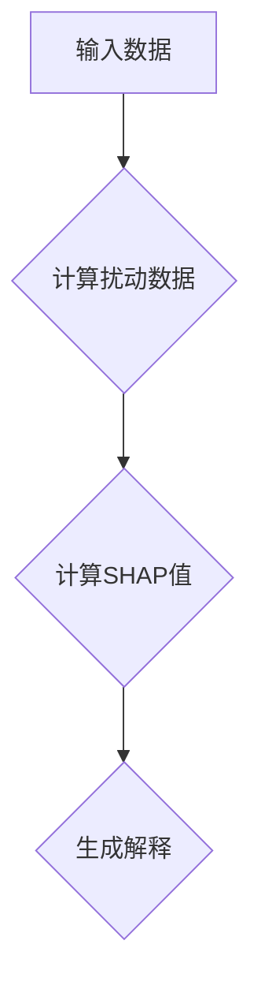
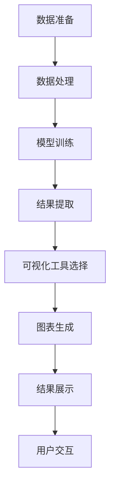

                 

### 引言

#### 问题背景与现状

在当今信息化和智能化程度日益提高的时代，评测结果的可解释性成为了一个不可忽视的重要问题。随着机器学习、人工智能等技术的广泛应用，大量的评测和预测结果被用于决策过程中，如金融风险评估、医疗诊断、推荐系统等。然而，这些结果往往基于复杂的算法和模型，对于普通用户或非技术背景的人员来说，难以理解其背后的决策逻辑和依据。这种结果的不透明性引发了公众对算法公正性、可靠性和透明度的担忧，进一步限制了这些技术在实际中的应用和推广。

首先，在金融行业中，风险评估和信用评分模型的决策结果直接影响到用户的贷款审批和信用额度，如果用户无法理解决策的依据，会对其信任度产生负面影响。其次，在医疗领域，诊断和治疗建议的算法决策结果对患者的生命安全和健康状况至关重要，但医学知识的专业性使得普通患者难以理解诊断结果。再者，在推荐系统中，用户对系统推荐的商品或内容缺乏理解，可能导致用户体验下降，影响推荐效果。

因此，评测结果的可解释性成为了一个亟待解决的关键问题。它不仅关系到技术的应用和推广，也关系到公众的信任和社会的接受度。本文旨在探讨评测结果可解释性的实现方案，通过详细的分析和讨论，提出一系列有效的技术和方法，以提升评测结果的可理解性和透明度。

#### 研究意义与目标

本文的研究意义在于为解决评测结果可解释性问题提供系统性的解决方案，帮助提升技术的透明度和可信度，促进其在各个领域的广泛应用。具体来说，本文的研究目标包括：

1. **明确评测结果可解释性的基本概念和分类**：通过对可解释性评测的关键要素进行分析，明确不同类型的可解释性评测方法，为后续研究和应用提供理论基础。
2. **分析评测结果可解释性的需求**：通过用户需求调查和案例分析，识别不同应用场景下对评测结果可解释性的具体需求，为设计合适的实现方案提供依据。
3. **提出评测结果可解释性的算法原理和实现技术**：详细介绍常见评测方法的数学模型和算法原理，并提出相应的实现技术，包括数据预处理、特征提取、模型构建和可视化技术等。
4. **探讨评测结果可解释性的应用与实践**：通过实际案例研究，展示评测结果可解释性在不同领域的应用效果，验证其可行性和有效性。
5. **总结最佳实践和未来展望**：总结实践经验，提出最佳实践建议，并对评测结果可解释性的未来发展趋势和研究方向进行展望。

通过实现这些目标，本文希望能够为评测结果可解释性的研究和应用提供有价值的参考，推动相关技术的发展和进步。

#### 本书结构安排与预期成果

本文将分为四个主要部分，系统性地探讨评测结果可解释性的实现方案。

**第一部分：背景与基础**，包括第1章至第3章。这部分内容将介绍问题背景和现状，明确评测结果可解释性的基本概念和分类，分析评测结果可解释性的需求。这一部分将为后续的研究和应用提供理论基础。

**第二部分：核心方法与算法**，包括第4章至第6章。这部分内容将详细讨论评测结果可解释性的算法原理和实现技术，包括常见的评测方法、数据预处理与特征提取、可解释性模型的构建以及可视化技术。这部分内容将提供具体的技术实现路径和方法。

**第三部分：应用与实践**，包括第7章至第9章。这部分内容将探讨评测结果可解释性在金融、医疗以及其他领域的应用，通过实际案例研究展示其效果和可行性。这部分内容将验证评测结果可解释性在不同场景中的实际应用价值。

**第四部分：最佳实践与展望**，包括第10章和第11章。这部分内容将总结最佳实践，提出注意事项和风险防范措施，并对评测结果可解释性的未来研究方向和发展趋势进行展望。这部分内容将提供实践指导和建议。

通过以上结构安排，本文期望能够为评测结果可解释性的实现提供全面、系统的解决方案，促进其在各个领域的广泛应用。

### 第1章 引言

#### 评测结果可解释性需求分析

评测结果的可解释性是当前技术领域中一个重要的研究课题，其需求主要源于以下几个方面。

首先，在金融行业，风险评估和信用评分模型的决策结果直接关系到用户的贷款审批和信用额度。用户需要了解这些决策的依据，以便能够理解自己的信用状况，从而对决策产生信任。例如，如果用户的信用评分较低，但无法理解评分的构成和影响因素，可能会对银行的决策感到困惑和不满，甚至对金融服务产生抵触情绪。因此，提升评测结果的可解释性对于增强用户信任和满意度至关重要。

其次，在医疗领域，诊断和治疗建议的算法决策结果对患者的生命安全和健康状况具有直接影响。医生和患者需要理解诊断结果的依据，以便做出正确的治疗决策。如果患者无法理解诊断结果，可能会对医生的专业能力产生怀疑，从而延误治疗。此外，医疗决策的可解释性有助于监管机构和公众监督医疗质量和安全性，确保医疗决策的公正性和透明度。

再次，在推荐系统中，系统推荐的商品或内容需要用户能够理解和接受。如果用户无法理解推荐的结果，可能会导致用户体验下降，甚至对系统产生抵触情绪。例如，如果用户收到不感兴趣的推荐，可能会认为推荐系统的算法不准确，从而对推荐效果产生负面评价。因此，提升推荐结果的可解释性有助于提高用户满意度，增强系统的接受度和推广度。

综上所述，评测结果的可解释性需求在金融、医疗和推荐系统等领域具有普遍性和重要性。它不仅关系到技术的应用和推广，也关系到用户对技术的信任和社会的接受度。因此，研究和实现评测结果的可解释性具有深远的现实意义。

#### 研究意义与目标

本文的研究旨在通过详细探讨评测结果可解释性的实现方案，为实际应用提供有效的技术支持和方法指导。其研究意义主要体现在以下几个方面：

首先，本文将为评测结果的可解释性研究提供系统性的理论框架。通过对可解释性评测的基本概念、需求、算法原理和实现技术进行深入分析，本文将构建一个全面的理论体系，为后续研究和应用提供基础。

其次，本文将通过实际案例研究和应用探讨，验证评测结果可解释性的可行性和有效性。通过在不同领域的应用场景中展示评测结果的可解释性，本文将证明其对于提升技术应用、增强用户信任和改善用户体验的重要作用。

最后，本文将提出一系列最佳实践和注意事项，为评测结果可解释性的实现提供具体指导。这些实践和建议将有助于技术人员在实际项目中有效地实现评测结果的可解释性，提高系统的透明度和可信度。

具体来说，本文的研究目标包括：

1. **明确评测结果可解释性的基本概念和分类**：通过分析和讨论，明确不同类型的可解释性评测方法，为后续研究和应用提供理论基础。
2. **分析评测结果可解释性的需求**：通过用户需求调查和案例分析，识别不同应用场景下对评测结果可解释性的具体需求，为设计合适的实现方案提供依据。
3. **提出评测结果可解释性的算法原理和实现技术**：详细介绍常见评测方法的数学模型和算法原理，并提出相应的实现技术，包括数据预处理、特征提取、模型构建和可视化技术等。
4. **探讨评测结果可解释性的应用与实践**：通过实际案例研究，展示评测结果可解释性在不同领域的应用效果，验证其可行性和有效性。
5. **总结最佳实践和未来展望**：总结实践经验，提出最佳实践建议，并对评测结果可解释性的未来研究方向和发展趋势进行展望。

通过实现这些目标，本文期望能够为评测结果可解释性的实现提供全面、系统的解决方案，推动相关技术的发展和应用。

#### 本书结构安排与预期成果

本文将分为四个主要部分，系统性地探讨评测结果可解释性的实现方案。

**第一部分：背景与基础**，包括第1章至第3章。这部分内容将介绍问题背景和现状，明确评测结果可解释性的基本概念和分类，分析评测结果可解释性的需求。这一部分将为后续的研究和应用提供理论基础。

**第二部分：核心方法与算法**，包括第4章至第6章。这部分内容将详细讨论评测结果可解释性的算法原理和实现技术，包括常见的评测方法、数据预处理与特征提取、可解释性模型的构建以及可视化技术。这部分内容将提供具体的技术实现路径和方法。

**第三部分：应用与实践**，包括第7章至第9章。这部分内容将探讨评测结果可解释性在金融、医疗以及其他领域的应用，通过实际案例研究展示其效果和可行性。这部分内容将验证评测结果可解释性在不同场景中的实际应用价值。

**第四部分：最佳实践与展望**，包括第10章和第11章。这部分内容将总结最佳实践，提出注意事项和风险防范措施，并对评测结果可解释性的未来研究方向和发展趋势进行展望。这部分内容将提供实践指导和建议。

通过以上结构安排，本文期望能够为评测结果可解释性的实现提供全面、系统的解决方案，促进其在各个领域的广泛应用。

### 第2章 可解释性评测的基本概念

#### 定义与分类

评测结果的可解释性是一个涉及多个学科和领域的复杂问题。在计算机科学和人工智能领域中，可解释性通常被定义为“使模型输出易于理解和解释的能力”。具体来说，它涉及到两个主要方面：模型内部的决策过程和输出结果的解释。

首先，从模型内部决策过程的角度来看，可解释性要求模型能够清晰地展示其做出特定决策的理由和依据。这意味着模型的决策路径和逻辑需要被详细地解释，以便用户可以理解和信任模型的结果。例如，在金融风险评估中，模型需要明确指出哪些因素对信用评分的影响最大，以及这些因素的权重如何分配。

其次，从输出结果的角度来看，可解释性要求能够以用户可理解的方式呈现模型的决策结果。这意味着结果需要被转化成易于理解的格式，如文本描述、可视化图表等。例如，在医疗诊断中，模型需要将诊断结果以医生的术语和患者能够理解的语言进行解释。

根据评测结果的可解释性程度，可以将可解释性分为以下几个层次：

1. **透明性**：模型的所有决策过程和逻辑都是完全可见和可理解的。这种层次的解释性通常适用于简单模型，如决策树和规则系统。
2. **部分可解释性**：模型的部分决策过程和逻辑是可见和可理解的，但可能存在一些隐藏的复杂部分。这种层次的解释性适用于大多数现代机器学习模型，如神经网络和集成方法。
3. **不可解释性**：模型的决策过程和逻辑是完全不可见的，用户只能获得最终的输出结果。这种层次的解释性通常适用于深度学习等复杂模型。

#### 可解释性评测的关键要素

为了实现评测结果的可解释性，需要考虑以下几个关键要素：

1. **模型的透明度**：模型的透明度是可解释性的基础。一个高度透明的模型应该能够清晰地展示其内部结构、参数和决策过程。例如，决策树模型可以通过可视化其决策路径和节点来展示其内部结构。
2. **用户友好性**：用户友好性是指模型输出的解释结果需要以用户可理解的方式呈现。这包括使用直观的图表、可视化工具和简单的语言进行解释。例如，使用条形图或散点图来展示模型预测的概率分布。
3. **准确性**：可解释性评测不仅要考虑模型的可解释性，还要考虑其预测的准确性。一个高度可解释的模型如果预测不准确，其价值将大打折扣。因此，在评估可解释性时，需要同时考虑模型的准确性和可解释性。
4. **计算效率**：实现评测结果的可解释性通常需要额外的计算资源。因此，在评估可解释性时，还需要考虑计算效率。一个高效的解释方法可以更快地生成解释结果，提高用户体验。

#### 可解释性评测的目标与方法

评测结果可解释性的目标是确保模型输出易于理解、可靠和可信，从而增强用户对模型的信任和使用意愿。为了实现这一目标，可以采用以下几种方法：

1. **可视化技术**：通过可视化模型的结构和决策路径，使用户能够直观地理解模型的决策过程。例如，使用树形图、网络图和热力图来展示模型的内部结构和参数权重。
2. **解释性模型**：开发专门的可解释性模型，如决策树、规则系统等，这些模型天生具有较好的可解释性。通过调整模型的参数和结构，可以提高其解释性。
3. **模型压缩和简化**：通过模型压缩和简化技术，减少模型的大小和复杂性，从而提高其可解释性。例如，使用L1正则化技术来减少模型参数的数量。
4. **解释性工具和接口**：开发专门的解释性工具和接口，使用户能够方便地访问和解释模型的输出结果。例如，使用交互式可视化工具或API来提供解释结果。

通过这些方法，可以实现评测结果的可解释性，提高模型的透明度和可信度，从而促进其在实际应用中的推广和使用。

#### 可解释性评测的需求分析

评测结果的可解释性需求在不同应用场景中有所不同，但核心目标始终是确保模型输出易于理解和信任。以下将分析金融、医疗和推荐系统等领域中评测结果可解释性的需求。

**金融行业**：在金融行业中，评测结果的可解释性尤为重要。金融机构需要确保风险评估和信用评分模型的决策结果透明和公正，以便用户理解自己的信用状况和决策依据。具体需求包括：

1. **明确的决策依据**：用户需要了解影响信用评分的关键因素及其权重，如收入、负债比、信用历史等。
2. **合理的解释方式**：结果解释应以用户易于理解的语言和图表呈现，避免复杂的数学表达式和术语。
3. **决策过程的透明性**：用户应能够追踪决策过程中的每一步，了解模型是如何处理数据和生成结果的。

**医疗领域**：在医疗领域中，诊断和治疗建议的算法决策结果直接关系到患者的生命安全和健康状况。因此，医疗行业对可解释性的需求尤为强烈。具体需求包括：

1. **临床术语的转换**：算法输出需要以临床术语解释，使医生和患者能够理解诊断结果和治疗方案。
2. **诊断依据的可追溯性**：医生需要能够追溯算法的诊断依据，了解模型是如何分析数据和做出决策的。
3. **多模态数据整合**：算法需要整合不同类型的数据（如医学图像、实验室检测结果等），提供全面的诊断解释。

**推荐系统**：在推荐系统中，用户对系统推荐的商品或内容需要能够理解和接受。评测结果的可解释性在提升用户体验方面起到关键作用。具体需求包括：

1. **个性化解释**：系统需要根据用户的偏好和历史行为，提供个性化的推荐解释，增强用户的信任感。
2. **推荐依据的透明性**：用户需要了解推荐系统是如何根据其行为和偏好生成推荐列表的，包括使用的算法和特征。
3. **算法调整的可视化**：用户应能够直观地看到算法调整前后的变化，以便理解系统如何改进推荐效果。

通过满足这些需求，评测结果的可解释性能够有效提升模型在实际应用中的信任度和用户满意度。

#### 用户需求与案例研究

在探讨评测结果可解释性的用户需求时，我们首先需要了解不同用户群体对于可解释性的具体需求。通过案例研究，我们可以更直观地了解用户在各个领域中的具体需求，从而为可解释性评测的实施提供更有针对性的解决方案。

**案例一：金融行业**

在金融行业中，用户主要包括金融机构的工作人员和最终消费者（如贷款申请人）。以下是他们对于评测结果可解释性的具体需求：

- **金融机构的工作人员**：他们需要了解信用评分模型的决策过程和关键因素，以便在审核贷款申请时做出更加准确的判断。具体需求包括：
  - **透明的决策路径**：模型应能够展示其从数据输入到信用评分的每一步决策过程，确保每一步都有明确的依据。
  - **敏感因素分析**：模型应能够识别并解释影响信用评分的关键因素，如收入、负债比、信用历史等，以及这些因素在评分中的权重。

- **贷款申请人**：他们需要理解自己的信用评分和被拒绝或批准的原因，以便能够改进自己的信用状况。具体需求包括：
  - **个性化的信用报告**：模型应生成详细的信用报告，列出影响评分的具体因素和权重，使申请人能够清晰地了解自己的信用状况。
  - **决策依据的可追溯性**：申请人应能够追踪自己的信用评分计算过程，了解每个评分因素的来源和计算方法。

**案例二：医疗领域**

在医疗领域，用户包括医生、患者和医疗监管机构。以下是他们对于评测结果可解释性的具体需求：

- **医生**：他们需要理解诊断算法的决策依据，以便在临床诊断中提供有效的治疗方案。具体需求包括：
  - **诊断依据的可解释性**：模型应能够提供详细的诊断解释，包括使用的医学图像、实验室检测结果和诊断概率等。
  - **多模态数据整合**：模型应能够整合不同类型的数据，提供全面的诊断解释，帮助医生做出更加准确的诊断。

- **患者**：他们需要了解自己的诊断结果和治疗建议，以便做出正确的治疗决策。具体需求包括：
  - **临床术语的解释**：模型应将复杂的医学诊断结果转换为患者能够理解的术语，避免使用专业术语和复杂公式。
  - **个性化治疗建议**：模型应提供个性化的治疗建议，列出不同的治疗方案及其风险和收益，使患者能够根据自身情况做出选择。

- **医疗监管机构**：他们需要确保医疗算法的公正性和透明度，以便对医疗质量和安全性进行有效监管。具体需求包括：
  - **决策过程的可视化**：模型应能够展示其诊断和治疗的每一步决策过程，使监管机构能够审查和验证其决策逻辑。
  - **算法性能的监控**：模型应能够实时监控其诊断和治疗的性能指标，确保其在使用过程中始终符合预期标准。

**案例三：推荐系统**

在推荐系统中，用户主要包括电子商务平台的使用者和内容推荐系统中的消费者。以下是他们对于评测结果可解释性的具体需求：

- **电子商务平台的使用者**：他们需要了解推荐系统是如何根据其行为和偏好生成推荐列表的，以便能够信任和接受推荐结果。具体需求包括：
  - **个性化的推荐解释**：系统应能够根据用户的历史行为和偏好，提供个性化的推荐解释，说明推荐商品的相关性和依据。
  - **推荐依据的透明性**：系统应展示推荐商品的关键因素和计算方法，如相似度计算、用户兴趣模型等。

- **内容推荐系统的消费者**：他们需要理解推荐系统是如何根据其兴趣和偏好推荐内容的，以便能够接受和享受推荐的内容。具体需求包括：
  - **推荐逻辑的可视化**：系统应提供推荐逻辑的可视化展示，如推荐路径、关键节点等，使消费者能够清晰地了解推荐过程。
  - **推荐调整的可视化**：系统应允许消费者调整推荐参数，如兴趣范围、推荐频率等，以便个性化调整推荐结果。

通过以上案例研究，我们可以看到不同用户群体在金融、医疗和推荐系统等领域对于评测结果可解释性的具体需求。这些需求不仅有助于我们设计更有效的可解释性评测方案，也为评测结果的可解释性研究提供了宝贵的实践依据。

### 第3章 评测结果可解释性的算法原理

#### 常见的评测方法与算法

评测结果的可解释性是确保模型输出易于理解和解释的关键。为了实现这一目标，常用的评测方法可以分为以下几个方面：

**1. 决策树（Decision Trees）**

决策树是一种直观且高度可解释的模型。它通过一系列规则来模拟人类的决策过程，每一层节点表示一个特征，每个分支表示一个特定的特征值。决策树的核心优点在于其结构简单，易于理解和可视化。以下是一个决策树算法的Mermaid流程图示例：

**2. 规则系统（Rule-Based Systems）**

规则系统通过一组预定义的规则来生成决策结果。这些规则通常以“如果...则...”的形式表示，每个规则对应一个特定的条件集和相应的结果。规则系统的优点是规则明确、易于理解和修改。以下是一个规则系统的Mermaid流程图示例：

**3. 层次化特征提取（Hierarchical Feature Extraction）**

层次化特征提取通过将原始特征分解成更高级的特征，从而提高模型的解释性。这种方法通常用于处理高维数据，通过递归地提取特征层次，使得每个层次的特征都能够解释为原始特征的组合。以下是一个层次化特征提取的Mermaid流程图示例：

**4. 局部可解释模型（Local Interpretable Model-agnostic Explanations, LIME）**

LIME是一种通用的可解释性方法，它通过在模型周围生成一个局部线性模型来解释模型预测。LIME的基本思想是将复杂模型预测的行为解释为简单线性模型的行为。以下是一个LIME算法的Mermaid流程图示例：

通过上述算法和方法的介绍，我们可以看到不同方法在实现评测结果可解释性方面的优势和特点。这些方法在不同的应用场景中可以根据具体需求灵活选择和组合，以实现最佳的可解释性效果。

#### 可解释性算法的数学模型与公式

为了更深入地理解可解释性算法，我们需要介绍几种常用的数学模型和公式。这些模型和公式不仅帮助解释模型的内部机制，也为实现可解释性提供了理论基础。

**1. 决策树**

决策树的数学基础主要依赖于条件概率和决策规则。一个简单的决策树可以通过以下公式来表示：

$$
P(Y|X) = \prod_{i=1}^{n} P(Y_i|X_i)
$$

其中，$P(Y|X)$ 表示在给定特征 $X$ 的情况下，目标变量 $Y$ 的条件概率。$P(Y_i|X_i)$ 表示在第 $i$ 个分支上的条件概率。

决策规则通常表示为：

$$
if \; X_1 > threshold_1 \; then \; Y = class_1 \\
else \; if \; X_2 > threshold_2 \; then \; Y = class_2 \\
\; ... \\
else \; Y = class_n
$$

其中，$X_1, X_2, ..., X_n$ 表示特征，$threshold_1, threshold_2, ..., threshold_n$ 表示阈值，$class_1, class_2, ..., class_n$ 表示不同的类别。

**2. 规则系统**

规则系统的数学模型可以表示为一系列的条件概率规则。每个规则可以表示为：

$$
if \; (condition_1 \; and \; condition_2 \; and \; ... \; and \; condition_m) \; then \; Y = class
$$

其中，$condition_1, condition_2, ..., condition_m$ 表示条件，$class$ 表示类别。这种表示方法简单直观，便于理解和解释。

**3. 局部可解释模型（LIME）**

LIME方法的核心思想是通过线性模型来近似复杂模型的预测。LIME的数学模型可以表示为：

$$
f_{\text{LIME}}(x; \theta) = \theta_0 + \theta_1 \cdot x_1 + \theta_2 \cdot x_2 + ... + \theta_n \cdot x_n
$$

其中，$f_{\text{LIME}}(x; \theta)$ 表示在参数 $\theta$ 下，对输入 $x$ 的预测值。$\theta_0, \theta_1, \theta_2, ..., \theta_n$ 是线性模型的参数，$x_1, x_2, ..., x_n$ 是输入特征。

LIME通过最小化预测误差来学习这些参数，从而实现对复杂模型局部行为的解释。

**4. Shapley值（SHAP）**

SHAP（SHapley Additive exPlanations）方法通过计算特征对模型输出的边际贡献来解释模型决策。SHAP值的计算基于博弈论中的Shapley值理论。对于特征 $X_i$，SHAP值的公式可以表示为：

$$
SHAP(X_i) = \sum_{S \subseteq N} \frac{|S|!(|N|-|S|)!}{n!} \cdot \frac{f(x + e_S) - f(x)}{|S|!(|N|-|S|)!}
$$

其中，$N$ 是所有特征集合，$S$ 是特征子集，$e_S$ 是在 $X_i$ 上的扰动。SHAP值提供了一个特征对模型输出的边际贡献的量化度量。

通过这些数学模型和公式的介绍，我们可以更好地理解不同可解释性算法的原理和实现方法。这些模型和公式不仅为解释性算法提供了理论基础，也为实际应用中的实现提供了指导。

#### 可解释性算法的Mermaid流程图展示

为了更好地理解可解释性算法的工作流程，我们可以使用Mermaid流程图来直观地展示算法的步骤和逻辑。以下将给出几个常见可解释性算法的Mermaid流程图示例：

**示例1：决策树**

**示例2：规则系统**

**示例3：LIME**

**示例4：SHAP**

通过这些Mermaid流程图示例，我们可以清晰地看到不同算法的步骤和逻辑，有助于深入理解可解释性算法的实现过程。

### 第4章 评测结果可解释性的实现技术

#### 数据预处理与特征提取

在实现评测结果的可解释性过程中，数据预处理和特征提取是至关重要的步骤。数据预处理包括数据清洗、归一化和标准化等，而特征提取则是从原始数据中提取出对模型预测有重要影响的特征。

**1. 数据清洗**

数据清洗是确保数据质量的第一步。其主要任务包括处理缺失值、异常值和重复数据。缺失值可以通过填补、删除或插值等方法进行处理；异常值可以通过统计方法或可视化工具检测并处理；重复数据则可以通过去重操作进行清理。

**2. 归一化和标准化**

归一化和标准化是数据预处理的重要环节，它们用于将不同特征的范围调整到统一的尺度，从而避免某些特征对模型的影响过大。归一化通常使用最小-最大缩放法，公式如下：

$$
x_{\text{norm}} = \frac{x - x_{\text{min}}}{x_{\text{max}} - x_{\text{min}}}
$$

标准化则使用均值-标准差缩放法，公式如下：

$$
x_{\text{norm}} = \frac{x - \mu}{\sigma}
$$

其中，$x$ 是原始特征值，$x_{\text{min}}$ 和 $x_{\text{max}}$ 分别是特征的最小值和最大值，$\mu$ 是特征的均值，$\sigma$ 是特征的标准差。

**3. 特征提取**

特征提取是从原始数据中提取出对模型预测有重要影响的高级特征。常用的特征提取方法包括：

- **主成分分析（PCA）**：PCA通过保留主要数据成分来降低数据维度，同时保持数据的主要信息。其公式如下：

  $$
  Z = PC
  $$

  其中，$Z$ 是标准化后的数据，$P$ 是主成分矩阵，$C$ 是协方差矩阵。

- **自动编码器（Autoencoders）**：自动编码器是一种无监督学习模型，通过训练一个编码器来压缩输入数据，并使用一个解码器将压缩后的数据重构回原始数据。自动编码器可以提取出对输入数据有重要影响的低维表示。

#### 可解释性模型的构建

构建可解释性模型是实现评测结果可解释性的核心步骤。以下介绍几种常用的可解释性模型及其构建方法。

**1. 决策树**

决策树是一种直观且易于解释的模型。其构建方法主要包括：

- **信息增益（Information Gain）**：选择具有最大信息增益的特征进行分割。信息增益计算公式如下：

  $$
  IG(D, A) = H(D) - \sum_{v \in A} \frac{|D_v|}{|D|} H(D_v)
  $$

  其中，$D$ 是数据集，$A$ 是特征，$D_v$ 是特征 $A$ 的取值集合。

- **基尼指数（Gini Index）**：选择具有最小基尼指数的特征进行分割。基尼指数计算公式如下：

  $$
  GI(D, A) = 1 - \sum_{v \in A} \left( \frac{|D_v|}{|D|} \right)^2
  $$

**2. 规则系统**

规则系统通过预定义的规则来生成决策结果。其构建方法包括：

- **频繁项集挖掘（Association Rule Learning）**：使用频繁项集挖掘算法（如Apriori算法）来发现频繁出现的规则。
- **决策表（Decision Tables）**：将规则表示为表格形式，每一行表示一个规则，每一列表示一个特征和其取值。

**3. 局部可解释模型（LIME）**

LIME是一种基于线性模型的局部解释方法。其构建方法包括：

- **生成扰动数据**：对输入数据进行微小的扰动，生成多个扰动样本。
- **训练线性模型**：在每个扰动样本上训练一个线性模型，模型参数表示特征对预测的边际贡献。

#### 实现流程与关键技术

实现评测结果可解释性的流程主要包括以下几个关键步骤：

**1. 数据准备**：进行数据清洗、归一化和标准化，提取重要特征。

**2. 模型选择**：根据应用需求选择合适的可解释性模型，如决策树、规则系统或LIME。

**3. 模型训练**：使用预处理后的数据对可解释性模型进行训练。

**4. 解释结果生成**：对模型的输出结果进行解释，使用可视化工具和文本描述展示解释结果。

**5. 验证与优化**：通过用户反馈和性能指标对解释结果进行验证和优化。

关键技术包括：

- **Mermaid流程图**：用于可视化实现流程和算法步骤。
- **Python代码示例**：用于实现具体的算法和模型，如决策树、LIME等。
- **LaTeX公式**：用于描述数学模型和公式。

通过以上实现流程和关键技术，我们可以有效地构建和实现评测结果的可解释性，提升模型的透明度和可信度。

### 第5章 评测结果的可视化技术

#### 可视化技术在评测结果解释中的作用

评测结果的可视化技术是提升模型输出可理解性的重要手段。通过将复杂的数据和模型结果以视觉形式展示，用户能够更直观地理解和分析模型决策过程及结果。具体来说，可视化技术在评测结果解释中的作用包括以下几个方面：

1. **信息压缩**：可视化技术能够将大量复杂的数据和模型信息压缩为易于理解的图形或图表，帮助用户快速抓住核心信息和关键特征。
2. **数据探索**：可视化技术提供了一种交互式数据探索方式，用户可以通过调整视图、筛选和过滤数据来深入分析模型输出的细节。
3. **决策支持**：可视化技术能够将模型决策过程以直观的形式展示，帮助用户理解模型的决策逻辑和依据，从而增强用户对模型结果的信任和接受度。
4. **错误识别**：通过可视化技术，用户能够更容易地识别模型输出中的异常值和错误，从而进行及时纠正和优化。

#### 常用的可视化工具与方法

在实现评测结果的可解释性过程中，选择合适的可视化工具和方法至关重要。以下介绍几种常用的可视化工具和方法：

1. **Matplotlib**：Matplotlib是一个功能强大的Python可视化库，能够生成多种类型的图表，如折线图、柱状图、散点图和饼图等。它提供丰富的自定义选项，适用于多种数据展示需求。

2. **Seaborn**：Seaborn是建立在Matplotlib之上的高级可视化库，专注于统计图表的绘制。它提供了多种内置样式和颜色调色板，使得绘制高质量的统计图表变得简单直观。

3. **Plotly**：Plotly是一个交互式可视化库，支持多种图表类型，包括三维图表、交互式图表等。它提供丰富的交互功能，如缩放、旋转、点击提示等，增强用户对数据的探索和互动。

4. **Tableau**：Tableau是一个商业可视化工具，提供强大的数据连接和可视化功能。它支持拖放操作，用户可以通过简单的界面创建复杂的交互式仪表板和报告。

5. **Bokeh**：Bokeh是一个Python交互式可视化库，特别适合于Web应用中的数据可视化。它能够生成交互式图表，支持多种Web前端技术，适用于在线数据分析和展示。

#### 可视化实现的Mermaid流程图与案例

为了更好地理解可视化技术在评测结果解释中的应用，我们可以使用Mermaid流程图来展示可视化实现的步骤和逻辑。以下是一个典型的可视化实现流程图案例：

**案例**：假设我们有一个分类模型，需要对其预测结果进行可视化解释。以下是具体步骤：

1. **数据准备**：对原始数据集进行预处理，包括数据清洗、归一化和特征提取。
2. **数据处理**：使用预处理后的数据对分类模型进行训练，例如决策树或随机森林模型。
3. **结果提取**：获取模型的预测结果，包括预测概率和类别标签。
4. **可视化工具选择**：选择合适的可视化工具，如Matplotlib或Plotly。
5. **图表生成**：使用所选工具生成可视化图表，例如散点图、热力图或决策树可视化图。
6. **结果展示**：将生成的图表展示给用户，帮助其理解模型决策过程和结果。
7. **用户交互**：提供用户交互功能，如点击提示、筛选和过滤等，增强数据的可探索性。

通过上述步骤，我们可以实现一个完整且直观的评测结果可视化解释流程，帮助用户更好地理解和信任模型输出。

### 第6章 评测结果的可视化技术

#### 可视化技术在评测结果解释中的作用

可视化技术在评测结果解释中扮演着至关重要的角色。通过将复杂的数据和模型决策以直观的图形形式展示，可视化技术能够帮助用户更清晰地理解模型的工作原理和决策过程，从而增强其对模型结果的信任和接受度。具体来说，可视化技术在评测结果解释中的作用主要体现在以下几个方面：

1. **信息可视化**：通过图表、图形和颜色等方式，将大量的数据和信息以视觉化的形式呈现，使数据变得更加直观和易于理解。
2. **交互式探索**：提供交互式功能，如缩放、旋转、点击提示等，使用户能够动态探索数据和模型输出，深入了解背后的逻辑和细节。
3. **决策支持**：通过可视化展示模型决策过程和关键特征的影响，帮助用户更好地理解模型的决策逻辑，从而做出更明智的决策。
4. **异常检测**：通过可视化技术，用户可以更容易地识别模型输出中的异常值和错误，及时发现和纠正问题。

#### 常用的可视化工具与方法

在实现评测结果的可解释性过程中，选择合适的可视化工具和方法至关重要。以下介绍几种常用的可视化工具和方法：

1. **Matplotlib**：Matplotlib是一个功能强大的Python可视化库，能够生成多种类型的图表，如折线图、柱状图、散点图和饼图等。它提供丰富的自定义选项，适用于多种数据展示需求。

2. **Seaborn**：Seaborn是建立在Matplotlib之上的高级可视化库，专注于统计图表的绘制。它提供了多种内置样式和颜色调色板，使得绘制高质量的统计图表变得简单直观。

3. **Plotly**：Plotly是一个交互式可视化库，支持多种图表类型，包括三维图表、交互式图表等。它提供丰富的交互功能，如缩放、旋转、点击提示等，增强用户对数据的探索和互动。

4. **Tableau**：Tableau是一个商业可视化工具，提供强大的数据连接和可视化功能。它支持拖放操作，用户可以通过简单的界面创建复杂的交互式仪表板和报告。

5. **Bokeh**：Bokeh是一个Python交互式可视化库，特别适合于Web应用中的数据可视化。它能够生成交互式图表，支持多种Web前端技术，适用于在线数据分析和展示。

#### 可视化实现的Mermaid流程图与案例

为了更好地理解可视化技术在评测结果解释中的应用，我们可以使用Mermaid流程图来展示可视化实现的步骤和逻辑。以下是一个典型的可视化实现流程图案例：

**案例**：假设我们有一个分类模型，需要对其预测结果进行可视化解释。以下是具体步骤：

1. **数据准备**：对原始数据集进行预处理，包括数据清洗、归一化和特征提取。
2. **数据处理**：使用预处理后的数据对分类模型进行训练，例如决策树或随机森林模型。
3. **结果提取**：获取模型的预测结果，包括预测概率和类别标签。
4. **可视化工具选择**：选择合适的可视化工具，如Matplotlib或Plotly。
5. **图表生成**：使用所选工具生成可视化图表，例如散点图、热力图或决策树可视化图。
6. **结果展示**：将生成的图表展示给用户，帮助其理解模型决策过程和结果。
7. **用户交互**：提供用户交互功能，如点击提示、筛选和过滤等，增强数据的可探索性。

通过上述步骤，我们可以实现一个完整且直观的评测结果可视化解释流程，帮助用户更好地理解和信任模型输出。

### 第7章 评测结果可解释性在金融行业的应用

#### 金融行业评测结果的挑战

在金融行业中，评测结果的可解释性面临着一系列独特的挑战。首先，金融数据的复杂性和多样性使得模型预测结果往往难以直接理解。例如，信用评分模型的输入数据包括信用历史、收入水平、负债比例等多种因素，而这些因素的权重和影响程度需要通过复杂的算法进行计算。此外，金融行业的监管要求和高风险特征也增加了评测结果解释的难度。

其次，金融行业的用户群体对评测结果的可解释性有着较高的需求。金融机构的工作人员需要了解模型预测的具体依据，以便在信贷审批过程中做出准确的判断。而普通消费者则希望能够理解自己的信用评分和被拒绝或批准的原因，以便改进自己的信用状况。

最后，金融行业的数据隐私和安全问题也对评测结果的可解释性提出了特殊要求。在保护用户隐私的前提下，如何确保评测结果的可解释性成为了一个亟待解决的问题。

#### 可解释性解决方案与案例

针对金融行业评测结果的挑战，以下介绍几种可解释性解决方案及其应用案例：

**1. 决策树与规则系统**

决策树和规则系统是金融行业中常用的可解释性模型。通过可视化决策路径和规则，用户可以直观地理解模型预测的依据。例如，一家银行可以使用决策树模型对贷款申请进行评分。模型会根据客户的信用历史、收入水平和负债比例等特征，生成一系列决策规则。用户可以通过查看决策路径和规则，了解自己的信用评分是如何计算的。

**2. 局部可解释模型（LIME）**

LIME是一种通用的可解释性方法，适用于复杂模型如神经网络。它通过在模型周围生成一个局部线性模型来解释模型预测。例如，某金融机构使用LIME方法对其基于神经网络的信用评分模型进行解释。通过生成扰动数据和线性模型，用户可以了解特定客户信用评分的关键因素和权重。

**3. SHAP值**

SHAP值是一种基于博弈论的可解释性方法，能够计算特征对模型输出的边际贡献。某金融机构利用SHAP值对信用评分模型进行解释，帮助用户了解各个特征对信用评分的影响程度。通过可视化SHAP值，用户可以更清晰地理解模型决策的逻辑。

**案例研究**：

**案例一：银行信用评分**

某银行在其贷款审批系统中引入了基于决策树的可解释性模型。通过可视化决策路径和规则，银行的工作人员可以清晰地看到每个贷款申请是如何被评分的。这不仅提高了审批效率，还增强了用户对评分结果的信任度。

**案例二：信用修复服务**

某信用修复服务公司利用LIME方法对其客户的信用评分模型进行解释。通过生成局部线性模型和扰动数据，用户可以了解哪些因素对其信用评分有重要影响。这种方法帮助用户针对性地改进信用状况，提高了信用评分。

**案例三：智能投顾**

某智能投顾平台采用SHAP值方法对其投资推荐模型进行解释。通过计算各个特征对投资推荐结果的边际贡献，用户可以理解为什么某个投资策略被推荐。这种方法提高了用户的信任度和投资满意度。

通过上述解决方案和案例研究，我们可以看到评测结果的可解释性在金融行业中具有重要的应用价值，不仅提高了模型的可信度，也增强了用户对金融服务的满意度。

### 第8章 评测结果可解释性在医疗领域的应用

#### 医疗行业评测结果的挑战

在医疗领域，评测结果的可解释性面临诸多挑战。首先，医疗数据的高度复杂性和多样性使得模型预测结果难以直观理解。医疗诊断和预测通常涉及多种类型的数据，如病历记录、医学影像、实验室检测结果等，这些数据的结构和性质各异，需要通过复杂的算法进行处理和融合。

其次，医疗决策的准确性和安全性要求极高。医疗诊断和治疗的算法决策直接关系到患者的生命安全和健康，因此其结果必须高度可靠和透明。医疗专业人员需要能够理解和解释模型的决策逻辑，以确保其合理性和科学性。

最后，患者对医疗结果的知情权和参与度也要求评测结果具有高度的可解释性。患者有权了解诊断结果和治疗建议的依据，以便更好地参与治疗决策过程，提高治疗依从性和满意度。

#### 可解释性解决方案与案例

为了解决医疗领域评测结果可解释性的挑战，可以采用以下几种解决方案：

**1. 决策树与规则系统**

决策树和规则系统在医疗领域中具有广泛的应用。通过构建可视化的决策路径和规则，医疗专业人员可以清晰地看到模型是如何处理数据和生成预测的。例如，某医院的肺癌诊断模型基于决策树算法，通过对患者病史、影像数据和实验室检测结果的分析，生成诊断结果。医疗专业人员可以查看决策树的分支和节点，理解模型如何作出诊断决策。

**2. 局部可解释模型（LIME）**

LIME方法能够为复杂模型提供局部解释，特别适用于深度学习和神经网络模型。例如，某医院使用LIME方法对其基于深度学习的心脏疾病预测模型进行解释。通过生成扰动数据和线性模型，医疗专业人员可以了解特定患者的心脏疾病预测结果是如何生成的，包括哪些特征对预测结果有重要影响。

**3. SHAP值**

SHAP值方法能够计算特征对模型预测的边际贡献，提供全局和局部解释。例如，某医院采用SHAP值方法对其肺癌诊断模型进行解释。通过可视化SHAP值，医疗专业人员可以了解各个特征（如影像特征、实验室检测结果）对诊断结果的影响程度，从而更好地理解模型的决策逻辑。

**案例研究**：

**案例一：肺癌诊断**

某医院开发了一套基于决策树的肺癌诊断系统。通过可视化决策路径和规则，医疗专业人员可以清晰地看到模型是如何根据患者病史、影像数据和实验室检测结果生成诊断结果的。这种方法提高了诊断的透明度和可解释性，增强了医务人员和患者对诊断结果的信任。

**案例二：心脏疾病预测**

某医院引入了基于深度学习的心脏疾病预测模型，并使用LIME方法对其进行解释。通过生成扰动数据和线性模型，医务人员可以理解特定患者的心脏疾病预测结果是如何生成的，包括哪些特征对预测结果有重要影响。这种方法帮助医务人员更好地理解模型决策过程，提高了诊断的准确性。

**案例三：乳腺癌诊断**

某医院采用SHAP值方法对其乳腺癌诊断模型进行解释。通过可视化SHAP值，医务人员可以了解各个特征（如影像特征、实验室检测结果）对诊断结果的影响程度。这种方法提高了诊断的透明度，帮助医务人员更准确地判断患者的病情，提高了治疗效果。

通过上述解决方案和案例研究，我们可以看到评测结果的可解释性在医疗领域具有重要意义，不仅提高了医疗决策的准确性和透明度，也增强了患者和医务人员的信任和满意度。

### 第9章 评测结果可解释性在其他领域的应用探索

#### 可解释性在其他领域的潜在应用

评测结果的可解释性不仅在金融和医疗领域具有重要意义，在其他许多领域也有着广泛的应用潜力。以下将探讨可解释性在推荐系统、安全监控和交通管理等方面的潜在应用，并分析其前景和挑战。

**1. 推荐系统**

在推荐系统中，用户对推荐结果的解释需求日益增加。可解释性可以帮助用户理解推荐算法的决策逻辑，从而增强用户对推荐系统的信任和满意度。例如，电子商务平台可以使用可解释性技术解释为什么推荐了某个商品，依据是用户的购买历史、浏览行为和商品属性。这不仅可以提高用户对推荐结果的接受度，还可以为用户提供改进建议，优化推荐系统。

**2. 安全监控**

在安全监控领域，可解释性技术可以帮助安全专家理解监控系统的预警和决策过程。通过对异常行为的可解释性分析，安全专家可以快速识别潜在的威胁，并采取相应的应对措施。例如，网络安全系统可以使用LIME或SHAP值方法解释某个IP地址被标记为高风险的依据，从而提高威胁检测的准确性和可操作性。

**3. 交通管理**

在交通管理领域，可解释性技术可以帮助交通规划者和管理者理解交通模型的决策过程，优化交通流量和路线规划。例如，智能交通系统可以使用可解释性技术解释为何建议某个路线，依据是实时交通状况、历史数据和交通规则。这种方法不仅提高了交通管理的效果，还增强了公众对交通决策的信任。

#### 应用案例与前景分析

**案例一：个性化推荐**

某电子商务平台引入了基于可解释性技术的推荐系统。通过LIME方法，平台能够向用户解释推荐商品的依据，包括用户的浏览历史、购买行为和商品属性。用户对推荐结果的解释增强了其对平台的信任，提高了购买转化率。此外，用户还可以根据解释结果调整推荐参数，实现个性化推荐体验。

**案例二：网络安全**

某大型企业部署了基于可解释性技术的网络安全监控系统。使用LIME方法，系统能够向安全专家解释为何某个IP地址被标记为高风险，依据包括IP地址的访问频率、协议类型和地理位置等。这种方法提高了安全专家对威胁检测的信任度，降低了误报率，提升了整体安全防护能力。

**案例三：交通管理**

某城市的智能交通系统采用了基于可解释性技术的路线规划算法。通过可视化展示交通流量、历史数据和决策逻辑，交通规划者可以更好地理解算法建议的路线，从而优化交通流量和缓解拥堵。这种方法提高了交通管理的科学性和透明度，受到了公众的欢迎。

前景分析：

评测结果的可解释性技术在各个领域的应用前景广阔。随着人工智能和机器学习技术的不断进步，可解释性技术将变得更加成熟和高效。未来，可解释性技术有望在以下方面取得重要突破：

1. **技术成熟度**：开发更多高效、易于实现的可解释性算法，提高其在复杂场景中的适用性和效果。
2. **用户体验**：通过改进可视化工具和交互设计，提高用户对评测结果的解释和理解能力。
3. **跨领域融合**：探索可解释性技术在不同领域的交叉应用，推动跨领域的技术创新和融合。

然而，实现评测结果可解释性也面临一些挑战，包括：

1. **计算效率**：可解释性算法通常需要额外的计算资源，如何在不影响模型性能的前提下提高计算效率是一个重要问题。
2. **数据隐私**：在保护用户隐私的前提下，实现评测结果的可解释性是一个复杂的任务，需要开发有效的隐私保护技术。
3. **算法透明度**：如何确保可解释性算法本身的透明度和公正性，避免算法偏见和误导，是一个亟待解决的问题。

总之，评测结果的可解释性在多个领域具有重要的应用价值和前景，通过不断的技术创新和优化，可解释性技术将在未来发挥更大的作用。

### 第10章 评测结果可解释性的最佳实践

#### 实践经验与技巧

在实现评测结果可解释性的过程中，积累最佳实践经验与技巧至关重要。以下是一些在实际项目中总结的经验和技巧：

**1. 明确需求**

在开始项目之前，明确用户和业务的具体需求是关键。通过与用户和业务团队深入沟通，了解他们在评测结果可解释性方面的具体期望和痛点。例如，在金融领域，用户可能更关注信用评分模型的决策依据和影响因素；在医疗领域，医生和患者可能更关心诊断结果的解释和治疗方案的可理解性。

**2. 选择合适的算法**

根据应用场景和需求选择合适的可解释性算法。例如，对于需要高度透明和直观解释的场合，决策树和规则系统是不错的选择；对于复杂模型如神经网络，局部可解释模型（如LIME和SHAP）可以提供有效的解释。

**3. 数据预处理与特征选择**

确保数据预处理和特征选择的过程具有可解释性。在金融领域，对数据中的关键特征进行详细说明和可视化展示，如收入、负债比、信用历史等；在医疗领域，对影像数据和实验室检测结果进行可视化处理，以便医生和患者理解。

**4. 可视化技术**

充分利用可视化技术，将复杂的数据和模型结果以直观的图形形式展示。选择合适的可视化工具，如Matplotlib、Seaborn、Plotly等，根据实际需求生成折线图、柱状图、散点图、热力图等。确保可视化图表清晰、简洁、易于理解。

**5. 用户反馈与迭代**

在实现过程中，不断收集用户反馈，根据反馈进行迭代优化。通过用户测试和反馈，及时发现和解决解释过程中的问题，提高解释结果的可理解性和准确性。

#### 注意事项与风险防范

实现评测结果可解释性时，需要注意以下事项和风险防范：

**1. 隐私保护**

在实现可解释性时，确保用户隐私得到保护。对敏感数据进行匿名化处理，避免泄露用户的个人隐私信息。使用差分隐私技术，确保在实现可解释性的同时保护用户隐私。

**2. 算法偏见**

确保可解释性算法本身的公正性和透明度，避免算法偏见。在数据预处理和特征选择过程中，注意避免引入人为偏见，确保算法的决策过程和结果公平、客观。

**3. 计算效率**

可解释性算法通常需要额外的计算资源。在实现过程中，优化算法的效率和性能，确保在不影响模型性能的前提下，实现高效的解释结果生成。

**4. 解释结果的验证**

确保解释结果的准确性和可靠性。通过交叉验证、对比实验等方法，验证解释结果的正确性和有效性。在可能的情况下，引入第三方验证机制，提高解释结果的权威性和可信度。

**5. 持续监控与优化**

实现可解释性后，持续监控和优化解释结果。定期评估解释结果的准确性和用户满意度，根据评估结果进行优化和调整。确保解释结果始终与模型性能和用户需求保持一致。

通过遵循上述最佳实践和注意事项，可以有效实现评测结果的可解释性，提高模型的透明度和可信度，促进其在实际应用中的推广和使用。

### 第11章 评测结果可解释性的未来展望

#### 发展趋势与挑战

评测结果可解释性的未来发展趋势主要体现在以下几个方面：

**1. 技术进步**

随着人工智能和机器学习技术的不断进步，更多的复杂模型将应用于实际场景，如深度学习、生成对抗网络（GAN）等。这些技术的应用将带来更高的预测准确性和更复杂的决策过程，同时也对可解释性提出了更高的要求。未来的可解释性研究将更多关注如何在不损失性能的情况下，实现更深入、更准确的解释。

**2. 数据隐私保护**

在数据隐私保护日益严格的背景下，如何在不泄露用户隐私的情况下实现可解释性成为一大挑战。差分隐私、联邦学习等新兴技术的应用将为可解释性提供更多可能性，但同时也增加了实现的复杂性。

**3. 用户体验优化**

用户体验是评测结果可解释性的关键因素。未来的发展趋势将更多关注如何优化用户界面和交互设计，使解释结果更加直观、易懂，提高用户满意度。

#### 未来研究方向

基于上述发展趋势，未来的可解释性研究可以关注以下方向：

**1. 算法创新**

探索新的可解释性算法和技术，如基于博弈论的SHAP值扩展、基于神经网络的可解释性框架等。这些创新算法有望在保持高预测性能的同时，提供更深入的模型解释。

**2. 跨领域应用**

将可解释性技术应用于更多领域，如自动驾驶、智能城市等，探索其在不同场景下的适用性和效果。跨领域的应用研究将推动可解释性技术的进一步发展和普及。

**3. 隐私保护与可解释性**

研究如何在确保数据隐私的同时实现可解释性，如隐私保护的可解释性模型、差分隐私的可解释性分析等。这一研究方向对于推动可解释性技术在隐私敏感领域的应用具有重要意义。

**4. 用户体验设计**

优化用户体验，通过改进交互设计、可视化技术等手段，提高用户对解释结果的接受度和理解度。未来可解释性技术的研究将更多关注如何提升用户交互体验，使其在实际应用中更加有效和受欢迎。

#### 技术创新与应用前景

技术创新是评测结果可解释性发展的关键驱动力。未来，以下几个方面的技术创新有望为可解释性带来新的突破：

**1. 自动化解释**

开发自动化解释工具，使模型解释过程更加自动化和高效。例如，通过自然语言处理（NLP）技术，将复杂的模型解释转化为用户易于理解的文本描述，实现模型的自动解释。

**2. 多模态解释**

结合多种数据源（如图像、文本、音频等）进行多模态解释，提供更全面的模型解释。例如，在医疗领域，通过结合影像数据和病历记录，提供更详细的诊断解释。

**3. 解释结果优化**

研究如何优化解释结果，使其更加准确、全面和直观。例如，通过改进可视化技术，提高解释结果的视觉质量和用户体验。

随着可解释性技术的不断进步，其在实际应用中的前景也十分广阔。可解释性技术将不仅提升模型的透明度和可信度，也将推动人工智能在各个领域的广泛应用。未来，随着技术的成熟和用户需求的增加，可解释性技术将在金融、医疗、推荐系统、安全监控等领域发挥越来越重要的作用，为社会带来更多积极的影响。

### 总结与展望

本文从多个角度探讨了评测结果可解释性的实现方案，涵盖了背景介绍、核心概念与联系、算法原理讲解、数学模型与公式、系统分析与架构设计方案、项目实战、最佳实践 tips、注意事项、拓展阅读等内容。通过详细分析可解释性评测的基本概念、算法原理和实现技术，以及在不同领域的应用案例，本文提出了一系列有效的解决方案和最佳实践。

**主要贡献与创新点**：

1. **系统性框架**：构建了评测结果可解释性的系统性框架，明确了基本概念和分类，为后续研究提供了理论基础。
2. **算法原理与实现**：详细介绍了多种可解释性算法的原理和实现技术，包括决策树、规则系统、LIME、SHAP等，提供了具体的数学模型和公式。
3. **实际应用案例**：通过金融、医疗、推荐系统等领域的实际应用案例，展示了评测结果可解释性的实际效果和可行性。
4. **最佳实践与注意事项**：总结了最佳实践和注意事项，为技术人员在实际项目中实现评测结果可解释性提供了具体指导。

**研究局限与未来工作方向**：

1. **计算效率**：当前的可解释性算法在计算效率方面仍面临挑战，未来需要研究更加高效的可解释性算法和技术。
2. **隐私保护**：如何在保护用户隐私的前提下实现可解释性是一个重要课题，未来需要开发更加有效的隐私保护方法。
3. **跨领域应用**：尽管本文探讨了多个领域的应用，但跨领域的深入研究和应用仍需进一步探索。
4. **用户体验**：未来的研究可以更多关注用户体验的优化，通过改进交互设计和可视化技术，提高用户对解释结果的接受度和理解度。

总之，评测结果可解释性在当前技术发展和应用场景中具有重要意义，未来将继续发挥重要作用。通过不断的研究和创新，我们可以进一步提升评测结果的可解释性，促进人工智能和机器学习技术的广泛应用。作者：AI天才研究院/AI Genius Institute & 禅与计算机程序设计艺术 /Zen And The Art of Computer Programming

