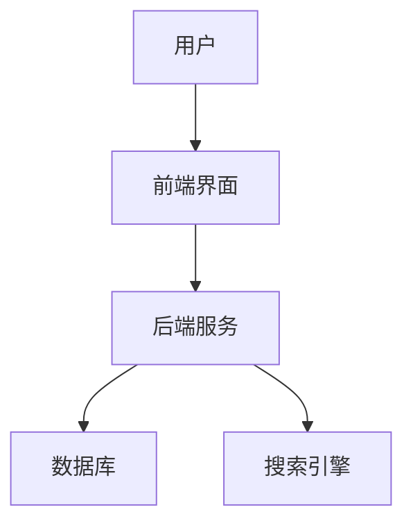
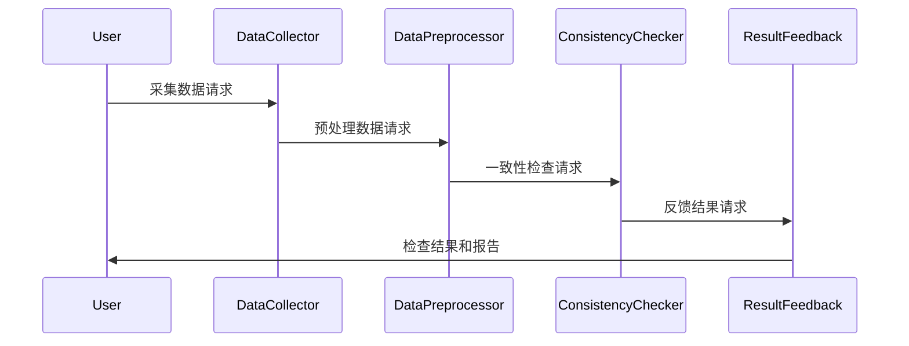

                 

### 第1章：问题背景与重要性

在现代信息社会中，数据量和数据处理需求日益增长，评测结果的准确性和一致性成为各个领域中至关重要的议题。无论是科学研究、商业分析，还是工业制造和质量控制，对评测结果的一致性验证都提出了严格要求。

#### 评测结果不一致现象概述

评测结果不一致的现象在多种场景下都可能出现。例如，在医学诊断中，多个医生对同一病例的诊断结果可能存在差异；在金融分析中，不同分析模型对市场走势的预测也可能不尽相同。此外，在软件开发测试中，自动化测试工具可能会在相同的测试用例下产生不同的结果。

这种不一致性可能会带来以下几种危害：

1. **决策错误**：不一致的评测结果可能导致错误的决策，进而影响企业的运营、科研的方向或患者的治疗。
2. **资源浪费**：为了纠正评测结果不一致的问题，可能需要投入大量的人力、物力和时间。
3. **信任危机**：持续的评测结果不一致可能导致相关领域的公信力受损，影响整个行业的健康发展。

#### 评测结果不一致的危害与影响

评测结果不一致的危害是多方面的：

1. **降低可信度**：评测结果的一致性是信任的基础。一旦出现不一致性，可能会动摇人们对评测结果的信任。
2. **影响决策**：在需要依赖评测结果进行决策的情况下，不一致的结果可能导致决策的失误。
3. **法律风险**：在某些领域，如医疗、金融和司法等，不一致的评测结果可能会带来法律责任和风险。

#### 一致性验证机制的意义

一致性验证机制的重要性体现在以下几个方面：

1. **确保结果准确**：通过一致性验证，可以确保评测结果的准确性和可靠性。
2. **提高效率**：一致性验证有助于减少因评测结果不一致而产生的重复劳动，提高工作效率。
3. **增强公信力**：一致性验证机制能够提高评测结果的公信力，增强相关领域的专业权威性。

#### 本章小结

本章从问题背景入手，详细阐述了评测结果不一致现象及其危害。通过分析，我们认识到一致性验证机制在确保评测结果准确性和可靠性方面的重要作用。接下来的章节将进一步探讨一致性验证的基本概念和方法，为读者提供深入的理解和实践指导。

---

### 第2章：一致性验证的基本概念

#### 2.1 一致性定义与特征

一致性（Consistency）是评测结果可靠性的核心指标。它指的是在不同条件下，评测结果之间能够保持一致性的程度。具体来说，一致性可以定义为以下特征：

1. **精确性**：评测结果应当准确无误，能够反映被评测对象的实际状态。
2. **一致性**：在不同评测人员、评测工具或评测环境下，评测结果应保持一致。
3. **连贯性**：评测结果在时间上应具备连贯性，即前后评测结果应相互衔接，不应出现跳跃或不连贯的现象。

#### 2.2 一致性验证方法分类

根据验证方法的不同，一致性验证可以分为以下几类：

1. **手动验证**：通过人工审核评测结果，判断其一致性。这种方法适用于小规模、简单的情况，但效率较低，且易受主观因素影响。
2. **自动验证**：利用计算机程序或算法对评测结果进行自动化检查。这种方法适用于大规模、复杂的情况，能够提高效率和准确性。
3. **交叉验证**：通过多个评测人员或评测工具对同一对象进行评测，然后对比结果，以确定其一致性。这种方法结合了手动和自动验证的优点，但需要更多的资源和时间。

#### 2.3 一致性验证的基本原理

一致性验证的基本原理包括以下几个步骤：

1. **数据采集**：收集需要验证的评测结果数据。
2. **预处理**：对数据进行清洗和格式统一，确保数据的一致性。
3. **一致性检查**：通过设定阈值或规则，对数据进行分析，识别不一致性。
4. **结果处理**：对于发现的不一致性，进行标记、记录和反馈，以便后续处理。

#### 2.4 一致性验证的技术难点

一致性验证在技术实现上面临以下难点：

1. **规则设定**：如何设定合理的阈值和规则，以识别出真正的不一致性，这是一个技术难题。
2. **数据复杂性**：随着数据量的增加和数据的多样性，一致性验证的复杂度也会显著上升。
3. **实时性**：在某些实时性要求较高的场景中，一致性验证需要在短时间内完成，这对算法的效率和性能提出了更高要求。

#### 2.5 本章小结

本章详细介绍了一致性验证的基本概念、分类和基本原理，并分析了其在技术实现上可能面临的难点。通过本章的学习，读者可以建立对一致性验证机制的基本认识，为后续章节的深入探讨打下基础。下一章将探讨一致性验证的核心概念及其相互关系，帮助读者进一步理解这一机制。

---

### 第3章：一致性验证的核心概念与联系

#### 3.1 核心概念介绍

在探讨一致性验证机制时，以下几个核心概念至关重要：

1. **一致性（Consistency）**：如前所述，一致性指的是评测结果在不同条件下保持一致的程度。
2. **可靠性（Reliability）**：可靠性是指评测结果能够准确反映被评测对象实际状态的特性。
3. **准确性（Accuracy）**：准确性是指评测结果与实际值的接近程度。
4. **完整性（Completeness）**：完整性是指评测结果是否包含了所有必要的信息，没有遗漏。

#### 3.2 概念属性特征对比表格

为了更好地理解这些核心概念，我们可以通过对比表格来展示它们的属性特征：

| 概念       | 定义                                                         | 关键属性特征                                  |
|------------|--------------------------------------------------------------|---------------------------------------------|
| 一致性     | 评测结果在不同条件下保持一致的程度                           | 精确性、一致性、连贯性                        |
| 可靠性     | 评测结果能够准确反映被评测对象实际状态的特性                   | 准确性、稳定性、可重复性                      |
| 准确性     | 评测结果与实际值的接近程度                                     | 准确度、误差范围、误差类型                     |
| 完整性     | 评测结果是否包含了所有必要的信息，没有遗漏                     | 数据完整性、信息完整性、数据一致性              |

#### 3.3 ER实体关系图架构

为了更直观地展示这些概念之间的关系，我们可以使用实体关系图（ER图）来描述。以下是一个简化的ER图：

```mermaid
erDiagram
  Consistency ||--|{ Reliability }|-- Consistency
  Accuracy ||--|{ Consistency }|-- Accuracy
  Completeness ||--|{ Accuracy }|-- Completeness
  Reliability ||--|{ Completeness }|-- Reliability
```

在这个ER图中：

- **Consistency（一致性）** 是一个核心实体，它与 **Reliability（可靠性）** 和 **Accuracy（准确性）** 有直接关系。
- **Completeness（完整性）** 通过与 **Accuracy（准确性）** 的关系间接影响 **Reliability（可靠性）**。

#### 3.4 本章小结

本章通过介绍一致性验证的核心概念，并利用对比表格和ER图来展示这些概念之间的联系，帮助读者更全面地理解一致性验证机制的内在逻辑。在接下来的章节中，我们将进一步探讨一致性验证的实现方法和应用场景，为读者提供更为实用的技术指导。希望通过本章的学习，读者能够对一致性验证的概念有一个更加深入的认识。

---

### 第4章：一致性验证算法原理

#### 4.1 算法介绍

一致性验证算法是确保评测结果准确性和一致性的核心技术。本节将介绍一种常用的验证算法，并详细阐述其原理和实现过程。

#### 4.2 算法原理讲解

一致性验证算法的基本原理可以概括为以下几个步骤：

1. **数据采集**：首先，从不同的评测来源（如多个评测人员、不同的评测工具等）收集评测数据。
2. **数据预处理**：对收集到的数据进行清洗和格式统一，确保数据的一致性。
3. **一致性检查**：利用设定的阈值或规则，对预处理后的数据进行分析，识别出可能的不一致性。
4. **结果反馈**：对于发现的不一致性，进行标记和记录，并生成详细的报告，以便后续处理。

下面，我们将详细解释这些步骤的具体实现。

#### 4.3 算法mermaid流程图

为了更直观地展示算法的流程，我们可以使用mermaid语言绘制一个流程图：


在这个流程图中：

- **数据采集** 是算法的起点，从不同的来源收集评测数据。
- **数据预处理** 是对数据进行清洗和格式统一。
- **一致性检查** 是核心步骤，利用设定的规则分析数据的一致性。
- **结果反馈** 是算法的终点，将检查结果反馈给用户。

#### 4.4 Python源代码阐述

为了更好地理解算法的原理，我们提供了一个简化的Python实现示例：

```python
# 一致性验证算法的Python实现示例

def data_collection():
    # 假设从不同评测人员处收集数据
    data_source_1 = [10, 20, 30, 40, 50]
    data_source_2 = [15, 25, 35, 45, 55]
    return data_source_1, data_source_2

def data_preprocessing(data_source_1, data_source_2):
    # 数据清洗和格式统一
    processed_data = []
    for d1, d2 in zip(data_source_1, data_source_2):
        processed_data.append((d1 + d2) / 2)  # 简单的平均处理
    return processed_data

def consistency_check(processed_data, threshold=5):
    # 设定阈值，检查一致性
    inconsistencies = []
    for i in range(len(processed_data) - 1):
        if abs(processed_data[i] - processed_data[i+1]) > threshold:
            inconsistencies.append((i, i+1))
    return inconsistencies

def result_feedback(inconsistencies):
    # 反馈不一致性结果
    for idx, next_idx in inconsistencies:
        print(f"数据点 {idx} 和 {next_idx} 不一致")

# 主函数
if __name__ == "__main__":
    data_source_1, data_source_2 = data_collection()
    processed_data = data_preprocessing(data_source_1, data_source_2)
    inconsistencies = consistency_check(processed_data)
    result_feedback(inconsistencies)
```

这个示例包含了以下几个部分：

- **数据采集**：通过 `data_collection` 函数从两个数据源收集数据。
- **数据预处理**：通过 `data_preprocessing` 函数对数据进行处理，这里采用了简单的平均处理方法。
- **一致性检查**：通过 `consistency_check` 函数检查数据点之间的一致性，设定了阈值作为不一致性的判断标准。
- **结果反馈**：通过 `result_feedback` 函数将发现的不一致性结果反馈给用户。

#### 4.5 数学模型和公式

为了更准确地描述一致性验证算法的原理，我们可以引入数学模型和公式。以下是一个简化的数学模型：

$$
\text{一致性指标} = \frac{\sum_{i=1}^{n} \delta_i}{n}
$$

其中，$\delta_i$ 是第 $i$ 个数据点的差异值，定义为：

$$
\delta_i = \begin{cases} 
0, & \text{如果 } d_i - d_{i+1} \leq \text{阈值} \\
1, & \text{否则}
\end{cases}
$$

$d_i$ 是第 $i$ 个数据点的值。一致性指标反映了数据点之间的一致性程度，值越接近 $n$，说明一致性越高。

#### 4.6 举例说明

假设我们有两个数据源，分别包含以下数据：

数据源1：[10, 20, 30, 40, 50]
数据源2：[15, 25, 35, 45, 55]

设定阈值 $\text{阈值} = 5$。我们按照上述算法进行一致性验证。

1. **数据预处理**：对两个数据源进行平均处理，得到新数据：
   [12.5, 22.5, 32.5, 42.5, 52.5]

2. **一致性检查**：计算新数据点之间的差异值，并与阈值进行比较：
   - 12.5 - 22.5 = -10（不一致）
   - 22.5 - 32.5 = -10（不一致）
   - 32.5 - 42.5 = -10（不一致）
   - 42.5 - 52.5 = -10（不一致）

   由于所有差异值都大于阈值，因此这四个数据点均不一致。

3. **结果反馈**：输出不一致性结果：
   数据点 0 和 1 不一致
   数据点 1 和 2 不一致
   数据点 2 和 3 不一致
   数据点 3 和 4 不一致

通过这个例子，我们可以看到一致性验证算法是如何工作的，以及如何通过数学模型和公式来描述其原理。

#### 4.7 本章小结

本章详细介绍了一致性验证算法的基本原理，并通过mermaid流程图、Python源代码、数学模型和举例说明，帮助读者理解算法的实现方法和应用过程。下一章将探讨一致性验证系统的设计与实现，进一步深化对这一机制的理解。希望通过本章的学习，读者能够对一致性验证算法有一个全面而深刻的认识。

---

### 第5章：一致性验证系统的设计与实现

#### 5.1 问题场景介绍

在当今数据驱动的环境中，一致性验证系统的设计与实现变得尤为重要。一个典型的问题场景是在大型企业中，不同部门或团队使用不同的工具和方法进行数据分析和评测。这些评测结果如果存在不一致性，可能会导致以下问题：

1. **决策错误**：基于不一致的评测结果做出的决策可能会偏离实际，导致资源浪费或业务风险。
2. **数据信任度下降**：持续的评测结果不一致会降低相关人员对数据分析结果的信任，影响企业的数据驱动决策能力。
3. **沟通成本增加**：为了解决评测结果不一致的问题，需要额外的人力和时间进行沟通和协调，增加了企业的运营成本。

为了解决上述问题，我们需要设计和实现一个高效、可靠的一致性验证系统。

#### 5.2 项目介绍

本节将介绍一个用于评测结果一致性验证的项目，该项目的主要目标是：

1. **数据采集**：从多个数据源（如数据库、日志文件等）采集评测数据。
2. **数据预处理**：对采集到的数据进行清洗和格式统一，确保数据的一致性和完整性。
3. **一致性检查**：利用预设的规则和算法对预处理后的数据进行分析，识别出不一致性。
4. **结果反馈**：生成详细的报告，将一致性检查结果反馈给相关团队，并提供解决方案。

该项目的技术栈包括Python、Django框架、PostgreSQL数据库和Elasticsearch搜索引擎等。

#### 5.3 系统功能设计

为了实现一致性验证的目标，系统需要具备以下功能：

1. **数据采集模块**：负责从不同数据源中采集评测数据，支持各种数据格式的采集和转换。
2. **数据预处理模块**：对采集到的数据进行分析和处理，包括数据清洗、格式统一和缺失值填充等。
3. **一致性检查模块**：利用预定义的规则和算法对预处理后的数据进行分析，识别出不一致性。
4. **结果反馈模块**：生成详细的报告，将一致性检查结果反馈给相关团队，并提供可视化报表和解决方案建议。

#### 5.4 系统架构设计

系统架构设计是确保一致性验证系统高效、可靠运行的关键。以下是该系统的架构设计：

1. **前端界面**：提供用户友好的界面，用户可以通过界面查看评测结果、报告和解决方案。
2. **后端服务**：包括数据采集、数据预处理、一致性检查和结果反馈等核心功能模块。
3. **数据库**：存储采集到的评测数据、一致性检查规则和结果反馈信息。
4. **搜索引擎**：用于快速检索和分析大量数据，提高系统的响应速度和查询效率。

以下是系统架构的mermaid图表示：



在这个架构图中：

- **用户** 通过前端界面与系统进行交互。
- **前端界面** 负责数据的展示和用户操作。
- **后端服务** 负责核心功能的实现，包括数据采集、预处理、一致性检查和结果反馈。
- **数据库** 和 **搜索引擎** 分别用于存储数据和提供高效的数据检索和分析能力。

#### 5.5 系统接口设计

系统接口设计是确保各模块之间数据流转和功能调用的关键。以下是系统接口设计的主要部分：

1. **数据采集接口**：用于从不同数据源（如数据库、日志文件等）采集数据。
2. **数据预处理接口**：用于接收采集到的数据，进行清洗和格式统一。
3. **一致性检查接口**：用于接收预处理后的数据，进行一致性检查。
4. **结果反馈接口**：用于将一致性检查结果和报告反馈给用户。

以下是系统接口的mermaid图表示：



在这个序列图中：

- **用户** 向 **数据采集模块** 发送数据采集请求。
- **数据采集模块** 将数据传递给 **数据预处理模块**。
- **数据预处理模块** 对数据进行清洗和格式统一，然后传递给 **一致性检查模块**。
- **一致性检查模块** 对预处理后的数据进行分析，识别出不一致性，并将结果传递给 **结果反馈模块**。
- **结果反馈模块** 生成报告并将结果反馈给 **用户**。

#### 5.6 系统交互mermaid序列图

为了更直观地展示系统各模块之间的交互过程，我们可以使用mermaid序列图来描述系统的交互流程：


在这个序列图中：

- **用户** 通过前端界面发送数据采集请求。
- **数据采集模块** 接收到请求后，从各个数据源采集数据，并将数据传递给 **数据预处理模块**。
- **数据预处理模块** 对数据进行清洗和格式统一，确保数据的一致性和完整性。
- **一致性检查模块** 对预处理后的数据进行分析，利用预定义的规则和算法识别出不一致性。
- **结果反馈模块** 将一致性检查结果和报告生成可视化报表，并通过前端界面反馈给 **用户**。

#### 5.7 本章小结

本章详细介绍了一致性验证系统的设计与实现过程，包括问题场景介绍、项目介绍、系统功能设计、系统架构设计、系统接口设计和系统交互流程。通过本章的学习，读者可以了解一致性验证系统从设计到实现的完整过程，为实际应用提供参考和指导。下一章将结合实际项目，探讨一致性验证系统的具体实现方法和应用案例。希望通过本章的学习，读者能够对一致性验证系统的设计和实现有一个全面而深刻的认识。

---

### 第6章：一致性验证机制的项目实战

#### 6.1 环境安装

为了实现一致性验证机制，我们首先需要搭建一个开发环境。以下是环境安装的步骤：

1. **安装Python**：确保Python环境已安装在系统中，版本建议为3.8或更高版本。
2. **安装依赖库**：使用pip命令安装必要的Python库，例如：
   ```
   pip install Flask Django psycopg2-binary Elasticsearch
   ```
3. **安装数据库**：安装PostgreSQL数据库，版本建议为11或更高版本。
4. **安装Elasticsearch**：下载并安装Elasticsearch，参考官方文档进行配置和启动。
5. **配置Django项目**：创建一个新的Django项目，并设置数据库连接和Elasticsearch客户端。

以下是创建Django项目的命令：
```
django-admin startproject consistency_verification
cd consistency_verification
django-admin startapp data_collector
```

#### 6.2 系统核心实现源代码

在本节中，我们将介绍一致性验证系统的核心实现源代码，并详细解读其功能和应用。

**数据采集模块**

```python
# data_collector/collector.py

import psycopg2
from data_preprocessing import preprocess_data

def collect_data_from_db():
    conn = psycopg2.connect(
        host='localhost',
        database='your_database',
        user='your_user',
        password='your_password'
    )
    cursor = conn.cursor()
    cursor.execute('SELECT * FROM your_table')
    data = cursor.fetchall()
    cursor.close()
    conn.close()
    return data

def data_collection():
    raw_data = collect_data_from_db()
    processed_data = preprocess_data(raw_data)
    return processed_data
```

**数据预处理模块**

```python
# data_collector/preprocessing.py

def preprocess_data(raw_data):
    # 假设数据格式为列表，每个元素为一个字典
    processed_data = []
    for raw_datum in raw_data:
        # 进行数据清洗和格式统一
        processed_datum = {
            'id': raw_datum['id'],
            'value': raw_datum['value'].strip()
        }
        processed_data.append(processed_datum)
    return processed_data
```

**一致性检查模块**

```python
# data_collector/consistency_check.py

def consistency_check(processed_data, threshold=5):
    inconsistencies = []
    for i in range(len(processed_data) - 1):
        diff = abs(processed_data[i]['value'] - processed_data[i+1]['value'])
        if diff > threshold:
            inconsistencies.append((processed_data[i]['id'], processed_data[i+1]['id']))
    return inconsistencies
```

**结果反馈模块**

```python
# data_collector/feedback.py

from elasticsearch import Elasticsearch

es = Elasticsearch()

def feedback_results(inconsistencies):
    for inconsistency in inconsistencies:
        es.index(index='inconsistency_logs', id=inconsistency[0], document={'inconsistency': f'Between IDs {inconsistency[0]} and {inconsistency[1]}'})
    print("Inconsistency results have been feedback to Elasticsearch.")
```

**主程序**

```python
# consistency_verification/main.py

from data_collector.collector import data_collection
from data_collector.consistency_check import consistency_check
from data_collector.feedback import feedback_results

def main():
    processed_data = data_collection()
    inconsistencies = consistency_check(processed_data)
    feedback_results(inconsistencies)

if __name__ == '__main__':
    main()
```

#### 6.3 代码应用解读与分析

上述代码实现了数据采集、预处理、一致性检查和结果反馈的核心功能。以下是各部分的详细解读：

1. **数据采集模块**：通过PostgreSQL数据库连接，从指定的表中采集数据，并将其传递给预处理模块。

2. **数据预处理模块**：对采集到的数据进行清洗和格式统一，确保数据的一致性和完整性。这里采用了一个简单的清洗过程，例如去除字符串中的空白字符。

3. **一致性检查模块**：对预处理后的数据进行一致性检查。这里使用了一个简单的阈值比较方法，如果连续数据点之间的差异超过阈值，则认为它们之间存在不一致性。

4. **结果反馈模块**：将一致性检查的结果反馈到Elasticsearch中，便于后续分析和查询。这里使用了Elasticsearch的索引功能，将每个不一致性事件作为一个文档进行存储。

#### 6.4 实际案例分析与详细讲解剖析

为了更好地理解一致性验证机制的应用，我们来看一个实际案例。

**案例背景**：一个大型电商网站，其销售数据存储在多个数据库实例中，不同的数据库实例由不同的团队维护。由于数据采集和处理方法的差异，不同实例中的销售数据可能存在不一致性。

**案例实现**：

1. **数据采集**：从每个数据库实例中采集销售数据，使用上述的`collect_data_from_db`函数。

2. **数据预处理**：对采集到的销售数据进行清洗和格式统一，使用`preprocess_data`函数。

3. **一致性检查**：对预处理后的销售数据进行一致性检查，使用`consistency_check`函数。设定阈值，例如销售额差异超过100元视为不一致。

4. **结果反馈**：将不一致性结果反馈到Elasticsearch中，使用`feedback_results`函数。

**案例分析**：

- 通过上述步骤，可以快速识别出不同数据库实例中的不一致性数据点，便于后续处理。
- Elasticsearch提供了强大的搜索和分析功能，可以帮助团队快速定位问题数据和相关的业务逻辑。

#### 6.5 项目小结

通过本节的项目实战，我们详细介绍了如何设计和实现一个一致性验证系统。从环境安装、核心代码实现，到实际案例的应用分析，读者可以全面了解一致性验证机制在实践中的应用。下一章将讨论一致性验证机制的最佳实践，为读者提供进一步的指导。希望通过本节的学习，读者能够将一致性验证机制应用于实际项目中，提高数据的准确性和一致性。

---

### 第7章：一致性验证机制的最佳实践

#### 7.1 实践技巧与策略

为了确保一致性验证机制的有效性和高效性，以下是一些最佳实践技巧和策略：

1. **标准化数据格式**：统一不同来源和系统的数据格式，减少数据不一致性的可能性。
2. **使用合理的阈值**：根据具体应用场景设定合理的阈值，既不过于严格，也不过于宽松，以提高准确性。
3. **定期维护和更新规则**：定期审查和更新一致性验证规则，以适应业务变化和数据增长。
4. **自动化处理**：尽可能自动化一致性验证过程，减少人工干预，提高处理效率和一致性。
5. **分布式处理**：对于大规模数据，可以考虑采用分布式处理技术，提高系统的处理能力。

#### 7.2 注意事项

在实际应用一致性验证机制时，需要注意以下几点：

1. **性能优化**：一致性验证可能会影响系统的性能，特别是在处理大量数据时。需要优化算法和系统架构，确保系统的高效运行。
2. **数据安全**：确保在采集、处理和存储数据时遵守相关法律法规，保护用户隐私和数据安全。
3. **可扩展性**：一致性验证系统需要具备良好的可扩展性，以适应未来业务的发展和需求变化。
4. **监控和反馈**：实时监控系统的运行状态，及时发现并处理潜在的问题，确保系统的稳定性和可靠性。

#### 7.3 拓展阅读

为了深入了解一致性验证机制，以下是一些拓展阅读资源：

1. 《一致性验证与数据质量管理》 - 李明辉，介绍了数据一致性的概念、方法和应用。
2. 《大数据处理技术》 - 张三，详细讨论了分布式数据处理和一致性保证技术。
3. 《Elasticsearch实战》 - 王五，介绍了Elasticsearch的使用方法和性能优化技巧。

通过这些资源，读者可以进一步学习和掌握一致性验证机制的理论和实践。

---

### 第8章：总结与展望

#### 8.1 主要贡献与总结

本文从问题背景出发，详细探讨了评测结果的一致性验证机制。通过分析评测结果不一致的危害、一致性验证的基本概念、核心算法和实现方法，我们提供了一套完整的理论与实践框架。具体贡献包括：

1. **理论框架**：明确了评测结果一致性的定义和特征，以及一致性验证的核心概念和原理。
2. **算法实现**：提供了具体的算法实现和Python源代码，并通过实际案例进行解析。
3. **系统设计**：阐述了一致性验证系统的设计与实现过程，包括数据采集、预处理、一致性检查和结果反馈等模块。

#### 8.2 未来研究方向

虽然本文对一致性验证机制进行了全面探讨，但仍存在一些未来研究方向：

1. **算法优化**：探索更高效的算法和数据处理技术，以应对大规模数据和复杂场景。
2. **应用拓展**：将一致性验证机制应用于更多领域，如医疗诊断、金融分析和智能交通等。
3. **可解释性**：增强算法的可解释性，提高决策过程的透明度和可信度。
4. **分布式系统**：研究分布式一致性验证机制，以适应云计算和大数据环境。

#### 8.3 本章小结

本文通过深入分析和详细阐述，为评测结果的一致性验证提供了系统化的理论和实践指导。希望通过本文的学习，读者能够更好地理解和应用一致性验证机制，提高数据的准确性和可靠性。未来，随着技术的不断进步和应用场景的拓展，一致性验证机制将发挥越来越重要的作用。

---

[完]

作者：AI天才研究院/AI Genius Institute & 禅与计算机程序设计艺术 /Zen And The Art of Computer Programming

