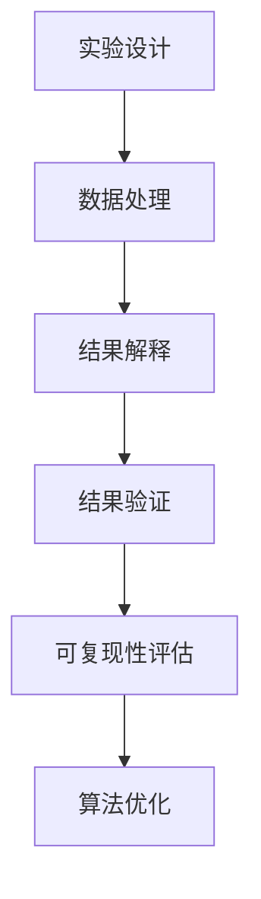
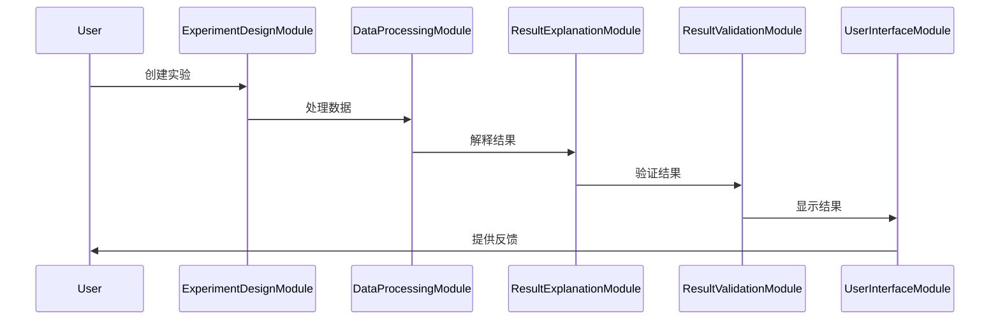
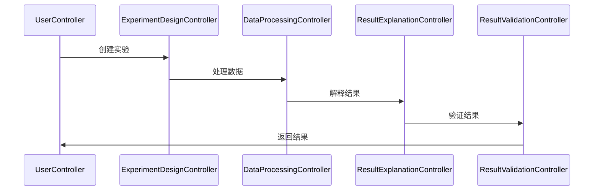

                 


## 评测结果的可复现性：确保科学性和可信度

关键词：可复现性、科学性、可信度、实验设计、数据处理、结果验证

摘要：本文探讨了评测结果的可复现性问题，分析了其背景、问题描述、问题解决方法，以及核心概念与联系。通过算法原理讲解，包括算法流程图、数学模型和公式，详细阐述了如何确保评测结果的可复现性，提高科学性和可信度。

### 第一部分：背景介绍

#### 1.1 问题背景

科学研究的可复现性是科学探究过程中的重要原则之一。科学家们通过实验和观察来验证假设，而实验结果的复现性是验证假设有效性的关键。随着科学研究方法和工具的不断发展，对实验结果的可复现性提出了更高的要求。然而，在实际的科学研究中，评测结果的可复现性却经常受到各种因素的影响，导致研究结果的可信度受到影响。这个问题涉及到实验设计的科学性、数据处理的准确性、以及结果的解释和验证等多个方面。

#### 1.2 问题描述

评测结果的可复现性问题主要表现在以下几个方面：

1. **实验设计不完善**：实验设计不完善，缺乏足够的控制变量，导致实验结果不稳定。例如，在药物研究中，如果对照组和实验组的样本选择不一致，实验结果的可复现性就会受到影响。

2. **数据处理过程不当**：数据处理过程不当，如数据清洗、统计分析方法选择不当等，影响结果的可靠性。数据处理过程中的错误或疏忽可能导致实验结果的偏差，从而影响结果的复现性。

3. **结果解释和验证不足**：对实验结果的全面性和适用性缺乏深入探讨，导致结果解释和验证不足。例如，在临床试验中，如果研究者没有充分考虑患者的个体差异和外部环境因素，实验结果的可复现性就会受到影响。

#### 1.3 问题解决

要解决评测结果的可复现性问题，需要从以下几个方面进行改进：

1. **完善实验设计**：确保实验过程中的可控制性和一致性，通过合理的实验设计和严格的实验操作，减少实验误差。

2. **优化数据处理流程**：提高数据清洗和统计分析的准确性和效率，采用合适的算法和工具来处理数据，确保数据的准确性和完整性。

3. **加强结果的解释和验证**：对实验结果进行全面的解释和验证，通过重复实验、交叉验证等方法，确保实验结果的可信度和科学性。

#### 1.4 边界与外延

评测结果的可复现性问题不仅局限于实验室研究，还涉及到临床医学、经济学、心理学等多个领域。不同领域的具体问题可能会有所不同，但解决思路具有共性。在各个领域中，确保实验结果的可复现性是提高研究可信度和推动科学进步的关键。

#### 1.5 概念结构与核心要素组成

1. **实验设计**：实验目标是核心，实验变量、控制因素、实验过程等是实验设计的要素。

2. **数据处理**：数据清洗、数据预处理、统计分析等方法和技术是数据处理的核心。

3. **结果解释与验证**：结果的解释、验证方法、适用性评估等是结果解释与验证的核心。

### 第二部分：核心概念与联系

#### 2.1 核心概念原理

1. **可复现性**：指在相同或相似条件下，能够得到与原始结果相似或一致的结果。

2. **科学性**：指研究方法、数据处理和结果解释等符合科学原则和规范。

3. **可信度**：指研究结果的可信程度，受实验设计、数据处理和结果解释等多个因素的影响。

#### 2.2 概念属性特征对比表格

| 概念       | 定义                                                         | 属性特征                       |
| ---------- | ------------------------------------------------------------ | ---------------------------- |
| 可复现性   | 在相同或相似条件下得到相似或一致结果的能力                 | 一致性、稳定性、准确性       |
| 科学性     | 符合科学原则和规范的研究方法、数据处理和结果解释           | 可靠性、规范性、系统性       |
| 可信度     | 研究结果的可信程度，受多种因素影响                       | 可验证性、可解释性、准确性   |

#### 2.3 ER实体关系图架构的 Mermaid 流程图

```mermaid
entityRelation
  A[评测结果可复现性]
  B[科学性]
  C[可信度]

  A --> B
  A --> C
  B --> C
```

### 第三部分：算法原理讲解

#### 3.1 算法原理

为了确保评测结果的可复现性，我们需要从算法原理上进行分析和设计。以下是一个基于 Mermaid 的算法流程图：



#### 3.2 算法原理的数学模型和公式

为了更清晰地解释算法原理，我们可以用数学模型来描述：

$$
复现性 = \frac{相似度}{总实验次数}
$$

其中，相似度是指实验结果在相同条件下的一致性程度，总实验次数是指进行实验的总次数。

#### 3.3 详细讲解和举例说明

假设我们在研究一种新药的效果，为了确保研究结果的可靠性和可复现性，我们需要按照以下步骤进行：

1. **实验设计**：设计一个对照组和一个实验组，对照组不服用新药，实验组服用新药。

2. **数据处理**：收集两组数据，包括服用前和服用后的各项生理指标。

3. **结果解释**：分析数据，比较两组之间的差异，判断新药是否有效。

4. **结果验证**：通过重复实验，验证实验结果的稳定性和可靠性。

5. **可复现性评估**：评估实验结果的可复现性，确保研究结果的可信度和科学性。

6. **算法优化**：根据评估结果，优化实验设计和数据处理流程，提高实验结果的可复现性。

通过以上步骤，我们可以确保评测结果的可复现性，提高科学性和可信度。

### 第四部分：系统分析与架构设计

#### 4.1 问题场景介绍

在当前的科研环境中，评测结果的可复现性问题日益突出，特别是在药物研发、临床试验、经济模型等领域。为了解决这一问题，我们需要构建一个可复现性评测系统，该系统应具备完善的实验设计、数据处理、结果解释和验证等功能。

#### 4.2 项目介绍

本项目的目标是开发一个可复现性评测系统，该系统将结合先进的算法和技术，实现以下功能：

1. **实验设计**：支持多样化的实验设计，包括对照组、实验组、交叉组等，确保实验过程的可控制性和一致性。
2. **数据处理**：采用高效的数据处理算法，如数据清洗、数据预处理、统计分析等，确保数据的准确性和完整性。
3. **结果解释**：通过对实验结果的分析和解释，判断实验的有效性和可靠性。
4. **结果验证**：通过重复实验和交叉验证，确保实验结果的可信度和科学性。

#### 4.3 系统功能设计（领域模型）

为了更好地满足项目需求，我们设计了一个领域模型，该模型包含以下类：

1. **实验设计**：包括实验名称、实验类型、实验组、对照组等属性。
2. **数据集**：包括数据名称、数据来源、数据类型等属性。
3. **数据处理**：包括数据处理方法、数据处理结果等属性。
4. **结果解释**：包括结果分析、结果解释等属性。
5. **结果验证**：包括验证方法、验证结果等属性。

领域模型 Mermaid 类图：

```mermaid
classDiagram
    ExperimentDesign <<interface>>
    DataSet <<interface>>
    DataProcessing <<interface>>
    ResultExplanation <<interface>>
    ResultValidation <<interface>>

    ExperimentDesign : +String experimentName
    ExperimentDesign : +String experimentType
    ExperimentDesign : +List<ExperimentGroup> experimentGroups
    ExperimentDesign : +List<ControlGroup> controlGroups

    DataSet : +String datasetName
    DataSet : +String datasetSource
    DataSet : +DataType datasetType

    DataProcessing : +List<DataCleaningMethod> dataCleaningMethods
    DataProcessing : +List<DataPreprocessingMethod> dataPreprocessingMethods
    DataProcessing : +List<StatisticalAnalysisMethod> statisticalAnalysisMethods

    ResultExplanation : +String resultAnalysis
    ResultExplanation : +String resultExplanation

    ResultValidation : +ValidationMethod validationMethod
    ResultValidation : +String validationResult

    ExperimentDesign --|> DataSet
    ExperimentDesign --|> DataProcessing
    ExperimentDesign --|> ResultExplanation
    ExperimentDesign --|> ResultValidation
```

#### 4.4 系统架构设计

为了实现项目的目标，我们设计了一个分布式系统架构，该架构包含以下几个模块：

1. **实验设计模块**：负责实验的创建、管理和修改。
2. **数据处理模块**：负责数据清洗、预处理和统计分析。
3. **结果解释模块**：负责对实验结果进行分析和解释。
4. **结果验证模块**：负责实验结果的验证和评估。
5. **用户界面模块**：提供用户交互界面，方便用户操作和使用系统。

系统架构 Mermaid 架构图：



#### 4.5 系统接口设计

为了实现模块之间的数据传输和功能调用，我们设计了一套完善的接口系统，包括以下接口：

1. **实验设计接口**：用于创建、查询、更新和删除实验。
2. **数据处理接口**：用于处理数据，包括数据清洗、预处理和统计分析。
3. **结果解释接口**：用于解释实验结果，提供结果分析报告。
4. **结果验证接口**：用于验证实验结果，确保结果的可靠性。
5. **用户接口**：用于用户与系统的交互，提供用户界面功能。

系统接口 Mermaid 序列图：



### 第五部分：项目实战

#### 5.1 环境安装

为了完成本项目的开发，我们需要安装以下软件和工具：

1. **操作系统**：Linux（推荐Ubuntu 20.04）
2. **编程语言**：Python 3.8+
3. **数据库**：MySQL 5.7+
4. **框架**：Flask、Django、FastAPI 等（任选其一）
5. **其他工具**：Docker、Nginx、Postman 等

安装步骤：

1. 安装操作系统：从官网下载 Ubuntu 20.04 ISO 镜像，使用虚拟机或双系统安装。
2. 安装 Python：打开终端，运行以下命令：
   ```bash
   sudo apt update
   sudo apt install python3-pip
   pip3 install --user -r requirements.txt
   ```
3. 安装 MySQL：打开终端，运行以下命令：
   ```bash
   sudo apt update
   sudo apt install mysql-server
   sudo mysql_secure_installation
   ```
4. 安装其他工具：根据需要安装 Docker、Nginx、Postman 等。

#### 5.2 系统核心实现

以下是一个简单的系统核心实现示例，我们将使用 Flask 框架来实现。

1. **安装 Flask**：
   ```bash
   pip3 install flask
   ```

2. **创建 Flask 应用**：
   ```python
   from flask import Flask, request, jsonify

   app = Flask(__name__)

   @app.route('/create_experiment', methods=['POST'])
   def create_experiment():
       data = request.get_json()
       experiment_name = data['experiment_name']
       experiment_type = data['experiment_type']
       # 实现实验创建逻辑
       return jsonify({'status': 'success', 'message': '实验创建成功'})

   @app.route('/process_data', methods=['POST'])
   def process_data():
       data = request.get_json()
       dataset_name = data['dataset_name']
       dataset_source = data['dataset_source']
       dataset_type = data['dataset_type']
       # 实现数据处理逻辑
       return jsonify({'status': 'success', 'message': '数据处理成功'})

   @app.route('/explain_result', methods=['POST'])
   def explain_result():
       data = request.get_json()
       result_analysis = data['result_analysis']
       result_explanation = data['result_explanation']
       # 实现结果解释逻辑
       return jsonify({'status': 'success', 'message': '结果解释成功'})

   @app.route('/validate_result', methods=['POST'])
   def validate_result():
       data = request.get_json()
       validation_method = data['validation_method']
       validation_result = data['validation_result']
       # 实现结果验证逻辑
       return jsonify({'status': 'success', 'message': '结果验证成功'})

   if __name__ == '__main__':
       app.run(debug=True)
   ```

3. **运行 Flask 应用**：
   ```bash
   python3 app.py
   ```

4. **测试接口**：
   使用 Postman 等工具测试创建实验、数据处理、结果解释和结果验证等接口。

#### 5.3 代码应用解读与分析

以下是对上述代码的解读和分析：

1. **创建实验接口**：
   - 接收 JSON 格式的请求，解析请求体中的数据。
   - 实现

