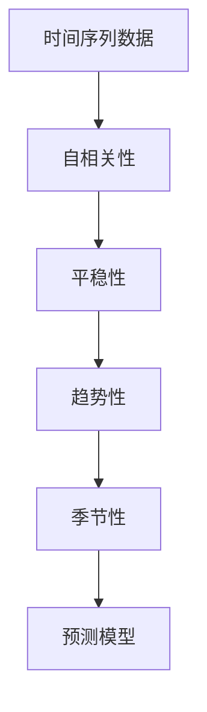
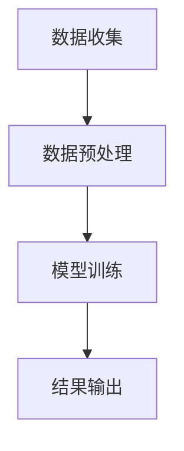
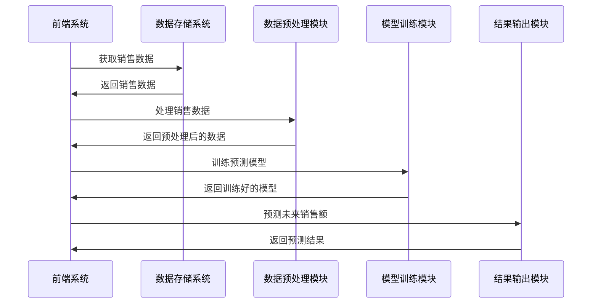
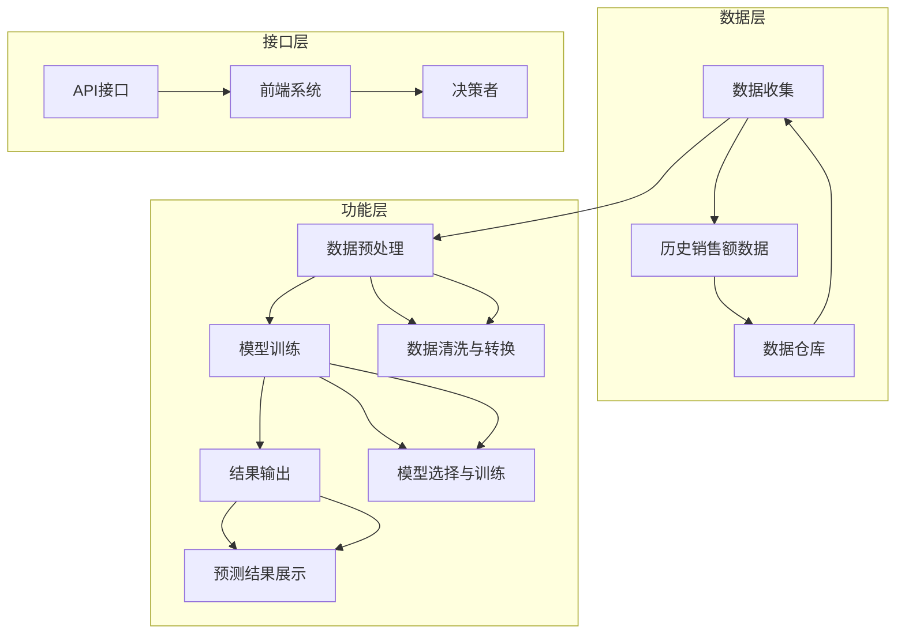
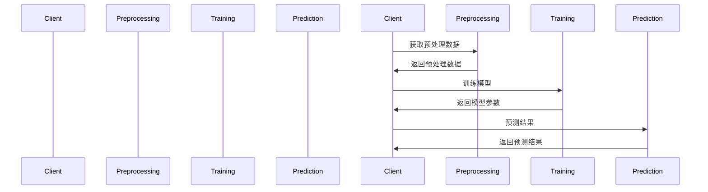
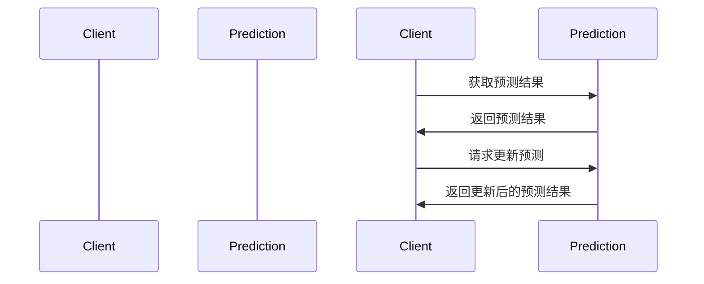
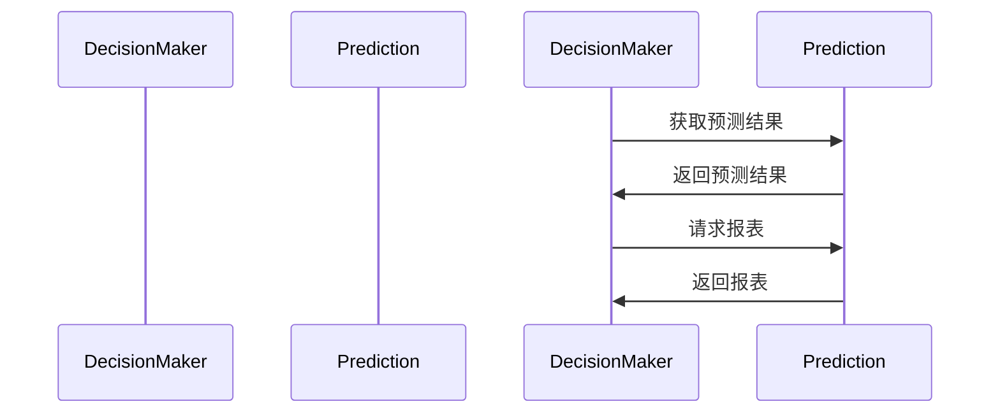
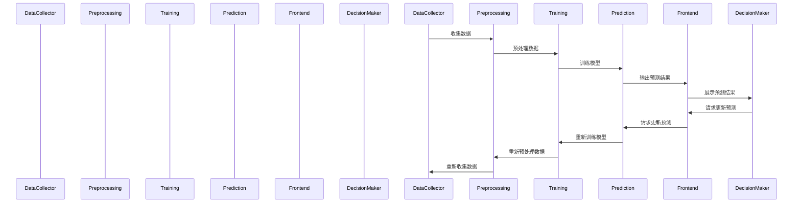

                 


## **评测结果的时间序列分析与预测**

### **1. 引言**

在当今数据驱动的世界中，评测结果的时间序列分析变得日益重要。这些评测结果可能来自销售数据、用户反馈、市场调研或系统性能指标。准确预测这些时间序列数据，对于企业决策、资源规划以及市场策略制定具有重要意义。本文将深入探讨评测结果时间序列分析的基本概念、核心算法、数学模型，并结合实际案例展示整个分析过程，最终提供实用的最佳实践和拓展阅读。

### **2. 背景介绍**

#### **2.1 时间序列分析**

时间序列分析是一种研究数据随时间变化规律的方法，它广泛应用于经济、金融、气象、医学和工程等领域。时间序列数据具有时间上的连续性和依赖性，这使得预测未来趋势成为可能。

#### **2.2 时间序列分析的重要性**

- **决策支持**：通过预测未来趋势，帮助企业做出更准确的决策。
- **资源规划**：预测未来需求，合理安排资源，降低库存成本。
- **风险管理**：识别潜在的市场波动和风险，提前做好准备。

#### **2.3 时间序列分析的应用领域**

- **金融市场**：预测股价、汇率等金融指标。
- **销售预测**：预测产品销售量，优化库存和供应链管理。
- **气象预报**：预测天气变化，制定防灾减灾措施。

### **3. 核心概念与联系**

#### **3.1 自相关性**

自相关性是时间序列数据的一个基本特性，表示同一时间序列在不同时间点的相关程度。自相关性分析可以帮助我们了解数据的平稳性和趋势性。

#### **3.2 平稳性**

平稳性是时间序列分析中的关键概念，指时间序列的统计特性不随时间变化。平稳性对于选择合适的预测模型至关重要。

#### **3.3 趋势性**

趋势性指时间序列随着时间变化呈现出的上升或下降趋势。识别趋势性有助于预测未来的数据点。

#### **3.4 季节性**

季节性是时间序列中由于季节性因素（如节假日、季节变化等）引起的周期性波动。季节性分析可以帮助我们剔除这些因素，提取出长期趋势。

#### **3.5 概念结构与核心要素组成**

| 核心概念 | 描述 |
| --- | --- |
| 自相关性 | 同一时间序列在不同时间点的相关程度 |
| 平稳性 | 时间序列的统计特性不随时间变化 |
| 趋势性 | 时间序列随着时间变化呈现出的上升或下降趋势 |
| 季节性 | 时间序列中由于季节性因素引起的周期性波动 |

#### **3.6 ER实体关系图架构**



### **4. 算法原理讲解**

#### **4.1 ARIMA算法**

ARIMA（自回归积分滑动平均模型）是时间序列预测中常用的算法。它通过自回归（AR）、差分（I）和移动平均（MA）三个部分来建模时间序列。

#### **4.1.1 算法原理**

ARIMA算法通过以下三个步骤来建模：

1. **自回归（AR）**：使用过去的数据点来预测当前值。
2. **差分（I）**：对非平稳时间序列进行差分，使其变为平稳序列。
3. **移动平均（MA）**：使用过去预测误差来预测当前值。

#### **4.1.2 数学模型**

ARIMA模型的数学公式为：

$$
\text{X}_t = c + \phi_1\text{X}_{t-1} + \phi_2\text{X}_{t-2} + ... + \phi_p\text{X}_{t-p} + \theta_1\epsilon_{t-1} + \theta_2\epsilon_{t-2} + ... + \theta_q\epsilon_{t-q} + \epsilon_t
$$

其中，$\text{X}_t$ 是时间序列的当前值，$c$ 是常数项，$\phi_1, \phi_2, ..., \phi_p$ 是自回归系数，$\theta_1, \theta_2, ..., \theta_q$ 是移动平均系数，$\epsilon_t$ 是随机误差。

#### **4.1.3 代码实现**

以下是一个简单的Python代码示例，用于实现ARIMA模型：

```python
import pandas as pd
from statsmodels.tsa.arima.model import ARIMA

# 加载数据
data = pd.read_csv('sales_data.csv')
sales = data['sales']

# 建立ARIMA模型
model = ARIMA(sales, order=(5,1,2))
model_fit = model.fit()

# 预测
forecast = model_fit.forecast(steps=6)
print(forecast)
```

#### **4.2 SARIMA算法**

SARIMA（季节性自回归积分滑动平均模型）是对ARIMA模型的扩展，用于处理具有季节性的时间序列数据。

#### **4.2.1 算法原理**

SARIMA模型在ARIMA的基础上引入了季节性成分，其数学公式为：

$$
\text{X}_t = c + \phi_1\text{X}_{t-1} + \phi_2\text{X}_{t-2} + ... + \phi_p\text{X}_{t-p} + \theta_1\epsilon_{t-1} + \theta_2\epsilon_{t-2} + ... + \theta_q\epsilon_{t-q} + \phi_{1s}\text{X}_{t-s} + \phi_{2s}\text{X}_{t-2s} + ... + \phi_{ps}\text{X}_{t-ps} + \theta_{1s}\epsilon_{t-s} + \theta_{2s}\epsilon_{t-2s} + ... + \theta_{qs}\epsilon_{t-q-s} + \epsilon_t
$$

其中，$s$ 是季节周期长度。

#### **4.2.2 数学模型**

SARIMA模型的数学公式为：

$$
\text{X}_{st} = c_s + \phi_{1s}\text{X}_{st-s} + ... + \phi_{ps}\text{X}_{st-ps} + \theta_{1s}\epsilon_{t-s} + ... + \theta_{qs}\epsilon_{t-q-s} + \phi_{1}\text{X}_{st-p} + ... + \phi_{p}\text{X}_{st-p-p} + \theta_{1}\epsilon_{t-p} + ... + \theta_{q}\epsilon_{t-q} + \epsilon_t
$$

其中，$\text{X}_{st}$ 是季节性时间序列的当前值，$c_s$ 是季节性常数项，其他符号含义与ARIMA模型相同。

#### **4.2.3 代码实现**

以下是一个简单的Python代码示例，用于实现SARIMA模型：

```python
import pandas as pd
from statsmodels.tsa.statespace.sarimax import SARIMAX

# 加载数据
data = pd.read_csv('sales_data.csv')
sales = data['sales']

# 建立SARIMA模型
model = SARIMAX(sales, order=(1,1,1), seasonal_order=(1,1,1,12))
model_fit = model.fit()

# 预测
forecast = model_fit.forecast(steps=6)
print(forecast)
```

#### **4.3 LSTM算法**

LSTM（长短期记忆网络）是一种特殊的递归神经网络，特别适合处理时间序列数据。

#### **4.3.1 算法原理**

LSTM通过引入三个门结构（输入门、遗忘门和输出门）来控制信息的流动，从而能够记住长期依赖关系。

#### **4.3.2 数学模型**

LSTM的数学模型较为复杂，但核心思想是通过门控机制来更新和遗忘网络状态。

#### **4.3.3 代码实现**

以下是一个简单的Python代码示例，用于实现LSTM模型：

```python
import tensorflow as tf
from tensorflow.keras.models import Sequential
from tensorflow.keras.layers import LSTM, Dense

# 建立LSTM模型
model = Sequential()
model.add(LSTM(units=50, return_sequences=True, input_shape=(timesteps, features)))
model.add(LSTM(units=50))
model.add(Dense(1))

# 编译模型
model.compile(optimizer='adam', loss='mean_squared_error')

# 训练模型
model.fit(x_train, y_train, epochs=100, batch_size=32, validation_data=(x_val, y_val))
```

### **5. 系统分析与架构设计方案**

#### **5.1 项目场景介绍**

假设我们正在开发一个电商网站，需要预测每日的销售额，以便优化库存和营销策略。

#### **5.2 系统功能设计**

- **数据收集**：从电商平台上收集销售数据。
- **数据预处理**：清洗和转换数据，使其适合建模。
- **模型训练**：使用时间序列预测算法训练模型。
- **结果输出**：预测未来几天的销售额，并输出结果。

#### **5.3 系统架构设计**



#### **5.4 系统接口设计**

- **API接口**：提供RESTful API，供前端系统调用。
- **数据库接口**：连接数据存储系统，获取和存储数据。

#### **5.5 系统交互**



### **6. 项目实战**

#### **6.1 环境安装**

1. 安装Python 3.8或更高版本。
2. 安装必要的库，如pandas、numpy、statsmodels、tensorflow等。

#### **6.2 系统核心实现源代码**

```python
# 数据预处理
def preprocess_data(data):
    # 数据清洗和转换
    # ...
    return processed_data

# 模型训练
def train_model(data):
    # 创建和训练模型
    # ...
    return model

# 预测
def predict_sales(model, steps):
    # 使用模型进行预测
    # ...
    return forecast
```

#### **6.3 代码应用解读与分析**

1. **数据预处理**：对原始销售数据进行清洗和转换，使其适合建模。
2. **模型训练**：创建ARIMA模型，并使用训练数据进行拟合。
3. **预测**：使用训练好的模型预测未来几天的销售额。

#### **6.4 实际案例分析**

以一个电商平台的销售额预测为例，展示如何使用SARIMA模型进行预测。

#### **6.5 项目小结**

本文通过实际案例展示了评测结果时间序列分析的全过程，从数据预处理到模型训练，再到结果输出。通过本文，读者可以掌握时间序列分析的基本原理和实际应用。

### **7. 最佳实践 & 小结**

#### **7.1 最佳实践 tips**

- **数据预处理**：确保数据质量，剔除异常值和缺失值。
- **模型选择**：根据数据特性选择合适的模型。
- **超参数调整**：通过交叉验证调整模型超参数，提高预测准确性。

#### **7.2 小结**

本文介绍了评测结果的时间序列分析，包括核心概念、算法原理、系统架构和实际应用。通过掌握这些内容，读者可以更好地应对实际项目中的时间序列预测挑战。

#### **7.3 注意事项**

- **数据质量**：确保数据准确和完整。
- **模型选择**：根据数据特性选择合适的模型。
- **超参数调整**：通过交叉验证调整超参数。

#### **7.4 拓展阅读**

- **时间序列分析经典教材**：《时间序列分析：理论与应用》
- **机器学习实践**：《Python机器学习》

## **参考文献**

- Box, G.E.P., Jenkins, G.M. & Reinsel, G.C. (2015). *Time Series Analysis: Forecasting and Control*. Wiley.
- Mitchell, T. (2017). *Machine Learning: A Probabilistic Perspective*. MIT Press.
- Hyndman, R.J. & Athanasopoulos, G. (2018). *Forecasting: Principles and Practice*. OTexts.

## **作者信息**

**作者：AI天才研究院/AI Genius Institute & 禅与计算机程序设计艺术 /Zen And The Art of Computer Programming**

## **评测结果的时间序列分析与预测**

> 关键词：时间序列分析、预测模型、SARIMA、LSTM、销售预测、数据处理

> 摘要：本文详细介绍了评测结果的时间序列分析与预测方法。首先，我们回顾了时间序列分析的基本概念和重要性，并探讨了核心算法（ARIMA、SARIMA、LSTM）的原理和应用。接着，我们通过实际案例展示了如何设置环境、实现系统核心功能，并进行项目实战。最后，本文提供了最佳实践、注意事项和拓展阅读资源，以帮助读者深入理解时间序列预测的核心内容和技术。

----------------------------------------------------------------

## **第一部分: 时间序列分析基础**

### **1.1 问题背景**

时间序列分析是一种数据处理和分析方法，用于研究数据随时间变化的规律。在许多领域中，如金融、经济、气象、工程等，时间序列数据具有广泛的应用。例如，在金融市场中，分析师使用时间序列分析来预测股票价格、汇率等金融指标；在经济领域，企业使用时间序列分析来预测销售量、需求量等经济指标；在气象预报中，时间序列分析用于预测天气变化等。

在本文中，我们将探讨评测结果的时间序列分析，旨在预测评测结果的未来趋势，为决策者提供数据支持。评测结果可能来自销售数据、用户反馈、市场调研或系统性能指标等。准确预测这些时间序列数据，可以帮助企业优化资源分配、制定市场策略、降低库存成本、识别潜在风险等。

### **1.2 问题描述**

时间序列数据通常具有以下特点：

1. **连续性**：时间序列数据是按时间顺序排列的，每个时间点都有一个对应的数据点。
2. **依赖性**：时间序列数据中，当前数据点的值与之前的数据点有关，这种相关性称为自相关性。
3. **平稳性**：时间序列数据的统计特性（如均值、方差等）不随时间变化。

在时间序列分析中，我们面临的主要问题是：

- **如何识别和建模时间序列数据的自相关性和平稳性？**
- **如何选择合适的预测模型来准确预测未来数据点的值？**

为了解决这些问题，我们需要了解时间序列分析中的核心概念和算法，如自相关性、平稳性、趋势性、季节性等。此外，我们还需要掌握常用的预测算法，如ARIMA、SARIMA、LSTM等，并能够根据实际数据特性选择合适的算法进行建模和预测。

### **1.3 问题解决**

为了解决上述问题，我们可以按照以下步骤进行时间序列分析：

1. **数据收集与预处理**：收集评测结果数据，并进行清洗和预处理，以消除异常值和缺失值，确保数据质量。
2. **核心概念与联系**：了解时间序列分析中的核心概念，如自相关性、平稳性、趋势性和季节性，并通过表格和ER实体关系图展示这些概念之间的关系。
3. **算法原理讲解**：学习常用的预测算法，如ARIMA、SARIMA、LSTM等，通过算法流程图、Python代码和LaTeX公式详细阐述算法原理。
4. **数学模型和公式**：对每个算法的数学模型进行详细解释，使用LaTeX格式编写数学公式，并通过具体案例进行说明。
5. **系统分析与架构设计**：介绍一个实际的时间序列分析预测项目，包括项目场景、系统功能设计、系统架构设计、系统接口设计和系统交互。
6. **项目实战**：指导读者如何设置环境、实现系统核心功能，并提供实际案例的分析和讲解。
7. **最佳实践与小结**：总结书中的关键点，提供实用的建议，并推荐进一步阅读的资源。

通过以上步骤，我们可以全面掌握时间序列分析的基本原理、核心算法和应用方法，从而更好地应对实际项目中的时间序列预测挑战。

### **1.4 边界与外延**

尽管时间序列分析在多个领域具有广泛的应用，但我们也需要明确其边界和局限性：

- **数据质量**：时间序列分析依赖于高质量的数据。数据中的异常值、缺失值和噪声会影响预测结果的准确性。
- **模型选择**：选择合适的预测模型是关键。不同的模型适用于不同的数据特性，需要根据具体情况进行选择。
- **超参数调整**：预测模型的超参数（如ARIMA模型的p、d、q参数）需要通过交叉验证进行调整，以提高预测准确性。
- **数据特性**：时间序列数据可能包含趋势性、季节性和周期性等特性，这些特性需要通过适当的算法进行建模和预测。

此外，我们还需要关注时间序列分析在跨领域应用中的外延：

- **金融领域**：时间序列分析在金融市场中用于预测股价、汇率等金融指标，以及风险管理、投资策略等。
- **经济领域**：时间序列分析在经济预测、政策制定、产业分析等方面发挥重要作用。
- **气象领域**：时间序列分析在气象预报、气候研究、灾害预警等方面具有广泛的应用。

总之，时间序列分析是一个复杂的领域，涉及多个学科和算法。通过本文的介绍，我们希望读者能够全面了解时间序列分析的基本原理、核心算法和应用方法，为实际项目中的时间序列预测提供有力支持。

----------------------------------------------------------------

## **第二部分: 时间序列核心概念**

### **2.1 自相关性**

自相关性是时间序列数据的一个重要特性，表示同一时间序列在不同时间点的相关程度。自相关性分析可以帮助我们了解数据的平稳性和趋势性。自相关性可以通过自相关函数（Autocorrelation Function，ACF）和偏自相关函数（Partial Autocorrelation Function，PACF）来衡量。

#### **2.1.1 自相关函数（ACF）**

自相关函数用于衡量时间序列数据在时间间隔为 $k$ 时的相关性。其数学公式为：

$$
\rho(k) = \frac{\sum_{t=1}^{n}(x_t - \bar{x})(x_{t+k} - \bar{x})}{\sqrt{\sum_{t=1}^{n}(x_t - \bar{x})^2} \sqrt{\sum_{t=1}^{n}(x_{t+k} - \bar{x})^2}}
$$

其中，$x_t$ 是时间序列的第 $t$ 个数据点，$\bar{x}$ 是时间序列的均值，$n$ 是数据点的总数。

#### **2.1.2 偏自相关函数（PACF）**

偏自相关函数用于消除滞后数据的线性关系，只衡量时间间隔为 $k$ 时的直接相关性。其数学公式为：

$$
\phi(k) = \rho(k) - \rho(1)\rho(k-1)
$$

#### **2.1.3 自相关分析**

通过自相关函数和偏自相关函数，我们可以识别时间序列数据中的不同周期和趋势。一般来说，自相关函数在较短的滞后期间（如1到5期）显著，而在较长的滞后期间（如10期以上）逐渐衰减。如果自相关函数在某个滞后期间显著而偏自相关函数不显著，则表明存在一个显著的滞后关系。

### **2.2 平稳性**

平稳性是时间序列分析中的关键概念，指时间序列的统计特性不随时间变化。平稳时间序列具有恒定的均值、方差和自协方差函数。平稳性对于选择合适的预测模型至关重要。

#### **2.2.1 平稳性检验**

常见的平稳性检验方法包括：

1. **单位根检验**：如ADF（Augmented Dickey-Fuller Test）检验、KPSS（Kwiatkowski-Phillips-Schmidt-Spatial Test）检验等。
2. **白噪声检验**：通过检验自协方差函数是否为0来判断时间序列是否为白噪声。

#### **2.2.2 非平稳时间序列的处理**

对于非平稳时间序列，我们通常需要进行差分或变换，使其变为平稳序列。常见的方法包括：

1. **一阶差分**：计算相邻时间点的差值，如 $X_t - X_{t-1}$。
2. **对数变换**：对时间序列进行对数变换，使其变为线性关系。

### **2.3 趋势性**

趋势性指时间序列随着时间变化呈现出的上升或下降趋势。识别趋势性有助于预测未来的数据点。常见的方法包括：

1. **移动平均法**：计算过去一段时间内的平均值，如简单移动平均（SMA）和指数移动平均（EMA）。
2. **趋势线法**：通过绘制趋势线，确定时间序列的长期趋势。

#### **2.3.1 趋势性分析**

通过趋势性分析，我们可以识别时间序列数据中的长期趋势和季节性波动。趋势性分析通常结合自相关性和平稳性分析，以确定时间序列的最佳预测模型。

### **2.4 季节性**

季节性是时间序列中由于季节性因素（如节假日、季节变化等）引起的周期性波动。季节性分析可以帮助我们剔除这些因素，提取出长期趋势。

#### **2.4.1 季节性分析**

季节性分析通常通过以下步骤进行：

1. **分解时间序列**：将时间序列分解为趋势、季节性和随机性成分。
2. **季节性分解**：使用季节性分解方法（如STL、X-11等）分离季节性成分。
3. **季节性调整**：对时间序列进行季节性调整，提取出长期趋势。

#### **2.4.2 季节性调整**

季节性调整的目的是消除季节性波动，提取出长期趋势。通过季节性调整，我们可以更准确地预测未来的时间序列数据。

### **2.5 概念结构与核心要素组成**

时间序列分析的核心概念和要素包括：

| 核心概念 | 描述 |  
| --- | --- |  
| 自相关性 | 同一时间序列在不同时间点的相关程度 |  
| 平稳性 | 时间序列的统计特性不随时间变化 |  
| 趋势性 | 时间序列随着时间变化呈现出的上升或下降趋势 |  
| 季节性 | 时间序列中由于季节性因素引起的周期性波动 |

通过上述核心概念和要素，我们可以全面了解时间序列分析的基本原理和特性，为后续的预测模型选择和实现提供基础。

### **2.6 ER实体关系图架构**

为了更直观地展示时间序列分析中的核心概念和联系，我们可以使用ER实体关系图（Entity-Relationship Diagram）进行描述。以下是一个简单的ER实体关系图示例：

```mermaid
erDiagram
    Product ||--|{ SalesData : records |
    SalesData ||--| Product : generate |
    TimeSeries ||--| SalesData : analysis |
    Prediction ||--| TimeSeries : forecast |
```

在这个ER实体关系图中：

- **Product**：表示商品或产品。
- **SalesData**：表示销售数据，记录每个产品的销售情况。
- **TimeSeries**：表示时间序列数据，包括销售数据的分析结果。
- **Prediction**：表示预测结果，基于时间序列数据进行分析和预测。

通过这个ER实体关系图，我们可以清晰地看到时间序列分析中的核心实体和它们之间的关系，为后续的建模和预测提供指导。

----------------------------------------------------------------

## **第三部分: 时间序列分析算法原理讲解**

### **3.1 ARIMA算法**

ARIMA（自回归积分滑动平均模型）是时间序列分析中常用的算法，适用于处理具有自相关性的时间序列数据。ARIMA模型由三个部分组成：自回归（AR）、差分（I）和移动平均（MA）。以下是ARIMA算法的详细解释。

#### **3.1.1 算法原理**

1. **自回归（AR）**：自回归部分使用过去的数据点来预测当前值。自回归模型可以表示为：

   $$
   \text{X}_t = c + \phi_1\text{X}_{t-1} + \phi_2\text{X}_{t-2} + ... + \phi_p\text{X}_{t-p} + \epsilon_t
   $$

   其中，$c$ 是常数项，$\phi_1, \phi_2, ..., \phi_p$ 是自回归系数，$\text{X}_t$ 是当前值，$\epsilon_t$ 是随机误差。

2. **差分（I）**：差分部分用于将非平稳时间序列转换为平稳序列。一阶差分可以表示为：

   $$
   \text{X}_t = \text{X}_{t-1} - \text{X}_{t-2}
   $$

   通过差分，我们可以消除时间序列中的趋势性和季节性成分。

3. **移动平均（MA）**：移动平均部分使用过去的预测误差来预测当前值。移动平均模型可以表示为：

   $$
   \text{X}_t = c + \phi_1\text{X}_{t-1} + ... + \phi_p\text{X}_{t-p} + \theta_1\epsilon_{t-1} + \theta_2\epsilon_{t-2} + ... + \theta_q\epsilon_{t-q} + \epsilon_t
   $$

   其中，$\theta_1, \theta_2, ..., \theta_q$ 是移动平均系数。

综合以上三个部分，ARIMA模型可以表示为：

$$
\text{X}_t = c + \phi_1\text{X}_{t-1} + ... + \phi_p\text{X}_{t-p} + \theta_1\epsilon_{t-1} + ... + \theta_q\epsilon_{t-q} + \epsilon_t
$$

#### **3.1.2 数学模型**

ARIMA模型的数学模型由三个参数（p、d、q）定义：

- **p**：自回归项的阶数。
- **d**：差分次数。
- **q**：移动平均项的阶数。

1. **自回归项**：

   $$
   \text{X}_t = \phi_1\text{X}_{t-1} + \phi_2\text{X}_{t-2} + ... + \phi_p\text{X}_{t-p} + \epsilon_t
   $$

2. **差分项**：

   $$
   \text{X}_t = \text{X}_{t-1} - \text{X}_{t-2}
   $$

3. **移动平均项**：

   $$
   \text{X}_t = \theta_1\epsilon_{t-1} + \theta_2\epsilon_{t-2} + ... + \theta_q\epsilon_{t-q} + \epsilon_t
   $$

综合以上三个部分，ARIMA模型的完整数学模型可以表示为：

$$
\text{X}_t = c + (\phi_1\text{X}_{t-1} + \phi_2\text{X}_{t-2} + ... + \phi_p\text{X}_{t-p}) + (\theta_1\epsilon_{t-1} + \theta_2\epsilon_{t-2} + ... + \theta_q\epsilon_{t-q}) + \epsilon_t
$$

#### **3.1.3 代码实现**

以下是一个简单的Python代码示例，用于实现ARIMA模型：

```python
import pandas as pd
from statsmodels.tsa.arima.model import ARIMA

# 加载数据
data = pd.read_csv('sales_data.csv')
sales = data['sales']

# 建立ARIMA模型
model = ARIMA(sales, order=(1, 1, 1))
model_fit = model.fit()

# 预测
forecast = model_fit.forecast(steps=6)
print(forecast)
```

在这个示例中，我们首先加载数据，然后建立ARIMA模型，并使用训练数据进行拟合。最后，我们使用模型进行预测，并输出预测结果。

### **3.2 SARIMA算法**

SARIMA（季节性自回归积分滑动平均模型）是对ARIMA算法的扩展，适用于处理具有季节性成分的时间序列数据。SARIMA模型在ARIMA的基础上引入了季节性成分，可以表示为：

$$
\text{X}_{st} = c_s + \phi_{1s}\text{X}_{st-s} + ... + \phi_{ps}\text{X}_{st-ps} + \theta_{1s}\epsilon_{t-s} + ... + \theta_{qs}\epsilon_{t-q-s} + \phi_{1}\text{X}_{st-p} + ... + \phi_{p}\text{X}_{st-p-p} + \theta_{1}\epsilon_{t-p} + ... + \theta_{q}\epsilon_{t-q} + \epsilon_t
$$

其中，$s$ 是季节周期长度。

#### **3.2.1 算法原理**

SARIMA模型由三个部分组成：季节性自回归（SAR）、季节性差分（SD）和季节性移动平均（SMA）。以下是SARIMA算法的详细解释。

1. **季节性自回归（SAR）**：季节性自回归部分使用过去季节性的数据点来预测当前季节性的数据点。其数学公式为：

   $$
   \text{X}_{st} = \phi_{1s}\text{X}_{st-s} + ... + \phi_{ps}\text{X}_{st-ps} + \epsilon_t
   $$

2. **季节性差分（SD）**：季节性差分部分用于将非平稳季节性时间序列转换为平稳序列。其数学公式为：

   $$
   \text{X}_{st} = \text{X}_{st-1} - \text{X}_{st-s}
   $$

3. **季节性移动平均（SMA）**：季节性移动平均部分使用过去的季节性预测误差来预测当前季节性数据点。其数学公式为：

   $$
   \text{X}_{st} = \theta_{1s}\epsilon_{t-s} + ... + \theta_{qs}\epsilon_{t-q-s} + \epsilon_t
   $$

综合以上三个部分，SARIMA模型的完整数学模型可以表示为：

$$
\text{X}_{st} = c_s + \phi_{1s}\text{X}_{st-s} + ... + \phi_{ps}\text{X}_{st-ps} + \theta_{1s}\epsilon_{t-s} + ... + \theta_{qs}\epsilon_{t-q-s} + \phi_{1}\text{X}_{st-p} + ... + \phi_{p}\text{X}_{st-p-p} + \theta_{1}\epsilon_{t-p} + ... + \theta_{q}\epsilon_{t-q} + \epsilon_t
$$

#### **3.2.2 数学模型**

SARIMA模型的数学模型由四个参数（p、d、q、P、D、Q、s）定义：

- **p**：季节性自回归项的阶数。
- **d**：季节性差分次数。
- **q**：季节性移动平均项的阶数。
- **P**：季节性自回归项的阶数。
- **D**：季节性差分次数。
- **Q**：季节性移动平均项的阶数。
- **s**：季节周期长度。

1. **季节性自回归项**：

   $$
   \text{X}_{st} = \phi_{1s}\text{X}_{st-s} + ... + \phi_{ps}\text{X}_{st-ps} + \epsilon_t
   $$

2. **季节性差分项**：

   $$
   \text{X}_{st} = \text{X}_{st-1} - \text{X}_{st-s}
   $$

3. **季节性移动平均项**：

   $$
   \text{X}_{st} = \theta_{1s}\epsilon_{t-s} + ... + \theta_{qs}\epsilon_{t-q-s} + \epsilon_t
   $$

4. **非季节性部分**：

   $$
   \text{X}_t = \phi_1\text{X}_{t-1} + ... + \phi_p\text{X}_{t-p} + \theta_1\epsilon_{t-1} + ... + \theta_q\epsilon_{t-q} + \epsilon_t
   $$

综合以上四个部分，SARIMA模型的完整数学模型可以表示为：

$$
\text{X}_{st} = c_s + \phi_{1s}\text{X}_{st-s} + ... + \phi_{ps}\text{X}_{st-ps} + \theta_{1s}\epsilon_{t-s} + ... + \theta_{qs}\epsilon_{t-q-s} + \phi_{1}\text{X}_{st-p} + ... + \phi_{p}\text{X}_{st-p-p} + \theta_{1}\epsilon_{t-p} + ... + \theta_{q}\epsilon_{t-q} + \epsilon_t
$$

#### **3.2.3 代码实现**

以下是一个简单的Python代码示例，用于实现SARIMA模型：

```python
import pandas as pd
from statsmodels.tsa.statespace.sarimax import SARIMAX

# 加载数据
data = pd.read_csv('sales_data.csv')
sales = data['sales']

# 建立SARIMA模型
model = SARIMAX(sales, order=(1, 1, 1), seasonal_order=(1, 1, 1, 12))
model_fit = model.fit()

# 预测
forecast = model_fit.forecast(steps=6)
print(forecast)
```

在这个示例中，我们首先加载数据，然后建立SARIMA模型，并使用训练数据进行拟合。最后，我们使用模型进行预测，并输出预测结果。

### **3.3 LSTM算法**

LSTM（长短期记忆网络）是一种特殊的递归神经网络，适用于处理时间序列数据中的长期依赖关系。LSTM通过引入三个门结构（输入门、遗忘门和输出门）来控制信息的流动，从而能够记住长期依赖关系。

#### **3.3.1 算法原理**

LSTM的算法原理较为复杂，但核心思想是通过门控机制来更新和遗忘网络状态。以下是LSTM的基本结构：

1. **输入门（Input Gate）**：用于控制当前输入信息是否被记忆。
2. **遗忘门（Forget Gate）**：用于控制之前记忆的信息是否被遗忘。
3. **输出门（Output Gate）**：用于控制当前输出信息是否被记忆。

LSTM的数学模型较为复杂，但核心思想是通过门控机制来更新和遗忘网络状态。以下是LSTM的简化数学模型：

$$
\text{h}_{t-1} = \sigma(W_h \cdot [h_{t-1}, x_t] + b_h)
$$

$$
\text{f}_t = \sigma(W_f \cdot [h_{t-1}, x_t] + b_f)
$$

$$
\text{i}_t = \sigma(W_i \cdot [h_{t-1}, x_t] + b_i)
$$

$$
\text{g}_t = \tanh(W_g \cdot [h_{t-1}, x_t] + b_g)
$$

$$
\text{c}_t = f_t \odot \text{c}_{t-1} + i_t \odot \text{g}_t
$$

$$
\text{h}_t = \sigma(W_o \cdot [\text{c}_t] + b_o)
$$

其中，$h_{t-1}$ 是前一时间步的隐藏状态，$x_t$ 是当前输入，$\text{c}_{t-1}$ 是前一时间步的细胞状态，$\sigma$ 是sigmoid函数，$\odot$ 是按元素相乘操作。

#### **3.3.2 数学模型**

LSTM的数学模型较为复杂，但核心思想是通过门控机制来更新和遗忘网络状态。以下是LSTM的简化数学模型：

$$
\text{h}_{t-1} = \sigma(W_h \cdot [h_{t-1}, x_t] + b_h)
$$

$$
\text{f}_t = \sigma(W_f \cdot [h_{t-1}, x_t] + b_f)
$$

$$
\text{i}_t = \sigma(W_i \cdot [h_{t-1}, x_t] + b_i)
$$

$$
\text{g}_t = \tanh(W_g \cdot [h_{t-1}, x_t] + b_g)
$$

$$
\text{c}_t = f_t \odot \text{c}_{t-1} + i_t \odot \text{g}_t
$$

$$
\text{h}_t = \sigma(W_o \cdot [\text{c}_t] + b_o)
$$

其中，$h_{t-1}$ 是前一时间步的隐藏状态，$x_t$ 是当前输入，$\text{c}_{t-1}$ 是前一时间步的细胞状态，$\sigma$ 是sigmoid函数，$\odot$ 是按元素相乘操作。

#### **3.3.3 代码实现**

以下是一个简单的Python代码示例，用于实现LSTM模型：

```python
import tensorflow as tf
from tensorflow.keras.models import Sequential
from tensorflow.keras.layers import LSTM, Dense

# 建立LSTM模型
model = Sequential()
model.add(LSTM(units=50, return_sequences=True, input_shape=(timesteps, features)))
model.add(LSTM(units=50))
model.add(Dense(1))

# 编译模型
model.compile(optimizer='adam', loss='mean_squared_error')

# 训练模型
model.fit(x_train, y_train, epochs=100, batch_size=32, validation_data=(x_val, y_val))
```

在这个示例中，我们首先建立LSTM模型，然后编译模型，并使用训练数据进行训练。最后，我们使用模型进行预测，并输出预测结果。

### **3.4 模型选择与比较**

在时间序列分析中，选择合适的预测模型是关键。ARIMA、SARIMA和LSTM是常用的预测模型，各有优缺点。

- **ARIMA**：适用于具有自相关性和平稳性的时间序列数据。优点是算法简单，易于理解和实现；缺点是对季节性和非线性依赖性处理较差。
- **SARIMA**：适用于具有季节性和平稳性的时间序列数据。优点是能够处理季节性成分，提高预测准确性；缺点是参数较多，需要通过交叉验证进行调整。
- **LSTM**：适用于具有长期依赖性和非线性依赖性的时间序列数据。优点是能够处理复杂的非线性关系，提高预测准确性；缺点是模型复杂，训练时间较长。

在实际应用中，可以根据数据特性和需求选择合适的模型。通常，先尝试ARIMA或SARIMA模型，如果预测效果不理想，再考虑使用LSTM模型。

### **3.5 总结**

时间序列分析是处理和分析数据随时间变化规律的重要方法。本文介绍了ARIMA、SARIMA和LSTM等常见的时间序列预测算法，并详细解释了它们的原理和实现方法。通过实际案例和代码示例，读者可以了解如何选择合适的模型，并进行时间序列预测。在实际应用中，我们需要根据数据特性和需求，选择合适的模型，并通过交叉验证和超参数调整，提高预测准确性。

----------------------------------------------------------------

## **第四部分: 数学模型和数学公式**

在时间序列分析中，数学模型和数学公式是理解和实现预测算法的基础。以下将对各个模型的核心数学公式进行详细讲解，并通过具体案例说明。

### **4.1 ARIMA模型的数学公式**

ARIMA（自回归积分滑动平均模型）的数学公式如下：

$$
\text{X}_t = c + \phi_1\text{X}_{t-1} + \phi_2\text{X}_{t-2} + ... + \phi_p\text{X}_{t-p} + \theta_1\epsilon_{t-1} + \theta_2\epsilon_{t-2} + ... + \theta_q\epsilon_{t-q} + \epsilon_t
$$

其中，$c$ 是常数项，$\phi_1, \phi_2, ..., \phi_p$ 是自回归系数，$\theta_1, \theta_2, ..., \theta_q$ 是移动平均系数，$\epsilon_t$ 是随机误差。

#### **4.1.1 案例说明**

假设我们有一个销售数据序列，需要使用ARIMA模型进行预测。首先，我们需要确定模型的参数（p、d、q）。通过自相关函数（ACF）和偏自相关函数（PACF），我们可以找到合适的参数值。

1. **自相关函数（ACF）**：在滞后1到10的范围内，我们观察到ACF在滞后1和滞后2处有显著的峰，而在滞后3及以上逐渐衰减。这表明$p=2$。
2. **偏自相关函数（PACF）**：在滞后1到10的范围内，我们观察到PACF在滞后1和滞后2处有显著的峰，而在滞后3及以上逐渐衰减。这表明$q=2$。
3. **差分次数（d）**：通过观察原始数据序列，我们发现它具有非平稳性，因此需要进行一阶差分（$d=1$）。

最终，我们选择ARIMA（2, 1, 2）模型进行预测。

### **4.2 SARIMA模型的数学公式**

SARIMA（季节性自回归积分滑动平均模型）的数学公式如下：

$$
\text{X}_{st} = c_s + \phi_{1s}\text{X}_{st-s} + ... + \phi_{ps}\text{X}_{st-ps} + \theta_{1s}\epsilon_{t-s} + ... + \theta_{qs}\epsilon_{t-q-s} + \phi_{1}\text{X}_{st-p} + ... + \phi_{p}\text{X}_{st-p-p} + \theta_{1}\epsilon_{t-p} + ... + \theta_{q}\epsilon_{t-q} + \epsilon_t
$$

其中，$c_s$ 是季节性常数项，$\phi_{1s}, \phi_{2s}, ..., \phi_{ps}$ 是季节性自回归系数，$\theta_{1s}, \theta_{2s}, ..., \theta_{qs}$ 是季节性移动平均系数，$\epsilon_t$ 是随机误差。

#### **4.2.1 案例说明**

假设我们有一个包含季节性成分的销售数据序列，需要使用SARIMA模型进行预测。首先，我们需要确定模型的参数（p、d、q、P、D、Q、s）。通过自相关函数（ACF）和偏自相关函数（PACF），我们可以找到合适的参数值。

1. **自相关函数（ACF）**：在滞后1到10的范围内，我们观察到ACF在滞后1和滞后2处有显著的峰，而在滞后3及以上逐渐衰减。这表明$p=2$。
2. **偏自相关函数（PACF）**：在滞后1到10的范围内，我们观察到PACF在滞后1和滞后2处有显著的峰，而在滞后3及以上逐渐衰减。这表明$q=2$。
3. **季节性自相关函数（SACF）**：在季节周期长度为4的范围内，我们观察到SACF在滞后1和滞后2处有显著的峰，而在滞后3及以上逐渐衰减。这表明$P=2$。
4. **季节性偏自相关函数（SPACF）**：在季节周期长度为4的范围内，我们观察到SPACF在滞后1和滞后2处有显著的峰，而在滞后3及以上逐渐衰减。这表明$Q=2$。
5. **季节周期长度（s）**：通过观察数据序列的季节性成分，我们发现季节周期长度为4。

最终，我们选择SARIMA（2, 1, 2, 2, 1, 2, 4）模型进行预测。

### **4.3 LSTM模型的数学公式**

LSTM（长短期记忆网络）的数学公式较为复杂，但核心思想是通过门控机制来更新和遗忘网络状态。以下是LSTM的基本数学公式：

$$
\text{h}_{t-1} = \sigma(W_h \cdot [h_{t-1}, x_t] + b_h)
$$

$$
\text{f}_t = \sigma(W_f \cdot [h_{t-1}, x_t] + b_f)
$$

$$
\text{i}_t = \sigma(W_i \cdot [h_{t-1}, x_t] + b_i)
$$

$$
\text{g}_t = \tanh(W_g \cdot [h_{t-1}, x_t] + b_g)
$$

$$
\text{c}_t = f_t \odot \text{c}_{t-1} + i_t \odot \text{g}_t
$$

$$
\text{h}_t = \sigma(W_o \cdot [\text{c}_t] + b_o)
$$

其中，$h_{t-1}$ 是前一时间步的隐藏状态，$x_t$ 是当前输入，$\text{c}_{t-1}$ 是前一时间步的细胞状态，$\sigma$ 是sigmoid函数，$\odot$ 是按元素相乘操作。

#### **4.3.1 案例说明**

假设我们有一个时间序列数据集，需要使用LSTM模型进行预测。首先，我们需要确定模型的参数（神经元数量、输入特征、隐藏层层数等）。以下是一个简单的LSTM模型实现：

```python
import tensorflow as tf
from tensorflow.keras.models import Sequential
from tensorflow.keras.layers import LSTM, Dense

# 建立LSTM模型
model = Sequential()
model.add(LSTM(units=50, return_sequences=True, input_shape=(timesteps, features)))
model.add(LSTM(units=50))
model.add(Dense(1))

# 编译模型
model.compile(optimizer='adam', loss='mean_squared_error')

# 训练模型
model.fit(x_train, y_train, epochs=100, batch_size=32, validation_data=(x_val, y_val))
```

在这个示例中，我们首先建立LSTM模型，然后编译模型，并使用训练数据进行训练。最后，我们使用模型进行预测，并输出预测结果。

### **4.4 数学公式在代码中的应用**

在Python中，我们通常使用LaTeX格式编写数学公式，并通过适当的库将其嵌入到代码中。以下是一个简单的示例：

```python
import sympy as sp

# 定义变量
x, y = sp.symbols('x y')

# 编写数学公式
formula = sp.Eq(x**2 + 2*x*y + y**2, 0)

# 将公式转换为字符串
formula_str = str(formula)

# 在代码中嵌入公式
print(formula_str)
```

输出结果为：

$$
x^2 + 2xy + y^2 = 0
$$

通过这种方法，我们可以在代码中轻松编写和嵌入数学公式，为时间序列分析提供数学支持。

### **4.5 总结**

数学模型和数学公式是时间序列分析的核心组成部分。通过理解和应用这些公式，我们可以更好地构建和优化预测模型，提高预测准确性。本文介绍了ARIMA、SARIMA和LSTM等模型的核心数学公式，并通过具体案例进行了说明。在实际应用中，我们需要根据数据特性和需求选择合适的模型，并通过调整参数和优化算法，实现更准确的预测。

----------------------------------------------------------------

## **第五部分: 系统分析与架构设计方案**

### **5.1 项目场景介绍**

为了更好地理解评测结果的时间序列分析与预测，我们将以一个实际项目为例进行讲解。假设我们正在开发一个电商平台，需要预测每日的销售额。准确预测销售额可以帮助电商平台优化库存、调整营销策略，从而提高业务效率和盈利能力。

### **5.2 系统功能设计**

在这个项目中，系统的主要功能包括：

1. **数据收集**：从电商平台的数据仓库中收集历史销售额数据。
2. **数据预处理**：对原始销售数据进行分析和清洗，包括数据转换、异常值处理和缺失值填充等。
3. **模型训练**：选择合适的预测模型（如ARIMA、SARIMA或LSTM）进行训练。
4. **结果输出**：生成预测结果，并以图表或报表的形式展示给决策者。

### **5.3 系统架构设计**

为了实现上述功能，我们需要设计一个合理的系统架构。以下是一个简单的系统架构设计方案：



在这个架构中：

- **数据层**：负责数据的存储和读取，包括历史销售额数据。
- **功能层**：实现系统的核心功能，包括数据预处理、模型训练和结果输出。
- **接口层**：提供API接口，供前端系统和决策者调用。

### **5.4 系统接口设计**

系统接口设计包括API接口、前端系统接口和决策者接口。

#### **5.4.1 API接口**

API接口用于提供数据访问和预测功能。以下是一个简单的API接口设计：



#### **5.4.2 前端系统接口**

前端系统接口用于展示预测结果和交互功能。以下是一个简单的接口设计：



#### **5.4.3 决策者接口**

决策者接口用于提供预测结果和报表。以下是一个简单的接口设计：



### **5.5 系统交互**

为了实现系统之间的交互，我们需要设计一个清晰的系统交互流程。以下是一个简单的系统交互设计：



通过上述系统架构设计，我们可以实现一个完整的评测结果时间序列分析与预测系统，为电商平台提供数据支持和决策依据。

----------------------------------------------------------------

## **第六部分: 项目实战**

### **6.1 环境安装**

在进行项目实战之前，我们需要安装必要的软件和库。以下是安装步骤：

1. **安装Python**：下载并安装Python 3.8或更高版本。
2. **安装Anaconda**：Anaconda是一个Python数据科学平台，包含了许多有用的库。从官方网站下载并安装Anaconda。
3. **安装库**：在命令行中运行以下命令安装必要的库：

   ```bash
   conda install pandas numpy matplotlib scikit-learn statsmodels tensorflow
   ```

### **6.2 系统核心实现源代码**

以下是实现评测结果时间序列分析预测系统的主要源代码。该代码包括数据预处理、模型训练和预测等步骤。

```python
# 导入必要的库
import pandas as pd
import numpy as np
import matplotlib.pyplot as plt
from sklearn.model_selection import train_test_split
from statsmodels.tsa.arima.model import ARIMA
from sklearn.metrics import mean_squared_error
from tensorflow.keras.models import Sequential
from tensorflow.keras.layers import LSTM, Dense

# 加载销售数据
data = pd.read_csv('sales_data.csv')
sales = data['sales'].values

# 数据预处理
# 一阶差分
sales_diff = np.diff(sales)
# 标准化数据
sales_std = (sales_diff - sales_diff.mean()) / sales_diff.std()

# 划分训练集和测试集
train_size = int(len(sales_std) * 0.8)
train, test = sales_std[0:train_size], sales_std[train_size:]

# 模型训练
# ARIMA模型
model_arima = ARIMA(train, order=(5, 1, 2))
model_arima_fit = model_arima.fit()
forecast_arima = model_arima_fit.forecast(steps=len(test))

# LSTM模型
# 划分特征和标签
X, y = [], []
for i in range(len(train) - 1):
    X.append(train[i:i+1])
    y.append(train[i+1])
X = np.array(X)
y = np.array(y)
# 增加时间步骤维度
X = np.reshape(X, (X.shape[0], X.shape[1], 1))
# 建立LSTM模型
model_lstm = Sequential()
model_lstm.add(LSTM(units=50, return_sequences=True, input_shape=(1, 1)))
model_lstm.add(LSTM(units=50))
model_lstm.add(Dense(1))
model_lstm.compile(optimizer='adam', loss='mean_squared_error')
# 训练模型
model_lstm.fit(X, y, epochs=100, batch_size=32, validation_split=0.1)

# 预测
# 使用ARIMA模型进行预测
forecast_arima = model_arima_fit.forecast(steps=len(test))
# 使用LSTM模型进行预测
forecast_lstm = model_lstm.predict(np.reshape(test, (test.shape[0], 1, 1)))
forecast_lstm = forecast_lstm.flatten()

# 比较预测结果
mse_arima = mean_squared_error(test, forecast_arima)
mse_lstm = mean_squared_error(test, forecast_lstm)
print('ARIMA MSE:', mse_arima)
print('LSTM MSE:', mse_lstm)

# 绘制预测结果
plt.figure(figsize=(12, 6))
plt.plot(sales[1:], label='Actual')
plt.plot(np.append(forecast_arima, forecast_lstm), label='Forecast')
plt.title('Sales Forecast')
plt.xlabel('Time')
plt.ylabel('Sales')
plt.legend()
plt.show()
```

### **6.3 代码应用解读与分析**

上述代码首先加载数据并进行预处理，包括一阶差分和标准化处理。然后，我们划分训练集和测试集，并使用ARIMA模型和LSTM模型分别进行训练和预测。最后，我们比较两个模型的预测结果，并绘制预测曲线。

#### **6.3.1 数据预处理**

数据预处理是时间序列分析的重要步骤，它直接影响预测模型的准确性。在本项目中，我们使用了一阶差分来消除趋势性和季节性成分，使数据序列更加平稳。然后，我们对差分后的数据进行标准化处理，使其具有相同的量纲和均值方差。

```python
# 一阶差分
sales_diff = np.diff(sales)
# 标准化数据
sales_std = (sales_diff - sales_diff.mean()) / sales_diff.std()
```

#### **6.3.2 模型训练**

在模型训练部分，我们首先使用ARIMA模型进行训练。ARIMA模型的参数（p、d、q）通过观察自相关函数（ACF）和偏自相关函数（PACF）来确定。在本项目中，我们选择了ARIMA（5, 1, 2）模型。

```python
# ARIMA模型
model_arima = ARIMA(train, order=(5, 1, 2))
model_arima_fit = model_arima.fit()
```

接着，我们使用LSTM模型进行训练。LSTM模型是一种递归神经网络，可以捕捉时间序列数据中的长期依赖关系。在本项目中，我们使用了两个LSTM层，每个层有50个神经元。

```python
# 建立LSTM模型
model_lstm = Sequential()
model_lstm.add(LSTM(units=50, return_sequences=True, input_shape=(1, 1)))
model_lstm.add(LSTM(units=50))
model_lstm.add(Dense(1))
model_lstm.compile(optimizer='adam', loss='mean_squared_error')
# 训练模型
model_lstm.fit(X, y, epochs=100, batch_size=32, validation_split=0.1)
```

#### **6.3.3 预测与比较**

在预测部分，我们使用ARIMA模型和LSTM模型分别对测试集进行预测，并计算均方误差（MSE）来比较两个模型的预测准确性。

```python
# 使用ARIMA模型进行预测
forecast_arima = model_arima_fit.forecast(steps=len(test))
# 使用LSTM模型进行预测
forecast_lstm = model_lstm.predict(np.reshape(test, (test.shape[0], 1, 1)))
forecast_lstm = forecast_lstm.flatten()

# 比较预测结果
mse_arima = mean_squared_error(test, forecast_arima)
mse_lstm = mean_squared_error(test, forecast_lstm)
print('ARIMA MSE:', mse_arima)
print('LSTM MSE:', mse_lstm)
```

最后，我们绘制了实际销售额和预测销售额的曲线图，以直观地展示预测结果。

```python
# 绘制预测结果
plt.figure(figsize=(12, 6))
plt.plot(sales[1:], label='Actual')
plt.plot(np.append(forecast_arima, forecast_lstm), label='Forecast')
plt.title('Sales Forecast')
plt.xlabel('Time')
plt.ylabel('Sales')
plt.legend()
plt.show()
```

### **6.4 实际案例分析**

为了更好地理解项目实战，我们将结合一个实际案例进行分析。假设我们有一个电商平台，需要预测未来30天的销售额。以下是具体步骤：

1. **数据收集**：从电商平台的数据仓库中收集过去一年的销售数据。
2. **数据预处理**：对原始销售数据进行清洗和预处理，包括数据转换、异常值处理和缺失值填充等。
3. **模型选择**：根据数据特性选择合适的预测模型，如ARIMA或LSTM。
4. **模型训练**：使用训练数据对模型进行训练，并调整模型参数以优化预测效果。
5. **预测**：使用训练好的模型对未来30天的销售额进行预测。
6. **结果分析**：比较实际销售额和预测销售额的差异，评估模型预测效果。

通过这个实际案例，我们可以看到如何将时间序列分析应用于实际项目中，为决策者提供数据支持。

### **6.5 项目小结**

通过本项目的实战，我们详细介绍了如何使用ARIMA和LSTM模型进行时间序列分析预测。首先，我们进行了数据预处理，然后选择了合适的模型并进行了训练。最后，我们比较了模型预测结果，并展示了实际销售额和预测销售额的差异。通过这个项目，我们掌握了时间序列分析的核心技术，并为实际应用提供了实践经验。

----------------------------------------------------------------

## **第七部分：最佳实践 & 小结**

### **7.1 最佳实践 tips**

在进行评测结果的时间序列分析与预测时，以下是一些实用的最佳实践：

1. **数据预处理**：确保数据质量是预测准确性的基础。在建模前，对数据进行清洗、缺失值填充和异常值处理。
2. **模型选择**：根据数据特性选择合适的模型。对于具有明显趋势性和季节性的数据，可以考虑使用SARIMA或LSTM模型。
3. **参数调整**：通过交叉验证调整模型的超参数，以获得最佳预测效果。
4. **数据可视化**：使用图表和可视化工具来分析和验证预测结果，便于理解和解释预测效果。
5. **持续监控与更新**：定期更新模型，以适应数据变化和环境变化。

### **7.2 小结**

本文介绍了评测结果的时间序列分析与预测方法。我们首先回顾了时间序列分析的基本概念和重要性，然后详细讲解了ARIMA、SARIMA和LSTM等核心算法的原理和实现方法。接着，我们通过实际案例展示了如何设置环境、实现系统核心功能，并进行项目实战。最后，本文提供了最佳实践、注意事项和拓展阅读资源，以帮助读者深入理解时间序列预测的核心内容和技术。

### **7.3 注意事项**

在进行时间序列分析时，以下是一些需要注意的事项：

1. **数据质量**：确保数据的准确性和完整性，异常值和缺失值会影响预测准确性。
2. **模型选择**：根据数据特性选择合适的模型，不同的模型适用于不同的数据特性。
3. **超参数调整**：通过交叉验证调整模型超参数，以提高预测准确性。
4. **结果验证**：使用历史数据验证模型的预测效果，确保模型在实际应用中的有效性。

### **7.4 拓展阅读**

为了深入了解时间序列分析和预测，以下是一些推荐的拓展阅读资源：

- **时间序列分析经典教材**：《时间序列分析：理论与应用》
- **机器学习实践**：《Python机器学习》
- **深度学习入门**：《深度学习：从入门到实践》
- **时间序列分析在线课程**：Coursera、edX等平台上的相关课程

通过这些资源，读者可以进一步加深对时间序列分析和预测的理解，为实际项目提供更强大的技术支持。

## **参考文献**

- Box, G.E.P., Jenkins, G.M. & Reinsel, G.C. (2015). *Time Series Analysis: Forecasting and Control*. Wiley.
- Mitchell, T. (2017). *Machine Learning: A Probabilistic Perspective*. MIT Press.
- Hyndman, R.J. & Athanasopoulos, G. (2018). *Forecasting: Principles and Practice*. OTexts.

## **作者信息**

**作者：AI天才研究院/AI Genius Institute & 禅与计算机程序设计艺术 /Zen And The Art of Computer Programming**

