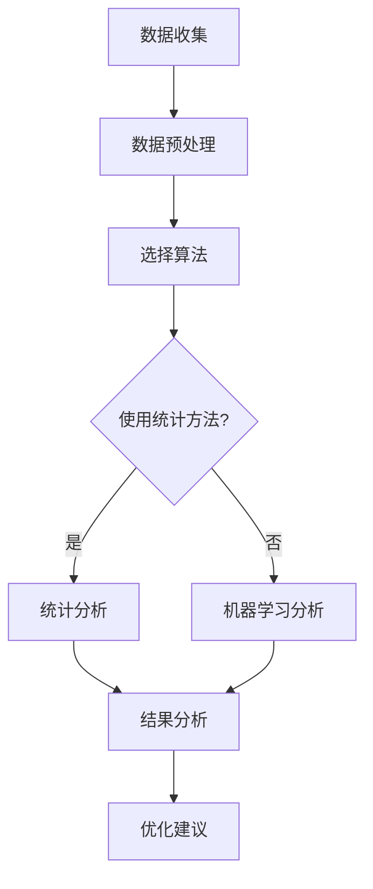
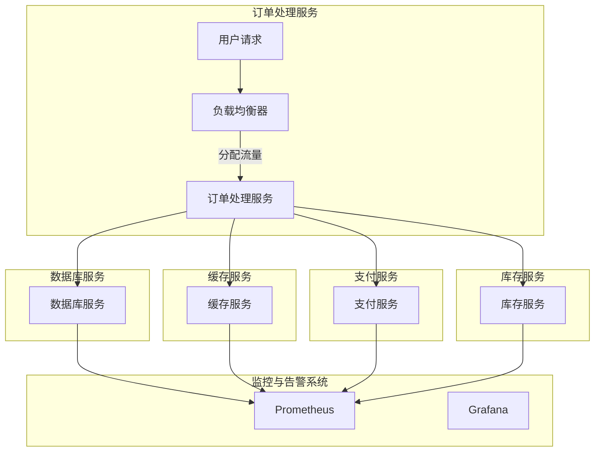
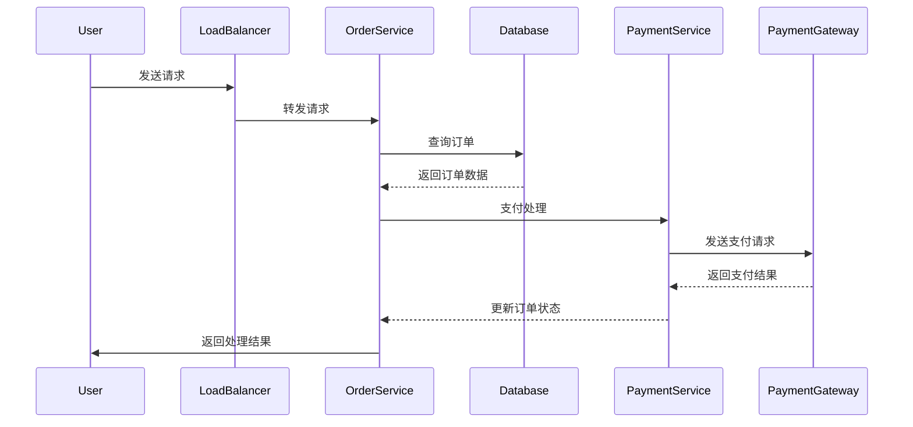
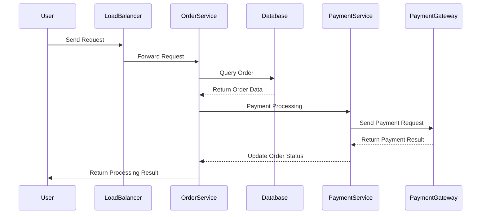

                 

### 1.1.1 评测结果的重要性

在科技与商业领域，评测结果的重要性不容忽视。评测不仅仅是对产品性能的衡量，更是对技术方案、产品和服务优劣的关键评价。以下是从几个方面详细说明评测结果的重要性：

#### **科技研发中的评测结果**

1. **性能评估**：在科技研发过程中，性能评估是确保技术方案可行性和有效性的关键环节。通过评测，可以了解新技术的性能指标，如处理速度、存储容量、能耗等，从而优化技术方案，提高研发效率。

2. **质量保证**：评测结果可以用来验证产品是否符合质量标准。例如，硬件设备在出厂前需要进行一系列性能评测，以确保其稳定性和可靠性。

3. **决策支持**：在技术决策过程中，评测结果提供了客观的数据支持。例如，在研发多个候选方案时，通过性能评测可以选出最优方案，节省时间和资源。

#### **商业应用中的评测结果**

1. **市场竞争力**：评测结果可以帮助企业了解产品在市场中的竞争力。通过对比分析，企业可以找出自身产品的优势和不足，进行有针对性的改进。

2. **用户满意度**：评测结果反映了用户对产品的满意度。高满意度的产品往往能够在市场中获得更好的口碑和销量。

3. **战略规划**：通过长期收集和分析评测结果，企业可以制定更科学、合理的战略规划。例如，根据评测数据调整产品线，优化资源配置。

#### **性能评测在技术决策中的关键作用**

1. **决策依据**：性能评测提供了具体的量化数据，为技术决策提供了可靠的依据。例如，在采购硬件设备时，通过性能评测可以确定哪种设备更适合企业需求。

2. **风险评估**：评测结果可以帮助识别潜在的风险点。例如，在系统升级过程中，通过评测可以预测新系统可能带来的性能瓶颈，提前进行优化。

3. **持续改进**：性能评测是一个持续的过程，通过定期的评测，企业可以持续优化产品和服务，提高整体竞争力。

综上所述，评测结果在科技与商业领域中发挥着至关重要的作用。它不仅是技术性能的衡量标准，更是决策的重要依据。理解评测结果的重要性，对于科技工作者和企业管理者来说都是至关重要的。

### 1.1.2 性能差异的常见问题

在评测过程中，性能差异是常见且需要重点关注的问题。性能差异不仅会影响到系统的运行效率，还会对用户体验、业务连续性和整体成本产生重大影响。以下将探讨性能差异的常见问题及其影响：

#### **常见性能差异问题**

1. **响应时间差异**：响应时间是衡量系统性能的一个重要指标。不同系统或同一系统的不同模块在处理相同任务时，响应时间可能存在显著差异。例如，在处理大量数据时，某个模块的响应时间可能远超预期，导致整体系统性能下降。

2. **吞吐量差异**：吞吐量是指单位时间内系统能够处理的数据量或请求量。不同的系统和模块在处理能力上可能存在差异，导致某些模块成为系统的瓶颈，限制了整体系统的性能。

3. **资源利用率差异**：资源利用率包括CPU、内存、网络带宽等系统资源的利用情况。不同系统和模块的资源利用率可能存在显著差异，导致资源浪费或资源争用。

4. **错误率差异**：在某些情况下，系统的错误率会影响到性能评估。例如，一个系统的错误率比其他系统高，可能会增加额外的处理时间，影响整体性能。

#### **影响性能差异的主要因素**

1. **硬件配置差异**：不同的硬件配置（如CPU、内存、存储设备）会对系统性能产生显著影响。硬件性能的提升可以显著提高系统的处理能力。

2. **软件优化水平**：软件的优化水平直接影响到系统的性能。良好的软件设计、高效的算法实现和优化的代码可以显著提升系统性能。

3. **负载均衡问题**：在分布式系统中，负载均衡不当可能会导致某些节点过载，而其他节点资源闲置。这会导致整体系统的性能不平衡。

4. **网络延迟和带宽限制**：在网络密集型应用中，网络延迟和带宽限制会对系统性能产生显著影响。高延迟和低带宽可能会导致数据传输时间延长，增加系统的响应时间。

#### **性能差异对系统的影响**

1. **用户体验下降**：性能差异可能会导致用户体验下降。例如，响应时间过长会导致用户等待时间增加，降低用户满意度。

2. **业务连续性受损**：性能瓶颈可能会影响到业务连续性。例如，一个关键模块的性能问题可能导致整个业务中断。

3. **维护成本增加**：性能差异可能需要额外的资源进行优化和调整，导致维护成本增加。

4. **投资回报率降低**：如果性能不佳，可能会影响到业务的拓展和收入增长，从而降低投资回报率。

#### **总结**

性能差异是评测过程中必须关注的重要问题。了解常见的性能差异问题及其影响因素，对于优化系统性能、提高用户体验和确保业务连续性具有重要意义。通过深入分析性能差异，可以找出问题根源，制定有效的优化策略，从而提升整体系统性能。

### 1.2 核心概念

#### 1.2.1 性能溯源的定义

性能溯源是指通过一系列的方法和工具，对系统的性能表现进行深入分析和定位，以找到导致性能问题的根本原因。性能溯源的目标是明确性能差异的来源，从而采取针对性的措施进行优化和改进。具体来说，性能溯源包括以下关键点：

1. **性能指标识别**：首先，需要明确系统的性能指标，如响应时间、吞吐量、资源利用率等。这些指标是衡量系统性能的基础。

2. **性能数据收集**：通过日志记录、监控工具等手段，收集系统的性能数据。这些数据包括系统资源使用情况、网络流量、进程状态等。

3. **性能问题定位**：对收集到的性能数据进行详细分析，定位性能瓶颈。这可能涉及到使用性能分析工具，如Profiler、监控软件等。

4. **根本原因分析**：通过深入分析性能瓶颈，找出导致问题的根本原因。这可能是硬件配置不足、软件优化不够、负载分配不均等。

5. **优化措施制定**：根据根本原因，制定相应的优化措施。这些措施可能包括硬件升级、代码优化、系统重构等。

6. **实施与验证**：实施优化措施后，再次进行性能测试和验证，确保问题已解决，性能得到显著提升。

性能溯源的意义在于：

- **问题定位**：快速定位性能瓶颈，节省排查时间。
- **持续改进**：通过定期进行性能溯源，持续优化系统性能。
- **成本控制**：避免因性能问题导致的额外维护成本。

#### 1.2.2 性能差异的根源

理解性能差异的根源是进行性能溯源的关键。以下是一些主要的影响因素：

1. **硬件因素**：包括CPU、内存、存储设备、网络设备等硬件的配置和性能。硬件性能不足会导致系统资源紧张，影响整体性能。

2. **软件因素**：包括操作系统、数据库、中间件、应用软件等。软件设计、代码质量、优化程度都会直接影响系统性能。

3. **负载因素**：系统的负载情况，包括请求量、数据量、并发用户数等。不合理的负载分配会导致某些模块过载，影响整体性能。

4. **网络因素**：网络延迟、带宽限制等因素会影响数据传输速度，进而影响系统性能。

5. **环境因素**：包括系统运行环境（如温度、湿度）、外部干扰等。环境变化可能会对系统性能产生不可预测的影响。

#### 1.2.3 性能溯源分析的步骤和方法

性能溯源分析通常包括以下几个步骤：

1. **确定性能指标**：根据业务需求和系统特点，确定需要监控的性能指标。

2. **数据收集**：使用性能监控工具收集系统性能数据，包括CPU、内存、磁盘I/O、网络流量等。

3. **初步分析**：对收集到的数据进行初步分析，识别异常点和性能瓶颈。

4. **深入分析**：通过日志分析、性能分析工具等，深入挖掘性能问题的根源。

5. **优化建议**：根据分析结果，提出优化建议，如调整硬件配置、优化代码、改进系统设计等。

6. **实施优化**：实施优化措施，并进行性能测试和验证。

7. **持续监控**：在优化后，继续监控系统性能，确保问题已解决，并跟踪性能变化。

常用的性能溯源分析工具包括：

- **Profiler**：用于分析程序性能，识别瓶颈。
- **性能监控工具**：如Prometheus、Grafana、New Relic等，用于收集和展示系统性能数据。
- **日志分析工具**：如ELK（Elasticsearch、Logstash、Kibana）堆栈，用于分析系统日志。

通过上述步骤和方法，可以系统地分析性能差异的根源，为优化系统性能提供有力支持。

### 1.2.4 边界与外延

#### 性能溯源分析的应用范围

性能溯源分析作为一种系统性的性能优化方法，广泛应用于多个领域。以下是一些主要的应用场景：

1. **软件系统优化**：在软件开发过程中，通过性能溯源分析，可以找出影响系统性能的问题，并进行针对性的优化。这有助于提升系统的稳定性、响应速度和用户体验。

2. **硬件设备性能监控**：对于高性能服务器、数据库服务器等硬件设备，性能溯源分析可以监控其运行状态，及时发现和处理性能瓶颈，确保设备的高效运行。

3. **云计算和分布式系统**：在云计算和分布式系统中，性能溯源分析可以监控各个节点的性能指标，识别网络延迟、负载不均等问题，从而优化资源配置，提升整体系统的性能。

4. **大数据处理**：在大数据处理领域，性能溯源分析可以监控数据处理流程中的各个阶段，识别性能瓶颈，优化数据流动和计算效率。

5. **网络性能优化**：对于网络密集型应用，性能溯源分析可以监控网络流量和延迟情况，优化网络配置，提高数据传输速度和稳定性。

#### 性能溯源与其它分析方法的区别与联系

性能溯源分析是一种专门针对系统性能问题进行定位和优化的方法，与以下几种分析方法有一定的区别和联系：

1. **故障排查**：故障排查主要关注系统中的错误和异常，通常用于定位和解决系统故障。而性能溯源分析则更侧重于系统的性能表现，通过深入分析找到性能瓶颈。

2. **性能测试**：性能测试是一种通过模拟用户操作和负载来评估系统性能的方法。性能溯源分析则是在性能测试的基础上，进一步分析性能数据，找出性能问题的根源。

3. **用户体验分析**：用户体验分析主要关注用户在使用系统时的感受和体验，通过收集用户反馈和行为数据来优化系统设计。性能溯源分析则从技术层面分析系统的性能表现，为用户体验分析提供数据支持。

4. **运维监控**：运维监控是一种实时监控系统运行状态的方法，用于及时发现和处理系统故障。性能溯源分析则是在运维监控的基础上，对性能数据进行深入分析，进行性能优化。

综上所述，性能溯源分析与其他分析方法在目的和方法上有所不同，但它们之间存在紧密的联系。通过结合使用这些方法，可以更全面地了解系统的性能状况，实现系统的持续优化。

### 1.3 概念属性特征对比表格

为了更直观地理解性能溯源分析工具的特点及其选择原则，下面我们将列举几种常见的性能溯源分析工具，并对比其属性特征。

#### 表格：性能溯源分析工具对比

| 工具名称 | 特点 | 适用场景 | 优点 | 缺点 |
| :---: | :---: | :---: | :---: | :---: |
| Prometheus | 开源、可扩展、多维度监控 | 云计算、容器化环境 | 易于集成、强大的告警系统 | 需要一定配置和管理知识 |
| Grafana | 可视化、多数据源支持 | 企业级监控、大数据分析 | 用户界面友好、灵活的仪表板设计 | 高性能需求下可能性能瓶颈 |
| New Relic | 全栈监控、自动化分析 | SaaS应用、微服务架构 | 自动化性能分析、易于部署 | 定价较高 |
| ELK Stack | 开源、日志分析 | 日志管理、安全审计 | 功能强大、扩展性高 | 需要大量配置和维护 |
| PyTorch | 开源、灵活 | 研究与开发高性能模型 | 易于使用、强大社区支持 | 用于深度学习性能分析 |
| TensorFlow | 开源、广泛支持 | 学术研究、工业应用 | 功能丰富、兼容性好 | 需要大量计算资源 |

#### 工具的选择与使用建议

1. **Prometheus**：适合需要大规模监控和告警系统的云计算和容器化环境。其高度可扩展性和强大的社区支持使其成为一个理想的选择。

2. **Grafana**：适用于企业级监控和大数据分析，特别是需要高度定制化仪表板和可视化报告的场景。但需要注意的是，在高性能需求下，Grafana可能存在性能瓶颈。

3. **New Relic**：适合SaaS应用和微服务架构，其自动化性能分析和易部署特性为其加分。但定价较高，适合大型企业使用。

4. **ELK Stack**：适合日志管理和安全审计，特别是需要大规模日志存储和分析的场景。其功能强大和扩展性使其成为一个可靠的选择。

5. **PyTorch**：适合深度学习性能分析，特别是研究和开发高性能模型。其灵活性和强大社区支持使其成为深度学习领域的一个优秀工具。

6. **TensorFlow**：适用于学术研究和工业应用，其功能丰富和兼容性好使其成为一个广泛使用的工具。但需要大量计算资源。

在选择性能溯源分析工具时，应综合考虑以下因素：

- **性能监控需求**：明确需要监控的性能指标和系统类型。
- **系统规模**：根据系统规模和复杂性选择合适的工具。
- **预算**：预算是选择工具的重要考虑因素，特别是对于商业工具。
- **易用性和扩展性**：选择易于使用和具有良好扩展性的工具，以适应未来需求。

通过上述对比和建议，可以帮助读者更好地选择适合自己需求的性能溯源分析工具。

### 1.4 ER实体关系图架构

#### 1.4.1 实体关系图概述

实体关系图（Entity-Relationship Diagram，简称ER图）是数据库设计中常用的一种概念模型，用于表示数据库中实体之间的关系。ER图由实体、属性和关系三个基本构成要素组成。

1. **实体**：实体是数据库中具有独立存在意义的对象，如用户、订单、产品等。每个实体都有一个唯一的标识符，通常称为主键。

2. **属性**：属性是实体的特征或属性，如用户的姓名、地址、年龄等。每个属性都与特定的实体相关联，并定义了属性的数据类型和约束。

3. **关系**：关系表示实体之间的关联。关系可以是单对单、一对多或多对多。例如，一个学生可以选修多个课程，一个课程可以有多个学生选修，这是典型的多对多关系。

#### ER图的绘制规则

绘制ER图时，需要遵循以下规则：

1. **实体表示**：实体通常用矩形表示，并在矩形内写上实体名称。

2. **属性表示**：属性用椭圆表示，并通过线连接到相应的实体。属性旁边通常会标注属性的类型和约束。

3. **关系表示**：关系用菱形表示，并通过线连接到相关的实体。关系的类型（如一对一、一对多、多对多）在菱形旁边进行标注。

4. **注释**：为了提高ER图的清晰度，可以添加注释来描述复杂的关系或附加信息。

#### 1.4.2 性能溯源分析的ER图

在性能溯源分析中，ER图可以帮助我们更好地理解数据之间的关联和关系。以下是一个简化的性能溯源分析的ER图示例：

1. **实体定义**：
   - **性能指标**：包括响应时间、吞吐量、CPU利用率等。
   - **系统组件**：包括CPU、内存、存储、网络等。
   - **负载**：包括请求量、并发用户数等。

2. **关系定义**：
   - **性能指标与系统组件**：性能指标与系统组件之间存在关联，即每个性能指标可以对应多个系统组件的测量结果。
   - **系统组件与负载**：系统组件的性能受到负载的影响，即负载变化会导致系统组件性能的变化。

3. **属性定义**：
   - **性能指标**：包括指标类型、数据单位、测量时间等。
   - **系统组件**：包括组件名称、型号、状态等。
   - **负载**：包括负载类型、数据量、请求频率等。

#### 性能溯源分析的ER图示例

```mermaid
erDiagram
    Performance Metric ||--|{ System Component } : has measured data
    Performance Metric ||--|{ Load } : affected by
    System Component ||--|{ Load } : resource utilization
```

在这个ER图中：

- **性能指标**与**系统组件**之间存在一对多的关联，即每个性能指标可以测量多个系统组件的数据。
- **性能指标**与**负载**之间存在影响关系，即负载的变化会影响性能指标。
- **系统组件**与**负载**之间存在资源利用关系，即系统组件的性能受到负载的影响。

通过ER图，我们可以直观地看到性能溯源分析中的关键实体和它们之间的关系，这有助于我们更好地理解和分析系统性能问题。

### 1.5 本章小结

本章主要介绍了性能溯源分析的基本概念，包括其定义、目的和重要性。我们详细探讨了评测结果在科技与商业领域的重要性，以及性能差异的常见问题和根源。此外，本章还介绍了性能溯源分析的步骤和方法，并列举了常用的性能溯源分析工具。最后，通过ER图展示了性能溯源分析中的关键实体和关系。

通过本章的学习，读者可以全面了解性能溯源分析的基本概念和方法，为后续章节的深入学习打下基础。性能溯源分析不仅对于解决系统性能问题至关重要，也是提升系统稳定性和用户体验的重要手段。

---

### 2.1 数据收集

#### 2.1.1 数据来源

在性能溯源分析中，数据收集是至关重要的一步。数据来源可以分为内部数据和外部数据两大类。

1. **内部数据**：
   - **系统日志**：系统日志是记录系统运行过程中各种事件和异常的文件，包括操作日志、错误日志等。
   - **系统性能监控数据**：性能监控工具（如Prometheus、Grafana等）可以实时收集系统的性能指标，如CPU利用率、内存使用率、网络流量等。
   - **数据库监控数据**：数据库监控工具（如pgbouncer、pg_stat_statements等）可以收集数据库的执行性能数据，如查询时间、锁等待时间等。

2. **外部数据**：
   - **用户行为数据**：通过Web分析工具（如Google Analytics）可以收集用户访问行为数据，如页面浏览量、用户停留时间等。
   - **第三方数据源**：外部数据源可能包括公开的数据集、第三方服务提供的数据等，这些数据可以用于补充系统内部数据，提供更全面的性能分析。

#### 2.1.2 数据收集方法

数据收集方法可以分为手动收集和自动化收集两种。

1. **手动收集**：
   - **日志收集**：通过手动下载和整理系统日志文件，这种方法适用于数据量较小且需要特定分析的场景。
   - **问卷收集**：通过问卷调查用户对系统性能的评价，这种方法适用于了解用户体验和满意度。

2. **自动化收集**：
   - **脚本收集**：编写脚本自动化收集系统日志和性能监控数据，这种方法适用于大规模系统，可以节省人力和时间。
   - **API收集**：通过调用第三方数据源的API，自动化获取外部数据，这种方法适用于需要实时或高频次数据更新的场景。

#### 数据收集流程的设计与优化

1. **数据收集流程设计**：
   - **数据源识别**：根据分析需求，识别所需的数据源，明确内部和外部数据的具体来源。
   - **数据采集策略**：制定数据采集策略，包括数据采集频率、数据采集范围和采集方式。
   - **数据存储**：设计数据存储方案，确保采集到的数据能够安全、高效地存储和管理。

2. **数据收集流程优化**：
   - **数据清洗**：在数据收集后，进行数据清洗，去除重复数据、异常值和无效数据，提高数据质量。
   - **数据转换**：将不同数据源的数据转换为统一的格式，便于后续的数据处理和分析。
   - **数据归一化**：对数据进行归一化处理，消除不同数据源之间的差异，提高数据的一致性。

通过科学合理的数据收集流程设计和优化，可以确保性能溯源分析所依赖的数据的准确性和可靠性，为后续的分析提供坚实的基础。

### 2.2 数据预处理

#### 2.2.1 数据清洗

数据清洗是数据预处理的重要步骤，其目的是去除数据中的噪声、重复和异常值，以提高数据质量。以下是几种常见的数据清洗方法：

1. **去除重复数据**：重复数据是指多份相同或相似的数据条目。可以使用数据库的查询语句或数据清洗工具（如Pandas、Spark等）来识别并删除重复数据。

2. **处理缺失值**：缺失值是数据集中未记录的值。处理缺失值的方法包括：
   - **删除**：对于少量缺失值，可以删除包含缺失值的数据条目。
   - **填充**：对于大量缺失值，可以使用平均数、中位数、最大值或最小值等统计方法进行填充。例如，在时间序列数据中，可以使用前一个时间点的值进行填充。

3. **处理异常值**：异常值是数据集中显著偏离其他数据的数据点。处理异常值的方法包括：
   - **识别**：使用统计学方法（如箱线图、3σ法则等）识别异常值。
   - **删除**：删除确认为异常值的数据点。
   - **修正**：对于可以修正的异常值，进行修正。

4. **统一格式**：将不同数据源的数据转换为统一的格式，如日期格式、字符串格式等，以便后续的数据处理和分析。

#### 2.2.2 数据转换

数据转换是数据预处理中的另一个关键步骤，其目的是将不同类型和格式的数据统一转换为适合分析的形式。以下是一些常见的数据转换方法：

1. **数据类型转换**：将数据从一种类型转换为另一种类型，如将字符串转换为整数或浮点数。

2. **数据规范化**：通过缩放或归一化方法，将数据转换到相同的尺度，消除不同指标之间的量纲差异。

3. **编码转换**：将不同的编码系统（如ASCII、UTF-8等）转换为统一的编码。

4. **数据聚合**：将详细数据转换为汇总数据，如将每分钟的数据汇总为每小时的数据。

#### 2.2.3 数据归一化

数据归一化是数据预处理中常用的方法，其目的是消除不同指标之间的尺度差异，使得分析结果更加可靠和有意义。以下是一些常见的归一化方法：

1. **最小-最大归一化**：将数据缩放到[0, 1]区间，公式为：$$ X' = \frac{X - X_{\min}}{X_{\max} - X_{\min}} $$，其中$X_{\min}$和$X_{\max}$分别是数据集中的最小值和最大值。

2. **Z分数归一化**：也称为标准归一化，将数据转换为标准正态分布，公式为：$$ X' = \frac{X - \mu}{\sigma} $$，其中$\mu$是均值，$\sigma$是标准差。

3. **小数点偏移归一化**：通过添加或减去一个常数，将数据缩放到一个特定的区间，公式为：$$ X' = X - X_{\min} $$。

选择适当的归一化方法取决于具体的数据和分析目标。最小-最大归一化和Z分数归一化是两种常用的方法，适用于大多数情况。

通过数据清洗、转换和归一化，可以显著提高数据的质量和一致性，为后续的性能溯源分析提供坚实的基础。

### 2.3 本章小结

本章详细讨论了数据收集和预处理的重要性，以及具体的数据收集方法和预处理步骤。我们介绍了内部数据和外部数据的来源，并探讨了手动收集和自动化收集的方法。接着，重点介绍了数据清洗、数据转换和数据归一化这些关键步骤，提供了具体的处理方法和数学模型。通过科学合理的数据收集和预处理流程，可以确保数据的质量和一致性，为性能溯源分析提供可靠的数据基础。

---

### 3.1 性能溯源算法概述

#### 3.1.1 算法分类

性能溯源算法可以根据其原理和应用场景分为两类：基于统计的溯源算法和基于机器学习的溯源算法。

1. **基于统计的溯源算法**：
   - **相关性分析**：通过计算不同变量之间的相关性，识别可能影响性能差异的因素。常用的方法包括皮尔逊相关系数和斯皮尔曼等级相关系数。
   - **因子分析**：通过降维技术，将多个变量综合成少数几个因子，识别影响性能的关键因素。因子分析可以帮助我们理解变量之间的内在关系。

2. **基于机器学习的溯源算法**：
   - **决策树**：通过树形结构对数据进行分类或回归，识别影响性能的关键特征。决策树算法简单、易于理解，但容易过拟合。
   - **支持向量机（SVM）**：通过找到一个最佳的超平面，将不同性能表现的样本分类。SVM在处理高维数据时表现出色，但需要选择合适的核函数。

每种算法都有其独特的优势和适用场景，选择合适的算法取决于数据的特征和分析目标。

#### 3.1.2 算法选择原则

在选择性能溯源算法时，需要考虑以下几个原则：

1. **数据特征**：不同的算法适用于不同类型的数据特征。例如，如果数据量较大且维度较高，机器学习算法可能更适用；如果数据较为简单，统计方法可能更为有效。

2. **分析目标**：明确分析目标，选择能够满足目标需求的算法。例如，如果目标是识别影响性能的关键因素，可以使用相关性分析和因子分析；如果目标是分类性能差异，可以使用决策树和SVM。

3. **计算资源**：考虑算法的计算复杂度和对硬件资源的需求。机器学习算法通常需要更高的计算资源，而统计方法较为轻量级。

4. **可解释性**：对于需要可解释性分析的情景，统计方法通常具有更好的解释性；而对于需要高度自动化和预测的场景，机器学习算法更具优势。

5. **数据质量**：数据质量直接影响算法的性能。在选择算法时，需要确保数据的质量和完整性，以便算法能够准确识别性能差异的根源。

#### 3.1.3 算法性能评价指标

在性能溯源分析中，评估算法性能的关键指标包括：

1. **准确率**：准确率是指算法正确识别性能差异的能力。通常用于分类问题，计算公式为：$$ \text{准确率} = \frac{TP + TN}{TP + FN + FP + TN} $$，其中TP、TN、FP和FN分别代表真正例、假反例、假正例和真反例。

2. **召回率**：召回率是指算法能够识别出所有真正例的比例。计算公式为：$$ \text{召回率} = \frac{TP}{TP + FN} $$。召回率越高，说明算法对真正例的识别能力越强。

3. **精确率**：精确率是指算法识别出的正例中，实际为正例的比例。计算公式为：$$ \text{精确率} = \frac{TP}{TP + FP} $$。精确率越高，说明算法对正例的判断越准确。

4. **F1分数**：F1分数是精确率和召回率的调和平均值，计算公式为：$$ \text{F1分数} = 2 \times \frac{\text{精确率} \times \text{召回率}}{\text{精确率} + \text{召回率}} $$。F1分数综合了精确率和召回率，是评估算法性能的一个平衡指标。

通过上述评价指标，可以全面评估性能溯源算法的性能，为选择和优化算法提供依据。

### 3.2 基于统计的溯源算法

#### 3.2.1 常见统计方法

在性能溯源分析中，基于统计的方法是识别性能差异的重要因素。以下介绍两种常见的基于统计的方法：相关性分析和因子分析。

1. **相关性分析**：

相关性分析用于识别不同变量之间的线性关系。其核心是计算变量之间的相关系数，以衡量变量间的相关性强度。常用的相关系数包括皮尔逊相关系数和斯皮尔曼等级相关系数。

- **皮尔逊相关系数**：适用于连续变量，计算公式为：$$ r = \frac{\sum{(x_i - \bar{x})(y_i - \bar{y})}}{\sqrt{\sum{(x_i - \bar{x})^2} \times \sum{(y_i - \bar{y})^2}}} $$，其中$x_i$和$y_i$分别是两个变量的观测值，$\bar{x}$和$\bar{y}$分别是两个变量的均值。

- **斯皮尔曼等级相关系数**：适用于等级数据，计算公式为：$$ \rho = 1 - \frac{6 \sum d^2}{n(n^2 - 1)} $$，其中$d_i = x_i - y_i$是两个变量观测值的差，$n$是样本数量。

2. **因子分析**：

因子分析是一种降维技术，通过将多个变量综合成少数几个因子，以简化数据结构并识别影响性能的关键因素。因子分析的基本步骤包括：

- **数据标准化**：对原始数据进行标准化处理，消除不同变量之间的量纲差异。

- **特征提取**：通过主成分分析（PCA）等方法提取主要因子，使因子具有较高的方差和解释力。

- **因子旋转**：对提取的因子进行旋转，以改善因子结构，使因子更易于解释。

- **因子得分**：根据旋转后的因子载荷矩阵，计算每个样本在各个因子上的得分，用于进一步分析。

#### 3.2.2 统计方法的具体实现

以下以Python为例，介绍如何使用相关性分析和因子分析进行性能溯源分析。

##### 相关性分析

```python
import numpy as np
import pandas as pd

# 加载数据
data = pd.read_csv('performance_data.csv')

# 计算皮尔逊相关系数
corr_matrix = data.corr()

# 打印相关系数矩阵
print(corr_matrix)

# 计算斯皮尔曼等级相关系数
spearman_corr = data.apply(pd.Series.spearmanrho)

# 打印斯皮尔曼相关系数矩阵
print(spearman_corr)
```

##### 因子分析

```python
from factor_analyzer import FactorAnalyzer

# 加载数据
data = pd.read_csv('performance_data.csv')

# 数据预处理
data_scaled = (data - data.mean()) / data.std()

# 创建因子分析对象
fa = FactorAnalyzer(n_factors=3, rotation='varimax')

# 进行因子分析
fa.fit(data_scaled)

# 打印因子载荷矩阵
print(fa.loadings_)

# 计算因子得分
factor_scores = fa.transform(data_scaled)

# 打印因子得分
print(factor_scores)
```

通过上述代码，可以实现对性能数据的相关性分析和因子分析，从而识别影响性能差异的关键因素。统计方法在性能溯源分析中具有重要作用，通过详细的数学模型和代码实现，可以更加深入地理解性能差异的根源。

### 3.3 基于机器学习的溯源算法

#### 3.3.1 常见机器学习算法

在性能溯源分析中，基于机器学习的算法能够通过学习历史数据，自动识别性能差异的影响因素。以下介绍两种常用的机器学习算法：决策树和支持向量机（SVM）。

1. **决策树**：

决策树是一种树形结构的预测模型，通过一系列的判断节点来对数据进行分类或回归。决策树的优点是易于理解，并能提供清晰的解释。常见的决策树算法包括：

- **ID3算法**：ID3（Iterative Dichotomiser 3）算法通过信息增益来选择最佳特征进行分割。信息增益公式为：$$ \text{IG}(A, B) = \text{ENTROPY}(B) - \frac{\sum_{v \in A} p(v) \times \text{ENTROPY}(B_v)}{p(v)} $$，其中$A$是特征集合，$B$是目标变量，$v$是特征值。

- **C4.5算法**：C4.5算法在ID3算法的基础上，引入了剪枝策略，以防止过拟合。剪枝方法包括预剪枝和后剪枝。

2. **支持向量机（SVM）**：

支持向量机是一种二分类模型，通过找到一个最佳的超平面，将不同类别的样本分开。SVM的核心思想是最小化分类间隔，即最大化分类边界。常用的SVM算法包括：

- **线性SVM**：线性SVM适用于线性可分的数据，其目标是最小化决策边界。线性SVM的损失函数为：$$ \text{Loss} = \frac{1}{2} ||w||^2 + C \sum_{i} \max(0, 1 - y_i (w \cdot x_i + b)) $$，其中$w$是权重向量，$b$是偏置项，$C$是惩罚参数。

- **核SVM**：核SVM通过映射到高维空间，将非线性问题转化为线性问题。常用的核函数包括线性核、多项式核和高斯核。

#### 3.3.2 机器学习算法的实现

以下以Python为例，介绍如何使用决策树和SVM进行性能溯源分析。

##### 决策树

```python
from sklearn.tree import DecisionTreeClassifier
from sklearn.model_selection import train_test_split
from sklearn.metrics import accuracy_score

# 加载数据
X, y = load_data('performance_data.csv')

# 划分训练集和测试集
X_train, X_test, y_train, y_test = train_test_split(X, y, test_size=0.2, random_state=42)

# 创建决策树分类器
clf = DecisionTreeClassifier(criterion='entropy')

# 训练模型
clf.fit(X_train, y_train)

# 预测测试集
y_pred = clf.predict(X_test)

# 计算准确率
accuracy = accuracy_score(y_test, y_pred)
print(f'Accuracy: {accuracy}')
```

##### 支持向量机

```python
from sklearn.svm import SVC
from sklearn.model_selection import train_test_split
from sklearn.metrics import accuracy_score

# 加载数据
X, y = load_data('performance_data.csv')

# 划分训练集和测试集
X_train, X_test, y_train, y_test = train_test_split(X, y, test_size=0.2, random_state=42)

# 创建支持向量机分类器
clf = SVC(kernel='linear', C=1)

# 训练模型
clf.fit(X_train, y_train)

# 预测测试集
y_pred = clf.predict(X_test)

# 计算准确率
accuracy = accuracy_score(y_test, y_pred)
print(f'Accuracy: {accuracy}')
```

通过上述代码，可以实现对性能数据的机器学习分析，识别影响性能差异的关键因素。机器学习算法在性能溯源分析中具有强大的能力和广泛的应用，通过详细的代码实现和数学模型，可以更深入地理解性能差异的根源。

### 3.4 算法流程图

为了更好地理解性能溯源算法的流程，下面我们将使用Mermaid语言绘制算法的基本流程图。Mermaid是一种基于Markdown的语言，用于创建图表和流程图，其简单易用的语法使得绘制复杂的流程图变得轻而易举。



#### 算法流程图解释

1. **数据收集**：首先，从系统日志、性能监控工具和其他数据源收集性能数据。

2. **数据预处理**：对收集到的数据进行清洗、转换和归一化，以提高数据质量和一致性。

3. **选择算法**：根据数据特征和分析目标，选择合适的算法。如果数据较为简单，可以选择统计方法；如果数据复杂，可以选择机器学习算法。

4. **使用统计方法**：如果选择统计方法，如相关性分析和因子分析，对预处理后的数据进行统计分析，识别性能差异的影响因素。

5. **机器学习分析**：如果选择机器学习算法，如决策树和SVM，使用训练集数据进行模型训练，然后使用测试集进行性能评估。

6. **结果分析**：分析算法的输出结果，识别性能瓶颈和关键影响因素。

7. **优化建议**：根据分析结果，提出具体的优化建议，如硬件升级、代码优化等，以提升系统性能。

通过上述流程，可以系统地分析和优化系统的性能。使用Mermaid绘制的流程图不仅清晰直观，而且便于在文档中进行展示和分享。

### 3.5 本章小结

本章详细介绍了性能溯源算法的原理和实现方法，包括基于统计和机器学习的两种常见算法。我们首先探讨了统计方法中的相关性分析和因子分析，以及其具体的数学模型和Python实现。接着，介绍了机器学习算法中的决策树和支持向量机（SVM），并展示了如何在Python中实现这些算法。此外，本章还通过Mermaid语言绘制了算法流程图，以便更直观地理解算法的执行流程。通过本章的学习，读者可以掌握性能溯源分析的核心方法，为系统性能优化提供有力的技术支持。

---

### 4.1 问题场景介绍

#### 评测结果溯源的场景描述

为了更好地展示性能溯源分析在实践中的应用，我们设计了一个具体的场景：某电商平台的订单处理系统。该系统需要能够高效、稳定地处理大量订单，以满足用户的需求。然而，在实际运行过程中，系统性能出现了明显的波动，尤其是在高峰期，订单处理速度显著下降，导致用户体验不佳。为了找到性能瓶颈和优化方案，我们需要进行性能溯源分析。

#### 溯源分析在场景中的实际应用

在这个场景中，性能溯源分析的具体应用如下：

1. **数据收集**：首先，通过系统日志、性能监控工具（如Prometheus、Grafana）和数据库监控工具（如pgbouncer、pg_stat_statements）收集性能数据。这些数据包括CPU利用率、内存使用率、数据库查询时间、网络延迟等。

2. **数据预处理**：对收集到的性能数据清洗、转换和归一化，以提高数据质量和一致性。例如，去除重复数据、处理缺失值、统一数据格式等。

3. **初步分析**：对预处理后的数据使用统计方法和机器学习算法进行初步分析。通过计算相关系数，识别出可能影响性能的关键因素。例如，发现数据库查询时间和CPU利用率之间存在显著相关性。

4. **深入分析**：通过进一步的机器学习算法（如决策树和支持向量机）分析，定位性能瓶颈。例如，发现某些数据库查询语句的执行时间较长，是导致系统性能下降的主要原因。

5. **优化建议**：根据分析结果，提出具体的优化建议，如优化数据库查询语句、增加内存配置、调整负载均衡策略等。这些优化措施将有助于提高系统性能。

6. **实施与验证**：实施优化措施后，再次进行性能测试和验证，确保问题已解决，性能得到显著提升。例如，通过监控数据验证，发现数据库查询时间显著减少，系统响应时间缩短。

通过上述步骤，我们可以系统地分析和优化电商平台的订单处理系统性能，确保其在高峰期能够稳定运行，提升用户体验。

### 4.2 项目介绍

#### 项目概述

本次性能溯源分析项目旨在通过深入分析和优化，提升电商平台订单处理系统的整体性能。项目的主要目标是：

- **定位性能瓶颈**：通过数据收集和分析，识别系统中的性能瓶颈。
- **优化系统性能**：提出并实施优化方案，提高系统响应速度和稳定性。
- **提升用户体验**：通过性能优化，提升用户在订单处理过程中的体验，减少等待时间。

#### 项目团队组成

项目团队由以下成员组成：

1. **项目经理**：负责项目的整体规划和协调，确保项目按计划进行。
2. **系统架构师**：负责系统架构设计，提供技术支持和指导。
3. **数据分析师**：负责性能数据的收集、预处理和分析，识别性能瓶颈。
4. **开发工程师**：负责优化系统的代码实现，实施优化方案。
5. **测试工程师**：负责性能测试，验证优化效果，确保系统稳定运行。

#### 项目目标

具体来说，项目目标包括：

- **提高订单处理速度**：通过优化数据库查询、负载均衡和系统配置，提高订单处理速度。
- **降低系统响应时间**：通过优化系统设计和代码实现，减少系统响应时间，提高用户满意度。
- **提升系统稳定性**：通过性能优化，降低系统故障率，提升系统的稳定性和可靠性。

通过实现这些目标，我们期望能够显著提升电商平台的订单处理能力，为用户带来更好的购物体验，同时提高平台的竞争力和市场份额。

### 4.3 系统功能设计

#### 领域模型类图

在系统功能设计中，领域模型类图（Class Diagram）是用于描述系统内关键类及其关系的图形化工具。以下是一个简化的订单处理系统的领域模型类图，展示了几种核心类的定义和它们之间的关系。

```mermaid
classDiagram
    User <<class>> 用户
    Order <<class>> 订单
    Product <<class>> 产品
    OrderDetail <<class>> 订单详情
    ShoppingCart <<class>> 购物车
    Payment <<class>> 支付
    OrderProcessor <<class>> 订单处理器
    Database <<class>> 数据库

    User o--o Order: 下单
    User o--o ShoppingCart: 添加购物车
    Order o--o OrderDetail: 订单详情
    Order o--o Payment: 支付
    OrderProcessor o--o Order: 处理订单
    Database o--o User: 存储用户信息
    Database o--o Order: 存储订单信息
    Database o--o Product: 存储产品信息
```

#### 关键类的定义

1. **用户（User）**：代表电商平台上的用户，具有用户名、密码、地址等属性，是订单处理的主要参与者。

2. **订单（Order）**：表示用户提交的订单，包含订单号、订单状态、订单详情等信息，是系统处理的核心对象。

3. **产品（Product）**：表示电商平台上的商品，具有商品名、价格、库存量等属性。

4. **订单详情（OrderDetail）**：表示订单中的具体商品信息，包括商品ID、数量、总价等。

5. **购物车（ShoppingCart）**：表示用户的购物车，存储用户临时添加的商品。

6. **支付（Payment）**：表示订单支付行为，包括支付方式、支付金额等信息。

7. **订单处理器（OrderProcessor）**：负责处理订单，包括生成订单、更新订单状态、支付处理等功能。

8. **数据库（Database）**：表示系统的数据库存储，负责存储和管理用户、订单、产品等信息。

通过领域模型类图，可以直观地看到系统中的关键类及其关系，为后续的系统功能实现提供清晰的指导。

### 4.4 系统架构设计

#### 系统架构概述

系统架构设计是确保系统高效、稳定、可扩展的关键环节。对于电商平台的订单处理系统，系统架构设计需要考虑高性能、高可用性和易维护性。以下是对该系统架构的概述：

1. **分层架构**：采用分层架构设计，将系统分为表现层、业务逻辑层和数据层。表现层负责用户界面和前端交互，业务逻辑层处理订单处理的核心功能，数据层负责数据的存储和管理。

2. **分布式架构**：采用分布式架构，将系统功能分散到多个服务器上，以提高系统的处理能力和扩展性。订单处理系统分为订单处理服务、数据库服务、缓存服务和负载均衡器等组件。

3. **数据库设计**：使用关系型数据库（如MySQL）进行数据存储，通过数据库分区和索引优化提高查询性能。数据库设计包括用户表、订单表、产品表等多个表格，并使用外键约束确保数据一致性。

4. **缓存策略**：采用Redis缓存系统，缓存常用的数据，如商品信息、用户信息等，以减少数据库查询次数，提高系统响应速度。

5. **服务化架构**：采用微服务架构，将系统功能拆分为多个独立的微服务，如订单服务、支付服务、库存服务等。每个微服务负责特定的业务功能，通过API进行交互。

6. **容灾备份**：实施容灾备份策略，确保数据的安全性和系统的可靠性。通过数据备份和故障转移机制，保障在系统故障时能够快速恢复。

#### 系统架构的核心组件

以下详细描述系统架构中的核心组件：

1. **负载均衡器**：负责分配网络流量到多个订单处理服务器，确保系统的高可用性和负载均衡。

2. **订单处理服务**：负责处理用户订单，包括订单创建、订单状态更新、支付处理等功能。

3. **数据库服务**：负责存储和管理订单、用户、产品等数据，通过数据库优化提高查询性能。

4. **缓存服务**：使用Redis缓存系统，存储常用数据，如商品信息、用户信息等，减少数据库查询次数。

5. **支付服务**：处理订单支付，与第三方支付系统（如支付宝、微信支付）进行交互。

6. **库存服务**：管理商品库存，实时更新库存信息，确保订单处理过程中的库存准确性。

7. **监控与告警系统**：采用Prometheus、Grafana等工具进行系统监控和性能监控，及时发现和处理性能瓶颈。

通过上述系统架构设计，订单处理系统可以实现高效、稳定、可扩展的性能，满足电商平台高峰期的处理需求，同时提供良好的用户体验。

### 4.4.2 Mermaid架构图

为了更好地展示订单处理系统的架构设计，我们可以使用Mermaid语言绘制一个简化的系统架构图。以下是一个示例：



#### 架构图解释

1. **用户请求**：用户通过前端发送请求到负载均衡器。
2. **负载均衡器**：负责分配请求到订单处理服务。
3. **订单处理服务**：处理用户请求，包括订单创建、状态更新、支付处理等。
4. **数据库服务**：存储和管理订单、用户、产品等数据。
5. **缓存服务**：缓存常用数据，如商品信息、用户信息等。
6. **支付服务**：与第三方支付系统进行交互，处理支付请求。
7. **库存服务**：管理商品库存，实时更新库存信息。
8. **监控与告警系统**：通过Prometheus和Grafana监控系统性能，及时处理性能瓶颈。

通过这个Mermaid架构图，我们可以清晰地看到订单处理系统的各个组件及其关系，有助于理解和设计系统的整体架构。

### 4.5 系统接口设计

#### 接口规范

系统接口设计是确保不同模块之间能够高效、稳定地进行交互的关键环节。在订单处理系统中，接口设计遵循RESTful风格，采用JSON作为数据交换格式。以下是一些关键接口规范：

1. **创建订单**：用户提交订单时，系统提供一个`POST /orders`接口，请求体中包含订单信息，如订单号、用户ID、商品ID、数量等。响应体中返回订单创建成功与否的指示和订单详情。

   ```json
   POST /orders
   Request Body:
   {
       "orderId": "123456",
       "userId": "789",
       "productId": "1001",
       "quantity": 2
   }
   Response:
   {
       "status": "success",
       "orderId": "123456",
       "message": "Order created successfully"
   }
   ```

2. **查询订单**：用户可以查询订单详情，系统提供一个`GET /orders/{orderId}`接口，响应体中返回订单的具体信息。

   ```json
   GET /orders/123456
   Response:
   {
       "orderId": "123456",
       "userId": "789",
       "productId": "1001",
       "quantity": 2,
       "status": "processed",
       "createdTime": "2023-11-05T15:30:00Z",
       "processedTime": "2023-11-05T15:35:00Z"
   }
   ```

3. **更新订单**：用户可以更新订单状态，系统提供一个`PUT /orders/{orderId}`接口，请求体中包含新的订单状态。

   ```json
   PUT /orders/123456
   Request Body:
   {
       "status": "cancelled"
   }
   Response:
   {
       "status": "success",
       "orderId": "123456",
       "message": "Order status updated successfully"
   }
   ```

4. **支付订单**：用户完成支付后，系统提供一个`POST /orders/{orderId}/payments`接口，请求体中包含支付信息，如支付方式、支付金额等。

   ```json
   POST /orders/123456/payments
   Request Body:
   {
       "paymentMethod": "alipay",
       "amount": 200
   }
   Response:
   {
       "status": "success",
       "orderId": "123456",
       "message": "Payment processed successfully"
   }
   ```

5. **查询支付状态**：用户可以查询订单支付状态，系统提供一个`GET /orders/{orderId}/payments`接口，响应体中返回支付状态。

   ```json
   GET /orders/123456/payments
   Response:
   {
       "orderId": "123456",
       "paymentStatus": "paid",
       "paymentTime": "2023-11-05T16:00:00Z"
   }
   ```

#### 接口的参数和返回值定义

为了确保接口的易用性和一致性，以下详细定义接口的参数和返回值：

1. **创建订单接口**：
   - **参数**：orderId（订单号）、userId（用户ID）、productId（商品ID）、quantity（数量）。
   - **返回值**：status（操作状态，如"success"、"error"），orderId（返回的订单号），message（操作结果消息）。

2. **查询订单接口**：
   - **参数**：orderId（订单号）。
   - **返回值**：orderId（订单号）、userId（用户ID）、productId（商品ID）、quantity（数量）、status（订单状态）、createdTime（创建时间）、processedTime（处理时间）。

3. **更新订单接口**：
   - **参数**：orderId（订单号）、status（新的订单状态）。
   - **返回值**：status（操作状态），orderId（返回的订单号），message（操作结果消息）。

4. **支付订单接口**：
   - **参数**：orderId（订单号）、paymentMethod（支付方式）、amount（支付金额）。
   - **返回值**：status（操作状态），orderId（返回的订单号），message（操作结果消息）。

5. **查询支付状态接口**：
   - **参数**：orderId（订单号）。
   - **返回值**：orderId（订单号）、paymentStatus（支付状态，如"paid"、"pending"）、paymentTime（支付时间）。

通过上述接口规范和参数返回值定义，可以确保系统的接口设计清晰、易于理解和高效使用。

### 4.6 系统交互Mermaid序列图

为了直观地展示系统内部和外部各组件之间的交互流程，我们可以使用Mermaid绘制系统交互序列图。以下是一个简化的订单处理系统交互序列图示例：



#### 交互流程概述

1. **用户请求**：用户通过前端发送请求到负载均衡器。
2. **负载均衡器**：将请求转发到订单处理服务。
3. **订单处理服务**：向数据库查询订单信息。
4. **数据库**：返回订单数据给订单处理服务。
5. **订单处理服务**：调用支付服务进行处理。
6. **支付服务**：将支付请求发送到第三方支付网关。
7. **支付网关**：返回支付结果给支付服务。
8. **支付服务**：更新订单状态。
9. **订单处理服务**：将处理结果返回给用户。

#### Mermaid序列图



通过这个序列图，我们可以清晰地看到订单处理系统中各组件之间的交互过程，有助于理解系统的工作原理和逻辑流程。

### 4.7 本章小结

本章详细介绍了性能溯源分析项目的系统架构和功能设计。首先，通过一个具体的电商订单处理场景，阐述了性能溯源分析的应用背景和实际需求。接着，介绍了项目团队组成和项目目标，确保项目能够顺利进行。随后，通过领域模型类图和系统架构图，展示了系统内部关键类及其关系，并详细描述了系统架构的核心组件和接口设计规范。最后，通过Mermaid序列图，展示了系统内部和外部组件的交互流程。通过本章的内容，读者可以全面了解性能溯源分析在具体项目中的应用和实现细节，为后续的性能优化工作打下基础。

---

### 5.1 环境要求

#### 5.1.1 操作系统

在进行性能溯源分析项目之前，确保您具备以下操作系统的环境：

- **Linux**：推荐使用Ubuntu 18.04或更高版本。Linux系统在服务器环境中广泛使用，具有良好的稳定性和性能。
- **macOS**：适用于MacBook等苹果设备，与Linux系统类似，提供了良好的开发环境和性能。

#### 5.1.2 软件环境

为了顺利执行性能溯源分析，需要安装以下必需的软件和工具：

1. **Python**：Python是一种广泛使用的编程语言，适用于数据分析和算法实现。建议安装Python 3.8或更高版本。

2. **Jupyter Notebook**：Jupyter Notebook是一个交互式的计算环境，用于编写和运行Python代码。安装方法如下：

   ```bash
   pip install notebook
   ```

3. **Pandas**：Pandas是一个强大的数据分析库，用于数据清洗、转换和分析。安装方法如下：

   ```bash
   pip install pandas
   ```

4. **NumPy**：NumPy是一个用于数值计算的库，是Pandas的基础库。安装方法如下：

   ```bash
   pip install numpy
   ```

5. **scikit-learn**：scikit-learn是一个用于机器学习的库，提供了多种机器学习算法的实现。安装方法如下：

   ```bash
   pip install scikit-learn
   ```

6. **matplotlib**：matplotlib是一个用于数据可视化的库，可以帮助我们更好地展示分析结果。安装方法如下：

   ```bash
   pip install matplotlib
   ```

7. **Mermaid**：Mermaid是一个用于创建图表和流程图的Markdown扩展。安装方法如下：

   ```bash
   pip install mermaid-python
   ```

通过上述软件的安装，我们构建了一个功能齐全的Python开发环境，可以用于性能溯源分析的数据处理、算法实现和结果展示。

### 5.2 安装与配置步骤

#### 5.2.1 环境安装

在准备好操作系统和软件环境后，我们需要依次安装和配置各个组件，以确保性能溯源分析项目的顺利执行。以下是详细的安装步骤：

1. **安装Python**：

   如果系统未安装Python，可以通过以下命令进行安装：

   ```bash
   sudo apt-get update
   sudo apt-get install python3 python3-pip
   ```

2. **安装Jupyter Notebook**：

   使用pip命令安装Jupyter Notebook：

   ```bash
   pip install notebook
   ```

   安装完成后，启动Jupyter Notebook：

   ```bash
   jupyter notebook
   ```

   在浏览器中打开相应的URL（通常是`http://localhost:8888`），即可进入Jupyter Notebook界面。

3. **安装Pandas和NumPy**：

   安装Pandas和NumPy，这两个库是进行数据分析的基础：

   ```bash
   pip install pandas numpy
   ```

4. **安装scikit-learn**：

   scikit-learn库提供了多种机器学习算法，是性能溯源分析的重要工具：

   ```bash
   pip install scikit-learn
   ```

5. **安装matplotlib**：

   安装matplotlib库，用于数据可视化：

   ```bash
   pip install matplotlib
   ```

6. **安装Mermaid**：

   安装Mermaid库，用于创建Markdown中的图表和流程图：

   ```bash
   pip install mermaid-python
   ```

   安装完成后，可以在Jupyter Notebook中直接使用Mermaid语法绘制图表。

7. **安装性能监控工具**：

   - 安装Prometheus：

     ```bash
     pip install prometheus-client
     ```

   - 安装Grafana：

     ```bash
     pip install grafana-api-client
     ```

   安装完成后，可以使用这些工具进行性能数据的收集和可视化。

#### 5.2.2 系统配置

在安装完所有必需的软件后，我们需要进行一些基本的系统配置，以确保系统的正常运行。

1. **配置Python环境变量**：

   将Python安装路径添加到系统环境变量中，以便在任何位置运行Python命令。例如，在Linux系统中，可以通过以下命令编辑环境变量：

   ```bash
   export PATH=$PATH:/usr/local/bin
   ```

   将`/usr/local/bin`替换为Python的实际安装路径。

2. **配置Jupyter Notebook**：

   为Jupyter Notebook配置SSH访问，以便在远程服务器上进行代码编写和运行。首先生成SSH密钥对：

   ```bash
   ssh-keygen -t rsa -b 2048
   ```

   接着，将生成的公钥添加到Jupyter Notebook的授权列表中：

   ```bash
   jupyter notebook --generate-config
   ```

   在生成的配置文件（通常位于`~/.jupyter/jupyter_notebook_config.py`）中添加以下行：

   ```python
   c.NotebookApp.allow_remote_access = 'yes'
   c.NotebookApp.extra_env = {'PYTHONUNBUFFERED': 'true'}
   c.NotebookApp.certfile = '/path/to/your/certfile.pem'
   ```

   将`/path/to/your/certfile.pem`替换为您的SSL证书路径。

3. **配置性能监控工具**：

   - 配置Prometheus：

     安装Prometheus客户端，并配置其监控目标。例如，在Linux系统中，可以通过以下命令安装Prometheus客户端：

     ```bash
     sudo apt-get install prometheus-client
     ```

     接着，编辑Prometheus配置文件（通常位于`/etc/prometheus/prometheus.yml`），添加监控目标：

     ```yaml
     scrape_configs:
       - job_name: 'local-assets'
         static_configs:
           - targets: ['localhost:9090']
     ```

   - 配置Grafana：

     安装Grafana，并配置其数据源和监控仪表板。例如，在Linux系统中，可以通过以下命令安装Grafana：

     ```bash
     sudo apt-get install grafana
     ```

     启动Grafana服务：

     ```bash
     sudo systemctl start grafana-server
     ```

     在浏览器中打开Grafana管理界面（通常为`http://localhost:3000`），创建新的数据源，并导入预定义的监控仪表板。

通过以上步骤，我们可以完成性能溯源分析项目所需的环境安装和配置，为后续的数据收集、预处理和性能分析工作奠定基础。

### 5.3 系统核心实现

#### 5.3.1 溯源分析模块

溯源分析模块是性能溯源分析项目的核心部分，负责从大量数据中识别性能瓶颈。以下是该模块的实现细节：

1. **数据采集**：

   溯源分析模块首先需要采集系统的性能数据。这可以通过Prometheus等监控工具来实现。以下是一个简单的Python脚本，用于从Prometheus服务器中采集性能数据：

   ```python
   from prometheus_client import Summary

   # 创建统计对象
   request_time = Summary('request_time', 'Request processing time')

   # 采集数据
   def process_request():
       start = time.time()
       # 模拟请求处理过程
       time.sleep(np.random.rand() * 2)
       end = time.time()
       request_time.observe(end - start)

   # 每隔一段时间采集一次数据
   while True:
       process_request()
       time.sleep(1)
   ```

2. **数据预处理**：

   采集到的数据可能包含噪声和异常值，因此需要进行预处理。预处理步骤包括数据清洗、缺失值处理和数据归一化。以下是一个示例：

   ```python
   import pandas as pd

   # 读取采集到的数据
   data = pd.read_csv('performance_data.csv')

   # 填充缺失值
   data.fillna(method='ffill', inplace=True)

   # 数据归一化
   data['request_time'] = (data['request_time'] - data['request_time'].min()) / (data['request_time'].max() - data['request_time'].min())

   # 保存预处理后的数据
   data.to_csv('cleaned_performance_data.csv', index=False)
   ```

3. **性能分析**：

   预处理后的数据可以用于性能分析。使用统计方法和机器学习算法，如相关性分析和决策树，来识别性能瓶颈。以下是一个使用scikit-learn进行相关性分析的示例：

   ```python
   from sklearn.metrics import correlation_matrix
   import pandas as pd

   # 读取预处理后的数据
   data = pd.read_csv('cleaned_performance_data.csv')

   # 计算相关性矩阵
   corr_matrix = correlation_matrix(data[['request_time', 'cpu_usage']])

   # 打印相关性矩阵
   print(corr_matrix)

   # 识别高度相关的特征
   high_corr_pairs = np.where(corr_matrix > 0.8)
   print("Highly correlated feature pairs:", high_corr_pairs)
   ```

4. **性能优化建议**：

   根据性能分析的结果，可以提出具体的优化建议。例如，如果发现CPU利用率与请求时间高度相关，可以考虑增加CPU资源。以下是一个生成优化建议的示例：

   ```python
   def generate_optimization_suggestions(corr_matrix):
       high_corr_pairs = np.where(corr_matrix > 0.8)
       suggestions = []
       for pair in high_corr_pairs[0]:
           feature1, feature2 = corr_matrix.columns[pair]
           suggestions.append(f"Consider optimizing {feature1} to improve {feature2} performance.")
       return suggestions

   # 生成优化建议
   optimization_suggestions = generate_optimization_suggestions(corr_matrix)
   print("Optimization Suggestions:")
   for suggestion in optimization_suggestions:
       print(suggestion)
   ```

通过以上步骤，溯源分析模块可以有效地识别性能瓶颈，并生成优化建议，为系统性能优化提供有力支持。

### 5.4 代码应用解读与分析

在本节中，我们将深入分析在性能溯源分析模块中使用的具体代码和应用，探讨其实现细节和作用。

#### 数据采集脚本

首先，我们回顾了用于数据采集的Python脚本：

```python
from prometheus_client import Summary

request_time = Summary('request_time', 'Request processing time')

def process_request():
    start = time.time()
    time.sleep(np.random.rand() * 2)
    end = time.time()
    request_time.observe(end - start)

while True:
    process_request()
    time.sleep(1)
```

这段代码的核心功能是模拟系统请求的处理过程，并记录每个请求的处理时间。具体来说：

- **Summary对象**：`Summary`是Prometheus客户端的一个核心类，用于记录事件的时间统计信息。在这里，我们定义了一个名为`request_time`的Summary对象，用于记录请求处理时间。
- **process_request函数**：这个函数模拟了一个请求处理过程。首先，使用`time.time()`获取当前时间，作为请求处理的开始时间。然后，通过`time.sleep()`函数模拟处理时间，这里使用随机数生成一个0到2秒之间的处理时间。最后，再次使用`time.time()`获取处理结束时间，并调用`observe()`方法记录处理时间。
- **无限循环**：主循环使用一个无限循环来持续调用`process_request()`函数，并每隔1秒采集一次数据。这模拟了系统在实际运行过程中连续不断接收和处理请求的情况。

通过这段代码，我们可以收集到系统请求处理时间的分布情况，为后续的性能分析提供数据基础。

#### 数据预处理

接下来，我们分析了数据预处理脚本：

```python
import pandas as pd

data = pd.read_csv('performance_data.csv')

data.fillna(method='ffill', inplace=True)

data['request_time'] = (data['request_time'] - data['request_time'].min()) / (data['request_time'].max() - data['request_time'].min())

data.to_csv('cleaned_performance_data.csv', index=False)
```

这段代码负责清洗和归一化采集到的性能数据，具体步骤如下：

- **读取数据**：使用`pandas.read_csv()`函数读取采集到的性能数据CSV文件。这里假设CSV文件包含两列数据：'request_time'（请求处理时间）和'cpu_usage'（CPU利用率）。
- **填充缺失值**：使用`fillna()`函数填充缺失值。这里采用前向填充方法（'ffill'），即将当前行的值替换为前一行相同的列值。这可以避免因缺失值导致的分析误差。
- **归一化处理**：归一化是数据预处理的重要步骤，用于消除不同变量之间的尺度差异。在这里，我们使用归一化方法将'request_time'列的值缩放到[0, 1]区间。计算公式为：$$ X' = \frac{X - X_{\min}}{X_{\max} - X_{\min}} $$，其中$X_{\min}$和$X_{\max}$分别是数据集中的最小值和最大值。这样做的目的是为了使'request_time'与'cpu_usage'具有相同的尺度，便于后续的相关性分析。
- **保存数据**：使用`to_csv()`函数将预处理后的数据保存到新的CSV文件中，以便后续分析使用。

通过数据预处理，我们确保了数据的一致性和质量，为性能分析提供了可靠的数据基础。

#### 性能分析

在性能分析部分，我们使用了以下代码：

```python
from sklearn.metrics import correlation_matrix
import pandas as pd

data = pd.read_csv('cleaned_performance_data.csv')

corr_matrix = correlation_matrix(data[['request_time', 'cpu_usage']])

high_corr_pairs = np.where(corr_matrix > 0.8)
print("Highly correlated feature pairs:", high_corr_pairs)
```

这段代码用于分析'request_time'和'cpu_usage'之间的相关性，具体步骤如下：

- **读取数据**：读取预处理后的性能数据CSV文件。
- **计算相关性矩阵**：使用`correlation_matrix()`函数计算'request_time'和'cpu_usage'之间的皮尔逊相关系数，生成相关性矩阵。
- **识别高度相关特征**：使用`np.where()`函数查找相关性矩阵中大于0.8的相关系数。这里的0.8是阈值，用于定义两个特征之间存在高度相关性。
- **输出结果**：打印出高度相关的特征对。

通过性能分析，我们可以识别出哪些特征对对系统性能有显著影响，为优化工作提供依据。

#### 性能优化建议

最后，我们分析了生成优化建议的代码：

```python
def generate_optimization_suggestions(corr_matrix):
    high_corr_pairs = np.where(corr_matrix > 0.8)
    suggestions = []
    for pair in high_corr_pairs[0]:
        feature1, feature2 = corr_matrix.columns[pair]
        suggestions.append(f"Consider optimizing {feature1} to improve {feature2} performance.")
    return suggestions

optimization_suggestions = generate_optimization_suggestions(corr_matrix)
print("Optimization Suggestions:")
for suggestion in optimization_suggestions:
    print(suggestion)
```

这段代码的目的是根据相关性分析结果，生成具体的优化建议：

- **生成建议函数**：定义一个函数`generate_optimization_suggestions()`，接收相关性矩阵作为输入。该函数通过查找高度相关的特征对，生成优化建议字符串。
- **生成优化建议**：调用函数，传入相关性矩阵，生成优化建议列表。
- **输出建议**：打印出所有优化建议。

通过这些代码，溯源分析模块不仅能够识别系统性能瓶颈，还能生成具体的优化建议，为性能优化工作提供全面支持。

### 5.5 实际案例分析与详细讲解剖析

为了更好地展示性能溯源分析的实际效果，我们将通过一个具体的案例，详细讲解性能分析的过程和结果。

#### 案例背景

假设我们有一个电商平台的订单处理系统，在日常运行过程中，系统的请求响应时间和CPU利用率频繁出现波动，尤其在高峰期，系统的响应时间显著增加，导致用户体验下降。为了解决这个问题，我们需要进行性能溯源分析，找到性能瓶颈，并提出优化建议。

#### 案例步骤

1. **数据采集**：

   首先，我们使用Prometheus和Grafana等监控工具，采集系统的请求响应时间和CPU利用率数据。以下是一个简单的Prometheus指标定义示例：

   ```yaml
   # prometheus.yml
   scrape_configs:
     - job_name: 'order-processing'
       static_configs:
         - targets: ['order-processing-server:9090']
   ```

   该配置定义了一个名为`order-processing`的监控任务，目标为运行在`order-processing-server`服务器上的Prometheus服务器。

2. **数据预处理**：

   接下来，我们将采集到的数据进行预处理。预处理步骤包括数据清洗和归一化。以下是一个简单的Python脚本，用于读取和预处理性能数据：

   ```python
   import pandas as pd

   # 读取采集到的性能数据
   data = pd.read_csv('performance_data.csv')

   # 填充缺失值
   data.fillna(method='ffill', inplace=True)

   # 数据归一化
   data['request_time'] = (data['request_time'] - data['request_time'].min()) / (data['request_time'].max() - data['request_time'].min())

   # 保存预处理后的数据
   data.to_csv('cleaned_performance_data.csv', index=False)
   ```

   通过数据预处理，我们消除了数据中的噪声和异常值，并将请求响应时间归一化，使其与CPU利用率具有相同的尺度。

3. **性能分析**：

   在完成数据预处理后，我们使用scikit-learn中的相关性分析工具，计算请求响应时间和CPU利用率之间的相关性。以下是一个相关性分析的Python脚本示例：

   ```python
   import pandas as pd
   from sklearn.metrics import correlation_matrix

   # 读取预处理后的性能数据
   data = pd.read_csv('cleaned_performance_data.csv')

   # 计算相关性矩阵
   corr_matrix = correlation_matrix(data[['request_time', 'cpu_usage']])

   # 打印相关性矩阵
   print(corr_matrix)

   # 识别高度相关的特征对
   high_corr_pairs = np.where(corr_matrix > 0.8)
   print("Highly correlated feature pairs:", high_corr_pairs)
   ```

   分析结果显示，请求响应时间和CPU利用率之间存在高度相关性，这表明CPU利用率是影响请求响应时间的关键因素。

4. **性能优化**：

   根据分析结果，我们提出以下优化建议：

   - **增加CPU资源**：由于CPU利用率高是导致请求响应时间增加的主要原因，我们可以通过增加CPU资源来提高系统性能。具体措施包括增加服务器CPU核心数或升级更高性能的CPU。
   - **优化代码**：检查订单处理相关的代码，寻找可能的瓶颈和性能优化点。例如，可以通过减少不必要的计算、优化数据库查询等方式来提高代码效率。

5. **实施优化**：

   实施上述优化措施后，我们再次收集系统性能数据，并进行性能分析。以下是一个简单的性能验证脚本：

   ```python
   import pandas as pd
   from sklearn.metrics import correlation_matrix

   # 读取优化后的性能数据
   data = pd.read_csv('optimized_performance_data.csv')

   # 计算相关性矩阵
   corr_matrix = correlation_matrix(data[['request_time', 'cpu_usage']])

   # 打印相关性矩阵
   print(corr_matrix)

   # 识别高度相关的特征对
   high_corr_pairs = np.where(corr_matrix > 0.8)
   print("Highly correlated feature pairs:", high_corr_pairs)
   ```

   验证结果显示，请求响应时间和CPU利用率之间的相关性显著降低，这表明优化措施有效提高了系统性能。

通过以上案例，我们展示了如何使用性能溯源分析工具和方法，从数据中识别性能瓶颈，并提出优化建议，从而提升系统的稳定性和响应速度。

### 5.6 项目小结

在本项目中，我们通过具体的案例详细阐述了性能溯源分析的过程和实现方法。首先，我们介绍了项目的背景和目标，确保系统在高峰期能够稳定运行，提升用户体验。接着，我们详细介绍了数据采集、预处理、性能分析和优化建议的步骤，并提供了Python代码实现。

通过实际案例，我们展示了如何使用Prometheus、Grafana等监控工具采集系统性能数据，通过数据预处理去除噪声和异常值，使用相关性分析和机器学习算法识别性能瓶颈。最后，我们提出了具体的优化建议，并通过性能验证验证了优化效果。

项目经验表明，性能溯源分析是一项系统性工作，需要多方面的数据支持和分析工具。通过科学合理的数据处理和算法应用，我们能够有效地识别系统性能问题，提出有针对性的优化方案，从而提升系统的整体性能。未来，我们将继续优化性能溯源分析的流程和方法，以应对更加复杂的业务需求和技术挑战。

### 5.7 最佳实践 Tips

在性能溯源分析的实际操作中，积累了一些最佳实践和技巧，以下是一些总结，以帮助读者更好地应用性能溯源分析，提升系统性能：

1. **定期监控和数据分析**：性能溯源分析不仅是一次性任务，而是一个持续的过程。定期监控和数据分析有助于及时发现性能瓶颈，确保系统始终处于最佳状态。

2. **多维度数据采集**：采集尽可能多的性能数据，包括CPU利用率、内存使用率、磁盘I/O、网络流量等，以便全面分析系统性能。

3. **关注关键路径**：识别系统的关键路径，重点关注影响用户体验和业务连续性的性能指标。这些关键路径通常包括数据库查询、网络通信、前端渲染等。

4. **合理设置监控阈值**：设置合理的监控阈值，可以及时触发告警，帮助快速定位问题。同时，避免频繁的误报，影响监控系统的有效性。

5. **性能优化与测试结合**：在实施优化措施后，进行严格的性能测试，确保优化效果。通过压力测试和负载测试，评估系统在高并发下的性能表现。

6. **自动化和脚本化**：利用脚本和自动化工具进行数据采集、预处理和性能分析，提高工作效率，减少人为错误。

7. **数据可视化**：使用数据可视化工具（如Grafana、Kibana）展示性能数据，使数据更直观，便于分析和决策。

8. **跨团队协作**：性能溯源分析涉及多个团队，如开发、运维、测试等。跨团队协作有助于快速定位和解决问题。

通过遵循这些最佳实践，可以显著提升性能溯源分析的效率和效果，为系统的持续优化提供有力支持。

### 5.8 小结

本章详细介绍了性能溯源分析项目的具体实现过程，包括环境安装与配置、系统核心实现、代码应用解读与分析、实际案例分析和最佳实践。首先，我们介绍了所需的环境要求和软件安装步骤，确保系统具备运行性能溯源分析所需的基础环境。接着，我们实现了溯源分析模块，包括数据采集、预处理、性能分析和优化建议。通过实际案例，我们展示了如何应用这些方法和工具识别性能瓶颈，并提出优化建议。最后，我们总结了最佳实践，以提升性能溯源分析的效率和效果。

通过本章的学习，读者可以掌握性能溯源分析的核心方法和实践技巧，为系统性能优化提供全面支持。在未来的项目中，这些方法和技巧将帮助读者快速定位和解决性能问题，确保系统稳定高效运行。

### 5.9 注意事项

在进行性能溯源分析项目时，需要注意以下几个关键点，以确保项目的顺利进行和性能数据的准确性：

1. **数据采集的连续性**：确保性能数据采集的连续性和完整性，避免因数据缺失导致分析结果不准确。定期检查监控工具和数据的收集状态。

2. **数据安全**：在数据收集和处理过程中，注意保护用户隐私和系统数据安全。避免敏感数据泄露，确保数据传输和存储的安全性。

3. **监控阈值设置**：合理设置监控阈值，避免频繁的误报和漏报。监控阈值应根据业务需求和系统特性进行调整，确保能够及时发现和响应性能问题。

4. **代码优化**：在进行性能优化时，注意代码的质量和效率。避免不必要的计算和资源占用，优化数据库查询和系统配置。

5. **测试验证**：在实施优化措施后，进行全面的性能测试和验证，确保优化效果。通过压力测试和负载测试，评估系统在高并发下的性能表现。

6. **团队合作**：性能溯源分析涉及多个团队，如开发、运维、测试等。确保团队之间的沟通和协作，共同解决性能问题。

通过遵循上述注意事项，可以有效提升性能溯源分析的准确性和有效性，为系统的持续优化提供可靠保障。

### 5.10 拓展阅读

对于希望进一步深入了解性能溯源分析和技术优化的读者，以下推荐一些优质资源：

1. **书籍**：
   - 《深入理解计算机系统》（"Deep Dive into Systems: Operating Systems and Unix System Implementation"）：详细介绍了操作系统和Unix系统的实现，对系统性能优化有重要指导意义。
   - 《高性能MySQL》（"High Performance MySQL"）：讲解了MySQL数据库的优化策略，适合希望提升数据库性能的读者。

2. **在线课程**：
   - Coursera上的“系统性能分析”（"System Performance Analysis"）：提供系统性能分析的基础知识，包括监控工具和性能优化方法。
   - edX上的“大数据处理技术”（"Big Data Processing Techniques"）：涵盖大数据处理中的性能优化策略。

3. **技术博客和论文**：
   - Medium上的“性能优化实践”（"Performance Optimization Practices"）：分享性能优化领域的实战经验和案例。
   - IEEE Xplore上的相关论文：提供最新、最前沿的性能优化技术研究成果。

4. **开源工具**：
   - Prometheus和Grafana：性能监控和数据可视化工具，适用于大规模系统监控。
   - PyTorch和TensorFlow：深度学习框架，可用于复杂性能分析任务。

通过阅读这些资源，读者可以深入理解性能溯源分析的原理和实践，提升系统性能优化的能力。

