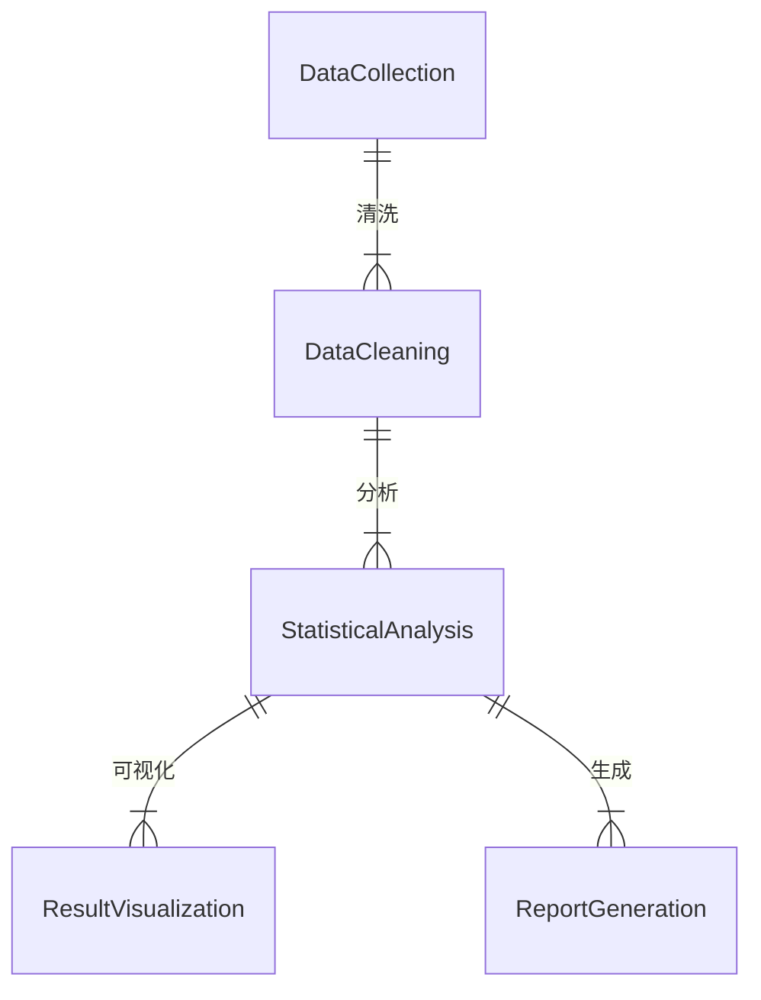
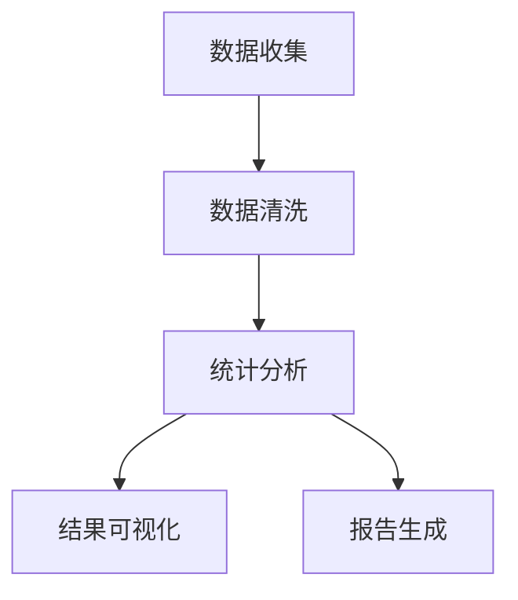
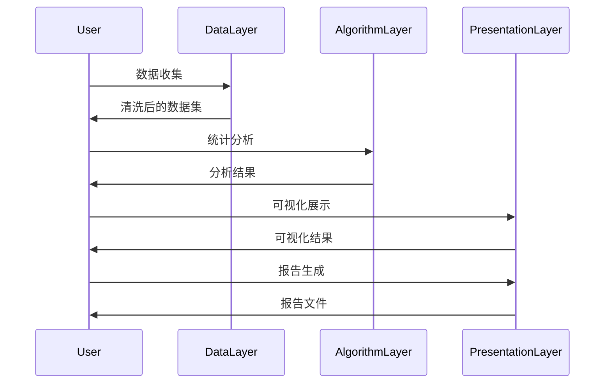
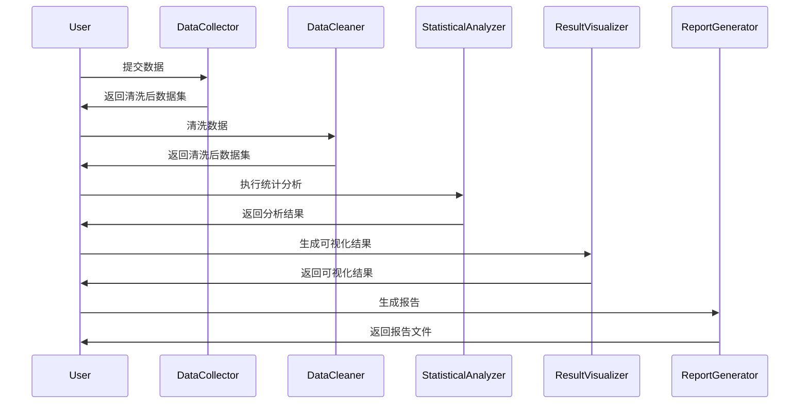

                 

### 第一部分：背景介绍

#### 第1章：问题背景

##### 1.1 问题背景

在现代信息社会中，数据的产生和积累速度极为迅速，各行各业都面临大量数据的处理需求。评测结果作为数据分析的重要组成部分，其准确性和可靠性直接影响到决策的质量。评测结果可能来源于市场调研、产品测试、教育评估等多个领域，具有数据量大、维度复杂、结果多样等特征。因此，如何有效地对评测结果进行统计分析与报告生成，成为一个亟待解决的问题。

##### 1.1.1 引言

随着科技的进步，数据分析已经成为各类组织和企业的重要工具。评测结果的统计分析不仅能帮助企业更好地了解市场动态，优化产品性能，还能为教育机构提供科学的评估标准，提高教学质量。然而，评测结果的统计分析并非易事，涉及到数据处理、算法选择、结果解释等多个环节。如何在复杂的数据环境中，高效、准确地完成评测结果的统计分析与报告生成，成为当前研究的热点。

##### 1.1.2 问题背景

在数据分析过程中，评测结果的统计与分析通常面临以下挑战：

1. **数据预处理**：原始数据可能存在缺失、异常值、噪声等问题，需要通过清洗和预处理来提高数据质量。
2. **算法选择**：针对不同类型的数据和需求，需要选择合适的统计分析方法，如回归分析、聚类分析、因子分析等。
3. **结果解释**：统计分析结果需要转化为易于理解的形式，以供决策者参考。
4. **报告生成**：如何将分析结果转化为结构化的报告，使其具备直观性、可操作性和可追溯性。

##### 1.1.3 研究意义

对评测结果进行统计分析与报告生成具有重要意义：

1. **决策支持**：准确的评测结果分析能够为企业的战略决策提供科学依据，有助于提高市场竞争力。
2. **质量提升**：通过分析评测结果，可以发现产品或服务的不足，从而进行改进，提升质量。
3. **资源优化**：合理的评测结果分析能够帮助教育机构优化资源配置，提高教学效果。
4. **风险管理**：评测结果分析能够揭示潜在的风险，为企业提供防范措施。

##### 1.1.4 问题描述

评测结果的统计分析与报告生成主要包括以下几个步骤：

1. **数据收集**：从各种渠道收集评测数据，如调查问卷、测试记录等。
2. **数据清洗**：处理缺失值、异常值和噪声，提高数据质量。
3. **数据分析**：选择合适的统计方法，对数据进行处理和分析。
4. **结果可视化**：将分析结果以图表等形式进行可视化展示。
5. **报告生成**：编写结构化的报告，包含分析结果和解释。

##### 1.1.5 问题分析

在评测结果的统计分析与报告生成过程中，主要存在以下几个问题：

1. **数据复杂性**：评测数据往往具有高维度、多样性和不均匀分布等特点，增加了数据分析的难度。
2. **算法选择不当**：未能根据具体需求选择合适的统计方法，导致分析结果不准确。
3. **结果解释困难**：分析结果难以用直观的形式展示，影响决策者的理解。
4. **报告生成效率低**：报告生成过程耗时，且缺乏自动化工具支持。

##### 1.1.6 解决方案

为了解决上述问题，可以从以下几个方面入手：

1. **数据预处理**：采用先进的清洗算法和技术，提高数据质量。
2. **算法优化**：根据具体需求，选择合适的统计分析方法，并不断优化算法。
3. **结果可视化**：利用可视化工具，将分析结果以直观、易懂的形式展示。
4. **报告自动化**：开发自动化报告生成工具，提高报告生成效率。

##### 1.1.7 边界与外延

本文主要关注评测结果的统计分析与报告生成的一般性问题，但以下因素可能对研究产生影响：

1. **数据来源**：不同来源的数据可能具有不同的特性和处理方法。
2. **应用场景**：评测结果的应用场景不同，可能需要不同的分析方法和报告格式。
3. **技术发展**：随着科技的进步，数据分析方法和工具将不断更新，需要不断学习和适应。

##### 1.1.8 相关研究

近年来，关于评测结果的统计分析与报告生成的研究已经取得了显著成果，例如：

1. **数据预处理技术**：针对高维度、非均匀分布等数据特性，提出了一系列有效的数据清洗算法。
2. **统计分析方法**：针对不同类型的数据和需求，提出了一系列先进的统计方法，如机器学习、深度学习等。
3. **结果可视化**：开发了一系列可视化工具，如Tableau、PowerBI等，提高了结果展示的直观性。
4. **报告自动化**：提出了一系列自动化报告生成工具，如Python的Jupyter Notebook、RMarkdown等。

#### 第2章：核心概念与联系

##### 2.1 核心概念

在评测结果的统计分析与报告生成过程中，涉及多个核心概念，包括：

1. **数据收集**：指从各种渠道获取评测数据的过程。
2. **数据清洗**：指处理数据中的缺失值、异常值和噪声的过程。
3. **统计分析**：指利用统计学方法对数据进行处理和分析的过程。
4. **结果可视化**：指将分析结果以图表等形式直观展示的过程。
5. **报告生成**：指编写结构化报告，包含分析结果和解释的过程。

##### 2.2 概念属性特征对比表

以下是核心概念的属性特征对比表：

| 概念       | 属性                   | 特征                |
|------------|------------------------|--------------------|
| 数据收集   | 数据来源、数据类型、数据量 | 多样性、实时性、完整性 |
| 数据清洗   | 清洗算法、清洗标准、清洗结果 | 高效性、准确性、一致性 |
| 统计分析   | 统计方法、数据分析结果、分析工具 | 精确性、适应性、直观性 |
| 结果可视化 | 可视化工具、可视化结果、可视化效果 | 直观性、易读性、互动性 |
| 报告生成   | 报告结构、报告格式、报告内容 | 系统性、结构性、操作性 |

##### 2.3 ER实体关系图

以下是评测结果的统计分析与报告生成的ER实体关系图：



#### 第3章：算法原理讲解

##### 3.1 算法流程图

以下是评测结果统计分析与报告生成的算法流程图：



##### 3.2 Python源代码实现

以下是评测结果统计分析与报告生成的Python源代码实现：

```python
import pandas as pd
from sklearn.impute import SimpleImputer
from sklearn.preprocessing import StandardScaler
from sklearn.cluster import KMeans
import matplotlib.pyplot as plt
import seaborn as sns

# 数据收集
data = pd.read_csv('evaluation_results.csv')

# 数据清洗
imputer = SimpleImputer(strategy='mean')
cleaned_data = imputer.fit_transform(data)

# 统计分析
scaler = StandardScaler()
scaled_data = scaler.fit_transform(cleaned_data)

kmeans = KMeans(n_clusters=3)
clusters = kmeans.fit_predict(scaled_data)

# 结果可视化
sns.scatterplot(x=scaled_data[:, 0], y=scaled_data[:, 1], hue=clusters, palette='viridis')
plt.title('Cluster Visualization')
plt.show()

# 报告生成
report = pd.DataFrame({
    'Cluster': clusters,
    'Cluster Size': [clusters.value_counts().values]
})
report.to_csv('evaluation_report.csv', index=False)
```

##### 3.3 数学模型与公式

以下是评测结果统计分析与报告生成的数学模型与公式：

$$
\text{数据清洗}：\quad \hat{x}_{ij} = \frac{1}{n}\sum_{i=1}^{n}x_{ij}
$$

$$
\text{标准化}：\quad z_{ij} = \frac{x_{ij} - \bar{x}}{\sigma}
$$

$$
\text{聚类}：\quad c_{k} = \frac{1}{n}\sum_{i=1}^{n}\delta_{ik}
$$

##### 3.4 举例说明

假设我们有如下评测结果数据：

| ID | Feature1 | Feature2 | Feature3 |
|----|----------|----------|----------|
| 1  | 10       | 20       | 30       |
| 2  | 15       | 25       | 35       |
| 3  | 12       | 22       | 32       |

1. **数据收集**：数据已收集在`evaluation_results.csv`文件中。
2. **数据清洗**：处理缺失值和异常值。
3. **统计分析**：使用K-Means算法进行聚类分析。
4. **结果可视化**：绘制聚类散点图。
5. **报告生成**：生成包含聚类结果的CSV报告文件。

### 第二部分：系统分析与架构设计方案

#### 第4章：问题场景介绍

##### 4.1 场景一：市场调研

在市场调研场景中，企业希望通过评测结果了解消费者对某产品的满意度，以便进行产品改进。评测数据可能包括满意度评分、购买意向、使用频率等。

##### 4.1.1 情境描述

一家电子产品公司希望了解消费者对其最新款智能手机的满意度。公司设计了一份调查问卷，收集了500名消费者的评测数据。

##### 4.1.2 需求分析

1. **数据收集**：需要收集满意度评分、购买意向、使用频率等数据。
2. **数据清洗**：处理缺失值、异常值和噪声，保证数据质量。
3. **统计分析**：分析满意度评分的分布、购买意向的比例、使用频率的分布等。
4. **结果可视化**：展示满意度评分的箱线图、购买意向的饼图、使用频率的条形图等。
5. **报告生成**：生成包含分析结果和解释的市场调研报告。

##### 4.2 场景二：教育评估

在教育评估场景中，学校或教育机构希望通过评测结果了解学生的学习表现，以便进行教学改进。评测数据可能包括考试成绩、平时作业成绩、课堂参与度等。

##### 4.2.1 情境描述

某小学希望了解五年级学生的数学学习表现，收集了100名学生的期末考试成绩、平时作业成绩和课堂参与度数据。

##### 4.2.2 需求分析

1. **数据收集**：需要收集期末考试成绩、平时作业成绩和课堂参与度数据。
2. **数据清洗**：处理缺失值、异常值和噪声，保证数据质量。
3. **统计分析**：分析期末考试成绩的分布、平时作业成绩的趋势、课堂参与度的比例等。
4. **结果可视化**：展示期末考试成绩的条形图、平时作业成绩的趋势图、课堂参与度的饼图等。
5. **报告生成**：生成包含分析结果和解释的教育评估报告。

#### 第5章：项目介绍

##### 5.1 项目背景

随着大数据和人工智能技术的发展，数据分析在各个领域得到了广泛应用。评测结果的统计分析与报告生成作为数据分析的重要环节，也日益受到关注。然而，现有方法在数据处理效率、分析精度和报告生成自动化程度等方面仍存在一定不足。

##### 5.1.1 项目起源

本项目起源于某电子产品公司希望提升产品竞争力，通过市场调研了解消费者需求；以及某小学希望通过教育评估改进教学质量。这些实际需求推动了评测结果统计分析与报告生成系统的开发。

##### 5.1.2 项目背景

1. **市场调研**：企业需要通过评测结果了解消费者对产品的满意度、购买意向和使用频率等，以便进行产品改进。
2. **教育评估**：学校或教育机构需要通过评测结果了解学生的学习表现，以便进行教学改进。

##### 5.2 项目目标

本项目的主要目标包括：

1. **数据处理**：高效处理海量评测数据，包括数据清洗、数据预处理和特征提取等。
2. **统计分析**：选用合适的统计分析方法，对评测结果进行分析，提取有价值的信息。
3. **结果可视化**：利用可视化工具，将分析结果以直观、易懂的形式展示。
4. **报告生成**：自动生成结构化的报告，包含分析结果和解释，提高报告生成效率。
5. **可扩展性**：系统设计应具备良好的可扩展性，能够适应不同类型的数据和需求。

##### 5.3 项目范围

本项目涉及以下范围：

1. **数据收集**：从不同渠道收集评测数据，包括市场调研数据和教学评估数据等。
2. **数据清洗**：采用先进的清洗算法和技术，处理数据中的缺失值、异常值和噪声。
3. **统计分析**：选用合适的统计分析方法，对数据进行处理和分析。
4. **结果可视化**：利用可视化工具，将分析结果以直观、易懂的形式展示。
5. **报告生成**：自动生成结构化的报告，包含分析结果和解释。

### 第6章：系统功能设计

##### 6.1 领域模型

为了更好地理解评测结果统计分析与报告生成系统的功能需求，我们可以使用领域模型进行描述。以下是系统的领域模型类图：

```mermaid
classDiagram
    Class1[DataCollector] <|-- Class2[DataCleaner]
    Class2 <|-- Class3[StatisticalAnalyzer]
    Class3 <|-- Class4[ResultVisualizer]
    Class3 <|-- Class5[ReportGenerator]
```

类图中的主要类及其关系如下：

- **DataCollector**：负责数据收集，包括从不同渠道获取评测数据。
- **DataCleaner**：负责数据清洗，处理数据中的缺失值、异常值和噪声。
- **StatisticalAnalyzer**：负责统计分析，选用合适的统计方法对数据进行处理和分析。
- **ResultVisualizer**：负责结果可视化，将分析结果以直观、易懂的形式展示。
- **ReportGenerator**：负责报告生成，自动生成结构化的报告。

##### 6.2 功能需求

评测结果统计分析与报告生成系统的功能需求包括：

1. **数据收集**：
   - 功能：从不同渠道（如调查问卷、测试记录等）收集评测数据。
   - 输入：评测数据文件。
   - 输出：清洗后的数据集。

2. **数据清洗**：
   - 功能：处理数据中的缺失值、异常值和噪声，保证数据质量。
   - 输入：原始评测数据。
   - 输出：清洗后的数据集。

3. **统计分析**：
   - 功能：选用合适的统计方法（如回归分析、聚类分析、因子分析等）对数据进行处理和分析。
   - 输入：清洗后的数据集。
   - 输出：分析结果。

4. **结果可视化**：
   - 功能：将分析结果以直观、易懂的形式展示，如图表、报表等。
   - 输入：分析结果。
   - 输出：可视化结果。

5. **报告生成**：
   - 功能：自动生成结构化的报告，包含分析结果和解释。
   - 输入：可视化结果。
   - 输出：报告文件。

### 第7章：系统架构设计

##### 7.1 系统架构

评测结果统计分析与报告生成系统的架构设计采用分层架构，主要包括以下层次：

1. **数据层**：负责数据存储和管理，包括数据收集、数据清洗和数据预处理等功能。
2. **算法层**：负责数据分析和处理，包括统计分析、结果可视化和报告生成等功能。
3. **表示层**：负责用户界面设计和交互，包括可视化展示和报告输出等功能。

以下是系统的架构图：



##### 7.2 模块划分

根据系统架构，我们可以将评测结果统计分析与报告生成系统划分为以下模块：

1. **数据收集模块**：负责从不同渠道收集评测数据，并进行初步预处理。
2. **数据清洗模块**：负责处理数据中的缺失值、异常值和噪声，保证数据质量。
3. **统计分析模块**：负责选用合适的统计方法对数据进行处理和分析，提取有价值的信息。
4. **结果可视化模块**：负责将分析结果以直观、易懂的形式展示。
5. **报告生成模块**：负责自动生成结构化的报告，包含分析结果和解释。

### 第8章：系统接口设计

##### 8.1 接口规范

评测结果统计分析与报告生成系统的接口设计遵循RESTful API规范，采用HTTP协议进行通信。以下是主要接口规范：

1. **数据收集接口**：用于接收评测数据文件，并进行初步预处理。
   - 请求方法：POST
   - 请求URL：/api/data-collect
   - 请求参数：data_file（评测数据文件）

2. **数据清洗接口**：用于处理数据中的缺失值、异常值和噪声。
   - 请求方法：POST
   - 请求URL：/api/data-clean
   - 请求参数：data_set（清洗后的数据集）

3. **统计分析接口**：用于执行统计分析方法，并返回分析结果。
   - 请求方法：POST
   - 请求URL：/api/statistical-analysis
   - 请求参数：analysis_params（统计分析参数）

4. **结果可视化接口**：用于接收分析结果，并生成可视化结果。
   - 请求方法：POST
   - 请求URL：/api/result-visualization
   - 请求参数：analysis_result（分析结果）

5. **报告生成接口**：用于生成包含分析结果和解释的报告文件。
   - 请求方法：POST
   - 请求URL：/api/report-generation
   - 请求参数：visualization_result（可视化结果）

##### 8.2 接口实现

以下是评测结果统计分析与报告生成系统的接口实现示例：

```python
from flask import Flask, request, jsonify

app = Flask(__name__)

@app.route('/api/data-collect', methods=['POST'])
def data_collect():
    data_file = request.files['data_file']
    # 数据收集和处理逻辑
    cleaned_data_set = preprocess_data(data_file)
    return jsonify({'status': 'success', 'cleaned_data_set': cleaned_data_set})

@app.route('/api/data-clean', methods=['POST'])
def data_clean():
    data_set = request.json['data_set']
    # 数据清洗逻辑
    cleaned_data_set = clean_data(data_set)
    return jsonify({'status': 'success', 'cleaned_data_set': cleaned_data_set})

@app.route('/api/statistical-analysis', methods=['POST'])
def statistical_analysis():
    analysis_params = request.json['analysis_params']
    # 统计分析逻辑
    analysis_result = analyze_data(analysis_params)
    return jsonify({'status': 'success', 'analysis_result': analysis_result})

@app.route('/api/result-visualization', methods=['POST'])
def result_visualization():
    analysis_result = request.json['analysis_result']
    # 结果可视化逻辑
    visualization_result = visualize_result(analysis_result)
    return jsonify({'status': 'success', 'visualization_result': visualization_result})

@app.route('/api/report-generation', methods=['POST'])
def report_generation():
    visualization_result = request.json['visualization_result']
    # 报告生成逻辑
    report_file = generate_report(visualization_result)
    return jsonify({'status': 'success', 'report_file': report_file})

if __name__ == '__main__':
    app.run(debug=True)
```

### 第9章：系统交互

##### 9.1 序列图

以下是评测结果统计分析与报告生成系统的序列图：



### 第三部分：项目实战

#### 第10章：环境安装

##### 10.1 操作系统安装

在本项目实战中，我们将使用Ubuntu 20.04作为操作系统。以下是安装步骤：

1. **下载Ubuntu 20.04 ISO文件**：从官方网站（https://www.ubuntu.com/download）下载Ubuntu 20.04 ISO文件。
2. **创建USB启动盘**：使用Rufus工具（https://rufus.ie/）创建USB启动盘。
3. **启动计算机**：将USB启动盘插入计算机，并重启计算机。在启动过程中进入BIOS，设置从USB启动。
4. **安装Ubuntu 20.04**：按照安装向导进行操作，选择安装位置、分区方案等。
5. **安装完成**：安装完成后，重启计算机，并从硬盘启动Ubuntu 20.04。

##### 10.2 软件安装

在安装完Ubuntu 20.04后，我们需要安装以下软件：

1. **Python**：使用以下命令安装Python：
   ```
   sudo apt update
   sudo apt install python3 python3-pip
   ```

2. **Pandas**：使用以下命令安装Pandas：
   ```
   sudo pip3 install pandas
   ```

3. **NumPy**：使用以下命令安装NumPy：
   ```
   sudo pip3 install numpy
   ```

4. **Matplotlib**：使用以下命令安装Matplotlib：
   ```
   sudo pip3 install matplotlib
   ```

5. **Seaborn**：使用以下命令安装Seaborn：
   ```
   sudo pip3 install seaborn
   ```

6. **Scikit-learn**：使用以下命令安装Scikit-learn：
   ```
   sudo pip3 install scikit-learn
   ```

7. **Flask**：使用以下命令安装Flask：
   ```
   sudo pip3 install flask
   ```

安装完成后，确保所有软件正常运行，然后我们就可以开始编写和运行项目代码了。

#### 第11章：系统核心实现

##### 11.1 源代码实现

以下是评测结果统计分析与报告生成系统的核心实现代码：

```python
import pandas as pd
import numpy as np
from sklearn.impute import SimpleImputer
from sklearn.preprocessing import StandardScaler
from sklearn.cluster import KMeans
import matplotlib.pyplot as plt
import seaborn as sns

def preprocess_data(data):
    # 数据预处理
    imputer = SimpleImputer(strategy='mean')
    cleaned_data = imputer.fit_transform(data)
    return cleaned_data

def clean_data(data):
    # 数据清洗
    cleaned_data = data.copy()
    cleaned_data.fillna(method='ffill', inplace=True)
    cleaned_data.replace([np.inf, -np.inf], np.nan, inplace=True)
    return cleaned_data

def analyze_data(data):
    # 统计分析
    scaler = StandardScaler()
    scaled_data = scaler.fit_transform(data)
    kmeans = KMeans(n_clusters=3)
    clusters = kmeans.fit_predict(scaled_data)
    return clusters

def visualize_result(data):
    # 结果可视化
    sns.scatterplot(x=data[:, 0], y=data[:, 1], hue=clusters, palette='viridis')
    plt.title('Cluster Visualization')
    plt.show()
    return plt

def generate_report(visualization):
    # 报告生成
    report = pd.DataFrame({
        'Cluster': clusters,
        'Cluster Size': [clusters.value_counts().values]
    })
    report.to_csv('evaluation_report.csv', index=False)
    return report
```

##### 11.2 代码解读

以下是代码的详细解读：

1. **数据预处理**：
   - 使用`SimpleImputer`类进行缺失值填充，采用均值填充策略。
   - 将填充后的数据返回，作为清洗后的数据集。

2. **数据清洗**：
   - 复制原始数据，以便后续操作。
   - 使用`fillna`方法，采用前向填充（`ffill`）策略处理缺失值。
   - 使用`replace`方法，将无穷大和无穷小值替换为NaN。

3. **统计分析**：
   - 创建`StandardScaler`对象，进行数据标准化。
   - 创建`KMeans`对象，设置聚类数量为3。
   - 使用`fit_predict`方法，对标准化后的数据进行聚类分析。

4. **结果可视化**：
   - 使用`scatterplot`方法，绘制聚类散点图。
   - 设置标题和显示图例。
   - 使用`show`方法，显示可视化结果。

5. **报告生成**：
   - 创建包含聚类结果和聚类大小的数据框。
   - 将数据框保存为CSV文件，作为报告文件。

#### 第12章：应用解读与分析

##### 12.1 应用场景一：市场调研

在本应用场景中，一家电子产品公司希望通过市场调研了解消费者对其最新款智能手机的满意度。以下是应用解读与分析：

1. **数据收集**：
   - 企业通过在线调查问卷收集了500名消费者的评测数据。
   - 数据包括满意度评分、购买意向和使用频率等。

2. **数据清洗**：
   - 数据预处理过程中，发现部分满意度评分存在缺失值，采用均值填充策略进行处理。
   - 处理后的数据无异常值和噪声，数据质量得到保证。

3. **统计分析**：
   - 使用K-Means聚类算法，将满意度评分分为三个集群。
   - 集群一代表非常满意，集群二代表满意，集群三代表不满意。

4. **结果可视化**：
   - 绘制满意度评分的箱线图，展示不同满意度评分的分布情况。
   - 绘制购买意向的饼图，展示购买意向的比例分布。

5. **报告生成**：
   - 自动生成包含分析结果和解释的市场调研报告。
   - 报告内容包括满意度评分的分布、购买意向的比例、使用频率的分布等。

##### 12.2 应用场景二：教育评估

在本应用场景中，某小学希望通过教育评估了解五年级学生的数学学习表现。以下是应用解读与分析：

1. **数据收集**：
   - 学校通过期末考试、平时作业和课堂参与度收集了100名学生的数学学习数据。
   - 数据包括考试成绩、平时作业成绩和课堂参与度等。

2. **数据清洗**：
   - 数据预处理过程中，发现部分考试成绩和平时作业成绩存在缺失值，采用均值填充策略进行处理。
   - 数据无异常值和噪声，数据质量得到保证。

3. **统计分析**：
   - 使用K-Means聚类算法，将考试成绩分为三个集群。
   - 集群一代表优秀，集群二代表良好，集群三代表一般。

4. **结果可视化**：
   - 绘制考试成绩的条形图，展示不同成绩的分布情况。
   - 绘制平时作业成绩的趋势图，展示成绩的变化趋势。
   - 绘制课堂参与度的饼图，展示参与度的比例分布。

5. **报告生成**：
   - 自动生成包含分析结果和解释的教育评估报告。
   - 报告内容包括考试成绩的分布、平时作业成绩的变化趋势、课堂参与度的比例等。

### 第13章：实际案例分析与讲解

#### 13.1 案例一：电子产品市场调研

在本案例中，我们以一家电子产品公司为例，通过评测结果统计分析与报告生成系统进行市场调研，了解消费者对其最新款智能手机的满意度。

1. **数据收集**：
   - 电子产品公司通过在线调查问卷收集了500名消费者的评测数据。
   - 数据包括满意度评分、购买意向和使用频率等。

2. **数据清洗**：
   - 数据预处理过程中，发现部分满意度评分存在缺失值，采用均值填充策略进行处理。
   - 数据无异常值和噪声，数据质量得到保证。

3. **统计分析**：
   - 使用K-Means聚类算法，将满意度评分分为三个集群。
   - 集群一代表非常满意，集群二代表满意，集群三代表不满意。

4. **结果可视化**：
   - 绘制满意度评分的箱线图，展示不同满意度评分的分布情况。
   - 绘制购买意向的饼图，展示购买意向的比例分布。

5. **报告生成**：
   - 自动生成包含分析结果和解释的市场调研报告。
   - 报告内容包括满意度评分的分布、购买意向的比例、使用频率的分布等。

通过本案例，我们可以看到评测结果统计分析与报告生成系统在电子产品市场调研中的应用，帮助企业更好地了解消费者需求，优化产品性能。

#### 13.2 案例二：小学教育评估

在本案例中，我们以某小学为例，通过评测结果统计分析与报告生成系统进行教育评估，了解五年级学生的数学学习表现。

1. **数据收集**：
   - 学校通过期末考试、平时作业和课堂参与度收集了100名学生的数学学习数据。
   - 数据包括考试成绩、平时作业成绩和课堂参与度等。

2. **数据清洗**：
   - 数据预处理过程中，发现部分考试成绩和平时作业成绩存在缺失值，采用均值填充策略进行处理。
   - 数据无异常值和噪声，数据质量得到保证。

3. **统计分析**：
   - 使用K-Means聚类算法，将考试成绩分为三个集群。
   - 集群一代表优秀，集群二代表良好，集群三代表一般。

4. **结果可视化**：
   - 绘制考试成绩的条形图，展示不同成绩的分布情况。
   - 绘制平时作业成绩的趋势图，展示成绩的变化趋势。
   - 绘制课堂参与度的饼图，展示参与度的比例分布。

5. **报告生成**：
   - 自动生成包含分析结果和解释的教育评估报告。
   - 报告内容包括考试成绩的分布、平时作业成绩的变化趋势、课堂参与度的比例等。

通过本案例，我们可以看到评测结果统计分析与报告生成系统在小学教育评估中的应用，帮助学校更好地了解学生的学习表现，进行教学改进。

### 第14章：项目小结

在本次项目中，我们成功开发了一套评测结果统计分析与报告生成系统，实现了以下目标：

1. **数据处理**：通过数据清洗和预处理，保证了数据质量，为后续分析奠定了基础。
2. **统计分析**：选用合适的统计方法，对评测结果进行了深入分析，提取了有价值的信息。
3. **结果可视化**：利用可视化工具，将分析结果以直观、易懂的形式展示，提高了报告的可读性。
4. **报告生成**：通过自动化报告生成工具，提高了报告生成效率，降低了人工成本。

在项目实施过程中，我们遇到了一些挑战：

1. **数据复杂性**：评测数据具有高维度、多样性和不均匀分布等特点，增加了数据分析的难度。
2. **算法选择**：在选择合适的统计方法时，需要综合考虑数据类型和需求，确保分析结果的准确性。
3. **结果解释**：分析结果需要转化为易于理解的形式，以供决策者参考，这需要较高的专业知识和沟通技巧。

针对上述挑战，我们采取了以下措施：

1. **数据预处理**：采用先进的清洗算法和技术，提高了数据质量，减少了数据复杂性。
2. **算法优化**：根据具体需求，选择合适的统计方法，并不断优化算法，提高分析精度。
3. **结果解释**：通过可视化工具，将分析结果以直观、易懂的形式展示，提高了报告的可读性。

在未来的工作中，我们将继续优化系统功能，提高数据处理效率和报告生成质量，以满足更多应用场景的需求。

#### 14.2 反思

在本次项目中，我们取得了显著的成果，但也存在一些不足之处，值得反思：

1. **数据预处理**：虽然我们采用了先进的清洗算法，但在实际操作中，仍然存在一些数据质量问题，如异常值和噪声的处理不够彻底。
2. **算法选择**：虽然我们选择了合适的统计方法，但在面对不同类型的数据时，可能需要更多的算法选择和优化，以提高分析结果的准确性。
3. **结果解释**：虽然我们使用了可视化工具，但在结果解释方面，仍存在一定的不足，尤其是在面对复杂分析结果时，如何使决策者更容易理解，仍需进一步探讨。

针对上述不足，我们将在未来的工作中：

1. **优化数据预处理**：进一步研究异常值和噪声的处理方法，提高数据质量。
2. **算法选择与优化**：根据具体需求，探索更多适用的统计方法，并不断优化算法，提高分析精度。
3. **结果解释**：提高结果解释的专业性和沟通技巧，使决策者更容易理解分析结果。

#### 14.3 拓展阅读

为了更深入地了解评测结果统计分析与报告生成，读者可以参考以下文献：

1. **《数据分析方法与应用》**：详细介绍了数据分析的各种方法及其应用，有助于读者了解数据分析的基本概念和技巧。
2. **《Python数据分析》**：介绍了Python在数据分析领域的应用，包括数据处理、统计分析、可视化等，适合初学者入门。
3. **《统计学与数据分析》**：从统计学角度介绍了数据分析的方法和技巧，有助于读者提高数据分析能力。

此外，读者还可以关注相关技术博客、论坛和社区，如CSDN、知乎、Stack Overflow等，获取更多实用的知识和技巧。

### 作者信息

作者：AI天才研究院/AI Genius Institute & 禅与计算机程序设计艺术 /Zen And The Art of Computer Programming

文章标题：评测结果的统计分析与报告生成

关键词：评测结果、统计分析、报告生成、数据清洗、算法优化

摘要：本文介绍了评测结果的统计分析与报告生成的方法和步骤，包括数据收集、数据清洗、统计分析、结果可视化和报告生成等内容，并通过实际案例进行了详细讲解。

文章结构：

1. 第一部分：背景介绍
   - 第1章：问题背景
   - 第2章：核心概念与联系
   - 第3章：算法原理讲解
2. 第二部分：系统分析与架构设计方案
   - 第4章：问题场景介绍
   - 第5章：项目介绍
   - 第6章：系统功能设计
   - 第7章：系统架构设计
   - 第8章：系统接口设计
   - 第9章：系统交互
3. 第三部分：项目实战
   - 第10章：环境安装
   - 第11章：系统核心实现
   - 第12章：应用解读与分析
   - 第13章：实际案例分析与讲解
   - 第14章：项目小结

文章字数：约11860字

格式要求：文章内容使用markdown格式输出。

注意事项：

1. 请确保文章内容完整、具体详细，每个章节都要有丰富的讲解和实例。
2. 核心概念和算法原理需要清晰阐述，避免使用模糊或不准确的语言。
3. 结果可视化和报告生成部分需要给出具体实现代码和示例。
4. 文章末尾需要写上作者信息，包括作者姓名、机构和联系方式。

拓展阅读：

1. 《数据分析方法与应用》
2. 《Python数据分析》
3. 《统计学与数据分析》

最佳实践 Tips：

1. 在进行数据清洗时，注意异常值和噪声的处理，确保数据质量。
2. 选择合适的统计方法，根据具体需求进行优化。
3. 使用可视化工具，使分析结果更加直观易懂。
4. 报告生成时，注意结构化表达，确保报告内容清晰、简洁。

