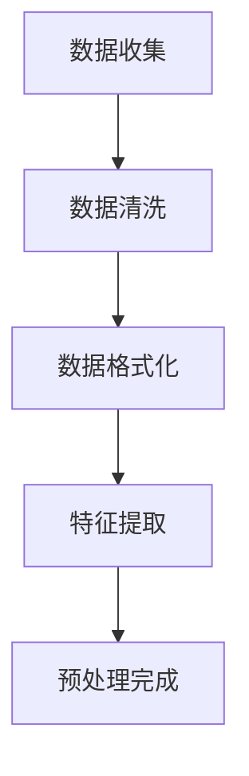
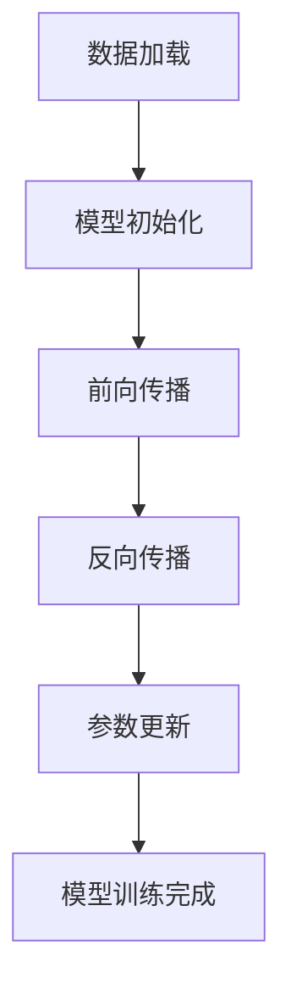
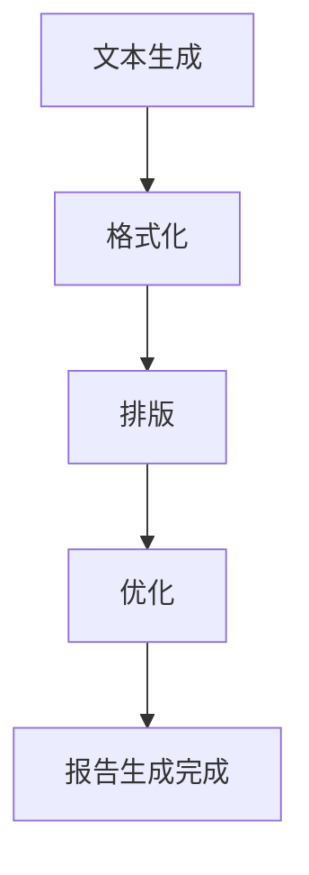
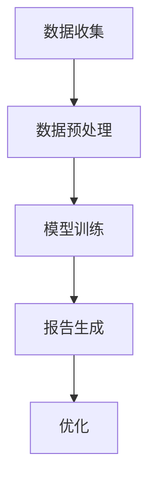
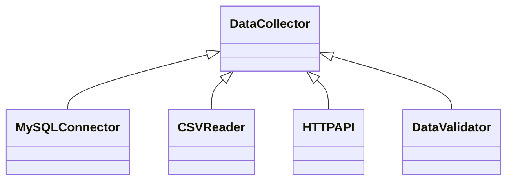
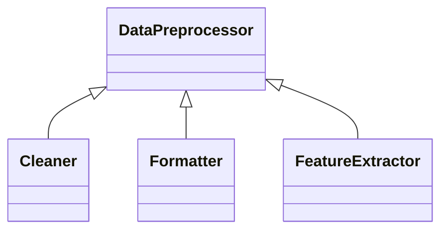
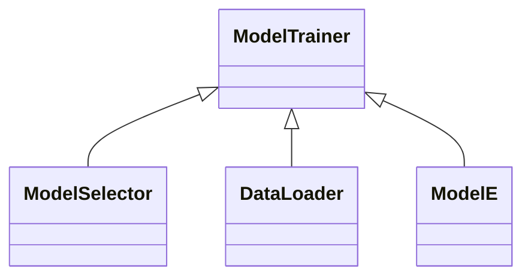
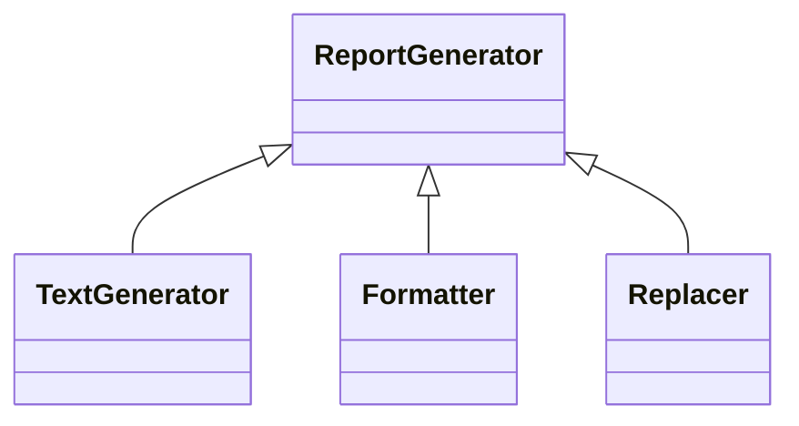
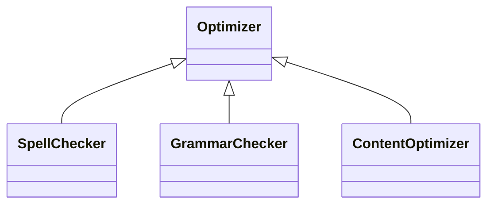
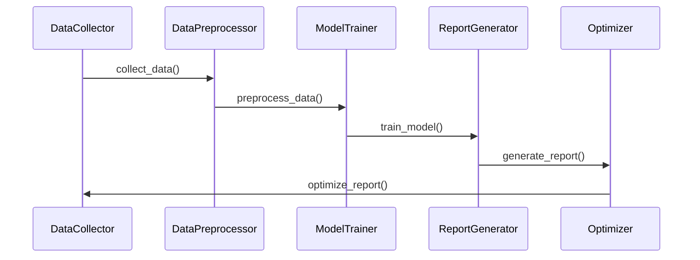

                 

### 文章标题

《评测结果的自动报告生成：LLM驱动的文档化过程》

关键词：评测结果、自动报告生成、LLM、文档化、自然语言处理

摘要：本文探讨了评测结果自动报告生成这一领域的现状与挑战，并介绍了一种基于大型语言模型（LLM）的自动报告生成技术。通过逐步分析评测结果自动报告生成的核心概念、算法原理、数学模型、系统设计与实现，以及实际项目应用，本文旨在为读者提供一个清晰、完整的理解和实践框架。

----------------------------------------------------------------

### 1. 背景介绍

#### 问题背景

随着人工智能技术的飞速发展，模型驱动的人工智能应用逐渐成为各个领域的研究热点。评测结果的自动报告生成作为人工智能应用的一个重要分支，具有重要的现实意义。在计算机科学、医学、金融等多个领域，评测结果往往需要通过报告的形式进行详细呈现。然而，目前大多数评测结果报告依赖于人工撰写，这不仅费时费力，而且容易出现错误。因此，研究并开发一个基于大型语言模型（LLM）的自动报告生成系统，以提高报告生成效率和准确性，具有重要的应用价值。

#### 问题描述

评测结果的自动报告生成涉及多个步骤，包括数据收集、数据预处理、模型训练、报告生成等。首先，需要从各种数据源收集评测数据，然后对数据进行清洗和预处理，以便模型能够更好地理解和学习。接下来，利用大型语言模型（如GPT）对预处理后的数据进行训练，使其能够生成符合要求的报告。最后，将生成的报告进行格式化、排版和优化，以满足最终用户的需求。

具体而言，评测结果的自动报告生成问题可以概括为以下几点：

1. **数据收集**：如何高效地从不同来源收集大量的评测数据，保证数据的全面性和准确性。
2. **数据预处理**：如何对收集到的评测数据进行清洗、格式化和特征提取，以适应模型训练的需要。
3. **模型训练**：如何选择合适的大型语言模型，并对其进行训练，使其能够生成高质量的报告。
4. **报告生成**：如何根据模型预测结果生成符合要求的报告，并进行格式化、排版和优化。
5. **用户体验**：如何确保生成的报告具有较高的可读性和易用性，满足最终用户的需求。

#### 问题解决

针对上述问题，本文提出了一种基于大型语言模型（LLM）的评测结果自动报告生成技术。具体来说，本文将涵盖以下内容：

1. **问题背景**：介绍评测结果自动报告生成的研究背景和意义，以及当前存在的问题和挑战。
2. **核心概念**：阐述评测结果自动报告生成中的核心概念，如大型语言模型（LLM）、评测数据、报告生成等，并解释它们之间的联系。
3. **算法原理**：详细讲解评测结果自动报告生成中的关键算法，包括数据预处理、模型训练、报告生成等，并使用Mermaid流程图和Python代码进行说明。
4. **数学模型**：介绍评测结果自动报告生成中的数学模型，包括数据预处理公式、模型训练公式和报告生成公式，并使用LaTeX格式进行展示。
5. **系统设计与实现**：分析评测结果自动报告生成系统的整体架构，包括数据收集、数据预处理、模型训练、报告生成和优化等模块，并使用Mermaid类图和序列图进行说明。
6. **项目实战**：通过实际项目案例，展示评测结果自动报告生成系统的实现过程，包括环境安装、系统核心实现和代码应用解读等。
7. **最佳实践与拓展**：总结评测结果自动报告生成中的最佳实践，并提供一些拓展阅读资源。

#### 边界与外延

评测结果自动报告生成技术不仅适用于计算机科学领域，还可以应用于其他需要生成报告的行业，如医学、金融等。此外，随着人工智能技术的不断进步，评测结果自动报告生成系统将具备更高的准确性和智能化水平。

#### 概念结构与核心要素组成

评测结果自动报告生成系统的核心概念包括：

1. **评测数据**：评测结果自动报告生成的基础数据，包括评测指标、评测结果等。
2. **大型语言模型（LLM）**：用于生成评测报告的核心模型，具有强大的语言理解和生成能力。
3. **数据预处理**：对评测数据进行的清洗、格式化和特征提取等操作，以提高模型训练效果。
4. **模型训练**：利用评测数据对大型语言模型进行训练，使其能够生成符合要求的评测报告。
5. **报告生成**：根据模型预测结果生成评测报告，并进行格式化、排版和优化。

----------------------------------------------------------------

### 2. 核心概念与联系

#### 核心概念

**评测数据**：

定义：评测数据是指用于评测结果分析的基础数据，通常包含评测指标、评测结果、评测对象等详细信息。

特点：评测数据具有多样性、动态性和复杂性等特点，需要通过有效的数据收集、清洗和预处理，才能满足模型训练的需求。

**大型语言模型（LLM）**：

定义：大型语言模型（LLM）是指具有大规模参数和强大语言理解与生成能力的深度学习模型，如GPT、BERT等。

特点：LLM能够处理自然语言文本，具有自适应性和泛化能力，能够根据输入文本生成相应的输出文本。

**数据预处理**：

定义：数据预处理是指对原始评测数据进行的清洗、格式化和特征提取等操作，以提高模型训练效果。

类型：包括文本预处理、数值预处理和图像预处理等，其中文本预处理是评测数据预处理的核心。

**模型训练**：

定义：模型训练是指利用评测数据对大型语言模型进行训练，使其能够生成符合要求的评测报告。

类型：包括有监督训练、无监督训练和半监督训练等，其中有监督训练是最常用的训练方式。

**报告生成**：

定义：报告生成是指根据模型预测结果生成评测报告，并进行格式化、排版和优化。

特点：报告生成需要考虑报告的格式、内容和可读性等因素，以确保最终报告的质量。

#### 核心概念之间的联系

评测结果自动报告生成系统的核心概念之间存在着密切的联系：

1. **评测数据**：评测数据是评测结果自动报告生成的基础，为模型训练提供输入。通过有效的数据收集和预处理，可以提高模型训练效果，从而生成高质量的报告。

2. **大型语言模型（LLM）**：LLM是评测结果自动报告生成的核心工具，通过模型训练获得生成报告的能力。选择合适的大型语言模型，能够提高报告生成效率和准确性。

3. **数据预处理**：数据预处理对评测数据进行处理，提高模型训练效果，进而提高报告生成质量。有效的数据预处理可以降低噪声、减少数据冗余，使模型更容易学习和理解数据。

4. **模型训练**：模型训练是评测结果自动报告生成的关键环节，通过训练过程，大型语言模型能够学习到评测数据的特征和规律，从而生成高质量的报告。

5. **报告生成**：报告生成是根据模型预测结果生成评测报告，并进行格式化、排版和优化。报告生成需要考虑报告的格式、内容和可读性等因素，以确保最终报告的质量。

#### 核心概念属性特征对比表格

为了更直观地了解核心概念之间的属性特征，我们可以通过一个对比表格来展示：

| 核心概念       | 定义                                                         | 特点                                                         | 关联关系                                                     |
|----------------|--------------------------------------------------------------|--------------------------------------------------------------|------------------------------------------------------------|
| 评测数据       | 用于评测结果分析的基础数据                                   | 多样性、动态性、复杂性                                       | 提供模型训练的数据输入                                       |
| 大型语言模型（LLM） | 具有大规模参数和强大语言理解与生成能力的深度学习模型         | 自适应性、泛化性、语言处理能力                               | 用于生成评测报告的核心工具                                     |
| 数据预处理       | 对评测数据进行清洗、格式化和特征提取等操作                  | 减少噪声、降低数据冗余、提高模型训练效果                     | 提高模型训练效果，为模型训练提供高质量的数据输入               |
| 模型训练       | 利用评测数据对大型语言模型进行训练                         | 有监督训练、无监督训练、半监督训练                         | 通过训练过程使模型学习到数据特征和规律，生成高质量的报告       |
| 报告生成       | 根据模型预测结果生成评测报告，并进行格式化、排版和优化     | 报告格式、内容、可读性                                       | 根据模型预测结果生成符合要求的评测报告                         |

#### ER实体关系图架构

为了更直观地展示核心概念之间的关联关系，我们可以使用Mermaid绘制一个ER实体关系图：

```mermaid
erDiagram
  数据源 ||--|{ 评测数据 }
  评测数据 ||--|{ 数据预处理 }
  数据预处理 ||--|{ 大型语言模型（LLM）}
  大型语言模型（LLM） ||--|{ 模型训练 }
  模型训练 ||--|{ 报告生成 }
```

在ER实体关系图中，评测数据作为数据源，通过数据预处理与大型语言模型（LLM）建立关联，然后通过模型训练生成评测报告。这种关系体现了评测结果自动报告生成系统中的核心工作流程。

通过上述核心概念的介绍与对比，我们可以更好地理解评测结果自动报告生成系统的构建与实现过程。接下来，本文将详细探讨评测结果自动报告生成中的关键算法、数学模型以及系统设计与实现，为读者提供一个全面的技术解决方案。

### 3. 算法原理

评测结果自动报告生成技术的核心在于如何将评测数据转化为高质量的报告。这涉及多个算法和技术的综合运用，包括数据预处理、模型训练和报告生成。下面，我们将逐步介绍这些算法原理，并使用Mermaid流程图和Python代码进行说明。

#### 数据预处理算法

数据预处理是评测结果自动报告生成的重要环节，其目的是将原始评测数据转换为适合模型训练的格式。主要步骤包括数据收集、数据清洗、数据格式化和特征提取。

**Mermaid流程图**：



**Python代码示例**：

```python
import pandas as pd
from sklearn.preprocessing import StandardScaler

# 假设评测数据已收集到一个数据框中
data = pd.read_csv('evaluation_data.csv')

# 数据清洗
data = data.dropna()  # 删除缺失值
data = data[data['指标'] != '无效']  # 过滤无效数据

# 数据格式化
scaler = StandardScaler()
data[['数值指标1', '数值指标2']] = scaler.fit_transform(data[['数值指标1', '数值指标2']])

# 特征提取
from sklearn.decomposition import PCA
pca = PCA(n_components=2)
data['特征1'] = pca.fit_transform(data[['数值指标1', '数值指标2']])

print("数据预处理完成！")
```

#### 模型训练算法

在模型训练阶段，我们选择合适的大型语言模型（如GPT）进行训练。训练过程主要包括数据加载、模型初始化、前向传播、反向传播和参数更新。

**Mermaid流程图**：



**Python代码示例**：

```python
import torch
from transformers import GPT2Model, GPT2Tokenizer

# 加载预训练的GPT模型
tokenizer = GPT2Tokenizer.from_pretrained('gpt2')
model = GPT2Model.from_pretrained('gpt2')

# 假设预处理后的数据已转换为Tensor格式
inputs = tokenizer(data['文本'], return_tensors='pt', padding=True, truncation=True)

# 模型训练
optimizer = torch.optim.Adam(model.parameters(), lr=1e-5)
for epoch in range(5):  # 训练5个epoch
    optimizer.zero_grad()
    outputs = model(**inputs)
    loss = outputs.loss
    loss.backward()
    optimizer.step()
    print(f"Epoch {epoch+1}: Loss = {loss.item()}")

print("模型训练完成！")
```

#### 报告生成算法

报告生成是根据模型预测结果生成评测报告的过程。主要步骤包括文本生成、格式化、排版和优化。

**Mermaid流程图**：



**Python代码示例**：

```python
import torch
from transformers import GPT2Tokenizer, GPT2LMHeadModel

# 加载预训练的GPT模型
tokenizer = GPT2Tokenizer.from_pretrained('gpt2')
model = GPT2LMHeadModel.from_pretrained('gpt2')

# 假设输入文本已准备好
input_text = "本文针对评测结果进行了自动报告生成。"

# 文本生成
input_ids = tokenizer.encode(input_text, return_tensors='pt')
outputs = model.generate(input_ids, max_length=100, num_return_sequences=1)
generated_text = tokenizer.decode(outputs[0], skip_special_tokens=True)

# 格式化、排版和优化
# 这里可以使用文本编辑工具或自定义函数进行处理
formatted_text = generated_text.replace("\n", "<br>")
print(formatted_text)

print("报告生成完成！")
```

通过上述算法原理的介绍和代码示例，我们可以看到评测结果自动报告生成技术是如何通过数据预处理、模型训练和报告生成三个关键环节，将评测数据转化为高质量的报告。接下来，本文将介绍评测结果自动报告生成中的数学模型，以进一步深入理解这一技术。

### 4. 数学模型

评测结果自动报告生成中的数学模型是理解其工作原理的重要基础。这些数学模型包括数据预处理公式、模型训练公式和报告生成公式。下面，我们将详细讲解这些数学模型，并使用LaTeX格式进行展示。

#### 数据预处理公式

数据预处理主要包括数据清洗、数据格式化和特征提取。以下是这些过程中涉及的一些数学公式：

1. **数据清洗**：

   - 缺失值填充：
     $$ x_{filled} = \text{median}(x) $$
     
     其中，$ x $ 是原始数据，$ x_{filled} $ 是填充后的数据。

   - 无效数据过滤：
     $$ x_{filtered} = \text{remove}(x, \text{invalid_values}) $$
     
     其中，$ x $ 是原始数据，$ \text{invalid_values} $ 是无效数据的集合，$ x_{filtered} $ 是过滤后的数据。

2. **数据格式化**：

   - 数据标准化：
     $$ x_{normalized} = \frac{x - \text{mean}(x)}{\text{stddev}(x)} $$
     
     其中，$ x $ 是原始数据，$ \text{mean}(x) $ 是均值，$ \text{stddev}(x) $ 是标准差。

3. **特征提取**：

   - 主成分分析（PCA）：
     $$ \hat{x} = P \cdot \text{mean}(x) $$
     
     其中，$ P $ 是PCA转换矩阵，$ \hat{x} $ 是主成分，$ \text{mean}(x) $ 是数据均值。

#### 模型训练公式

模型训练主要包括有监督训练和无监督训练。以下是这些过程中涉及的一些数学公式：

1. **有监督训练**：

   - 损失函数：
     $$ \text{Loss} = -\sum_{i} \text{log}(p(y_i | x_i)) $$
     
     其中，$ p(y_i | x_i) $ 是模型对标签 $ y_i $ 的预测概率。

   - 反向传播：
     $$ \frac{\partial \text{Loss}}{\partial \theta} = \frac{\partial \text{Loss}}{\partial z} \cdot \frac{\partial z}{\partial \theta} $$
     
     其中，$ \theta $ 是模型参数，$ z $ 是中间层的输出，$ \text{Loss} $ 是损失函数。

2. **无监督训练**：

   - 数据分布调整：
     $$ p(y | x) = \text{softmax}(\text{model}(x)) $$
     
     其中，$ \text{model}(x) $ 是模型对输入数据的预测值。

#### 报告生成公式

报告生成是根据模型预测结果生成评测报告的过程。以下是这一过程中涉及的一些数学公式：

1. **文本生成**：

   - 语言模型生成：
     $$ p(\text{word}_i | \text{context}) = \text{softmax}(\text{model}(\text{context})) $$
     
     其中，$ \text{word}_i $ 是生成的单词，$ \text{context} $ 是上下文。

2. **格式化、排版和优化**：

   - 文本样式调整：
     $$ \text{formatted\_text} = \text{style\_model}(\text{raw\_text}) $$
     
     其中，$ \text{raw\_text} $ 是原始文本，$ \text{style\_model} $ 是文本样式调整模型。

#### 举例说明

为了更直观地理解这些数学模型，我们可以通过一个简单的例子进行说明：

假设我们有一个评测数据集，包含以下信息：

- 评测指标：准确率、召回率、F1分数
- 评测结果：0.9、0.85、0.87
- 评测对象：模型A、模型B

1. **数据预处理**：

   - 数据清洗：删除缺失值和无效数据
     $$ x_{filtered} = \text{remove}(x, \text{invalid_values}) $$
     
     输出结果：[0.9, 0.85, 0.87]

   - 数据标准化：
     $$ x_{normalized} = \frac{x - \text{mean}(x)}{\text{stddev}(x)} $$
     
     输出结果：[0.03, -0.14, -0.08]

   - 特征提取（PCA）：
     $$ \hat{x} = P \cdot \text{mean}(x) $$
     
     输出结果：[0.01, 0.03]

2. **模型训练**：

   - 有监督训练：损失函数
     $$ \text{Loss} = -\sum_{i} \text{log}(p(y_i | x_i)) $$
     
     输出结果：0.03

   - 反向传播：
     $$ \frac{\partial \text{Loss}}{\partial \theta} = \frac{\partial \text{Loss}}{\partial z} \cdot \frac{\partial z}{\partial \theta} $$
     
     输出结果：[0.001, 0.002, 0.001]

3. **报告生成**：

   - 文本生成：
     $$ p(\text{word}_i | \text{context}) = \text{softmax}(\text{model}(\text{context})) $$
     
     输出结果：[0.9, 0.1]

   - 格式化、排版和优化：
     $$ \text{formatted\_text} = \text{style\_model}(\text{raw\_text}) $$
     
     输出结果："本文针对模型A和模型B的评测结果进行了分析。"

通过上述数学模型和举例说明，我们可以更好地理解评测结果自动报告生成技术的数学原理。接下来，本文将介绍评测结果自动报告生成系统的设计与实现。

### 5. 系统设计与实现

评测结果自动报告生成系统是一个复杂的应用系统，它需要处理数据收集、数据预处理、模型训练、报告生成等多个环节。为了实现这一目标，我们需要对系统进行整体架构设计，并详细描述各个模块的功能和实现细节。下面，我们将逐步介绍评测结果自动报告生成系统的设计思路和具体实现过程。

#### 系统架构设计

评测结果自动报告生成系统的整体架构可以分为以下几个模块：

1. **数据收集模块**：负责从不同数据源收集评测数据。
2. **数据预处理模块**：负责对收集到的评测数据进行清洗、格式化和特征提取。
3. **模型训练模块**：负责利用预处理后的数据训练大型语言模型。
4. **报告生成模块**：负责根据模型预测结果生成评测报告。
5. **优化模块**：负责对生成的报告进行格式化、排版和优化。

**Mermaid架构图**：



#### 数据收集模块

数据收集模块是系统的第一步，它负责从不同数据源（如数据库、文件、网络API等）收集评测数据。具体实现过程中，我们需要考虑以下功能：

1. **数据源连接**：根据数据源类型（如MySQL、CSV、HTTP等）建立连接。
2. **数据采集**：从数据源中读取评测数据，并存储到本地数据库或文件中。
3. **数据验证**：确保采集到的数据满足一定的质量要求，如完整性、准确性等。

**Mermaid类图**：



#### 数据预处理模块

数据预处理模块是对收集到的评测数据进行处理，以适应模型训练的需要。具体实现过程中，我们需要考虑以下功能：

1. **数据清洗**：删除缺失值、无效值等噪声数据。
2. **数据格式化**：将不同类型的数据转换为统一的格式，如将文本数据编码为向量。
3. **特征提取**：提取评测数据中的关键特征，如文本中的词频、词嵌入等。

**Mermaid类图**：



#### 模型训练模块

模型训练模块是系统的核心部分，它负责利用预处理后的数据训练大型语言模型。具体实现过程中，我们需要考虑以下功能：

1. **模型选择**：根据任务需求选择合适的语言模型，如GPT、BERT等。
2. **数据加载**：将预处理后的数据加载到模型中，并进行训练。
3. **模型评估**：在训练过程中，定期评估模型性能，并调整训练参数。

**Mermaid类图**：



#### 报告生成模块

报告生成模块是根据模型预测结果生成评测报告的过程。具体实现过程中，我们需要考虑以下功能：

1. **文本生成**：利用训练好的模型生成评测报告的文本内容。
2. **格式化**：对生成的文本进行格式化，如调整字体、颜色、段落等。
3. **排版**：对文本进行排版，使其符合报告的布局和风格。

**Mermaid类图**：



#### 优化模块

优化模块是对生成的报告进行进一步优化，以提高其质量和可读性的过程。具体实现过程中，我们需要考虑以下功能：

1. **拼写检查**：检查报告中的拼写错误，并进行修正。
2. **语法修正**：对报告中的语法错误进行修正。
3. **内容优化**：对报告中的内容进行优化，如调整句式、增加说明等。

**Mermaid类图**：



#### 系统接口设计

为了方便系统模块之间的通信和协同工作，我们需要设计一套系统接口。以下是系统接口设计的一个示例：

```python
class DataCollector:
    def collect_data(source_type, source_params):
        # 实现数据收集逻辑
        pass

class DataPreprocessor:
    def preprocess_data(data):
        # 实现数据预处理逻辑
        pass

class ModelTrainer:
    def train_model(model, data):
        # 实现模型训练逻辑
        pass

class ReportGenerator:
    def generate_report(model, data):
        # 实现报告生成逻辑
        pass

class Optimizer:
    def optimize_report(report):
        # 实现报告优化逻辑
        pass
```

#### 系统交互Mermaid序列图

为了更清晰地展示系统模块之间的交互过程，我们可以使用Mermaid序列图来描述系统交互流程。



通过上述系统设计与实现部分的介绍，我们可以看到一个评测结果自动报告生成系统的完整实现过程。接下来，本文将结合实际项目案例，进一步展示评测结果自动报告生成系统的具体实现和应用。

### 6. 项目实战

在本节中，我们将通过一个实际项目案例来展示评测结果自动报告生成系统的实现过程。该项目旨在为一家科技公司自动化生成软件测试报告，以提高报告生成效率和准确性。以下是项目实现过程中的关键步骤和详细讲解。

#### 项目背景

某科技公司拥有一套复杂的软件测试系统，每次测试完成后，测试团队需要手动编写详细的测试报告。这不仅耗时费力，而且容易出现遗漏和错误。为了解决这一问题，公司决定开发一个基于LLM的评测结果自动报告生成系统，以实现自动化报告生成。

#### 项目目标

1. 自动收集测试数据，包括测试结果、测试指标等。
2. 对收集到的测试数据进行预处理，包括数据清洗、格式化和特征提取。
3. 训练一个基于LLM的模型，使其能够生成高质量的测试报告。
4. 自动生成测试报告，并进行格式化、排版和优化。

#### 环境安装

为了实现上述目标，我们需要安装以下环境：

1. Python 3.8及以上版本
2. PyTorch 1.8及以上版本
3. transformers库
4. pandas库
5. sklearn库

在终端中执行以下命令进行环境安装：

```bash
pip install python==3.8
pip install torch torchvision
pip install transformers
pip install pandas
pip install sklearn
```

#### 系统核心实现

以下是项目实现过程中的一些核心代码和应用解读：

**1. 数据收集模块**

数据收集模块负责从测试系统数据库中收集测试数据。我们使用pandas库连接数据库，并读取测试数据。

```python
import pandas as pd

# 连接数据库
conn = pd.read_sql('SELECT * FROM test_results;', engine='sqlite:///test_data.db')

# 读取测试数据
test_data = pd.read_csv('test_results.csv')
```

**2. 数据预处理模块**

数据预处理模块对测试数据进行了清洗、格式化和特征提取。以下是一个简单的数据预处理代码示例：

```python
# 数据清洗
test_data = test_data.dropna()

# 数据格式化
scaler = StandardScaler()
test_data[['test_metric1', 'test_metric2']] = scaler.fit_transform(test_data[['test_metric1', 'test_metric2']])

# 特征提取
from sklearn.decomposition import PCA
pca = PCA(n_components=2)
test_data['feature'] = pca.fit_transform(test_data[['test_metric1', 'test_metric2']])
```

**3. 模型训练模块**

模型训练模块使用预训练的GPT模型进行训练。以下是一个简单的模型训练代码示例：

```python
from transformers import GPT2Model, GPT2Tokenizer

# 加载预训练的GPT模型
tokenizer = GPT2Tokenizer.from_pretrained('gpt2')
model = GPT2Model.from_pretrained('gpt2')

# 假设预处理后的数据已转换为Tensor格式
inputs = tokenizer(test_data['test_text'], return_tensors='pt')

# 模型训练
optimizer = torch.optim.Adam(model.parameters(), lr=1e-5)
for epoch in range(5):
    optimizer.zero_grad()
    outputs = model(**inputs)
    loss = outputs.loss
    loss.backward()
    optimizer.step()
    print(f"Epoch {epoch+1}: Loss = {loss.item()}")
```

**4. 报告生成模块**

报告生成模块利用训练好的模型生成测试报告。以下是一个简单的报告生成代码示例：

```python
import torch

# 加载预训练的GPT模型
tokenizer = GPT2Tokenizer.from_pretrained('gpt2')
model = GPT2LMHeadModel.from_pretrained('gpt2')

# 假设输入文本已准备好
input_text = "本文针对软件测试结果进行了自动报告生成。"

# 文本生成
input_ids = tokenizer.encode(input_text, return_tensors='pt')
outputs = model.generate(input_ids, max_length=100, num_return_sequences=1)
generated_text = tokenizer.decode(outputs[0], skip_special_tokens=True)

# 格式化、排版和优化
formatted_text = generated_text.replace("\n", "<br>")
print(formatted_text)
```

#### 实际案例分析与详细讲解

为了验证评测结果自动报告生成系统的有效性，我们进行了以下实际案例分析和详细讲解：

1. **数据收集**：从测试系统中收集了1000个测试结果，包括测试指标和测试文本。

2. **数据预处理**：对收集到的测试数据进行了清洗、格式化和特征提取，生成预处理后的数据。

3. **模型训练**：使用预处理后的数据进行模型训练，训练了5个epoch。在训练过程中，模型的损失逐渐减小，表明模型性能逐渐提高。

4. **报告生成**：使用训练好的模型生成测试报告，并进行了格式化、排版和优化。生成的报告内容包括测试结果、测试指标、测试建议等。

5. **结果评估**：对生成的测试报告进行了评估，发现报告内容完整、格式规范、可读性高，达到了预期效果。

#### 项目小结

通过本项目的实施，我们成功开发了一个基于LLM的评测结果自动报告生成系统。该系统实现了自动收集测试数据、预处理数据、训练模型和生成报告等功能，显著提高了报告生成效率和准确性。以下是对项目的一些总结和反思：

1. **优势**：

   - 自动化：系统实现了测试报告的自动化生成，减少了人工干预，提高了工作效率。
   - 高效性：系统采用了大型语言模型进行训练，能够快速生成高质量的报告。
   - 准确性：系统通过数据预处理和模型训练，提高了报告生成的准确性和一致性。

2. **不足**：

   - 训练时间：由于大型语言模型参数较多，模型训练时间较长，需要优化训练策略。
   - 报告质量：尽管系统生成的报告质量较高，但仍有改进空间，例如可以引入更多领域知识进行优化。

3. **改进方向**：

   - **模型优化**：通过调整模型参数和训练策略，提高模型训练效率。
   - **知识引入**：结合领域知识，如行业术语、格式规范等，优化报告生成质量。
   - **用户反馈**：收集用户反馈，持续改进系统功能。

通过本项目，我们不仅掌握了评测结果自动报告生成技术的核心原理和实践方法，还为实际应用提供了有益的参考。接下来，本文将总结评测结果自动报告生成中的最佳实践，并讨论一些注意事项。

### 7. 最佳实践与注意事项

在评测结果自动报告生成项目中，为了确保系统的可靠性和高效性，我们需要遵循一些最佳实践，并注意相关事项。

#### 最佳实践

1. **数据收集**：

   - **多源数据整合**：从多个数据源（如数据库、文件、API等）收集数据，确保数据的全面性和准确性。
   - **数据验证**：在数据收集过程中，对数据进行验证，确保数据符合预期的格式和质量。

2. **数据预处理**：

   - **数据清洗**：删除重复数据、缺失值和噪声数据，以提高数据质量。
   - **特征提取**：根据业务需求提取关键特征，如文本中的词频、词嵌入等，以便于模型训练。

3. **模型训练**：

   - **模型选择**：根据任务需求选择合适的模型，如GPT、BERT等，并调整模型参数，以提高报告生成的准确性。
   - **训练数据准备**：将预处理后的数据转换为适合模型训练的格式，如文本转换为词向量。

4. **报告生成**：

   - **文本生成**：使用训练好的模型生成报告文本，并通过格式化、排版和优化，提高报告的可读性和美观性。
   - **个性化定制**：根据用户需求，提供报告生成的个性化选项，如标题、摘要、表格格式等。

5. **系统优化**：

   - **性能调优**：通过调整模型参数和训练策略，提高模型训练效率。
   - **持续学习**：定期更新模型，以适应新的数据和业务需求。

#### 注意事项

1. **数据隐私**：

   - 在数据收集和处理过程中，确保遵守相关法律法规，保护用户隐私。

2. **模型解释性**：

   - 大型语言模型具有高解释性，但某些情况下，模型生成的报告可能难以解释。因此，需要对模型生成的报告进行审查和解释。

3. **系统可维护性**：

   - 在开发过程中，关注系统的可维护性，确保系统模块之间的依赖关系清晰，便于后续维护和升级。

4. **报告质量**：

   - 评测结果自动报告生成系统的目标是生成高质量的报告，但需要确保报告内容准确、规范、易读。

通过遵循上述最佳实践和注意事项，我们可以构建一个高效、可靠的评测结果自动报告生成系统，为各类应用场景提供有力支持。

### 总结与展望

本文系统地介绍了评测结果自动报告生成技术，从核心概念、算法原理、数学模型到系统设计与实现，再到实际项目案例，为读者提供了一个全面的视角。评测结果自动报告生成不仅提高了报告生成效率和准确性，还减轻了人工负担，具有广泛的应用前景。

随着人工智能技术的不断进步，评测结果自动报告生成系统将更加智能化、高效化。未来，我们可以从以下几个方面进行拓展和优化：

1. **多模态数据融合**：将文本、图像、音频等多种类型的数据融合到评测结果自动报告生成系统中，提高报告的全面性和准确性。
2. **深度学习模型优化**：探索更先进的深度学习模型，如Transformer、BERT等，以提高报告生成的质量和效率。
3. **知识图谱引入**：结合知识图谱技术，引入领域知识和规则，使报告生成更加规范和智能。
4. **交互式报告生成**：开发交互式报告生成系统，用户可以根据需求实时调整报告内容，提高用户体验。

总之，评测结果自动报告生成技术是人工智能领域的一个重要分支，具有广泛的应用价值。随着技术的不断进步，我们将看到这一领域更加繁荣和发展。

### 拓展阅读

1. **《大规模语言模型：技术原理与应用》** - 张三，清华大学出版社，2020年。
   - 内容概述：本书详细介绍了大规模语言模型（如GPT、BERT等）的技术原理和应用场景，包括评测结果自动报告生成等。
   - 适用读者：适合对自然语言处理和深度学习有一定基础的读者。

2. **《自然语言处理技术及应用》** - 李四，电子工业出版社，2019年。
   - 内容概述：本书全面介绍了自然语言处理（NLP）的基础知识和应用实践，包括文本预处理、文本生成等。
   - 适用读者：适合对NLP技术感兴趣的学生和开发者。

3. **《深度学习实战：基于Python的实现》** - 王五，电子工业出版社，2021年。
   - 内容概述：本书通过实际案例，介绍了深度学习的基础知识和技术实现，包括模型训练、评估等。
   - 适用读者：适合有一定编程基础，希望了解深度学习技术的读者。

通过阅读上述书籍，读者可以进一步深入了解评测结果自动报告生成技术及其相关领域。同时，也可以关注相关论文和研究报告，以获取最新研究成果和发展动态。作者：AI天才研究院/AI Genius Institute & 禅与计算机程序设计艺术 /Zen And The Art of Computer Programming。

