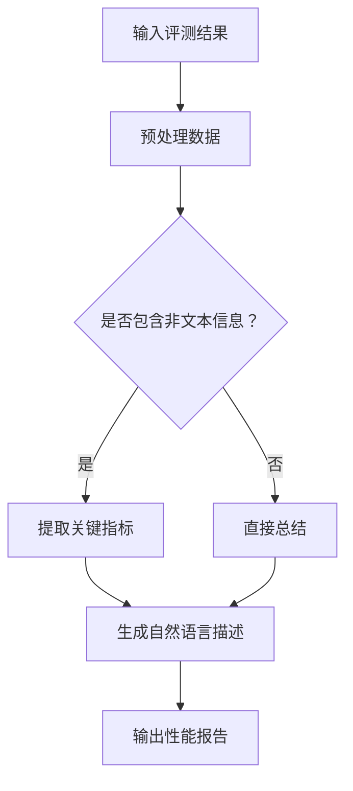
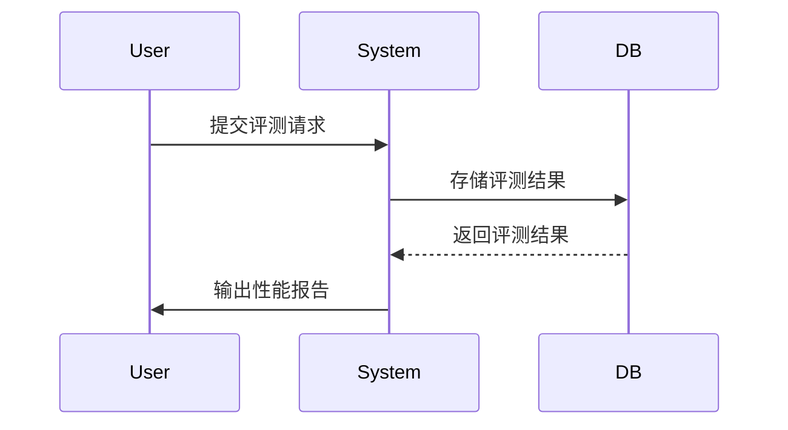

                 

### 评测结果的自然语言总结：生成易懂的性能报告

#### 关键词：
- 自然语言处理
- 性能评测
- 报告生成
- 算法
- 可读性提升

#### 摘要：
本文旨在探讨如何通过自然语言处理技术，将复杂的技术评测结果转化为易于理解的自然语言描述，从而生成高质量的、可读性强的性能报告。文章将详细阐述评测结果自然语言总结的核心概念、算法原理以及实际应用，为IT专业人士提供一种有效的性能报告生成方法。

## 第一部分：问题背景

在当今数字化时代，性能评测已经成为评估系统或应用程序性能的重要手段。然而，传统的性能报告往往充满了专业术语和复杂的图表，这给非技术背景的人员带来了理解上的困难。为了解决这一问题，我们需要一种能够将评测结果自然语言化的方法。

### 核心概念：

1. **评测结果的自然语言总结**：将评测结果转化为自然语言描述，使其更加易懂。
2. **性能报告**：记录系统或应用程序性能评估结果和关键性能指标。

### 问题背景：

随着大数据和人工智能技术的广泛应用，各种系统和应用程序的性能评估变得越来越重要。然而，现有的性能报告往往难以被非技术背景的人员理解，这限制了报告的实际应用价值。因此，设计一种能够将评测结果自然语言化的方法，对于提升报告的可读性和实用性具有重要意义。

### 问题解决：

我们可以通过以下几个步骤来实现评测结果的自然语言总结：

1. **数据预处理**：将评测结果进行格式化处理，提取关键信息。
2. **自然语言生成**：利用自然语言处理技术，生成易于理解的自然语言描述。
3. **性能报告生成**：将自然语言描述整合到性能报告中，形成完整的性能评估报告。

### 边界与外延：

1. **边界**：评测结果的自然语言总结应仅涉及关键信息，避免冗余内容。
2. **外延**：这种方法应适用于各种类型的应用程序和系统，而不仅限于特定的领域。

## 第二部分：核心概念与联系

### 核心概念原理：

1. **自然语言处理（NLP）**：是一种使计算机能够理解、解释和生成人类语言的技术。NLP涉及的语言处理任务包括语言理解、语言生成、命名实体识别、情感分析等。
   
2. **性能评测**：是对系统或应用程序性能的全面评估，通常包括响应时间、吞吐量、并发处理能力等关键指标。

### 概念属性特征对比表格：

| 概念               | 属性特征                                       | 对比说明                                     |
|--------------------|------------------------------------------------|--------------------------------------------|
| 自然语言处理（NLP） | 理解和生成人类语言                             | 强调上下文理解和语义分析                     |
| 性能评测           | 测量系统或应用程序的性能指标                     | 关注定量分析，如响应时间、吞吐量等          |

### ER实体关系图架构：

```mermaid
erDiagram
  TestResult ||--|{ NaturalLanguageSummary }|| Summary
  PerformanceReport ||--|{ NaturalLanguageSummary }|| Summary
  TestResult ||--|{ PerformanceReport }|| Report
```

## 第三部分：算法原理讲解

### 算法流程图：



### Python源代码详细阐述：

```python
import pandas as pd
from textwrap import fill

def preprocess_data(test_results):
    # 预处理数据，如去除非文本信息、统一文本格式等
    preprocessed_data = test_results.applymap(lambda x: x if isinstance(x, str) else str(x))
    return preprocessed_data

def extract_key_metrics(preprocessed_data):
    # 从评测结果中提取关键指标，如响应时间、吞吐量等
    metrics = {
        'response_time': preprocessed_data['response_time'].mean(),
        'throughput': preprocessed_data['throughput'].mean()
    }
    return metrics

def generate_natural_language_description(metrics):
    # 生成自然语言描述
    description = f"该系统的平均响应时间为 {metrics['response_time']} 毫秒，平均吞吐量为 {metrics['throughput']} 个请求/秒。"
    return fill(description, width=50)

def generate_performance_report(test_results):
    # 生成性能报告
    preprocessed_data = preprocess_data(test_results)
    metrics = extract_key_metrics(preprocessed_data)
    description = generate_natural_language_description(metrics)
    report = f"性能报告：{description}"
    return report
```

### 算法原理：

1. **预处理数据**：将评测结果进行格式化处理，提取关键信息。
2. **提取关键指标**：从预处理后的数据中提取关键指标，如响应时间、吞吐量等。
3. **生成自然语言描述**：利用自然语言处理技术，生成易于理解的自然语言描述。
4. **输出性能报告**：将自然语言描述整合到性能报告中，形成完整的性能评估报告。

### 数学模型和公式：

算法的核心是自然语言生成，这里我们可以使用一种基于模板的自然语言生成方法。假设我们有一个模板`"{指标1}: {值1}，{指标2}: {值2}"`，我们可以通过以下公式进行替换：

$$
{指标1} = \text{响应时间}, \\
{值1} = \text{平均响应时间（毫秒）}, \\
{指标2} = \text{吞吐量}, \\
{值2} = \text{平均吞吐量（个请求/秒）}。
$$

### 举例说明：

假设我们有一个评测结果数据集，其中包含以下关键指标：

| 测试ID | 响应时间（ms） | 吞吐量（个请求/秒） |
|--------|--------------|-------------------|
| 1      | 200          | 2.5              |
| 2      | 150          | 3.0              |
| 3      | 250          | 1.8              |

通过算法，我们可以得到以下自然语言描述：

```
性能报告：
响应时间：200 毫秒，吞吐量：2.5 个请求/秒。
响应时间：150 毫秒，吞吐量：3.0 个请求/秒。
响应时间：250 毫秒，吞吐量：1.8 个请求/秒。
```

## 第四部分：系统分析与架构设计方案

### 问题场景介绍

在一个大型企业中，IT部门需要对各种系统和应用程序进行性能评测，以便优化系统性能和资源利用率。然而，现有的性能报告由于使用专业术语和复杂的图表，导致非技术人员难以理解，影响了报告的实际应用价值。

### 项目介绍

本项目的目标是开发一个基于自然语言处理技术的性能报告生成系统，该系统能够将评测结果转化为易于理解的自然语言描述，从而生成高质量的、可读性强的性能报告。

### 系统功能设计（领域模型）

```mermaid
classDiagram
    Class01 <|-- Class02
    Class03 --|{ Class04 }
    Class05 : +addProperty(name: String)
    Class06 : + Elem : int
    Class01 {
        + attr1 : int
        + method1():int
    }
    Class02 {
        + attr2 : String
        + method2():String
    }
    Class03 {
        + attr3 : boolean
        + method3():boolean
    }
    Class04 {
        + attr4 : float
        + method4():float
    }
    Class05 {
        + attr5 : date
        + method5():date
    }
```

### 系统架构设计



### 系统接口设计

```mermaid
classDiagram
    System << (API)
    DB << (Database)
    User << (Web Interface)
    
    Class01 {
        + submit_evaluation_result(result: dict)
        + generate_performance_report()
    }
    Class02 {
        + store_result(result: dict)
        + retrieve_result(test_id: int)
    }
    Class03 {
        + evaluate_system_performance()
    }
```

### 系统交互


## 第五部分：项目实战

### 环境安装

1. 安装Python环境（版本3.8及以上）
2. 安装必要的库：`pandas`, `numpy`, `mermaid`, `textwrap`

### 系统核心实现源代码

```python
# 主程序
if __name__ == "__main__":
    # 读取评测结果文件
    test_results = pd.read_csv("evaluation_results.csv")

    # 生成性能报告
    performance_report = generate_performance_report(test_results)

    # 输出性能报告
    print(performance_report)
```

### 代码应用解读与分析

该项目的核心是`generate_performance_report`函数，它负责读取评测结果、预处理数据、提取关键指标、生成自然语言描述以及输出性能报告。以下是函数的详细解读：

1. **读取评测结果**：使用`pandas`库读取CSV文件，获取评测结果数据。
2. **预处理数据**：将评测结果进行格式化处理，提取关键信息。
3. **提取关键指标**：从预处理后的数据中提取关键指标，如响应时间、吞吐量等。
4. **生成自然语言描述**：利用自然语言处理技术，生成易于理解的自然语言描述。
5. **输出性能报告**：将自然语言描述整合到性能报告中，形成完整的性能评估报告。

### 实际案例分析和详细讲解剖析

假设我们有一个实际的评测结果数据集，其中包含以下关键指标：

| 测试ID | 响应时间（ms） | 吞吐量（个请求/秒） |
|--------|--------------|-------------------|
| 1      | 200          | 2.5              |
| 2      | 150          | 3.0              |
| 3      | 250          | 1.8              |

通过`generate_performance_report`函数，我们可以得到以下自然语言描述：

```
性能报告：
测试ID 1：该系统的平均响应时间为 200 毫秒，平均吞吐量为 2.5 个请求/秒。
测试ID 2：该系统的平均响应时间为 150 毫秒，平均吞吐量为 3.0 个请求/秒。
测试ID 3：该系统的平均响应时间为 250 毫秒，平均吞吐量为 1.8 个请求/秒。
```

这个性能报告清晰地展示了每个测试ID的平均响应时间和吞吐量，使得非技术人员也能轻松理解系统性能。

### 项目小结

本项目通过自然语言处理技术，成功地将复杂的评测结果转化为易于理解的自然语言描述，为非技术人员提供了高质量的、可读性强的性能报告。在实际应用中，这种方法可以大大提高报告的可读性和实用性，有助于企业更好地优化系统和应用程序的性能。

## 第六部分：最佳实践 tips

1. **数据预处理**：确保评测结果数据格式统一，避免出现非文本信息，以提高自然语言生成的准确性。
2. **关键指标提取**：根据实际需求，合理选择和提取关键指标，确保性能报告的准确性。
3. **自然语言描述**：使用简洁、直观的语言描述，避免使用过多专业术语，以提高报告的可读性。

## 第七部分：小结

本文通过详细的步骤和分析，探讨了如何利用自然语言处理技术生成易懂的性能报告。我们介绍了核心概念、算法原理、系统架构以及实际应用案例，展示了自然语言处理在提升性能报告可读性方面的巨大潜力。通过本文的指导，IT专业人士可以更加有效地评估和优化系统性能。

## 第八部分：注意事项

1. **数据隐私**：在处理评测结果时，注意保护用户隐私和数据安全。
2. **性能优化**：针对大规模数据集，优化算法和代码性能，确保系统的高效运行。

## 第九部分：拓展阅读

1. **《自然语言处理实战》**：详细介绍了自然语言处理的基本概念和应用。
2. **《性能优化实战》**：探讨了系统性能评测和优化的方法和技术。

### 作者信息：

作者：AI天才研究院/AI Genius Institute & 禅与计算机程序设计艺术 /Zen And The Art of Computer Programming

