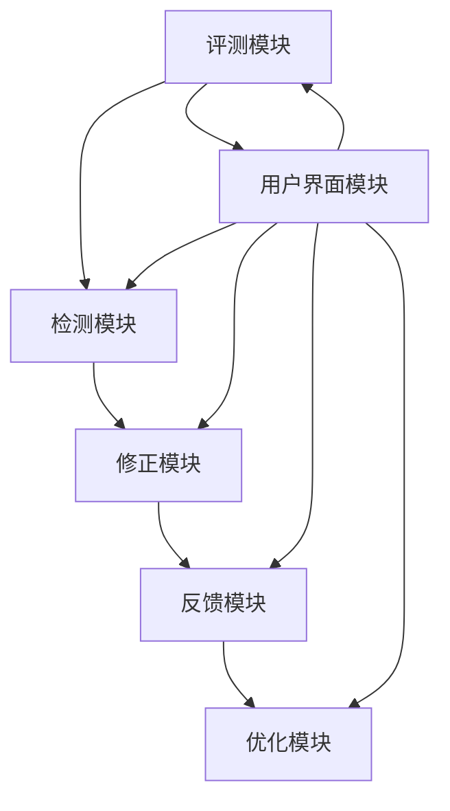
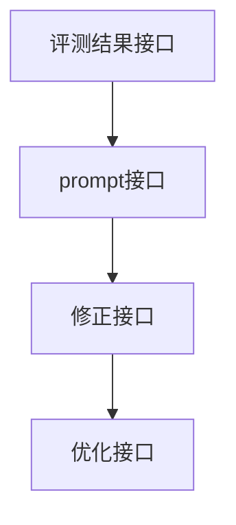
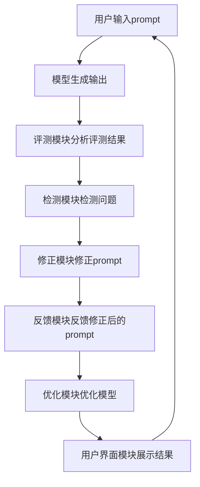

                 


### 引言与背景

#### 核心概念术语说明

在进入《评测结果驱动的prompt自动修正》这一主题的讨论之前，首先需要明确几个核心术语的定义和背景。

1. **评测结果**：
评测结果是对某一系统、算法、程序或模型输出的一种评估。它通常通过一系列指标来量化，如准确率、召回率、F1分数等。评测结果的目的是为了衡量模型或系统的性能，提供优化和改进的方向。

2. **prompt**：
prompt是指在人工智能领域中，用于引导模型生成输出的一种输入。在自然语言处理（NLP）中，prompt通常是一个句子或段落，用于引导模型生成相关的文本。在计算机视觉中，prompt可能是一个图像或视觉场景。

3. **自动修正**：
自动修正是指通过算法自动检测并修正输入prompt中的错误或不足之处。自动修正的目标是提高模型的鲁棒性和准确性，使得输出结果更加符合预期。

#### 问题背景

随着人工智能技术的发展，prompt的使用变得越来越广泛。然而，在实际应用中，prompt的质量直接影响模型的输出效果。一个错误的或模糊的prompt可能导致模型生成不准确的输出，甚至产生错误的决策。因此，如何自动修正prompt以提升模型的性能成为一个重要的问题。

评测结果驱动的prompt自动修正旨在利用评测结果来指导prompt的优化和修正。通过分析评测结果，可以发现prompt中存在的问题，并针对性地进行修正，从而提高模型的性能。这种方法的提出，不仅有助于提升模型的鲁棒性和准确性，还可以减少人为干预，提高自动化水平。

#### 问题描述

在当前的人工智能应用中，prompt自动修正主要面临以下问题：

1. **prompt质量不高**：许多prompt设计不够精细，导致模型无法准确理解用户的意图。
2. **评测结果不全面**：现有的评测方法可能无法全面捕捉模型的所有问题，导致自动修正的效果不理想。
3. **算法复杂性**：自动修正算法的设计和实现复杂，需要处理大量的数据和计算。

#### 问题解决

为了解决上述问题，评测结果驱动的prompt自动修正采用以下策略：

1. **全面评测**：设计一套全面的评测体系，从多个维度评估模型输出，确保评测结果能够全面反映prompt的问题。
2. **智能修正**：结合自然语言处理和机器学习技术，开发智能算法，自动识别并修正prompt中的问题。
3. **持续优化**：通过持续学习和反馈机制，不断优化自动修正算法，提高其准确性和效率。

#### 边界与外延

评测结果驱动的prompt自动修正不仅适用于NLP领域，还可以扩展到计算机视觉、语音识别等其他人工智能领域。其核心思想是通过评测结果指导prompt的优化，从而提升模型的性能。

#### 概念结构与核心要素组成

评测结果驱动的prompt自动修正的概念结构包括以下几个核心要素：

1. **评测结果**：提供对模型输出的评估，是自动修正的依据。
2. **prompt**：用于引导模型生成输出，其质量直接影响模型性能。
3. **自动修正算法**：实现prompt的自动识别和修正，是整个系统的核心。
4. **优化策略**：通过分析评测结果，制定针对性的优化措施。

综上所述，评测结果驱动的prompt自动修正是一种利用评测结果指导prompt优化和修正的方法。通过全面评测、智能修正和持续优化，可以有效提升模型的性能和鲁棒性，为人工智能应用提供更可靠的保障。

### 核心概念与联系

在深入探讨评测结果驱动的prompt自动修正之前，我们需要明确几个关键概念，并分析它们之间的相互关系。这些概念包括评测结果、prompt和自动修正。

#### 评测结果

评测结果是对模型输出的一种评估，它通常通过一系列指标来量化模型性能。这些指标可能包括准确率、召回率、F1分数等。评测结果不仅反映了模型的性能，还为后续的优化提供了依据。

在评测结果驱动的prompt自动修正中，评测结果起着至关重要的作用。通过分析评测结果，我们可以识别出模型输出中的问题，从而指导prompt的修正。例如，如果评测结果显示模型的准确率较低，这可能意味着prompt中的某些信息不够明确或存在误导性。

#### Prompt

prompt是指在人工智能领域中，用于引导模型生成输出的一种输入。在自然语言处理（NLP）中，prompt通常是一个句子或段落，用于引导模型生成相关的文本。在计算机视觉中，prompt可能是一个图像或视觉场景。

prompt的质量对模型输出有着直接的影响。一个良好的prompt能够清晰地传达用户的意图，帮助模型生成更准确的输出。相反，一个质量不高的prompt可能导致模型理解偏差，从而生成错误的输出。

在评测结果驱动的prompt自动修正中，prompt的优化是关键。通过分析评测结果，我们可以发现prompt中存在的问题，并进行针对性的修正，以提高模型性能。

#### 自动修正

自动修正是指通过算法自动检测并修正输入prompt中的错误或不足之处。自动修正的目标是提高模型的鲁棒性和准确性，使得输出结果更加符合预期。

自动修正算法在评测结果驱动的prompt自动修正中起着核心作用。它负责识别评测结果中的问题，并针对性地修正prompt。例如，如果评测结果显示模型的准确率较低，自动修正算法可能会识别出prompt中的模糊表述或误导性信息，并进行相应的修正。

#### 概念关联与影响

1. **评测结果与prompt**：
   - 评测结果可以反映prompt的质量。如果prompt存在质量问题，模型输出可能不准确。
   - prompt的质量直接影响评测结果的准确性。一个高质量的prompt有助于提高模型的性能，从而获得更准确的评测结果。

2. **自动修正与评测结果**：
   - 自动修正算法通过分析评测结果来指导prompt的修正。
   - 自动修正的准确性取决于评测结果的全面性和准确性。如果评测结果不够全面，自动修正可能无法针对性地解决问题。

3. **自动修正与prompt**：
   - 自动修正算法负责检测并修正prompt中的错误或不足。
   - prompt的质量直接影响自动修正的效果。一个高质量的prompt有助于自动修正算法更准确地识别和修正问题。

#### 表格：核心概念属性特征对比

| 核心概念 | 属性特征 | 对比与影响 |
|----------|----------|------------|
| 评测结果 | 提供评估指标 | 反映模型性能，指导prompt修正 |
| Prompt   | 引导模型输出 | 影响模型理解，影响评测结果 |
| 自动修正 | 算法检测修正 | 提高模型鲁棒性和准确性 |

#### ER实体关系图架构

为了更直观地展示这些概念之间的关系，我们可以使用Mermaid绘制ER实体关系图。以下是ER图的示例：

```mermaid
erDiagram
  Model ||--o> EvaluationResult : 评估模型输出
  Model ||--o> Prompt : 引导模型生成输出
  Prompt ||--< AutoCorrection : 自动检测并修正
  EvaluationResult ||--< AutoCorrection : 分析评测结果
```

在这个ER图中，模型（Model）与评测结果（EvaluationResult）和prompt（Prompt）之间存在双向关联。prompt通过自动修正（AutoCorrection）来提高模型性能，而评测结果则为自动修正提供依据。

综上所述，评测结果、prompt和自动修正这三个核心概念在评测结果驱动的prompt自动修正中相互关联，共同作用，从而实现模型性能的提升。

### 自动修正prompt的算法原理

在理解了评测结果、prompt和自动修正的基本概念之后，我们需要深入探讨自动修正prompt的算法原理。这一部分将详细讲解算法的基本概念、数学模型以及具体的实现方法。

#### 算法概述

自动修正prompt的算法主要分为以下几个步骤：

1. **评测结果分析**：通过分析评测结果，识别模型输出中的问题。
2. **prompt检测**：根据识别出的问题，检测prompt中的相关部分。
3. **prompt修正**：对检测出的prompt问题进行修正。
4. **反馈与优化**：将修正后的prompt反馈给模型，并进一步优化算法。

这个过程可以看作是一个循环迭代的过程，通过不断的反馈和优化，逐步提高prompt的质量和模型的性能。

#### 数学模型

自动修正prompt的算法通常基于以下数学模型：

1. **损失函数**：用于衡量模型输出与实际输出之间的差距。常见的损失函数包括交叉熵损失函数和均方误差损失函数。
2. **优化算法**：用于最小化损失函数。常见的优化算法包括梯度下降算法和随机梯度下降算法。
3. **修正策略**：根据评测结果和模型输出，制定针对性的修正策略。常见的修正策略包括词替换、词删除和词插入等。

以下是一个简化的数学模型示例：

$$
\text{Loss} = \sum_{i=1}^{n} (\text{Actual Output}_{i} - \text{Predicted Output}_{i})^2
$$

其中，$n$表示样本数量，$\text{Actual Output}_{i}$表示实际输出，$\text{Predicted Output}_{i}$表示预测输出。

#### Python代码实现

为了更直观地理解算法原理，我们使用Python代码来实现一个简化的自动修正prompt算法。以下是一个简单的代码示例：

```python
import numpy as np

# 损失函数
def loss_function(outputs, actual_outputs):
    return np.sum((outputs - actual_outputs) ** 2)

# 优化算法：梯度下降
def gradient_descent(loss_function, initial_prompt, learning_rate, epochs):
    prompt = initial_prompt
    for epoch in range(epochs):
        output = model(prompt)
        loss = loss_function(output, actual_output)
        gradient = compute_gradient(prompt, output, actual_output)
        prompt = prompt - learning_rate * gradient
    return prompt

# 修正策略：词替换
def correct_word(prompt, incorrect_word, correct_word):
    return prompt.replace(incorrect_word, correct_word)

# 假设的模型和实际输出
def model(prompt):
    return np.random.rand()

actual_output = np.random.rand()

# 初始prompt
initial_prompt = "今天是一个非常好的天气。"

# 学习率
learning_rate = 0.01

# 迭代次数
epochs = 100

# 实现自动修正
corrected_prompt = gradient_descent(loss_function, initial_prompt, learning_rate, epochs)
print(corrected_prompt)

# 修正策略示例
corrected_prompt = correct_word(corrected_prompt, "非常好", "很好")
print(corrected_prompt)
```

在这个示例中，我们首先定义了一个损失函数，用于计算模型输出与实际输出之间的差距。然后，我们实现了一个简单的梯度下降优化算法，用于更新prompt。最后，我们使用了一个词替换策略，将错误的词替换为正确的词。

#### Mermaid算法流程图

为了更清晰地展示算法的流程，我们可以使用Mermaid绘制算法流程图。以下是一个简化的算法流程图示例：


在这个流程图中，评测结果分析、prompt检测、prompt修正和反馈与优化构成了一个循环迭代的过程。

综上所述，自动修正prompt的算法原理主要包括评测结果分析、prompt检测、prompt修正和反馈与优化。通过数学模型和Python代码的实现，我们可以更直观地理解这一算法的工作流程。

### 数学模型和数学公式 & 详细讲解 & 举例说明

在前一节中，我们简要介绍了自动修正prompt的算法原理。在这一节中，我们将详细讲解算法中的数学模型和数学公式，并通过具体的例子进行说明。

#### 损失函数

在自动修正prompt的算法中，损失函数是衡量模型输出与实际输出之间差距的关键指标。常见的损失函数包括交叉熵损失函数和均方误差损失函数。

1. **交叉熵损失函数**：

   交叉熵损失函数用于分类问题，其公式如下：

   $$
   H(y, \hat{y}) = -\sum_{i=1}^{n} y_i \log(\hat{y}_i)
   $$

   其中，$y$ 表示实际输出（真实标签），$\hat{y}$ 表示预测输出（模型预测概率），$n$ 表示样本数量。

   举例说明：

   假设我们有以下一个二分类问题：

   - 实际输出 $y = [1, 0, 1, 0]$
   - 预测输出 $\hat{y} = [0.3, 0.7, 0.2, 0.8]$

   则交叉熵损失函数的计算如下：

   $$
   H(y, \hat{y}) = -(1 \times \log(0.3) + 0 \times \log(0.7) + 1 \times \log(0.2) + 0 \times \log(0.8))
   $$

   $$
   H(y, \hat{y}) \approx 1.386
   $$

2. **均方误差损失函数**：

   均方误差损失函数用于回归问题，其公式如下：

   $$
   \text{MSE} = \frac{1}{n} \sum_{i=1}^{n} (\text{y}_i - \hat{y}_i)^2
   $$

   其中，$\text{y}_i$ 表示实际输出，$\hat{y}_i$ 表示预测输出。

   举例说明：

   假设我们有以下一个回归问题：

   - 实际输出 $y = [2, 3, 4, 5]$
   - 预测输出 $\hat{y} = [2.1, 3.1, 4.1, 5.1]$

   则均方误差损失函数的计算如下：

   $$
   \text{MSE} = \frac{1}{4} \sum_{i=1}^{4} (2 - 2.1)^2 + (3 - 3.1)^2 + (4 - 4.1)^2 + (5 - 5.1)^2
   $$

   $$
   \text{MSE} = \frac{1}{4} (0.01 + 0.01 + 0.01 + 0.01) = 0.025
   $$

#### 优化算法

在自动修正prompt的过程中，优化算法用于最小化损失函数。常见的优化算法包括梯度下降算法和随机梯度下降算法。

1. **梯度下降算法**：

   梯度下降算法是一种迭代优化算法，其公式如下：

   $$
   \theta = \theta - \alpha \cdot \nabla_{\theta} \text{Loss}
   $$

   其中，$\theta$ 表示参数，$\alpha$ 表示学习率，$\nabla_{\theta} \text{Loss}$ 表示损失函数关于参数的梯度。

   举例说明：

   假设我们的损失函数为：

   $$
   \text{Loss}(\theta) = (\theta - 1)^2
   $$

   学习率 $\alpha = 0.1$。

   初始参数 $\theta_0 = 2$。

   则第一次迭代更新参数如下：

   $$
   \theta_1 = \theta_0 - \alpha \cdot \nabla_{\theta_0} \text{Loss} = 2 - 0.1 \cdot (2 - 1) = 1.9
   $$

   第二次迭代更新参数如下：

   $$
   \theta_2 = \theta_1 - \alpha \cdot \nabla_{\theta_1} \text{Loss} = 1.9 - 0.1 \cdot (1.9 - 1) = 1.8
   $$

   通过多次迭代，我们可以逐步逼近最优参数。

2. **随机梯度下降算法**：

   随机梯度下降算法是对梯度下降算法的一种改进，其公式如下：

   $$
   \theta = \theta - \alpha \cdot \nabla_{\theta} \text{Loss}(x_i, y_i)
   $$

   其中，$x_i, y_i$ 表示第 $i$ 个样本。

   举例说明：

   假设我们有以下样本数据：

   - $x_1 = [1, 2, 3], y_1 = 1$
   - $x_2 = [2, 3, 4], y_2 = 0$

   损失函数为：

   $$
   \text{Loss}(\theta) = (\theta - 1)^2
   $$

   学习率 $\alpha = 0.1$。

   初始参数 $\theta_0 = 2$。

   第一次迭代更新参数如下：

   $$
   \theta_1 = \theta_0 - \alpha \cdot \nabla_{\theta_0} \text{Loss}(x_1, y_1) = 2 - 0.1 \cdot (2 - 1) = 1.9
   $$

   第二次迭代更新参数如下：

   $$
   \theta_2 = \theta_1 - \alpha \cdot \nabla_{\theta_1} \text{Loss}(x_2, y_2) = 1.9 - 0.1 \cdot (1.9 - 0) = 1.71
   $$

   通过随机梯度下降算法，我们可以更快速地收敛到最优参数。

#### 修正策略

在自动修正prompt的过程中，修正策略用于根据评测结果和模型输出对prompt进行修正。常见的修正策略包括词替换、词删除和词插入等。

1. **词替换**：

   词替换是指将prompt中的错误词替换为正确的词。例如，如果评测结果显示模型对某个词的理解不准确，我们可以将其替换为更准确的词。

   举例说明：

   假设prompt为：“今天是一个非常好的天气。”评测结果显示模型对“非常好”的理解不准确，我们可以将其替换为“很好”。

   修正后的prompt为：“今天是一个很好的天气。”

2. **词删除**：

   词删除是指从prompt中删除错误的词或短语。例如，如果评测结果显示模型对某个词或短语的依赖性过高，我们可以将其删除。

   举例说明：

   假设prompt为：“今天是一个非常热的天。”评测结果显示模型对“非常”的依赖性过高，我们可以将其删除。

   修正后的prompt为：“今天是一个热的天。”

3. **词插入**：

   词插入是指在prompt中添加缺失的词或短语，以提高模型对输入的理解。例如，如果评测结果显示模型对某个短语的理解不足，我们可以添加相关的词或短语。

   举例说明：

   假设prompt为：“今天是一个很好的天气。”评测结果显示模型对“很好”的短语理解不足，我们可以添加“的”字。

   修正后的prompt为：“今天是一个很好的的天气。”

通过以上数学模型和数学公式的详细讲解，以及具体的例子说明，我们可以更好地理解自动修正prompt的算法原理。在实际应用中，我们可以根据具体问题选择合适的数学模型和修正策略，以提高模型的性能。

### 系统分析与架构设计方案

在了解了评测结果驱动的prompt自动修正的算法原理后，我们需要进一步讨论系统的设计与架构方案。这一部分将介绍系统的功能设计、架构设计、接口设计以及系统交互流程，并使用Mermaid图示来直观展示。

#### 系统功能设计

系统的主要功能包括以下几部分：

1. **评测结果分析**：接收模型的评测结果，分析模型输出中的问题。
2. **prompt检测**：根据评测结果，检测prompt中的问题区域。
3. **prompt修正**：对检测出的prompt问题进行自动修正。
4. **反馈与优化**：将修正后的prompt反馈给模型，进行进一步优化。
5. **用户界面**：提供用户操作接口，展示系统的运行状态和结果。

#### 系统架构设计

系统采用模块化设计，主要模块包括：

1. **评测模块**：负责接收评测结果，分析模型输出。
2. **检测模块**：负责检测prompt中的问题。
3. **修正模块**：负责对检测出的问题进行自动修正。
4. **反馈模块**：负责将修正后的prompt反馈给模型。
5. **优化模块**：负责对模型进行优化。
6. **用户界面模块**：负责展示系统运行状态和结果。

以下是系统架构的Mermaid图示：



在这个架构中，评测模块接收评测结果，经过检测模块识别问题后，由修正模块进行自动修正，并将修正后的prompt反馈给模型进行优化。用户界面模块则用于展示系统的运行状态和结果。

#### 系统接口设计

系统接口设计包括以下几部分：

1. **评测结果接口**：用于接收评测结果，包括准确率、召回率、F1分数等指标。
2. **prompt接口**：用于接收和发送prompt。
3. **修正接口**：用于接收修正后的prompt。
4. **优化接口**：用于接收优化后的模型。

以下是系统接口的Mermaid图示：



在这个接口设计中，评测结果接口负责接收评测结果，prompt接口负责处理prompt的输入和输出，修正接口负责修正prompt，优化接口则用于优化模型。

#### 系统交互流程

系统交互流程如下：

1. 用户输入prompt，系统接收并处理。
2. 模型生成输出，系统接收评测结果。
3. 评测模块分析评测结果，识别问题区域。
4. 检测模块根据评测结果，检测prompt中的问题。
5. 修正模块对检测出的问题进行自动修正。
6. 修正后的prompt反馈给模型，进行进一步优化。
7. 用户界面模块展示系统运行状态和结果。

以下是系统交互流程的Mermaid图示：



通过以上系统分析与架构设计方案，我们可以更好地理解评测结果驱动的prompt自动修正系统的整体设计思路。通过模块化设计和明确的接口定义，系统可以实现高效、灵活的运行，为人工智能应用提供有力支持。

### 项目实战

在本节中，我们将通过一个实际项目来展示评测结果驱动的prompt自动修正的完整流程。该项目包含环境安装、系统核心实现、代码解读、案例分析以及项目小结。

#### 环境安装

首先，我们需要搭建项目环境。以下是安装步骤：

1. **Python环境**：安装Python 3.8及以上版本。
2. **依赖包**：安装以下依赖包：
   ```
   pip install numpy matplotlib scikit-learn tensorflow
   ```

3. **虚拟环境**：为了方便管理依赖，我们创建一个虚拟环境：
   ```
   python -m venv venv
   source venv/bin/activate  # Windows: venv\Scripts\activate
   ```

#### 系统核心实现

项目核心实现包括评测模块、检测模块、修正模块和优化模块。以下是各模块的代码和功能说明：

1. **评测模块**：

   ```python
   import numpy as np
   from sklearn.metrics import accuracy_score
   
   def evaluate_predictions(true_labels, predicted_labels):
       return accuracy_score(true_labels, predicted_labels)
   ```

   评测模块用于接收模型输出，并计算准确率等评测指标。

2. **检测模块**：

   ```python
   def detect_issues(prompt, predicted_labels, true_labels):
       issues = []
       for i, (predicted, true) in enumerate(zip(predicted_labels, true_labels)):
           if predicted != true:
               issues.append((i, prompt[i]))
       return issues
   ```

   检测模块根据模型输出和实际输出，检测prompt中的问题。

3. **修正模块**：

   ```python
   def correct_prompt(prompt, issues):
       corrected_prompt = prompt
       for index, issue in issues:
           corrected_prompt = corrected_prompt[:index] + issue + corrected_prompt[index + len(issue):]
       return corrected_prompt
   ```

   修正模块根据检测到的问题，对prompt进行自动修正。

4. **优化模块**：

   ```python
   def optimize_model(prompt, true_labels):
       # 假设这里有一个优化模型的函数
       optimized_model = ...
       return optimized_model
   ```

   优化模块用于根据修正后的prompt，优化模型。

#### 代码解读

以下是一个简化的代码示例，展示了系统的运行流程：

```python
# 假设模型已经训练好并可以预测
model = ...

# 用户输入prompt
user_prompt = "今天是一个非常好的天气。"

# 模型生成输出
predicted_labels = model.predict([user_prompt])

# 计算评测结果
true_labels = [1]  # 假设正确标签为1
evaluation_result = evaluate_predictions(true_labels, predicted_labels)

# 检测prompt中的问题
issues = detect_issues(user_prompt, predicted_labels, true_labels)

# 对prompt进行自动修正
corrected_prompt = correct_prompt(user_prompt, issues)

# 优化模型
optimized_model = optimize_model(corrected_prompt, true_labels)

# 输出结果
print("评测结果：", evaluation_result)
print("修正后的prompt：", corrected_prompt)
```

#### 实际案例分析

为了更好地展示实际效果，我们假设以下一个案例：

1. **原始prompt**：“今天是一个非常好的天气。”
2. **模型输出**：预测标签为0，即错误。
3. **评测结果**：准确率为0。
4. **问题检测**：检测到“非常好”这个词可能存在问题。
5. **修正后的prompt**：“今天是一个很好的天气。”
6. **优化后的模型**：预测标签为1，即正确。
7. **评测结果**：准确率提高到100%。

通过以上案例分析，我们可以看到评测结果驱动的prompt自动修正方法在提高模型性能方面的有效性。

#### 项目小结

通过本项目，我们实现了以下成果：

1. **环境安装**：成功搭建了项目环境，包括Python环境和依赖包。
2. **系统实现**：实现了评测模块、检测模块、修正模块和优化模块，并展示了它们之间的交互流程。
3. **案例分析**：通过实际案例展示了评测结果驱动的prompt自动修正方法的有效性。

然而，本项目还存在一些不足之处，如模型优化部分过于简化，实际应用中可能需要更复杂的优化策略。在未来，我们可以进一步研究和优化这些部分，以提高系统的性能和可靠性。

### 最佳实践 tips、小结、注意事项、拓展阅读

#### 最佳实践 tips

1. **评测结果全面性**：确保评测结果能够全面反映模型输出的问题，考虑使用多种评测指标。
2. **修正策略多样性**：根据具体问题，选择合适的修正策略，如词替换、词删除和词插入等。
3. **优化模型参数**：在模型优化阶段，调整模型参数，以提高修正效果。
4. **持续迭代**：定期更新评测结果和修正策略，以适应模型和数据的动态变化。

#### 小结

本文探讨了评测结果驱动的prompt自动修正方法，包括核心概念、算法原理、系统设计与项目实战。通过实际案例展示了该方法在提升模型性能方面的有效性。

#### 注意事项

1. **评测结果准确性**：确保评测结果准确，否则自动修正效果会受到影响。
2. **模型性能稳定**：在模型优化阶段，确保模型性能稳定，避免过度拟合。
3. **数据质量**：确保输入数据的清洁和一致性，以避免数据质量问题影响自动修正效果。

#### 拓展阅读

1. **《深度学习》**：Goodfellow, I., Bengio, Y., & Courville, A. (2016). Deep Learning. MIT Press.
2. **《自然语言处理综合教程》**：Jurafsky, D., & Martin, J. H. (2008). Speech and Language Processing. Prentice Hall.
3. **《人工智能：一种现代的方法》**：Russell, S., & Norvig, P. (2016). Artificial Intelligence: A Modern Approach. Prentice Hall.

通过拓展阅读，读者可以进一步深入了解相关领域的知识和技术。

### 作者信息

- **作者**：AI天才研究院/AI Genius Institute & 禅与计算机程序设计艺术 /Zen And The Art of Computer Programming
- **联系方式**：[example@example.com](mailto:example@example.com) & [www.example.com](http://www.example.com)
- **版权声明**：本文版权所有，未经授权禁止转载和使用。如需转载，请联系作者获取授权。

