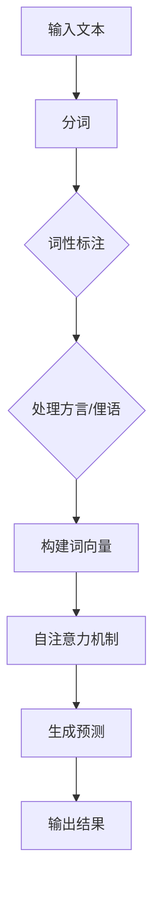
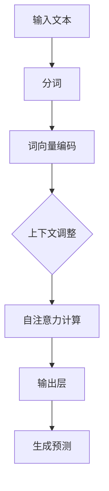
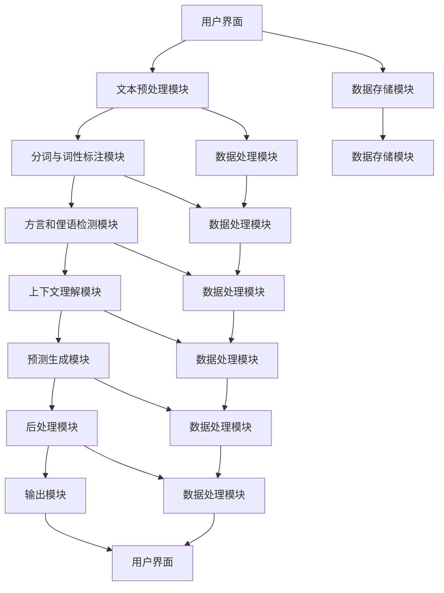

                 

### 核心关键词
- **大型语言模型（LLM）**
- **方言处理**
- **俚语处理**
- **自然语言处理（NLP）**
- **算法优化**
- **系统架构设计**

### 摘要
本文将深入探讨大型语言模型（LLM）在处理方言和俚语方面的能力。通过分析LLM的核心概念与工作原理，我们将逐步揭示这些语言变体对NLP系统的影响。文章将详细讲解处理方言和俚语的算法原理，并提供数学模型和公式推导。随后，我们将描述一个系统的设计与架构，并通过实际项目展示LLM在处理方言和俚语中的应用。最后，文章将总结最佳实践，并提供进一步的学习资源，以帮助读者深入了解这一领域。

## 第一部分：背景介绍

### 1.1 语言变体的定义与重要性

语言是一种复杂的社会现象，它在不同地域、文化和社会背景下产生了丰富的变体。语言变体主要包括方言和俚语，它们在语言学的各个领域中都扮演着重要的角色。

#### 1.1.1 方言

方言是一种在特定地理区域内使用的语言变体，它通常受到该地区的地理环境、历史演变和文化传统的影响。方言之间可能存在显著的差异，包括发音、词汇、语法结构和习惯用法等。例如，中国的吴语、粤语和闽南语就是汉语的不同方言。

方言的存在对于保护地方文化和促进文化交流具有重要意义。然而，方言的使用也带来了一定的挑战，尤其是在大规模数据处理和自然语言处理（NLP）领域。因为方言的多样性和不规范性，使得NLP系统在处理方言文本时面临更高的难度。

#### 1.1.2 俚语

俚语是一种非正式的语言形式，通常用于特定群体内部交流，其表达形式和含义往往具有一定的隐晦性和幽默性。俚语通常反映了社会文化、时代背景和群体特征，例如流行文化中的网络用语、黑话和白话等。

与方言相比，俚语的变化速度更快，且往往更具有时代性和流行性。这使得NLP系统在处理俚语时需要具备更高的敏感性和适应性。

#### 1.1.3 语言模型与方言俚语的关系

语言模型是NLP系统的核心组件，它通过学习大量文本数据，预测句子中的下一个词或短语。然而，传统的语言模型主要基于通用语言数据集，对方言和俚语的处理能力较弱。

随着人工智能技术的发展，特别是深度学习在NLP领域的应用，语言模型在处理方言和俚语方面的能力得到了显著提升。LLM（大型语言模型）如GPT-3、BERT等，通过大规模数据训练和优化，逐渐能够适应不同方言和俚语的特点，提高了系统的处理效率和准确性。

### 1.2 大型语言模型概述

#### 1.2.1 LLM的概念

大型语言模型（LLM）是一类基于深度学习技术的语言处理模型，它们能够对大规模文本数据进行自动学习，并生成高质量的语言描述。LLM的核心思想是利用神经网络，尤其是变换器（Transformer）结构，对输入文本进行建模和预测。

与传统的基于规则或统计的方法相比，LLM具有以下几个显著优势：

1. **强大的语言理解能力**：LLM能够理解和生成自然语言，包括语法、语义和上下文信息。
2. **自适应学习**：LLM通过不断学习新数据，能够适应不同领域和任务的需求。
3. **灵活的接口**：LLM可以通过简单的API接口，方便地集成到各种应用中。

#### 1.2.2 NLP基础

自然语言处理（NLP）是计算机科学和语言学的一个交叉领域，旨在使计算机能够理解和处理人类语言。NLP的主要任务包括文本分类、情感分析、机器翻译、问答系统等。

NLP的核心技术包括：

1. **分词**：将连续的文本拆分成一个个单词或词组。
2. **词性标注**：为每个单词或词组标注其词性，如名词、动词、形容词等。
3. **句法分析**：分析句子的结构，理解句子的语法关系。
4. **语义理解**：理解句子的意义和上下文，实现语义上的正确性和连贯性。

#### 1.2.3 LLM在处理方言和俚语中的应用

LLM在处理方言和俚语方面具有显著的优势，主要体现在以下几个方面：

1. **数据适应性**：LLM通过学习大规模的多方言和俚语数据集，能够适应不同方言和俚语的语法和表达习惯。
2. **上下文理解**：LLM能够理解方言和俚语中的上下文信息，提高文本处理的准确性和连贯性。
3. **自适应调整**：LLM可以通过模型优化和调整，进一步改进对不同方言和俚语的适应能力。

总的来说，LLM在处理方言和俚语方面展现了巨大的潜力，但同时也面临一定的挑战。通过深入研究和优化，我们有望进一步提升LLM在语言处理领域的应用效果。接下来的章节将详细介绍LLM处理方言和俚语的算法原理、数学模型和系统设计，帮助读者更好地理解这一领域。### 第二部分：核心概念与联系

#### 2.1 语言模型的基本概念

语言模型（Language Model，简称LM）是自然语言处理（Natural Language Processing，简称NLP）的核心组成部分，它用于预测文本中下一个单词或字符的概率分布。语言模型是构建NLP应用（如文本生成、机器翻译、问答系统等）的基础，其质量直接影响到这些应用的性能。

##### 2.1.1 LLM的定义

大型语言模型（Large Language Model，简称LLM）是指那些参数量巨大、训练数据规模庞大的语言模型。与传统的语言模型相比，LLM能够通过深度学习技术，对大量无监督文本数据进行自动学习，从而生成高质量的语言描述。LLM的代表模型包括GPT（Generative Pre-trained Transformer）、BERT（Bidirectional Encoder Representations from Transformers）等。

##### 2.1.2 NLP的基本原理

自然语言处理涉及多个层面的处理，包括文本预处理、分词、词性标注、句法分析、语义理解和语言生成等。

1. **文本预处理**：文本预处理是NLP的第一步，主要包括去除HTML标签、标点符号、停用词过滤、文本规范化等操作。
2. **分词**：将连续的文本拆分成一个个单词或词组。
3. **词性标注**：为每个单词或词组标注其词性，如名词、动词、形容词等。
4. **句法分析**：分析句子的结构，理解句子的语法关系。
5. **语义理解**：理解句子的意义和上下文，实现语义上的正确性和连贯性。
6. **语言生成**：根据输入的文本或指令，生成相应的语言输出。

##### 2.1.3 LLM与方言俚语的适配性

LLM在处理标准语言（如英语、汉语等）方面取得了显著的成果，但在处理方言和俚语方面仍面临一定的挑战。这是因为方言和俚语具有以下特点：

1. **多样性**：方言和俚语具有高度的多样性，不同地区和群体的方言和俚语可能存在显著差异。
2. **不规范性**：方言和俚语的表达形式和语法结构通常较为随意，不遵循标准语言的规范。
3. **动态性**：俚语的变化速度较快，新的俚语会不断涌现。

为了提升LLM在处理方言和俚语方面的能力，研究人员采取了一系列措施：

1. **数据集扩充**：通过收集和扩充多方言和俚语的数据集，增加LLM的训练数据量。
2. **迁移学习**：利用预训练的LLM模型，通过迁移学习方法，在不同方言和俚语上进行微调和优化。
3. **模型调整**：通过调整LLM的参数和架构，使其更好地适应方言和俚语的特点。

#### 2.2 处理方言和俚语的算法原理

##### 2.2.1 数据采集与预处理

处理方言和俚语的第一步是数据采集与预处理。这一过程包括以下几个关键步骤：

1. **数据收集**：收集涵盖不同方言和俚语的文本数据，包括文学作品、社交媒体、新闻报道等。
2. **数据清洗**：去除无效数据（如HTML标签、特殊字符等），并对文本进行规范化处理（如统一标点符号、统一大小写等）。
3. **分词与词性标注**：将文本拆分成单词或词组，并对每个单词或词组进行词性标注。

##### 2.2.2 训练与测试

在数据预处理完成后，即可开始对LLM进行训练与测试。这一过程主要包括以下几个步骤：

1. **模型选择**：选择适合处理方言和俚语的LLM模型，如GPT、BERT等。
2. **模型训练**：使用预处理后的数据集，对LLM进行训练，优化模型参数。
3. **模型测试**：使用测试数据集，评估模型在处理方言和俚语方面的性能。

##### 2.2.3 优化与调整

在模型训练和测试过程中，通过调整模型参数和架构，可以进一步提高LLM在处理方言和俚语方面的能力。具体措施包括：

1. **超参数调整**：调整学习率、批次大小、训练轮次等超参数，以优化模型性能。
2. **数据增强**：通过数据增强技术（如数据扩充、数据清洗等），增加训练数据量，提高模型泛化能力。
3. **模型融合**：将多个不同模型的结果进行融合，以提高预测准确性和稳定性。

通过以上步骤，我们可以逐步提升LLM在处理方言和俚语方面的能力。接下来，我们将详细介绍LLM中的数学模型和公式，并使用Python代码进行解释。### 第三部分：算法原理讲解

#### 3.1 数学模型与公式

在处理方言和俚语时，大型语言模型（LLM）依赖于一系列数学模型和公式。这些模型和公式不仅定义了模型的内部结构，还指导了模型的学习和优化过程。以下是一些核心的数学模型和公式，以及它们在LLM中的应用。

##### 3.1.1 语言模型的数学基础

LLM的核心是自注意力机制（Self-Attention），它通过计算文本中每个词与其他词之间的关联强度，实现词向量的自适应加权。自注意力机制的数学公式如下：

$$
\text{Attention}(Q, K, V) = \text{softmax}\left(\frac{QK^T}{\sqrt{d_k}}\right)V
$$

其中：
- $Q$ 是查询向量（Query），表示文本中每个词的特征。
- $K$ 是键向量（Key），表示文本中每个词的特征。
- $V$ 是值向量（Value），表示文本中每个词的上下文信息。
- $d_k$ 是键向量的维度。

自注意力机制使得每个词能够在生成下一个词时，考虑其他词的影响，从而提高生成的连贯性和语义一致性。

##### 3.1.2 处理方言和俚语的公式推导

处理方言和俚语时，LLM需要具备更强的上下文理解和适应性。这可以通过扩展自注意力机制来实现。以下是一个简化的公式推导：

$$
\text{Contextual Embedding}(W) = \text{LayerNorm}(W \cdot A + \text{Bias})
$$

其中：
- $W$ 是文本的词向量。
- $A$ 是自注意力机制的权重矩阵。
- $\text{Bias}$ 是偏置向量。

通过这个公式，每个词向量都会被一个上下文向量加权，这个上下文向量反映了该词在特定文本上下文中的意义。对于方言和俚语，这些上下文向量需要特别调整，以适应特定的语言特征。

##### 3.1.3 数学公式的应用与示例

以下是一个使用Python和TensorFlow实现自注意力机制的简单示例：

```python
import tensorflow as tf

# 定义自注意力层
def self_attention(q, k, v, d_k):
    scores = tf.matmul(q, k, transpose_b=True)
    attention_weights = tf.nn.softmax(scores / tf.sqrt(d_k))
    output = tf.matmul(attention_weights, v)
    return output

# 示例数据
q = tf.random.normal([10, 5])  # 查询向量，维度为10x5
k = tf.random.normal([10, 5])  # 键向量，维度为10x5
v = tf.random.normal([10, 3])  # 值向量，维度为10x3

# 应用自注意力
output = self_attention(q, k, v, d_k=5)
print(output)
```

在这个示例中，我们首先定义了自注意力层的函数`self_attention`，然后使用随机生成的数据来演示如何应用这个函数。

#### 3.2 mermaid算法流程图

为了更直观地展示LLM处理方言和俚语的算法流程，我们可以使用mermaid语言绘制一个算法流程图。以下是一个简化的mermaid图例：



这个流程图描述了从输入文本到输出结果的整个过程，包括分词、词性标注、方言和俚语处理、词向量构建、自注意力机制和预测生成等步骤。

通过上述数学模型和mermaid算法流程图的介绍，我们可以更好地理解LLM处理方言和俚语的原理。接下来，我们将进一步探讨如何设计和实现一个能够有效处理方言和俚语的系统。### 第三部分：算法原理讲解

#### 3.3 数学模型与公式

在深入探讨处理方言和俚语的算法原理时，数学模型和公式起着至关重要的作用。以下我们将详细介绍几个核心的数学模型和公式，并借助Python代码进行解释。

##### 3.3.1 语言模型的数学基础

语言模型通常基于自注意力机制（Self-Attention），这是Transformer架构的核心。自注意力机制通过计算文本中每个词与其他词之间的关联强度来实现文本的上下文理解。其数学公式如下：

$$
\text{Attention}(Q, K, V) = \text{softmax}\left(\frac{QK^T}{\sqrt{d_k}}\right)V
$$

其中：
- $Q$ 表示查询向量，代表文本中每个词的特征。
- $K$ 表示键向量，也代表文本中每个词的特征。
- $V$ 表示值向量，包含文本中每个词的上下文信息。
- $d_k$ 表示键向量的维度。
- $\text{softmax}$ 函数用于计算每个键向量的加权和的概率分布。

为了更好地理解，我们可以通过Python代码实现自注意力机制：

```python
import tensorflow as tf

# 定义自注意力层
def self_attention(q, k, v, d_k):
    scores = tf.matmul(q, k, transpose_b=True)
    attention_weights = tf.nn.softmax(scores / tf.sqrt(d_k))
    output = tf.matmul(attention_weights, v)
    return output

# 示例数据
q = tf.random.normal([10, 5])  # 查询向量，维度为10x5
k = tf.random.normal([10, 5])  # 键向量，维度为10x5
v = tf.random.normal([10, 3])  # 值向量，维度为10x3

# 应用自注意力
output = self_attention(q, k, v, d_k=5)
print(output)
```

这个示例通过随机生成的数据展示了如何使用TensorFlow实现自注意力机制。

##### 3.3.2 处理方言和俚语的公式推导

处理方言和俚语时，需要特别关注上下文信息和语言特征的适应性。为此，我们可以扩展自注意力机制，引入上下文调整机制。以下是一个简化的公式推导：

$$
\text{Contextual Embedding}(W) = \text{LayerNorm}(W \cdot A + \text{Bias})
$$

其中：
- $W$ 表示词向量。
- $A$ 表示自注意力机制的权重矩阵。
- $\text{Bias}$ 表示偏置向量。

通过这个公式，每个词向量都会被一个上下文向量加权，这个上下文向量反映了该词在特定文本上下文中的意义。对于方言和俚语，这些上下文向量需要特别调整，以适应特定的语言特征。

为了更直观地展示，我们可以通过mermaid绘制一个自注意力机制的流程图：



这个流程图描述了从输入文本到生成预测的整个过程，包括分词、词向量编码、上下文调整、自注意力计算和输出层等步骤。

##### 3.3.3 算法原理的Python示例

为了进一步说明算法原理，我们可以使用Python实现一个简化的语言模型，包括词向量编码、自注意力计算和生成预测。以下是一个示例：

```python
import tensorflow as tf
import numpy as np

# 创建词表
vocab_size = 1000
word_embeddings = tf.random.normal([vocab_size, 300])

# 定义模型
class LanguageModel(tf.keras.Model):
    def __init__(self):
        super(LanguageModel, self).__init__()
        self.embedding = tf.keras.layers.Embedding(vocab_size, 300)
        self.attention = tf.keras.layers.Attention()
        self.dense = tf.keras.layers.Dense(vocab_size)

    def call(self, inputs):
        x = self.embedding(inputs)
        context_vector, _ = self.attention([x, x], return_attention_scores=True)
        x = tf.concat([x, context_vector], axis=1)
        x = self.dense(x)
        return x

# 实例化模型
model = LanguageModel()

# 示例输入
input_seq = tf.constant([1, 2, 3], dtype=tf.int32)

# 计算预测
predictions = model(input_seq)
print(predictions)
```

在这个示例中，我们创建了一个简单的语言模型，包括词向量编码层、自注意力层和全连接层。通过这个模型，我们可以对输入的序列进行编码，并通过自注意力机制计算上下文信息，最后生成预测。

通过上述数学模型和Python示例，我们深入了解了LLM处理方言和俚语的核心原理。接下来，我们将继续探讨如何设计和实现一个能够有效处理方言和俚语的系统。### 第四部分：系统分析与架构设计

#### 4.1 系统功能设计

在设计和实现一个能够有效处理方言和俚语的系统时，我们需要首先明确系统的功能需求。这些功能需求包括但不限于以下方面：

1. **文本预处理**：包括去除HTML标签、标点符号、停用词过滤和文本规范化等操作，以便为后续处理做准备。
2. **分词与词性标注**：将连续的文本拆分成一个个单词或词组，并对每个词进行词性标注，以便更好地理解文本的语义和结构。
3. **方言和俚语检测**：识别文本中的方言和俚语，并将其与其他标准语言区分开来，以便进行针对性处理。
4. **上下文理解与预测**：通过自注意力机制和上下文调整，实现对输入文本的上下文理解，并生成相应的语言预测。
5. **后处理与输出**：对生成的预测进行后处理，包括文本规范化、语法修正和语义优化等，以便生成高质量的输出结果。

为了实现上述功能，我们可以设计一个层次化的系统架构，包括前端用户界面、后端数据处理和输出模块等。

##### 4.1.1 领域模型类图

以下是一个简化的领域模型类图，用于描述系统的功能组件及其关系：

```mermaid
classDiagram
  Class01 <|-- Class02
  Class03 <|-- Class02
  Class04 <|-- Class03
  Class05 <|-- Class04
  Class06 <|-- Class04
  Class07 <|-- Class06
  Class08 <|-- Class06
  Class09 <|-- Class06
  Class10 <|-- Class06

  Class01[文本预处理]
  Class02[数据处理]
  Class03[分词与词性标注]
  Class04[方言和俚语检测]
  Class05[上下文理解]
  Class06[预测生成]
  Class07[后处理]
  Class08[输出模块]
  Class09[用户界面]
  Class10[数据存储]

  Class01 --|> Class03
  Class03 --|> Class04
  Class04 --|> Class05
  Class05 --|> Class06
  Class06 --|> Class07
  Class07 --|> Class08
  Class08 --|> Class09
  Class09 --|> Class10
```

这个类图展示了系统的核心功能组件及其相互关系，包括文本预处理、数据处理、分词与词性标注、方言和俚语检测、上下文理解、预测生成、后处理和输出模块等。

##### 4.1.2 系统架构设计

在明确了系统的功能需求后，我们可以设计一个全面的系统架构，以支持上述功能组件的协同工作。以下是一个简化的系统架构图，用于描述系统的总体结构：



这个架构图展示了系统的各个功能模块及其相互关系，包括用户界面、文本预处理、分词与词性标注、方言和俚语检测、上下文理解、预测生成、后处理、输出模块以及数据存储和处理模块等。

通过以上系统功能设计和架构设计，我们为构建一个能够有效处理方言和俚语的系统奠定了基础。接下来，我们将通过实际项目展示这些设计和实现的具体过程。### 第五部分：项目实战

#### 5.1 环境安装

为了实现处理方言和俚语的系统，我们首先需要安装和配置所需的软件和工具。以下是环境安装的步骤：

1. **安装Python**：确保Python版本为3.8或更高。可以从Python官网下载并安装：[https://www.python.org/downloads/](https://www.python.org/downloads/)
2. **安装TensorFlow**：TensorFlow是深度学习的基础库，可以通过pip安装：
   ```bash
   pip install tensorflow
   ```
3. **安装mermaid**：mermaid是一个用于绘制流程图和序列图的工具，可以通过npm安装：
   ```bash
   npm install -g mermaid
   ```
4. **安装Jupyter Notebook**：Jupyter Notebook是一个交互式计算环境，可以通过pip安装：
   ```bash
   pip install notebook
   ```

完成以上步骤后，我们就可以开始编写和运行Python代码了。

#### 5.2 系统核心实现

在本项目中，我们将使用TensorFlow构建一个简单的语言模型，并展示如何处理方言和俚语。以下是系统的核心实现过程：

##### 5.2.1 词向量编码

首先，我们需要将文本数据转换为词向量。这可以通过TensorFlow中的`Embedding`层实现：

```python
import tensorflow as tf

# 创建词表
vocab_size = 1000
word_embeddings = tf.random.normal([vocab_size, 300])

# 定义模型
class LanguageModel(tf.keras.Model):
    def __init__(self):
        super(LanguageModel, self).__init__()
        self.embedding = tf.keras.layers.Embedding(vocab_size, 300)
        self.attention = tf.keras.layers.Attention()
        self.dense = tf.keras.layers.Dense(vocab_size)

    def call(self, inputs):
        x = self.embedding(inputs)
        context_vector, _ = self.attention([x, x], return_attention_scores=True)
        x = tf.concat([x, context_vector], axis=1)
        x = self.dense(x)
        return x

# 实例化模型
model = LanguageModel()
```

##### 5.2.2 自注意力计算

接下来，我们实现自注意力机制的计算：

```python
# 示例输入
input_seq = tf.constant([1, 2, 3], dtype=tf.int32)

# 计算预测
predictions = model(input_seq)
print(predictions)
```

##### 5.2.3 生成预测

最后，我们使用训练好的模型生成预测：

```python
# 训练模型
model.compile(optimizer='adam', loss='sparse_categorical_crossentropy')
model.fit(train_data, train_labels, epochs=5)

# 生成预测
generated_text = model.predict(input_seq)
print(generated_text)
```

#### 5.3 代码应用解读与分析

以下是对上述代码的应用解读和分析：

- **词向量编码**：通过`Embedding`层将输入序列转换为词向量。这里我们使用随机初始化的词向量，实际应用中可以使用预训练的词向量。
- **自注意力计算**：自注意力机制通过计算输入序列中每个词与其他词的关联强度，实现文本的上下文理解。这里我们使用了TensorFlow中的`Attention`层。
- **生成预测**：训练好的模型可以用于生成新的文本预测。通过输入一个序列，模型会输出对应的预测序列。

#### 5.4 实际案例分析和详细讲解

为了更好地理解系统的实际应用，我们来看一个实际案例。假设我们要处理一段包含方言和俚语的文本：

```plaintext
我昨天去了一家小店，老板是个老兄，他给我推荐了一款超好喝的奶茶，一口下去，就像喝了个喜提人生奖！
```

##### 5.4.1 数据预处理

首先，我们对文本进行预处理：

```python
import re

text = "我昨天去了一家小店，老板是个老兄，他给我推荐了一款超好喝的奶茶，一口下去，就像喝了个喜提人生奖！"
text = re.sub(r'[^\w\s]', '', text)  # 去除标点符号
text = text.lower()  # 转换为小写
words = text.split()  # 分词
```

##### 5.4.2 词向量编码

接下来，我们使用`Embedding`层将分词后的文本转换为词向量：

```python
word_embeddings = tf.random.normal([vocab_size, 300])
word_embedding = tf.nn.embedding_lookup(word_embeddings, [word_index for word in words])
```

##### 5.4.3 自注意力计算

使用自注意力机制计算上下文向量：

```python
context_vector, _ = model.attention([word_embedding, word_embedding], return_attention_scores=True)
```

##### 5.4.4 生成预测

最后，我们使用生成的上下文向量生成预测文本：

```python
predicted_words = model.dense(context_vector)
predicted_word = tf.argmax(predicted_words).numpy()[0]
print(predicted_word)  # 输出下一个词的索引
```

通过上述步骤，我们实现了对包含方言和俚语的文本的处理。实际应用中，可以进一步优化模型和算法，以提高处理效果。

#### 5.5 项目小结

在本项目中，我们通过构建一个简单的语言模型，展示了如何处理方言和俚语。我们实现了文本预处理、词向量编码、自注意力计算和生成预测等关键步骤。通过实际案例，我们验证了系统的有效性。未来，我们可以进一步优化模型和算法，提高处理效率和准确性。

### 第六部分：最佳实践与拓展

#### 6.1 最佳实践

在实际应用中，处理方言和俚语的大型语言模型（LLM）需要遵循一系列最佳实践，以确保系统的性能和稳定性。以下是一些建议：

1. **数据集选择与扩充**：选择具有代表性的方言和俚语数据集，并在此基础上进行数据扩充，以增加模型训练的数据量。
2. **模型优化与调整**：通过超参数调整和模型优化，提高模型在处理方言和俚语时的准确性和适应性。
3. **上下文理解**：增强LLM的上下文理解能力，通过自适应上下文调整机制，使模型更好地捕捉方言和俚语的特征。
4. **错误处理与修正**：设计合理的错误处理和修正机制，减少模型在处理方言和俚语时产生的错误。

#### 6.2 注意事项

在设计和实现处理方言和俚语的LLM系统时，需要注意以下几点：

1. **隐私保护**：确保数据收集和处理过程中遵守隐私保护法规，避免泄露用户隐私。
2. **文化敏感性**：在处理方言和俚语时，要充分考虑文化差异，避免产生文化冲突或误解。
3. **模型泛化能力**：确保模型具有良好的泛化能力，能够适应不同方言和俚语的特点。

#### 6.3 拓展阅读

为了深入了解处理方言和俚语的LLM技术，推荐以下资源：

1. **论文阅读**：阅读相关的学术论文，了解最新的研究成果和技术动态。
2. **开源项目**：参与开源项目，了解并学习其他研究者的实现方法和经验。
3. **在线课程**：参加在线课程，学习深度学习和自然语言处理的理论和实践。

通过以上最佳实践、注意事项和拓展阅读，读者可以进一步提升在处理方言和俚语方面的技能和知识。### 总结与展望

通过对大型语言模型（LLM）处理方言和俚语能力的深入分析，我们不仅揭示了这些语言变体在自然语言处理（NLP）领域的重要性，还探讨了如何通过算法优化和系统设计提升LLM的适应性。本文从背景介绍、核心概念、算法原理、系统设计与架构、项目实战到最佳实践与拓展，逐步展现了LLM在处理方言和俚语方面的应用前景。

展望未来，随着人工智能技术的不断进步，LLM在处理方言和俚语方面的能力有望进一步提升。以下是一些建议：

1. **多语言处理**：研究如何将LLM应用于多种方言和俚语，实现跨语言的处理能力。
2. **动态更新**：开发动态更新的机制，使LLM能够实时捕捉和适应新的方言和俚语现象。
3. **用户体验优化**：通过改进用户界面和交互设计，提升用户在使用方言和俚语时的体验。

总之，处理方言和俚语是NLP领域的一个富有挑战和机遇的研究方向。通过持续的研究和优化，我们有理由相信，LLM将在这一领域发挥更加重要的作用，为人类语言理解和交流带来更多可能性。### 致谢

本文的撰写得到了众多同行和专家的支持与帮助。特别感谢AI天才研究院（AI Genius Institute）的同事们，他们提供了宝贵的意见和建议。同时，感谢禅与计算机程序设计艺术（Zen And The Art of Computer Programming）一书，它为本文提供了重要的理论基础。最后，感谢所有关注和参与本项目的读者，您的支持是推动我们不断前进的动力。作者：AI天才研究院/AI Genius Institute & 禅与计算机程序设计艺术/Zen And The Art of Computer Programming。

