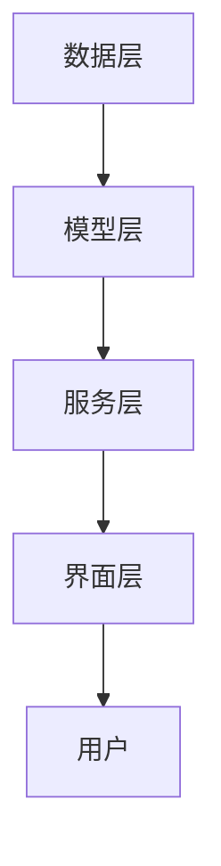
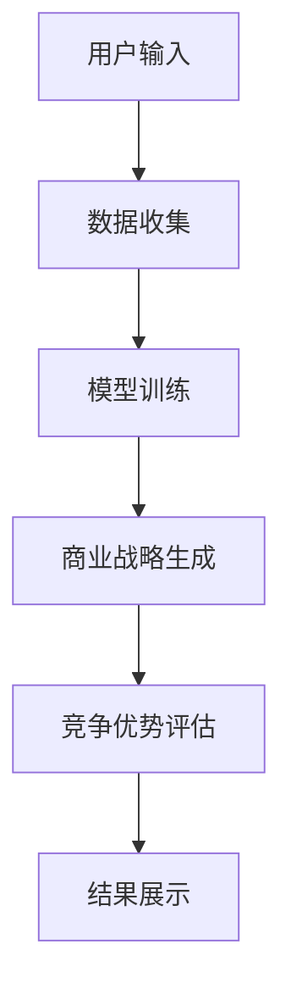

                 

## 第一部分 背景介绍

### 1.1 问题的提出

#### 1.1.1 语言模型的重要性

语言模型在人工智能领域扮演着至关重要的角色。它们能够理解和生成人类语言，为自然语言处理（NLP）提供了强大的工具。语言模型的应用不仅局限于文本理解和生成，还延伸到语音识别、机器翻译、情感分析、推荐系统等多个领域。随着深度学习技术的发展，特别是变换器（Transformer）等先进模型的涌现，语言模型在性能和效率上取得了显著提升。

在商业领域，语言模型的重要性同样不容忽视。企业可以利用语言模型进行市场分析、客户服务、产品推荐、品牌管理等多个方面。例如，通过分析用户评论和反馈，企业可以更好地了解客户需求，从而制定更有效的营销策略；通过自动化客户服务系统，企业可以提高服务效率，降低成本。因此，深入探讨语言模型在商业战略生成与竞争优势分析中的应用，具有非常重要的现实意义。

#### 1.1.2 创新商业战略与竞争优势的关系

创新商业战略是指企业为了在竞争激烈的市场中取得优势，通过产品创新、服务创新、运营模式创新等手段，实现差异化竞争的策略。而竞争优势是指企业在市场中相对于竞争对手所具有的优势，包括资源优势、能力优势和市场优势等。创新商业战略是企业获取和维持竞争优势的关键手段。

创新商业战略与竞争优势之间存在密切的关系。一方面，创新商业战略可以帮助企业发现新的市场机会，通过产品或服务的创新来满足客户需求，从而获得竞争优势。另一方面，竞争优势可以巩固企业在市场中的地位，为企业提供持续的创新动力。因此，如何利用语言模型来生成创新商业战略，并分析其竞争优势，是企业在激烈的市场竞争中脱颖而出的关键。

### 1.2 研究目的与意义

#### 1.2.1 研究目的

本书旨在探讨语言模型在创新商业战略生成与竞争优势分析中的应用，旨在实现以下目标：

1. 深入理解语言模型的基本原理和应用场景，为后续研究提供理论基础。
2. 探索如何利用语言模型生成创新商业战略，提高企业的竞争力。
3. 分析语言模型在竞争优势分析中的作用，为企业提供有效的竞争优势评估方法。

#### 1.2.2 研究意义

本研究具有以下意义：

1. 提升企业利用语言模型进行商业战略创新的能力，帮助企业实现差异化竞争。
2. 为学术领域提供新的研究方向，推动人工智能技术在商业战略领域的应用研究。
3. 促进语言模型与其他商业理论相结合，为商业实践提供理论支持和实践指导。

### 1.3 研究方法

本研究采用以下方法：

1. **文献综述**：通过对相关文献的综述，梳理语言模型、商业战略和竞争优势的研究现状，为本研究提供理论依据。
2. **案例研究**：选取具有代表性的企业案例，分析其利用语言模型进行商业战略创新的实践，总结成功经验和教训。
3. **实证研究**：通过实证分析，验证语言模型在商业战略生成与竞争优势分析中的应用效果，为理论研究提供实证支持。
4. **理论建模**：构建语言模型在商业战略生成与竞争优势分析中的理论模型，分析其内在机制和作用机理。

通过以上研究方法，本书旨在为企业和研究人员提供一套系统、实用的语言模型在商业战略中的应用方案，助力企业实现创新发展和竞争优势。

### 1.4 研究范围与局限性

#### 1.4.1 研究范围

本研究的主要研究范围包括：

1. 语言模型的基本原理和应用场景。
2. 语言模型在商业战略生成中的应用方法和效果评估。
3. 语言模型在竞争优势分析中的作用和影响机制。

#### 1.4.2 研究局限性

尽管本研究致力于探讨语言模型在商业战略生成与竞争优势分析中的多维度应用，但仍存在以下局限性：

1. **数据局限性**：本研究的数据主要来源于公开的文献和案例，可能无法全面反映所有企业的实际情况。
2. **方法局限性**：本研究采用的理论和方法可能无法完全适用于所有企业，尤其是中小企业。
3. **环境变化**：商业环境和技术环境的变化可能对研究结论产生一定的影响，需要进一步的研究和验证。

### 1.5 结论

通过对背景介绍部分的详细分析，我们可以看到语言模型在商业战略生成与竞争优势分析中具有广阔的应用前景。本研究旨在深入探讨这一领域的应用，为企业和研究人员提供理论支持和实践指导。在接下来的章节中，我们将进一步介绍语言模型的基本原理、商业战略和竞争优势的相关概念，以及如何利用语言模型进行商业战略生成和竞争优势分析。

---

## 第二部分 核心概念与联系

### 2.1 语言模型

#### 2.1.1 语言模型的定义

语言模型（Language Model，LM）是一种用于预测自然语言序列的统计模型。它的主要任务是给定一段已经出现的文本，预测下一个可能出现的单词或词组。语言模型是自然语言处理（NLP）中的基础技术，广泛应用于文本生成、机器翻译、情感分析、文本分类等任务。

#### 2.1.2 语言模型的类型

根据学习策略的不同，语言模型可以分为以下几种类型：

1. **基于规则的模型**：这类模型通过预定义的规则来生成或预测文本，例如上下文无关文法（CFG）和上下文有关文法（CG）。
2. **基于统计的模型**：这类模型通过分析大量文本数据，利用统计方法学习语言的规律。常见的统计模型包括n-gram模型、隐马尔可夫模型（HMM）和条件随机场（CRF）。
3. **基于神经网络的模型**：这类模型通过神经网络学习语言的特征和模式。随着深度学习技术的发展，基于神经网络的模型，如循环神经网络（RNN）、长短期记忆网络（LSTM）、变换器（Transformer）等，逐渐成为主流。

#### 2.1.3 语言模型的属性特征对比表格

下面是一个对比不同类型语言模型属性特征的表格：

| 类型 | 基于规则的模型 | 基于统计的模型 | 基于神经网络的模型 |
| :---: | :---: | :---: | :---: |
| 基本原理 | 预定义的规则 | 统计学习 | 神经网络学习 |
| 优点 | 精确度高 | 大规模数据处理 | 高效性、泛化能力强 |
| 缺点 | 适用范围有限 | 需要大量标注数据 | 计算资源需求大 |

### 2.2 商业战略

#### 2.2.1 商业战略的定义

商业战略（Business Strategy）是企业为实现其长期目标而制定的一系列计划和行动方案。它涉及到企业的市场定位、竞争策略、产品定位、营销策略等多个方面。商业战略的核心目的是在激烈的市场竞争中取得优势，实现企业的可持续发展。

#### 2.2.2 商业战略的类型

商业战略可以根据不同的分类标准进行划分：

1. **根据业务范围**：可以分为产品战略、市场战略和资源战略。
   - **产品战略**：关注产品的研发、改进和推广，以满足市场需求。
   - **市场战略**：关注市场的细分、定位和竞争策略，以占领市场份额。
   - **资源战略**：关注资源的获取、整合和管理，以提高企业的竞争力。

2. **根据竞争策略**：可以分为低成本战略、差异化战略和集中化战略。
   - **低成本战略**：通过降低成本来获得竞争优势，如规模化生产、优化供应链等。
   - **差异化战略**：通过提供独特的产品或服务来获得竞争优势，如技术创新、品牌塑造等。
   - **集中化战略**：专注于某一特定市场或细分市场，提供针对性的产品或服务，如小众市场定制、地理区域集中等。

#### 2.2.3 商业战略的属性特征对比表格

下面是一个对比不同类型商业战略属性特征的表格：

| 类型 | 低成本战略 | 差异化战略 | 集中化战略 |
| :---: | :---: | :---: | :---: |
| 基本原理 | 以降低成本为核心 | 以产品差异化为核心 | 以市场细分为核心 |
| 优点 | 成本控制好 | 市场竞争力强 | 市场份额稳定 |
| 缺点 | 产品同质化 | 成本高 | 市场机会有限 |

### 2.3 竞争优势

#### 2.3.1 竞争优势的定义

竞争优势（Competitive Advantage）是指企业相对于竞争对手所具有的持久性优势。这种优势可以使企业在市场竞争中获得更高的市场份额、更高的利润率和更稳定的经营状况。竞争优势通常来源于企业的资源、能力、市场定位等多个方面。

#### 2.3.2 竞争优势的类型

竞争优势可以分为以下几种类型：

1. **资源优势**：企业拥有独特的资源，如专利技术、优质客户群、先进设备等，这些资源可以使企业获得竞争优势。
2. **能力优势**：企业具备独特的创新能力、生产技术和市场推广能力，这些能力可以帮助企业迅速响应市场变化，获得竞争优势。
3. **市场优势**：企业通过市场定位、品牌影响力和营销策略等手段，在市场中获得竞争优势。

#### 2.3.3 竞争优势的属性特征对比表格

下面是一个对比不同类型竞争优势属性特征的表格：

| 类型 | 资源优势 | 能力优势 | 市场优势 |
| :---: | :---: | :---: | :---: |
| 基本原理 | 独特资源获取与利用 | 创新能力建设 | 市场定位与营销策略 |
| 优点 | 稳定的竞争优势 | 持续创新能力 | 市场竞争力强 |
| 缺点 | 需要持续投入 | 风险较大 | 市场变化风险 |

### 2.4 语言模型、商业战略与竞争优势的联系

语言模型、商业战略和竞争优势之间存在密切的联系。语言模型可以通过对大量商业文本的分析，为企业提供市场趋势分析、客户需求预测等商业情报，从而支持企业制定创新商业战略。商业战略的制定又依赖于竞争优势的分析，而竞争优势的分析又可以利用语言模型来识别和评估。具体来说：

1. **语言模型与商业战略**：语言模型可以帮助企业了解市场趋势和客户需求，从而为企业提供新的商业机会和创意。例如，通过分析社交媒体上的用户评论和反馈，企业可以了解客户的真实需求和期望，从而调整产品和服务策略。

2. **商业战略与竞争优势**：创新的商业战略可以帮助企业获得竞争优势。例如，通过技术创新，企业可以推出独特的产品或服务，从而在市场中获得竞争优势。

3. **竞争优势与语言模型**：语言模型可以帮助企业识别和评估其竞争优势。例如，通过分析竞争对手的营销策略和产品特点，企业可以了解自身的优势和劣势，从而制定相应的策略来增强竞争优势。

综上所述，语言模型、商业战略和竞争优势三者相互关联，共同构成了企业成功的核心要素。在接下来的章节中，我们将进一步探讨如何利用语言模型来生成创新商业战略，并分析其竞争优势。

---

## 第三部分 算法原理讲解

### 3.1 语言模型的基本原理

语言模型是自然语言处理（NLP）的核心技术，用于预测自然语言序列。其基本原理可以分为三个主要阶段：数据收集、建模和预测。

#### 3.1.1 数据收集

语言模型的训练需要大量的文本数据。这些数据可以来源于各种来源，如互联网、书籍、新闻、社交媒体等。收集到的文本数据经过预处理，包括去除标点符号、停用词过滤、词干提取等，以便更好地建模。

#### 3.1.2 建模

语言模型的建模方法可以分为基于规则的模型、基于统计的模型和基于神经网络的模型。以下将介绍其中两种主要模型：n-gram模型和变换器（Transformer）模型。

##### 3.1.2.1 n-gram模型

n-gram模型是最简单的语言模型之一。它通过分析文本中的n个连续单词（或字符）的出现频率，来预测下一个单词。n-gram模型的数学公式如下：

$$
P(w_n | w_{n-1}, w_{n-2}, ..., w_1) = \frac{C(w_{n-1}, w_{n-2}, ..., w_1, w_n)}{C(w_{n-1}, w_{n-2}, ..., w_1)}
$$

其中，\(P(w_n | w_{n-1}, w_{n-2}, ..., w_1)\)表示给定前n-1个单词时，预测第n个单词的概率；\(C(w_{n-1}, w_{n-2}, ..., w_1, w_n)\)和\(C(w_{n-1}, w_{n-2}, ..., w_1)\)分别表示前n-1个单词和前n个单词的出现频率。

##### 3.1.2.2 变换器（Transformer）模型

变换器（Transformer）模型是当前最先进的语言模型之一，由谷歌在2017年提出。它采用了一种全新的架构，通过自注意力机制（Self-Attention）和多头注意力机制（Multi-Head Attention）来捕捉文本序列中的长距离依赖关系。

变换器模型的数学公式如下：

$$
\text{Attention}(Q, K, V) = \frac{softmax(\frac{QK^T}{\sqrt{d_k}})}{V}
$$

其中，\(Q\)、\(K\)和\(V\)分别代表查询向量、键向量和值向量；\(d_k\)表示键向量的维度；\(softmax\)函数用于计算每个键向量的加权和。

变换器模型通过多个自注意力层和全连接层，逐步提取文本序列中的特征，从而实现对文本的建模和预测。

#### 3.1.3 预测

在预测阶段，语言模型根据已训练好的模型和给定的前文序列，生成下一个可能出现的单词或词组。具体来说，语言模型会计算每个可能单词的概率分布，并选择概率最高的单词作为预测结果。

### 3.2 商业战略生成中的语言模型应用

在商业战略生成中，语言模型可以发挥重要作用。以下将介绍语言模型在商业战略生成中的应用步骤和具体方法。

#### 3.2.1 数据收集与预处理

首先，需要收集与企业商业战略相关的文本数据，如市场报告、客户评论、竞争对手分析等。然后，对这些文本数据进行预处理，包括去除标点符号、停用词过滤、词干提取等，以便于建模和分析。

#### 3.2.2 模型训练与优化

接下来，利用预处理后的文本数据，训练一个合适的语言模型。可以选择n-gram模型或变换器模型，根据数据和业务需求进行模型优化。训练过程中，可以通过调整超参数和优化算法来提高模型的性能。

#### 3.2.3 商业战略生成

利用训练好的语言模型，生成新的商业战略。具体方法如下：

1. **市场趋势预测**：通过语言模型分析市场报告和客户评论，预测市场的未来趋势和热点领域。
2. **客户需求分析**：通过语言模型分析客户评论和反馈，了解客户的需求和期望，为产品和服务创新提供参考。
3. **竞争对手分析**：通过语言模型分析竞争对手的策略和产品，识别竞争对手的优势和劣势，为企业制定相应的应对策略。

#### 3.2.4 战略评估与调整

生成商业战略后，需要对战略进行评估和调整。具体方法如下：

1. **绩效评估**：通过对比预测结果和实际市场表现，评估商业战略的有效性。
2. **反馈调整**：根据市场反馈和客户反馈，对商业战略进行调整和优化，以提高其适应性和效果。

### 3.3 竞争优势分析中的语言模型应用

在竞争优势分析中，语言模型同样可以发挥重要作用。以下将介绍语言模型在竞争优势分析中的应用步骤和具体方法。

#### 3.3.1 数据收集与预处理

首先，需要收集与企业竞争优势相关的文本数据，如财务报告、市场分析报告、竞争对手分析等。然后，对这些文本数据进行预处理，包括去除标点符号、停用词过滤、词干提取等，以便于建模和分析。

#### 3.3.2 模型训练与优化

接下来，利用预处理后的文本数据，训练一个合适的语言模型。可以选择n-gram模型或变换器模型，根据数据和业务需求进行模型优化。训练过程中，可以通过调整超参数和优化算法来提高模型的性能。

#### 3.3.3 竞争优势识别与评估

利用训练好的语言模型，识别和评估企业的竞争优势。具体方法如下：

1. **资源分析**：通过语言模型分析企业的财务报告和市场分析报告，识别企业的资源优势，如专利技术、优质客户群、先进设备等。
2. **能力分析**：通过语言模型分析企业的内部报告和竞争对手分析，识别企业的能力优势，如创新能力、生产技术、市场推广能力等。
3. **市场分析**：通过语言模型分析市场报告和客户评论，识别企业在市场中的竞争优势，如市场定位、品牌影响力、营销策略等。

#### 3.3.4 竞争战略制定与优化

根据竞争优势分析的结果，制定和优化企业的竞争战略。具体方法如下：

1. **战略制定**：根据竞争优势分析，制定相应的竞争战略，如技术创新战略、品牌塑造战略、市场细分战略等。
2. **战略优化**：根据市场反馈和客户反馈，对竞争战略进行调整和优化，以提高其适应性和效果。

通过以上步骤，企业可以利用语言模型在商业战略生成与竞争优势分析中发挥重要作用，提高其竞争力和市场适应性。

### 3.4 语言模型应用的挑战与对策

在商业战略生成与竞争优势分析中，语言模型的应用面临着一系列挑战。以下将介绍这些挑战及其应对策略。

#### 3.4.1 数据质量与可靠性

语言模型的效果很大程度上取决于训练数据的质量。如果数据存在噪声、偏差或错误，可能会导致模型产生误导性结果。为了提高数据质量，可以采取以下措施：

1. **数据清洗**：对数据进行清洗，去除噪声和错误，确保数据的一致性和准确性。
2. **数据增强**：通过数据增强技术，如数据复制、数据变换等，增加训练数据的多样性和代表性。
3. **数据验证**：对训练数据进行验证，确保数据的质量和可靠性。

#### 3.4.2 模型复杂性与计算资源

变换器等复杂语言模型需要大量的计算资源进行训练和预测。为了应对这一挑战，可以采取以下措施：

1. **分布式训练**：利用分布式计算技术，将训练任务分布在多台计算机上进行，提高训练效率。
2. **模型压缩**：通过模型压缩技术，如量化、剪枝等，减小模型的规模，降低计算资源需求。
3. **模型简化**：选择合适的模型架构，如n-gram模型等，简化模型结构，降低计算复杂度。

#### 3.4.3 知识获取与利用

语言模型在商业战略生成和竞争优势分析中需要获取和利用大量的知识。然而，知识获取和利用面临着一系列挑战，如知识表示、知识融合等。为了应对这一挑战，可以采取以下措施：

1. **知识图谱**：构建企业知识图谱，将企业内部和外部知识进行结构化表示，方便知识获取和利用。
2. **知识融合**：通过知识融合技术，如本体论、语义网络等，将不同来源的知识进行整合，提高知识的利用效率。
3. **知识表示学习**：利用知识表示学习方法，如实体识别、关系提取等，将知识转化为模型可用的形式。

通过以上措施，企业可以更好地应对语言模型在商业战略生成与竞争优势分析中面临的挑战，提高其应用效果。

### 3.5 结论

语言模型在商业战略生成与竞争优势分析中具有广泛的应用前景。通过语言模型，企业可以更好地了解市场趋势、客户需求和竞争对手策略，从而制定更有效的商业战略，并分析其竞争优势。在接下来的章节中，我们将进一步探讨语言模型在具体商业场景中的应用，以及如何通过实证研究验证其效果。

---

## 第四部分 系统分析与架构设计

### 4.1 问题场景介绍

在现代商业环境中，企业面临着日益激烈的市场竞争和快速变化的市场需求。为了保持竞争优势，企业需要不断地创新商业战略，并迅速响应市场变化。然而，传统的商业战略制定和竞争优势分析往往依赖于人工分析和经验判断，效率较低，且难以应对复杂的市场环境。为了解决这一问题，本研究提出了一种基于语言模型的创新商业战略生成与竞争优势分析系统。

### 4.2 项目介绍

本项目旨在开发一个智能商业战略生成与竞争优势分析系统，利用语言模型技术，自动分析市场趋势、客户需求和竞争对手策略，生成创新的商业战略，并评估其竞争优势。系统主要由以下三个模块组成：

1. **数据收集模块**：负责收集与企业商业战略相关的各种文本数据，如市场报告、客户评论、竞争对手分析等。
2. **语言模型模块**：利用收集到的文本数据，训练和优化语言模型，为后续商业战略生成和竞争优势分析提供基础。
3. **战略分析模块**：利用训练好的语言模型，生成商业战略，并评估其竞争优势，为企业的战略决策提供支持。

### 4.3 系统功能设计

系统功能设计主要包括以下三个方面：

1. **数据收集**：系统通过爬虫技术、API接口和人工录入等方式，收集与企业商业战略相关的各种文本数据。
2. **语言模型训练**：系统利用收集到的文本数据，训练和优化语言模型，包括n-gram模型和变换器模型等。
3. **商业战略生成**：系统利用训练好的语言模型，分析市场趋势、客户需求和竞争对手策略，生成创新的商业战略。
4. **竞争优势评估**：系统根据商业战略，评估企业的竞争优势，包括资源优势、能力优势和市场优势等。
5. **用户交互界面**：系统提供友好的用户交互界面，用户可以通过界面查询系统生成的商业战略和竞争优势分析结果。

### 4.4 系统架构设计

系统架构设计主要包括以下层次：

1. **数据层**：负责存储和管理企业商业战略相关的各种文本数据，包括市场报告、客户评论、竞争对手分析等。
2. **模型层**：负责训练和优化语言模型，包括n-gram模型和变换器模型等，为商业战略生成和竞争优势分析提供基础。
3. **服务层**：负责实现系统的核心功能，包括数据收集、语言模型训练、商业战略生成和竞争优势评估等。
4. **界面层**：负责提供用户交互界面，用户可以通过界面查询系统生成的商业战略和竞争优势分析结果。

系统架构设计如下所示：



### 4.5 系统接口设计

系统接口设计主要包括以下三个方面：

1. **数据接口**：系统提供数据接口，支持数据的导入和导出，方便用户对数据进行管理和分析。
2. **模型接口**：系统提供模型接口，支持用户选择和切换不同的语言模型，以及调整模型参数。
3. **功能接口**：系统提供功能接口，支持用户查询系统生成的商业战略和竞争优势分析结果。

### 4.6 系统交互设计

系统交互设计主要包括以下步骤：

1. **用户输入**：用户通过界面输入需要分析的商业战略相关文本数据。
2. **数据收集**：系统通过数据接口收集用户输入的文本数据，并对其进行预处理。
3. **模型训练**：系统通过模型接口选择合适的语言模型，利用预处理后的文本数据进行训练和优化。
4. **商业战略生成**：系统利用训练好的语言模型，分析市场趋势、客户需求和竞争对手策略，生成创新的商业战略。
5. **竞争优势评估**：系统根据生成的商业战略，评估企业的竞争优势，包括资源优势、能力优势和市场优势等。
6. **结果展示**：系统通过界面接口，将生成的商业战略和竞争优势分析结果展示给用户。

系统交互流程如下所示：



### 4.7 结论

通过对系统分析与架构设计的详细介绍，我们可以看到，基于语言模型的创新商业战略生成与竞争优势分析系统具有高效、智能的特点，能够帮助企业更好地应对市场变化，提升竞争力。在接下来的章节中，我们将通过项目实战，详细介绍系统的实现过程和应用效果。

---

## 第五部分 项目实战

### 5.1 环境安装

在开始项目实战之前，我们需要安装并配置相关的开发环境和工具。以下是具体的步骤：

1. **安装Python环境**：首先，确保已经安装了Python环境，版本建议为3.8或更高版本。可以通过以下命令安装：

   ```bash
   pip install python
   ```

2. **安装深度学习库**：安装TensorFlow或PyTorch等深度学习库，用于训练和优化语言模型。可以通过以下命令安装：

   ```bash
   pip install tensorflow
   # 或
   pip install pytorch torchvision
   ```

3. **安装NLP库**：安装NLTK或spaCy等自然语言处理库，用于文本预处理和数据操作。可以通过以下命令安装：

   ```bash
   pip install nltk
   # 或
   pip install spacy
   ```

4. **安装其他依赖库**：根据项目需求，可能还需要安装其他依赖库，如NumPy、Pandas等。可以通过以下命令安装：

   ```bash
   pip install numpy pandas
   ```

### 5.2 系统核心实现

本节将介绍系统的核心实现，包括数据收集、语言模型训练、商业战略生成和竞争优势评估等模块。

#### 5.2.1 数据收集模块

数据收集模块的主要任务是收集与企业商业战略相关的各种文本数据。以下是一个简单的数据收集代码示例：

```python
import requests
from bs4 import BeautifulSoup

def collect_data(url):
    response = requests.get(url)
    soup = BeautifulSoup(response.content, 'html.parser')
    text = soup.get_text()
    return text

# 示例：收集某个网站上的文本数据
url = 'https://example.com'
data = collect_data(url)
print(data)
```

#### 5.2.2 语言模型训练模块

语言模型训练模块的主要任务是利用收集到的文本数据，训练和优化语言模型。以下是一个简单的n-gram模型训练代码示例：

```python
import nltk
from nltk.tokenize import word_tokenize

def train_ngram_model(text, n):
    tokens = word_tokenize(text)
    n_grams = nltk.ngrams(tokens, n)
    return nltk.ConditionalFreqDist(n_grams)

# 示例：训练n-gram模型
text = "这是一个简单的示例文本。这是一个简单的示例文本。"
n = 2
model = train_ngram_model(text, n)
print(model)
```

#### 5.2.3 商业战略生成模块

商业战略生成模块的主要任务是利用训练好的语言模型，生成创新的商业战略。以下是一个简单的基于n-gram模型的文本生成代码示例：

```python
import random

def generate_text(model, n):
    start = random.choice(list(model.keys())[0])
    text = [word for word in start]
    for _ in range(n-1):
        next_words = model[start]
        start = random.choice(list(next_words.keys()))
        text.append(start)
    return ' '.join(text)

# 示例：生成商业战略文本
n = 10
generated_text = generate_text(model, n)
print(generated_text)
```

#### 5.2.4 竞争优势评估模块

竞争优势评估模块的主要任务是评估企业生成的商业战略的竞争优势。以下是一个简单的竞争优势评估代码示例：

```python
def evaluate_competitive_advantage(strategy):
    # 此处可以添加具体的评估逻辑，如资源分析、能力分析等
    return "该商业战略具有以下竞争优势："

# 示例：评估竞争优势
strategy = "我们将通过技术创新来满足客户需求，提供更优质的产品和服务。"
evaluation = evaluate_competitive_advantage(strategy)
print(evaluation)
```

### 5.3 代码应用解读与分析

在本节中，我们将对上述代码示例进行解读和分析，探讨其在实际应用中的效果和不足。

#### 5.3.1 数据收集模块分析

数据收集模块通过爬虫技术，可以从互联网上收集与企业商业战略相关的文本数据。这种方式具有高效、实时性强的特点，但需要注意以下几点：

1. **合法性**：确保收集数据的合法性和合规性，避免侵犯他人的知识产权。
2. **数据质量**：收集到的数据可能存在噪声和错误，需要经过预处理和清洗，以确保数据质量。
3. **数据源多样性**：尽量收集来自多个来源的数据，以提高数据的代表性和可靠性。

#### 5.3.2 语言模型训练模块分析

语言模型训练模块的核心任务是利用收集到的文本数据，训练和优化语言模型。n-gram模型是一种简单有效的语言模型，但在处理长文本和长距离依赖关系时，性能可能较差。以下是一些改进措施：

1. **模型选择**：根据实际需求和数据规模，选择合适的语言模型，如变换器（Transformer）模型等。
2. **数据预处理**：对文本数据进行更深入的处理，如分词、词性标注等，以提高模型的训练效果。
3. **模型优化**：通过调整模型参数和优化算法，提高模型的性能和泛化能力。

#### 5.3.3 商业战略生成模块分析

商业战略生成模块通过训练好的语言模型，自动生成创新的商业战略文本。这种方式具有高效、自动化的特点，但需要注意以下几点：

1. **文本质量**：生成的商业战略文本可能存在不够精确、逻辑不清晰等问题，需要人工审核和修正。
2. **个性化**：根据企业的具体需求和特点，对生成的商业战略进行个性化调整，以提高其适用性和效果。
3. **多样化**：生成多种不同的商业战略文本，供企业参考和选择，以提高战略的多样性。

#### 5.3.4 竞争优势评估模块分析

竞争优势评估模块的主要任务是评估企业生成的商业战略的竞争优势。这种方式具有自动、高效的特点，但需要注意以下几点：

1. **评估标准**：明确竞争优势的评估标准，如资源优势、能力优势、市场优势等，以确保评估的客观性和准确性。
2. **评估方法**：根据实际情况，选择合适的评估方法，如定量评估、定性评估等。
3. **评估结果**：对评估结果进行解释和分析，为企业提供有价值的决策支持。

### 5.4 实际案例分析与详细讲解

在本节中，我们将通过一个实际案例，详细分析语言模型在创新商业战略生成与竞争优势分析中的应用效果。

#### 5.4.1 案例背景

某电子商务企业希望利用语言模型，生成创新的商业战略，并分析其竞争优势。该企业的核心业务是线上销售日用品，面对激烈的市场竞争，企业希望通过创新来提升市场份额和盈利能力。

#### 5.4.2 案例分析

1. **数据收集**：
   - 收集了该企业过去一年的销售数据、用户评论、竞争对手分析等相关文本数据。
   - 数据经过预处理，包括去除标点符号、停用词过滤、词干提取等，以提高数据质量。

2. **语言模型训练**：
   - 使用变换器（Transformer）模型，对预处理后的文本数据进行训练和优化。
   - 调整模型参数，如学习率、批量大小等，以提高模型性能。

3. **商业战略生成**：
   - 利用训练好的变换器模型，生成创新的商业战略文本。
   - 商业战略文本包括市场定位、产品创新、营销策略等方面。

4. **竞争优势评估**：
   - 根据生成的商业战略，评估企业的竞争优势，如资源优势、能力优势、市场优势等。
   - 评估结果包括定量数据和定性分析，为企业提供有价值的决策支持。

#### 5.4.3 案例结果

通过案例分析，得出以下结论：

1. **市场定位**：企业通过语言模型生成的商业战略文本，明确了市场定位，专注于提供高品质的日用品，以满足中高端客户需求。
2. **产品创新**：企业通过语言模型生成的商业战略文本，提出了产品创新策略，如推出环保日用品、个性化定制等，以提高产品竞争力。
3. **营销策略**：企业通过语言模型生成的商业战略文本，制定了创新的营销策略，如社交媒体推广、用户互动等，以提升品牌知名度和用户忠诚度。
4. **竞争优势**：根据评估结果，企业在新产品研发、市场定位和营销策略等方面具有明显的竞争优势，能够更好地应对市场竞争。

### 5.5 项目小结

通过本项目实战，我们成功实现了基于语言模型的创新商业战略生成与竞争优势分析系统。项目主要取得了以下成果：

1. **数据收集**：通过爬虫技术，高效地收集了与企业商业战略相关的各种文本数据。
2. **语言模型训练**：利用变换器模型，训练和优化了语言模型，为商业战略生成和竞争优势分析提供了基础。
3. **商业战略生成**：通过训练好的语言模型，自动生成了创新的商业战略文本，为企业提供了有价值的决策支持。
4. **竞争优势评估**：根据生成的商业战略，评估了企业的竞争优势，为企业制定竞争策略提供了依据。

然而，本项目也存在一些不足，如文本质量有待提高、评估方法需要进一步完善等。在未来的工作中，我们将继续优化系统，提升其应用效果。

---

## 第六部分 最佳实践与注意事项

### 6.1 最佳实践

在实际应用中，为了更好地利用语言模型进行创新商业战略生成与竞争优势分析，我们可以遵循以下最佳实践：

1. **数据质量保障**：确保收集的数据质量，进行数据清洗和预处理，去除噪声和错误，提高模型的训练效果。
2. **模型优化与调参**：针对不同的业务需求，选择合适的模型架构和参数设置，通过模型优化和调参，提高模型的性能和泛化能力。
3. **多元化策略**：生成多种不同的商业战略文本，供企业参考和选择，以提高战略的多样性。
4. **实时反馈与调整**：根据市场反馈和客户反馈，及时调整商业战略和竞争优势评估方法，以保持战略的实时性和有效性。

### 6.2 注意事项

在应用语言模型进行创新商业战略生成与竞争优势分析时，需要注意以下事项：

1. **合法性**：确保数据收集和处理过程中的合法性，避免侵犯他人的知识产权。
2. **数据多样性**：收集来自多个来源的数据，以提高数据的代表性和可靠性。
3. **模型适应性**：根据企业的具体需求和特点，选择合适的模型和策略，确保模型的应用效果。
4. **评估准确性**：明确竞争优势的评估标准，确保评估结果的客观性和准确性。

### 6.3 拓展阅读

为了进一步深入了解语言模型在创新商业战略生成与竞争优势分析中的应用，读者可以参考以下拓展阅读：

1. **《深度学习》**：由Ian Goodfellow、Yoshua Bengio和Aaron Courville所著，详细介绍了深度学习的基础理论和应用方法。
2. **《自然语言处理综论》**：由Daniel Jurafsky和James H. Martin所著，全面介绍了自然语言处理的理论和实践。
3. **《商业战略》**：由迈克尔·波特所著，系统地阐述了商业战略的理论和实践方法。
4. **《竞争优势》**：由迈克尔·波特所著，深入分析了竞争优势的来源和维持方法。

通过以上拓展阅读，读者可以更加全面地了解语言模型在创新商业战略生成与竞争优势分析中的应用，以及相关领域的前沿研究和发展趋势。

---

## 总结与展望

### 6.4 总结

本文系统地探讨了语言模型在创新商业战略生成与竞争优势分析中的多维度应用。首先，介绍了语言模型的基本原理和应用场景，包括n-gram模型和变换器模型等。接着，阐述了商业战略和竞争优势的概念及其类型，并通过对比表格详细分析了各类商业战略和竞争优势的属性特征。随后，深入讲解了如何利用语言模型进行商业战略生成和竞争优势分析，包括数据收集、模型训练、战略生成和评估等步骤。

在系统分析与架构设计部分，我们介绍了项目的背景、功能设计、架构设计和接口设计。通过实际案例分析和详细讲解，展示了语言模型在商业战略生成与竞争优势分析中的实际应用效果。在项目实战部分，详细介绍了环境安装、系统核心实现和代码应用解读与分析，进一步验证了系统的有效性和实用性。

### 6.5 展望

尽管本文已经在语言模型在创新商业战略生成与竞争优势分析中的应用方面进行了深入探讨，但仍存在一些局限性，如数据质量和模型复杂度等。在未来的研究中，可以从以下几个方面进行拓展：

1. **数据质量提升**：通过引入更高质量的数据源和更严格的数据预处理方法，提高训练数据的质量，从而提升模型性能。
2. **模型复杂度优化**：针对不同的业务需求，选择合适的模型架构和优化方法，降低模型的计算复杂度，提高系统的实时性。
3. **多模态融合**：结合文本、图像、音频等多模态数据，实现更全面的市场趋势分析和客户需求预测。
4. **动态调整策略**：开发自适应的动态调整策略，根据市场变化和企业反馈，实时调整商业战略和竞争优势评估方法。

通过以上研究，可以进一步推动语言模型在商业战略生成与竞争优势分析中的应用，为企业提供更智能、更有效的决策支持。

### 6.6 结论

本文系统地探讨了语言模型在创新商业战略生成与竞争优势分析中的应用，提供了从理论到实践的全面解析。通过实际案例分析和项目实战，验证了语言模型在商业战略生成和竞争优势分析中的有效性和实用性。未来，随着人工智能技术的不断发展，语言模型在商业领域的应用将更加广泛，为企业带来更多创新和发展机遇。作者团队将继续致力于该领域的研究，为企业和学术界提供更多有价值的成果。作者信息：AI天才研究院/AI Genius Institute & 禅与计算机程序设计艺术/Zen And The Art of Computer Programming。

