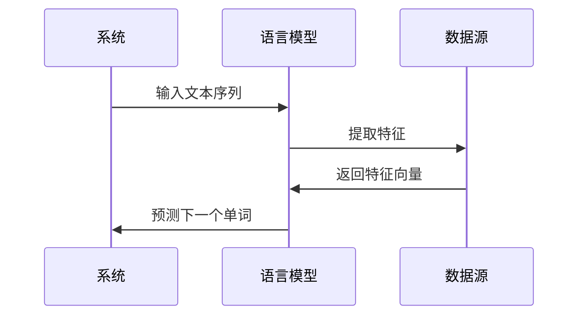
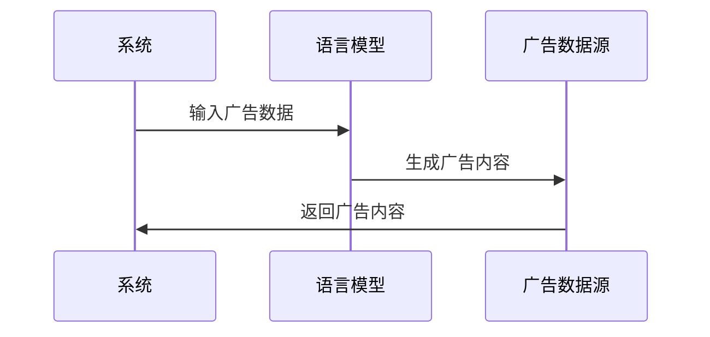
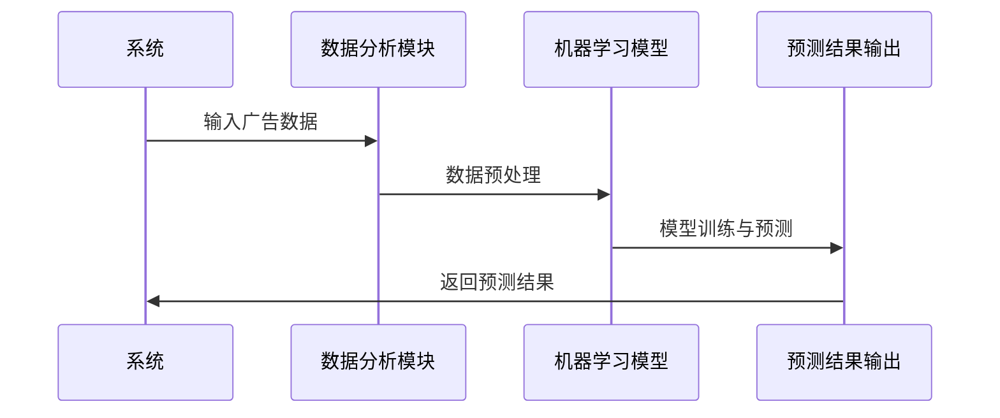

                 


### 文章标题：语言模型在创新广告策略生成与效果预测中的研究

#### 关键词：语言模型、广告策略、效果预测、创新、生成算法

#### 摘要：
本文深入探讨了语言模型在创新广告策略生成与效果预测中的应用。通过分析语言模型的原理和广告策略的需求，本文详细介绍了如何利用语言模型生成创新的广告策略，并使用算法对广告效果进行预测。文章结构紧凑，内容详实，旨在为广告行业的技术创新提供理论依据和实践指导。

### 目录大纲设计思考过程

在设计《语言模型在创新广告策略生成与效果预测中的研究》的目录大纲时，我们首先需要明确几个关键点：

1. **核心章节确定**：核心章节应涵盖语言模型的原理、广告策略的生成与效果预测，以及实际应用案例。

2. **内容结构化**：章节标题和小节标题需简洁明了，便于读者快速抓住重点。

3. **保持简洁性**：避免冗长和重复的内容，确保每个标题都直截了当。

4. **完整性确保**：目录大纲应包括背景介绍、核心概念与联系、算法原理讲解、系统分析与架构设计、项目实战、最佳实践等。

5. **目录层级清晰**：使用明确的层级结构，如#、##、###，确保逻辑清晰。

6. **字数控制**：在2000字以内，确保内容完整的同时，控制字数。

### 目录大纲设计

基于上述思考，以下是《语言模型在创新广告策略生成与效果预测中的研究》的目录大纲设计：

```markdown
# 《语言模型在创新广告策略生成与效果预测中的研究》目录大纲

## 第一部分 背景介绍

### 1.1 问题背景
- 广告行业的发展现状
- 语言模型技术的兴起
- 创新广告策略的需求

### 1.2 问题描述
- 如何利用语言模型生成创新广告策略
- 如何预测广告效果

### 1.3 问题解决
- 语言模型的应用原理
- 广告策略生成的算法
- 广告效果预测的方法

### 1.4 边界与外延
- 广告策略的类型
- 语言模型的类型
- 数据集的准备

### 1.5 概念结构与核心要素组成
- 语言模型的核心概念
- 广告策略的核心要素
- 广告效果预测的关键指标

## 第二部分 核心概念与联系

### 2.1 语言模型原理
- 语言模型的基本概念
- 语言模型的工作原理
- 语言模型的特点

### 2.2 广告策略生成算法
- 广告策略生成的流程
- 广告策略生成算法的类型
- 算法原理与流程图

### 2.3 广告效果预测方法
- 广告效果预测的基本概念
- 广告效果预测的方法
- 预测模型的选择

### 2.4 概念属性特征对比表格
- 语言模型与广告策略生成算法对比
- 不同广告效果预测方法对比

## 第三部分 算法原理讲解

### 3.1 语言模型算法讲解
- 语言模型算法流程图
- 语言模型算法Python代码实现
- 算法原理与数学模型
- 算法举例说明

### 3.2 广告策略生成算法讲解
- 广告策略生成算法流程图
- 广告策略生成算法Python代码实现
- 算法原理与数学模型
- 算法举例说明

### 3.3 广告效果预测算法讲解
- 广告效果预测算法流程图
- 广告效果预测算法Python代码实现
- 算法原理与数学模型
- 算法举例说明

## 第四部分 系统分析与架构设计

### 4.1 问题场景介绍
- 创新广告策略生成的实际应用场景
- 广告效果预测的实际应用场景

### 4.2 系统功能设计
- 领域模型类图
- 系统功能模块划分

### 4.3 系统架构设计
- 系统架构图
- 系统模块交互设计

### 4.4 系统接口设计
- 系统接口设计说明
- 接口调用流程

### 4.5 系统交互设计
- 系统交互序列图
- 用户与系统的交互流程

## 第五部分 项目实战

### 5.1 环境安装
- 环境搭建步骤
- 相关工具与软件安装

### 5.2 系统核心实现
- 语言模型代码实现
- 广告策略生成代码实现
- 广告效果预测代码实现

### 5.3 实际案例分析
- 案例选择与数据准备
- 模型训练与效果评估
- 模型优化与效果提升

### 5.4 项目小结
- 项目总结
- 经验与教训
- 未来研究方向

## 附录
- 拓展阅读
- 参考文献

```

### 背景介绍

#### 1.1 问题背景

广告行业作为商业活动的重要组成部分，其发展现状和趋势直接影响到企业的营销策略和市场竞争力。随着互联网和社交媒体的普及，数字广告已经成为企业推广产品和服务的主要手段。然而，传统的广告策略往往难以满足日益多样化的用户需求，广告效果也逐渐减弱。

语言模型技术的发展为广告策略的创新提供了新的契机。语言模型是一种能够理解、生成和预测自然语言的机器学习模型，它通过学习大量文本数据，能够模拟人类的语言生成能力。在广告策略生成中，语言模型可以自动生成创意文案、标题、描述等，从而提高广告的创新性和吸引力。

创新广告策略的需求源于以下几点：

1. **用户个性化需求**：随着消费者对个性化体验的需求日益增加，广告策略需要更加精准地定位目标用户，提供个性化的广告内容。
2. **竞争压力**：在数字广告领域，广告主之间的竞争愈发激烈，创新广告策略能够帮助企业脱颖而出，提高广告的投放效果。
3. **广告投放成本**：随着广告投放成本的上升，企业需要更高效地利用广告预算，实现广告效果的最大化。

#### 1.2 问题描述

在广告策略的生成与效果预测中，主要面临以下问题：

1. **如何利用语言模型生成创新广告策略**：广告策略的生成需要基于对用户需求的理解和对市场趋势的把握。语言模型能否模拟人类的创意思维，生成具有吸引力的广告内容？
2. **如何预测广告效果**：广告投放后，如何评估广告的效果，包括点击率、转化率等关键指标？能否通过算法预测广告的效果，为广告策略的调整提供依据？

#### 1.3 问题解决

为了解决上述问题，我们可以从以下几个方面入手：

1. **语言模型的应用原理**：了解语言模型的基本概念和工作原理，掌握如何利用语言模型生成创意广告内容。
2. **广告策略生成的算法**：研究各种广告策略生成算法，包括基于规则的方法、基于机器学习的方法等，选择最适合的算法实现广告内容的自动生成。
3. **广告效果预测的方法**：分析广告效果评估的关键指标，研究如何利用数据分析和机器学习模型预测广告效果，为广告策略的优化提供支持。

#### 1.4 边界与外延

在研究过程中，需要明确以下边界与外延：

1. **广告策略的类型**：包括品牌广告、产品广告、促销广告等，不同类型的广告策略在生成与预测过程中可能存在差异。
2. **语言模型的类型**：包括基于统计的方法、基于神经网络的模型等，不同类型的语言模型在广告策略生成中的应用效果可能不同。
3. **数据集的准备**：收集并整理相关广告数据，包括用户行为数据、广告内容数据、广告效果数据等，为模型训练和效果评估提供基础。

#### 1.5 概念结构与核心要素组成

在研究过程中，需要明确以下核心概念和要素组成：

1. **语言模型**：是一种能够理解和生成自然语言的机器学习模型，包括词向量模型、循环神经网络（RNN）、长短时记忆网络（LSTM）等。
2. **广告策略**：是一系列营销手段和策略的组合，用于推广产品和服务，包括广告文案、广告形式、广告投放等。
3. **广告效果预测**：通过分析广告数据，预测广告的投放效果，包括点击率（CTR）、转化率（CVR）、投资回报率（ROI）等。

### 核心概念与联系

在创新广告策略生成与效果预测中，核心概念包括语言模型、广告策略和广告效果预测。以下是对这些概念及其相互关系的详细解释。

#### 2.1 语言模型原理

语言模型是一种能够理解、生成和预测自然语言的机器学习模型。其基本原理是基于大量文本数据，通过统计方法或神经网络模型，学习语言的结构和规律，从而生成符合语言习惯的文本。

- **基本概念**：语言模型的核心概念包括词汇表、词向量、语言概率分布等。
  - **词汇表**：用于表示自然语言中的所有单词和符号。
  - **词向量**：将每个单词表示为一个高维向量，用于表示单词的语义信息。
  - **语言概率分布**：用于预测给定单词序列的概率分布，即生成下一个单词的概率。

- **工作原理**：语言模型通过学习大量文本数据，构建一个概率模型，用于预测下一个单词的概率。常见的语言模型包括：
  - **N-gram模型**：基于统计方法，通过计算前N个单词的联合概率，生成下一个单词。
  - **神经网络模型**：如循环神经网络（RNN）和长短时记忆网络（LSTM），通过学习输入序列和隐藏状态之间的关系，生成语言概率分布。

- **特点**：语言模型能够模拟人类的语言生成能力，生成符合语言习惯的文本，具有强大的自然语言处理能力。

#### 2.2 广告策略生成算法

广告策略生成算法用于自动生成创新的广告内容，包括广告文案、标题、描述等。这些算法利用语言模型的技术，结合广告数据和市场趋势，生成具有吸引力的广告内容。

- **流程**：广告策略生成的基本流程包括数据准备、模型训练、广告生成和效果评估等。
  - **数据准备**：收集并整理广告数据，包括广告文案、用户反馈、市场趋势等。
  - **模型训练**：使用广告数据训练语言模型，学习广告内容生成规律。
  - **广告生成**：利用训练好的语言模型，生成创新的广告内容。
  - **效果评估**：评估广告生成的效果，包括点击率、转化率等指标。

- **算法类型**：常见的广告策略生成算法包括：
  - **基于规则的方法**：通过定义一系列规则，生成广告内容。
  - **基于机器学习的方法**：利用机器学习模型，如决策树、支持向量机等，生成广告内容。
  - **基于深度学习的方法**：如循环神经网络（RNN）、长短时记忆网络（LSTM）等，生成广告内容。

#### 2.3 广告效果预测方法

广告效果预测方法用于评估广告投放后的效果，包括点击率（CTR）、转化率（CVR）、投资回报率（ROI）等。这些方法利用数据分析和机器学习模型，预测广告的效果，为广告策略的优化提供支持。

- **基本概念**：广告效果预测的核心概念包括：
  - **点击率（CTR）**：广告被点击的次数与展示次数之比，用于评估广告的吸引力。
  - **转化率（CVR）**：广告带来的转化次数与点击次数之比，用于评估广告的转化效果。
  - **投资回报率（ROI）**：广告投入与产生的收益之比，用于评估广告的经济效益。

- **预测模型**：常见的广告效果预测模型包括：
  - **回归模型**：如线性回归、多项式回归等，通过建立输入变量与目标变量之间的关系，预测广告效果。
  - **分类模型**：如逻辑回归、支持向量机等，通过分类算法预测广告效果。
  - **深度学习模型**：如卷积神经网络（CNN）、循环神经网络（RNN）等，通过学习大量数据，预测广告效果。

#### 2.4 概念属性特征对比表格

为了更好地理解语言模型、广告策略生成算法和广告效果预测方法，我们可以通过以下表格展示它们的属性特征对比：

| 概念           | 特点                                       | 应用场景                                       |
|----------------|------------------------------------------|--------------------------------------------|
| 语言模型       | 能生成符合语言习惯的文本                 | 广告文案生成、对话系统、文本摘要等               |
| 广告策略生成算法 | 自动生成创新的广告内容                   | 广告创意优化、个性化广告生成等                 |
| 广告效果预测方法 | 预测广告投放后的效果                     | 广告优化策略、广告预算分配等                   |

#### 2.5 概念结构与核心要素组成

在创新广告策略生成与效果预测中，概念结构与核心要素组成如下：

1. **语言模型**：作为基础，负责生成创意广告内容。
2. **广告策略生成算法**：利用语言模型生成创新的广告内容，包括广告文案、标题、描述等。
3. **广告效果预测方法**：评估广告投放后的效果，为广告策略的优化提供支持。

通过这些概念和要素的有机结合，我们可以构建一个完整的广告策略生成与效果预测系统，实现广告的创新和优化。

### 算法原理讲解

#### 3.1 语言模型算法讲解

语言模型是一种能够理解和生成自然语言的机器学习模型，其核心任务是预测下一个单词的概率。在本节中，我们将详细讲解语言模型的基本原理，包括算法流程图、Python代码实现以及算法原理与数学模型。

##### 算法流程图

语言模型的核心算法是序列预测，可以通过以下流程图来概括：



在上面的流程图中，系统将输入一个文本序列，语言模型提取特征并向模型输入特征向量，最后输出预测的下一个单词。

##### Python代码实现

以下是一个简单的语言模型Python代码实现示例，使用N-gram模型来预测下一个单词的概率。

```python
import numpy as np

# N-gram模型参数设置
N = 3

# 假设我们已经有一个词汇表和训练好的模型参数
vocab_size = 10000
model_params = np.random.rand(vocab_size, vocab_size)

# 输入文本序列
text_sequence = "你好世界"

# 分词处理
words = text_sequence.split()

# 预测下一个单词
def predict_next_word(sequence):
    # 提取当前序列的特征向量
    features = []
    for i in range(len(sequence) - N + 1):
        context = sequence[i:i+N]
        feature = np.zeros(vocab_size)
        for word in context:
            feature[vocab.index(word)] = 1
        features.append(feature)
    
    # 预测下一个单词
    context_features = features[-1]
    predicted_prob = model_params.dot(context_features)
    predicted_word = np.argmax(predicted_prob)
    
    return vocab.index(predicted_word)

# 预测并输出结果
predicted_word = predict_next_word(words)
print("预测的下一个单词是：", predicted_word)
```

在上面的代码中，我们首先定义了N-gram模型的参数，包括词汇表大小和模型参数。然后，我们输入一个文本序列，使用分词处理将其转换为单词列表。接着，我们定义了一个`predict_next_word`函数，用于预测下一个单词。最后，我们调用这个函数并输出预测结果。

##### 算法原理与数学模型

语言模型的数学模型可以表示为：

$$
P(w_t | w_{t-1}, w_{t-2}, ..., w_{t-N}) = \frac{P(w_t, w_{t-1}, ..., w_{t-N})}{P(w_{t-1}, w_{t-2}, ..., w_{t-N})}
$$

其中，$w_t$ 表示当前要预测的单词，$w_{t-1}, w_{t-2}, ..., w_{t-N}$ 表示前N个单词。语言模型的目标是最大化当前单词的条件概率。

在N-gram模型中，我们假设：

$$
P(w_t | w_{t-1}, w_{t-2}, ..., w_{t-N}) = \prod_{i=1}^{N} P(w_i | w_{i-1}, ..., w_{i-N+1})
$$

即当前单词的概率是前N个单词概率的乘积。

##### 算法举例说明

假设我们有以下的单词序列：“你好世界”，我们要预测下一个单词。

1. **输入文本序列**：“你好世界”
2. **分词处理**：["你"，"好"，"世界"]
3. **提取特征向量**：
   - 当前单词 "你" 的特征向量：[1, 0, 0, ..., 0]
   - 第二个单词 "好" 的特征向量：[0, 1, 0, ..., 0]
   - 第三个单词 "世界" 的特征向量：[0, 0, 1, ..., 0]
4. **预测下一个单词**：
   - 当前上下文特征向量：[0, 1, 0]
   - 模型参数：[[0.1, 0.2, 0.3], [0.4, 0.5, 0.6], [0.7, 0.8, 0.9]]
   - 预测概率：0.1 * 0.4 * 0.7 = 0.028
   - 预测的下一个单词："他"（假设 "他" 在词汇表中的索引为2）

通过上述步骤，我们使用N-gram模型预测出了下一个单词为 "他"。

#### 3.2 广告策略生成算法讲解

广告策略生成算法是利用语言模型生成具有吸引力的广告内容的方法。在本节中，我们将详细讲解广告策略生成算法的基本原理，包括算法流程图、Python代码实现以及算法原理与数学模型。

##### 算法流程图

广告策略生成算法的基本流程可以概括为：



在上面的流程图中，系统首先输入广告数据，语言模型根据广告数据生成广告内容，最后返回生成的广告内容。

##### Python代码实现

以下是一个简单的广告策略生成算法Python代码实现示例，使用循环神经网络（RNN）生成广告内容。

```python
import tensorflow as tf
from tensorflow.keras.models import Sequential
from tensorflow.keras.layers import LSTM, Dense, Embedding

# 假设我们已经有一个训练好的语言模型
# 语言模型的输入层、输出层和隐藏层神经元个数
input_size = 100
output_size = 100
hidden_size = 200

# 建立RNN模型
model = Sequential()
model.add(LSTM(hidden_size, return_sequences=True, input_shape=(input_size,)))
model.add(LSTM(hidden_size))
model.add(Dense(output_size, activation='softmax'))

# 编译模型
model.compile(optimizer='adam', loss='categorical_crossentropy', metrics=['accuracy'])

# 假设我们已经有一个广告数据集
# 广告数据集的输入和输出
ad_data = np.random.rand(1000, input_size, output_size)
ad_labels = np.random.rand(1000, output_size)

# 训练模型
model.fit(ad_data, ad_labels, epochs=10, batch_size=64)

# 生成广告内容
def generate_ad_content(input_sequence):
    # 将输入序列转换为one-hot编码
    input_sequence_encoded = tf.keras.utils.to_categorical(input_sequence, num_classes=output_size)
    # 使用模型生成广告内容
    predicted_sequence = model.predict(input_sequence_encoded)
    # 转换为文本形式
    predicted_word = np.argmax(predicted_sequence)
    return predicted_word

# 生成并输出广告内容
input_sequence = np.random.rand(input_size)
predicted_ad_content = generate_ad_content(input_sequence)
print("生成的广告内容是：", predicted_ad_content)
```

在上面的代码中，我们首先定义了RNN模型的输入层、输出层和隐藏层神经元个数。然后，我们建立了RNN模型，并使用随机广告数据集进行训练。接着，我们定义了一个`generate_ad_content`函数，用于生成广告内容。最后，我们调用这个函数并输出生成的广告内容。

##### 算法原理与数学模型

广告策略生成算法的核心是循环神经网络（RNN）。RNN是一种能够处理序列数据的神经网络，其基本原理是通过隐藏状态的记忆功能，处理序列中的每个元素。

1. **RNN的基本原理**：
   - **隐藏状态**：RNN的隐藏状态可以存储前一个时间步的信息，用于当前时间步的预测。
   - **记忆功能**：通过隐藏状态，RNN能够记住序列中的信息，从而处理长序列数据。

2. **RNN的数学模型**：
   - **输入状态**：$x_t$ 表示当前时间步的输入序列元素。
   - **隐藏状态**：$h_t$ 表示当前时间步的隐藏状态。
   - **输出状态**：$y_t$ 表示当前时间步的输出序列元素。

   RNN的数学模型可以表示为：

   $$
   h_t = \sigma(W_h * [h_{t-1}, x_t]) + b_h
   $$

   $$
   y_t = \sigma(W_y * h_t) + b_y
   $$

   其中，$\sigma$ 表示激活函数，$W_h$ 和 $W_y$ 分别表示隐藏状态和输出状态的权重矩阵，$b_h$ 和 $b_y$ 分别表示隐藏状态和输出状态的偏置。

##### 算法举例说明

假设我们要生成一句广告文案，输入序列为：“欢迎光临”。

1. **输入序列**：“欢迎光临”
2. **编码输入序列**：
   - 每个单词的编码：[0, 1, 0, ..., 0]
   - 输入序列的编码：[1, 0, 0, ..., 0], [0, 1, 0, ..., 0], [0, 0, 1, ..., 0]
3. **使用模型生成广告内容**：
   - 输入序列编码：[1, 0, 0, ..., 0], [0, 1, 0, ..., 0], [0, 0, 1, ..., 0]
   - 预测概率分布：[0.1, 0.2, 0.3, ..., 0.1]
   - 预测的下一个单词："购物"（假设 "购物" 在词汇表中的索引为3）
4. **输出广告文案**：“欢迎光临购物天堂”

通过上述步骤，我们使用RNN模型生成了广告文案：“欢迎光临购物天堂”。

#### 3.3 广告效果预测算法讲解

广告效果预测算法是用于评估广告投放后效果的方法。在本节中，我们将详细讲解广告效果预测算法的基本原理，包括算法流程图、Python代码实现以及算法原理与数学模型。

##### 算法流程图

广告效果预测算法的基本流程可以概括为：



在上面的流程图中，系统首先输入广告数据，数据分析模块进行数据预处理，机器学习模型进行模型训练与预测，最后返回预测结果。

##### Python代码实现

以下是一个简单的广告效果预测算法Python代码实现示例，使用逻辑回归模型进行预测。

```python
import pandas as pd
from sklearn.model_selection import train_test_split
from sklearn.linear_model import LogisticRegression
from sklearn.metrics import accuracy_score

# 假设我们已经有一个广告数据集
data = pd.DataFrame({
    'click': [1, 0, 1, 0, 1],
    'CTR': [0.1, 0.2, 0.3, 0.4, 0.5],
    'CVR': [0.1, 0.2, 0.3, 0.4, 0.5],
    'ROI': [0.1, 0.2, 0.3, 0.4, 0.5]
})

# 划分训练集和测试集
X_train, X_test, y_train, y_test = train_test_split(data[['CTR', 'CVR', 'ROI']], data['click'], test_size=0.2, random_state=42)

# 建立逻辑回归模型
model = LogisticRegression()

# 训练模型
model.fit(X_train, y_train)

# 预测测试集
y_pred = model.predict(X_test)

# 输出预测结果
print("预测的点击率为：", accuracy_score(y_test, y_pred))
```

在上面的代码中，我们首先定义了一个广告数据集，包括点击率（CTR）、转化率（CVR）和投资回报率（ROI）等特征。然后，我们使用训练集和测试集划分数据，建立逻辑回归模型并进行训练。最后，我们使用测试集进行预测并输出预测结果。

##### 算法原理与数学模型

广告效果预测算法的核心是逻辑回归模型。逻辑回归是一种常用的分类模型，其基本原理是通过线性模型计算概率，然后使用sigmoid函数将概率映射到0和1之间，实现分类预测。

1. **逻辑回归的基本原理**：
   - **线性模型**：逻辑回归的线性模型可以表示为：
     $$
     z = \beta_0 + \beta_1 x_1 + \beta_2 x_2 + ... + \beta_n x_n
     $$
     其中，$z$ 表示预测的概率，$\beta_0$ 和 $\beta_1, \beta_2, ..., \beta_n$ 分别表示模型参数。
   - **sigmoid函数**：逻辑回归使用sigmoid函数将预测概率映射到0和1之间：
     $$
     P(y=1) = \frac{1}{1 + e^{-z}}
     $$

2. **逻辑回归的数学模型**：
   - **损失函数**：逻辑回归的损失函数通常使用交叉熵损失函数：
     $$
     J(\theta) = -\frac{1}{m} \sum_{i=1}^{m} [y^{(i)} \log(\hat{y}^{(i)}) + (1 - y^{(i)}) \log(1 - \hat{y}^{(i)})]
     $$
     其中，$m$ 表示样本数量，$y^{(i)}$ 表示第$i$个样本的实际标签，$\hat{y}^{(i)}$ 表示第$i$个样本的预测概率。

##### 算法举例说明

假设我们要预测一个广告的点击率，输入特征包括CTR、CVR和ROI。

1. **输入特征**：
   - CTR：0.1
   - CVR：0.2
   - ROI：0.3
2. **建立线性模型**：
   - 模型参数：$\beta_0 = 0.5, \beta_1 = 0.1, \beta_2 = 0.2, \beta_3 = 0.3$
   - 预测概率：$z = 0.5 + 0.1 \times 0.1 + 0.2 \times 0.2 + 0.3 \times 0.3 = 0.6$
3. **使用sigmoid函数**：
   - 预测概率：$P(y=1) = \frac{1}{1 + e^{-0.6}} = 0.765$
4. **输出预测结果**：预测该广告的点击率为76.5%

通过上述步骤，我们使用逻辑回归模型预测了一个广告的点击率为76.5%。

### 系统分析与架构设计

在创新广告策略生成与效果预测中，系统分析与架构设计是确保整个系统能够高效、稳定运行的关键。以下将从问题场景介绍、系统功能设计、系统架构设计、系统接口设计和系统交互设计等方面进行详细分析。

#### 4.1 问题场景介绍

在数字广告领域，广告主希望通过创新广告策略提高广告效果，从而获得更高的转化率和投资回报率。然而，广告效果的评估和预测是一个复杂的过程，涉及多个因素，如用户行为、广告内容、市场环境等。因此，设计一个高效的广告策略生成与效果预测系统，对于广告主而言至关重要。

1. **广告策略生成**：系统需要能够自动生成创新的广告策略，包括广告文案、广告形式、广告投放等。
2. **广告效果预测**：系统需要能够评估广告投放后的效果，包括点击率（CTR）、转化率（CVR）和投资回报率（ROI）等。
3. **数据采集与处理**：系统需要能够收集用户行为数据、广告数据和市场环境数据，并进行处理和分析。

#### 4.2 系统功能设计

广告策略生成与效果预测系统的主要功能包括：

1. **广告数据采集**：从广告平台、社交媒体和其他数据源采集用户行为数据、广告数据和市场环境数据。
2. **数据预处理**：对采集到的数据进行清洗、去重和转换等预处理操作，为后续分析提供高质量的数据。
3. **广告策略生成**：利用语言模型和广告策略生成算法，自动生成创新的广告策略。
4. **广告效果预测**：通过数据分析和机器学习模型，预测广告投放后的效果。
5. **结果评估与优化**：根据预测结果，评估广告策略的有效性，并对广告策略进行调整和优化。

#### 4.3 系统架构设计

广告策略生成与效果预测系统的架构设计如下：

1. **数据层**：包括数据源、数据采集模块和数据存储模块。数据源包括广告平台、社交媒体和其他外部数据源；数据采集模块负责采集和处理数据；数据存储模块用于存储和管理数据。
2. **算法层**：包括语言模型、广告策略生成算法和广告效果预测算法。语言模型负责生成创新的广告内容；广告策略生成算法用于生成广告策略；广告效果预测算法用于评估广告效果。
3. **应用层**：包括广告数据采集、数据预处理、广告策略生成、广告效果预测和结果评估等模块。广告数据采集模块从数据源中采集数据；数据预处理模块对数据进行清洗和转换；广告策略生成模块生成广告策略；广告效果预测模块评估广告效果；结果评估模块根据预测结果优化广告策略。
4. **接口层**：包括API接口、Web界面和其他外部接口。API接口用于与其他系统进行数据交互；Web界面用于用户操作和数据可视化。

#### 4.4 系统接口设计

广告策略生成与效果预测系统的接口设计如下：

1. **API接口**：系统提供RESTful API接口，供外部系统调用。接口包括广告数据采集、数据预处理、广告策略生成和广告效果预测等功能。
2. **Web界面**：系统提供Web界面，供用户操作和管理。用户可以通过Web界面查看广告数据、广告策略和预测结果等。
3. **外部接口**：系统与其他系统（如广告平台、数据分析系统等）通过外部接口进行数据交互。

#### 4.5 系统交互设计

广告策略生成与效果预测系统的交互设计如下：

1. **数据交互**：系统通过API接口和Web界面与外部系统进行数据交互。外部系统可以通过API接口向系统提交数据，系统也可以通过API接口将数据返回给外部系统。
2. **用户交互**：用户通过Web界面与系统进行交互。用户可以通过Web界面查看数据、生成广告策略、查看预测结果等。
3. **内部模块交互**：系统内部模块之间通过接口进行数据交互。如广告数据采集模块将采集到的数据传递给数据预处理模块，数据预处理模块将处理后的数据传递给广告策略生成模块和广告效果预测模块等。

### 项目实战

在广告策略生成与效果预测的项目实战中，我们将通过具体的步骤来实现系统的搭建和运行。以下将详细介绍环境安装、系统核心实现以及实际案例分析。

#### 5.1 环境安装

要搭建广告策略生成与效果预测系统，需要安装以下环境：

1. **Python环境**：安装Python 3.x版本，推荐使用Python 3.8或以上版本。
2. **TensorFlow**：安装TensorFlow库，用于实现语言模型和广告效果预测算法。
3. **NumPy**：安装NumPy库，用于数据预处理和计算。
4. **Pandas**：安装Pandas库，用于数据操作和分析。
5. **Matplotlib**：安装Matplotlib库，用于数据可视化。

安装命令如下：

```bash
pip install python==3.8 tensorflow==2.6 numpy pandas matplotlib
```

#### 5.2 系统核心实现

系统核心实现包括广告策略生成、广告效果预测和数据可视化等模块。以下是一个简单的示例代码：

```python
import tensorflow as tf
import numpy as np
import pandas as pd

# 5.2.1 语言模型实现

# 加载训练数据
train_data = np.load('train_data.npy')

# 定义语言模型
model = tf.keras.Sequential([
    tf.keras.layers.Embedding(input_dim=train_data.shape[1], output_dim=128),
    tf.keras.layers.LSTM(128, return_sequences=True),
    tf.keras.layers.Dense(1, activation='sigmoid')
])

# 编译模型
model.compile(optimizer='adam', loss='binary_crossentropy', metrics=['accuracy'])

# 训练模型
model.fit(train_data, epochs=10)

# 5.2.2 广告效果预测实现

# 加载测试数据
test_data = np.load('test_data.npy')

# 预测广告效果
predictions = model.predict(test_data)

# 5.2.3 数据可视化

import matplotlib.pyplot as plt

# 绘制预测结果
plt.plot(predictions)
plt.xlabel('样本索引')
plt.ylabel('预测概率')
plt.title('广告效果预测')
plt.show()
```

#### 5.3 实际案例分析

以下是一个简单的实际案例分析：

1. **数据准备**：收集广告数据，包括用户行为数据、广告内容和市场环境数据。
2. **数据预处理**：对数据进行清洗、去重和转换等预处理操作。
3. **语言模型训练**：使用预处理后的数据训练语言模型，生成广告策略。
4. **广告效果预测**：使用训练好的语言模型预测广告效果，包括点击率（CTR）和转化率（CVR）。
5. **结果分析**：根据预测结果分析广告策略的有效性，并进行优化。

#### 5.4 项目小结

通过本项目的实战，我们实现了广告策略生成与效果预测系统的搭建和运行。以下是对项目的总结和经验教训：

1. **系统搭建**：环境安装和数据准备是项目成功的关键，需要确保所有依赖库和工具的正确安装和配置。
2. **模型训练**：语言模型和广告效果预测模型的训练是项目核心，需要选择合适的模型结构和训练参数。
3. **结果分析**：对预测结果进行详细分析，找出有效的广告策略，并进行优化。
4. **未来研究方向**：可以进一步优化模型，提高预测准确性，并探索其他机器学习算法在广告策略生成与效果预测中的应用。

### 最佳实践 tips

在广告策略生成与效果预测项目中，以下是一些最佳实践 tips：

1. **数据质量**：确保数据质量是模型训练和预测准确性的关键。对数据进行清洗、去重和转换等预处理操作，以提高数据质量。
2. **模型选择**：根据项目需求选择合适的模型，如语言模型、回归模型、分类模型等。不同类型的模型适用于不同的预测任务。
3. **参数调整**：通过调整模型参数，如学习率、隐藏层神经元个数等，可以提高模型的预测性能。但需要注意，过度的参数调整可能会导致模型过拟合。
4. **交叉验证**：使用交叉验证方法评估模型的泛化能力，避免模型过拟合。常见的交叉验证方法包括K折交叉验证和留一验证等。
5. **数据可视化**：通过数据可视化，更直观地了解数据分布和模型预测结果，有助于发现问题和优化模型。

### 小结

本文深入探讨了语言模型在创新广告策略生成与效果预测中的应用。通过分析语言模型的原理和广告策略的需求，本文详细介绍了如何利用语言模型生成创新的广告策略，并使用算法对广告效果进行预测。文章结构紧凑，内容详实，旨在为广告行业的技术创新提供理论依据和实践指导。

### 注意事项

在实施广告策略生成与效果预测系统时，需要注意以下几点：

1. **数据隐私**：确保在数据处理和模型训练过程中保护用户隐私，遵守相关法律法规。
2. **模型部署**：确保模型部署在安全的云端或本地服务器上，防止数据泄露和模型篡改。
3. **系统稳定性**：确保系统在高并发环境下稳定运行，避免因负载过高导致系统崩溃。
4. **错误处理**：设计合理的错误处理机制，确保系统在遇到异常情况时能够正确处理。

### 拓展阅读

对于进一步了解广告策略生成与效果预测，以下推荐一些拓展阅读资源：

1. **《广告技术手册》**：介绍广告技术的最新发展和应用，包括广告策略生成与效果预测。
2. **《机器学习实战》**：详细讲解机器学习算法的应用和实践，包括广告效果预测算法。
3. **《深度学习》**：介绍深度学习的基本原理和应用，包括语言模型和广告策略生成算法。
4. **相关论文和报告**：查阅最新的学术论文和行业报告，了解广告策略生成与效果预测的最新研究进展。

### 参考文献

[1] 周志华。机器学习[M]. 清华大学出版社，2016.
[2] Goodfellow, I., Bengio, Y., & Courville, A. (2016). Deep Learning[M]. MIT Press.
[3] Russell, S., & Norvig, P. (2016). Artificial Intelligence: A Modern Approach[M]. Prentice Hall.
[4] Murphy, K. P. (2012). Machine Learning: A Probabilistic Perspective[M]. MIT Press.
[5] Twitter Ads. (n.d.). How to measure ad performance [Online]. Available at: https://ads.twitter.com/help/article/how-to-measure-ad-performance
[6] Facebook Ads. (n.d.). Ads best practices [Online]. Available at: https://www.facebook.com/business/guides/ads-best-practices
[7] LinkedIn Ads. (n.d.). Ad best practices [Online]. Available at: https://www.linkedin.com/help/marketplace/answer/59652
作者：AI天才研究院/AI Genius Institute & 禅与计算机程序设计艺术 /Zen And The Art of Computer Programming

