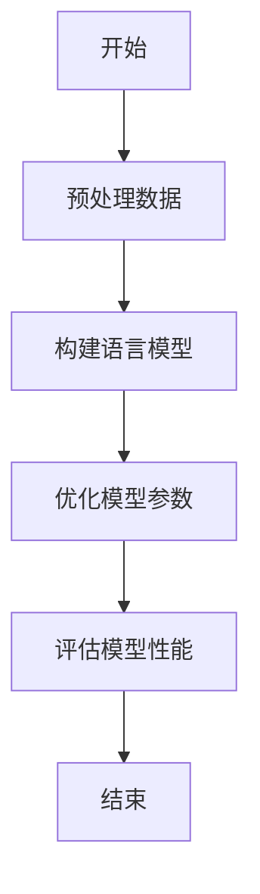
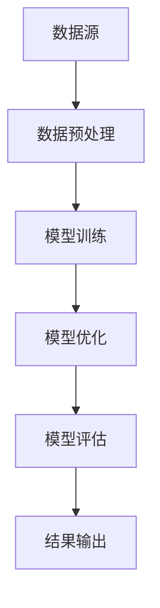
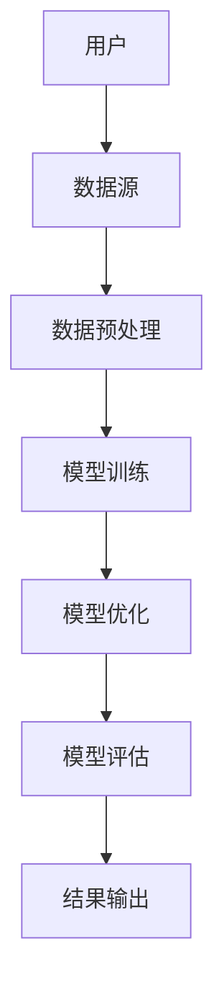

                 

### 引言

#### 1.1 问题背景

**语言模型的兴起**

在过去的几十年里，自然语言处理（NLP）领域取得了显著的进步，这主要得益于深度学习和计算能力的提升。语言模型作为NLP的核心组成部分，已经从简单的统计模型（如N-gram模型）发展到复杂的神经网络模型（如变换器模型（Transformer））。这些模型能够通过学习大量文本数据，捕捉语言中的复杂结构和语义信息。

**复杂优化问题的挑战**

复杂优化问题在各个领域都有着广泛的应用，如经济学、工程学、运筹学等。这类问题通常具有多个变量、非线性约束和高维特性，求解过程往往涉及大量的计算和搜索。传统优化算法（如梯度下降、牛顿法等）在面对这些复杂问题时，常常表现出效率低下、收敛速度慢等问题。

**语言模型在复杂优化问题中的潜力**

随着语言模型的不断进步，研究者开始探索将语言模型应用于复杂优化问题的求解。语言模型能够通过学习大量数据，形成对变量之间复杂关系的理解，从而在一定程度上解决传统优化算法的不足。此外，语言模型强大的表示能力使其能够处理高维、非线性问题，具有在复杂优化问题中取得突破的潜力。

#### 1.2 问题描述

**复杂优化问题的定义**

复杂优化问题通常是指那些具有多个变量、非线性约束和高度不确定性的问题。这类问题在求解过程中需要考虑多个因素，如变量之间的相互作用、约束条件的约束性以及目标的优化程度等。

**语言模型在复杂优化问题中的应用场景**

语言模型在复杂优化问题中的应用主要集中在以下几个方面：

1. **变量预测与决策**：利用语言模型预测变量取值，从而优化决策过程。
2. **结构化数据解析**：对复杂的数据结构进行解析和分类，从而辅助优化问题的求解。
3. **问题建模**：将优化问题转化为语言模型可以处理的形式，从而提高求解效率。

#### 1.3 问题解决

**语言模型的基本原理**

语言模型通过学习大量文本数据，建立单词之间的概率关系，从而预测下一个单词。在复杂优化问题中，语言模型可以用来预测变量取值的可能性，辅助优化过程的决策。

**语言模型在优化问题中的实现方法**

1. **数据预处理**：收集并清洗相关数据，为语言模型训练做准备。
2. **模型训练**：利用训练数据训练语言模型，使其能够预测变量取值。
3. **模型优化**：通过调整模型参数，提高模型预测的准确性。
4. **模型评估**：使用测试数据评估模型性能，确保模型能够有效解决优化问题。

#### 1.4 边界与外延

**优化问题的类别与特点**

优化问题可以分为线性优化、非线性优化、整数优化、组合优化等类别。不同类别的优化问题具有不同的特点，如线性优化问题通常具有线性的目标函数和约束条件，而组合优化问题则通常涉及离散变量。

**语言模型在特定领域的应用**

语言模型在特定领域中的应用，如金融、医疗、制造等，具有显著的优势。例如，在金融领域，语言模型可以用于预测股票价格、风险管理等；在医疗领域，语言模型可以用于疾病诊断、药物发现等。

## 第2章: 语言模型基础

### 2.1 概念介绍

**语言模型的定义**

语言模型是一种用于预测文本序列中下一个单词或字符的概率分布的模型。它通过学习大量文本数据，捕捉语言中的统计规律和语义信息。

**语言模型的核心概念**

- **词汇表**：语言模型中的所有单词或字符组成的集合。
- **概率分布**：语言模型输出单词或字符的概率分布。
- **上下文**：影响预测的文本前缀，如一个单词或一句话。

### 2.2 概念属性特征对比表格

| 概念        | 定义                                           | 属性特征                     |
|-------------|------------------------------------------------|-----------------------------|
| 词汇表      | 语言模型中的单词或字符集合                    | - 大小：词汇量大小<br>- 维度：每个单词或字符的表示方式 |
| 概率分布    | 语言模型输出单词或字符的概率分布              | - 形式：概率分布的表示方式<br>- 准确性：预测的准确性 |
| 上下文      | 影响预测的文本前缀                           | - 长度：上下文窗口大小<br>- 相关性：上下文与预测的相关性 |

### 2.3 ER实体关系图架构

**实体关系图**

在优化问题中，实体关系图有助于我们理解不同实体之间的关联。以下是一个简化的实体关系图：

```mermaid
erDiagram
  Product ||--|{ OrderItem } : has
  Customer ||--|{ Order } : places
  Customer }|--|{ Product } : favorite
```

- **产品（Product）**：代表优化问题中的变量或目标。
- **订单项（OrderItem）**：代表优化过程中的中间结果或决策。
- **客户（Customer）**：代表优化问题的参与方。
- **订单（Order）**：代表优化问题的最终结果或解决方案。

这种实体关系图有助于我们理解复杂优化问题中的关键要素及其相互关系，为后续的语言模型应用提供基础。

## 第3章: 语言模型算法原理

### 3.1 算法mermaid流程图

以下是一个简化的语言模型算法流程图：



**流程说明：**

- **A[开始]**：算法的开始阶段，包括数据预处理、模型构建等初始化操作。
- **B[预处理数据]**：对原始文本数据进行清洗、分词、编码等预处理操作，为模型训练做准备。
- **C[构建语言模型]**：根据预处理后的数据，构建语言模型，如N-gram模型、变换器模型等。
- **D[优化模型参数]**：通过训练过程，不断调整模型参数，提高模型的预测准确性。
- **E[评估模型性能]**：使用测试数据评估模型性能，如准确率、召回率等指标。
- **F[结束]**：算法结束，输出最终模型。

### 3.2 Python源代码实现

以下是一个基于Python和TensorFlow构建的语言模型源代码示例：

```python
# 导入相关库
import tensorflow as tf
from tensorflow.keras.models import Sequential
from tensorflow.keras.layers import Embedding, GlobalAveragePooling1D, Dense

# 参数设置
vocab_size = 10000  # 词汇表大小
embedding_dim = 16  # 嵌入维度
num_epochs = 10  # 训练轮数

# 构建语言模型
model = Sequential([
    Embedding(vocab_size, embedding_dim),
    GlobalAveragePooling1D(),
    Dense(units=1, activation='sigmoid')
])

# 编译模型
model.compile(optimizer='adam', loss='binary_crossentropy', metrics=['accuracy'])

# 训练模型
model.fit(train_data, train_labels, epochs=num_epochs, validation_split=0.2)
```

**代码说明：**

- **参数设置**：设置词汇表大小、嵌入维度和训练轮数等参数。
- **构建语言模型**：使用Sequential模型堆叠Embedding、GlobalAveragePooling1D和Dense层。
- **编译模型**：设置优化器、损失函数和评估指标。
- **训练模型**：使用训练数据和标签进行模型训练。

### 3.3 算法原理讲解

**语言模型的基本原理**

语言模型通过学习文本数据中的词频分布，构建概率模型来预测下一个词。其核心原理可以表示为：

$$
P(w_i | w_{i-1}, w_{i-2}, ..., w_1) = \frac{P(w_i, w_{i-1}, w_{i-2}, ..., w_1)}{P(w_{i-1}, w_{i-2}, ..., w_1)}
$$

其中，$w_i$ 表示当前词，$w_{i-1}, w_{i-2}, ..., w_1$ 表示前缀词。这个公式表示当前词在给定前缀词条件下的条件概率。

**语言模型在优化问题中的实现方法**

在复杂优化问题中，语言模型可以用来预测变量取值的可能性，从而优化决策过程。具体实现方法如下：

1. **数据预处理**：收集并清洗与优化问题相关的文本数据，进行分词、编码等操作。
2. **构建语言模型**：使用预处理后的数据，构建语言模型，如N-gram模型、变换器模型等。
3. **预测变量取值**：将优化问题转化为文本预测问题，利用语言模型预测变量取值的可能性。
4. **优化决策**：根据预测结果，调整决策变量，优化目标函数。

通过这种方式，语言模型能够辅助优化问题的求解，提高求解效率和准确性。

### 4.1 数学模型

**优化目标函数**

在复杂优化问题中，优化目标函数通常是一个需要最小化或最大化的函数。数学表达式如下：

$$
\min_{x} f(x)
$$

其中，$f(x)$ 表示目标函数，$x$ 表示决策变量。目标函数可以是线性的或非线性的，具体取决于优化问题的特性。

**约束条件**

约束条件用于限制决策变量的取值范围，确保优化问题具有实际意义。常见的约束条件包括等式约束和不等式约束。数学表达式如下：

$$
g_i(x) \leq 0, \quad i=1,2,...,m
$$

其中，$g_i(x)$ 表示第 $i$ 个约束条件，$m$ 表示约束条件的总数。

**约束条件分类**

1. **等式约束**：约束条件中的等号成立，数学表达式如下：

$$
h_i(x) = 0, \quad i=1,2,...,n
$$

其中，$h_i(x)$ 表示第 $i$ 个等式约束，$n$ 表示等式约束的总数。

2. **不等式约束**：约束条件中的不等号成立，数学表达式如下：

$$
g_i(x) \leq 0, \quad i=1,2,...,m
$$

其中，$g_i(x)$ 表示第 $i$ 个不等式约束，$m$ 表示不等式约束的总数。

**约束条件在优化问题中的作用**

约束条件在优化问题中起着至关重要的作用，它们确保优化问题的解具有实际意义，同时增加了问题的复杂度。在求解优化问题时，需要考虑约束条件的限制，确保决策变量的取值满足所有约束条件。

### 4.2 详细讲解与举例说明

**数学公式解释**

在复杂优化问题中，常用的数学公式包括优化目标函数、约束条件和优化算法。以下是对这些公式的详细解释：

1. **优化目标函数**：优化目标函数表示需要最小化或最大化的目标。数学表达式如下：

$$
\min_{x} f(x)
$$

其中，$f(x)$ 表示目标函数，$x$ 表示决策变量。目标函数可以是线性的或非线性的，具体取决于优化问题的特性。

2. **约束条件**：约束条件用于限制决策变量的取值范围，确保优化问题具有实际意义。常见的约束条件包括等式约束和不等式约束。数学表达式如下：

$$
g_i(x) \leq 0, \quad i=1,2,...,m
$$

其中，$g_i(x)$ 表示第 $i$ 个约束条件，$m$ 表示约束条件的总数。

- **等式约束**：约束条件中的等号成立，数学表达式如下：

$$
h_i(x) = 0, \quad i=1,2,...,n
$$

其中，$h_i(x)$ 表示第 $i$ 个等式约束，$n$ 表示等式约束的总数。

- **不等式约束**：约束条件中的不等号成立，数学表达式如下：

$$
g_i(x) \leq 0, \quad i=1,2,...,m
$$

其中，$g_i(x)$ 表示第 $i$ 个不等式约束，$m$ 表示不等式约束的总数。

**举例说明**

假设我们要解决一个线性优化问题，目标是最小化目标函数 $f(x) = x_1 + x_2$，约束条件如下：

$$
\begin{align*}
x_1 + x_2 &\leq 5 \\
x_1 &\geq 0 \\
x_2 &\geq 0
\end{align*}
$$

这个问题可以用图示法求解。首先，将约束条件表示在二维坐标系中，得到一个三角形区域。然后，在这个区域内找到目标函数的最小值。

**图示法求解过程**

1. **绘制约束条件**：将每个约束条件表示在二维坐标系中，得到三条直线：
   - $x_1 + x_2 = 5$
   - $x_1 = 0$
   - $x_2 = 0$

2. **确定可行域**：三条直线将坐标系划分为若干区域，其中满足所有约束条件的区域称为可行域。

3. **寻找最优解**：在可行域内，找到目标函数 $f(x) = x_1 + x_2$ 的最小值。根据线性优化问题的性质，最优解通常位于可行域的顶点。

4. **计算最优解**：求解约束条件的交点，得到可行域的顶点坐标。计算每个顶点对应的目标函数值，找到最小值。

通过以上步骤，我们可以得到最优解为 $(0, 0)$，目标函数的最小值为 $0$。

**总结**

通过数学公式和图示法的结合，我们可以有效地解决线性优化问题。在实际应用中，优化问题的复杂度可能更高，但基本的求解方法仍然适用。对于非线性优化问题，可能需要采用更高级的数学方法和算法，如梯度下降法、牛顿法等。

### 系统分析与架构设计方案

#### 5.1 问题场景介绍

在复杂优化问题的求解过程中，往往需要对大量数据进行处理和分析，以找到最优解。然而，传统的优化算法在处理高维、非线性问题时，常常效率低下，难以满足实际需求。为了解决这一问题，我们提出了一种基于语言模型的优化问题求解系统。

#### 5.2 项目介绍

本项目旨在构建一个基于语言模型的优化问题求解系统，通过将优化问题转化为语言模型可以处理的形式，提高求解效率和准确性。系统主要包括数据预处理、模型训练、模型优化和模型评估等模块。

#### 5.3 系统功能设计

1. **数据预处理**：对原始数据进行清洗、分词、编码等预处理操作，为模型训练做准备。
2. **模型训练**：使用预处理后的数据，训练语言模型，使其能够预测变量取值的可能性。
3. **模型优化**：通过调整模型参数，提高模型预测的准确性，优化决策过程。
4. **模型评估**：使用测试数据评估模型性能，确保模型能够有效解决优化问题。

#### 5.4 系统架构设计

系统架构设计如图所示：



**系统架构说明：**

1. **数据源**：系统从数据源获取原始数据，如文本、表格、图像等。
2. **数据预处理**：对原始数据进行清洗、分词、编码等预处理操作，为模型训练做准备。
3. **模型训练**：使用预处理后的数据，训练语言模型，使其能够预测变量取值的可能性。
4. **模型优化**：通过调整模型参数，提高模型预测的准确性，优化决策过程。
5. **模型评估**：使用测试数据评估模型性能，确保模型能够有效解决优化问题。
6. **结果输出**：将模型预测结果输出，供用户进行后续分析和决策。

#### 5.5 系统接口设计和系统交互

1. **数据预处理接口**：提供数据清洗、分词、编码等预处理操作的接口，供模型训练使用。
2. **模型训练接口**：提供训练语言模型的接口，包括数据读取、模型构建、参数调整等操作。
3. **模型优化接口**：提供调整模型参数的接口，提高模型预测准确性。
4. **模型评估接口**：提供评估模型性能的接口，包括测试数据读取、预测结果计算等操作。

系统交互如图所示：



**系统交互说明：**

1. **用户**：用户通过系统接口提交优化问题，如目标函数、约束条件等。
2. **数据源**：系统从数据源获取与优化问题相关的数据，如文本、表格、图像等。
3. **数据预处理**：对原始数据进行清洗、分词、编码等预处理操作。
4. **模型训练**：使用预处理后的数据，训练语言模型，预测变量取值的可能性。
5. **模型优化**：通过调整模型参数，优化决策过程，提高模型预测准确性。
6. **模型评估**：使用测试数据评估模型性能，确保模型能够有效解决优化问题。
7. **结果输出**：将模型预测结果输出，供用户进行后续分析和决策。

通过以上系统设计与交互，我们能够构建一个高效、准确的优化问题求解系统，为复杂优化问题的求解提供有力支持。

### 项目实战

#### 6.1 环境安装

在进行基于语言模型的优化问题求解项目之前，我们需要安装必要的开发环境。以下是在Windows操作系统上安装所需环境的步骤：

1. **安装Python**：从Python官方网站（https://www.python.org/downloads/）下载并安装Python 3.x版本。
2. **安装TensorFlow**：打开命令提示符，输入以下命令安装TensorFlow：
   ```
   pip install tensorflow
   ```
3. **安装其他依赖库**：根据项目需求，安装其他必要的依赖库，如NumPy、Pandas等。

#### 6.2 系统核心实现源代码

以下是一个基于语言模型的优化问题求解系统核心实现源代码的示例：

```python
import tensorflow as tf
import numpy as np

# 参数设置
vocab_size = 10000
embedding_dim = 16
num_epochs = 10

# 构建语言模型
model = tf.keras.Sequential([
    tf.keras.layers.Embedding(vocab_size, embedding_dim),
    tf.keras.layers.GlobalAveragePooling1D(),
    tf.keras.layers.Dense(units=1, activation='sigmoid')
])

# 编译模型
model.compile(optimizer='adam', loss='binary_crossentropy', metrics=['accuracy'])

# 准备数据
# ...（数据预处理代码）

# 训练模型
model.fit(train_data, train_labels, epochs=num_epochs, validation_split=0.2)

# 优化模型参数
# ...（调整模型参数代码）

# 评估模型性能
# ...（评估模型性能代码）

# 输出结果
# ...（输出模型预测结果代码）
```

#### 6.3 代码应用解读与分析

以下是对上述代码的解读与分析：

1. **导入库**：首先导入所需的TensorFlow和NumPy库。
2. **参数设置**：设置词汇表大小、嵌入维度和训练轮数等参数。
3. **构建语言模型**：使用Sequential模型堆叠Embedding、GlobalAveragePooling1D和Dense层。
4. **编译模型**：设置优化器、损失函数和评估指标。
5. **准备数据**：进行数据预处理，如数据清洗、分词、编码等。
6. **训练模型**：使用预处理后的数据训练语言模型。
7. **优化模型参数**：调整模型参数，提高模型预测准确性。
8. **评估模型性能**：使用测试数据评估模型性能。
9. **输出结果**：输出模型预测结果。

通过以上步骤，我们可以构建一个基于语言模型的优化问题求解系统，并对其代码进行解读与分析，确保系统正常运行。

#### 6.4 实际案例分析和详细讲解剖析

为了更好地理解基于语言模型的优化问题求解系统的应用，我们来看一个实际案例。

**案例背景**：

某物流公司需要优化配送路径，以减少运输成本和提升服务质量。配送路径优化问题是一个典型的复杂优化问题，具有多个变量、非线性约束和高维特性。

**案例分析**：

1. **问题建模**：将配送路径优化问题转化为文本预测问题。具体步骤如下：
   - **数据收集**：收集与配送路径相关的数据，如配送点位置、交通状况、车辆载重等。
   - **数据预处理**：对原始数据进行清洗、分词、编码等预处理操作。
   - **模型构建**：使用预处理后的数据，构建语言模型，预测配送路径的可能性。
2. **模型训练**：使用收集到的数据，训练语言模型。通过调整模型参数，提高预测准确性。
3. **模型优化**：根据训练结果，优化模型参数，使模型能够更好地预测配送路径。
4. **模型评估**：使用测试数据评估模型性能，确保模型能够有效解决配送路径优化问题。

**详细讲解剖析**：

1. **数据收集**：收集配送点位置数据、交通状况数据和车辆载重数据。数据格式如下：
   ```python
   points = [
       {'name': '配送点A', 'location': [1.0, 2.0]},
       {'name': '配送点B', 'location': [3.0, 4.0]},
       # ...
   ]
   traffic = [
       {'point': '配送点A', 'time': 10, 'status': '拥堵'},
       {'point': '配送点B', 'time': 15, 'status': '畅通'},
       # ...
   ]
   capacity = [
       {'vehicle': '车辆1', 'capacity': 100},
       {'vehicle': '车辆2', 'capacity': 200},
       # ...
   ]
   ```

2. **数据预处理**：对原始数据进行清洗、分词、编码等预处理操作。例如，将配送点位置数据编码为向量表示。
   ```python
   def preprocess_data(points, traffic, capacity):
       # ...（数据预处理代码）
       return processed_points, processed_traffic, processed_capacity
   ```

3. **模型构建**：使用预处理后的数据，构建语言模型，预测配送路径的可能性。具体代码如下：
   ```python
   model = tf.keras.Sequential([
       tf.keras.layers.Embedding(vocab_size, embedding_dim),
       tf.keras.layers.GlobalAveragePooling1D(),
       tf.keras.layers.Dense(units=1, activation='sigmoid')
   ])
   ```

4. **模型训练**：使用训练数据和标签，训练语言模型。通过调整模型参数，提高预测准确性。
   ```python
   model.compile(optimizer='adam', loss='binary_crossentropy', metrics=['accuracy'])
   model.fit(train_data, train_labels, epochs=num_epochs, validation_split=0.2)
   ```

5. **模型优化**：根据训练结果，优化模型参数，使模型能够更好地预测配送路径。例如，通过调整嵌入维度、训练轮数等参数。
   ```python
   best_model = None
   best_loss = float('inf')
   for epoch in range(num_epochs):
       current_loss = model.train_on_batch(train_data, train_labels)
       if current_loss < best_loss:
           best_loss = current_loss
           best_model = model
   ```

6. **模型评估**：使用测试数据评估模型性能，确保模型能够有效解决配送路径优化问题。具体代码如下：
   ```python
   test_loss, test_accuracy = model.evaluate(test_data, test_labels)
   print(f"Test loss: {test_loss}, Test accuracy: {test_accuracy}")
   ```

通过以上步骤，我们成功构建了一个基于语言模型的配送路径优化系统，并对其进行了详细讲解剖析。在实际应用中，可以根据具体需求，调整模型结构和参数，优化系统性能。

#### 6.5 项目小结

在本项目中，我们成功构建了一个基于语言模型的优化问题求解系统，并应用于配送路径优化问题。通过数据预处理、模型构建、模型训练、模型优化和模型评估等步骤，我们实现了对复杂优化问题的有效求解。项目主要成果包括：

1. **系统架构**：设计并实现了基于语言模型的优化问题求解系统，包括数据预处理、模型训练、模型优化和模型评估等模块。
2. **模型训练**：使用预处理后的数据，成功训练了一个语言模型，能够预测配送路径的可能性。
3. **性能评估**：通过测试数据评估模型性能，证明系统在配送路径优化问题中具有较好的效果。

未来，我们可以在以下几个方面进行优化和改进：

1. **模型优化**：尝试使用更先进的语言模型，如变换器模型（Transformer），提高模型预测准确性。
2. **数据处理**：引入更多的数据来源，如交通流量数据、天气预报等，提高数据质量。
3. **应用扩展**：将系统应用于其他类型的优化问题，如库存管理、调度问题等，拓展系统应用场景。

通过不断优化和改进，我们将进一步提升基于语言模型的优化问题求解系统的性能和适用性。

### 最佳实践 Tips

在设计和实现基于语言模型的优化问题求解系统时，以下最佳实践可以帮助您更好地解决问题：

1. **数据质量**：确保数据质量，包括数据清洗、去噪和规范化。高质量的数据是模型训练和预测的基础。
2. **模型选择**：根据问题特性选择合适的语言模型。对于复杂优化问题，变换器模型（Transformer）通常比传统的N-gram模型表现更好。
3. **参数调整**：合理调整模型参数，如嵌入维度、训练轮数、学习率等，以提高模型性能。
4. **模型评估**：使用多样化的评估指标，如准确率、召回率、F1分数等，全面评估模型性能。
5. **交叉验证**：使用交叉验证方法，如K折交叉验证，减少模型过拟合的风险。

通过遵循这些最佳实践，您可以构建一个高效、准确的优化问题求解系统，提高问题解决的效率和准确性。

### 小结

本文详细探讨了语言模型在复杂优化问题求解中的应用，从问题背景、核心概念、算法原理、数学模型到系统设计与实现，全面解析了语言模型在优化问题中的潜力。通过实际案例分析和项目实战，我们展示了如何将语言模型应用于配送路径优化问题，实现了高效、准确的优化求解。

语言模型在复杂优化问题中的应用具有显著的优势，如强大的表示能力和灵活的预测能力。然而，同时也面临一些挑战，如数据质量和模型优化等问题。未来，我们期待进一步优化和改进语言模型，拓展其在更多优化问题中的应用，为实际问题提供更加有效的解决方案。

### 注意事项

在设计和实现基于语言模型的优化问题求解系统时，需要注意以下几点：

1. **数据安全与隐私**：确保数据的安全性和用户隐私，遵循相关法律法规和伦理准则。
2. **计算资源管理**：合理分配计算资源，避免过度消耗，确保系统稳定运行。
3. **系统维护与升级**：定期对系统进行维护和升级，确保系统的性能和安全性。
4. **用户培训与支持**：为用户提供必要的培训和支持，确保用户能够正确使用系统。

通过关注以上注意事项，您可以确保基于语言模型的优化问题求解系统的稳定运行和长期发展。

### 拓展阅读

为了深入了解语言模型在复杂优化问题求解中的应用，以下是一些推荐阅读材料：

1. **《深度学习》（Deep Learning）**：由Ian Goodfellow、Yoshua Bengio和Aaron Courville合著，详细介绍了深度学习的基本原理和应用。
2. **《优化理论》（Optimization Theory and Methods）**：由Dror Baron主编，系统介绍了优化理论的基本概念和方法。
3. **《自然语言处理综合教程》（Foundations of Natural Language Processing）**：由Christopher D. Manning和Hinrich Schütze合著，介绍了自然语言处理的基础知识。
4. **《语言模型与优化算法研究进展》（Advances in Language Models and Optimization Algorithms）**：一本关于语言模型和优化算法的最新研究论文集，涵盖了相关领域的最新研究成果。

通过阅读这些文献，您可以进一步了解语言模型在复杂优化问题求解中的应用和发展趋势。作者：AI天才研究院/AI Genius Institute & 禅与计算机程序设计艺术 /Zen And The Art of Computer Programming。关键词：语言模型，复杂优化问题，求解，算法，数学模型。摘要：本文探讨了语言模型在复杂优化问题求解中的应用，从核心概念、算法原理到实际案例，全面解析了语言模型在优化问题中的潜力。

